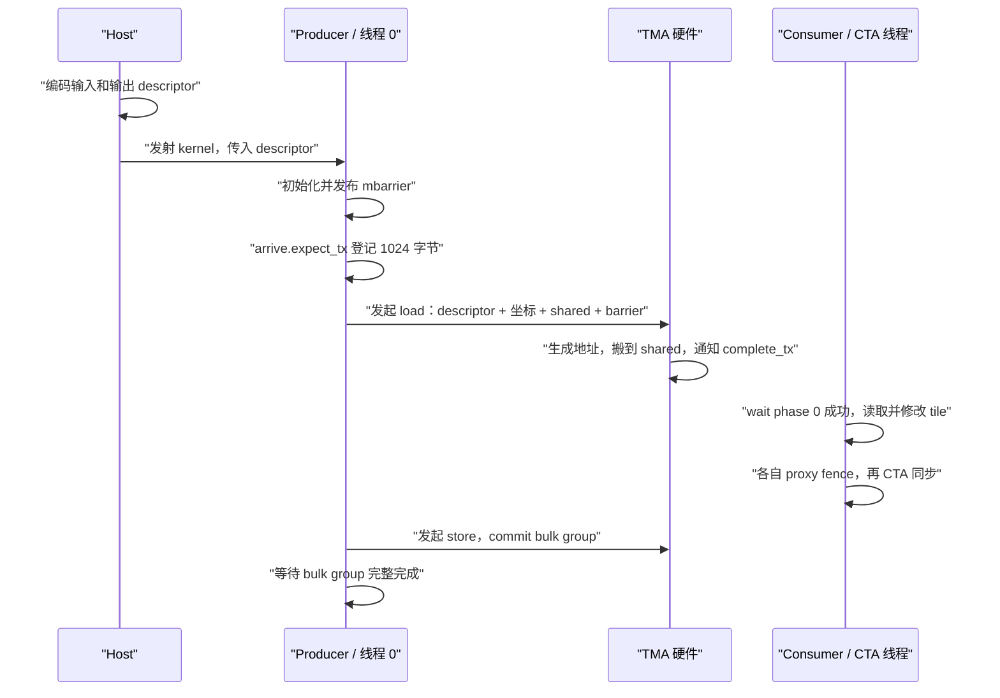
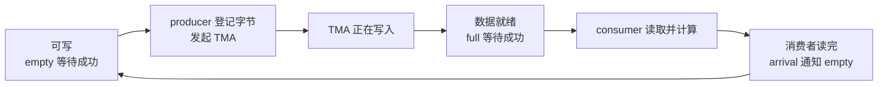

# CuTe TMA：从 SM90 PTX 指令开始

理解 TMA，先把三个问题分开：**硬件怎样找到数据、怎样发起搬运、怎样确认搬运完成。**

- **tensor map descriptor（张量映射描述符）** 保存 global tensor 的地址、形状、步幅和一次搬运的 box 等信息，是硬件生成地址和确定传输区域的依据。
- **TMA 指令**读取 descriptor 和本次坐标，发起 global 与 shared 之间的异步搬运。线程在发起后继续执行，通过完成协议确认数据就绪。
- **完成协议**由指令变体决定：SM90 的 global → shared load 使用 mbarrier；shared → global store 使用 bulk async-group。
- **fence（内存栅栏）** 建立内存访问的顺序或不同 proxy 之间的可见性。异步传输的完成由 mbarrier wait 或 bulk-group wait 确认。

本文先读 PTX 和 CuTe 的 arch 层封装，再从 CUTLASS 的 barrier、状态和 pipeline 理解异步执行的控制流。CUDA 官方 API 用一个例子作对应；随后分别阅读 `make_tma_atom` 和 `make_tma_copy` 两条路径，用具体实例化的 Traits、Atom 与 TiledCopy 串起 descriptor 构造、张量分区和指令发射。

## 源码位置与阅读范围

本地源码位于 `/home/huangxy/Projects/cutlass`，对应提交 `e406c186f510a15091cce01f782020ceb7ba8eb5`。下面的链接固定到该提交，避免后来版本改变接口。

| 源码 | 本文读取的内容 |
| --- | --- |
| [`include/cute/arch/copy_sm90_tma.hpp`](https://github.com/NVIDIA/cutlass/blob/e406c186f510a15091cce01f782020ceb7ba8eb5/include/cute/arch/copy_sm90_tma.hpp) | `SM90_TMA_LOAD/STORE`、multicast、reduce-add、线性 bulk copy，以及 store 的 fence、commit、wait。 |
| [`include/cute/arch/copy_sm90_desc.hpp`](https://github.com/NVIDIA/cutlass/blob/e406c186f510a15091cce01f782020ceb7ba8eb5/include/cute/arch/copy_sm90_desc.hpp) | `initialize_barrier`、`set_barrier_transaction_bytes`、`arrive_barrier`、`wait_barrier`；descriptor 类型、预取、修改和发布。 |
| [`include/cute/arch/cluster_sm90.hpp`](https://github.com/NVIDIA/cutlass/blob/e406c186f510a15091cce01f782020ceb7ba8eb5/include/cute/arch/cluster_sm90.hpp) | cluster barrier、CTA rank、远端 shared 地址和线程选举。 |
| [`include/cutlass/arch/barrier.h`](https://github.com/NVIDIA/cutlass/blob/e406c186f510a15091cce01f782020ceb7ba8eb5/include/cutlass/arch/barrier.h) | `ClusterBarrier`、`ClusterTransactionBarrier`，以及 `expect_tx`、`complete_tx`、`inval` 和初始化 fence。 |
| [`include/cutlass/pipeline/sm90_pipeline.hpp`](https://github.com/NVIDIA/cutlass/blob/e406c186f510a15091cce01f782020ceb7ba8eb5/include/cutlass/pipeline/sm90_pipeline.hpp) | Token、`PipelineState`、`PipelineTmaAsync`，以及 `PipelineAsync` / `PipelineTransactionAsync` 的控制协议。 |
| [`include/cute/atom/copy_traits_sm90_tma.hpp`](https://github.com/NVIDIA/cutlass/blob/e406c186f510a15091cce01f782020ceb7ba8eb5/include/cute/atom/copy_traits_sm90_tma.hpp) | TMA Traits、descriptor 构造、`make_tma_atom`、`make_tma_copy` 和 `tma_partition`。 |
| [`include/cute/atom/copy_atom.hpp`](https://github.com/NVIDIA/cutlass/blob/e406c186f510a15091cce01f782020ceb7ba8eb5/include/cute/atom/copy_atom.hpp) | `Copy_Atom`、`TiledCopy`、`ThrCopy` 的成员和分区接口。 |
| [`include/cute/algorithm/copy.hpp`](https://github.com/NVIDIA/cutlass/blob/e406c186f510a15091cce01f782020ceb7ba8eb5/include/cute/algorithm/copy.hpp) | 分区 Tensor 如何通过 `copy` 交给 Atom 执行。 |

**mbarrier 的 CuTe 封装位于 `copy_sm90_desc.hpp` 中**。`copy_sm90.hpp` 自身主要封装 `stmatrix`，末尾再包含 descriptor 和 TMA 头文件。

以下 PTX 代码使用语义化操作数名；`%0`、`%1` 等编号只在展示 C++ 内联汇编绑定时出现。PTX 是虚拟指令集，最终还要由工具链翻译成机器指令。

本文讨论 **Hopper / SM90 路径**，普通 load 的目标空间为 `shared::cluster`。同一源码中的 SM120 分支使用 `shared::cta`。

## 先读一条 TMA load

### 2D global → shared 的指令形式

`SM90_TMA_LOAD_2D::copy` 在 SM90 分支发出的指令是：

```ptx
cp.async.bulk.tensor.2d.shared::cluster.global.mbarrier::complete_tx::bytes.L2::cache_hint
    [dst_smem], [tensor_map, {coord0, coord1}], [mbar], cache_policy;
```

这条指令表达：按照 `tensor_map` 描述的规则，从 global tensor 的 `(coord0, coord1)` 开始取一个 box，写入 `dst_smem`；完成后按搬运字节数通知 `mbar`。

先拆开指令名字：

| 指令组成 | 含义 |
| --- | --- |
| `cp` | 执行拷贝。 |
| `async` | 发起后线程可以继续执行，搬运与线程后续指令异步推进。 |
| `bulk` | 整块数据传输；与 SM80 每线程搬 4/8/16 字节的普通 `cp.async` 区分。 |
| `tensor.2d` | 使用二维 tensor map 坐标生成地址。这里是 descriptor 的 TMA rank，不一定等于原始 CuTe Tensor 的逻辑 rank。 |
| `shared::cluster.global` | **目标空间在前、源空间在后**：从 global 搬到 cluster shared 地址空间。 |
| `mbarrier::complete_tx::bytes` | 采用 mbarrier 完成机制，硬件完成通知的单位是字节。 |
| `L2::cache_hint` | 存在最后一个 64 位缓存策略操作数；它是性能提示，不负责同步。 |

`shared::cluster` 指定目标地址空间。普通 load 的目标由 shared 地址确定；multicast load 的接收集合由 `multicast::cluster` 修饰符和 CTA mask 指定。普通 launch 的 cluster 大小可以是 1，此时目标位于当前 CTA 的 shared memory。

### 每个操作数是什么

| 操作数 | PTX 输入表示 | 参数含义与约束 |
| --- | --- | --- |
| `dst_smem` | CuTe 传入 32 位 shared 地址，绑定到 `"r"` | 本次搬运的 shared 目标起点，由 `cast_smem_ptr_to_uint` 将 C++ 指针转换为 shared 地址空间中的地址。SM90 tensor copy 的 shared 起点要求 128 字节对齐，swizzle 还要满足对应布局约束。 |
| `tensor_map` | 64 位 generic 地址，绑定到 `"l"` | **descriptor 对象的地址**。硬件从该对象读取已编码的 global 数据基地址、形状、步幅和 box 规则。对象须位于该 PTX 版本支持的 descriptor 存储空间中。 |
| `coord0`、`coord1` | 两个 `.s32` 坐标，绑定到 `"r"` | 在 descriptor 所定义维度上的起始元素坐标，单位为元素。例如从编号 3、宽度为 32 的 tile 开始搬运，列起始坐标为 `3 * 32`。 |
| `mbar` | CuTe 传入 32 位 shared 地址，绑定到 `"r"` | 接收完成通知的 mbarrier 对象地址。对象占 8 字节、要求 8 字节对齐，必须先初始化，并为本 phase 登记对应的 expected bytes。 |
| `cache_policy` | 64 位策略编码，绑定到 `"l"` | 本次指令使用的 L2 eviction（驱逐）策略。源码给出 `TMA::CacheHintSm90::EVICT_NORMAL/FIRST/LAST`。descriptor 内的 `l2Promotion` 则指定 promotion 粒度。 |

`[tensor_map, {coord0, coord1}]` 是 tensor 寻址操作数：方括号中组合了“描述符地址”和“起点坐标”，硬件据此应用 descriptor 的多维地址生成规则。

### C++ 参数怎样绑定到 PTX

CuTe 的真实接口为：

```cpp
SM90_TMA_LOAD_2D::copy(
    void const* desc_ptr,
    uint64_t* mbar_ptr,
    uint64_t cache_hint,
    void* smem_ptr,
    int32_t const& crd0,
    int32_t const& crd1);
```

去掉架构判断和日志后，函数内部的核心绑定如下：

```cpp
uint64_t gmem_int_desc = reinterpret_cast<uint64_t>(desc_ptr);
uint32_t smem_int_mbar = cast_smem_ptr_to_uint(mbar_ptr);
uint32_t smem_int_ptr = cast_smem_ptr_to_uint(smem_ptr);

asm volatile(
    "cp.async.bulk.tensor.2d.shared::cluster.global"
    ".mbarrier::complete_tx::bytes.L2::cache_hint"
    " [%0], [%1, {%3, %4}], [%2], %5;"
    :
    : "r"(smem_int_ptr), "l"(gmem_int_desc), "r"(smem_int_mbar),
      "r"(crd0), "r"(crd1), "l"(cache_hint)
    : "memory");
```

| 编号 | 对应输入 | 指令里的角色 |
| --- | --- | --- |
| `%0` | `smem_int_ptr` | shared 目标地址。 |
| `%1` | `gmem_int_desc` | descriptor 地址。 |
| `%2` | `smem_int_mbar` | mbarrier 地址。 |
| `%3`、`%4` | `crd0`、`crd1` | 两个起始元素坐标。 |
| `%5` | `cache_hint` | L2 策略。 |

`asm volatile` 保留汇编的副作用；`"memory"` clobber 告诉编译器汇编可能访问内存，约束编译器对相关内存访问的优化。**GPU 的访问顺序由 fence 指令建立，TMA 的完成由 mbarrier 或 bulk-group 协议确认。**

### 1D 到 5D 只改变坐标数

`SM90_TMA_LOAD_1D` 到 `SM90_TMA_LOAD_5D` 保持同一协议；`SM90_TMA_LOAD::copy` 按坐标数量分派：

| 变体 | 指令维度 | 坐标操作数 |
| --- | --- | --- |
| `SM90_TMA_LOAD_1D` | `.1d` | `{crd0}` |
| `SM90_TMA_LOAD_2D` | `.2d` | `{crd0, crd1}` |
| `SM90_TMA_LOAD_3D` | `.3d` | `{crd0, crd1, crd2}` |
| `SM90_TMA_LOAD_4D` | `.4d` | `{crd0, crd1, crd2, crd3}` |
| `SM90_TMA_LOAD_5D` | `.5d` | `{crd0, crd1, crd2, crd3, crd4}` |

descriptor rank、指令维度和坐标个数必须一致。每次调用都要给出 shared 起点和完成 barrier，但不单独传 box shape 或搬运字节数，因为这些由 descriptor 决定。

## descriptor 究竟描述什么

global 数据基地址、tensor 形状、字节步幅和 tile box 形状都预先编码进 **tensor map**。每次 load 再提供坐标、shared 目标地址和完成 barrier。

CuTe 的 `TmaDescriptor` 在普通 CUDA 12+ 编译路径下是 `CUtensorMap` 的别名；兼容路径使用 `alignas(64)` 的 128 字节不透明存储。其内部编码由 CUDA API 和 PTX 的专用字段操作维护。

### 从二维数组理解元素地址

先沿用前面 2D load 的两个坐标，给它们配一块具体数据。假设 global memory 中存放一个按行连续排列的 `float matrix[64][128]`：一共 64 行，每行 128 个元素，每个 `float` 占 4 字节。这里关闭 interleave 和 swizzle，每个元素都参与搬运。

我们用 `x` 表示列号、`y` 表示行号。PTX 中的 `(coord0, coord1)` 对应 `(x, y)`，C++ 中同一个元素写成 `matrix[y][x]`。第 0 维是列，因为沿着一行移动时，列坐标变化最快。

从 `matrix[0][0]` 的地址开始，找到任意一个 `matrix[y][x]`，只需要两步：

1. 向下移动 `y` 行。每行占 `128 * 4 = 512` 字节，因此增加 `y * 512` 字节。
2. 在这一行向右移动 `x` 列。每个元素占 4 字节，因此再增加 `x * 4` 字节。

把 `matrix[0][0]` 的字节地址记为 `base`，这两步写成公式就是：

$$
\operatorname{addr}(x,y)=\operatorname{base}+y\times512+x\times4.
$$

例如 `matrix[16][32]` 的地址是 `base + 16 * 512 + 32 * 4`，即从 `base` 向后移动 8320 字节。这里的 **512 是行步幅**：行坐标增加 1 时，地址增加 512 字节。列方向的步幅则是一个元素的大小，即 4 字节。

descriptor 保存 `base`、元素类型和行步幅。每条 TMA 指令提供本次的 `(x, y)`，硬件用这些信息算出读取起点。

### box 决定从起点取多大的区域

现在已经找到了 `matrix[16][32]`。接着需要告诉硬件：**从这里开始，取多少列、多少行。** 这个矩形区域称为 **box（搬运区域）**，它的各维大小保存在 descriptor 的 `boxDim` 中。

假设 box 宽 32、高 8，从该起点搬运的元素为：

| box 中的行 | global 中选中的元素 | 这一行的读取起点 |
| --- | --- | --- |
| 第 0 行 | `matrix[16][32]` 到 `matrix[16][63]` | `base + 16 * 512 + 32 * 4` |
| 第 1 行 | `matrix[17][32]` 到 `matrix[17][63]` | `base + 17 * 512 + 32 * 4` |
| 第 2～6 行 | 按同样规则读取 global 第 18～22 行的第 32～63 列。 | 每向下一行，读取起点增加 512 字节。 |
| 第 7 行 | `matrix[23][32]` 到 `matrix[23][63]` | `base + 23 * 512 + 32 * 4` |

因此，硬件在 global 中读取 **8 个各长 128 字节、行起点相隔 512 字节的区间**，共搬运 `8 * 32 * 4 = 1024` 字节。

**元素坐标选择起点，box 形状选择搬运范围，global 步幅决定范围内各行的实际地址。** 三者合起来，才完整描述这一条 TMA load 要读取的数据。

### 把例子对应到 descriptor 和指令参数

前面的具体数字对应如下：

| 信息 | 数值 | 含义与提供位置 |
| --- | --- | --- |
| 数据基地址 | `base` | `matrix[0][0]` 的 global 地址，编码进 descriptor。 |
| `globalDim` | `{128, 64}` | 完整数组的列数和行数，编码进 descriptor。 |
| `globalStrides` | `{512}` | 行方向的字节步幅，编码进 descriptor。列方向的连续元素步幅由元素类型确定。 |
| `boxDim` | `{32, 8}` | 本例一次取 32 列、8 行，编码进 descriptor。 |
| `elementStrides` | `{1, 1}` | 沿各维逐个取元素，编码进 descriptor。 |
| `tensorCoords` | `{32, 16}` | 本次读取的列、行起点，作为 `(coord0, coord1)` 传给 TMA 指令。 |

构造好这个 descriptor 后，传入 `{64, 16}` 就会取同样宽 32、高 8 的 box，起点变为 `matrix[16][64]`。这样，一个 descriptor 可以用于同一数组中多个起点的搬运。

TMA 指令还接收本次的 `dst_smem`，用于选择搬运结果放入哪个 shared buffer 或 pipeline stage。下面先把 descriptor 的构造参数逐项列出来，再看 shared 目标和完成字节数。

### `cuTensorMapEncodeTiled` 的参数

下面按调用顺序解释普通 tiled descriptor 的构造参数：

| 参数 | 类型 / 单位 | 含义 |
| --- | --- | --- |
| `tensorMap` | `CUtensorMap*` | 输出 descriptor；对象地址要求 64 字节对齐。 |
| `tensorDataType` | `CUtensorMapDataType` | 描述元素格式，例如 `FLOAT32`；决定地址换算、box 字节数及支持的操作。 |
| `tensorRank` | `uint32_t` | TMA rank，范围 1～5。 |
| `globalAddress` | device 数据指针 | global tensor 基地址。普通 SM90 tiled 路径至少要求 16 字节对齐。 |
| `globalDim` | `uint64_t[rank]`，元素 | 每维完整大小，最快变化维度在第 0 维；每维非零，最大为 $2^{32}$。 |
| `globalStrides` | `uint64_t[rank-1]`，字节 | 第 1 维及之后的 global 步幅。第 0 维连续元素步幅隐含，不传入；普通路径要求 16 字节倍数且小于 $2^{40}$。 |
| `boxDim` | `uint32_t[rank]`，元素跨度 | 一条指令沿各维遍历的范围，每维 1～256。无 interleave 时，`boxDim[0] * sizeof(T)` 要是 16 字节倍数。 |
| `elementStrides` | `uint32_t[rank]`，元素 | box 遍历的采样步长，范围 1～8。普通 CuTe tiled 构造路径使用全 1。 |
| `interleave` | `CUtensorMapInterleave` | global tensor 的 interleave 编码方式；本文使用 `NONE`。 |
| `swizzle` | `CUtensorMapSwizzle` | shared 布局的地址重排规则。load 写入与 store 读取必须使用匹配的 shared 布局。 |
| `l2Promotion` | `CUtensorMapL2promotion` | L2 promotion 粒度提示；与每次指令的 eviction `cache_policy` 不同。 |
| `oobFill` | `CUtensorMapFloatOOBfill` | load 越界填充策略。普通路径的 `NONE` 对越界位置补零，另一枚举用于特定浮点 NaN 策略。 |

`boxDim` 表示遍历跨度，`elementStrides` 表示采样步长，沿第 `i` 维通常取 `ceil(boxDim[i] / elementStrides[i])` 个元素。无 interleave 时，第 0 维按连续元素访问，`elementStrides[0]` 被忽略。本文后续字节数计算均假设全 1，此时 box 形状就是输出元素形状。

这些是普通 SM90 tiled 模式的约束；swizzle、interleave 和特殊数据格式还会增加要求。完整参数契约见 [CUDA Driver API：`cuTensorMapEncodeTiled`](https://docs.nvidia.com/cuda/cuda-driver-api/cuda_driver_api/group__CUDA__TENSOR__MEMORY.html)。

### shared 目标布局与传输字节数

继续看上面的 32 列、8 行 box。关闭 swizzle 时，TMA 把结果放进按行连续排列的 shared `float tile[8][32]`，其中 `tile[local_y][local_x]` 对应 global 的 `matrix[16 + local_y][32 + local_x]`。

global 中每行起点相隔 512 字节，shared 中每行占 `32 * 4 = 128` 字节。TMA 根据 descriptor 生成 global 各行的读取地址，将选中的 32 个元素逐行放入 shared box。

这次传输量为 `32 * 8 * sizeof(float) = 1024` 字节，后面的 mbarrier 完成协议就按这 1024 字节登记和等待。

打开 swizzle 后，元素的 shared 物理位置由 swizzled layout 计算，消费者须使用同一布局寻址。

三个地址的对齐要求分别是：**global 数据基地址至少 16 字节、tensor copy 的 shared 起点 128 字节、mbarrier 起点 8 字节。** 线性 bulk copy 的 shared 起点要求 16 字节对齐。SM90 tensor copy 的对齐表见 [CUDA TMA 对齐要求](https://docs.nvidia.com/cuda/archive/13.0.0/cuda-c-programming-guide/index.html#asynchronous-data-copies-using-tensor-memory-access-tma)。

### descriptor 的存放位置和生命周期

- **host 构造，kernel 参数传入**：通过 `const __grid_constant__ CUtensorMap` 之类的方式，让设备端使用参数空间中的 descriptor 地址。`__grid_constant__` 保持参数对象供整个 grid 使用，取址时使用该参数对象。
- **device global descriptor**：新一些的 PTX 支持把 descriptor 放在 global 并在设备端修改；需要正确发布到 tensormap proxy。后文单独说明。
- **shared descriptor**：设备端修改时的暂存对象。修改后，先将它复制并发布到 global descriptor，再把 global descriptor 地址传给 SM90 tensor copy。
- descriptor 在硬件读取它期间必须保持有效；它描述的 global 数据缓冲区也必须存活到相应传输完成。

**移动坐标、切换 shared stage 时复用原 descriptor；更换 global 基地址、形状、步幅或 box 规则时构造或合法更新 descriptor。**

## mbarrier：线程到达和数据完成分别记账

TMA load 的完成后缀告诉我们：必须提供一个可以接收 `complete_tx` 的对象。这个对象就是 shared memory 中的 **mbarrier**。

它至少维护三类逻辑状态：

| 状态 | 作用 | 谁推进 |
| --- | --- | --- |
| pending arrivals | 本 phase 还有多少次到达没有发生。 | 线程执行 `mbarrier.arrive` 或 `arrive.expect_tx` 等操作。 |
| tx-count | 本 phase 还有多少异步工作未完成。TMA load 路径以字节计数。 | 软件登记 expected bytes，TMA 完成时扣减 bytes。 |
| phase | 当前是哪一轮同步。 | 当到达与事务条件都满足时，barrier 自动进入下一 phase。 |

**phase 完成需要 pending arrivals 和 tx-count 都为零。** 线程的 arrive 操作推进到达计数，TMA 的 complete-tx 通知推进事务计数，两项条件共同决定 phase 完成。

### `mbarrier.init`：初始化到达计数

```ptx
mbarrier.init.shared::cta.b64 [mbar], arrival_count;
```

CuTe 封装是 `initialize_barrier(uint64_t& smem_barrier, int thread_count = 1)`。

| 参数 / 修饰符 | 含义 |
| --- | --- |
| `[mbar]` | 当前 CTA 的 shared barrier 地址；8 字节对象、8 字节对齐。 |
| `arrival_count` | 每个 phase 预期的 arrival 总数，32 位计数，合法范围 1～$2^{20}-1$。它由参与到达的线程及其协议规定的到达次数决定。 |
| `shared::cta` | barrier 存在当前 CTA 的 shared 空间。 |
| `b64` | barrier 对象的存储宽度为 64 位；输入的到达计数为 32 位。 |

初始化后第一轮 parity 为 0，pending arrivals 等于 `arrival_count`，事务计数为 0。

典型情形是一个 leader 负责登记并发起 load，128 个线程读取 shared 数据：**只要每 phase 只有 leader 执行一次 arrive，就应初始化为 1，即使有 128 个 waiter。**

初始化通常由一个线程执行，再通过适当的 fence 和 CTA / cluster 同步发布。其他线程在发布完成后开始使用 barrier。

### `mbarrier.arrive.expect_tx`：登记字节数，同时到达一次

```ptx
mbarrier.arrive.expect_tx.shared::cta.b64 state, [mbar], tx_bytes;
```

CuTe 的 `set_barrier_transaction_bytes(smem_barrier, bytes)` 实际发出：

```ptx
mbarrier.arrive.expect_tx.shared::cta.b64 _, [mbar], tx_bytes;
```

| 参数 | 类型 / 单位 | 含义 |
| --- | --- | --- |
| `state` 或 `_` | `.b64` 输出 / 丢弃输出 | 本次 arrive 所属 phase 的 opaque token，可作为 token-based wait 的输入；CuTe 用 `_` 丢弃它，采用 parity 等待。 |
| `[mbar]` | shared 地址 | 要登记并到达的 barrier。 |
| `tx_bytes` | `.u32`，字节 | 本次为当前 phase **增加**的 expected transaction bytes，按绑定到该 barrier 的传输量计算。 |

这条指令原子地组合两件事：**将 `tx_bytes` 加入事务计数，以及把 pending arrivals 减 1**。`set_barrier_transaction_bytes` 的准确作用就是“登记本次事务量并到达一次”。

对于前面的 1024 字节 tile，可以先执行 `arrive.expect_tx(..., 1024)`，再发起 TMA load。这样唯一的 arrival 已发生，但 barrier 仍会等硬件交回这 1024 字节。

**leader 的一次到达由 `set_barrier_transaction_bytes` 完成。** 初始化为 1 时，本 phase 的 arrival 配额随这次调用归零，随后等待已登记事务完成。

### `mbarrier.arrive`：只到达，不登记事务

```ptx
mbarrier.arrive.shared::cta.b64 state, [mbar];
```

CuTe 对应 `arrive_barrier(uint64_t& smem_barrier)`，在内部创建一个 `.b64 state` 寄存器并丢弃返回结果。

| 参数 | 含义 |
| --- | --- |
| `state` | 到达所属 phase 的 opaque token，可供非 parity 的 wait 使用。 |
| `[mbar]` | 本地 shared barrier 地址。 |

省略显式 count 时，这条指令把 pending arrivals 减 1，事务计数保持原值。它可以用于消费者释放 shared stage，或者在使用独立 `expect_tx` 的协议中完成 arrival。

### `mbarrier.try_wait.parity`：等待指定 phase 完成

```ptx
mbarrier.try_wait.parity.shared::cta.b64 done, [mbar], phase_parity;
```

CuTe 的 `wait_barrier(uint64_t& smem_barrier, int phase_bit)` 用这条指令构成循环，直到 `done` 为真。

| 参数 | 类型 | 含义 |
| --- | --- | --- |
| `done` | `.pred` 输出 | 被等待的 phase 已完成则为真，未完成则为假。 |
| `[mbar]` | shared 地址 | 当前 CTA 中被等待的本地 barrier 地址。 |
| `phase_parity` | `.b32`，取值 0/1 | **要等待的那一轮 phase 的 parity**。第一轮传 0，成功后说明 phase 0 已完成，barrier 已进入下一轮。 |

`try_wait` 可能暂时挂起线程，也可能在 phase 完成前返回假，因此单次调用不够，必须检查结果。PTX 还支持可选的 32 位 `suspendTimeHint`，单位是纳秒；CuTe 这个封装没有传入该参数。

源码中的这一指令形式默认使用 acquire 语义。成功观察完成后，等待线程可以按该同步协议使用 TMA 写入的数据。`test_wait` 立即返回测试结果，`try_wait` 可能暂时挂起线程。

**wait 检测 phase 完成，并在成功时建立 acquire 顺序；arrival count 保持原值。** consumer 可以仅承担等待和消费职责，因此同一个 barrier 支持一个 producer 到达、多名 consumer 等待。

### 独立的 expect、complete 和 inval

下面几条指令在 `cutlass/arch/barrier.h` 的 `ClusterTransactionBarrier` / `ClusterBarrier` 中有封装，适合补足指令模型：

```ptx
mbarrier.expect_tx.shared::cta.b64 [mbar], tx_bytes;
mbarrier.complete_tx.shared::cluster.relaxed.cluster.b64 [remote_mbar], tx_bytes;
mbarrier.inval.shared::cta.b64 [mbar];
```

| 指令 | 全部参数的含义 | 副作用与使用场景 |
| --- | --- | --- |
| `expect_tx` | `[mbar]` 是本地 barrier；`tx_bytes` 为 32 位事务计数，在本文 TMA 协议中单位为字节。 | 仅增加 expected bytes，不执行 arrival。如果拆开登记和到达，先登记，再允许最后一次 arrive 发生，避免空 phase 提前完成。 |
| `complete_tx` | `[remote_mbar]` 是 cluster shared 地址；`tx_bytes` 是完成计数。`relaxed.cluster` 是内存语义 / 作用范围，`shared::cluster` 是地址空间。 | 扣减事务计数，不代替 arrival。普通 TMA load 由硬件执行完成通知，软件不应重复扣减；手动调用用于其他受控事务协议。 |
| `inval` | `[mbar]` 是不再使用的 barrier 地址。 | 使对象失效。必须先保证没有未完成事务、等待或远端访问；若把这 8 字节改作其他用途，需要先 invalidate。 |

### 一轮 load 的状态变化

对于初始化为 1、传输 1024 字节的单 tile：

| 时刻 | 当前 parity | pending arrivals | tx-count | 数据与同步状态 |
| --- | --- | --- | --- | --- |
| `init(..., 1)` 后 | 0 | 1 | 0 | barrier 已初始化，等待 leader 登记事务并到达。 |
| `arrive.expect_tx(..., 1024)` 后 | 0 | 0 | 1024 | leader 已到达，等待 1024 字节的数据完成通知。 |
| 发起 TMA 指令后 | 0 | 0 | 尚未完成的字节数 | 硬件正在推进传输，consumer 等待 phase 0。 |
| 所有 1024 字节完成通知后 | 进入 1 | 重装为 1 | 0 | 成功等待 phase 0 的线程可以读取。 |

硬件可以逐步完成事务，表格只表示逻辑记账，不假设一条指令只触发一次不可分割的物理传输。

如果同一轮有 A、B 两次 load，共享一个 barrier：

$$
\operatorname{expectedBytes}
= \operatorname{bytes}(A) + \operatorname{bytes}(B).
$$

leader 只需一次 `arrive.expect_tx` 登记总量，再发起两条指令；arrival count 仍可以是 1。每条 load 的完成只扣除自己贡献的字节数。

计数按**本 phase 绑定到该 barrier 的所有指令实际传输字节数之和**计算。对于全 1 的 `elementStrides` 和常规元素类型，单条 tiled load 的字节数是各维 box 大小的乘积再乘 `sizeof(T)`；shared 分配中的 padding 按实际传输范围另行处理。

在普通 tiled load 中，global 越界部分也会向 shared 填充数据；expected bytes 按完整传输 box 计算，包含这些填充位置。每个 phase 登记的事务量还须满足 SM90 barrier 的计数范围。

### phase、stage 和缓冲区复用

**stage 是 shared 缓冲区槽位，phase 是某个 barrier 的使用轮次。** 例如双缓冲有两个 stage，各自持有一个 ready barrier；每个 barrier 的 parity 在自己被复用时才翻转。

```cpp
// 示意：单个 shared stage 串行复用，省略初始化和实际 load 参数。
int phase = 0;
for (int tile_idx = 0; tile_idx < tile_count; ++tile_idx) {
    if (threadIdx.x == 0) {
        cute::set_barrier_transaction_bytes(ready_barrier, tile_bytes);
        // 发起本轮 TMA load，并绑定 ready_barrier。
    }
    cute::wait_barrier(ready_barrier, phase);
    // 所有消费者读取 shared tile。
    __syncthreads();  // 所有消费者读完后，producer 才能覆盖同一 stage。
    phase ^= 1;
}
```

ready barrier 的完成表示“数据到达”。上面的 CTA 同步确认“所有消费者读完”，承担释放 stage 的职责；真正的 warp-specialized pipeline 常用另一组 empty / consumed barrier 完成反向通知。

如果消费者是异步 WGMMA，释放 stage 前先通过 WGMMA 完成协议确认其 shared 读取结束，再将 stage 交给下一轮 TMA。`__syncthreads()` 负责 CTA 线程的会合。

parity 只有一位，wait 的有效目标为当前 phase 或紧邻的上一 phase。协议通过 stage 释放控制 producer 的推进，并保证每轮至少成功检测一次完成，再进行下一轮 arrival；这些规则见 [PTX 的 mbarrier phase 规则](https://docs.nvidia.com/cuda/archive/12.1.1/parallel-thread-execution/index.html#parallel-synchronization-and-communication-instructions-mbarrier)。

## fence：把可见性和完成等待分开

### generic、async 和 tensormap proxy

PTX 用 **proxy（访问代理）** 区分不同方式发起的内存访问。与本题直接相关的有：

| proxy | 本文中的访问 |
| --- | --- |
| generic proxy | 线程普通 load/store，例如 C++ 代码写 shared。 |
| async proxy | TMA 执行 bulk 数据搬运时读写内存。 |
| tensormap proxy | 硬件读取 descriptor，用其生成 tensor 地址。 |

同一块物理内存，跨 proxy 访问时仍需要相应的顺序保证。下面三类 fence 的目的不同：发布 barrier 初始化、发布 shared 数据、发布修改后的 descriptor。

### `fence.proxy.async.shared::cta`：把 shared 写入交给 async 访问

```ptx
fence.proxy.async.shared::cta;
```

CuTe 对应 `tma_store_fence()`，CUTLASS 也有 `fence_view_async_shared()`。

| 修饰符 / 参数 | 含义 |
| --- | --- |
| `proxy.async` | 在 generic 和 async proxy 的访问之间建立顺序。 |
| `shared::cta` | 指定 fence 约束的**地址空间**：当前 CTA 的 shared memory。线程间的会合由 CTA 同步操作完成。 |
| 无操作数 | 不传 buffer 指针、长度或 barrier；约束作用于该线程相应的内存访问。 |

典型使用场景是：线程先普通 store 到 shared，之后 TMA store 要从 shared 读取这些结果。多线程共同写 buffer 时，采用：

```cpp
// 每个 producer 先写自己负责的 shared 数据。
smem_tile[threadIdx.x] = value;
cute::tma_store_fence();  // 每个写入线程建立自己的跨 proxy 顺序。
__syncthreads();          // leader 等所有写入线程完成写入和 fence。
if (threadIdx.x == 0) {
    // leader 发起 TMA store。
}
```

每个 producer 为自己的 shared 写入建立跨 proxy 顺序，CTA 同步再将所有 producer 的进度汇合到 leader。上面这组“各自 fence → 集体同步 → leader 发起”的组合与 [CUDA 的 TMA 示例](https://docs.nvidia.com/cuda/archive/13.0.0/cuda-c-programming-guide/index.html#asynchronous-data-copies-using-tensor-memory-access-tma) 一致。

这个 fence 也可用于单 CTA 场景下让 barrier 初始化对 async proxy 可见；因此 `tma_store_fence` 虽以 store 命名，其实际指令的用途不限于输出 store。

load 的完成包含隐含的 generic–async proxy fence；consumer 通过正确的 acquire wait 观察完成后，即可用普通 shared load 读取结果。这个完成规则见 [PTX：Async Proxy](https://docs.nvidia.com/cuda/archive/12.1.1/parallel-thread-execution/index.html#async-proxy)。

### `fence.mbarrier_init.release.cluster`：发布初始化

```ptx
fence.mbarrier_init.release.cluster;
```

它在 `cutlass/arch/barrier.h` 中由 `cutlass::arch::fence_barrier_init()` 封装。

| 修饰符 / 参数 | 含义 |
| --- | --- |
| `mbarrier_init` | fence 约束的操作是先前的 barrier 初始化。 |
| `release` | 建立初始化发布所需的 release 顺序。 |
| `cluster` | 发布顺序的作用范围覆盖 cluster。 |
| 无操作数 | 可以批量初始化多个 barrier 后 fence 一次，不需要逐个传 barrier 地址。 |

CUTLASS 的源码注释明确要求它与合适范围的同步组合。例如：

```cpp
if (threadIdx.x == 0) {
    cute::initialize_barrier(ready_barrier, 1);
    cutlass::arch::fence_barrier_init();
}
cute::cluster_sync();  // cluster 的所有线程执行，之后再访问接收 CTA 的 barrier。
```

这里的 fence 发布本线程完成的 barrier 初始化，cluster 同步汇合各 CTA 的初始化进度；随后发起的 TMA load 通过 mbarrier wait 确认完成。

### 三种动作解决三个问题

| 动作 | 直接效果 | 配合的操作 |
| --- | --- | --- |
| proxy / init fence | 建立先前 shared 写入或 barrier 初始化与后续相关访问之间的顺序。 | 用 CTA / cluster 同步汇合参与线程的进度。 |
| `__syncthreads()` / `cluster_sync()` | 参与线程在指定范围内会合，并建立对应的线程间内存顺序。 | 用 mbarrier / bulk-group wait 确认异步工作达到完成条件。 |
| mbarrier wait / bulk-group wait | 执行等待的线程观察到异步工作的相应完成阶段。 | 用消费者释放协议确认 shared 可复用；用线程间同步传递等待结果。 |

fence 的选择由数据流决定：shared producer 写入接 TMA 读取时使用 async proxy fence，barrier 初始化接远端使用时发布初始化，descriptor 修改接硬件读取时使用 tensormap 发布协议。

## TMA store：shared → global 使用 bulk group

### store 指令和参数

`SM90_TMA_STORE_2D::copy` 发出：

```ptx
cp.async.bulk.tensor.2d.global.shared::cta.bulk_group
    [tensor_map, {coord0, coord1}], [src_smem];
```

| 参数 / 修饰符 | 含义 |
| --- | --- |
| `global.shared::cta` | 目标 global，源为当前 CTA shared。 |
| `[tensor_map, {coord0, coord1}]` | 描述**目标 global tensor**的 descriptor，以及目标起始元素坐标。 |
| `[src_smem]` | shared 源 box 的起点，CuTe 转为 32 位 shared 地址；要求 128 字节对齐，并与 descriptor 的 shared 布局规则一致。 |
| `bulk_group` | 使用发起线程的 bulk async-group 跟踪完成，不接收 mbarrier 地址。 |

真实封装参数顺序是 `copy(desc_ptr, smem_ptr, crd0, crd1)`；1D～5D 变体仍然只改变坐标数量。

边界规则也要按方向区分：load 起点可以包含负坐标，越界位置按填充策略处理；store 要求各起始坐标非负，写入范围限于目标 tensor 的有效区域。本例所有坐标均在范围内。

每个 descriptor 保存一个 global tensor 基地址。输入和输出位于两块 allocation 时，分别准备对应 descriptor，或按更新协议切换其中的基地址。

### `cp.async.bulk.commit_group`：提交本线程发起的工作

```ptx
cp.async.bulk.commit_group;
```

CuTe 的 `tma_store_arrive()` 和 `tma_desc_commit_group()` 都发出这条指令。

- **没有操作数。** 对这里的 store 协议，它把当前线程先前发起、尚未提交的 bulk-group 操作加入一个新 group。
- group 是 **per-thread（每线程）** 的，归属于发起并提交这些操作的线程。
- 一次 commit 可以包含多条 store；group 内各条异步访问独立推进，通过 group wait 统一确认相应完成条件。
- **`tma_store_arrive()` 的实际操作是提交 bulk group**，对应 `cp.async.bulk.commit_group`。

发起 store、commit 和 wait 由同一个 leader 负责。例如线程 0 发起并提交 store，线程 0 随后等待自己的 group，再通过线程间同步向其他线程传递结果。

tensor load 的 **descriptor 读取结束**还可以由 bulk group 单独跟踪，供后续修改 descriptor 使用；load 的数据搬运完成由 mbarrier 跟踪。后文会解释 `tma_desc_commit_group` / `tma_desc_wait_group` 的作用。

### `.read` 等待和完整等待

```ptx
cp.async.bulk.wait_group.read N;
cp.async.bulk.wait_group N;
```

| 参数 / 变体 | 含义 |
| --- | --- |
| `N` | 编译期非负整数常量，表示允许最新的至多 N 个已提交 group 尚未达到相应完成条件。其余更早的 group 必须达到该条件，group 数量由 commit 次数确定。 |
| `.read N` | 等待更早 group 完成源读取。对 TMA store 来说，可以在这之后复用其 shared 源。 |
| 不带 `.read` 的 `N` | 等待更早 group 的读、写均完成，且写入对执行 wait 的线程可见。 |
| `N = 0` | 要求此前提交的所有 group 满足对应条件。 |

CuTe 的 `tma_store_wait<Count>()` 发出 **`cp.async.bulk.wait_group.read Count`**，模板参数通过 `"n"` 绑定为立即数。它确认较早 group 的源读取结束，使这些 group 使用的 shared 源可以进入复用流程。需要 global 输出时，发起线程使用完整 wait 确认写入完成，再向其他读取线程传递可见性。

例如已提交 `G0`、`G1`、`G2` 三组后，`.read 1` 可以允许最新的 `G2` 仍在读取源，而要求更早的 `G0`、`G1` 读完。只有 `.read 0` 才能据此释放所有这些 group 使用的 shared 源。

如果同一 kernel 内接着读取 global 输出，应等待完整写入；其他线程读取时还需要适当的线程间同步来传递可见性。`.read` 与完整 wait 的语法可见 [CCCL：`cp.async.bulk.wait_group`](https://nvidia.github.io/cccl/unstable/libcudacxx/ptx/instructions/cp_async_bulk_wait_group.html)，完成条件由 [PTX 指令语义](https://docs.nvidia.com/cuda/archive/12.1.1/parallel-thread-execution/index.html#data-movement-and-conversion-instructions-cp-async-bulk-wait-group) 定义。

### store 的完整调用顺序

1. producer 线程通过普通 store 写 shared buffer。
2. 每个写入线程执行 `fence.proxy.async.shared::cta`。
3. producer 与 leader 做适当同步；如果整个 CTA 参与，可用 `__syncthreads()`。
4. leader 发起一条或多条 TMA store。
5. 同一 leader 执行 `cp.async.bulk.commit_group`。
6. 复用 shared 源之前，leader 等待相应 `.read` 完成；同 kernel 需要 global 结果时，等待完整写入。
7. 若其他线程要覆盖 shared 源或读取 global 结果，再通过适当同步把 leader 的等待结果传给它们。

## 一个从 descriptor 到 load / store 的 2D 示例

下面示例只处理一个 tile：从 row-major `float[64][128]` 的 `(x=32, y=16)` 位置读取宽 32、高 8 的区域，每个元素加 1，再写到另一块同形状 global tensor 的同一位置。

关闭 swizzle；一个 CTA、128 个线程；只有线程 0 登记 expected bytes 和发起 TMA。代码直接使用 arch 层函数，便于把调用与前面的 PTX 对齐。

### host 构造 descriptor

以下代码块与下一节 kernel 放在同一个 `.cu` 文件中即可编译。这里不包含内存分配和 `main`；调用方需要准备两块设备缓冲区。

```cpp
#include <cuda.h>
#include <cuda_runtime.h>
#include <cstdint>
#include <stdexcept>
#include <string>
#include <cute/arch/copy_sm90_tma.hpp>

constexpr int kGlobalWidth = 128;
constexpr int kGlobalHeight = 64;
constexpr int kTileWidth = 32;
constexpr int kTileHeight = 8;
constexpr uint32_t kTileBytes = kTileWidth * kTileHeight * sizeof(float);

/**
 * @brief 为 row-major float[64][128] 编码宽 32、高 8 的 tiled tensor map。
 * @param device_ptr 借用的设备数据指针；对应 allocation 在传输结束前必须有效。
 * @return host 端构造的 descriptor，随后以 grid-constant kernel 参数传入。
 */
CUtensorMap make_tensor_map(float* device_ptr) {
    alignas(64) CUtensorMap tensor_map{};
    uint64_t global_dim[2] = {kGlobalWidth, kGlobalHeight};
    uint64_t global_strides[1] = {kGlobalWidth * sizeof(float)};
    uint32_t box_dim[2] = {kTileWidth, kTileHeight};
    uint32_t element_strides[2] = {1, 1};

    CUresult result = cuTensorMapEncodeTiled(
        &tensor_map, CU_TENSOR_MAP_DATA_TYPE_FLOAT32, 2, device_ptr,
        global_dim, global_strides, box_dim, element_strides,
        CU_TENSOR_MAP_INTERLEAVE_NONE,
        CU_TENSOR_MAP_SWIZZLE_NONE,
        CU_TENSOR_MAP_L2_PROMOTION_NONE,
        CU_TENSOR_MAP_FLOAT_OOB_FILL_NONE);
    if (result != CUDA_SUCCESS) {
        throw std::runtime_error(
            "cuTensorMapEncodeTiled 失败，CUresult=" +
            std::to_string(static_cast<int>(result)));
    }
    return tensor_map;
}
```

输入输出分别调用 `make_tensor_map`，因为 descriptor 内包含各自的 global 基地址。这里 host 选择 `L2_PROMOTION_NONE`；当前 CuTe 普通构造路径默认选择 `L2_128B`，这不改变本例的同步协议。

### kernel 发起 load，等待读取，修改后发起 store

```cpp
/**
 * @brief 单 CTA 将一个 32 x 8 tile 加 1 后写到输出 tensor。
 * @param input_map 输入 global tensor 的 descriptor，借用其设备缓冲区。
 * @param output_map 输出 global tensor 的 descriptor，借用另一设备缓冲区。
 * @param tile_x 列方向起始元素坐标；调用方保证整个 tile 在范围内。
 * @param tile_y 行方向起始元素坐标；调用方保证整个 tile 在范围内。
 * @details 固定以 <<<1, 128>>> 发射；所有线程参与 CTA 同步和 shared 消费。
 */
__global__ void tmaTileAddOneKernel(
    const __grid_constant__ CUtensorMap input_map,
    const __grid_constant__ CUtensorMap output_map,
    int tile_x,
    int tile_y) {
    __shared__ alignas(128) float tile[kTileHeight][kTileWidth];
    __shared__ alignas(8) uint64_t ready_barrier;

    if (threadIdx.x == 0) {
        cute::initialize_barrier(ready_barrier, 1);
        // 发布初始化到 async proxy；函数名虽是 store fence，指令适用于此处。
        cute::tma_store_fence();
    }
    __syncthreads();  // 全体线程在使用 barrier 前看到初始化。

    if (threadIdx.x == 0) {
        // 同时登记 1024 expected bytes，并完成唯一的一次 arrival。
        cute::set_barrier_transaction_bytes(ready_barrier, kTileBytes);
        cute::SM90_TMA_LOAD_2D::copy(
            &input_map, &ready_barrier,
            static_cast<uint64_t>(cute::TMA::CacheHintSm90::EVICT_NORMAL),
            tile, tile_x, tile_y);
    }

    // 等待 phase 0 完成；所有读取 shared 的线程都执行 acquire wait。
    cute::wait_barrier(ready_barrier, 0);
    for (int idx = threadIdx.x; idx < kTileWidth * kTileHeight;
         idx += blockDim.x) {
        tile[idx / kTileWidth][idx % kTileWidth] += 1.0f;
    }

    // 每个写入线程先 fence，然后 leader 等待全体 producer 就绪。
    cute::tma_store_fence();
    __syncthreads();
    if (threadIdx.x == 0) {
        cute::SM90_TMA_STORE_2D::copy(
            &output_map, tile, tile_x, tile_y);
        cute::tma_store_arrive();  // 将本线程发起的 store 提交为 bulk group。

        // 本例选择完整完成等待；CuTe tma_store_wait<0>() 只会等待 .read。
        asm volatile("cp.async.bulk.wait_group 0;" ::: "memory");
    }
    __syncthreads();  // 保持整个 CTA 的 shared 生命周期至 leader 等待完成。
}
```

本例使用一个 shared stage 和一轮 load，等待 phase 0 后完成消费与 store。若改成流水线，需为每个 stage 跟踪 phase，并通过消费者释放协议安排复用。

发射侧调用示意如下：

```cpp
// 前置条件：已建立 CUDA context；d_input/d_output 为不同的设备 allocation。
// 输出未覆盖的位置是否保留，由调用方自行初始化或定义。
CUtensorMap input_map = make_tensor_map(d_input);
CUtensorMap output_map = make_tensor_map(d_output);
tmaTileAddOneKernel<<<1, 128>>>(input_map, output_map, 32, 16);
cudaError_t launch_status = cudaGetLastError();
if (launch_status != cudaSuccess) {
    throw std::runtime_error(cudaGetErrorString(launch_status));
}
// 在 host 验证输出、释放 allocation 之前，需要等待所在 stream 完成并检查错误。
```

编译上面的 host 构造和 kernel 定义：

```shell
nvcc -std=c++17 -arch=sm_90 \
  -I/home/huangxy/Projects/cutlass/include \
  -c tma_tile.cu -o tma_tile.o
```

链接调用这些函数的完整程序时还要链接 CUDA Driver API，例如添加 `-lcuda`。编译检查验证工具链能生成相应指令；设备端正确性需要在支持 TMA 的 GPU 上运行并比较输出。

调用与硬件职责可以画成：



图里 descriptor 只负责地址规则；mbarrier 跟踪 load 的完成；store 的 bulk group 则由发起线程自己提交和等待。

## 线性 bulk copy：什么时候不需要 descriptor

**`.tensor` 形式以 descriptor 和元素坐标描述传输区域；线性 bulk 形式以数据地址和字节长度描述连续区间。**

### global → shared 的线性形式

`SM90_BULK_COPY_G2S::copy(gmem_ptr, mbar_ptr, smem_ptr, load_bytes)` 发出：

```ptx
cp.async.bulk.shared::cluster.global.mbarrier::complete_tx::bytes
    [dst_smem], [src_gmem], size_bytes, [mbar];
```

| 参数 | 类型 / 含义 |
| --- | --- |
| `dst_smem` | 32 位 shared 目标地址，16 字节对齐。 |
| `src_gmem` | 64 位 global 数据地址，16 字节对齐；这里才是数据指针本身。 |
| `size_bytes` | 32 位字节数，源码接口使用 `int32_t load_bytes`；合法传输长度为非负的 16 字节倍数。 |
| `mbar` | shared barrier 地址，8 字节对齐；登记的 expected bytes 必须匹配 `size_bytes`。 |

它按起点地址和字节长度异步复制一个连续区间，并通过 mbarrier 的字节计数确认完成。

### shared → global 的线性形式

`SM90_BULK_COPY_S2G::copy(smem_ptr, gmem_ptr, store_bytes)` 发出：

```ptx
cp.async.bulk.global.shared::cta.bulk_group
    [dst_gmem], [src_smem], size_bytes;
```

`dst_gmem` 是 64 位 global 目标数据地址，`src_smem` 是 32 位 shared 源地址，`size_bytes` 是 32 位、16 字节倍数的传输长度。前后的 shared proxy fence、commit、wait 协议与 TMA store 相同。

前面的 2D tile 在 global 中由八个带行间隔的区间组成，适合用 descriptor 表达逐行取数。线性 bulk copy 适用于源和目标都满足连续区间条件的传输。

## multicast：一条 load 通知多个接收 CTA

### 指令与 mask

`SM90_TMA_LOAD_MULTICAST_2D::copy` 发出：

```ptx
cp.async.bulk.tensor.2d.shared::cluster.global.mbarrier::complete_tx::bytes.multicast::cluster.L2::cache_hint
    [dst_smem], [tensor_map, {coord0, coord1}], [mbar], cta_mask, cache_policy;
```

除了普通 load 的 shared 地址、descriptor、两个元素坐标、barrier 和 cache policy，多了一个 **16 位 `cta_mask`**，由 C++ `uint16_t multicast_mask` 通过 `"h"` 传入。

| 参数 / 修饰符 | 含义 |
| --- | --- |
| `multicast::cluster` | 把同一份 global 数据送到同一 cluster 内选定 CTA。 |
| `cta_mask` | cluster 内接收 CTA 的位集合：bit `r` 置 1 表示选择 cluster rank 为 `r` 的 CTA。 |
| `dst_smem` | 数据写到各接收 CTA shared 中**相同偏移**的位置。 |
| `mbar` | 完成通知也到各接收 CTA shared 中**相同偏移**的 barrier。 |

例如 `cta_mask = 0b0101` 选择 cluster rank 0 和 2。mask 宽度为 16 位，实际可选 rank 由本次 launch 的 cluster 大小决定；cluster 大小须满足设备和 launch 配置的要求。

### 接收侧也要完整初始化和记账

1. 每个接收 CTA 都准备对应 shared buffer 与 barrier，保证偏移匹配。
2. 各 CTA 初始化并发布自己的 barrier；cluster 同步确保目标 CTA 已就绪。
3. 每个接收 barrier 都登记本轮要收到的字节数，并完成其预期 arrival。
4. 选定 producer 发起 multicast load。
5. 每个接收 CTA 在自己的本地 barrier 上等待，成功后消费数据。
6. 保证接收 CTA 和 shared 对象在远端访问结束前保持存活；退出前按协议同步。

一条 1024 字节的 load 发给两个 CTA，每个 CTA 接收 1024 字节，各接收 barrier 分别登记 **1024 字节**。若同一轮包含多个分片，每个接收 barrier 登记自己实际收到的所有分片字节之和。

CuTe 的 `num_multicast`、`cta_layout` 还可能影响逻辑 tile 的分片和 descriptor box 大小。**mask 决定接收集合；descriptor 决定这条物理指令搬多少数据。** 每条底层指令的事务量按其实际 box 计算，逻辑 tile 总量由各分片组合得到。

### cluster 同步与地址辅助指令

`cluster_sm90.hpp` 中相关操作为：

```ptx
barrier.cluster.arrive.aligned;
barrier.cluster.arrive.relaxed.aligned;
barrier.cluster.wait.aligned;
mapa.shared::cluster.u32 remote_addr, local_addr, cta_rank;
mov.u32 rank, %cluster_ctarank;
```

| 指令 / CuTe 封装 | 参数或修饰符的含义 |
| --- | --- |
| `cluster_arrive()` | 无操作数；默认 release，标记到达，不等待全 cluster。 |
| `cluster_arrive_relaxed()` | 无操作数；`relaxed` 标记控制流到达，需要发布先前内存访问时，另行建立对应顺序。 |
| `cluster_wait()` | 无操作数；默认 acquire，等待 cluster 的线程完成 arrival。 |
| `cluster_sync()` | 依次调用普通 arrive 和 wait；`aligned` 要求同一 warp 的线程一致执行，调用处须满足 cluster 的集体同步协议。 |
| `set_block_rank(local_addr, cta_rank)` | `local_addr` 是本 CTA 的 32 位 shared 地址，`cta_rank` 是目标 cluster rank；`mapa` 输出相同 shared 偏移对应的远端地址 `remote_addr`。 |
| `block_rank_in_cluster()` | 输出 32 位 rank，来源是特殊寄存器 `%cluster_ctarank`。 |

cluster barrier 协调线程；multicast load 的数据是否就绪仍由 mbarrier 完成协议决定。

### `elect.sync`：在一个 warp 内选举发起线程

同一头文件的 `elect_one_sync()` 使用：

```ptx
elect.sync leader_lane | is_leader, member_mask;
```

`member_mask` 是参与选举的 32 位 warp lane 集合，`leader_lane` 输出被选中线程的 lane id，`is_leader` 是仅在该线程上为真的 predicate。`.sync` 要求 mask 内线程共同执行选举。CuTe 封装使用 `0xffffffff`，返回是否被选中。

这是**每 warp 选一个线程**。如果整个 CTA 的四个 warp 都选举并直接发起同一条 load，就可能发起四次；通常还要限制 `warp_idx == 0`。前面的教学 kernel 直接使用 `threadIdx.x == 0`，明确只有一个 CTA leader。

### 远端 shared store 也能通知同一种 barrier

`store_shared_remote(value, smem_addr, mbarrier_addr, dst_cta_rank)` 先用 `mapa` 映射远端地址，再发出：

```ptx
st.async.shared::cluster.mbarrier::complete_tx::bytes.u32
    [remote_dst], value, [remote_mbar];
```

`remote_dst` 和 `remote_mbar` 是目标 CTA 的 32 位 cluster shared 地址，`value` 是要写入的 32 位值。这条远端异步 store 直接使用目标地址和数值，完成时向目标 barrier 贡献 4 字节的 complete-tx。目标 CTA 须保持存活，barrier 须先初始化、登记这 4 字节，并由参与线程完成协议规定的 arrival。

## reduce-add：把 shared 数据归约到 global

`SM90_TMA_REDUCE_ADD_2D::copy(desc_ptr, smem_ptr, crd0, crd1)` 发出：

```ptx
cp.reduce.async.bulk.tensor.2d.global.shared::cta.add.bulk_group
    [tensor_map, {coord0, coord1}], [src_smem];
```

| 参数 / 修饰符 | 含义 |
| --- | --- |
| `tensor_map` | 描述目标 global tensor；元素格式也来自 descriptor。 |
| `coord0`、`coord1` | 目标 box 的起始元素坐标。 |
| `src_smem` | 要加入目标的 shared 数据，布局与 descriptor 对应。 |
| `reduce`、`add` | 对目标元素执行加法归约，而非普通覆盖写入。适用于多个贡献累加到同一输出。 |
| `bulk_group` | 仍由发起线程 commit / wait；不接收 load 的 mbarrier 参数。 |

1D～5D 变体只改变坐标数量。shared 源的 producer fence、同步和源复用规则与 TMA store 相同。

归约的原子更新粒度是**单个目标元素**，各元素的更新独立推进。需要消费完整 tile 时，通过完成与同步协议确认整个输出就绪。descriptor 数据类型和 add 操作的组合须符合硬件要求。

## 两种 prefetch：预取 descriptor 和预取数据

### `prefetch.tensormap` 预取地址规则

```ptx
prefetch.tensormap [tensor_map];
```

CuTe 对应 `prefetch_tma_descriptor(TmaDescriptor const* desc_ptr)`。唯一参数是 descriptor 的 64 位 generic 地址；它预取 tensor map 元数据，不指定 tile 坐标，不把数据写入 shared。

### `cp.async.bulk.prefetch.tensor` 预取 tensor 数据到 L2

```ptx
cp.async.bulk.prefetch.tensor.2d.L2.global
    [tensor_map, {coord0, coord1}];
```

对应 `SM90_TMA_LOAD_2D::PREFETCH::copy(desc_ptr, crd0, crd1)`：descriptor 决定 box，两个 `.s32` 坐标选择起点，`L2.global` 指定将 global 数据预取到 L2。后续 load 从 global 搬到 shared，并使用自己的完成协议。

线性 bulk prefetch 的指令为：

```ptx
cp.async.bulk.prefetch.L2.global [src_gmem], size_bytes;
```

它对应 `SM90_BULK_COPY_G2S::PREFETCH`，参数是 64 位 global 数据地址和 32 位字节数，地址和长度都满足 16 字节约束。

**prefetch 是请求硬件提前缓存元数据或数据的性能提示。** 真正的 shared 数据传输由 load 发起并等待完成；修改后的 descriptor 通过 tensormap 发布协议交给硬件使用。缓存提示的实际执行由硬件决定。

## 设备端修改 descriptor：tensormap fence 的用途

前面的基本流程在 host 编码 descriptor，然后把稳定的 descriptor 传给 kernel。只有设备端更换 global 地址、shape 或 stride 等场景，才需要进一步理解这一组修改与发布指令。

当前 CUTLASS 为这些封装使用 `CUTE_ARCH_DEVICE_MODIFIABLE_TMA_SM90_ENABLED` 门控：CUDA 12.3+，并在 Hopper 路径要求架构特定特性宏，通常以 `sm_90a` 编译。普通 TMA load/store 的 Hopper 编译目标为 `sm_90`；descriptor 修改封装按上述门控启用。

### `tensormap.replace` 修改指定字段

```ptx
tensormap.replace.tile.global_address.global.b1024.b64
    [global_desc], new_global_address;
tensormap.replace.tile.global_address.shared::cta.b1024.b64
    [shared_desc], new_global_address;
tensormap.replace.tile.global_dim.shared::cta.b1024.b32
    [shared_desc], dim_index, new_dim;
tensormap.replace.tile.global_stride.shared::cta.b1024.b64
    [shared_desc], stride_index, new_stride;
```

| 参数 / 修饰符 | 含义 |
| --- | --- |
| `global_desc` / `shared_desc` | 被修改的 descriptor 对象在 global / shared 中的地址。CuTe 对 shared 地址进行 shared-space 转换。 |
| `new_global_address` | 64 位新 global 数据基地址。来源是 CuTe helper 的 `new_tensor_ptr`。 |
| `dim_index`、`new_dim` | 立即数字段索引和 32 位新维度大小；CuTe 修改 dim 索引 0～4，大小单位为元素。 |
| `stride_index`、`new_stride` | 立即数 global stride 字段索引和 64 位编码值；CuTe 修改字段索引 0～3，分别对应 tensor 第 1～4 维。第 0 维连续步幅不存储。 |
| `tile` | 修改 tiled tensor map 的字段。 |
| `b1024` | 被修改的 tensor map 对象总宽度为 1024 bit，即 128 字节。 |
| 末尾 `b32` / `b64` | 新字段值的操作数位宽，分别为 32 位或 64 位；descriptor 对象整体为 1024 位。 |

CuTe 对应 `tma_descriptor_replace_addr_in_global_mem`、`tma_descriptor_replace_addr_in_shared_mem` 和 `tma_descriptor_replace_dims_strides_in_shared_mem`。

最后一个 helper 接收 `prob_shape[5]` 与 `prob_stride[5]`：shape 按维度顺序，stride 按 tensor 维度顺序保存字节步幅，修改时使用 `prob_stride[1..4]`。当前源码在 CUDA 12.5+ 直接传 byte stride；早期工具链传 `prob_stride[d] >> 4`，因为编码省略最低 4 位。**stride 操作数的编码方式由工具链版本决定。**

### global 直接修改后的 release / acquire

```ptx
fence.proxy.tensormap::generic.release.gpu;
fence.proxy.tensormap::generic.acquire.gpu [global_desc], 128;
```

分别对应 `tma_descriptor_fence_release()` 和 `tma_descriptor_fence_acquire(desc_ptr)`。

| 参数 / 修饰符 | 含义 |
| --- | --- |
| `tensormap::generic` | 为 generic 侧写入与后续 tensormap 侧读取建立跨 proxy 发布协议。 |
| `release` | 修改线程在字段更新之后发布这些 descriptor 写入；没有显式操作数。 |
| `acquire` | 使用线程在读取 descriptor 之前接收对应发布；跨线程使用时，先由线程间通知建立与修改方 release 的同步关系。 |
| `gpu` | 此发布协议的线程作用范围为 GPU。 |
| `[global_desc]` | acquire 覆盖的 global descriptor generic 地址。 |
| `128` | acquire 覆盖范围的立即数字节长度，覆盖完整 tensor map。 |

直接修改的顺序是：确保旧使用结束 → 修改字段 → release → 必要的线程间发布 / 通知 → 使用线程 acquire → 新的 TMA 指令。

### shared 暂存修改后的 copy + release

```ptx
tensormap.cp_fenceproxy.global.shared::cta.tensormap::generic.release.gpu.sync.aligned
    [global_desc], [shared_desc], 128;
```

CuTe 对应 `tma_descriptor_cp_fence_release(gmem_desc_ptr, smem_desc)`。

| 参数 / 修饰符 | 含义 |
| --- | --- |
| `[global_desc]` | 复制后的 global descriptor 目标，使用 global-space 地址。 |
| `[shared_desc]` | 已修改的 shared descriptor 源，使用 shared-space 地址。 |
| `128` | 固定复制 128 字节的完整 descriptor。 |
| `global.shared::cta` | 描述符复制的目标和源空间。 |
| `tensormap::generic.release.gpu` | 复制后建立 descriptor 的跨 proxy release 发布。 |
| `sync.aligned` | **整个 warp 必须一致执行**该指令，调用处要求 warp 内线程对条件分支作出一致选择。 |

之后使用方仍按协议执行 descriptor acquire。shared 暂存区从旧 descriptor 复制过来、字段修改线程到全 warp 发布之间的同步，也需要完整安排。

`.sync.aligned` 的 warp 要求和固定长度见 [PTX：`tensormap.cp_fenceproxy`](https://docs.nvidia.com/cuda/parallel-thread-execution/#parallel-synchronization-and-communication-instructions-tensormap-cp-fenceproxy)。这条发布指令由全 warp 协作执行，随后可由选定 leader 发起普通 TMA 传输。

### 修改前还要确保硬件不再读取旧 descriptor

CuTe 提供：

- `tma_desc_commit_group()`：发出 `cp.async.bulk.commit_group`。
- `tma_desc_wait_group()`：发出 `cp.async.bulk.wait_group.read 0`。

这组调用用于确认先前指令的相关 descriptor 读取已经结束。对 store，`.read` 同时覆盖 shared 源读取；对 mbarrier-based tensor load，bulk-group 机制可以另外用于跟踪 descriptor 的读取结束，**但 load 的数据写入完成仍然要等 mbarrier**。这也是 CUTLASS 的 grouped GEMM mainloop 在切换 tensor map 时使用这两个 helper 的原因。

两种完成阶段在 [当前 PTX 的 tensor copy 完成机制表](https://docs.nvidia.com/cuda/parallel-thread-execution/#data-movement-and-conversion-instructions-cp-async-bulk-tensor) 中分别列出：descriptor 读取结束允许修改对应对象，load 数据完成允许消费 shared tile。新 descriptor 值的可见性由后续 release / acquire 协议建立。

descriptor 更新的流程是：确认旧读取结束，修改字段，再通过 tensormap fence 发布新值。发布后的 descriptor 在字段保持稳定期间可以复用；下一次修改后重新执行发布协议。

## CUDA 官方 API：用 cuda::ptx 调用指令

CUDA 的 `<cuda/ptx>` 头文件提供 **PTX 指令的 C++ 封装**，接口位于 `cuda::ptx` 命名空间。函数根据参数类型选择指令变体，并在内部完成 shared 地址转换。调用方仍按前面讲过的协议安排 descriptor、mbarrier、fence 和等待。

本节的签名依据本地 `cuda-13/include/cccl/cuda/__ptx/instructions/generated/` 下的头文件。在线接口索引见 [CUDA PTX API](https://nvidia.github.io/cccl/unstable/libcudacxx/ptx_api.html)。

### 常用指令与函数对应

下表用 `ptx` 作为 `cuda::ptx` 的别名。省略的实参在后面的示例中展开。

| PTX 指令 | 官方 C++ 调用 | 用途 |
| --- | --- | --- |
| `mbarrier.init` | `ptx::mbarrier_init(&barrier, count)` | 初始化 barrier，`count` 是每个 phase 的 arrival 数。 |
| `mbarrier.arrive.expect_tx` | `ptx::mbarrier_arrive_expect_tx(...)` | 完成一次 arrival，同时增加预期完成的字节数；返回状态 token。 |
| `mbarrier.try_wait.parity` | `ptx::mbarrier_try_wait_parity(...)` | 检查指定 phase parity 是否完成，返回 `bool`。 |
| `cp.async.bulk.tensor` | `ptx::cp_async_bulk_tensor(...)` | 用 descriptor 和坐标发起 tensor load 或 store。 |
| `cp.async.bulk` | `ptx::cp_async_bulk(...)` | 用数据地址和字节数发起线性 bulk copy。 |
| `fence.proxy.async.shared::cta` | `ptx::fence_proxy_async(ptx::space_shared)` | 建立当前线程在 CTA shared 上的 generic / async proxy 可见性。 |
| `fence.mbarrier_init.release.cluster` | `ptx::fence_mbarrier_init(ptx::sem_release, ptx::scope_cluster)` | 发布 barrier 初始化，供 cluster 协议使用。 |
| `cp.async.bulk.commit_group` | `ptx::cp_async_bulk_commit_group()` | 将本线程先前未提交的 bulk 操作组成一个 group。 |
| `cp.async.bulk.wait_group 0` | `ptx::cp_async_bulk_wait_group(ptx::n32_t<0>{})` | 等待本线程已提交的所有 group 完整完成。 |
| `cp.async.bulk.wait_group.read 0` | `ptx::cp_async_bulk_wait_group_read(ptx::n32_t<0>{})` | 等待本线程已提交的所有 group 读取完成，允许复用 shared 源。 |

函数名后面的标签参数对应 PTX 修饰符：

- `space_cluster`、`space_shared`、`space_global` 分别选择 `shared::cluster`、`shared::cta`、`global` 地址空间。copy 的前两个标签按**目标、源**排列。
- `sem_release`、`sem_acquire` 选择 release / acquire 内存语义；`scope_cta`、`scope_cluster` 选择对应同步语义的线程范围。
- `n32_t<N>{}` 将 `N` 编码为编译期立即数。wait-group 中的 `N` 表示允许保留多少个最新 group 尚未完成；`0` 表示全部等待完成。

例如 load 使用 `space_cluster, space_global`，store 使用 `space_global, space_shared`。本例的 load 目标是当前 CTA 的 shared tile；`shared::cluster` 地址空间也包含当前 CTA 的 shared memory。

### 一个 load → 计算 → store 示例

沿用上文的 `make_tensor_map`：输入和输出都为 `float matrix[64][128]` 的 row-major 布局，descriptor 的 box 为 `32 × 8`，无 swizzle、无 interleave。下面一个 CTA 从 `(x=32, y=16)` 搬入 1024 字节，每个元素加一，再写回输出矩阵的同一坐标。

descriptor 通过 `const __grid_constant__` kernel 参数传入，硬件读取的地址为 `&input_map` 和 `&output_map`。代码只展示设备端调用，输入、输出 allocation 及 descriptor 编码沿用上文。

```cpp
#include <cuda.h>
#include <cuda_runtime.h>
#include <cuda/ptx>
#include <cstdint>

namespace ptx = cuda::ptx;

/**
 * @brief 用官方 PTX 封装搬入一个 tile、逐元素加一，再搬出。
 * @param input_map 输入设备矩阵的 descriptor，形状为 64 × 128，box 为 32 × 8。
 * @param output_map 输出设备矩阵的 descriptor，布局与输入相同，指向独立 allocation。
 *
 * 使用一个 CTA、128 个线程；线程按线性索引分担 tile 元素。
 * descriptor 按值传入；调用方持有矩阵 allocation，保证其存活至 kernel 完成。
 */
__global__ void tmaTileAddOnePtxKernel(
    const __grid_constant__ CUtensorMap input_map,
    const __grid_constant__ CUtensorMap output_map) {
    constexpr int tile_width = 32;
    constexpr int tile_height = 8;
    constexpr std::uint32_t tile_bytes =
        tile_width * tile_height * sizeof(float);

    __shared__ alignas(128) float tile[tile_height][tile_width];
    __shared__ alignas(8) std::uint64_t ready_barrier;
    const std::int32_t coords[2] = {32, 16};  // 元素坐标，顺序为 x、y。

    if (threadIdx.x == 0) {
        ptx::mbarrier_init(&ready_barrier, 1);
        ptx::fence_proxy_async(ptx::space_shared);  // 发布初始化给 async proxy。
    }
    __syncthreads();  // 全体线程在使用 barrier 前看到初始化。

    if (threadIdx.x == 0) {
        // 登记 1024 字节并完成唯一一次 arrival；本例通过 parity 等待。
        (void)ptx::mbarrier_arrive_expect_tx(
            ptx::sem_release, ptx::scope_cta, ptx::space_shared,
            &ready_barrier, tile_bytes);
        ptx::cp_async_bulk_tensor(
            ptx::space_cluster, ptx::space_global,
            tile, &input_map, coords, &ready_barrier);
    }

    // 每个消费者都以 acquire 语义等待初始 phase 0 完成。
    while (!ptx::mbarrier_try_wait_parity(
        ptx::sem_acquire, ptx::scope_cta, &ready_barrier, 0u)) {
    }
    for (int idx = threadIdx.x; idx < tile_width * tile_height;
         idx += blockDim.x) {
        tile[idx / tile_width][idx % tile_width] += 1.0f;
    }

    // 各写入线程发布 shared 写入，CTA 同步后由 leader 发起 store。
    ptx::fence_proxy_async(ptx::space_shared);
    __syncthreads();
    if (threadIdx.x == 0) {
        ptx::cp_async_bulk_tensor(
            ptx::space_global, ptx::space_shared,
            &output_map, coords, tile);
        ptx::cp_async_bulk_commit_group();
        ptx::cp_async_bulk_wait_group(ptx::n32_t<0>{});
    }
    __syncthreads();  // 全体线程保留 shared 存储，直到 leader 等待完成。
}
```

load 调用的实参依次是：目标空间、源空间、shared 目标指针、descriptor 指针、元素坐标数组、shared barrier 指针。数组长度 `2` 选择 2D 重载。store 的数据实参则是 descriptor 指针、坐标数组、shared 源指针，完成由随后同线程的 commit / wait 确认。

这里传入 `tile` 和 `&ready_barrier` 这样的 C++ 指针，封装内部转换成 PTX 所需的 shared 地址。示例选择完整 store 等待；流水线只需确认 shared 源可以复用时，可以使用 `cp_async_bulk_wait_group_read`，global 输出的完整完成按前文的 bulk-group 协议处理。

## 按场景判断需要什么

| 场景 | descriptor | 发起参数 | 完成机制 | 主要的顺序要求 |
| --- | --- | --- | --- | --- |
| 连续 global → shared bulk copy | 不需要 | global 地址、shared 地址、字节数、barrier。 | mbarrier bytes + wait。 | 发布 barrier 初始化；消费和复用 stage 遵循协议。 |
| 多维 global → shared tiled TMA | 需要 | descriptor、元素坐标、shared 地址、barrier、源码变体需要的 cache hint。 | mbarrier bytes + wait。 | 同上；坐标、box 和 shared layout 匹配。 |
| multicast load | 需要 | tiled load 参数，再加接收 CTA mask。 | 各接收 CTA 的本地 mbarrier。 | cluster 初始化发布、目标存活、各接收侧正确登记。 |
| shared → global store / reduce | tensor 形式需要，线性形式不需要 | descriptor + 坐标，或 global 地址 + 字节数；都带 shared 源地址。 | 同线程 bulk commit + wait。 | 普通 shared 写入先 proxy fence，再同步到发起线程。 |
| descriptor prefetch | 需要 | descriptor 地址。 | tensor map 元数据的缓存提示。 | 修改后的 descriptor 先按 tensormap 协议发布。 |
| tensor 数据 prefetch | 需要 | descriptor + 元素坐标。 | 缓存提示，不写 shared。 | 真正消费仍走 load 和完成协议。 |
| 设备端修改 descriptor | 需要已有合法 descriptor | 被修改的字段值、descriptor 存放地址。 | 先确认旧读取结束，再发布新值。 | tensormap release / acquire；shared copy-release 需要全 warp 一致执行。 |

读一段 TMA 代码时，可以沿同一条线检查：**descriptor 定义了哪块 global 数据和哪种 box → 这一条指令给了什么坐标和 shared 起点 → 完成通知记到哪里 → 消费者等了哪个 phase → shared stage 什么时候允许覆盖。**

## TMA 异步流水线：把搬运和消费放到不同 stage

前面的例子使用一个 shared tile：load 完成，线程计算，计算结束后复用存储。为了让搬运和计算重叠，可以准备多个 **stage（共享内存槽位）**，让不同工作同时使用不同槽位。

以两个 stage 为例，每个 stage 都保存一个 `8 × 32` 的 float tile。参与执行的有三方：

- **producer（生产者线程）** 选择可写 stage，登记本轮的传输字节数，并发出 TMA load。
- **TMA 硬件**执行 global → shared 搬运，完成后通知指定的 mbarrier。
- **consumer（消费者线程）** 等待数据就绪，读取 shared 并计算，读完后通知 producer 可以复用 stage。

producer 和 consumer 可以由不同 warp 承担，形成 **warp specialization（warp 分工）**。线程角色、stage 数和搬运指令由调用方安排，pipeline 类负责协调这些 stage 的使用。

### 每个 stage 都有 full 和 empty 两个通知方向

一个 stage 的使用过程是：



**full 表示本轮需要的数据已经到达，empty 表示上一轮消费者已经释放这块存储。** 两个方向各用一个 barrier，producer 等 empty，consumer 等 full。

在 `PipelineTmaAsync` 中，每个 stage 配置：

| 对象 | 类型 | 跟踪什么 | 谁等待 / 谁通知 |
| --- | --- | --- | --- |
| shared tile | 调用方定义的 shared 数组或 Tensor | 实际搬运的数据。 | TMA 写入，consumer 读取。 |
| full barrier | `ClusterTransactionBarrier` | producer arrival 和本轮异步传输字节。 | consumer 等待；producer 登记，TMA 通知完成字节。 |
| empty barrier | `ClusterBarrier` | consumer 的释放 arrival。 | producer 等待；consumer 读完后到达。 |

两组 barrier 分别经历自己的 phase。数据就绪后，consumer 开始读取；消费者释放后，producer 才能覆盖同一个 stage。

### 两个 stage 怎样重叠执行

下面是一种可能的执行进度，实际时序由线程与硬件决定：

| 执行进度 | stage 0 | stage 1 |
| --- | --- | --- |
| 开始 | TMA 搬入 tile 0。 | 可写。 |
| producer 继续推进 | tile 0 搬运中或已经就绪。 | TMA 搬入 tile 1。 |
| consumer 读取 tile 0 | consumer 计算 tile 0。 | TMA 搬入 tile 1，可以与计算重叠。 |
| consumer 释放 stage 0 | producer 可以搬入 tile 2。 | consumer 等待或计算 tile 1。 |
| consumer 释放 stage 1 | consumer 等待或计算 tile 2。 | producer 可以搬入 tile 3。 |

stage 越多，producer 可以提前准备的 tile 越多，同时也占用更多 shared memory。producer 追上尚未释放的 stage 时会等待；consumer 追上尚未完成的搬运时也会等待。

## ClusterBarrier：把一个 mbarrier 封装成对象

`cutlass::arch::ClusterBarrier` 位于 [`barrier.h`](https://github.com/NVIDIA/cutlass/blob/e406c186f510a15091cce01f782020ceb7ba8eb5/include/cutlass/arch/barrier.h#L342)。下面摘录本地源码并添加中文注释；静态实现省略架构条件分支、未支持架构的后备路径和 `synclog_emit_*` 调试记录，保留地址转换、谓词和 PTX 操作。

### 成员存储和成员方法

先看类里保存什么，以及成员调用怎样找到 barrier 地址：

```cpp
struct ClusterBarrier {
  using ValueType = uint64_t;  // 硬件 mbarrier 使用 64 位存储。

protected:
  ValueType barrier_;         // 放在 shared 中，存储要求 8 字节对齐。

public:
  CUTLASS_DEVICE
  ClusterBarrier() = delete;  // shared 存储通过 init() 显式初始化。

  CUTLASS_DEVICE
  void init(uint32_t arrive_count) const {
    // arrive_count：每轮期望收到的 arrival 次数。
    ClusterBarrier::init(&this->barrier_, arrive_count);
  }

  CUTLASS_DEVICE
  bool test_wait(uint32_t phase, uint32_t pred=true) const {
    return ClusterBarrier::test_wait(&this->barrier_, phase, pred);
  }

  CUTLASS_DEVICE
  bool try_wait(uint32_t phase) const {
    return ClusterBarrier::try_wait(&this->barrier_, phase);
  }

  CUTLASS_DEVICE
  void wait(uint32_t phase) const {
    ClusterBarrier::wait(&this->barrier_, phase);
  }

  CUTLASS_DEVICE
  void arrive() const {
    // 通知当前 CTA 的 barrier。
    ClusterBarrier::arrive(&this->barrier_);
  }

  CUTLASS_DEVICE
  void arrive(uint32_t cta_id, uint32_t pred = true) const {
    // cta_id：目标 CTA 在 cluster 中的 rank；pred：选择发送通知的线程。
    ClusterBarrier::arrive(&this->barrier_, cta_id, pred);
  }

  // 静态方法的实现分段摘录如下。
};
```

所有成员方法都把 `&this->barrier_` 传给对应静态方法。因此，**对象的核心是一份 shared 中的 64 位硬件状态**。静态版本接收 `ValueType const* smem_ptr`，也能直接操作已有 shared 地址。成员方法的 `const` 修饰约束普通 C++ 写入，内部 PTX 则更新地址处的硬件 barrier 状态。

### 初始化、本地 arrival 和失效

下面三段是类内静态方法。指针转换后，操作数直接对应前面介绍的 PTX：

```cpp
CUTLASS_HOST_DEVICE
static void init(ValueType const* smem_ptr, uint32_t arrive_count) {
  CUTLASS_ASSERT(arrive_count != 0 && "Arrive count must be non-zero");
  // smem_ptr 指向 shared 存储；PTX 接收 32 位 shared 地址。
  uint32_t smem_addr = cute::cast_smem_ptr_to_uint(smem_ptr);
  asm volatile(
      "{\n\t"
      "mbarrier.init.shared::cta.b64 [%1], %0; \n"
      "}"
      :
      : "r"(arrive_count), "r"(smem_addr)
      : "memory");
}

CUTLASS_HOST_DEVICE
static void arrive(ValueType const* smem_ptr) {
  uint32_t smem_addr = cute::cast_smem_ptr_to_uint(smem_ptr);
  asm volatile(
      "{\n\t"
      "mbarrier.arrive.shared::cta.b64 _, [%0];\n\t"
      "}"
      :
      : "r"(smem_addr)
      : "memory");  // _ 丢弃 PTX 的状态 token，C++ 接口返回 void。
}

CUTLASS_HOST_DEVICE
static void invalidate(ValueType const* smem_ptr) {
  uint32_t smem_addr = cute::cast_smem_ptr_to_uint(smem_ptr);
  asm volatile(
      "{\n\t"
      "mbarrier.inval.shared::cta.b64 [%0]; \n\t"
      "}"
      :
      : "r"(smem_addr)
      : "memory");
}
```

`init` 设置初始 phase 为 0，`arrive_count` 按**实际执行的 arrival 次数**配置：128 个 consumer 各到达一次，设为 128；一个代表线程确认全体读完后到达一次，设为 1。`invalidate` 在所有使用完成后结束 barrier 的有效生命周期。

初始化发布另有独立函数，便于批量初始化多个 barrier 后统一执行一次 fence：

```cpp
CUTLASS_DEVICE
void fence_barrier_init() {
  asm volatile(
      "{\n\t"
      "fence.mbarrier_init.release.cluster; \n"
      "}"
      ::
      : "memory");
}
```

调用方还要安排相应范围的线程会合，例如 CTA 内的 `__syncthreads()`，或 cluster 的 arrive / wait，保证使用者开始操作时初始化已经完成并发布。

### test_wait、try_wait 和 wait 的执行差别

这三个接口都接收待完成轮次的 `phase` parity，取 0 或 1。先看返回 `bool` 的两个版本：

```cpp
CUTLASS_HOST_DEVICE
static bool test_wait(ValueType const* smem_ptr, uint32_t phase, uint32_t pred) {
  uint32_t smem_addr = cute::cast_smem_ptr_to_uint(smem_ptr);
  uint32_t waitComplete;
  asm volatile(
      "{\n\t"
      ".reg .pred P1; \n\t"
      ".reg .pred P2; \n\t"
      "setp.eq.u32 P2, %3, 1;\n\t"
      "@P2 mbarrier.test_wait.parity.shared::cta.b64 P1, [%1], %2; \n\t"
      "selp.b32 %0, 1, 0, P1; \n\t"
      "}"
      : "=r"(waitComplete)
      : "r"(smem_addr), "r"(phase), "r"(pred)
      : "memory");
  return static_cast<bool>(waitComplete);
}

CUTLASS_HOST_DEVICE
static bool try_wait(ValueType const* smem_ptr, uint32_t phase) {
  uint32_t smem_addr = cute::cast_smem_ptr_to_uint(smem_ptr);
  uint32_t waitComplete;
  asm volatile(
      "{\n\t"
      ".reg .pred P1; \n\t"
      "mbarrier.try_wait.parity.shared::cta.b64 P1, [%1], %2; \n\t"
      "selp.b32 %0, 1, 0, P1; \n\t"
      "}"
      : "=r"(waitComplete)
      : "r"(smem_addr), "r"(phase)
      : "memory");
  return static_cast<bool>(waitComplete);
}
```

`test_wait` 使用默认 `pred=1` 执行一次完成测试；源码中的 `P2` 控制指令执行。`try_wait` 的指令可以短暂挂起线程，再返回完成结果。二者都用 `selp.b32` 把 PTX predicate 转成整数 0/1，再转换为 C++ `bool`。

`wait` 则把 try-wait 放进 PTX 循环，直到完成才返回：

```cpp
CUTLASS_HOST_DEVICE
static void wait(ValueType const* smem_ptr, uint32_t phase) {
  uint32_t smem_addr = cute::cast_smem_ptr_to_uint(smem_ptr);
  // 单次 try-wait 的超时参数；超时后继续循环等待。
  uint32_t ticks = 0x989680;
  asm volatile(
      "{\n\t"
      ".reg .pred       P1; \n\t"
      "LAB_WAIT: \n\t"
      "mbarrier.try_wait.parity.shared::cta.b64 P1, [%0], %1, %2; \n\t"
      "@P1 bra DONE; \n\t"
      "bra     LAB_WAIT; \n\t"
      "DONE: \n\t"
      "}"
      :
      : "r"(smem_addr), "r"(phase), "r"(ticks)
      : "memory");
}
```

`wait(0)` 等待 phase 0 完成；成功时硬件已切到下一 phase。`ticks` 限制一次尝试的挂起时长，外层循环持续重试。

### 跨 CTA arrival 怎样找到目标 barrier

成员重载 `arrive(cta_id, pred)` 转发到下面的实现：

```cpp
CUTLASS_HOST_DEVICE
static void arrive(ValueType const* smem_ptr, uint32_t cta_id, uint32_t pred) {
  uint32_t smem_addr = cute::cast_smem_ptr_to_uint(smem_ptr);
  if (pred) {
    asm volatile(
        "{\n\t"
        ".reg .b32 remAddr32;\n\t"
        // 当前 shared 偏移 + 目标 CTA rank → 目标 cluster 地址。
        "mapa.shared::cluster.u32  remAddr32, %0, %1;\n\t"
        "mbarrier.arrive.shared::cluster.b64  _, [remAddr32];\n\t"
        "}"
        :
        : "r"(smem_addr), "r"(cta_id)
        : "memory");
  }
}
```

`cta_id` 是目标 CTA 在 cluster 中的 rank，`pred` 选择实际发送通知的线程，示例中使用 0/1。目标 CTA 在对应 shared 偏移处要有已初始化且仍然存活的 barrier。等待者操作本地 barrier，其他 CTA 发来的 arrival 参与其完成条件。

## ClusterTransactionBarrier：增加传输字节的记账接口

[`ClusterTransactionBarrier`](https://github.com/NVIDIA/cutlass/blob/e406c186f510a15091cce01f782020ceb7ba8eb5/include/cutlass/arch/barrier.h#L546) 继承 `ClusterBarrier`，继续使用基类的 `barrier_`。transaction count 保存在这份硬件状态中，下面接口的 transaction 单位都是**字节**。

### 成员方法怎样复用 barrier_

```cpp
struct ClusterTransactionBarrier : public ClusterBarrier {
  // 复用基类存储，没有新增 C++ 数据成员。
  CUTLASS_DEVICE
  ClusterTransactionBarrier() = delete;

  CUTLASS_DEVICE
  void arrive_and_expect_tx(uint32_t transaction_bytes) const {
    // 完成一次 arrival，同时增加待完成字节。
    ClusterTransactionBarrier::arrive_and_expect_tx(&this->barrier_, transaction_bytes);
  }

  CUTLASS_DEVICE
  void arrive_and_expect_tx(uint32_t transaction_bytes,
                           uint32_t cta_id, uint32_t pred = 1u) const {
    ClusterTransactionBarrier::arrive_and_expect_tx(
        &this->barrier_, transaction_bytes, cta_id, pred);
  }

  CUTLASS_DEVICE
  void expect_transaction(uint32_t transaction_bytes) const {
    // 增加待完成字节，arrival 计数保持原值。
    ClusterTransactionBarrier::expect_transaction(&this->barrier_, transaction_bytes);
  }

  CUTLASS_DEVICE
  void complete_transaction(uint32_t transaction_bytes, uint32_t pred = 1) const {
    // 本地完成通知也显式传入当前 CTA rank。
    uint32_t cta_rank = cute::block_rank_in_cluster();
    ClusterTransactionBarrier::complete_transaction(
        &this->barrier_, cta_rank, transaction_bytes, pred);
  }

  CUTLASS_DEVICE
  void complete_transaction(uint32_t dst_cta_id,
                            uint32_t transaction_bytes, uint32_t pred) const {
    // 此重载的目标 rank 排在字节数前面。
    ClusterTransactionBarrier::complete_transaction(
        &this->barrier_, dst_cta_id, transaction_bytes, pred);
  }

  // 静态实现见下文；已弃用的旧接口省略。
};
```

它同时继承 `init`、`arrive` 和等待接口。每轮完成条件由 arrival 和 transaction 两项记账共同决定。

### 字节登记和完成对应哪些指令

```cpp
CUTLASS_HOST_DEVICE
static void arrive_and_expect_tx(ValueType const* smem_ptr, uint32_t transaction_bytes) {
  uint32_t smem_addr = cute::cast_smem_ptr_to_uint(smem_ptr);
  asm volatile(
      "{\n\t"
      "mbarrier.arrive.expect_tx.shared::cta.b64 _, [%1], %0; \n\t"
      "}"
      :
      : "r"(transaction_bytes), "r"(smem_addr)
      : "memory");
}

CUTLASS_HOST_DEVICE
static void expect_transaction(ValueType const* smem_ptr, uint32_t transaction_bytes) {
  uint32_t smem_addr = cute::cast_smem_ptr_to_uint(smem_ptr);
  asm volatile(
      "{\n\t"
      "mbarrier.expect_tx.shared::cta.b64 [%1], %0; \n\t"
      "}"
      :
      : "r"(transaction_bytes), "r"(smem_addr)
      : "memory");
}

CUTLASS_HOST_DEVICE
static void complete_transaction(
    ValueType const* smem_ptr, uint32_t dst_cta_id,
    uint32_t transaction_bytes, uint32_t pred = 1) {
  uint32_t smem_addr = cute::cast_smem_ptr_to_uint(smem_ptr);
  // set_block_rank 内部通过 mapa.shared::cluster 构造目标地址。
  smem_addr = cute::set_block_rank(smem_addr, dst_cta_id);
  asm volatile(
      "{\n\t"
      ".reg .pred p;\n\t"
      "setp.eq.u32 p, %2, 1;\n\t"
      "@p mbarrier.complete_tx.shared::cluster.relaxed.cluster.b64   [%1], %0;"
      "}"
      :
      : "r"(transaction_bytes), "r"(smem_addr), "r"(pred)
      : "memory");
}
```

前两个接口分别执行“arrival + 增加待完成字节”和“增加待完成字节”。第三个接口报告 `transaction_bytes` 字节已经完成，`pred=1` 执行通知；arrival 计数保持原值。它通过 `dst_cta_id` 选择接收通知的 CTA，本地成员版本传入当前 CTA rank。

远端的 `arrive_and_expect_tx` 同样先构造目标地址，再在目标 barrier 上完成 arrival 和字节登记：

```cpp
CUTLASS_HOST_DEVICE
static void arrive_and_expect_tx(
    ValueType const* smem_ptr, uint32_t transaction_bytes,
    uint32_t cta_id, uint32_t pred) {
  uint32_t smem_addr = cute::cast_smem_ptr_to_uint(smem_ptr);
  asm volatile(
      "{\n\t"
      ".reg .pred p;\n\t"
      ".reg .b32 remAddr32;\n\t"
      "setp.eq.u32 p, %2, 1;\n\t"
      "@p mapa.shared::cluster.u32  remAddr32, %0, %1;\n\t"
      "@p mbarrier.arrive.expect_tx.shared::cluster.b64  _, [remAddr32], %3;\n\t"
      "}"
      :
      : "r"(smem_addr), "r"(cta_id), "r"(pred), "r"(transaction_bytes)
      : "memory");
}
```

`transaction_bytes` 是字节数，`cta_id` 是目标 rank，`pred` 使用 0/1 选择发送者。注意远端 arrival 的字节数排在 rank 前面，远端 complete 的 rank 排在字节数前面，成员重载保留了这一顺序。

### 用一个 tile 串起调用顺序

一个 leader 搬运一个 1024 字节 tile 时：

1. `init(1)` 把每轮需要的 arrival 数设为 1，随后发布初始化并安排线程会合。
2. `arrive_and_expect_tx(1024)` 执行唯一一次 arrival，同时登记 1024 字节。
3. TMA load 绑定该 barrier，搬运完成后由硬件执行对应的 complete-tx 通知。
4. `wait(0)` 成功，consumer 可以读取 tile。

常规 TMA load 中，**软件登记预期字节，TMA 硬件通知完成字节**。`complete_transaction` 用于软件显式报告完成的协议，以及模拟硬件通知的测试。源码中的 `reset_bytes`、`arrive_and_reset_bytes` 和 `commit` 是已弃用的旧名字，对应现在的 `expect_transaction`、`arrive_and_expect_tx` 和 `complete_transaction`。

## pipeline 的角色、状态和 Token

下面开始读取 [`sm90_pipeline.hpp`](https://github.com/NVIDIA/cutlass/blob/e406c186f510a15091cce01f782020ceb7ba8eb5/include/cutlass/pipeline/sm90_pipeline.hpp)。先明确三种对象各自保存什么：

| 对象 | 保存的内容 | 所在位置 |
| --- | --- | --- |
| `SharedStorage` | 每个 stage 的 full / empty 硬件 barrier。 | CTA 的 shared memory。 |
| `PipelineState` | 当前线程的 stage 索引、phase parity 和推进次数。 | 线程自己的局部状态，通常在寄存器中。 |
| `ProducerToken` / `ConsumerToken` | 一次 barrier 测试的 `WaitAgain` / `WaitDone` 结果。 | 线程自己的临时值。 |

pipeline 对象保存 shared barrier 的指针和当前线程的配置。不同线程通过各自的 pipeline 对象访问同一组 barrier。

### ThreadCategory：当前线程参与哪一侧

三个 pipeline 类分别定义自己的 `ThreadCategory` 枚举，取值的含义相同：

```cpp
// PipelineTmaAsync 类内的角色定义。
enum class ThreadCategory {
    NonParticipant,   // 主循环中不承担 producer / consumer 操作。
    Producer,         // 获取可写 stage，执行 producer 侧操作。
    Consumer,         // 等待数据就绪，消费后释放 stage。
    ProducerConsumer  // 同一线程按调用方安排承担两侧职责。
};
```

`role` 用于描述当前线程和调试检查；线程分工仍由 kernel 的分支安排。`is_leader` 则是 `PipelineTmaAsync` 的另一项配置，标识负责字节登记的 producer leader。

### BarrierStatus 和 ArrivalToken

先把 Token 的定义放在一起看。下面节选保留成员、构造关系和后面用到的比较运算符，省略修饰宏：

```cpp
enum class BarrierStatus : uint32_t {
    WaitAgain = 0u,  // 本次测试尚未确认完成，需要后续等待。
    WaitDone = 1u,   // 本次测试已经确认完成。
};

/** @brief 保存一次 barrier 测试的完成状态。 */
class ArrivalToken {
public:
    /** @param barrier_status 本次测试得到的 WaitAgain 或 WaitDone。 */
    ArrivalToken(BarrierStatus barrier_status)
        : barrier_status_(barrier_status) {}

    ArrivalToken() = delete;  // 构造时必须给出明确的等待结果。

    /** @return 构造时保存的完成状态。 */
    BarrierStatus get() const {
        return barrier_status_;
    }

private:
    BarrierStatus barrier_status_;  // 唯一的数据成员。

    // acquire / wait 正是通过这两个操作符检查 token 的结果。
    friend bool operator==(const ArrivalToken& left, const BarrierStatus& right) {
        return left.get() == right;
    }
    friend bool operator!=(const ArrivalToken& left, const BarrierStatus& right) {
        return left.get() != right;
    }
    // 省略反向比较和两个 ArrivalToken 之间的比较。
};

// 继承构造函数，用不同类型区分 producer 和 consumer 的等待结果。
class ProducerToken : public ArrivalToken {
    using ArrivalToken::ArrivalToken;
};

class ConsumerToken : public ArrivalToken {
    using ArrivalToken::ArrivalToken;
};
```

`barrier_status_` 是 Token 保存的全部信息，因此它是**等待结果的快照**。stage 和 phase 由配套的 `PipelineState` 提供；前面 PTX `mbarrier.arrive` 返回的 64 位状态 token 则由另一套接口处理。

### try 和后续等待怎样配对

看 `PipelineTmaAsync` 的 try 方法，就能看到 bool 结果怎样变成 Token。下面按 public 转发和 private 实现配对节选，省略修饰宏：

```cpp
// producer 测试 empty：这一块 shared 存储是否可以写入。
ProducerToken producer_try_acquire(PipelineState state, uint32_t skip_wait = false) {
    return producer_try_acquire(state.index(), state.phase(), skip_wait);
}

ProducerToken producer_try_acquire(
    uint32_t stage, uint32_t phase, uint32_t skip_wait) {
    detail::pipeline_check_is_producer(params_.role);
    if (skip_wait) {
        return {BarrierStatus::WaitDone};  // 调用方已经保证获取条件满足。
    }
    bool barrier_status = empty_barrier_ptr_[stage].try_wait(phase);
    return {static_cast<BarrierStatus>(barrier_status)};  // false→WaitAgain，true→WaitDone。
}

// consumer 测试 full：本轮数据是否已经可读。
ConsumerToken consumer_try_wait(PipelineState state, uint32_t skip_wait = false) {
    return consumer_try_wait(state.index(), state.phase(), skip_wait);
}

ConsumerToken consumer_try_wait(
    uint32_t stage, uint32_t phase, uint32_t skip_wait) {
    detail::pipeline_check_is_consumer(params_.role);
    if (skip_wait) {
        return {BarrierStatus::WaitDone};
    }
    bool barrier_status = full_barrier_ptr_[stage].try_wait(phase);
    return {static_cast<BarrierStatus>(barrier_status)};
}
```

`consumer_test_wait` 的同类实现使用 `full_barrier_ptr_[stage].test_wait(phase)` 取得结果。后续的 `consumer_wait(state, token)` 和 `producer_acquire(state, token)` 则确认对应 stage 可以使用。

调用方式是：

```cpp
auto token = pipeline.consumer_try_wait(read_state);
// 可以在这里安排独立于该 shared stage 的工作。
pipeline.consumer_wait(read_state, token);
// 现在读取 read_state.index() 对应的 shared tile。
```

token 为 `WaitAgain` 时，后续 wait 阻塞到完成；为 `WaitDone` 时，后续 wait 省去重复等待。两次调用使用**同一个 stage 和 phase**，中间保持 state 不变。

producer 一侧也按这对调用安排。在 `PipelineTmaAsync` 中，即使 token 已经是 `WaitDone`，仍执行 `producer_acquire(state, token)`，因为这个函数还承担 full barrier 的 arrival 和字节登记。

try/test 的 `skip_wait=1` 会直接返回 `WaitDone`。调用方必须已经通过其他有效协议满足相应等待条件，才能使用这个选项。

## PipelineState：线程怎样沿 stage 环前进

[`PipelineState<Stages>`](https://github.com/NVIDIA/cutlass/blob/e406c186f510a15091cce01f782020ceb7ba8eb5/include/cutlass/pipeline/sm90_pipeline.hpp#L171) 是一个线程局部的循环游标。`Stages` 是编译期 stage 数，决定索引在哪个位置回绕；下面的 load 流水线使用正数个 stage。

### index、phase 和 count

先看完整的成员和主要操作。下面节选省略修饰宏和赋值运算符，保留源码中的推进分支：

```cpp
/**
 * @brief 记录当前线程沿 stage 环推进的位置。
 * @tparam Stages_ 编译期 stage 数；这里的 load pipeline 使用正数。
 */
template<uint32_t Stages_>
struct PipelineState {
    static constexpr uint32_t Stages = Stages_;

    int index_ = 0;        // 下一次操作的 stage 下标，范围为 [0, Stages)。
    uint32_t phase_ = 0;  // 传给 barrier wait 的 parity，取 0 或 1。
    uint32_t count_ = 0;  // 当前游标累计推进的逻辑迭代数。

    PipelineState() : index_{}, phase_{}, count_{} {}

    /**
     * @param index 起始 stage 下标。
     * @param phase 起始等待 parity。
     * @param count 起始逻辑迭代数。
     */
    PipelineState(int index, uint32_t phase, uint32_t count)
        : index_(index), phase_(phase), count_(count) {}

    int index() const { return index_; }
    uint32_t phase() const { return phase_; }
    uint32_t count() const { return count_; }

    /** @brief 前进一个 stage；回绕时翻转等待 parity。 */
    void operator++() {
        if constexpr (Stages > 0) {
            ++index_;
            ++count_;
            if (index_ == Stages) {
                index_ = 0;
                phase_ ^= 1;
            }
        }
    }

    PipelineState& operator+=(uint32_t num_iterations) {
        return advance(num_iterations);
    }

    /**
     * @param num_iterations 一次推进的逻辑迭代数。
     * @return 更新后的当前游标引用。
     */
    PipelineState& advance(uint32_t num_iterations) {
        if constexpr (Stages > 0) {
            // 推进不足一圈，但当前位置加步数跨过了环边界。
            if ((num_iterations < Stages) &&
                (index_ + num_iterations) >= Stages) {
                phase_ ^= 1;
            }
            // 推进至少一圈，跨过奇数次环边界时翻转 parity。
            if ((num_iterations >= Stages) &&
                (((index_ + num_iterations) / Stages) % 2) == 1) {
                phase_ ^= 1;
            }
            index_ = (index_ + num_iterations) % Stages;
            count_ += num_iterations;
        }
        return *this;
    }

    /**
     * @param start_state 起始游标，按值传入。
     * @param num_iterations 从起点推进的逻辑迭代数。
     * @return 推进后的副本。
     */
    static PipelineState make_pipeline_state(
        PipelineState start_state, uint32_t num_iterations) {
        return start_state.advance(num_iterations);
    }

    // 省略逐成员复制的 operator=。
};
```

默认构造得到 `(0, 0, 0)`；`++state` 只修改线程自己的三个成员。shared barrier 的推进由 arrival 和事务完成驱动，两者通过调用协议保持对应。

### producer 和 consumer 的起始 phase

producer 的起始状态由源码中的这个函数构造：

```cpp
/**
 * @tparam Pipeline 提供编译期 Stages 的 pipeline 类型。
 * @return 首次可获取 stage 0 的 producer 游标。
 */
template<class Pipeline>
PipelineState<Pipeline::Stages> make_producer_start_state() {
    constexpr int InitialProducerStage = 0;
    // empty 初始化的硬件 parity 为 0；首次 wait(1) 立即成功。
    constexpr uint32_t InitialProducerPhase = 1;
    constexpr uint32_t InitialProducerCount = 0;
    return {InitialProducerStage, InitialProducerPhase, InitialProducerCount};
}
```

consumer 通常默认构造 read state，等待 full 的初始 phase 0。两侧的调用为：

```cpp
using Pipeline = cutlass::PipelineTmaAsync<2>;
auto write_state = cutlass::make_producer_start_state<Pipeline>();
Pipeline::PipelineState read_state;
```

这里要区分**硬件 barrier 当前的 phase**和**游标传给 wait 的 phase**。在这套逐轮复用的协议中，`wait(p)` 检查 parity 为 `p` 的轮次是否已经结束：硬件当前 parity 与 `p` 不同时，等待成功；两者相同时，就继续等这轮完成并翻转。

初始化后，每个 stage 的 **full 和 empty 硬件 phase 都是 0**。两侧第一次等待的目的分别是：

- **producer 首次写入直接取得可写 stage。** 初始存储可以使用，因此 producer 的游标从 phase 1 开始，对 empty 调用 `wait(1)`。empty 当前为 0，与等待参数 1 不同，立即成功。
- **consumer 首次读取要等数据到达。** consumer 的游标从 phase 0 开始，对 full 调用 `wait(0)`。full 当前也为 0，等待要持续到 producer arrival 和 TMA 传输字节都完成，full 从 0 翻到 1 后才能成功。

**producer 初始 phase 设为 1，就是为了让第一轮获取 stage 立即成功。** 后续绕回同一个 stage 时，它再等待 consumer 对上一轮数据的释放。

### 两个 stage 的游标变化

先只看 stage 0 的第一次使用，按各方实际执行的操作跟踪两个硬件 barrier。以下代码按执行方分段列出，初始化发布和线程会合沿用前文：

```cpp
// 初始化方：两个硬件 barrier 的初始 phase 都为 0。
full_barrier_ptr_[0].init(1);     // 等待一个 producer arrival。
empty_barrier_ptr_[0].init(128);  // 等待 128 个 consumer 的释放 arrival。

// producer：第一次获取无需等待 consumer，初始存储已经可写。
empty_barrier_ptr_[0].wait(1);  // 当前 empty phase 为 0，立即成功。
full_barrier_ptr_[0].arrive_and_expect_tx(1024);
// producer arrival 已完成；full 仍在 phase 0，等待 1024 字节搬运完成。
// 随后发起 TMA load，把 stage 0 的 full barrier 作为完成通知目标。

// consumer：等待首次数据就绪。
full_barrier_ptr_[0].wait(0);
// TMA 完成并通知 complete-tx 后，full phase 0 → 1，wait(0) 才成功。
// 每个 consumer 读取自己的数据，读完后执行一次下面的 arrival。
empty_barrier_ptr_[0].arrive();
// 128 次释放 arrival 到齐后，empty phase 0 → 1。

// producer 处理完 stage 1，再回到 stage 0 时，游标 phase 已翻成 0。
empty_barrier_ptr_[0].wait(0);  // 等 empty 的第一轮释放完成，才允许再次写入。
```

这里 full 的两个完成条件有各自的执行者：**producer 在 acquire 中先执行 arrival 和 expect-tx；TMA 硬件在搬运完成后通知完成字节。** consumer 等这两项都满足。empty 则在 consumer 读完并收齐释放 arrival 后翻转。

再把 stage 1 放回来，两个游标的变化如下。表中的“逻辑迭代”指各侧分别推进到哪个 tile；producer 和 consumer 在实际时间上可以处于不同迭代。

| 逻辑迭代 | producer `(index, phase, count)` | consumer `(index, phase, count)` |
| --- | --- | --- |
| tile 0 | `(0, 1, 0)` | `(0, 0, 0)` |
| tile 1 | `(1, 1, 1)` | `(1, 0, 1)` |
| tile 2 | `(0, 0, 2)` | `(0, 1, 2)` |
| tile 3 | `(1, 0, 3)` | `(1, 1, 3)` |
| tile 4 | `(0, 1, 4)` | `(0, 0, 4)` |

读这张表时，把 phase 直接代入实际等待调用：

- **tile 0 / tile 1：** producer 分别对 stage 0 / 1 执行 `empty.wait(1)`，两个 stage 初始都可写；consumer 分别执行 `full.wait(0)`，等各自的首轮 TMA 完成。
- **tile 2 / tile 3：** producer 绕回 stage 0 / 1，执行 `empty.wait(0)`，等 tile 0 / 1 的 consumer 释放存储；consumer 执行 `full.wait(1)`，等新一轮 TMA 使 full 从 1 翻到 0。
- **tile 4：** producer 再次回到 stage 0，执行 `empty.wait(1)`，这次等待 tile 2 的消费释放使 empty 从 1 翻到 0；consumer 执行 `full.wait(0)`，等待 tile 4 的数据就绪。

因此，producer 的初始 1 解决首次获取，后续 0/1 的交替控制 stage 复用；consumer 从 0 开始，每一轮都等待对应 TMA 数据完成。

## PipelineTmaAsync：把 full、empty 和线程游标接起来

[`PipelineTmaAsync<Stages>`](https://github.com/NVIDIA/cutlass/blob/e406c186f510a15091cce01f782020ceb7ba8eb5/include/cutlass/pipeline/sm90_pipeline.hpp#L271) 为 TMA load 提供 producer / consumer 协调：producer 获取可写 stage 时登记事务，consumer 等待 TMA 完成后读取，并通过 empty barrier 释放 stage。

### SharedStorage 和 Params

把类型、shared 存储、配置和线程对象的私有成员放在一起看。下面按源码节选，省略修饰宏和随后单独展示的操作方法：

```cpp
/**
 * @brief 协调 TMA producer 与 consumer 对 stage 的使用。
 * @tparam Stages_ 编译期 stage 数。
 */
template<int Stages_>
class PipelineTmaAsync {
public:
    using FullBarrier = cutlass::arch::ClusterTransactionBarrier;
    using EmptyBarrier = cutlass::arch::ClusterBarrier;
    using ProducerBarrierType = FullBarrier::ValueType;  // uint64_t。
    using ConsumerBarrierType = EmptyBarrier::ValueType;
    static constexpr uint32_t Stages = Stages_;
    using PipelineState = cutlass::PipelineState<Stages>;

    /** @brief 放在 shared memory 中的两组硬件 barrier。 */
    struct SharedStorage {
        FullBarrier full_barrier_[Stages];    // consumer 等待数据就绪。
        EmptyBarrier empty_barrier_[Stages];  // producer 等待存储释放。
    };

    // 省略前面已经展示的 ThreadCategory 枚举定义。

    /** @brief 当前线程的配置，构造时复制进 params_。 */
    struct Params {
        uint32_t transaction_bytes = 0;  // 获取 stage 时登记的预期总字节数。
        ThreadCategory role = ThreadCategory::NonParticipant;
        uint32_t is_leader = 0;      // 当前线程是否负责 full 的 arrival + expect。
        uint32_t num_consumers = 0;  // 每 CTA 的 consumer 线程数。
        uint32_t num_producers = 1;  // full 每轮需要的 producer arrival 数。
        int initializing_warp = 0;  // 执行 shared barrier 初始化的 warp。
    };

    // 构造函数和 producer / consumer 方法在后面分开节选。

private:
    uint32_t dst_blockid_ = 0;        // 当前线程发送 empty arrival 的目标 CTA。
    uint32_t is_signaling_thread_ = 0;  // 当前线程是否承担该通知职责。
    FullBarrier* full_barrier_ptr_ = nullptr;    // 指向 shared 中的 full 数组。
    EmptyBarrier* empty_barrier_ptr_ = nullptr;  // 指向 shared 中的 empty 数组。
    Params params_;  // 当前线程的配置副本；两个指针指向各线程共享的存储。

    // 内部按 stage / phase 操作 barrier 的方法见后面。
};
```

`SharedStorage` 保存两组 barrier，实际 tile 由调用方另外分配。多个线程对象的 `full_barrier_ptr_` / `empty_barrier_ptr_` 指向同一份 shared 存储，而 `params_`、通知目标和通知职责是各线程自己的成员。

`transaction_bytes` 是当前 stage 绑定到 full 的预期总字节数。多条 TMA 共用一个 full barrier 时，按它们通知的总字节数配置。

例如 producer warp 有 32 个线程，但只有一个 leader 执行 `arrive_and_expect_tx`，那么 `num_producers=1`。单 CTA 中若 128 个 consumer 各自调用一次 release，`num_consumers=128`。

每个线程都有自己的 `Params`，因此 `role` 和 `is_leader` 可以不同；关于 shared barrier 计数、传输字节和初始化 warp 的配置应与整个协议一致。

### 构造时初始化，使用前会合

默认的三个参数构造函数委托给带初始化开关的构造函数。先看它怎样保存 shared 地址和线程配置：

```cpp
/**
 * @tparam ClusterShape cluster 的编译期形状。
 * @param storage CTA shared memory 中的 barrier 数组，借用其存储。
 * @param params 当前线程配置，按值复制。
 * @param cluster_shape 用于初始化 arrival 数和通知线程映射的 cluster 形状。
 */
template<class ClusterShape>
PipelineTmaAsync(SharedStorage& storage, Params params, ClusterShape cluster_shape)
    : PipelineTmaAsync(storage, params, cluster_shape,
                       cute::true_type{}, cute::true_type{}) {}

// 下两个类型参数分别选择是否初始化 barrier 和释放通知映射。
template<class ClusterShape, class InitBarriers, class InitMasks>
PipelineTmaAsync(SharedStorage& storage, Params params, ClusterShape cluster_shape,
                 InitBarriers = {}, InitMasks = {})
    : params_(params),
      full_barrier_ptr_(&storage.full_barrier_[0]),
      empty_barrier_ptr_(&storage.empty_barrier_[0]) {
    int warp_idx = canonical_warp_idx_sync();
    int thread_idx = threadIdx.x;
    int lane_predicate = cute::elect_one_sync();

    // 省略 InitBarriers / InitMasks 必须为 true_type 或 false_type 的 static_assert。
    if constexpr (cute::is_same_v<InitBarriers, cute::true_type>) {
        init_barriers(storage, params_, cluster_shape);
    }

    if constexpr (cute::is_same_v<InitMasks, cute::true_type>) {
        // 此分支的完整通知分配逻辑在后面的 cluster 小节节选。
        // 它设置 dst_blockid_ 和 is_signaling_thread_。
    }
}
```

`init_barriers` 的初始化计数和 fence 直接来自下面这段源码：

```cpp
template<class ClusterShape>
static void init_barriers(
    SharedStorage& storage, Params params, ClusterShape cluster_shape) {
    int warp_idx = canonical_warp_idx_sync();
    bool is_initializing_warp = (warp_idx == 0);
    is_initializing_warp = (warp_idx == params.initializing_warp);
    if (is_initializing_warp) {
        uint32_t const producer_arv_cnt = params.num_producers;
        uint32_t const num_consumer_warpgroups_per_cluster = cute::ceil_div(
            params.num_consumers, static_cast<uint32_t>(NumThreadsPerWarpGroup));

        // 单 CTA：每个 consumer 都向本地 empty 发送一次 arrival。
        uint32_t multicast_consumer_arrival_count = params.num_consumers;
        if (cute::size(cluster_shape) > 1) {
            // 多 CTA：同行同列的每个 consumer warpgroup 各通知一次。
            multicast_consumer_arrival_count =
                (cute::size<0>(cluster_shape) + cute::size<1>(cluster_shape) - 1) *
                num_consumer_warpgroups_per_cluster;
        }
        // 省略检查两个 arrival count 必须大于零的 CUTLASS_ASSERT。
        cutlass::arch::detail::initialize_barrier_array_pair_aligned<
            decltype(storage.full_barrier_), decltype(storage.empty_barrier_), Stages>(
            storage.full_barrier_, storage.empty_barrier_,
            producer_arv_cnt, multicast_consumer_arrival_count);
    }
    cutlass::arch::fence_barrier_init();  // 发布上述初始化。
}
```

初始化数组的 helper 在指定 warp 内通过 `elect_one_sync()` 选出一个 lane 执行，因此该 warp 要一致进入初始化代码。构造函数还使用 warp 范围的选举操作，示例让所有线程在角色分支之前构造 pipeline。

之后由调用方执行同步，保证各方开始使用时初始化已发布。**单 CTA 使用 `__syncthreads()`；跨 CTA 使用 cluster arrive / wait。** 文件末尾的 `pipeline_init_arrive_relaxed(cluster_size)` 和 `pipeline_init_wait(cluster_size)` 提供对应辅助函数。

模板构造参数 `InitBarriers`、`InitMasks` 使用 `cute::true_type` / `cute::false_type` 控制上述分支，默认均开启。`InitBarriers=cute::false_type` 适用于其他路径已经完成 barrier 初始化的情况；`InitMasks=cute::false_type` 让当前对象跳过释放通知映射，例如该对象只承担 producer 职责。执行 `consumer_release` 的对象需要有正确配置的通知映射。

### producer_acquire：等 empty，然后登记本轮 full

源码把对外的 `PipelineState` 接口转发到内部的 stage / phase 接口。先看无 Token 版本：

```cpp
// public：调用方提供线程自己的游标。
void producer_acquire(PipelineState state) {
    producer_acquire(state.index(), state.phase());
}

// private：stage 直接索引 shared 中的两个 barrier 数组。
void producer_acquire(uint32_t stage, uint32_t phase) {
    empty_barrier_ptr_[stage].wait(phase);  // 确认上一轮 consumer 已释放。
    if (params_.is_leader) {
        full_barrier_ptr_[stage].arrive_and_expect_tx(params_.transaction_bytes);
    }
    // 省略 #ifndef NDEBUG 下的角色及 leader 必须为 warp lane 0 的检查。
}
```

带 Token 的版本只在需要时继续等待，leader 的登记步骤始终保留：

```cpp
void producer_acquire(PipelineState state, ProducerToken barrier_token) {
    producer_acquire(state.index(), state.phase(), barrier_token);
}

void producer_acquire(
    uint32_t stage, uint32_t phase, ProducerToken barrier_token) {
    detail::pipeline_check_is_producer(params_.role);
    if (barrier_token != BarrierStatus::WaitDone) {
        empty_barrier_ptr_[stage].wait(phase);
    }
    if (params_.is_leader) {
        // token 已 WaitDone 时也执行，登记本轮要交给 TMA 的事务。
        full_barrier_ptr_[stage].arrive_and_expect_tx(params_.transaction_bytes);
    }
    // 省略 #ifndef NDEBUG 下的角色和 leader 位置检查。
}
```

acquire 返回时，该 stage 已经允许写入；leader 同时完成本轮 full 的 producer arrival，并登记预期传输字节。接着取出 TMA 的完成通知地址：

```cpp
ProducerBarrierType* producer_get_barrier(PipelineState state) {
    return producer_get_barrier(state.index());
}

ProducerBarrierType* producer_get_barrier(uint32_t stage) {
    // FullBarrier 的存储是 uint64_t，TMA 接收它的 shared 地址。
    return reinterpret_cast<ProducerBarrierType*>(&full_barrier_ptr_[stage]);
}
```

producer 发出搬运后显式执行 `++write_state`，去处理下一个 stage。pipeline 接口接收的 state 是值参数，游标推进由调用方安排。

额外登记字节也沿用同一条转发链：

```cpp
void producer_expect_transaction(PipelineState state, uint32_t transaction_bytes) {
    producer_expect_transaction(state.index(), transaction_bytes);
}

void producer_expect_transaction(uint32_t stage, uint32_t transaction_bytes) {
    detail::pipeline_check_is_producer(params_.role);
    if (params_.is_leader) {
        full_barrier_ptr_[stage].expect_transaction(transaction_bytes);
    }
}
```

这里的 `transaction_bytes` 是增量登记，应与额外操作的完成通知匹配，并在当前 phase 完成前安排好登记。

### TMA 硬件完成 full，consumer 释放 empty

一轮的关键调用可以逐项对应：

| 操作 | 执行方 | 对 stage 的影响 |
| --- | --- | --- |
| `producer_acquire(write_state)` | producer；其中 leader 做事务登记。 | 等待 empty，并对 full 执行 arrival + expect-tx。 |
| `producer_get_barrier(write_state)` | TMA 发起线程。 | 返回本 stage 的 full barrier 指针，作为 TMA 完成通知目标。 |
| TMA load | 选定的发起线程。 | 启动异步搬运；硬件完成后通知 full 的 complete-tx。 |
| `consumer_wait(read_state)` | consumer。 | 等待 full 的 arrival 和预期字节都完成，取得读取权限。 |
| 读取 shared 并计算 | consumer 或其发起的计算硬件。 | 使用该 stage 数据。 |
| `consumer_release(release_state)` | consumer 中承担通知职责的线程。 | 向 empty 执行 arrival，允许 producer 后续复用该 stage。 |

commit 的行为可以直接从编译条件看出来：

```cpp
void producer_commit(PipelineState state, uint32_t bytes) {
    producer_commit(state.index(), bytes);
}

void producer_commit(uint32_t stage, uint32_t bytes) {
#if CUTLASS_UNIT_TEST_PIPELINE
    if (params_.is_leader) {
        full_barrier_ptr_[stage].complete_transaction(bytes);
        // 省略测试中向同行、同列其他 CTA 模拟完成字节通知的循环。
    }
#endif
    // 常规构建没有上述测试代码；实际完成通知由 TMA 硬件执行。
}

// 另一个重载执行回调，传入当前 stage 的 full barrier 指针。
template<class UserDefinedArriveOp>
void producer_commit(PipelineState state, UserDefinedArriveOp&& user_defined_arrive_op) {
    cute::forward<UserDefinedArriveOp>(user_defined_arrive_op)(
        producer_get_barrier(state.index()));;
}
```

full 的 arrival 已在 acquire 执行，完成字节由 TMA 报告。因此常规 TMA 路径省去字节版本 commit 的软件动作；回调重载则执行调用方提供的操作。

### consumer_release 的调用时机

先看等待和释放的实际实现：

```cpp
void consumer_wait(PipelineState state, ConsumerToken barrier_token) {
    consumer_wait(state.index(), state.phase(), barrier_token);
}

void consumer_wait(uint32_t stage, uint32_t phase, ConsumerToken barrier_token) {
    detail::pipeline_check_is_consumer(params_.role);
    if (barrier_token == BarrierStatus::WaitAgain) {
        full_barrier_ptr_[stage].wait(phase);  // 等待指定轮次的数据完成。
    }
}

void consumer_release(PipelineState state) {
    consumer_release(state.index());  // 释放只需 stage；硬件管理当前 empty phase。
}

void consumer_release(uint32_t stage, uint32_t skip = false) {
    detail::pipeline_check_is_consumer(params_.role);
    empty_barrier_ptr_[stage].arrive(
        dst_blockid_, is_signaling_thread_ & (!skip));
    // 省略 #ifndef NDEBUG 下的角色检查。
}
```

release 使用构造时设置的 `dst_blockid_` 和 `is_signaling_thread_` 选择通知目标及通知线程。它执行的动作是 empty arrival，所以调用方在**所有需要保护的 shared 读取结束后**执行 release。

- 标量 consumer 从 shared 读取到寄存器后，可以完成计算，再调用 release。
- WGMMA consumer 发射异步计算后，通过 GMMA 的完成协议确认相关 stage 的 shared 读取结束，再调用 release。

实际 mainloop 可以同时保存 read state 和 release state：read state 指向下一次发射计算的数据，release state 指向已经可以回收的较早 stage。两者分别前进；TMA producer 等待的是 release 侧最终通知的 empty barrier。

这条调用关系可以在 [`sm90_mma_tma_gmma_ss_warpspecialized.hpp`](https://github.com/NVIDIA/cutlass/blob/e406c186f510a15091cce01f782020ceb7ba8eb5/include/cutlass/gemm/collective/sm90_mma_tma_gmma_ss_warpspecialized.hpp#L530) 中看到：等待 full → 发射 GMMA → `warpgroup_wait<K_PIPE_MMAS>()` → 释放较早 stage。尾部再通过 `warpgroup_wait<0>()` 等待剩余计算并释放剩余 stage。

### producer_tail：让最后一批 stage 完成释放

```cpp
/**
 * @param state 最后一次发射并推进后的 producer 游标，按值传入。
 */
void producer_tail(PipelineState state) {
    detail::pipeline_check_is_producer(params_.role);
    for (int count = 0; count < Stages; ++count) {
        empty_barrier_ptr_[state.index()].wait(state.phase());
        ++state;  // 在副本上遍历整个 stage 环。
    }
}
```

`producer_tail(write_state)` 从当前游标出发，遍历 `Stages` 个 empty barrier，等待对应轮次的释放。参数按值传递，tail 内部的 `++state` 修改这个副本。

它让 producer 等到 consumer 完成对所有 stage 的使用。cluster 中这还保证 producer CTA 的 shared barrier 存储持续存活，直到其他 CTA 的释放通知结束。首次尚未使用过的 stage 通过初始 phase 协议直接满足等待。

### cluster 中的释放通知

构造函数中 `InitMasks` 分支的源码如下，接在前面的构造节选中：

```cpp
if constexpr (cute::is_same_v<InitMasks, cute::true_type>) {
    dim3 block_id = cute::block_id_in_cluster();
    auto cluster_size = cute::size(cluster_shape);
    if (cluster_size == 1) {
        is_signaling_thread_ = true;  // 单 CTA：每个 consumer 都发送通知。
        dst_blockid_ = 0;
    } else {
        // 多 CTA：将通知不同目标的工作分散到 warpgroup 中的代表线程。
        if (params_.num_consumers % NumThreadsPerWarpGroup == 0) {
            auto [is_signaling_thread, dst_blockid] = detail::spread_arrivals_to_warpgroup(
                thread_idx % NumThreadsPerWarpGroup, warp_idx);
            is_signaling_thread_ = is_signaling_thread;
            dst_blockid_ = dst_blockid;
        } else if (params_.num_consumers == 32) {
            auto [is_signaling_thread, dst_blockid] =
                detail::spread_arrivals_to_warp(thread_idx % 32);
            is_signaling_thread_ = is_signaling_thread;
            dst_blockid_ = dst_blockid;
        } else {
            is_signaling_thread_ = 0;
            // 省略 #ifndef NDEBUG 下针对不支持的 consumer 数的 brkpt。
        }
        // 只保留 cluster 内有效目标，以及与当前 CTA 同行或同列的目标。
        is_signaling_thread_ &= dst_blockid_ < cluster_size;
        is_signaling_thread_ &= is_same_row_or_col(dst_blockid_, block_id, cluster_shape);
    }
}
```

两个 `spread_arrivals` helper 生成“这个线程是否通知、通知哪个 CTA”的映射；后面两行再按当前 cluster 的协作关系筛选目标。

单 CTA 时，所有 consumer 都承担通知职责，每个 consumer release 一次，empty 的 arrival 数为 `num_consumers`。

多 CTA 时，当前实现针对 GEMM 的 cluster 行、列协作分配通知：每个 CTA 的 consumer 向本 CTA，以及同一行或同一列的 CTA 发出释放通知。通知工作分散给 warp / warpgroup 中的代表线程。

以 `3 × 1` cluster、每 CTA 128 个 consumer 为例，三个 CTA 位于同一行，因此每个 CTA 的 consumer 都需要通知 CTA0、CTA1、CTA2 的 `empty[stage]`。每个目标由该 CTA 中的一名代表线程发送一次 arrival；128 个 consumer 合计向三个目标各发送一次：

| 发送通知的 consumer CTA | 通知的 `empty[stage]` |
| --- | --- |
| CTA0 | CTA0、CTA1、CTA2 各一次 |
| CTA1 | CTA0、CTA1、CTA2 各一次 |
| CTA2 | CTA0、CTA1、CTA2 各一次 |

从 CTA0 的 `empty[stage]` 看，它每轮接收来自 CTA0、CTA1、CTA2 的三次 arrival；CTA1、CTA2 的 empty 也分别接收三次。**预期 arrival 数是 3**：计数对象是各 CTA 的 consumer warpgroup 所发的代表通知。128 个 consumer 中，只有负责目标 CTA 的代表线程执行 arrival。如果每 CTA 有两个 128 线程 consumer warpgroup，每个目标就要接收 `3 × 2 = 6` 次。源码中的计数公式是“同行或同列的 CTA 数 × 每 CTA 的 consumer warpgroup 数”；对 `3 × 1`，前一项为 `3 + 1 - 1 = 3`。每次 `consumer_release(stage)` 只通知参数指定的那个 stage。

每个 CTA 的 producer 在**复用本 CTA 的这个 stage**时，等待本地 `empty[stage]` 收齐本轮通知。因此 CTA2 的 consumer 如果还在读取当前 stage，CTA0 和 CTA1 对该 stage 的复用都要等 CTA2 的释放。各 CTA 持有自己的 stage 游标和 barrier；其他 stage 可以继续流转，整个 cluster 无需在每个时刻保持相同的游标或 phase。这里约束的是每个 stage 的复用，CTA 的执行进度可以在时间上错开。

当前通知线程分配支持 `num_consumers` 为 128 的倍数，或恰好为 32；其他多 CTA 配置需要另外检查支持路径。barrier 布局、cluster 形状、consumer 数和 TMA multicast 的接收关系共同构成完整协议。

## 用双 stage 示例串起 PipelineTmaAsync

下面继续使用上文编码的输入 descriptor：global 矩阵形状为 `64 × 128`，box 为 `32 × 8`，无 swizzle、无 interleave。读取从第 16 行开始的四个相邻 tile，consumer 将每个元素加一，用普通 global store 写入输出矩阵的对应位置。

使用一个 CTA、160 个线程：warp 0 的 32 个线程为 producer，其余 128 个线程为 consumer。producer 的线程 0 是唯一 leader，负责事务登记和发出 TMA load；两个 stage 循环复用。

```cpp
#include <cuda.h>
#include <cuda_runtime.h>
#include <cute/arch/copy_sm90_tma.hpp>
#include <cutlass/pipeline/sm90_pipeline.hpp>
#include <cstdint>

/**
 * @brief 用两个 shared stage 重叠 TMA 搬运和 consumer 计算。
 * @param input_map 输入设备矩阵的 descriptor：64 × 128 float，box 为 32 × 8。
 * @param output 输出设备指针，借用调用方 allocation；64 × 128 row-major 布局。
 *
 * 一个 CTA、160 个线程；warp 0 生产，其余 128 个线程消费。
 * 输入和输出 allocation 独立，并存活至 kernel 完成；输出只更新第 16～23 行。
 */
__global__ void tmaDoubleBufferedAddOneKernel(
    const __grid_constant__ CUtensorMap input_map,
    float* __restrict__ output) {
    using Pipeline = cutlass::PipelineTmaAsync<2>;
    constexpr int tile_width = 32;
    constexpr int tile_height = 8;
    constexpr int tile_count = 4;
    constexpr int matrix_width = 128;
    constexpr int first_row = 16;
    constexpr int num_consumers = 128;
    constexpr std::uint32_t tile_bytes = tile_width * tile_height * sizeof(float);

    /** @brief 两组 barrier 和两个 row-major tile 的 shared 存储。 */
    struct SharedStorage {
        Pipeline::SharedStorage barriers;
        alignas(128) float tiles[Pipeline::Stages][tile_height][tile_width];
    };
    // 与 CUTLASS kernel 一样，将原始 shared 存储映射为布局对象。
    __shared__ alignas(128) unsigned char storage_bytes[sizeof(SharedStorage)];
    auto& storage = *reinterpret_cast<SharedStorage*>(storage_bytes);

    const int thread_id = static_cast<int>(threadIdx.x);
    const bool is_producer = thread_id < 32;
    const bool is_leader = thread_id == 0;
    Pipeline::Params params;
    params.role = is_producer ? Pipeline::ThreadCategory::Producer
                              : Pipeline::ThreadCategory::Consumer;
    params.is_leader = is_leader;
    params.num_producers = 1;  // 每轮只有 leader 执行 full arrival。
    params.num_consumers = num_consumers;
    params.transaction_bytes = tile_bytes;

    using ClusterShape = cute::Shape<cute::_1, cute::_1, cute::_1>;
    Pipeline pipeline(storage.barriers, params, ClusterShape{});
    __syncthreads();  // 发布初始化后，让整个 CTA 开始使用 pipeline。

    if (is_producer) {
        auto write_state = cutlass::make_producer_start_state<Pipeline>();
        for (int tile_idx = 0; tile_idx < tile_count; ++tile_idx) {
            pipeline.producer_acquire(write_state);
            if (is_leader) {
                auto* full_barrier = pipeline.producer_get_barrier(write_state);
                cute::SM90_TMA_LOAD_2D::copy(
                    &input_map, full_barrier,
                    static_cast<std::uint64_t>(cute::TMA::CacheHintSm90::EVICT_NORMAL),
                    storage.tiles[write_state.index()],
                    tile_idx * tile_width, first_row);
            }
            ++write_state;
        }
        pipeline.producer_tail(write_state);  // 等待最后一批 consumer 释放 stage。
    } else {
        Pipeline::PipelineState read_state;
        const int consumer_id = thread_id - 32;
        for (int tile_idx = 0; tile_idx < tile_count; ++tile_idx) {
            auto token = pipeline.consumer_try_wait(read_state);
            pipeline.consumer_wait(read_state, token);
            const int stage = read_state.index();
            for (int idx = consumer_id; idx < tile_width * tile_height;
                 idx += num_consumers) {
                const int row = idx / tile_width;
                const int col = idx % tile_width;
                const float value = storage.tiles[stage][row][col];
                output[(first_row + row) * matrix_width + tile_idx * tile_width + col] =
                    value + 1.0f;
            }
            // 当前线程的 shared 读取已结束；128 个 arrival 合起来释放 stage。
            pipeline.consumer_release(read_state);
            ++read_state;
        }
    }
    __syncthreads();  // 所有参与者完成控制流后，统一结束 shared 存储的使用。
}
```

本例中，每个 stage 的 full barrier 每轮登记 1024 字节，empty barrier 每轮等待 128 个 consumer arrival。producer 对 stage 0 发出 tile 0 后就可以处理 stage 1；再次回到 stage 0 时，acquire 会等它被 consumer 释放。

consumer 的每个线程只需确认自己的 shared 读取完成，再发送自己的 arrival；empty 收齐全体 128 个 arrival 后，producer 才得到复用权限。循环中的两侧通过 full / empty 交换通知，初始化后的 stage 流转由这些 barrier 协调。

示例保留 arch 层的 TMA 发射，便于把流水线控制流直接对应到 PTX。随后阅读 Copy Atom / Traits 时，可以把这里的 descriptor、坐标、shared stage 和 full barrier 对应到 CuTe 的 Tensor 与 copy 调用。

## PipelineAsync、PipelineTransactionAsync 和 PipelineTmaAsync 的区别

这三个类都使用 stage 环、full / empty barrier 和 `PipelineState`。它们的主要差别是：**full 等待什么完成，以及 producer 在哪个调用中提交 arrival 和事务字节。**

| 项目 | `PipelineAsync` | `PipelineTransactionAsync` | `PipelineTmaAsync` |
| --- | --- | --- | --- |
| full barrier 类型 | `ClusterBarrier` | `ClusterTransactionBarrier` | `ClusterTransactionBarrier` |
| empty barrier 类型 | `ClusterBarrier` | `ClusterBarrier` | `ClusterBarrier` |
| acquire | 等待 empty。 | 等待 empty。 | 等待 empty；leader 同时 arrival + expect-tx。 |
| 字节登记 | 使用 arrival 协议表达就绪。 | 显式调用 `producer_expect_transaction(state)`，读取 `Params::transaction_bytes`。 | acquire 自动登记；可调用 `producer_expect_transaction(state, bytes)` 追加。 |
| 常规 commit | 向本地 full 执行 arrival。 | 向 `dst_blockid` 对应的 full 执行 arrival。 | `producer_commit(state, bytes)` 在常规 TMA 路径为空操作。 |
| full 完成条件 | 配置的 producer arrival 全部到齐。 | producer arrival 到齐，异步事务字节全部完成。 | producer arrival 到齐，TMA 事务字节全部完成。 |
| empty 通知目标 | `Params::dst_blockid`。 | `Params::dst_blockid`。 | 根据 cluster 行、列关系分配通知目标。 |
| 典型用途 | 线程间交接由 producer 确认就绪的数据。 | 分开控制异步事务登记和 producer 就绪通知。 | 为固定传输字节的 TMA load 主循环组织 stage。 |

### PipelineAsync：由 producer arrival 表达数据就绪

先看它的 shared 存储定义，两组数组的元素类型都为 `ClusterBarrier`：

```cpp
// 位于 cutlass::PipelineDetail 命名空间中。
template<int Stages>
struct PipelineAsyncSharedStorage {
    using FullBarrier = cutlass::arch::ClusterBarrier;
    using EmptyBarrier = cutlass::arch::ClusterBarrier;
    FullBarrier full_barrier_[Stages];
    EmptyBarrier empty_barrier_[Stages];
};
```

配置和关键操作的源码节选如下：

```cpp
// PipelineAsync 类内的配置。
struct Params {
    ThreadCategory role = ThreadCategory::NonParticipant;
    uint32_t producer_arv_count = 1;  // full 每轮需要的 producer arrival 数。
    uint32_t consumer_arv_count = 1;  // empty 每轮需要的 consumer arrival 数。
    uint32_t dst_blockid = cute::block_rank_in_cluster();  // release 的目标 CTA。
    int initializing_warp = 0;
};

void producer_acquire(uint32_t stage, uint32_t phase, ProducerToken barrier_token) {
    detail::pipeline_check_is_producer(params_.role);
    if (barrier_token == BarrierStatus::WaitAgain) {
        empty_barrier_ptr_[stage].wait(phase);  // 获取可写槽位。
    }
}

void producer_commit(uint32_t stage) {
    detail::pipeline_check_is_producer(params_.role);
    full_barrier_ptr_[stage].arrive();  // 普通 arrival 向本地 consumer 表达就绪。
}

void consumer_release(uint32_t stage) {
    detail::pipeline_check_is_consumer(params_.role);
    empty_barrier_ptr_[stage].arrive(params_.dst_blockid);
}
```

两种 arrival 数默认都是 1，`dst_blockid` 默认是当前 CTA 的 cluster rank。commit 通知本地 full，release 通知配置目标的 empty。

它的 producer 流程是：

```cpp
pipeline.producer_acquire(write_state);
// producer 完成自己负责的 shared 写入，并满足交接所需的可见性。
pipeline.producer_commit(write_state);  // 本地 full.arrive()。
++write_state;
```

consumer 等待 full，读取数据后 release。配置多少次 producer / consumer arrival，就需要相应参与方各自执行足够的通知。

这里，producer 的 commit 表示其负责的数据已经可交给 consumer。使用异步写入时，调用方需要先完成相应的完成与可见性协议，再让这次 arrival 表达就绪。

回调重载中最后一行就是普通 commit：

```cpp
template<class UserDefinedArriveOp>
void producer_commit(PipelineState state, UserDefinedArriveOp&& user_defined_arrive_op) {
    cute::forward<UserDefinedArriveOp>(user_defined_arrive_op)(
        producer_get_barrier(state.index()));
    producer_commit(state);  // 回调结束后，再发送本线程的 full arrival。
}
```

### PipelineTransactionAsync：分别控制登记字节和提交 arrival

`PipelineTransactionAsync` 把 full 换成事务 barrier，并在配置中增加字节数。先看相关成员定义：

```cpp
// PipelineTransactionAsync 类内的类型和存储定义。
using FullBarrier = cutlass::arch::ClusterTransactionBarrier;
using EmptyBarrier = cutlass::arch::ClusterBarrier;

struct SharedStorage {
    cute::array<FullBarrier, Stages> full_barrier_;
    cute::array<EmptyBarrier, Stages> empty_barrier_;
};

struct Params {
    ThreadCategory role = ThreadCategory::NonParticipant;
    uint32_t transaction_bytes = 0;   // 显式 expect 时登记的字节数。
    uint32_t producer_arv_count = 1;  // full 需要的 arrival 数。
    uint32_t consumer_arv_count = 1;  // empty 需要的 arrival 数。
    uint32_t dst_blockid = cute::block_rank_in_cluster();
    int initializing_warp = 0;
};
```

producer 将获取 stage、字节登记和 arrival 分开实现：

```cpp
void producer_acquire(uint32_t stage, uint32_t phase, ProducerToken barrier_token) {
    detail::pipeline_check_is_producer(params_.role);
    if (barrier_token == BarrierStatus::WaitAgain) {
        empty_barrier_ptr_[stage].wait(phase);
    }
}

void producer_expect_transaction(uint32_t stage) {
    detail::pipeline_check_is_producer(params_.role);
    // 由选定的一个 producer 线程调用，登记预期字节。
    full_barrier_ptr_[stage].expect_transaction(params_.transaction_bytes);
}

void producer_commit(uint32_t stage) {
    detail::pipeline_check_is_producer(params_.role);
    // 每个参与 arrival 的 producer 线程都调用一次。
    full_barrier_ptr_[stage].arrive(params_.dst_blockid);
}

void consumer_release(uint32_t stage, uint32_t skip = false) {
    detail::pipeline_check_is_consumer(params_.role);
    empty_barrier_ptr_[stage].arrive(params_.dst_blockid, (not skip));
}
```

对应的对外调用顺序为：

1. `producer_acquire(state)`：等待可写 stage。
2. `producer_expect_transaction(state)`：由选定的一个线程登记预期字节。
3. `producer_commit(state)`：执行 producer arrival。

例如一个 producer warp 的协作流程可以写成：

```cpp
load_pipeline.producer_acquire(write_state);
if (is_load_thread && need_tile) {
    load_pipeline.producer_expect_transaction(write_state);
    auto* full_barrier = load_pipeline.producer_get_barrier(write_state);
    // 发起需要的 TMA load，完成通知绑定 full_barrier。
}
// 全部配置的 producer 各发送一次 arrival，完成本轮就绪登记。
load_pipeline.producer_commit(write_state);
++write_state;
```

字节登记在当前 phase 的最后一次 producer arrival 前安排完成。硬件的字节完成通知与 producer arrival 可以分别到达；两项满足后 consumer 的 full 等待才成功。

这个拆分适合条件化加载：需要异步搬运时登记字节，由硬件报告完成；其他轮次按照调用方定义的数据来源完成 producer 工作并提交 arrival。consumer 的计算也要与这一轮实际准备的数据对应。

**`PipelineTransactionAsync` 同样用于 TMA load。** CUTLASS 的 [`sm90_epilogue_tma_warpspecialized.hpp`](https://github.com/NVIDIA/cutlass/blob/e406c186f510a15091cce01f782020ceb7ba8eb5/include/cutlass/epilogue/collective/sm90_epilogue_tma_warpspecialized.hpp#L488) 就使用它管理 epilogue 的加载：producer warp 获取 stage，选定线程按需发射 TMA 并登记字节，随后 producer 线程分别 commit。

在这个实现中，`producer_commit` 的 full arrival 和 `consumer_release` 的 empty arrival 都使用显式配置的 `dst_blockid`，由调用方安排目标 CTA。

### PipelineTmaAsync：在 acquire 中合并 arrival 和字节登记

TMA mainloop 的每个 stage 往往需要固定的数据，比如 A tile 和 B tile。`PipelineTmaAsync` 把它们的总字节数放入 `Params::transaction_bytes`，leader 获取 stage 时一次完成 arrival 和 expect-tx，再发出实际搬运。

这个协议的主线是：

**acquire 等 empty 并登记 full → TMA 搬运并通知 full → consumer 等 full 并读取 → release 通知 empty → producer 复用。**

三者的 empty 侧都表达 consumer 已释放 stage。TMA 版本进一步按 cluster 行、列关系分配释放通知，因此它适合 GEMM mainloop 中多 CTA 共享输入 tile 的协作。

同一文件还提供 `PipelineTmaStore`：它用 bulk group 的 commit 和 `.read` wait 管理 shared → global store 源存储的复用。store 的完成协议沿用前面的 bulk-group 章节；这里展开的 full / empty 双向模型针对 load 与 consumer 的交接。

把这些对象接起来后，阅读 mainloop 可以先检查：**谁持有 write / read / release state，acquire 在哪里登记字节，实际 TMA 绑定哪个 full barrier，consumer 在哪个完成点发送 empty arrival。** 这条控制流确定后，再展开 Copy Atom / Traits 中的 descriptor、坐标和张量划分。

## 两条 TMA Copy 使用路径

前面的流水线已经确定了 full / empty 的生命周期。现在把实际发射 TMA 的这一行，从 arch 接口提升到 CuTe Tensor 接口：

```cpp
copy(tma.with(full_barrier), source_partition, shared_partition);
```

这里的三个对象各自提供不同的信息：`tma` 提供 descriptor 和拷贝能力；`source_partition` 提供本次 TMA 的起始坐标；`shared_partition` 提供本次写入的 shared 地址。`.with(full_barrier)` 再绑定完成通知的目标。

CuTe 提供两条构造与分区路径：

| 使用路径 | host 端构造结果 | device 端分区方式 | 发射 |
| --- | --- | --- | --- |
| `make_tma_atom` | `Copy_Atom`，内部保存 TMA Traits。 | `tma_partition` 同时转换源、目标 Tensor。 | `copy(atom.with(barrier), src, dst)`。 |
| `make_tma_copy` | `TiledCopy`，继承 Atom，并增加 tile 的逻辑参与者 / 元素映射。 | `get_slice` 获取逻辑参与者，再分别调用 `partition_S/D`。 | `copy(tiled_copy.with(barrier), src, dst)`。 |

两条路径最终都通过 `detail::make_tma_copy_atom` 构造 descriptor 和 Atom。下面先分别说明如何使用，再展开实例化类型。

新增源码主要位于：

- [`copy_traits_sm90_tma.hpp`](https://github.com/NVIDIA/cutlass/blob/e406c186f510a15091cce01f782020ceb7ba8eb5/include/cute/atom/copy_traits_sm90_tma.hpp)：TMA Traits、descriptor 构造、`make_tma_atom`、`make_tma_copy` 和 `tma_partition`。
- [`copy_atom.hpp`](https://github.com/NVIDIA/cutlass/blob/e406c186f510a15091cce01f782020ceb7ba8eb5/include/cute/atom/copy_atom.hpp)：`Copy_Atom`、`TiledCopy` 和 `ThrCopy`。
- [`algorithm/copy.hpp`](https://github.com/NVIDIA/cutlass/blob/e406c186f510a15091cce01f782020ceb7ba8eb5/include/cute/algorithm/copy.hpp)：`copy` 如何遍历分区并调用 Atom。

### 两条路径共用的二维例子

继续使用 row-major 的 `64 × 128` global 矩阵和 `8 × 32` shared tile。矩阵、tile 和用户传入的坐标统一按 **`(row, col)`** 表达，行优先存储由 stride 指定：

```cpp
#include <cute/tensor.hpp>
#include <cute/atom/copy_traits_sm90_tma.hpp>
#include <cutlass/arch/barrier.h>

using namespace cute;

// 所有 shape / stride 都是编译期常量，便于展开具体类型。
// 逻辑维度始终为 (row, col)，行优先存储由 stride 表达。
using GlobalShape = Shape<_64, _128>;
using GlobalLayout = Layout<GlobalShape, Stride<_128, _1>>;

// shared 中是 8 行、32 列，连续排列，无 swizzle。
using TileShape = Shape<_8, _32>;
using TileLayout = Layout<TileShape, Stride<_32, _1>>;

/** @brief 两条示例 kernel 共用的一个 shared tile 和完成 barrier。 */
struct TmaTileStorage {
    alignas(128) float values[256];
    alignas(16) uint64_t full_barrier;
};
```

`GlobalLayout(row, col)` 给出元素偏移 `row * 128 + col`，`TileLayout(row, col)` 给出元素偏移 `row * 32 + col`。两者的第 0 维都是行、第 1 维都是列。

本次只搬一个 tile：行 tile 编号为 2、列 tile 编号为 1，因此用户传入的 tile 坐标为 `(2, 1)`，矩阵起点为 `(row, col) = (16, 32)`，覆盖行 16～23、列 32～63。一个 tile 有 256 个 `float`，对应 1024 B。

硬件 tensor map 的第 0 维描述连续元素，因此本例 TMA 坐标顺序为 `(col, row)`。**CuTe 的构造过程根据布局推导这层转换**：用户继续按 `(row, col)` 切分 Tensor，`get_tma_tensor` 自动将它映射为指令所需的坐标。下面分别标明逻辑坐标和 TMA 坐标。

| 对象 | shape | stride 或坐标含义 |
| --- | --- | --- |
| global 数据 Tensor | `(64, 128)` | `(128, 1)`，单位为 `float` 元素。 |
| shared 数据 Tensor | `(8, 32)` | `(32, 1)`，单位为 `float` 元素。 |
| TMA 坐标 Tensor | `(64, 128)` | 输入逻辑坐标 `(row, col)`，产生 TMA 坐标 `(col, row)`。 |
| 本次 global tile | `(8, 32)` | tile 内 `(r, c)` 对应 TMA 坐标 `(32 + c, 16 + r)`。 |

下面代码是说明接口的示例，未编译运行。示例 kernel 的约定是一个 CTA、128 个线程，输出指向至少 256 个 `float` 的 device 存储；输入矩阵的 device 基址满足 16 B 对齐。每个 kernel 只搬一次，因此 barrier 只经历一轮 phase。

## make_tma_atom：构造 Atom，再用 tma_partition

### host 端构造

`make_tma_atom` 接收完整的 global Tensor、一个 shared tile 的 layout，以及这个 tile 对应的 global 逻辑范围：

```cpp
/**
 * @brief 为固定二维矩阵构造一个单 CTA TMA load Atom。
 * @param input_device device 指针，借用只读输入矩阵，包含 64 × 128 个 float。
 * @return 按值保存 descriptor 和坐标映射辅助信息的 Copy_Atom。
 */
auto make_example_tma_atom(float const* input_device) {
    auto global_tensor =
        make_tensor(make_gmem_ptr(input_device), GlobalLayout{});

    return make_tma_atom(
        SM90_TMA_LOAD{}, global_tensor, TileLayout{}, TileShape{}, Int<1>{});
}
```

`global_tensor` 是对输入存储的视图。工厂读取它的基址、shape 和 stride 来编码 descriptor；返回对象保存这些编码结果，输入矩阵仍由调用方管理。

[工厂源码](https://github.com/NVIDIA/cutlass/blob/e406c186f510a15091cce01f782020ceb7ba8eb5/include/cute/atom/copy_traits_sm90_tma.hpp#L1388)如下，增加中文注释：

```cpp
/**
 * @brief 从 global Tensor 和 shared tile 布局构造 TMA Atom。
 * @tparam TmaInternalType descriptor 使用的数据类型；void 时采用 global 元素类型。
 * @tparam CopyOp 底层 TMA 操作，如 SM90_TMA_LOAD。
 * @tparam GEngine global Tensor 的存储引擎类型。
 * @tparam GLayout global Tensor 的逻辑布局类型。
 * @tparam SLayout 一个 shared tile 的布局类型，可包含 swizzle。
 * @tparam CTA_Tiler CTA tile 在 global 各逻辑维度上的范围或映射。
 * @tparam Cluster_Size 构造时参与协作分块的 CTA 数类型，默认 Int<1>。
 * @param copy_op 用于选择 Traits 和 arch 操作的对象。
 * @param gtensor 完整 global Tensor，其基址属于 device 存储。
 * @param slayout 一个 shared tile 的布局，不包含流水线 stage 维。
 * @param cta_tiler 该 shared tile 对应的 global 逻辑 tile。
 * @param cluster_size 协作分块的 CTA 数；单 CTA 使用 Int<1>。
 * @return 内含 descriptor 和辅助映射的 Copy_Atom。
 */
template <class TmaInternalType = void,
          class CopyOp,
          class GEngine, class GLayout,
          class SLayout,
          class CTA_Tiler,
          class Cluster_Size = Int<1>>
CUTE_HOST_RTC
auto make_tma_atom(CopyOp const& copy_op,
                   Tensor<GEngine, GLayout> const& gtensor,
                   SLayout const& slayout,
                   CTA_Tiler const& cta_tiler,
                   Cluster_Size const& cluster_size = {}) {
    // global tile 内坐标 -> 原 global Tensor 的逻辑坐标。
    auto cta_v_tile =
        make_identity_layout(shape(gtensor)).compose(cta_tiler);

    using TmaType = conditional_t<
        is_same<void, TmaInternalType>::value,
        typename GEngine::value_type, TmaInternalType>;

    return detail::make_tma_copy_atom<TmaType>(
        copy_op, gtensor, slayout, size(cluster_size), cta_v_tile);
}
```

本例的模板参数与中间结果具体为：

| 名称 | 本例类型或值 | 作用 |
| --- | --- | --- |
| `CopyOp` | `SM90_TMA_LOAD` | 使用普通 global → shared load。 |
| `GEngine` | `ViewEngine<gmem_ptr<float const*>>` | 对 device 输入存储的只读视图。 |
| `GEngine::value_type` | `float` | 输入指针可为 `float const*`，逻辑元素类型仍为 `float`。 |
| `GLayout` | `Layout<Shape<_64, _128>, Stride<_128, _1>>` | global 数据的行、列到元素地址的映射。 |
| `SLayout` | `Layout<Shape<_8, _32>, Stride<_32, _1>>` | shared tile 的行、列到元素地址的映射。 |
| `CTA_Tiler` | `Shape<_8, _32>` | CTA tile 的行、列范围。 |
| `Cluster_Size` | `Int<1>` | 单 CTA。 |
| `TmaType` | `float` | descriptor 使用 FP32。 |
| `cta_v_tile` | `Layout<Shape<_8, _32>, Stride<E<0>, E<1>>>` | tile 的行、列维分别对应 global 的第 0、1 维。 |

`E<0>` 和 `E<1>` 是 CuTe 的坐标基：前者表示只改变第 0 个坐标，后者表示只改变第 1 个坐标。比如该布局作用于 `(3, 2)`，结果为坐标 `(3, 2)`；它用于表达维度对应关系。

### descriptor、AuxParams、Traits 和 Atom 如何生成

`detail::make_tma_copy_atom` 的构造主线如下。这里摘录普通 SM90 load 相关逻辑，省略同一实现中的 SM100 gather / scatter 分支与调试打印：

```cpp
// 分离 shared layout 的 swizzle 和普通地址布局。
auto smem_swizzle = get_swizzle_portion(slayout);
auto smem_layout = get_nonswizzle_portion(slayout);

// 按 shared 的连续存储顺序，建立 TMA box 维度到 global 维度的映射。
auto tma_gbasis = detail::construct_tma_gbasis<TmaInternalType>(
    gtensor, smem_layout, cta_v_map);

// 编码硬件 descriptor，同时产生 global 坐标到 TMA 坐标的辅助映射。
auto [tma_desc, aux_params] =
    detail::make_tma_copy_desc<TmaInternalType>(
        gtensor, tma_gbasis, smem_swizzle, num_multicast);

// Traits 描述一次逻辑 TMA tile 的 bit 布局。
// 本例单 CTA，一个逻辑 tile 对应一次硬件传输。
constexpr int num_bits_per_tma =
    size(tma_gbasis) * sizeof_bits_v<TmaInternalType>;

using Traits =
    Copy_Traits<CopyOp, cute::C<num_bits_per_tma>, decltype(aux_params)>;
using Atom = Copy_Atom<Traits, typename GEngine::value_type>;

Traits tma_traits{tma_desc, aux_params};
return Atom{tma_traits};
```

本例的 logical tile 为 `(8, 32)`，stride 为 `(32, 1)`。构造过程先沿 shared 的连续存储顺序寻找对应的 global 维度：连续的列维对应 global 第 1 维，行维对应 global 第 0 维。因此 `tma_gbasis` 的 shape 为 `(32, 8)`，stride 为 `(E<1>, E<0>)`，明确表达“TMA 第 0 维对应列、第 1 维对应行”。

shared 行距为 32 个元素，global 行距为 128 个元素，构造过程保留两个 TMA 维度。最终传给 `cuTensorMapEncodeTiled` 的主要内容为：

| descriptor 参数 | 本例内容 |
| --- | --- |
| global 基址 | `input_device`。 |
| 数据类型、rank | FP32，二维。 |
| `globalDim` | `{128, 64}`。 |
| `globalStrides` | `{512}`，第二维行距为 `128 × sizeof(float)`；第一维步幅由硬件隐含。 |
| `boxDim` | `{32, 8}`。 |
| `elementStrides` | `{1, 1}`。 |
| interleave、swizzle | 均为 NONE。 |
| L2 promotion | 本实现选择 `CU_TENSOR_MAP_L2_PROMOTION_L2_128B`。 |

`AuxTmaParams` 的源码保存一个成员，并用两个类型别名保留构造信息：

```cpp
/**
 * @brief 保存 global 坐标到 TMA 坐标的映射，并保留 box / swizzle 类型。
 * @tparam GmemTmaBasisStrides_ 原 global 各维对 TMA 坐标的贡献。
 * @tparam TmaGmemBasis_ TMA box 各维对应的 global 维度映射。
 * @tparam TmaSwizzle_ shared swizzle 的类型。
 */
template <class GmemTmaBasisStrides_,
          class TmaGmemBasis_,
          class TmaSwizzle_>
struct AuxTmaParams {
    using GmemStrides = GmemTmaBasisStrides_;
    GmemStrides g_stride_;  // get_tma_tensor 使用的坐标步幅。

    using TmaGmemBasis = TmaGmemBasis_;
    using TmaSwizzle = TmaSwizzle_;
    static_assert(is_static<TmaSwizzle>::value);
};
```

因此，本例的具体实例化可以写成以下别名。这里是依据静态输入和源码推导的类型展开：

```cpp
// E<0> = ScaledBasis<Int<1>, 0>，E<1> = ScaledBasis<Int<1>, 1>。
// 输入的逻辑行维贡献给 TMA 第 1 坐标，逻辑列维贡献给 TMA 第 0 坐标。
using ExampleGmemStrides = tuple<E<1>, E<0>>;

using ExampleTmaGmemBasis =
    Layout<Shape<_32, _8>, Stride<E<1>, E<0>>>;

// 普通 Layout 的 get_swizzle_portion 返回此恒等 swizzle。
using ExampleTmaSwizzle = Swizzle<0, 4, 3>;

using ExampleAuxParams = AuxTmaParams<
    ExampleGmemStrides, ExampleTmaGmemBasis, ExampleTmaSwizzle>;

// 8 × 32 × 32 bit = 8192 bit。
using ExampleLoadTraits =
    Copy_Traits<SM90_TMA_LOAD, Int<8192>, ExampleAuxParams>;
using ExampleLoadAtom = Copy_Atom<ExampleLoadTraits, float>;
```

| `ExampleAuxParams` 内部别名 / 成员 | 具体类型 | 含义 |
| --- | --- | --- |
| `GmemStrides` | `tuple<E<1>, E<0>>` | global 的行维贡献给 TMA 第 1 坐标，列维贡献给 TMA 第 0 坐标。 |
| `g_stride_` | `GmemStrides` | 保存上述映射的对象；本例完全静态。 |
| `TmaGmemBasis` | `Layout<Shape<_32, _8>, Stride<E<1>, E<0>>>` | TMA box 的连续维对应 global 第 1 维，下一维对应 global 第 0 维。 |
| `TmaSwizzle` | `Swizzle<0, 4, 3>` | `B = 0`，地址不发生 swizzle。 |

### Traits 保存什么，using 分别是什么

构造得到的 `Copy_Traits<SM90_TMA_LOAD, ...>` 保存 descriptor 和 `AuxParams`。下面是成员与相关接口的源码节选，省略替换 descriptor 的重载：

```cpp
template <class NumBitsPerTMA, class AuxParams_>
struct Copy_Traits<SM90_TMA_LOAD, NumBitsPerTMA, AuxParams_> {
    using ThrID = Layout<_1>;
    using SrcLayout = Layout<Shape<_1, NumBitsPerTMA>>;
    using DstLayout = Layout<Shape<_1, NumBitsPerTMA>>;
    using RefLayout = SrcLayout;

    TmaDescriptor tma_desc_;
    using AuxParams = AuxParams_;
    AuxParams aux_params_;

    CUTE_HOST_DEVICE constexpr
    TmaDescriptor const* get_tma_descriptor() const {
        return &tma_desc_;
    }

    CUTE_HOST_DEVICE constexpr
    Copy_Traits<SM90_TMA_LOAD_OP, NumBitsPerTMA>
    with(uint64_t& tma_mbar,
         [[maybe_unused]] uint16_t const& multicast_mask = 0,
         TMA::CacheHintSm90 const& cache_hint =
             TMA::CacheHintSm90::EVICT_NORMAL) const {
        // 普通 load 使用 descriptor、barrier 地址与 cache hint。
        return {&tma_desc_, &tma_mbar, static_cast<uint64_t>(cache_hint)};
    }

    template <class GShape>
    CUTE_HOST_DEVICE constexpr
    auto get_tma_tensor(GShape const& g_shape) const {
        static_assert(is_congruent<
            decltype(g_shape), decltype(aux_params_.g_stride_)>::value);
        return make_coord_tensor(make_layout(g_shape, aux_params_.g_stride_));
    }

    // 构造态 Traits 必须先通过 with(barrier) 得到执行态 Traits。
    template <class TS, class SLayout, class TD, class DLayout>
    CUTE_HOST_DEVICE friend constexpr void
    copy_unpack(Copy_Traits const&, Tensor<TS, SLayout> const&,
                Tensor<TD, DLayout>&) = delete;
};
```

代入 `NumBitsPerTMA = Int<8192>` 后：

| Traits 别名 / 成员 | 本例具体类型 | 含义 |
| --- | --- | --- |
| `ThrID` | `Layout<_1, _0>` | 一次 TMA 的一个逻辑发射者。 |
| `SrcLayout` | `Layout<Shape<_1, Int<8192>>, Stride<_0, _1>>` | 一个逻辑参与者对应 8192 个源 bit。 |
| `DstLayout` | 同 `SrcLayout` | 对应 8192 个目标 bit。 |
| `RefLayout` | 同 `SrcLayout` | 源、目标共同使用的参考 bit 布局。 |
| `AuxParams` | `ExampleAuxParams` | 坐标转换辅助信息。 |
| `tma_desc_` | `TmaDescriptor`，本例 CUDA 13 非 RTC 环境中为 `CUtensorMap` | 按值持有编码后的 tensor map。 |
| `aux_params_` | `ExampleAuxParams` | 按值持有坐标映射对象。 |

默认紧凑布局将静态 size-1 维的 stride 设为 0，所以 `Layout<_1>` 展开为 `Layout<_1, _0>`，`Layout<Shape<_1, Int<8192>>>` 展开为 `(1, 8192):(0, 1)`。这里的 `ThrID` 表示一次 TMA 操作的逻辑参与者；负责等待或读取 shared 的 consumer 数由前面的 barrier / pipeline 协议决定。

### Atom 把 bit 布局转换成 float 元素布局

`Copy_Atom` 继承 Traits，并增加逻辑元素类型。相关源码如下：

```cpp
template <class... Args, class CopyInternalType>
struct Copy_Atom<Copy_Traits<Args...>, CopyInternalType>
    : Copy_Traits<Args...> {
    using Traits = Copy_Traits<Args...>;

    using ThrID = typename Traits::ThrID;
    using BitLayoutSrc = typename Traits::SrcLayout;
    using BitLayoutDst = typename Traits::DstLayout;
    using BitLayoutRef = typename Traits::RefLayout;

    using ValType = CopyInternalType;
    using ValLayoutSrc =
        decltype(recast_layout<uint1_t, ValType>(BitLayoutSrc{}));
    using ValLayoutDst =
        decltype(recast_layout<uint1_t, ValType>(BitLayoutDst{}));
    using ValLayoutRef =
        decltype(recast_layout<uint1_t, ValType>(BitLayoutRef{}));

    static constexpr int NumValSrc = size<1>(ValLayoutSrc{});
    static constexpr int NumValDst = size<1>(ValLayoutDst{});

    template <class... TraitsArgs>
    CUTE_HOST_DEVICE
    auto with(TraitsArgs&&... args) const {
        auto traits = Traits::with(static_cast<TraitsArgs&&>(args)...);
        return Copy_Atom<decltype(traits), CopyInternalType>{traits};
    }

    // 省略 call 的参数检查与递归分派，后面展示实际执行路径。
};
```

`float` 占 32 bit，因此 `recast_layout<uint1_t, float>` 将 8192 个 bit 转为 256 个元素。本例 Atom 中所有这些别名可以完全展开：

| Atom 别名 / 常量 | 本例具体类型或值 |
| --- | --- |
| `Traits` | `Copy_Traits<SM90_TMA_LOAD, Int<8192>, ExampleAuxParams>`。 |
| `ThrID` | `Layout<_1, _0>`。 |
| `BitLayoutSrc`、`BitLayoutDst`、`BitLayoutRef` | `Layout<Shape<_1, Int<8192>>, Stride<_0, _1>>`。 |
| `ValType` | `float`。 |
| `ValLayoutSrc`、`ValLayoutDst`、`ValLayoutRef` | `Layout<Shape<_1, _256>, Stride<_0, _1>>`。 |
| `NumValSrc`、`NumValDst` | `256`，类型为 `static constexpr int`。 |

Atom 的元素数用于检查 / 划分 Tensor fragment。descriptor 中的 `boxDim` 决定硬件实际传输区域；本例单 CTA、无额外协作分块，两者都对应 256 个 `float`。

### get_tma_tensor 产生坐标 Tensor

device 端先调用：

```cpp
auto coordinate_tensor = tma_atom.get_tma_tensor(GlobalShape{});
```

它使用 `aux_params_.g_stride_` 构造布局。两个布局的具体类型如下：

```cpp
// 普通 global 数据 Tensor 的布局：返回 float 元素偏移。
using GlobalDataLayout =
    Layout<Shape<_64, _128>, Stride<_128, _1>>;

// TMA 坐标 Tensor 的布局：返回 (coord0, coord1)。
using GlobalCoordinateLayout =
    Layout<Shape<_64, _128>, Stride<E<1>, E<0>>>;
```

两个 Tensor 都接收逻辑坐标 `(row, col)`。普通 global Tensor 在 `(16, 32)` 处读取 `input_device[16 * 128 + 32]`；坐标 Tensor 在同一逻辑位置产生 TMA 坐标 `(32, 16)`。这里 `E<1>` 将行值送入 TMA 第 1 坐标，`E<0>` 将列值送入 TMA 第 0 坐标。

`make_coord_tensor` 用坐标迭代器保存坐标原点，后续按 `(row, col)` 切 tile 时继续累加对应的 TMA 坐标偏移。TMA 的 global 数据基址已经编码在 descriptor 中。

这使下面的分工非常直接：**坐标 Tensor 指定从哪里开始，descriptor 指定该位置如何对应 global 存储，以及从那里搬多大的 box。**

### tma_partition 的输入、返回顺序和实现

`tma_partition` 接收的 Tensor 必须把本次 TMA 负责的 tile 放在第 0 个 mode：

| 参数 | 含义 |
| --- | --- |
| `copy_atom` | 由 `make_tma_atom` 构造的 Atom，提供 `NumValSrc`。 |
| `cta_coord` | 当前 CTA 在下面协作布局中的逻辑坐标。 |
| `cta_layout` | 将 CTA 逻辑坐标映射为协作分块编号；单 CTA 编号为 0。 |
| `stensor` | shared Tensor，第 0 个 mode 是 tile，其余 mode 可为 stage 等。 |
| `gtensors...` | 一个或多个源 Tensor，第 0 个 mode 覆盖对应 tile。TMA load 使用坐标 Tensor。 |
| 返回值 | 按 `gtensors...` 的顺序返回源分区，**shared 分区放在最后**。 |

这里有两个重载：显式版本接收 CTA 坐标和协作布局，简便版本固定使用一个逻辑参与者。

| 调用形式 | CTA 坐标 / 布局 | 源 Tensor 数 |
| --- | --- | --- |
| `tma_partition(atom, cta_coord, cta_layout, shared, globals...)` | 调用方显式传入。 | 一个或多个。 |
| `tma_partition(atom, shared, global)` | 内部固定为 `Int<0>{}`、`Layout<_1, _0>{}`。 | 一个。 |

device 示例使用的是三参数重载。它的源码如下，增加中文注释：

```cpp
/**
 * @brief 用一个逻辑参与者对一个源 Tensor 和一个 shared Tensor 做分区。
 * @tparam Args Atom 的模板参数。
 * @tparam SEngine shared Tensor 的存储引擎类型。
 * @tparam SLayout shared Tensor 的布局类型。
 * @tparam GEngine 源 Tensor 的存储引擎类型；TMA load 示例为坐标引擎。
 * @tparam GLayout 源 Tensor 的布局类型。
 * @param copy_atom 已构造的 TMA Atom。
 * @param stensor shared Tensor，第 0 个 mode 覆盖完整 tile。
 * @param gtensor 源 Tensor，第 0 个 mode 覆盖对应 tile。
 * @return (源分区, shared 分区)。
 */
template <class... Args,
          class SEngine, class SLayout,
          class GEngine, class GLayout>
CUTE_DEVICE
auto tma_partition(Copy_Atom<Args...> const& copy_atom,
                   Tensor<SEngine, SLayout> const& stensor,
                   Tensor<GEngine, GLayout> const& gtensor) {
    // 固定逻辑参与者坐标为 0，参与者布局为 size 1、stride 0。
    return tma_partition(
        copy_atom, Int<0>{}, Layout<_1, _0>{}, stensor, gtensor);
}
```

因此示例中的两种写法等价：

```cpp
// 三参数重载，内部补上单参与者的坐标与布局。
auto [source_partition, shared_partition] =
    tma_partition(tma, grouped_shared, grouped_global);
```

展开后的显式形式为：

```cpp
auto [source_partition, shared_partition] =
    tma_partition(
        tma, Int<0>{}, Layout<_1, _0>{}, grouped_shared, grouped_global);
```

本例中 `Layout<_1>` 的默认 stride 为 `_0`，所以也可以写成你提到的 `Int<0>{}, Layout<_1>{}`。这个重载固定了分区协议中的逻辑参与者信息；它直接转发到显式版本。需要 CTA 协作分块或同时分区多个源 Tensor 时，使用显式版本传入相应参数。

下面是显式版本的完整分区逻辑，增加中文注释：

```cpp
template <class... Args,
          class CtaCoord, class TShape, class TStride,
          class SEngine, class SLayout,
          class... GTensors,
          __CUTE_REQUIRES(conjunction_v<is_tensor<GTensors>...>)>
CUTE_DEVICE
auto tma_partition(Copy_Atom<Args...> const& copy_atom,
                   CtaCoord const& cta_coord,
                   Layout<TShape, TStride> const& cta_layout,
                   Tensor<SEngine, SLayout> const& stensor,
                   GTensors const&... gtensors) {
    // shared 连续存储顺序 -> tile 内逻辑索引。
    Layout inv_smem_layout =
        right_inverse(get_nonswizzle_portion(layout<0>(stensor)));
    Layout layout_v =
        tile_to_shape(make_layout(inv_smem_layout), size<0>(stensor));

    // 将 tile 拆成 (Atom 元素, Atom 迭代)，其余 mode 保留。
    Layout tma_layout_v =
        make_layout(Int<Copy_Atom<Args...>::NumValSrc>{});
    auto layout_V = make_tile(logical_divide(layout_v, tma_layout_v));

    // 协作 CTA 对应的源、目标起点偏移；本例为 0。
    auto multicast_offset =
        cta_layout(cta_coord) * (size(tma_layout_v) / cosize(cta_layout));
    auto multicast_coord = make_coord(make_coord(multicast_offset, Int<0>{}));

    // 源先返回，shared 最后返回，二者使用同一分区变换。
    return cute::transform(make_tuple(gtensors..., stensor), [&](auto&& tensor) {
        auto R = rank(tensor);
        CUTE_STATIC_ASSERT_V(size<0>(stensor) == size<0>(tensor));

        auto tlayout_V = append<R>(layout_V, _);
        Tensor tensor_v =
            coalesce(tensor.compose(tlayout_V), Shape<Shape<_1, _1>>{});

        auto coord = append<R>(multicast_coord, Int<0>{});
        return domain_offset(coord, tensor_v);
    });
}
```

本例 `inv_smem_layout` 为 `Layout<Shape<_32, _8>, Stride<_8, _1>>`。它沿 shared 的连续存储顺序遍历，并将该顺序转换为逻辑 `(row, col)` 布局的线性索引。例如 shared 元素偏移 1 是逻辑位置 `(0, 1)`，在 `(8, 32)` 逻辑 shape 的 CuTe 线性编号中为 8；shared 元素偏移 32 是逻辑位置 `(1, 0)`，逻辑线性编号为 1。

`tma_layout_v` 为 `Layout<_256, _1>`，用于表达 Atom 的 256 个元素。一个 tile 恰好包含一个 Atom，Atom 迭代数为 1。

最容易用错的是传入形状。shared 数据原来是 `(8, 32)`，先用 `group_modes<0, 2>` 变为 `((8, 32))`。这样第 0 个 mode 覆盖全部 256 个元素；源 tile 做相同分组。直接传入未分组的 `(8, 32)`，第 0 个 mode 就只有 8 个元素。

### Atom 路径的 device 示例

下面示例接收前面 host 工厂构造的 Atom，加载选定 tile 并写入连续的输出存储：

```cpp
/**
 * @brief 一个 CTA 用 Atom 路径读取行 16～23、列 32～63 的 tile。
 * @tparam TmaAtom make_example_tma_atom 返回的 Atom 类型。
 * @param tma 按值传入的 kernel 常量参数，包含有效的输入 descriptor。
 * @param output_device device 输出指针，至少 256 个 float，布局为 8 行 × 32 列。
 *
 * grid 为一个 CTA，block 为 128 个线程；线程 0 发射 TMA，
 * 全体线程等待 full，然后各自输出两个 shared 元素。
 */
template <class TmaAtom>
__global__ void copyTmaTileAtomKernel(
    CUTE_GRID_CONSTANT TmaAtom const tma,
    float* __restrict__ output_device) {
    __shared__ TmaTileStorage storage;
    const int thread_id = static_cast<int>(threadIdx.x);

    auto shared_tensor =
        make_tensor(make_smem_ptr(storage.values), TileLayout{});
    auto coordinate_tensor = tma.get_tma_tensor(GlobalShape{});
    auto global_tile =
        local_tile(coordinate_tensor, TileShape{}, make_coord(_2{}, _1{}));

    // tma_partition 的第 0 个 mode 必须包含完整 tile。
    auto grouped_shared = group_modes<0, 2>(shared_tensor);
    auto grouped_global = group_modes<0, 2>(global_tile);
    auto [source_partition, shared_partition] =
        tma_partition(tma, grouped_shared, grouped_global);

    if (thread_id == 0) {
        initialize_barrier(storage.full_barrier, 1);
    }
    cutlass::arch::fence_barrier_init();
    __syncthreads();  // 全体线程使用初始化后的 barrier。

    if (thread_id == 0) {
        set_barrier_transaction_bytes(storage.full_barrier, 1024);
        copy(tma.with(storage.full_barrier),
             source_partition, shared_partition);
    }

    // 当前只使用一轮：等待初始化 phase 0 完成。
    wait_barrier(storage.full_barrier, 0);
    for (int idx = thread_id; idx < 256; idx += 128) {
        output_device[idx] = storage.values[idx];
    }
}
```

`source_partition` 和 `shared_partition` 的第 0 个 mode 都有 256 个逻辑元素，并保留“一次 Atom、一个 Atom 迭代”的分组。分区将逻辑行、列重排为 shared 的连续存储顺序：每段 32 个连续列元素，共 8 行。源分区可保留该分组，目标的连续元素布局可合并成 256。Atom 的检查使用元素总数，实际解包读取源的第一个 TMA 坐标和目标的起始指针。

沿 shared 的连续存储顺序，两侧的对应关系为：

| fragment 线性索引 | global 逻辑坐标 `(row, col)` | 源 TMA 坐标 `(coord0, coord1)` | shared 元素偏移 |
| --- | --- | --- | --- |
| 0 | `(16, 32)` | `(32, 16)` | 0 |
| 1 | `(16, 33)` | `(33, 16)` | 1 |
| 31 | `(16, 63)` | `(63, 16)` | 31 |
| 32 | `(17, 32)` | `(32, 17)` | 32 |
| 255 | `(23, 63)` | `(63, 23)` | 255 |

分区表达了完整 tile 的对应关系；发射线程只取起始坐标 `(32, 16)` 和 shared 起始地址，硬件根据 descriptor 搬完这 256 个元素。

### with(barrier) 后的具体类型

调用 `tma.with(storage.full_barrier)` 时先执行 Traits 的 `with`，再由 Atom 的 `with` 包成一个新的 Atom：

```cpp
using ExampleExecutableTraits =
    Copy_Traits<SM90_TMA_LOAD_OP, Int<8192>>;
using ExampleExecutableAtom =
    Copy_Atom<ExampleExecutableTraits, float>;
```

执行态 Traits 的源码如下：

```cpp
template <class NumBitsPerTMA>
struct Copy_Traits<SM90_TMA_LOAD_OP, NumBitsPerTMA>
    : TMA_LOAD_Unpack<SM90_TMA_LOAD_OP, NumBitsPerTMA> {
    using ThrID = Layout<_1>;
    using SrcLayout = Layout<Shape<_1, NumBitsPerTMA>>;
    using DstLayout = Layout<Shape<_1, NumBitsPerTMA>>;
    using RefLayout = SrcLayout;

    // 执行态借用 descriptor 和 shared barrier。
    tuple<TmaDescriptor const*, uint64_t*, uint64_t> const opargs_;

    CUTE_HOST_DEVICE
    Copy_Traits(TmaDescriptor const* desc, uint64_t* mbar, uint64_t cache)
        : opargs_(desc, mbar, cache) {}

    CUTE_HOST_DEVICE constexpr
    TmaDescriptor const* get_tma_descriptor() const {
        return get<0>(opargs_);
    }
};
```

| 执行态对象内容 | 本例具体内容 |
| --- | --- |
| `ThrID`、`SrcLayout`、`DstLayout`、`RefLayout` | 与构造态 Traits 相同，仍为 1 个逻辑参与者和 8192 bit。 |
| Atom 的 `Traits` | 改为 `ExampleExecutableTraits`。 |
| Atom 的 `ValType`、`ValLayoutSrc/Dst/Ref`、`NumValSrc/Dst` | 仍为 `float`、`(1, 256):(0, 1)` 和 256。 |
| `opargs_` 的第 0 项 | 指向原对象 `tma_desc_` 的 `TmaDescriptor const*`。 |
| `opargs_` 的第 1 项 | 指向 `storage.full_barrier` 的 `uint64_t*`。 |
| `opargs_` 的第 2 项 | `uint64_t` cache hint，默认 `EVICT_NORMAL`。 |

构造态 Traits 持有 descriptor 和坐标辅助信息；执行态 Traits 保存调用所需的指针与 cache hint。原 `tma` 的 descriptor 必须在指令读取它时保持有效。示例用 `CUTE_GRID_CONSTANT` 标注 const kernel 参数，让它的地址指向 kernel 参数存储，避免取址时生成线程局部副本。

普通 `SM90_TMA_LOAD` 的 `with` 接受一个默认值为 0 的 `multicast_mask` 参数，目的是统一接口形式；这个普通 load 特化只将 descriptor、barrier 和 cache hint 放入 `opargs_`。使用 multicast 操作时，Traits 选择 `SM90_TMA_LOAD_MULTICAST`，其执行态才会将 mask 作为指令参数保存。

### copy 如何落回熟悉的 PTX

`copy` 对 rank-1 分区调用 `Copy_Atom::call`。当 fragment 的元素数匹配 `NumValSrc/Dst` 时，Atom 执行：

```cpp
copy_unpack(static_cast<Traits const&>(*this), src, dst);
```

执行态 Traits 继承的 `TMA_LOAD_Unpack` 提供这个解包函数。其关键源码如下：

```cpp
template <class CopyOp, class... Args>
struct TMA_LOAD_Unpack {
    template <class TS, class SLayout, class TD, class DLayout>
    CUTE_HOST_DEVICE friend constexpr void
    copy_unpack(Copy_Traits<CopyOp, Args...> const& traits,
                Tensor<TS, SLayout> const& src,
                Tensor<TD, DLayout>& dst) {
        static_assert(is_smem<TD>::value,
                      "SM90_TMA_LOAD requires the destination be shared memory.");

        auto src_coord = src(Int<0>{});  // 本次 box 的起始 TMA 坐标。
        void* dst_ptr = cute::raw_pointer_cast(dst.data());

        // 依次展开固定操作参数、shared 地址和各维坐标。
        return detail::explode_tuple(
            detail::CallCOPY<CopyOp>{},
            traits.opargs_, tuple_seq<decltype(traits.opargs_)>{},
            make_tuple(dst_ptr), seq<0>{},
            src_coord, tuple_seq<decltype(src_coord)>{});
    }
};
```

本例展开后等价于调用：

```cpp
SM90_TMA_LOAD_2D::copy(
    tma.get_tma_descriptor(),
    &storage.full_barrier,
    static_cast<uint64_t>(TMA::CacheHintSm90::EVICT_NORMAL),
    storage.values,
    32, 16);
```

| PTX 操作数 | CuTe 提供它的位置 |
| --- | --- |
| `tensor_map` | 原 Traits 的 `tma_desc_`，执行态保存其地址。 |
| `coord0, coord1` | `source_partition(0)`，本例为 `(32, 16)`。 |
| `dst_smem` | `shared_partition.data()`，本例为 `storage.values` 起点。 |
| `mbar` | `.with(storage.full_barrier)`。 |
| `cache_policy` | `.with` 的 cache hint 参数。 |

`.with` 只构造执行参数，`copy` 发射 TMA。barrier 的初始化、arrival + expect-tx 和等待由调用方完成，示例中的三个相关调用分别对应前面已讲过的 PTX。

## make_tma_copy：构造 TiledCopy，再取逻辑参与者的分区

### host 端构造与重载

第二条路径使用相同的输入：

```cpp
/**
 * @brief 为同一二维矩阵构造包含 tile 映射的 TiledCopy。
 * @param input_device device 指针，借用只读输入矩阵，包含 64 × 128 个 float。
 * @return 按值包含 TMA Atom 和静态 tile 映射类型的 TiledCopy。
 */
auto make_example_tma_copy(float const* input_device) {
    auto global_tensor =
        make_tensor(make_gmem_ptr(input_device), GlobalLayout{});

    return make_tma_copy(
        SM90_TMA_LOAD{}, global_tensor, TileLayout{}, TileShape{}, Int<1>{});
}
```

相关重载如下：

| 调用参数 | CTA tile 的来源 | 协作 CTA 数 |
| --- | --- | --- |
| `(op, gtensor, slayout)` | `product_each(shape(slayout))`。 | `Int<1>{}`。 |
| `(op, gtensor, slayout, cluster_size)` | `product_each(shape(slayout))`。 | 显式参数。 |
| `(op, gtensor, slayout, cta_tiler, cluster_size)` | 显式参数。 | 显式参数。 |

所以四参数重载中的最后一项是 `cluster_size`。需要显式传 `cta_tiler` 时，使用五参数形式。

普通 SM90 load 的工厂分支源码如下，省略 im2col 分支：

```cpp
template <class TmaInternalType = void,
          class CopyOp,
          class GEngine, class GLayout,
          class SLayout,
          class CTA_Tiler,
          class Cluster_Size>
CUTE_HOST_RTC
auto make_tma_copy(CopyOp const& copy_op,
                   Tensor<GEngine, GLayout> const& gtensor,
                   SLayout const& slayout,
                   CTA_Tiler const& cta_tiler,
                   Cluster_Size const& cluster_size) {
    auto cta_v_tile =
        make_identity_layout(shape(gtensor)).compose(cta_tiler);
    auto cta_t_tile = make_layout(cluster_size);

    using TmaType = conditional_t<
        is_same<void, TmaInternalType>::value,
        typename GEngine::value_type, TmaInternalType>;

    return detail::make_tma_copy_tiled<TmaType>(
        copy_op, gtensor, slayout, cta_t_tile, cta_v_tile);
}
```

`cta_v_tile` 与前一条路径相同。新增的 `cta_t_tile` 是 `Layout<_1, _0>`：它把唯一的逻辑参与者映射到编号 0。

### make_tma_copy_tiled 如何增加布局

下面摘录 [`make_tma_copy_tiled`](https://github.com/NVIDIA/cutlass/blob/e406c186f510a15091cce01f782020ceb7ba8eb5/include/cute/atom/copy_traits_sm90_tma.hpp#L1208) 的主体，保留布局构造：

```cpp
Copy_Atom atom = make_tma_copy_atom<TmaInternalType>(
    copy_op, gtensor, slayout, cosize(cta_t_map), cta_v_map);

// 整个 tile 的逻辑形状。
auto cta_tiler = product_each(shape(cta_v_map));

// Traits 的 RefLayout 以 bit 计数，这里转换成 global 元素数。
auto num_elems_per_tma =
    size<1>(typename decltype(atom)::RefLayout{}) /
    static_value<sizeof_bits<typename GEngine::value_type>>();

// shared 元素存储顺序 -> tile 的线性逻辑索引。
auto inv_smem_layout = right_inverse(get_nonswizzle_portion(slayout));

// 一个 Atom 的元素映射，并扩展到整个 tile。
auto layout_v = composition(inv_smem_layout, num_elems_per_tma);
auto layout_V = tile_to_shape(make_layout(layout_v), size(cta_v_map));

// 逻辑参与者编号 -> 它在 tile 中的起点。
auto layout_t =
    make_layout(cosize(cta_t_map),
                safe_div(num_elems_per_tma, cosize(cta_t_map)));
auto layout_T =
    composition(inv_smem_layout, composition(layout_t, cta_t_map));

// 合成 (逻辑参与者, 元素) -> tile 线性逻辑索引。
auto layout_TV = make_layout(layout_T, layout_V);

return TiledCopy<
    decltype(atom), decltype(layout_TV), decltype(cta_tiler)>{atom};
```

本例沿这些语句得到：

| 中间对象 | 本例结果 |
| --- | --- |
| `atom` | 前面的 `ExampleLoadAtom`。 |
| `cta_tiler` | `Shape<_8, _32>`，逻辑行、列形状。 |
| `num_elems_per_tma` | `Int<256>`。 |
| `inv_smem_layout` | `Layout<Shape<_32, _8>, Stride<_8, _1>>`。 |
| `layout_v` | `Layout<Shape<_32, _8>, Stride<_8, _1>>`。 |
| `layout_V` | shape 为 `(((32, 8), 1))`，stride 为 `(((8, 1), 0))`。 |
| `layout_t` | `Layout<_1, _256>`；只有编号 0。 |
| `layout_T` | `Layout<_1, _0>`；编号 0 对应 tile 起点。 |
| `layout_TV` | shape 为 `(1, (((32, 8), 1)))`，stride 为 `(0, (((8, 1), 0)))`。 |

`layout_v` 将连续存储顺序转换为逻辑 tile 索引：它的第一个子维枚举连续的 32 列，每步逻辑索引增加 8；第二个子维枚举 8 行，每步逻辑索引增加 1。`make_layout(layout_v)` 将它包成一个 mode，`tile_to_shape` 再保留 block / repeat 分组。`layout_V` 的总元素数为 256，repeat 数为 1。

把类型写全：

```cpp
// 一个 Atom 按连续存储顺序枚举 tile，返回逻辑 tile 的线性索引。
using ExampleAtomValueMap =
    Layout<Shape<_32, _8>, Stride<_8, _1>>;

// layout_V：外层一个 mode，内部为 (Atom 元素分组, repeat)。
using ExampleLayoutV =
    Layout<Shape<Shape<Shape<_32, _8>, _1>>,
           Stride<Stride<Stride<_8, _1>, _0>>>;

// layout_TV：第 0 个 mode 是参与者，第 1 个 mode 是元素分组。
using ExampleLayoutTV =
    Layout<Shape<_1, Shape<Shape<Shape<_32, _8>, _1>>>,
           Stride<_0, Stride<Stride<Stride<_8, _1>, _0>>>>;

using ExampleTiledCopy =
    TiledCopy<ExampleLoadAtom, ExampleLayoutTV, Shape<_8, _32>>;
```

例如参与者 0 的连续元素编号 0、1、32，经这个映射分别得到逻辑 tile 索引 0、8、1，对应 tile 内逻辑坐标 `(0, 0)`、`(0, 1)`、`(1, 0)`。再作用于 `TileLayout = (8, 32):(32, 1)`，得到 shared 元素偏移 0、1、32。`ExampleLayoutTV` 表达的是这个重排；Atom 自身的元素布局仍为 `(1, 256):(0, 1)`。

### TiledCopy 的 using 展开

`TiledCopy` 继承 Atom，相关定义为：

```cpp
template <class Copy_Atom,
          class LayoutCopy_TV,
          class ShapeTiler_MN>
struct TiledCopy : Copy_Atom {
    using AtomThrID = typename Copy_Atom::ThrID;
    using AtomLayoutSrc = typename Copy_Atom::ValLayoutSrc;
    using AtomLayoutDst = typename Copy_Atom::ValLayoutDst;
    using AtomLayoutRef = typename Copy_Atom::ValLayoutRef;

    using AtomNumThr = decltype(size<0>(AtomLayoutRef{}));
    using AtomNumVal = decltype(size<1>(AtomLayoutRef{}));

    using Tiler_MN = ShapeTiler_MN;
    using TiledLayout_TV = LayoutCopy_TV;
    using TiledNumThr = decltype(size<0>(TiledLayout_TV{}));
    using TiledNumVal = decltype(size<1>(TiledLayout_TV{}));

    // 省略布局分区、retile 和静态检查，下面展示 slice 分区接口。
};
```

| TiledCopy 的别名 | 本例具体类型 | 含义 |
| --- | --- | --- |
| `AtomThrID` | `Layout<_1, _0>` | Atom 的一个逻辑参与者。 |
| `AtomLayoutSrc`、`AtomLayoutDst`、`AtomLayoutRef` | `Layout<Shape<_1, _256>, Stride<_0, _1>>` | Atom 的元素布局。 |
| `AtomNumThr` | `Int<1>` | 每个 Atom 的逻辑参与者数。 |
| `AtomNumVal` | `Int<256>` | 每个 Atom 的元素数。 |
| `Tiler_MN` | `Shape<_8, _32>` | 整个 copy tile 的行、列形状。 |
| `TiledLayout_TV` | `ExampleLayoutTV` | 逻辑参与者 / 元素到 tile 的映射。 |
| `TiledNumThr` | `Int<1>` | 整个 tile 的逻辑参与者数。 |
| `TiledNumVal` | `Int<256>` | 每个参与者在 tile 中的逻辑元素数。 |
| 继承的 `Traits` | `ExampleLoadTraits` | 与 Atom 路径相同的 TMA Traits。 |
| 继承的 `ValType`、`NumValSrc/Dst` | `float`、256 | 与 Atom 路径相同。 |

`AtomNumThr` 等是**类型别名**，例如可以写 `AtomNumThr{}` 取得编译期常量对象。前面的 `Copy_Atom::NumValSrc` 则是 `static constexpr int` 数值成员。

### get_slice(0) 表示什么，ThrCopy 保存什么

本例一个 CTA 发射一个逻辑 TMA，所以 device 端选择编号 0：

```cpp
auto cta_copy = tma.get_slice(Int<0>{});
```

TMA 工厂生成的参与者映射用于 CTA 协作分区。本例的 slice 0 对应整个 tile，随后仍由一个选定线程实际发射指令。CTA 中的 128 个线程是发射、等待和消费协议的参与者。

`get_slice` 与 `ThrCopy` 的相关源码为：

```cpp
// TiledCopy 的静态成员函数。
template <class ThrIdx,
          __CUTE_REQUIRES(is_integral<ThrIdx>::value)>
CUTE_HOST_DEVICE static
auto get_slice(ThrIdx const& thr_idx) {
    return ThrCopy<TiledCopy, ThrIdx>(thr_idx);
}

template <class TiledCopy, class ThrIdx>
struct ThrCopy {
    ThrIdx thr_idx_;  // 保存逻辑参与者编号。

    CUTE_HOST_DEVICE
    ThrCopy(ThrIdx const& thr_idx) : thr_idx_(thr_idx) {}

    template <class STensor>
    CUTE_HOST_DEVICE
    auto partition_S(STensor&& stensor) const {
        auto thr_tensor = make_tensor(
            static_cast<STensor&&>(stensor).data(),
            TiledCopy::tidfrg_S(stensor.layout()));
        return thr_tensor(thr_idx_, _, repeat<rank_v<STensor>>(_));
    }

    template <class DTensor>
    CUTE_HOST_DEVICE
    auto partition_D(DTensor&& dtensor) const {
        auto thr_tensor = make_tensor(
            static_cast<DTensor&&>(dtensor).data(),
            TiledCopy::tidfrg_D(dtensor.layout()));
        return thr_tensor(thr_idx_, _, repeat<rank_v<DTensor>>(_));
    }
};
```

本例具体实例化为：

```cpp
using ExampleCtaCopy = ThrCopy<ExampleTiledCopy, Int<0>>;
```

它的成员 `thr_idx_` 类型为 `Int<0>`，编号完全静态。如果写 `tma.get_slice(0)`，传入的是运行期整数类型，返回 `ThrCopy<ExampleTiledCopy, int>`，成员 `thr_idx_` 保存数值 0。

`ThrCopy` 保存 slice 编号，`TiledCopy` 的静态类型提供布局；这里分区时使用输入 Tensor 的存储引擎生成视图。输入的数据或坐标原点继续由各自的 Tensor 提供。

### partition_S/D 怎样转换二维 tile

本例的输入按 `(row, col)` 表示，`global_tile` 和 `shared_tensor` 的 shape 都是 `(8, 32)`。沿当前源码的布局运算展开，**两个 partition 的 shape 都是 `(((32, 8), 1), 1, 1)`**：

```cpp
// 输入 shape：(8, 32)，即 8 行、32 列。
auto source_partition = cta_copy.partition_S(global_tile);
auto shared_partition = cta_copy.partition_D(shared_tensor);

// 两者的 shape：(((32, 8), 1), 1, 1)。
// 第 0 个 mode 是 ((32, 8), 1)，大小为 256。
// 第 1、2 个 mode 分别是行、列方向的剩余 tile 数，本例都是 1。
auto source_fragment = source_partition(_, _0{}, _0{});
auto shared_fragment = shared_partition(_, _0{}, _0{});

// 两个 fragment 的 shape：(((32, 8), 1))。
// 最外层只有一个 mode，内部仍保留 ((32, 8), 1) 的层次。
```

**先读懂这几层括号。** 源码把 partition 的结构组织为 `((FrgV, FrgX), RestRow, RestCol)`。在本例中：

| 层次 | 本例 shape | 含义 |
| --- | --- | --- |
| `FrgV` | `(32, 8)` | 一个 Atom 内的 256 个元素。按 shared 存储顺序，先遍历一行的 32 列，再遍历 8 行。 |
| `FrgX` | `1` | 当前 copy tile 中的 Atom 数。本例一个 Atom 覆盖整个 tile。 |
| 第 0 个 mode：`(FrgV, FrgX)` | `((32, 8), 1)` | 该逻辑参与者负责的全部 Atom 元素。 |
| 第 1 个 mode：`RestRow` | `1` | 输入有多少个沿行方向排列的 copy tile，即 `8 / 8 = 1`。 |
| 第 2 个 mode：`RestCol` | `1` | 输入有多少个沿列方向排列的 copy tile，即 `32 / 32 = 1`。 |

输入矩阵的维度约定始终是 `(row, col)`。这里 `FrgV` 的 `(32, 8)` 是 Copy 内部的元素组织：shared 的列连续，因此这个内部 mode 的两个子维度依次对应列、行。它来自前面 `ExampleAtomValueMap` 的映射。

shape 的编译期类型可直接写成：

```cpp
// 第 0 个 mode：FrgV = (32, 8)，FrgX = 1。
using ExampleFragmentMode = Shape<Shape<_32, _8>, _1>;

// partition 的三个顶层 mode。
using ExamplePartitionShape = Shape<ExampleFragmentMode, _1, _1>;

// (_, 0, 0) 保留整个第 0 个 mode，得到 rank 为 1 的 Tensor。
using ExampleFragmentShape = Shape<ExampleFragmentMode>;
```

`source_partition(_, 0, 0)` 中，`_` 保留第 0 个 mode 的全部嵌套结构，两个 `0` 固定行、列 tile 编号。因此取出后的 fragment 含有 256 个元素，shape 为 `(((32, 8), 1))`。

**shape 相同，两个视图提供的内容各有用途。** `source_partition` 继承坐标 Tensor 的引擎，为元素生成 TMA 坐标；`shared_partition` 继承 shared Tensor 的引擎，为同一个元素提供 shared 地址。

本例源 tile 的逻辑起点为 `(row, col) = (16, 32)`，对应 TMA 坐标起点 `(32, 16)`。第 0 个 mode 的索引写成 `((col_in_tile, row_in_tile), atom_idx)`，后两个 mode 固定为 `0, 0`：

| 第 0 个 mode 的索引 | tile 内逻辑位置 `(row, col)` | 源 TMA 坐标 `(coord0, coord1)` | shared 元素偏移 |
| --- | --- | --- | --- |
| `((0, 0), 0)` | `(0, 0)` | `(32, 16)` | `0` |
| `((1, 0), 0)` | `(0, 1)` | `(33, 16)` | `1` |
| `((0, 1), 0)` | `(1, 0)` | `(32, 17)` | `32` |
| `((3, 2), 0)` | `(2, 3)` | `(35, 18)` | `67` |

例如 `((3, 2), 0)` 选中了 tile 内第 2 行、第 3 列。源视图将它映射到全局第 18 行、第 35 列；目标视图将它映射到 `storage.values[67]`。两边由同一个 fragment 索引对应起来。

**再对应到源码中的变换。** `tidfrg_S/D` 先按 `Tiler_MN = (8, 32)` 切分 Tensor，`tile2thrfrg` 随后把一个 tile 的行列坐标映射为参与者和 Atom 元素坐标；`ThrCopy` 最后选定参与者 0，并展开剩余 tile 的行、列 mode。

| 操作 | 本例的 shape | 含义 |
| --- | --- | --- |
| 输入二维 tile | `(8, 32)` | 行、列。 |
| `zipped_divide(input, Tiler_MN{})` | `((8, 32), (1, 1))` | 一个 copy tile 的行列，以及剩余 tile 的行列。 |
| `tile2thrfrg` 返回，即 `tidfrg_S/D` 的结果 | `(1, ((32, 8), 1), (1, 1))` | 参与者、`(FrgV, FrgX)`、剩余 tile 的行列。 |
| `ThrCopy::partition_S/D` 返回 | `(((32, 8), 1), 1, 1)` | 固定参与者 0，保留 fragment，展开剩余行、列 tile。 |
| `partition(_, 0, 0)` | `(((32, 8), 1))` | 选定一个 tile，保留整个 fragment mode。 |

其中前面摘录的 `ThrCopy` 源码里，这一行完成最后的参与者选择和剩余 mode 展开：

```cpp
// thr_tensor 的 shape：(1, ((32, 8), 1), (1, 1))。
// thr_idx_ 为 0；中间的 _ 保留整个 fragment mode。
// 输入 rank 为 2，因此 repeat<rank_v<STensor>>(_) 得到 (_, _)：
// 它分别保留 RestRow 和 RestCol，将两者展开为顶层 mode。
return thr_tensor(thr_idx_, _, repeat<rank_v<STensor>>(_));
```

如果对整个 `(64, 128)` 坐标 Tensor 做 `partition_S`，相同的 copy tile 会在行方向重复 8 次、列方向重复 4 次：

```cpp
auto whole_source_partition = cta_copy.partition_S(coordinate_tensor);
// shape：(((32, 8), 1), 8, 4)。
//                         ↑  ↑
//                      行 tile、列 tile

auto source_fragment = whole_source_partition(_, _2{}, _1{});
// shape：(((32, 8), 1))。
// 选择行 tile 2、列 tile 1，逻辑起点为 (row, col) = (16, 32)。
```

前面的 `local_tile` 已先选定这个位置，所以对 `global_tile` 分区后只剩一个 tile，使用 `(_, 0, 0)` 就能取出同一组源坐标。

### TiledCopy 路径的 device 示例

第二条路径的完整示例只改变分区步骤，barrier 和指令完成协议与前面的示例相同：

```cpp
/**
 * @brief 一个 CTA 用 TiledCopy 路径读取与 Atom 示例相同的 tile。
 * @tparam TmaCopy make_example_tma_copy 返回的 TiledCopy 类型。
 * @param tma 按值传入的 kernel 常量参数，包含有效的输入 descriptor。
 * @param output_device device 输出指针，至少 256 个 float，布局为 8 行 × 32 列。
 *
 * grid 为一个 CTA，block 为 128 个线程；线程 0 发射 TMA，
 * 全体线程等待 full，然后各自输出两个 shared 元素。
 */
template <class TmaCopy>
__global__ void copyTmaTileTiledKernel(
    CUTE_GRID_CONSTANT TmaCopy const tma,
    float* __restrict__ output_device) {
    __shared__ TmaTileStorage storage;
    const int thread_id = static_cast<int>(threadIdx.x);

    auto shared_tensor =
        make_tensor(make_smem_ptr(storage.values), TileLayout{});
    auto coordinate_tensor = tma.get_tma_tensor(GlobalShape{});
    auto global_tile =
        local_tile(coordinate_tensor, TileShape{}, make_coord(_2{}, _1{}));

    // TiledCopy 对二维 tile 做分区，再选出逻辑参与者 0 的视图。
    auto cta_copy = tma.get_slice(Int<0>{});
    auto source_partition = cta_copy.partition_S(global_tile);
    auto shared_partition = cta_copy.partition_D(shared_tensor);
    auto source_fragment = source_partition(_, _0{}, _0{});
    auto shared_fragment = shared_partition(_, _0{}, _0{});

    if (thread_id == 0) {
        initialize_barrier(storage.full_barrier, 1);
    }
    cutlass::arch::fence_barrier_init();
    __syncthreads();  // 全体线程使用初始化后的 barrier。

    if (thread_id == 0) {
        set_barrier_transaction_bytes(storage.full_barrier, 1024);
        copy(tma.with(storage.full_barrier), source_fragment, shared_fragment);
    }

    wait_barrier(storage.full_barrier, 0);
    for (int idx = thread_id; idx < 256; idx += 128) {
        output_device[idx] = storage.values[idx];
    }
}
```

### TiledCopy 调用 with 后也返回执行态 Atom

这里的 `TiledCopy` 继承 `Copy_Atom`，使用的是前面已摘录的 `Copy_Atom::with`。因此两条路径的类型变化分别为：

| 路径 | `.with(barrier)` 前 | `.with(barrier)` 后 |
| --- | --- | --- |
| Atom 路径 | `ExampleLoadAtom` | `ExampleExecutableAtom`。 |
| TiledCopy 路径 | `ExampleTiledCopy` | `ExampleExecutableAtom`。 |

两者得到相同的执行态 Traits：

```cpp
Copy_Traits<SM90_TMA_LOAD_OP, Int<8192>>
```

TiledCopy 的布局已经用于生成源、目标分区。实际发射时，执行态 Atom 从这些分区取得坐标和 shared 指针，再交给 arch 层。**先用构造态对象完成坐标与分区准备，最后调用 `.with(barrier)` 绑定本轮执行参数。**

## 两条 Copy 路径如何接回 PipelineTmaAsync

示例中的 `set_barrier_transaction_bytes` 同时执行 arrival 和 expect-tx。接回前面的 `PipelineTmaAsync` 后，这两项由 leader 的 `producer_acquire` 完成，发射点可以写为：

```cpp
// 两条 Copy 路径都提前准备好本 tile 的源分区和各 stage 的 shared 分区。
pipeline.producer_acquire(write_state);
if (is_leader) {
    auto* full_barrier = pipeline.producer_get_barrier(write_state.index());

    // 选中的 shared_fragment 指向 write_state.index() 对应的存储。
    copy(tma.with(*full_barrier), source_fragment, shared_fragment);
}
++write_state;
```

`producer_get_barrier` 返回指针，`.with` 接收 `uint64_t&`，因此这里传入 `*full_barrier`。实际发射前已经登记好该 full barrier 本轮预期的事务字节。

| 对象 / 调用 | 负责的内容 |
| --- | --- |
| `make_tma_atom / make_tma_copy` | 在 host 端编码 descriptor，并构造坐标 / copy 布局信息。 |
| `get_tma_tensor` | 将 global 逻辑坐标表示成 TMA 坐标。 |
| `tma_partition` 或 `get_slice + partition_S/D` | 将 tile 与 shared stage 转成 Atom 可接收的分区。 |
| `producer_acquire` | 等待 stage 可写，leader 登记 full arrival 和预期事务字节。 |
| `.with(*full_barrier)` | 为本次执行绑定 full barrier 和可选的指令参数。 |
| `copy` | 从分区解包坐标与 shared 地址，发射 TMA。 |
| `consumer_wait / consumer_release` | 等待本 stage 数据就绪，消费完成后释放它。 |

构造时的 `cluster_size` 还参与 descriptor box 的协作分块，以及不同 CTA 的源 / 目标偏移；执行时的 `multicast_mask` 指定本次 multicast 指令的接收 CTA。两者要与实际分区和前面的 cluster barrier 协议一致。本节的具体类型、字节数与发射次数都采用 `cluster_size = 1`，因此一个 tile 恰好由一次 TMA load 完成。
