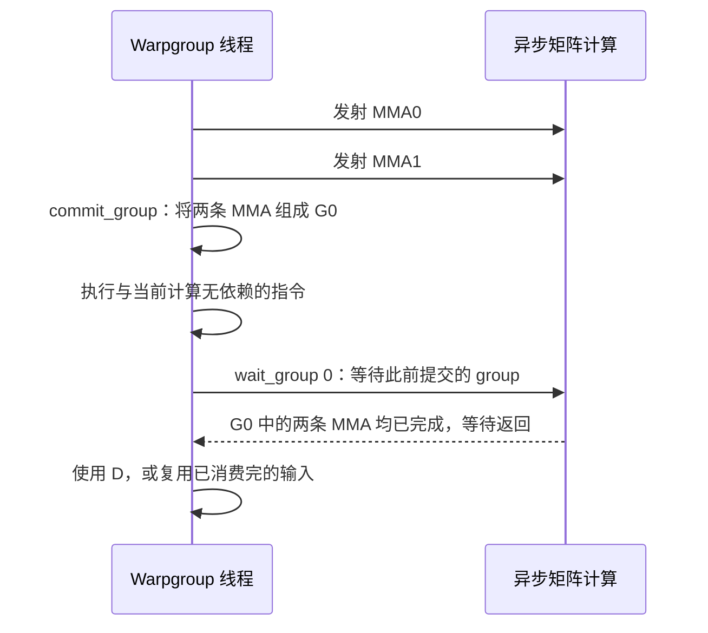
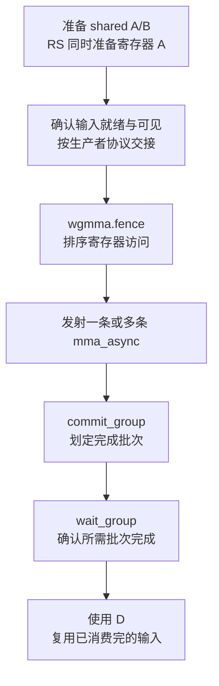
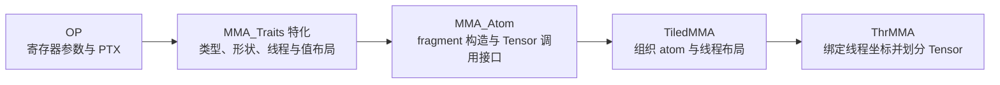

# CuTe WGMMA：从 SM90 PTX 指令开始

**WGMMA（Warpgroup Matrix Multiply-Accumulate，warpgroup 级矩阵乘累加）** 是 Hopper 上由四个 warp 协作执行的异步 Tensor Core 指令。理解它，需要同时看计算形状、输入数据的位置，以及异步计算何时完成。

本文先从 CuTe 的 arch 层抽出 PTX 指令：讲清楚一条指令计算什么、接收哪些操作数、怎样读取 shared memory，以及怎样确认结果可以使用。随后阅读 F16 SS/RS、FP8 和整数 SATURATE 的代表性 MMA OP 源码，把 PTX 操作数对应到 C++ 寄存器声明、模板参数与 `fma` 接口。最后固定一条 F16 SS 指令，沿 `MMA_Traits`、`MMA_Atom`、`TiledMMA`、`ThrMMA` 展开张量划分、fragment 构造和 `gemm` 调用链，并给出关键 API 的具体结果。

## 源码与指令范围


| 源码 | 与 PTX 指令有关的内容 |
| --- | --- |
| [`include/cute/arch/mma_sm90_gmma.hpp`](https://github.com/NVIDIA/cutlass/blob/e406c186f510a15091cce01f782020ceb7ba8eb5/include/cute/arch/mma_sm90_gmma.hpp) | Dense WGMMA，以及 `wgmma.fence`、`wgmma.commit_group`、`wgmma.wait_group`。 |
| [`include/cute/arch/mma_sm90_gmma_ext.hpp`](https://github.com/NVIDIA/cutlass/blob/e406c186f510a15091cce01f782020ceb7ba8eb5/include/cute/arch/mma_sm90_gmma_ext.hpp) | Dense WGMMA 的更多 N 维形状。 |
| [`include/cute/arch/mma_sm90_gmma_sparse.hpp`](https://github.com/NVIDIA/cutlass/blob/e406c186f510a15091cce01f782020ceb7ba8eb5/include/cute/arch/mma_sm90_gmma_sparse.hpp) | Sparse WGMMA，增加稀疏元数据与 selector 操作数。 |
| [`include/cute/arch/mma_sm90_gmma_sparse_ext.hpp`](https://github.com/NVIDIA/cutlass/blob/e406c186f510a15091cce01f782020ceb7ba8eb5/include/cute/arch/mma_sm90_gmma_sparse_ext.hpp) | Sparse WGMMA 的更多 N 维形状。 |
| [`include/cute/arch/mma_sm90_desc.hpp`](https://github.com/NVIDIA/cutlass/blob/e406c186f510a15091cce01f782020ceb7ba8eb5/include/cute/arch/mma_sm90_desc.hpp) | WGMMA shared-memory matrix descriptor 的 64 位编码。这个文件本身不发射 MMA 指令。 |
| [`include/cutlass/arch/barrier.h`](https://github.com/NVIDIA/cutlass/blob/e406c186f510a15091cce01f782020ceb7ba8eb5/include/cutlass/arch/barrier.h) | 补充读取 `fence_view_async_shared()` 对应的 `fence.proxy.async.shared::cta`。 |

前五个文件覆盖本文的 PTX 与 OP 部分；后面的 Traits 与张量划分再进入 atom 层和 Hopper 教程。`_ext` 扩展的是同一类 PTX 指令的形状集合，PTX 指令名字里没有 `.ext` 后缀。

本文讨论 **Hopper / `sm_90a`** 路径。源码通过 `CUTE_ARCH_MMA_SM90A_ENABLED` 检查架构特性；只检查 `__CUDA_ARCH__ >= 900` 不够，还需要 `__CUDA_ARCH_FEAT_SM90_ALL`。编译 Hopper WGMMA 代码时，常用目标是 `-arch=sm_90a`。

工具链还要支持相应的 PTX ISA：dense WGMMA 在 PTX ISA 8.0 引入，sparse WGMMA 在 8.2 引入；dense 和 sparse 的整数混合符号 `.s8.u8`、`.u8.s8` 在 8.4 引入。架构目标正确，并不意味着任意旧版工具链都支持本文的全部指令形式。

以下 `ptx` 代码块使用语义化寄存器名，展示从内联汇编中抽出的指令片段，省略完整 kernel 的声明、数据加载与结果存储。PTX 是虚拟指令集，最终由工具链翻译成 GPU 机器指令。

## Warpgroup 与矩阵计算模型

### 异步执行：发射、提交与完成是三个时间点

**WGMMA 对发射它的线程是异步执行的。** Warpgroup 的 128 个线程共同发射 `wgmma.mma_async` 后，矩阵乘累加在硬件中继续推进，线程可以继续执行后续指令。此时，D 中的新结果可能还没有计算完成。

这让线程有机会在矩阵计算期间处理其他工作，例如计算下一阶段的地址，或准备与当前计算无依赖的数据。要把异步运算组织起来，需要分别处理三个时间点：

| 时间点 | 对应操作 | 此时能够确认什么 |
| --- | --- | --- |
| **发射** | `wgmma.mma_async` | 已发起矩阵运算，结果随后异步产生。 |
| **提交批次** | `wgmma.commit_group` | 此前未提交的 WGMMA 被组成一个 group，后续可以按这个批次等待。 |
| **确认完成** | `wgmma.wait_group` | 被等待的 group 中所有 WGMMA 都已完成，相关结果和资源可以按完成保证使用。 |

**MMA 发射后已经可以执行；commit 为完成追踪划定批次，wait 确认所需批次完成。** 所以 commit 返回时，group 仍可能正在计算；线程可以先执行无依赖的工作，等真正需要结果时再 wait。

例如，两条相同形状的 WGMMA 连续累加到同一组 D 寄存器，并一起组成 G0。假设输入已经就绪，所需 fence 也已经执行，其控制流可以表示为：



图中的矩阵计算在 MMA 发射后推进，可以与线程后续的无依赖工作重叠。`wait_group 0` 返回后，才确认此前提交的 group 全部完成；若计算早已完成，wait 就可以直接返回。

这也决定了输入、输出的生命周期：**在相关 group 完成前，普通指令要避免读取或改写 D、访问 RS 的 A 寄存器，以及覆盖仍在被读取的 shared A/B tile。** 相同形状的 WGMMA 连续累加有专门的寄存器访问顺序规则，后文会展开。

指令名字中的 `.sync.aligned` 规定参与线程怎样共同发射指令；矩阵计算的完成通过 group wait 确认。先区分这两个时间点，后面才能理解为什么已经执行了 `.sync.aligned` 的 MMA，仍然需要 commit 和 wait。

### 四个连续 warp 共同执行

一个 warpgroup 包含 **四个连续 warp，共 128 个线程**，第一个 warp 的 CTA 内编号必须是 4 的倍数。例如 warp 0～3 和 warp 4～7 分别构成 warpgroup，warp 1～4 不能这样组合。多维 thread block 中，warp 编号按线程的线性编号计算。定义见 [PTX 的 Warpgroup 小节](https://docs.nvidia.com/cuda/parallel-thread-execution/#asynchronous-warpgroup-level-matrix-instructions-warpgroup)。

这 128 个线程共同发射一次矩阵运算，每个线程提供自己的寄存器片段。**一条 `m64n8k16` 计算的是整个 warpgroup 的矩阵块**，每个线程持有的结果只是其中一部分。

所有参与线程必须执行相同的 WGMMA 指令及相应的 fence、commit、wait。它不能像某些 TMA 发射方式那样，只由选出的一个线程执行。

### D 同时作为累加输入和输出

数学上，一条形状为 `m64nNkK` 的 dense 指令执行：

$$
D_{64\times N}
\leftarrow
A_{64\times K}B_{K\times N}+D_{64\times N}
$$

**这个公式描述异步运算完成后的结果。** 发射 WGMMA 时发起的是这次运算，普通线程指令需要在相关 group 完成后才能使用新的 D。实际的 `N`、`K` 必须替换为指令支持的常量。这里 `D` 同时表示旧累加值和新结果，PTX 不再单独传一组 C 寄存器。

- **A** 可以位于 shared memory，也可以按指令规定的分布放在各线程寄存器中。
- **B** 位于 shared memory，通过 descriptor 传给指令。
- **D** 分布在 128 个线程的寄存器中，计算完成后仍保存在这些寄存器里。

指令不会自动执行完整 GEMM 的 epilogue（输出处理）。例如 $\alpha AB+\beta C$ 中任意数值的 $\alpha$、$\beta$ 缩放，通常需要另外组织计算。

## 先读一条 dense WGMMA

### F16 输入、F32 累加、A/B 都在 shared memory

从源码抽出一条最小 N 形状的指令：

```ptx
wgmma.mma_async.sync.aligned.m64n8k16.f32.f16.f16
    {d0, d1, d2, d3},
    desc_a,
    desc_b,
    scale_d, 1, 1, 0, 0;
```

这条指令用 F16 输入计算 $64\times16$ 的 A 与 $16\times8$ 的 B，输出并累加到 $64\times8$ 的 F32 矩阵 D。

先拆开指令名字：

| 指令组成 | 含义 |
| --- | --- |
| `wgmma` | Warpgroup 级矩阵运算，参与范围是 128 个线程。 |
| `mma_async` | 发起异步矩阵乘累加；线程继续执行后续指令，结果需要通过完成协议确认。 |
| `sync` | 当前 warp 的线程要执行到同一条指令后才能继续。它不表示矩阵计算已经完成。 |
| `aligned` | 要求整个 warpgroup 的线程执行同一条指令；条件分支必须在 warpgroup 内一致。它不描述内存地址对齐。 |
| `m64n8k16` | 这次计算的 M、N、K 分别是 64、8、16。 |
| `f32.f16.f16` | **类型顺序是 D、A、B**：F32 累加/输出，F16 乘数 A，F16 乘数 B。 |

再读操作数：

| 操作数 | PTX 形式 | 含义 |
| --- | --- | --- |
| `{d0, d1, d2, d3}` | 每线程四个 `.f32` 寄存器 | 当前线程持有的 D 片段，既是累加输入，也是结果输出。 |
| `desc_a` | 一个 64 位寄存器 | 描述整个 A tile 的 shared 地址与布局。 |
| `desc_b` | 一个 64 位寄存器 | 描述整个 B tile 的 shared 地址与布局。 |
| `scale_d` | Predicate（谓词） | 为真时使用旧 D 累加；为假时忽略旧 D。 |
| 第一个 `1` | `imm-scale-a` | A 不取负；`-1` 表示取负。 |
| 第二个 `1` | `imm-scale-b` | B 不取负；`-1` 表示取负。 |
| 第一个 `0` | `imm-trans-a` | 使用 A 的默认 K-major 布局。 |
| 第二个 `0` | `imm-trans-b` | 使用 B 的默认 K-major 布局。 |

descriptor 应在参与线程间保持一致；D 寄存器片段则随线程变化。指令语法与操作数语义可对照 [PTX 的 `wgmma.mma_async` 小节](https://docs.nvidia.com/cuda/parallel-thread-execution/#asynchronous-warpgroup-level-matrix-instructions-wgmma-mma-async)。

### `scale_d` 是累加开关

对浮点指令，可以把计算写成：

$$
D_{\mathrm{new}}=
\begin{cases}
(s_A A)(s_B B), & \text{scale-d 为假} \\
(s_A A)(s_B B)+D_{\mathrm{old}}, & \text{scale-d 为真}
\end{cases}
\qquad s_A,s_B\in\{-1,1\}
$$

CuTe 的源码先把整数形式的累加开关转换成 PTX predicate：

```ptx
setp.ne.b32 scale_d, scale_d_u32, 0;
```

因此需要区分两个控制量：

- **`scale_d` 只决定使用或忽略旧 D**，不能直接表达 $\beta=0.5$ 这样的缩放。
- **`imm-scale-a`、`imm-scale-b` 只接受 `1` 或 `-1`**，负责输入符号选择，不能直接表达任意输入缩放。

沿 K 维累加多个 tile 时，第一条指令通常关闭旧 D 输入，后续指令打开累加开关。每一条都关闭，会使每次计算覆盖前面的结果。

### `.sync` 与异步完成是两个时间点

`.sync.aligned` 约束参与线程怎样共同发射指令，`mma_async` 描述矩阵计算怎样在发射后继续推进。

发射返回时，普通指令仍不能直接读取或修改正在被 WGMMA 使用的 D 寄存器，也不能覆盖尚未消费完的输入。要先提交 WGMMA group，再等待相关 group 完成。

## SS 与 RS：输入来自哪里

源码中常见的 SS、RS 是两种输入位置的简称。**它们不出现在 PTX 指令名字里**，实际区别在 A 的操作数形式。

| 输入形式 | A 操作数 | B 操作数 | D 操作数 |
| --- | --- | --- | --- |
| **SS：shared / shared** | 一个 64 位 descriptor | 一个 64 位 descriptor | 每线程的累加寄存器向量。 |
| **RS：register / shared** | 每线程四个 32 位寄存器 | 一个 64 位 descriptor | 每线程的累加寄存器向量。 |

本文源码中的 WGMMA 没有把 B 放在寄存器里的 SR、RR 形式。

### 同一条 F16 指令的 RS 形式

```ptx
wgmma.mma_async.sync.aligned.m64n8k16.f32.f16.f16
    {d0, d1, d2, d3},
    {a0, a1, a2, a3},
    desc_b,
    scale_d, 1, 1, 0;
```

与 SS 相比，指令名字、计算形状、结果寄存器都相同，操作数有两处变化：

- `desc_a` 换成 `{a0, a1, a2, a3}`。每个 32 位寄存器打包两个 F16，每线程提供 8 个 A 元素。
- 尾部少了 `imm-trans-a`。寄存器 A 的片段分布由指令固定，不能再通过这个参数切换布局。

128 个线程合起来提供 $128\times8=1024=64\times16$ 个 F16 元素。但这个数量关系只说明片段大小；**寄存器元素对应的矩阵坐标需要服从 PTX fragment layout（片段布局）**，不能随意把八个元素填进寄存器。

RS 适合 A 已经在寄存器中产生，或者需要先通过普通线程指令处理 A 的情况。SS 则让 Tensor Core 直接按 descriptor 读取 A/B，避免把 A 显式展开成每线程寄存器输入。

### 寄存器 A 的打包数量

本节只列数据数量，不展开 lane 到矩阵坐标的映射。

| A 类型 | 每个 32 位寄存器中的元素数 | 每线程四个寄存器中的元素数 | Dense K | Sparse 逻辑 K |
| --- | --- | --- | --- | --- |
| F16 / BF16 | 2 | 8 | 16 | 32 |
| TF32 | 1 | 4 | 8 | 16 |
| FP8 / S8 / U8 | 4 | 16 | 32 | 64 |

Sparse 的寄存器 A 只保存压缩后保留的元素，元数据负责把它们对应回逻辑 K 坐标。

## 输入布局与转置参数

### K-major 和 MN-major

WGMMA 的默认读取形式对应 A row-major、B column-major，两者都以 **K 方向为主方向**：A 的 K 是列维度，数学 B 的 K 是行维度。Shared memory 中的实际存储还要按 WGMMA 的基础块组织；K-major 表示一个 16 字节单元沿 K 方向容纳相邻元素。

CuTe 把 A 的坐标写作 `(M,K)`，把 B 的坐标写作 `(N,K)`；其中 `B(n,k)` 对应数学矩阵的 `B(k,n)`。因此用 K-major / MN-major 描述更容易统一 A、B：

| 布局 | A 的主方向 | B 的主方向 | F16/BF16 的转置参数 |
| --- | --- | --- | --- |
| **K-major** | K | K | 对应操作数的 `imm-trans` 为 `0`。 |
| **MN-major** | M | N | 对应操作数的 `imm-trans` 为 `1`。 |

主方向决定一个 16 字节单元沿哪个逻辑维度组织元素。单元内的相邻元素连续存放，单元之间的地址距离由 INTERLEAVE 或 swizzled 布局规定；加入 swizzle（地址重排）后，再按对应规则生成实际 shared 地址。后面的 LBO、SBO 小节会展开这些块间步幅的计算。

### 哪些指令带转置参数

| 指令类型 | SS 的转置参数 | RS 的转置参数 |
| --- | --- | --- |
| F16 / BF16 | `imm-trans-a`、`imm-trans-b` | 只有 `imm-trans-b`；寄存器 A 固定采用指令规定的分布。 |
| TF32 / FP8 / 整数 | 无，使用默认 K-major 输入形式 | 无，使用默认输入形式。 |

Sparse 对应类型遵循相同的参数区别。

`imm-trans` 控制硬件对 shared tile 的读取解释，**不会先把原矩阵搬运到另一个缓冲区执行转置**。写入 shared memory 的布局、descriptor 的偏移、指令的转置参数必须相互匹配。

## Dense 指令类型族与形状

### 从源码合并同类指令

下面从两个 dense 头文件的 PTX 字符串统计，按类型族合并重复形状。`N` 是占位记号，必须替换为下节列出的具体整数；每个类型族都包含 SS 和 RS 两种输入形式。

| PTX 的形状与类型后缀 | A/B 类型 | D 类型 | K | 尾部控制操作数 |
| --- | --- | --- | --- | --- |
| `m64nNk16.f16.f16.f16` | F16 / F16 | F16 | 16 | `scale_d`、输入符号、shared 输入的转置参数。 |
| `m64nNk16.f32.f16.f16` | F16 / F16 | F32 | 16 | 同上。 |
| `m64nNk16.f32.bf16.bf16` | BF16 / BF16 | F32 | 16 | 同上。 |
| `m64nNk8.f32.tf32.tf32` | TF32 / TF32 | F32 | 8 | `scale_d`、输入符号。 |
| `m64nNk32.f16.e4m3.e4m3`、`m64nNk32.f32.e4m3.e4m3` | E4M3 / E4M3 | F16 或 F32 | 32 | `scale_d`、输入符号。 |
| `m64nNk32.f16.e4m3.e5m2`、`m64nNk32.f32.e4m3.e5m2` | E4M3 / E5M2 | F16 或 F32 | 32 | 同上。 |
| `m64nNk32.f16.e5m2.e4m3`、`m64nNk32.f32.e5m2.e4m3` | E5M2 / E4M3 | F16 或 F32 | 32 | 同上。 |
| `m64nNk32.f16.e5m2.e5m2`、`m64nNk32.f32.e5m2.e5m2` | E5M2 / E5M2 | F16 或 F32 | 32 | 同上。 |
| `m64nNk32.s32.s8.s8` | S8 / S8 | S32 | 32 | 只有 `scale_d`。 |
| `m64nNk32.s32.s8.u8` | S8 / U8 | S32 | 32 | 同上。 |
| `m64nNk32.s32.u8.s8` | U8 / S8 | S32 | 32 | 同上。 |
| `m64nNk32.s32.u8.u8` | U8 / U8 | S32 | 32 | 同上。 |

四种整数类型组合还各自具有 `.satfinite` 版本，例如 `m64n8k32.s32.s8.u8.satfinite`。

BF16 使用 16 位存储，但不能把 F16 的原始位模式直接当作 BF16。TF32 输入占用 32 位存储，数值应按 TF32 格式准备；它也不等价于普通 F32 精度乘法。FP8 的 E4M3、E5M2 分别表示不同的指数位数与尾数位数，A/B 可以混用这两种格式。

**寄存器类型不完整等同于内部运算精度。** 例如 FP8 的 `.f32` 指定 F32 累加寄存器与输出格式，但 PTX 对当前实现注明，其内部累加精度高于半精度、低于单精度。浮点累加顺序和部分舍入细节也没有完全规定，不能仅凭 `.f32` 就要求与逐项 CPU F32 计算按位一致。精度约束见 [PTX 的 `wgmma.mma_async` 说明](https://docs.nvidia.com/cuda/parallel-thread-execution/#asynchronous-warpgroup-level-matrix-instructions-wgmma-mma-async)。

上述列表描述这几个头文件实际封装的范围；PTX 规范中的其他类型，例如 single-bit WGMMA，没有因此被加入本文列表。

### 基础文件与 `_ext` 的 N 集合

两个基础文件分别是 `mma_sm90_gmma.hpp`、`mma_sm90_gmma_sparse.hpp`；对应 `_ext` 文件补充其余形状。

| 类型族 | 基础文件中的 N | `_ext` 文件新增的 N | 合并后的 N |
| --- | --- | --- | --- |
| F16 / BF16 / TF32 / FP8 | `8, 16, 32, 64, 96, 128, 192, 256` | `24, 40, 48, 56, 72, 80, 88, 104, 112, 120, 136, 144, 152, 160, 168, 176, 184, 200, 208, 216, 224, 232, 240, 248` | 8～256 的全部 8 倍数。 |
| S8 / U8 整数 | `8, 16, 32, 64, 96, 128, 192, 256` | `24, 48, 80, 112, 144, 160, 176, 208, 224, 240` | `8, 16, 24`，以及 32～256 的全部 16 倍数。 |

这个 N 集合同时适用于本文的 dense 和 sparse 源码，整数的 `.satfinite` 版本也使用同一集合。**不能把浮点 N 的规则直接套给整数族**，例如源码没有整数 `n40` 形式。

### 不同类型的指令片段

下面均取 N=8。寄存器和 descriptor 已按对应类型准备好，省略共同的 fence、commit、wait。

```ptx
// F16 输入、F16 累加：每个 d 寄存器打包两个 F16。
wgmma.mma_async.sync.aligned.m64n8k16.f16.f16.f16
    {d0, d1}, desc_a, desc_b, scale_d, 1, 1, 0, 0;

// BF16 输入、F32 累加。
wgmma.mma_async.sync.aligned.m64n8k16.f32.bf16.bf16
    {d0, d1, d2, d3}, desc_a, desc_b, scale_d, 1, 1, 0, 0;

// TF32 没有转置参数，K=8。
wgmma.mma_async.sync.aligned.m64n8k8.f32.tf32.tf32
    {d0, d1, d2, d3}, desc_a, desc_b, scale_d, 1, 1;

// FP8 可以混用 E4M3 和 E5M2，K=32。
wgmma.mma_async.sync.aligned.m64n8k32.f32.e4m3.e5m2
    {d0, d1, d2, d3}, desc_a, desc_b, scale_d, 1, 1;

// 整数指令没有输入符号和转置参数。
wgmma.mma_async.sync.aligned.m64n8k32.s32.s8.u8
    {d0, d1, d2, d3}, desc_a, desc_b, scale_d;

// 饱和版本：溢出时限制到 S32 可表示的范围。
wgmma.mma_async.sync.aligned.m64n8k32.s32.s8.u8.satfinite
    {d0, d1, d2, d3}, desc_a, desc_b, scale_d;
```

这里列出的六条是各自独立的示例，`d0` 等名字在不同示例中代表对应类型的寄存器，并不表示把不同类型族串起来累加。整数普通版本溢出时按 32 位回绕；`.satfinite` 将结果限制在有符号 32 位整数范围。

### D 寄存器数量与 N 的关系

一个 $64\times N$ 的 D tile 由 128 个线程共同持有，每线程的逻辑元素数为：

$$
\frac{64N}{128}=\frac{N}{2}
$$

根据源码的寄存器列表，可以得到：

| D 类型 | 每线程逻辑元素数 | 每线程 32 位寄存器数 | 打包方式 |
| --- | --- | --- | --- |
| F32 | $N/2$ | $N/2$ | 一个寄存器一个 F32。 |
| S32 | $N/2$ | $N/2$ | 一个寄存器一个 S32，内联汇编使用 32 位整数约束。 |
| F16 | $N/2$ | $N/4$ | 一个 32 位寄存器打包两个 F16。 |

例如 N=8 时，F32/S32 使用 4 个寄存器，F16 使用 2 个；N=256 时，分别使用 128 个和 64 个。N 越大，每条指令覆盖的输出越宽，累加寄存器开销也越大。

这个公式适用于 dense 和 sparse 的 D，因为两者的输出形状都是 $64\times N$。它说明寄存器数量，具体坐标分布要继续阅读 fragment layout。

## Shared-memory matrix descriptor

### Descriptor 是编码后的矩阵视图

SS 的 A/B 和 RS 的 B 都以 **一个 64 位寄存器**传入，但其中保存的是 matrix descriptor（矩阵描述符），不是裸指针。

Descriptor 组合了起始 shared 地址、两种块间偏移、swizzle 模式及其基准信息。M/N/K 形状与元素类型由指令名字指定，K-major / MN-major 由指令形式及转置参数决定，descriptor 中没有这些独立字段。

它和 TMA 使用的 tensor map descriptor 也不同：TMA tensor map 描述 global tensor 与搬运规则；WGMMA descriptor 描述 Tensor Core 怎样读取 shared memory 中的一个矩阵 tile。

### 64 位字段

`mma_sm90_desc.hpp` 用一个 union 表示同一份 64 位数据的不同视图：`desc_` 是完整编码，`reg32_`、`reg16_` 按不同宽度查看数据，`bitfield` 则直接访问各字段。下面节选存储成员和位域定义，省略构造函数、赋值与转换运算符，并将源码注释翻译为中文：

```cpp
union GmmaDescriptor
{
  uint64_t desc_;
  uint32_t reg32_[2];
  uint16_t reg16_[4];

  // 使用位域，给字段赋值时无需手动执行移位。
  struct {
    // 矩阵起始地址，占据位 [0,14)，省略地址的最低 4 位。
    uint16_t start_address_ : 14, : 2;        // 14 位字段 [0,14)，随后 2 位未使用。
    // 主维度字节偏移，占据位 [16,30)，省略偏移的最低 4 位。
    // N（不转置）：INTERLEAVED 布局中，8×2 基础块从第一列到第二列的步幅。
    //   所有 SWIZZLE_* 布局都不使用该参数，并将其视为 1。
    // T（转置）：从第一组 8 行到下一组 8 行的步幅。
    uint16_t leading_byte_offset_ : 14, : 2;  // 14 位字段 [16,30)，随后 2 位未使用。
    // 步幅维度字节偏移，占据位 [32,46)，省略偏移的最低 4 位。
    // N（不转置）：从第一组 8 行到下一组 8 行的步幅。
    // T（转置）：从第一组 8 列到下一组 8 列的步幅。
    uint16_t stride_byte_offset_ : 14, : 2;   // 14 位字段 [32,46)，随后 2 位未使用。
    // 基准偏移，占据位 [49,52)。
    // 源码注释标明：仅对 SWIZZLE_128B 和 SWIZZLE_64B 有效。
    uint8_t : 1, base_offset_ : 3, : 4;       // 先留空 1 位，再使用本字节的位 [1,4)，最后留空 4 位。
    // 布局类型，占据位 [62,64)，编码对应的 swizzle 模式如下。
    // SWIZZLE_NONE = 0, SWIZZLE_32B = 3, SWIZZLE_64B = 2, SWIZZLE_128B = 1
    uint8_t : 6, layout_type_ : 2;            // 先留空 6 位，再使用本字节的位 [6,8)。
  } bitfield;
};
```

注释中的 `[0,14)` 是左闭右开的位区间，即第 0～13 位；前三个字段编码时省略地址或偏移的最低 4 位。声明中没有字段名的位域，例如 `: 2`、`: 4`，用来占据未使用的位，使后续字段落在规定的位置。

下表把这些字段换成包含两端的位段表示，位编号仍从最低位 0 开始。

| 位段 | 位数 | 源码字段 | 含义 |
| --- | --- | --- | --- |
| `[13:0]` | 14 | `start_address_` | 编码后的矩阵起始 shared 地址。 |
| `[29:16]` | 14 | `leading_byte_offset_` | 编码后的 leading dimension byte offset，简称 LBO。 |
| `[45:32]` | 14 | `stride_byte_offset_` | 编码后的 stride dimension byte offset，简称 SBO。 |
| `[51:49]` | 3 | `base_offset_` | Swizzle 模式使用的基准偏移信息。 |
| `[63:62]` | 2 | `layout_type_` | Swizzle 模式编码。 |
| 其余位 | — | 未使用位 | 构造时保持为 0。 |

前三个字段把字节地址或字节偏移的低 4 位省略，相当于以 **16 字节为单位**保存：

$$
\operatorname{encode}(x)=\frac{x\ \&\ \mathtt{0x3FFFF}}{16}
\quad\text{（整数右移 4 位）}
$$

因此输入地址和这两种偏移应满足 16 字节粒度。不能把未对齐值右移后当作有效编码，也不能把元素数量直接当作字节偏移。`start_address_` 编码的是 shared 地址空间中的地址，需要先把 CUDA 指针转换到对应的 shared 地址表示。

Swizzle 编码不是按字节数递增排列：

| `layout_type_` | CuTe 名称 | 地址布局 |
| --- | --- | --- |
| `0` | `INTERLEAVE` | No swizzle（不做 swizzle）。 |
| `1` | `B128` | 128-byte swizzle。 |
| `2` | `B64` | 64-byte swizzle。 |
| `3` | `B32` | 32-byte swizzle。 |

字段定义可对照 [PTX 的 Matrix Descriptor Format](https://docs.nvidia.com/cuda/parallel-thread-execution/#asynchronous-warpgroup-level-matrix-shared-memory-layout-matrix-descriptor)。

### LBO、SBO：基础块坐标之间的字节步幅

**LBO、SBO 本身就是 stride，单位是字节。** 理解它们的关键，是明确这个 stride 对应的坐标变化：硬件把元素组合成 16 字节单元，再按规定的基础块读取矩阵。LBO、SBO 分别描述这些分块坐标增加 1 时，地址需要增加多少字节。

先统一记号，方便同时讨论 A 和 B：

- 用 `(x,k)` 表示矩阵坐标：对 A，`x=m`；对 B，`x=n`，采用 CuTe 的 `(N,K)` 坐标顺序。
- 每个元素占 $e$ 字节，一个 16 字节单元容纳 $T=16/e$ 个元素。例如 F16/BF16 的 $T=8$，TF32 的 $T=4$，FP8/S8/U8 的 $T=16$。
- 用 $P(x,k)$ 表示**应用 swizzle 之前的布局字节偏移**。No-swizzle 时，它就是相对于 tile 起点的实际地址偏移；带 swizzle 时，硬件还会对这个偏移执行地址重排。

计算时，先从布局中找到对应的两个块起点，取其 $P$ 的差得到字节步幅，再除以 16 写入 descriptor。下面的坐标均以原始元素为单位：

| 主方向与模式 | LBO 对应的移动 | LBO 字节值 | SBO 对应的移动 | SBO 字节值 |
| --- | --- | --- | --- | --- |
| **K-major，no-swizzle** | K 方向跨过一个 16 字节单元，即 $T$ 个元素。 | $P(0,T)-P(0,0)$ | x 方向跨过一组 8 行。 | $P(8,0)-P(0,0)$ |
| **K-major，B32/B64/B128** | K 单元的步幅由该布局固定，硬件按一个 16 字节单元处理。 | 固定为 16，字段编码为 `1`。 | x 方向跨过一组 8 行。 | $P(8,0)-P(0,0)$ |
| **MN-major，no-swizzle** | K 方向跨过一组 8 列。 | $P(0,8)-P(0,0)$ | x 方向跨过一个 16 字节单元，即 $T$ 个元素。 | $P(T,0)-P(0,0)$ |
| **MN-major，B32/B64/B128** | x 方向跨过一个完整 swizzle 宽度，即 $WT$ 个元素。 | $P(WT,0)-P(0,0)$ | K 方向跨过一组 8 列。 | $P(0,8)-P(0,0)$ |

最后一行的 $W$ 是 swizzle 宽度所包含的 16 字节单元数：B32 对应 $W=2$，B64 对应 $W=4$，B128 对应 $W=8$。因此 F16 的 MN-major B128 布局，LBO 对应 x 方向跨过 $8\times8=64$ 个元素。

这些坐标变化来自规范布局。源码 [`make_gmma_desc()` 附近的 canonical layout 定义](https://github.com/NVIDIA/cutlass/blob/e406c186f510a15091cce01f782020ceb7ba8eb5/include/cute/atom/mma_traits_sm90_gmma.hpp#L157) 给出了各个分块 mode 的 stride，构造函数直接从中提取 LBO、SBO。**先确定分块布局，再取对应的字节步幅**，就可以知道每个字段应该填什么。

#### K-major、no-swizzle 的基础块怎样寻址

以 F16 为例，一个 16 字节单元容纳 8 个 K 元素。把 8 行、两组 K 单元组成一个 $8\times2$ 的单元表，每个表格单元都代表 16 字节数据：

| 行坐标 | 第一组 K 元素 `k=0…7` 的起始偏移 | 第二组 K 元素 `k=8…15` 的起始偏移 |
| --- | --- | --- |
| `x=0` | `0` | `LBO` |
| `x=1` | `16` | `LBO + 16` |
| `x=2` | `32` | `LBO + 32` |
| … | … | … |
| `x=7` | `112` | `LBO + 112` |
| 下一组的 `x=8` | `SBO` | `SBO + LBO` |

这个表同时说明三个层次的步幅：

- 在一个单元内，`k` 增加 1，地址增加 2 字节。
- 在同一组 8 行内，`x` 增加 1，地址增加 16 字节，这部分由规范布局固定。
- 从第一组 K 单元到第二组 K 单元，地址增加 LBO；从第一组 8 行到下一组 8 行，地址增加 SBO。

写成地址公式就是：

$$
P(x,k)=
\underbrace{\left\lfloor\frac{x}{8}\right\rfloor\mathrm{SBO}}_{\text{第几组 8 行}}
+\underbrace{(x\bmod8)\times16}_{\text{组内行坐标}}
+\underbrace{\left\lfloor\frac{k}{8}\right\rfloor\mathrm{LBO}}_{\text{第几个 K 单元}}
+\underbrace{(k\bmod8)\times2}_{\text{单元内元素坐标}}.
$$

因此，LBO 是分块后的 K 单元 stride，SBO 是分块后的 x 行组 stride。这里两者都是地址步幅，但对应的坐标增量分别是 `k += 8` 和 `x += 8`。

### 计算例子：K-major、no-swizzle 的 F16 tile

考虑前面的 `m64n8k16.f32.f16.f16` SS 指令。A 的坐标为 `(m,k)`，B 的坐标为 `(n,k)`。对两者都采用下面的 **INTERLEAVE 分块存储**：

1. 先存 `x=0…7, k=0…7`，每行 8 个 F16，共 $8\times16=128$ 字节。
2. 再存 `x=0…7, k=8…15`，同样占 128 字节。
3. 对 A，继续存下一组 `x=8…15` 的两个 K 单元块，之后依此类推。

同一行的两段 K 数据分别位于这两个 128 字节块中。根据块起点的距离，得到：

$$
\begin{aligned}
\mathrm{LBO}&=P(0,8)-P(0,0)=128-0=128\ \text{字节},\\
\mathrm{SBO}&=P(8,0)-P(0,0)=256-0=256\ \text{字节}.
\end{aligned}
$$

这里明确选择先排列两组 K 单元，再排列下一组 x 行；其他合法的块排列可以有不同的 LBO、SBO。当前布局的完整字节偏移为：

$$
P(x,k)=
256\left\lfloor\frac{x}{8}\right\rfloor
+16(x\bmod8)
+128\left\lfloor\frac{k}{8}\right\rfloor
+2(k\bmod8).
$$

例如 `P(1,0)=16`、`P(0,8)=128`、`P(8,0)=256`。这些地址与上面的单元表逐项对应。

最后进行 descriptor 编码：

| 参数 | 字节值 / 实际值 | 写入 descriptor 的值 |
| --- | --- | --- |
| LBO | 128 字节。 | `128 >> 4 = 8` |
| SBO | 256 字节。 | `256 >> 4 = 16` |
| `base_offset_` | No-swizzle，取 0。 | `0` |
| `layout_type_` | `INTERLEAVE`。 | `0` |

假设 A/B 的起始 shared 地址分别为 `0x1000`、`0x2000`，起始地址字段分别是 `0x100`、`0x200`。组合后的 64 位值为：

$$
\mathrm{desc}_A=
\mathtt{0x100}\;|\;(\mathtt{8}\ll16)\;|\;(\mathtt{16}\ll32)
=\mathtt{0x0000001000080100}
$$

$$
\mathrm{desc}_B=
\mathtt{0x200}\;|\;(\mathtt{8}\ll16)\;|\;(\mathtt{16}\ll32)
=\mathtt{0x0000001000080200}
$$

### 换成 MN-major，怎样计算

仍以 F16 的 $64\times16$ tile 为例，采用 MN-major、no-swizzle。现在一个 16 字节单元沿 x 方向包含 8 个元素，基础块由 8 个 K 列组成：

1. 存 `x=0…7, k=0…7`：每个 K 列包含连续的 8 个 x 元素，共 128 字节。
2. 沿 x 方向排列下一块 `x=8…15, k=0…7`，直到覆盖全部 64 个 x 元素。这一组 K 列合计占 $8\times128=1024$ 字节。
3. 再排列 `k=8…15` 对应的所有 x 块。

这个布局的地址公式为：

$$
P(x,k)=
128\left\lfloor\frac{x}{8}\right\rfloor
+2(x\bmod8)
+16(k\bmod8)
+1024\left\lfloor\frac{k}{8}\right\rfloor.
$$

根据 MN-major、no-swizzle 的坐标定义：

$$
\begin{aligned}
\mathrm{LBO}&=P(0,8)-P(0,0)=1024\ \text{字节},\\
\mathrm{SBO}&=P(8,0)-P(0,0)=128\ \text{字节}.
\end{aligned}
$$

对应字段分别填 `1024 >> 4 = 64` 和 `128 >> 4 = 8`。LBO 仍描述跨一组 8 个 K 列的距离，SBO 则描述跨一个 x 单元的距离；计算时按该模式的坐标定义取地址差即可。

### 带 swizzle 时，先计算布局步幅，再做地址重排

以 F16、K-major、B32 为例，选择 swizzle 之前的布局：

$$
P(x,k)=32x+2k.
$$

每行占 32 字节，一组 8 行占 256 字节，所以 SBO 为：

$$
\mathrm{SBO}=P(8,0)-P(0,0)=256\ \text{字节}.
$$

K-major swizzled 模式的 LBO 由硬件按 16 字节处理，字段填 `1`；SBO 字段填 `256 >> 4 = 16`，`layout_type_` 填 B32 的编码 `3`。

此后，实际地址还要执行 B32 swizzle。在 swizzle 模式起点按 256 字节对齐、base offset 为 0 的这个例子中，字节偏移的第 4 位与第 7 位异或。于是：

| 元素坐标 | Swizzle 前的 $P(x,k)$ | Swizzle 后的实际字节偏移 |
| --- | --- | --- |
| `(4,0)` | `128` | `144` |
| `(4,8)` | `144` | `128` |

因此计算 descriptor 时，应从 **swizzle 前的规范布局**提取对应步幅，再指定 swizzle 模式；实际 shared 地址由这两部分共同确定。这里的两个元素经过地址重排后交换了 16 字节单元的位置，LBO 的固定编码仍为 `1`。

### Swizzle 必须与实际写入方式一致

Swizzle 改变 shared 地址映射，通常用于改善 Tensor Core 读取时的 bank 访问。它不是数据类型转换，也不会自动把已有的普通二维存储改排成对应布局。

如果 descriptor 声明 B128，就必须用匹配 B128 的地址规则准备数据；使用 TMA 时，其目标 swizzle 与 WGMMA descriptor 的读取方式也要匹配。

`base_offset_` 用于表达 swizzle 重复模式的基准位置。重复模式起点分别落在 1024 字节（B128）、512 字节（B64）、256 字节（B32）边界时，规范给出的 base offset 为 0；其他情况按模式起点计算：

$$
\mathrm{baseOffset}=(\mathrm{patternStartAddress}\gg7)\;\&\;7
$$

`patternStartAddress` 指 swizzle 模式起点，不能无条件用当前子 tile 的起始地址替代。具体构造还要满足 canonical layout（规范布局）的约束。

## Sparse WGMMA：增加压缩 A 与元数据

### `.sp` 的操作数形式

Sparse 指令对 **A** 使用结构化稀疏存储，B 仍是普通 dense 输入。以 F16 输入、F32 累加的 SS 形式为例：

```ptx
wgmma.mma_async.sp.sync.aligned.m64n8k32.f32.f16.f16
    {d0, d1, d2, d3},
    desc_a,
    desc_b,
    e, 0,
    scale_d, 1, 1, 0, 0;
```

相对于 dense，名字里增加 `.sp`，A/B 后面增加两个操作数：

| 操作数 | 类型 | 含义 |
| --- | --- | --- |
| `e`，即 `sp-meta` | 每线程一个 32 位寄存器 | 保存保留元素在原始 A 中的位置编码。 |
| `0`，即 `sp-sel` | 编译期整数常量 | 指定线程组中哪些线程的元数据参与这次运算；合法值依类型而定。 |

`desc_a` 描述的是压缩后 A 的实际存储。Sparse 并不会从完整 A 中临时搜索零值、自动压缩并生成元数据；调用者必须提前准备两者。

对应 RS 形式把压缩 A 放进寄存器：

```ptx
wgmma.mma_async.sp.sync.aligned.m64n8k32.f32.f16.f16
    {d0, d1, d2, d3},
    {a0, a1, a2, a3},
    desc_b,
    e, 0,
    scale_d, 1, 1, 0;
```

无论 SS 还是 RS，元数据都是寄存器操作数。

### 逻辑 K 与压缩存储 K

Sparse 指令的 `k32` 描述 **数学运算的逻辑 K=32**。A 的原始形状是 $64\times32$，按 50% 结构化稀疏压缩后只存 $64\times16$ 个值；B 的形状仍为 $32\times8$。

$$
D_{64\times8}
\leftarrow
A_{64\times32}^{\mathrm{sparse}}B_{32\times8}+D_{64\times8}
$$

F16 sparse RS 每线程仍提供四个 32 位寄存器，也就是 8 个保留的 F16 值。128 个线程合计提供 1024 个存储值，通过元数据对应到原始 2048 个位置。

因此 sparse F16 `k32` 与 dense F16 `k16` 的 A 存储量相同，但两者的 **逻辑 K、B 形状及 A 的位置解释不同**。

### 稀疏粒度与 selector

结构化稀疏约束作用于 A 每一行的 K 方向小块。各类型的合法规则见 [PTX 的 Sparse matrix storage](https://docs.nvidia.com/cuda/parallel-thread-execution/#asynchronous-warpgroup-level-sparse-matrix-storage)。

| A 类型 | 稀疏粒度 | 位置编码 | 合法 `sp-sel` |
| --- | --- | --- | --- |
| F16 / BF16 | 2:4，每四个位置保留两个值。 | 两个 2 位索引组成 4 位编码，标记保留位置。 | `0` 或 `1`：每四个连续线程中，选择前两个或后两个线程提供元数据。 |
| TF32 | 1:2，每两个位置保留一个值。 | 使用规定的 4 位编码 `0b0100`、`0b1110`。 | `0` 或 `1`，线程选择规则同上。 |
| FP8 / S8 / U8 | 2:4，每四个位置保留两个值。 | 两个 2 位索引组成 4 位编码。 | 只能为 `0`，所有线程贡献元数据。 |

2:4 位置编码必须对应两个不同的保留位置，不能使用重复索引。`sp-sel` 选择的是**元数据的提供线程**，没有选择“哪一半 K 数据”的含义；值寄存器与元数据寄存器的分布是两套相关但不同的规则。

### Sparse 类型族与 K

Sparse 使用与 dense 相同的 D 类型、A/B 类型组合，逻辑 K 扩大一倍。每个类型族都有 SS、RS 形式，N 集合使用前面源码统计的规则。

| 类型组合 | Dense K | Sparse K | Sparse PTX 形状与类型后缀 |
| --- | --- | --- | --- |
| F16 × F16 → F16 | 16 | 32 | `m64nNk32.f16.f16.f16` |
| F16 × F16 → F32 | 16 | 32 | `m64nNk32.f32.f16.f16` |
| BF16 × BF16 → F32 | 16 | 32 | `m64nNk32.f32.bf16.bf16` |
| TF32 × TF32 → F32 | 8 | 16 | `m64nNk16.f32.tf32.tf32` |
| E4M3/E5M2 的四种 A/B 组合 → F16 或 F32 | 32 | 64 | `m64nNk64` 后接对应的 D、A、B 类型。 |
| S8/U8 的四种 A/B 组合 → S32 | 32 | 64 | `m64nNk64.s32` 后接对应的 A、B 类型，可带 `.satfinite`。 |

例如另外三个 sparse 类型族的 SS 形式如下：

```ptx
// Sparse TF32：逻辑 K=16，A 只存一半值。
wgmma.mma_async.sp.sync.aligned.m64n8k16.f32.tf32.tf32
    {d0, d1, d2, d3}, desc_a, desc_b, e, 0, scale_d, 1, 1;

// Sparse FP8：逻辑 K=64，selector 必须为 0。
wgmma.mma_async.sp.sync.aligned.m64n8k64.f32.e4m3.e5m2
    {d0, d1, d2, d3}, desc_a, desc_b, e, 0, scale_d, 1, 1;

// Sparse 整数饱和形式：没有输入符号或转置参数。
wgmma.mma_async.sp.sync.aligned.m64n8k64.s32.s8.u8.satfinite
    {d0, d1, d2, d3}, desc_a, desc_b, e, 0, scale_d;
```

这些也都是独立示例，输入应按各自类型准备；完成协议与 dense 相同。

## 异步协议：fence、commit、wait

Dense 和 sparse 使用同一套 WGMMA 完成协议。需要分别处理 **输入可见性、寄存器访问排序和计算完成**。

| 指令 | 作用 | CuTe / CUTLASS 中的对应函数 |
| --- | --- | --- |
| `fence.proxy.async.shared::cta;` | 建立 generic proxy 与 async proxy 之间的 shared-memory 访问顺序。 | `cutlass::arch::fence_view_async_shared()` |
| `wgmma.fence.sync.aligned;` | 排序此前普通指令对 D、寄存器 A 的访问与后续 WGMMA 访问。 | `cute::warpgroup_arrive()` |
| `wgmma.commit_group.sync.aligned;` | 把此前未提交的 WGMMA 组成一个 group。 | `cute::warpgroup_commit_batch()` |
| `wgmma.wait_group.sync.aligned N;` | 等待较早 group 完成，最多留下最近 N 个 group 尚未完成。 | `cute::warpgroup_wait<N>()` |

`warpgroup_arrive()` 发出的实际指令是 `wgmma.fence`，不要把函数名理解成普通 CTA barrier 的 arrive 操作。

### Shared 写入怎样对 WGMMA 可见

普通线程指令对 shared memory 的读写属于 generic proxy，WGMMA 在 async proxy 中读取矩阵。两种访问路径之间需要正确的可见性关系。

当线程用普通 shared store 准备 A/B 时，一个容易理解的情况是：**一个 CTA 恰好由一个 128 线程 warpgroup 构成，所有线程协作写入 A/B**。写入完成后的执行顺序可以是：

```ptx
// 每个写入线程先完成自己的普通 shared store。
fence.proxy.async.shared::cta;

// CTA 内所有线程都执行此 barrier，汇合各线程的写入与 fence。
bar.sync 0;

// 此后才能让 warpgroup 发射读取这些 shared 数据的 WGMMA。
```

Proxy fence 建立跨访问路径的顺序，barrier 建立线程之间的汇合关系。这段例子要求写入线程都执行 fence，所有 CTA 线程都执行 `bar.sync 0`；有独立 producer/consumer warp 的内核应使用相应的线程协作协议。

如果 A/B 由 TMA 异步写入 shared memory，需要通过 TMA 对应的 mbarrier 完成协议确认数据就绪。TMA 与 WGMMA 都使用 async proxy，不能把普通 shared store 的序列机械套用到 TMA；应按实际生产者的完成与可见性规则建立交接。

**输入搬运完成和 WGMMA 计算完成是两件事。** TMA barrier 确认输入到达，WGMMA group wait 确认计算结束；`wgmma.fence` 本身不负责等待 TMA。

### `wgmma.fence` 排序寄存器访问

```ptx
wgmma.fence.sync.aligned;
```

它建立此前普通寄存器访问与后续 WGMMA 寄存器访问的顺序，主要对象是 D，以及 RS 形式中保存 A fragment 的寄存器。

- Warpgroup 发射第一条 WGMMA 前，需要执行 fence。
- 普通指令初始化或更新 D 后，再交给 WGMMA，需要相应 fence。
- RS 的 A 由普通指令加载或修改后，再交给 WGMMA，也需要相应 fence。
- 相同形状的 WGMMA 连续使用同一组累加寄存器时，指令间已有规定的累加访问顺序，不必为了每次累加都插入一次 fence。

`wgmma.fence` 不能替代此前 WGMMA 的完成等待。若普通指令要修改还在使用中的寄存器，必须先 wait，再修改，之后用 fence 交给后续 WGMMA。要求可对照 [PTX 的 `wgmma.fence`](https://docs.nvidia.com/cuda/parallel-thread-execution/#asynchronous-warpgroup-level-matrix-instructions-wgmma-fence)。

### `commit_group` 把已发射操作组成 group

```ptx
wgmma.commit_group.sync.aligned;
```

它把此前尚未提交的 WGMMA 操作归入一个新的 wgmma-group。一个 group 可以包含多条 MMA，例如一个 K tile 内的多个 K 子块计算。

Commit 是划定后续 wait 要追踪的批次；MMA 在发射后已经可以执行。**Commit 返回不表示计算完成**。没有未提交操作时，commit 会创建空 group。

WGMMA group 与普通 `cp.async` group、TMA store 的 bulk async-group 分别由不同的指令管理。不能用某一种 copy wait 来等待 WGMMA 结果。

### `wait_group N` 的 N 表示允许剩余的 group 数

```ptx
wgmma.wait_group.sync.aligned 0;
```

源码要求 N 是 **0～7 的编译期常量**。它与矩阵形状里的 N 维没有关系。

- `wait_group 0`：等待此前所有已提交 WGMMA group 完成。
- `wait_group 1`：等待更早的 group，允许最近一个 group 尚未完成。
- `wait_group 2`：允许最近两个 group 尚未完成，其余更早的 group 必须完成。

假设依次提交 G0、G1、G2，执行 `wait_group 1` 后：

| Group | 返回时的保证 |
| --- | --- |
| G0 | 已完成。 |
| G1 | 已完成。 |
| G2 | 可能仍未完成，也可能已经完成。 |

它不是“等待一个 group”，也不是“等待编号为 1 的 group”。定义见 [PTX 的 `wgmma.wait_group`](https://docs.nvidia.com/cuda/parallel-thread-execution/#asynchronous-warpgroup-level-matrix-instructions-wgmma-wait-group)。

Partial wait（部分等待）适合流水线释放较早输入 stage，但要追踪 **哪个 shared stage 被哪些 group 引用**。若 G2 仍要读取某个 stage，就不能覆盖该 stage；若 G2 仍在更新同一组 D 寄存器，也不能因为 G0/G1 完成就读取 D 的中间值。

### Shared 输入和寄存器输入的生命周期

WGMMA 发射后会异步读取或使用输入，因此相关资源需要保持到消费它的 group 完成：

- **Shared A/B tile** 在相应 group 完成前不能被下一批数据覆盖。提前复用会改变异步计算读到的数据。
- **RS 的 A 寄存器** 在完成前不能由普通指令读取或改写。
- **D 累加寄存器** 在完成前不能交给普通算术或存储指令使用。相同形状 WGMMA 连续累加的情况遵循前述专门的顺序规则。

所以流水线中的 wait 同时关系到结果可读和输入缓冲区可复用。最终 epilogue 使用 D 之前，通常以 `wait_group 0` 排空此前提交的计算。

## 一次完整的指令执行顺序

### 两个 K 子块累加到同一个 D

假设 A/B 数据已经就绪，descriptor 分别描述逻辑 K 区间 0～15 和 16～31；下面的 warpgroup 共同计算 $64\times8$ 的输出 tile，累计逻辑 K=32：

```ptx
// 对 D 的普通寄存器初始化。
mov.f32 d0, 0f00000000;
mov.f32 d1, 0f00000000;
mov.f32 d2, 0f00000000;
mov.f32 d3, 0f00000000;

// 排序普通寄存器访问与后续 WGMMA。
wgmma.fence.sync.aligned;

// 第一块：关闭旧 D 输入，结果为 A0*B0。
wgmma.mma_async.sync.aligned.m64n8k16.f32.f16.f16
    {d0, d1, d2, d3}, desc_a0, desc_b0, 0, 1, 1, 0, 0;

// 第二块：使用已有 D，结果为 A0*B0+A1*B1。
wgmma.mma_async.sync.aligned.m64n8k16.f32.f16.f16
    {d0, d1, d2, d3}, desc_a1, desc_b1, 1, 1, 1, 0, 0;

// 两条 MMA 组成一个完成批次。
wgmma.commit_group.sync.aligned;
wgmma.wait_group.sync.aligned 0;

// 此后普通指令可以使用 D，例如执行输出缩放。
mul.f32 result, d0, 0f3F000000;
```

第一条已经关闭旧 D 输入，所以从 PTX 数学语义看不依赖初始化值；这里保留初始化，是为了明确展示普通寄存器访问、fence 与异步 MMA 的先后关系。第二条在同一形状上继续累加，中间没有普通指令访问 D，因此可以直接衔接。

两组 descriptor 必须分别匹配对应 K tile。该序列只展示计算和完成协议；输入的加载、shared 可见性交接以及后续结果存储仍由 kernel 的其余部分负责。

### 数据与控制流



图中的输入交接解决“WGMMA 能否读到准备好的矩阵”，fence 解决寄存器访问顺序，wait 解决“异步运算是否完成”。流水线通过留下少量尚未完成的 group，使不同 stage 的搬运和计算重叠。

## 从 PTX 回到源码的内联汇编

阅读 OP 源码之前，先看懂 PTX 操作数怎样绑定到 C++ 值。后面的源码示例会用到这些约束。

| 内联汇编约束 | 对应数据 | 含义 |
| --- | --- | --- |
| `"+f"(d)` | F32 D 寄存器 | 32 位浮点寄存器，`+` 表示读写。 |
| `"+r"(d)` | 打包 F16 或 S32 D 寄存器 | 32 位整数/位模式寄存器，同样是读写。 |
| `"r"(a)` | RS 的 A 寄存器 | 传入 32 位打包值或 TF32 位模式。 |
| `"l"(desc)` | A/B descriptor | 传入 64 位整数寄存器。 |
| `"r"(e)` | Sparse metadata | 传入 32 位元数据寄存器。 |
| `"r"(scale_d_u32)` | 运行期累加开关 | 先通过 `setp.ne.b32` 变成 PTX predicate。 |
| `"n"(value)` | 输入符号、转置参数、selector、wait 常量 | 编译期立即数。 |

`%0`、`%1` 等是 C++ 内联汇编操作数编号，不是 lane 编号或矩阵坐标。源码把寄存器列表分成多个字符串，编译器会把相邻字符串拼接成一段 PTX。

还要区分源码中的 `warpgroup_fence_operand()` 与真正的 `wgmma.fence`。前者使用类似下面的空汇编：

```cpp
// 向编译器表达寄存器读写依赖，不生成 WGMMA 硬件 fence 指令。
asm volatile("" : "+f"(reg) :: "memory");
```

它用于约束编译器对寄存器值的调度。`"memory"` clobber（内存副作用声明）约束编译器的内存优化，也不会自动生成 proxy fence 或等待异步计算完成。

阅读调用序列时，分别找出编译器依赖约束、实际发出的 `wgmma.fence`、输入生产者的交接，以及最终的 group wait，才能还原完整执行协议。

## CuTe MMA OP：把 PTX 操作数映射到 C++

OP（Operation，指令操作封装）把一条具体的 WGMMA 指令表达为 C++ 类型：类型名说明计算形状与数据类型，寄存器别名说明调用接口需要的寄存器，静态成员函数 `fma()` 则通过内联汇编发射指令。

下面选取 `include/cute/arch/mma_sm90_gmma.hpp` 中六个代表性 OP，统一采用 N=8，便于完整展示参数和汇编。它们位于 `cute::SM90::GMMA` 命名空间；代码保留原有声明、函数体、架构分支和汇编绑定，增加中文注释。**这些寄存器声明描述的是每个参与线程的接口**，计算形状描述的则是整个 warpgroup。

### 类型名怎样读

例如 `MMA_64x8x16_F32F16F16_SS` 可以拆成：

| 名字部分 | 含义 |
| --- | --- |
| `64x8x16` | Warpgroup 一次计算的 M、N、K。 |
| `F32F16F16` | 累加/输出 F32，乘数 A 为 F16，乘数 B 为 F16，顺序与 PTX 的 D、A、B 一致。 |
| `SS` | A、B 都通过 shared-memory descriptor 提供。 |
| `RS` | A 通过寄存器提供，B 通过 shared-memory descriptor 提供。 |
| `TN` | 此 OP 采用固定的 A row / B col 读取形式，对应 A/B 的 K-major 输入；沿用 MMA 的转置命名约定。 |
| `SATURATE` | 整数累加采用 `.satfinite` 溢出饱和形式。 |

F16/BF16 OP 的布局由模板参数 `tnspA`、`tnspB` 指定，因此这里没有固定的 `TN` 后缀。FP8、TF32 和整数的固定布局 OP 则带有 `TN` 后缀。

源码中的三个控制枚举也可以直接和 PTX 对应起来：

```cpp
// 以下声明位于 cute::SM90::GMMA 命名空间。
enum class Major {
  K  = 0,  // 对应 imm-trans=0，采用 K-major 读取形式。
  MN = 1   // 对应 imm-trans=1，采用 M/N-major 读取形式。
};

enum class ScaleOut {
  Zero = 0,  // 忽略已有累加值，计算 A*B。
  One  = 1   // 使用已有累加值，计算 A*B+D。
};

enum class ScaleIn {
  Neg = -1,  // 对该浮点输入取负。
  One =  1   // 保持该浮点输入的符号。
};
```

`Major` 和 `ScaleIn` 通过模板参数确定，最终绑定为 `"n"` 立即数；`ScaleOut` 作为 `fma()` 的普通参数传入，转换为 PTX predicate。源码默认 `ScaleOut::One`，所以初始化一次新的累加计算时，要明确选择使用已有值，还是传入 `ScaleOut::Zero`。

### F16 SS：两个 descriptor 与四个累加寄存器

[源码：`MMA_64x8x16_F32F16F16_SS`](https://github.com/NVIDIA/cutlass/blob/e406c186f510a15091cce01f782020ceb7ba8eb5/include/cute/arch/mma_sm90_gmma.hpp#L1064)。它是前面 `m64n8k16.f32.f16.f16` SS 指令的 C++ 封装：

```cpp
/**
 * @brief shared A/B 的 F16×F16→F32 异步 WGMMA。
 * @tparam tnspA shared A 的主方向。
 * @tparam tnspB shared B 的主方向。
 * @tparam scaleA A 的符号选择，One 或 Neg。
 * @tparam scaleB B 的符号选择，One 或 Neg。
 */
template <
  GMMA::Major tnspA,
  GMMA::Major tnspB,
  GMMA::ScaleIn  scaleA = GMMA::ScaleIn::One,
  GMMA::ScaleIn  scaleB = GMMA::ScaleIn::One
>
struct MMA_64x8x16_F32F16F16_SS
{
  // 输出原地写回累加寄存器，因此没有单独的 D 寄存器组。
  using DRegisters = void;
  // 一个 shared A 描述符。
  using ARegisters = uint64_t[1];
  // 一个 shared B 描述符。
  using BRegisters = uint64_t[1];
  // 每线程四个 32 位累加寄存器，由 d0…d3 引用传入。
  using CRegisters = float[4];

  /**
   * @brief 异步发射一条 WGMMA；调用者负责输入就绪、fence、commit 与 wait。
   * @param[in] desc_a shared A tile 的 64 位描述符。
   * @param[in] desc_b shared B tile 的 64 位描述符。
   * @param[in,out] d0 本线程第 0 个 F32 累加值。
   * @param[in,out] d1 本线程第 1 个 F32 累加值。
   * @param[in,out] d2 本线程第 2 个 F32 累加值。
   * @param[in,out] d3 本线程第 3 个 F32 累加值。
   * @param[in] scale_D One 使用已有累加值，Zero 忽略已有累加值。
   */
  CUTE_HOST_DEVICE static void
  fma(uint64_t const& desc_a,
      uint64_t const& desc_b,
      float         & d0, float         & d1, float         & d2, float         & d3,
      GMMA::ScaleOut const scale_D = GMMA::ScaleOut::One)
  {
#if defined(CUTE_ARCH_MMA_SM90A_ENABLED)
    cutlass::arch::synclog_emit_wgmma_smem_smem(__LINE__, desc_a, desc_b);
    // 将 scale_D 转成 predicate p，再发射异步矩阵乘累加。
    asm volatile(
    "{\n"
      ".reg .pred p;\n"
      "setp.ne.b32 p, %6, 0;\n"
      "wgmma.mma_async.sync.aligned.m64n8k16.f32.f16.f16 "
      "{%0,  %1,  %2,  %3},"
      " %4,"
      " %5,"
      " p,   %7,  %8,  %9,  %10;\n"
    "}\n"
      : "+f"(d0), "+f"(d1), "+f"(d2), "+f"(d3)
      :  "l"(desc_a),
         "l"(desc_b),
         "r"(int32_t(scale_D)), "n"(int32_t(scaleA)), "n"(int32_t(scaleB)), "n"(int32_t(tnspA)), "n"(int32_t(tnspB)));
#else
    CUTE_INVALID_CONTROL_PATH("Attempting to use MMA_64x8x16_F32F16F16_SS without CUTE_ARCH_MMA_SM90A_ENABLED");
#endif
  }
};

```

先看寄存器别名：

- **`ARegisters = uint64_t[1]`、`BRegisters = uint64_t[1]`**：每个输入各传一个 descriptor。这里的 `uint64_t` 保存共享内存矩阵的编码视图。
- **`CRegisters = float[4]`**：每线程提供四个 F32 累加寄存器，对应 `d0…d3`。128 个线程合计持有 $128\times4=512=64\times8$ 个结果元素。
- **`DRegisters = void`**：接口没有另外声明一组 D 输出寄存器。结果原地更新到 `CRegisters` 对应的引用参数中，因此 PTX 中写作 D 的累加输入/输出，在 OP 的寄存器别名中写作 C。

`fma()` 的参数顺序是 descriptor A、descriptor B、四个累加寄存器、累加开关。汇编操作数编号按**输出列表在前、输入列表在后**分配：

| 编号 | C++ 绑定 | PTX 用途 |
| --- | --- | --- |
| `%0…%3` | `"+f"(d0)…"+f"(d3)` | D 的四个读写寄存器。 |
| `%4` | `"l"(desc_a)` | Shared A descriptor。 |
| `%5` | `"l"(desc_b)` | Shared B descriptor。 |
| `%6` | `"r"(int32_t(scale_D))` | 通过 `setp.ne.b32` 生成 predicate `p`。 |
| `%7`、`%8` | `scaleA`、`scaleB` 的 `"n"` 绑定 | 输入符号立即数。 |
| `%9`、`%10` | `tnspA`、`tnspB` 的 `"n"` 绑定 | A、B 的转置立即数。 |

因此 `setp.ne.b32 p, %6, 0` 与最后的 `p, %7, %8, %9, %10`，就完整对应前面解释的累加开关、输入符号与转置参数。

### F16 RS：A 换成四个打包寄存器

[源码：`MMA_64x8x16_F32F16F16_RS`](https://github.com/NVIDIA/cutlass/blob/e406c186f510a15091cce01f782020ceb7ba8eb5/include/cute/arch/mma_sm90_gmma.hpp#L1108)。保持相同的矩阵形状和结果类型，把 A 的来源改为寄存器：

```cpp
/**
 * @brief 寄存器 A、shared B 的 F16×F16→F32 异步 WGMMA。
 * @tparam tnspA 寄存器 A 的主方向，必须为 Major::K。
 * @tparam tnspB shared B 的主方向。
 * @tparam scaleA A 的符号选择，One 或 Neg。
 * @tparam scaleB B 的符号选择，One 或 Neg。
 */
template <
  GMMA::Major tnspA,
  GMMA::Major tnspB,
  GMMA::ScaleIn  scaleA = GMMA::ScaleIn::One,
  GMMA::ScaleIn  scaleB = GMMA::ScaleIn::One
>
struct MMA_64x8x16_F32F16F16_RS
{
  // 输出原地写回累加寄存器，因此没有单独的 D 寄存器组。
  using DRegisters = void;
  // 每线程四个打包 A 寄存器。
  using ARegisters = uint32_t[4];
  // 一个 shared B 描述符。
  using BRegisters = uint64_t[1];
  // 每线程四个 32 位累加寄存器，由 d0…d3 引用传入。
  using CRegisters = float[4];

  static_assert(tnspA == GMMA::Major::K,
      "Register source operand A must have K major layout.");

  /**
   * @brief 异步发射一条 WGMMA；调用者负责输入就绪、fence、commit 与 wait。
   * @param[in] a0 本线程第 0 个 A 寄存器，打包 2 个 F16 值。
   * @param[in] a1 本线程第 1 个 A 寄存器，打包 2 个 F16 值。
   * @param[in] a2 本线程第 2 个 A 寄存器，打包 2 个 F16 值。
   * @param[in] a3 本线程第 3 个 A 寄存器，打包 2 个 F16 值。
   * @param[in] desc_b shared B tile 的 64 位描述符。
   * @param[in,out] d0 本线程第 0 个 F32 累加值。
   * @param[in,out] d1 本线程第 1 个 F32 累加值。
   * @param[in,out] d2 本线程第 2 个 F32 累加值。
   * @param[in,out] d3 本线程第 3 个 F32 累加值。
   * @param[in] scale_D One 使用已有累加值，Zero 忽略已有累加值。
   */
  CUTE_HOST_DEVICE static void
  fma(uint32_t const& a0, uint32_t const& a1, uint32_t const& a2, uint32_t const& a3,
      uint64_t const& desc_b,
      float         & d0, float         & d1, float         & d2, float         & d3,
      GMMA::ScaleOut const scale_D = GMMA::ScaleOut::One)
  {
#if defined(CUTE_ARCH_MMA_SM90A_ENABLED)
    cutlass::arch::synclog_emit_wgmma_reg_smem(__LINE__, desc_b);
    // 将 scale_D 转成 predicate p，再发射异步矩阵乘累加。
    asm volatile(
    "{\n"
      ".reg .pred p;\n"
      "setp.ne.b32 p, %9, 0;\n"
      "wgmma.mma_async.sync.aligned.m64n8k16.f32.f16.f16 "
      "{%0,  %1,  %2,  %3},"
      "{%4,  %5,  %6,  %7},"
      " %8,"
      " p,   %10, %11, %12;\n"
    "}\n"
      : "+f"(d0), "+f"(d1), "+f"(d2), "+f"(d3)
      :  "r"(a0),  "r"(a1),  "r"(a2),  "r"(a3),
         "l"(desc_b),
         "r"(int32_t(scale_D)), "n"(int32_t(scaleA)), "n"(int32_t(scaleB)), "n"(int32_t(tnspB)));
#else
    CUTE_INVALID_CONTROL_PATH("Attempting to use MMA_64x8x16_F32F16F16_RS without CUTE_ARCH_MMA_SM90A_ENABLED");
#endif
  }
};

```

对照 SS，RS 的变化可以集中看这几处：

| 接口部分 | F16 SS | F16 RS |
| --- | --- | --- |
| A 寄存器声明 | `uint64_t[1]`，一个 descriptor。 | `uint32_t[4]`，四个打包寄存器。 |
| A 的函数参数 | `desc_a` | `a0, a1, a2, a3` |
| A 的 PTX 操作数 | 一个 `%4` descriptor。 | `{%4, %5, %6, %7}` 寄存器向量。 |
| B descriptor 编号 | `%5` | `%8` |
| 累加开关编号 | `%6` | `%9` |
| 布局参数 | A/B 的转置参数都进入 PTX。 | `tnspA` 必须为 K；只有 B 的转置参数进入 PTX。 |
| 累加寄存器 | `float[4]` | `float[4]` |

**`a0…a3` 中的 `uint32_t` 表示打包后的位模式。** 每个寄存器包含两个 F16，四个寄存器合计八个 F16；PTX 的 `.f16` 决定硬件按半精度浮点解释这些位。

RS 保留 `tnspA` 模板参数，并用 `static_assert` 要求其为 `Major::K`。它没有把 `tnspA` 绑定到汇编立即数，因为寄存器 A 的 fragment 分布已经固定。调用者需要按规定的线程/寄存器布局准备 A；OP 接口本身只接收已经打包好的值。

SS 适合 A/B 已按目标布局准备在 shared memory 中的路径。RS 适合 A 已在寄存器中产生或处理的路径，随后把结果整理成四个寄存器输入。

### FP8 的 E4M3、E5M2 与整数 8 位类型

FP8 表示 8 位浮点数。它与 S8/U8 的存储宽度相同，但位模式的数值解释不同：

| 类型 | 一个元素的位分配 / 含义 | CUTLASS / C++ 对应类型 |
| --- | --- | --- |
| **E4M3** | 1 位符号、4 位指数、3 位尾数。 | `cutlass::float_e4m3_t` |
| **E5M2** | 1 位符号、5 位指数、2 位尾数。 | `cutlass::float_e5m2_t` |
| **S8** | 有符号 8 位整数，范围 −128～127。 | `int8_t` |
| **U8** | 无符号 8 位整数，范围 0～255。 | `uint8_t` |

E4M3 分配更多尾数位，E5M2 分配更多指数位，两者对应不同的精度与数值范围。CUTLASS 的 FP8 类型定义见 [`include/cutlass/float8.h`](https://github.com/NVIDIA/cutlass/blob/e406c186f510a15091cce01f782020ceb7ba8eb5/include/cutlass/float8.h)。WGMMA 的 FP8 OP 支持 A/B 分别采用 E4M3 或 E5M2，所以可以选取 E4M3×E5M2 的混合输入形式。

#### FP8 SS：形状变成 K=32，布局固定为 TN

[源码：`MMA_64x8x32_F32E4M3E5M2_SS_TN`](https://github.com/NVIDIA/cutlass/blob/e406c186f510a15091cce01f782020ceb7ba8eb5/include/cute/arch/mma_sm90_gmma.hpp#L15064)：

```cpp
/**
 * @brief shared A/B 的 E4M3×E5M2→F32 异步 WGMMA。
 * @tparam scaleA A 的符号选择，One 或 Neg。
 * @tparam scaleB B 的符号选择，One 或 Neg。
 */
template <
  GMMA::ScaleIn  scaleA = GMMA::ScaleIn::One,
  GMMA::ScaleIn  scaleB = GMMA::ScaleIn::One
>
struct MMA_64x8x32_F32E4M3E5M2_SS_TN
{
  // 输出原地写回累加寄存器，因此没有单独的 D 寄存器组。
  using DRegisters = void;
  // 一个 shared A 描述符。
  using ARegisters = uint64_t[1];
  // 一个 shared B 描述符。
  using BRegisters = uint64_t[1];
  // 每线程四个 32 位累加寄存器，由 d0…d3 引用传入。
  using CRegisters = float[4];

  /**
   * @brief 异步发射一条 WGMMA；调用者负责输入就绪、fence、commit 与 wait。
   * @param[in] desc_a shared A tile 的 64 位描述符。
   * @param[in] desc_b shared B tile 的 64 位描述符。
   * @param[in,out] d0 本线程第 0 个 F32 累加值。
   * @param[in,out] d1 本线程第 1 个 F32 累加值。
   * @param[in,out] d2 本线程第 2 个 F32 累加值。
   * @param[in,out] d3 本线程第 3 个 F32 累加值。
   * @param[in] scale_D One 使用已有累加值，Zero 忽略已有累加值。
   */
  CUTE_HOST_DEVICE static void
  fma(uint64_t const& desc_a,
      uint64_t const& desc_b,
      float         & d0, float         & d1, float         & d2, float         & d3,
      GMMA::ScaleOut const scale_D = GMMA::ScaleOut::One)
  {
#if defined(CUTE_ARCH_MMA_SM90A_ENABLED)
    cutlass::arch::synclog_emit_wgmma_smem_smem(__LINE__, desc_a, desc_b);
    // 将 scale_D 转成 predicate p，再发射异步矩阵乘累加。
    asm volatile(
    "{\n"
      ".reg .pred p;\n"
      "setp.ne.b32 p, %6, 0;\n"
      "wgmma.mma_async.sync.aligned.m64n8k32.f32.e4m3.e5m2 "
      "{%0,  %1,  %2,  %3},"
      " %4,"
      " %5,"
      " p,   %7,  %8;\n"
    "}\n"
      : "+f"(d0), "+f"(d1), "+f"(d2), "+f"(d3)
      :  "l"(desc_a),
         "l"(desc_b),
         "r"(int32_t(scale_D)), "n"(int32_t(scaleA)), "n"(int32_t(scaleB)));
#else
    CUTE_INVALID_CONTROL_PATH("Attempting to use MMA_64x8x32_F32E4M3E5M2_SS_TN without CUTE_ARCH_MMA_SM90A_ENABLED");
#endif
  }
};

```

与 F16 SS 相比：

- A 从 F16 变成 E4M3，B 从 F16 变成 E5M2；descriptor 仍各占一个 64 位寄存器。输入类型由 PTX 的 `.e4m3.e5m2` 指定。
- 指令 K 从 16 变成 32。A 是 $64\times32$，数学 B 是 $32\times8$，D 仍是 $64\times8$，因此 `CRegisters` 仍为 `float[4]`。
- 模板只留下 `scaleA`、`scaleB`。FP8 使用固定的 TN 输入形式，PTX 尾部只有 `p, %7, %8`，对应累加开关和两个符号选择。

Descriptor 不包含输入的浮点格式，OP 也没有执行 F32→FP8 转换。传入此 OP 的 shared 数据需要已经具有对应的 FP8 编码和合法布局。

#### FP8 RS：四个 32 位寄存器携带十六个 FP8 值

[源码：`MMA_64x8x32_F32E4M3E5M2_RS_TN`](https://github.com/NVIDIA/cutlass/blob/e406c186f510a15091cce01f782020ceb7ba8eb5/include/cute/arch/mma_sm90_gmma.hpp#L15106)：

```cpp
/**
 * @brief 寄存器 A、shared B 的 E4M3×E5M2→F32 异步 WGMMA。
 * @tparam scaleA A 的符号选择，One 或 Neg。
 * @tparam scaleB B 的符号选择，One 或 Neg。
 */
template <
  GMMA::ScaleIn  scaleA = GMMA::ScaleIn::One,
  GMMA::ScaleIn  scaleB = GMMA::ScaleIn::One
>
struct MMA_64x8x32_F32E4M3E5M2_RS_TN
{
  // 输出原地写回累加寄存器，因此没有单独的 D 寄存器组。
  using DRegisters = void;
  // 每线程四个打包 A 寄存器。
  using ARegisters = uint32_t[4];
  // 一个 shared B 描述符。
  using BRegisters = uint64_t[1];
  // 每线程四个 32 位累加寄存器，由 d0…d3 引用传入。
  using CRegisters = float[4];

  /**
   * @brief 异步发射一条 WGMMA；调用者负责输入就绪、fence、commit 与 wait。
   * @param[in] a0 本线程第 0 个 A 寄存器，打包 4 个 E4M3 值。
   * @param[in] a1 本线程第 1 个 A 寄存器，打包 4 个 E4M3 值。
   * @param[in] a2 本线程第 2 个 A 寄存器，打包 4 个 E4M3 值。
   * @param[in] a3 本线程第 3 个 A 寄存器，打包 4 个 E4M3 值。
   * @param[in] desc_b shared B tile 的 64 位描述符。
   * @param[in,out] d0 本线程第 0 个 F32 累加值。
   * @param[in,out] d1 本线程第 1 个 F32 累加值。
   * @param[in,out] d2 本线程第 2 个 F32 累加值。
   * @param[in,out] d3 本线程第 3 个 F32 累加值。
   * @param[in] scale_D One 使用已有累加值，Zero 忽略已有累加值。
   */
  CUTE_HOST_DEVICE static void
  fma(uint32_t const& a0, uint32_t const& a1, uint32_t const& a2, uint32_t const& a3,
      uint64_t const& desc_b,
      float         & d0, float         & d1, float         & d2, float         & d3,
      GMMA::ScaleOut const scale_D = GMMA::ScaleOut::One)
  {
#if defined(CUTE_ARCH_MMA_SM90A_ENABLED)
    cutlass::arch::synclog_emit_wgmma_reg_smem(__LINE__, desc_b);
    // 将 scale_D 转成 predicate p，再发射异步矩阵乘累加。
    asm volatile(
    "{\n"
      ".reg .pred p;\n"
      "setp.ne.b32 p, %9, 0;\n"
      "wgmma.mma_async.sync.aligned.m64n8k32.f32.e4m3.e5m2 "
      "{%0,  %1,  %2,  %3},"
      "{%4,  %5,  %6,  %7},"
      " %8,"
      " p,   %10, %11;\n"
    "}\n"
      : "+f"(d0), "+f"(d1), "+f"(d2), "+f"(d3)
      :  "r"(a0),  "r"(a1),  "r"(a2),  "r"(a3),
         "l"(desc_b),
         "r"(int32_t(scale_D)), "n"(int32_t(scaleA)), "n"(int32_t(scaleB)));
#else
    CUTE_INVALID_CONTROL_PATH("Attempting to use MMA_64x8x32_F32E4M3E5M2_RS_TN without CUTE_ARCH_MMA_SM90A_ENABLED");
#endif
  }
};

```

FP8 RS 与 F16 RS 都声明 `ARegisters = uint32_t[4]`，但每个 32 位寄存器中的逻辑元素数不同：

| OP | 每个 `a` 寄存器 | 每线程 A 元素数 | 全 warpgroup A 元素数 |
| --- | --- | --- | --- |
| F16 RS，K=16 | 两个 16 位 F16。 | $4\times2=8$ | $128\times8=1024=64\times16$ |
| FP8 RS，K=32 | 四个 8 位 E4M3。 | $4\times4=16$ | $128\times16=2048=64\times32$ |

OP 从 `uint32_t` 接口接收原始位模式，PTX 再按 FP8 解码。所以改变 OP 类型，需要同时改变数据编码、打包方式和 fragment 布局。

这里的 FP8 OP 用 F32 寄存器保存 D。源码还提供 F16 累加版本，例如 `MMA_64x8x32_F16E4M3E5M2_SS_TN`，其 `CRegisters = uint32_t[2]`：每个 32 位寄存器打包两个 F16，对应相同 N=8 的四个输出元素，汇编输出约束改为 `"+r"`。

F32/F16 的输出类型还要结合前面的内部运算精度说明理解；`CRegisters = float[4]` 指明寄存器格式。

### 整数 OP：普通累加与 SATURATE 对比

先看 [源码：`MMA_64x8x32_S32S8S8_SS_TN`](https://github.com/NVIDIA/cutlass/blob/e406c186f510a15091cce01f782020ceb7ba8eb5/include/cute/arch/mma_sm90_gmma.hpp#L4536)：

```cpp
/**
 * @brief shared A/B 的 S8×S8→S32 异步 WGMMA。
 */
struct MMA_64x8x32_S32S8S8_SS_TN
{
  // 输出原地写回累加寄存器，因此没有单独的 D 寄存器组。
  using DRegisters = void;
  // 一个 shared A 描述符。
  using ARegisters = uint64_t[1];
  // 一个 shared B 描述符。
  using BRegisters = uint64_t[1];
  // 每线程四个 32 位累加寄存器，由 d0…d3 引用传入。
  using CRegisters = uint32_t[4];

  /**
   * @brief 异步发射一条 WGMMA；调用者负责输入就绪、fence、commit 与 wait。
   * @param[in] desc_a shared A tile 的 64 位描述符。
   * @param[in] desc_b shared B tile 的 64 位描述符。
   * @param[in,out] d0 本线程第 0 个 S32 累加值的 32 位位模式。
   * @param[in,out] d1 本线程第 1 个 S32 累加值的 32 位位模式。
   * @param[in,out] d2 本线程第 2 个 S32 累加值的 32 位位模式。
   * @param[in,out] d3 本线程第 3 个 S32 累加值的 32 位位模式。
   * @param[in] scale_D One 使用已有累加值，Zero 忽略已有累加值。
   */
  CUTE_HOST_DEVICE static void
  fma(uint64_t const& desc_a,
      uint64_t const& desc_b,
      uint32_t      & d0, uint32_t      & d1, uint32_t      & d2, uint32_t      & d3,
      GMMA::ScaleOut const scale_D = GMMA::ScaleOut::One)
  {
#if defined(CUTE_ARCH_MMA_SM90A_ENABLED)
    cutlass::arch::synclog_emit_wgmma_smem_smem(__LINE__, desc_a, desc_b);
    // 将 scale_D 转成 predicate p，再发射异步矩阵乘累加。
    asm volatile(
    "{\n"
      ".reg .pred p;\n"
      "setp.ne.b32 p, %6, 0;\n"
      "wgmma.mma_async.sync.aligned.m64n8k32.s32.s8.s8 "
      "{%0,  %1,  %2,  %3},"
      " %4,"
      " %5,"
      " p;\n"
    "}\n"
      : "+r"(d0), "+r"(d1), "+r"(d2), "+r"(d3)
      :  "l"(desc_a),
         "l"(desc_b),
         "r"(int32_t(scale_D)));
#else
    CUTE_INVALID_CONTROL_PATH("Attempting to use MMA_64x8x32_S32S8S8_SS_TN without CUTE_ARCH_MMA_SM90A_ENABLED");
#endif
  }
};

```

这里 A/B 都是 S8 输入，D 是 S32 累加。与浮点 OP 相比，它没有输入符号或转置模板参数；PTX 在两个 descriptor 后只接收累加 predicate `p`。

源码使用 **`CRegisters = uint32_t[4]` 和 `"+r"` 约束**传递累加寄存器的 32 位位模式，数学上的有符号解释由 PTX `.s32` 指定。因此看到 `uint32_t`，也要继续看底层指令的类型后缀。

#### SATURATE 版本只改变整数溢出语义

[源码：`MMA_64x8x32_S32S8S8_SS_TN_SATURATE`](https://github.com/NVIDIA/cutlass/blob/e406c186f510a15091cce01f782020ceb7ba8eb5/include/cute/arch/mma_sm90_gmma.hpp#L4574)：

```cpp
/**
 * @brief shared A/B 的 S8×S8→S32 异步 WGMMA，整数溢出采用饱和处理。
 */
struct MMA_64x8x32_S32S8S8_SS_TN_SATURATE
{
  // 输出原地写回累加寄存器，因此没有单独的 D 寄存器组。
  using DRegisters = void;
  // 一个 shared A 描述符。
  using ARegisters = uint64_t[1];
  // 一个 shared B 描述符。
  using BRegisters = uint64_t[1];
  // 每线程四个 32 位累加寄存器，由 d0…d3 引用传入。
  using CRegisters = uint32_t[4];

  /**
   * @brief 异步发射一条 WGMMA；调用者负责输入就绪、fence、commit 与 wait。
   * @param[in] desc_a shared A tile 的 64 位描述符。
   * @param[in] desc_b shared B tile 的 64 位描述符。
   * @param[in,out] d0 本线程第 0 个 S32 累加值的 32 位位模式。
   * @param[in,out] d1 本线程第 1 个 S32 累加值的 32 位位模式。
   * @param[in,out] d2 本线程第 2 个 S32 累加值的 32 位位模式。
   * @param[in,out] d3 本线程第 3 个 S32 累加值的 32 位位模式。
   * @param[in] scale_D One 使用已有累加值，Zero 忽略已有累加值。
   */
  CUTE_HOST_DEVICE static void
  fma(uint64_t const& desc_a,
      uint64_t const& desc_b,
      uint32_t      & d0, uint32_t      & d1, uint32_t      & d2, uint32_t      & d3,
      GMMA::ScaleOut const scale_D = GMMA::ScaleOut::One)
  {
#if defined(CUTE_ARCH_MMA_SM90A_ENABLED)
    cutlass::arch::synclog_emit_wgmma_smem_smem(__LINE__, desc_a, desc_b);
    // 将 scale_D 转成 predicate p，再发射异步矩阵乘累加。
    asm volatile(
    "{\n"
      ".reg .pred p;\n"
      "setp.ne.b32 p, %6, 0;\n"
      "wgmma.mma_async.sync.aligned.m64n8k32.s32.s8.s8.satfinite "
      "{%0,  %1,  %2,  %3},"
      " %4,"
      " %5,"
      " p;\n"
    "}\n"
      : "+r"(d0), "+r"(d1), "+r"(d2), "+r"(d3)
      :  "l"(desc_a),
         "l"(desc_b),
         "r"(int32_t(scale_D)));
#else
    CUTE_INVALID_CONTROL_PATH("Attempting to use MMA_64x8x32_S32S8S8_SS_TN_SATURATE without CUTE_ARCH_MMA_SM90A_ENABLED");
#endif
  }
};

```

对比两个函数：形状、寄存器声明、参数列表、predicate 与汇编约束全部相同；实际的计算差异来自指令末尾增加 **`.satfinite`**。

它让整数累加发生溢出时，把结果限制在 S32 的范围：

$$
D_{\mathrm{sat}}=\min\left(2^{31}-1,\ \max\left(-2^{31},\ R\right)\right),
$$

其中 $R$ 表示本次矩阵乘累加得到的整数结果，包含 `scale_D` 开启时使用的旧 D。普通版本溢出后按 32 位回绕；SATURATE 版本限制在上下界。语义见 [PTX 的整数 `wgmma.mma_async` 说明](https://docs.nvidia.com/cuda/parallel-thread-execution/#asynchronous-warpgroup-level-matrix-instructions-wgmma-mma-async)。

以某个输出元素的旧累加值和本次点积增量为例：

| 旧 D | 本次点积增量 | 数学结果 | 普通版本的 S32 结果 | SATURATE 结果 |
| --- | --- | --- | --- | --- |
| `100` | `16` | `116` | `116` | `116` |
| `2147483640` | `16` | `2147483656` | `-2147483640` | `2147483647` |
| `-2147483640` | `-16` | `-2147483656` | `2147483640` | `-2147483648` |

这些增量可以由 K=32 的 S8 点积构成，例如 16 项乘积为 1、其余为 0，增量就是 16。使用 `ScaleOut::Zero` 时，旧 D 被忽略；使用 `ScaleOut::One` 时，旧 D 参与本次溢出判断。

**SATURATE 限制的是 S32 累加结果**，输出仍由四个 32 位寄存器保存。它既不改变 A/B 的 8 位输入类型，也不把输出压缩为 8 位整数。饱和发生在所发射的 MMA 运算中；若沿 K 连续调用多次，每次使用的饱和行为可能改变之后的累加结果，所以不能默认等同于全部累加结束后只做一次裁剪。

### 这些 OP 的共同边界与调用方式

从六个 `fma()` 的函数体可以看出，它们都负责发射一条 WGMMA。外围代码需要准备输入、安排寄存器依赖，并组织异步完成协议：

- **输入准备**：SS 传入 A/B descriptor；RS 传入 A 寄存器和 B descriptor。数据需要按对应类型编码，布局需要满足指令要求。
- **寄存器访问排序**：`fma()` 内没有调用 `warpgroup_arrive()`，外围代码要按前面的规则执行 WGMMA fence；C++ 寄存器依赖约束也由调用路径安排。
- **完成批次与等待**：`fma()` 内没有 commit 或 wait；它返回时，D 仍可能正在更新。
- **源码辅助代码**：`synclog_emit_wgmma_*` 用于记录同步/指令日志；架构分支检查可用特性，`CUTE_INVALID_CONTROL_PATH` 处理不支持该路径的情况。

例如一个 F16 SS 的独立调用片段可以写成下面这样。假设 128 个线程共同执行，shared 输入的完成与可见性交接已处理，descriptor 已构造，`d0…d3` 已初始化：

```cpp
namespace GMMA = cute::SM90::GMMA;

using F16SS = GMMA::MMA_64x8x16_F32F16F16_SS<
    GMMA::Major::K, GMMA::Major::K>;

// 约束编译器对累加寄存器的调度，再执行硬件寄存器 fence。
cute::warpgroup_fence_operand(d0);
cute::warpgroup_fence_operand(d1);
cute::warpgroup_fence_operand(d2);
cute::warpgroup_fence_operand(d3);
cute::warpgroup_arrive();

// 关闭旧累加值输入，异步计算这一块 A*B。
F16SS::fma(desc_a, desc_b, d0, d1, d2, d3, GMMA::ScaleOut::Zero);

// 确认本次异步运算完成后，再把 D 交给普通指令。
cute::warpgroup_commit_batch();
cute::warpgroup_wait<0>();
cute::warpgroup_fence_operand(d0);
cute::warpgroup_fence_operand(d1);
cute::warpgroup_fence_operand(d2);
cute::warpgroup_fence_operand(d3);
```

这个调用先通过类型指定形状、输入类型、来源和布局，再通过运行期参数提供实际 descriptor 与累加寄存器。多个 `fma()` 可以放进同一个 group，也可以划分到不同 group 以配合流水线；OP 的静态类型和外围异步调度分别承担这两部分工作。

## 沿一条 F16 SS 指令走到线程张量划分

下面固定使用同一个 OP，并把 A、B 都设为 K-major：

```cpp
using namespace cute;

using Op = SM90::GMMA::MMA_64x8x16_F32F16F16_SS<
    GMMA::Major::K, GMMA::Major::K>;
using Traits = MMA_Traits<Op>;
using Atom = MMA_Atom<Op>;
```

这条指令始终计算 $64\times8\times16$，由 128 个线程共同执行，每线程持有四个 F32 累加寄存器。接下来改变的是 C++ 如何描述这条指令、如何把更大的矩阵组织为多次调用，以及当前线程如何得到自己的操作数视图。

**只有 `MMA_Traits` 针对这个 OP 提供了专门的特化。** `MMA_Atom`、`TiledMMA`、`ThrMMA` 使用通用模板，读取 Traits 提供的类型和布局；它们没有再为这个 OP 各写一套独立实现。



这张图表示类型与布局如何逐层组成。真正发射计算时，调用会从 `gemm` 回到 `MMA_Atom::call`，再经过 `mma_unpack` 回到最初的 `Op::fma`。

### Traits 特化：补齐元素类型与线程—值映射

[源码：OP 别名与 Traits 特化](https://github.com/NVIDIA/cutlass/blob/e406c186f510a15091cce01f782020ceb7ba8eb5/include/cute/atom/mma_traits_sm90_gmma.hpp#L943)。`SM90_64x8x16_F32F16F16_SS` 是 arch 层 OP 的别名，下面的特化因此也匹配我们直接写出的 `Op`：

```cpp
/**
 * @brief 给 arch 层 OP 提供 cute 命名空间下的别名。
 * @tparam tnspA shared A 的主方向。
 * @tparam tnspB shared B 的主方向。
 * @tparam scaleA A 的符号选择。
 * @tparam scaleB B 的符号选择。
 */
template <
  GMMA::Major tnspA,
  GMMA::Major tnspB,
  GMMA::ScaleIn  scaleA = GMMA::ScaleIn::One,
  GMMA::ScaleIn  scaleB = GMMA::ScaleIn::One
>
using SM90_64x8x16_F32F16F16_SS = SM90::GMMA::MMA_64x8x16_F32F16F16_SS<tnspA, tnspB, scaleA, scaleB>;

/**
 * @brief 描述此 F16 SS OP 的逻辑矩阵、线程布局和 fragment 类型。
 * @tparam tnspA shared A 的主方向。
 * @tparam tnspB shared B 的主方向。
 * @tparam scaleA A 的符号选择。
 * @tparam scaleB B 的符号选择。
 */
template <GMMA::Major tnspA, GMMA::Major tnspB, GMMA::ScaleIn scaleA, GMMA::ScaleIn scaleB>
struct MMA_Traits<SM90_64x8x16_F32F16F16_SS<tnspA, tnspB, scaleA, scaleB>>
{
  using ValTypeD = float;
  using ValTypeA = half_t;
  using ValTypeB = half_t;
  using ValTypeC = float;

  using FrgTypeA = GMMA::smem_desc<tnspA>;
  using FrgTypeB = GMMA::smem_desc<tnspB>;

  using Shape_MNK = Shape<_64,_8,_16>;
  using ThrID   = Layout<_128>;
  using ALayout = GMMA::ABLayout< 64, 16>;
  using BLayout = GMMA::ABLayout<  8, 16>;
  using CLayout = GMMA::CLayout_64x8;

  GMMA::ScaleOut accumulate_ = GMMA::ScaleOut::One;
};
```

这一步提供三组不同的信息：

| 信息 | 本例的结果 | 在后续接口中的作用 |
| --- | --- | --- |
| `ValTypeA`、`ValTypeB` | `half_t` | A/B 矩阵中每个逻辑元素的类型。 |
| `ValTypeC`、`ValTypeD` | `float` | 累加和输出元素的类型。 |
| `FrgTypeA`、`FrgTypeB` | `GMMA::smem_desc<GMMA::Major::K>` | A/B fragment 应构造为 descriptor 视图。 |
| `Shape_MNK` | `(64,8,16)` | 一次指令覆盖的矩阵形状。 |
| `ThrID` | `Layout<_128>`，即 `128:1` | 一个 atom 内的 128 个逻辑线程如何对应线程编号。 |
| `ALayout`、`BLayout` | `ABLayout<64,16>`、`ABLayout<8,16>` | 把线程和值编号映射到 A/B 的逻辑矩阵坐标。 |
| `CLayout` | `CLayout_64x8` | 把线程和值编号映射到 C 的逻辑矩阵坐标。 |
| `accumulate_` | 默认 `ScaleOut::One` | `mma_unpack` 最终传给 `fma()` 的运行期累加开关。 |

**逻辑元素类型与 fragment 类型可以不同。** A 矩阵里是 F16 数据，操作接口里却是 descriptor；C 没有声明 `FrgTypeC`，Atom 会采用默认的 `ValTypeC`，因此 C fragment 的元素是 `float`。

#### SS 的 A/B 布局：128 个线程引用相同矩阵块

[源码：`ABLayout` 与 `CLayout_64xN`](https://github.com/NVIDIA/cutlass/blob/e406c186f510a15091cce01f782020ceb7ba8eb5/include/cute/atom/mma_traits_sm90_gmma.hpp#L437)：

```cpp
// 布局输入为 (线程编号, (矩阵第一维坐标, K 坐标))。
// 线程维 stride=0：同一 atom 的所有线程引用同一个 shared 矩阵块。
template <int M, int K>
using ABLayout = Layout<Shape<_128, Shape<Int<M>, Int<K>>>,
                        Stride<_0, Stride<_1, Int<M>>>>;

// 布局输入为 (嵌套线程坐标, 嵌套值坐标)。
// 输出为 m + 64*n，即以 M 维为快维的逻辑 C 坐标编号。
template <int N>
using CLayout_64xN = Layout<
    Shape<Shape<_4,_8,_4>, Shape<_2,_2,Int<N/8>>>,
    Stride<Stride<_128,_1,_16>, Stride<_64,_8,_512>>>;
```

本例把两个 A/B 布局展开后得到：

| 布局 | shape | stride | 映射 |
| --- | --- | --- | --- |
| `ALayout` | `(128,(64,16))` | `(0,(1,64))` | `(t,(m,k)) → m+64k`。 |
| `BLayout` | `(128,(8,16))` | `(0,(1,8))` | `(t,(n,k)) → n+8k`。 |

这里的 stride 是**逻辑坐标编号的 stride**。实际 shared memory 的字节地址仍由 `sA.layout()`、`sB.layout()` 决定，包括 K-major 排列和 swizzle。`ALayout` 里出现 `m+64k`，不意味着 A 在 shared memory 中按 M-major 保存。

线程维为零步幅，也不意味着每线程分配 1024 个 A 寄存器。它表示 SS 的所有线程都引用同一个 $64\times16$ A 块、同一个 $8\times16$ B 块，之后各自向同一条集体指令提供 descriptor。

#### C 的布局：每线程四个值究竟是哪四个

`CLayout_64x8` 的线程 shape 为 `(4,8,4)`，乘积是 128；值 shape 为 `(2,2,1)`，乘积是 4。令线程编号为 $t$，其 atom 内值编号为 $v$，则：

$$
\begin{aligned}
t_0 &= t\bmod4, & t_1 &= \lfloor t/4\rfloor\bmod8, & t_2 &= \lfloor t/32\rfloor,\\
v_0 &= v\bmod2, & v_1 &= \lfloor v/2\rfloor.
\end{aligned}
$$

代入源码中的 stride，逻辑编号是：

$$
128t_0+t_1+16t_2+64v_0+8v_1=m+64n.
$$

因此四个累加值对应：

$$
m=t_1+16t_2+8v_1,\qquad n=2t_0+v_0.
$$

| 线程 t | v=0 | v=1 | v=2 | v=3 |
| --- | --- | --- | --- | --- |
| 0 | `(0,0)` | `(0,1)` | `(8,0)` | `(8,1)` |
| 1 | `(0,2)` | `(0,3)` | `(8,2)` | `(8,3)` |
| 4 | `(1,0)` | `(1,1)` | `(9,0)` | `(9,1)` |
| 32 | `(16,0)` | `(16,1)` | `(24,0)` | `(24,1)` |
| 127 | `(55,6)` | `(55,7)` | `(63,6)` | `(63,7)` |

表中坐标均为 `(m,n)`。128 个线程的四个值共同覆盖 $64\times8=512$ 个不同的 C 元素；这也把 OP 的 `float& d0…d3` 与矩阵坐标对应了起来。

### MMA_Atom：把 Traits 变成 Tensor 接口

[源码：`MMA_Atom` 的两层匹配](https://github.com/NVIDIA/cutlass/blob/e406c186f510a15091cce01f782020ceb7ba8eb5/include/cute/atom/mma_atom.hpp#L41)。以下节选保留类型转接关系，省略成员函数：

```cpp
/**
 * @brief 先把一个 OP 转成它对应的 Traits，再使用统一的 Atom 实现。
 * @tparam MMAOperation arch 层指令操作类型。
 */
template <class MMAOperation>
struct MMA_Atom<MMAOperation> : MMA_Atom<MMA_Traits<MMAOperation>>
{};

/**
 * @brief 从 Traits 取得 Tensor 调用所需的类型和线程—值布局。
 * @tparam MMAOperation arch 层指令操作类型。
 * @tparam Args Traits 的附加模板参数，本例为空。
 */
template <class MMAOperation, class... Args>
struct MMA_Atom<MMA_Traits<MMAOperation, Args...>>
  : MMA_Traits<MMAOperation, Args...>
{
  using MMA_Op = MMAOperation;
  using Traits = MMA_Traits<MMAOperation, Args...>;

  using ValTypeD = typename Traits::ValTypeD;
  using ValTypeA = typename Traits::ValTypeA;
  using ValTypeB = typename Traits::ValTypeB;
  using ValTypeC = typename Traits::ValTypeC;

  using Shape_MNK  = typename Traits::Shape_MNK;
  using ThrID      = typename Traits::ThrID;
  using LayoutC_TV = typename Traits::CLayout;
  using LayoutA_TV = typename Traits::ALayout;
  using LayoutB_TV = typename Traits::BLayout;

  using FrgTypeD = typename detail::FrgTypeC_or_Default<Traits>::type;
  using FrgTypeA = typename detail::FrgTypeA_or_Default<Traits>::type;
  using FrgTypeB = typename detail::FrgTypeB_or_Default<Traits>::type;
  using FrgTypeC = typename detail::FrgTypeC_or_Default<Traits>::type;

  // 其余成员包括 call() 和 make_fragment_A/B/C()，后文分别展开。
};
```

`MMA_Atom<Op>` 因此继承了这个 Traits 特化。`LayoutA_TV` 中的 TV 是 Thread–Value（线程—值），它与 Traits 的 `ALayout` 是同一个类型；这里没有重新生成一套硬件布局。

本例 Atom 提供的 fragment 类型为：

| Atom 成员 | 实际类型 |
| --- | --- |
| `FrgTypeA` | `GMMA::smem_desc<GMMA::Major::K>` |
| `FrgTypeB` | `GMMA::smem_desc<GMMA::Major::K>` |
| `FrgTypeC`、`FrgTypeD` | `float` |

Atom 尚未绑定线程编号。它知道一个线程调用指令时需要怎样的 Tensor 接口，具体线程的 `partition_A/B/C` 由后面的 ThrMMA 提供。

### TiledMMA：一个 atom 如何覆盖更大的计算

[源码：`make_tiled_mma` 两个重载](https://github.com/NVIDIA/cutlass/blob/e406c186f510a15091cce01f782020ceb7ba8eb5/include/cute/atom/mma_atom.hpp#L524)。直接传入 OP 时，函数先构造 Atom，再转到接受 Atom 的重载：

```cpp
/**
 * @brief 用线程布局和平铺排列构造 TiledMMA。
 * @tparam MMA_Op Atom 对应的 OP 或 Traits 类型。
 * @tparam MMAThrLayout atom 在 M/N/K 方向的线程平铺布局。
 * @tparam Permutations M/N/K 各模式采用的排列。
 * @param mma_atom 指令 Atom。
 * @param thr_layout atom 的线程平铺布局。
 * @param permutations 各矩阵模式采用的排列。
 */
template <class MMA_Op,
          class MMAThrLayout = Layout<Shape<_1,_1,_1>>,
          class Permutations = Tile<Underscore,Underscore,Underscore>>
CUTE_HOST_DEVICE constexpr
auto
make_tiled_mma(MMA_Atom<MMA_Op> const& mma_atom,
               MMAThrLayout     const& thr_layout   = {},
               Permutations     const& permutations = {})
{
  auto thr_layout_mnk  = append<3>(thr_layout, Layout<_1,_0>{});
  auto permutation_mnk = append<3>(permutations, _);

  return TiledMMA<MMA_Atom<MMA_Op>,
                  decltype(thr_layout_mnk),
                  decltype(permutation_mnk)>{mma_atom, thr_layout_mnk};
}

template <class MMA_Op,
          class MMAThrLayout = Layout<Shape<_1,_1,_1>>,
          class Permutations = Tile<Underscore,Underscore,Underscore>>
CUTE_HOST_DEVICE constexpr
auto
make_tiled_mma(MMA_Op       const&,
               MMAThrLayout const& thr_layout   = {},
               Permutations const& permutations = {})
{
  // 将 OP 包装为 Atom，再转到另一个重载。
  return make_tiled_mma(MMA_Atom<MMA_Op>{}, thr_layout, permutations);
}
```

本例使用默认参数：

```cpp
auto mma = make_tiled_mma(Op{});
```

它构造的类型可以写成：

```cpp
using Tiled = TiledMMA<
    MMA_Atom<Op>,
    Layout<Shape<_1,_1,_1>>,
    Tile<Underscore,Underscore,Underscore>>;
```

`AtomLayoutMNK` 的 `(1,1,1)` 表示在 M、N、K 的线程组织中各放一份 atom。`PermutationMNK` 的三个 `_` 表示采用默认排列。

[源码：`TiledMMA` 的线程布局构造](https://github.com/NVIDIA/cutlass/blob/e406c186f510a15091cce01f782020ceb7ba8eb5/include/cute/atom/mma_atom.hpp#L205)，关键的类内声明与初始化如下：

```cpp
/**
 * @brief 在 Atom 的基础上组织参与线程与矩阵平铺。
 * @tparam MMA_Atom 指令 Atom 类型。
 * @tparam AtomLayoutMNK atom 在 M/N/K 方向的线程布局。
 * @tparam PermutationMNK M/N/K 模式的排列，默认保持原顺序。
 */
template <class MMA_Atom,
          class AtomLayoutMNK,
          class PermutationMNK = Tile<Underscore,Underscore,Underscore>>
struct TiledMMA : MMA_Atom
{
  using AtomShape_MNK  = typename MMA_Atom::Shape_MNK;
  using AtomThrID      = typename MMA_Atom::ThrID;
  using AtomLayoutC_TV = typename MMA_Atom::LayoutC_TV;
  using AtomLayoutA_TV = typename MMA_Atom::LayoutA_TV;
  using AtomLayoutB_TV = typename MMA_Atom::LayoutB_TV;

  // VMNK 的 V 是 atom 内的线程模式，后面三个模式是 atom 的线程平铺坐标。
  using ThrLayoutVMNK = decltype(tiled_product(AtomThrID{}, AtomLayoutMNK{}));
  ThrLayoutVMNK thr_layout_vmnk_;

  CUTE_HOST_DEVICE constexpr
  TiledMMA(MMA_Atom const& mma_atom = {}, AtomLayoutMNK const& thr_layout_mnk = {})
    : MMA_Atom(mma_atom),
      thr_layout_vmnk_(tiled_product(AtomThrID{}, thr_layout_mnk)) {}

  // 省略静态约束与其余成员，后文展开 thrfrg_C 和 get_slice。
};
```

本例 `tiled_product` 把 atom 内的 128 个线程与 `(1,1,1)` 的平铺组合，得到：

| API | 本例返回结果 |
| --- | --- |
| `mma.get_thr_layout_vmnk()` | shape `(128,1,1,1)`，stride `(1,0,0,0)`。 |
| `size(mma)` / `thr_size(mma)` | `128`，参与计算的线程数。 |
| `tile_size<0>(mma)` | `64`，默认 M 方向计算 tile 的大小。 |
| `tile_size<1>(mma)` | `8`，默认 N 方向计算 tile 的大小。 |
| `tile_size<2>(mma)` | `16`，默认 K 方向计算 tile 的大小。 |
| `tile_shape(mma)` | `(64,8,16)`。 |

这里有两种扩大计算的方式，需要分别理解：

- **用同一批线程处理更多矩阵块**：默认 TiledMMA 仍只有 128 个线程，把更大的 Tensor 传入划分接口后，fragment 会带有多个 M/N/K 重复块，`gemm` 发射更多次原来的 OP。
- **平铺更多 atom 线程组**：例如 `make_tiled_mma(Op{}, Layout<Shape<_2,_1,_1>>{})` 的线程布局为 `(128,2,1,1):(1,128,0,0)`，需要 256 个线程，默认 tile 为 `(128,8,16)`。两组线程分别处理两个 M 方向 atom。

两种方式都保持原来的 `m64n8k16` 指令。本文接下来采用第一种方式，和教程一样让一个 128 线程的 CTA 处理更大的 tile。

### 固定教程规模：128×128×64，三个 shared stage

[教程：`gemm_tn` 的配置](https://github.com/NVIDIA/cutlass/blob/e406c186f510a15091cce01f782020ceb7ba8eb5/examples/cute/tutorial/hopper/wgmma_sm90.cu#L402) 使用 CTA tile `(128,128,64)`、三个 shared stage，以及 K-major 的 128B swizzle。教程原本选的是 `SM90_64x64x16_F16F16F16_SS`；这里保留 tile 和接口调用方式，**将 OP 换成本文的 F32 累加、N=8 版本**，后面的具体结果按这一替换计算。

```cpp
// A 的逻辑维度为 (M,K,PIPE)，B 为 (N,K,PIPE)。
auto sA_layout = tile_to_shape(
    GMMA::Layout_K_SW128_Atom<half_t>{}, Shape<_128,_64,_3>{});
auto sB_layout = tile_to_shape(
    GMMA::Layout_K_SW128_Atom<half_t>{}, Shape<_128,_64,_3>{});

// 以下代码位于 device 路径；smem_a/smem_b 指向对应 shared 缓冲区。
auto sA = make_tensor(make_smem_ptr(smem_a), sA_layout);
auto sB = make_tensor(make_smem_ptr(smem_b), sB_layout);

// 为便于给出完整结果，本文固定 C 为列主序，ldC=128。
auto gC = make_tensor(make_gmem_ptr(gmem_c),
    Layout<Shape<_128,_128>, Stride<_1,_128>>{});
```

这里 `smem_a`、`smem_b` 是 `half_t*`，`gmem_c` 是 `float*`；shared 缓冲区需要满足该 swizzle 的对齐要求。PIPE 只用于选择当前 shared stage，并不是 WGMMA 的矩阵维度，也不会扩大参与线程数。

### ThrMMA：绑定线程，再划分 A/B/C

[源码：`TiledMMA::get_slice`](https://github.com/NVIDIA/cutlass/blob/e406c186f510a15091cce01f782020ceb7ba8eb5/include/cute/atom/mma_atom.hpp#L355)，类内节选：

```cpp
/**
 * @brief 用线程编号取得绑定该线程的 ThrMMA。
 * @tparam ThrIdx 整数线程编号的类型。
 * @param thr_idx TiledMMA 参与线程中的编号。
 * @return 携带当前线程 VMNK 坐标的 ThrMMA。
 */
template <class ThrIdx,
          __CUTE_REQUIRES(is_integral<ThrIdx>::value)>
CUTE_HOST_DEVICE constexpr
auto
get_slice(ThrIdx const& thr_idx) const
{
  auto thr_vmnk = thr_layout_vmnk_.get_flat_coord(thr_idx);
  return ThrMMA<TiledMMA, decltype(thr_vmnk)>{*this, thr_vmnk};
}
```

`get_flat_coord` 按 `ThrLayoutVMNK` 把线程编号转换为 `(ThrV,ThrM,ThrN,ThrK)`。默认配置下，`mma.get_slice(t)` 保存的坐标是 `(t,0,0,0)`，并继承当前 TiledMMA 的布局信息。

```cpp
auto thr_mma = mma.get_slice(threadIdx.x);
auto tCsA = thr_mma.partition_A(sA);
auto tCsB = thr_mma.partition_B(sB);
auto tCgC = thr_mma.partition_C(gC);
```

[源码：`ThrMMA` 的三个划分接口](https://github.com/NVIDIA/cutlass/blob/e406c186f510a15091cce01f782020ceb7ba8eb5/include/cute/atom/mma_atom.hpp#L459)，下面是类内节选：

```cpp
/**
 * @brief 继承 TiledMMA，并绑定一个参与线程的 VMNK 坐标。
 * @tparam TiledMMA 当前计算采用的 TiledMMA 类型。
 * @tparam ThrVMNK 当前线程 VMNK 坐标的类型。
 */
template <class TiledMMA, class ThrVMNK>
struct ThrMMA : TiledMMA
{
  ThrVMNK thr_vmnk_;

  /**
   * @brief 建立当前线程的 C 张量视图。
   * @tparam CTensor 输入 Tensor 类型。
   * @param ctensor 原始 C Tensor，前两模式为 M/N，可带外层模式。
   * @return 固定线程坐标后的值与重复块视图。
   */
  template <class CTensor>
  CUTE_HOST_DEVICE constexpr
  auto
  partition_C(CTensor&& ctensor) const
  {
    auto thr_tensor = make_tensor(static_cast<CTensor&&>(ctensor).data(), this->thrfrg_C(ctensor.layout()));

    auto thr_vmn = make_coord(get<0>(thr_vmnk_), make_coord(get<1>(thr_vmnk_), get<2>(thr_vmnk_)));
    return thr_tensor(thr_vmn, make_coord(_, repeat<rank<1,1>(thr_tensor)>(_)));
  }

  /**
   * @brief 建立当前线程的 A 张量视图。
   * @tparam ATensor 输入 Tensor 类型。
   * @param atensor 原始 A Tensor，前两模式为 M/K，可带外层模式。
   * @return 固定线程坐标后的值与重复块视图。
   */
  template <class ATensor>
  CUTE_HOST_DEVICE constexpr
  auto
  partition_A(ATensor&& atensor) const
  {
    auto thr_tensor = make_tensor(static_cast<ATensor&&>(atensor).data(), this->thrfrg_A(atensor.layout()));

    auto thr_vmk = make_coord(get<0>(thr_vmnk_), make_coord(get<1>(thr_vmnk_), get<3>(thr_vmnk_)));
    return thr_tensor(thr_vmk, make_coord(_, repeat<rank<1,1>(thr_tensor)>(_)));
  }

  /**
   * @brief 建立当前线程的 B 张量视图。
   * @tparam BTensor 输入 Tensor 类型。
   * @param btensor 原始 B Tensor，前两模式为 N/K，可带外层模式。
   * @return 固定线程坐标后的值与重复块视图。
   */
  template <class BTensor>
  CUTE_HOST_DEVICE constexpr
  auto
  partition_B(BTensor&& btensor) const
  {
    auto thr_tensor = make_tensor(static_cast<BTensor&&>(btensor).data(), this->thrfrg_B(btensor.layout()));

    auto thr_vnk = make_coord(get<0>(thr_vmnk_), make_coord(get<2>(thr_vmnk_), get<3>(thr_vmnk_)));
    return thr_tensor(thr_vnk, make_coord(_, repeat<rank<1,1>(thr_tensor)>(_)));
  }
};
```

这些接口保留 Tensor 的原始 data engine，用 `thrfrg_A/B/C` 重组布局，再固定线程坐标。`partition` 本身建立视图，不执行拷贝，也不发射 WGMMA。

- A 选择 `(ThrV,ThrM,ThrK)`，不选择 ThrN，因此 N 方向线程平铺可以共享 A。
- B 选择 `(ThrV,ThrN,ThrK)`，不选择 ThrM，因此 M 方向线程平铺可以共享 B。
- C 选择 `(ThrV,ThrM,ThrN)`，把结果元素映射到当前线程。

#### thrfrg_C 内部：先划出 atom，再应用 CLayout

[源码：`TiledMMA::thrfrg_C`](https://github.com/NVIDIA/cutlass/blob/e406c186f510a15091cce01f782020ceb7ba8eb5/include/cute/atom/mma_atom.hpp#L256)。类内实现如下：

```cpp
/**
 * @brief 将 C 的矩阵模式重组为参与线程模式与每线程值模式。
 * @tparam CTensor C Tensor 或 Layout 类型。
 * @param ctensor 前两模式为 M/N 的输入，保留其余外层模式。
 * @return 带有线程部分与值部分的 Tensor 或 Layout。
 */
template <class CTensor>
CUTE_HOST_DEVICE constexpr
auto
thrfrg_C(CTensor&& ctensor) const
{
  CUTE_STATIC_ASSERT_V(rank(ctensor) >= Int<2>{});
  // 按 TiledMMA 的 M/N 排列先划分 Tensor。
  auto t_tile = make_tile(permutation_mnk<0>(),
                          permutation_mnk<1>());
  auto t_tensor = logical_divide(ctensor, t_tile);                 // (PermM,PermN)

  // 归并 atom 内坐标与矩阵重复块坐标。
  auto c_tile = make_tile(make_layout(size<0>(AtomShape_MNK{})),
                          make_layout(size<1>(AtomShape_MNK{})));
  auto c_tensor = zipped_divide(t_tensor, c_tile);                 // ((AtomM,AtomN),(RestM,RestN))

  // 用 Traits 的 CLayout 将 atom 内 M/N 坐标转换为线程/值坐标。
  auto tv_tensor = c_tensor.compose(AtomLayoutC_TV{},_);           // ((ThrV,FrgV),(RestM,RestN))

  // 继续按 atom 线程平铺划分；本例 ThrM/ThrN 都为 1。
  auto thr_tile = make_tile(_,
                            make_tile(make_layout(size<1>(thr_layout_vmnk_)),
                                      make_layout(size<2>(thr_layout_vmnk_))));
  auto thr_tensor = zipped_divide(tv_tensor, thr_tile);            // ((ThrV,(ThrM,ThrN)),(FrgV,(RestM,RestN)))

  return thr_tensor;
}
```

本例没有额外 permutation，也没有额外 atom 线程组，因此主过程可以按下面的形状变化理解：

| 步骤 | 对 `(128,128)` C Tensor 的作用 |
| --- | --- |
| `logical_divide(ctensor, t_tile)` | 按默认的 M=64、N=8 划分，得到每个方向的 atom 内坐标与重复块坐标。 |
| `zipped_divide(t_tensor, c_tile)` | 归并为 `((64,8),(2,16))`：左边是 atom 内矩阵，右边是 M/N 重复块。 |
| `c_tensor.compose(AtomLayoutC_TV{}, _)` | 把左边 `(64,8)` 换成 `(ThrV,FrgV)`，即 `(((4,8,4),(2,2,1)),(2,16))`。 |
| 对线程平铺做 `zipped_divide` | 得到线程部分与值部分：`((ThrV,(ThrM,ThrN)),(FrgV,(RestM,RestN)))`。本例 ThrM=ThrN=1。 |
| `ThrMMA::partition_C` 固定线程部分 | 剩下 `((2,2,1),2,16)`，也就是当前线程的四个 atom 内值 × 两个 M 块 × 十六个 N 块。 |

A/B 使用相同的组织方式，只是 atom 内分别采用 `(64,16)` 和 `(8,16)`，并通过零线程步幅让所有参与线程引用同一个 shared 矩阵块。

#### 三个 partition 的具体结果

用 `print(shape(...))` 查看上述返回 Tensor，会得到以下形状。CuTe 在这里保留了 PIPE 的嵌套 `(1,3)`，其大小仍为 3；表格保留这一真实结构：

| Tensor | CuTe shape | 第一模式大小 | 其余模式的含义 |
| --- | --- | --- | --- |
| `tCsA` | `((64,16),2,4,(1,3))` | `1024` 个逻辑 F16 元素 | M 重复 2 次、K 重复 4 次、PIPE 大小 3。 |
| `tCsB` | `((8,16),16,4,(1,3))` | `128` 个逻辑 F16 元素 | N 重复 16 次、K 重复 4 次、PIPE 大小 3。 |
| `tCgC` | `((2,2,1),2,16)` | `4` 个 F32 元素 | M 重复 2 次、N 重复 16 次。 |

教程注释中的第一个 `MMA` 模式，在这里表示 **atom 内值模式**。对 SS 的 A/B，它是整个 atom 矩阵块的逻辑视图；对 C，它是当前线程持有的四个值。

因此 `size(tCsA)` 并不表示当前线程需要装载多少个 F16 寄存器。`tCsA` 是一个 shared 视图，各线程会得到相同的 A/B 划分；`tCgC` 则是各线程互不重叠的结果视图。

对 C 的外层重复块编号 $m_r\in[0,2)$、$n_r\in[0,16)$，完整矩阵坐标为：

$$
\begin{aligned}
m &= (\lfloor t/4\rfloor\bmod8)+16\lfloor t/32\rfloor+8\lfloor v/2\rfloor+64m_r,\\
n &= 2(t\bmod4)+(v\bmod2)+8n_r.
\end{aligned}
$$

例如线程 0 的 `tCgC(_,1,2)` 对应 `(64,16)`、`(64,17)`、`(72,16)`、`(72,17)`。每线程共有 $4\times2\times16=128$ 个结果，128 个线程共同覆盖 $128\times128=16384$ 个不同元素。

### make_fragment：A/B 生成 descriptor 视图，C 分配累加存储

[教程：fragment 构造与维度检查](https://github.com/NVIDIA/cutlass/blob/e406c186f510a15091cce01f782020ceb7ba8eb5/examples/cute/tutorial/hopper/wgmma_sm90.cu#L157) 的调用顺序是：

```cpp
auto tCrA = thr_mma.make_fragment_A(tCsA);
auto tCrB = thr_mma.make_fragment_B(tCsB);
auto tCrC = thr_mma.make_fragment_C(tCgC);

CUTE_STATIC_ASSERT_V((size<1>(tCgC) == size<1>(tCsA)));  // M 重复次数一致。
CUTE_STATIC_ASSERT_V((size<2>(tCgC) == size<1>(tCsB)));  // N 重复次数一致。
CUTE_STATIC_ASSERT_V((size<2>(tCsA) == size<2>(tCsB)));  // K 重复次数一致。
clear(tCrC);  // 初始化每线程的 128 个 F32 累加值。
```

`make_fragment_A/B/C` 是从 Atom 继承下来的。它们接收**已经 partition 的 Tensor**；如果想直接从完整 Tensor 开始，ThrMMA 还提供组合接口：

| 两步调用 | 等价组合接口 |
| --- | --- |
| `make_fragment_A(partition_A(sA))` | `thr_mma.partition_fragment_A(sA)` |
| `make_fragment_B(partition_B(sB))` | `thr_mma.partition_fragment_B(sB)` |
| `make_fragment_C(partition_C(gC))` | `thr_mma.partition_fragment_C(gC)` |

#### A/B 的分支怎样选到 descriptor 构造

[源码：`MMA_Atom::make_fragment_A`](https://github.com/NVIDIA/cutlass/blob/e406c186f510a15091cce01f782020ceb7ba8eb5/include/cute/atom/mma_atom.hpp#L145) 先检查输入至少有三个模式，且第一模式大小等于 `size<1>(LayoutA_TV{})`。本例这两个条件分别是 rank=4、第一模式大小=1024。

随后它检查 `has_dereference<FrgTypeA>::value`。`GMMA::smem_desc<Major::K>` 继承 `DescriptorIterator`，支持解引用，因此进入构造视图的分支：

```cpp
// make_fragment_A 中，完成类型与形状检查后的返回表达式。
return make_tensor<FrgTypeA>(static_cast<ATensor&&>(atensor));
```

B 同样进入这个分支。这里的 `make_tensor<FrgTypeA>` 会匹配 [源码：`MakeTensor<smem_desc<MajorMode>>` 的定制实现](https://github.com/NVIDIA/cutlass/blob/e406c186f510a15091cce01f782020ceb7ba8eb5/include/cute/atom/mma_traits_sm90_gmma.hpp#L358)：

```cpp
/**
 * @brief 为指定主方向的 shared fragment 定制 descriptor Tensor 构造。
 * @tparam MajorMode 指令读取 shared 数据的主方向。
 */
template <SM90::GMMA::Major MajorMode>
struct MakeTensor<SM90::GMMA::smem_desc<MajorMode>>
{
  template <class TEngine, class TLayout>
  CUTE_HOST_DEVICE constexpr auto
  operator()(Tensor<TEngine,TLayout> const& smem_tensor)
  {
    static_assert(is_smem<TEngine>::value, "Expected SMEM Tensor to construct a GMMA Desc Tensor");
    return make_tensor(SM90::GMMA::DescriptorIterator{SM90::GMMA::make_gmma_desc<MajorMode>(tensor<0>(smem_tensor))},
                       replace<0>(recast<uint128_t const>(smem_tensor).layout(), Layout<_1,_0>{}));
  }
};
```

这个返回表达式做了三件事：

1. `tensor<0>(smem_tensor)` 取第一模式，即一个二维 atom 内 A/B 矩阵块；其余重复模式取原点。它被传给 `make_gmma_desc<MajorMode>`，生成基础 descriptor。
2. `recast<uint128_t const>` 把 shared 视图的地址单位改为 16B，与 descriptor 中省略低四位的地址单位一致。
3. `replace<0>(..., Layout<_1,_0>{})` 把整个 atom 矩阵块折叠为一个 descriptor 模式，保留外层 M/N/K/PIPE 的地址增量。

本例返回的结果是：

| Tensor | CuTe shape | CuTe stride | 保存/引用的内容 |
| --- | --- | --- | --- |
| `tCrA` | `(1,2,4,(1,3))` | `(0,512,2,(0,1024))` | A 的 descriptor 视图，stride 单位为 16B。 |
| `tCrB` | `(1,16,4,(1,3))` | `(0,64,2,(0,1024))` | B 的 descriptor 视图，stride 单位为 16B。 |
| `tCrC` | `((2,2,1),2,16)` | `((1,2,0),4,8)` | 当前线程的 128 个 F32 累加值，stride 单位为 `float`。 |

**构造 A/B fragment 后，第一模式从一整个 F16 矩阵块变成一个 descriptor。** 这一步没有把 shared F16 数据复制到寄存器数组。

例如 A 的外层 M 块向前移动一次，descriptor 迭代器加 `512`，对应 $512\times16=8192$ 字节；K 块向前移动一次，加 `2`，对应 32 字节，即 16 个 F16；PIPE 向前移动一次，加 `1024`，对应 16384 字节。B 的 N 块向前移动一次加 `64`，对应 1024 字节，即八行、每行 K=64 个 F16 的存储跨度。

`DescriptorIterator` 的核心运算也很直接：[源码](https://github.com/NVIDIA/cutlass/blob/e406c186f510a15091cce01f782020ceb7ba8eb5/include/cute/atom/mma_traits_sm90_gmma.hpp#L303)。

```cpp
/** @brief 用基础 descriptor 与地址增量描述多个矩阵块。 */
struct DescriptorIterator
{
  using reference    = GmmaDescriptor;
  using element_type = GmmaDescriptor;
  using value_type   = GmmaDescriptor;

  GmmaDescriptor desc_;

  // 解引用返回 descriptor，而不是 shared 矩阵元素。
  CUTE_HOST_DEVICE constexpr
  reference operator*() const { return desc_; }

  // 按布局增量取出对应计算块的 descriptor。
  template <class Index>
  CUTE_HOST_DEVICE constexpr
  reference operator[](Index const& i) const { return *(*this + i); }

  // 返回按 16B 编码地址单位偏移后的迭代器。
  template <class Index>
  CUTE_HOST_DEVICE constexpr
  DescriptorIterator operator+(Index const& offset) const
  {
    // 只更新含起始地址的低 32 位，高 32 位保持不变。
    GmmaDescriptor ret;
    ret.reg32_[0] = desc_.reg32_[0] + uint32_t(offset);
    ret.reg32_[1] = desc_.reg32_[1];
    return { ret };
  }
};
```

因此 `tCrA(0,m_r,k_r,p)` 会按布局计算 descriptor 增量，再返回对应的 descriptor 值。本例的增量公式是：

$$
\Delta_A=512m_r+2k_r+1024p,\qquad
\Delta_B=64n_r+2k_r+1024p.
$$

这里的 $p$ 是 PIPE 模式的扁平编号。fragment 表达的是基础 descriptor 加地址布局，并不要求预先分配并填写 24 个 A descriptor 或 192 个 B descriptor 的寄存器数组；具体取值时才形成对应指令的操作数。LBO、SBO 和 swizzle 类型沿用基础 descriptor，用外层增量选择计算块。

#### C 的 fragment 为什么保留形状，却改变存储布局

[源码：`MMA_Atom::make_fragment_C`](https://github.com/NVIDIA/cutlass/blob/e406c186f510a15091cce01f782020ceb7ba8eb5/include/cute/atom/mma_atom.hpp#L129)，类内节选：

```cpp
/**
 * @brief 按已划分 C Tensor 的形状创建累加存储。
 * @tparam CTensor 已划分的 C Tensor 类型。
 * @param ctensor 已划分的 C 视图，用来取得形状。
 * @return 新的寄存器 fragment，不拷贝 ctensor 的值。
 */
template <class CTensor>
CUTE_HOST_DEVICE static constexpr
auto
make_fragment_C(CTensor&& ctensor)
{
  // 检查输入是否符合已经划分的 Tensor 形状。
  CUTE_STATIC_ASSERT_V(rank(ctensor) >= Int<3>{});  // 值/M/N 三个模式。
  CUTE_STATIC_ASSERT_V(size<0>(ctensor) == size<1>(LayoutC_TV{}));
  // C fragment 用于累加，类型由累加类型决定。
  // 输入/输出 Tensor 的元素类型可以与累加类型不同。
  //static_assert(std::is_same<ValTypeC, typename remove_cvref_t<CTensor>::value_type>::value, "Expecting ValTypeC type");

  // 累加存储按 shape 重新构造，不采用原 Tensor 的地址布局。
  return make_tensor<FrgTypeC>(shape(ctensor));
}
```

`make_tensor<FrgTypeC>(shape(ctensor))` 使用相同 shape 创建新的寄存器 fragment。`tCgC` 的 data engine 指向全局内存，`tCrC` 则拥有独立的 F32 存储；两者形状一致，地址布局可以不同。

这解释了为什么 `tCrC` 中的相邻寄存器对应矩阵中不连续的坐标：寄存器可以按 `(v,m_r,n_r)` 紧凑保存，写回时由 `tCgC` 的布局恢复矩阵地址。

### gemm 如何沿调用链回到这条 PTX

教程在每个 shared stage 上调用：

```cpp
// 假设当前 stage 的 A/B 已完成装载与可见性交接。
// tCrC 已 clear，Traits 中的 accumulate_ 保持默认 One。
warpgroup_fence_operand(tCrC);
warpgroup_arrive();

cute::gemm(mma,
    tCrA(_,_,_,k_pipe_read),
    tCrB(_,_,_,k_pipe_read),
    tCrC);

warpgroup_commit_batch();
warpgroup_wait<0>();
warpgroup_fence_operand(tCrC);
```

固定 PIPE 后，参数形状为：

| 参数 | shape | 一次 `gemm` 中的作用 |
| --- | --- | --- |
| A | `(1,2,4)` | 两个 M 块 × 四个 K 块的 descriptor。 |
| B | `(1,16,4)` | 十六个 N 块 × 四个 K 块的 descriptor。 |
| C | `((2,2,1),2,16)` | 两个 M 块 × 十六个 N 块，每块四个当前线程的累加值。 |

`gemm` 的三参数形式使用同一个 C 作为输入累加值与输出。这里的 mma 虽然是 TiledMMA，但它继承 Atom，所以能匹配 [源码：接受 `MMA_Atom` 的 `gemm` 重载](https://github.com/NVIDIA/cutlass/blob/e406c186f510a15091cce01f782020ceb7ba8eb5/include/cute/algorithm/gemm.hpp#L385)。该重载先沿 K 模式循环，再交给 M/N 的重复块遍历，最终取出一组 rank-1 Tensor：

```cpp
// 一次最内层调用的数据形状；每个参数只剩 atom 内值模式。
// A(_,m_r,k_r) 的大小为 1：一个 uint64_t descriptor。
// B(_,n_r,k_r) 的大小为 1：一个 uint64_t descriptor。
// C(_,m_r,n_r) 的大小为 4：四个 float 累加寄存器。
```

对当前 stage，K 重复次数是 $64/16=4$，M 重复次数是 $128/64=2$，N 重复次数是 $128/8=16$，因此整个 warpgroup 一共执行：

$$
4\times2\times16=128
$$

次 `m64n8k16` WGMMA。这个数表示集体指令的调用次数；每次仍由同样的 128 个线程共同参与。

#### Atom::call：从 Tensor 接口转到 mma_unpack

[源码：`MMA_Atom::call`](https://github.com/NVIDIA/cutlass/blob/e406c186f510a15091cce01f782020ceb7ba8eb5/include/cute/atom/mma_atom.hpp#L84)，类内节选：

```cpp
/**
 * @brief 把单次 atom 的 Tensor 参数交给 mma_unpack。
 * @tparam TD,TA,TB,TC D/A/B/C 的 data engine 类型。
 * @tparam DLayout,ALayout,BLayout,CLayout 对应 rank-1 布局类型。
 * @param D 可写的输出寄存器 Tensor。
 * @param A A 的操作数 Tensor，本例为 descriptor。
 * @param B B 的操作数 Tensor，本例为 descriptor。
 * @param C 输入累加值 Tensor，本例与 D 引用同一组存储。
 */
// 检查 Tensor 形状，再转到寄存器参数展开。
template <class TD, class DLayout,
          class TA, class ALayout,
          class TB, class BLayout,
          class TC, class CLayout>
CUTE_HOST_DEVICE constexpr
void
call(Tensor<TD, DLayout>      & D,
     Tensor<TA, ALayout> const& A,
     Tensor<TB, BLayout> const& B,
     Tensor<TC, CLayout> const& C) const
{
  static_assert(DLayout::rank == 1, "Expected rank-1 D tensor");
  static_assert(ALayout::rank == 1, "Expected rank-1 A tensor");
  static_assert(BLayout::rank == 1, "Expected rank-1 B tensor");
  static_assert(CLayout::rank == 1, "Expected rank-1 C tensor");

  return mma_unpack(static_cast<Traits const&>(*this), D, A, B, C);
}

// 三参数调用使用 C 作为输入累加值与输出。
template <class TA, class ALayout,
          class TB, class BLayout,
          class TC, class CLayout>
CUTE_HOST_DEVICE constexpr
void
call(Tensor<TA, ALayout> const& A,
     Tensor<TB, BLayout> const& B,
     Tensor<TC, CLayout>      & C) const
{
  return call(C, A, B, C);
}
```

这一步要求参数都是 rank-1 Tensor，随后用当前 Atom 中继承的 Traits 调用 `mma_unpack`。对 SM90 GMMA，匹配到的是 [专门的 `mma_unpack` 实现](https://github.com/NVIDIA/cutlass/blob/e406c186f510a15091cce01f782020ceb7ba8eb5/include/cute/atom/mma_traits_sm90_gmma.hpp#L388)，以下节选其寄存器绑定部分：

```cpp
// 从 OP 的寄存器数组声明中取得单个寄存器的类型。
using RegTypeA = typename remove_extent<typename MMA_Op::ARegisters>::type;
using RegTypeB = typename remove_extent<typename MMA_Op::BRegisters>::type;
using RegTypeC = typename remove_extent<typename MMA_Op::CRegisters>::type;

// GMMA 原地更新累加值，检查 C/D 的元素类型和布局一致。
static_assert(is_same<typename TD::value_type, typename TC::value_type>::value, "GMMA C and D value_type must match.");
static_assert(is_same<DLayout, CLayout>::value, "GMMA C and D layouts must match.");
// assert((void*)&C == (void*)&D);

Tensor rA = recast<RegTypeA>(A);
Tensor rB = recast<RegTypeB>(B);
Tensor rC = recast<RegTypeC>(D);  // C/D 应引用同一组存储，因此使用可修改的 D。

constexpr int RegNumA = extent<typename MMA_Op::ARegisters>::value;
constexpr int RegNumB = extent<typename MMA_Op::BRegisters>::value;
constexpr int RegNumC = extent<typename MMA_Op::CRegisters>::value;

CUTE_STATIC_ASSERT_V(size(rA) == Int<RegNumA>{});
CUTE_STATIC_ASSERT_V(size(rB) == Int<RegNumB>{});
CUTE_STATIC_ASSERT_V(size(rC) == Int<RegNumC>{});

detail::explode(MMA_Op::fma,
                rA, make_int_sequence<RegNumA>{},
                rB, make_int_sequence<RegNumB>{},
                rC, make_int_sequence<RegNumC>{},
                &(traits.accumulate_), seq<0>{});
```

本例的转换结果为：

| 内部量 | 本例结果 |
| --- | --- |
| `RegTypeA`、`RegNumA` | `uint64_t`、`1`。 |
| `RegTypeB`、`RegNumB` | `uint64_t`、`1`。 |
| `RegTypeC`、`RegNumC` | `float`、`4`。 |
| `rA`、`rB` | rank-1 descriptor Tensor，经 `recast` 适配为 OP 要求的 64 位值。 |
| `rC` | 当前线程的四个 F32 累加寄存器，来自可修改的 D。 |
| `traits.accumulate_` | 默认 `GMMA::ScaleOut::One`。 |

`recast<uint64_t>` 对 descriptor 迭代器的处理也有定制：它保留迭代器，解引用返回的 `GmmaDescriptor` 再通过转换运算符成为 `uint64_t`。所以 `mma_unpack` 不需要读取 shared F16 数据来组装 A/B 寄存器。

`detail::explode` 把 Tensor 的各个元素展开为函数实参。对本例，它最终等价于：

```cpp
Op::fma(rA(0), rB(0), rC(0), rC(1), rC(2), rC(3), traits.accumulate_);
```

这正是前面阅读过的 OP 参数列表：两个 descriptor、四个可写累加寄存器，以及一个累加开关。再往下一步就是 OP 中的 `wgmma.mma_async.sync.aligned.m64n8k16.f32.f16.f16`。

**`gemm` 不会替这些 OP 自动 commit 或 wait。** 一次 `gemm` 可以发射许多 WGMMA，返回后结果仍需按异步协议等待。教程在外面统一提交和等待，之后才执行 `axpby(alpha, tCrC, beta, tCgC)` 将累加值写回。

还要注意 `accumulate_`：教程先 `clear(tCrC)`，再保持 `ScaleOut::One`，让四个 K 块持续累加。如果把 mma 的 `accumulate_` 设为 `Zero`，整个多 K 的 `gemm` 会把这个开关传给每一次 OP 调用，前面的 K 结果就会被后面的调用覆盖；这条路径没有自动把 Zero 切换成 One。确实需要首个 K 块关闭旧值时，应单独处理首个 K 切片，然后切换到 One 处理后续切片。

### 用打印与坐标 Tensor 复查 API 结果

下面的 host 小程序可以复查 Atom/TiledMMA 的布局和 C 的线程坐标，不需要 GPU 执行。`make_identity_tensor` 的值就是坐标，经过 `partition_C` 后，读出的值直接显示当前线程负责的 `(m,n)`：

```cpp
#include <cute/tensor.hpp>
#include <cstdio>

/** @brief 打印本文 OP 的布局与线程 0 的结果坐标。 */
int main()
{
  using namespace cute;
  using Op = SM90::GMMA::MMA_64x8x16_F32F16F16_SS<
      GMMA::Major::K, GMMA::Major::K>;

  auto mma = make_tiled_mma(Op{});
  print(mma);
  printf("threads=%d\n", int(size(mma)));
  print(tile_shape(mma));
  printf("\n");

  // 坐标 Tensor 不分配矩阵数据，其值由逻辑坐标直接生成。
  auto cC = make_identity_tensor(Shape<_128,_128>{});
  auto thr_mma = mma.get_slice(0);
  auto tCcC = thr_mma.partition_C(cC);
  auto tCrC = thr_mma.make_fragment_C(tCcC);

  print(shape(tCcC));
  printf("\n");
  printf("atom(0,0): ");
  for (int v = 0; v < size<0>(tCcC); ++v) {
    print(tCcC(v,0,0));
    printf(" ");
  }
  printf("\n");
  printf("atom(1,2): ");
  for (int v = 0; v < size<0>(tCcC); ++v) {
    print(tCcC(v,1,2));
    printf(" ");
  }
  printf("\n");
  printf("accumulators=%d\n", int(size(tCrC)));
}
```

编译命令中的 CUTLASS 路径按实际环境调整：

```shell
nvcc -std=c++17 -arch=sm_90a -I/home/huangxy/Projects/cutlass/include inspect_wgmma.cu -o inspect_wgmma
./inspect_wgmma
```

`print(mma)` 的结果如下；下划线表示 CuTe 的编译期常量：

```log
TiledMMA
  ThrLayoutVMNK:  (_128,_1,_1,_1):(_1,_0,_0,_0)
  PermutationMNK: (_,_,_)
MMA_Atom
  ThrID:      _128:_1
  Shape_MNK:  (_64,_8,_16)
  LayoutA_TV: (_128,(_64,_16)):(_0,(_1,_64))
  LayoutB_TV: (_128,(_8,_16)):(_0,(_1,_8))
  LayoutC_TV: ((_4,_8,_4),(_2,_2,_1)):((_128,_1,_16),(_64,_8,_512))
```

其余调用的输出如下：

```log
threads=128
(_64,_8,_16)
((_2,_2,_1),_2,_16)
atom(0,0): (0,0) (0,1) (8,0) (8,1)
atom(1,2): (64,16) (64,17) (72,16) (72,17)
accumulators=128
```

这里逐元素 `print(tCcC(v,m_r,n_r))` 才会打印坐标值；直接 `print(tCcC(_,m_r,n_r))` 打印的是该切片的 data engine 与布局。`make_identity_tensor` 配合逐元素打印，适合检查线程到矩阵坐标的映射。

本文还按这个布局遍历了全部 128 个线程，核对它们恰好覆盖 16384 个不同的 C 坐标；在 device 编译路径中检查了 A/B descriptor fragment 的 shape、stride，以及完整 `gemm → call → mma_unpack → fma` 调用链。布局与 API 结果经过核对，矩阵乘的数值执行仍需要真实 Hopper kernel 的数据装载和运行验证。
