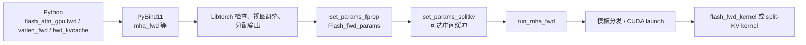
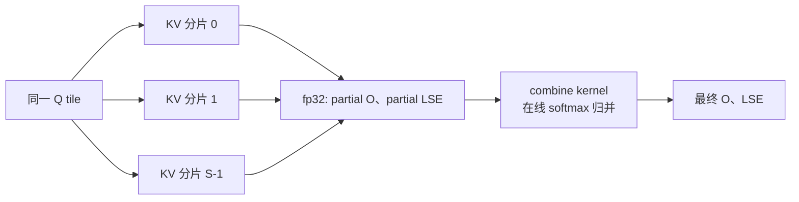

# FlashAttention-2 源码学习笔记（二）：C++ 前向接口与调度

第一部分停在 Python API 与 `flash_attn_2_cuda` extension 的边界。本部分进入 `flash-attention/csrc/flash_attn/flash_api.cpp`，只研究前向的**宿主端封装与 kernel 转发**，暂不进入 `compute_attn` 的 tile 计算细节。

本文以三个 PyBind11 导出接口为主线：

- `mha_fwd`：定长 batch 的普通 attention；
- `mha_varlen_fwd`：用 `cu_seqlens_*` 表示不等长序列的 attention；
- `mha_fwd_kvcache`：decode 时读写 KV cache 的 attention。

它们的共同目标是把 Libtorch 的 `at::Tensor` 转成一个可按值传入 CUDA kernel 的 `Flash_fwd_params`。真正的调用链为：



## 三个 C++ 前向接口总览

| 接口 | Q/K/V 的逻辑布局 | 额外状态 | 输出 | 典型场景 |
| --- | --- | --- | --- | --- |
| `mha_fwd` | `q: (B, Lq, H, D)`，`k/v: (B, Lk, Hk, D)` | 可选 `out_`、ALiBi、dropout RNG。 | `out`、`softmax_lse`、可选 `p`、`rng_state`。 | 训练或普通 prefill。 |
| `mha_varlen_fwd` | `q: (total_q, H, D)`，`k/v: (total_k, Hk, D)`；也可令 K/V 为 paged KV。 | `cu_seqlens_q/k`、`seqused_k`、`leftpad_k`、`block_table`。 | 同上，但 LSE 为无 padding 布局。 | unpadding 后的变长 batch、varlen paged KV。 |
| `mha_fwd_kvcache` | `q: (B, Lq, H, D)`，cache 为定长或分页布局。 | 可追加 `k/v`、`seqlens_k`、RoPE、cache 重映射、paged KV。 | `out`、`softmax_lse`。 | decode / chunked decode。 |

### LSE（log-sum-exp）是什么

本文的 **LSE** 是 `log-sum-exp`，即每个 attention query row 的 softmax 分母取对数；它**不是** softmax 概率，也不是输出向量。对固定的 `(b, h, i)`，设 $X[i,j]$ 为已缩放、mask 后的 attention score，`J_i` 为没有被 mask 的 key 下标集合，则：

$$
\operatorname{LSE}[b,h,i]
= \log\sum_{j\in J_i}e^{X[i,j]}.
$$

kernel 以稳定形式计算它：先取 $m_i=\max_{j\in J_i}X[i,j]$，再计算

$$
\operatorname{LSE}[b,h,i]
=m_i+\log\sum_{j\in J_i}e^{X[i,j]-m_i}.
$$

`softmax_lse` 使用 fp32 保存这个标量：定长路径逻辑形状为 `(B, H, Lq)`，varlen 路径为 `(H, total_q)`。它让反向传播能够重建 softmax 的归一化信息，而无需保存完整 `(Lq, Lk)` 概率矩阵；在 split-KV 中，`softmax_lse_accum` 先保存每个分片的局部 LSE，combine kernel 再合并成最终 LSE。

三个函数都由 `flash-attention/csrc/flash_attn/flash_api.cpp` 末尾的 `PYBIND11_MODULE` 注册为 Python 侧的 `fwd`、`varlen_fwd`、`fwd_kvcache`。参数中的 `at::Tensor&`、`const at::Tensor&`、`std::optional<at::Tensor>&` 是 C++ 接口边界；进入 kernel 前，所有必要信息都会被摊平成指针、stride、尺寸和标志位。

## 先认识路径上的 Libtorch 接口

### `at::Tensor`：带元数据的张量句柄，不是裸 device 指针

`at::Tensor` 是 Libtorch / ATen 的 tensor 句柄。它持有或共享一个张量实现，其中包含 storage、shape、stride、dtype、device 和 autograd 相关元数据；复制 `at::Tensor` 通常复制的是轻量句柄，而非复制整块 GPU 数据。FA2 最终仍把 `data_ptr()` 取出的裸指针传给 kernel，但在 host 端先保留 `at::Tensor`，以维持 storage 生命周期。

| 接口 | 本文中的用法 | 关键语义 |
| --- | --- | --- |
| `dtype()` / `scalar_type()` | 验证 Q/K/V 为 `torch::kFloat16` 或 `torch::kBFloat16`；选择 `is_bf16`。 | 返回元素类型，不转换数据。 |
| `device()` / `is_cuda()` | `CUDAGuard{q.device()}` 与 `CHECK_DEVICE(x)`。 | 决定 tensor 所在设备；本 extension 仅接受 CUDA tensor。 |
| `sizes()`、`size(dim)`、`numel()`、`dim()` | 读出 `B/L/H/D`、变长 batch 大小、ALiBi 维度。 | 读取 shape，不访问 tensor 数据。 |
| `stride(dim)` / `stride(-1)` | 写入 `*_batch/row/head_stride`；检查最后一维连续。 | stride 的单位是**元素数**而非字节数。 |
| `data_ptr()` / `data_ptr<T>()` | 写入 `q_ptr`、`block_table`、LSE 等 kernel 指针。 | 返回当前 storage 的 data 指针；不转移所有权。 |
| `is_contiguous()` | `cu_seqlens`、`leftpad_k`、`cache_batch_idx` 的检查。 | 检查整个 tensor 是否 contiguous；Q/K/V 只强制最后一维 contiguous。 |
| `reshape(...)` | decode 的 GQA/MQA 快路径和恢复原布局。 | layout 兼容时返回共享 storage 的 view；不兼容时会生成复制。不会原地修改原 tensor 的 shape。 |
| `transpose(dim0, dim1)` | 在 `seqlen_q == 1` 的 GQA/MQA 快路径交换 group 与 KV head 维。 | 返回共享 storage 但 stride 改变的视图。 |
| `index(...)` / `copy_` | KV cache 路径裁掉补齐的 `head_dim`，写回调用方提供的 `out_` / cache。 | `copy_` 是原地写入，有可观察副作用。 |
| `zero_()` / `fill_()` | K 长度为零或 `zero_tensors` 时写出约定结果。 | 原地修改 tensor。 |
| `options()` | 从 Q 继承 device、layout 等，随后以 `opts.dtype(at::kFloat)` 覆盖 dtype。 | 返回可链式修改的 `TensorOptions` 值。 |

### `stride(dim)`：维度索引与地址计算

**用途**

`stride(dim)` 返回沿第 `dim` 个维度把逻辑索引加一时，底层地址需要前进的**元素数**。它不是字节数；若元素类型为 fp16，stride 为 8 实际对应前进 16 字节。`at::Tensor::stride()` 不带参数时返回所有维度的 stride；带参数时返回一个维度的 stride。

对一个 `n` 维 tensor，`dim` 可以是正数或负数：

| 写法 | 含义 | 4 维 `(B, L, H, D)` 中对应的维度 |
| --- | --- | --- |
| `stride(0)` 到 `stride(n - 1)` | 从最左侧开始、从 0 编号。 | `stride(0)=B`，`stride(1)=L`，`stride(2)=H`，`stride(3)=D`。 |
| `stride(-1)` 到 `stride(-n)` | 从最右侧开始、从 -1 编号。 | `stride(-1)=D`，`stride(-2)=H`，`stride(-3)=L`，`stride(-4)=B`。 |

负数并不表示负 stride；它只是 Python / PyTorch 风格的**倒数维度索引**。对 `n` 维 tensor，合法范围是 `[-n, n - 1]`，负索引按 `dim + n` 归一化。例如四维 Q 中：

```cpp
/**
 * @brief 从 `(B, L, H, D)` tensor 提取 FA2 需要的三个逻辑步幅。
 *
 * @param q [in] 四维 Q tensor；最后一维 D 必须连续。
 * @note `-3/-2/-1` 与前置 batch 维数无关，便于同一代码适配布局末尾的 L/H/D。
 */
const auto q_batch_stride = q.stride(0);   // `(B, L, H, D)` 中沿 B 前进一步。
const auto q_row_stride = q.stride(-3);   // `-3 + 4 = 1`，即沿 L/token 前进一步。
const auto q_head_stride = q.stride(-2);  // `-2 + 4 = 2`，即沿 H 前进一步。
const auto q_dim_stride = q.stride(-1);   // `-1 + 4 = 3`，即沿 D 前进一步。
```

若 Q 是默认 contiguous 的 `(B=2, L=3, H=4, D=8)` fp16 tensor，其 stride 为：

```text
q.sizes()   = (2, 3, 4, 8)
q.strides() = (96, 32, 8, 1)
                │   │  │  └─ stride(-1)：同一 head vector 的相邻元素紧挨着。
                │   │  └──── stride(-2)：下一个 head 要跳过一个 D=8 的 vector。
                │   └─────── stride(-3)：下一个 token 要跳过 H×D=32 个元素。
                └─────────── stride(0)：下一个 batch 要跳过 L×H×D=96 个元素。
```

设 `q.data_ptr()` 指向该 view 的逻辑 `q[0, 0, 0, 0]`，则元素 `q[b, i, h, d]` 的元素偏移为：

$$
\operatorname{offset}(b,i,h,d)
= b \cdot \operatorname{stride}(0)
+ i \cdot \operatorname{stride}(1)
+ h \cdot \operatorname{stride}(2)
+ d \cdot \operatorname{stride}(3).
$$

例如 `q[1, 2, 3, 4]` 的 offset 为 $1\times96 + 2\times32 + 3\times8 + 4\times1 = 188$。CUDA kernel 只需从 `q_ptr` 出发，按 `q_batch_stride`、`q_row_stride`、`q_head_stride` 加上这些偏移即可定位数据；无需携带 `at::Tensor` 对象。

`transpose` 会交换 shape 和 stride 的解释，而不会重排 storage。继续以上例，`q.transpose(1, 2)` 的 shape 变为 `(2, 4, 3, 8)`，stride 变为 `(96, 8, 32, 1)`：最后一维仍连续，但 tensor 整体已不满足默认 contiguous。FA2 因此只检查 `stride(-1) == 1`，并把其余维度的实际 stride 写入 `Flash_fwd_params`，避免为了满足“整块连续”而复制 Q/K/V。

变长 Q 的 shape 是 `(total_q, H, D)`，只有三维；此时 `stride(-3)` 就是 `stride(0)`，表示下一个压平 token 的距离，`stride(-2)` / `stride(-1)` 仍分别表示下一个 head / head-dim 元素的距离。这正是 `set_params_fprop` 始终使用 `stride(-3)`、`stride(-2)` 的原因：它面向的是“末三维为 token、head、head-dim”的统一逻辑，而不是硬编码定长路径的绝对维度号。

**注意点**

- `stride(-1) == 1` 表示最后一维连续，不等于整个 tensor contiguous；`is_contiguous()` 更严格，会检查全部维度布局。
- 切片得到的 view 可能有非零 storage offset；`data_ptr()` 已指向该 view 的第一个逻辑元素，kernel 仍应从此指针加 stride 偏移，而不要假设它等于原始 storage 起点。
- `expand` 等 view 可以产生 stride 为 0，表示多个逻辑位置复用同一元素。FA2 只验证最后一维为 1，并不把任意 broadcast stride 自动变成安全输入；应遵循各入口的 shape / layout 契约。

对连续的 `(B, L, H, D)` Q，`q.stride(-3)` 是相邻 token 的元素间隔，`q.stride(-2)` 是相邻 head 的元素间隔；最后一维 `D` 被要求 `stride(-1) == 1`。因此 CUDA 可以把同一个 `Flash_fwd_params` 用于非紧凑的 batch/head 维，而仍保证每个 head vector 可连续加载。

### 创建、可选参数与错误检查

| 符号 | 用途 | 本文中的意义 |
| --- | --- | --- |
| `torch::empty_like(q)` | 创建与 Q 同 shape / options 的未初始化输出。 | 未传 `out_` 时分配 `out`。 |
| `torch::empty(shape, options)` | 按给定 shape、dtype、device 分配。 | 分配 fp32 的 `softmax_lse`、split-KV 累积 buffer、`rng_state`。 |
| `torch::TensorOptions()` | 构造分配选项。 | `dtype(torch::kFloat32).device(torch::kCUDA)` 创建 RNG 状态。 |
| `std::optional<at::Tensor>` | 表示可省略 tensor。 | `out_`、ALiBi、`block_table_`、新增 K/V 等。先用 `has_value()` 再 `value()`。 |
| `torch::IntArrayRef` | 不拥有的整数 shape view。 | `CHECK_SHAPE` 与 ALiBi shape 验证。 |
| `TORCH_CHECK(cond, ...)` | 条件不满足时抛出 PyTorch 异常。 | 所有用户输入契约检查走此路径。 |
| `C10_CUDA_CHECK` / `C10_CUDA_KERNEL_LAUNCH_CHECK` | 将 CUDA API / kernel launch 错误转换为 PyTorch 错误。 | 设置动态 shared memory 和 launch 后立即检查。 |

### 设备、stream 与随机数

`at::cuda::CUDAGuard device_guard{q.device()}` 是 RAII（资源获取即初始化）守卫：构造时把当前 CUDA device 切换到 Q 所在设备，离开函数作用域时自动恢复先前设备。没有它，多 GPU 进程可能把 kernel 错发到 `cuda:0`。

`at::cuda::getCurrentCUDAStream().stream()` 取得**当前 PyTorch CUDA stream**的 `cudaStream_t`。FA2 在该 stream 上 launch，因此会自然遵守调用方此前在同一 stream 排入的 tensor 依赖，而不额外做全设备同步。

当 `p_dropout > 0` 时，`at::cuda::detail::getDefaultCUDAGenerator()` 取得默认 CUDA generator；代码在 generator mutex 保护下获得 `at::PhiloxCudaState`，并 placement-new 到 `Flash_fwd_params::philox_args`。该状态与返回给 Python 的 `(seed, offset)` `rng_state` 一起保证 backward 可以重放同一 dropout mask。

## `flash.h`：kernel 的 ABI 参数包

文件 `flash-attention/csrc/flash_attn/src/flash.h` 定义的结构体是 host C++ 与 CUDA device code 共用的 ABI。它们不拥有 tensor storage；所有 `void*`、`int*` 都是调用期间有效的 device memory 借用指针。`set_params_fprop` 先 `params = {}` 清零，避免某条路径遗漏赋值时读取到未初始化字段。

### `Qkv_params`

```cpp
/**
 * @brief 描述 Q、K、V 三个逻辑矩阵在 device memory 中的地址与寻址步幅。
 *
 * @note 所有 stride 的单位均为元素数；指针不拥有对应 tensor 的 storage。
 */
struct Qkv_params {
    using index_t = int64_t;
    void* __restrict__ q_ptr;  ///< 输入 Q 的 device 指针。
    void* __restrict__ k_ptr;  ///< 输入 K 或 KV cache 的 device 指针。
    void* __restrict__ v_ptr;  ///< 输入 V 或 KV cache 的 device 指针。
    index_t q_batch_stride, k_batch_stride, v_batch_stride;
    index_t q_row_stride, k_row_stride, v_row_stride;
    index_t q_head_stride, k_head_stride, v_head_stride;
    int h, h_k;                ///< Q head 数与 KV head 数。
    int h_h_k_ratio;           ///< 预计算的 H / Hk，用于 MQA/GQA 的 head 映射。
};
```

| 字段组 | 含义 | 何时重要 |
| --- | --- | --- |
| `q_ptr/k_ptr/v_ptr` | Q、K、V 的起始地址。 | 所有路径都会设置；KV cache 路径中 `k_ptr/v_ptr` 指向 cache。 |
| `*_batch_stride` | 同一 tensor 相邻 batch 的元素距离。 | 定长路径直接由 `stride(0)` 设置；变长路径用 `cu_seqlens_*`，普通 K/V 的 batch stride 无需使用。 |
| `*_row_stride` | 同一 head 相邻 token 的元素距离。 | `stride(-3)`；对 varlen `(total, H, D)` 正好是 total/token 维 stride。 |
| `*_head_stride` | 同一 token 相邻 head 的元素距离。 | `stride(-2)`。 |
| `h/h_k/h_h_k_ratio` | Q 与 KV 的 head 拓扑。 | `h_h_k_ratio = h / h_k` 让一个 KV head 对应连续的一组 Q heads。 |

`__restrict__` 是编译器别名承诺：在合理的调用契约下，这些逻辑数组不重叠，帮助编译器优化加载和存储；它不负责运行时检查。

### `Flash_fwd_params`

`Flash_fwd_params : public Qkv_params` 在 QKV 基础上扩展输出、softmax、变长元数据、KV cache、位置编码、dropout 和 split-KV 字段。按角色阅读比逐行阅读更有效：

下面是 `flash-attention/csrc/flash_attn/src/flash.h` 中与源码字段顺序一致的结构体摘录；注释改为 Doxygen 风格中文说明。它继承的 Q/K/V 指针与 stride 字段见上一节 `Qkv_params`，因此没有在此重复展开。

```cpp
/**
 * @brief FlashAttention 前向 kernel 的统一参数 ABI。
 *
 * @details 该结构体按值传入 CUDA kernel，只保存 device memory 的借用指针、
 *          stride、尺寸与开关，不拥有任何 tensor storage。
 * @note host 端的 `set_params_fprop` 必须先将其清零，再按当前路径写入有效字段。
 */
struct Flash_fwd_params : public Qkv_params {
    /** @name 输出与 softmax */
    ///@{
    void* __restrict__ o_ptr;       ///< [out] 最终 attention 输出 O 的 device 指针。
    void* __restrict__ oaccum_ptr;  ///< [out] split-KV 的 fp32 partial O 累积缓冲区。
    index_t o_batch_stride;         ///< O 相邻 batch 的元素间隔。
    index_t o_row_stride;           ///< O 相邻 query token 的元素间隔。
    index_t o_head_stride;          ///< O 相邻 query head 的元素间隔。
    void* __restrict__ p_ptr;       ///< [out, optional] 测试用 softmax / dropout mask P。
    void* __restrict__ softmax_lse_ptr;      ///< [out] 最终每个 query row 的 fp32 logsumexp。
    void* __restrict__ softmax_lseaccum_ptr; ///< [out] split-KV 的 partial LSE 累积缓冲区。
    ///@}

    /** @name 运行时尺寸与缩放 */
    ///@{
    int b;                 ///< batch 大小。
    int seqlen_q;          ///< 当前 kernel 解释下的 query 序列长度。
    int seqlen_k;          ///< 当前 kernel 解释下的 key/value 序列长度或 cache 容量。
    int seqlen_knew;       ///< [optional] 本轮追加到 KV cache 的 token 数。
    int d;                 ///< 实际 head dimension。
    int seqlen_q_rounded;  ///< 向上取整后的 Q 长度，用于 tile / buffer。
    int seqlen_k_rounded;  ///< 向上取整后的 K 长度，用于 tile / buffer。
    int d_rounded;         ///< 向上取整后的 head dimension。
    int rotary_dim;        ///< [optional] RoPE 实际旋转的维度数；0 表示未启用。
    int total_q;           ///< varlen 路径中压平后的 Q token 总数。
    float scale_softmax;   ///< kernel 使用的 score 缩放或 softcap 缩放。
    float scale_softmax_log2;  ///< `scale_softmax * log2(e)`，供以 2 为底的指数路径使用。
    ///@}

    /** @name 变长序列与可见长度 */
    ///@{
    int* __restrict__ cu_seqlens_q;  ///< [in, optional] Q 的 `(B + 1)` 前缀和边界。
    int* __restrict__ cu_seqlens_k;  ///< [in, optional] K 的前缀和边界，或 KV cache 的逐 batch 长度。
    int* __restrict__ leftpad_k;     ///< [in, optional] 每条 K 序列的左 padding 长度。
    int* __restrict__ seqused_k;     ///< [in, optional] 每条序列实际参与 attention 的 K token 数。
    int* __restrict__ blockmask;     ///< [in, optional] 预留的 block 级 mask 指针；当前三条入口不填充它。
    ///@}

    /** @name KV cache 追加与 RoPE */
    ///@{
    void* __restrict__ knew_ptr;  ///< [in, optional] 本轮新 K 的 device 指针。
    void* __restrict__ vnew_ptr;  ///< [in, optional] 本轮新 V 的 device 指针。
    index_t knew_batch_stride;    ///< 新 K 相邻 batch 的元素间隔。
    index_t vnew_batch_stride;    ///< 新 V 相邻 batch 的元素间隔。
    index_t knew_row_stride;      ///< 新 K 相邻 token 的元素间隔。
    index_t vnew_row_stride;      ///< 新 V 相邻 token 的元素间隔。
    index_t knew_head_stride;     ///< 新 K 相邻 KV head 的元素间隔。
    index_t vnew_head_stride;     ///< 新 V 相邻 KV head 的元素间隔。
    void* __restrict__ rotary_cos_ptr;  ///< [in, optional] RoPE cosine 表。
    void* __restrict__ rotary_sin_ptr;  ///< [in, optional] RoPE sine 表。
    bool is_rotary_interleaved;         ///< RoPE 是否采用相邻维度交错配对。
    ///@}

    /** @name KV cache 重映射与分页 */
    ///@{
    int* __restrict__ cache_batch_idx;  ///< [in, optional] 当前 batch 到 cache batch 的映射。
    int* __restrict__ block_table;      ///< [in, optional] paged KV 的逻辑页到物理 block 映射表。
    index_t block_table_batch_stride;   ///< block table 相邻 batch 行的元素间隔。
    int page_block_size;                ///< 每个物理 KV page 容纳的 token 数。
    ///@}

    /** @name Dropout、mask 与随机状态 */
    ///@{
    float p_dropout;                 ///< 保留概率 `1 - dropout_p`，不是丢弃概率。
    uint8_t p_dropout_in_uint8_t;    ///< 将保留概率量化后的随机数比较阈值。
    float rp_dropout;                ///< 反向缩放 `1 / p_dropout`。
    float scale_softmax_rp_dropout;  ///< softmax 缩放与 dropout 反向缩放的乘积。
    int window_size_left;            ///< local attention 左窗口；负数表示无限制。
    int window_size_right;           ///< local attention 右窗口；causal 时为 0。
    float softcap;                   ///< softcap 参数；0 表示关闭。
    uint64_t philox_args[4];         ///< 容纳 `at::PhiloxCudaState` 的不透明按值缓冲区。
    uint64_t* rng_state;             ///< [out] 长度为 2 的 `(seed, offset)` device 状态。
    bool is_bf16;                    ///< Q/K/V 是否为 bf16；否则此路径使用 fp16。
    bool is_causal;                  ///< 是否为纯 causal mask 语义。
    ///@}

    /** @name 其他 dispatch 标记 */
    ///@{
    bool is_seqlens_k_cumulative;  ///< K 边界是前缀和，还是逐 batch 的实际 cache 长度。
    int num_splits;                 ///< split-KV 的 K/V 分片数。
    void* __restrict__ alibi_slopes_ptr;  ///< [in, optional] ALiBi slope 的 device 指针。
    index_t alibi_slopes_batch_stride;    ///< ALiBi 为 `(B, H)` 时的 batch stride；一维时为 0。
    bool unpadded_lse;              ///< LSE 是否采用 `(H, total_q)` 的 varlen 无 padding 布局。
    bool seqlenq_ngroups_swapped;   ///< decode GQA/MQA 快路径是否交换了 Q 的 group/head 解释。
    ///@}
};
```

| 字段组 | 关键字段 | 用途 |
| --- | --- | --- |
| 输出与 softmax | `o_ptr`、`p_ptr`、`softmax_lse_ptr` | 分别写 O、测试用 P/dropout mask、每行 logsumexp。 |
| split-KV 累积 | `oaccum_ptr`、`softmax_lseaccum_ptr`、`num_splits` | 多个 K/V 分片先写 fp32 中间结果，再由 combine kernel 归并。 |
| 尺寸与类型 | `b`、`h`、`h_k`、`seqlen_q/k`、`d`、各 `*_rounded`、`is_bf16` | kernel launch、tile mask 与 dtype dispatch 的运行时事实。 |
| 变长序列 | `cu_seqlens_q/k`、`seqused_k`、`leftpad_k`、`total_q`、`unpadded_lse` | 每个 batch 的起止 token 偏移、实际 K 长度和 LSE 布局。 |
| 新 KV 与 RoPE | `knew_ptr/vnew_ptr`、各 `knew_*_stride`、`rotary_*_ptr`、`rotary_dim` | 让 split-KV kernel 在 decode 中追加 K/V，并可融合旋转位置编码。 |
| KV cache 索引 | `cache_batch_idx`、`block_table`、`block_table_batch_stride`、`page_block_size` | 支持 cache 重排和 paged KV 的逻辑页到物理 block 映射。 |
| attention 修饰 | `scale_softmax`、`scale_softmax_log2`、`softcap`、窗口字段、`alibi_slopes_ptr` | 缩放、softcap、causal/local mask、ALiBi。 |
| dropout | `p_dropout`、`p_dropout_in_uint8_t`、`rp_dropout`、`philox_args`、`rng_state` | 保存概率、整数阈值、反向缩放与 Philox 随机状态。 |

`seqlen_q_rounded`、`seqlen_k_rounded` 和 `d_rounded` 不是原始逻辑形状，而是为 block/tile 分配和边界 mask 准备的向上取整尺寸。`d` 仍是实际 head dimension，因此 kernel 可通过 `d == Kernel_traits::kHeadDim` 判断是否能省去 K 维边界判断。

## `seqlenq_ngroups_swapped`：decode GQA/MQA 的维度交换特化

`seqlenq_ngroups_swapped` 并不改变 attention 的数学定义，也不是 causal/local mask 开关。它表示：**为提高单 token decode 的并行度，调用端已把 Q 中的 GQA/MQA 分组维（`ngroups`）临时解释为 query 序列维。** 入口据此创建 Q/O view 并在结束时恢复布局；在显式把该值传给 `Flash_fwd_params` 的路径中，kernel 还会据此修正寻址。

设 Q head 数为 `Hq`、KV head 数为 `Hkv`，则每个 KV head 服务的 query-head 组数为：

$$
G = \frac{Hq}{Hkv} = \texttt{ngroups}.
$$

普通 decode 的 Q 布局为 `(B, 1, Hq, D)`。其中 Q head $h_q = h_{kv} \times G + g$ 与 KV head $h_{kv}$ 配对。源码在满足下列所有条件时启用该特化：

```cpp
// flash-attention/csrc/flash_attn/flash_api.cpp
const int seqlenq_ngroups_swapped =
    seqlen_q == 1 &&
    num_heads > num_heads_k &&
    window_size_left < 0 &&
    window_size_right < 0 &&
    p_dropout == 0.f &&
    head_size % 8 == 0 &&
    !alibi_slopes_.has_value();
```

也就是说，它只服务于无窗口、无 dropout、无 ALiBi 的单 query-token GQA/MQA decode。ALiBi 的 slope 按原始 Q-head 编号选择；dropout 的随机数布局也依赖原来的逻辑索引。两者若不额外重映射，交换维度后会改变语义，因此源码直接关闭该特化。

### 实际变换：把 group 变成临时的 `seqlen_q`

```cpp
// 原始 Q: (B, 1, Hq, D)，且 Hq = Hkv * ngroups。
q = q.reshape({batch_size, num_heads_k, ngroups, head_size})
     .transpose(1, 2);
// 现在 Q 的逻辑布局为: (B, ngroups, Hkv, D)。
seqlen_q = ngroups;
num_heads = num_heads_k;
```

例如 `Hq = 32`、`Hkv = 8`、`G = 4` 时：

| 阶段 | Q 的逻辑形状 | kernel 看到的含义 |
| --- | --- | --- |
| 原始 | `(B, 1, 32, D)` | 一个 query 位置、32 个 Q heads。 |
| `reshape` | `(B, 8, 4, D)` | 将连续的 Q-head 维拆为 `(KV head, group)`。 |
| `transpose(1, 2)` | `(B, 4, 8, D)` | 4 个 group 成为 4 行临时 Q；每一列 head 对应一个 KV head。 |

K/V 不需要转置，仍是 `(B, Sk, Hkv, D)`。因此临时 Q 的第 $(g, h_{kv})$ 行与原来的 Q head $h_{kv} * G + g$ 等价，并继续读取同一个 KV head。这样可把原本 `seqlen_q = 1` 的瘦小 tile 变为 `seqlen_q = G` 的 tile，让一个 CTA 更有效地处理同组的 query heads 并复用 K/V 读取。

### 此标志控制的三处寻址

这里需要区分两个同名但不同层级的变量：`mha_fwd` 的局部 `seqlenq_ngroups_swapped` 控制 Q/O view 与最终恢复；它调用 `set_params_fprop` 时没有传最后一个可选参数，因此 `params.seqlenq_ngroups_swapped` 保持默认 `false`。`mha_varlen_fwd` 的交换快路径才会显式传入该值，以下第 1、2 项描述的是后者写入 `Flash_fwd_params` 后的 kernel 寻址特化。

1. **Q/O 的 batch stride。** `set_params_fprop` 在定长路径中检测该标志，并对 `q_batch_stride` 与 `o_batch_stride` 乘以临时 `seqlen_q`。这是 kernel 按交换后布局计算 batch 基址所需的修正；不能再把原来的 `(B, 1, Hq, D)` stride 解释直接沿用。

   ```cpp
   if (seqlenq_ngroups_swapped) {
       params.q_batch_stride *= seqlen_q;
       params.o_batch_stride *= seqlen_q;
   }
   ```

2. **LSE 的布局。** `flash_fwd_kernel.h::get_lse_tile` 用该标志选择特殊 stride：逻辑坐标仍以 `(batch, head, q_row)` 传入，但内存按交换后的关系写入，使结果能恢复到原 API 的 Q-head 顺序。特别是在 varlen 路径中，它还禁止将压平 token offset 作为普通 varlen Q offset。

   ```cpp
   const bool varlen_q = params.unpadded_lse && !params.seqlenq_ngroups_swapped;
   auto lse_stride = params.seqlenq_ngroups_swapped
       ? make_stride(1, params.seqlen_q * params.b, params.b)
       : /* 常规定长或 varlen 的 LSE stride */;
   ```

3. **输出恢复。** kernel 结束后，`mha_fwd` 将临时 `(B, G, Hkv, D)` 的 O 转回调用方要求的 `(B, 1, Hq, D)`；LSE 也恢复到原始 Q-head 数对应的形状。这个恢复由入口局部变量完成，不依赖 `params` 中的同名字段。

   ```cpp
   if (seqlenq_ngroups_swapped) {
       out = out.transpose(1, 2)
                 .reshape({batch_size, 1, num_heads_k * seqlen_q, head_size});
       q = q.transpose(1, 2)
               .reshape({batch_size, 1, num_heads_k * seqlen_q, head_size});
       softmax_lse = softmax_lse.reshape({batch_size, num_heads_k * seqlen_q, 1});
   }
   ```

因此，这个 bool 的准确含义是“**Q 的 `seqlen_q` 与 GQA/MQA 分组维已经交换，所有依赖这两个维度的寻址都要采用特化规则**”。它只在内部短暂为真，Python/C++ API 的输入输出形状保持不变。

## `set_params_fprop`：把 tensor 元数据摊平

`set_params_fprop` 位于 `flash-attention/csrc/flash_attn/flash_api.cpp`，是三个前向入口共享的核心封装函数。它不分配输出、不发射 kernel，只填充 `Flash_fwd_params` 的通用部分。

```cpp
/**
 * @brief 从 Libtorch tensor 和运行时配置构造前向 kernel 参数包。
 *
 * @param params [out] 先清零再填充的参数包；其中指针只借用传入 tensor 的 device storage。
 * @param b 定长 batch 大小；varlen 路径为 `cu_seqlens_q.numel() - 1`。
 * @param seqlen_q/seqlen_k 当前路径的 Q/K 逻辑长度或最大长度。
 * @param seqlen_q_rounded/seqlen_k_rounded 面向 tile / buffer 的 Q/K 向上取整长度。
 * @param h/h_k Q head 数与 KV head 数，要求 `h % h_k == 0`。
 * @param d/d_rounded 实际与向上取整后的 head dimension。
 * @param q/k/v [in] Q、K、V 或 KV cache tensor，最后一维必须连续。
 * @param out [in/out] 输出 tensor；kernel 通过其地址和 stride 写入 attention 结果。
 * @param cu_seqlens_q_d/cu_seqlens_k_d [in] 可选的变长 token 边界；定长路径传 `nullptr`。
 * @param seqused_k [in] 可选的逐 batch 实际 K 长度。
 * @param p_d [out] 可选的测试用 P / dropout mask device 地址。
 * @param softmax_lse_d [out] 每个 query row 的 fp32 LSE device 地址。
 * @param p_dropout 调用方的丢弃概率；函数内部转换为保留概率。
 * @param softmax_scale QK^T 在 softmax 前的缩放。
 * @param window_size_left/window_size_right local attention 的左右窗口。
 * @param softcap score softcap；非正值表示关闭。
 * @param seqlenq_ngroups_swapped decode GQA/MQA 快路径是否已调整 Q 的 group/head 布局。
 * @param unpadded_lse LSE 是否采用 varlen 的 `(H, total_q)` 布局。
 */
void set_params_fprop(
    Flash_fwd_params& params,
    const size_t b,
    const size_t seqlen_q,
    const size_t seqlen_k,
    const size_t seqlen_q_rounded,
    const size_t seqlen_k_rounded,
    const size_t h,
    const size_t h_k,
    const size_t d,
    const size_t d_rounded,
    const at::Tensor q,
    const at::Tensor k,
    const at::Tensor v,
    at::Tensor out,
    void* cu_seqlens_q_d,
    void* cu_seqlens_k_d,
    void* seqused_k,
    void* p_d,
    void* softmax_lse_d,
    float p_dropout,
    float softmax_scale,
    int window_size_left,
    int window_size_right,
    const float softcap,
    bool seqlenq_ngroups_swapped = false,
    const bool unpadded_lse = false) {
    // 清空全部字段，保证复用参数包时不会遗留上一次调用的状态。
    params = {};

    // 前向 kernel 只需区分 fp16 与 bf16；Q/K/V 的 dtype 已由入口一致性检查保证相同。
    params.is_bf16 = q.dtype() == torch::kBFloat16;

    // 取出 device address。data_ptr() 返回未类型化地址，最终由 CUDA kernel 按元素类型解释。
    params.q_ptr = q.data_ptr();
    params.k_ptr = k.data_ptr();
    params.v_ptr = v.data_ptr();

    // 所有 stride 的单位都是元素而不是字节。
    // 对定长 (B, S, H, D) tensor，-3/-2 分别是 S 和 H 维；
    // 对 varlen (total_S, H, D) tensor，它们仍恰好是 token 和 H 维。
    params.q_row_stride = q.stride(-3);
    params.k_row_stride = k.stride(-3);
    params.v_row_stride = v.stride(-3);
    params.q_head_stride = q.stride(-2);
    params.k_head_stride = k.stride(-2);
    params.v_head_stride = v.stride(-2);

    // out 的布局通常与 q 相同，但仍单独读取其地址和 stride，不能依赖这个约定。
    params.o_ptr = out.data_ptr();
    params.o_row_stride = out.stride(-3);
    params.o_head_stride = out.stride(-2);

    // 变长路径以压平 token 存储，须由 cu_seqlens 定位各 batch，因而不设置 batch stride。
    if (cu_seqlens_q_d == nullptr) {
        // 定长路径通过第 0 维 stride 从 batch b 跳到 batch b + 1。
        params.q_batch_stride = q.stride(0);
        params.k_batch_stride = k.stride(0);
        params.v_batch_stride = v.stride(0);
        params.o_batch_stride = out.stride(0);

        // decode GQA/MQA 特化会交换 seqlen_q 与 group 的解释；
        // 对应地修正 Q 和 O 的 batch 跳距，K/V 仍沿用原布局。
        if (seqlenq_ngroups_swapped) {
            params.q_batch_stride *= seqlen_q;
            params.o_batch_stride *= seqlen_q;
        }
    }

    // 变长序列的前缀和边界及可选实际 K 长度；nullptr 表示该功能未启用。
    params.cu_seqlens_q = static_cast<int*>(cu_seqlens_q_d);
    params.cu_seqlens_k = static_cast<int*>(cu_seqlens_k_d);
    params.seqused_k = static_cast<int*>(seqused_k);

    // P = softmax(QK^T) 的可选保存地址（测试 / dropout mask），以及每行 LSE 输出地址。
    params.p_ptr = p_d;
    params.softmax_lse_ptr = softmax_lse_d;

    // 记录逻辑尺寸、面向 tile 的取整尺寸以及 GQA/MQA 的 head 映射比例。
    params.b = b;
    params.h = h;
    params.h_k = h_k;
    params.h_h_k_ratio = h / h_k;
    params.seqlen_q = seqlen_q;
    params.seqlen_k = seqlen_k;
    params.seqlen_q_rounded = seqlen_q_rounded;
    params.seqlen_k_rounded = seqlen_k_rounded;
    params.d = d;
    params.d_rounded = d_rounded;

    // softcap 由编译期开关控制；关闭该功能的构建不能接受正 softcap。
#ifdef FLASHATTENTION_DISABLE_SOFTCAP
    TORCH_CHECK(
        softcap <= 0.0,
        "This flash attention build does not support softcap.");
#endif
    if (softcap > 0.0) {
        // Kernel 计算 softcap * tanh((QK^T * softmax_scale) / softcap) 的等价参数化。
        params.softcap = softmax_scale / softcap;
        params.scale_softmax = softcap;
        params.scale_softmax_log2 = softcap * M_LOG2E;
    } else {
        // 显式写 0 避免调用方传入 NaN 时把它带入未启用的 softcap 分支。
        params.softcap = 0.0;
        params.scale_softmax = softmax_scale;
        // kernel 的 exp2 路径需要以 log2 为底的缩放系数。
        params.scale_softmax_log2 = softmax_scale * M_LOG2E;
    }

    // API 传入的是丢弃概率；kernel 比较的是保留概率。
    params.p_dropout = 1.f - p_dropout;
    // 将浮点阈值预转为整数，随机 uint8 无须在 kernel 中转换成 float。
    // 使用 floor 是因为比较操作为 <=，从而不使保留概率向上偏移。
    // params.p_dropout_in_uint = uint32_t(std::floor(params.p_dropout * 4294967295.0));
    // params.p_dropout_in_uint16_t = uint16_t(std::floor(params.p_dropout * 65535.0));
    params.p_dropout_in_uint8_t = uint8_t(std::floor(params.p_dropout * 255.0));
    // inverted dropout：保留元素在训练时需乘 1 / keep_prob。
    params.rp_dropout = 1.f / params.p_dropout;
    params.scale_softmax_rp_dropout = params.rp_dropout * params.scale_softmax;
    TORCH_CHECK(p_dropout < 1.f);
#ifdef FLASHATTENTION_DISABLE_DROPOUT
    TORCH_CHECK(
        p_dropout == 0.0f,
        "This flash attention build does not support dropout.");
#endif

    // causal 是左窗口无限、右窗口为 0 的特殊 local-attention 表达。
    params.is_causal = window_size_left < 0 && window_size_right == 0;

    // 将只指定一侧窗口的情形规范化：未限制的一侧扩大到整段 K。
    if (window_size_left < 0 && window_size_right >= 0) {
        window_size_left = seqlen_k;
    }
    if (window_size_left >= 0 && window_size_right < 0) {
        window_size_right = seqlen_k;
    }
    params.window_size_left = window_size_left;
    params.window_size_right = window_size_right;

#ifdef FLASHATTENTION_DISABLE_LOCAL
    TORCH_CHECK(
        params.is_causal || (window_size_left < 0 && window_size_right < 0),
        "This flash attention build does not support local attention.");
#endif

    // 本文件的 cu_seqlens 始终是 cumulative offsets，而非每段独立长度。
    params.is_seqlens_k_cumulative = true;

#ifdef FLASHATTENTION_DISABLE_UNEVEN_K
    TORCH_CHECK(
        d == d_rounded,
        "This flash attention build does not support headdim not being a multiple of 32.");
#endif

    // 记录由调用路径选择的 LSE 布局和 decode GQA/MQA 布局解释。
    params.unpadded_lse = unpadded_lse;
    params.seqlenq_ngroups_swapped = seqlenq_ngroups_swapped;
}
```

它完成的关键转换如下：

1. **布局转换**：`at::Tensor` 的 `data_ptr()` 与 `stride()` 变成 plain pointer + `int64_t` stride。kernel 不再需要 Libtorch 类型。
2. **定长 / 变长分叉**：`cu_seqlens_q_d == nullptr` 时设置 batch stride；非空时 kernel 通过 `cu_seqlens` 找每个 batch 的首 token，不能把压平的 token 维误当成固定 batch stride。
3. **数值参数预计算**：无 softcap 时，`scale_softmax = softmax_scale`、`scale_softmax_log2 = softmax_scale * M_LOG2E`；启用 softcap 时改写为 kernel 所需的缩放组合。dropout 将“丢弃率”转换为“保留率”`1 - p_dropout`、倒数缩放和 uint8 比较阈值。
4. **mask 规范化**：`window_size_left < 0 && window_size_right == 0` 被编码成 `is_causal`；只有单侧窗口时，另一侧扩展到 `seqlen_k`，从而以统一的左右窗口表达 local attention。
5. **特例标记**：`unpadded_lse` 说明 varlen 的 LSE 是 `(H, total_q)`；`seqlenq_ngroups_swapped` 说明 decode 的 GQA/MQA Q 已改变解释方式。

## 三条前向路径如何填同一个参数包

### `mha_fwd`：定长 batch 的基准路径

这是定长 Q/K/V 的完整 C++ 前向封装。它接收 `(B, L, H, D)` 布局，检查 PyTorch tensor 契约，按需使用 decode GQA/MQA 特化，建立 `Flash_fwd_params`，最后在当前 CUDA stream 发射 kernel。

```cpp
/**
 * @brief 执行定长 batch 的 FlashAttention 前向计算，并返回输出与训练所需辅助 tensor。
 *
 * @param q [in/out] CUDA Q tensor，形状为 `(B, Lq, Hq, D)`；仅在内部 GQA/MQA
 *        decode 特化中暂时替换为 view，函数结束前恢复为原逻辑形状。
 * @param k [in] CUDA K tensor，形状为 `(B, Lk, Hkv, D)`，最后一维必须连续。
 * @param v [in] CUDA V tensor，形状为 `(B, Lk, Hkv, D)`，最后一维必须连续。
 * @param out_ [in, optional] 调用方预分配的输出 `(B, Lq, Hq, D)`；无值时内部创建。
 * @param alibi_slopes_ [in, optional] fp32 ALiBi slope，形状为 `(Hq)` 或 `(B, Hq)`。
 * @param p_dropout dropout 的丢弃概率，取值范围 `[0, 1)`。
 * @param softmax_scale QK^T 在 softmax 前乘的缩放系数。
 * @param is_causal 是否请求 causal mask；单 token、无 ALiBi 时与非 causal 等价。
 * @param window_size_left 左侧 local-attention 窗口；负值表示不限制。
 * @param window_size_right 右侧 local-attention 窗口；负值表示不限制。
 * @param softcap score softcap 系数；非正值表示关闭，当前不能与 dropout 同时使用。
 * @param return_softmax 是否额外返回用于 dropout 的概率/mask tensor。
 * @param unused_generator_compat 仅为旧 Python API 的参数位置兼容而保留，必须为空。
 * @return 顺序返回 `{out, softmax_lse, p, rng_state}`：attention 输出、每个 Q row 的
 *         fp32 LSE、可选概率/mask（未请求时为空 tensor）、Philox 的 seed/offset 状态。
 */
std::vector<at::Tensor>
mha_fwd(
    at::Tensor& q,
    const at::Tensor& k,
    const at::Tensor& v,
    std::optional<at::Tensor>& out_,
    std::optional<at::Tensor>& alibi_slopes_,
    const float p_dropout,
    const float softmax_scale,
    bool is_causal,
    int window_size_left,
    int window_size_right,
    const float softcap,
    const bool return_softmax,
    std::optional<at::Tensor> unused_generator_compat) {
    // 新版实现只使用 PyTorch 默认 CUDA generator；旧 generator 参数必须为 None。
    TORCH_CHECK(
        !unused_generator_compat.has_value(),
        "flash-attn: the RNG `generator` argument is no longer supported and must be None; "
        "dropout (when enabled) uses the default CUDA generator.");

    // 令本线程的当前 CUDA device 与 Q 对齐，避免 kernel 意外在 cuda:0 上发射。
    at::cuda::CUDAGuard device_guard{q.device()};

    // FlashAttention-2 的该实现要求 Ampere (SM80) 或更新架构。
    auto [cc_major, cc_minor] = get_compute_capability(get_current_device());
    bool is_sm8x_min = cc_major >= 8;
    TORCH_CHECK(is_sm8x_min, "FlashAttention only supports Ampere GPUs or newer.");

    // Q/K/V 必须同 dtype，且前向 kernel 只编译了 fp16 和 bf16 两套元素类型。
    auto q_dtype = q.dtype();
    TORCH_CHECK(
        q_dtype == torch::kFloat16 || q_dtype == torch::kBFloat16,
        "FlashAttention only support fp16 and bf16 data type");
    TORCH_CHECK(k.dtype() == q_dtype, "query and key must have the same dtype");
    TORCH_CHECK(v.dtype() == q_dtype, "query and value must have the same dtype");

    CHECK_DEVICE(q);
    CHECK_DEVICE(k);
    CHECK_DEVICE(v);

    // kernel 按向量化 D 维加载，因此 D 维 stride 必须为 1。
    TORCH_CHECK(q.stride(-1) == 1, "Input tensor must have contiguous last dimension");
    TORCH_CHECK(k.stride(-1) == 1, "Input tensor must have contiguous last dimension");
    TORCH_CHECK(v.stride(-1) == 1, "Input tensor must have contiguous last dimension");

    // 定长入口以 Q 为基准读取 B、Lq、Hq、D；K/V 提供 Lk 和 Hkv。
    const auto sizes = q.sizes();
    const int batch_size = sizes[0];
    int seqlen_q = sizes[1];
    int num_heads = sizes[2];
    const int head_size = sizes[3];
    const int seqlen_k = k.size(1);
    const int num_heads_k = k.size(2);
    TORCH_CHECK(batch_size > 0, "batch size must be positive");
    TORCH_CHECK(
        head_size <= 256,
        "FlashAttention forward only supports head dimension at most 256");
    TORCH_CHECK(
        head_size % 8 == 0,
        "query, key, value, and out_ must have a head_size that is a multiple of 8");
    TORCH_CHECK(
        num_heads % num_heads_k == 0,
        "Number of heads in key/value must divide number of heads in query");

    // 当前 softcap 实现尚未定义与 dropout 同时启用时的语义。
    if (softcap > 0.f) {
        TORCH_CHECK(
            p_dropout == 0.f,
            "Softcapping does not support dropout for now");
    }

    // 窗口覆盖整个 K 时等价于无限窗口，用 -1 统一编码。
    if (window_size_left >= seqlen_k) {
        window_size_left = -1;
    }
    if (window_size_right >= seqlen_k) {
        window_size_right = -1;
    }

    // Lq=1 时（且没有 ALiBi）causal 与非 causal 的可见 K 集合相同。
    if (seqlen_q == 1 && !alibi_slopes_.has_value()) {
        is_causal = false;
    }
    if (is_causal) {
        window_size_right = 0;
    }

    // GQA/MQA 单 token decode：把 group 维交换到临时的 seqlen_q 维以提高并行度。
    const int seqlenq_ngroups_swapped =
        seqlen_q == 1 &&
        num_heads > num_heads_k &&
        window_size_left < 0 &&
        window_size_right < 0 &&
        p_dropout == 0.f &&
        head_size % 8 == 0 &&
        !alibi_slopes_.has_value();
    const int ngroups = num_heads / num_heads_k;
    if (seqlenq_ngroups_swapped) {
        // `(B, 1, Hkv * G, D)` -> `(B, G, Hkv, D)`，不复制 device 数据。
        q = q.reshape({batch_size, num_heads_k, ngroups, head_size}).transpose(1, 2);
        seqlen_q = ngroups;
        num_heads = num_heads_k;
    }

    // 在布局交换之后，以 kernel 实际将要解释的形状重新检查 Q/K/V。
    CHECK_SHAPE(q, batch_size, seqlen_q, num_heads, head_size);
    CHECK_SHAPE(k, batch_size, seqlen_k, num_heads_k, head_size);
    CHECK_SHAPE(v, batch_size, seqlen_k, num_heads_k, head_size);

    // 优先复用调用方输出；GQA/MQA 特化时为它创建同样的临时 view。
    at::Tensor out;
    if (out_.has_value()) {
        out = out_.value();
        TORCH_CHECK(out.dtype() == q_dtype, "Output must have the same dtype as inputs");
        CHECK_DEVICE(out);
        TORCH_CHECK(
            out.stride(-1) == 1,
            "Output tensor must have contiguous last dimension");
        CHECK_SHAPE(out, batch_size, sizes[1], sizes[2], head_size);
        if (seqlenq_ngroups_swapped) {
            out = out.reshape({batch_size, num_heads_k, ngroups, head_size}).transpose(1, 2);
        }
    } else {
        out = torch::empty_like(q);
    }

    // 为 tile 边界 mask、临时 buffer 和 kernel traits 计算向上取整后的尺寸。
    auto round_multiple = [](int x, int m) {
        return (x + m - 1) / m * m;
    };
    const int head_size_rounded =
        round_multiple(head_size, head_size <= 128 ? 32 : 64);
    const int seqlen_q_rounded = round_multiple(seqlen_q, 128);
    const int seqlen_k_rounded = round_multiple(seqlen_k, 128);

    // 沿用 Q 的 CUDA device、layout 和其他 TensorOptions，仅将 LSE 改为 fp32。
    auto opts = q.options();
    auto softmax_lse = torch::empty(
        {batch_size, num_heads, seqlen_q}, opts.dtype(at::kFloat));
    at::Tensor p;
    // 仅在 dropout 的调试/训练输出需求下分配 P，避免额外编译和显存占用。
    if (return_softmax) {
        TORCH_CHECK(
            p_dropout > 0.0f,
            "return_softmax is only supported when p_dropout > 0.0");
        p = torch::empty(
            {batch_size, num_heads, seqlen_q_rounded, seqlen_k_rounded}, opts);
    } else {
        p = torch::empty({0}, opts);
    }

    // 将 Libtorch tensor 的 data pointer、stride 和数值配置摊平为 kernel ABI 参数包。
    Flash_fwd_params params;
    set_params_fprop(
        params,
        batch_size,
        seqlen_q,
        seqlen_k,
        seqlen_q_rounded,
        seqlen_k_rounded,
        num_heads,
        num_heads_k,
        head_size,
        head_size_rounded,
        q,
        k,
        v,
        out,
        /*cu_seqlens_q_d=*/nullptr,
        /*cu_seqlens_k_d=*/nullptr,
        /*seqused_k=*/nullptr,
        return_softmax ? p.data_ptr() : nullptr,
        softmax_lse.data_ptr(),
        p_dropout,
        softmax_scale,
        window_size_left,
        window_size_right,
        softcap);

    // 局部 Tensor 持有 split-KV 中间 buffer，直至当前函数发射 kernel 后返回。
    at::Tensor softmax_lse_accum, out_accum;
    std::tie(softmax_lse_accum, out_accum) = set_params_splitkv(
        params,
        batch_size,
        num_heads,
        head_size,
        seqlen_k,
        seqlen_q,
        head_size_rounded,
        p_dropout,
        /*num_splits=*/0,
        get_num_sm(get_current_device()),
        opts);

    // 返回给 Python 的 RNG 状态为两个 int64：Philox seed 与 offset。
    auto options = torch::TensorOptions().dtype(torch::kFloat32).device(torch::kCUDA);
    auto rng_state = torch::empty({2}, options.dtype(torch::kInt64));
    params.rng_state = reinterpret_cast<uint64_t*>(rng_state.data_ptr());

#ifndef FLASHATTENTION_DISABLE_DROPOUT
    if (p_dropout > 0.0) {
        // 自定义 Philox offset：每次调用预留 B * H * 32 个随机数位置。
        int64_t counter_offset = params.b * params.h * 32;
        auto gen = at::cuda::detail::getDefaultCUDAGenerator();
        // 读取并推进 generator 状态必须加锁，避免并发调用取得同一段随机数。
        std::lock_guard<std::mutex> lock(gen.mutex());
        new (params.philox_args) at::PhiloxCudaState(
            gen.get<at::CUDAGeneratorImpl>()->philox_cuda_state(counter_offset));
    }
#endif

    // 检查并写入可选 ALiBi 指针及其 batch stride。
    set_params_alibi(params, alibi_slopes_, batch_size, num_heads);

    if (seqlen_k > 0) {
        // 不做 host 同步；在 PyTorch 当前 CUDA stream 上进入宏/模板 dispatch。
        auto stream = at::cuda::getCurrentCUDAStream().stream();
        run_mha_fwd(params, stream);
    } else {
        // 空 K 时 attention 输出为 0，logsumexp(空集) 记为正无穷。
        out.zero_();
        softmax_lse.fill_(std::numeric_limits<float>::infinity());
    }

    // 将 decode 特化的临时 `(B, G, Hkv, D)` 及 LSE 恢复为公开 API 的布局。
    if (seqlenq_ngroups_swapped) {
        out = out.transpose(1, 2)
                  .reshape({batch_size, 1, num_heads_k * seqlen_q, head_size});
        q = q.transpose(1, 2)
                .reshape({batch_size, 1, num_heads_k * seqlen_q, head_size});
        softmax_lse = softmax_lse.reshape({batch_size, num_heads_k * seqlen_q, 1});
    }
    return {out, softmax_lse, p, rng_state};
}
```

`mha_fwd` 的几个容易忽略的点：

- 三个 `cu_seqlens` 参数均传 `nullptr`，所以 `set_params_fprop` 写入的是 `q/k/v/o_batch_stride`；这是它与 `mha_varlen_fwd` 的根本分界。
- 注意这份源码中该调用**没有**显式传 `seqlenq_ngroups_swapped` 给 `set_params_fprop`，该参数因此使用默认值 `false`；不能根据入口局部变量同名，就假定 `params.seqlenq_ngroups_swapped` 一定为真。变长路径才会显式传入它。
- 它总是调用 `set_params_splitkv(..., num_splits = 0, ...)`。当 dropout 关闭时，`0` 的含义是“让启发式自行决定是否 split-KV”，不是“不使用 split-KV”。
- `p` 只在 `return_softmax && p_dropout > 0` 时分配；正常推理不会物化完整 attention probability 矩阵。
- `rng_state` 始终返回，但只有实际 dropout 时才构造并写入 `params.philox_args`，供前向 kernel 记录可复现的 Philox seed/offset。

### `mha_varlen_fwd`：用 token 边界代替 batch stride

**用途**

将压平布局 `(total_q, H, D)`、`(total_k, Hk, D)` 与 `cu_seqlens_q/k: (B + 1,)` 封装成同一套参数 ABI，避免 padding token 的计算。

**与定长路径的关键差异**

| 项目 | 定长 `mha_fwd` | 变长 `mha_varlen_fwd` |
| --- | --- | --- |
| batch 定位 | `*_batch_stride` | `cu_seqlens_q/k[b]` 给出第 `b` 条序列的 token 起点。 |
| Q/K/V 形状 | `(B, L, H, D)` | `(total, H, D)`；paged K/V 时为 `(num_blocks, page_block_size, Hk, D)`。 |
| LSE 布局 | `(B, H, Lq)` | `(H, total_q)`，并设置 `params.unpadded_lse = true`。 |
| 可选长度控制 | 无 | `seqused_k` 可逐样本缩短实际 K 长度；`leftpad_k` 表示左 padding。 |
| paged KV | 不在此接口 | `block_table` 存在时，K/V 通过逻辑 block 映射寻址，page size 必须是 256 的倍数。 |

这里 `set_params_fprop` 收到非空 `cu_seqlens`，因此不会写普通 Q/K/V 的 batch stride。paged KV 额外在调用后覆盖 `params.k_batch_stride/v_batch_stride` 为物理 page 的 stride，并写入 `block_table`、其 batch stride 与 `page_block_size`。

常规 varlen 不会自动调用 `set_params_splitkv`；只有 `seqlenq_ngroups_swapped` 快路径需要它。若为 paged KV，则代码限制 `num_splits <= 1`，写入该值后用 `run_mha_fwd(params, stream, paged_KV)` 强制选择 split-KV kernel，因为普通 kernel 不具备 block table 寻址能力。

### `mha_fwd_kvcache`：融合追加 KV 与 attention

**用途**

该接口读取预分配 `kcache/vcache`，可选地追加本轮 `k_/v_`，再在更新后的上下文上计算 attention；它是 decode 路径的封装入口。

**特殊参数与字段映射**

| 输入 | 写入 `Flash_fwd_params` | 约束 / 作用 |
| --- | --- | --- |
| `kcache/vcache` | 先作为 `k_ptr/v_ptr` 与普通 K/V stride。 | 可为 `(Bcache, Lcache, Hk, D)` 或 paged 物理 block。 |
| `k_/v_` | `knew_ptr/vnew_ptr`、`seqlen_knew`、全部 `knew_*_stride`。 | 两者必须同时存在，并要求 `seqlens_k_` 存在。 |
| `seqlens_k_` | `cu_seqlens_k`，同时设 `is_seqlens_k_cumulative = false`。 | 此时数组存的是每条 cache 的**长度**，不是 varlen 的前缀和。 |
| `rotary_cos_/sin_` | rotary 指针、`rotary_dim`、`is_rotary_interleaved`。 | 仅追加 K/V 时允许；`rotary_dim <= D` 且为 16 的倍数。 |
| `cache_batch_idx_` | `cache_batch_idx`。 | 把当前 batch 行映射到 cache 行；paged KV 不支持它。 |
| `block_table_` | paged KV 字段。 | paged KV 时还检查可寻址容量不小于 `max(seqlens_k) + seqlen_knew`。 |

KV cache 路径允许原始 `head_size` 不是 8 的倍数：先用 `torch::nn::functional::pad` 把 Q/cache/新 K/V 补到 8 的倍数，kernel 后再用 `index` 裁回，并在必要时 `copy_` 回调用方的 cache。普通 `mha_fwd` 则把“8 的倍数”作为入口硬约束，这个差异来自 cache 接口承担了更强的兼容性封装。

它以 `p_dropout=0` 调用 `set_params_splitkv`，可按启发式使用多个 split。只要追加 K/V、提供 `cache_batch_idx` 或使用 paged KV，最后一个参数 `force_split_kernel=true`，因为 `flash_fwd_splitkv_kernel` 才实现了 append、重映射和分页寻址。

## Split-KV：用 K/V 维度换取 CTA 并行度

普通 forward 的一个 CTA 固定 `(batch, query_head, query tile)`，沿整个 K/V 序列循环。decode 时 `Lq` 很小，`B × H × ceil(Lq / kBlockM)` 可能远少于 GPU SM 数，单 CTA 处理很长 KV 也无法填满 GPU。split-KV 把同一 attention row 的 K/V 轴切为 `S` 段，让多个 CTA 并行计算。




分片数的选择也有明确约束：

- 只支持 `p_dropout == 0`；dropout 下不启用 split-KV。
- `block_n` 需与 `run_mha_fwd_splitkv_dispatch` 的 `kBlockN` 一致：`D <= 64` 为 256，`D <= 128` 为 128，否则为 64。
- `num_splits=0` 时，`num_splits_heuristic` 比较不同切分数的 wave efficiency，选达到最优效率 85% 的最小可用值；若原始 CTA 数已达到 `0.8 × SM`，直接返回 1，避免额外 HBM 读写。
- 最大支持 128 个分片。分片越多并不总更快：并行度增加，但中间 fp32 buffer 与 combine 的带宽成本也增加。

局部变量 `softmax_lse_accum`、`out_accum` 看似在函数末尾不再使用，却必须保留到 launch 之后，因为 `params` 仅保存裸指针；Libtorch tensor 变量负责维持这两块 device storage 的生命周期。

### 完整源码：`num_splits_heuristic`

```cpp
/**
 * @brief 为 split-KV 选择能较好填充 GPU 的 K/V 分片数。
 *
 * @param batch_nheads_mblocks 不切分时的 CTA 数，即 `B * H * ceil(Lq / kBlockM)`。
 * @param num_SMs 调度估计使用的有效 SM 数；调用方传入 `num_sm * 2`，以匹配
 *        当前 split-KV kernel 每个 block 使用 128 threads 的经验模型。
 * @param num_n_blocks K/V 方向 N tile 的总数；分片数不能超过它。
 * @param max_splits 调用方允许的分片数上限；此处调用时为 128。
 * @return 达到最佳 wave efficiency 至少 85% 的最小可用分片数；最少为 1。
 */
inline int num_splits_heuristic(
    int batch_nheads_mblocks,
    int num_SMs,
    int num_n_blocks,
    int max_splits) {
    // 原始 CTA 已几乎填满 SM 时，避免额外 HBM 中间结果读写。
    if (batch_nheads_mblocks >= 0.8f * num_SMs) {
        return 1;
    }
    max_splits = std::min({max_splits, num_SMs, num_n_blocks});
    float max_efficiency = 0.f;
    std::vector<float> efficiency;
    efficiency.reserve(max_splits);
    auto ceildiv = [](int a, int b) { return (a + b - 1) / b; };

    // ceil(N / S) 不变时，增加 S 不会改变各 split 的 N block 数，故跳过该候选。
    auto is_split_eligible = [&ceildiv, &num_n_blocks](int num_splits) {
        return num_splits == 1 ||
               ceildiv(num_n_blocks, num_splits) !=
                   ceildiv(num_n_blocks, num_splits - 1);
    };
    for (int num_splits = 1; num_splits <= max_splits; num_splits++) {
        if (!is_split_eligible(num_splits)) {
            efficiency.push_back(0.f);
        } else {
            // 总 CTA 数为基础 CTA 数乘 S；最后一个不完整 wave 降低调度效率。
            float n_waves = float(batch_nheads_mblocks * num_splits) / num_SMs;
            float eff = n_waves / ceil(n_waves);
            if (eff > max_efficiency) {
                max_efficiency = eff;
            }
            efficiency.push_back(eff);
        }
    }
    // 达到最优效率 85% 即接受，并优先返回较小 S 以减少中间 buffer 的读写。
    for (int num_splits = 1; num_splits <= max_splits; num_splits++) {
        if (!is_split_eligible(num_splits)) {
            continue;
        }
        if (efficiency[num_splits - 1] >= 0.85 * max_efficiency) {
            return num_splits;
        }
    }
    return 1;
}
```

其中 $n_{\text{waves}} = (B \cdot H \cdot M_{\text{blocks}} \cdot S) / N_{\text{SM}}$，`eff = n_waves / ceil(n_waves)` 是末尾不完整调度 wave 造成的理想化利用率。该启发式不总选最大的 $S$，因为每多一个分片也会多写、读一份 fp32 中间结果。

### 完整源码：`set_params_splitkv`

```cpp
/**
 * @brief 为 split-KV 前向路径选择分片数，并按需分配 fp32 归并缓冲区。
 *
 * @param params [in/out] 写入 `num_splits`；当 `S > 1` 时还写入两个借用的 device 指针。
 * @param batch_size 定长 batch 大小 B。
 * @param num_heads Q head 数 H。
 * @param head_size 实际 D，用于选择与 split-KV dispatch 一致的 K/V tile 宽度。
 * @param max_seqlen_k K/V 的最大长度。
 * @param max_seqlen_q Q 的最大长度。
 * @param head_size_rounded 向上取整的 D；中间 O buffer 以该宽度分配。
 * @param p_dropout dropout 丢弃概率；非零时当前实现不启用 split-KV。
 * @param num_splits 小于 1 表示自动选择，1 表示无需归并，大于 1 表示固定 S。
 * @param num_sm 当前 CUDA device 的物理 SM 数。
 * @param opts 临时 tensor 的分配选项；函数只覆写 dtype 为 fp32。
 * @return `{softmax_lse_accum, out_accum}`；调用方须持有它们直到 CUDA kernel 入队完成。
 */
std::tuple<at::Tensor, at::Tensor> set_params_splitkv(
    Flash_fwd_params& params,
    const int batch_size,
    const int num_heads,
    const int head_size,
    const int max_seqlen_k,
    const int max_seqlen_q,
    const int head_size_rounded,
    const float p_dropout,
    const int num_splits,
    const int num_sm,
    struct c10::TensorOptions opts) {
    // 必须与 run_mha_fwd_splitkv_dispatch 选用的 kBlockN 保持一致。
    const int block_n = head_size <= 64 ? 256 :
                        (head_size <= 128 ? 128 : 64);
    const int num_n_blocks = (max_seqlen_k + block_n - 1) / block_n;
    // split-KV kernel 的 kBlockM 固定为 64。
    const int num_m_blocks = (max_seqlen_q + 64 - 1) / 64;
    params.num_splits = num_splits;
    at::Tensor softmax_lse_accum;
    at::Tensor out_accum;

    // Split-KV 目前不实现 dropout。
    if (p_dropout == 0.0f) {
        if (num_splits < 1) {
            // 128-thread block 的经验 occupancy 模型：将有效 SM 数乘 2。
            params.num_splits = num_splits_heuristic(
                batch_size * num_heads * num_m_blocks,
                num_sm * 2,
                num_n_blocks,
                128);
        }
        if (params.num_splits > 1) {
            // 以 split 为首维，每个 CTA 独占一段 fp32 局部结果，因而无需 atomic。
            softmax_lse_accum = torch::empty(
                {params.num_splits, batch_size, num_heads, max_seqlen_q},
                opts.dtype(at::kFloat));
            out_accum = torch::empty(
                {params.num_splits, batch_size, num_heads, max_seqlen_q,
                 head_size_rounded},
                opts.dtype(at::kFloat));
            params.softmax_lseaccum_ptr = softmax_lse_accum.data_ptr();
            params.oaccum_ptr = out_accum.data_ptr();
        }
        TORCH_CHECK(params.num_splits <= 128, "num_splits > 128 not supported");
    }
    return std::make_tuple(softmax_lse_accum, out_accum);
}
```

`softmax_lse_accum` 的逻辑形状是 `(S, B, H, Lq)`，而 `out_accum` 是 `(S, B, H, Lq, D_rounded)`。`Flash_fwd_params` 只保存它们的裸 device 指针，故调用方必须保持返回的 `at::Tensor` 存活；两个局部变量并非无用。

### 数学原理：如何稳定合并 `softmax_lse_accum` 与 `out_accum`

下面先忽略 tiling，把一个 `(b, h)` 的 attention 当作一个完整矩阵计算；随后再回到源码中真正的 CTA 粒度。设：

$$
Q \in \mathbb{R}^{L_q \times D},\qquad
K,V \in \mathbb{R}^{L_k \times D}.
$$

### 不使用 split-KV：一个 `(b,h)` 上的完整计算

固定 batch `b` 和 query head `h`，常规 attention 的数据流为：

$$
X = \operatorname{mask}\!\left(\frac{QK^T}{\sqrt D}\right)
  \in \mathbb{R}^{L_q \times L_k},
\qquad
P = \operatorname{softmax}_{\text{row}}(X)
  \in \mathbb{R}^{L_q \times L_k},
$$

$$
O = PV \in \mathbb{R}^{L_q \times D}.
$$

其中 $X[i,j]$ 是第 `i` 个 query token 对第 `j` 个 key token 的 score。数学上，softmax 的原始分母是：

$$
Z_i = \sum_{j=0}^{L_k-1} e^{X[i,j]}.
$$

但 kernel **不会直接**计算它：当 score 较大时 `exp(X[i,j])` 会溢出。实际先取这一行的最大 score（被 mask 的位置视作 $-\infty$）：

$$
m_i = \max_{0\le j<L_k} X[i,j],
\qquad
\ell_i = \sum_{j=0}^{L_k-1}e^{X[i,j]-m_i}.
$$

此时 $X[i,j]-m_i\le0$，每个指数项都不大于 1。由于原始分子、分母同时除以 $e^{m_i}$，概率完全不变：

$$
P[i,j]
= \frac{e^{X[i,j]-m_i}}{\ell_i}
= \frac{e^{X[i,j]}}{Z_i},
\qquad
O[i,:] = \sum_{j=0}^{L_k-1} P[i,j]V[j,:].
$$

二者的关系为 $Z_i=e^{m_i}\ell_i$，所以写入训练所需 LSE 的值是
$\operatorname{LSE}_i=\log Z_i=m_i+\log\ell_i$。后面的 split-KV 正是让每个 CTA 各自维护一套局部 $(m_{s,i},\ell_{s,i})$，再将它们稳定地合并为这个全局 $(m_i,\ell_i)$。

FlashAttention 不会真的把完整的 $X$ 或 $P$ 写到 HBM；它按 K/V tile 流式读取，在线维护每行的最大值、softmax 分母和输出累积。但从数学上看，最终仍是上面的 `(Lq, Lk) → (Lq, D)`。

**源码中的真实 CTA 更小。** 普通 forward 的一个 CTA 实际固定 `(m_block, b, h)`，只处理 $M \le kBlockM$ 个 query row，而不是全部 `Lq`；本节中的 `(Lq, ·)` 只需替换成这个 Q tile 的 `(M, ·)`。这个差别不影响 split-KV 的合并原理。

### 使用 split-KV：`S` 个 CTA 分摊同一个 Q tile 的 K/V 维

对同一个 `(m_block, b, h)`，将 K/V 的 `Lk` 个 token 切成 $S$ 个互不重叠的连续片段：

$$
\{0,\ldots,L_k-1\}=J_0\mathbin{\dot\cup}J_1\mathbin{\dot\cup}\cdots
\mathbin{\dot\cup}J_{S-1}.
$$

于是第 `s` 个 split worker CTA 的局部计算形状如下。最后一个分片可能稍短；源码按 N tile 切分，因此不必恰好等长。

| 对象 | 不切分时 | split `s` 的 CTA | 是否写入 HBM |
| --- | --- | --- | --- |
| Q tile | `(M, D)` | 同一份 `(M, D)`，每个 worker CTA 自行读取。 | 否。 |
| K/V | `(Lk, D)` | `(Lk_s, D)`，其中 ` Lk_s = J_s `。 | 否。 |
| 局部 score | `(M, Lk)` | `(M, Lk_s)`。 | 否，仍在寄存器 / shared memory 流式处理。 |
| 局部 LSE | 每个 Q row 一个标量 | `(M,)`。 | 是，写入 `softmax_lse_accum[s,b,h,m:m+M]`。 |
| 局部输出 | `(M, D)` | `(M, D)`。 | 是，写入 `out_accum[s,b,h,m:m+M,:]`。 |

例如 `Lq=64`、`Lk=4096`、`D=128`、`S=4` 时，概念上四个 CTA 都拿到同一份 `Q: (64,128)`，但分别只处理 `K_s,V_s: (1024,128)` 和局部 score `(64,1024)`。它们不会各自得到“最终 O”，而会各自得到一份只在本分片 K/V 上归一化的局部 O。

对一个 Q row `i`，第 `s` 个 CTA 计算：

$$
m_{s,i}=\max_{j\in J_s}X[i,j],
\qquad
\ell_{s,i}=\sum_{j\in J_s} e^{X[i,j]-m_{s,i}},
$$

$$
\operatorname{LSE}_{s,i}=m_{s,i}+\log \ell_{s,i},
\qquad
O_{s}[i,:]=
\sum_{j\in J_s}
\frac{e^{X[i,j]-m_{s,i}}}{\ell_{s,i}}V[j,:].
$$

$\ell_{s,i}$ 就是“**局部归一化和**”：它只把当前分片 $J_s$ 内、减去局部最大值后的指数加起来。$O_s[i,:]$ 因而是“若 K/V 只有分片 $s$，这个 row 会得到什么输出”。它不是最终答案，但它和 `LSE_s` 恰好足以恢复最终答案。

第一个 split kernel 写入的真实 buffer 形状为：

```text
softmax_lse_accum: [S, B, H, Lq]             // fp32，每个 split、每个 Q row 一个 LSE
out_accum:         [S, B, H, Lq, D_rounded] // fp32，每个 split、每个 Q row 一个局部 O 向量
```

所以固定一个 `(b,h,i)`，combine kernel 读取的是 `S` 个标量
`softmax_lse_accum[0:S,b,h,i]`，以及 `S` 个向量
`out_accum[0:S,b,h,i,:]`；它不再读取 Q、K、V，更不会重新计算 `(M,Lk)` score 矩阵。

### combine CTA：先合并分母，再合并局部输出

先把第 `s` 个分片对应的**原始 softmax 分母份额**记为：

$$
Z_{s,i}=\sum_{j\in J_s}e^{X[i,j]}
=e^{m_{s,i}}\ell_{s,i}
=e^{\operatorname{LSE}_{s,i}}.
$$

所有分片不重叠且覆盖全部 K，因此全局分母就是各分片分母的和：

$$
Z_i=\sum_{s=0}^{S-1}Z_{s,i}.
$$

同理，第 `s` 个局部输出满足 $O_s[i,:]=N_{s,i}/Z_{s,i}$。这里的
$N_{s,i}$ 定义为**原始**未归一化分子，所以第一种写法中没有减
$m_{s,i}$：

$$
\begin{aligned}
N_{s,i}
&= \sum_{j\in J_s} e^{X[i,j]}V[j,:] \\
&= e^{m_{s,i}}\sum_{j\in J_s}e^{X[i,j]-m_{s,i}}V[j,:].
\end{aligned}
$$

第二行才是 kernel 实际安全计算的形式；$e^{m_{s,i}}$ 被提到求和号外。与此同时
$Z_{s,i}=e^{m_{s,i}}\ell_{s,i}$，所以计算局部输出时这个公共因子严格抵消：

$$
O_s[i,:]
= \frac{e^{m_{s,i}}\sum_{j\in J_s}e^{X[i,j]-m_{s,i}}V[j,:]}
       {e^{m_{s,i}}\ell_{s,i}}
= \frac{\sum_{j\in J_s}e^{X[i,j]-m_{s,i}}V[j,:]}
       {\ell_{s,i}}.
$$

因此 $m_{s,i}$ 没有漏掉：它在原始 $N_{s,i}$ 定义中隐含于指数 $e^{X[i,j]}$，在稳定实现中显式出现后又与分母抵消。于是：

$$
O[i,:]
=\frac{\sum_s N_{s,i}}{Z_i}
=\sum_s\underbrace{\frac{Z_{s,i}}{Z_i}}_{w_{s,i}}O_s[i,:].
$$

也就是说，combine 只需把每个局部输出乘以它对全局 softmax 分母的贡献比例 $w_{s,i}$ 后相加。下面展开说明这个 LSE 与权重公式从何而来。

首先，局部 LSE 的定义就是局部分母的对数：

$$
\operatorname{LSE}_{s,i}=\log Z_{s,i}
\qquad\Longleftrightarrow\qquad
Z_{s,i}=e^{\operatorname{LSE}_{s,i}}.
$$

所有 $J_s$ 不重叠并覆盖所有 K，因此全局分母是局部分母之和。对它取对数，就得到全局 LSE：

$$
\begin{aligned}
\operatorname{LSE}_i
&=\log Z_i \\
&=\log\sum_s Z_{s,i} \\
&=\log\sum_s e^{\operatorname{LSE}_{s,i}}.
\end{aligned}
$$

最后一行直接计算可能溢出，所以令 $c_i=\max_s\operatorname{LSE}_{s,i}$，并把每一项的 $e^{c_i}$ 提出来：

$$
\begin{aligned}
\operatorname{LSE}_i
&=\log\left(e^{c_i}\sum_s e^{\operatorname{LSE}_{s,i}-c_i}\right) \\
&=c_i+\log\sum_s e^{\operatorname{LSE}_{s,i}-c_i}.
\end{aligned}
$$

这不是近似：只是 $\log(ab)=\log a+\log b$。又因为 $c_i$ 是最大局部 LSE，所以所有指数输入都不大于 0。

权重是“分片 $s$ 占全局 softmax 分母的比例”，将上面的关系逐行代入可得：

$$
\begin{aligned}
w_{s,i}
&=\frac{Z_{s,i}}{Z_i} \\
&=\frac{e^{\operatorname{LSE}_{s,i}}}
        {\sum_t e^{\operatorname{LSE}_{t,i}}} \\
&=\frac{e^{\operatorname{LSE}_{s,i}}}
        {e^{\operatorname{LSE}_i}} \\
&=e^{\operatorname{LSE}_{s,i}-\operatorname{LSE}_i} \\
&=\frac{e^{\operatorname{LSE}_{s,i}-c_i}}
        {\sum_t e^{\operatorname{LSE}_{t,i}-c_i}}.
\end{aligned}
$$

第四行正是源码使用的 `expf(lse_accum - lse_logsum)`；最后一行说明它本身也是对 `S` 个局部 LSE 做的一次稳定 softmax，故 $\sum_s w_{s,i}=1$。得到权重后才合并输出：

$$
O[i,:]=\sum_s w_{s,i}O_s[i,:].
$$

不能直接计算 $\sum_s O_s[i,:]$，原因在于 `out_accum` 中的 $O_s$ 已经是**各分片内部除过自己的分母**后的局部平均：

$$
O_s[i,:]=\frac{N_{s,i}}{Z_{s,i}}.
$$

直接相加会给每个 split 相同的系数 1，而正确结果应让它按自身 softmax 概率质量 $Z_{s,i}/Z_i$ 加权：

$$
\underbrace{\sum_s O_s[i,:]}_{\text{错误：每个 split 等权}}
\quad\ne\quad
\underbrace{\sum_s \frac{Z_{s,i}}{Z_i}O_s[i,:]}_{\text{正确：按分片分母质量加权}}.
$$

一个最小反例是 $S=2$，每个分片各有一个 key，且两个 score 相同。此时
$O_0=V_0$、$O_1=V_1$、$Z_0=Z_1$。直接相加得到 $V_0+V_1$，而真正的 softmax 输出必须是
$(V_0+V_1)/2$；权重自然应为 $w_0=w_1=1/2$。若第 0 个分片的 score 明显更大，则 $Z_0\gg Z_1$，正确输出也必须更接近 $O_0$，而不是仍将两个局部输出等权相加。

反过来，若第一个 kernel 保存的是未归一化分子 $N_{s,i}$，那么确实可以直接做 $\sum_sN_{s,i}$；但源码保存的是更适合在线 softmax 的局部归一化结果 $O_s$，所以 combine 必须先从 LSE 恢复权重 $Z_{s,i}/Z_i$。$w_{s,i}$ 正是这个比例，因为：

$$
w_{s,i}
= \frac{Z_{s,i}}{Z_i}
= \frac{e^{\operatorname{LSE}_{s,i}}}
        {\sum_t e^{\operatorname{LSE}_{t,i}}}.
$$

`c_i` 使所有指数的输入不大于 0，避免溢出。这里是严格的代数变形：分子、分母都乘了同一个 $e^{-c_i}$，所以无 split 与 split 的结果仅可能因浮点舍入顺序略有不同。

源码的 combine CTA 会一次处理 `kBlockM` 个扁平化的 `(b,h,i)` row：

1. 从 `softmax_lse_accum` 读取该 Q tile 的 `S × M` 个局部 LSE 到 shared memory，并沿 `S` 做 max、sum-exp、log，得到最终 `softmax_lse`。
2. 将每个 `exp(LSE_s - LSE)` 留在 shared memory，作为该 split、该 row 的权重。
3. 依次读取 `out_accum[s,...]` 的 `(M,D)` 局部输出，乘对应权重并在寄存器累加。
4. 把最终 `(M,D)` 写到 `o_ptr`。这一步只读中间 buffer，不访问 Q/K/V。

对应源码最核心的两行是：

```cpp
// 每行每个 split 的全局权重 w_s。
sLSE[split][row] = expf(lse_accum(split) - lse_logsum);
// 将局部 O_s 的每个 D 元素按 w_s 加权后累加为最终 O。
tOrO += sLSE[split][row] * tOrOaccum;
```

所有分片对某行都无有效 K 时，首 kernel 写 `-INFINITY`。combine kernel 对“所有局部 LSE 都为 `-INFINITY`”写入 `INFINITY` 哨兵，避免计算 `(-∞)-(-∞)` 产生 NaN；这也与 host 在 `seqlen_k == 0` 时将最终 LSE 填为正无穷一致。

## `run_mha_fwd`：运行时值如何选择已编译模板

`run_mha_fwd` 本身不写计算逻辑。它把运行时的 dtype、实际 `D`、causal 标志和 split 需求，映射到已经显式实例化的 C++/CUDA 模板：

```cpp
/**
 * @brief 根据 dtype、head dimension、causal 与 split-KV 状态调用已编译 CUDA 实例。
 *
 * @param params [in] 已完成封装的前向参数包。
 * @param stream [in] 当前 PyTorch CUDA stream。
 * @param force_split_kernel 为追加 KV、cache 重映射或 paged KV 强制选择 split 实现。
 */
void run_mha_fwd(Flash_fwd_params& params, cudaStream_t stream,
                 bool force_split_kernel = false) {
    FP16_SWITCH(!params.is_bf16, [&] {
        HEADDIM_SWITCH(params.d, [&] {
            BOOL_SWITCH(params.is_causal, Is_causal, [&] {
                if (params.num_splits <= 1 && !force_split_kernel) {
                    run_mha_fwd_<elem_type, kHeadDim, Is_causal>(params, stream);
                } else {
                    run_mha_fwd_splitkv_dispatch<elem_type, kHeadDim, Is_causal>(params, stream);
                }
            });
        });
    });
}
```

`flash-attention/csrc/flash_attn/src/static_switch.h` 中的宏不是普通 `switch`：它们在运行时 `if` 的两个分支中，各创建一个 `constexpr` 常量或 type alias，再立刻调用 lambda。于是被调用函数可以将 `kHeadDim`、`Is_causal` 等作为**编译期模板参数**，让编译器删掉无关分支、确定 tile shape 与内存布局。

| 宏 | 运行时条件 | 向模板提供的编译期实体 |
| --- | --- | --- |
| `FP16_SWITCH(!params.is_bf16, ...)` | Q 是 fp16 还是 bf16。 | `elem_type = cutlass::half_t` 或 `cutlass::bfloat16_t`。 |
| `HEADDIM_SWITCH(params.d, ...)` | 实际 D 落在哪个上界桶。 | `kHeadDim ∈ {32, 64, 96, 128, 192, 256}`。 |
| `BOOL_SWITCH(params.is_causal, ...)` | 是否 causal。 | `constexpr bool Is_causal`。 |
| `DROPOUT_SWITCH`、`ALIBI_SWITCH` 等 | 更深层 kernel 的特性开关。 | 对应的 `constexpr bool`，若编译时禁用特性则固定为 `false`。 |

这里的 `HEADDIM_SWITCH` 是“向上分桶”，例如实际 `D=80` 进入 `kHeadDim=96` 特化；内层 `is_even_K = params.d == Kernel_traits::kHeadDim` 决定是否需要 K 维 mask。入口限制 `D <= 256` 正是宏能覆盖的上限。

### 从 `run_mha_fwd_` 到实际 kernel

`flash.h` 只声明 `run_mha_fwd_<T, Headdim, Is_causal>`；其定义分散在类似 `flash-attention/csrc/flash_attn/src/flash_fwd_hdim128_fp16_sm80.cu` 的显式特化文件中。一个特化通常只是把调用转给 `run_mha_fwd_hdim128<T, Is_causal>`，后者根据 dropout、GPU 架构和性能测量结果选择 `Flash_fwd_kernel_traits<...>`。

`run_flash_fwd` 再构造普通 kernel 的 grid：

```cpp
/**
 * @brief 启动普通 forward kernel；每个 CTA 负责一个 `(Q tile, batch, Q head)`。
 *
 * @tparam Kernel_traits 编译期固定的 head dim、`kBlockM/N`、warp 数与 shared-memory 大小。
 * @tparam Is_dropout 是否在 kernel 内生成并应用 dropout。
 * @tparam Is_causal 是否在 kernel 内编译因果 mask 路径。
 * @param params [in] 已封装的 device 指针、stride、尺寸和功能开关。
 * @param stream [in] CUDA launch stream。
 */
template <typename Kernel_traits, bool Is_dropout, bool Is_causal>
void run_flash_fwd(Flash_fwd_params& params, cudaStream_t stream) {
    const int num_m_block = (params.seqlen_q + Kernel_traits::kBlockM - 1)
        / Kernel_traits::kBlockM;
    dim3 grid(num_m_block, params.b, params.h);
    // 继续把边界整除、local、返回 P、ALiBi、softcap 转成模板布尔值。
    kernel<<<grid, Kernel_traits::kNThreads, Kernel_traits::kSmemSize, stream>>>(params);
    C10_CUDA_KERNEL_LAUNCH_CHECK();
}
```

普通 kernel 的 grid 是 `(ceil(Lq / kBlockM), B, H)`。launch 前若动态 shared memory 不小于 48 KiB，代码用 `cudaFuncSetAttribute` 申请更高的每 block shared-memory 上限；launch 后立刻检查错误。再下一层的 `flash_fwd_kernel` 将 `Flash_fwd_params` **按值**传给 device，并调用 `compute_attn`。

### split-KV dispatch 的两个 kernel

`run_mha_fwd_splitkv_dispatch` 固定 `kBlockM=64`，并按 head-dim 选择 `kBlockN`。`num_splits > 1` 时，`run_flash_splitkv_fwd` 的 grid 改为：

$$
\left(\left\lceil\frac{L_q}{kBlockM}\right\rceil,\; S,\; B \times H\right),
$$

第二维是 K/V 分片，第三维合并 batch 与 head。第一个 kernel 写 `oaccum_ptr` 和 `softmax_lseaccum_ptr`；随后 `flash_fwd_splitkv_combine_kernel` 按 $S \le 2,4,8,\dots,128$ 选择 `Log_max_splits` 特化，将 partial softmax 归并成最终输出。

`num_splits == 1` 仍会走 split kernel（例如被 `force_split_kernel` 强制），但不需要 combine。源码为它单独调用 `run_mha_fwd_splitkv_align`，使 `kBlockN` 与普通 kernel 对齐，从而追求二者 bitwise 一致；这些实例被拆到 `flash_fwd_split_align_*.cu` 单独编译，避免单个翻译单元的模板实例数量使 `ptxas` 编译时间失控。

## 三条路径的 dispatch 决策表

| 场景 | `params.num_splits` 来源 | `force_split_kernel` | 最终候选 |
| --- | --- | --- | --- |
| 定长 `mha_fwd`、无 dropout | `set_params_splitkv(..., 0, ...)` 自动启发式。 | `false`。 | `S <= 1` 走普通 kernel；`S > 1` 走 split + combine。 |
| 定长 `mha_fwd`、有 dropout | split-KV 不实现 dropout，保持 0。 | `false`。 | 普通 kernel。 |
| 普通 varlen | 默认清零后的 0。 | `false`。 | 普通 varlen kernel。 |
| varlen paged KV | 调用者 `num_splits`，但要求 `<= 1`。 | `true`（`paged_KV`）。 | split-KV kernel，用 block table 寻址；通常无需 combine。 |
| KV cache，无 append / 重映射 / paged | `set_params_splitkv` 自动或用户指定。 | `false`。 | 根据 S 选普通或 split。 |
| KV cache，append K/V、cache 重映射或 paged | 同上。 | `true`。 | split-KV kernel；`Append_KV` 模板参数在 `knew_ptr != nullptr` 时为真。 |

## 本节小结

阅读 `flash_api.cpp` 时，应把它看成一个高性能的 ABI 适配层：Libtorch 在这里负责检查、分配、视图和 stream；`Flash_fwd_params` 将这些高层对象摊平为 CUDA 可消费的数据；`run_mha_fwd` 再把有限的运行时配置映射到有限的已编译模板实例。

下一部分可以沿着两条路径继续下钻：

- 普通前向：`flash-attention/csrc/flash_attn/src/flash_fwd_launch_template.h::run_flash_fwd` → `flash_fwd_kernel` → `compute_attn`；
- split-KV：`run_flash_splitkv_fwd` → `compute_attn_splitkv` → `flash_fwd_splitkv_combine_kernel`。

此时最重要的不变量是：kernel 只相信 `Flash_fwd_params`，因此任何 Python/C++ 接口差异都必须在进入 `run_mha_fwd` 前准确地体现在指针、stride、`cu_seqlens`、cache 映射和模板开关上。
