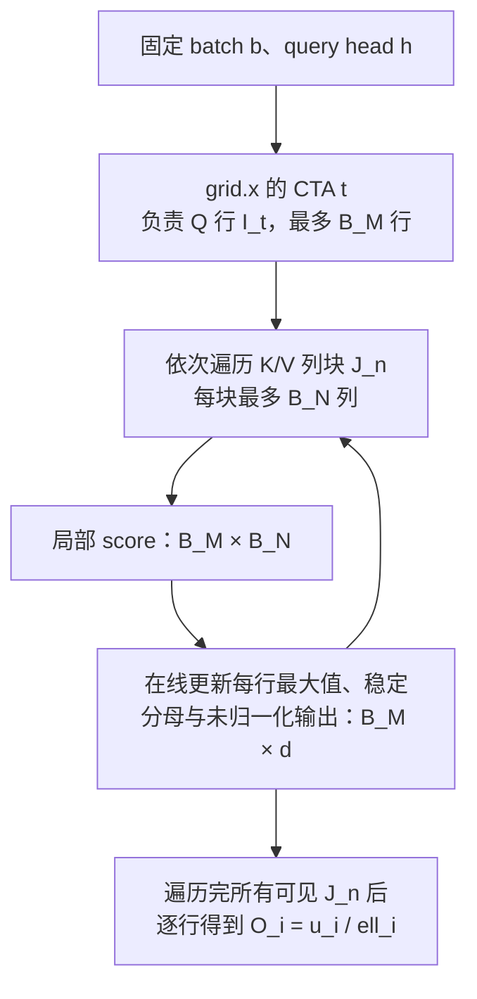

# FlashAttention-2 源码学习笔记（三）：前向计算与 Online Softmax

上一篇停在 host 端：`Flash_fwd_params` 被填好，`run_mha_fwd` 选出一个已编译的 kernel，最后发射 `flash_fwd_kernel`。本篇终于进入真正的前向计算，不过先**刻意不钻进 CuTe layout、`cp.async`、shared memory swizzle 和 Tensor Core 指令细节**。它们决定“怎样快”，但理解 `compute_attn_1rowblock` 前，先要确定它在数学上究竟维护了什么状态、为什么结果仍等于普通 attention。

阅读的主线是：

```text
flash-attention/csrc/flash_attn/src/flash_fwd_launch_template.h
    flash_fwd_kernel
        ↓
flash-attention/csrc/flash_attn/src/flash_fwd_kernel.h
    compute_attn
        ↓
    compute_attn_1rowblock
        ↓
flash-attention/csrc/flash_attn/src/softmax.h
    Softmax::softmax_rescale_o / normalize_softmax_lse
```

本文只讨论**普通的、未 split-KV 的 forward 路径**。这条路径中，一个 CTA 独占一个 Q 的行块，并把该行块所需的全部 K/V 块依次扫完，因此可以在 CTA 内完成最终输出。split-KV 会把同一批 K/V 块分给多个 CTA，再额外 combine；它复用本篇的局部 online softmax 状态，但合并数学已在上一篇讨论。

## 先给结论：FA2 没有保存完整 $P$，但保存了足够的三类状态

固定一个 batch $b$ 和一个 query head $h$。对第 $i$ 个 query 和第 $j$ 个 key，先定义**最终送进 softmax 的 score** 为 $x_{i,j}$；把所有这些标量排成矩阵：

$$
X=\bigl[x_{i,j}\bigr]\in\mathbb{R}^{L_q\times L_k}.
$$

普通 attention 就是：

$$
P_{i,j}=\frac{e^{x_{i,j}}}{\sum_{k=0}^{L_k-1}e^{x_{i,k}}},
\qquad
O=PV.
$$

其中 $Q\in\mathbb{R}^{L_q\times d}$、$K,V\in\mathbb{R}^{L_k\times d}$；$q_i=Q_{i,:}$、$k_j=K_{j,:}$、$V_{j,:}$ 分别是对应的 query、key、value 行向量。$P\in\mathbb{R}^{L_q\times L_k}$ 是最终的概率矩阵，$O\in\mathbb{R}^{L_q\times d}$ 是最终输出。最简单时：

$$
x_{i,j}=\frac{q_i k_j^T}{\sqrt d}.
$$

传统写法会先把完整的 $P$ 物化出来，再做 $PV$。FA2 不这样做。对于一个 Q tile 中的每一行 $i$，它只在寄存器中维护：

| 数学状态 | 含义 | `compute_attn_1rowblock` 中的对象 |
| --- | --- | --- |
| $m_i$ | 到目前为止看过的最终 score $x_{i,j}$ 的最大值。 | 数学上对应 `softmax.row_max`；源码坐标的差异在后文单独说明。 |
| $\ell_i$ | 以当前 $m_i$ 为基准的指数和，即稳定 softmax 分母。 | `softmax.row_sum`；循环中可分散在 4 个 lane，epilogue 再合成完整行和。 |
| $u_{i,:}$ | 以同一 $m_i$ 为基准表示的、**尚未除分母**的输出分子。 | `acc_o` |

最终只做一次

$$
O_{i,:}=\frac{u_{i,:}}{\ell_i}.
$$

### 全文记号以这里为准

后续所有数学公式都遵守下面的约定；它们是本篇唯一的主线，不再额外引入另一套“行最大值”或“score”符号。

| 记号 | 固定含义 | 是否是循环中持续维护的状态 |
| --- | --- | --- |
| $x_{i,j}$ | 第 $i$ 条 query 对第 $j$ 个 key 的**最终 score / logit**；缩放、ALiBi、softcap 与 mask 的效果都已包含在内。 | 否；当前 tile 用完即可丢弃。 |
| $m_i$ | 已处理 key 中 $x_{i,j}$ 的最大值。 | 是。 |
| $\ell_i$ | 对**已处理的同一批 key**求 $\sum e^{x_{i,j}-m_i}$，即以 $m_i$ 平移后的 softmax 分母。 | 是。 |
| $u_{i,:}$ | 对**已处理的同一批 key**求 $\sum e^{x_{i,j}-m_i}V_{j,:}$，即以同一 $m_i$ 表示的未归一化输出分子。 | 是。 |
| $P_{i,j}$ | 全部 key 都处理完后才定义的最终 softmax 概率。 | 否；FA2 不物化完整 $P$。 |
| $O_{i,:}$ | 最终输出，恒为 $u_{i,:}/\ell_i$。 | 否；仅在 K/V 扫描结束后得到。 |

若后文出现派生记号，含义固定如下。除源码对照专用的 $r,m^{\mathrm{raw}}$ 外，正文数学不再使用另一套行最大值或 score 符号：

- 上标 $^{(n)}$ 只表示“处理完第 $n$ 个 K/V tile 后”的**扫描步**，例如 $m_i^{(n)}$ 仍然是同一个 $m_i$；Q tile 编号始终只使用 $t$，例如 $I_t$。
- 大写或粗体只表示把多个主线标量拼成一个 tile：$X^{(n)}=[x_{i,j}]$、$E^{(n)}=[e^{x_{i,j}-m_i^{(n)}}]$、$\mathbf u^{(n)}=[u_{i,:}^{(n)}]$。它们不是新的在线状态。
- $\alpha_i^{(n)}=e^{m_i^{(n-1)}-m_i^{(n)}}$ 是当前更新中把旧状态换到新 $m_i$ 基准的**临时缩放系数**，不跨轮单独保存。
- 只有对照源码 `acc_s` 时才使用 $r_{i,j}$ 与 $m_i^{\mathrm{raw}}$：它们是 $x,m$ 的未缩放坐标。乘数直接沿用源码名 `params.scale_softmax`；它不是新的 attention 状态，具体换算见后文“源码为什么看起来多了一层”。

所以它并没有少算 $QK^T$ 或 $PV$；少的是把 $L_q\times L_k$ 的整个 $P$ 写回 HBM 再读回来这一步。默认路径中，当前 K tile 的概率只作为短命的寄存器片段 `rP` 存活，刚好够完成本 tile 的 $PV$，随后就可以丢弃。

> 后文中要特别区分：`m_block` 是 **Q tile 的编号**；$m_i$ 是某个 query row 的**数值最大值**。两者名字相近，含义完全不同。

## 从 kernel grid 到一个 CTA 的数学责任范围

### `compute_attn` 如何把 CUDA block 映射到 $(b,h,Q\text{ tile})$

普通 forward 的 host 端 grid 是：

```cpp
/**
 * @brief 为普通 forward 构造 CUDA grid，并发射一个 CTA 处理一个 Q 行块。
 *
 * @tparam Kernel_traits 编译期 traits，提供 kBlockM、kBlockN、kNThreads 等常量。
 * @param params [in] 已由 flash_api.cpp 填好的前向参数包。
 * @param stream [in] 当前 PyTorch CUDA stream。
 */
const int num_m_block =
    (params.seqlen_q + Kernel_traits::kBlockM - 1) / Kernel_traits::kBlockM;

// x 轴枚举 Q 行块；y/z 轴固定 batch 与 query head。
dim3 grid(num_m_block, params.b, params.h);

// 一个 CUDA block 含 kNWarps * 32 个线程。
kernel<<<grid, Kernel_traits::kNThreads, smem_size, stream>>>(params);
```

对应的 device 端入口在 `flash-attention/csrc/flash_attn/src/flash_fwd_kernel.h`：

```cpp
/**
 * @brief 把 CUDA 三维 blockIdx 解码成一个普通 attention CTA 的工作坐标。
 *
 * @tparam Kernel_traits 编译期 tile 与 MMA 布局。
 * @param params [in] 前向参数包，按值传入 kernel。
 * @note 普通路径没有 K/V split；同一个 CTA 会自行遍历其 Q tile 对应的全部 K/V tile。
 */
template<typename Kernel_traits, bool Is_dropout, bool Is_causal, bool Is_local,
         bool Has_alibi, bool Is_even_MN, bool Is_even_K, bool Is_softcap,
         bool Return_softmax, typename Params>
inline __device__ void compute_attn(const Params &params) {
    const int m_block = blockIdx.x;  // 第几个 Q 行块。
    const int bidb = blockIdx.y;     // batch 下标 b。
    const int bidh = blockIdx.z;     // query head 下标 h。

    FLASH_NAMESPACE::compute_attn_1rowblock<
        Kernel_traits, Is_dropout, Is_causal, Is_local, Has_alibi,
        Is_even_MN, Is_even_K, Is_softcap, Return_softmax>(
        params, bidb, bidh, m_block);
}
```

令

$$
B_M=\texttt{Kernel\_traits::kBlockM},\qquad
B_N=\texttt{Kernel\_traits::kBlockN}.
$$

对 `blockIdx=(t,b,h)`，CTA 的数学职责是：

$$
I_t=[tB_M,\min((t+1)B_M,L_q)),
$$

$$
\boxed{\quad
O_{I_t,:}
=\operatorname{softmax}\!\left(\bigl[x_{i,j}\bigr]_{i\in I_t,\,0\le j<L_k}\right)V.
\quad}
$$

也就是说，一个 CTA 负责 $B_M$ 条 query row（边界 CTA 可能不足 $B_M$ 条）的最终输出向量，形状是 $B_M\times d$；它会循环访问全部可见的 K/V 列，而不是只计算一块 $B_M\times B_N$ score 后就结束。



这张图描述的是**普通 kernel**。不同 CTA 的 $I_t$ 互不重叠，因此它们最终写出的 $O$ 行也互不重叠，不需要 atomic 或 CTA 间归约。对于 GQA/MQA，`bidh` 仍是 query head；源码用 `bidh / params.h_h_k_ratio` 找到它共享的 KV head。多个 Q head 读同一组 K/V 是允许的，但它们仍各有独立的 output tile 和 softmax 状态。

### 先把一个 CTA 看成“固定 Q、不断读 K/V”的计算器

先不管 CTA 内的 warp、Tensor Core 和线程怎样分工。对数学而言，只需把一个 CTA 看成：**固定一小块 Q 行，然后沿 K/V 的 token 轴从头扫到尾**。

设这个 CTA 固定了 Q tile 中的一行 $q_i$。为了先把状态讲清楚，令 $x_{i,j}$ 表示已经做完缩放、bias 和 mask 后、真正要参与 softmax 的 score。该行每处理完一块 K/V，始终只保留下面四个概念：

| 量 | 一句话含义 | 循环中是否一直保存 |
| --- | --- | --- |
| $m_i$ | 目前看过的所有 key 中，最大的 score。 | 是。 |
| $\ell_i$ | 所有已见 key 的稳定 softmax 分母。 | 是。 |
| $u_{i,:}$ | 所有已见 key 对输出的**未归一化贡献之和**。 | 是。 |
| $O_{i,:}$ | 最终 attention 输出。 | 否；必须等 K/V 全部扫完才得到。 |

其中最重要的一句是：**循环里并没有一个可以直接写出的“局部 $O$”**。源码名为 `acc_o` 的对象实际上是 $u$，不是最终 $O$。

全文的数学推导统一使用 $m_i$；它与源码里的 Q tile 编号 `m_block` 只是恰好同名，二者没有关系。

进入 K/V 循环前，三种在线状态初始化为：

$$
m_i=-\infty,\qquad \ell_i=0,\qquad u_{i,:}=0.
$$

第一块 K/V 到来时，它自然把 $m_i$ 设为这块里的最大 score，把 $\ell_i$ 设为这块的稳定指数和，把 $u_{i,:}$ 设为这块的未归一化 $PV$ 结果。后续 K/V tile 才需要处理“旧 max 与新 max 可能不同”的问题。

### 一次 K/V tile 迭代到底做了什么

令当前读取的 K/V tile 覆盖 key 下标集合 $J$，其中包含 $B_N$ 个或更少 key。这里的上标 `old`/`new` 只是便于直观说明，分别等价于正式递推里的第 $n-1$ 步与第 $n$ 步；它们不是新状态。对固定 query row $i$，这一轮按以下顺序发生：

1. 算出这一小块 score：$x_{i,j}$，$j\in J$。如果是 causal、local window 或边界外位置，就把相应 score 视为 $-\infty$。
2. 看当前 tile 是否出现了更大的 score：

   $$
   m_i^{new}=\max\left(m_i^{old},\max_{j\in J}x_{i,j}\right).
   $$

3. 若 max 变大，旧的 $\ell_i$ 和 $u_{i,:}$ 都是以旧 max 为基准保存的，先把它们换到新基准：

   $$
   \alpha_i=e^{m_i^{old}-m_i^{new}}.
   $$

4. 对当前 tile 的每个 key，直接使用相对新 max 的稳定指数 $e^{x_{i,j}-m_i^{new}}$。

5. 把当前 tile 加入两个累计量：

   $$
   \ell_i^{new}=\alpha_i\ell_i^{old}+\sum_{j\in J}e^{x_{i,j}-m_i^{new}},
   $$

   $$
   u_{i,:}^{new}=\alpha_i u_{i,:}^{old}+\sum_{j\in J}e^{x_{i,j}-m_i^{new}}V_{j,:}.
   $$

若新 tile 没有更大的 score，则 $m_i^{new}=m_i^{old}$、$\alpha_i=1$，这就是普通的“继续把分母和 $PV$ 加上去”。若新 tile 出现更大 score，则 $\alpha_i<1$，它把旧贡献改写成“相对新 max”的数值；这就是 online softmax 的全部关键。

这就是“循环访问全部可见 K/V 列”真正做的事：每一轮只产生一个短命的 score/权重 tile；它立刻更新 $m$、$\ell$、$u$，随后便可以丢掉。K/V 扫描完成后才计算：

$$
\boxed{\quad O_{i,:}=\frac{u_{i,:}}{\ell_i}.\quad}
$$

### 如果已经有一个局部 $O$，为什么不能直接继续相加

假设处理完旧 K/V tile 后，临时写成：

$$
O_{i,:}^{old}=\frac{u_{i,:}^{old}}{\ell_i^{old}}.
$$

新 tile 到来后，正确的新输出是：

$$
O_{i,:}^{new}
=\frac{\alpha_i\ell_i^{old}}{\ell_i^{new}}O_{i,:}^{old}
+\frac{1}{\ell_i^{new}}\sum_{j\in J}e^{x_{i,j}-m_i^{new}}V_{j,:}.
$$

也就是说，旧的局部输出需要按**新的全局分母**重新加权；它不能和新 tile 的局部输出直接相加。FA2 因此不在循环中维护 $O^{old}$，而是维护分子 $u$ 和分母 $\ell$。这样 max 改变时只需对旧 $u$、旧 $\ell$ 同时乘同一个 $\alpha$，最后再做一次除法即可。

下面会把这一轮迭代写成矩阵 tile 形式，并逐行对应 `compute_attn_1rowblock`。warp/lane fragment、4-lane 归约和 CuTe layout 属于“怎样执行这套状态机”，留到算子实现篇再看。

## 先把普通 attention 的 score 记清楚

这一篇的**数学主线只使用一套记号**：

$$
x_{i,j}=\frac{q_i k_j^T}{\sqrt d}+\operatorname{bias}_{i,j}+M_{i,j}.
$$

其中 $\operatorname{bias}_{i,j}$ 表示可选的 ALiBi 等 bias，避免与 batch 下标 $b$ 混淆；$M_{i,j}=0$ 表示可见，$M_{i,j}=-\infty$ 表示被 causal、local window 或边界 mask 掉。被 mask 的位置指数为零，因此不参与 max、分母或输出。

于是，全文中的行最大值、稳定分母和 LSE 都固定为：

$$
m_i=\max_j x_{i,j},
\qquad
\ell_i=\sum_j e^{x_{i,j}-m_i},
$$

$$
\operatorname{LSE}_i
=\log\sum_j e^{x_{i,j}}
=m_i+\log\ell_i.
$$

后面的 online softmax 公式都只围绕开头已经固定的 $x$、$m$、$\ell$、$u$、$O$ 展开。本小节只把其中的 $x_{i,j}$ 拆开，说明它在普通 attention 中由哪些项构成。

### 源码为什么看起来多了一层：`acc_s` 暂存的是 raw score

这不是另一套 attention 数学，而是源码选择把“乘 $1/\sqrt d$”延后到 softmax 的指数步骤。先记住最重要的结论：

> **普通、未启用 softcap 且未显式覆写 scale 时，`params.scale_softmax` 就是默认的 $1/\sqrt d$。** 它不是可学习参数，也不是第四个 online 状态；而是把原始点积变成最终 score 的运行时乘数。

源码把 `acc_s` 中、进入 `softmax_rescale_o` 前的值记作 $r_{i,j}$。它与本文主线的最终 score $x_{i,j}$ 的关系直接就是：

$$
r_{i,j}=\texttt{acc\_s}_{i,j},
\qquad
x_{i,j}=\texttt{params.scale\_softmax}\cdot r_{i,j}.
$$

在最简单的无 bias、无 mask、无 softcap，且采用默认 scale 的情形，$r_{i,j}=q_i k_j^T$，而 `params.scale_softmax` 为 $1/\sqrt d$，所以正好回到本文开头的：

$$
x_{i,j}=\frac{q_i k_j^T}{\sqrt d}.
$$

`row_max` 之所以看起来又多出一个 max，是因为它保存的是 **raw 坐标**下的行最大值：

$$
m_i^{\mathrm{raw}}=\max_j r_{i,j},
\qquad
m_i=\texttt{params.scale\_softmax}\cdot m_i^{\mathrm{raw}}.
$$

这不是两个独立状态。`params.scale_softmax` 为正，因此两者取最大值的位置完全相同；区别仅是单位不同：`row_max` 用 raw 单位保存，正文中的 $m_i$ 用最终 score 单位描述。

因此源码把 raw score 送进 `exp2` 时，实际计算的是：

$$
\operatorname{exp2}\!\left((r_{i,j}-m_i^{\mathrm{raw}})\cdot
\texttt{params.scale\_softmax}\cdot\log_2 e\right)
=e^{x_{i,j}-m_i}.
$$

这正是 online softmax 所需的稳定权重。最后 `row_max * scale_softmax + log(row_sum)` 也就等于 $m_i+\log\ell_i$。

**softcap 是源码中一个需要单独理解的特殊分支。** 此时 `params.scale_softmax` 不再保存用户传入的普通 scale；`set_params_fprop` 会把它改成用户的 cap $c$，同时把 `params.softcap` 设成原始 scale 与 $c$ 的比值：

```cpp
if (softcap > 0.0) {
    // 先让 acc_s 做 tanh((softmax_scale / softcap) * QK^T)。
    params.softcap = softmax_scale / softcap;
    // 再在 softmax 中乘 softcap，得到 c * tanh((1 / sqrt(d) / c) * QK^T)。
    params.scale_softmax = softcap;
} else {
    // 普通路径：通常 softmax_scale = 1 / sqrt(d)。
    params.scale_softmax = softmax_scale;
}
```

所以初读 `compute_attn_1rowblock` 时，可以先只记：**默认正常路径的 `params.scale_softmax = 1/sqrt d`，`acc_s` 是尚未乘这个系数的 score。** 若调用方覆写 scale，仍是同一逻辑，只是把 $1/\sqrt d$ 换成该值；只有追 softcap 分支时，才需要回来看 raw 坐标的这层换算。

### 可选 score 变换在何时发生

`compute_attn_1rowblock` 的顺序是：先做 $QK^T$，可选 softcap，再应用 ALiBi/mask，最后进入 `Softmax`。数学上可以统一认为它们都定义了 $x$；实现上有两个容易忽略的细节：

- **mask 必须在取 max 之前生效。** 源码把无效 score 写成 `-INFINITY`，因此其指数恰为零。
- **ALiBi 要保持用户看到的最终 bias。** 源码构造 `Mask` 时把 slope 除以 `params.scale_softmax`，再把 bias 加到 raw score $r$；随后统一乘源码字段 `params.scale_softmax`，得到预期的 $x$ 中 ALiBi 项。
- **softcap 不是额外再乘一次普通 scale。** 当用户给出 cap $c$ 时，host 端把**点积 score 项**改写为 $c\tanh(QK^T/(c\sqrt d))$；随后仍按上述顺序叠加 ALiBi/mask。device 端的 `apply_softcap(acc_s, params.softcap)` 先做 `tanh`，`Softmax` 再乘保存的 `scale_softmax=c`。

后面的 online 推导直接以 $x$ 来写；源码层面的 $r$ 与 `scale_softmax` 只在注释中出现。

## 把一行的状态推广到整个 Q tile

上节只看一条 query row。一个 CTA 实际固定的是 query 行集合 $I=I_t$，所以只要把 $m_i$、$\ell_i$、$u_{i,:}$ 同时为 $I$ 中每一行维护即可。K/V 的 token 轴切成 $n=0,1,\ldots,T$ 共 $T+1$ 块，其中 $T$ 是最后一块的编号：

$$
J_n=[nB_N,\min((n+1)B_N,L_k)).
$$

对每一个 K/V tile，CTA 逻辑上计算已经包含缩放、bias、mask 的 score 矩阵。这里的大写 $X^{(n)}$ 只是把主线标量 $x_{i,j}$ 按当前 tile 堆成矩阵；它不是新的 score 定义：

$$
X^{(n)}=\bigl[x_{i,j}\bigr]_{i\in I_t,\,j\in J_n}
\in\mathbb{R}^{B_M\times B_N},
\qquad
V^{(n)}=V_{J_n,:}\in\mathbb{R}^{B_N\times d}.
$$

其中 $V^{(n)}$ 只是 $V$ 在列集合 $J_n$ 上的切片；边界无效的 query/key 位置会被 mask 掉。若没有 online softmax，最直观但不可行的写法是：

$$
P^{(n)}_{i,j}
=\frac{e^{x_{i,j}}}
{\sum_{n'=0}^{T}\sum_{k\in J_{n'}}e^{x_{i,k}}},
\qquad
O_{I_t,:}=\sum_{n=0}^{T}P^{(n)}V^{(n)}.
$$

这里 $P^{(n)}$ 没有定义另一种概率：它只是最终 $P$ 限制在行块 $I_t$、列块 $J_n$ 的子矩阵，即 $P_{I_t,J_n}$。问题在于分母要等所有 $J_n$ 都扫完才知道；若把每个 $P^{(n)}$ 先保存下来，就又回到了物化完整 $P$。online softmax 的目标就是：每处理一个 $J_n$，立刻把它融合进 $m$、$\ell$、$u$，然后丢掉该 tile 的 score/probability。

## 把 K/V 扫描写成严格的 online softmax 递推

### 每行状态的定义与初始化

固定 Q tile $I_t$ 后，沿 K/V 轴的扫描步使用前文已定义的 $n$；$t$ 始终只表示 Q tile 编号。假设已经处理到第 $n$ 块，已看过的 key 下标集合为：

$$
\mathcal{J}^{(\le n)}=J_0\cup J_1\cup\cdots\cup J_n.
$$

对 Q tile 内的任意一行 $i$，维护如下三个状态：

$$
m_i^{(n)}
=\max_{j\in\mathcal{J}^{(\le n)}}x_{i,j},
$$

$$
\ell_i^{(n)}
=\sum_{j\in\mathcal{J}^{(\le n)}}
e^{x_{i,j}-m_i^{(n)}},
$$

$$
u_{i,:}^{(n)}
=\sum_{j\in\mathcal{J}^{(\le n)}}
e^{x_{i,j}-m_i^{(n)}}V_{j,:}.
$$

其中：

- $m$ 是稳定计算的平移基准；
- $\ell$ 是以该基准表示的 softmax 分母；
- $u$ 是以**同一个基准**表示的输出分子，形状为 $d$ 维向量。

初始化为空集合：

$$
m_i^{(-1)}=-\infty,\qquad
\ell_i^{(-1)}=0,\qquad
u_{i,:}^{(-1)}=0.
$$

处理完所有 K/V tile 后：

$$
\frac{u_{i,:}^{(T)}}{\ell_i^{(T)}}
=\frac{\sum_j e^{x_{i,j}-m_i^{(T)}}V_{j,:}}
{\sum_j e^{x_{i,j}-m_i^{(T)}}}
=\frac{\sum_je^{x_{i,j}}V_{j,:}}
{\sum_je^{x_{i,j}}}
=O_{i,:}.
$$

分子分母同时乘上 $e^{-m_i^{(T)}}$，所以平移基准完全抵消；它的唯一作用是避免指数溢出。

### 新 tile 到来时，旧状态为什么必须整体缩放

现在处理新 K/V tile $J_n$。先求它在每一行上的局部最大值：

$$
\widehat m_i^{(n)}=\max_{j\in J_n}x_{i,j}.
$$

带帽的 $\widehat m_i^{(n)}$ 只是**当前一个 tile 的临时 max**；它用于比较后产生主线状态 $m_i^{(n)}$，本身不会跨 tile 保存。

新全局最大值为：

$$
m_i^{(n)}=\max\bigl(m_i^{(n-1)},\widehat m_i^{(n)}\bigr).
$$

旧的 $\ell^{(n-1)}$、$u^{(n-1)}$ 原本是以旧基准 $m_i^{(n-1)}$ 表示的；新 tile 使用新基准 $m_i^{(n)}$。两种坐标系不能直接相加，因此先定义换基系数：

$$
\alpha_i^{(n)}
=e^{m_i^{(n-1)}-m_i^{(n)}}.
$$

它满足 $0<\alpha_i^{(n)}\le1$。对旧分母展开：

$$
\begin{aligned}
\alpha_i^{(n)}\ell_i^{(n-1)}
&=e^{m_i^{(n-1)}-m_i^{(n)}}
  \sum_{j\in\mathcal{J}^{(\le n-1)}}
  e^{x_{i,j}-m_i^{(n-1)}}\\
&=\sum_{j\in\mathcal{J}^{(\le n-1)}}
  e^{x_{i,j}-m_i^{(n)}}.
\end{aligned}
$$

同样，对旧输出分子：

$$
\begin{aligned}
\alpha_i^{(n)}u_{i,:}^{(n-1)}
&=e^{m_i^{(n-1)}-m_i^{(n)}}
  \sum_{j\in\mathcal{J}^{(\le n-1)}}
  e^{x_{i,j}-m_i^{(n-1)}}V_{j,:}\\
&=\sum_{j\in\mathcal{J}^{(\le n-1)}}
  e^{x_{i,j}-m_i^{(n)}}V_{j,:}.
\end{aligned}
$$

这就是为什么源码在每个新 tile 到来时，**既缩放 `row_sum`，也缩放 `acc_o`**。只缩放分母而不缩放输出分子，会让两者处于不同的指数基准下，最终结果必然错误。

### 完整递推公式

在新基准下，新 tile 的未归一化权重为：

$$
E^{(n)}_{i,j}
=e^{x_{i,j}-m_i^{(n)}},
\qquad j\in J_n.
$$

$E^{(n)}$ 是把这些权重 $E^{(n)}_{i,j}$ 排成的当前 tile 矩阵；它等于“尚未除分母的局部 softmax 权重”，不是最终概率 $P$，也不会跨 tile 保存。

于是三种状态的更新为：

$$
\boxed{
\begin{aligned}
m_i^{(n)}
&=\max\bigl(m_i^{(n-1)},\max_{j\in J_n}x_{i,j}\bigr),\\
\ell_i^{(n)}
&=\alpha_i^{(n)}\ell_i^{(n-1)}+\sum_{j\in J_n}E^{(n)}_{i,j},\\
u_{i,:}^{(n)}
&=\alpha_i^{(n)}u_{i,:}^{(n-1)}
  +\sum_{j\in J_n}E^{(n)}_{i,j}V_{j,:}.
\end{aligned}}
$$

写成整个 Q tile 的矩阵形式更能看出 $PV$ 出现在哪里。为避免把它们误认为新状态，先说明这些只是把逐行主线量堆叠起来：$\boldsymbol\alpha^{(n)}$ 收集每行的 $\alpha_i^{(n)}$，$\mathbf{\ell}^{(n)}$ 收集每行的 $\ell_i^{(n)}$，$\mathbf u^{(n)}$ 的第 $i$ 行就是 $u_{i,:}^{(n)}$。令：

$$
\boldsymbol\alpha^{(n)}=\bigl(\alpha_i^{(n)}\bigr)_{i\in I_t}\in\mathbb{R}^{B_M},
\qquad
\mathbf{\ell}^{(n)}=\bigl(\ell_i^{(n)}\bigr)_{i\in I_t}\in\mathbb{R}^{B_M},
\qquad
D_{\alpha}^{(n)}=\operatorname{diag}(\boldsymbol\alpha^{(n)}),
\qquad
E^{(n)}=\bigl[E^{(n)}_{i,j}\bigr]_{i\in I_t,\,j\in J_n}\in\mathbb{R}^{B_M\times B_N},
\qquad
\mathbf u^{(n)}=\bigl[u_{i,:}^{(n)}\bigr]_{i\in I_t}\in\mathbb{R}^{B_M\times d}.
$$

则：

$$
\mathbf{\ell}^{(n)}
=\boldsymbol\alpha^{(n)}\odot\mathbf{\ell}^{(n-1)}
+E^{(n)}\mathbf{1},
$$

$$
\boxed{
\mathbf u^{(n)}
=D_{\alpha}^{(n)}\mathbf u^{(n-1)}+E^{(n)}V^{(n)}.
}
$$

其中 $D_{\alpha}^{(n)}$ 是把每行 $\alpha_i^{(n)}$ 放到对角线上的矩阵，$\mathbf{1}$ 是长度为 $B_N$ 的全 1 列向量，$\odot$ 表示逐元素乘法；$\mathbf u\in\mathbb{R}^{B_M\times d}$ 对应 `acc_o`，只是 $u_{i,:}$ 的整块写法。第二项正是当前 tile 的 $PV$ GEMM：它的左操作数不是已最终归一化的 $P$，而是以当前最大值为基准的 $E$。等 K/V 全部扫描完，才做一次逐行除法：

$$
O_{I_t,:}=\operatorname{diag}\!\left((\mathbf{\ell}^{(T)})^{-1}\right)\mathbf u^{(T)}.
$$


这里 $(\mathbf{\ell}^{(T)})^{-1}$ 表示逐元素取倒数；因此上式逐行就是主线公式 $O_{i,:}=u_{i,:}^{(T)}/\ell_i^{(T)}$。

### 两块 K/V 的小例子

固定一条 query row $i$，下文省略该行下标，并记 $v_j\equiv V_{j,:}$。第一块有两个最终 score：$[1,2]$，对应 value 为 $[v_1,v_2]$。

第一块结束时：

$$
m^{(0)}=2,
\qquad
\ell^{(0)}=e^{1-2}+e^{2-2}=e^{-1}+1,
$$

$$
u^{(0)}=e^{-1}v_1+v_2.
$$

第二块有 score $[0,3]$，对应 $[v_3,v_4]$。新的 max 是 $m^{(1)}=3$，故旧状态的换基系数为 $\alpha=e^{2-3}=e^{-1}$。更新后：

$$
\begin{aligned}
\ell^{(1)}
&=e^{-1}(e^{-1}+1)+e^{0-3}+e^{3-3}\\
&=e^{-2}+e^{-1}+e^{-3}+1,
\end{aligned}
$$

$$
\begin{aligned}
u^{(1)}
&=e^{-1}(e^{-1}v_1+v_2)+e^{-3}v_3+v_4\\
&=e^{-2}v_1+e^{-1}v_2+e^{-3}v_3+v_4.
\end{aligned}
$$

这恰好是对全体 score $[1,2,0,3]$ 统一减去全局 max $3$ 后的分子与分母。因此 $u^{(1)}/\ell^{(1)}$ 与一次性算完整 softmax 完全相同。这个例子里最容易漏掉的就是前面的 $e^{-1}$：它既要乘旧分母，也要乘旧输出分子。

## 源码中的 `Softmax` 正在做哪一步

`flash-attention/csrc/flash_attn/src/softmax.h` 中最核心的函数如下。代码保持源码的计算顺序；为贴近实际语句，注释会用 $r$、$m^{\mathrm{raw}}$ 与源码字段 `params.scale_softmax` 指代源码坐标，但每一步都严格映射回前文的 $x$、$m$、$\ell$、$u$。

```cpp
/**
 * @brief 将一个新的 score tile 并入每行 online softmax 状态，并把旧输出分子换到新基准。
 *
 * @tparam Is_first 是否是该 CTA 处理的第一个 K/V tile。
 * @tparam Check_inf 是否需要处理整行均为 -inf 的 mask 边界情形。
 * @param acc_s [in, out] 当前 score tile；进入时是 raw score r，返回时被原地改成 E。
 * @param acc_o [in, out] 输出分子 u；不是最终 O，仍未除以 row_sum。
 * @param softmax_scale_log2 params.scale_softmax * log2(e)，使 exp2((r - m_raw) * ...) 等价于 exp(x - m)。
 */
template<bool Is_first, bool Check_inf = false, typename Tensor0, typename Tensor1>
__forceinline__ __device__ void softmax_rescale_o(
    Tensor0 &acc_s,
    Tensor1 &acc_o,
    float softmax_scale_log2) {
    // 仅改变 CuTe 对同一寄存器数据的视图；数学上 scores 仍是 B_M × B_N。
    Tensor scores = make_tensor(
        acc_s.data(), FLASH_NAMESPACE::convert_layout_acc_rowcol(acc_s.layout()));

    if (Is_first) {
        // m_raw^(0) = max_j r_ij；数学上对应 m^(0) = params.scale_softmax * m_raw^(0)。
        FLASH_NAMESPACE::template reduce_max</*zero_init=*/true>(
            scores, row_max);

        // scores <- E^(0) = exp(params.scale_softmax * (r - m_raw^(0))) = exp(x - m^(0))。
        FLASH_NAMESPACE::scale_apply_exp2(
            scores, row_max, softmax_scale_log2);

        // 数学上：ell^(0) = sum_j E^(0)_ij。
        FLASH_NAMESPACE::reduce_sum</*zero_init=*/true>(scores, row_sum);
    } else {
        // 保存旧 raw 基准 m_raw^(n-1)，随后 row_max 会被更新为 m_raw^(n)。
        Tensor scores_max_prev = make_fragment_like(row_max);
        cute::copy(row_max, scores_max_prev);

        // m_raw^(n) = max(m_raw^(n-1), max_j r^(n)_ij)。
        FLASH_NAMESPACE::template reduce_max</*zero_init=*/false>(
            scores, row_max);

        // 换一个 row/column 视图访问同一份 u accumulator，方便逐行缩放。
        Tensor acc_o_rowcol = make_tensor(
            acc_o.data(),
            FLASH_NAMESPACE::convert_layout_acc_rowcol(acc_o.layout()));

        #pragma unroll
        for (int mi = 0; mi < size(row_max); ++mi) {
            // 全 mask 行会有 -inf；避免计算 -inf - (-inf) 产生 NaN。
            float scores_max_cur = !Check_inf
                ? row_max(mi)
                : (row_max(mi) == -INFINITY ? 0.0f : row_max(mi));

            // alpha = exp(params.scale_softmax * (m_raw,old - m_raw,new)) = exp(m_old - m_new)。
            float scores_scale = exp2f(
                (scores_max_prev(mi) - scores_max_cur) * softmax_scale_log2);

            // 数学上：ell_old <- alpha * ell_old。
            row_sum(mi) *= scores_scale;

            // u_old <- alpha * u_old；这一句不能省略。
            #pragma unroll
            for (int ni = 0; ni < size<1>(acc_o_rowcol); ++ni) {
                acc_o_rowcol(mi, ni) *= scores_scale;
            }
        }

        // scores <- E^(n) = exp(params.scale_softmax * (r^(n) - m_raw^(n))) = exp(x^(n) - m^(n))。
        FLASH_NAMESPACE::scale_apply_exp2(
            scores, row_max, softmax_scale_log2);

        // 数学上：ell <- alpha * ell_old + sum_j E^(n)_ij。
        FLASH_NAMESPACE::reduce_sum</*zero_init=*/false>(scores, row_sum);
    }
}
```

数学上 $\ell_i$ 始终表示完整行分母；实现中 `row_sum` 在 K/V 循环内可保存 4 个 lane 的局部份，`normalize_softmax_lse` 才用 `quad_allreduce_` 合成完整 $\ell_i$。这只是 $\ell$ 的寄存器分片方式，不是第四个数学状态；其 warp/lane 细节留到实现篇再追。

注意 `softmax_rescale_o` 本身**还没有做 $PV$**。它只完成三件事：

1. 得到本 tile 的稳定指数 $E$；
2. 维护 $m$、$\ell$；
3. 在 max 改变时，把旧的 $u$ 缩放到同一基准。

接下来的 `gemm_rs` 才把 $E V$ 加进 `acc_o`。

## `compute_attn_1rowblock` 的数学主干

下面从 `flash-attention/csrc/flash_attn/src/flash_fwd_kernel.h` 的两个 K/V 循环中抽取共同的数学主干。为了把注意力放在公式上，省略了 Q/K/V 搬运、`cp_async`、shared memory 双缓冲和边界 copy；这些语句不改变下面的数学状态机。保留下来的调用顺序与源码一致。

```cpp
/**
 * @brief compute_attn_1rowblock 中，每个 K/V tile 的核心数学状态机。
 *
 * @param acc_s [out] 当前 tile 的 score fragment，逻辑形状为 kBlockM × kBlockN。
 * @param acc_o [in, out] 累积输出分子，逻辑形状为 kBlockM × kHeadDim。
 * @param softmax [in, out] 保存 row_max 与 row_sum 的 online softmax 状态。
 * @note 下列循环体来自源码的 masking loop 与 non-masking loop 的共同部分。
 */
clear(acc_o);  // u = 0；注意它不是最终输出 O。
FLASH_NAMESPACE::Softmax<2 * size<1>(acc_o)> softmax;

for (/* 每一个可见的 n_block，源码实际从后向前遍历 */) {
    Tensor acc_s = partition_fragment_C(
        tiled_mma, Shape<Int<kBlockM>, Int<kBlockN>>{});
    clear(acc_s);

    // acc_s <- Q_I K_J^T，使用 fp32 accumulator。
    FLASH_NAMESPACE::gemm</*A_in_regs=*/Kernel_traits::Is_Q_in_regs>(
        acc_s, tSrQ, tSrK, tSsQ, tSsK, tiled_mma,
        smem_tiled_copy_Q, smem_tiled_copy_K,
        smem_thr_copy_Q, smem_thr_copy_K);

    if constexpr (Is_softcap) {
        // 可选：把 raw QK score 改成 softcap 形式。
        FLASH_NAMESPACE::apply_softcap(acc_s, params.softcap);
    }

    // 写入 ALiBi，并把 causal/local/边界外 score 置为 -INFINITY。
    mask.template apply_mask</*Causal_mask=*/...>(
        acc_s, n_block * kBlockN, /* 当前 fragment 的行坐标 */,
        kNWarps * 16);

    // 更新 m、ell；并在 m 变化时对旧 u 执行 alpha 缩放。
    softmax.template softmax_rescale_o</*Is_first=*/...>(
        acc_s, acc_o, params.scale_softmax_log2);

    // 此时 acc_s 的数学含义已经从 raw score r 变成 E = exp(x - m)。
    Tensor rP = FLASH_NAMESPACE::convert_type<Element>(acc_s);

    if (Is_dropout) {
        // 训练时先零掉被丢弃位置；1 / p_keep 在最终 normalize 时统一补上。
        dropout.apply_dropout(rP, block_row_idx, block_col_idx, kNWarps);
    }

    // acc_o <- acc_o + rP * V_J，即 u <- u + E * V_J。
    Tensor tOrP = make_tensor(
        rP.data(),
        FLASH_NAMESPACE::convert_layout_acc_Aregs<typename Kernel_traits::TiledMma>(
            rP.layout()));
    FLASH_NAMESPACE::gemm_rs(
        acc_o, tOrP, tOrVt, tOsVt, tiled_mma,
        smem_tiled_copy_V, smem_thr_copy_V);
}

// 扫完整个 K 轴后才做 O = u / ell，同时产出 LSE。
Tensor lse = softmax.template normalize_softmax_lse<Is_dropout>(
    acc_o, params.scale_softmax, params.rp_dropout);
```

有两个控制流细节不要误读成数学差异：

- 源码把末尾或 causal/local 边界附近、需要 mask 的 K tile 放在第一个循环处理，再用第二个循环处理无需 mask 的内部 tile。两段循环都执行相同的 online 更新。
- `n_block` 从 `n_block_max - 1` 递减到 `n_block_min`。从数学上，任意 K tile 顺序都能使用同一递推；倒序是实现选择：最后一个物理 K tile 最容易出现尾部越界，先处理它能简化 async copy 与 mask 的调度。

## $PV$ 到底如何被“融合”进输出

这是最容易被一句“online softmax”掩盖的地方。每个 K/V tile 中，实际进入 $PV$ 的不是最终概率 $P$，而是：

$$
E^{(n)}_{i,j}=e^{x_{i,j}-m_i^{(n)}}.
$$

它尚未除全局分母 $\ell_i^{(n)}$。但由于 `acc_o` 同样以 $m_i^{(n)}$ 为指数基准，先加未归一化分子完全正确：

$$
\mathbf u^{(n)}
=D_{\alpha}^{(n)}\mathbf u^{(n-1)}+E^{(n)}V^{(n)}.
$$

在代码中，对应关系是：

| 数学对象 | 寄存器 / source symbol | 形状 | 生命周期 |
| --- | --- | --- | --- |
| $r^{(n)}$（源码 raw-score 坐标） | `acc_s`，刚完成 `gemm` 和 mask 时；它对应正文中已定义的 score $x^{(n)}$。 | $B_M\times B_N$ | 仅当前 K tile。 |
| $E^{(n)}$ | 同一个 `acc_s`，经过 `softmax_rescale_o` 后；转成 `rP`。 | $B_M\times B_N$ | 刚够完成一次 $EV$，之后丢弃。 |
| $V^{(n)}$ | 逻辑上的 `sV` / `tOrVt` | $B_N\times d$ | 仅当前 K tile。 |
| $\mathbf u^{(n)}$ | `acc_o` | $B_M\times d$；第 $i$ 行就是主线中的 $u_{i,:}^{(n)}$。 | CTA 横跨整个 K 循环一直保存。 |
| $m^{(n)},\ell^{(n)}$ | `softmax.row_max`、`softmax.row_sum`；其中前者在源码中以 $m^{\mathrm{raw}}$ 坐标保存。 | 每个 query row 一个标量 | CTA 横跨整个 K 循环一直保存。 |

`gemm_rs(acc_o, tOrP, tOrVt, ...)` 中的 `rs`、转置 view、shared-memory layout 都是让 Tensor Core 高效执行 $E V$ 的工程细节；数学上它就是：

$$
\underbrace{(B_M\times d)}_{\texttt{acc\_o}}
\mathrel{+}=
\underbrace{(B_M\times B_N)}_{\texttt{rP}=E}
\underbrace{(B_N\times d)}_{V}.
$$

循环中 `acc_o` 只在 CTA 内的寄存器 fragment 中累积；没有中间 attention 矩阵被写回全局内存。因为这个 CTA 已经扫过本 Q tile 的全部 K，循环结束后的 `acc_o` 就包含该 tile 所有 key 的输出分子。

## 输出为什么要最后再缩放一次

`normalize_softmax_lse` 完成了最后的“除分母 + 写 LSE”。源码如下：

```cpp
/**
 * @brief 将未归一化输出分子 u 除以稳定分母 ell，并生成每行 LSE。
 *
 * @tparam Is_dropout 是否启用 attention dropout。
 * @tparam Split split-KV 局部路径标志；普通 forward 保持 false。
 * @param acc_o [in, out] 输入为 u，返回时原地改为最终输出 O。
 * @param softmax_scale 即源码字段 params.scale_softmax。
 * @param rp_dropout 1 / p_keep；仅 dropout 时参与最终输出缩放。
 * @return 每个 query row 的 log-sum-exp。
 */
template<bool Is_dropout = false, bool Split = false, typename Tensor0>
__forceinline__ __device__ TensorT normalize_softmax_lse(
    Tensor0 &acc_o,
    float softmax_scale,
    float rp_dropout = 1.0f) {
    SumOp<float> sum_op;
    quad_allreduce_(row_sum, row_sum, sum_op);  // 得到完整的每行 ell。

    TensorT lse = make_fragment_like(row_sum);
    Tensor acc_o_rowcol = make_tensor(
        acc_o.data(),
        FLASH_NAMESPACE::convert_layout_acc_rowcol(acc_o.layout()));

    #pragma unroll
    for (int mi = 0; mi < size<0>(acc_o_rowcol); ++mi) {
        float sum = row_sum(mi);

        // 正常行：inv_sum = 1 / ell；全 mask / NaN 边界走防御性分支。
        float inv_sum = (sum == 0.f || sum != sum) ? 1.f : 1.f / sum;

        // 源码坐标：LSE = params.scale_softmax * m_raw + log(ell)；正文数学：LSE = m + log(ell)。
        lse(mi) = (sum == 0.f || sum != sum)
            ? (Split ? -INFINITY : INFINITY)
            : row_max(mi) * softmax_scale + __logf(sum);

        // 非 dropout：u / ell；dropout：u / ell / p_keep。
        float scale = !Is_dropout ? inv_sum : inv_sum * rp_dropout;
        #pragma unroll
        for (int ni = 0; ni < size<1>(acc_o_rowcol); ++ni) {
            acc_o_rowcol(mi, ni) *= scale;
        }
    }
    return lse;
}
```

从数学上，普通非 dropout 情形只有：

$$
O_{i,:}=\frac{u_{i,:}}{\ell_i}.
$$

但在实现里容易看到四种不同来源的“scale”，它们作用位置不同：

| 缩放 | 数学含义 | 发生位置 | 是否作用于 `acc_o` |
| --- | --- | --- | --- |
| `params.scale_softmax` | 把源码 raw score 映射为正文的最终 score $x$；普通路径中它是用户的 scale（默认 $1/\sqrt d$），softcap 时则为 cap $c$。 | `scale_apply_exp2` 的指数中。 | 间接影响所有 $E$。 |
| $\alpha=e^{m_{old}-m_{new}}$ | 当每行 max 更新时，把旧状态换到新基准。源码用 raw 坐标计算同一个系数。 | `softmax_rescale_o`。 | **同时乘** `row_sum` 与旧 `acc_o`。 |
| $1/\ell$ | 最终 softmax 归一化。 | `normalize_softmax_lse`。 | 最后逐行乘 `acc_o`。 |
| $1/p_{keep}$ | inverted dropout 保持训练期望不变。 | `normalize_softmax_lse`。 | 仅 dropout 时与 $1/\ell$ 相乘。 |

### Dropout 为什么不改变 LSE，却要改变输出缩放

若 dropout keep mask 为 $D_{i,j}\in\{0,1\}$，保留概率为 $p_{keep}$，训练时希望的输出是。这里 $D_{i,j}$ 是二值 dropout mask，和前文的对角缩放矩阵 $D_{\alpha}^{(n)}$ 没有关系：

$$
O^{drop}_{i,:}
=\sum_j\frac{D_{i,j}}{p_{keep}}P_{i,j}V_{j,:}.
$$

源码在每个 tile 中让 `dropout.apply_dropout(rP, ...)` 把被丢弃的 $E_{i,j}$ 变零，但此时不立刻除 $p_{keep}$。因此累积到 `acc_o` 的是：

$$
u^{\mathrm{drop}}_{i,:}
=\sum_jD_{i,j}e^{x_{i,j}-m_i}V_{j,:}.
$$

`row_sum` 仍保持**未 dropout** 的 $\ell_i$，所以 LSE 仍是原始 softmax 的 LSE；最后统一乘 $1/(\ell_i p_{keep})$，正好得到目标公式。这样不会破坏 online max/sum 的数学意义。

### 全部 key 都被 mask 时的边界值

若某个 query row 没有任何可见 key，数学上的 softmax 没有正常的概率分布。普通 kernel 会避免读取越界 K/V，并把该行 $O$ 写为零；`normalize_softmax_lse` 的普通路径以 `INFINITY` 作为 LSE sentinel。不要把这个特殊值代回通常的 $m+\log\ell$ 公式；它是 API 边界条件的约定，而不是有限 score 的 log-sum-exp。

## 把数学变量逐项对回 `compute_attn_1rowblock`

下表可以作为阅读源码时的速查表：

| 源码符号 | 进入该语句前的数学意义 | 离开该语句后的数学意义 |
| --- | --- | --- |
| `acc_s` | `clear` 后为空的 score accumulator。 | `gemm` 后为当前 tile 的源码 raw score；可选变换、bias、mask 后对应正文中的 score $x^{(n)}$；`softmax_rescale_o` 后原地变为 $E^{(n)}$。 |
| `softmax.row_max` | 之前 K tile 的 $(m^{\mathrm{raw}})^{(n-1)}$，对应正文的 $m^{(n-1)}$。 | 当前所有已处理 K tile 的 $(m^{\mathrm{raw}})^{(n)}$，对应正文的 $m^{(n)}$。 |
| `softmax.row_sum` | 旧基准下 $\ell^{(n-1)}$ 的 lane-local 分片。 | 新基准下 $\ell^{(n)}$ 的 lane-local 分片；epilogue 合并为完整 $\ell^{(n)}$。 |
| `acc_o` | 旧基准下的 $\mathbf u^{(n-1)}$。 | 先乘 $\alpha$，再被 `gemm_rs` 加上 $E^{(n)}V^{(n)}$，成为 $\mathbf u^{(n)}$。 |
| `rP` | `acc_s` 的低精度可供 Tensor Core 读取的 view；这是源码变量名，不表示 raw score $r$ 与概率矩阵 $P$ 的乘积。 | 数学上仍是当前 tile 的 $E^{(n)}$；若 dropout，变为 $D\odot E^{(n)}$。 |
| `lse` | 尚未生成。 | $m+\log\ell$；普通路径写入 `softmax_lse`。 |

再把整个 CTA 的伪代码压缩成最小数学版本，就是。这里 `m`、`ell` 分别是 Q tile 各行的 $(m_i)$、$(\ell_i)$，`u` 的第 $i$ 行就是 $u_{i,:}$；`score` 是当前 $X^{(n)}$，`alpha` 是各行 $\alpha_i^{(n)}$ 组成的向量，`E` 是当前 $E^{(n)}$：

```text
u    <- 0_{B_M × d}
m    <- -inf_{B_M}
ell  <- 0_{B_M}

for each visible K/V tile (K_{J_n}, V_{J_n}):
    score   <- Q_I K_J^T
    score   <- score_transform_and_mask(score)
    m_new   <- rowwise_max(m, rowwise_max(score))
    alpha   <- exp(m - m_new)
    E       <- exp(score - m_new[:, None])
    u       <- alpha[:, None] * u + E V_J
    ell     <- alpha * ell + rowwise_sum(E)
    m       <- m_new

O    <- u / ell[:, None]
LSE  <- m + log(ell)
```

这段伪代码就是 `compute_attn_1rowblock` 的数学骨架。实现篇中看到的 `Tensor` view、MMA fragment、`cp_async_wait`、`__syncthreads()` 和 `gemm_rs` 都是在不改变这份状态机的前提下，让它以合并访存、Tensor Core 和寄存器复用的方式完成。

## 本小节要记住的几个判断题

- **一个普通 forward CTA 是否只计算一个 $B_M\times B_N$ score tile？** 否。它只在任一时刻保留一个 score tile，但会遍历全部可见的 K/V tile，最终完成 $B_M\times d$ 输出。
- **`acc_o` 是已经 softmax 归一化的输出吗？** 否。循环中它是以当前 row max 为基准的未归一化分子 $u$；只有 epilogue 才除以 `row_sum`。
- **row max 改变时为什么还要缩放旧 `acc_o`？** 因为旧 `acc_o` 与旧 `row_sum` 都以旧 max 为指数基准。两者必须一起乘 $\alpha$，才能与新 tile 在新基准下相加。
- **`rP` 是完整的 attention matrix 吗？** 否。它只是当前 $B_M\times B_N$ tile 的稳定指数权重，完成一次 $EV$ 后即可覆盖。
- **FA2 的关键是少做 GEMM 吗？** 否。$QK^T$ 和 $PV$ 的主计算仍在；关键是避免完整 $P$ 的 HBM 物化，并把 softmax 状态、$PV$ 和输出累积融合在一个 CTA 的寄存器生命周期中。

下一篇再沿着这里的 `tSrQ`、`tSrK`、`tOrVt`、`tOrP` 与 `gemm/gemm_rs` 深入，回答同一份数学对象如何被 CuTe 切成 warp/lane fragment，以及 Q/K/V 如何经 global memory、shared memory 到 Tensor Core。
