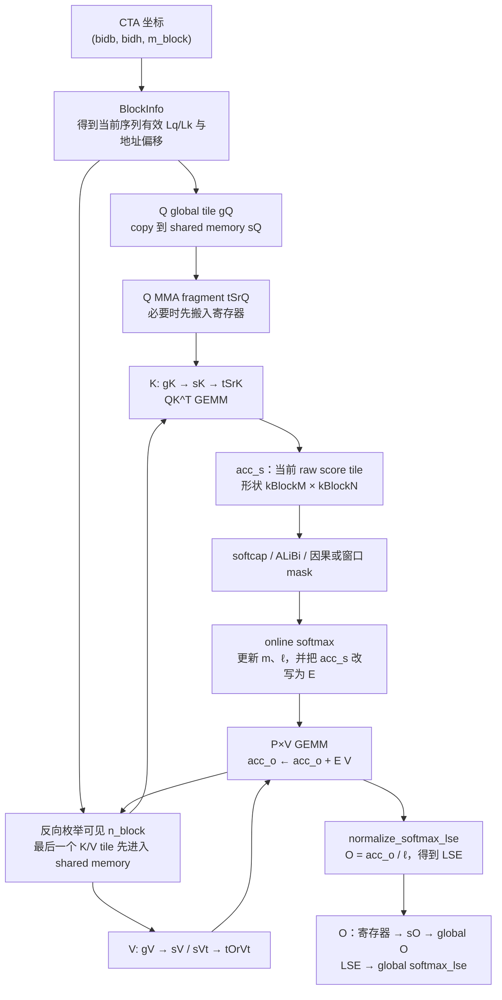

# FlashAttention-2 源码学习笔记（四）：Forward Kernel 的专用接口与主计算循环

[[flash-attn-3#先给结论：FA2 没有保存完整 $P$，但保存了足够的三类状态|上一篇]]已经确定了 forward 的数学主线：对一个 Q tile，沿 K/V 轴扫描，在线维护每行的 $m_i$、$\ell_i$、$u_{i,:}$，最后得到 $O_{i,:}=u_{i,:}/\ell_i$。

本篇开始读普通 forward kernel 的实际代码，目标文件是：

```text
flash-attention/csrc/flash_attn/src/flash_fwd_kernel.h
```

`compute_attn_1rowblock` 同时出现 CuTe layout、异步拷贝、两次 Tensor Core GEMM、边界 mask、dropout 和 online softmax。本文先介绍它使用的专用接口，再在文末沿真实控制流完整展开这个函数；这样进入主循环时，就不会把“数据视图变化”误读为“数学状态变化”。

默认读者已经了解 CuTe 的 `Tensor`、`local_tile`、`partition_*`、`retile_*` 和 `cute::copy`：它们出现时只说明**这次视图或搬运的逻辑意图**，不重复讲 CuTe 本身。

> 数学符号完全沿用 [[flash-attn-3#全文记号以这里为准|FA3 的统一记号]]。特别地：`acc_s` 在进入 `softmax_rescale_o` 前是 raw score $r$，之后原地变成当前 tile 的稳定指数权重 $E$；`acc_o` 对应未归一化输出分子 $u$。

## 一次 K/V tile 迭代中接口的接力关系

先把普通路径的一轮 K/V tile 看成下图。这里的“矩阵”都是当前 CTA 的寄存器或 shared-memory fragment，不表示写回 HBM 的完整 attention 矩阵。

```mermaid
flowchart LR
    A["BlockInfo<br>给出本 batch 的有效长度与基址"] --> B["copy<br>Q/K/V: global → shared"]
    B --> C["gemm<br>acc_s ← Q K^T"]
    C --> D["apply_softcap<br>仅 Is_softcap"]
    D --> E["Mask::apply_mask<br>ALiBi / causal / local / 越界"]
    E --> F["Softmax::softmax_rescale_o<br>acc_s: r → E<br>更新 m、ell，并重标定 acc_o"]
    F --> G["convert_type<br>E: fp32 → Element"]
    G --> H["Dropout::apply_dropout<br>仅 Is_dropout"]
    H --> I["gemm_rs<br>acc_o += E V"]
    I --> J["下一 K/V tile"]
    J --> F
    J --> K["normalize_softmax_lse<br>acc_o: u → O；生成 LSE"]
    K --> L["get_lse_tile / copy<br>写回 O 与 LSE"]
```



其中最重要的原地变化是：

| 对象 | 进入一轮 K/V tile 前 | 经哪个接口后 | 离开该轮时 |
| --- | --- | --- | --- |
| `acc_s` | 新 tile 的 raw score $r_{i,j}$。 | `softmax_rescale_o` | $E_{i,j}=e^{x_{i,j}-m_i}$；仅供当前轮 $PV$ 使用。 |
| `softmax.row_max` | 已扫描 key 的 $m_i^{\mathrm{raw}}$。 | `softmax_rescale_o` | 包含当前 tile 的新 $m_i^{\mathrm{raw}}$。 |
| `softmax.row_sum` | 已扫描 key 的稳定分母 $\ell_i$（可能是 lane 局部分量）。 | `softmax_rescale_o` | 新的 $\ell_i$。 |
| `acc_o` | 已扫描 key 的输出分子 $u_{i,:}$。 | `softmax_rescale_o`、`gemm_rs` | 先按新 max 重标定，再加当前 tile 的 $E V$。 |

`Dropout` 只改用于 $PV$ 的临时 `rP`，不会改 `row_max` 或 `row_sum`，所以 LSE 仍是 dropout 前 softmax 的 LSE；这个结论已在 [[flash-attn-3#Dropout 为什么不改变 LSE，却要改变输出缩放|FA3 的 dropout 小节]]推导。

## 先约定源码中的三种存储位置

后续接口的模板参数很长，但先用存储位置理解它们即可：

| 前缀 / 名称 | 常见位置 | 在本篇的语义 |
| --- | --- | --- |
| `gQ`、`gK`、`gV`、`gO`、`gLSE` | global memory | 当前 CTA 对全局 Q/K/V/O/LSE 的 tile 视图。 |
| `sQ`、`sK`、`sV`、`sO` | shared memory | CTA 协作复用的 tile 缓冲区。 |
| `tSrQ`、`tSrK`、`tOrVt`、`acc_s`、`acc_o`、`rP` | 寄存器 | 单线程持有的 MMA fragment 或临时结果。 |
| `m*`、`t*` | CuTe tensor/view | 前缀不是内存所有权；必须看它包裹的指针或 `partition_*` 来源。 |

这里的 `acc` 是 accumulator（累加器）：FlashAttention 的两次 MMA 都用 fp32 accumulator。`Element` 是输入/输出元素类型（fp16 或 bf16），`ElementAccum` 是通常为 fp32 的累加类型。

## `BlockInfo`：把一个 batch 的逻辑序列映射到 Q/K/V 地址

源码位于 `flash-attention/csrc/flash_attn/src/block_info.h`。它不拥有任何内存；只是每个 CTA 根据 `params` 和 `bidb=blockIdx.y` 构造的只读、小型地址解释器。

### 源码与成员变量

下面按源码完整摘录，并加入中文 Doxygen 风格注释：

```cpp
/**
 * @brief 描述当前 batch 元素的有效 Q/K 长度，以及其在定长或变长存储中的起始位置。
 *
 * @tparam Varlen true：根据 cu_seqlens_* 解释 packed 变长输入；
 *                false：忽略 cu_seqlens_*，按定长 batch stride 寻址。
 */
template<bool Varlen = true>
struct BlockInfo {
    /**
     * @brief 从参数包和 batch 下标构造当前序列的边界信息。
     *
     * @param params [in] device 可见的 Flash_fwd_params 或兼容参数包；只借用其指针和长度。
     * @param bidb [in] 当前 CTA 对应的 batch 下标。
     */
    template<typename Params>
    __device__ BlockInfo(const Params& params, const int bidb)
        // 变长 Q 在 packed token 数组中的起点；定长或无 cu_seqlens_q 时用 -1 作哨兵。
        : sum_s_q(!Varlen || params.cu_seqlens_q == nullptr
                      ? -1
                      : params.cu_seqlens_q[bidb])
        // cumulative K 时才有 packed K 的起点；非 cumulative K 的数组存的是长度而不是前缀和。
        , sum_s_k(!Varlen || params.cu_seqlens_k == nullptr
                      || !params.is_seqlens_k_cumulative
                      ? -1
                      : params.cu_seqlens_k[bidb])
        // 当前 batch 元素实际拥有的 Q token 数。
        , actual_seqlen_q(!Varlen || params.cu_seqlens_q == nullptr
                              ? params.seqlen_q
                              : params.cu_seqlens_q[bidb + 1] - sum_s_q)
        // K cache 左端填充量；它既不参与 attention，也不应参与 K 的地址起点。
        , leftpad_k(params.leftpad_k == nullptr ? 0 : params.leftpad_k[bidb])
        // cache 中去掉左填充后实际可读的 K token 数。
        , seqlen_k_cache(
              (!Varlen || params.cu_seqlens_k == nullptr
                   ? params.seqlen_k
                   : (params.is_seqlens_k_cumulative
                          ? params.cu_seqlens_k[bidb + 1] - sum_s_k
                          : params.cu_seqlens_k[bidb]))
              - leftpad_k)
        // 若 seqused_k 非空，它指定本轮实际用多少 K；否则用 cache 长度加本轮 append 的 knew。
        , actual_seqlen_k(params.seqused_k
                              ? params.seqused_k[bidb] - leftpad_k
                              : seqlen_k_cache
                                    + (params.knew_ptr == nullptr ? 0 : params.seqlen_knew)) {
    }

    /**
     * @brief 返回当前 batch 的 Q 起始元素偏移。
     *
     * @tparam index_t 用于地址计算的整数类型。
     * @param batch_stride [in] 定长 Q 的 batch stride，单位为元素。
     * @param row_stride [in] Q 的一个 token 行跨度，单位为元素。
     * @param bidb [in] batch 下标。
     * @return 定长输入返回 bidb * batch_stride；packed 变长输入返回 sum_s_q * row_stride。
     */
    template<typename index_t>
    __forceinline__ __device__ index_t q_offset(
        const index_t batch_stride, const index_t row_stride, const int bidb) const {
        return sum_s_q == -1 ? bidb * batch_stride : uint32_t(sum_s_q) * row_stride;
    }

    /**
     * @brief 返回当前 batch 的 K/V 起始元素偏移，并跳过 leftpad_k。
     *
     * @param batch_stride [in] 定长 K/V 的 batch stride，单位为元素。
     * @param row_stride [in] K/V 的一个 token 行跨度，单位为元素。
     * @param bidb [in] batch 下标。
     * @return 定长输入返回 bidb * batch_stride + leftpad_k * row_stride；
     *         packed 变长输入返回 (sum_s_k + leftpad_k) * row_stride。
     */
    template<typename index_t>
    __forceinline__ __device__ index_t k_offset(
        const index_t batch_stride, const index_t row_stride, const int bidb) const {
        return sum_s_k == -1
            ? bidb * batch_stride + leftpad_k * row_stride
            : uint32_t(sum_s_k + leftpad_k) * row_stride;
    }

    const int sum_s_q;          ///< packed Q 的 token 前缀和；-1 表示定长寻址。
    const int sum_s_k;          ///< packed K 的 token 前缀和；-1 表示定长或非 cumulative K。
    const int actual_seqlen_q;  ///< 当前 batch 元素的有效 Q 长度。
    const int leftpad_k;        ///< K cache 左侧无效填充 token 数。
    const int seqlen_k_cache;   ///< 去左填充后的 cache K 长度。
    const int actual_seqlen_k;  ///< 本 CTA 可见、应参与 attention 的最终 K 长度。
};
```

**生命周期 / 不变量**

- `BlockInfo</*Varlen=*/!Is_even_MN>` 在 `compute_attn_1rowblock` 栈上构造一次，直到该 CTA 结束；字段均为 `const`，之后不会变。
- `actual_seqlen_k` 是后续 `n_block_min/max`、K/V 越界 mask 与 global tile 形状的共同真相来源。若它为零或窗口没有任何可见 K，kernel 会早退并把 O 写为零、LSE 写为 `+INFINITY`。

### 为什么是 `BlockInfo</*Varlen=*/!Is_even_MN>`？

先看 host 发射前的真实运行时判断。`run_flash_fwd` 位于 `flash-attention/csrc/flash_attn/src/flash_fwd_launch_template.h`：

```cpp
/**
 * @brief 判断能否选择“所有 Q/K tile 都完整”的快速 kernel 特化。
 *
 * 只有定长 batch，且 Q、K 的长度分别整除其 CTA tile 高度/宽度时，才为 true。
 */
const bool is_even_MN =
    params.cu_seqlens_q == nullptr &&
    params.cu_seqlens_k == nullptr &&
    params.seqlen_k % Kernel_traits::kBlockN == 0 &&
    params.seqlen_q % Kernel_traits::kBlockM == 0;

// 将运行时 bool 编译成 Is_even_MN=true/false 的两个 kernel 特化之一。
BOOL_SWITCH(is_even_MN, IsEvenMNConst, [&] {
    // ...
});
```

`M` 是 Q 行方向、`N` 是 K 列方向。因此 `Is_even_MN=true` 不是泛指“数据规整”，而是下面四个条件**同时**成立：

| 条件 | 保证了什么 |
| --- | --- |
| `cu_seqlens_q == nullptr` | 不是 packed 变长 Q；所有 batch 元素共用 `params.seqlen_q`。 |
| `cu_seqlens_k == nullptr` | 不是 packed 变长 K；所有 batch 元素共用 `params.seqlen_k`。 |
| `seqlen_q % kBlockM == 0` | 每个 Q tile 都恰好有 `kBlockM` 行，没有 Q 尾块。 |
| `seqlen_k % kBlockN == 0` | 每个 K/V tile 都恰好有 `kBlockN` 列，没有 K 尾块。 |

其反面 `Is_even_MN=false` 只表示：**kernel 不能假设每个 batch、每个 M/N tile 都完整。** 它有两种来源：

| 输入情形 | `Is_even_MN` | `BlockInfo` 特化 | 为什么 |
| --- | --- | --- | --- |
| 定长，且 $L_q$ 整除 `kBlockM`、$L_k$ 整除 `kBlockN` | `true` | `BlockInfo<false>` | 不会访问 `cu_seqlens_*`，所有长度都可直接用参数包中的公共长度。 |
| 定长，但 Q 或 K 有尾块 | `false` | `BlockInfo<true>` | 虽然不是真正的变长输入，仍要保留每个 CTA 的 `actual_seqlen_q/k`，用于尾块边界检查。 |
| packed 变长输入 | `false` | `BlockInfo<true>` | 各 batch 元素的起点和有效长度不同，必须读取 `cu_seqlens_*`。即使最大长度恰好整除 tile 也不能走快速特化。 |

所以这里的 `Varlen` 是一个略显宽泛的历史命名。更准确地说，它控制的是：

> **是否走“需要运行时实际长度/偏移信息”的通用路径。**

这正是为何源码写反：

```cpp
// tile 全整齐时，不需要通用边界信息；否则启用它。
const BlockInfo</*Varlen=*/!Is_even_MN> binfo(params, bidb);
```

当 `Is_even_MN=true` 时，`!Is_even_MN=false`，选择 `BlockInfo<false>`；构造函数中的 `!Varlen || ...` 会短路，不读取 `cu_seqlens_*`，并令 `actual_seqlen_q=params.seqlen_q`、`seqlen_k_cache=params.seqlen_k`。当 `Is_even_MN=false` 时，选择 `BlockInfo<true>`：如果 `cu_seqlens_*` 非空，就按 packed 前缀和算偏移；若它们仍为空，则自然退化为定长但有尾块的长度处理。这是一个特化消除 fast path 冗余边界代码、同时复用通用逻辑的写法。

## `get_lse_tile`：找到本 CTA 应写入的 LSE 行块

LSE（log-sum-exp）定义为：

$$
\operatorname{LSE}_i
=\log\sum_j e^{x_{i,j}}
=m_i+\log\ell_i.
$$

### 为什么一个 query row 只有一个 LSE 标量？

固定 batch $b$、query head $h$ 和一条 query row $i$。这一行有许多 key score $x_{i,0},\ldots,x_{i,L_k-1}$，但它们共同只对应**一个** softmax 分母：

$$
Z_i=\sum_{j=0}^{L_k-1}e^{x_{i,j}}.
$$

LSE 只是它的对数：

$$
\operatorname{LSE}_{b,h,i}=\log Z_i.
$$

因此 LSE 的逻辑 shape 没有 K 轴、也没有 head dimension $d$：

$$
\text{LSE shape}=
\begin{cases}
(B,H,L_q),&\text{定长 batch},\\
(H,\mathrm{total\_q}),&\text{packed 变长 Q}.
\end{cases}
$$

一个 CTA 覆盖 Q 行块 $I_t$，所以它要写的是这 $B_M$ 条 query row 各自的一个 LSE 标量，即一个长度为 `kBlockM` 的一维 tile。尾块中超出实际 Q 长度的位置不会写回。**不是每个 score、每个 K tile 都有一个 LSE**；online softmax 在扫描完全部可见 K/V tile 后，才为每行得到最终 LSE。

`get_lse_tile` 只做地址和 layout 建立，不计算 LSE。它把 `params.softmax_lse_ptr` 包成当前 Q tile 的一维 global-memory 视图，供 epilogue 写入。

### `params.softmax_lse_ptr` 来自哪里？

该指针借用自 host 端分配的 fp32 PyTorch tensor；`Flash_fwd_params` 不拥有它，也不负责释放。普通定长与 packed 变长的分配分别位于 `flash-attention/csrc/flash_attn/flash_api.cpp`：

```cpp
/**
 * @brief mha_fwd：定长 batch 的 LSE 分配。
 *
 * 每个 (batch, query head, query token) 恰有一个 float LSE。
 */
auto softmax_lse = torch::empty(
    {batch_size, num_heads, seqlen_q},
    opts.dtype(at::kFloat));

// 将 data_ptr 借给参数包；调用栈中的 at::Tensor 负责保持 device 内存生命周期。
set_params_fprop(
    /* ... */,
    softmax_lse.data_ptr(),
    /* ... */,
    /* unpadded_lse = */ false);
```

```cpp
/**
 * @brief mha_varlen_fwd：packed 变长 Q 的 LSE 分配。
 *
 * total_q = sum_b actual_seqlen_q[b]；
 * 没有 padding token，因此不分配 batch × max_seqlen_q 的空洞矩阵。
 */
auto softmax_lse = torch::empty(
    {num_heads, total_q},
    opts.dtype(at::kFloat));

set_params_fprop(
    /* ... */,
    softmax_lse.data_ptr(),
    /* ... */,
    /* unpadded_lse = */ true);
params.total_q = total_q;
```

这里 `softmax_lse_ptr` 始终指向同一块 fp32 device memory 的第一个元素；`get_lse_tile` 根据 `unpadded_lse` 等布局标志决定怎样解释它。kernel 写完后，`mha_fwd/mha_varlen_fwd` 将持有该内存的 `softmax_lse` 作为返回值交给 PyTorch。

```cpp
/**
 * @brief 返回当前 (batch, query head, Q tile) 对应的 global-memory LSE tile。
 *
 * @tparam ElementAccum LSE 元素类型；普通 forward 为 fp32。
 * @tparam Params 参数包类型。
 * @tparam kBlockM 当前 CTA 覆盖的 Q 行数。
 * @tparam Is_even_MN true 时走定长、完整 tile 的简化寻址。
 * @param params [in] 含 softmax_lse_ptr、LSE layout 标志和长度的参数包。
 * @param bidb [in] batch 下标。
 * @param bidh [in] query head 下标。
 * @param m_block [in] Q tile 编号。
 * @param binfo [in] 当前 batch 元素的实际序列边界。
 * @return 形状为 kBlockM 的 CuTe global-memory Tensor view；不分配内存。
 */
template<typename ElementAccum, typename Params, int kBlockM, bool Is_even_MN>
__forceinline__ __device__ auto get_lse_tile(
    const Params& params, const int bidb, const int bidh, const int m_block,
    const BlockInfo</*Varlen=*/!Is_even_MN>& binfo) {
    // 变长且没有采用 q/head 分组转置布局时，LSE 与 packed Q 共用 token 偏移。
    const bool varlen_q =
        params.unpadded_lse && !params.seqlenq_ngroups_swapped;
    auto lse_offset =
        varlen_q ? binfo.q_offset(params.seqlen_q, 1, bidb) : 0;
    auto gmem_ptr_lse = make_gmem_ptr(
        reinterpret_cast<ElementAccum*>(params.softmax_lse_ptr) + lse_offset);

    // 三种合法 LSE 逻辑形状：定长 (b,h,seqlen_q)，或两种变长排列。
    auto lse_shape = varlen_q
        ? make_shape(1, params.h, params.total_q)
        : make_shape(params.b, params.h, params.seqlen_q);
    auto lse_stride = params.seqlenq_ngroups_swapped
        ? make_stride(1, params.seqlen_q * params.b, params.b)
        : (params.unpadded_lse
              ? make_stride(params.h * params.total_q, params.total_q, 1)
              : make_stride(params.h * params.seqlen_q, params.seqlen_q, 1));

    auto lse_layout = make_layout(lse_shape, lse_stride);
    Tensor mLSE = make_tensor(gmem_ptr_lse, lse_layout);
    auto mLSE_slice = varlen_q ? mLSE(0, bidh, _) : mLSE(bidb, bidh, _);
    return local_tile(
        mLSE_slice, Shape<Int<kBlockM>>{}, make_coord(m_block));
}
```

### 三种 LSE 的 CuTe shape / stride 到底表示什么？

先约定：`make_shape(a,b,c)` 是逻辑三维坐标范围，`make_stride(s_0,s_1,s_2)` 表示坐标 $(i_0,i_1,i_2)$ 的元素偏移为

$$
i_0s_0+i_1s_1+i_2s_2.
$$

`ElementAccum` 是 fp32，所以这里所有 offset 的单位都是 **float 元素个数**，不是 byte。

| 条件 | `gmem_ptr_lse` 指向 | `lse_shape` 的源码符号 | 当前 case 的实际代入 | `lse_stride` | 地址公式 |
| --- | --- | --- | --- | --- | --- |
| 定长：`unpadded_lse=false` | `softmax_lse_ptr` 首元素 | $\left(B,H,L_q\right)$ | $H$ 是 Q head 数，$L_q$ 是定长 query 长度；逻辑坐标是 $(b,h,q)$ | $\left(H\cdot L_q,L_q,1\right)$ | $b\cdot H\cdot L_q+h\cdot L_q+q$ |
| packed 变长：`varlen_q=true` | 当前序列首个 $Q$ 的 LSE | $\left(1,H,\mathrm{total\_q}\right)$ | $H$ 是 Q head 数，$\mathrm{total\_q}$ 是所有序列 packed 后的总 query 数；逻辑坐标是 $(0,h,q_{\mathrm{packed}})$ | $\left(H\cdot\mathrm{total\_q},\mathrm{total\_q},1\right)$ | 相对当前序列基址为 $h\cdot\mathrm{total\_q}+q_{\mathrm{packed}}$ |
| 分组交换：`seqlenq_ngroups_swapped=true` | `softmax_lse_ptr` 首元素 | $\left(B,H,L_q\right)$ | **这里 $H=H_{kv}$，$L_q=G$**；逻辑坐标 $(b,h,q)$ 实际是 $(b,h_{kv},g)$ | $\left(1,L_q\cdot B,B\right)$，代入后是 $\left(1,G\cdot B,B\right)$ | 源码符号：$b+h\cdot L_q\cdot B+q\cdot B$；实际代入：$b+h_{kv}\cdot G\cdot B+g\cdot B$ |

分组交换这一行的逐项代入放到后面的专门小节里讲。这里先把三种 case 的源码符号摆在一起，避免过早混入 GQA/MQA 的额外重解释。

### 定长 LSE 的普通连续布局

其中第一个定长 case 就是 PyTorch contiguous tensor `(B,H,L_q)` 的标准 row-major stride：

```text
softmax_lse[b][h][q]
    = base + b * (H * Lq) + h * Lq + q
```

`mLSE(bidb, bidh, _)` 先固定 batch 与 head，只留下连续的 query 维：

```text
mLSE_slice[q] = base + bidb * (H * Lq) + bidh * Lq + q
```

最后 `local_tile(..., Shape<kBlockM>{}, make_coord(m_block))` 再取：

```text
gLSE[local_row]
    = mLSE_slice[m_block * kBlockM + local_row]
```

因此当 `m_block=2`、`kBlockM=64` 时，该 CTA 对应 query 行 $128\ldots191$，并准备写这 64 个 LSE 标量。

### 逐项展开 `lse_offset` 与 `q_offset`

最容易困惑的是：

```cpp
auto lse_offset =
    varlen_q ? binfo.q_offset(params.seqlen_q, 1, bidb) : 0;
```

它**只在 `varlen_q=true` 时生效**。此时 LSE 的存储不是 `(B,H,max_Lq)`，而是 `(H,total_q)`；各序列的 Q token 连在一起。设：

$$
\mathrm{cu\_seqlens\_q}
=[0,s_0,s_0+s_1,\ldots,\sum_{r=0}^{B-1}s_r].
$$

那么第 `bidb=b` 个序列在 packed Q/LSE 数组中的第一个 token 下标为

$$
\mathrm{sum\_s\_q}=\mathrm{cu\_seqlens\_q}[b].
$$

而 `BlockInfo::q_offset` 的原始定义是：

```cpp
/**
 * @brief 返回当前 batch 的 Q 起始元素偏移。
 *
 * @param batch_stride 定长 batch 的元素跨度。
 * @param row_stride 一个 Q row 的元素跨度。
 * @param bidb 当前 batch 下标。
 */
template<typename index_t>
__forceinline__ __device__ index_t q_offset(
    const index_t batch_stride, const index_t row_stride, const int bidb) const {
    return sum_s_q == -1
        ? bidb * batch_stride
        : uint32_t(sum_s_q) * row_stride;
}
```

代入 `get_lse_tile` 的实参：

| 实参 | 传入值 | 为什么是这个值 |
| --- | --- | --- |
| `batch_stride` | `params.seqlen_q` | 这是定长 fallback 时一个 batch 的 Q 行数；不过在 `varlen_q=true` 时不会走到它。 |
| `row_stride` | `1` | LSE 对每个 query row 只有一个 fp32 标量；packed LSE 的相邻 query LSE 正好相隔一个 float。它不是 Q tensor 的 `q_row_stride`。 |
| `bidb` | 当前 batch 下标 | 用于选择 `cu_seqlens_q[bidb]`。 |

由于 `varlen_q=true` 意味着 `params.unpadded_lse=true` 且未走 swap 布局，Q 本身就是 packed，`sum_s_q != -1`。所以实际走的是：

$$
\texttt{lse\_offset}
=\texttt{sum\_s\_q}\times1
=\mathrm{cu\_seqlens\_q}[b].
$$

也就是说，`gmem_ptr_lse` 先跳到**该序列第一个 query 的 LSE**。随后 shape `(1,H,total_q)` 和 stride `(H total_q,total_q,1)` 仍保留完整 packed token 轴；切片 `mLSE(0,bidh,_)` 再跳过当前 head 的 `bidh * total_q` 个 float；`local_tile` 最后从该序列的 packed 起点起按 `m_block * kBlockM` 取行。

例如 $B=3$、每个序列 Q 长度为 `[3,5,2]`，所以 `total_q=10`、`cu_seqlens_q=[0,3,8,10]`。对 `bidb=1`、`bidh=2`：

```text
lse_offset = q_offset(params.seqlen_q, 1, 1)
           = cu_seqlens_q[1] * 1
           = 3

head 2、该序列第 0 个 query 的地址
    = softmax_lse_ptr + 3 + 2 * 10.
```

这个位置对应变长数组 `softmax_lse[2][3]`；本序列的 5 个 LSE 连续写在 `[2][3]` 到 `[2][7]`。

### 特殊的 `seqlenq_ngroups_swapped` 布局

这里先只抓住 LSE 相关的 shape 重排，不展开更上层的 dispatch 动机。这个分支发生在 varlen 单 token decode 的 GQA/MQA 场景中。设：

$$
H_q=H_{kv}\cdot G,\qquad
G=\texttt{ngroups}.
$$

原始 Q 可以理解成每个 batch 只有一个 query token：

$$
Q[b,0,h_q,:],
\qquad h_q=h_{kv}\cdot G+g.
$$

`seqlenq_ngroups_swapped` 做的事情是把原来的 Q-head 分组 $g$ 临时放到 query row 维：

$$
Q_{\text{tmp}}[b,g,h_{kv},:]
=Q[b,0,h_{kv}\cdot G+g,:].
$$

也就是说，kernel 看到的逻辑形状从“一个 token、很多 Q head”变成了：

$$
(B,G,H_{kv},D).
$$

源码里对应的 Q 重排是：

```cpp
/**
 * @brief 把 GQA/MQA 的 group 维临时改解释为 query row 维。
 *
 * 原始 q 的 packed 形状是 (B, Hkv * G, D)。
 * reshape 后得到 (B, Hkv, G, D)，transpose 后变成 (B, G, Hkv, D)。
 * 最后再折叠前两维，得到 kernel 接口接收的 3D 形状 (B * G, Hkv, D)。
 */
const int ngroups = num_heads / num_heads_k;

if (seqlenq_ngroups_swapped) {
    q = q.reshape({batch_size, num_heads_k, ngroups, head_size})
             .transpose(1, 2)
             .reshape({batch_size * ngroups, num_heads_k, head_size});

    // 对 kernel 来说，临时 seqlen_q 变成 G，head 数变成 Hkv。
    max_seqlen_q = ngroups;
    num_heads = num_heads_k;

    // Q 不再按普通 packed-varlen 的 cu_seqlens_q 定位。
    cu_seqlens_q_d = nullptr;
}
```

对 LSE 来说，最重要的是：**一个 query row 只有一个 LSE**。原始布局里，单 token decode 的 LSE 可以写成：

$$
\operatorname{LSE}[b,h_q,0].
$$

经过上面的 Q 重排后，临时 query row $g$ 对应原始 Q head $h_q=h_{kv}G+g$，所以 kernel 内部的逻辑 LSE 是：

$$
\operatorname{LSE}_{\text{tmp}}[b,h_{kv},g]
=\operatorname{LSE}[b,h_{kv}\cdot G+g,0].
$$

这对应到 `get_lse_tile` 里时，源码字面上的 `lse_shape` 仍然是

$$
(B,H,L_q),
$$

也就是：

```cpp
make_shape(params.b, params.h, params.seqlen_q)
```

只是放到 `seqlenq_ngroups_swapped` 分支里解释时，host 侧已经把 `num_heads` 改成了 `num_heads_k`，把 `max_seqlen_q` 改成了 `ngroups`，所以此时：

$$
H=H_{kv},\qquad L_q=G.
$$

因此这个 shape 的**源码形式**是 $(B,H,L_q)$，在这个分支里的**语义代入**才是 $(B,H_{kv},G)$。它仍按 kernel 的逻辑坐标来索引：`bidb` 是 $b$，`bidh` 是 $h_{kv}$，第三维 `_` 是临时 query row $g$。

物理连续顺序为什么会变成 $(H_{kv},G,B)$？原因不在 CuTe 本身，而在 host 侧给 `softmax_lse` 分配的 storage。普通 varlen LSE 按 `(num_heads,total_q)` 分配；在这个分支中已经有：

$$
\texttt{num\_heads}=H_{kv},\qquad
\texttt{total\_q}=B\cdot G.
$$

所以底层连续 storage 先是：

$$
(H_{kv},B\cdot G).
$$

为了返回时能直接 reshape 成 $(H_q,B)$，第二维 $B\cdot G$ 不能按 $(B,G)$ 理解，而要按 $(G,B)$ 理解：

$$
(H_{kv},B\cdot G)
\equiv
(H_{kv},G,B).
$$

这里说的“物理连续布局 $(H_{kv},G,B)$”不是只给三个维度排个名字，而是指 **row-major 意义下最后一维 $B$ 是内存连续维**：

- $b$ 加 1，地址加 1，所以 $B$ 维 stride 是 $1$；
- $g$ 加 1，要跨过完整的 $B$ 维，所以 $G$ 维 stride 是 $B$；
- $h_{kv}$ 加 1，要跨过完整的 $(G,B)$ 平面，所以 $H_{kv}$ 维 stride 是 $G\cdot B$。

因此连续布局 $(H_{kv},G,B)$ 的物理 stride 是

$$
(G\cdot B,\ B,\ 1),
$$

线性地址是：

$$
\operatorname{offset}_{\text{physical}}(h_{kv},g,b)
=h_{kv}\cdot(G\cdot B)+g\cdot B+b.
$$

另一方面，`get_lse_tile` 给 kernel 的逻辑坐标仍是 $(b,h_{kv},g)$。如果用 CuTe stride

$$
\left(1,G\cdot B,B\right),
$$

则逻辑坐标的地址为：

$$
\begin{aligned}
\operatorname{offset}_{\text{cute}}(b,h_{kv},g)
&=b\cdot1+h_{kv}\cdot(G\cdot B)+g\cdot B \\
&=h_{kv}\cdot(G\cdot B)+g\cdot B+b \\
&=\operatorname{offset}_{\text{physical}}(h_{kv},g,b).
\end{aligned}
$$

这就证明了：**kernel 可以继续用逻辑坐标 $(b,h_{kv},g)$，但写出的地址刚好匹配物理连续布局 $(H_{kv},G,B)$。** `get_lse_tile` 里就是用特殊 stride 表达这个等式：

```cpp
/**
 * @brief 为当前 CTA 构造 LSE 的全局内存视图。
 *
 * 在 seqlenq_ngroups_swapped 分支中：
 * - 源码里的逻辑 shape 仍是 (B, H, Lq)；
 * - 此时 H = Hkv，Lq = G，所以语义上是 (B, Hkv, G)；
 * - stride 是 (1, G * B, B)，实际落到物理顺序 (Hkv, G, B)；
 * - varlen_q 被强制视为 false，因此不会再叠加 cu_seqlens_q 的 token 偏移。
 */
const bool varlen_q =
    params.unpadded_lse && !params.seqlenq_ngroups_swapped;

auto lse_offset = varlen_q
    ? binfo.q_offset(params.seqlen_q, 1, bidb)
    : 0;

auto lse_shape = varlen_q
    ? make_shape(1, params.h, params.total_q)
    : make_shape(params.b, params.h, params.seqlen_q);
auto lse_stride = params.seqlenq_ngroups_swapped
    ? make_stride(1, params.seqlen_q * params.b, params.b)
    : /* 常规定长或普通 packed-varlen 的 stride */;

auto lse_layout = make_layout(lse_shape, lse_stride);
Tensor mLSE = make_tensor(gmem_ptr_lse, lse_layout);

auto mLSE_slice = varlen_q
    ? mLSE(0, bidh, _)
    : mLSE(bidb, bidh, _);
```

这里有一个容易绕晕的点：`params.unpadded_lse=true` 说明这是 packed-varlen LSE，但只要 `params.seqlenq_ngroups_swapped=true`，`varlen_q` 就会变成 `false`，所以

$$
\texttt{lse\_offset}=0.
$$

原因是普通 packed-varlen 会用 `cu_seqlens_q[b]` 找到当前序列在 packed Q 中的起点；但这里原始 packed token 轴已经被重新解释为 $(b,g)$。也就是说，$b$ 和 $g$ 已经分别进入 `lse_shape` 与 `lse_stride`，再加 `cu_seqlens_q[b]` 会重复偏移。

最后返回前，源码把 LSE reshape 成：

```cpp
/**
 * @brief 将物理顺序 (Hkv, G, B) 解释为公开返回的 (Hq, B)。
 *
 * 因为 Hq = Hkv * G，所以这里无需 transpose；
 * 只需要把前两维 (Hkv, G) 折叠成 Q head 维。
 */
softmax_lse = softmax_lse.reshape(
    {num_heads * max_seqlen_q, batch_size});
```

所以最终对应关系就是：

$$
\operatorname{LSE}_{\text{return}}[h_{kv}\cdot G+g,b]
=\operatorname{LSE}_{\text{tmp}}[b,h_{kv},g].
$$

把前面表格里的分组交换行完整代入一次：

$$
\texttt{params.h}=H_{kv},\qquad
\texttt{params.seqlen\_q}=G,\qquad
\texttt{params.total\_q}=B\cdot G.
$$

所以 `lse_shape` 的源码符号虽然仍是

$$
(B,H,L_q),
$$

但本分支里的实际含义是

$$
(B,H_{kv},G).
$$

此时 `mLSE(bidb,bidh,_)` 固定的是 $b$ 和 $h_{kv}$，留下来的第三维 `_` 就是 group 下标 $g$。把 stride $\left(1,G\cdot B,B\right)$ 代入，得到：

```text
mLSE_slice[g]
    = base + bidb + bidh * (G * B) + g * B
```

然后 `local_tile(..., Shape<kBlockM>{}, make_coord(m_block))` 在这个 $g$ 维上切出当前 CTA 负责的 query-row block：

```text
gLSE[local_row]
    = mLSE_slice[m_block * kBlockM + local_row]
```

如果 `m_block=2`、`kBlockM=64`，这个 CTA 逻辑上负责临时 query row $128\ldots191$，也就是 group 下标 $g=128\ldots191$ 的 LSE。实际是否全部有效，还要看 $G$ 是否覆盖到这些 row；尾块无效 row 会在真正写回时被 mask 掉。

一句话记忆：**源码 shape 还是 $(B,H,L_q)$；这个分支代入后是 $(B,H_{kv},G)$；特殊 stride 把它写成物理 $(H_{kv},G,B)$；最后 reshape 成公开返回的 $(H_q,B)$。**

### view 如何变成真正写回？

`get_lse_tile` 返回的 `gLSE` 只是一维 global-memory view。online softmax 收尾后，每个逻辑 query row 有一个 `lse(mi)`；kernel 用逻辑 row 身份坐标过滤 Q 尾块，再写入对应的 `gLSE(row)`：

```cpp
/**
 * @brief 将本 CTA 的每行 LSE 写入 get_lse_tile 返回的 global-memory view。
 *
 * 只有持有该逻辑 row 的 MMA fragment 写一次；尾块中的无效 query row 不写。
 */
if (get<1>(taccOcO_row(0)) == 0) {
    #pragma unroll
    for (int mi = 0; mi < size(lse); ++mi) {
        const int row = get<0>(taccOcO_row(mi));
        if (row < binfo.actual_seqlen_q - m_block * kBlockM) {
            gLSE(row) = lse(mi);
        }
    }
}
```

所以 `get_lse_tile` 的职责可以精确概括为：**把“本 CTA 的 local row 0 到 `kBlockM-1`”映射到 `softmax_lse_ptr` 中正确的那个 query-row LSE 地址。**

## `Dropout`：可复现地产生当前 score tile 的 keep mask

源码位于 `flash-attention/csrc/flash_attn/src/dropout.h`。它不是保存完整 dropout mask 的容器，而是一个小型、按需生成 mask 的 Philox RNG 状态对象。

```cpp
/**
 * @brief 为一个 CTA 中的 score fragment 按坐标生成确定性的 attention dropout mask。
 *
 * 每个线程构造自己的对象；seed 相同、逻辑 score 坐标相同，就会得到相同 keep/drop 决策。
 */
struct Dropout {
    const unsigned long long seed;                 ///< Philox 随机数种子。
    const unsigned long long offset;               ///< 已编码 batch/head/thread 的 Philox 计数器偏移。
    const uint8_t p_dropout_in_uint8_t;            ///< keep 概率量化阈值，而非用户传入的 drop 概率。

    /**
     * @brief 构造当前线程的 RNG 坐标系。
     *
     * @param seed [in] 从 PyTorch Philox state 解包的 seed。
     * @param offset [in] 从 PyTorch Philox state 解包的全局 offset。
     * @param p_dropout_in_uint8_t [in] keep 概率映射到 [0,255] 后的下取整阈值。
     * @param bid [in] batch 下标。
     * @param hid [in] query head 下标。
     * @param tid [in] CTA 内线程下标。
     * @param nheads [in] query head 数。
     */
    __forceinline__ __device__ Dropout(
        const unsigned long long seed,
        const unsigned long long offset,
        const uint8_t p_dropout_in_uint8_t,
        const int bid, const int hid, const int tid, const int nheads)
        : seed(seed)
        , offset(offset + (bid * nheads + hid) * 32 + tid % 32)
        , p_dropout_in_uint8_t(p_dropout_in_uint8_t) {
    }

    /**
     * @brief 原地将 score/probability fragment 的 dropped 元素置零，或编码为负值。
     *
     * @tparam encode_dropout_in_sign_bit true 时把 dropped 元素保留数值绝对值但写成负号，
     *                                     用于 return_softmax 输出携带 dropout 信息；
     *                                     false 时真正置零，供 $PV$ 使用。
     * @param tensor_ [in,out] 当前 score tile 的寄存器 fragment；不拥有底层寄存器。
     * @param block_row_start [in] 该线程负责区域的 16-row block 起始坐标。
     * @param block_col_start [in] 该线程负责区域的 32-column block 起始坐标。
     * @param block_row_stride [in] 相邻 warp 负责行块的步长。
     */
    template<bool encode_dropout_in_sign_bit = false, typename Engine, typename Layout>
    __forceinline__ __device__ void apply_dropout(
        Tensor<Engine, Layout>& tensor_, int block_row_start,
        int block_col_start, int block_row_stride);
};
```

**从源码确认的概率含义**

host 端在 `flash-attention/csrc/flash_attn/flash_api.cpp` 先执行：

```cpp
params.p_dropout = 1.f - p_dropout;  // 实际是 keep probability p_keep。
params.p_dropout_in_uint8_t =
    uint8_t(std::floor(params.p_dropout * 255.0));
params.rp_dropout = 1.f / params.p_dropout;
```

所以命名虽然是 `p_dropout`，`Dropout` 内的阈值实际表示 $p_{\mathrm{keep}}$。`apply_dropout` 用 score 的全局逻辑行列坐标喂给 Philox，再以 `random <= threshold` 判定 keep。这使 forward 与 backward 无须保存完整 mask，也能重建完全相同的随机决策。

普通 forward 有两次调用：

```cpp
if (Return_softmax) {
    // 仅为调试/返回 P：drop 的位置用负号编码，不影响接下来的真实 rP。
    dropout.template apply_dropout</*encode_dropout_in_sign_bit=*/true>(rP_drop, ...);
}
if (Is_dropout) {
    // 真正送进 PV 的路径：dropped weight 置零。
    dropout.apply_dropout(rP, ...);
}
```

## 从 MMA accumulator 看线程负责的 score 区域

在进入 softmax / mask 之前，需要先知道 `acc_s` 这个 fp32 accumulator fragment 的线程划分。否则后面的 `lane_id % 4`、`(tidx % 32) / 4`、`warp_row_stride` 都很难直觉化。

这里不重新讲 CuTe，只把 FA forward 这条路径用到的 MMA 形状代入一下。`Flash_kernel_traits` 在 sm80+ 上选用的 MMA atom 是：

```cpp
/**
 * @brief sm80+ forward 使用的 Tensor Core MMA atom。
 *
 * SM80_16x8x16_F32F16F16F32_TN 表示：
 * - 一个 warp-level MMA atom 产生 16 x 8 的 fp32 accumulator tile；
 * - K 方向一次吃 16；
 * - 输入是 fp16/fp16，输出累加到 fp32。
 */
using MMA_Atom_Arch = MMA_Atom<SM80_16x8x16_F32F16F16F32_TN>;
```

对这个 atom，可以用下面的简化心智模型看每个 warp 的 accumulator：

- 一个 warp 的一个 MMA atom 覆盖 $16\times8$ 的 `acc_s`。
- 32 个 lane 分成 8 个 row group，每组 4 个 lane。
- 一个 lane 在这个 $16\times8$ atom 中负责同一行的 2 个 N 向元素。
- 同一个 lane 还负责第二行，第二行与第一行相隔 8 行。

因此 warp 内的 row 坐标可以拆成：

$$
\text{row within warp}
=
\frac{\texttt{lane\_id}}{4}
+ i\cdot 8,\qquad i\in\{0,1\}.
$$

而 N 向列坐标可以拆成：

$$
\text{col within 8-col atom}
=
(\texttt{lane\_id}\bmod 4)\cdot2+j,\qquad j\in\{0,1\}.
$$

然后 forward traits 又把 atom 组装成 `TiledMma`：

```cpp
/**
 * @brief forward QK^T / PV 使用的 tiled MMA 组织。
 *
 * Layout<Shape<Int<kNWarps>, _1, _1>> 表示 warp group 只沿 M 方向排列：
 * - warp 0 负责当前 MMA tile 的第 0..15 行；
 * - warp 1 负责第 16..31 行；
 * - warp w 负责第 16w..16w+15 行。
 *
 * Tile<Int<16 * kNWarps>, _16, _16> 表示：
 * - M 方向一次覆盖 16 * kNWarps 行；
 * - N 方向一次覆盖 16 列；
 * - K 方向一次覆盖 16。
 *
 * 注意：atom 的 N 是 8，而这里 tile 的 N 是 16，所以 N 方向有两个 8-col atom。
 */
using TiledMma = TiledMMA<
    typename Base::MMA_Atom_Arch,
    Layout<Shape<Int<kNWarps>, _1, _1>>,
    Tile<Int<16 * kNWarps>, _16, _16>>;
```

这就解释了为什么一个 lane 在 row/col view 里会看到 4 个 N 向元素：一个 `SM80_16x8x16` atom 给它 2 个元素，`TiledMma` 的 N 方向从 8 扩到 16，相当于重复两个 N atom，所以变成 4 个元素。

用代码里的列坐标公式看就是：

```cpp
const int lane_id = threadIdx.x % 32;
const int col_idx_offset = col_idx_offset_ + (lane_id % 4) * 2;

for (int nj = 0; nj < size<1, 1>(tensor); ++nj) {
    const int col_idx_base = col_idx_offset + nj * 8;
    for (int j = 0; j < size<1, 0>(tensor); ++j) {
        const int col_idx = col_idx_base + j;
    }
}
```

代入后：

$$
k
=\texttt{col\_idx\_offset\_}
+(\texttt{lane\_id}\bmod4)\cdot2
+nj\cdot8+j.
$$

其中 `j` 负责 lane 内的 2 列，`nj` 负责两个 8-col atom。于是同一行的 16 个 N 列由 4 个 lane 合作覆盖：

```text
lane%4 = 0: col 0,1   和 col 8,9
lane%4 = 1: col 2,3   和 col 10,11
lane%4 = 2: col 4,5   和 col 12,13
lane%4 = 3: col 6,7   和 col 14,15
```

这也是 softmax 规约里使用 `Allreduce<4>` 的原因：**一条 query row 在一个 16-col MMA tile 内由 4 个 lane 分摊 N 向元素**。先每个 lane 在自己的寄存器里规约，再用 4-lane quad 合并，正好得到这一行的完整 row max。

Q 行坐标也同理。`Mask::apply_mask` 的调用点传入：

```cpp
mask.template apply_mask<Is_causal, Is_even_MN>(
    acc_s,
    n_block * kBlockN,
    m_block * kBlockM + (tidx / 32) * 16 + (tidx % 32) / 4,
    kNWarps * 16);
```

其中 `row_idx_offset` 的三项分别是：

| 表达式 | 含义 |
| --- | --- |
| `m_block * kBlockM` | 当前 CTA 在 Q 方向的全局 block 起点。 |
| `(tidx / 32) * 16` | 当前 warp 在 CTA 内负责的 16 行起点；warp 按 M 方向排列。 |
| `(tidx % 32) / 4` | 当前 lane 所在的 row group；4 个 lane 一组负责同一行。 |

`row_idx_offset` 只给出这个线程负责的第一条 row。真正访问 `tensor(make_coord(i,mi),...)` 时，还会加上：

```cpp
const int row_idx_base = row_idx_offset + mi * warp_row_stride;
const int row_idx = row_idx_base + i * 8;
```

这里 `i * 8` 对应前面说的“一个 lane 负责两行，第二行相隔 8 行”。剩下最容易误解的是：

```cpp
warp_row_stride = kNWarps * 16;
```

它不是 warp 内的 stride，而是 **同一线程在 `MMA_M` 重复块之间的 Q 行跨度**。`TiledMma` 的一个 M 向 tiled MMA 覆盖 `16 * kNWarps` 行；如果 `kBlockM` 更大，CuTe 的 accumulator layout 会在 M 方向再出现多个 `MMA_M` 重复块。`mi` 每加 1，就跳到下一组完整的 `16 * kNWarps` 行，所以：

$$
\texttt{warp\_row\_stride}=16\cdot\texttt{kNWarps}.
$$

例如 `kNWarps=4` 时，`warp_row_stride=64`：

- 若 `kBlockM=64`，通常只有一个 `mi` 组，`mi * 64` 不显眼。
- 若 `kBlockM=128`，同一个线程会在 `mi=0` 和 `mi=1` 两个 M 重复块里各持有一组 rows；第二组 row 比第一组整体下移 64 行。

于是完整 Q row 公式是：

$$
q
=m_{\mathrm{block}}\cdot kBlockM
+\left\lfloor\frac{\texttt{tidx}}{32}\right\rfloor\cdot16
+\left\lfloor\frac{\texttt{tidx}\bmod32}{4}\right\rfloor
+mi\cdot(16\cdot kNWarps)
+i\cdot8.
$$

这套映射就是后面 `apply_mask`、`reduce_max`、`reduce_sum` 都围绕的线程视角：每个 lane 持有若干 `(q,k)` score 元素；同一 row 的 N 向元素由 4-lane quad 合作覆盖；跨 `mi` 时才跳过一整组 `16*kNWarps` 行。

## softmax 基础算子：row 规约与指数变换

`Softmax<kNRows>` 里面频繁调用：

```cpp
FLASH_NAMESPACE::template reduce_max(...);
FLASH_NAMESPACE::scale_apply_exp2(...);
FLASH_NAMESPACE::reduce_sum(...);
```

其中 `FLASH_NAMESPACE::` 只是 FlashAttention 为源码命名空间做的宏封装；中间的 `template` 是 C++ 语法提示，告诉编译器后面的 `reduce_max<...>` 是模板函数调用，不要把 `<` 误解析成小于号。

真正需要看懂的是三件事：

- `reduce_max`：对每个 query row 求当前 score tile 的最大值。
- `scale_apply_exp2`：把 raw score 原地改成稳定指数权重 $E$。
- `reduce_sum`：对每个 query row 求当前 tile 的指数和，但它刻意只做线程内局部求和。

先看最底层的二元操作符：

```cpp
/**
 * @brief 求最大值的二元操作，用于 row max 规约。
 *
 * @tparam T 被规约的标量类型。
 */
template<typename T>
struct MaxOp {
    __device__ __forceinline__ T operator()(T const &x, T const &y) {
        return x > y ? x : y;
    }
};

/**
 * @brief float 特化版本，直接调用 CUDA 的 max，略快一点。
 */
template<>
struct MaxOp<float> {
    __device__ __forceinline__ float operator()(float const &x, float const &y) {
        return max(x, y);
    }
};

/**
 * @brief 求和的二元操作，用于 row sum 规约。
 *
 * @tparam T 被规约的标量类型。
 */
template<typename T>
struct SumOp {
    __device__ __forceinline__ T operator()(T const &x, T const &y) {
        return x + y;
    }
};
```

这些 `op` 本身只知道“两个数怎么合并”。规约范围由下面这些 helper 决定。

### `Allreduce<4>`：warp 内 4-lane 小组规约

`Allreduce<THREADS>` 基于 `__shfl_xor_sync`。当 `THREADS=4` 时，它只在 warp 内每 4 个相邻 lane 组成的小组中规约，而不是整个 warp 32 个 lane：

```cpp
/**
 * @brief 在 warp 内 THREADS 个 lane 之间做 all-reduce。
 *
 * @tparam THREADS 参与规约的 lane 数，只支持 4/8/16/32。
 *
 * 对 THREADS=4：
 * - 第一次 xor offset=2，交换 lane 0<->2、1<->3；
 * - 第二次 xor offset=1，交换 lane 0<->1、2<->3；
 * - 结果是每个 4-lane 小组里的所有 lane 都拿到相同规约值。
 */
template<int THREADS>
struct Allreduce {
    static_assert(THREADS == 32 || THREADS == 16 || THREADS == 8 || THREADS == 4);

    template<typename T, typename Operator>
    static __device__ __forceinline__ T run(T x, Operator &op) {
        constexpr int OFFSET = THREADS / 2;
        x = op(x, __shfl_xor_sync(uint32_t(-1), x, OFFSET));
        return Allreduce<OFFSET>::run(x, op);
    }
};

/**
 * @brief Allreduce 递归终点：两个 lane 做最后一次 xor 交换并合并。
 */
template<>
struct Allreduce<2> {
    template<typename T, typename Operator>
    static __device__ __forceinline__ T run(T x, Operator &op) {
        x = op(x, __shfl_xor_sync(uint32_t(-1), x, 1));
        return x;
    }
};
```

所以 `Allreduce<4>::run(x, op)` 的范围是：

```text
warp lane:  0  1  2  3 | 4  5  6  7 | ... | 28 29 30 31
reduce  :  [   quad 0  ] [   quad 1  ]       [   quad 7  ]
```

每个 quad 内的 4 个 lane 最后得到同一个 max 或 sum。这里没有跨 CTA，也没有跨 warp；只是 **warp 内 4-lane 小组规约**。

### `thread_reduce_` 与 `quad_allreduce_`：先线程内，再 quad 内

`scores` 进入这些函数前已经被看成 row/col layout：

```cpp
Tensor scores = make_tensor(
    acc_s.data(),
    FLASH_NAMESPACE::convert_layout_acc_rowcol(acc_s.layout()));
```

可以把它理解成“当前线程寄存器里持有的一小块二维 score fragment”：

$$
\texttt{scores}[mi,ni],
$$

其中 `mi` 是当前线程 fragment 里的 query row，`ni` 是该线程持有的若干 key column / MMA column 位置。于是第一步是线程内规约：

```cpp
/**
 * @brief 在单个线程自己的寄存器 fragment 内，对每个 row 沿 column 维规约。
 *
 * @tparam zero_init true 时用 tensor(mi,0) 初始化 summary(mi)；
 *                   false 时把 tensor(mi,*) 合并到已有 summary(mi) 上。
 * @param tensor [in] 当前线程持有的 2D fragment，逻辑形状为 (row, col)。
 * @param summary [in,out] 每个 row 一个标量，保存 max 或 sum 的局部结果。
 * @param op [in] 二元规约操作，例如 MaxOp 或 SumOp。
 */
template<bool zero_init=true, typename Engine0, typename Layout0,
         typename Engine1, typename Layout1, typename Operator>
__device__ __forceinline__ void thread_reduce_(
        Tensor<Engine0, Layout0> const &tensor,
        Tensor<Engine1, Layout1> &summary,
        Operator &op) {
    static_assert(Layout0::rank == 2, "Only support 2D Tensor");
    static_assert(Layout1::rank == 1, "Only support 1D Tensor");
    CUTE_STATIC_ASSERT_V(size<0>(summary) == size<0>(tensor));

    #pragma unroll
    for (int mi = 0; mi < size<0>(tensor); mi++) {
        // zero_init=true：当前 tile 第一项直接作为初值。
        // zero_init=false：当前 tile 第一项也要合并到旧 summary 上。
        summary(mi) = zero_init
            ? tensor(mi, 0)
            : op(summary(mi), tensor(mi, 0));

        // 沿着当前线程自己持有的 column 维继续规约。
        #pragma unroll
        for (int ni = 1; ni < size<1>(tensor); ni++) {
            summary(mi) = op(summary(mi), tensor(mi, ni));
        }
    }
}
```

这一步的范围非常小：**只在当前 CUDA thread 的寄存器里**。如果一个 query row 的 score column 被同一个 quad 的多个 lane 分摊持有，线程内规约还不够，还需要 `quad_allreduce_`：

```cpp
/**
 * @brief 对 summary 的每个 row 标量做 4-lane quad all-reduce。
 *
 * @param dst [out] 每个 lane 得到相同的 quad 内规约结果。
 * @param src [in] 当前 lane 的线程内局部结果。
 * @param op [in] 二元规约操作。
 */
template<typename Engine0, typename Layout0,
         typename Engine1, typename Layout1, typename Operator>
__device__ __forceinline__ void quad_allreduce_(
        Tensor<Engine0, Layout0> &dst,
        Tensor<Engine1, Layout1> &src,
        Operator &op) {
    CUTE_STATIC_ASSERT_V(size(dst) == size(src));

    #pragma unroll
    for (int i = 0; i < size(dst); i++) {
        dst(i) = Allreduce<4>::run(src(i), op);
    }
}
```

把两者串起来就是 `reduce_`：

```cpp
/**
 * @brief 先做线程内 row 规约，再做 4-lane quad all-reduce。
 *
 * 用于需要“每个参与 lane 都知道完整 row 结果”的场景，例如 row max。
 */
template<bool zero_init=true, typename Engine0, typename Layout0,
         typename Engine1, typename Layout1, typename Operator>
__device__ __forceinline__ void reduce_(
        Tensor<Engine0, Layout0> const& tensor,
        Tensor<Engine1, Layout1> &summary,
        Operator &op) {
    thread_reduce_<zero_init>(tensor, summary, op);
    quad_allreduce_(summary, summary, op);
}
```

### `reduce_max`：每个 row 的 max 需要 quad 内一致

```cpp
/**
 * @brief 对每个 query row 求当前可见 score 的最大值。
 *
 * @tparam zero_init true 表示初始化 row_max；
 *                   false 表示把当前 tile max 合并进已有 row_max。
 * @param tensor [in] 当前 score tile 的 row/col fragment。
 * @param max [in,out] 每个 row 一个最大值；返回后 quad 内各 lane 一致。
 */
template<bool zero_init=true, typename Engine0, typename Layout0,
         typename Engine1, typename Layout1>
__device__ __forceinline__ void reduce_max(
        Tensor<Engine0, Layout0> const& tensor,
        Tensor<Engine1, Layout1> &max) {
    MaxOp<float> max_op;
    reduce_<zero_init>(tensor, max, max_op);
}
```

`reduce_max` 必须做 `quad_allreduce_`，因为后面的 `scale_apply_exp2` 要让同一 row 的所有 lane 使用同一个 $m_i^{\mathrm{raw}}$。否则每个 lane 都用自己的局部 max，会得到彼此不一致的 softmax 基准。

### `scale_apply_exp2`：不规约，只做逐元素指数变换

```cpp
/**
 * @brief 将 raw score 原地转换为稳定指数权重。
 *
 * @tparam Scale_max true 时 max 与 tensor 使用同一个 scale；
 *                   false 时 max 已经在自然对数坐标中，使用 log2(e) 转换。
 * @param tensor [in,out] 输入为 raw score r，输出为 E=exp(scale*(r-max))。
 * @param max [in] 每个 row 的 raw 最大值，通常来自 reduce_max。
 * @param scale [in] 对 forward 来说是 params.scale_softmax * log2(e)。
 */
template <bool Scale_max=true, typename Engine0, typename Layout0,
          typename Engine1, typename Layout1>
__forceinline__ __device__ void scale_apply_exp2(
        Tensor<Engine0, Layout0> &tensor,
        Tensor<Engine1, Layout1> const &max,
        const float scale) {
    static_assert(Layout0::rank == 2, "Only support 2D Tensor");
    static_assert(Layout1::rank == 1, "Only support 1D Tensor");
    CUTE_STATIC_ASSERT_V(size<0>(max) == size<0>(tensor));

    #pragma unroll
    for (int mi = 0; mi < size<0>(tensor); ++mi) {
        // max=-inf 表示这一整行可能都被 mask。
        // 此时避免计算 -inf - (-inf)，否则会产生 NaN。
        const float max_scaled = max(mi) == -INFINITY
            ? 0.f
            : max(mi) * (Scale_max ? scale : float(M_LOG2E));

        #pragma unroll
        for (int ni = 0; ni < size<1>(tensor); ++ni)  {
            // 使用 exp2f(x * log2(e)) 实现 exp(x)。
            // forward 中 scale 已经等于 softmax_scale * log2(e)。
            #ifdef UNFUSE_FMA
                tensor(mi, ni) =
                    exp2f(__fmul_rn(tensor(mi, ni), scale) - max_scaled);
            #else
                tensor(mi, ni) =
                    exp2f(tensor(mi, ni) * scale - max_scaled);
            #endif
        }
    }
}
```

对 forward 默认 `Scale_max=true`，且 $\texttt{scale}=\texttt{softmax\_scale\_log2}=s_{\mathrm{sm}}\log_2 e$，所以实际计算是：

$$
\begin{aligned}
\texttt{tensor}(mi,ni)
&\leftarrow
2^{r_{mi,ni}\cdot s_{\mathrm{sm}}\log_2 e
-m_{mi}^{\mathrm{raw}}\cdot s_{\mathrm{sm}}\log_2 e} \\
&=
e^{s_{\mathrm{sm}}(r_{mi,ni}-m_{mi}^{\mathrm{raw}})}
=e^{x_{mi,ni}-m_{mi}}.
\end{aligned}
$$

它不做任何线程间通信，只在每个线程自己的寄存器元素上原地写回。

### `reduce_sum`：中间只求 lane 局部分母

```cpp
/**
 * @brief 对每个 query row 的当前指数权重求和。
 *
 * @tparam zero_init true 表示初始化 row_sum；
 *                   false 表示把当前 tile 的局部 sum 加到已有 row_sum。
 * @param tensor [in] 当前 score tile，已经被 scale_apply_exp2 改成 E。
 * @param sum [in,out] 每个 row 一个局部分母 ell；注意这里只是当前 lane 的局部份。
 */
template<bool zero_init=true, typename Engine0, typename Layout0,
         typename Engine1, typename Layout1>
__device__ __forceinline__ void reduce_sum(
        Tensor<Engine0, Layout0> const& tensor,
        Tensor<Engine1, Layout1> &sum) {
    SumOp<float> sum_op;
    thread_reduce_<zero_init>(tensor, sum, sum_op);
}
```

这里和 `reduce_max` 故意不一样：`reduce_sum` **没有调用 `quad_allreduce_`**。原因是 online 过程中只需要每个 lane 维护自己那一份分母贡献；后续 max 改变时，每一份局部 `row_sum` 都乘同一个缩放系数即可。直到最终真正要计算

$$
O_{i,:}=\frac{u_{i,:}}{\ell_i}
$$

时，`normalize_softmax_lse` 才调用：

```cpp
quad_allreduce_(row_sum, row_sum, sum_op);
```

把 4-lane 的局部 `row_sum` 合并成完整的 $\ell_i$。

### 三个基础算子的规约范围

| 接口 | 线程内寄存器规约 | warp 内通信 | 返回后的语义 |
| --- | --- | --- | --- |
| `reduce_max` | 沿 `scores(mi, ni)` 的 `ni` 维求局部 max。 | `Allreduce<4>`，只在 4-lane quad 内交换。 | 每个 row 的 max 在 quad 内一致。 |
| `scale_apply_exp2` | 无规约，逐元素计算指数。 | 无。 | `acc_s` 原地从 raw score 变成 $E$。 |
| `reduce_sum` | 沿 `scores(mi, ni)` 的 `ni` 维求局部 sum。 | **无**，中间不跨 lane。 | `row_sum` 是当前 lane 的局部分母贡献。 |
| `normalize_softmax_lse` 内的 `quad_allreduce_` | 无新的列规约。 | `Allreduce<4>`，把 4-lane 局部 sum 合并。 | 得到完整 $\ell_i$，然后才能做 $u/\ell$ 和 LSE。 |

这套设计的核心是：**max 必须尽早在 quad 内一致，sum 可以延后到最后再合并**。因为指数变换必须用同一个 max 基准；而分母求和是线性的，中间保留局部份也不影响最终正确性。

## `Softmax<kNRows>`：每个 CTA 的 online softmax 状态机

源码位于 `flash-attention/csrc/flash_attn/src/softmax.h`。它是 kernel 中最贴近 [[flash-attn-3#把 K/V 扫描写成严格的 online softmax 递推|FA3 online 递推]]的对象。

```cpp
/**
 * @brief 为一个 CTA 负责的若干 query row 保存 online softmax 状态。
 *
 * @tparam kNRows 本线程 fragment 覆盖的逻辑 query row 数；
 *                 不是 CTA 的总 kBlockM，而是其在寄存器中的局部行数。
 */
template<int kNRows>
struct Softmax {
    using TensorT = decltype(make_tensor<float>(Shape<Int<kNRows>>{}));

    TensorT row_max;  ///< 每行已扫描 raw score 的最大值 m_i^raw。
    TensorT row_sum;  ///< 每行稳定指数和 ell_i；中间可为四个 lane 的局部份。

    __forceinline__ __device__ Softmax() {};

    /**
     * @brief 合并当前 score tile，更新 m、ell，并把旧 acc_o 换算到新的 max 基准。
     *
     * @tparam Is_first 当前 K/V tile 是否是该 CTA 扫描到的第一块。
     * @tparam Check_inf 是否防御整行都被 mask 成 -inf 的边界。
     * @param acc_s [in,out] 进入时为 raw score r；返回时原地改为
     *                         E = exp(x - m)，随后交给 PV。
     * @param acc_o [in,out] 进入时为旧输出分子 u；max 更新时原地乘 alpha，
     *                         但本接口本身不做本 tile 的 PV 加法。
     * @param softmax_scale_log2 [in] params.scale_softmax * log2(e)。
     */
    template<bool Is_first, bool Check_inf = false, typename Tensor0, typename Tensor1>
    __forceinline__ __device__ void softmax_rescale_o(
        Tensor0& acc_s, Tensor1& acc_o, float softmax_scale_log2);

    /**
     * @brief 归约完整 row_sum，原地把输出分子 u 变为 O，并返回每行 LSE。
     *
     * @tparam Is_dropout true 时额外乘 1 / p_keep。
     * @tparam Split split-KV 局部路径使用的全 mask LSE 哨兵选择；普通 forward 为 false。
     * @param acc_o [in,out] 输入是 u，返回时为最终 O。
     * @param softmax_scale [in] raw score 到最终 score 的运行时 scale。
     * @param rp_dropout [in] 1 / p_keep；只在 Is_dropout 时使用。
     * @return 每个逻辑 query row 的 fp32 LSE fragment。
     */
    template<bool Is_dropout = false, bool Split = false, typename Tensor0>
    __forceinline__ __device__ TensorT normalize_softmax_lse(
        Tensor0& acc_o, float softmax_scale, float rp_dropout = 1.0);
};
```

### `softmax_rescale_o`：先更新状态，再把 `acc_s` 改成 $E$

先把源码摘出来看。这个函数是 online softmax 的核心：每扫描一个 K/V tile，它就把本 tile 的 score 合并进 `row_max` / `row_sum`，并在 max 变化时同步重标定旧的 `acc_o`。

```cpp
/**
 * @brief 合并当前 score tile，更新每行 online softmax 状态，并重标定旧输出分子。
 *
 * @tparam Is_first 当前 score tile 是否是该 CTA 扫描到的第一块。
 * @tparam Check_inf true 时处理整行被 mask 成 -inf 的边界行。
 * @tparam Tensor0 acc_s 的 CuTe tensor 类型，保存当前 score tile。
 * @tparam Tensor1 acc_o 的 CuTe tensor 类型，保存已累积的输出分子 u。
 * @param acc_s [in,out] 输入为 raw score r；输出为当前 tile 的稳定指数权重 E。
 * @param acc_o [in,out] 输入为旧输出分子 u_old；当行最大值变大时原地乘缩放系数。
 * @param softmax_scale_log2 [in] params.scale_softmax * log2(e)，用于 exp2 实现 softmax exp。
 */
template<bool Is_first, bool Check_inf=false, typename Tensor0, typename Tensor1>
__forceinline__ __device__ void softmax_rescale_o(
        Tensor0 &acc_s, Tensor1 &acc_o, float softmax_scale_log2) {
    // acc_s 原始 layout 是 MMA fragment layout。
    // 这里改看成 row/col layout，方便“按 query row”做 max 与 sum。
    Tensor scores = make_tensor(
        acc_s.data(),
        FLASH_NAMESPACE::convert_layout_acc_rowcol(acc_s.layout()));
    static_assert(decltype(size<0>(scores))::value == kNRows);

    if (Is_first) {
        // 第一块 K tile：没有旧状态，直接从当前 scores 初始化 row_max。
        FLASH_NAMESPACE::template reduce_max</*zero_init=*/true>(
            scores, row_max);

        // scores 原地变成 exp2((r - row_max) * softmax_scale_log2)，
        // 等价于 exp(scale * (r - row_max))，也就是当前 tile 的 E。
        FLASH_NAMESPACE::scale_apply_exp2(
            scores, row_max, softmax_scale_log2);

        // 第一块 K tile：row_sum 从 0 开始，累加当前 tile 的 E。
        FLASH_NAMESPACE::reduce_sum</*zero_init=*/true>(
            scores, row_sum);
    } else {
        // 后续 K tile：先保存旧 max，因为旧 row_sum / acc_o 都基于旧 max。
        Tensor scores_max_prev = make_fragment_like(row_max);
        cute::copy(row_max, scores_max_prev);

        // 将当前 tile 的 row max 合并到 row_max 中，得到新 max。
        FLASH_NAMESPACE::template reduce_max</*zero_init=*/false>(
            scores, row_max);

        // acc_o 也改看成 row/col layout，方便按 query row 整行缩放。
        Tensor acc_o_rowcol = make_tensor(
            acc_o.data(),
            FLASH_NAMESPACE::convert_layout_acc_rowcol(acc_o.layout()));
        static_assert(decltype(size<0>(acc_o_rowcol))::value == kNRows);

        #pragma unroll
        for (int mi = 0; mi < size(row_max); ++mi) {
            // Check_inf 用于 mask 后整行没有有效 score 的情况。
            // 如果 row_max 是 -inf，则把当前 max 当成 0，避免 inf - inf 产生 NaN。
            float scores_max_cur = !Check_inf
                ? row_max(mi)
                : (row_max(mi) == -INFINITY ? 0.0f : row_max(mi));

            // 旧状态从旧 max 基准换到新 max 基准：
            // alpha = exp(scale * (m_old_raw - m_new_raw))。
            float scores_scale = exp2f(
                (scores_max_prev(mi) - scores_max_cur) * softmax_scale_log2);

            // 旧分母 ell_old 乘 alpha，变成新 max 基准下的旧分母贡献。
            row_sum(mi) *= scores_scale;

            // 旧输出分子 u_old 也必须乘同一个 alpha，
            // 否则后续加当前 tile 的 E V 时，两部分不在同一个 softmax 基准下。
            #pragma unroll
            for (int ni = 0; ni < size<1>(acc_o_rowcol); ++ni) {
                acc_o_rowcol(mi, ni) *= scores_scale;
            }
        }

        // 当前 scores 也按新 row_max 转成稳定指数权重 E。
        FLASH_NAMESPACE::scale_apply_exp2(
            scores, row_max, softmax_scale_log2);

        // 把当前 tile 的 E 加到 row_sum。
        // 这里暂时不做跨线程完整归约，因为中间不需要完整 ell；
        // 最终 normalize_softmax_lse 再统一归约。
        FLASH_NAMESPACE::reduce_sum</*zero_init=*/false>(
            scores, row_sum);
    }
};
```

对着源码看，它做的事情可以分成两条路径：

| 情形 | `row_max` / `row_sum` | `acc_o` | `acc_s` |
| --- | --- | --- | --- |
| 第一块 `Is_first=true` | 建立 $m_i^{(0)}$ 与 $\ell_i^{(0)}$。 | 尚为零，不需要重标定。 | 原地成为 $E^{(0)}$。 |
| 后续块 `Is_first=false` | 求新 max，并把旧 $\ell$ 乘 $\alpha_i=e^{m_i^{old}-m_i^{new}}$ 后加本块指数和。 | 同样先乘 $\alpha_i$，确保与新 $\ell$ 使用同一基准。 | 原地成为 $E^{(n)}$。 |

这里 `row_max` 保存 raw 坐标而非正文的最终 $m_i$，原因见 [[flash-attn-3#源码为什么看起来多了一层：`acc_s` 暂存的是 raw score|FA3 的 raw score 对照]]：

$$
E_{i,j}
=\exp\left(
\texttt{params.scale\_softmax}
\left(r_{i,j}-m_i^{\mathrm{raw}}\right)
\right)
=e^{x_{i,j}-m_i}.
$$

### `normalize_softmax_lse`：唯一一次真正的除分母

该接口在全部 K/V tile 扫描完成后调用一次。此时 `acc_o` 仍是未归一化输出分子 $u$，`row_sum` 是分母 $\ell$ 的局部累加状态；这个函数负责收尾：归约完整 $\ell$，把 $u$ 除以 $\ell$，并生成 LSE。

```cpp
/**
 * @brief 收尾 online softmax：归约分母、归一化输出，并返回每行 LSE。
 *
 * @tparam Is_dropout true 时输出额外乘 rp_dropout = 1 / p_keep。
 * @tparam Split split-KV 路径中使用，控制全 mask 行的 LSE 哨兵值。
 * @tparam Tensor0 acc_o 的 CuTe tensor 类型。
 * @param acc_o [in,out] 输入为未归一化输出分子 u，输出为最终 O。
 * @param softmax_scale [in] 将 raw row_max 转回最终 score 坐标的 scale。
 * @param rp_dropout [in] 1 / p_keep，只在 Is_dropout=true 时参与输出缩放。
 * @return 每个逻辑 query row 的 LSE fragment。
 */
template<bool Is_dropout=false, bool Split=false, typename Tensor0>
__forceinline__ __device__ TensorT normalize_softmax_lse(
        Tensor0 &acc_o, float softmax_scale, float rp_dropout=1.0) {
    // row_sum 在 softmax_rescale_o 中可能只是 lane 局部分量。
    // 收尾时需要跨 quad 做 sum，得到完整的 ell_i。
    SumOp<float> sum_op;
    quad_allreduce_(row_sum, row_sum, sum_op);

    // lse 与 row_sum / row_max 一样，是每个 query row 一个 fp32 标量。
    TensorT lse = make_fragment_like(row_sum);

    // acc_o 改看成 row/col layout，方便对每个 query row 的所有 head_dim 分量缩放。
    Tensor acc_o_rowcol = make_tensor(
        acc_o.data(),
        FLASH_NAMESPACE::convert_layout_acc_rowcol(acc_o.layout()));
    static_assert(decltype(size<0>(acc_o_rowcol))::value == kNRows);

    #pragma unroll
    for (int mi = 0; mi < size<0>(acc_o_rowcol); ++mi) {
        float sum = row_sum(mi);

        // sum==0 或 NaN 表示这一行没有正常的 softmax 分母。
        // inv_sum 取 1 是为了避免后面对 acc_o 乘出 NaN；真正的异常语义放到 lse 里。
        float inv_sum = (sum == 0.f || sum != sum) ? 1.f : 1.f / sum;

        // row_max 保存 raw score 最大值，所以生成 LSE 时要乘 softmax_scale：
        // LSE = scale * m_raw + log(ell)。
        // Split 路径对全 mask 行使用 -inf；普通 forward 使用 +inf 作为哨兵。
        lse(mi) = (sum == 0.f || sum != sum)
            ? (Split ? -INFINITY : INFINITY)
            : row_max(mi) * softmax_scale + __logf(sum);

        // 普通路径输出 O = u / ell。
        // dropout 路径还要乘 1 / p_keep，使输出保持期望不变。
        float scale = !Is_dropout ? inv_sum : inv_sum * rp_dropout;

        #pragma unroll
        for (int ni = 0; ni < size<1>(acc_o_rowcol); ++ni) {
            acc_o_rowcol(mi, ni) *= scale;
        }
    }
    return lse;
};
```

普通 forward 在 `compute_attn_1rowblock` 里的调用是：

```cpp
/**
 * @brief 普通 forward 的 online softmax 收尾调用。
 *
 * acc_o 进入时为 u，返回时为 O = u / ell；
 * dropout 时为 O = u / ell / p_keep。
 * lse 稍后写入 get_lse_tile 返回的 gLSE。
 */
Tensor lse = softmax.template normalize_softmax_lse<Is_dropout>(
    acc_o, params.scale_softmax, params.rp_dropout);
```

对照源码，它同时完成两个数学动作：

$$
O_{i,:}=\frac{u_{i,:}}{\ell_i},
\qquad
\operatorname{LSE}_i
=\texttt{params.scale\_softmax}\cdot m_i^{\mathrm{raw}}
+\log\ell_i.
$$

## `Mask` 与 `apply_mask`：把不可见 score 变为 $-\infty$

这里有两个同名但层次不同的接口，不能混淆：

| 标识符 | 位置 | 作用 |
| --- | --- | --- |
| `FLASH_NAMESPACE::apply_mask` | `mask.h` 的自由函数 | 只按 `col_idx >= max_seqlen_k` 屏蔽 K 尾部越界列。 |
| `Mask<...>::apply_mask` | `Mask` 成员函数 | 统一处理 ALiBi、causal、local window 与非整 tile 边界；forward 主路径调用它。 |

### 自由函数 `apply_mask`：只处理 K 尾部越界

自由函数是最窄的一种 mask：它不关心 Q 行，也不处理 causal/local/ALiBi，只根据 K 列号是否越过 `max_seqlen_k` 来写 `-INFINITY`。

```cpp
/**
 * @brief 将当前 score tile 中 K 列越界的位置写成 -INFINITY。
 *
 * @tparam Engine CuTe tensor 的底层存储类型。
 * @tparam Layout CuTe tensor 的 layout 类型；要求已经是 row/column 视图。
 * @param tensor [in,out] 当前线程寄存器中的 score fragment，逻辑形状为
 *                         (nrow=(2,MMA_M), ncol=(2,MMA_N))。
 * @param max_seqlen_k [in] 当前 batch 的有效 K 长度。
 * @param col_idx_offset_ [in] 当前 K tile 的全局列起点，通常是 n_block * kBlockN。
 */
template<typename Engine, typename Layout>
__forceinline__ __device__ void apply_mask(
        Tensor<Engine, Layout> &tensor,
        const int max_seqlen_k,
        const int col_idx_offset_ = 0) {
    // tensor 已经是 row/col 视图；这里只按列处理，所以要求 rank=2。
    static_assert(Layout::rank == 2, "Only support 2D Tensor");

    // 当前 CUDA thread 在 warp 内的 lane id。
    const int lane_id = threadIdx.x % 32;

    // 每个 4-lane quad 分摊一组连续 K 列。
    // lane%4=0 负责 col + 0/1，lane%4=1 负责 col + 2/3，以此类推。
    const int col_idx_offset = col_idx_offset_ + (lane_id % 4) * 2;

    #pragma unroll
    for (int nj = 0; nj < size<1, 1>(tensor); ++nj) {
        // nj 每加 1，跳到下一组 8 列。
        const int col_idx_base = col_idx_offset + nj * 8;

        #pragma unroll
        for (int j = 0; j < size<1, 0>(tensor); ++j) {
            const int col_idx = col_idx_base + j;

            // 当前列超过有效 K 长度，则这一列对所有 row 都不可见。
            if (col_idx >= max_seqlen_k) {
                #pragma unroll
                for (int mi = 0; mi < size<0>(tensor); ++mi) {
                    // make_coord(j,nj) 用于索引嵌套的 ncol=(2,MMA_N) 坐标。
                    tensor(mi, make_coord(j, nj)) = -INFINITY;
                }
            }
        }
    }
}
```

### `Mask<Is_causal, Is_local, Has_alibi>`

forward 主路径使用的是 `Mask` 成员函数。它的参数更容易让人晕，因为它要从“当前线程持有的寄存器 fragment”反推出每个元素对应的全局 Q/K token 坐标。

```cpp
/**
 * @brief 持有当前 CTA 所需的可见性规则，并原地修改 score fragment。
 *
 * @tparam Is_causal 编译期因果 attention 标志。
 * @tparam Is_local 编译期滑动窗口 attention 标志。
 * @tparam Has_alibi 编译期 ALiBi 标志。
 */
template<bool Is_causal, bool Is_local, bool Has_alibi>
struct Mask {
    const int max_seqlen_k;      ///< 当前 batch 的有效 K 长度。
    const int max_seqlen_q;      ///< 当前 batch 的有效 Q 长度。
    const int window_size_left;  ///< local attention 左窗口；负值表示无限左窗口。
    const int window_size_right; ///< local attention 右窗口；负值表示无限右窗口。
    const float alibi_slope;     ///< 已除 params.scale_softmax 的 slope，便于在 raw score 坐标中相加。

    /**
     * @brief 构造当前 CTA 的 mask 规则。
     *
     * @param max_seqlen_k [in] 当前 batch 的 K 有效长度。
     * @param max_seqlen_q [in] 当前 batch 的 Q 有效长度。
     * @param window_size_left [in] 左窗口大小。
     * @param window_size_right [in] 右窗口大小。
     * @param alibi_slope [in] 当前 (batch, query head) 的预缩放 ALiBi slope。
     */
    __forceinline__ __device__ Mask(
        const int max_seqlen_k, const int max_seqlen_q,
        const int window_size_left, const int window_size_right,
        const float alibi_slope = 0.f);

    /**
     * @brief 原地加入 ALiBi 并将当前 tile 中不可见 score 写成 -INFINITY。
     *
     * @tparam Causal_mask 当前这一次 K/V 迭代是否必须执行 causal mask；
     *                      它可比类模板的 Is_causal 更窄，以跳过已知安全的循环轮次。
     * @tparam Is_even_MN 当前 Q/K tile 是否完整；false 时需处理 K 尾部越界。
     * @param tensor_ [in,out] 形状为 (MMA=4, MMA_M, MMA_N) 的 fp32 acc_s。
     * @param col_idx_offset_ [in] 当前 K tile 的全局 token 起点。
     * @param row_idx_offset [in] 当前线程负责 Q 行的全局 token 起点。
     * @param warp_row_stride [in] 相邻 warp 对应 Q 行块的逻辑行距。
     */
    template<bool Causal_mask = false, bool Is_even_MN = true,
             typename Engine, typename Layout>
    __forceinline__ __device__ void apply_mask(
        Tensor<Engine, Layout>& tensor_, const int col_idx_offset_,
        const int row_idx_offset, const int warp_row_stride);
};
```

这些参数可以先按“谁决定行、谁决定列、谁决定规则”来记：

| 参数 | 来源 | 含义 |
| --- | --- | --- |
| `tensor_` | `acc_s` | 当前线程寄存器里的 score fragment，原始 layout 是 `(MMA=4,MMA_M,MMA_N)`。 |
| `col_idx_offset_` | `n_block * kBlockN` | 当前 K tile 的全局列起点。 |
| `row_idx_offset` | `m_block * kBlockM + (tidx / 32) * 16 + (tidx % 32) / 4` | 当前线程所负责 Q 行组的全局行起点。 |
| `warp_row_stride` | `kNWarps * 16` | 同一个线程 fragment 中相邻 `mi` 行组对应的全局 Q 行跨度。 |
| `max_seqlen_k` | `binfo.actual_seqlen_k` | 当前 batch 的有效 K 长度，用于尾部越界和右边界。 |
| `max_seqlen_q` | `binfo.actual_seqlen_q` | 当前 batch 的有效 Q 长度，用于 Q/K 长度不等时的 causal/local 对齐。 |
| `window_size_left/right` | params | local attention 的左右窗口。 |
| `alibi_slope` | params | 当前 `(batch,head)` 的 ALiBi 斜率；host 已经除过 `scale_softmax`，所以这里可以加到 raw score 上。 |

调用点是：

```cpp
/**
 * @brief 构造当前 CTA 的 mask 规则，并对当前 score tile 原地应用。
 *
 * ALiBi slope 先除以 params.scale_softmax，是因为 acc_s 此时还在 raw score 坐标；
 * 后续 softmax 会统一乘 params.scale_softmax，最终 bias 恢复成用户语义。
 */
const float alibi_slope =
    !Has_alibi || params.alibi_slopes_ptr == nullptr
        ? 0.0f
        : reinterpret_cast<float*>(params.alibi_slopes_ptr)[
              bidb * params.alibi_slopes_batch_stride + bidh]
          / params.scale_softmax;

FLASH_NAMESPACE::Mask<Is_causal, Is_local, Has_alibi> mask(
    binfo.actual_seqlen_k, binfo.actual_seqlen_q,
    params.window_size_left, params.window_size_right, alibi_slope);

// col_idx_offset_ 是当前 K tile 的列起点。
// row_idx_offset 是当前线程所代表 Q row 子块的行起点。
mask.template apply_mask<Is_causal, Is_even_MN>(
    acc_s, n_block * kBlockN,
    m_block * kBlockM + (tidx / 32) * 16 + (tidx % 32) / 4,
    kNWarps * 16);
```

### `Mask::apply_mask` 的完整实现

下面是成员函数的实现，注释按执行路径加在源码里：

```cpp
/**
 * @brief 原地加入 ALiBi，并把不可见 score 写成 -INFINITY。
 *
 * @tparam Causal_mask 当前 K/V 迭代是否需要 causal mask。
 *                      即使类模板 Is_causal=true，某些已知全可见的 n_block 也可跳过。
 * @tparam Is_even_MN 当前 Q/K tile 是否保证不越界；false 时要检查 K 尾部。
 * @tparam Engine acc_s 的 CuTe tensor engine。
 * @tparam Layout acc_s 的 CuTe tensor layout。
 * @param tensor_ [in,out] 原始 MMA accumulator fragment，形状为 (MMA=4,MMA_M,MMA_N)。
 * @param col_idx_offset_ [in] 当前 K tile 的全局列起点。
 * @param row_idx_offset [in] 当前线程负责的第一个 Q row 全局下标。
 * @param warp_row_stride [in] 相邻 warp row 组之间的全局 Q 行跨度。
 */
template<bool Causal_mask=false, bool Is_even_MN=true,
         typename Engine, typename Layout>
__forceinline__ __device__ void apply_mask(
        Tensor<Engine, Layout> &tensor_,
        const int col_idx_offset_,
        const int row_idx_offset,
        const int warp_row_stride) {
    // 一次调用不能同时走 causal 和 local；二者的可见区间定义不同。
    static_assert(!(Causal_mask && Is_local), "Cannot be both causal and local");

    // 入口 acc_s 仍是 MMA fragment layout。
    static_assert(Layout::rank == 3, "Only support 3D Tensor");
    static_assert(decltype(size<0>(tensor_))::value == 4,
                  "First dimension must be 4");

    // 编译期判断：如果没有 ALiBi、没有 causal/local、且 tile 完整，
    // 整个函数体会被 if constexpr 消掉。
    static constexpr bool Need_masking =
        Has_alibi || Causal_mask || Is_local || !Is_even_MN;

    if constexpr (Need_masking) {
        // 将 (MMA=4,MMA_M,MMA_N) 改看成
        // (nrow=(2,MMA_M), ncol=(2,MMA_N))，方便按 row/col 坐标 mask。
        Tensor tensor = make_tensor(
            tensor_.data(),
            FLASH_NAMESPACE::convert_layout_acc_rowcol(tensor_.layout()));

        // 如果只需要列坐标，就可以省掉 row_idx 计算。
        // 典型场景：只做 K 尾部越界，或 causal ALiBi 的 row 无关形式。
        static constexpr bool Col_idx_only =
            !(Has_alibi && !Is_causal) && !Is_local && !Causal_mask;

        const int lane_id = threadIdx.x % 32;

        // 每个 4-lane quad 覆盖一组 8 个 K 列：
        // lane%4=0 -> 列 0/1，lane%4=1 -> 列 2/3，
        // lane%4=2 -> 列 4/5，lane%4=3 -> 列 6/7。
        const int col_idx_offset =
            col_idx_offset_ + (lane_id % 4) * 2;

        if constexpr (Col_idx_only) {
            #pragma unroll
            // 遍历(2,MMA_N) 中的 MMA_N
            for (int nj = 0; nj < size<1, 1>(tensor); ++nj) {
                const int col_idx_base = col_idx_offset + nj * 8;

                #pragma unroll
                // 遍历(2,MMA_N) 中的 2
                for (int j = 0; j < size<1, 0>(tensor); ++j) {
                    const int col_idx = col_idx_base + j;

                    #pragma unroll
                    // 遍历整个 nrow
                    for (int mi = 0; mi < size<0>(tensor); ++mi) {
                        // causal 场景下的 ALiBi 可写成只依赖 col_idx 的形式。
                        if constexpr (Has_alibi) {
                            tensor(mi, make_coord(j, nj)) +=
                                alibi_slope * col_idx;
                        }

                        // 非整 K tile 时，超过 max_seqlen_k 的列设为 -inf。
                        if constexpr (!Is_even_MN) {
                            if (col_idx >= max_seqlen_k) {
                                tensor(mi, make_coord(j, nj)) = -INFINITY;
                            }
                        }
                    }
                }
            }
        } else {
            #pragma unroll
            for (int mi = 0; mi < size<0, 1>(tensor); ++mi) {
                // mi 对应当前线程 fragment 中的一个 row 组。
                const int row_idx_base =
                    row_idx_offset + mi * warp_row_stride;

                #pragma unroll
                for (int i = 0; i < size<0, 0>(tensor); ++i) {
                    // i 在 row 组内部继续跨 8 行。
                    const int row_idx = row_idx_base + i * 8;

                    // local/causal 的可见 K 区间。
                    // max_seqlen_k - max_seqlen_q 用于对齐 Q/K 长度不等的情况，
                    // 例如 decode 时 Q 很短但 K cache 很长。
                    const int col_idx_limit_left = std::max(
                        0,
                        row_idx + max_seqlen_k - max_seqlen_q
                            - window_size_left);
                    const int col_idx_limit_right = std::min(
                        max_seqlen_k,
                        row_idx + 1 + max_seqlen_k - max_seqlen_q
                            + window_size_right);

                    #pragma unroll
                    for (int nj = 0; nj < size<1, 1>(tensor); ++nj) {
                        const int col_idx_base = col_idx_offset + nj * 8;

                        #pragma unroll
                        for (int j = 0; j < size<1, 0>(tensor); ++j) {
                            const int col_idx = col_idx_base + j;

                            if constexpr (Has_alibi) {
                                if constexpr (Is_causal) {
                                    // causal ALiBi 的 row 相关常数项可被吸收，
                                    // 这里只保留 col_idx 项。
                                    tensor(make_coord(i, mi), make_coord(j, nj)) +=
                                        alibi_slope * col_idx;
                                } else {
                                    // 非 causal ALiBi 使用 |q-k| 距离，
                                    // 所以必须同时知道 row_idx 和 col_idx。
                                    tensor(make_coord(i, mi), make_coord(j, nj)) -=
                                        alibi_slope * abs(
                                            row_idx + max_seqlen_k
                                                - max_seqlen_q - col_idx);
                                }
                            }

                            if constexpr (Causal_mask) {
                                // causal 只允许 col_idx < 当前 row 对应的右边界。
                                if (col_idx >= col_idx_limit_right) {
                                    tensor(make_coord(i, mi), make_coord(j, nj)) =
                                        -INFINITY;
                                }
                            }

                            if constexpr (Is_local) {
                                // local window 同时检查左边界和右边界。
                                if (col_idx >= col_idx_limit_right ||
                                    col_idx < col_idx_limit_left) {
                                    tensor(make_coord(i, mi), make_coord(j, nj)) =
                                        -INFINITY;
                                }
                            }

                            if constexpr (!Causal_mask && !Is_local && !Is_even_MN) {
                                // causal/local 已经包含右边界；普通路径才单独检查 K 尾部。
                                if (col_idx >= max_seqlen_k) {
                                    tensor(make_coord(i, mi), make_coord(j, nj)) =
                                        -INFINITY;
                                }
                            }
                        }
                    }
                }
            }
        }
    }
};
```

### 坐标如何算出来

mask 的本质是判断一个 score 元素

$$
\texttt{tensor}[q,k]
$$

是否可见。源码里 `q` 和 `k` 分别由 row/col 坐标还原：

| 坐标 | 源码表达式 | 含义 |
| --- | --- | --- |
| K 列起点 | `col_idx_offset_ = n_block * kBlockN` | 当前 K tile 的全局起点。 |
| 当前 lane 的 K 偏移 | `(lane_id % 4) * 2` | 一个 4-lane quad 中每个 lane 管 2 个相邻 K 列。 |
| K 列组偏移 | `nj * 8` | `nj` 每增加 1，跳到下一组 8 列。 |
| K 列组内偏移 | `j` | 组内的第 `j` 列。 |
| 最终 K 下标 | `col_idx = col_idx_offset_ + (lane_id % 4) * 2 + nj * 8 + j` | 当前 score 元素对应的全局 K token 下标。 |
| Q 行起点 | `row_idx_offset` | 当前线程负责的第一条 Q row。 |
| Q 行组偏移 | `mi * warp_row_stride` | 同一个线程 fragment 中相邻 row 组的跨度。 |
| Q 行组内偏移 | `i * 8` | row 组内部的第 `i` 个位置。 |
| 最终 Q 下标 | `row_idx = row_idx_offset + mi * warp_row_stride + i * 8` | 当前 score 元素对应的全局 Q token 下标。 |

因此，如果只做 K 尾部越界，判断条件很简单：

$$
k\ge L_k.
$$

如果做 causal mask，可见条件是：

$$
k < q+1+L_k-L_q.
$$

如果做 local window，可见条件是：

$$
\max(0,q+L_k-L_q-w_{\mathrm{left}})
\le k <
\min(L_k,q+1+L_k-L_q+w_{\mathrm{right}}).
$$

其中 $L_k=\texttt{max\_seqlen\_k}$、$L_q=\texttt{max\_seqlen\_q}$。这里的 $L_k-L_q$ 是对齐项：当 Q/K 长度不等时，例如 decode 中 $L_q$ 很短、$L_k$ 很长，当前 Q 行要对齐到 K cache 的尾部。

**副作用 / 约束**

- 该接口**原地修改** `acc_s`，但不读写 global memory。
- 不可见位置写成 `-INFINITY`，于是之后 $e^{-\infty}=0$；它既不会影响 max，也不会影响 $\ell_i$、$u_{i,:}$。
- `static_assert(!(Causal_mask && Is_local))` 明确禁止一次调用同时走 causal 与 local 两套规则；两者的可见区间语义不同。
- 同一个 `Mask` 对象可跨 K/V 循环复用；变化的是调用时传入的 `col_idx_offset_`，即当前 `n_block`。

## `copy`：带边界谓词的 tile 搬运包装

`FLASH_NAMESPACE::copy` 位于 `utils.h`。它包在 `cute::copy` 外面，目的不是替代 CuTe，而是把 FA 的两类边界条件统一进全局到 shared 的搬运：

- `MN` 方向：Q 行或 K token 是否越过实际序列长度。
- `K` 方向：head dimension $d$ 是否落在 padding 后的 rounded head dim 之外。

先把 `S` 和 `D` 的维度讲清楚。源码里要求 `S` 和 `D` 都是 rank-3 tensor，并且三个维度完全相同：

| 维度 | 源码里的下标 | 在 `copy` 里的含义 | Q 搬运时的语义 | K/V 搬运时的语义 |
| --- | --- | --- | --- | --- |
| 第 0 维 | `_` | 一次 `cute::copy` 要搬的 copy atom 向量维。源码注释写成 `MMA`，但在这里更适合理解成 `CPY`。 | 某个线程在一个 `(q, d)` 坐标附近负责搬的若干元素。 | 某个线程在一个 `(k, d)` 坐标附近负责搬的若干元素。 |
| 第 1 维 | `m` | 逻辑 `MN` 维，也是序列行维。这个维度会用 `identity_MN` 和 `max_MN` 做边界判断。 | Q tile 里的 query row。 | K/V tile 里的 key/value token。 |
| 第 2 维 | `k` | 逻辑 head-dim 维。这个维度会用 `predicate_K(k)` 判断是否超过真实 $d$。 | Q 的 head dimension。 | K/V 的 head dimension。 |

所以 `S(_, m, k)` / `D(_, m, k)` 不是一个标量，而是**固定一个序列位置 `m` 和一个 head-dim 分片 `k` 后，第 0 维上的一小串 copy atom 元素**。`copy` 的双层循环枚举第 1 维和第 2 维，真正搬运时把第 0 维整段交给 `cute::copy`。

调用前，kernel 会用同一个 tiled-copy layout 去 partition identity tensor，从而拿到每个 `m` / `k` 对应的逻辑坐标：

```cpp
// cQ 的逻辑坐标是 (query row, head-dim)。
Tensor cQ = make_identity_tensor(make_shape(size<0>(sQ), size<1>(sQ)));

// cKV 的逻辑坐标是 (key/value token, head-dim)。
Tensor cKV = make_identity_tensor(make_shape(size<0>(sK), size<1>(sK)));

// tQcQ 的形状与 tQgQ / tQsQ 的 copy partition 对齐：
// (ACPY, ACPY_M, ACPY_K) -> (blk_m, blk_k)。
Tensor tQcQ = gmem_thr_copy_QKV.partition_S(cQ);

// tKVcKV 的形状与 tKgK / tKsK / tVgV / tVsV 的 copy partition 对齐：
// (BCPY, BCPY_N, BCPY_K) -> (blk_n, blk_k)。
Tensor tKVcKV = gmem_thr_copy_QKV.partition_S(cKV);

// predicate 只按第 2 维保存，因为 head dimension 的越界只与 k 相关。
Tensor tQpQ = make_tensor<bool>(make_shape(size<2>(tQsQ)));
Tensor tKVpKV = make_tensor<bool>(make_shape(size<2>(tKsK)));

if (!Is_even_K) {
    #pragma unroll
    for (int k = 0; k < size(tQpQ); ++k) {
        // get<1> 取 identity 坐标的第二个分量，也就是 head-dim 坐标。
        tQpQ(k) = get<1>(tQcQ(0, 0, k)) < params.d;
    }

    #pragma unroll
    for (int k = 0; k < size(tKVpKV); ++k) {
        // K/V 和 Q 一样：只要 head-dim 坐标小于真实 d，就允许搬运。
        tKVpKV(k) = get<1>(tKVcKV(0, 0, k)) < params.d;
    }
}
```

然后看 `copy` 的完整实现。下面保留了源码中的执行逻辑，也把源码末尾那段已经注释掉的历史 loop-order 实验一起放上来；后者不参与编译，只用于理解作者为什么最后选择现在的循环结构。

```cpp
/**
 * @brief 按 CuTe tiled-copy 规则搬运一个 rank-3 fragment，并处理 MN / K 两类边界。
 *
 * @tparam Is_even_MN MN 方向是否一定完整。
 *         true 表示当前 Q 行或 K/V token tile 不会越过实际序列长度，
 *         因而可以省掉运行时的序列边界判断。
 * @tparam Is_even_K head dimension 是否一定完整。
 *         true 表示 rounded head dim 内的所有 copy 分片都小于真实 params.d。
 * @tparam Clear_OOB_MN MN 越界时是否清零目标 D。
 *         读 V 的尾块通常需要清零，避免 shared memory 残留值参与后续 PV。
 * @tparam Clear_OOB_K K 越界时是否清零目标 D。
 *         读 Q/K/V 到 shared memory 时通常需要清零 head-dim padding 区。
 * @tparam TiledCopy CuTe 的 tiled-copy 类型，决定每个线程搬哪些元素。
 * @tparam Engine0 S 的 CuTe storage engine 类型。
 * @tparam Layout0 S 的 CuTe layout 类型。
 * @tparam Engine1 D 的 CuTe storage engine 类型。
 * @tparam Layout1 D 的 CuTe layout 类型。
 * @tparam Engine2 identity_MN 的 CuTe storage engine 类型。
 * @tparam Layout2 identity_MN 的 CuTe layout 类型。
 * @tparam Engine3 predicate_K 的 CuTe storage engine 类型。
 * @tparam Layout3 predicate_K 的 CuTe layout 类型。
 * @param tiled_copy [in] CuTe copy atom 的 tiled 版本。
 *        真正的数据搬运仍由 cute::copy(tiled_copy, ...) 完成。
 * @param S [in] 源 tensor fragment，rank 为 3。
 *        形状可读作 (CPY, CPY_MN, CPY_K)，例如 tQgQ 或 tKgK(_, _, _, n_block)。
 * @param D [out] 目标 tensor fragment，rank 为 3。
 *        形状必须与 S 完全一致，例如 tQsQ / tKsK / tVsV。
 * @param identity_MN [in] 与 S 使用同一 copy partition 的 identity 坐标。
 *        identity_MN(0, m, 0) 的第 0 个坐标分量表示当前 m 对应的逻辑 MN 坐标。
 * @param predicate_K [in] 第 2 维每个 k 分片是否在真实 head dimension 内。
 *        当 Is_even_K 为 true 时不会读取它。
 * @param max_MN [in] 当前 tile 内 MN 方向的有效上界。
 *        例如 K tile 中是 actual_seqlen_k - n_block * kBlockN。
 */
template <bool Is_even_MN=true, bool Is_even_K=true,
          bool Clear_OOB_MN=false, bool Clear_OOB_K=true,
          typename TiledCopy,
          typename Engine0, typename Layout0,
          typename Engine1, typename Layout1,
          typename Engine2, typename Layout2,
          typename Engine3, typename Layout3>
__forceinline__ __device__ void copy(
    TiledCopy tiled_copy,
    Tensor<Engine0, Layout0> const &S,
    Tensor<Engine1, Layout1> &D,
    Tensor<Engine2, Layout2> const &identity_MN,
    Tensor<Engine3, Layout3> const &predicate_K,
    const int max_MN=0
) {
    // S 必须是三维 fragment。源码注释里第一维写作 MMA；
    // 在 copy 场景里，它对应 tiled-copy 的 CPY 向量维。
    CUTE_STATIC_ASSERT_V(rank(S) == Int<3>{});

    // D 也必须是三维 fragment，才能与 S 使用同一套 (_, m, k) 坐标访问。
    CUTE_STATIC_ASSERT_V(rank(D) == Int<3>{});

    // 第 0 维一致：固定 (m, k) 后，一次 cute::copy 看到的向量长度相同。
    CUTE_STATIC_ASSERT_V(size<0>(S) == size<0>(D));  // MMA / CPY

    // 第 1 维一致：源和目标拥有相同数量的 MN 分片。
    CUTE_STATIC_ASSERT_V(size<1>(S) == size<1>(D));  // MMA_M / CPY_MN

    // 第 2 维一致：源和目标拥有相同数量的 head-dim 分片。
    CUTE_STATIC_ASSERT_V(size<2>(S) == size<2>(D));  // MMA_K / CPY_K

    // 源码约束：不存在“MN 越界要清零，但 K 越界不清零”的合法场景。
    // 因为如果要清整行 / 整个 token 的越界区域，就不能同时放任 K padding 残留。
    static_assert(!(Clear_OOB_MN && !Clear_OOB_K));

    #pragma unroll
    for (int m = 0; m < size<1>(S); ++m) {
        // m 是第 1 维，也就是 MN 方向。
        //
        // Is_even_MN=true：
        //   编译期已知这个 tile 的所有 query row 或 key/value token 都有效。
        //
        // Is_even_MN=false：
        //   读取 identity_MN(0, m, 0) 的第 0 个坐标分量，
        //   判断当前 m 对应的真实序列坐标是否小于 max_MN。
        if (Is_even_MN || get<0>(identity_MN(0, m, 0)) < max_MN) {
            #pragma unroll
            for (int k = 0; k < size<2>(S); ++k) {
                // k 是第 2 维，也就是 head dimension 分片。
                //
                // Is_even_K=true：
                //   编译期已知 rounded head dim 没有无效 padding。
                //
                // Is_even_K=false：
                //   predicate_K(k) 表示这个 k 分片是否落在真实 params.d 内。
                if (Is_even_K || predicate_K(k)) {
                    // 固定 m 和 k 后，把第 0 维整段交给 CuTe copy atom。
                    // 这里真正搬运的是 S(_, m, k) -> D(_, m, k)，
                    // 不是单个标量，而是一小组由 tiled_copy 定义的元素。
                    cute::copy(tiled_copy, S(_, m, k), D(_, m, k));
                } else if (Clear_OOB_K) {
                    // head-dim padding 越界，并且调用方要求清零目标。
                    // 这样后续读 shared memory 时不会读到上一轮残留。
                    cute::clear(D(_, m, k));
                }
            }
        } else if (Clear_OOB_MN) {
            // 整个 m 对应的 query row 或 K/V token 已越过实际序列长度。
            // 如果调用方要求清零，就清掉这个 m 下所有 k 分片。
            cute::clear(D(_, m, _));
        }
    }

    // 下面是源码中保留但已经注释掉的旧写法。
    // 作者注释说：这个版本在某些情况下会出现 race condition；
    // 他猜测原因与 copy 放在 if 分支内部有关。
    //
    // 注意：这段代码不参与编译，只是作为源码里的历史记录。
    //
    // if (Is_even_K) {
    //     #pragma unroll
    //     for (int m = 0; m < size<1>(S); ++m) {
    //         if (Is_even_MN || get<0>(identity_MN(0, m, 0)) < max_MN) {
    //             copy(tiled_copy, S(_, m, _), D(_, m, _));
    //         } else if (Clear_OOB_MN) {
    //             clear(D(_, m, _));
    //         }
    //     }
    // } else {  // 当 K 不完整时，先遍历 K 曾经略快一点。
    //     #pragma unroll
    //     for (int k = 0; k < size<2>(S); ++k) {
    //         if (predicate_K(k)) {
    //             #pragma unroll
    //             for (int m = 0; m < size<1>(S); ++m) {
    //                 if (Is_even_MN || get<0>(identity_MN(0, m, 0)) < max_MN) {
    //                     copy(tiled_copy, S(_, m, k), D(_, m, k));
    //                 } else if (Clear_OOB_MN) {
    //                     clear(D(_, m, k));
    //                 }
    //             }
    //         } else if (Clear_OOB_K) {
    //             if (Clear_OOB_MN || Is_even_MN) {
    //                 clear(D(_, _, k));
    //             } else {
    //                 #pragma unroll
    //                 for (int m = 0; m < size<1>(S); ++m) {
    //                     if (!(Is_even_MN ||
    //                           get<0>(identity_MN(0, m, 0)) < max_MN)) {
    //                         clear(D(_, m, k));
    //                     }
    //                 }
    //             }
    //         }
    //     }
    // }
}
```

在普通 forward prologue 里，它被调用三类：搬 Q、搬 K、搬 V。

```cpp
/**
 * @brief 将当前 CTA 的 Q tile 从 global memory 搬入 shared memory。
 *
 * S = tQgQ：
 *   源 fragment，逻辑上来自当前 batch/head 的 Q 全局内存。
 *
 * D = tQsQ：
 *   目标 fragment，逻辑上写入 shared memory 中的 sQ。
 *
 * identity_MN = tQcQ：
 *   第 1 维 m 对应 query row，第 2 维 k 对应 head-dim。
 *
 * predicate_K = tQpQ：
 *   判断 Q 的 head-dim 分片是否小于真实 params.d。
 *
 * max_MN = actual_seqlen_q - m_block * kBlockM：
 *   当前 Q row block 里还剩多少个有效 query row。
 */
FLASH_NAMESPACE::copy<Is_even_MN, Is_even_K>(
    gmem_tiled_copy_QKV, tQgQ, tQsQ, tQcQ, tQpQ,
    binfo.actual_seqlen_q - m_block * kBlockM);

/**
 * @brief 将第 n_block 个 K tile 从 global memory 搬入 shared memory。
 *
 * S = tKgK(_, _, _, n_block)：
 *   固定 K-block 坐标后的源 fragment，逻辑上来自 K 全局内存。
 *
 * D = tKsK：
 *   目标 fragment，逻辑上写入 shared memory 中的 sK。
 *
 * identity_MN = tKVcKV：
 *   第 1 维 m 对应 key token，第 2 维 k 对应 head-dim。
 *
 * predicate_K = tKVpKV：
 *   判断 K 的 head-dim 分片是否小于真实 params.d。
 *
 * max_MN = actual_seqlen_k - n_block * kBlockN：
 *   当前 K tile 里还剩多少个有效 key token。
 */
FLASH_NAMESPACE::copy<Is_even_MN, Is_even_K>(
    gmem_tiled_copy_QKV, tKgK(_, _, _, n_block), tKsK,
    tKVcKV, tKVpKV, binfo.actual_seqlen_k - n_block * kBlockN);

/**
 * @brief 将第 n_block 个 V tile 从 global memory 搬入 shared memory。
 *
 * V 的尾块比较特殊：如果 MN 方向越界，后续 PV 仍可能从 shared memory
 * 读取对应位置，所以这里打开 Clear_OOB_MN，把越界 token 对应的 sV 清零。
 */
FLASH_NAMESPACE::copy<Is_even_MN, Is_even_K, /*Clear_OOB_MN=*/true>(
    gmem_tiled_copy_QKV, tVgV(_, _, _, n_block), tVsV,
    tKVcKV, tKVpKV, binfo.actual_seqlen_k - n_block * kBlockN);
```

这三个调用共享同一个 mental model：

- **`S` 是源 view，`D` 是目标 view**。它们的 layout 可能来自 global memory 或 shared memory，但经过 `partition_S` / `partition_D` 后都变成同构的 rank-3 fragment。
- **第 1 维 `m` 管序列边界**。Q 时是 query row，K/V 时是 key/value token。`max_MN` 是当前 block 内剩余的有效行数。
- **第 2 维 `k` 管 head-dim 边界**。因为 FA 常把 head dim round 到更适合 MMA/copy 的宽度，所以真实 $d$ 之外的 padding 要靠 `predicate_K` 过滤。
- **第 0 维 `_` 不参与边界判断**。它只是 CuTe copy atom 的内部向量维；只要 `(m, k)` 有效，就整段搬运。
- **`Clear_OOB_MN=true` 常用于读 V**。即使尾块有被 predicate 掉的 global load，也把 shared-memory 目标清零，避免随后 $PV$ 误读前一轮残留数据。
- **`Clear_OOB_K=false` 常用于写回 O**。越界输出根本不该写回 global memory，因此跳过即可，不需要清零目标。

## `gemm` 与 `gemm_rs`：同一套 MMA，不同的数据来源

两者都在 `utils.h`，最终都调用 `cute::gemm(tiled_mma, ..., acc)`；区别仅在于 A、B operand 是否已在寄存器，从而能否少一次 shared-memory 到寄存器的 copy。

### `FLASH_NAMESPACE::gemm`：计算 $QK^T$

```cpp
/**
 * @brief 从 shared memory 取 A/B 的 MMA fragment，并累加一次分块矩阵乘法。
 *
 * @tparam A_in_regs true 时 tCrA 已经在寄存器，不再从 tCsA 重载。
 * @tparam B_in_regs true 时 tCrB 已经在寄存器，不再从 tCsB 重载。
 * @param acc [in,out] fp32 MMA accumulator；本路径中是 acc_s，结果为 QK^T 的 raw score。
 * @param tCrA [in,out] A 的寄存器 MMA fragment。
 * @param tCrB [in,out] B 的寄存器 MMA fragment。
 * @param tCsA [in] A 的 shared-memory tile view。
 * @param tCsB [in] B 的 shared-memory tile view。
 * @param tiled_mma [in] 当前线程的 CuTe MMA 分块规则。
 * @param smem_tiled_copy_A/B [in] shared 到寄存器的 tiled copy 规则。
 * @param smem_thr_copy_A/B [in] 当前线程对应的 copy slice。
 */
template<bool A_in_regs = false, bool B_in_regs = false,
         typename Tensor0, typename Tensor1, typename Tensor2,
         typename Tensor3, typename Tensor4, typename TiledMma,
         typename TiledCopyA, typename TiledCopyB,
         typename ThrCopyA, typename ThrCopyB>
__forceinline__ __device__ void gemm(
    Tensor0& acc, Tensor1& tCrA, Tensor2& tCrB,
    Tensor3 const& tCsA, Tensor4 const& tCsB, TiledMma tiled_mma,
    TiledCopyA smem_tiled_copy_A, TiledCopyB smem_tiled_copy_B,
    ThrCopyA smem_thr_copy_A, ThrCopyB smem_thr_copy_B);
```

forward 的第一个 GEMM：

```cpp
/**
 * @brief 为当前 (Q tile, K tile) 计算 raw score：acc_s ← Q K^T。
 *
 * Q 已在寄存器时，A_in_regs 为 true；K 仍由 sK 按 MMA K 分片读取。
 */
FLASH_NAMESPACE::gemm</*A_in_regs=*/Kernel_traits::Is_Q_in_regs>(
    acc_s, tSrQ, tSrK, tSsQ, tSsK, tiled_mma,
    smem_tiled_copy_Q, smem_tiled_copy_K,
    smem_thr_copy_Q, smem_thr_copy_K);
```

数学上，若未启用 softcap，此后 `acc_s` 中的元素是 $r_{i,j}=q_i k_j^T$；若启用 softcap，它会紧接着被改写，但仍停留在 raw 坐标，详见下一节。

### `FLASH_NAMESPACE::gemm_rs`：计算当前块对 $u$ 的贡献

`rs` 可以理解为 **register/shared**：左操作数 `tCrA` 已在寄存器，右操作数从 shared memory 读入。这正适合 `rP` 已产生于寄存器，而 V 已放在 `sV` 的场景。

```cpp
/**
 * @brief 左操作数在寄存器、右操作数在 shared memory 的 MMA 累加。
 *
 * @param acc [in,out] fp32 accumulator；forward 中是 acc_o，即输出分子 u。
 * @param tCrA [in] 寄存器左操作数；forward 中是当前 tile 的 rP / dropout 后 rP。
 * @param tCrB [in,out] 寄存器右操作数 fragment。
 * @param tCsB [in] 右操作数的 shared-memory view；forward 中为转置视图的 V。
 * @param tiled_mma [in] 当前线程 MMA 规则。
 * @param smem_tiled_copy_B [in] V 从 shared 到寄存器的 copy 规则。
 * @param smem_thr_copy_B [in] 当前线程的 V copy slice。
 */
template<typename Tensor0, typename Tensor1, typename Tensor2, typename Tensor3,
         typename TiledMma, typename TiledCopy, typename ThrCopy>
__forceinline__ __device__ void gemm_rs(
    Tensor0& acc, Tensor1& tCrA, Tensor2& tCrB, Tensor3 const& tCsB,
    TiledMma tiled_mma, TiledCopy smem_tiled_copy_B,
    ThrCopy smem_thr_copy_B);
```

调用处：

```cpp
/**
 * @brief 将当前稳定权重 tile 与 V 相乘，累加到输出分子。
 *
 * rP 是 E（或 dropout 后的 E），并非已除 ell 的最终 P；
 * 因此这一步完成的是 acc_o ← acc_o + E V，即 u 的新增部分。
 */
FLASH_NAMESPACE::gemm_rs(
    acc_o, tOrP, tOrVt, tOsVt,
    tiled_mma, smem_tiled_copy_V, smem_thr_copy_V);
```

结合 `softmax_rescale_o` 先对旧 `acc_o` 乘 $\alpha_i$ 的动作，这一行正是 [[flash-attn-3#每行状态的定义与初始化|FA3 中 $u_{i,:}$ 递推]]的“加本块分子”部分。

## `apply_softcap`：在 raw score 坐标中执行平滑截断

源码位于 `utils.h`，实现很短：

```cpp
/**
 * @brief 原地把 score fragment 改为 tanh(softcap * score)。
 *
 * @param tensor [in,out] fp32 score fragment；forward 中为刚由 QK^T 得到的 acc_s。
 * @param softcap [in] params.softcap，即普通 softmax scale 与 cap c 的比值。
 */
template<typename Engine, typename Layout>
__forceinline__ __device__ void apply_softcap(
    Tensor<Engine, Layout>& tensor, const float softcap) {
    #pragma unroll
    for (int i = 0; i < size(tensor); ++i) {
        tensor(i) = cutlass::fast_tanh(tensor(i) * softcap);
    }
}
```

它只在 `Is_softcap=true` 的已编译 kernel 中出现：

```cpp
if constexpr (Is_softcap) {
    FLASH_NAMESPACE::apply_softcap(acc_s, params.softcap);
}
```

令调用方的普通 scale 为 $a$，cap 为 $c$。host 设置：

$$
\texttt{params.softcap}=a/c,\qquad
\texttt{params.scale\_softmax}=c.
$$

所以该接口先得到 raw 表示

$$
r_{i,j}=\tanh\left(\frac{a}{c}q_i k_j^T\right),
$$

随后 `softmax_rescale_o` 统一乘 `params.scale_softmax=c`，最终 score 为

$$
x_{i,j}=c\tanh\left(\frac{a}{c}q_i k_j^T\right).
$$

完整推导参见 [[flash-attn-3#源码为什么看起来多了一层：`acc_s` 暂存的是 raw score|FA3 的 raw 坐标说明]]。这也解释了为什么 `apply_softcap` 的输出仍叫 raw score：它还没有乘回最终 scale $c$。

## `convert_type`：把 fp32 accumulator 变回输入元素类型

```cpp
/**
 * @brief 保持 CuTe layout 不变，将连续寄存器 fragment 的元素类型整体转换。
 *
 * @tparam To_type 目标元素类型；forward 中通常为 Element（fp16 或 bf16）。
 * @param tensor [in] 连续的寄存器 Tensor。
 * @return 与输入 layout 相同、元素类型为 To_type 的新寄存器 fragment。
 * @note 当前实现依赖 tensor 的数据在寄存器中连续；源码用 NumericArrayConverter 向量化转换。
 */
template<typename To_type, typename Engine, typename Layout>
__forceinline__ __device__ auto convert_type(
    Tensor<Engine, Layout> const& tensor);
```

普通 forward 的两个使用点：

```cpp
// E 的 fp32 fragment 降为 fp16/bf16，匹配后续 Tensor Core 的 P operand。
Tensor rP = FLASH_NAMESPACE::convert_type<Element>(acc_s);

// 收尾后 O 的 fp32 accumulator 降为输出类型，再经 sO 写回 global O。
Tensor rO = FLASH_NAMESPACE::convert_type<Element>(acc_o);
```

它**不改变数学含义**，只发生有限精度转换；`acc_s`、`acc_o` 本身仍保留 fp32，直到不再需要。

## 完整解读 `compute_attn_1rowblock`

前面出现的所有专用接口，到这里终于连成一次完整的 attention 计算。一个 CTA 固定逻辑坐标 $(b,h,m_{\text{block}})$：它持有一个 $Q$ 行块 $Q_m\in\mathbb{R}^{kBlockM\times d}$，依次访问这个 Q 行块可见的全部 $K/V$ 列块。每次循环处理

$$
K_n,V_n\in\mathbb{R}^{kBlockN\times d},\qquad
S_{m,n}=Q_mK_n^T\in\mathbb{R}^{kBlockM\times kBlockN}.
$$

`acc_s` 是当前一个 $S_{m,n}$ 的 fp32 寄存器 fragment；`acc_o` 是贯穿所有 $n$ 的 fp32 输出分子状态。`Softmax` 对象保存每个 query row 的 $m_i$ 与 $\ell_i$，而 `acc_o` 保存同一基准下的 $u_{i,:}$。因此，循环结束时只需一次归一化就得到输出 $O_{i,:}=u_{i,:}/\ell_i$。

### 一个 CTA 内的数据流与计算流



图中的箭头有两个很容易混淆的时间关系：

- K 与 V 都会从 global memory 搬到 shared memory，但 **K 是下一轮 QK^T 的右操作数**，V 则是**当前轮 PV 的右操作数**。代码用 `cp_async`、`cp_async_wait` 和循环尾部的预取把它们交叠起来。
- `acc_s` 的含义在一次循环中会改变：QK^T 后它是 raw score $r_{i,j}$；经 mask 后仍是 score；调用 `softmax_rescale_o` 后，它被原地改写为稳定指数权重 $E_{i,j}$，才可以参与 $EV$。

### 函数边界、模板开关与张量状态

函数定义在 `flash-attention/csrc/flash_attn/src/flash_fwd_kernel.h`。它不是 `__global__` kernel，而是由 `flash_fwd_kernel` 在每个 CTA 内调用的 `__device__` 函数；`blockIdx`、`threadIdx` 与动态 shared memory 因而都继承当前 CTA 的上下文。

| 项目 | 这里的具体含义 |
| --- | --- |
| `Kernel_traits` | 编译期固定 tile 尺寸、warp 数、MMA layout、global/shared-memory copy atom 与 shared-memory layout。本文前面已经解读过它。 |
| `Is_dropout` | 是否在 $E$ 上施加 dropout，并保存 Philox RNG 状态。 |
| `Is_causal` / `Is_local` | 是否有下三角因果约束 / 局部窗口约束；它们决定可访问的 `n_block` 区间与 mask 行为。 |
| `Has_alibi` | 是否将每个 head 的 ALiBi slope 加到 score。 |
| `Is_even_MN` | Q/K 序列长度是否恰好对齐 tile；为 `false` 时同时表示变长路径，需读 `BlockInfo` 的实际长度并施加行边界谓词。 |
| `Is_even_K` | head dimension $d$ 是否恰好等于编译期 `kHeadDim`；为 `false` 时拷贝和最终写回要屏蔽 padding 列。 |
| `Is_softcap` | 是否在 raw score 上应用 softcap 的 `tanh`。 |
| `Return_softmax` | 是否把 dropout 编码后的概率写到 `params.p_ptr`，用于调试/兼容接口。 |
| `params` | host 侧 `Flash_fwd_params` 参数包：指针、stride、有效长度、缩放、窗口、dropout 与 LSE 输出地址都在这里。 |
| `(bidb,bidh,m_block)` | 当前 CTA 的 batch、query head、Q tile 编号。它固定以后，函数只沿 K/V tile 编号 `n_block` 移动。 |

下面是函数的**完整实际执行路径**。保留了原始语句顺序和所有控制分支；新增的中文注释只解释语义，不改变源码。源码中纯 `printf` 排查用的注释行不影响编译或控制流，未放入正文。

```cpp
/**
 * @brief 计算一个 Q row block 对所有可见 K/V block 的 FlashAttention 前向结果。
 *
 * 一个 CTA 固定 (batch=bidb, q_head=bidh, q_tile=m_block)。它维护该 Q tile
 * 每一行的 online-softmax 状态 (m_i, ell_i, u_i)，反向扫描可见的 K/V tile，
 * 最终将 O 与每个 query row 唯一的 LSE 写回 global memory。
 *
 * @tparam Kernel_traits 编译期 kernel 配置，提供 kBlockM、kBlockN、kHeadDim、
 *         MMA/copy layout、shared-memory layout 和是否将 Q 放在寄存器等策略。
 * @tparam Is_dropout 是否对 softmax 权重 E 应用 dropout。
 * @tparam Is_causal 是否启用 causal mask。
 * @tparam Is_local 是否启用滑动窗口 local mask。
 * @tparam Has_alibi 是否启用 ALiBi 位置偏置。
 * @tparam Is_even_MN Q/K 长度是否 tile 对齐；false 也走变长序列地址与边界路径。
 * @tparam Is_even_K head dimension 是否等于编译期 kHeadDim。
 * @tparam Is_softcap 是否对 raw score 应用 softcap。
 * @tparam Return_softmax 是否额外写回编码了 dropout 的 P。
 * @tparam Params 通常为 Flash_fwd_params；保存所有 device 指针、shape、stride 与标量。
 * @param params [in] 当前 forward 调用的参数包；其中指针均指向 device memory。
 * @param bidb 当前 CTA 对应的逻辑 batch 编号。
 * @param bidh 当前 CTA 对应的 query head 编号；GQA/MQA 时由它映射到 KV head。
 * @param m_block 当前 CTA 负责的 Q tile 编号，每个 tile 有 kBlockM 个 query row。
 */
template<typename Kernel_traits, bool Is_dropout, bool Is_causal, bool Is_local,
         bool Has_alibi, bool Is_even_MN, bool Is_even_K, bool Is_softcap,
         bool Return_softmax, typename Params>
inline __device__ void compute_attn_1rowblock(
    const Params &params, const int bidb, const int bidh, const int m_block) {

    // Element 是 Q/K/V/O 的低精度存储类型（fp16 或 bf16）；
    // ElementAccum 是 MMA accumulator 的 fp32 类型；index_t 用于内部地址索引。
    using Element = typename Kernel_traits::Element;
    using ElementAccum = typename Kernel_traits::ElementAccum;
    using index_t = typename Kernel_traits::index_t;

    // 当前 CTA 的动态 shared memory。之后从这块线性 storage 切出 sQ、sK、sV 和 sO 视图。
    extern __shared__ char smem_[];

    // 同一 CTA 内每个线程不同；它决定 copy partition、MMA fragment 与 RNG lane 坐标。
    const int tidx = threadIdx.x;

    // 从 traits 取出编译期常量，后续 shape、循环边界和 row 映射都依赖它们。
    constexpr int kBlockM = Kernel_traits::kBlockM;
    constexpr int kBlockN = Kernel_traits::kBlockN;
    constexpr int kHeadDim = Kernel_traits::kHeadDim;
    constexpr int kNWarps = Kernel_traits::kNWarps;

#ifndef FLASHATTENTION_DISABLE_DROPOUT
    // 若编译进 dropout 支持，解包 host 传入的 Philox seed 与 offset。
    auto seed_offset = at::cuda::philox::unpack(
        *reinterpret_cast<at::PhiloxCudaState const*>(params.philox_args));
#else
    // 禁用 dropout 的构建仍构造对象，但 seed/offset 为零且不会真正生成随机数。
    auto seed_offset = std::make_tuple(uint64_t(0), uint64_t(0));
#endif

    // 将 (batch, head, lane) 编入 dropout 坐标；这样 forward/backward 即使 tile 遍历不同，
    // 也能为 attention 矩阵同一位置生成相同随机位。
    FLASH_NAMESPACE::Dropout dropout(
        std::get<0>(seed_offset), std::get<1>(seed_offset),
        params.p_dropout_in_uint8_t, bidb, bidh, tidx, params.h);

    // 必须在任何早退前由唯一线程写 RNG state：否则第 0 个 CTA 恰好早退时，backward
    // 无法复现 forward 的 dropout 掩码。
    if (Is_dropout && blockIdx.x == 0 && blockIdx.y == 0 && blockIdx.z == 0 && tidx == 0) {
        params.rng_state[0] = std::get<0>(seed_offset);
        params.rng_state[1] = std::get<1>(seed_offset);
    }

    // 定长时 Varlen=false，变长/尾 tile 路径时 Varlen=true；binfo 统一给出本 batch 的
    // 实际 Lq/Lk 以及 Q/K/V/O 的基址偏移。
    const BlockInfo</*Varlen=*/!Is_even_MN> binfo(params, bidb);

    // grid.x 可能按 rounded seqlen 发射；超过当前序列实际 Q 长度的 CTA 不读写任何数据。
    if (m_block * kBlockM >= binfo.actual_seqlen_q) return;

    // 不使用 local window 时，所有 K tile 都可能可见，起点为 0；
    // local window 时，把窗口左边界换算为 K tile 编号并截断为非负值。
    const int n_block_min = !Is_local
        ? 0
        : std::max(0, (m_block * kBlockM + binfo.actual_seqlen_k
                       - binfo.actual_seqlen_q - params.window_size_left) / kBlockN);

    // 默认末端是当前序列最后一个 K tile 的后一格，即 ceil(Lk / kBlockN)。
    int n_block_max = cute::ceil_div(binfo.actual_seqlen_k, kBlockN);
    if (Is_causal || Is_local) {
        // 因果/局部约束还限制右边界。Q/K 长度不相同时，Lk-Lq 是二者逻辑坐标的平移量。
        n_block_max = std::min(
            n_block_max,
            cute::ceil_div((m_block + 1) * kBlockM + binfo.actual_seqlen_k
                           - binfo.actual_seqlen_q + params.window_size_right, kBlockN));
    }

    // 没有任何可见 K tile 时（空 K、causal/local 完全遮住当前 Q tile、或变长尾部），
    // 不能进入后续 global K/V 读取。语义上 O=0，LSE=+inf。
    if ((Is_causal || Is_local || !Is_even_MN) && n_block_max <= n_block_min) {
        // mO: global O 的三维 view，逻辑形状 (actual_Lq, Hq, d)，
        //     stride 为 (o_row_stride, o_head_stride, 1)。
        // gO: 当前 CTA 要写的 O tile，逻辑形状 (kBlockM, kHeadDim)。
        Tensor mO = make_tensor(
            make_gmem_ptr(reinterpret_cast<Element*>(params.o_ptr)
                          + binfo.q_offset(params.o_batch_stride, params.o_row_stride, bidb)),
            make_shape(binfo.actual_seqlen_q, params.h, params.d),
            make_stride(params.o_row_stride, params.o_head_stride, _1{}));
        Tensor gO = local_tile(mO(_, bidh, _), Shape<Int<kBlockM>, Int<kHeadDim>>{},
                               make_coord(m_block, 0));

        // gLSE: 当前 Q tile 的 LSE 向量，逻辑形状 (kBlockM)。
        //        同一 query row 只有一个 LSE 标量；get_lse_tile 已处理定长、packed 和 swapped layout。
        Tensor gLSE = get_lse_tile<ElementAccum, Params, kBlockM, Is_even_MN>(
            params, bidb, bidh, m_block, binfo);

        // tOgO: 当前线程负责写的 global O 分片，形状约为 (CPY, CPY_M, CPY_K)。
        // tOrO: 与 tOgO 同形状的寄存器源分片，这里填零后写回 O。
        typename Kernel_traits::GmemTiledCopyO gmem_tiled_copy_O;
        auto gmem_thr_copy_O = gmem_tiled_copy_O.get_thread_slice(tidx);
        Tensor tOgO = gmem_thr_copy_O.partition_D(gO);
        Tensor tOrO = make_tensor<Element>(shape(tOgO));
        clear(tOrO);

        // cO: O tile 的 identity 坐标张量，逻辑形状 (kBlockM, kHeadDim)，元素值为 (row, d)。
        // tOcO: 当前线程对应的坐标分片，形状与 tOgO 对齐，约为 (CPY, CPY_M, CPY_K)。
        // tOpO: 只按 K/d 维保存列谓词，形状为 (CPY_K)。
        Tensor cO = make_identity_tensor(make_shape(size<0>(gO), size<1>(gO)));
        Tensor tOcO = gmem_thr_copy_O.partition_D(cO);
        Tensor tOpO = make_tensor<bool>(make_shape(size<2>(tOgO)));
        if (!Is_even_K) {
            #pragma unroll
            for (int k = 0; k < size(tOpO); ++k) {
                // 尾部 padding 的 d 列不写 global O。
                tOpO(k) = get<1>(tOcO(0, 0, k)) < params.d;
            }
        }

        // Clear_OOB_K=false：这里只想跳过无效列，绝不能把零写到真实 tensor 边界外。
        FLASH_NAMESPACE::copy<Is_even_MN, Is_even_K,
                              /*Clear_OOB_MN=*/false, /*Clear_OOB_K=*/false>(
            gmem_tiled_copy_O, tOrO, tOgO, tOcO, tOpO,
            binfo.actual_seqlen_q - m_block * kBlockM);

        // 每行只由一个持有 d=0 的线程写 LSE，避免多个 lane 对同一标量重复普通 store。
        #pragma unroll
        for (int m = 0; m < size<1>(tOgO); ++m) {
            const int row = get<0>(tOcO(0, m, 0));
            if (row < binfo.actual_seqlen_q - m_block * kBlockM
                && get<1>(tOcO(0, m, 0)) == 0) {
                gLSE(row) = INFINITY;
            }
        }
        return;
    }

    // 从右向左扫描 K/V tile。这样最右侧 tile（唯一必然可能有 K 长度尾边界）先处理；
    // 同时循环变量只需 n_block，不必同时保存 n_block 与 n_block_max。
    const index_t row_offset_p = ((bidb * params.h + bidh) * params.seqlen_q_rounded
        + m_block * kBlockM) * params.seqlen_k_rounded
        + (n_block_max - 1) * kBlockN;

    // mQ: global Q 的三维 view，逻辑形状 (actual_Lq, Hq, d)。
    // gQ: 当前 CTA 的 Q tile，逻辑形状 (kBlockM, kHeadDim)，其中 M 维是 query row。
    Tensor mQ = make_tensor(
        make_gmem_ptr(reinterpret_cast<Element*>(params.q_ptr)
                      + binfo.q_offset(params.q_batch_stride, params.q_row_stride, bidb)),
        make_shape(binfo.actual_seqlen_q, params.h, params.d),
        make_stride(params.q_row_stride, params.q_head_stride, _1{}));
    Tensor gQ = local_tile(mQ(_, bidh, _), Shape<Int<kBlockM>, Int<kHeadDim>>{},
                           make_coord(m_block, 0));

    // mK/mV: global K/V 的三维 view，逻辑形状 (actual_Lk, Hkv, d)。
    // gK/gV: 当前 KV head 的所有 K/V tile view，逻辑形状 (kBlockN, kHeadDim, nblocksN)。
    //         bidh / h_h_k_ratio 完成 GQA/MQA 的 Q-head → KV-head 映射；
    //         第三维保留全部 n_block，循环时用 tKgK(_,_,_,n_block) 取其中一片。
    Tensor mK = make_tensor(
        make_gmem_ptr(reinterpret_cast<Element*>(params.k_ptr)
                      + binfo.k_offset(params.k_batch_stride, params.k_row_stride, bidb)),
        make_shape(binfo.actual_seqlen_k, params.h_k, params.d),
        make_stride(params.k_row_stride, params.k_head_stride, _1{}));
    Tensor gK = local_tile(mK(_, bidh / params.h_h_k_ratio, _),
                           Shape<Int<kBlockN>, Int<kHeadDim>>{}, make_coord(_, 0));
    Tensor mV = make_tensor(
        make_gmem_ptr(reinterpret_cast<Element*>(params.v_ptr)
                      + binfo.k_offset(params.v_batch_stride, params.v_row_stride, bidb)),
        make_shape(binfo.actual_seqlen_k, params.h_k, params.d),
        make_stride(params.v_row_stride, params.v_head_stride, _1{}));
    Tensor gV = local_tile(mV(_, bidh / params.h_h_k_ratio, _),
                           Shape<Int<kBlockN>, Int<kHeadDim>>{}, make_coord(_, 0));

    // gP: 可选返回 P 的 global tile，逻辑形状 (kBlockM, kBlockN)。
    //     row_offset_p 指向最后一个 n_block；之后每轮令 tSgS 的基址向左移动 kBlockN，
    //     因此与反向扫描顺序一致。
    Tensor gP = make_tensor(
        make_gmem_ptr(reinterpret_cast<Element *>(params.p_ptr) + row_offset_p),
        Shape<Int<kBlockM>, Int<kBlockN>>{}, make_stride(params.seqlen_k_rounded, _1{}));

    // sQ: shared Q tile，逻辑形状 (kBlockM, kHeadDim)，带 traits 定义的 swizzle layout。
    // sK/sV: shared K/V tile，逻辑形状 (kBlockN, kHeadDim)。
    // Share_Q_K_smem 时 sQ 与 sK 复用同一段，因而稍后必须等待 Q 已读入寄存器，
    // 并在复用前后同步。
    Tensor sQ = make_tensor(make_smem_ptr(reinterpret_cast<Element *>(smem_)),
                            typename Kernel_traits::SmemLayoutQ{});
    Tensor sK = make_tensor(sQ.data() + (Kernel_traits::Share_Q_K_smem ? 0 : size(sQ)),
                            typename Kernel_traits::SmemLayoutKV{});
    Tensor sV = make_tensor(sK.data() + size(sK), typename Kernel_traits::SmemLayoutKV{});
    // sVt: 同一 sV storage 的转置 view，逻辑服务于 PV 的 B operand，形状可理解为 (kHeadDim, kBlockN)。
    // sVtNoSwizzle: 同一 storage 的 no-swizzle 转置 view，供 MMA operand fragment 解释 layout。
    Tensor sVt = make_tensor(sV.data(), typename Kernel_traits::SmemLayoutVtransposed{});
    Tensor sVtNoSwizzle = make_tensor(
        sV.data().get(), typename Kernel_traits::SmemLayoutVtransposedNoSwizzle{});

    // 以同一种 global-memory copy atom 切分 Q/K/V。
    // tQgQ/tQsQ: 当前线程的 Q copy 分片，形状约为 (CPY, CPY_M, CPY_K)。
    // tKgK/tVgV: 当前线程的 K/V global 分片，形状约为 (CPY, CPY_N, CPY_K, nblocksN)。
    // tKsK/tVsV: 当前线程的 K/V shared 分片，形状约为 (CPY, CPY_N, CPY_K)。
    typename Kernel_traits::GmemTiledCopyQKV gmem_tiled_copy_QKV;
    auto gmem_thr_copy_QKV = gmem_tiled_copy_QKV.get_thread_slice(tidx);
    Tensor tQgQ = gmem_thr_copy_QKV.partition_S(gQ);
    Tensor tQsQ = gmem_thr_copy_QKV.partition_D(sQ);
    Tensor tKgK = gmem_thr_copy_QKV.partition_S(gK);
    Tensor tKsK = gmem_thr_copy_QKV.partition_D(sK);
    Tensor tVgV = gmem_thr_copy_QKV.partition_S(gV);
    Tensor tVsV = gmem_thr_copy_QKV.partition_D(sV);

    // 取得当前线程的 Tensor Core MMA 分片。
    // tSrQ: QK^T 的 A operand 寄存器分片，覆盖 Q tile 的本线程 MMA_M × MMA_K 片段。
    // tSrK: QK^T 的 B operand 寄存器分片，覆盖 K tile 的本线程 MMA_N × MMA_K 片段。
    // tOrVt: PV 的 B operand 寄存器分片，覆盖 V tile 的本线程 MMA_K × MMA_N 片段。
    // tSgS: 可选 P 写回的 C 分片，形状与 acc_s 的 per-thread accumulator 对齐。
    typename Kernel_traits::TiledMma tiled_mma;
    auto thr_mma = tiled_mma.get_thread_slice(tidx);
    Tensor tSrQ = thr_mma.partition_fragment_A(sQ);
    Tensor tSrK = thr_mma.partition_fragment_B(sK);
    Tensor tOrVt = thr_mma.partition_fragment_B(sVtNoSwizzle);
    Tensor tSgS = thr_mma.partition_C(gP);

    // acc_o: 整个函数生命周期内的 fp32 输出分子 accumulator。
    //        全 CTA 逻辑形状为 (kBlockM, kHeadDim)，当前线程持有其 MMA C fragment。
    Tensor acc_o = partition_fragment_C(
        tiled_mma, Shape<Int<kBlockM>, Int<kHeadDim>>{});

    // 为 shared→register 搬运构造与两次 GEMM operand 对齐的 tiled copy。
    // tSsQ: 当前线程从 sQ 读出的 shared 分片，形状与 tSrQ 可通过 retile_D 对齐。
    auto smem_tiled_copy_Q = make_tiled_copy_A(
        typename Kernel_traits::SmemCopyAtom{}, tiled_mma);
    auto smem_thr_copy_Q = smem_tiled_copy_Q.get_thread_slice(tidx);
    Tensor tSsQ = smem_thr_copy_Q.partition_S(sQ);

    // tSsK: 当前线程从 sK 读出的 shared 分片，形状与 tSrK 对齐。
    auto smem_tiled_copy_K = make_tiled_copy_B(
        typename Kernel_traits::SmemCopyAtom{}, tiled_mma);
    auto smem_thr_copy_K = smem_tiled_copy_K.get_thread_slice(tidx);
    Tensor tSsK = smem_thr_copy_K.partition_S(sK);

    // tOsVt: 当前线程从 sVt 读出的 shared 分片，形状与 PV 的 V operand tOrVt 对齐。
    auto smem_tiled_copy_V = make_tiled_copy_B(
        typename Kernel_traits::SmemCopyAtomTransposed{}, tiled_mma);
    auto smem_thr_copy_V = smem_tiled_copy_V.get_thread_slice(tidx);
    Tensor tOsVt = smem_thr_copy_V.partition_S(sVt);

    // cQ/cKV 将 shared-memory 的逻辑坐标 (row, d) 原样携带到每个线程 copy partition；
    // 它们不是数据，而是后面判断 M/N 尾部与 K 维 padding 的“坐标真相”。
    // cQ: 逻辑形状 (kBlockM, kHeadDim)；tQcQ: 形状约为 (CPY, CPY_M, CPY_K)。
    // cKV: 逻辑形状 (kBlockN, kHeadDim)；tKVcKV: 形状约为 (CPY, CPY_N, CPY_K)。
    Tensor cQ = make_identity_tensor(make_shape(size<0>(sQ), size<1>(sQ)));
    Tensor cKV = make_identity_tensor(make_shape(size<0>(sK), size<1>(sK)));
    Tensor tQcQ = gmem_thr_copy_QKV.partition_S(cQ);
    Tensor tKVcKV = gmem_thr_copy_QKV.partition_S(cKV);

    // tQpQ/tKVpKV: head-dim 谓词向量，形状为 (CPY_K)。
    // 每个 K-copy 子分片只需一个按 d-shard 的谓词；copy 内部会把它应用到 dim-2 的所有元素。
    Tensor tQpQ = make_tensor<bool>(make_shape(size<2>(tQsQ)));
    Tensor tKVpKV = make_tensor<bool>(make_shape(size<2>(tKsK)));
    if (!Is_even_K) {
        #pragma unroll
        for (int k = 0; k < size(tQpQ); ++k) {
            tQpQ(k) = get<1>(tQcQ(0, 0, k)) < params.d;
        }
        #pragma unroll
        for (int k = 0; k < size(tKVpKV); ++k) {
            tKVpKV(k) = get<1>(tKVcKV(0, 0, k)) < params.d;
        }
    }

    // ------------------------------ Prologue ------------------------------

    // 异步搬运 Q。无效 Q 行不会最终写 O，故无需清空 sQ 的行尾；K 维 padding 由谓词跳过。
    FLASH_NAMESPACE::copy<Is_even_MN, Is_even_K>(
        gmem_tiled_copy_QKV, tQgQ, tQsQ, tQcQ, tQpQ,
        binfo.actual_seqlen_q - m_block * kBlockM);
    // Q 走寄存器路径时，先封闭当前 cp.async group，后面才能精确 wait。
    if (Kernel_traits::Is_Q_in_regs) { cute::cp_async_fence(); }

    if (Kernel_traits::Share_Q_K_smem) {
        // sQ 与 sK 别名：必须先确认 Q global→smem 完成，再把 Q smem→register；
        // 此后才允许 sK 覆盖这块 shared memory。
        FLASH_NAMESPACE::cp_async_wait<0>();
        __syncthreads();
        // tSrQ_copy_view: tSrQ 的 copy 目的视图，形状与 tSsQ 在 copy 维度上对齐。
        Tensor tSrQ_copy_view = smem_thr_copy_Q.retile_D(tSrQ);
        CUTE_STATIC_ASSERT_V(size<1>(tSsQ) == size<1>(tSrQ_copy_view));
        cute::copy(smem_tiled_copy_Q, tSsQ, tSrQ_copy_view);
        __syncthreads();
    }

    // 先预取最右侧 K tile；反向循环的第一轮直接消费它。
    int n_block = n_block_max - 1;
    FLASH_NAMESPACE::copy<Is_even_MN, Is_even_K>(
        gmem_tiled_copy_QKV, tKgK(_, _, _, n_block), tKsK, tKVcKV, tKVpKV,
        binfo.actual_seqlen_k - n_block * kBlockN);
    cute::cp_async_fence();

    if (Kernel_traits::Is_Q_in_regs && !Kernel_traits::Share_Q_K_smem) {
        // Q 没与 K 复用 smem 时可以延迟到 K 已发起预取后再等待 Q，形成一次搬运重叠。
        FLASH_NAMESPACE::cp_async_wait<1>();
        __syncthreads();
        // tSrQ_copy_view: tSrQ 的 copy 目的视图，形状与 tSsQ 在 copy 维度上对齐。
        Tensor tSrQ_copy_view = smem_thr_copy_Q.retile_D(tSrQ);
        CUTE_STATIC_ASSERT_V(size<1>(tSsQ) == size<1>(tSrQ_copy_view));
        cute::copy(smem_tiled_copy_Q, tSsQ, tSrQ_copy_view);
    }

    // u 初值为零。Softmax 对象同时为当前 CTA 的所有局部 query row 维护 row_max 与 row_sum。
    clear(acc_o);
    FLASH_NAMESPACE::Softmax<2 * size<1>(acc_o)> softmax;

    // apply_mask 接收的是相对于 raw score 的 ALiBi slope；除以 scale_softmax 的原因是
    // softmax_rescale_o 稍后统一给 score 乘 scale_softmax。
    const float alibi_slope = !Has_alibi || params.alibi_slopes_ptr == nullptr
        ? 0.0f
        : reinterpret_cast<float *>(params.alibi_slopes_ptr)[
              bidb * params.alibi_slopes_batch_stride + bidh] / params.scale_softmax;
    FLASH_NAMESPACE::Mask<Is_causal, Is_local, Has_alibi> mask(
        binfo.actual_seqlen_k, binfo.actual_seqlen_q, params.window_size_left,
        params.window_size_right, alibi_slope);

    // 最右端 K tile 可能有 N 尾部；causal/local 的对角线附近也必须屏蔽不可见 score。
    // 因此先执行至少一次“带 mask”循环，之后的左侧完整 tile 才能走更快路径。
    // 若 K 长度不对齐，causal 的最后一块 Q tile 可能跨越两个需 mask 的 K tile，故多一轮。
    constexpr int n_masking_steps = (!Is_causal && !Is_local)
        ? 1
        : ((Is_even_MN && Is_causal)
            ? cute::ceil_div(kBlockM, kBlockN)
            : cute::ceil_div(kBlockM, kBlockN) + 1);

    // ---------------------- 带 mask 的最右侧若干 K tile ----------------------
    #pragma unroll
    for (int masking_step = 0; masking_step < n_masking_steps;
         ++masking_step, --n_block) {
        // acc_s: 当前 score tile 的 fp32 accumulator。
        //        全 CTA 逻辑形状为 (kBlockM, kBlockN)，当前线程持有 MMA C fragment；
        //        每轮重新从零开始计算一个 QK^T。
        Tensor acc_s = partition_fragment_C(
            tiled_mma, Shape<Int<kBlockM>, Int<kBlockN>>{});
        clear(acc_s);

        // 等待 prologue/上一轮预取的 K 到达 sK，所有线程再同步后读取 shared memory。
        FLASH_NAMESPACE::cp_async_wait<0>();
        __syncthreads();

        // V 与当前 K 使用同一 n_block。第一轮可能读到 K/V 的 N 尾部，必须把无效 V 行清零；
        // 否则后续 PV 会把 shared-memory 残值当作有效 V。后续带 mask 轮已在完整 tile 范围内。
        if (masking_step > 0) {
            FLASH_NAMESPACE::copy</*Is_even_MN=*/true, Is_even_K>(
                gmem_tiled_copy_QKV, tVgV(_, _, _, n_block), tVsV,
                tKVcKV, tKVpKV);
        } else {
            FLASH_NAMESPACE::copy<Is_even_MN, Is_even_K, /*Clear_OOB_MN=*/true>(
                gmem_tiled_copy_QKV, tVgV(_, _, _, n_block), tVsV,
                tKVcKV, tKVpKV, binfo.actual_seqlen_k - n_block * kBlockN);
        }
        cute::cp_async_fence();

        // Tensor Core 计算当前 raw score：acc_s ← Q_m K_n^T。
        FLASH_NAMESPACE::gemm</*A_in_regs=*/Kernel_traits::Is_Q_in_regs>(
            acc_s, tSrQ, tSrK, tSsQ, tSsK, tiled_mma, smem_tiled_copy_Q,
            smem_tiled_copy_K, smem_thr_copy_Q, smem_thr_copy_K);
        if constexpr (Is_softcap) {
            // 在缩放前将 raw score 限制为 tanh 形式；参数已在 host 侧重参数化。
            FLASH_NAMESPACE::apply_softcap(acc_s, params.softcap);
        }

        // 加 ALiBi，并将 N 尾部、因果上三角或窗口外位置置为 -inf。
        // row_idx_offset 把当前线程的 MMA fragment 起点映射回全局 Q 行；warp_row_stride
        // 用于同一线程持有的后续 MMA_M 行组。
        mask.template apply_mask<Is_causal, Is_even_MN>(
            acc_s, n_block * kBlockN,
            m_block * kBlockM + (tidx / 32) * 16 + (tidx % 32) / 4,
            kNWarps * 16);

        // 等待 V 到达 shared memory。与此同时，若左边还有 K tile，提前发起下一轮 K 预取。
        FLASH_NAMESPACE::cp_async_wait<0>();
        __syncthreads();
        if (n_block > n_block_min) {
            FLASH_NAMESPACE::copy</*Is_even_MN=*/true, Is_even_K>(
                gmem_tiled_copy_QKV, tKgK(_, _, _, n_block - 1), tKsK,
                tKVcKV, tKVpKV);
            // fence 必须在该条件分支内：只有真的发起下一次 async copy 时才封闭 group，
            // 否则 wait/fence 的 group 对齐会被破坏，源码注释指出会出现 race condition。
            cute::cp_async_fence();
        }

        // 第一个 tile 初始化 m/ell/u；后续 tile 将旧 ell 与旧 u 重标定到新 max 基准。
        // Check_inf 处理一整行均被 mask 为 -inf 的情形，避免 (-inf)-(-inf) 产生 NaN。
        masking_step == 0
            ? softmax.template softmax_rescale_o</*Is_first=*/true,
                                                  /*Check_inf=*/Is_causal || Is_local>(
                  acc_s, acc_o, params.scale_softmax_log2)
            : softmax.template softmax_rescale_o</*Is_first=*/false,
                                                  /*Check_inf=*/Is_causal || Is_local>(
                  acc_s, acc_o, params.scale_softmax_log2);

        // rP: acc_s 的低精度副本。全 CTA 逻辑形状仍为 (kBlockM, kBlockN)，
        //     但每个线程持有的是与 acc_s 同 layout 的 per-thread fragment。
        // 此时 acc_s 已由 raw score 原地变为 E；转为 fp16/bf16，作为第二次 MMA 的 P operand。
        Tensor rP = FLASH_NAMESPACE::convert_type<Element>(acc_s);
        int block_row_idx = m_block * (kBlockM / 16) + tidx / 32;
        int block_col_idx = n_block * (kBlockN / 32);

        if (Return_softmax) {
            // 返回 P 的接口要保存“带 dropout、并将 drop 编到符号位”的版本；
            // 先复制一份，因此真正用于 PV 的 rP 不会被这条调试/兼容写回路径修改。
            // rP_drop: 与 rP 同形状的临时 fragment，用于写 params.p_ptr。
            Tensor rP_drop = make_fragment_like(rP);
            cute::copy(rP, rP_drop);
            dropout.template apply_dropout</*encode_dropout_in_sign_bit=*/true>(
                rP_drop, block_row_idx, block_col_idx, kNWarps);
            cute::copy(rP_drop, tSgS);
            // 下轮 n_block 向左减一，P 的 global 基址也向左退一个 kBlockN。
            tSgS.data() = tSgS.data() + (-kBlockN);
        }
        if (Is_dropout) {
            // 真正的 attention 输出也使用 dropout 后的 E。
            dropout.apply_dropout(rP, block_row_idx, block_col_idx, kNWarps);
        }

        // tOrP: rP 重新解释后的 PV A operand fragment。
        //       全 CTA 逻辑形状为 (kBlockM, kBlockN)，但 layout 改成 gemm_rs 期望的 Aregs 形态。
        Tensor tOrP = make_tensor(
            rP.data(), FLASH_NAMESPACE::convert_layout_acc_Aregs<
                typename Kernel_traits::TiledMma>(rP.layout()));
        // 第二次 Tensor Core GEMM：acc_o ← acc_o + E_{m,n} V_n。
        FLASH_NAMESPACE::gemm_rs(
            acc_o, tOrP, tOrVt, tOsVt, tiled_mma, smem_tiled_copy_V, smem_thr_copy_V);

        // 这个循环保证至少一次迭代。若需要 mask 的 tile 已经抵达左边界，手动越过后退出；
        // 否则 for 的递减表达式自然进入下一次带 mask 迭代。
        if (n_masking_steps > 1 && n_block <= n_block_min) {
            --n_block;
            break;
        }
    }

    // ---------------------------- 无 mask 的完整 K tile ----------------------------
    // 剩余 tile 位于序列内部且不跨 causal/window 边界；仍调用 apply_mask<false>，
    // 但它只保留可能存在的 ALiBi 加法，不再逐元素进行 causal/N 尾部判断。
    for (; n_block >= n_block_min; --n_block) {
        // acc_s: 当前完整 K tile 的 fp32 score accumulator。
        //        全 CTA 逻辑形状为 (kBlockM, kBlockN)，当前线程持有 MMA C fragment。
        Tensor acc_s = partition_fragment_C(
            tiled_mma, Shape<Int<kBlockM>, Int<kBlockN>>{});
        clear(acc_s);

        // 当前 K 已由上轮预取到 sK；等待后开始本轮，并同时异步搬入当前 V。
        FLASH_NAMESPACE::cp_async_wait<0>();
        __syncthreads();
        FLASH_NAMESPACE::copy</*Is_even_MN=*/true, Is_even_K>(
            gmem_tiled_copy_QKV, tVgV(_, _, _, n_block), tVsV, tKVcKV, tKVpKV);
        cute::cp_async_fence();

        FLASH_NAMESPACE::gemm</*A_in_regs=*/Kernel_traits::Is_Q_in_regs>(
            acc_s, tSrQ, tSrK, tSsQ, tSsK, tiled_mma, smem_tiled_copy_Q,
            smem_tiled_copy_K, smem_thr_copy_Q, smem_thr_copy_K);
        if constexpr (Is_softcap) {
            FLASH_NAMESPACE::apply_softcap(acc_s, params.softcap);
        }

        // 先保证 V 可读，再把左侧下一 K tile 发起预取，与本轮 softmax/PV 重叠。
        FLASH_NAMESPACE::cp_async_wait<0>();
        __syncthreads();
        if (n_block > n_block_min) {
            FLASH_NAMESPACE::copy</*Is_even_MN=*/true, Is_even_K>(
                gmem_tiled_copy_QKV, tKgK(_, _, _, n_block - 1), tKsK,
                tKVcKV, tKVpKV);
            cute::cp_async_fence();
        }

        // Causal 与 N 尾部在此处均不可能发生；local 仍可能需要窗口边界判断，
        // 所以 Is_local 继续作为 Check_inf 的编译期参数传入 softmax。
        mask.template apply_mask</*Causal_mask=*/false>(
            acc_s, n_block * kBlockN,
            m_block * kBlockM + (tidx / 32) * 16 + (tidx % 32) / 4,
            kNWarps * 16);
        softmax.template softmax_rescale_o</*Is_first=*/false,
                                              /*Check_inf=*/Is_local>(
            acc_s, acc_o, params.scale_softmax_log2);

        // rP: 当前完整 tile 的低精度 P/E fragment，形状与 acc_s 相同。
        Tensor rP = FLASH_NAMESPACE::convert_type<Element>(acc_s);
        int block_row_idx = m_block * (kBlockM / 16) + tidx / 32;
        int block_col_idx = n_block * (kBlockN / 32);
        if (Return_softmax) {
            // rP_drop: 与 rP 同形状的临时 fragment，用于可选写回 P。
            Tensor rP_drop = make_fragment_like(rP);
            cute::copy(rP, rP_drop);
            dropout.template apply_dropout</*encode_dropout_in_sign_bit=*/true>(
                rP_drop, block_row_idx, block_col_idx, kNWarps);
            cute::copy(rP_drop, tSgS);
            tSgS.data() = tSgS.data() + (-kBlockN);
        }
        if (Is_dropout) {
            dropout.apply_dropout(rP, block_row_idx, block_col_idx, kNWarps);
        }

        // tOrP: rP 的 PV A operand view，形状语义仍是 (kBlockM, kBlockN)。
        Tensor tOrP = make_tensor(
            rP.data(), FLASH_NAMESPACE::convert_layout_acc_Aregs<
                typename Kernel_traits::TiledMma>(rP.layout()));
        FLASH_NAMESPACE::gemm_rs(
            acc_o, tOrP, tOrVt, tOsVt, tiled_mma, smem_tiled_copy_V, smem_thr_copy_V);
    }

    // ------------------------------ Epilogue ------------------------------

    // 将所有 K tile 累积的 (u, ell, m) 收尾：acc_o 从 u 变为 O=u/ell。
    // lse: 当前线程持有的 LSE 标量 fragment；全 CTA 逻辑形状为 (kBlockM)，
    //      每个 query row 最终只写一个 LSE，值为 m + log(ell)。
    Tensor lse = softmax.template normalize_softmax_lse<Is_dropout>(
        acc_o, params.scale_softmax, params.rp_dropout);

    // rO: acc_o 的低精度输出 fragment。全 CTA 逻辑形状为 (kBlockM, kHeadDim)，
    //     当前线程持有与 acc_o 同 layout 的 per-thread fragment。
    // sO: shared O tile，逻辑形状 (kBlockM, kHeadDim)，临时借用 sQ 的 storage 做 staged store。
    Tensor rO = FLASH_NAMESPACE::convert_type<Element>(acc_o);
    Tensor sO = make_tensor(sQ.data(), typename Kernel_traits::SmemLayoutO{});
    auto smem_tiled_copy_O = make_tiled_copy_C(
        typename Kernel_traits::SmemCopyAtomO{}, tiled_mma);
    auto smem_thr_copy_O = smem_tiled_copy_O.get_thread_slice(tidx);
    // taccOrO: rO 按 shared-store copy atom retile 后的寄存器源分片。
    // taccOsO: 当前线程写入 sO 的 shared 目的分片，形状与 taccOrO 对齐。
    Tensor taccOrO = smem_thr_copy_O.retile_S(rO);
    Tensor taccOsO = smem_thr_copy_O.partition_D(sO);

    // Q/K shared-memory 复用时，所有线程先离开最后一次 QK^T 读取，才能覆盖其 storage 为 sO。
    if (Kernel_traits::Share_Q_K_smem) { __syncthreads(); }
    cute::copy(smem_tiled_copy_O, taccOrO, taccOsO);

    // 重新构造当前 Q tile 的 global O 与 LSE 视图；这与早退路径使用同一逻辑坐标。
    // mO: (actual_Lq, Hq, d)；gO: 当前 CTA 写回的 (kBlockM, kHeadDim)。
    Tensor mO = make_tensor(
        make_gmem_ptr(reinterpret_cast<Element*>(params.o_ptr)
                      + binfo.q_offset(params.o_batch_stride, params.o_row_stride, bidb)),
        make_shape(binfo.actual_seqlen_q, params.h, params.d),
        make_stride(params.o_row_stride, params.o_head_stride, _1{}));
    Tensor gO = local_tile(mO(_, bidh, _), Shape<Int<kBlockM>, Int<kHeadDim>>{},
                           make_coord(m_block, 0));
    Tensor gLSE = get_lse_tile<ElementAccum, Params, kBlockM, Is_even_MN>(
        params, bidb, bidh, m_block, binfo);

    // 先将 shared O 按 global-copy atom 切分。
    // tOsO: 当前线程从 sO 读取的 shared 分片，约为 (CPY, CPY_M, CPY_K)。
    // tOgO: 当前线程写到 gO 的 global 分片，约为 (CPY, CPY_M, CPY_K)。
    typename Kernel_traits::GmemTiledCopyO gmem_tiled_copy_O;
    auto gmem_thr_copy_O = gmem_tiled_copy_O.get_thread_slice(tidx);
    Tensor tOsO = gmem_thr_copy_O.partition_S(sO);
    Tensor tOgO = gmem_thr_copy_O.partition_D(gO);

    // 保证所有线程都已完成 rO→sO，才允许任一线程从 sO 读走写 global O。
    __syncthreads();
    // tOrO: 与 tOgO 同形状的寄存器中转分片，用于 shared→register→global 的两段式写回。
    Tensor tOrO = make_tensor<Element>(shape(tOgO));
    cute::copy(gmem_tiled_copy_O, tOsO, tOrO);

    // caccO: O accumulator 的 identity 坐标张量，逻辑形状 (kBlockM, kHeadDim)。
    // taccOcO: 当前线程的 MMA C 坐标 fragment，形状与 acc_o/rO 对齐。
    Tensor caccO = make_identity_tensor(Shape<Int<kBlockM>, Int<kHeadDim>>{});
    Tensor taccOcO = thr_mma.partition_C(caccO);
    static_assert(decltype(size<0>(taccOcO))::value == 4);
    // taccOcO_row: 从 C fragment 中抽出的“每个 LSE 对应哪一条 Q 行”的坐标向量，
    //               形状与 lse 对齐。
    // 一个线程的 C fragment 第一维含四个元素；按 2 分块并选坐标 0 后，每个 mi 对应一条 Q 行。
    Tensor taccOcO_row = logical_divide(taccOcO, Shape<_2>{})(make_coord(0, _), _, 0);
    CUTE_STATIC_ASSERT_V(size(lse) == size(taccOcO_row));
    if (get<1>(taccOcO_row(0)) == 0) {
        #pragma unroll
        for (int mi = 0; mi < size(lse); ++mi) {
            const int row = get<0>(taccOcO_row(mi));
            // 每行由唯一的 d=0 持有者写一次 LSE；尾部无效 Q 行不写。
            if (row < binfo.actual_seqlen_q - m_block * kBlockM) {
                gLSE(row) = lse(mi);
            }
        }
    }

    // 为 O 的 global 写回创建逻辑坐标和 K/d 维谓词，屏蔽 head-dim padding。
    // cO: shared O 的 identity 坐标张量，逻辑形状 (kBlockM, kHeadDim)。
    // tOcO: 当前线程的 O 坐标分片，形状约为 (CPY, CPY_M, CPY_K)。
    // tOpO: head-dim 谓词向量，形状为 (CPY_K)。
    Tensor cO = make_identity_tensor(make_shape(size<0>(sO), size<1>(sO)));
    Tensor tOcO = gmem_thr_copy_O.partition_D(cO);
    Tensor tOpO = make_tensor<bool>(make_shape(size<2>(tOgO)));
    if (!Is_even_K) {
        #pragma unroll
        for (int k = 0; k < size(tOpO); ++k) {
            tOpO(k) = get<1>(tOcO(0, 0, k)) < params.d;
        }
    }
    // 两个 Clear 选项都为 false：无效 Q 行、无效 d 列都只跳过 store，绝不越界写零。
    FLASH_NAMESPACE::copy<Is_even_MN, Is_even_K,
                          /*Clear_OOB_MN=*/false, /*Clear_OOB_K=*/false>(
        gmem_tiled_copy_O, tOrO, tOgO, tOcO, tOpO,
        binfo.actual_seqlen_q - m_block * kBlockM);
}
```

### 把整段代码压缩回一条状态递推

如果暂时忽略 async copy、layout 和 dropout，循环主体就是下面四步；这也是阅读上面两段 `for` 时最可靠的主线。设当前 K tile 为 $J_n$，进入该轮前的状态为 $(m_i,\ell_i,u_{i,:})$：

1. `gemm` 计算当前 raw score $r_{i,j}=Q_iK_j^T$；`apply_softcap` 与 `apply_mask` 将它变成可用于 softmax 的 score，所有不可见位置变为 $-\infty$。
2. `softmax_rescale_o` 根据当前块的 row max 更新全局 $m_i$，把旧的 $\ell_i,u_{i,:}$ 乘以重标定因子；再把 `acc_s` 改为当前块的稳定权重 $E_{i,j}$，并把 $\sum_{j\in J_n}E_{i,j}$ 加进 $\ell_i$。
3. 若启用 dropout，则对 `rP`（`acc_s` 的低精度副本）应用 keep mask；`gemm_rs` 累加 $u_{i,:}\leftarrow u_{i,:}+\sum_{j\in J_n}E_{i,j}V_{j,:}$。
4. 所有 $n$ 完成后，`normalize_softmax_lse` 计算 $O_{i,:}=u_{i,:}/\ell_i$ 与 $\operatorname{LSE}_i$，随后将 O 和 LSE 写回。

两段 K 循环的数学状态机完全相同；差别只在访问安全性和性能：最右/对角线附近的 tile 必须逐元素 mask，内部完整 tile 可以去掉这些分支。反向扫描使“可能越界的最后 K tile”总在循环开头被单独处理，也使下一块 K 的异步预取天然是 `n_block - 1`。
