# FlashAttention-2 源码学习笔记（四）：进入 Forward Kernel 前的专用接口

[[flash-attn-3#先给结论：FA2 没有保存完整 $P$，但保存了足够的三类状态|上一篇]]已经确定了 forward 的数学主线：对一个 Q tile，沿 K/V 轴扫描，在线维护每行的 $m_i$、$\ell_i$、$u_{i,:}$，最后得到 $O_{i,:}=u_{i,:}/\ell_i$。

本篇开始读普通 forward kernel 的实际代码，目标文件是：

```text
flash-attention/csrc/flash_attn/src/flash_fwd_kernel.h
```

但暂时**不逐句展开** `compute_attn_1rowblock`。该函数同时出现 CuTe layout、异步拷贝、两次 Tensor Core GEMM、边界 mask、dropout 和 online softmax；若不先认识它调用的专用接口，很容易把“数据视图变化”误读为“数学状态变化”。

本文先建立一张接口词典。默认读者已经了解 CuTe 的 `Tensor`、`local_tile`、`partition_*`、`retile_*` 和 `cute::copy`：它们出现时只说明**这次视图或搬运的逻辑意图**，不重复讲 CuTe 本身。

> 数学符号完全沿用 [[flash-attn-3#全文记号以这里为准|FA3 的统一记号]]。特别地：`acc_s` 在进入 `softmax_rescale_o` 前是 raw score $r$，之后原地变成当前 tile 的稳定指数权重 $E$；`acc_o` 对应未归一化输出分子 $u$。

## 一次 K/V tile 迭代中接口的接力关系

先把普通路径的一轮 K/V tile 看成下图。这里的“矩阵”都是当前 CTA 的寄存器或 shared-memory fragment，不表示写回 HBM 的完整 attention 矩阵。

```mermaid
flowchart LR
    A["BlockInfo<br>给出本 batch 的有效长度与基址"] --> B["copy<br>Q/K/V: global → shared"]
    B --> C["gemm<br>acc_s ← Q K^T"]
    C --> D["apply_softcap<br>仅 Is_softcap"]
    D --> E["Mask::apply_mask<br>ALiBi / causal / local / 越界"]
    E --> F["Softmax::softmax_rescale_o<br>acc_s: r → E<br>更新 m、ell，并重标定 acc_o"]
    F --> G["convert_type<br>E: fp32 → Element"]
    G --> H["Dropout::apply_dropout<br>仅 Is_dropout"]
    H --> I["gemm_rs<br>acc_o += E V"]
    I --> J["下一 K/V tile"]
    J --> F
    J --> K["normalize_softmax_lse<br>acc_o: u → O；生成 LSE"]
    K --> L["get_lse_tile / copy<br>写回 O 与 LSE"]
```



其中最重要的原地变化是：

| 对象 | 进入一轮 K/V tile 前 | 经哪个接口后 | 离开该轮时 |
| --- | --- | --- | --- |
| `acc_s` | 新 tile 的 raw score $r_{i,j}$。 | `softmax_rescale_o` | $E_{i,j}=e^{x_{i,j}-m_i}$；仅供当前轮 $PV$ 使用。 |
| `softmax.row_max` | 已扫描 key 的 $m_i^{\mathrm{raw}}$。 | `softmax_rescale_o` | 包含当前 tile 的新 $m_i^{\mathrm{raw}}$。 |
| `softmax.row_sum` | 已扫描 key 的稳定分母 $\ell_i$（可能是 lane 局部分量）。 | `softmax_rescale_o` | 新的 $\ell_i$。 |
| `acc_o` | 已扫描 key 的输出分子 $u_{i,:}$。 | `softmax_rescale_o`、`gemm_rs` | 先按新 max 重标定，再加当前 tile 的 $E V$。 |

`Dropout` 只改用于 $PV$ 的临时 `rP`，不会改 `row_max` 或 `row_sum`，所以 LSE 仍是 dropout 前 softmax 的 LSE；这个结论已在 [[flash-attn-3#Dropout 为什么不改变 LSE，却要改变输出缩放|FA3 的 dropout 小节]]推导。

## 先约定源码中的三种存储位置

后续接口的模板参数很长，但先用存储位置理解它们即可：

| 前缀 / 名称 | 常见位置 | 在本篇的语义 |
| --- | --- | --- |
| `gQ`、`gK`、`gV`、`gO`、`gLSE` | global memory | 当前 CTA 对全局 Q/K/V/O/LSE 的 tile 视图。 |
| `sQ`、`sK`、`sV`、`sO` | shared memory | CTA 协作复用的 tile 缓冲区。 |
| `tSrQ`、`tSrK`、`tOrVt`、`acc_s`、`acc_o`、`rP` | 寄存器 | 单线程持有的 MMA fragment 或临时结果。 |
| `m*`、`t*` | CuTe tensor/view | 前缀不是内存所有权；必须看它包裹的指针或 `partition_*` 来源。 |

这里的 `acc` 是 accumulator（累加器）：FlashAttention 的两次 MMA 都用 fp32 accumulator。`Element` 是输入/输出元素类型（fp16 或 bf16），`ElementAccum` 是通常为 fp32 的累加类型。

## `BlockInfo`：把一个 batch 的逻辑序列映射到 Q/K/V 地址

源码位于 `flash-attention/csrc/flash_attn/src/block_info.h`。它不拥有任何内存；只是每个 CTA 根据 `params` 和 `bidb=blockIdx.y` 构造的只读、小型地址解释器。

### 源码与成员变量

下面按源码完整摘录，并加入中文 Doxygen 风格注释：

```cpp
/**
 * @brief 描述当前 batch 元素的有效 Q/K 长度，以及其在定长或变长存储中的起始位置。
 *
 * @tparam Varlen true：根据 cu_seqlens_* 解释 packed 变长输入；
 *                false：忽略 cu_seqlens_*，按定长 batch stride 寻址。
 */
template<bool Varlen = true>
struct BlockInfo {
    /**
     * @brief 从参数包和 batch 下标构造当前序列的边界信息。
     *
     * @param params [in] device 可见的 Flash_fwd_params 或兼容参数包；只借用其指针和长度。
     * @param bidb [in] 当前 CTA 对应的 batch 下标。
     */
    template<typename Params>
    __device__ BlockInfo(const Params& params, const int bidb)
        // 变长 Q 在 packed token 数组中的起点；定长或无 cu_seqlens_q 时用 -1 作哨兵。
        : sum_s_q(!Varlen || params.cu_seqlens_q == nullptr
                      ? -1
                      : params.cu_seqlens_q[bidb])
        // cumulative K 时才有 packed K 的起点；非 cumulative K 的数组存的是长度而不是前缀和。
        , sum_s_k(!Varlen || params.cu_seqlens_k == nullptr
                      || !params.is_seqlens_k_cumulative
                      ? -1
                      : params.cu_seqlens_k[bidb])
        // 当前 batch 元素实际拥有的 Q token 数。
        , actual_seqlen_q(!Varlen || params.cu_seqlens_q == nullptr
                              ? params.seqlen_q
                              : params.cu_seqlens_q[bidb + 1] - sum_s_q)
        // K cache 左端填充量；它既不参与 attention，也不应参与 K 的地址起点。
        , leftpad_k(params.leftpad_k == nullptr ? 0 : params.leftpad_k[bidb])
        // cache 中去掉左填充后实际可读的 K token 数。
        , seqlen_k_cache(
              (!Varlen || params.cu_seqlens_k == nullptr
                   ? params.seqlen_k
                   : (params.is_seqlens_k_cumulative
                          ? params.cu_seqlens_k[bidb + 1] - sum_s_k
                          : params.cu_seqlens_k[bidb]))
              - leftpad_k)
        // 若 seqused_k 非空，它指定本轮实际用多少 K；否则用 cache 长度加本轮 append 的 knew。
        , actual_seqlen_k(params.seqused_k
                              ? params.seqused_k[bidb] - leftpad_k
                              : seqlen_k_cache
                                    + (params.knew_ptr == nullptr ? 0 : params.seqlen_knew)) {
    }

    /**
     * @brief 返回当前 batch 的 Q 起始元素偏移。
     *
     * @tparam index_t 用于地址计算的整数类型。
     * @param batch_stride [in] 定长 Q 的 batch stride，单位为元素。
     * @param row_stride [in] Q 的一个 token 行跨度，单位为元素。
     * @param bidb [in] batch 下标。
     * @return 定长输入返回 bidb * batch_stride；packed 变长输入返回 sum_s_q * row_stride。
     */
    template<typename index_t>
    __forceinline__ __device__ index_t q_offset(
        const index_t batch_stride, const index_t row_stride, const int bidb) const {
        return sum_s_q == -1 ? bidb * batch_stride : uint32_t(sum_s_q) * row_stride;
    }

    /**
     * @brief 返回当前 batch 的 K/V 起始元素偏移，并跳过 leftpad_k。
     *
     * @param batch_stride [in] 定长 K/V 的 batch stride，单位为元素。
     * @param row_stride [in] K/V 的一个 token 行跨度，单位为元素。
     * @param bidb [in] batch 下标。
     * @return 定长输入返回 bidb * batch_stride + leftpad_k * row_stride；
     *         packed 变长输入返回 (sum_s_k + leftpad_k) * row_stride。
     */
    template<typename index_t>
    __forceinline__ __device__ index_t k_offset(
        const index_t batch_stride, const index_t row_stride, const int bidb) const {
        return sum_s_k == -1
            ? bidb * batch_stride + leftpad_k * row_stride
            : uint32_t(sum_s_k + leftpad_k) * row_stride;
    }

    const int sum_s_q;          ///< packed Q 的 token 前缀和；-1 表示定长寻址。
    const int sum_s_k;          ///< packed K 的 token 前缀和；-1 表示定长或非 cumulative K。
    const int actual_seqlen_q;  ///< 当前 batch 元素的有效 Q 长度。
    const int leftpad_k;        ///< K cache 左侧无效填充 token 数。
    const int seqlen_k_cache;   ///< 去左填充后的 cache K 长度。
    const int actual_seqlen_k;  ///< 本 CTA 可见、应参与 attention 的最终 K 长度。
};
```

**生命周期 / 不变量**

- `BlockInfo</*Varlen=*/!Is_even_MN>` 在 `compute_attn_1rowblock` 栈上构造一次，直到该 CTA 结束；字段均为 `const`，之后不会变。
- `actual_seqlen_k` 是后续 `n_block_min/max`、K/V 越界 mask 与 global tile 形状的共同真相来源。若它为零或窗口没有任何可见 K，kernel 会早退并把 O 写为零、LSE 写为 `+INFINITY`。

### 为什么是 `BlockInfo</*Varlen=*/!Is_even_MN>`？

先看 host 发射前的真实运行时判断。`run_flash_fwd` 位于 `flash-attention/csrc/flash_attn/src/flash_fwd_launch_template.h`：

```cpp
/**
 * @brief 判断能否选择“所有 Q/K tile 都完整”的快速 kernel 特化。
 *
 * 只有定长 batch，且 Q、K 的长度分别整除其 CTA tile 高度/宽度时，才为 true。
 */
const bool is_even_MN =
    params.cu_seqlens_q == nullptr &&
    params.cu_seqlens_k == nullptr &&
    params.seqlen_k % Kernel_traits::kBlockN == 0 &&
    params.seqlen_q % Kernel_traits::kBlockM == 0;

// 将运行时 bool 编译成 Is_even_MN=true/false 的两个 kernel 特化之一。
BOOL_SWITCH(is_even_MN, IsEvenMNConst, [&] {
    // ...
});
```

`M` 是 Q 行方向、`N` 是 K 列方向。因此 `Is_even_MN=true` 不是泛指“数据规整”，而是下面四个条件**同时**成立：

| 条件 | 保证了什么 |
| --- | --- |
| `cu_seqlens_q == nullptr` | 不是 packed 变长 Q；所有 batch 元素共用 `params.seqlen_q`。 |
| `cu_seqlens_k == nullptr` | 不是 packed 变长 K；所有 batch 元素共用 `params.seqlen_k`。 |
| `seqlen_q % kBlockM == 0` | 每个 Q tile 都恰好有 `kBlockM` 行，没有 Q 尾块。 |
| `seqlen_k % kBlockN == 0` | 每个 K/V tile 都恰好有 `kBlockN` 列，没有 K 尾块。 |

其反面 `Is_even_MN=false` 只表示：**kernel 不能假设每个 batch、每个 M/N tile 都完整。** 它有两种来源：

| 输入情形 | `Is_even_MN` | `BlockInfo` 特化 | 为什么 |
| --- | --- | --- | --- |
| 定长，且 $L_q$ 整除 `kBlockM`、$L_k$ 整除 `kBlockN` | `true` | `BlockInfo<false>` | 不会访问 `cu_seqlens_*`，所有长度都可直接用参数包中的公共长度。 |
| 定长，但 Q 或 K 有尾块 | `false` | `BlockInfo<true>` | 虽然不是真正的变长输入，仍要保留每个 CTA 的 `actual_seqlen_q/k`，用于尾块边界检查。 |
| packed 变长输入 | `false` | `BlockInfo<true>` | 各 batch 元素的起点和有效长度不同，必须读取 `cu_seqlens_*`。即使最大长度恰好整除 tile 也不能走快速特化。 |

所以这里的 `Varlen` 是一个略显宽泛的历史命名。更准确地说，它控制的是：

> **是否走“需要运行时实际长度/偏移信息”的通用路径。**

这正是为何源码写反：

```cpp
// tile 全整齐时，不需要通用边界信息；否则启用它。
const BlockInfo</*Varlen=*/!Is_even_MN> binfo(params, bidb);
```

当 `Is_even_MN=true` 时，`!Is_even_MN=false`，选择 `BlockInfo<false>`；构造函数中的 `!Varlen || ...` 会短路，不读取 `cu_seqlens_*`，并令 `actual_seqlen_q=params.seqlen_q`、`seqlen_k_cache=params.seqlen_k`。当 `Is_even_MN=false` 时，选择 `BlockInfo<true>`：如果 `cu_seqlens_*` 非空，就按 packed 前缀和算偏移；若它们仍为空，则自然退化为定长但有尾块的长度处理。这是一个特化消除 fast path 冗余边界代码、同时复用通用逻辑的写法。

## `get_lse_tile`：找到本 CTA 应写入的 LSE 行块

LSE（log-sum-exp）定义为：

$$
\operatorname{LSE}_i
=\log\sum_j e^{x_{i,j}}
=m_i+\log\ell_i.
$$

### 为什么一个 query row 只有一个 LSE 标量？

固定 batch $b$、query head $h$ 和一条 query row $i$。这一行有许多 key score $x_{i,0},\ldots,x_{i,L_k-1}$，但它们共同只对应**一个** softmax 分母：

$$
Z_i=\sum_{j=0}^{L_k-1}e^{x_{i,j}}.
$$

LSE 只是它的对数：

$$
\operatorname{LSE}_{b,h,i}=\log Z_i.
$$

因此 LSE 的逻辑 shape 没有 K 轴、也没有 head dimension $d$：

$$
\text{LSE shape}=
\begin{cases}
(B,H,L_q),&\text{定长 batch},\\
(H,\mathrm{total\_q}),&\text{packed 变长 Q}.
\end{cases}
$$

一个 CTA 覆盖 Q 行块 $I_t$，所以它要写的是这 $B_M$ 条 query row 各自的一个 LSE 标量，即一个长度为 `kBlockM` 的一维 tile。尾块中超出实际 Q 长度的位置不会写回。**不是每个 score、每个 K tile 都有一个 LSE**；online softmax 在扫描完全部可见 K/V tile 后，才为每行得到最终 LSE。

`get_lse_tile` 只做地址和 layout 建立，不计算 LSE。它把 `params.softmax_lse_ptr` 包成当前 Q tile 的一维 global-memory 视图，供 epilogue 写入。

### `params.softmax_lse_ptr` 来自哪里？

该指针借用自 host 端分配的 fp32 PyTorch tensor；`Flash_fwd_params` 不拥有它，也不负责释放。普通定长与 packed 变长的分配分别位于 `flash-attention/csrc/flash_attn/flash_api.cpp`：

```cpp
/**
 * @brief mha_fwd：定长 batch 的 LSE 分配。
 *
 * 每个 (batch, query head, query token) 恰有一个 float LSE。
 */
auto softmax_lse = torch::empty(
    {batch_size, num_heads, seqlen_q},
    opts.dtype(at::kFloat));

// 将 data_ptr 借给参数包；调用栈中的 at::Tensor 负责保持 device 内存生命周期。
set_params_fprop(
    /* ... */,
    softmax_lse.data_ptr(),
    /* ... */,
    /* unpadded_lse = */ false);
```

```cpp
/**
 * @brief mha_varlen_fwd：packed 变长 Q 的 LSE 分配。
 *
 * total_q = sum_b actual_seqlen_q[b]；
 * 没有 padding token，因此不分配 batch × max_seqlen_q 的空洞矩阵。
 */
auto softmax_lse = torch::empty(
    {num_heads, total_q},
    opts.dtype(at::kFloat));

set_params_fprop(
    /* ... */,
    softmax_lse.data_ptr(),
    /* ... */,
    /* unpadded_lse = */ true);
params.total_q = total_q;
```

这里 `softmax_lse_ptr` 始终指向同一块 fp32 device memory 的第一个元素；`get_lse_tile` 根据 `unpadded_lse` 等布局标志决定怎样解释它。kernel 写完后，`mha_fwd/mha_varlen_fwd` 将持有该内存的 `softmax_lse` 作为返回值交给 PyTorch。

```cpp
/**
 * @brief 返回当前 (batch, query head, Q tile) 对应的 global-memory LSE tile。
 *
 * @tparam ElementAccum LSE 元素类型；普通 forward 为 fp32。
 * @tparam Params 参数包类型。
 * @tparam kBlockM 当前 CTA 覆盖的 Q 行数。
 * @tparam Is_even_MN true 时走定长、完整 tile 的简化寻址。
 * @param params [in] 含 softmax_lse_ptr、LSE layout 标志和长度的参数包。
 * @param bidb [in] batch 下标。
 * @param bidh [in] query head 下标。
 * @param m_block [in] Q tile 编号。
 * @param binfo [in] 当前 batch 元素的实际序列边界。
 * @return 形状为 kBlockM 的 CuTe global-memory Tensor view；不分配内存。
 */
template<typename ElementAccum, typename Params, int kBlockM, bool Is_even_MN>
__forceinline__ __device__ auto get_lse_tile(
    const Params& params, const int bidb, const int bidh, const int m_block,
    const BlockInfo</*Varlen=*/!Is_even_MN>& binfo) {
    // 变长且没有采用 q/head 分组转置布局时，LSE 与 packed Q 共用 token 偏移。
    const bool varlen_q =
        params.unpadded_lse && !params.seqlenq_ngroups_swapped;
    auto lse_offset =
        varlen_q ? binfo.q_offset(params.seqlen_q, 1, bidb) : 0;
    auto gmem_ptr_lse = make_gmem_ptr(
        reinterpret_cast<ElementAccum*>(params.softmax_lse_ptr) + lse_offset);

    // 三种合法 LSE 逻辑形状：定长 (b,h,seqlen_q)，或两种变长排列。
    auto lse_shape = varlen_q
        ? make_shape(1, params.h, params.total_q)
        : make_shape(params.b, params.h, params.seqlen_q);
    auto lse_stride = params.seqlenq_ngroups_swapped
        ? make_stride(1, params.seqlen_q * params.b, params.b)
        : (params.unpadded_lse
              ? make_stride(params.h * params.total_q, params.total_q, 1)
              : make_stride(params.h * params.seqlen_q, params.seqlen_q, 1));

    auto lse_layout = make_layout(lse_shape, lse_stride);
    Tensor mLSE = make_tensor(gmem_ptr_lse, lse_layout);
    auto mLSE_slice = varlen_q ? mLSE(0, bidh, _) : mLSE(bidb, bidh, _);
    return local_tile(
        mLSE_slice, Shape<Int<kBlockM>>{}, make_coord(m_block));
}
```

### 三种 LSE 的 CuTe shape / stride 到底表示什么？

先约定：`make_shape(a,b,c)` 是逻辑三维坐标范围，`make_stride(s_0,s_1,s_2)` 表示坐标 $(i_0,i_1,i_2)$ 的元素偏移为

$$
i_0s_0+i_1s_1+i_2s_2.
$$

`ElementAccum` 是 fp32，所以这里所有 offset 的单位都是 **float 元素个数**，不是 byte。

| 条件 | `gmem_ptr_lse` 指向 | `lse_shape` 的源码符号 | 当前 case 的实际代入 | `lse_stride` | 地址公式 |
| --- | --- | --- | --- | --- | --- |
| 定长：`unpadded_lse=false` | `softmax_lse_ptr` 首元素 | $\left(B,H,L_q\right)$ | $H$ 是 Q head 数，$L_q$ 是定长 query 长度；逻辑坐标是 $(b,h,q)$ | $\left(H\cdot L_q,L_q,1\right)$ | $b\cdot H\cdot L_q+h\cdot L_q+q$ |
| packed 变长：`varlen_q=true` | 当前序列首个 $Q$ 的 LSE | $\left(1,H,\mathrm{total\_q}\right)$ | $H$ 是 Q head 数，$\mathrm{total\_q}$ 是所有序列 packed 后的总 query 数；逻辑坐标是 $(0,h,q_{\mathrm{packed}})$ | $\left(H\cdot\mathrm{total\_q},\mathrm{total\_q},1\right)$ | 相对当前序列基址为 $h\cdot\mathrm{total\_q}+q_{\mathrm{packed}}$ |
| 分组交换：`seqlenq_ngroups_swapped=true` | `softmax_lse_ptr` 首元素 | $\left(B,H,L_q\right)$ | **这里 $H=H_{kv}$，$L_q=G$**；逻辑坐标 $(b,h,q)$ 实际是 $(b,h_{kv},g)$ | $\left(1,L_q\cdot B,B\right)$，代入后是 $\left(1,G\cdot B,B\right)$ | 源码符号：$b+h\cdot L_q\cdot B+q\cdot B$；实际代入：$b+h_{kv}\cdot G\cdot B+g\cdot B$ |

分组交换这一行的逐项代入放到后面的专门小节里讲。这里先把三种 case 的源码符号摆在一起，避免过早混入 GQA/MQA 的额外重解释。

### 定长 LSE 的普通连续布局

其中第一个定长 case 就是 PyTorch contiguous tensor `(B,H,L_q)` 的标准 row-major stride：

```text
softmax_lse[b][h][q]
    = base + b * (H * Lq) + h * Lq + q
```

`mLSE(bidb, bidh, _)` 先固定 batch 与 head，只留下连续的 query 维：

```text
mLSE_slice[q] = base + bidb * (H * Lq) + bidh * Lq + q
```

最后 `local_tile(..., Shape<kBlockM>{}, make_coord(m_block))` 再取：

```text
gLSE[local_row]
    = mLSE_slice[m_block * kBlockM + local_row]
```

因此当 `m_block=2`、`kBlockM=64` 时，该 CTA 对应 query 行 $128\ldots191$，并准备写这 64 个 LSE 标量。

### 逐项展开 `lse_offset` 与 `q_offset`

最容易困惑的是：

```cpp
auto lse_offset =
    varlen_q ? binfo.q_offset(params.seqlen_q, 1, bidb) : 0;
```

它**只在 `varlen_q=true` 时生效**。此时 LSE 的存储不是 `(B,H,max_Lq)`，而是 `(H,total_q)`；各序列的 Q token 连在一起。设：

$$
\mathrm{cu\_seqlens\_q}
=[0,s_0,s_0+s_1,\ldots,\sum_{r=0}^{B-1}s_r].
$$

那么第 `bidb=b` 个序列在 packed Q/LSE 数组中的第一个 token 下标为

$$
\mathrm{sum\_s\_q}=\mathrm{cu\_seqlens\_q}[b].
$$

而 `BlockInfo::q_offset` 的原始定义是：

```cpp
/**
 * @brief 返回当前 batch 的 Q 起始元素偏移。
 *
 * @param batch_stride 定长 batch 的元素跨度。
 * @param row_stride 一个 Q row 的元素跨度。
 * @param bidb 当前 batch 下标。
 */
template<typename index_t>
__forceinline__ __device__ index_t q_offset(
    const index_t batch_stride, const index_t row_stride, const int bidb) const {
    return sum_s_q == -1
        ? bidb * batch_stride
        : uint32_t(sum_s_q) * row_stride;
}
```

代入 `get_lse_tile` 的实参：

| 实参 | 传入值 | 为什么是这个值 |
| --- | --- | --- |
| `batch_stride` | `params.seqlen_q` | 这是定长 fallback 时一个 batch 的 Q 行数；不过在 `varlen_q=true` 时不会走到它。 |
| `row_stride` | `1` | LSE 对每个 query row 只有一个 fp32 标量；packed LSE 的相邻 query LSE 正好相隔一个 float。它不是 Q tensor 的 `q_row_stride`。 |
| `bidb` | 当前 batch 下标 | 用于选择 `cu_seqlens_q[bidb]`。 |

由于 `varlen_q=true` 意味着 `params.unpadded_lse=true` 且未走 swap 布局，Q 本身就是 packed，`sum_s_q != -1`。所以实际走的是：

$$
\texttt{lse\_offset}
=\texttt{sum\_s\_q}\times1
=\mathrm{cu\_seqlens\_q}[b].
$$

也就是说，`gmem_ptr_lse` 先跳到**该序列第一个 query 的 LSE**。随后 shape `(1,H,total_q)` 和 stride `(H total_q,total_q,1)` 仍保留完整 packed token 轴；切片 `mLSE(0,bidh,_)` 再跳过当前 head 的 `bidh * total_q` 个 float；`local_tile` 最后从该序列的 packed 起点起按 `m_block * kBlockM` 取行。

例如 $B=3$、每个序列 Q 长度为 `[3,5,2]`，所以 `total_q=10`、`cu_seqlens_q=[0,3,8,10]`。对 `bidb=1`、`bidh=2`：

```text
lse_offset = q_offset(params.seqlen_q, 1, 1)
           = cu_seqlens_q[1] * 1
           = 3

head 2、该序列第 0 个 query 的地址
    = softmax_lse_ptr + 3 + 2 * 10.
```

这个位置对应变长数组 `softmax_lse[2][3]`；本序列的 5 个 LSE 连续写在 `[2][3]` 到 `[2][7]`。

### 特殊的 `seqlenq_ngroups_swapped` 布局

这里先只抓住 LSE 相关的 shape 重排，不展开更上层的 dispatch 动机。这个分支发生在 varlen 单 token decode 的 GQA/MQA 场景中。设：

$$
H_q=H_{kv}\cdot G,\qquad
G=\texttt{ngroups}.
$$

原始 Q 可以理解成每个 batch 只有一个 query token：

$$
Q[b,0,h_q,:],
\qquad h_q=h_{kv}\cdot G+g.
$$

`seqlenq_ngroups_swapped` 做的事情是把原来的 Q-head 分组 $g$ 临时放到 query row 维：

$$
Q_{\text{tmp}}[b,g,h_{kv},:]
=Q[b,0,h_{kv}\cdot G+g,:].
$$

也就是说，kernel 看到的逻辑形状从“一个 token、很多 Q head”变成了：

$$
(B,G,H_{kv},D).
$$

源码里对应的 Q 重排是：

```cpp
/**
 * @brief 把 GQA/MQA 的 group 维临时改解释为 query row 维。
 *
 * 原始 q 的 packed 形状是 (B, Hkv * G, D)。
 * reshape 后得到 (B, Hkv, G, D)，transpose 后变成 (B, G, Hkv, D)。
 * 最后再折叠前两维，得到 kernel 接口接收的 3D 形状 (B * G, Hkv, D)。
 */
const int ngroups = num_heads / num_heads_k;

if (seqlenq_ngroups_swapped) {
    q = q.reshape({batch_size, num_heads_k, ngroups, head_size})
             .transpose(1, 2)
             .reshape({batch_size * ngroups, num_heads_k, head_size});

    // 对 kernel 来说，临时 seqlen_q 变成 G，head 数变成 Hkv。
    max_seqlen_q = ngroups;
    num_heads = num_heads_k;

    // Q 不再按普通 packed-varlen 的 cu_seqlens_q 定位。
    cu_seqlens_q_d = nullptr;
}
```

对 LSE 来说，最重要的是：**一个 query row 只有一个 LSE**。原始布局里，单 token decode 的 LSE 可以写成：

$$
\operatorname{LSE}[b,h_q,0].
$$

经过上面的 Q 重排后，临时 query row $g$ 对应原始 Q head $h_q=h_{kv}G+g$，所以 kernel 内部的逻辑 LSE 是：

$$
\operatorname{LSE}_{\text{tmp}}[b,h_{kv},g]
=\operatorname{LSE}[b,h_{kv}\cdot G+g,0].
$$

这对应到 `get_lse_tile` 里时，源码字面上的 `lse_shape` 仍然是

$$
(B,H,L_q),
$$

也就是：

```cpp
make_shape(params.b, params.h, params.seqlen_q)
```

只是放到 `seqlenq_ngroups_swapped` 分支里解释时，host 侧已经把 `num_heads` 改成了 `num_heads_k`，把 `max_seqlen_q` 改成了 `ngroups`，所以此时：

$$
H=H_{kv},\qquad L_q=G.
$$

因此这个 shape 的**源码形式**是 $(B,H,L_q)$，在这个分支里的**语义代入**才是 $(B,H_{kv},G)$。它仍按 kernel 的逻辑坐标来索引：`bidb` 是 $b$，`bidh` 是 $h_{kv}$，第三维 `_` 是临时 query row $g$。

物理连续顺序为什么会变成 $(H_{kv},G,B)$？原因不在 CuTe 本身，而在 host 侧给 `softmax_lse` 分配的 storage。普通 varlen LSE 按 `(num_heads,total_q)` 分配；在这个分支中已经有：

$$
\texttt{num\_heads}=H_{kv},\qquad
\texttt{total\_q}=B\cdot G.
$$

所以底层连续 storage 先是：

$$
(H_{kv},B\cdot G).
$$

为了返回时能直接 reshape 成 $(H_q,B)$，第二维 $B\cdot G$ 不能按 $(B,G)$ 理解，而要按 $(G,B)$ 理解：

$$
(H_{kv},B\cdot G)
\equiv
(H_{kv},G,B).
$$

这里说的“物理连续布局 $(H_{kv},G,B)$”不是只给三个维度排个名字，而是指 **row-major 意义下最后一维 $B$ 是内存连续维**：

- $b$ 加 1，地址加 1，所以 $B$ 维 stride 是 $1$；
- $g$ 加 1，要跨过完整的 $B$ 维，所以 $G$ 维 stride 是 $B$；
- $h_{kv}$ 加 1，要跨过完整的 $(G,B)$ 平面，所以 $H_{kv}$ 维 stride 是 $G\cdot B$。

因此连续布局 $(H_{kv},G,B)$ 的物理 stride 是

$$
(G\cdot B,\ B,\ 1),
$$

线性地址是：

$$
\operatorname{offset}_{\text{physical}}(h_{kv},g,b)
=h_{kv}\cdot(G\cdot B)+g\cdot B+b.
$$

另一方面，`get_lse_tile` 给 kernel 的逻辑坐标仍是 $(b,h_{kv},g)$。如果用 CuTe stride

$$
\left(1,G\cdot B,B\right),
$$

则逻辑坐标的地址为：

$$
\begin{aligned}
\operatorname{offset}_{\text{cute}}(b,h_{kv},g)
&=b\cdot1+h_{kv}\cdot(G\cdot B)+g\cdot B \\
&=h_{kv}\cdot(G\cdot B)+g\cdot B+b \\
&=\operatorname{offset}_{\text{physical}}(h_{kv},g,b).
\end{aligned}
$$

这就证明了：**kernel 可以继续用逻辑坐标 $(b,h_{kv},g)$，但写出的地址刚好匹配物理连续布局 $(H_{kv},G,B)$。** `get_lse_tile` 里就是用特殊 stride 表达这个等式：

```cpp
/**
 * @brief 为当前 CTA 构造 LSE 的全局内存视图。
 *
 * 在 seqlenq_ngroups_swapped 分支中：
 * - 源码里的逻辑 shape 仍是 (B, H, Lq)；
 * - 此时 H = Hkv，Lq = G，所以语义上是 (B, Hkv, G)；
 * - stride 是 (1, G * B, B)，实际落到物理顺序 (Hkv, G, B)；
 * - varlen_q 被强制视为 false，因此不会再叠加 cu_seqlens_q 的 token 偏移。
 */
const bool varlen_q =
    params.unpadded_lse && !params.seqlenq_ngroups_swapped;

auto lse_offset = varlen_q
    ? binfo.q_offset(params.seqlen_q, 1, bidb)
    : 0;

auto lse_shape = varlen_q
    ? make_shape(1, params.h, params.total_q)
    : make_shape(params.b, params.h, params.seqlen_q);
auto lse_stride = params.seqlenq_ngroups_swapped
    ? make_stride(1, params.seqlen_q * params.b, params.b)
    : /* 常规定长或普通 packed-varlen 的 stride */;

auto lse_layout = make_layout(lse_shape, lse_stride);
Tensor mLSE = make_tensor(gmem_ptr_lse, lse_layout);

auto mLSE_slice = varlen_q
    ? mLSE(0, bidh, _)
    : mLSE(bidb, bidh, _);
```

这里有一个容易绕晕的点：`params.unpadded_lse=true` 说明这是 packed-varlen LSE，但只要 `params.seqlenq_ngroups_swapped=true`，`varlen_q` 就会变成 `false`，所以

$$
\texttt{lse\_offset}=0.
$$

原因是普通 packed-varlen 会用 `cu_seqlens_q[b]` 找到当前序列在 packed Q 中的起点；但这里原始 packed token 轴已经被重新解释为 $(b,g)$。也就是说，$b$ 和 $g$ 已经分别进入 `lse_shape` 与 `lse_stride`，再加 `cu_seqlens_q[b]` 会重复偏移。

最后返回前，源码把 LSE reshape 成：

```cpp
/**
 * @brief 将物理顺序 (Hkv, G, B) 解释为公开返回的 (Hq, B)。
 *
 * 因为 Hq = Hkv * G，所以这里无需 transpose；
 * 只需要把前两维 (Hkv, G) 折叠成 Q head 维。
 */
softmax_lse = softmax_lse.reshape(
    {num_heads * max_seqlen_q, batch_size});
```

所以最终对应关系就是：

$$
\operatorname{LSE}_{\text{return}}[h_{kv}\cdot G+g,b]
=\operatorname{LSE}_{\text{tmp}}[b,h_{kv},g].
$$

把前面表格里的分组交换行完整代入一次：

$$
\texttt{params.h}=H_{kv},\qquad
\texttt{params.seqlen\_q}=G,\qquad
\texttt{params.total\_q}=B\cdot G.
$$

所以 `lse_shape` 的源码符号虽然仍是

$$
(B,H,L_q),
$$

但本分支里的实际含义是

$$
(B,H_{kv},G).
$$

此时 `mLSE(bidb,bidh,_)` 固定的是 $b$ 和 $h_{kv}$，留下来的第三维 `_` 就是 group 下标 $g$。把 stride $\left(1,G\cdot B,B\right)$ 代入，得到：

```text
mLSE_slice[g]
    = base + bidb + bidh * (G * B) + g * B
```

然后 `local_tile(..., Shape<kBlockM>{}, make_coord(m_block))` 在这个 $g$ 维上切出当前 CTA 负责的 query-row block：

```text
gLSE[local_row]
    = mLSE_slice[m_block * kBlockM + local_row]
```

如果 `m_block=2`、`kBlockM=64`，这个 CTA 逻辑上负责临时 query row $128\ldots191$，也就是 group 下标 $g=128\ldots191$ 的 LSE。实际是否全部有效，还要看 $G$ 是否覆盖到这些 row；尾块无效 row 会在真正写回时被 mask 掉。

一句话记忆：**源码 shape 还是 $(B,H,L_q)$；这个分支代入后是 $(B,H_{kv},G)$；特殊 stride 把它写成物理 $(H_{kv},G,B)$；最后 reshape 成公开返回的 $(H_q,B)$。**

### view 如何变成真正写回？

`get_lse_tile` 返回的 `gLSE` 只是一维 global-memory view。online softmax 收尾后，每个逻辑 query row 有一个 `lse(mi)`；kernel 用逻辑 row 身份坐标过滤 Q 尾块，再写入对应的 `gLSE(row)`：

```cpp
/**
 * @brief 将本 CTA 的每行 LSE 写入 get_lse_tile 返回的 global-memory view。
 *
 * 只有持有该逻辑 row 的 MMA fragment 写一次；尾块中的无效 query row 不写。
 */
if (get<1>(taccOcO_row(0)) == 0) {
    #pragma unroll
    for (int mi = 0; mi < size(lse); ++mi) {
        const int row = get<0>(taccOcO_row(mi));
        if (row < binfo.actual_seqlen_q - m_block * kBlockM) {
            gLSE(row) = lse(mi);
        }
    }
}
```

所以 `get_lse_tile` 的职责可以精确概括为：**把“本 CTA 的 local row 0 到 `kBlockM-1`”映射到 `softmax_lse_ptr` 中正确的那个 query-row LSE 地址。**

## `Dropout`：可复现地产生当前 score tile 的 keep mask

源码位于 `flash-attention/csrc/flash_attn/src/dropout.h`。它不是保存完整 dropout mask 的容器，而是一个小型、按需生成 mask 的 Philox RNG 状态对象。

```cpp
/**
 * @brief 为一个 CTA 中的 score fragment 按坐标生成确定性的 attention dropout mask。
 *
 * 每个线程构造自己的对象；seed 相同、逻辑 score 坐标相同，就会得到相同 keep/drop 决策。
 */
struct Dropout {
    const unsigned long long seed;                 ///< Philox 随机数种子。
    const unsigned long long offset;               ///< 已编码 batch/head/thread 的 Philox 计数器偏移。
    const uint8_t p_dropout_in_uint8_t;            ///< keep 概率量化阈值，而非用户传入的 drop 概率。

    /**
     * @brief 构造当前线程的 RNG 坐标系。
     *
     * @param seed [in] 从 PyTorch Philox state 解包的 seed。
     * @param offset [in] 从 PyTorch Philox state 解包的全局 offset。
     * @param p_dropout_in_uint8_t [in] keep 概率映射到 [0,255] 后的下取整阈值。
     * @param bid [in] batch 下标。
     * @param hid [in] query head 下标。
     * @param tid [in] CTA 内线程下标。
     * @param nheads [in] query head 数。
     */
    __forceinline__ __device__ Dropout(
        const unsigned long long seed,
        const unsigned long long offset,
        const uint8_t p_dropout_in_uint8_t,
        const int bid, const int hid, const int tid, const int nheads)
        : seed(seed)
        , offset(offset + (bid * nheads + hid) * 32 + tid % 32)
        , p_dropout_in_uint8_t(p_dropout_in_uint8_t) {
    }

    /**
     * @brief 原地将 score/probability fragment 的 dropped 元素置零，或编码为负值。
     *
     * @tparam encode_dropout_in_sign_bit true 时把 dropped 元素保留数值绝对值但写成负号，
     *                                     用于 return_softmax 输出携带 dropout 信息；
     *                                     false 时真正置零，供 $PV$ 使用。
     * @param tensor_ [in,out] 当前 score tile 的寄存器 fragment；不拥有底层寄存器。
     * @param block_row_start [in] 该线程负责区域的 16-row block 起始坐标。
     * @param block_col_start [in] 该线程负责区域的 32-column block 起始坐标。
     * @param block_row_stride [in] 相邻 warp 负责行块的步长。
     */
    template<bool encode_dropout_in_sign_bit = false, typename Engine, typename Layout>
    __forceinline__ __device__ void apply_dropout(
        Tensor<Engine, Layout>& tensor_, int block_row_start,
        int block_col_start, int block_row_stride);
};
```

**从源码确认的概率含义**

host 端在 `flash-attention/csrc/flash_attn/flash_api.cpp` 先执行：

```cpp
params.p_dropout = 1.f - p_dropout;  // 实际是 keep probability p_keep。
params.p_dropout_in_uint8_t =
    uint8_t(std::floor(params.p_dropout * 255.0));
params.rp_dropout = 1.f / params.p_dropout;
```

所以命名虽然是 `p_dropout`，`Dropout` 内的阈值实际表示 $p_{\mathrm{keep}}$。`apply_dropout` 用 score 的全局逻辑行列坐标喂给 Philox，再以 `random <= threshold` 判定 keep。这使 forward 与 backward 无须保存完整 mask，也能重建完全相同的随机决策。

普通 forward 有两次调用：

```cpp
if (Return_softmax) {
    // 仅为调试/返回 P：drop 的位置用负号编码，不影响接下来的真实 rP。
    dropout.template apply_dropout</*encode_dropout_in_sign_bit=*/true>(rP_drop, ...);
}
if (Is_dropout) {
    // 真正送进 PV 的路径：dropped weight 置零。
    dropout.apply_dropout(rP, ...);
}
```

## softmax 基础算子：row 规约与指数变换

`Softmax<kNRows>` 里面频繁调用：

```cpp
FLASH_NAMESPACE::template reduce_max(...);
FLASH_NAMESPACE::scale_apply_exp2(...);
FLASH_NAMESPACE::reduce_sum(...);
```

其中 `FLASH_NAMESPACE::` 只是 FlashAttention 为源码命名空间做的宏封装；中间的 `template` 是 C++ 语法提示，告诉编译器后面的 `reduce_max<...>` 是模板函数调用，不要把 `<` 误解析成小于号。

真正需要看懂的是三件事：

- `reduce_max`：对每个 query row 求当前 score tile 的最大值。
- `scale_apply_exp2`：把 raw score 原地改成稳定指数权重 $E$。
- `reduce_sum`：对每个 query row 求当前 tile 的指数和，但它刻意只做线程内局部求和。

先看最底层的二元操作符：

```cpp
/**
 * @brief 求最大值的二元操作，用于 row max 规约。
 *
 * @tparam T 被规约的标量类型。
 */
template<typename T>
struct MaxOp {
    __device__ __forceinline__ T operator()(T const &x, T const &y) {
        return x > y ? x : y;
    }
};

/**
 * @brief float 特化版本，直接调用 CUDA 的 max，略快一点。
 */
template<>
struct MaxOp<float> {
    __device__ __forceinline__ float operator()(float const &x, float const &y) {
        return max(x, y);
    }
};

/**
 * @brief 求和的二元操作，用于 row sum 规约。
 *
 * @tparam T 被规约的标量类型。
 */
template<typename T>
struct SumOp {
    __device__ __forceinline__ T operator()(T const &x, T const &y) {
        return x + y;
    }
};
```

这些 `op` 本身只知道“两个数怎么合并”。规约范围由下面这些 helper 决定。

### `Allreduce<4>`：warp 内 4-lane 小组规约

`Allreduce<THREADS>` 基于 `__shfl_xor_sync`。当 `THREADS=4` 时，它只在 warp 内每 4 个相邻 lane 组成的小组中规约，而不是整个 warp 32 个 lane：

```cpp
/**
 * @brief 在 warp 内 THREADS 个 lane 之间做 all-reduce。
 *
 * @tparam THREADS 参与规约的 lane 数，只支持 4/8/16/32。
 *
 * 对 THREADS=4：
 * - 第一次 xor offset=2，交换 lane 0<->2、1<->3；
 * - 第二次 xor offset=1，交换 lane 0<->1、2<->3；
 * - 结果是每个 4-lane 小组里的所有 lane 都拿到相同规约值。
 */
template<int THREADS>
struct Allreduce {
    static_assert(THREADS == 32 || THREADS == 16 || THREADS == 8 || THREADS == 4);

    template<typename T, typename Operator>
    static __device__ __forceinline__ T run(T x, Operator &op) {
        constexpr int OFFSET = THREADS / 2;
        x = op(x, __shfl_xor_sync(uint32_t(-1), x, OFFSET));
        return Allreduce<OFFSET>::run(x, op);
    }
};

/**
 * @brief Allreduce 递归终点：两个 lane 做最后一次 xor 交换并合并。
 */
template<>
struct Allreduce<2> {
    template<typename T, typename Operator>
    static __device__ __forceinline__ T run(T x, Operator &op) {
        x = op(x, __shfl_xor_sync(uint32_t(-1), x, 1));
        return x;
    }
};
```

所以 `Allreduce<4>::run(x, op)` 的范围是：

```text
warp lane:  0  1  2  3 | 4  5  6  7 | ... | 28 29 30 31
reduce  :  [   quad 0  ] [   quad 1  ]       [   quad 7  ]
```

每个 quad 内的 4 个 lane 最后得到同一个 max 或 sum。这里没有跨 CTA，也没有跨 warp；只是 **warp 内 4-lane 小组规约**。

### `thread_reduce_` 与 `quad_allreduce_`：先线程内，再 quad 内

`scores` 进入这些函数前已经被看成 row/col layout：

```cpp
Tensor scores = make_tensor(
    acc_s.data(),
    FLASH_NAMESPACE::convert_layout_acc_rowcol(acc_s.layout()));
```

可以把它理解成“当前线程寄存器里持有的一小块二维 score fragment”：

$$
\texttt{scores}[mi,ni],
$$

其中 `mi` 是当前线程 fragment 里的 query row，`ni` 是该线程持有的若干 key column / MMA column 位置。于是第一步是线程内规约：

```cpp
/**
 * @brief 在单个线程自己的寄存器 fragment 内，对每个 row 沿 column 维规约。
 *
 * @tparam zero_init true 时用 tensor(mi,0) 初始化 summary(mi)；
 *                   false 时把 tensor(mi,*) 合并到已有 summary(mi) 上。
 * @param tensor [in] 当前线程持有的 2D fragment，逻辑形状为 (row, col)。
 * @param summary [in,out] 每个 row 一个标量，保存 max 或 sum 的局部结果。
 * @param op [in] 二元规约操作，例如 MaxOp 或 SumOp。
 */
template<bool zero_init=true, typename Engine0, typename Layout0,
         typename Engine1, typename Layout1, typename Operator>
__device__ __forceinline__ void thread_reduce_(
        Tensor<Engine0, Layout0> const &tensor,
        Tensor<Engine1, Layout1> &summary,
        Operator &op) {
    static_assert(Layout0::rank == 2, "Only support 2D Tensor");
    static_assert(Layout1::rank == 1, "Only support 1D Tensor");
    CUTE_STATIC_ASSERT_V(size<0>(summary) == size<0>(tensor));

    #pragma unroll
    for (int mi = 0; mi < size<0>(tensor); mi++) {
        // zero_init=true：当前 tile 第一项直接作为初值。
        // zero_init=false：当前 tile 第一项也要合并到旧 summary 上。
        summary(mi) = zero_init
            ? tensor(mi, 0)
            : op(summary(mi), tensor(mi, 0));

        // 沿着当前线程自己持有的 column 维继续规约。
        #pragma unroll
        for (int ni = 1; ni < size<1>(tensor); ni++) {
            summary(mi) = op(summary(mi), tensor(mi, ni));
        }
    }
}
```

这一步的范围非常小：**只在当前 CUDA thread 的寄存器里**。如果一个 query row 的 score column 被同一个 quad 的多个 lane 分摊持有，线程内规约还不够，还需要 `quad_allreduce_`：

```cpp
/**
 * @brief 对 summary 的每个 row 标量做 4-lane quad all-reduce。
 *
 * @param dst [out] 每个 lane 得到相同的 quad 内规约结果。
 * @param src [in] 当前 lane 的线程内局部结果。
 * @param op [in] 二元规约操作。
 */
template<typename Engine0, typename Layout0,
         typename Engine1, typename Layout1, typename Operator>
__device__ __forceinline__ void quad_allreduce_(
        Tensor<Engine0, Layout0> &dst,
        Tensor<Engine1, Layout1> &src,
        Operator &op) {
    CUTE_STATIC_ASSERT_V(size(dst) == size(src));

    #pragma unroll
    for (int i = 0; i < size(dst); i++) {
        dst(i) = Allreduce<4>::run(src(i), op);
    }
}
```

把两者串起来就是 `reduce_`：

```cpp
/**
 * @brief 先做线程内 row 规约，再做 4-lane quad all-reduce。
 *
 * 用于需要“每个参与 lane 都知道完整 row 结果”的场景，例如 row max。
 */
template<bool zero_init=true, typename Engine0, typename Layout0,
         typename Engine1, typename Layout1, typename Operator>
__device__ __forceinline__ void reduce_(
        Tensor<Engine0, Layout0> const& tensor,
        Tensor<Engine1, Layout1> &summary,
        Operator &op) {
    thread_reduce_<zero_init>(tensor, summary, op);
    quad_allreduce_(summary, summary, op);
}
```

### `reduce_max`：每个 row 的 max 需要 quad 内一致

```cpp
/**
 * @brief 对每个 query row 求当前可见 score 的最大值。
 *
 * @tparam zero_init true 表示初始化 row_max；
 *                   false 表示把当前 tile max 合并进已有 row_max。
 * @param tensor [in] 当前 score tile 的 row/col fragment。
 * @param max [in,out] 每个 row 一个最大值；返回后 quad 内各 lane 一致。
 */
template<bool zero_init=true, typename Engine0, typename Layout0,
         typename Engine1, typename Layout1>
__device__ __forceinline__ void reduce_max(
        Tensor<Engine0, Layout0> const& tensor,
        Tensor<Engine1, Layout1> &max) {
    MaxOp<float> max_op;
    reduce_<zero_init>(tensor, max, max_op);
}
```

`reduce_max` 必须做 `quad_allreduce_`，因为后面的 `scale_apply_exp2` 要让同一 row 的所有 lane 使用同一个 $m_i^{\mathrm{raw}}$。否则每个 lane 都用自己的局部 max，会得到彼此不一致的 softmax 基准。

### `scale_apply_exp2`：不规约，只做逐元素指数变换

```cpp
/**
 * @brief 将 raw score 原地转换为稳定指数权重。
 *
 * @tparam Scale_max true 时 max 与 tensor 使用同一个 scale；
 *                   false 时 max 已经在自然对数坐标中，使用 log2(e) 转换。
 * @param tensor [in,out] 输入为 raw score r，输出为 E=exp(scale*(r-max))。
 * @param max [in] 每个 row 的 raw 最大值，通常来自 reduce_max。
 * @param scale [in] 对 forward 来说是 params.scale_softmax * log2(e)。
 */
template <bool Scale_max=true, typename Engine0, typename Layout0,
          typename Engine1, typename Layout1>
__forceinline__ __device__ void scale_apply_exp2(
        Tensor<Engine0, Layout0> &tensor,
        Tensor<Engine1, Layout1> const &max,
        const float scale) {
    static_assert(Layout0::rank == 2, "Only support 2D Tensor");
    static_assert(Layout1::rank == 1, "Only support 1D Tensor");
    CUTE_STATIC_ASSERT_V(size<0>(max) == size<0>(tensor));

    #pragma unroll
    for (int mi = 0; mi < size<0>(tensor); ++mi) {
        // max=-inf 表示这一整行可能都被 mask。
        // 此时避免计算 -inf - (-inf)，否则会产生 NaN。
        const float max_scaled = max(mi) == -INFINITY
            ? 0.f
            : max(mi) * (Scale_max ? scale : float(M_LOG2E));

        #pragma unroll
        for (int ni = 0; ni < size<1>(tensor); ++ni)  {
            // 使用 exp2f(x * log2(e)) 实现 exp(x)。
            // forward 中 scale 已经等于 softmax_scale * log2(e)。
            #ifdef UNFUSE_FMA
                tensor(mi, ni) =
                    exp2f(__fmul_rn(tensor(mi, ni), scale) - max_scaled);
            #else
                tensor(mi, ni) =
                    exp2f(tensor(mi, ni) * scale - max_scaled);
            #endif
        }
    }
}
```

对 forward 默认 `Scale_max=true`，且 $\texttt{scale}=\texttt{softmax\_scale\_log2}=s_{\mathrm{sm}}\log_2 e$，所以实际计算是：

$$
\begin{aligned}
\texttt{tensor}(mi,ni)
&\leftarrow
2^{r_{mi,ni}\cdot s_{\mathrm{sm}}\log_2 e
-m_{mi}^{\mathrm{raw}}\cdot s_{\mathrm{sm}}\log_2 e} \\
&=
e^{s_{\mathrm{sm}}(r_{mi,ni}-m_{mi}^{\mathrm{raw}})}
=e^{x_{mi,ni}-m_{mi}}.
\end{aligned}
$$

它不做任何线程间通信，只在每个线程自己的寄存器元素上原地写回。

### `reduce_sum`：中间只求 lane 局部分母

```cpp
/**
 * @brief 对每个 query row 的当前指数权重求和。
 *
 * @tparam zero_init true 表示初始化 row_sum；
 *                   false 表示把当前 tile 的局部 sum 加到已有 row_sum。
 * @param tensor [in] 当前 score tile，已经被 scale_apply_exp2 改成 E。
 * @param sum [in,out] 每个 row 一个局部分母 ell；注意这里只是当前 lane 的局部份。
 */
template<bool zero_init=true, typename Engine0, typename Layout0,
         typename Engine1, typename Layout1>
__device__ __forceinline__ void reduce_sum(
        Tensor<Engine0, Layout0> const& tensor,
        Tensor<Engine1, Layout1> &sum) {
    SumOp<float> sum_op;
    thread_reduce_<zero_init>(tensor, sum, sum_op);
}
```

这里和 `reduce_max` 故意不一样：`reduce_sum` **没有调用 `quad_allreduce_`**。原因是 online 过程中只需要每个 lane 维护自己那一份分母贡献；后续 max 改变时，每一份局部 `row_sum` 都乘同一个缩放系数即可。直到最终真正要计算

$$
O_{i,:}=\frac{u_{i,:}}{\ell_i}
$$

时，`normalize_softmax_lse` 才调用：

```cpp
quad_allreduce_(row_sum, row_sum, sum_op);
```

把 4-lane 的局部 `row_sum` 合并成完整的 $\ell_i$。

### 三个基础算子的规约范围

| 接口 | 线程内寄存器规约 | warp 内通信 | 返回后的语义 |
| --- | --- | --- | --- |
| `reduce_max` | 沿 `scores(mi, ni)` 的 `ni` 维求局部 max。 | `Allreduce<4>`，只在 4-lane quad 内交换。 | 每个 row 的 max 在 quad 内一致。 |
| `scale_apply_exp2` | 无规约，逐元素计算指数。 | 无。 | `acc_s` 原地从 raw score 变成 $E$。 |
| `reduce_sum` | 沿 `scores(mi, ni)` 的 `ni` 维求局部 sum。 | **无**，中间不跨 lane。 | `row_sum` 是当前 lane 的局部分母贡献。 |
| `normalize_softmax_lse` 内的 `quad_allreduce_` | 无新的列规约。 | `Allreduce<4>`，把 4-lane 局部 sum 合并。 | 得到完整 $\ell_i$，然后才能做 $u/\ell$ 和 LSE。 |

这套设计的核心是：**max 必须尽早在 quad 内一致，sum 可以延后到最后再合并**。因为指数变换必须用同一个 max 基准；而分母求和是线性的，中间保留局部份也不影响最终正确性。

## `Softmax<kNRows>`：每个 CTA 的 online softmax 状态机

源码位于 `flash-attention/csrc/flash_attn/src/softmax.h`。它是 kernel 中最贴近 [[flash-attn-3#把 K/V 扫描写成严格的 online softmax 递推|FA3 online 递推]]的对象。

```cpp
/**
 * @brief 为一个 CTA 负责的若干 query row 保存 online softmax 状态。
 *
 * @tparam kNRows 本线程 fragment 覆盖的逻辑 query row 数；
 *                 不是 CTA 的总 kBlockM，而是其在寄存器中的局部行数。
 */
template<int kNRows>
struct Softmax {
    using TensorT = decltype(make_tensor<float>(Shape<Int<kNRows>>{}));

    TensorT row_max;  ///< 每行已扫描 raw score 的最大值 m_i^raw。
    TensorT row_sum;  ///< 每行稳定指数和 ell_i；中间可为四个 lane 的局部份。

    __forceinline__ __device__ Softmax() {};

    /**
     * @brief 合并当前 score tile，更新 m、ell，并把旧 acc_o 换算到新的 max 基准。
     *
     * @tparam Is_first 当前 K/V tile 是否是该 CTA 扫描到的第一块。
     * @tparam Check_inf 是否防御整行都被 mask 成 -inf 的边界。
     * @param acc_s [in,out] 进入时为 raw score r；返回时原地改为
     *                         E = exp(x - m)，随后交给 PV。
     * @param acc_o [in,out] 进入时为旧输出分子 u；max 更新时原地乘 alpha，
     *                         但本接口本身不做本 tile 的 PV 加法。
     * @param softmax_scale_log2 [in] params.scale_softmax * log2(e)。
     */
    template<bool Is_first, bool Check_inf = false, typename Tensor0, typename Tensor1>
    __forceinline__ __device__ void softmax_rescale_o(
        Tensor0& acc_s, Tensor1& acc_o, float softmax_scale_log2);

    /**
     * @brief 归约完整 row_sum，原地把输出分子 u 变为 O，并返回每行 LSE。
     *
     * @tparam Is_dropout true 时额外乘 1 / p_keep。
     * @tparam Split split-KV 局部路径使用的全 mask LSE 哨兵选择；普通 forward 为 false。
     * @param acc_o [in,out] 输入是 u，返回时为最终 O。
     * @param softmax_scale [in] raw score 到最终 score 的运行时 scale。
     * @param rp_dropout [in] 1 / p_keep；只在 Is_dropout 时使用。
     * @return 每个逻辑 query row 的 fp32 LSE fragment。
     */
    template<bool Is_dropout = false, bool Split = false, typename Tensor0>
    __forceinline__ __device__ TensorT normalize_softmax_lse(
        Tensor0& acc_o, float softmax_scale, float rp_dropout = 1.0);
};
```

### `softmax_rescale_o`：先更新状态，再把 `acc_s` 改成 $E$

先把源码摘出来看。这个函数是 online softmax 的核心：每扫描一个 K/V tile，它就把本 tile 的 score 合并进 `row_max` / `row_sum`，并在 max 变化时同步重标定旧的 `acc_o`。

```cpp
/**
 * @brief 合并当前 score tile，更新每行 online softmax 状态，并重标定旧输出分子。
 *
 * @tparam Is_first 当前 score tile 是否是该 CTA 扫描到的第一块。
 * @tparam Check_inf true 时处理整行被 mask 成 -inf 的边界行。
 * @tparam Tensor0 acc_s 的 CuTe tensor 类型，保存当前 score tile。
 * @tparam Tensor1 acc_o 的 CuTe tensor 类型，保存已累积的输出分子 u。
 * @param acc_s [in,out] 输入为 raw score r；输出为当前 tile 的稳定指数权重 E。
 * @param acc_o [in,out] 输入为旧输出分子 u_old；当行最大值变大时原地乘缩放系数。
 * @param softmax_scale_log2 [in] params.scale_softmax * log2(e)，用于 exp2 实现 softmax exp。
 */
template<bool Is_first, bool Check_inf=false, typename Tensor0, typename Tensor1>
__forceinline__ __device__ void softmax_rescale_o(
        Tensor0 &acc_s, Tensor1 &acc_o, float softmax_scale_log2) {
    // acc_s 原始 layout 是 MMA fragment layout。
    // 这里改看成 row/col layout，方便“按 query row”做 max 与 sum。
    Tensor scores = make_tensor(
        acc_s.data(),
        FLASH_NAMESPACE::convert_layout_acc_rowcol(acc_s.layout()));
    static_assert(decltype(size<0>(scores))::value == kNRows);

    if (Is_first) {
        // 第一块 K tile：没有旧状态，直接从当前 scores 初始化 row_max。
        FLASH_NAMESPACE::template reduce_max</*zero_init=*/true>(
            scores, row_max);

        // scores 原地变成 exp2((r - row_max) * softmax_scale_log2)，
        // 等价于 exp(scale * (r - row_max))，也就是当前 tile 的 E。
        FLASH_NAMESPACE::scale_apply_exp2(
            scores, row_max, softmax_scale_log2);

        // 第一块 K tile：row_sum 从 0 开始，累加当前 tile 的 E。
        FLASH_NAMESPACE::reduce_sum</*zero_init=*/true>(
            scores, row_sum);
    } else {
        // 后续 K tile：先保存旧 max，因为旧 row_sum / acc_o 都基于旧 max。
        Tensor scores_max_prev = make_fragment_like(row_max);
        cute::copy(row_max, scores_max_prev);

        // 将当前 tile 的 row max 合并到 row_max 中，得到新 max。
        FLASH_NAMESPACE::template reduce_max</*zero_init=*/false>(
            scores, row_max);

        // acc_o 也改看成 row/col layout，方便按 query row 整行缩放。
        Tensor acc_o_rowcol = make_tensor(
            acc_o.data(),
            FLASH_NAMESPACE::convert_layout_acc_rowcol(acc_o.layout()));
        static_assert(decltype(size<0>(acc_o_rowcol))::value == kNRows);

        #pragma unroll
        for (int mi = 0; mi < size(row_max); ++mi) {
            // Check_inf 用于 mask 后整行没有有效 score 的情况。
            // 如果 row_max 是 -inf，则把当前 max 当成 0，避免 inf - inf 产生 NaN。
            float scores_max_cur = !Check_inf
                ? row_max(mi)
                : (row_max(mi) == -INFINITY ? 0.0f : row_max(mi));

            // 旧状态从旧 max 基准换到新 max 基准：
            // alpha = exp(scale * (m_old_raw - m_new_raw))。
            float scores_scale = exp2f(
                (scores_max_prev(mi) - scores_max_cur) * softmax_scale_log2);

            // 旧分母 ell_old 乘 alpha，变成新 max 基准下的旧分母贡献。
            row_sum(mi) *= scores_scale;

            // 旧输出分子 u_old 也必须乘同一个 alpha，
            // 否则后续加当前 tile 的 E V 时，两部分不在同一个 softmax 基准下。
            #pragma unroll
            for (int ni = 0; ni < size<1>(acc_o_rowcol); ++ni) {
                acc_o_rowcol(mi, ni) *= scores_scale;
            }
        }

        // 当前 scores 也按新 row_max 转成稳定指数权重 E。
        FLASH_NAMESPACE::scale_apply_exp2(
            scores, row_max, softmax_scale_log2);

        // 把当前 tile 的 E 加到 row_sum。
        // 这里暂时不做跨线程完整归约，因为中间不需要完整 ell；
        // 最终 normalize_softmax_lse 再统一归约。
        FLASH_NAMESPACE::reduce_sum</*zero_init=*/false>(
            scores, row_sum);
    }
};
```

对着源码看，它做的事情可以分成两条路径：

| 情形 | `row_max` / `row_sum` | `acc_o` | `acc_s` |
| --- | --- | --- | --- |
| 第一块 `Is_first=true` | 建立 $m_i^{(0)}$ 与 $\ell_i^{(0)}$。 | 尚为零，不需要重标定。 | 原地成为 $E^{(0)}$。 |
| 后续块 `Is_first=false` | 求新 max，并把旧 $\ell$ 乘 $\alpha_i=e^{m_i^{old}-m_i^{new}}$ 后加本块指数和。 | 同样先乘 $\alpha_i$，确保与新 $\ell$ 使用同一基准。 | 原地成为 $E^{(n)}$。 |

这里 `row_max` 保存 raw 坐标而非正文的最终 $m_i$，原因见 [[flash-attn-3#源码为什么看起来多了一层：`acc_s` 暂存的是 raw score|FA3 的 raw score 对照]]：

$$
E_{i,j}
=\exp\left(
\texttt{params.scale\_softmax}
\left(r_{i,j}-m_i^{\mathrm{raw}}\right)
\right)
=e^{x_{i,j}-m_i}.
$$

### `normalize_softmax_lse`：唯一一次真正的除分母

该接口在全部 K/V tile 扫描完成后调用一次。此时 `acc_o` 仍是未归一化输出分子 $u$，`row_sum` 是分母 $\ell$ 的局部累加状态；这个函数负责收尾：归约完整 $\ell$，把 $u$ 除以 $\ell$，并生成 LSE。

```cpp
/**
 * @brief 收尾 online softmax：归约分母、归一化输出，并返回每行 LSE。
 *
 * @tparam Is_dropout true 时输出额外乘 rp_dropout = 1 / p_keep。
 * @tparam Split split-KV 路径中使用，控制全 mask 行的 LSE 哨兵值。
 * @tparam Tensor0 acc_o 的 CuTe tensor 类型。
 * @param acc_o [in,out] 输入为未归一化输出分子 u，输出为最终 O。
 * @param softmax_scale [in] 将 raw row_max 转回最终 score 坐标的 scale。
 * @param rp_dropout [in] 1 / p_keep，只在 Is_dropout=true 时参与输出缩放。
 * @return 每个逻辑 query row 的 LSE fragment。
 */
template<bool Is_dropout=false, bool Split=false, typename Tensor0>
__forceinline__ __device__ TensorT normalize_softmax_lse(
        Tensor0 &acc_o, float softmax_scale, float rp_dropout=1.0) {
    // row_sum 在 softmax_rescale_o 中可能只是 lane 局部分量。
    // 收尾时需要跨 quad 做 sum，得到完整的 ell_i。
    SumOp<float> sum_op;
    quad_allreduce_(row_sum, row_sum, sum_op);

    // lse 与 row_sum / row_max 一样，是每个 query row 一个 fp32 标量。
    TensorT lse = make_fragment_like(row_sum);

    // acc_o 改看成 row/col layout，方便对每个 query row 的所有 head_dim 分量缩放。
    Tensor acc_o_rowcol = make_tensor(
        acc_o.data(),
        FLASH_NAMESPACE::convert_layout_acc_rowcol(acc_o.layout()));
    static_assert(decltype(size<0>(acc_o_rowcol))::value == kNRows);

    #pragma unroll
    for (int mi = 0; mi < size<0>(acc_o_rowcol); ++mi) {
        float sum = row_sum(mi);

        // sum==0 或 NaN 表示这一行没有正常的 softmax 分母。
        // inv_sum 取 1 是为了避免后面对 acc_o 乘出 NaN；真正的异常语义放到 lse 里。
        float inv_sum = (sum == 0.f || sum != sum) ? 1.f : 1.f / sum;

        // row_max 保存 raw score 最大值，所以生成 LSE 时要乘 softmax_scale：
        // LSE = scale * m_raw + log(ell)。
        // Split 路径对全 mask 行使用 -inf；普通 forward 使用 +inf 作为哨兵。
        lse(mi) = (sum == 0.f || sum != sum)
            ? (Split ? -INFINITY : INFINITY)
            : row_max(mi) * softmax_scale + __logf(sum);

        // 普通路径输出 O = u / ell。
        // dropout 路径还要乘 1 / p_keep，使输出保持期望不变。
        float scale = !Is_dropout ? inv_sum : inv_sum * rp_dropout;

        #pragma unroll
        for (int ni = 0; ni < size<1>(acc_o_rowcol); ++ni) {
            acc_o_rowcol(mi, ni) *= scale;
        }
    }
    return lse;
};
```

普通 forward 在 `compute_attn_1rowblock` 里的调用是：

```cpp
/**
 * @brief 普通 forward 的 online softmax 收尾调用。
 *
 * acc_o 进入时为 u，返回时为 O = u / ell；
 * dropout 时为 O = u / ell / p_keep。
 * lse 稍后写入 get_lse_tile 返回的 gLSE。
 */
Tensor lse = softmax.template normalize_softmax_lse<Is_dropout>(
    acc_o, params.scale_softmax, params.rp_dropout);
```

对照源码，它同时完成两个数学动作：

$$
O_{i,:}=\frac{u_{i,:}}{\ell_i},
\qquad
\operatorname{LSE}_i
=\texttt{params.scale\_softmax}\cdot m_i^{\mathrm{raw}}
+\log\ell_i.
$$

## `Mask` 与 `apply_mask`：把不可见 score 变为 $-\infty$

这里有两个同名但层次不同的接口，不能混淆：

| 标识符 | 位置 | 作用 |
| --- | --- | --- |
| `FLASH_NAMESPACE::apply_mask` | `mask.h` 的自由函数 | 只按 `col_idx >= max_seqlen_k` 屏蔽 K 尾部越界列。 |
| `Mask<...>::apply_mask` | `Mask` 成员函数 | 统一处理 ALiBi、causal、local window 与非整 tile 边界；forward 主路径调用它。 |

自由函数的真实原型如下；它是较窄的尾块工具，在没有 causal/local/ALiBi 时也可单独使用：

```cpp
/**
 * @brief 将当前寄存器 score tile 中列号不小于 max_seqlen_k 的元素原地设为 -INFINITY。
 *
 * @param tensor [in,out] 已转换成逻辑 row/column 视图的 score fragment。
 * @param max_seqlen_k [in] 当前 batch 的有效 K token 数。
 * @param col_idx_offset_ [in] 本 tile 的 K 列全局起点，默认 0。
 */
template<typename Engine, typename Layout>
__forceinline__ __device__ void apply_mask(
    Tensor<Engine, Layout>& tensor, const int max_seqlen_k,
    const int col_idx_offset_ = 0);
```

### `Mask<Is_causal, Is_local, Has_alibi>`

```cpp
/**
 * @brief 持有当前 CTA 所需的可见性规则，并原地修改 score fragment。
 *
 * @tparam Is_causal 编译期因果 attention 标志。
 * @tparam Is_local 编译期滑动窗口 attention 标志。
 * @tparam Has_alibi 编译期 ALiBi 标志。
 */
template<bool Is_causal, bool Is_local, bool Has_alibi>
struct Mask {
    const int max_seqlen_k;      ///< 当前 batch 的有效 K 长度。
    const int max_seqlen_q;      ///< 当前 batch 的有效 Q 长度。
    const int window_size_left;  ///< local attention 左窗口；负值表示无限左窗口。
    const int window_size_right; ///< local attention 右窗口；负值表示无限右窗口。
    const float alibi_slope;     ///< 已除 params.scale_softmax 的 slope，便于在 raw score 坐标中相加。

    /**
     * @brief 构造当前 CTA 的 mask 规则。
     *
     * @param max_seqlen_k [in] 当前 batch 的 K 有效长度。
     * @param max_seqlen_q [in] 当前 batch 的 Q 有效长度。
     * @param window_size_left [in] 左窗口大小。
     * @param window_size_right [in] 右窗口大小。
     * @param alibi_slope [in] 当前 (batch, query head) 的预缩放 ALiBi slope。
     */
    __forceinline__ __device__ Mask(
        const int max_seqlen_k, const int max_seqlen_q,
        const int window_size_left, const int window_size_right,
        const float alibi_slope = 0.f);

    /**
     * @brief 原地加入 ALiBi 并将当前 tile 中不可见 score 写成 -INFINITY。
     *
     * @tparam Causal_mask 当前这一次 K/V 迭代是否必须执行 causal mask；
     *                      它可比类模板的 Is_causal 更窄，以跳过已知安全的循环轮次。
     * @tparam Is_even_MN 当前 Q/K tile 是否完整；false 时需处理 K 尾部越界。
     * @param tensor_ [in,out] 形状为 (MMA=4, MMA_M, MMA_N) 的 fp32 acc_s。
     * @param col_idx_offset_ [in] 当前 K tile 的全局 token 起点。
     * @param row_idx_offset [in] 当前线程负责 Q 行的全局 token 起点。
     * @param warp_row_stride [in] 相邻 warp 对应 Q 行块的逻辑行距。
     */
    template<bool Causal_mask = false, bool Is_even_MN = true,
             typename Engine, typename Layout>
    __forceinline__ __device__ void apply_mask(
        Tensor<Engine, Layout>& tensor_, const int col_idx_offset_,
        const int row_idx_offset, const int warp_row_stride);
};
```

在 forward kernel 中的构造与调用是：

```cpp
// 注意：先除 scale，再把 ALiBi 加进 raw acc_s；后续 softmax 再乘 scale，
// 因而最终 x 中的 bias 仍恰为用户给定的 slope。
const float alibi_slope =
    !Has_alibi || params.alibi_slopes_ptr == nullptr
        ? 0.0f
        : reinterpret_cast<float*>(params.alibi_slopes_ptr)[
              bidb * params.alibi_slopes_batch_stride + bidh]
          / params.scale_softmax;

FLASH_NAMESPACE::Mask<Is_causal, Is_local, Has_alibi> mask(
    binfo.actual_seqlen_k, binfo.actual_seqlen_q,
    params.window_size_left, params.window_size_right, alibi_slope);

// 当前 n_block 的 K 列起点，以及当前线程所代表 Q 行的起点。
mask.template apply_mask<Is_causal, Is_even_MN>(
    acc_s, n_block * kBlockN,
    m_block * kBlockM + (tidx / 32) * 16 + (tidx % 32) / 4,
    kNWarps * 16);
```

**副作用 / 约束**

- 该接口**原地修改** `acc_s`，但不读写 global memory。
- 不可见位置写成 `-INFINITY`，于是之后 $e^{-\infty}=0$；它既不会影响 max，也不会影响 $\ell_i$、$u_{i,:}$。
- `static_assert(!(Causal_mask && Is_local))` 明确禁止一次调用同时走 causal 与 local 两套规则；两者的可见区间语义不同。
- 同一个 `Mask` 对象可跨 K/V 循环复用；变化的是调用时传入的 `col_idx_offset_`，即当前 `n_block`。

## `copy`：带边界谓词的 tile 搬运包装

`FLASH_NAMESPACE::copy` 位于 `utils.h`。它包在 `cute::copy` 外面，目的不是替代 CuTe，而是把 FA 的两类边界条件统一进全局到 shared 的搬运：

- `MN` 方向：Q 行或 K token 是否越过实际序列长度。
- `K` 方向：head dimension $d$ 是否落在 padding 后的 rounded head dim 之外。

```cpp
/**
 * @brief 按 CuTe tiled-copy 规则搬运一个 3D fragment，并在必要时跳过或清零越界元素。
 *
 * @tparam Is_even_MN MN 方向是否保证完整；true 时省掉运行时行/列边界判断。
 * @tparam Is_even_K head-dimension K 是否保证完整。
 * @tparam Clear_OOB_MN MN 越界时是否将目标清零。
 * @tparam Clear_OOB_K K 越界时是否将目标清零。
 * @param tiled_copy [in] CuTe copy atom 的 tiled 版本。
 * @param S [in] 源 fragment，可能来自 global memory 或 shared memory。
 * @param D [out] 目标 fragment；通常是 shared memory。
 * @param identity_MN [in] 与 S 相同分块方式的逻辑 MN 坐标。
 * @param predicate_K [in] 每个 K lane 是否仍在有效 head dimension 内。
 * @param max_MN [in] 有效 MN 上界；仅 Is_even_MN=false 时读取。
 */
template<bool Is_even_MN = true, bool Is_even_K = true,
         bool Clear_OOB_MN = false, bool Clear_OOB_K = true,
         typename TiledCopy, typename Engine0, typename Layout0,
         typename Engine1, typename Layout1, typename Engine2,
         typename Layout2, typename Engine3, typename Layout3>
__forceinline__ __device__ void copy(
    TiledCopy tiled_copy, Tensor<Engine0, Layout0> const& S,
    Tensor<Engine1, Layout1>& D,
    Tensor<Engine2, Layout2> const& identity_MN,
    Tensor<Engine3, Layout3> const& predicate_K,
    const int max_MN = 0);
```

典型的 K 预取如下：

```cpp
/**
 * @brief 将第 n_block 个 K tile 异步搬入 sK。
 *
 * tKVcKV 提供逻辑 (key token, head-dim) 坐标；
 * tKVpKV 指出 head-dim 是否越过真实 d；
 * 当 K 尾块不完整时，max_MN 限制可读 token 数。
 */
FLASH_NAMESPACE::copy<Is_even_MN, Is_even_K>(
    gmem_tiled_copy_QKV, tKgK(_, _, _, n_block), tKsK,
    tKVcKV, tKVpKV, binfo.actual_seqlen_k - n_block * kBlockN);
```

`Clear_OOB_MN=true` 常用于读 V：即使尾块有被 predicate 掉的 global load，也把 shared-memory 目标清零，避免随后 $PV$ 误读前一轮残留数据。相反，写回 O 时通常是 `Clear_OOB_K=false`：越界输出根本不该写回 global memory。

## `gemm` 与 `gemm_rs`：同一套 MMA，不同的数据来源

两者都在 `utils.h`，最终都调用 `cute::gemm(tiled_mma, ..., acc)`；区别仅在于 A、B operand 是否已在寄存器，从而能否少一次 shared-memory 到寄存器的 copy。

### `FLASH_NAMESPACE::gemm`：计算 $QK^T$

```cpp
/**
 * @brief 从 shared memory 取 A/B 的 MMA fragment，并累加一次分块矩阵乘法。
 *
 * @tparam A_in_regs true 时 tCrA 已经在寄存器，不再从 tCsA 重载。
 * @tparam B_in_regs true 时 tCrB 已经在寄存器，不再从 tCsB 重载。
 * @param acc [in,out] fp32 MMA accumulator；本路径中是 acc_s，结果为 QK^T 的 raw score。
 * @param tCrA [in,out] A 的寄存器 MMA fragment。
 * @param tCrB [in,out] B 的寄存器 MMA fragment。
 * @param tCsA [in] A 的 shared-memory tile view。
 * @param tCsB [in] B 的 shared-memory tile view。
 * @param tiled_mma [in] 当前线程的 CuTe MMA 分块规则。
 * @param smem_tiled_copy_A/B [in] shared 到寄存器的 tiled copy 规则。
 * @param smem_thr_copy_A/B [in] 当前线程对应的 copy slice。
 */
template<bool A_in_regs = false, bool B_in_regs = false,
         typename Tensor0, typename Tensor1, typename Tensor2,
         typename Tensor3, typename Tensor4, typename TiledMma,
         typename TiledCopyA, typename TiledCopyB,
         typename ThrCopyA, typename ThrCopyB>
__forceinline__ __device__ void gemm(
    Tensor0& acc, Tensor1& tCrA, Tensor2& tCrB,
    Tensor3 const& tCsA, Tensor4 const& tCsB, TiledMma tiled_mma,
    TiledCopyA smem_tiled_copy_A, TiledCopyB smem_tiled_copy_B,
    ThrCopyA smem_thr_copy_A, ThrCopyB smem_thr_copy_B);
```

forward 的第一个 GEMM：

```cpp
/**
 * @brief 为当前 (Q tile, K tile) 计算 raw score：acc_s ← Q K^T。
 *
 * Q 已在寄存器时，A_in_regs 为 true；K 仍由 sK 按 MMA K 分片读取。
 */
FLASH_NAMESPACE::gemm</*A_in_regs=*/Kernel_traits::Is_Q_in_regs>(
    acc_s, tSrQ, tSrK, tSsQ, tSsK, tiled_mma,
    smem_tiled_copy_Q, smem_tiled_copy_K,
    smem_thr_copy_Q, smem_thr_copy_K);
```

数学上，若未启用 softcap，此后 `acc_s` 中的元素是 $r_{i,j}=q_i k_j^T$；若启用 softcap，它会紧接着被改写，但仍停留在 raw 坐标，详见下一节。

### `FLASH_NAMESPACE::gemm_rs`：计算当前块对 $u$ 的贡献

`rs` 可以理解为 **register/shared**：左操作数 `tCrA` 已在寄存器，右操作数从 shared memory 读入。这正适合 `rP` 已产生于寄存器，而 V 已放在 `sV` 的场景。

```cpp
/**
 * @brief 左操作数在寄存器、右操作数在 shared memory 的 MMA 累加。
 *
 * @param acc [in,out] fp32 accumulator；forward 中是 acc_o，即输出分子 u。
 * @param tCrA [in] 寄存器左操作数；forward 中是当前 tile 的 rP / dropout 后 rP。
 * @param tCrB [in,out] 寄存器右操作数 fragment。
 * @param tCsB [in] 右操作数的 shared-memory view；forward 中为转置视图的 V。
 * @param tiled_mma [in] 当前线程 MMA 规则。
 * @param smem_tiled_copy_B [in] V 从 shared 到寄存器的 copy 规则。
 * @param smem_thr_copy_B [in] 当前线程的 V copy slice。
 */
template<typename Tensor0, typename Tensor1, typename Tensor2, typename Tensor3,
         typename TiledMma, typename TiledCopy, typename ThrCopy>
__forceinline__ __device__ void gemm_rs(
    Tensor0& acc, Tensor1& tCrA, Tensor2& tCrB, Tensor3 const& tCsB,
    TiledMma tiled_mma, TiledCopy smem_tiled_copy_B,
    ThrCopy smem_thr_copy_B);
```

调用处：

```cpp
/**
 * @brief 将当前稳定权重 tile 与 V 相乘，累加到输出分子。
 *
 * rP 是 E（或 dropout 后的 E），并非已除 ell 的最终 P；
 * 因此这一步完成的是 acc_o ← acc_o + E V，即 u 的新增部分。
 */
FLASH_NAMESPACE::gemm_rs(
    acc_o, tOrP, tOrVt, tOsVt,
    tiled_mma, smem_tiled_copy_V, smem_thr_copy_V);
```

结合 `softmax_rescale_o` 先对旧 `acc_o` 乘 $\alpha_i$ 的动作，这一行正是 [[flash-attn-3#每行状态的定义与初始化|FA3 中 $u_{i,:}$ 递推]]的“加本块分子”部分。

## `apply_softcap`：在 raw score 坐标中执行平滑截断

源码位于 `utils.h`，实现很短：

```cpp
/**
 * @brief 原地把 score fragment 改为 tanh(softcap * score)。
 *
 * @param tensor [in,out] fp32 score fragment；forward 中为刚由 QK^T 得到的 acc_s。
 * @param softcap [in] params.softcap，即普通 softmax scale 与 cap c 的比值。
 */
template<typename Engine, typename Layout>
__forceinline__ __device__ void apply_softcap(
    Tensor<Engine, Layout>& tensor, const float softcap) {
    #pragma unroll
    for (int i = 0; i < size(tensor); ++i) {
        tensor(i) = cutlass::fast_tanh(tensor(i) * softcap);
    }
}
```

它只在 `Is_softcap=true` 的已编译 kernel 中出现：

```cpp
if constexpr (Is_softcap) {
    FLASH_NAMESPACE::apply_softcap(acc_s, params.softcap);
}
```

令调用方的普通 scale 为 $a$，cap 为 $c$。host 设置：

$$
\texttt{params.softcap}=a/c,\qquad
\texttt{params.scale\_softmax}=c.
$$

所以该接口先得到 raw 表示

$$
r_{i,j}=\tanh\left(\frac{a}{c}q_i k_j^T\right),
$$

随后 `softmax_rescale_o` 统一乘 `params.scale_softmax=c`，最终 score 为

$$
x_{i,j}=c\tanh\left(\frac{a}{c}q_i k_j^T\right).
$$

完整推导参见 [[flash-attn-3#源码为什么看起来多了一层：`acc_s` 暂存的是 raw score|FA3 的 raw 坐标说明]]。这也解释了为什么 `apply_softcap` 的输出仍叫 raw score：它还没有乘回最终 scale $c$。

## `convert_type`：把 fp32 accumulator 变回输入元素类型

```cpp
/**
 * @brief 保持 CuTe layout 不变，将连续寄存器 fragment 的元素类型整体转换。
 *
 * @tparam To_type 目标元素类型；forward 中通常为 Element（fp16 或 bf16）。
 * @param tensor [in] 连续的寄存器 Tensor。
 * @return 与输入 layout 相同、元素类型为 To_type 的新寄存器 fragment。
 * @note 当前实现依赖 tensor 的数据在寄存器中连续；源码用 NumericArrayConverter 向量化转换。
 */
template<typename To_type, typename Engine, typename Layout>
__forceinline__ __device__ auto convert_type(
    Tensor<Engine, Layout> const& tensor);
```

普通 forward 的两个使用点：

```cpp
// E 的 fp32 fragment 降为 fp16/bf16，匹配后续 Tensor Core 的 P operand。
Tensor rP = FLASH_NAMESPACE::convert_type<Element>(acc_s);

// 收尾后 O 的 fp32 accumulator 降为输出类型，再经 sO 写回 global O。
Tensor rO = FLASH_NAMESPACE::convert_type<Element>(acc_o);
```

它**不改变数学含义**，只发生有限精度转换；`acc_s`、`acc_o` 本身仍保留 fp32，直到不再需要。

## 本篇接口的最小记忆表

| 接口 / 对象 | 读什么 | 改什么 | 对应数学步骤 |
| --- | --- | --- | --- |
| `BlockInfo` | 参数包中的长度与变长边界 | 不改数据 | 确定当前 batch 的有效 $L_q,L_k$ 与地址。 |
| `copy` | global/shared tile、边界谓词 | 目标 tile | 将 Q/K/V/O 分块搬运，避免越界数据污染。 |
| `gemm` | Q、K fragment | `acc_s` | $r\leftarrow QK^T$。 |
| `apply_softcap` | `acc_s` | `acc_s` | 可选 $r\leftarrow\tanh((a/c)QK^T)$。 |
| `Mask::apply_mask` | `acc_s` 与 token 坐标 | `acc_s` | ALiBi 加法；不可见位置设为 $-\infty$。 |
| `Softmax::softmax_rescale_o` | `acc_s`、`acc_o`、旧状态 | 三者 | 更新 $m,\ell,u$ 的基准，并产生 $E$。 |
| `convert_type` | fp32 fragment | 返回新 fragment | 为 MMA 输入/输出做 fp32 ↔ fp16/bf16 转换。 |
| `Dropout::apply_dropout` | `rP` 与 Philox 坐标 | `rP` | 对 $E$ 施加 keep mask。 |
| `gemm_rs` | `rP`、V | `acc_o` | $u\leftarrow u+EV$。 |
| `normalize_softmax_lse` | `acc_o`、`row_max`、`row_sum` | `acc_o`，返回 `lse` | $O=u/\ell$，并计算 $\operatorname{LSE}=m+\log\ell$。 |
| `get_lse_tile` | LSE 指针与布局标志 | 不改数据 | 找到当前 Q tile 的 LSE 写回地址。 |

下一篇将沿这张表逐句追踪 `compute_attn_1rowblock` 的 prologue 和第一轮 K/V 迭代：先从 Q/K/V 的 global tile、shared-memory tile、寄存器 MMA fragment 是怎样建出来的开始，再解释为什么代码反向扫描 `n_block`。
