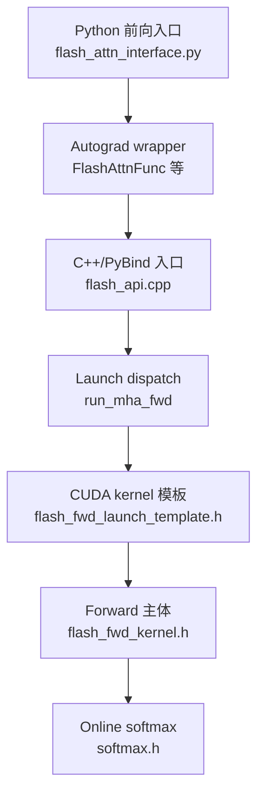
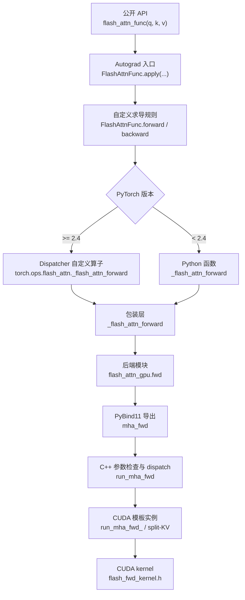
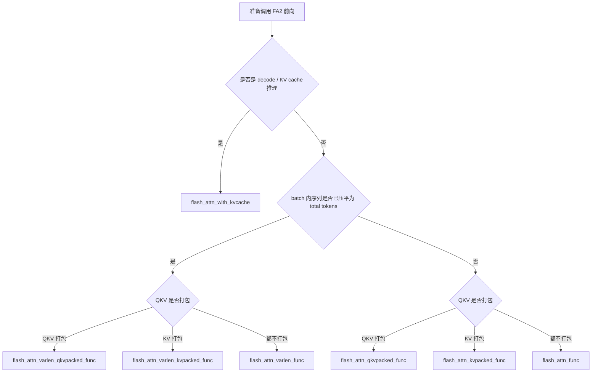

# FlashAttention-2 源码学习笔记

本文是 FlashAttention-2 源码学习笔记。最终目标是一路追到 CUDA kernel：理解 Python API 如何进入 C++ extension，C++ dispatch 如何选择具体模板实例，以及 `flash_fwd_kernel.h` 里的 tile、softmax 和 PV 计算如何组织。

这一节先从 `flash_attn/flash_attn_interface.py` 的公开前向入口开始。先把入口接口、参数语义和数据布局理顺，后面再沿着这些入口继续下钻到 `csrc/flash_attn/flash_api.cpp` 和 `csrc/flash_attn/src/flash_fwd_kernel.h`。这样读 CUDA kernel 时，能明确每个 kernel 参数来自哪个 Python API，以及不同接口为什么会走到同一类底层 forward。

FA2 的 Python 前向接口名字很多，但核心不是“有很多套注意力算法”，而是为了适配真实模型里的不同 **Q/K/V 存储方式**、**定长 / 变长 batch** 和 **推理 KV cache**。这些接口最终会收敛到底层 C++/CUDA extension，例如 `flash_attn_gpu.fwd`、`flash_attn_gpu.varlen_fwd` 和 `flash_attn_gpu.fwd_kvcache`。

## 源码阅读路线

这一节对应路线图里的前三层：



本节先回答：调用方应该选哪个 Python 前向接口，每个接口的参数和返回值是什么意思，以及这些接口如何收敛到底层 CUDA forward。后续章节会继续沿着这张图往下读。

## 从公开 API 到 CUDA 的完整分层

上一张图把 `FlashAttnFunc` 当作入口后的第一层；但真实调用从用户直接调用的 `flash_attn_func` 才开始。`flash_attn_interface.py` 同时承担了接口适配、PyTorch autograd 接入、`torch.compile` 接入和 CUDA extension 边界适配四件事。以最通用的定长前向 `flash_attn_func(q, k, v)` 为例，完整链路是：



这不是每一层都重新计算 attention：前半段主要是在**重组输入布局、保存反向所需状态，并告诉 PyTorch 如何认识这个算子**；真正的 GPU 计算从 `flash_attn_gpu.fwd` 进入已编译 extension 后才开始。`flash_attn_with_kvcache` 是唯一例外：它不支持 backward，因此公开函数经过少量输入规范化后直接调用 `flash_attn_gpu.fwd_kvcache`。

### 层次与职责速查

| 层次 | 定长普通路径中的符号 | 主要职责 | 是否参与 CUDA 计算 |
| --- | --- | --- | --- |
| 公开 API | `flash_attn_func` | 提供稳定、易用的签名；传入 `torch.is_grad_enabled()`。 | 否 |
| autograd wrapper | `FlashAttnFunc.apply`、`FlashAttnFunc` | 建立 PyTorch 反向节点，组织 `forward` 保存的状态和 `backward` 返回的梯度。 | 否 |
| 编译 / dispatcher 包装 | `_wrapped_flash_attn_forward` | 在 PyTorch 2.4+ 走 `torch.ops`，让 dispatcher 和 `torch.compile` 能识别自定义算子。 | 否 |
| Python 后端边界 | `_flash_attn_forward` | 保证最后一维连续，调用 extension 的 `fwd`。 | 否 |
| 已编译 extension | `flash_attn_gpu.fwd` | Python 绑定名；对应 C++ 的 `mha_fwd`。 | 进入 CUDA |
| C++ / CUDA dispatch | `mha_fwd`、`run_mha_fwd` | 检查约束、准备 `Flash_fwd_params`、按 dtype/head dim/causal 等选择模板。 | 发射 kernel |

其它训练接口只是在第一、二层不同：packed 接口切分或合并 Q/K/V 梯度，`varlen` 接口多传 `cu_seqlens_*` 与最大长度；它们分别收敛到 `varlen_fwd` / `varlen_bwd`。因此读源码时应把“接口形态差异”和“底层 attention 算法差异”分开：前者多数在 Python wrapper 消化，后者在 C++/CUDA dispatch 中决定。

## 公开 API 接口总览

| 接口 | 输入布局 | 主要场景 | 是否支持 backward | 备注 |
| --- | --- | --- | --- | --- |
| `flash_attn_func` | `q`、`k`、`v` 三个独立 tensor | 最通用的定长 batch attention | 支持 | 支持 MQA/GQA，读源码时建议先从它开始。 |
| `flash_attn_qkvpacked_func` | `qkv` 合在一个 tensor，形状含维度 `3` | self-attention 训练，QKV 由同一个线性层投影得到 | 支持 | backward 直接返回 `dqkv`，避免把 `dq/dk/dv` 再拼回去。 |
| `flash_attn_kvpacked_func` | `q` 独立，`kv` 合在一个 tensor，形状含维度 `2` | cross-attention 或 K/V 已经打包的 MQA/GQA | 支持 | backward 直接返回 `dq` 和 `dkv`。 |
| `flash_attn_varlen_func` | 压平后的 `q`、`k`、`v`，配合 `cu_seqlens_*` | 不同样本长度差异较大的训练 / 推理 prefill | 支持 | 避免 padding 到同一个长度。 |
| `flash_attn_varlen_qkvpacked_func` | 压平后的 `qkv`，配合一个 `cu_seqlens` | 变长 self-attention，Q/K/V 等长 | 支持 | varlen + qkv packed 的组合。 |
| `flash_attn_varlen_kvpacked_func` | 压平后的 `q` 和 `kv`，配合两组 `cu_seqlens_*` | 变长 cross-attention 或 GQA/MQA | 支持 | varlen + kv packed 的组合。 |
| `flash_attn_with_kvcache` | 当前 `q` + 已分配的 `k_cache/v_cache` | LLM decode / incremental inference | 不支持 | 可以原地更新 KV cache，并在同一个 kernel 中完成 attention。 |

## 命名规则

这些名字可以按三个维度拆开理解：

| 名字片段 | 含义 | 典型形状 |
| --- | --- | --- |
| `qkvpacked` | Q、K、V 已经堆在同一个 tensor 中 | `(batch, seqlen, 3, nheads, headdim)` 或 `(total, 3, nheads, headdim)` |
| `kvpacked` | K、V 已经堆在同一个 tensor 中，Q 单独传入 | `(batch, seqlen_k, 2, nheads_k, headdim)` 或 `(total_k, 2, nheads_k, headdim)` |
| `varlen` | batch 中每条序列长度不同，token 被压平成一维 `total` | `q: (total_q, nheads, headdim)` |
| `with_kvcache` | 使用已有 KV cache 做 decode 或增量推理 | `k_cache/v_cache` 保存历史 token 的 K/V |

换句话说，普通接口解决“怎么传 Q/K/V”，`varlen` 解决“怎么表示不等长序列”，`with_kvcache` 解决“推理时怎么复用历史 K/V”。

### 维度顺序：接口布局和计算视角

学习 attention 公式时，经常把 Q/K/V 写成：

```text
(B, H, L, D)
```

这个写法很适合数学推导，因为每个 `(b, h)` 对应一张 attention score 矩阵：

```text
Q[b, h]: (Lq, D)
K[b, h]: (Lk, D)
S[b, h]: (Lq, Lk)
```

但是 FA2 的公开 Python 接口采用的是：

```text
(B, L, H, D)
```

这里不是算法视角变了，而是**接口布局更贴近 Transformer 上游线性层的输出**。典型模型里，hidden states 先是：

```text
x: (B, L, hidden_size)
```

经过 QKV projection 后通常得到：

```text
qkv_proj(x): (B, L, 3 * H * D)
```

最自然的 reshape 是：

```text
qkv: (B, L, 3, H, D)
q:   (B, L, H, D)
k:   (B, L, H, D)
v:   (B, L, H, D)
```

如果接口强制使用 `(B, H, L, D)`，上游通常还要做一次 `transpose(1, 2)`，很多情况下再接 `.contiguous()` 就会触发真实内存重排。FA2 作为性能库，更希望调用方保持 projection 后自然得到的 `(B, L, H, D)`，然后 kernel 自己通过 stride（步幅）取出需要的 head 视图。

所以这里要分清两层：

| 层次 | 常用写法 | 含义 |
| --- | --- | --- |
| 数学 / 逻辑视角 | `(B, H, L, D)` | 固定 `(b, h)` 后，一张 head 内 attention 是 `(Lq, D) @ (D, Lk)`。 |
| FA2 Python 接口布局 | `(B, L, H, D)` | 贴近 `Linear(B, L, hidden)` 后的 reshape，最后一维 `D` 连续。 |
| CUDA kernel 内部视角 | 固定 `bidb` 和 `bidh` 后取 `(L, D)` tile | kernel 不需要整体 transpose，只根据 stride 在原布局里寻址。 |

对于 contiguous 的 `(B, L, H, D)` tensor，元素地址可以理解成：

$$
\operatorname{offset}(b, i, h, d)
= (((b \cdot L + i) \cdot H + h) \cdot D + d)
$$

固定 `b` 和 `h` 后，kernel 访问的是：

```text
q[b, :, h, :] -> 逻辑形状 (L, D)
```

这个 `(L, D)` 视图不一定是一整块连续矩阵，因为相邻 token 之间隔着 `H * D` 个元素；但每个 token 的 head vector：

```text
q[b, i, h, 0:D]
```

最后一维 `D` 是连续的，这正是 kernel 做向量化加载和按 `headdim` 计算时最关心的局部连续性。

在 C++ `mha_fwd` 中，这个布局会被拆成：

```cpp
batch_size = q.size(0);  // B
seqlen_q   = q.size(1);  // Lq
num_heads  = q.size(2);  // Hq
head_size  = q.size(3);  // D
```

然后保存 stride：

```cpp
q_batch_stride = q.stride(0);
q_row_stride   = q.stride(-3);  // L 维 stride
q_head_stride  = q.stride(-2);  // H 维 stride
```

进入 CUDA kernel 后，`blockIdx.y` 选择 batch，`blockIdx.z` 选择 query head。kernel 会构造当前 head 的二维视图：

```cpp
mQ: (actual_seqlen_q, h, d)
gQ = mQ(_, bidh, _) -> (kBlockM, kHeadDim)

mK: (actual_seqlen_k, h_k, d)
gK = mK(_, bidh / h_h_k_ratio, _) -> (kBlockN, kHeadDim)
```

也就是说，FA2 的设计可以概括成：

```text
对外接口：保持上游友好的 (B, L, H, D)
对内计算：仍然固定 (b, h)，按数学上的 (L, D) head 平面做 attention
实现方式：不做全量 transpose，只用 stride 和 blockIdx 定位数据
```

## 常见参数语义

下面这些参数会在多个接口中重复出现。

| 参数 | 类型 | 含义 |
| --- | --- | --- |
| `dropout_p` | `float` | attention dropout 概率。推理时应设为 `0.0`。如果大于 `0`，forward 会保存随机状态供 backward 复现 dropout。 |
| `softmax_scale` | `Optional[float]` | softmax 前对 `QK^T` 的缩放系数。若为 `None`，源码中使用 `headdim ** (-0.5)`。 |
| `causal` | `bool` | 是否启用因果 mask。对于 `seqlen_q != seqlen_k` 的情况，FA2 使用右下角对齐的 causal mask。 |
| `window_size` | `tuple[int, int]` | sliding window local attention 的左右窗口。默认 `(-1, -1)` 表示不限制上下文窗口。 |
| `softcap` | `float` | attention score softcap。`0.0` 或小于等于 `0` 表示关闭。 |
| `alibi_slopes` | `Optional[torch.Tensor]` | ALiBi bias 的斜率，常见形状为 `(nheads,)` 或 `(batch_size, nheads)`，dtype 通常为 fp32。 |
| `deterministic` | `bool` | 是否使用确定性 backward。forward 本身是确定性的；确定性 backward 会稍慢并使用更多内存。 |
| `return_attn_probs` | `bool` | 是否返回 attention 概率相关中间结果。源码说明该选项主要用于测试，返回的概率不保证有完全正确的缩放。 |

## Attention score 修饰参数

基础 scaled dot-product attention 可以写成：

$$
S_{b,h,i,j} = \alpha \cdot Q_{b,i,h,:} K_{b,j,h,:}^{T}
$$

$$
P_{b,h,i,j} = \operatorname{softmax}_{j}(S_{b,h,i,j})
$$

$$
O_{b,i,h,:} = \sum_j P_{b,h,i,j} V_{b,j,h,:}
$$

其中 $\alpha$ 就是 `softmax_scale`，默认值是 $1 / \sqrt{d_h}$。`causal`、`window_size`、`softcap` 和 `alibi_slopes` 都是在这个基础 score $S$ 上加约束或偏置，它们回答的是四类不同问题：

| 参数 | 解决的问题 | 对 score 的作用 |
| --- | --- | --- |
| `causal` | 自回归模型不能看未来 token。 | 把未来位置的 score 置为 $-\infty$。 |
| `window_size` | 长序列不一定需要看全局上下文，可以限制局部窗口。 | 把窗口外位置的 score 置为 $-\infty$。 |
| `softcap` | score 过大时 softmax 可能过尖，训练或推理中需要限制 score 幅度。 | 用 $\tanh$ 对 score 做平滑限幅。 |
| `alibi_slopes` | 不使用显式位置 embedding 时，也希望注意力带有相对位置偏置。 | 给不同距离的 key 加线性位置 bias。 |

### `causal`

**原理**

`causal=True` 表示第 `i` 个 query token 不能看它“未来”的 key token。最常见的 self-attention 场景里，`seqlen_q == seqlen_k == L`，保留条件是：

$$
j \le i
$$

也就是：

$$
S'_{b,h,i,j} =
\begin{cases}
S_{b,h,i,j}, & j \le i \\
-\infty, & j > i
\end{cases}
$$

softmax 后，$-\infty$ 对应的概率会变成 `0`，因此输出不会使用未来 token 的 `V`。

**为什么需要**

- GPT 这类 decoder-only 模型做 next-token prediction 时，当前位置只能依赖历史 token。
- 推理 decode 时，新 token 只能看已经生成的 KV cache，不能看还没生成的未来位置。
- causal mask 是 attention 里的结构约束，不是数值优化技巧；没有它，自回归训练会发生信息泄漏。

**`seqlen_q != seqlen_k` 的情况**

这两个长度当然可以不一样。典型场景有：

| 场景 | `seqlen_q` | `seqlen_k` | 为什么不同 |
| --- | --- | --- | --- |
| decode 单步推理 | `1` | 历史 cache 长度 + 当前 token | 当前只算一个 query，但 key/value 来自完整上下文。 |
| chunked decode / 多 token decode | 当前 chunk 长度 | 历史 cache 长度 + 当前 chunk 长度 | 一次处理多个新 query，同时可以看更长的 KV cache。 |
| cross-attention | decoder 侧长度 | encoder 侧长度 | Q 来自 decoder，K/V 来自 encoder，本来就是两条序列。 |
| varlen / unpadding | 每个样本的 query 长度 | 每个样本的 key 长度 | 不同样本或不同来源序列长度不一致。 |

对于 `seqlen_q != seqlen_k` 且 `causal=True`，FA2 使用**右下角对齐**。保留条件不是简单的 $j \le i$，而是：

$$
j \le i + seqlen_k - seqlen_q
$$

等价地说，query 序列的最后一个位置和 key 序列的最后一个位置对齐。mask 公式是：

$$
S'_{b,h,i,j} =
\begin{cases}
S_{b,h,i,j}, & j \le i + seqlen_k - seqlen_q \\
-\infty, & j > i + seqlen_k - seqlen_q
\end{cases}
$$

这个设计对 decode 很自然。假设 `seqlen_q = 1`，`seqlen_k = 5`，唯一的 query 是当前新 token，它应该能看见 5 个 key：

```text
1 1 1 1 1
```

如果仍然用左上角对齐的 $j \le i$，它只能看第一个 key，明显不符合 KV cache 推理语义。

再看源码 docstring 里的例子：`seqlen_q = 2`，`seqlen_k = 5`，右下角 causal mask 是：

```text
1 1 1 1 0
1 1 1 1 1
```

第一个 query 对齐到倒数第二个 key，所以不能看最后一个 key；第二个 query 对齐到最后一个 key，所以能看全部 key。

如果 `seqlen_q = 5`，`seqlen_k = 2`，右下角 causal mask 是：

```text
0 0
0 0
0 0
1 0
1 1
```

前几行没有任何可见 key，输出会是 0。这个情况在普通 self-attention 中不常见，但接口需要覆盖更一般的 query/key 长度组合。

### `window_size`

**原理**

`window_size=(left, right)` 表示 local attention。第 `i` 个 query 只允许看一个局部 key 区间。

当 `seqlen_q == seqlen_k` 时，保留条件是：

$$
i - left \le j \le i + right
$$

也就是：

$$
S'_{b,h,i,j} =
\begin{cases}
S_{b,h,i,j}, & i - left \le j \le i + right \\
-\infty, & \text{otherwise}
\end{cases}
$$

FA2 为了统一 `seqlen_q != seqlen_k` 的场景，也采用右下角对齐。源码里的窗口边界等价于：

$$
i + seqlen_k - seqlen_q - left \le j \le i + seqlen_k - seqlen_q + right
$$

所以一般形式是：

$$
S'_{b,h,i,j} =
\begin{cases}
S_{b,h,i,j}, & i + seqlen_k - seqlen_q - left \le j \le i + seqlen_k - seqlen_q + right \\
-\infty, & \text{otherwise}
\end{cases}
$$

默认 `window_size=(-1, -1)` 表示不启用 local attention。源码里还把 causal 看成一个特殊 local mask：`window_size_left = infinity`，`window_size_right = 0`。

**为什么需要**

- 长序列 attention 的完整 score 是 $L_q \times L_k$，局部窗口可以减少有效注意力范围。
- 许多任务中当前位置主要依赖邻近 token，例如局部上下文建模、滑动窗口 LLM、长上下文分块处理。
- 对 CUDA kernel 来说，local attention 还可以跳过部分无效 tile，减少无意义的 QK/PV 工作。

**和 `causal` 的关系**

- `causal=True` 时，本质是只能看左侧历史：$j \le i$。
- `window_size=(left, right)` 更一般，可以只看左边、右边或双侧窗口。
- 在 FA2 forward dispatch 中，local 分支只在非 causal 场景单独打开；causal 被当作专门优化过的特殊情况。

### `softcap`

**原理**

`softcap > 0` 时，FA2 会对 attention score 做平滑限幅。用户视角可以理解成：

$$
\widetilde{S}_{b,h,i,j}
= C \cdot \tanh\left(\frac{S_{b,h,i,j}}{C}\right)
$$

其中 $C$ 就是用户传入的 `softcap`，$S$ 是常规缩放后的 attention score。这样当 $|S|$ 很小时：

$$
C \cdot \tanh(S / C) \approx S
$$

当 $|S|$ 很大时：

$$
C \cdot \tanh(S / C) \rightarrow \pm C
$$

所以它不会改变小 score 的局部线性行为，但会把极大或极小 score 平滑压到 `[-C, C]` 附近。

从源码实现看，C++ 参数打包时会把用户传入的 `softcap=C` 拆成：

```text
params.softcap = softmax_scale / C
params.scale_softmax = C
```

CUDA kernel 里先对 QK 累加结果调用 `tanh(score * params.softcap)`，随后 softmax 路径再乘回 `params.scale_softmax`，整体效果就是上面的 $C \cdot \tanh(\alpha QK^T / C)$。

**为什么需要**

- 普通 attention score 可能因为 Q/K 范数较大而非常尖锐，softmax 后接近 one-hot。
- score 过尖会让模型对少数位置过度自信，也可能带来数值和训练稳定性问题。
- softcap 是一种连续可导的限幅方式，比直接 clamp 更平滑。

**约束**

从 `flash_api.cpp` 看，当前 FA2 中 `softcap > 0` 时要求 `dropout_p == 0`：

```text
Softcapping does not support dropout for now
```

所以它更常出现在推理或不使用 attention dropout 的路径中。

### `alibi_slopes`

**原理**

ALiBi 的全称是 Attention with Linear Biases。它不直接修改 Q/K/V，而是在 attention score 上加入相对位置 bias。

非 causal 场景下，FA2 docstring 和源码中的语义可以写成：

$$
S'_{b,h,i,j}
= S_{b,h,i,j}
- m_{b,h} \cdot \left|i + seqlen_k - seqlen_q - j\right|
$$

其中 $m_{b,h}$ 来自 `alibi_slopes`。如果 `alibi_slopes` 形状是 `(nheads,)`，表示每个 head 一条 slope；如果是 `(batch_size, nheads)`，表示每个 batch、每个 head 都可以有自己的 slope。

右下角对齐项 `seqlen_k - seqlen_q` 的原因和 causal/window 一样：当 Q/K 长度不同，最后一个 query 与最后一个 key 对齐，距离从这个对齐关系出发计算。

causal 场景下，由于合法区域里 key 都在 query 的左侧，距离公式可以化简。源码里 causal ALiBi 分支对同一个 key column 加同一组 bias，本质上仍然是在表达“越远的历史 token，位置 bias 越不利”。

**为什么需要**

- 位置关系不一定要通过绝对位置 embedding 注入，也可以直接作为 attention score bias。
- ALiBi 让不同 head 带有不同的距离偏好：有些 head 更关注近处，有些 head 可以看得更远。
- 对长上下文外推有帮助，因为它使用相对距离的线性 bias，不依赖固定长度的位置表。

**与绝对位置编码、RoPE 的关系**

三者都是让模型知道 token 位置的方案，但**注入位置不同**：

| 方案 | 位置在哪里进入计算 | 相对于 attention score 的时机 | FA2 接口中的表现 |
| --- | --- | --- | --- |
| 绝对位置编码 | 在进入 Q/K/V projection 前，把位置向量加到 token hidden state：`x_i = token_i + p_i`。 | `QK^T` 之前很早的上游网络。 | FA2 看不到 `p_i`；调用前传入的 `q/k/v` 已经带有它的影响。 |
| RoPE（旋转位置编码） | 按位置分别旋转 `Q_i` 和 `K_j`，再计算内积。 | `QK^T` 之前、attention 内积紧邻的一步。 | 普通 `flash_attn_*_func` 要求上游先旋转 Q/K；只有 `flash_attn_with_kvcache` 接收 `rotary_cos` / `rotary_sin`，可在写 cache 和计算时融合旋转。 |
| ALiBi | 给已算出的 score 加上与相对距离成线性的 bias：`S' = QK^T / sqrt(d) + bias(i, j)`。 | `QK^T` 之后、softmax 之前。 | 通过 `alibi_slopes` 传入，由 FA2 在 score 计算路径中融合。 |

因此，原始 ALiBi 架构通常把它作为**主要的位置方案**，不再额外使用绝对位置 embedding 或 RoPE；对某个已经训练好的模型，也应严格遵守它的 checkpoint/config 采用的方案。例如，RoPE 模型不应仅因为 FA2 支持 `alibi_slopes` 就额外打开 ALiBi，否则推理函数与训练时的 attention 定义不一致。

但三者在数学和 FA2 API 上**并非强制互斥**：绝对位置编码或预先完成的 RoPE 都可以与额外的 score bias 叠加。尤其 `flash_attn_with_kvcache` 同时接受 `rotary_cos`、`rotary_sin` 和 `alibi_slopes`，其 C++ 实现分别设置 rotary 参数和 ALiBi 参数，并没有互斥检查。这说明“技术上可以同时用”；是否应该同时用则是模型架构与训练设计的选择，通常只有专门以组合方案训练的模型才会这么做。

**和 mask 的区别**

- `causal` / `window_size` 是硬约束：不允许看的位置直接变成 $-\infty$，softmax 后概率为 0。
- `alibi_slopes` 是软偏置：位置越远 score 越低，但仍然可能被注意到。
- `softcap` 是数值变换：限制 score 幅度，不直接表达可见性或位置距离。

## `flash_attn_func`

**用途**

`flash_attn_func` 是最通用的定长 batch 前向接口。调用方分别传入 `q`、`k`、`v` 三个 tensor，适合先学习接口链路，也适合大多数直接使用场景。

**原型**

```python
def flash_attn_func(
    q,  # Query tensor，形状是 (batch_size, seqlen_q, nheads, headdim)。
    k,  # Key tensor，形状是 (batch_size, seqlen_k, nheads_k, headdim)。
    v,  # Value tensor，形状是 (batch_size, seqlen_k, nheads_k, headdim)。
    dropout_p=0.0,  # attention dropout 概率，推理时保持 0.0。
    softmax_scale=None,  # QK^T 的缩放系数，None 时使用 headdim ** -0.5。
    causal=False,  # 是否启用 causal mask。
    window_size=(-1, -1),  # local attention 窗口，(-1, -1) 表示全局 attention。
    softcap=0.0,  # score softcap，0.0 表示关闭。
    alibi_slopes=None,  # 可选 ALiBi 斜率。
    deterministic=False,  # 是否使用确定性 backward。
    return_attn_probs=False,  # 是否返回测试用 attention 概率信息。
):
    ...
```

**参数**

| 参数 | 类型 | 含义 |
| --- | --- | --- |
| `q` | `torch.Tensor` | Query，形状为 `(batch_size, seqlen_q, nheads, headdim)`。最后一维需要是连续或可被源码转成连续。 |
| `k` | `torch.Tensor` | Key，形状为 `(batch_size, seqlen_k, nheads_k, headdim)`。`nheads_k` 可小于 `nheads`，用于 MQA/GQA。 |
| `v` | `torch.Tensor` | Value，形状为 `(batch_size, seqlen_k, nheads_k, headdim)`，通常与 `k` 的 batch、序列长度和 KV head 数一致。 |
| `dropout_p` | `float` | attention dropout 概率，默认 `0.0`。推理时保持 `0.0`。 |
| `softmax_scale` | `Optional[float]` | softmax 前的缩放系数，默认 `None` 时使用 `q.shape[-1] ** (-0.5)`。 |
| `causal` | `bool` | 是否启用 causal mask，默认 `False`。当 `seqlen_q != seqlen_k` 时使用右下角对齐。 |
| `window_size` | `tuple[int, int]` | local attention 的左右窗口，默认 `(-1, -1)` 表示无限窗口。 |
| `softcap` | `float` | score softcap 参数，默认 `0.0` 表示关闭。 |
| `alibi_slopes` | `Optional[torch.Tensor]` | ALiBi bias 斜率，形状为 `(nheads,)` 或 `(batch_size, nheads)`。 |
| `deterministic` | `bool` | 是否使用确定性 backward，默认 `False`。只影响 backward 路径。 |
| `return_attn_probs` | `bool` | 是否额外返回 `softmax_lse` 和 `S_dmask`，默认 `False`。主要用于测试。 |

**返回值**

| 返回值 | 类型 | 含义 |
| --- | --- | --- |
| `out` | `torch.Tensor` | 默认返回值，形状为 `(batch_size, seqlen_q, nheads, headdim)`。 |
| `(out, softmax_lse, S_dmask)` | `tuple[torch.Tensor, torch.Tensor, torch.Tensor]` | 当 `return_attn_probs=True` 时返回。`softmax_lse` 形状为 `(batch_size, nheads, seqlen_q)`；`S_dmask` 是测试用 attention 概率 / dropout mask 信息。 |

**使用场景**

- Q、K、V 已经是三个独立 tensor。
- 需要 MQA/GQA，其中 `nheads % nheads_k == 0`。
- 初学源码时从这个接口进入最清晰：`flash_attn_func -> FlashAttnFunc.apply -> _flash_attn_forward -> flash_attn_gpu.fwd`。

## `flash_attn_qkvpacked_func`

**用途**

`flash_attn_qkvpacked_func` 用于 Q、K、V 已经存放在同一个 `qkv` tensor 的 self-attention。它能减少 Python 层拆分和 backward 时梯度重新拼接的开销。

**原型**

```python
def flash_attn_qkvpacked_func(
    qkv,  # 打包后的 Q/K/V，形状是 (batch_size, seqlen, 3, nheads, headdim)。
    dropout_p=0.0,  # attention dropout 概率。
    softmax_scale=None,  # QK^T 的缩放系数。
    causal=False,  # 是否启用 causal mask。
    window_size=(-1, -1),  # local attention 窗口。
    softcap=0.0,  # score softcap。
    alibi_slopes=None,  # 可选 ALiBi 斜率。
    deterministic=False,  # 是否使用确定性 backward。
    return_attn_probs=False,  # 是否返回测试用 attention 概率信息。
):
    ...
```

**参数**

| 参数 | 类型 | 含义 |
| --- | --- | --- |
| `qkv` | `torch.Tensor` | 打包后的 Q/K/V，形状为 `(batch_size, seqlen, 3, nheads, headdim)`，其中维度 `3` 分别对应 Q、K、V。 |
| `dropout_p` | `float` | attention dropout 概率，默认 `0.0`。 |
| `softmax_scale` | `Optional[float]` | softmax 前缩放系数，默认 `None` 时使用 `headdim ** (-0.5)`。 |
| `causal` | `bool` | 是否启用 causal mask，默认 `False`。 |
| `window_size` | `tuple[int, int]` | local attention 的窗口范围，默认 `(-1, -1)`。 |
| `softcap` | `float` | score softcap，默认 `0.0` 表示关闭。 |
| `alibi_slopes` | `Optional[torch.Tensor]` | ALiBi 斜率，形状为 `(nheads,)` 或 `(batch_size, nheads)`。 |
| `deterministic` | `bool` | 是否使用确定性 backward。 |
| `return_attn_probs` | `bool` | 是否额外返回测试用 attention 概率信息。 |

**返回值**

| 返回值 | 类型 | 含义 |
| --- | --- | --- |
| `out` | `torch.Tensor` | 默认返回值，形状为 `(batch_size, seqlen, nheads, headdim)`。 |
| `(out, softmax_lse, S_dmask)` | `tuple[torch.Tensor, torch.Tensor, torch.Tensor]` | 当 `return_attn_probs=True` 时返回。`softmax_lse` 形状为 `(batch_size, nheads, seqlen)`；`S_dmask` 主要用于测试。 |

**使用场景**

- 标准 self-attention 中，Q/K/V 由同一个线性层投影后自然组成一个 `qkv` tensor。
- backward 需要 `dqkv`，希望避免把 `dq`、`dk`、`dv` 再手动 concat。
- 不适合 MQA/GQA；源码注释建议这类场景使用 `flash_attn_kvpacked_func` 或 `flash_attn_func`。

## `flash_attn_kvpacked_func`

**用途**

`flash_attn_kvpacked_func` 用于 Q 单独存放、K/V 打包存放的定长接口。它常见于 cross-attention、MQA/GQA，或者模型内部已经把 K/V 放在同一个 tensor 的情况。

**原型**

```python
def flash_attn_kvpacked_func(
    q,  # Query tensor，形状是 (batch_size, seqlen_q, nheads, headdim)。
    kv,  # 打包后的 K/V，形状是 (batch_size, seqlen_k, 2, nheads_k, headdim)。
    dropout_p=0.0,  # attention dropout 概率。
    softmax_scale=None,  # QK^T 的缩放系数。
    causal=False,  # 是否启用 causal mask。
    window_size=(-1, -1),  # local attention 窗口。
    softcap=0.0,  # score softcap。
    alibi_slopes=None,  # 可选 ALiBi 斜率。
    deterministic=False,  # 是否使用确定性 backward。
    return_attn_probs=False,  # 是否返回测试用 attention 概率信息。
):
    ...
```

**参数**

| 参数 | 类型 | 含义 |
| --- | --- | --- |
| `q` | `torch.Tensor` | Query，形状为 `(batch_size, seqlen_q, nheads, headdim)`。 |
| `kv` | `torch.Tensor` | 打包后的 K/V，形状为 `(batch_size, seqlen_k, 2, nheads_k, headdim)`，其中维度 `2` 分别对应 K、V。 |
| `dropout_p` | `float` | attention dropout 概率，默认 `0.0`。 |
| `softmax_scale` | `Optional[float]` | softmax 前缩放系数，默认 `None` 时使用 `headdim ** (-0.5)`。 |
| `causal` | `bool` | 是否启用 causal mask，默认 `False`。当 `seqlen_q != seqlen_k` 时使用右下角对齐。 |
| `window_size` | `tuple[int, int]` | local attention 窗口。对于 `seqlen_q != seqlen_k`，窗口位置同样按右下角对齐语义解释。 |
| `softcap` | `float` | score softcap，默认关闭。 |
| `alibi_slopes` | `Optional[torch.Tensor]` | ALiBi 斜率，形状为 `(nheads,)` 或 `(batch_size, nheads)`。 |
| `deterministic` | `bool` | 是否使用确定性 backward。 |
| `return_attn_probs` | `bool` | 是否额外返回测试用 attention 概率信息。 |

**返回值**

| 返回值 | 类型 | 含义 |
| --- | --- | --- |
| `out` | `torch.Tensor` | 默认返回值，形状为 `(batch_size, seqlen_q, nheads, headdim)`。 |
| `(out, softmax_lse, S_dmask)` | `tuple[torch.Tensor, torch.Tensor, torch.Tensor]` | 当 `return_attn_probs=True` 时返回。`softmax_lse` 形状为 `(batch_size, nheads, seqlen_q)`；`S_dmask` 主要用于测试。 |

**使用场景**

- Q 与 K/V 的来源不同，例如 cross-attention。
- 使用 MQA/GQA，`nheads_k` 小于 `nheads`，并要求 `nheads` 能被 `nheads_k` 整除。
- K/V 本来就是 packed layout，backward 希望直接得到 `dkv`。

## `flash_attn_varlen_func`

**用途**

`flash_attn_varlen_func` 是最通用的变长接口。它把 batch 内所有 token 沿序列维压平，通过 `cu_seqlens_q` 和 `cu_seqlens_k` 描述每条序列的边界，从而避免 padding 带来的无效计算。

**原型**

```python
def flash_attn_varlen_func(
    q,  # 压平后的 Query，形状是 (total_q, nheads, headdim)。
    k,  # 压平后的 Key，形状是 (total_k, nheads_k, headdim)。
    v,  # 压平后的 Value，形状是 (total_k, nheads_k, headdim)。
    cu_seqlens_q,  # Query 侧累积序列长度，形状是 (batch_size + 1,)。
    cu_seqlens_k,  # Key/Value 侧累积序列长度，形状是 (batch_size + 1,)。
    max_seqlen_q,  # batch 内最大 query 长度。
    max_seqlen_k,  # batch 内最大 key/value 长度。
    dropout_p=0.0,  # attention dropout 概率。
    softmax_scale=None,  # QK^T 的缩放系数。
    causal=False,  # 是否启用 causal mask。
    window_size=(-1, -1),  # local attention 窗口。
    softcap=0.0,  # score softcap。
    alibi_slopes=None,  # 可选 ALiBi 斜率。
    deterministic=False,  # 是否使用确定性 backward。
    return_attn_probs=False,  # 是否返回测试用 attention 概率信息。
    block_table=None,  # 可选 paged KV / block table。
):
    ...
```

**参数**

| 参数 | 类型 | 含义 |
| --- | --- | --- |
| `q` | `torch.Tensor` | 压平后的 Query，形状为 `(total_q, nheads, headdim)`。 |
| `k` | `torch.Tensor` | 压平后的 Key，形状为 `(total_k, nheads_k, headdim)`。 |
| `v` | `torch.Tensor` | 压平后的 Value，形状为 `(total_k, nheads_k, headdim)`。 |
| `cu_seqlens_q` | `torch.Tensor` | Query 侧累积序列长度，形状为 `(batch_size + 1,)`，dtype 为 `torch.int32`。第 `i` 条序列范围是 `[cu_seqlens_q[i], cu_seqlens_q[i + 1])`。 |
| `cu_seqlens_k` | `torch.Tensor` | Key/Value 侧累积序列长度，形状为 `(batch_size + 1,)`，dtype 为 `torch.int32`。 |
| `max_seqlen_q` | `int` | batch 内最大 query 序列长度，用于 kernel launch 和 block 规模判断。 |
| `max_seqlen_k` | `int` | batch 内最大 key/value 序列长度。 |
| `dropout_p` | `float` | attention dropout 概率。 |
| `softmax_scale` | `Optional[float]` | softmax 前缩放系数。 |
| `causal` | `bool` | 是否启用 causal mask。 |
| `window_size` | `tuple[int, int]` | local attention 窗口。 |
| `softcap` | `float` | score softcap，默认关闭。 |
| `alibi_slopes` | `Optional[torch.Tensor]` | ALiBi 斜率，形状为 `(nheads,)` 或 `(batch_size, nheads)`。 |
| `deterministic` | `bool` | 是否使用确定性 backward。 |
| `return_attn_probs` | `bool` | 是否额外返回测试用 attention 概率信息。 |
| `block_table` | `Optional[torch.Tensor]` | 可选 block table。从接口和调用点看，它用于底层 varlen forward 的 block / paged KV 访问路径；普通 varlen attention 可传 `None`。 |

**返回值**

| 返回值 | 类型 | 含义 |
| --- | --- | --- |
| `out` | `torch.Tensor` | 默认返回值，形状为 `(total_q, nheads, headdim)`。 |
| `(out, softmax_lse, S_dmask)` | `tuple[torch.Tensor, torch.Tensor, torch.Tensor]` | 当 `return_attn_probs=True` 时返回。`softmax_lse` 形状为 `(nheads, total_q)` 或与底层实现对应的变长布局；`S_dmask` 主要用于测试。 |

**使用场景**

- batch 内序列长度差异很大，不希望 padding 到最大长度。
- 数据已经经过 unpad / pack，形成 `(total, ...)` 形状。
- 需要支持 Q 和 K/V 长度不同的变长 attention。

## `flash_attn_varlen_qkvpacked_func`

**用途**

`flash_attn_varlen_qkvpacked_func` 是变长 self-attention 的 packed 版本。它假设每个 token 的 Q/K/V 都在同一个 `qkv` tensor 中，并且 Q、K、V 的序列边界相同。

**原型**

```python
def flash_attn_varlen_qkvpacked_func(
    qkv,  # 压平后的 Q/K/V，形状是 (total, 3, nheads, headdim)。
    cu_seqlens,  # 累积序列长度，形状是 (batch_size + 1,)。
    max_seqlen,  # batch 内最大序列长度。
    dropout_p=0.0,  # attention dropout 概率。
    softmax_scale=None,  # QK^T 的缩放系数。
    causal=False,  # 是否启用 causal mask。
    window_size=(-1, -1),  # local attention 窗口。
    softcap=0.0,  # score softcap。
    alibi_slopes=None,  # 可选 ALiBi 斜率。
    deterministic=False,  # 是否使用确定性 backward。
    return_attn_probs=False,  # 是否返回测试用 attention 概率信息。
):
    ...
```

**参数**

| 参数 | 类型 | 含义 |
| --- | --- | --- |
| `qkv` | `torch.Tensor` | 压平后的 Q/K/V，形状为 `(total, 3, nheads, headdim)`，`total` 是 batch 中 token 总数。 |
| `cu_seqlens` | `torch.Tensor` | 累积序列长度，形状为 `(batch_size + 1,)`，dtype 为 `torch.int32`。同一组边界同时用于 Q、K、V。 |
| `max_seqlen` | `int` | batch 内最大序列长度。 |
| `dropout_p` | `float` | attention dropout 概率。 |
| `softmax_scale` | `Optional[float]` | softmax 前缩放系数。 |
| `causal` | `bool` | 是否启用 causal mask。 |
| `window_size` | `tuple[int, int]` | local attention 窗口，默认不限制。 |
| `softcap` | `float` | score softcap，默认关闭。 |
| `alibi_slopes` | `Optional[torch.Tensor]` | ALiBi 斜率，形状为 `(nheads,)` 或 `(batch_size, nheads)`。 |
| `deterministic` | `bool` | 是否使用确定性 backward。 |
| `return_attn_probs` | `bool` | 是否额外返回测试用 attention 概率信息。 |

**返回值**

| 返回值 | 类型 | 含义 |
| --- | --- | --- |
| `out` | `torch.Tensor` | 默认返回值，形状为 `(total, nheads, headdim)`。 |
| `(out, softmax_lse, S_dmask)` | `tuple[torch.Tensor, torch.Tensor, torch.Tensor]` | 当 `return_attn_probs=True` 时返回。`softmax_lse` 对应每个 query token 的 logsumexp；`S_dmask` 主要用于测试。 |

**使用场景**

- 变长 self-attention，Q/K/V 序列边界完全相同。
- 上游已经把 padded batch unpad 成 `(total, 3, nheads, headdim)`。
- 训练时希望 backward 直接返回 `dqkv`。

## `flash_attn_varlen_kvpacked_func`

**用途**

`flash_attn_varlen_kvpacked_func` 是变长 attention 的 KV packed 版本。它适合 Q 与 K/V 序列边界不同，且 K/V 已经打包在一个 tensor 的场景。

**原型**

```python
def flash_attn_varlen_kvpacked_func(
    q,  # 压平后的 Query，形状是 (total_q, nheads, headdim)。
    kv,  # 压平后的 K/V，形状是 (total_k, 2, nheads_k, headdim)。
    cu_seqlens_q,  # Query 侧累积序列长度。
    cu_seqlens_k,  # Key/Value 侧累积序列长度。
    max_seqlen_q,  # batch 内最大 query 长度。
    max_seqlen_k,  # batch 内最大 key/value 长度。
    dropout_p=0.0,  # attention dropout 概率。
    softmax_scale=None,  # QK^T 的缩放系数。
    causal=False,  # 是否启用 causal mask。
    window_size=(-1, -1),  # local attention 窗口。
    softcap=0.0,  # score softcap。
    alibi_slopes=None,  # 可选 ALiBi 斜率。
    deterministic=False,  # 是否使用确定性 backward。
    return_attn_probs=False,  # 是否返回测试用 attention 概率信息。
):
    ...
```

**参数**

| 参数 | 类型 | 含义 |
| --- | --- | --- |
| `q` | `torch.Tensor` | 压平后的 Query，形状为 `(total_q, nheads, headdim)`。 |
| `kv` | `torch.Tensor` | 压平后的 K/V，形状为 `(total_k, 2, nheads_k, headdim)`。 |
| `cu_seqlens_q` | `torch.Tensor` | Query 侧累积序列长度，形状为 `(batch_size + 1,)`，dtype 为 `torch.int32`。 |
| `cu_seqlens_k` | `torch.Tensor` | Key/Value 侧累积序列长度，形状为 `(batch_size + 1,)`，dtype 为 `torch.int32`。 |
| `max_seqlen_q` | `int` | batch 内最大 query 序列长度。 |
| `max_seqlen_k` | `int` | batch 内最大 key/value 序列长度。 |
| `dropout_p` | `float` | attention dropout 概率。 |
| `softmax_scale` | `Optional[float]` | softmax 前缩放系数。 |
| `causal` | `bool` | 是否启用 causal mask。 |
| `window_size` | `tuple[int, int]` | local attention 窗口。 |
| `softcap` | `float` | score softcap，默认关闭。 |
| `alibi_slopes` | `Optional[torch.Tensor]` | ALiBi 斜率，形状为 `(nheads,)` 或 `(batch_size, nheads)`。 |
| `deterministic` | `bool` | 是否使用确定性 backward。 |
| `return_attn_probs` | `bool` | 是否额外返回测试用 attention 概率信息。 |

**返回值**

| 返回值 | 类型 | 含义 |
| --- | --- | --- |
| `out` | `torch.Tensor` | 默认返回值，形状为 `(total_q, nheads, headdim)`。 |
| `(out, softmax_lse, S_dmask)` | `tuple[torch.Tensor, torch.Tensor, torch.Tensor]` | 当 `return_attn_probs=True` 时返回。`softmax_lse` 对应每个 query token 的 logsumexp；`S_dmask` 主要用于测试。 |

**使用场景**

- 变长 cross-attention。
- 变长 MQA/GQA，其中 `nheads_k` 小于 `nheads`。
- K/V 已经打包，backward 希望直接得到 `dkv`。

## `flash_attn_with_kvcache`

**用途**

`flash_attn_with_kvcache` 是推理场景的前向接口。它读取已经分配好的 `k_cache` 和 `v_cache`，可选地把新来的 `k`、`v` 原地写入 cache，然后基于更新后的 cache 完成 attention。源码明确说明该接口 **不支持 backward**。

**原型**

```python
def flash_attn_with_kvcache(
    q,  # 当前 query，形状是 (batch_size, seqlen, nheads, headdim)。
    k_cache,  # 历史 key cache，普通 cache 或 paged KV cache 布局。
    v_cache,  # 历史 value cache，布局与 k_cache 对应。
    k=None,  # 可选的新 key，会被写入 k_cache。
    v=None,  # 可选的新 value，会被写入 v_cache。
    rotary_cos=None,  # 可选 RoPE cos 表。
    rotary_sin=None,  # 可选 RoPE sin 表。
    cache_seqlens=None,  # 每条序列当前 cache 长度。
    cache_batch_idx=None,  # 当前 batch 到 cache batch 的索引映射。
    cache_leftpad=None,  # KV cache 左侧 padding 起点。
    block_table=None,  # paged KV cache 的 block table。
    softmax_scale=None,  # QK^T 的缩放系数。
    causal=False,  # 是否启用 causal mask。
    window_size=(-1, -1),  # local attention 窗口。
    softcap=0.0,  # score softcap。
    rotary_interleaved=True,  # RoPE 是否使用 interleaved 维度布局。
    alibi_slopes=None,  # 可选 ALiBi 斜率。
    num_splits=0,  # split-KV 的切分数量，0 表示启发式选择。
    return_softmax_lse=False,  # 是否返回 softmax_lse。
):
    ...
```

**参数**

| 参数 | 类型 | 含义 |
| --- | --- | --- |
| `q` | `torch.Tensor` | 当前 query，形状为 `(batch_size, seqlen, nheads, headdim)`。 |
| `k_cache` | `torch.Tensor` | Key cache。普通布局为 `(batch_size_cache, seqlen_cache, nheads_k, headdim)`；若使用 `block_table`，布局为 `(num_blocks, page_block_size, nheads_k, headdim)`。源码要求最后一维连续。 |
| `v_cache` | `torch.Tensor` | Value cache，布局与 `k_cache` 对应。源码要求最后一维连续。 |
| `k` | `Optional[torch.Tensor]` | 新写入 cache 的 key，形状为 `(batch_size, seqlen_new, nheads_k, headdim)`。若不为 `None`，会从 `cache_seqlens` 指定的位置写入 `k_cache`。 |
| `v` | `Optional[torch.Tensor]` | 新写入 cache 的 value，形状与 `k` 对应。 |
| `rotary_cos` | `Optional[torch.Tensor]` | RoPE cos 表，形状为 `(seqlen_ro, rotary_dim / 2)`。只有传入 `k` 和 `v` 时才适用。 |
| `rotary_sin` | `Optional[torch.Tensor]` | RoPE sin 表，形状与 `rotary_cos` 对应。 |
| `cache_seqlens` | `Optional[Union[int, torch.Tensor]]` | KV cache 中每条序列已有长度。若是 `int`，源码会扩展成形状 `(batch_size,)`、dtype 为 `torch.int32` 的 tensor。 |
| `cache_batch_idx` | `Optional[torch.Tensor]` | 当前 batch 到 cache batch 的索引，形状为 `(batch_size,)`，dtype 为 `torch.int32`。为 `None` 时默认使用 `[0, 1, ..., batch_size - 1]`。 |
| `cache_leftpad` | `Optional[torch.Tensor]` | 每条序列在 KV cache 中的左 padding 起点，形状为 `(batch_size,)`，dtype 为 `torch.int32`。 |
| `block_table` | `Optional[torch.Tensor]` | paged KV cache 的 block table，形状为 `(batch_size, max_num_blocks_per_seq)`，dtype 为 `torch.int32`。 |
| `softmax_scale` | `Optional[float]` | softmax 前缩放系数，默认使用 `headdim ** (-0.5)`。 |
| `causal` | `bool` | 是否启用 causal mask。 |
| `window_size` | `tuple[int, int]` | local attention 窗口。 |
| `softcap` | `float` | score softcap，默认关闭。 |
| `rotary_interleaved` | `bool` | RoPE 维度布局。`True` 表示交错组合维度 `0&1, 2&3`；`False` 表示 GPT-NeoX 风格的前后半区组合。 |
| `alibi_slopes` | `Optional[torch.Tensor]` | ALiBi 斜率，形状为 `(nheads,)` 或 `(batch_size, nheads)`。 |
| `num_splits` | `int` | split-KV 数量。`0` 表示使用启发式自动决定；`1` 表示不切分；大于 `1` 表示沿 KV 序列切成多个 chunk。源码注释建议不了解时不要改。 |
| `return_softmax_lse` | `bool` | 是否返回 attention score 的 logsumexp。 |

**返回值**

| 返回值 | 类型 | 含义 |
| --- | --- | --- |
| `out` | `torch.Tensor` | 默认返回值，形状为 `(batch_size, seqlen, nheads, headdim)`。 |
| `(out, softmax_lse)` | `tuple[torch.Tensor, torch.Tensor]` | 当 `return_softmax_lse=True` 时返回。`softmax_lse` 形状为 `(batch_size, nheads, seqlen)`。 |

**副作用 / 约束**

- 如果 `k` 和 `v` 不为 `None`，该接口会 **原地更新** `k_cache` 和 `v_cache`。
- `k_cache.stride(-1) == 1` 且 `v_cache.stride(-1) == 1`，否则源码会触发 `assert`。
- 使用 paged KV cache 时，`page_block_size` 必须是 `256` 的倍数。
- 该接口用于推理，不支持 backward。

**使用场景**

- LLM decode 阶段，每一步只处理少量新 token。
- 已经预分配 KV cache，希望在一个 kernel 中完成“写入新 KV + 读取历史 KV + attention”。
- 使用 paged KV cache 或 split-KV 优化长上下文 decode。

## 定长、变长和 KV cache 的选择



这张图只按 Python 接口选择来理解。真正的 CUDA kernel dispatch 还会继续根据 dtype、head_dim、causal、dropout、local attention、是否 split-KV 等条件选择模板实例。

## 公开函数、`torch.autograd.Function` 与底层接口

### 公开 API：真正由模型代码调用的入口

模型代码不应该直接调用 `_flash_attn_forward` 或 `flash_attn_gpu.fwd`；它们是模块内部接口。真正对外的是没有下划线的七个函数：

| 公开 API | `.apply()` 的 autograd 类 | forward 自定义算子 | backward 自定义算子 | extension 最终入口 |
| --- | --- | --- | --- | --- |
| `flash_attn_func` | `FlashAttnFunc` | `_wrapped_flash_attn_forward` | `_wrapped_flash_attn_backward` | `fwd` / `bwd` |
| `flash_attn_qkvpacked_func` | `FlashAttnQKVPackedFunc` | `_wrapped_flash_attn_forward` | `_wrapped_flash_attn_backward` | `fwd` / `bwd` |
| `flash_attn_kvpacked_func` | `FlashAttnKVPackedFunc` | `_wrapped_flash_attn_forward` | `_wrapped_flash_attn_backward` | `fwd` / `bwd` |
| `flash_attn_varlen_func` | `FlashAttnVarlenFunc` | `_wrapped_flash_attn_varlen_forward` | `_wrapped_flash_attn_varlen_backward` | `varlen_fwd` / `varlen_bwd` |
| `flash_attn_varlen_qkvpacked_func` | `FlashAttnVarlenQKVPackedFunc` | `_wrapped_flash_attn_varlen_forward` | `_wrapped_flash_attn_varlen_backward` | `varlen_fwd` / `varlen_bwd` |
| `flash_attn_varlen_kvpacked_func` | `FlashAttnVarlenKVPackedFunc` | `_wrapped_flash_attn_varlen_forward` | `_wrapped_flash_attn_varlen_backward` | `varlen_fwd` / `varlen_bwd` |
| `flash_attn_with_kvcache` | 无 | 无 | 无 | `fwd_kvcache` |

以 `flash_attn_func` 为例，它的实现本质上是一个很薄的入口：

```python
return FlashAttnFunc.apply(
    q, k, v,
    dropout_p, softmax_scale, causal, window_size,
    softcap, alibi_slopes, deterministic,
    return_attn_probs, torch.is_grad_enabled(),
)
```

最后的 `torch.is_grad_enabled()` 不是普通 attention 参数。它把调用点是否处于 `torch.no_grad()` / inference mode 的状态显式传给 `forward`：wrapper 只有在“当前允许求导”并且至少一个输入 `requires_grad=True` 时，才保存反向状态。`flash_attn_with_kvcache` 因为会原地更新 cache 且源码明确不支持 backward，所以不经过 `.apply()`。

### `torch.autograd.Function`：把 CUDA 前向接进 PyTorch 自动求导

`torch.autograd.Function` 是 PyTorch 为“PyTorch 不知道如何自动微分的运算”提供的扩展点。普通 PyTorch 运算会由 autograd 根据已登记的梯度规则自动串成计算图；FA2 的核心计算在自定义 CUDA extension 中，PyTorch 无法从 `flash_attn_gpu.fwd` 的内部推导梯度。因此 FA2 定义 `FlashAttnFunc` 等类，并以 `Class.apply(...)` 作为调用入口：

```text
输入 requires_grad=True
        │
        ▼
FlashAttnFunc.apply(...)
        │  调用静态 forward(ctx, ...)
        ▼
输出 out（其 grad_fn 关联到这个 Function）
        │
        ▼
loss.backward()
        │  autograd 将 dout 传给静态 backward(ctx, dout)
        ▼
返回与 apply 输入逐一对应的 dq、dk、dv 或 None
```

`ctx` 是本次 `.apply()` 调用专属的上下文对象，不是类的实例状态。FA2 用它保存两类数据：

| 保存方式 | `FlashAttnFunc` 中的内容 | 为什么要保存 |
| --- | --- | --- |
| `ctx.save_for_backward(...)` | `q`、`k`、`v`、`out_padded`、`softmax_lse`、`rng_state` | 这些是 tensor；PyTorch 会将其作为 saved tensors 管理，并在 backward 时通过 `ctx.saved_tensors` 取回。`rng_state` 用于让 dropout backward 复现 forward 的随机掩码。 |
| `ctx.<field> = ...` | `dropout_p`、`softmax_scale`、`causal`、`window_size`、`softcap`、`alibi_slopes`、`deterministic` | 这些是标量、元组或配置，backward 调用 extension 时必须保持与 forward 一致。 |

`FlashAttnFunc.forward` 会将 `headdim` 补齐到 8 的倍数，调用前向算子，并在输出前裁回原来的维度。其 `backward` 则先创建 `dq/dk/dv`，把这些**预分配的输出 buffer**交给 `_wrapped_flash_attn_backward` 原地写入，最后裁掉 padding，并按 `.apply()` 的参数顺序返回：

```python
# 与 q、k、v 对应的三个梯度；后面的非 tensor 或不可导参数均为 None。
return dq, dk, dv, None, None, None, None, None, None, None, None, None
```

这个“返回值位置必须对齐 `apply` 输入位置”的规则很重要。packed 版本正是利用它避免额外拼接：`FlashAttnQKVPackedFunc.backward` 分配一个 `dqkv`，把三个视图 `dqkv[:, :, 0:3]` 传给底层 backward，最后只返回一个与 `qkv` 对齐的梯度；`KVPacked` 版本类似地返回 `dq, dkv`。变长类仅额外保存 `cu_seqlens_*` 和 `max_seqlen_*`，其机制完全相同。

### `_flash_attn_*`：Python 后端边界与连续性规范化

`FlashAttnFunc` 并不直接调用 extension，而是调用 `_wrapped_flash_attn_forward`。在 PyTorch 2.4 以下，它就是 `_flash_attn_forward`；该函数才是 Python 与已编译模块之间的直接边界：

```python
def _flash_attn_forward(...) -> tuple[torch.Tensor, ...]:
    # 若最后一维不是连续存储，先复制为最后一维 stride 为 1 的 tensor。
    q, k, v = [maybe_contiguous(x) for x in (q, k, v)]
    return flash_attn_gpu.fwd(q, k, v, None, alibi_slopes, ...)
```

`maybe_contiguous` 只在 `x.stride(-1) != 1` 时调用 `.contiguous()`，因此不会无条件复制。C++ 的 `mha_fwd` / `mha_varlen_fwd` 同样检查最后一维连续；这里提前规范化是为了把常见的非连续输入转换为 extension 可接受的布局。注意，这不要求整个 tensor 连续，batch、sequence、head 维仍可以由 stride 描述。

四个内部算子及其返回 / 写入关系如下：

| 内部函数 | 调用的 extension 符号 | 返回值或副作用 |
| --- | --- | --- |
| `_flash_attn_forward` | `flash_attn_gpu.fwd` | 返回 `out, softmax_lse, S_dmask, rng_state`。 |
| `_flash_attn_varlen_forward` | `flash_attn_gpu.varlen_fwd` | 返回同样四项，另外接收 `cu_seqlens_*`、`block_table` 等变长元数据。 |
| `_flash_attn_backward` | `flash_attn_gpu.bwd` | 原地写入传入的 `dq/dk/dv`，Python 侧只返回 `softmax_d`。 |
| `_flash_attn_varlen_backward` | `flash_attn_gpu.varlen_bwd` | 原地写入传入的 `dq/dk/dv`，Python 侧只返回 `softmax_d`。 |

这里“backward 只返回 `softmax_d`”不表示它没有算 `dq/dk/dv`：三者是作为传入 buffer 被 CUDA extension 修改的。这个约定也解释了后面的 `mutates_args=("dq", "dk", "dv")`。

### `torch.library.custom_op`、`torch.ops` 与 fake 实现

从源码可见，2.4 是这一层的分界点：

```python
if torch.__version__ >= "2.4.0":
    _torch_custom_op_wrapper = torch.library.custom_op
    _torch_register_fake_wrapper = torch.library.register_fake
else:
    _torch_custom_op_wrapper = noop_custom_op_wrapper
    _torch_register_fake_wrapper = noop_register_fake_wrapper
```

随后 `_flash_attn_forward` 被统一的别名装饰，而不是总是直接写 `@torch.library.custom_op`：

```python
@_torch_custom_op_wrapper(
    "flash_attn::_flash_attn_forward", mutates_args=(), device_types="cuda"
)
def _flash_attn_forward(...) -> tuple[torch.Tensor, ...]:
    ...
```

| 机制 | PyTorch 2.4+ 的行为 | 旧版 PyTorch 的行为 |
| --- | --- | --- |
| `_torch_custom_op_wrapper` | 等于 `torch.library.custom_op`。它把 Python 函数登记为命名空间 `flash_attn` 中的自定义 operator，并依据注解建立 dispatcher 可见的 schema。 | 是一个 no-op 装饰器，只返回原函数；不登记 dispatcher operator。 |
| `_torch_register_fake_wrapper` | 等于 `torch.library.register_fake`。它为同名 operator 登记“只推导元数据”的实现。 | no-op；不会登记 fake 实现。 |
| `_wrapped_flash_attn_forward` | 绑定到 `torch.ops.flash_attn._flash_attn_forward`，经 PyTorch dispatcher 调用。 | 直接绑定到 Python 函数 `_flash_attn_forward`。 |

`torch.ops.flash_attn._flash_attn_forward` 不是 CUDA extension 里 PyBind11 的 `fwd` 名字，而是 `torch.library` 登记后，由 PyTorch dispatcher 暴露的算子句柄；两者之间仍隔着 `_flash_attn_forward` 这个 Python 函数。这样分层能让 `torch.compile` 在编译图中把 FA2 当成具有明确输入输出和副作用的 operator，而不是一个无法分析的任意 Python 调用。

四个 `*_fake` 函数不会运行 `flash_attn_gpu` 的 CUDA kernel。它们只根据输入的 shape、dtype 和 device 创建同形状或预期形状的空 tensor，例如定长 forward 的 `out` 与 `q` 同形、`softmax_lse` 为 `(batch_size, num_heads, seqlen_q)`。这让 FakeTensor / 编译期的形状传播可以得到输出元数据，同时不要求在 tracing 时真的有可执行 CUDA 计算。

`mutates_args` 则是算子副作用契约：

| 装饰的函数 | `mutates_args` | 含义 |
| --- | --- | --- |
| `_flash_attn_forward`、`_flash_attn_varlen_forward` | `()` | 不原地修改其参数。 |
| `_flash_attn_backward`、`_flash_attn_varlen_backward` | `("dq", "dk", "dv")` | CUDA extension 会把梯度结果写入这三个调用方提供的 buffer；compiler / dispatcher 不能把它们当作纯函数输入。 |

源码采用 `torch.__version__ >= "2.4.0"` 的**字符串比较**。它表达的意图是“只在新 API 可用时启用 custom op 和 fake registration”；如果维护这段代码，更稳妥的版本判断通常应使用版本解析对象，而不是字符串字典序（例如 `"2.10.0"` 与 `"2.4.0"` 的字典序并不符合数值版本顺序）。这是对源码维护性的观察，不影响本文所分析版本的层级关系。

### 从 `flash_attn_gpu` 到 C++ / CUDA

文件开头根据后端选择导入的模块：NVIDIA CUDA 主路径是 `import flash_attn_2_cuda as flash_attn_gpu`；ROCm/HIP 环境在不能导入该模块或显式开启开关时，可改走 Triton AMD 实现。后文沿用 `flash_attn_gpu` 这个统一别名讨论 NVIDIA 主路径。

`flash_attn_2_cuda` 的 PyBind11 模块在 `csrc/flash_attn/flash_api.cpp` 导出下列 Python 名称：

| Python extension 名称 | C++ 实现 | 用途 |
| --- | --- | --- |
| `fwd` | `mha_fwd` | 定长 forward。 |
| `varlen_fwd` | `mha_varlen_fwd` | 变长 / 可选 paged KV forward。 |
| `bwd` | `mha_bwd` | 定长 backward。 |
| `varlen_bwd` | `mha_varlen_bwd` | 变长 backward。 |
| `fwd_kvcache` | `mha_fwd_kvcache` | KV cache 推理 forward。 |

以 `mha_fwd` 为例，它先检查 CUDA 设备、Ampere 及以上计算能力、`fp16` / `bf16` dtype、最后一维连续、`head_size <= 256`、`head_size % 8 == 0` 和 MQA/GQA 的整除关系；然后分配 `out`、`softmax_lse`、可选 `S_dmask`、`rng_state`，将地址和 stride 填入 `Flash_fwd_params`。最后 `run_mha_fwd` 通过 `FP16_SWITCH`、`HEADDIM_SWITCH` 和 `BOOL_SWITCH` 选择 element type、编译期 head dimension 与 causal 模板参数；根据 split-KV 条件再选择普通 kernel 或 `run_mha_fwd_splitkv_dispatch`。这正是 Python 的通用参数最终收敛为有限个 CUDA 模板实例的位置。

注意 `qkvpacked` 和 `kvpacked` 的“打包”主要影响 Python 层如何从输入 tensor 中切出 `q/k/v`，以及 backward 如何组织梯度返回；进入底层 CUDA forward 时，仍然会把 Q、K、V 作为独立 tensor 传入。

## 注意点

- **head_dim padding**：从实现看，如果 `headdim` 不是 `8` 的倍数，Python wrapper 会在最后一维 pad 到 `8` 的倍数，返回前再裁掉原始 `headdim`。
- **last dimension contiguity（最后一维连续）**：源码通过 `maybe_contiguous` 保证很多输入的最后一维连续；`flash_attn_with_kvcache` 对 cache tensor 直接用 `assert` 检查。
- **MQA/GQA 约束**：当 `nheads_k < nheads` 时，`nheads` 必须能被 `nheads_k` 整除。每个 KV head 会服务一组 query heads。
- **`return_attn_probs` 不是常规训练输出**：源码注释说明它主要用于测试，返回的概率不保证有完全正确的缩放，并且会带来额外内存开销。
- **causal mask 右下角对齐**：当 `seqlen_q != seqlen_k` 时，FA2 的 causal mask 不是简单左上角对齐，而是按右下角对齐，用于支持 decode / cross-length 场景。
- **Triton ROCm 分支不是 NVIDIA FA2 主路径**：文件顶部的 `USE_TRITON_ROCM` 是 AMD ROCm fallback / backend 选择。NVIDIA 上正常使用的是 `flash_attn_2_cuda`。

## 本节小结

这一节的目标不是停在 Python API，而是为后续读 C++/CUDA kernel 建立参数和数据布局的入口地图。先抓住这几类调用形态：

```python
# 最通用的定长入口。
flash_attn_func(q, k, v)

# self-attention 中 Q/K/V 已经打包。
flash_attn_qkvpacked_func(qkv)

# K/V 已经打包，Q 单独传入。
flash_attn_kvpacked_func(q, kv)

# 变长 batch：把 token 压平，并用 cu_seqlens 描述边界。
flash_attn_varlen_func(q, k, v, cu_seqlens_q, cu_seqlens_k, max_seqlen_q, max_seqlen_k)

# 推理 decode：复用并可原地更新 KV cache。
flash_attn_with_kvcache(q, k_cache, v_cache, k, v, cache_seqlens=cache_seqlens)
```

这些接口的差别，本质上是为了让调用方按已有 tensor layout 直接进入高性能路径，减少额外的 reshape、concat、padding 和无效 token 计算。下一步读源码时，可以先固定最简单的 `flash_attn_func(q, k, v)` 路径：

```text
flash_attn_func
-> FlashAttnFunc.apply
-> FlashAttnFunc.forward
-> _wrapped_flash_attn_forward
-> torch.ops.flash_attn._flash_attn_forward  (PyTorch >= 2.4)
   或 _flash_attn_forward                    (旧版 PyTorch)
-> _flash_attn_forward
-> flash_attn_gpu.fwd
-> csrc/flash_attn/flash_api.cpp::mha_fwd
-> csrc/flash_attn/flash_api.cpp::run_mha_fwd
-> csrc/flash_attn/src/flash_fwd_launch_template.h
-> csrc/flash_attn/src/flash_fwd_kernel.h
```

也就是说，本节解决“Python 入口和参数语义”，后续章节会继续解决“C++ 如何 dispatch”和“CUDA kernel 如何计算 attention”。
