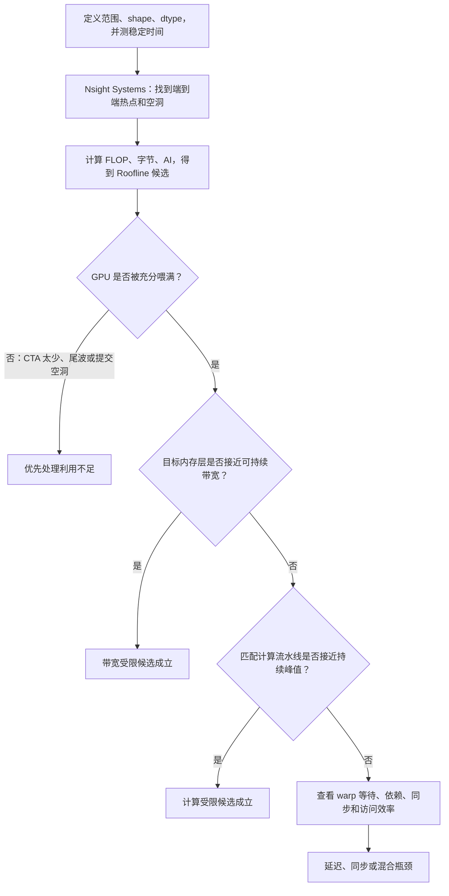

# GPU 性能模型笔记

GPU 性能分析的目标不是给 Kernel 贴一个“快”或“慢”的标签，而是回答三个更具体的问题：

- **时间花在哪里**：是 CPU 提交、数据搬运、某个 Kernel，还是多个阶段之间的同步空洞。
- **Kernel 被什么限制**：计算吞吐、某级存储带宽、数据依赖造成的延迟，还是 GPU 根本没有被充分喂满。
- **改动为什么会有效**：优化减少了多少字节、增加了多少复用、消除了什么等待，最终能否改善端到端时间。

性能模型提供的是**上界、候选瓶颈和判断语言**，不是替代测量的万能公式。一个实用流程是：先用模型估计“理论上最可能卡在哪里”，再用 profiler 的证据确认，最后只改一个因素并重新测量。

## 一组统一的性能语言

先固定分析范围。范围可以是一次端到端推理、一个 CUDA Graph、一个 Kernel，甚至是一个 Kernel 内的某个阶段；但下面的工作量、字节数和时间必须属于**同一个范围**。

| 符号 | 含义 | 常用单位 | 说明 |
| --- | --- | --- | --- |
| $F$ | 浮点工作量 | FLOP | 算法实际需要完成的浮点操作数。 |
| $Q$ | 数据流量 | B | 可以指算法逻辑字节、DRAM 字节或 L2 字节；使用前必须说明层级。 |
| $T$ | 执行时间 | s | Kernel 用 GPU event 计时；端到端用真实 wall time 或系统时间线。 |
| $P$ | 计算吞吐 | FLOP/s | $P = F / T$。常写为 GFLOP/s 或 TFLOP/s。 |
| $B$ | 访存吞吐 | B/s | $B = Q / T$。常写为 GB/s 或 TB/s。 |
| $AI$ | arithmetic intensity（算术强度） | FLOP/B | $AI = F / Q$，表示每搬运 1 字节完成多少浮点工作。 |

三者有一个很有用的恒等关系：

$$
P = AI × B
$$

它只是在同一口径下把定义相乘。例如用 DRAM 字节计算 $AI$，就必须用 DRAM 带宽计算 $B$；不能把“源码中估计的逻辑字节”和 L2 带宽混在一起。

### FLOP、FLOPs 与 FLOP/s

- **FLOP** 是一次浮点操作；工程里常把 FLOPs 当作复数使用，但它不是“每秒多少次”。
- **FLOP/s** 或 **FLOPS** 才是吞吐率。硬件资料通常使用十进制前缀：$1$ TFLOP/s = $10^{12}$ FLOP/s。
- 带宽单位也要统一：厂商规格中的 GB/s、TB/s 通常是十进制；若工具或程序使用 GiB/s、TiB/s，比较前要先换算。
- 一条 fused multiply-add（FMA）指令完成 $a × b + c$，按惯例计为 **2 FLOP**：一次乘法加一次加法。做 GEMM 吞吐计算时漏掉这个 2 是最常见错误之一。
- FLOP 数必须与目标指令路径匹配。FP32 CUDA Core、FP16 Tensor Core、TF32 Tensor Core、FP8 Tensor Core 的峰值不同，不能拿任意一个峰值做分母。

常见工作量的估算如下：

| 操作 | 每个输出元素的工作量 | 总 FLOP |
| --- | --- | --- |
| $c_i = a_i + b_i$ | 1 次加法 | $N$ |
| $y_i = αx_i + y_i$ | 1 次乘法 + 1 次加法 | $2N$ |
| $C = AB$，其中 $A$ 为 $M × K$、$B$ 为 $K × N$ | 每个 $C_{ij}$ 有 $K$ 次 FMA | $2MNK$ |
| ReLU | 通常不以 FLOP 描述 | 更常受读写、比较、访存和启动开销影响 |

Softmax、归一化、激活函数等操作的 FLOP 计数会随实现和近似方式变化。比较不同实现时，先定义一致的算法语义；不要为了得到一个漂亮的 TFLOP/s 数字而随意计数。

### 字节数有多个口径

以 FP32 SAXPY 为例：

$$
y_i = αx_i + y_i
$$

每个元素需要读 $x_i$ 4 B、读旧 $y_i$ 4 B、写新 $y_i$ 4 B。因此最朴素的**算法逻辑流量**是 $12N$ B，算术强度为：

$$
AI_{SAXPY} = 2 / 12 = 1 / 6 ≈ 0.167  FLOP/B
$$

真正的硬件流量不一定正好等于 $12N$ B。缓存命中、访问合并、sector 粒度、读改写行为、非对齐访问和重复读取都会改变各层看到的字节数。实践中应区分：

| 口径 | 如何得到 | 适合解决的问题 |
| --- | --- | --- |
| 算法逻辑流量 | 按源码中每个张量的读写次数手算 | 早期估算、比较算法是否减少了读写。 |
| 请求或事务流量 | 由 load/store 请求、sector 与合并方式决定 | 发现非对齐、未合并访问造成的额外传输。 |
| DRAM 流量 | Nsight Compute 的设备内存读写计数 | 判断 HBM 或 GDDR 带宽屋顶。 |
| L2 或 L1 流量 | 对应缓存层的事务或字节计数 | 判断数据是否被缓存复用，以及哪一层路径压力最大。 |
| 有效带宽 | 选定字节数除以执行时间 | 比较优化前后的真实数据搬运效率。 |

**不要只看“带宽利用率低”就断言访存不重要。** 低带宽可能表示数据大量命中缓存，也可能表示依赖链让 GPU 发不出足够多的内存请求；后者是延迟问题，不是“没有访存压力”。

## Roofline：把计算峰值和带宽峰值放到同一张图

Roofline 模型把 GPU 的两个上限合并为一个性能上界：

$$
P_{roof}(AI) = \min(P_{peak}, AI × B_{peak})
$$

等价地，从时间下界看：

$$
T \ge \max(F / P_{peak}, Q / B_{peak})
$$

其中：

- $P_{peak}$ 是**匹配数据类型与指令路径**的计算峰值或更可靠的实测持续峰值。
- $B_{peak}$ 是目标存储层的峰值或实测持续带宽。若分析 HBM 瓶颈，就使用 DRAM 带宽。
- $AI × B_{peak}$ 是由数据供给速度决定的性能上界。

两条边界相交的位置叫 ridge point（屋脊点）：

$$
AI_{ridge} = P_{peak} / B_{peak}
$$

- 当 $AI < AI_{ridge}$ 时，斜线带宽屋顶更低：这是**可能**的带宽受限区域。
- 当 $AI > AI_{ridge}$ 时，水平计算屋顶更低：这是**可能**的计算受限区域。
- 实际点到屋顶的距离是优化空间；实际点没有接近对应屋顶时，往往还存在延迟、并发度、访存效率、同步或指令开销等额外限制。

在常见 Roofline 图中，横轴是算术强度，纵轴是性能，二者通常都是对数坐标。斜线代表“每多 1 FLOP/B，带宽能够支撑的 FLOP/s 也随之增加”；达到水平线后，继续增大算术强度不会超过计算峰值。

### 一个假想 GPU 的手算

为了把单位算清楚，假设某个**目标计算路径**具有：

$$
P_{peak} = 60  TFLOP/s,  B_{peak} = 1.5  TB/s
$$

则：

$$
AI_{ridge} = 60 / 1.5 = 40  FLOP/B
$$

这不是某张具体显卡的规格，只是一组便于手算的参数。实际分析必须替换为目标 GPU、目标精度和稳定运行频率下的数值。


图中蓝色斜线和绿色平线共同组成 Roofline。图上的任何实测点都不应高于它；若出现“超过屋顶”的结果，通常是 FLOP、字节、时间或峰值的统计口径不一致。

### 逐项读懂 Roofline 图

1. **先看横轴**：横轴是 $AI = F / Q$。在这张图里，横轴每向右一个刻度，算术强度增加 $10$ 倍。向右通常意味着同一批 DRAM 字节服务了更多**有用计算**，例如 tile 复用、算子融合或减少中间张量；故意增加无用 FLOP 也会让 $AI$ 变大，但不会让程序更快。
2. **再看蓝色带宽线**：蓝线上的每个点都满足 $P = AI × B_{peak}$。在对数坐标上，它的斜率为 $1$：$AI$ 增加 $10$ 倍，带宽能支撑的性能也增加 $10$ 倍。若硬件 DRAM 带宽翻倍，整条蓝线向上平移，而不是向右移动。
3. **再看绿色计算线**：绿线表示 $P = P_{peak}$，与 $AI$ 无关，所以是水平的。它必须匹配当前路径：FP32 FMA、FP16/BF16/TF32/FP8 Tensor Core 都应选不同的绿线。
4. **最后看屋脊点**：屋脊左边，蓝线比绿线低；屋脊右边，绿线比蓝线低。它只划分“充分优化后先遇到哪个上界”，不直接证明当前 Kernel 已经被该资源限制。

点到对应屋顶的纵向距离表示没有利用到的理想空间。为了让这个距离可量化，可以计算：

$$
E_{roof} = P_{measured} / P_{roof}(AI)
$$

例如 $E_{roof} = 0.8$ 表示已达到该简化模型上界的 $80\%$；若只有 $0.05$，就说明还有约 $20$ 倍差距，但这个差距可能来自延迟、同步、低并行度、访问浪费或其他流水线，**不能把它全部归因于带宽或计算**。

#### 例子：SAXPY 是典型的低算术强度操作

对于 $N = 10^8$ 个 FP32 元素：

$$
F = 2N = 2 × 10^8  FLOP
$$

$$
Q = 12N = 1.2 × 10^9  B = 1.2  GB
$$

因此：

$$
AI = 1 / 6 ≈ 0.167  FLOP/B
$$

带宽屋顶为：

$$
P_{memory} = 0.167 × 1.5 = 0.25  TFLOP/s = 250  GFLOP/s
$$

对应的理想最低时间为：

$$
T_{min} = Q / B_{peak} = 1.2  GB / 1.5  TB/s = 0.8  ms
$$

它远低于 $40$ FLOP/B 的屋脊点，所以是带宽受限的强候选。若 NCU 还显示 DRAM 带宽接近此设备可持续带宽，结论就很可靠。此时把算术指令优化得更少通常收益有限；融合相邻算子以少读写一次全局内存往往更有效。

#### 例子：大 GEMM 更可能受计算路径限制

考虑 FP32 矩阵乘 $C = AB$，$M = N = K = 4096$，并假设 $C$ 不需要先从显存读回。理想情况下，$A$、$B$、$C$ 各经过 DRAM 一次：

$$
F = 2 × 4096^3 = 137.44  GFLOP
$$

$$
Q_{min} = 3 × 4096^2 × 4  B = 201.33  MB
$$

$$
AI_{min} ≈ 682.67  FLOP/B
$$

它显著高于 $40$ FLOP/B，因此这个形状在模型上属于计算受限候选，计算屋顶给出的最低时间约为：

$$
T_{min} = 137.44  GFLOP / 60  TFLOP/s ≈ 2.29  ms
$$

这里的 $Q_{min}$ 是乐观下界，不代表任何朴素 GEMM 都能只读一次矩阵。没有 shared memory、L2 或寄存器复用的实现会产生更多实际流量，也可能把本应计算受限的算法做成访存受限的 Kernel。

### 图上的点该怎么判断和优化


这张图的四个点使用前面的假想硬件参数。它表达的是**相对位置**，不是某个固定的百分比阈值：要与同一台 GPU、同一访问模式下的可持续吞吐基线比较。

| 图上的情况 | 可以得出的结论 | 必须补充的证据 | 优先动作 |
| --- | --- | --- | --- |
| A：在屋脊左侧，且紧贴蓝色斜线 | 很可能是 DRAM 带宽受限。 | DRAM 吞吐接近此设备、此访问模式的可持续带宽；计算管线未饱和。 | 减少 $Q$：融合、复用、合并访问、消除中间写回。 |
| B：在屋脊右侧，且紧贴绿色平线 | 很可能受匹配的计算路径限制。 | FP32 FMA 或 Tensor pipe 接近相同 dtype 的持续峰值；内存层未饱和。 | 减少计算、采用更快且正确的计算路径、优化 MMA tile 与 epilogue。 |
| C：在屋脊左侧，却远低于蓝线 | **不是**已经证实的带宽受限；带宽并没有被喂满。 | DRAM 吞吐低，Warp Stall 显示 memory dependency 或 scoreboard 等等待。 | 处理延迟：增加独立 load、软件流水、异步拷贝、减少依赖和 barrier。 |
| D：无论在什么横坐标都远低于屋顶 | GPU 供给不足或存在更基础的阻塞。 | NSYS 有 CPU launch gap、stream 串行，或 NCU 显示 CTA 太少、尾波、低 SM active。 | 批处理、融合、小任务改 grid-stride 或 persistent kernel，消除不必要同步。 |

这里最容易误判的是 C：它的 $AI$ 很低，确实位于屋脊左侧，但实际带宽也很低。若只依据“左侧”就优化全局内存字节，往往看不到收益；必须先让 GPU 能在等待期间发出更多请求。

### 优化会让点和线怎样变化

| 改动 | Roofline 图上的变化 | 典型实现 | 适用前提 |
| --- | --- | --- | --- |
| 减少 DRAM 字节 $Q$，且有用 FLOP $F$ 基本不变 | $AI = F / Q$ 增大，点倾向向右；对带宽型 Kernel，性能有机会沿蓝线向上。 | 融合、tile 复用、避免中间张量。 | 点已接近或确实受带宽线限制。 |
| 改善合并访问、缓存命中或 memory-level parallelism | 理想屋顶不变，但实际点向上靠近蓝线。 | 连续布局、向量化 load、预取、更多独立请求。 | 原先的实际带宽低于可持续基线。 |
| 换用匹配的更快计算路径 | 对应绿色计算屋顶上移，实际点也可能向上。 | FP16/BF16/TF32 Tensor Core、减少转换与非核心指令。 | 数值精度允许，并且确实执行该路径。 |
| 减少无用计算 | 点可能向左，因为 $F$ 降低；总时间仍会下降。 | 更低复杂度算法、消除重复计算。 | **不要把“向右”误当作唯一目标。** |
| 增加 CTA、独立指令或消除同步 | 两条理论屋顶都不动，实际点从下方向上靠近屋顶。 | 批处理、增大并行工作、软件流水、减少 barrier。 | 延迟受限或利用不足。 |

因此，Roofline 的价值不在于替你下最终结论，而在于排除明显无效的方向。若已贴近 DRAM 斜线，不减少字节或提高有效算术强度就难以改善总时间；若已贴近计算平线，不减少计算或改变计算路径就难以继续提升。若点离两条线都很远，先检查延迟隐藏、指令依赖、访问合并、occupancy、block 数量和同步。

真实 GPU 不止一条屋顶。可以分别画 FP32、FP16、TF32、FP8 Tensor Core 的计算屋顶，也可以画 L1、L2、DRAM 的层级带宽屋顶。NCU 的 hierarchical roofline 正是在表达这一点：某一层缓存或设备内存的屋顶都可能成为限制。

## 四类常见 bottleneck 如何判断

“bound”描述的是当前版本最接近、最有可能限制性能的资源，不是 Kernel 的永久属性。同一个算法在不同 shape、dtype、GPU、编译选项下可以从带宽受限变成计算受限。

下面的判断应按“模型候选 + profiler 证据”两步完成。

| 类型 | 模型上的候选信号 | NCU 或时间线中的常见证据 | 常见优化方向 |
| --- | --- | --- | --- |
| Bandwidth-bound（带宽受限） | $AI$ 低于对应层的屋脊点。 | DRAM 或目标缓存层吞吐接近该设备的可持续上限，实际点贴近带宽屋顶。 | 减少读写、算子融合、提高数据复用、合并访问、避免多余中间张量。 |
| Compute-bound（计算受限） | $AI$ 高于屋脊点。 | 匹配的 CUDA Core 或 Tensor Core 流水线接近持续峰值；内存层未饱和。 | 减少计算、选择更快精度或指令路径、提高 ILP、改进 MMA tile 与流水线。 |
| Latency-bound（延迟受限） | 屋顶模型预测可达较高带宽或计算吞吐，但实际远低于两者。 | 带宽和计算管线都不高，warp 因 memory dependency、scoreboard、barrier 等等待而停顿。 | 增加独立并发访存、软件流水、异步拷贝、提高可驻留 warp，或改变数据结构。 |
| Under-utilization（利用不足） | 工作量太小，或并行划分无法覆盖全部 SM。 | 活跃 SM 少、grid 中 CTA 数不足、尾波明显、launch gap 大、issue slot 长期空闲。 | 批处理、融合、小任务 grid-stride loop、调整 block 与资源占用、减少 CPU 同步。 |

### 判定顺序比单个指标更重要

可以按下面的顺序缩小范围：



这张图的重点是：**低 AI 不是“已经证实带宽受限”，高 AI 也不是“已经证实计算受限”。** Roofline 给出候选；实际吞吐与等待原因才是证据。

### 带宽受限：先问“哪一级带宽”

对于 DRAM 受限的 Kernel，常见特征是 DRAM read/write 吞吐持续较高，且有效带宽接近同一设备上 copy 或相似访问模式的实测上限。优化通常围绕减少到 DRAM 的流量：

- 融合 producer 和 consumer，避免把中间结果写回显存后立刻读回。
- 用 tile、shared memory、L2 局部性和寄存器复用，让同一字节服务更多计算。
- 修复不连续、未合并或严重浪费 sector 的访问。逻辑字节不变时，实际传输字节仍可能下降。
- 在精度和数值要求允许时降低元素字节数。

若 L2 吞吐很高但 DRAM 吞吐不高，压力可能停留在 L2 或其内部通路；这时“减少 HBM 字节”未必是最直接的方向。

### 计算受限：必须匹配计算路径

计算受限不是只看一个总的 Compute Throughput 百分比。应确认当前使用的是哪条路径：

- FP32 FMA、FP64、整数 ALU、特殊函数单元和 Tensor Core 的峰值彼此不同。
- 同一个 Kernel 可以不受 FLOP 数限制，却受地址计算、转换、shuffle、分支或 shared memory 指令限制。
- Tensor Core 路径的利用率高，才说明矩阵乘加本身接近 Tensor Core 能力；若 load、layout transform 或 epilogue 占主导，整体仍可能离 Tensor Core 屋顶很远。

因此，结论应写成“受 FP32 FMA 路径限制”或“受 FP16 Tensor Core 路径限制”，而不是模糊的“算力不够”。

### 延迟受限：吞吐低不等于没有压力

带宽模型隐含一个前提：GPU 能同时发出足够多请求，以隐藏单次访问的延迟。数据依赖会破坏这个前提。例如指针追逐：

```cpp
__global__ void pointer_chase(const int* next, int* output) {
    int tid = blockIdx.x * blockDim.x + threadIdx.x;
    int p = tid;

    // 下一次加载依赖上一次加载的结果，单个线程无法提前发出后续请求。
    for (int step = 0; step < 64; ++step) {
        p = next[p];
    }

    output[tid] = p;
}
```

这个 Kernel 可能同时呈现低算术强度、低 DRAM 吞吐和低计算吞吐。关键不是“显存没有被用满”，而是每个 warp 能并发在途的独立请求太少。NCU 的 Warp Stall / Scheduler 相关页面通常能看到 memory dependency 或 scoreboard 类等待；不同 GPU 架构和 NCU 版本的具体 metric 名称会不同。

常见解决办法不是盲目提高 occupancy，而是让更多独立工作在等待期间运行：

- 重排循环，先发起多个互不依赖的 load，再消费结果。
- 通过 tile 和软件流水，让第 $k + 1$ 块数据的加载与第 $k$ 块的计算重叠。
- 使用异步拷贝或 TMA 等硬件路径时，配合正确的 barrier 和多级 pipeline。
- 降低过高的寄存器或 shared memory 占用，前提是额外的活跃 warp 确实能隐藏延迟，而不是引入 spill。

### 利用不足：先保证 GPU 有活可做

如果一个向量操作只有 $N = 10,000$ 个元素，block size 为 $256$，则 grid 只有：

$$
\lceil 10,000 / 256 \rceil = 40  CTA
$$

在有 $80$ 个 SM 的 GPU 上，即使每个 SM 只要求驻留一个 CTA，也最多只有一半 SM 获得工作。此时讨论每个 CTA 的细微指令优化意义不大；总时间很可能受 launch、调度和设备空闲限制。

这类问题优先查看 Nsight Systems：

- CPU 是否在连续提交大量很小的 Kernel。
- CUDA API 调用之间是否有空隙或同步。
- 小 Kernel 是否可以与相邻逐元素操作融合。
- H2D、D2H、计算是否本可在不同 stream 中重叠。

**occupancy（占用率）不是目标函数。** 它表示理论上可同时驻留的 warp 比例，主要价值是帮助判断能否隐藏延迟；高 occupancy 也可能因寄存器压力、访存冲突或低 ILP 而很慢，低 occupancy 的高算术强度 GEMM 也可能很快。

## Amdahl 定律与 Gustafson 定律：Kernel 加速如何传到端到端

Roofline 讨论一个 Kernel 的硬件上界；Amdahl 和 Gustafson 则讨论并行化或局部优化对**整个程序**的影响。

### Amdahl's Law：固定问题规模下的收益上限

若一个程序中可被优化的部分占总时间比例 $f$，这一部分获得 $s$ 倍加速，则整体加速比为：

$$
S_{overall} = 1 / ((1 - f) + f / s)
$$

例如，某个 GEMM 占端到端时间的 $60\%$，即使把它加速 $2$ 倍：

$$
S_{overall} = 1 / (0.4 + 0.6 / 2) ≈ 1.43
$$

端到端只会加速约 $1.43$ 倍，而不是 $2$ 倍。这个公式解释了一个常见现象：Kernel benchmark 提升很多，服务吞吐却几乎不动。被省下来的时间会暴露数据准备、CPU 调度、通信、其他 Kernel 或同步的新瓶颈。

若把并行处理器数量记为 $p$，串行比例记为 $α$，Amdahl 形式为：

$$
S_A(p) = 1 / (α + (1 - α) / p)
$$

它对应**固定工作量**，也就是 strong scaling（强扩展）视角。

### Gustafson's Law：固定时间预算下扩大问题规模

Gustafson 定律关注另一种问题：保持总运行时间近似不变，但随着处理器增加而扩大并行工作量。若 $α$ 是并行运行时间中的串行比例：

$$
S_G(p) = p - α(p - 1)
$$

例如 $p = 64$、$α = 0.05$：

$$
S_G(64) = 64 - 0.05 × 63 = 60.85
$$

这说明小比例串行部分不会阻止我们用更多资源处理更大的 batch、更长序列或更高分辨率的问题。它对应 weak scaling（弱扩展）思路，但不表示串行工作消失：通信、全局同步、负载不均和数据搬运仍会在更大规模下出现。

对 GPU 程序而言，可以把两条定律当作两个问题的检查器：

- 想降低现有请求的 latency：优先用 Amdahl 评估哪个阶段值得优化。
- 想在相近时延下扩大 batch 或问题规模：用 Gustafson 思考新增并行工作是否足够多，以及通信是否会重新成为瓶颈。

## wave quantization 与 tail wave

这里的 wave 是“一个 grid 需要分几批 CTA 才能在全 GPU 上跑完”的调度概念，不是 AMD 的 64 线程 wavefront，也不是 NCU 缓存报告中的 wavefront 访问单位。

设：

- $S$：GPU 的 SM 数量。
- $B_{res}$：这个 Kernel 在每个 SM 上实际可同时驻留的 CTA 数。
- $G$：grid 的总 CTA 数。

一整批能同时容纳的 CTA 数近似为：

$$
C_{wave} = S × B_{res}
$$

在每个 CTA 运行时间近似相等时，所需 wave 数为：

$$
W = \lceil G / C_{wave} \rceil
$$

最后一个 wave 以外的 CTA 容量无法被提前借给前一 wave，于是总执行时间会被离散的 $W$ 量化。这就是 **wave quantization（波量化）**。对应的理想化 wave 效率可写成：

$$
η_{wave} ≈ G / (W × C_{wave})
$$

### 手算一个尾波

假设 GPU 有 $80$ 个 SM，某个 Kernel 受线程数、寄存器和 shared memory 限制后，每个 SM 可同时驻留 $2$ 个 CTA：

$$
C_{wave} = 80 × 2 = 160  CTA
$$

若 grid 有 $400$ 个 CTA：

$$
W = \lceil 400 / 160 \rceil = 3
$$

前两个 wave 各有 $160$ 个 CTA，最后一个 wave 只有 $80$ 个 CTA。最后阶段最多只使用一半的 CTA 容量：

$$
η_{wave} ≈ 400 / (3 × 160) = 83.3\%
$$

这个不完整的最后批次叫 **tail wave（尾波）**。若 CTA 运行时间不均匀，即使总 CTA 数恰好是完整 wave，先完成的 CTA 也会让最后阶段逐渐稀疏，形成更一般的 tail effect（尾部效应）。

$B_{res}$ 受到最大 CTA 数、每个 CTA 的线程数、寄存器、shared memory 和架构分配粒度共同限制。可以把下面的式子看作直觉估算，而不是精确计算器：

$$
B_{res} \le \min(B_{hw}, \lfloor T_{SM} / T_{CTA} \rfloor, \lfloor W_{SM} / W_{CTA} \rfloor, \lfloor R_{SM} / R_{CTA} \rfloor, \lfloor M_{SMEM} / M_{CTA} \rfloor)
$$

实际数值优先看 NCU 的 Launch Statistics、Occupancy 和 Workload Distribution。试图只靠手算寄存器得出精确 wave 数，常会忽略寄存器分配粒度、warp 分配粒度和架构限制。

处理 wave 问题的方向包括：

- 对很小任务，批处理或融合，让总 CTA 数足以覆盖 SM。
- 改变 block size、每个 CTA 的 tile 或每 CTA 处理的工作量，使 grid 规模和每 SM 驻留数落在更好的组合。
- 对大量小而相似的独立任务，考虑 persistent kernel 或 grid-stride loop，让已驻留的 CTA 持续领取后续工作。
- 不要为消除一个很短的尾波而牺牲主阶段性能。改变资源占用可能降低 $B_{res}$，反而让总 wave 数变多。

## Tensor Core 吞吐应该怎么看

Tensor Core 是专门执行矩阵乘加的硬件路径。看到代码使用 FP16、BF16 或 FP8 并不等于一定跑在 Tensor Core 上；是否命中取决于库/编译器选择、数据布局、矩阵形状、对齐、目标架构和实际指令。

### GEMM 的吞吐计算

对于 $C = AB$：

$$
F_{GEMM} = 2MNK
$$

同理，一次按 $m × n × k$ 描述的 MMA 数学语义对应 $2mnk$ FLOP。例如 `m16n8k16` 对应 $2 × 16 × 8 × 16 = 4096$ FLOP。这个数是矩阵乘加的数学工作量，不等于固定数量的机器指令；不同架构可能把同一种 PTX 语义映射为不同的硬件指令序列。

如果实测 Kernel 时间为 $T$，则：

$$
P_{achieved} = 2MNK / T
$$

例如 FP16 输入的 $4096 × 4096 × 4096$ GEMM 在 $1.8$ ms 完成：

$$
P_{achieved} = 137.44  GFLOP / 1.8  ms ≈ 76.35  TFLOP/s
$$

若该 GPU 在**同一输入类型、相同 dense 或 sparse 模式、相同 Tensor Core 路径和相近时钟**下的持续峰值为 $100$ TFLOP/s，则可报告：

$$
Efficiency_{TC} = 76.35 / 100 = 76.35\%
$$

分母必须严格匹配。不能用 FP8 peak 衡量 BF16 Kernel，也不能把标称 boost peak 当作每次实验都能达到的持续峰值。对于 Tensor Core，最好同时记录 GPU 型号、CUDA/库版本、dtype、accumulation 类型、矩阵 shape、时钟/功耗状态和测试方法。

### Tensor Core 诊断清单

1. **确认路径**：查看编译后的指令或 NCU 的 Tensor Core / Tensor pipe 指标，确认确实存在 MMA、WMMA、HMMA 或 WGMMA 等矩阵指令。
2. **确认吞吐口径**：用 $2MNK / T$ 计算实际 TFLOP/s，再除以匹配模式的 Tensor Core 峰值。
3. **确认形状与尾部**：$M$、$N$、$K$ 的尾部 tile、对齐和 padding 会影响指令利用率；小矩阵还会受到 CTA 数不足和 launch 开销影响。
4. **确认数据供给**：Tensor pipe 空闲可能是 global memory、shared memory、寄存器布局转换、barrier 或 pipeline 深度限制，而不是 Tensor Core 本身太慢。
5. **确认 epilogue**：bias、activation、量化、写回和类型转换的时间应纳入总 Kernel 时间。只测 MMA 主循环会高估端到端吞吐。

对于 Tensor Core GEMM，DRAM Roofline 仍然有效，但通常还需要观察 shared memory、寄存器到 Tensor Core 的数据供给和软件流水。一个高 AI 的 GEMM 可以在 DRAM 层看似计算受限，却在 shared memory bank conflict、寄存器压力或 MMA tile 编排上损失大量性能。

## Nsight Systems 与 Nsight Compute：分别回答什么

两个工具不是替代关系。一个实用原则是：**先用 Nsight Systems 找“哪里慢”，再用 Nsight Compute 找“为什么这个 Kernel 慢”。**

| 工具 | 分析尺度 | 首先看什么 | 典型问题 |
| --- | --- | --- | --- |
| Nsight Systems（NSYS） | 整个进程、CPU 线程、CUDA API、stream 与 GPU 时间线 | 热点 Kernel、CPU 到 GPU 的提交空洞、H2D/D2H、stream 重叠、同步、NVTX 区间 | 为什么 GPU 空闲？为什么没有重叠？哪个阶段真正占端到端时间？ |
| Nsight Compute（NCU） | 单个 Kernel 的硬件计数器与源码关联 | Duration、Roofline、Speed Of Light、Memory Workload、Occupancy、Scheduler、Warp Stall | 是哪条计算或内存路径限制了这个 Kernel？访问是否合并？为什么 warp 在等待？ |

### NSYS：先建立时间线

NSYS 的核心产物是时间线。对一个训练或推理步骤，建议按下面顺序看：

- **总时长和热点**：哪个 NVTX 区间、哪个 Kernel 或哪类 memcpy 占时间最多。
- **CPU 提交路径**：CUDA API 调用是否很长，CPU 是否在 launch 之间等待，是否存在频繁同步。
- **GPU stream**：Kernel 与 memcpy 是否真的重叠；不同 stream 的依赖是否意外串行。
- **数据搬运**：H2D/D2H、Unified Memory migration 或 page fault 是否抢占了关键路径。
- **小 Kernel 风暴**：很多微小 Kernel 是否让 launch 开销和调度空洞主导；融合或 CUDA Graph 是否有机会。

一个常用的起点命令如下，实际 trace 类别要按程序和平台裁剪：

```shell
nsys profile --trace=cuda,nvtx,osrt --output=nsys_report ./your_app
```

给高层阶段加 NVTX range 会大幅提高时间线的可读性。NSYS trace 本身有开销，因此先捕获一个代表性短区间，而不是让完整训练跑数小时。

### NCU：对热点 Kernel 做微观取证

从 NSYS 选出一个稳定、占比高的 Kernel 后，再用 NCU 分析。通常优先看：

| NCU 区域 | 应回答的问题 |
| --- | --- |
| Launch Statistics / Occupancy | block、warp、寄存器、shared memory 如何限制驻留 CTA？是否有明显的 waves per SM 或尾波问题？ |
| GPU Speed Of Light / Roofline | 实际点接近哪条计算或内存屋顶？计算与内存吞吐是否有一方接近持续上限？ |
| Memory Workload Analysis | 流量停在 L1、L2 还是 DRAM？load/store 是否合并？缓存命中、sector 和事务是否异常？ |
| Compute Workload Analysis | 是 Tensor、FMA、ALU、地址计算还是其他执行管线繁忙？issue slot 是否被有效利用？ |
| Scheduler Statistics / Warp State / Warp Stall | warp 在等待什么：内存依赖、barrier、执行依赖、分支、流水线资源，还是可运行 warp 太少？ |
| Source / SASS 关联 | 哪一段源码或哪类指令对应异常的 load、store、MMA、branch 或 stall？ |

观察百分比时，要区分 **% of peak sustained elapsed** 和 **% of peak sustained active**：前者把整个 Kernel 的 elapsed cycles 纳入分母，适合判断总体效率；后者只看单元活跃时的效率，可能掩盖尾波、SM 空闲或供给不足。Warp Stall 也应视为采样线索，不要把多个 stall 百分比机械相加。

常用起点：

```shell
# 先筛选到热点 Kernel 或代表性的 launch，再收集完整报告。
ncu --set full --kernel-name-base demangled -o ncu_report ./your_app
```

完整计数器往往需要多次 replay，可能改变运行时间，也可能不适合带随机性、I/O 或长时间服务的程序。先测基准、预热、固定 shape 和输入，再缩小到少量目标 Kernel。不同架构和 NCU 版本的 metric 名称会变化；需要脚本化时，以本机的 `ncu --query-metrics` 为准，而不是复制其他 GPU 的 counter 名称。

同目录的 [NCU Introduction](/blog/gpu-programming/ncu-introduction) 可以作为具体指标的中文速查；这里更关注从模型到证据的判定路径。

## 一个可复用的 Roofline 手算脚本

下面的脚本复现前面的两个例子。它只计算理想屋顶和时间下界，**不能替代 benchmark**；实际流量、时钟、缓存命中、并发度和指令开销都可能让实测更慢。

```python
P_PEAK_TFLOPS = 60.0
B_PEAK_TBPS = 1.5


def roofline(name: str, flops: float, bytes_moved: float) -> None:
    ai = flops / bytes_moved

    # FLOP/B × TB/s 的单位恰好是 TFLOP/s。
    memory_roof_tflops = ai * B_PEAK_TBPS
    roof_tflops = min(P_PEAK_TFLOPS, memory_roof_tflops)
    lower_bound_ms = flops / (roof_tflops * 1e12) * 1e3

    print(name)
    print(f"  AI: {ai:.3f} FLOP/B")
    print(f"  memory roof: {memory_roof_tflops:.3f} TFLOP/s")
    print(f"  final roof: {roof_tflops:.3f} TFLOP/s")
    print(f"  ideal lower bound: {lower_bound_ms:.3f} ms")


# FP32 SAXPY: x 读一次、y 读一次、y 写一次。
num_elements = 100_000_000
roofline("SAXPY", flops=2 * num_elements, bytes_moved=12 * num_elements)

# FP32 GEMM C = AB：乐观地假设 A、B、C 都只经过 DRAM 一次。
m = n = k = 4096
gemm_flops = 2 * m * n * k
gemm_min_bytes = (m * k + k * n + m * n) * 4
roofline("GEMM", flops=gemm_flops, bytes_moved=gemm_min_bytes)
```

预期会得到近似如下的结论：

- SAXPY：$AI ≈ 0.167$ FLOP/B，带宽屋顶为 $0.25$ TFLOP/s，理想下界为 $0.8$ ms。
- GEMM：$AI ≈ 682.67$ FLOP/B，受 $60$ TFLOP/s 计算屋顶限制，理想下界约为 $2.29$ ms。

如果拿到了实测时间 $T_{measured}$，还可以补充两个有解释力的数字：

$$
P_{measured} = F / T_{measured}
$$

$$
B_{effective} = Q / T_{measured}
$$

然后与相同口径的实测持续峰值比较，而不是只与宣传页上的理论峰值比较。

## 常见误区

- **把算术强度当成最终诊断**：$AI < AI_{ridge}$ 只是带宽受限候选。若 DRAM 吞吐很低，要继续检查延迟、CTA 数量和访问效率。
- **把低带宽当成“内存没问题”**：依赖链、随机访问或很少的 active warp 都会让带宽上不去，但访存延迟仍是主要问题。
- **把高 occupancy 当成高性能**：occupancy 只说明可驻留 warp 的上限；它不保证指令独立性、访存合并或计算流水线利用率。
- **用错误的 Tensor Core 峰值做分母**：dtype、dense/sparse 模式、输入与累加类型、实际时钟都必须匹配。
- **只数 load，不数 store**：带宽模型需要包括输出写回和所有中间张量；融合的价值经常就来自消除这些写回。
- **忽略 shape 分布**：一个 Kernel 在大矩阵上是计算受限，在小 batch、短序列或边界 tile 上可能完全不同。
- **只优化单 Kernel**：Amdahl 定律提醒我们，端到端占比低的 Kernel 即使翻倍也难以显著改善服务 latency。
- **把 profiler 的单个百分比当结论**：吞吐、stall、occupancy 都是线索，需要和代码结构、时间线、Roofline 及优化前后对比一起解释。

## 实战检查清单

1. 固定 GPU、驱动、时钟策略、dtype、shape、输入和预热流程，先拿到稳定基准。
2. 用 NSYS 确认真正的端到端热点，不要只挑看起来复杂的 Kernel。
3. 对热点定义 $F$、$Q$、$T$，注明 $Q$ 是算法字节、DRAM 字节还是缓存层字节。
4. 计算 $AI$ 与匹配指令路径的 Roofline，得到带宽或计算的候选上界。
5. 用 NCU 验证：目标内存层是否接近持续带宽、计算管线是否接近持续峰值、warp 是否因等待或资源限制而空转。
6. 检查 grid 覆盖、waves per SM、tail wave、small-kernel launch gap 和 stream 重叠，先排除利用不足。
7. 每次只改一个关键因素，例如减少一次 DRAM 往返、改变 tile、增加 pipeline stage 或合并两个 Kernel。
8. 同时复测 Kernel 时间与端到端时间，并用 Amdahl 定律判断收益是否真的传递到了用户关心的指标。

## 参考资料

- [NVIDIA Nsight Compute 文档](https://docs.nvidia.com/nsight-compute/NsightCompute/index.html)：Roofline、Memory Workload、Occupancy 与 Kernel 级性能分析。
- [NVIDIA Nsight Systems 用户指南](https://docs.nvidia.com/nsight-systems/UserGuide/)：CUDA API、GPU workload、stream 与系统时间线分析。
- [CUDA C++ Best Practices Guide](https://docs.nvidia.com/cuda/cuda-c-best-practices-guide/index.html)：CUDA 访存、并行性和指令优化的基础实践。
