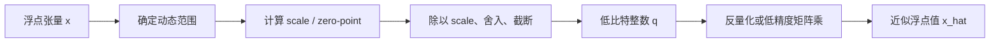

# 大模型量化基础笔记

大模型量化（quantization）是把原本以 `FP32`、`FP16` 或 `BF16` 表示的张量，映射到 bit 数更少的格式，例如 `INT8`、`UINT8`、`INT4`。目标不是让模型“变成整数模型”，而是在可接受的精度损失下，减少**显存占用、内存带宽和推理成本**。

本文只建立理论框架：如何把一个实数张量映射到整数、映射时到底丢失了什么，以及怎样控制这份误差。各个浮点和整数类型的位布局、数值范围和 GPU 类型，可先参考 [[precision-type-in-gpu]]。

## 为什么大模型需要量化

推理时，尤其在生成式模型的 decode 阶段，GPU 往往不是先被算力限制，而是先被**显存容量和显存带宽**限制。

- **权重很大**：一个 `7B` 参数模型仅权重就约为 `14 GB`（`FP16/BF16`）；若压到 `INT4`，理论存储量约为 `3.5 GB`，另加 scale、zero-point 等元数据。
- **每生成一个 token 都要再次读权重**：batch 较小的 decode 阶段，矩阵乘法的算术强度低，反复从 HBM 读取权重常是主要瓶颈。权重变小，通常意味着可读入更多权重、吞吐更高。
- **同一张卡可容纳更大的模型或更大的 batch / KV cache**：量化释放的显存不只用于“装下模型”，也能换取并发请求数和更长上下文。
- **低精度计算单元可能更快**：硬件对 `INT8`、`INT4`、`FP8` 等格式常有更高吞吐。但端到端速度还取决于 kernel 是否支持、反量化开销和内存访问布局；存储变小不自动等于推理变快。

量化通常用于推理，也可以用于训练。本文默认讨论最常见的情形：已有一个浮点模型，在部署前或部署时把其中部分张量低比特化。

## 量化到底在做什么

量化把连续（或足够稠密）的实数取值，投影到有限个离散整数格点。设浮点值为 $x$，量化后的整数为 $q$，则最常见的仿射量化（affine quantization）是：

$$
q = \operatorname{clip}\left(\operatorname{round}\left(\frac{x}{s}\right) + z, q_{\min}, q_{\max}\right)
$$

$$
\hat{x} = s(q-z)
$$

其中：

- $s > 0$ 是 **scale（缩放因子）**，决定相邻两个可表示实数之间的间隔。
- $z$ 是 **zero-point（零点）**，表示“量化前的实数 $0$ 在量化后对应哪个整数编码”；它通常是整数。它不是另一个浮点数，而是加到量化结果上的整数偏移量。
- $q_{\min}, q_{\max}$ 是目标整数格式的边界。例如 `INT8` 是 $[-128, 127]$，`UINT8` 是 $[0, 255]$，有符号 `INT4` 是 $[-8, 7]$。
- `round` 把值放到最近格点，`clip`（也常写作 `clamp`）把超出范围的值截到边界。
- $\hat{x}$ 是反量化得到的近似值，而不是原始 $x$。

可以把量化想成一把带有限刻度的尺子：$s$ 决定刻度间距，$z$ 决定刻度中哪个位置是零，$[q_{\min}, q_{\max}]$ 决定尺子有多少格。尺子覆盖不到的值会饱和，落在两格之间的值会被舍入。

例如使用非对称 `UINT8` 量化，假设浮点范围为 $[-1,3]$：

$$
s=\frac{3-(-1)}{255}=\frac{4}{255}, \qquad
z\approx\operatorname{round}\left(0-\frac{-1}{s}\right)=64
$$

此时，量化前的 $x=0$ 会编码为整数 $q=64$：

$$
q=\operatorname{round}(0/s)+64=64
$$

反量化时再减去这个偏移量：$\hat{x}=s(64-64)=0$。因此，$z=64$ 的含义就是“整数编码 64 代表实数 0”。对称量化把实数零放在整数零上，所以通常有 $z=0$。

实际部署中，`q` 可以直接参加整数矩阵乘，或者在 kernel 内按 block 反量化后进行浮点乘加；不一定会先把整个张量恢复成 `FP16`。

## 第一步：确定动态范围

量化前要先决定实数张量中哪些值由目标整数区间覆盖，记为 $[r_{\min}, r_{\max}]$。这就是**动态范围**。

最直接的做法是读取张量最小值和最大值：

$$
r_{\min} = \min_i x_i, \qquad r_{\max} = \max_i x_i
$$

但它不是唯一选择。若少数异常值特别大，完整范围会让 $s$ 变大，导致大多数普通值共享过于粗的刻度；若故意缩小范围，又会让范围外的值 clip。因此，动态范围选择本质上是在两种误差之间折中：

- **舍入误差**：在范围内，单个值通常有不超过约 $s/2$ 的绝对误差。
- **截断误差**：在范围外，值被固定为边界，误差可能远大于 $s/2$。

动态范围也决定 scale 的粒度。常见粒度如下：

| 粒度 | 每个 scale 覆盖的范围 | 优点 | 代价 |
| --- | --- | --- | --- |
| per-tensor | 整个张量 | 元数据最少，实现简单 | 一个异常值会影响整个张量 |
| per-channel | 一个输出通道或输入通道 | 适合线性层权重，精度通常更好 | 需要保存一组 scale，kernel 要处理通道对应关系 |
| per-group / block | 连续的一小组元素，例如 32/64/128 个权重 | 极低比特权重量化常用，能局部适应范围 | scale 元数据和读取/反量化开销更多 |
| per-token | 一个 token 的激活向量 | 能适应不同 token 的激活幅度 | 推理时要动态计算 scale |

**粒度越细，范围越贴合局部数据，通常误差越小；但 scale 的存储、访存和计算开销越高。**

## 第二步：计算 scale 和 zero-point

### 一般的仿射映射

如果希望 $r_{\min}$ 对应 $q_{\min}$、$r_{\max}$ 对应 $q_{\max}$，可取：

$$
s = \frac{r_{\max}-r_{\min}}{q_{\max}-q_{\min}}
$$

$$
z = \operatorname{clip}\left(
\operatorname{round}\left(q_{\min} - \frac{r_{\min}}{s}\right),
q_{\min}, q_{\max}
\right)
$$

理想的 $z$ 未必是整数，但存储的整数张量需要整数 zero-point，所以要舍入。这会使两端点不一定都严格对齐，通常是可接受的。

当张量所有元素相等、$r_{\max}=r_{\min}$ 时，上式的分母为零。工程上通常设定一个约定，例如令 $s=1$、$z=0$，或直接把所有值编码为同一个整数；关键是避免除零，并让反量化结果稳定。

### scale 的直觉

scale 是“每增加一个整数码值，实数增加多少”。例如 $s=0.1$、$z=0$ 时：

$$
-1.2 \rightarrow -12, \qquad 0.37 \rightarrow 4, \qquad \hat{x}=4\times0.1=0.4
$$

这里 $0.37$ 被近似成 $0.4$，误差是 $0.03$。更小的 $s$ 会提供更细的格点，但在固定 bit 数下也意味着能覆盖的实数范围更窄。

## 对称量化与非对称量化

### 对称量化

**对称量化（symmetric quantization）** 以零为中心，通常令 $z=0$，并用绝对值最大值定义范围：

$$
a = \max(|r_{\min}|, |r_{\max}|)
$$

对一个对称的有符号整数区间 $[-Q, Q]$，有：

$$
s = \frac{a}{Q}, \qquad q = \operatorname{clip}\left(\operatorname{round}\left(\frac{x}{s}\right), -Q, Q\right)
$$

以 `INT8` 为例，常用 $Q=127$，即使用 $[-127,127]$，并让 `-128` 空着。这样正负两侧拥有相同的范围，公式也更直接。`INT4` 的对称实现同理，常以 $[-7,7]$ 为有效范围而不使用 `-8`。

| 优点 | 限制 | 常见用途 |
| --- | --- | --- |
| zero-point 为 0；反量化和 GEMM 实现简单；利于 SIMD / Tensor Core kernel | 如果数据明显偏正或偏负，会浪费一侧码值 | 权重、近似零均值的激活、低比特 group-wise 权重量化 |

对称量化并不表示数据本身对称，而是表示我们选择用对称的尺子来覆盖数据。若权重范围是 $[-0.2,1.0]$，仍会按 $[-1.0,1.0]$ 布置格点，其中负半边利用率较低。

### 非对称量化

**非对称量化（asymmetric quantization）** 允许 $z\ne0$，把整数区间平移到更贴合数据的地方。它通常使用全范围，例如 `UINT8` 的 $[0,255]$：

$$
s = \frac{r_{\max}-r_{\min}}{255}, \qquad
z = \operatorname{round}\left(-\frac{r_{\min}}{s}\right)
$$

随后使用：

$$
q = \operatorname{clip}\left(\operatorname{round}\left(\frac{x}{s}\right) + z, 0, 255\right)
$$

若某层激活经过 ReLU，范围大致为 $[0,r_{\max}]$，取 `UINT8`、$z=0$ 就能把全部 256 个码值放在非负区域；相比对称 `INT8`，不会把约一半码值留给不会出现的负数。

| 优点 | 限制 | 常见用途 |
| --- | --- | --- |
| 能贴合非零中心和单侧分布，充分使用有限码值 | 要保存/处理 zero-point；整数矩阵乘需处理交叉项，kernel 更复杂 | 非负激活、范围明显偏移的激活量化 |

对于整数矩阵乘，若 $q_w,z_w$ 和 $q_x,z_x$ 分别是权重和激活的量化值与 zero-point，核心项是：

$$
\sum_i(q_{w,i}-z_w)(q_{x,i}-z_x)
$$

展开后会多出与 $z_w,z_x$ 有关的求和项。因此，在高性能推理里权重常优先选对称量化；是否为激活保留非对称量化，则取决于分布和硬件/kernel 支持。

## INT / UINT 是怎样编码的

数学公式中的 $q$ 是整数值，落盘或存入显存时才用对应的 bit 编码。

- **有符号整数 `INTb`**：通常使用二进制补码，`INT8` 代表 $[-128,127]$，`INT4` 代表 $[-8,7]$。对称量化最常与它配合。
- **无符号整数 `UINTb`**：代表 $[0,2^b-1]$，如 `UINT8` 的 $[0,255]$。非对称量化常用它，因为 zero-point 可把实数零放在区间内部。
- **INT4 等低位整数常被 packed**：两个 4 bit 数可放入一个字节，多个值也可装进 `uint32_t`。这只改变存储布局，不改变上面的量化公式；读取时 kernel 负责解包。

下面是一个 `INT8` 对称量化的完整小例子。设：

$$
x=[-1.0,-0.3,0.2,0.9], \qquad Q=127
$$

则 $a=1.0$、$s=1/127\approx0.007874$、$z=0$。量化和反量化的近似结果是：

| $x$ | $q=\operatorname{round}(x/s)$ | $\hat{x}=s q$ |
| ---: | ---: | ---: |
| -1.0 | -127 | -1.0000 |
| -0.3 | -38 | -0.2992 |
| 0.2 | 25 | 0.1969 |
| 0.9 | 114 | 0.8976 |

量化误差在这里很小，是因为 `INT8` 有较多格点，且数据范围与量化范围贴合。把同一组数据压到 `INT4` 时只有 15 个对称有效格点，$s=1/7$，误差会显著增大。

## 反量化发生在哪里

反量化公式本身很简单：$\hat{x}=s(q-z)$。但在推理系统里，何时做、在哪里做反量化，会影响速度和显存。

- **整张量先反量化**：把低比特权重恢复到 `FP16/BF16` 再计算，实现容易，但会失去低比特权重节省的带宽和显存优势，通常不适合主路径。
- **kernel 内按 tile / group 反量化**：从显存读取 packed `INT4`/`INT8`，在寄存器或 shared memory 中解包并乘 scale，再参与矩阵乘。这是权重量化推理的常见做法。
- **直接整数乘加后再缩放**：若权重和激活都为整数，可先做整数 dot product，以 `INT32` 等更宽的 accumulator 累加，最后乘 $s_w s_x$ 并处理 zero-point。是否有优势高度依赖硬件指令和 kernel。

## `INT8 × INT8` 如何乘法、累加与还原

量化后的整数并不是直接等价于原始浮点值。矩阵乘时，先在整数域完成乘法和累加，再利用输入张量的 scale 把结果还原到浮点域。

设权重和激活的量化关系分别为：

$$
w_i \approx s_w(q_{w,i}-z_w), \qquad x_i \approx s_x(q_{x,i}-z_x)
$$

对于长度为 $K$ 的点积 $y=\sum_i w_i x_i$，代入后得到：

$$
y \approx s_w s_x \sum_{i=1}^{K}(q_{w,i}-z_w)(q_{x,i}-z_x)
$$

因此可以分成三个阶段：

1. **整数乘法**：计算每一对 $q_{w,i}$ 和 $q_{x,i}$ 的乘积。
2. **宽位累加**：沿 K 维把乘积加起来，得到整数 accumulator。
3. **缩放还原**：将 accumulator 乘以 $s_w s_x$；如果使用非对称量化，还要先处理 zero-point。

### 对称量化时的计算

对称量化有 $z_w=z_x=0$，公式简化为：

$$
A = \sum_{i=1}^{K}q_{w,i}q_{x,i}, \qquad
y \approx s_w s_x A
$$

例如：

$$
q_w=[10,-4,7], \qquad q_x=[3,5,-2]
$$

整数乘加为：

$$
A=10\times3+(-4)\times5+7\times(-2)=30-20-14=-4
$$

如果 $s_w=0.02$、$s_x=0.1$，则还原结果为：

$$
y\approx0.02\times0.1\times(-4)=-0.008
$$

对应的近似浮点向量是 $w\approx[0.2,-0.08,0.14]$、$x\approx[0.3,0.5,-0.2]$，它们的点积同样约为 $-0.008$。

### 非对称量化时的 zero-point 修正

如果 $z_w$ 或 $z_x$ 不为零，不能直接计算 $\sum q_wq_x$。将公式展开：

$$
\begin{aligned}
A &= \sum_i(q_{w,i}-z_w)(q_{x,i}-z_x) \\
  &= \sum_i q_{w,i}q_{x,i}
   -z_x\sum_iq_{w,i}
   -z_w\sum_iq_{x,i}
   +Kz_wz_x
\end{aligned}
$$

实现时可以先计算整数点积，再用两边的整数和与 $K$ 修正 zero-point，最后乘以 $s_ws_x$。这也是非对称量化的额外计算成本：需要保存和计算 zero-point 相关的交叉项，因此很多高性能权重 GEMM 会优先采用对称量化。

### 为什么使用 `INT32` accumulator

`INT8` 输入的单次乘积仍然可以放进 `INT16`，但 K 维累加会迅速变大。以有符号 `INT8` 的最大幅度估算：

$$
127\times127=16129
$$

如果连续累加 $K$ 项，最坏情况的幅度约为 $16129K$。`INT16` 的最大值只有 $32767$，很小的 K 就可能溢出；`INT32` 的范围约为 $\pm2.147\times10^9$，能覆盖常见 GEMM 的累加长度。实际上限还取决于是否使用 `-128`、乘加指令和 kernel 的分块方式，因此应以硬件和实现文档为准。

这里的 `INT32` 只是**累加格式**，不是最终输出格式。累加完成后，通常还要乘 $s_ws_x$，并转换为 `FP16`、`BF16` 或 `FP32`；若下一层继续使用整数，也可以重新按照目标输出的 scale 做一次量化。

## 校准集：如何估计激活范围

权重在模型发布时固定，可以直接扫描；**激活值取决于输入 token、上下文、层位置和模型状态**，不能仅从权重推断其范围。于是后训练量化常使用**校准集（calibration dataset）**。

校准集是一小批有代表性的真实或近似真实输入。把它们送入模型，记录每层激活的统计量，再据此选择 scale、zero-point 和 clipping 阈值。它不用于更新模型参数，也不是测试集；它的作用是估计部署时会遇到的数据分布。

校准时常收集：

- min / max：实现简单，但对单个异常值敏感。
- 均值、方差、分位数：帮助判断分布是否偏移、尾部是否很重。
- 直方图：可用于按 MSE、KL divergence 等准则搜索 clipping 阈值。
- 每层、每通道、每 token 的最大绝对值：对应不同量化粒度的 scale 设计。

**校准集应覆盖真实工作负载。** 如果部署场景包含代码、中文、长上下文和对话，而校准数据只有短英文新闻，激活范围可能估计失真。校准集也不必很大，但“代表性”通常比盲目增加样本数更重要。

## 异常值为什么棘手

Transformer 的激活和部分权重通道常有**异常值（outlier）**：绝大多数元素幅度不大，少数元素却大很多。低 bit 量化最怕这种长尾分布。

假设绝大多数值位于 $[-1,1]$，只有一个值是 $20$。若用 `INT4` 对称量化整个张量，$s=20/7\approx2.86$；那么 $[-1,1]$ 内的绝大多数值都会被舍入到 0，信息几乎消失。若忽略 $20$ 并把范围设为 $[-1,1]$，普通值能被较好表示，但 $20$ 会被 clip 成 1。这正是舍入误差与截断误差的冲突。

常见处理思路如下；它们是后续算法的出发点，而不是可以脱离模型分布的万能配方。

| 方法 | 核心想法 | 代价 / 风险 |
| --- | --- | --- |
| clipping / percentile | 不用绝对最大值，而选 99.9% 分位等阈值，牺牲极少数尾部值换取主体精度 | 阈值选得过小会造成明显饱和 |
| 更细粒度 scale | 采用 per-channel、per-group 或 per-token scale，让异常值只影响局部 | scale 元数据和 kernel 复杂度上升 |
| 异常通道保留高精度 | 把少数异常通道或元素留在 `FP16` / `INT8`，其余使用更低 bit | 混合路径、索引和访存更复杂 |
| 等价变换后再量化 | 通过重参数化、缩放迁移等方式，平衡相邻层/通道的幅度 | 需保证数学等价或重新校准；并非所有结构都可直接套用 |
| 量化感知训练 | 在训练中模拟量化误差，让权重适应格点 | 需要训练资源和数据，不再是纯部署步骤 |

处理异常值时，应同时看两类指标：一类是张量误差（如 MSE），另一类是最终任务质量（如困惑度、生成质量、准确率）。张量 MSE 最小的阈值，不一定带来最好的模型输出。

## 量化误差的来源与判断方式

量化不是单一误差，而至少包含以下部分：

- **舍入误差**：$x$ 落在两个格点之间，必须选一个格点。无截断且使用最近舍入时，误差量级与 $s$ 成正比。
- **饱和误差**：$x$ 超出量化范围，被 clip 到边界。它在长尾分布下可能主导误差。
- **scale 精度和元数据误差**：scale 自身也可能以 `FP16` 等格式存储；低 bit group 很小时，scale 的存储成本也不可忽略。
- **误差传播**：一层线性层的小误差会进入非线性、残差连接和后续层。单个张量看起来误差很小，不保证全模型质量不变。

因此，评估量化方案时至少应回答：量化了哪些张量、用多少 bit、scale 的粒度、校准数据是什么、是否做 clipping，以及最终模型指标相对基线下降多少。

## 一个面向实现的检查清单

在阅读或实现任一量化方案时，可按下面顺序拆解：

1. **对象**：量化的是权重、激活、KV cache，还是三者组合？哪些层例外？
2. **格式**：目标是 `INT8`、`UINT8`、`INT4`、FP8，还是自定义低比特格式？有效整数范围是什么？
3. **映射**：对称还是非对称？$s$ 与 $z$ 的公式是什么？采用什么舍入和饱和规则？
4. **粒度**：per-tensor、per-channel、per-group 还是 per-token？group size 是多少？
5. **范围来源**：直接 min-max、校准集统计、可学习阈值，还是在线动态计算？
6. **计算路径**：整数 GEMM、kernel 内反量化，还是低精度浮点 Tensor Core？accumulator 用什么类型？
7. **验证**：既看张量误差，也看困惑度、任务准确率、吞吐、首 token 延迟和显存占用。

## 后续深入阅读路线

本文的公式是理解各种量化方法的共同底座。建议沿着“对象 → 时间点 → 算法 → 格式与部署”的路线继续阅读。

1. **权重、激活与 KV cache 量化**：先区分 W-only、W8A8、W4A16、W4A4 等记法，理解不同张量的分布和运行时约束为何不同。
2. **静态量化与动态量化**：静态量化用校准集预先固定激活参数；动态量化在运行时按输入或 token 计算范围，适应性更好但有额外开销。
3. **训练后量化与量化感知训练**：PTQ 不重新训练，部署方便；QAT 在训练中引入伪量化，通常能支撑更激进的低 bit，但成本更高。
4. **权重量化算法**：阅读 GPTQ 的二阶误差补偿思路、AWQ 的激活感知通道保护，以及它们与 group-wise `INT4` 的关系。
5. **低比特激活量化**：进一步理解 W4A4、SmoothQuant、异常激活和动态 per-token scale；它们解决的是“激活比权重更难压低”的问题。
6. **推理格式与 kernel**：了解 GGUF 的量化类型、scale 打包、反量化和 `llama.cpp` 的 CPU/GPU 路径；再对照 GPU 上的 TensorRT-LLM、Marlin、CUTLASS 等实现，观察公式如何落到 tile、访存和指令上。
7. **更低精度与训练**：最后扩展到 FP8/FP4、混合精度训练、在线量化和量化后的微调，比较整数格式与微浮点格式的取舍。

## 小结

量化的核心不是“把浮点强转成整数”，而是为有限的整数码值设计一套合适的刻度：选择覆盖范围，计算 scale 和 zero-point，控制舍入与截断误差，并在实际推理 kernel 中以低成本使用这些整数。对大模型而言，真正的难点通常集中在激活分布、异常值、量化粒度和硬件实现，而这些问题都可以回到本文的基本映射式来理解。
