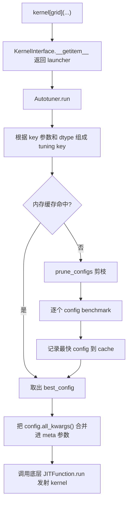

# Triton 自动调优和共享内存

这篇笔记从一个简单的向量点乘开始，整理 Triton 自动调优相关接口：

- `triton.autotune`：给同一个 `@triton.jit` kernel 绑定多组候选配置，并在运行时测量选择最快的一组。
- `triton.Config`：描述一组可调的编译期元参数和编译选项。
- `Autotuner`：`triton.autotune` 返回的包装对象，负责缓存、benchmark、选择最佳配置并最终发射 kernel。
- 共享内存：Triton 里通常不手写 `__shared__`，但编译器会在 `triton.language.sum` / `tl.sum`、`triton.language.dot` / `tl.dot` 等场景里自动生成共享内存和同步逻辑。

这篇文章里保留了 `autotune` 和 `Config` 的源码摘录，只把原来的英文注释改成中文注释，方便对照接口读。

## CUDA 版本：手写 block 内归约

先看一个 CUDA 版本的向量点乘。这个例子没有做 block 间归约，每个 block 只写出一个部分和，最后在 CPU 端把所有 block 的结果加起来。

```cpp
#ifndef __CUDACC__
#define __CUDACC__
#endif

#include <cuda_runtime.h>
#include <iostream>

#include "device_launch_parameters.h"

#define threadsPerBlock 256

const int Blocks = 32;
const int N = Blocks * threadsPerBlock;

__global__ void dot(float* a, float* b, float* c) {
    __shared__ float cache[threadsPerBlock];

    int tid = threadIdx.x + blockIdx.x * blockDim.x;
    int cacheIndex = threadIdx.x;

    float temp = 0;
    if (tid < N) {
        temp = a[tid] * b[tid];
    }

    cache[cacheIndex] = temp;
    __syncthreads();

    // block 内并行归约。
    for (int stride = blockDim.x / 2; stride > 0; stride >>= 1) {
        if (cacheIndex < stride) {
            cache[cacheIndex] += cache[cacheIndex + stride];
        }
        __syncthreads();
    }

    // 每个 block 写出一个部分和。
    if (cacheIndex == 0) {
        c[blockIdx.x] = cache[0];
    }
}

int main() {
    float* a = new float[N];
    float* b = new float[N];

    for (int i = 0; i < N; ++i) {
        a[i] = 1.0f;
        b[i] = 2.0f;
    }

    float* dev_a;
    float* dev_b;
    float* dev_c;

    cudaMalloc((void**)&dev_a, N * sizeof(float));
    cudaMalloc((void**)&dev_b, N * sizeof(float));
    cudaMalloc((void**)&dev_c, Blocks * sizeof(float));

    cudaMemcpy(dev_a, a, N * sizeof(float), cudaMemcpyHostToDevice);
    cudaMemcpy(dev_b, b, N * sizeof(float), cudaMemcpyHostToDevice);

    dot<<<Blocks, threadsPerBlock>>>(dev_a, dev_b, dev_c);
    cudaDeviceSynchronize();

    float* partial_sums = new float[Blocks];
    cudaMemcpy(partial_sums, dev_c, Blocks * sizeof(float), cudaMemcpyDeviceToHost);

    float final_sum = 0;
    for (int i = 0; i < Blocks; ++i) {
        final_sum += partial_sums[i];
    }

    std::cout << "Dot product result: " << final_sum << std::endl;

    delete[] a;
    delete[] b;
    delete[] partial_sums;
    cudaFree(dev_a);
    cudaFree(dev_b);
    cudaFree(dev_c);

    return 0;
}
```

这个 CUDA kernel 里需要手动处理几件事：

- 用 `__shared__` 申请 block 内共享内存。
- 用 `threadIdx.x` 和 `blockIdx.x` 映射线程和元素。
- 用 `__syncthreads()` 保证共享内存写完之后再读。
- 手写归约循环。
- 手动决定 `threadsPerBlock`，这个值和性能强相关。

## Triton 版本：把 block size 交给 autotune

下面是同一个点乘逻辑的 Triton 版本。这里的 `BLOCK_SIZE` 不写死，而是交给 `triton.autotune` 在运行时测试。

```python
import torch
import triton
import triton.language as tl


@triton.autotune(
    configs=[
        triton.Config({"BLOCK_SIZE": 128}, num_warps=4),
        triton.Config({"BLOCK_SIZE": 256}, num_warps=4),
        triton.Config({"BLOCK_SIZE": 512}, num_warps=8),
        triton.Config({"BLOCK_SIZE": 1024}, num_warps=8),
    ],
    key=["n_elements"],
)
@triton.jit
def dot_kernel(
    a_ptr,
    b_ptr,
    c_ptr,
    n_elements,
    BLOCK_SIZE: tl.constexpr,
):
    # 当前 Triton program 的编号，对应 CUDA 里的 blockIdx.x。
    pid = tl.program_id(axis=0)

    # 当前 program 负责的连续元素区间。
    block_start = pid * BLOCK_SIZE
    offsets = block_start + tl.arange(0, BLOCK_SIZE)

    # 尾部 program 可能覆盖到 n_elements 之外，用 mask 保护越界访问。
    mask = offsets < n_elements

    # 从全局内存加载到寄存器向量。mask 为 False 的位置用 0 填充，不影响求和。
    a = tl.load(a_ptr + offsets, mask=mask, other=0.0)
    b = tl.load(b_ptr + offsets, mask=mask, other=0.0)

    # 每个 lane 先做元素级乘法。
    multiplied = a * b

    # 当前 program 内归约。Triton 编译器会选择 warp shuffle 或 shared memory 等实现。
    result = tl.sum(multiplied, axis=0)

    # 每个 program 写出一个部分和。
    tl.store(c_ptr + pid, result)


def dot(a: torch.Tensor, b: torch.Tensor):
    n_elements = a.numel()

    # grid 是一个 meta 函数。autotune 选定某个 Config 后，会把 BLOCK_SIZE 填进 meta。
    grid = lambda meta: (triton.cdiv(n_elements, meta["BLOCK_SIZE"]),)

    # 候选配置里最小 BLOCK_SIZE 是 128，所以这里按最多 block 数预分配。
    max_blocks = triton.cdiv(n_elements, 128)
    partial_sums = torch.zeros((max_blocks,), device=a.device, dtype=a.dtype)

    dot_kernel[grid](a, b, partial_sums, n_elements)

    # 多出来的位置仍然是 0，直接求和不会影响结果。
    return torch.sum(partial_sums)


if __name__ == "__main__":
    N = 32 * 256
    a = torch.ones(N, device="cuda")
    b = torch.ones(N, device="cuda") * 2

    triton_result = dot(a, b)
    torch_result = torch.dot(a, b)

    print(f"Triton result: {triton_result.item()}")
    print(f"Torch result:  {torch_result.item()}")
    assert torch.allclose(triton_result, torch_result)
```

这段代码里，`triton.autotune` 的含义是：**同一个 kernel 逻辑，尝试多组编译期配置，实际测量后选择最快的一组**。

## `triton.autotune`

**Purpose:** 给一个 `@triton.jit` 函数添加自动调优包装，在指定的 `key` 发生变化时，benchmark 候选 `triton.Config`，选择最快配置并缓存。

**Prototype:**

```python
def autotune(
    configs,
    key,
    prune_configs_by=None,
    reset_to_zero=None,
    restore_value=None,
    pre_hook=None,
    post_hook=None,
    warmup=None,
    rep=None,
    use_cuda_graph=False,
    do_bench=None,
    cache_results=False,
):
    ...
```

**Parameters:**

| Name | Type | Meaning |
|---|---|---|
| `configs` | `list[triton.Config]` | 候选配置列表。每个配置通常包含 `BLOCK_SIZE`、`num_warps`、`num_stages` 等会影响编译和运行性能的参数。 |
| `key` | `list[str]` | 调优缓存键使用的 kernel 参数名。对应参数值变化时，会重新 benchmark 候选配置。通常放形状参数，比如 `M`、`N`、`K`、`n_elements`。 |
| `prune_configs_by` | `dict` or `None` | 剪枝策略。可包含 `perf_model`、`top_k`、`early_config_prune`，用于减少真正 benchmark 的配置数量。 |
| `reset_to_zero` | `list[str]` or `None` | 每次测试配置前，将指定参数名对应的 tensor 调用 `.zero_()` 清零。适合输出是累加写的 kernel。 |
| `restore_value` | `list[str]` or `None` | 每次测试配置前备份指定 tensor，测试后恢复。适合 kernel 会原地修改输入或中间状态的场景。 |
| `pre_hook` | `Callable` or `None` | kernel 调用前执行的自定义钩子。传入后会覆盖 `reset_to_zero` / `restore_value` 默认 pre hook。 |
| `post_hook` | `Callable` or `None` | kernel 调用后执行的自定义钩子。传入后会覆盖 `restore_value` 默认 post hook。 |
| `warmup` | `int` or `None` | 传给 benchmark 的 warmup 时间，单位按 Triton 内部 benchmark API 处理。当前源码里标记为 deprecated。 |
| `rep` | `int` or `None` | 传给 benchmark 的重复测量次数/时间参数。当前源码里标记为 deprecated。 |
| `use_cuda_graph` | `bool` | 旧接口参数。为 `True` 时使用 CUDA Graph benchmark 路径，当前源码里标记为 deprecated。 |
| `do_bench` | `Callable` or `None` | 自定义 benchmark 函数，接口形态是 `do_bench(fn, quantiles)`。不传时使用当前 driver 的 benchmarker。 |
| `cache_results` | `bool` | 是否把 autotune 的 timing 结果写入磁盘缓存。默认 `False`，但也会受到 Triton knob 配置影响。 |

**Returns:**

| Type | Meaning |
|---|---|
| `Callable[[JITFunction], Autotuner]` | 返回一个装饰器。这个装饰器接收 `@triton.jit` 之后的函数，并返回 `Autotuner` 包装对象。 |

**Side Effects / Constraints:**

- 调优阶段会把同一个 kernel 跑多次。只要 kernel 会写输出、做累加、做原地更新，就必须考虑 `reset_to_zero`、`restore_value` 或自定义 hook。
- `key` 不应该包含指针对象本身。指针地址经常变化，会导致缓存命中率很低，甚至频繁重新调优。
- `configs` 里的 `kwargs` 不能和 launch 时手动传入的同名 meta 参数冲突，否则源码里会抛出 `ValueError`。
- 如果设置环境变量或 Triton knob 打开 autotuning print，Triton 会输出调优耗时和最佳配置。

### 源码摘录：`autotune`

下面保留 `autotune` 的源码结构，只把注释改成中文。它的关键点是：`autotune(...)` 本身先返回 `decorator`，真正包住 kernel 的是内部 `decorator(fn)`。

```python
def autotune(
    configs,
    key,
    prune_configs_by=None,
    reset_to_zero=None,
    restore_value=None,
    pre_hook=None,
    post_hook=None,
    warmup=None,
    rep=None,
    use_cuda_graph=False,
    do_bench=None,
    cache_results=False,
):
    """
    用于自动调优一个已经被 triton.jit 装饰的函数。

    示例：

        @triton.autotune(
            configs=[
                triton.Config(kwargs={"BLOCK_SIZE": 128}, num_warps=4),
                triton.Config(kwargs={"BLOCK_SIZE": 1024}, num_warps=8),
            ],
            key=["x_size"],
        )
        @triton.jit
        def kernel(x_ptr, x_size, BLOCK_SIZE: tl.constexpr):
            ...

    注意：当 Triton 评估所有候选配置时，kernel 会被运行多次。
    这意味着 kernel 修改的任何值都可能被修改多次。
    如果不希望调优过程污染输出，可以使用 reset_to_zero，
    让指定 tensor 在每次评估配置前被清零。

    如果环境变量 TRITON_PRINT_AUTOTUNING 设置为 "1"，
    Triton 会在每个 kernel 调优结束后向 stdout 打印信息，
    包括调优耗时和选中的最佳配置。

    :param configs: triton.Config 对象列表。
    :param key: 参数名列表；这些参数的值变化会触发重新评估所有配置。
    :param prune_configs_by: 配置剪枝字典，可以包含 perf_model、top_k、early_config_prune。
    :param reset_to_zero: 参数名列表；每次评估配置前，对应参数会被清零。
    :param restore_value: 参数名列表；每次评估配置后，对应参数会被恢复。
    :param pre_hook: kernel 调用前执行的钩子，会覆盖 reset_to_zero / restore_value 的默认 pre hook。
    :param post_hook: kernel 调用后执行的钩子，会覆盖 restore_value 的默认 post hook。
    :param warmup: benchmark warmup 参数，已废弃。
    :param rep: benchmark repetition 参数，已废弃。
    :param do_bench: 自定义 benchmark 函数，用于测量每次运行耗时。
    :param cache_results: 是否把 autotune timing 结果缓存到磁盘。
    """

    def decorator(fn):
        return Autotuner(
            fn,
            fn.arg_names,
            configs,
            key,
            reset_to_zero,
            restore_value,
            pre_hook=pre_hook,
            post_hook=post_hook,
            prune_configs_by=prune_configs_by,
            warmup=warmup,
            rep=rep,
            use_cuda_graph=use_cuda_graph,
            do_bench=do_bench,
            cache_results=cache_results,
        )

    return decorator
```

### `autotune` 的装饰器顺序

常见写法是：

```python
@triton.autotune(configs=[...], key=["n_elements"])
@triton.jit
def kernel(...):
    ...
```

Python 装饰器的应用顺序是从下往上：

- `@triton.jit` 先执行，把普通 Python 函数变成 `JITFunction`。
- `@triton.autotune(...)` 再执行，返回一个 `decorator`。
- `decorator(JITFunction)` 返回 `Autotuner`。

所以最后得到的 `kernel` 不是裸的 `JITFunction`，而是一个 `Autotuner`。它仍然支持 `kernel[grid](...)`，因为 `Autotuner` 继承自 `KernelInterface`。

## `triton.Config`

**Purpose:** 描述一组 autotune 候选配置。它把 kernel 的编译期元参数和编译器选项打包成一个对象，供 `Autotuner` 逐个测试。

**Prototype:**

```python
class Config:
    def __init__(
        self,
        kwargs,
        num_warps=4,
        num_stages=3,
        num_ctas=1,
        maxnreg=None,
        pre_hook=None,
        ir_override=None,
    ):
        ...
```

**Constructor Parameters / Member Variables:**

| Name | Type | Meaning |
|---|---|---|
| `kwargs` | `dict[str, Any]` | 传给 kernel 的 meta 参数字典，通常对应 `triton.language.constexpr` / `tl.constexpr` 参数，比如 `BLOCK_SIZE`、`BLOCK_M`、`GROUP_SIZE_M`。 |
| `num_warps` | `int` | 一个 Triton program 使用的 warp 数。GPU 上 1 个 warp 通常是 32 个线程，所以 `num_warps=8` 对应 256 个线程参与该 program 的执行。 |
| `num_stages` | `int` | 软件流水线 stage 数。常见于矩阵乘法和异步拷贝场景，用来在访存和计算之间做 pipeline。 |
| `num_ctas` | `int` | block cluster 中的 CTA 数，主要面向 SM90+ 的 thread block cluster。 |
| `maxnreg` | `Optional[int]` | 限制单线程最多使用的寄存器数量，对应 PTX `.maxnreg`。不是所有平台都支持。 |
| `pre_hook` | `Callable` or `None` | 使用该特定 config 前调用的钩子，参数是完整的 kernel 参数字典。 |
| `ir_override` | `str` or `None` | 用户自定义 IR 文件路径，支持 `*.ttgir`、`*.llir`、`*.ptx`、`*.amdgcn` 等。 |

**Important Interfaces:**

| Method | Prototype | Meaning |
|---|---|---|
| `all_kwargs` | `def all_kwargs(self) -> dict` | 返回传给 `JITFunction.run` 的完整 meta 参数，包括 `kwargs`、`num_warps`、`num_ctas`、`num_stages`、`maxnreg`、`ir_override`。 |
| `__str__` | `def __str__(self) -> str` | 打印配置内容，常用于调优日志。 |
| `__hash__` | `def __hash__(self) -> int` | 让 `Config` 可以作为 dict key，用于记录 timing。 |
| `__eq__` | `def __eq__(self, other) -> bool` | 判断两个配置是否相同，比较内容包括 `all_kwargs()` 和 `pre_hook`。 |

### 源码摘录：`Config`

下面保留 `Config` 的源码骨架，并把注释改成中文。

```python
class Config:
    """
    表示 autotuner 可以尝试的一组 kernel 配置。

    :ivar kwargs: 传给 kernel 的 meta 参数字典。
    :ivar num_warps: 编译 GPU kernel 时使用的 warp 数。
                      例如 num_warps=8 表示每个 kernel instance 会用 8 * 32 = 256 个线程协作执行。
    :ivar num_stages: 编译器做 loop software pipelining 时使用的 stage 数。
                      主要用于 SM80+ GPU 上的矩阵乘法 workload。
    :ivar num_ctas: block cluster 中的 CTA 数。主要面向 SM90+。
    :ivar maxnreg: 每个线程最多可使用的寄存器数量，对应 PTX .maxnreg 指令。
                   不是所有平台都支持。
    :ivar pre_hook: 执行该 config 前调用的函数，参数是 kernel 的完整参数字典。
    :ivar ir_override: 用户自定义 IR 文件名，支持 *.{ttgir|llir|ptx|amdgcn}。
    """

    def __init__(
        self,
        kwargs,
        num_warps=4,
        num_stages=3,
        num_ctas=1,
        maxnreg=None,
        pre_hook=None,
        ir_override=None,
    ):
        self.kwargs = kwargs
        self.num_warps = num_warps
        self.num_ctas = num_ctas
        self.num_stages = num_stages
        self.maxnreg = maxnreg
        self.pre_hook = pre_hook
        self.ir_override = ir_override

    def all_kwargs(self):
        return {
            **self.kwargs,
            **{
                k: v
                for (k, v) in (
                    ("num_warps", self.num_warps),
                    ("num_ctas", self.num_ctas),
                    ("num_stages", self.num_stages),
                    ("maxnreg", self.maxnreg),
                    ("ir_override", self.ir_override),
                )
                if v is not None
            },
        }
```

### `Config` 参数怎么选

`kwargs` 是最核心的调优对象。比如：

```python
triton.Config({"BLOCK_SIZE": 128}, num_warps=4)
triton.Config({"BLOCK_SIZE": 1024}, num_warps=8)
```

这里的 `BLOCK_SIZE` 会传给 kernel 的 `BLOCK_SIZE: tl.constexpr`，因此它会参与 JIT 特化。不同 `BLOCK_SIZE` 通常会生成不同的 kernel 版本。

`num_warps` 控制一个 Triton program 使用多少 warp：

- `num_warps=4`：大致对应 128 个线程协作执行。
- `num_warps=8`：大致对应 256 个线程协作执行。
- warp 数更多时，单个 program 的并行度可能更强，但寄存器、共享内存和 occupancy 也会被影响。

`num_stages` 常见于矩阵乘法：

- stage 少，资源占用低，但隐藏访存延迟的能力弱。
- stage 多，可以让访存和计算重叠得更充分，但会消耗更多共享内存和寄存器。

`maxnreg` 是更偏底层的性能旋钮。它可以限制每个线程使用的寄存器数量，用来换取更高 occupancy，但也可能造成 spilling，反而变慢。

`ir_override` 更像专家模式：它允许跳过普通 Triton Python kernel 的部分编译流程，直接使用已有 IR 或汇编文件做测试。常规写算子时一般不会用。

## `Autotuner`

**Purpose:** `triton.autotune` 创建的运行时包装对象。它负责从候选 `Config` 中挑选最快配置，并把选中的配置作为 meta 参数传给底层 `JITFunction.run`。

**Class / Member Source:**

```python
class Autotuner(KernelInterface):
    def __init__(
        self,
        fn,
        arg_names,
        configs,
        key,
        reset_to_zero,
        restore_value,
        pre_hook=None,
        post_hook=None,
        prune_configs_by=None,
        warmup=None,
        rep=None,
        use_cuda_graph=False,
        do_bench=None,
        cache_results=False,
    ):
        ...
```

**Member Variables:**

| Member | Type | Meaning |
|---|---|---|
| `configs` | `list[Config]` | 候选配置。如果用户传入空列表，源码会使用一个默认 `Config({}, num_warps=4, num_stages=3, num_ctas=1)`。 |
| `keys` | `list[str]` | 调优缓存键使用的参数名，来自 `autotune(..., key=...)`。 |
| `cache` | `dict[tuple, Config]` | 内存级缓存，保存某个 tuning key 对应的最佳 `Config`。 |
| `arg_names` | `list[str]` | kernel 的参数名列表，来自 `JITFunction.arg_names`。 |
| `cache_results` | `bool` | 是否启用磁盘缓存。源码里会同时考虑用户参数、Triton knob 和 interpret 模式。 |
| `reset_to_zero` | `list[str]` | 需要在每次 benchmark 前清零的参数名列表。 |
| `restore_value` | `list[str]` | 需要在每次 benchmark 后恢复的参数名列表。 |
| `pre_hook` | `Callable` | kernel 调用前 hook。没有用户 hook 时，可能由 `reset_to_zero` / `restore_value` 自动生成。 |
| `post_hook` | `Callable` | kernel 调用后 hook。没有用户 hook 时，可能由 `restore_value` 自动生成。 |
| `perf_model` | `Callable` or `None` | 配置性能模型，用于剪枝前估计不同 config 的运行时间。 |
| `configs_top_k` | `int` or `float` | `perf_model` 剪枝后保留多少个配置。 |
| `early_config_prune` | `Callable` or `None` | 更早执行的配置剪枝函数。 |
| `fn` | `JITFunction` or wrapper | 被包装的底层 kernel。 |
| `base_fn` | Python function | 解开 wrapper 后的原始 Python 函数，主要用于日志中的函数名。 |
| `_do_bench` | `Callable` or `None` | 用户自定义 benchmark 函数。 |
| `num_warmups` | `int` or `None` | deprecated benchmark warmup 参数。 |
| `num_reps` | `int` or `None` | deprecated benchmark repetition 参数。 |
| `use_cuda_graph` | `bool` | deprecated CUDA Graph benchmark 标记。 |
| `best_config` | `Config` | 最近一次 `run` 选出的最佳配置。这个成员在 `run` 执行后设置。 |
| `configs_timings` | `dict[Config, Any]` | 最近一次 benchmark 得到的配置耗时表。 |

**Important Interfaces:**

| Method | Prototype | Meaning |
|---|---|---|
| `run` | `def run(self, *args, **kwargs)` | 真正执行 autotuned kernel。首次遇到某个 key 时 benchmark；之后复用缓存里的最佳配置。 |
| `warmup` | `def warmup(self, *args, **kwargs)` | 对剪枝后的所有配置调用底层 `fn.warmup`，返回 warmup 结果列表。 |
| `prune_configs` | `def prune_configs(self, kwargs: Dict) -> List[Config]` | 根据 `early_config_prune` 和 `perf_model` 缩小候选配置集合。 |
| `do_bench` | `@cached_property` | 返回 benchmark 函数。优先使用用户传入的 `_do_bench`，否则使用当前 driver 的 benchmarker。 |
| `check_disk_cache` | `def check_disk_cache(self, tuning_key, configs, bench_fn)` | 如果启用磁盘缓存，从缓存文件读取 timing 或写入新的 timing。 |

### `run` 的执行流程



这里有两个细节很重要：

- tuning key 除了 `key` 指定的参数值，还会追加 tensor-like 参数的 `dtype`。所以相同形状但 dtype 不同，可能会重新调优。
- benchmark 结束后，源码会对 `full_nargs` 调一次 `pre_hook(..., reset_only=True)`，让最终真正运行前的输出状态保持干净。

## `prune_configs_by`

当候选配置很多时，不一定要全部真实 benchmark。`prune_configs_by` 可以提前过滤。

**Expected Shape:**

```python
prune_configs_by = {
    "early_config_prune": early_config_prune,
    "perf_model": perf_model,
    "top_k": top_k,
}
```

**Fields:**

| Field | Type | Meaning |
|---|---|---|
| `early_config_prune` | `Callable` | 最早执行的剪枝函数。签名大致是 `early_config_prune(configs, named_args, **kwargs) -> list[Config]`，必须至少返回一个配置。 |
| `perf_model` | `Callable` | 性能模型。源码会把 kernel 参数和 `config.all_kwargs()` 展开传入，用返回值估计耗时。 |
| `top_k` | `int` or `float` | `perf_model` 估计后保留多少配置。`float <= 1.0` 表示保留比例，`int` 表示保留个数。 |

这个接口适合大矩阵乘法一类搜索空间很大的 kernel。比如候选配置有几十甚至上百个时，先用模型保留前几个，再做真实 benchmark。

## 副作用清理：`reset_to_zero`、`restore_value`、hook

自动调优最容易踩坑的点是：**调优阶段 kernel 会运行多次**。

如果 kernel 是纯覆盖写，比如：

```python
C = A + B
```

多跑几次通常问题不大，因为每次都覆盖同一块输出。

但如果 kernel 是累加写，比如：

```python
C += A * B
```

调优跑 10 次，`C` 就可能被加 10 次。这个时候应该使用：

```python
@triton.autotune(
    configs=[...],
    key=["M", "N", "K"],
    reset_to_zero=["C"],
)
@triton.jit
def matmul_kernel(A, B, C, M: tl.constexpr, N: tl.constexpr, K: tl.constexpr, ...):
    ...
```

如果被修改的是输入或中间状态，不适合简单清零，可以用 `restore_value`：

```python
@triton.autotune(
    configs=[...],
    key=["n_elements"],
    restore_value=["state"],
)
@triton.jit
def update_state_kernel(state, n_elements, BLOCK_SIZE: tl.constexpr):
    ...
```

如果清理逻辑更复杂，比如需要重置多个 tensor、随机状态或临时 workspace，可以传入自定义 `pre_hook` / `post_hook`。

## `key` 应该怎么放

`key` 控制“什么时候重新调优”。经验上只放会显著影响性能选择的参数：

- 输入规模：`M`、`N`、`K`、`n_elements`。
- shape 相关的 stride 或 layout 标记，如果它们会改变访存模式。
- dtype 不用手动放。源码会自动把有 `dtype` 属性的参数 dtype 追加到 tuning key。

不要把 tensor 指针、输出 tensor、临时 buffer 本身放进 `key`。这些对象经常变化，但不一定改变最优配置，放进去会让缓存很难命中。

## 最全参数演示代码

下面这段代码的目的不是写最快的向量加法，而是把 `triton.autotune` 和 `triton.Config` 的参数入口都摆出来。

有几个参数需要特别说明：

- `warmup`、`rep`、`use_cuda_graph` 在当前源码里已经是 deprecated 路径，所以这里显式传入安全值 `None` / `False`。
- `maxnreg` 不是所有平台都支持，所以这里显式传入 `None`。如果你想测试寄存器限制，可以改成类似 `maxnreg=64`。
- `ir_override` 需要真实存在的 `*.ttgir`、`*.llir`、`*.ptx` 或 `*.amdgcn` 文件，所以这里显式传入 `None`。
- 这里同时写了 `reset_to_zero`、`restore_value` 和自定义 hook。注意：源码里只要传了自定义 `pre_hook` / `post_hook`，默认的 reset / restore hook 就会被覆盖，所以演示代码在自定义 hook 里手动做了对应清理。

```python
import os

# 这个环境变量要尽量在 import triton 之前设置，方便观察 autotune 结果。
os.environ.setdefault("TRITON_PRINT_AUTOTUNING", "1")

import torch
import triton
import triton.language as tl
import triton.testing


_restore_copies = {}
_printed_config_hooks = set()


def autotune_pre_hook(kwargs, reset_only=False):
    """autotune 级别 pre_hook：在 benchmark 每个 config 前清理现场。"""

    # 演示 reset_to_zero 的语义：输出 tensor 在测试配置前归零。
    if "out_ptr" in kwargs:
        kwargs["out_ptr"].zero_()

    # benchmark 完成后，Autotuner.run 会用 reset_only=True 再调用一次 pre_hook，
    # 这时只需要清理输出，不需要再备份 restore_value。
    if reset_only:
        return

    # 演示 restore_value 的语义：保存会被 kernel 修改的 scratch。
    if "scratch_ptr" in kwargs:
        _restore_copies["scratch_ptr"] = kwargs["scratch_ptr"].clone()


def autotune_post_hook(kwargs, exception):
    """autotune 级别 post_hook：在 benchmark 每个 config 后恢复现场。"""

    # benchmark 某个 config 后，把 scratch 恢复到运行前。
    if "scratch_ptr" in _restore_copies:
        kwargs["scratch_ptr"].copy_(_restore_copies.pop("scratch_ptr"))

    if exception is not None:
        print(f"[autotune_post_hook] kernel failed during tuning: {exception}")


def config_pre_hook(kwargs):
    """Config 级别 pre_hook：只对绑定了该 hook 的单个 Config 生效。"""

    # 这里不做实际修改，只演示它能拿到完整参数字典和 meta 参数。
    block_size = kwargs.get("BLOCK_SIZE")
    num_warps = kwargs.get("num_warps")
    tag = (block_size, num_warps)
    if tag not in _printed_config_hooks:
        _printed_config_hooks.add(tag)
        print(f"[config_pre_hook] trying BLOCK_SIZE={block_size}, num_warps={num_warps}")


def early_config_prune(configs, named_args, **kwargs):
    """提前剪枝：返回至少一个 Config。"""

    n_elements = named_args["n_elements"]

    # 小输入没必要试特别大的 block。
    if n_elements <= 4096:
        pruned = [cfg for cfg in configs if cfg.kwargs["BLOCK_SIZE"] <= 512]
        return pruned if pruned else configs[:1]

    return configs


def perf_model(**kwargs):
    """粗糙性能模型：返回值越小，表示越值得真实 benchmark。"""

    n_elements = kwargs["n_elements"]
    block_size = kwargs["BLOCK_SIZE"]
    num_warps = kwargs["num_warps"]

    # 这里只是演示接口，不代表真实硬件性能模型。
    num_programs = triton.cdiv(n_elements, block_size)
    return num_programs + 0.05 * num_warps


def custom_do_bench(fn, quantiles):
    """自定义 benchmark 函数。"""

    return triton.testing.do_bench(fn, quantiles=quantiles)


@triton.autotune(
    configs=[
        triton.Config(
            kwargs={"BLOCK_SIZE": 128},
            num_warps=4,
            num_stages=3,
            num_ctas=1,
            maxnreg=None,
            pre_hook=config_pre_hook,
            ir_override=None,
        ),
        triton.Config(
            kwargs={"BLOCK_SIZE": 256},
            num_warps=4,
            num_stages=3,
            num_ctas=1,
            maxnreg=None,
            pre_hook=None,
            ir_override=None,
        ),
        triton.Config(
            kwargs={"BLOCK_SIZE": 512},
            num_warps=8,
            num_stages=4,
            num_ctas=1,
            maxnreg=None,
            pre_hook=None,
            ir_override=None,
        ),
        triton.Config(
            kwargs={"BLOCK_SIZE": 1024},
            num_warps=8,
            num_stages=4,
            num_ctas=1,
            maxnreg=None,
            pre_hook=None,
            ir_override=None,
        ),
    ],
    key=["n_elements"],
    prune_configs_by={
        "early_config_prune": early_config_prune,
        "perf_model": perf_model,
        "top_k": 2,
    },
    reset_to_zero=["out_ptr"],
    restore_value=["scratch_ptr"],
    pre_hook=autotune_pre_hook,
    post_hook=autotune_post_hook,
    warmup=None,
    rep=None,
    use_cuda_graph=False,
    do_bench=custom_do_bench,
    cache_results=True,
)
@triton.jit
def add_kernel(
    x_ptr,
    y_ptr,
    out_ptr,
    scratch_ptr,
    n_elements,
    BLOCK_SIZE: tl.constexpr,
):
    pid = tl.program_id(axis=0)
    offsets = pid * BLOCK_SIZE + tl.arange(0, BLOCK_SIZE)
    mask = offsets < n_elements

    x = tl.load(x_ptr + offsets, mask=mask, other=0.0)
    y = tl.load(y_ptr + offsets, mask=mask, other=0.0)

    tl.store(out_ptr + offsets, x + y, mask=mask)

    # 故意写 scratch，用来观察 restore_value / hook 的行为。
    tl.store(scratch_ptr + offsets, x - y, mask=mask)


def add(x: torch.Tensor, y: torch.Tensor):
    assert x.is_cuda and y.is_cuda
    assert x.shape == y.shape
    assert x.dtype == y.dtype

    n_elements = x.numel()
    out = torch.empty_like(x)
    scratch = torch.full_like(x, -777.0)

    grid = lambda meta: (triton.cdiv(n_elements, meta["BLOCK_SIZE"]),)

    add_kernel[grid](x, y, out, scratch, n_elements)
    return out, scratch


if __name__ == "__main__":
    torch.manual_seed(0)

    n_elements = 8192
    x = torch.randn(n_elements, device="cuda", dtype=torch.float32)
    y = torch.randn(n_elements, device="cuda", dtype=torch.float32)

    out, scratch = add(x, y)

    torch.testing.assert_close(out, x + y)
    torch.testing.assert_close(scratch, x - y)

    print("result check: passed")
    print(f"best_config: {add_kernel.best_config}")
```

第一次运行时，你应该能看到 Triton 打印 autotune 过程和最终选择的 `best_config`。第二次用相同 `n_elements` 和 dtype 调用时，`Autotuner` 会优先使用内存缓存里的配置。

这里还有一个源码层面的细节：如果任意 `Config` 设置了 `pre_hook`，`check_disk_cache` 会直接跳过磁盘缓存，因为 hook 不能可靠序列化。所以这份演示代码虽然显式传了 `cache_results=True`，但由于第一个 `Config` 使用了 `config_pre_hook`，它主要演示参数入口和内存缓存行为。

### 演示代码运行结果

一次实际运行输出如下：

```shell
Autotuning kernel add_kernel with config BLOCK_SIZE: 1024, num_warps: 8, num_ctas: 1, num_stages: 4, maxnreg: None
Autotuning kernel add_kernel with config BLOCK_SIZE: 512, num_warps: 8, num_ctas: 1, num_stages: 4, maxnreg: None
Triton autotuning for function add_kernel,
with key as (8192, 'torch.float32', 'torch.float32', 'torch.float32', 'torch.float32'),
finished after 0.44s,
best config selected: BLOCK_SIZE: 512, num_warps: 8, num_ctas: 1, num_stages: 4, maxnreg: None;
result check: passed
best_config: BLOCK_SIZE: 512, num_warps: 8, num_ctas: 1, num_stages: 4, maxnreg: None
```

这段输出可以和 `Autotuner.run` 的流程一一对应。

首先，为什么只 benchmark 了两个配置？

我们传入了 4 个候选 `Config`：

- `BLOCK_SIZE = 128`
- `BLOCK_SIZE = 256`
- `BLOCK_SIZE = 512`
- `BLOCK_SIZE = 1024`

但是 `prune_configs_by` 里设置了：

```python
prune_configs_by={
    "early_config_prune": early_config_prune,
    "perf_model": perf_model,
    "top_k": 2,
}
```

当前 `n_elements = 8192`，所以 `early_config_prune` 不会过滤掉大 block，4 个配置都会进入 `perf_model`。随后 `perf_model` 按下面这个粗糙规则估计代价：

```python
num_programs = triton.cdiv(n_elements, block_size)
return num_programs + 0.05 * num_warps
```

在这个模型下，`BLOCK_SIZE` 越大，需要启动的 program 数越少，所以 `BLOCK_SIZE=1024` 和 `BLOCK_SIZE=512` 会被排到前两名。`top_k=2` 又只保留两个配置，因此最终只真实 benchmark 了这两组。

输出里的两行：

```shell
Autotuning kernel add_kernel with config BLOCK_SIZE: 1024, ...
Autotuning kernel add_kernel with config BLOCK_SIZE: 512, ...
```

正是 `Autotuner._bench` 在逐个测试剪枝后的配置。

然后看 tuning key：

```shell
with key as (8192, 'torch.float32', 'torch.float32', 'torch.float32', 'torch.float32')
```

这里的 `8192` 来自我们写的：

```python
key=["n_elements"]
```

后面的 4 个 `'torch.float32'` 来自源码里的这段逻辑：`Autotuner.run` 会遍历 runtime 参数，只要参数有 `dtype` 属性，就把它的 dtype 追加到 tuning key 里。

这个 kernel 的 runtime tensor 参数是：

- `x_ptr`
- `y_ptr`
- `out_ptr`
- `scratch_ptr`

它们都是 `torch.float32`，所以 key 最后变成：

```python
(8192, "torch.float32", "torch.float32", "torch.float32", "torch.float32")
```

这也解释了为什么 dtype 变化时，Triton 可能重新调优。即使 `n_elements` 不变，`float32` 和 `float16` 的最佳配置也可能不同。

最后看最佳配置：

```shell
best config selected: BLOCK_SIZE: 512, num_warps: 8, num_ctas: 1, num_stages: 4, maxnreg: None;
```

这表示真实 benchmark 后，`BLOCK_SIZE=512` 比 `BLOCK_SIZE=1024` 更快。这里也能看到一个很重要的点：**性能模型只负责决定“测谁”，不负责决定“谁赢”**。

在这次运行里：

- `perf_model` 先挑出 `1024` 和 `512`。
- `do_bench` 对这两个配置真实计时。
- `Autotuner` 从真实 timing 里选出 `512`。
- 选中的配置被写到 `add_kernel.best_config`。

所以最后两行：

```shell
result check: passed
best_config: BLOCK_SIZE: 512, num_warps: 8, num_ctas: 1, num_stages: 4, maxnreg: None
```

分别说明：

- `result check: passed`：Triton kernel 的输出和 `x + y` 对得上。
- `best_config: ...`：这次 `Autotuner.run` 结束后，`add_kernel.best_config` 保存的就是刚刚选出的最佳配置。

另外，输出里没有看到 `[config_pre_hook]` 的打印，是因为绑定 `config_pre_hook` 的是 `BLOCK_SIZE=128` 那个配置，而这次它被 `perf_model + top_k` 剪掉了，没有进入真实 benchmark。

## `triton.heuristics`

`triton.heuristics` 和 `triton.autotune` 都能给 meta 参数赋值，但思路不同：

- `autotune` 是实际跑 benchmark，选择最快配置。
- `heuristics` 是用规则函数直接算出 meta 参数，不做 benchmark。

**Prototype:**

```python
def heuristics(values):
    ...
```

**Parameters:**

| Name | Type | Meaning |
|---|---|---|
| `values` | `dict[str, Callable[[dict[str, Any]], Any]]` | key 是 meta 参数名，value 是根据当前调用参数计算 meta 参数值的函数。 |

**Example:**

```python
@triton.heuristics(
    values={"BLOCK_SIZE": lambda args: triton.next_power_of_2(args["x_size"])}
)
@triton.jit
def kernel(x_ptr, x_size, BLOCK_SIZE: tl.constexpr):
    ...
```

如果候选空间不大、运行次数足够多，`autotune` 更可靠。如果某个参数有明确规则，或者 benchmark 成本太高，`heuristics` 更轻量。

## 共享内存：Triton 不是没有用，而是通常不让你手写

CUDA 代码里我们手写了：

```cpp
__shared__ float cache[threadsPerBlock];
__syncthreads();
```

Triton 逻辑层面没有一个常用的 `shared` 关键字让你像 CUDA 那样直接声明共享内存数组。大多数时候，你写的是：

```python
multiplied = a * b
result = tl.sum(multiplied, axis=0)
```

然后编译器决定底层如何实现归约。

一个实用理解是：

- `triton.language.arange` / `tl.arange` 生成的是一个 program 内的向量索引。
- `triton.language.load` / `tl.load` 把一组全局内存值加载成寄存器里的向量。
- `triton.language.sum` / `tl.sum` 需要 program 内的数据归约。编译器会根据形状、layout、warp 数和目标架构选择 warp shuffle、shared memory 或其他实现。
- `triton.language.dot` / `tl.dot` 更明显会触发共享内存和 Tensor Core 相关 lowering，尤其是在矩阵乘法场景。

### 从 IR layout 看共享内存

在 Triton 编译器内部，tensor 会带有 layout。你经常会看到这类概念：

- **Blocked Layout**：更接近寄存器中的数据分布。
- **Shared Layout**：对应共享内存中的数据排布。
- **`ttg.convert_layout`**：在不同 layout 之间转换。某些转换会 lowering 成共享内存读写。

当编译器发现某个操作需要跨线程交换数据时，就可能插入 layout conversion：

- 归约：`tl.sum`、`tl.max` 等。
- 矩阵乘法：`tl.dot`。
- 某些需要重新排布数据以匹配 Tensor Core 输入格式的场景。

底层可能出现的动作包括：

- 把寄存器中的数据写入 shared memory。
- 插入必要的 barrier，保证写入对后续读取可见。
- 在 SM80+ 上使用异步拷贝和更细粒度的等待机制隐藏访存延迟。

所以 Triton 的共享内存不是“没有”，而是更多以编译器优化结果出现。你写的是 block-level 的张量表达式，编译器负责把它 lowering 到寄存器、共享内存、同步和 PTX 指令。

## 使用 checklist

- `configs` 里只放真正想搜索的编译期参数，不要无限扩大搜索空间。
- `key` 放 shape 和 layout 这类会影响最优配置的参数，不放 tensor 指针。
- kernel 有累加写时，优先检查是否需要 `reset_to_zero`。
- kernel 会原地修改输入或状态时，考虑 `restore_value` 或自定义 hook。
- 调试配置选择时，可以打开 `TRITON_PRINT_AUTOTUNING=1`。
- 候选配置很多时，考虑 `prune_configs_by`，否则首次运行会很慢。
- `warmup`、`rep`、`use_cuda_graph` 在当前源码里已经走 deprecated 路径，新代码优先使用默认 benchmarker 或 `do_bench`。

这篇笔记的核心结论是：**`triton.autotune` 调的不是算法逻辑，而是同一段 kernel 在不同编译期配置下的执行形态。** `Config` 描述候选形态，`Autotuner` 负责真实测量和缓存，而共享内存、同步、warp-level 细节大多由 Triton 编译器根据这些配置自动生成。
