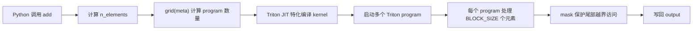
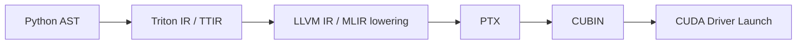

# Triton 基础概念

这篇笔记从一个向量加法 kernel 出发，整理 Triton 入门时最容易混淆的几个概念：

- **Triton program**：对应 CUDA 里的 block / CTA，而不是单个 thread。
- **`triton.language.tensor`**：通常写作 `tl.tensor`，表示寄存器中的一组标量值，而不是显存里的 Tensor 对象。
- **`triton.language.constexpr`**：通常写作 `tl.constexpr`，表示编译期元参数，接近 C++ 模板参数。
- **`triton.language.load` / `triton.language.store`**：通常写作 `tl.load` / `tl.store`，用 mask 和指针张量表达向量化访存。
- **launch grid**：用 Python 侧的 grid 函数决定启动多少个 program。

Triton 的核心思想是：**把 thread-level 的显式控制隐藏起来，让开发者用 block-level 的向量操作描述 GPU kernel**。这对写深度学习算子很友好，因为大多数算子天然就是 tile、vector、matrix 的计算。

## 环境与安装

Triton 主要面向 Linux + NVIDIA GPU 环境。实际可用的 GPU 架构、CUDA 版本和 PyTorch 版本需要以当前 Triton 版本的官方说明为准。一般可以通过 pip 安装：

```shell
pip install triton
```

安装后通常会配合 PyTorch 使用：

```python
import torch
import triton
import triton.language as tl
```

## 一个最小向量加法示例

下面是 Triton 官方入门里常见的向量加法结构。它的功能很简单：给定两个 CUDA Tensor `x` 和 `y`，计算 `output = x + y`。

```python
import torch
import triton
import triton.language as tl


@triton.jit
def add_kernel(
    x_ptr,
    y_ptr,
    output_ptr,
    n_elements,
    BLOCK_SIZE: tl.constexpr,
):
    pid = tl.program_id(axis=0)
    block_start = pid * BLOCK_SIZE
    offsets = block_start + tl.arange(0, BLOCK_SIZE)
    mask = offsets < n_elements

    x = tl.load(x_ptr + offsets, mask=mask)
    y = tl.load(y_ptr + offsets, mask=mask)
    output = x + y

    tl.store(output_ptr + offsets, output, mask=mask)


def add(x: torch.Tensor, y: torch.Tensor) -> torch.Tensor:
    output = torch.empty_like(x)
    assert x.is_cuda and y.is_cuda and output.is_cuda

    n_elements = output.numel()
    grid = lambda meta: (triton.cdiv(n_elements, meta["BLOCK_SIZE"]),)
    add_kernel[grid](x, y, output, n_elements, BLOCK_SIZE=1024)
    return output
```

这个 kernel 的执行模型可以概括为：



这里最重要的是：`add_kernel` 不是由 Python 解释器逐行执行的普通函数。被 `@triton.jit` 装饰后，它会被 Triton 编译成 GPU kernel，并通过 `add_kernel[grid](...)` 发射到 GPU 上运行。

## Triton 与 CUDA 的概念对应

| Triton 概念 | CUDA C++ 类比 | 说明 |
|---|---|---|
| `@triton.jit` | `__global__` kernel + 编译器前端 | 把 Python 函数编译成 GPU kernel。 |
| `triton.language.program_id(0)` / `tl.program_id(0)` | `blockIdx.x` | 获取当前 program 在 grid 第 0 维的编号。 |
| `triton.language.num_programs(0)` / `tl.num_programs(0)` | `gridDim.x` | 获取 grid 第 0 维的 program 总数。 |
| `BLOCK_SIZE: triton.language.constexpr` / `BLOCK_SIZE: tl.constexpr` | `template <int BLOCK_SIZE>` | 编译期常量，用于生成特化版本。 |
| `triton.language.arange(0, BLOCK_SIZE)` / `tl.arange(0, BLOCK_SIZE)` | block 内局部向量索引 | 生成寄存器中的连续索引向量。 |
| `x_ptr + offsets` | 一组待访问地址 | 产生指针张量，而不是立即访存。 |
| `triton.language.load(...)` / `tl.load(...)` | coalesced load | 按指针张量加载一组值到寄存器。 |
| `triton.language.store(...)` / `tl.store(...)` | coalesced store | 把寄存器中的一组值写回显存。 |

一个粗略但有用的理解是：

- CUDA 里你经常手写 `blockIdx.x`、`threadIdx.x`，再让每个 thread 处理一个或多个元素。
- Triton 里你只显式写 `triton.language.program_id`，代码中通常简写为 `tl.program_id`，然后用 `triton.language.arange` / `tl.arange` 构造当前 program 内部的一组元素索引。
- Triton 编译器负责把这些向量操作映射到具体线程、warp、寄存器和访存指令。

## `@triton.jit`

**Purpose:** 把 Python 函数标记为 Triton GPU kernel，并在调用时触发 JIT 编译、缓存和发射。

**Overloads and Implementation:**

源码里 `jit` 有两个 overload。overload 只给类型检查器看，真正运行的是下面的 implementation。

```python
@overload
def jit(fn: T) -> JITFunction[T]:
    ...


@overload
def jit(
    *,
    version=None,
    repr: Optional[Callable] = None,
    launch_metadata: Optional[Callable] = None,
    do_not_specialize: Optional[Iterable[int | str]] = None,
    do_not_specialize_on_alignment: Optional[Iterable[int | str]] = None,
    debug: Optional[bool] = None,
    noinline: Optional[bool] = None,
) -> Callable[[T], JITFunction[T]]:
    ...


def jit(
    fn: Optional[T] = None,
    *,
    version=None,
    repr: Optional[Callable] = None,
    launch_metadata: Optional[Callable] = None,
    do_not_specialize: Optional[Iterable[int | str]] = None,
    do_not_specialize_on_alignment: Optional[Iterable[int | str]] = None,
    debug: Optional[bool] = None,
    noinline: Optional[bool] = None,
) -> KernelInterface[T]:
    ...
```

这里最容易混淆的是：**两个 overload 描述的是用户调用方式，implementation 的 `KernelInterface[T]` 是一个更宽的返回类型**。正常非 interpreter 模式下，最终包装出来的对象是 `JITFunction[T]`；但 `JITFunction` 本身继承了 `KernelInterface[T]`，所以实现签名可以写成更抽象的 `KernelInterface[T]`。

**接口要点：**

| 参数 | 类型 | 含义 |
|---|---|---|
| `fn` | `Callable` or `None` | 要被 JIT 编译的 Python 函数。使用 `@triton.jit` 时由装饰器隐式传入；使用 `triton.jit(fn)` 时显式传入。 |
| `version` | any | 手动加入 kernel 版本信息。它和 JIT function 的版本标记、缓存区分相关；具体参与缓存键的方式依赖 Triton 版本。 |
| `repr` | `Callable` or `None` | 自定义 JIT function 的展示字符串。偏调试 / profiler / instrumentation 用途，普通 kernel 很少需要。 |
| `launch_metadata` | `Callable` or `None` | 自定义 launch 元数据。偏运行时 hook / profiler / instrumentation 用途，具体 callable 签名和消费方式依赖 Triton 版本。 |
| `do_not_specialize` | `Iterable[int \| str]` or `None` | 指定某些参数不参与运行时特化。元素可以是参数位置，也可以是参数名。适合减少因为普通 runtime 参数变化导致的编译缓存膨胀。 |
| `do_not_specialize_on_alignment` | `Iterable[int \| str]` or `None` | 指定某些参数不按对齐信息参与特化。常见于指针参数：仍保留类型等信息，但不因为不同对齐假设生成更多版本。 |
| `debug` | `bool` or `None` | 为这个 JIT function 设置默认 debug 开关。也可以在 launch 时通过 `debug=...` 覆盖。具体调试行为依赖 Triton 版本和运行时配置。 |
| `noinline` | `bool` or `None` | 提示 Triton 不要内联这个 JIT function。主要用于拆分 helper 函数、调试 IR，或控制编译器内联行为。 |

**Returns:**

| 调用方式 | 返回类型 | 含义 |
|---|---|---|
| `triton.jit(fn)` / `@triton.jit` | `JITFunction[T]` | 直接把 Python 函数包装成可 JIT 编译、可 launch 的 Triton kernel 对象。 |
| `triton.jit(...)` / `@triton.jit(...)` | `Callable[[T], JITFunction[T]]` | 先返回一个 decorator；这个 decorator 再接收 Python 函数并返回 `JITFunction[T]`。 |
| `knobs.runtime.interpret=True` 时 | `InterpretedFunction` | 源码中 `decorator` 会返回解释执行版本，用于 Triton interpreter 路径。这个类型来自 `triton.runtime.interpreter`。 |

从实现路径看，`jit` 内部先定义了一个 `decorator(fn)`：

```python
def decorator(fn: T) -> JITFunction[T]:
    assert callable(fn)
    if knobs.runtime.interpret:
        return InterpretedFunction(...)
    else:
        return JITFunction(...)
```

然后根据 `fn` 是否为 `None` 决定返回什么：

```python
if fn is not None:
    return decorator(fn)
else:
    return decorator
```

所以四种常见写法可以拆成：

| 写法 | 进入 `jit` 时的 `fn` | `jit` 第一阶段返回 | 最终被绑定到函数名上的对象 |
|---|---|---|---|
| `@triton.jit` | 被装饰的函数对象 | `decorator(fn)` | `JITFunction[T]`，或 interpreter 模式下的 `InterpretedFunction`。 |
| `triton.jit(fn)` | 显式传入的函数对象 | `decorator(fn)` | `JITFunction[T]`，或 interpreter 模式下的 `InterpretedFunction`。 |
| `@triton.jit(...)` | `None` | `decorator` | Python 再把被装饰函数传给 `decorator`，最终得到 `JITFunction[T]`。 |
| `decorator = triton.jit(...)` | `None` | `decorator` | 还没有包装具体函数；等调用 `decorator(fn)` 时才得到 `JITFunction[T]`。 |

这就是“为什么最后好像都是返回 `JITFunction[T]`”的原因：**只要真的传入了要 JIT 的函数，并且没有打开 interpreter 模式，最终都会走到 `return JITFunction(...)`**。不同 overload 的差别只在于：函数对象是第一步就传进 `jit`，还是先返回一个 decorator、第二步再传进去。

也因此，被 `@triton.jit` 装饰后的对象不再是普通 Python function，而是一个带有编译、缓存、launch 能力的 `JITFunction` 对象。

### 用实验观察 `@triton.jit` 返回了什么

只看 `JITFunction`、`JITCallable`、`KernelInterface` 这些类名会比较抽象。更容易建立直觉的方式是：**先写一个最小 kernel，然后直接打印 `@triton.jit` 返回对象的成员变量和接口行为**。


这个脚本默认不 launch GPU kernel，只观察 Python 侧对象。这样可以先把 `@triton.jit` 的对象模型看清楚，再去理解真实 launch。

核心代码如下：

```python
import inspect
from typing import Any

import triton
import triton.language as tl
from triton.runtime.jit import JITCallable, JITFunction, KernelInterface


def custom_repr(_kernel: Any) -> str:
    # 传给 @triton.jit(repr=...)。
    # 后面调用 kernel.repr(None) 时，应该能看到这个字符串。
    return "custom_repr_vector_add"


@triton.jit
def add_kernel_plain(x_ptr, y_ptr, out_ptr, n_elements, BLOCK_SIZE: tl.constexpr):
    # 注意：这个函数定义完成后，add_kernel_plain 已经不是普通 Python function。
    # @triton.jit 会把它替换成 JITFunction 对象。
    pid = tl.program_id(0)
    offsets = pid * BLOCK_SIZE + tl.arange(0, BLOCK_SIZE)
    mask = offsets < n_elements
    x = tl.load(x_ptr + offsets, mask=mask, other=0.0)
    y = tl.load(y_ptr + offsets, mask=mask, other=0.0)
    tl.store(out_ptr + offsets, x + y, mask=mask)


@triton.jit(
    repr=custom_repr,
    do_not_specialize=["n_elements"],
    do_not_specialize_on_alignment=["x_ptr", "y_ptr", "out_ptr"],
    debug=False,
    noinline=False,
)
def add_kernel_with_options(x_ptr, y_ptr, out_ptr, n_elements, BLOCK_SIZE: tl.constexpr):
    # kernel 内容和 add_kernel_plain 一样。
    # 区别只在 @triton.jit(...) 的参数，方便观察这些参数存到了哪里。
    pid = tl.program_id(0)
    offsets = pid * BLOCK_SIZE + tl.arange(0, BLOCK_SIZE)
    mask = offsets < n_elements
    x = tl.load(x_ptr + offsets, mask=mask, other=0.0)
    y = tl.load(y_ptr + offsets, mask=mask, other=0.0)
    tl.store(out_ptr + offsets, x + y, mask=mask)


def raw_kernel(x_ptr, y_ptr, out_ptr, n_elements, BLOCK_SIZE: tl.constexpr):
    # 不直接装饰它，而是在 main 里手动调用 triton.jit(raw_kernel)。
    # 这样可以对比 @triton.jit、triton.jit(fn)、triton.jit(...)(fn) 三种入口。
    pid = tl.program_id(0)
    offsets = pid * BLOCK_SIZE + tl.arange(0, BLOCK_SIZE)
    mask = offsets < n_elements
    x = tl.load(x_ptr + offsets, mask=mask, other=0.0)
    y = tl.load(y_ptr + offsets, mask=mask, other=0.0)
    tl.store(out_ptr + offsets, x + y, mask=mask)


def inspect_jit_function(name: str, kernel: JITFunction) -> None:
    # 这一组 isinstance 对应源码里的继承关系：
    # class JITFunction(JITCallable, KernelInterface[T])
    print(name)
    print("type(object)", type(kernel))
    print("isinstance(JITFunction)", isinstance(kernel, JITFunction))
    print("isinstance(JITCallable)", isinstance(kernel, JITCallable))
    print("isinstance(KernelInterface)", isinstance(kernel, KernelInterface))

    # 这些成员来自 JITCallable.__init__：
    # 它保留原始 Python function、函数签名、源码和源码位置。
    print(".fn", kernel.fn)
    print(".signature", kernel.signature)
    print(".src[:100]", kernel.src[:100].replace("\n", "\\n"))
    print(".raw_src[0]", kernel.raw_src[0].rstrip())

    # 这些成员来自 JITFunction.__init__：
    # 它保存 @triton.jit(...) 传入的配置，以及参数分析结果。
    print(".do_not_specialize", kernel.do_not_specialize)
    print(".do_not_specialize_on_alignment", kernel.do_not_specialize_on_alignment)
    print(".arg_names", kernel.arg_names)
    print(".constexprs", kernel.constexprs)

    # params 里的每个元素都是 KernelParam。
    # 这里能看到 tl.constexpr 和 do_not_specialize 最终落到了哪个参数上。
    for param in kernel.params:
        print(f"param[{param.num}] {param.name!r}")
        print("  .annotation", param.annotation)
        print("  .is_constexpr", param.is_constexpr)
        print("  .do_not_specialize", param.do_not_specialize)
        print("  .do_not_specialize_on_alignment", param.do_not_specialize_on_alignment)

    # 直接调用 kernel(...) 会进入 JITFunction.__call__，源码里故意抛错。
    try:
        kernel(None, None, None, 0, BLOCK_SIZE=128)
    except Exception as exc:
        print("direct kernel(...) call", type(exc).__name__, exc)

    # kernel[grid] 会进入 KernelInterface.__getitem__，返回一个记住 grid 的 launcher。
    grid = lambda meta: (triton.cdiv(1024, meta["BLOCK_SIZE"]),)
    launcher = kernel[grid]
    print("kernel[grid]", launcher)
    print("type(kernel[grid])", type(launcher))

def main() -> None:
    print("triton version:", triton.__version__)

    print()
    print("=" * 88)
    print("Decorator entry points")
    print("=" * 88)

    direct = triton.jit(raw_kernel)
    decorator = triton.jit(do_not_specialize=["n_elements"])
    via_decorator = decorator(raw_kernel)

    show("@triton.jit result type", type(add_kernel_plain))
    show("triton.jit(fn) result type", type(direct))
    show("triton.jit(...)", decorator)
    show("type(triton.jit(...))", type(decorator))
    show("triton.jit(...)(fn) result type", type(via_decorator))
    show("same raw function wrapped twice?", direct.fn is via_decorator.fn)
    show("different wrapper objects?", direct is not via_decorator)

    inspect_jit_function("@triton.jit", add_kernel_plain)
    inspect_jit_function("@triton.jit(...options...)", add_kernel_with_options)

    print()
    print("Run a real launch separately after understanding the object model.")
    print("For example, extend this script with torch CUDA tensors and call kernel[grid](...).")


if __name__ == "__main__":
    main()

```

这段代码的重点不是向量加法本身，而是观察三件事：

- **装饰器入口**：`@triton.jit`、`triton.jit(fn)`、`triton.jit(...)(fn)` 最后分别返回什么。
- **对象成员**：`JITFunction` 保存了原始函数、源码、签名、JIT 配置和参数元数据。
- **调用行为**：为什么不能直接 `kernel(...)`，而要写 `kernel[grid](...)`。

#### 装饰器入口的输出

运行脚本后，第一段输出是：

```shell
triton version: 3.7.0

Decorator entry points
@triton.jit result type                    <class 'triton.runtime.jit.JITFunction'>
triton.jit(fn) result type                 <class 'triton.runtime.jit.JITFunction'>
triton.jit(...)                            <function jit.<locals>.decorator at 0x...>
type(triton.jit(...))                      <class 'function'>
triton.jit(...)(fn) result type            <class 'triton.runtime.jit.JITFunction'>
same raw function wrapped twice?           True
different wrapper objects?                 True
```

这段输出对应前面的 overload 解释：

| 输出现象 | 对应源码逻辑 | 结论 |
|---|---|---|
| `@triton.jit result type` 是 `JITFunction` | `fn is not None -> return decorator(fn)` | 无参数装饰器会直接包装函数。 |
| `triton.jit(fn)` 也是 `JITFunction` | 显式把函数作为 `fn` 传入 | 和 `@triton.jit` 本质一样。 |
| `triton.jit(...)` 是 `function` | `fn is None -> return decorator` | 带参数调用时，第一步只返回 decorator。 |
| `triton.jit(...)(fn)` 是 `JITFunction` | 第二步调用 `decorator(fn)` | 函数真正传进去之后才产生 `JITFunction`。 |
| `same raw function wrapped twice? True` | 两个 wrapper 的 `.fn` 指向同一个原始函数 | 原始 Python function 是同一个。 |
| `different wrapper objects? True` | 每次包装都会 new 一个 `JITFunction` | wrapper 对象不是同一个。 |

也就是说：**只要最终把函数交给 `decorator(fn)`，正常 runtime 下都会得到 `JITFunction`**。

#### 返回对象的类型关系

观察 `@triton.jit` 的返回对象：

```shell
@triton.jit
object                                     JITFunction(__main__:add_kernel_plain)
type(object)                               <class 'triton.runtime.jit.JITFunction'>
isinstance(JITFunction)                    True
isinstance(JITCallable)                    True
isinstance(KernelInterface)                True
```

这正好对应源码里的继承关系：

```python
class JITFunction(JITCallable, KernelInterface[T]):
    ...
```

所以可以这样理解：

- **`JITCallable` 部分**：负责保存 Python 函数本身、源码、签名、hash 依赖。
- **`KernelInterface` 部分**：负责提供 `kernel[grid](...)` 和 `warmup(...)` 这种启动接口。
- **`JITFunction` 自己**：负责把这些能力组合起来，管理编译缓存、参数特化和 launch。

#### 原始 Python 函数没有丢

输出里还能看到：

```shell
.fn                                        <function add_kernel_plain at 0x...>
.signature                                 <Signature (x_ptr, y_ptr, out_ptr, n_elements, BLOCK_SIZE: 'tl.constexpr')>
.src[:100]                                 'def add_kernel_plain(x_ptr, y_ptr, out_ptr, n_elements, BLOCK_SIZE: tl.constexpr):\n...'
.raw_src[0]                                '@triton.jit'
```

这说明 `@triton.jit` 并不是把原始函数“编译完就扔掉”。它会把原始函数和源码保存在 `JITCallable` 这一层：

| 成员 | 来自源码类 | 作用 |
|---|---|---|
| `.fn` | `JITCallable` | 原始 Python function。 |
| `.signature` | `JITCallable` | 参数签名，用于绑定 runtime 参数。 |
| `.src` | `JITCallable` | 去掉 decorator 后的函数源码，用于 AST parse 和编译。 |
| `.raw_src` | `JITCallable` | 原始源码行，包含 decorator。 |

这里 `.src` 和 `.raw_src` 的区别也很直观：

- `.raw_src[0]` 还是 `@triton.jit`。
- `.src` 从 `def add_kernel_plain(...)` 开始，因为 Triton 编译 kernel 需要的是函数体本身。

#### JIT 选项会进入 `JITFunction`

对带参数的版本：

```python
@triton.jit(
    repr=custom_repr,
    do_not_specialize=["n_elements"],
    do_not_specialize_on_alignment=["x_ptr", "y_ptr", "out_ptr"],
    debug=False,
    noinline=False,
)
def add_kernel_with_options(...):
    ...
```

输出是：

```shell
@triton.jit(...options...): JITFunction configuration fields
.do_not_specialize                         ['n_elements']
.do_not_specialize_on_alignment            ['x_ptr', 'y_ptr', 'out_ptr']
._repr                                     <function custom_repr at 0x...>
.debug                                     False
.noinline                                  False
.arg_names                                 ['x_ptr', 'y_ptr', 'out_ptr', 'n_elements', 'BLOCK_SIZE']
.constexprs                                [4]
```

这说明 `@triton.jit(...)` 的选项会先存到 `JITFunction` 对象上：

- `do_not_specialize` 记录原始用户配置。
- `do_not_specialize_on_alignment` 记录哪些参数不按对齐信息特化。
- `_repr` 保存自定义展示函数。
- `debug` / `noinline` 保存默认调试和内联策略。
- `arg_names` 是参数名列表。
- `constexprs=[4]` 表示第 4 个位置的参数 `BLOCK_SIZE` 被识别为 `tl.constexpr`。

注意这里的参数位置是从 0 开始计数：

| 位置 | 参数 |
|---:|---|
| `0` | `x_ptr` |
| `1` | `y_ptr` |
| `2` | `out_ptr` |
| `3` | `n_elements` |
| `4` | `BLOCK_SIZE` |

所以 `constexprs=[4]` 对应 `BLOCK_SIZE: tl.constexpr`。

#### 每个参数会变成 `KernelParam`

脚本继续打印 `kernel.params`，普通版本里 `BLOCK_SIZE` 的输出是：

```shell
param[4] 'BLOCK_SIZE'
  .annotation                              'constexpr'
  .is_constexpr                            True
  .do_not_specialize                       False
  .do_not_specialize_on_alignment          False
```

带参数版本里，`n_elements` 和指针参数会发生变化：

```shell
param[0] 'x_ptr'
  .do_not_specialize_on_alignment          True

param[1] 'y_ptr'
  .do_not_specialize_on_alignment          True

param[2] 'out_ptr'
  .do_not_specialize_on_alignment          True

param[3] 'n_elements'
  .do_not_specialize                       True

param[4] 'BLOCK_SIZE'
  .annotation                              'constexpr'
  .is_constexpr                            True
```

这就把 `JITFunction.__init__` 里的逻辑看清楚了：

```python
for i, param in enumerate(self.signature.parameters.values()):
    dns = i in do_not_specialize or param.name in do_not_specialize
    dns_oa = i in do_not_specialize_on_alignment or param.name in do_not_specialize_on_alignment
    self.params.append(KernelParam(i, param, dns, dns_oa))
```

也就是说：

- `do_not_specialize=["n_elements"]` 最终会落到 `param[3].do_not_specialize=True`。
- `do_not_specialize_on_alignment=["x_ptr", "y_ptr", "out_ptr"]` 最终会落到前三个指针参数的 `do_not_specialize_on_alignment=True`。
- `BLOCK_SIZE: tl.constexpr` 最终会落到 `param[4].annotation='constexpr'` 和 `param[4].is_constexpr=True`。

这比只看参数表更容易记住：**`@triton.jit(...)` 的配置最终会被拆到每个 `KernelParam` 上，后续 binder 和 specialization 会使用这些参数元数据**。

#### 为什么不能直接调用 `kernel(...)`

最后一段输出：

```shell
direct kernel(...) call                    RuntimeError: Cannot call @triton.jit'd outside of the scope of a kernel
kernel[grid]                               <function KernelInterface.__getitem__.<locals>.<lambda> at 0x...>
type(kernel[grid])                         <class 'function'>
callable(kernel[grid])                     True
```

这对应两个源码接口：

```python
class JITFunction(...):
    def __call__(self, *args, **kwargs):
        raise RuntimeError("Cannot call @triton.jit'd outside of the scope of a kernel")


class KernelInterface(Generic[T]):
    def __getitem__(self, grid) -> T:
        return lambda *args, **kwargs: self.run(grid=grid, warmup=False, *args, **kwargs)
```

所以：

- `kernel(...)` 走的是 `JITFunction.__call__`，在 host 侧直接报错。
- `kernel[grid]` 走的是 `KernelInterface.__getitem__`，返回一个记住 `grid` 的 launcher。
- 真正 launch 的写法是 `kernel[grid](...)`，它会进入 `JITFunction.run(grid=grid, warmup=False, ...)`。

这也是 Triton kernel 启动语法和普通 Python 函数调用最本质的区别。

**约束：**

- 被 `@triton.jit` 装饰的函数运行在 GPU 语义下，不能随意调用普通 Python 库。
- kernel 内部应主要使用 `triton.language` 中的原语，例如 `triton.language.load`、`triton.language.store`、`triton.language.arange`、`triton.language.dot`。实际代码里一般 `import triton.language as tl`，所以写作 `tl.load`、`tl.store`、`tl.arange`、`tl.dot`。
- 传入的 `torch.Tensor` 在 kernel 参数中会被视为指向其首元素的指针。
- 标注为 `triton.language.constexpr`，也就是常见写法 `tl.constexpr`，的参数会进入编译期特化逻辑，而不是普通运行时参数。

### 源码里的相关类

`@triton.jit` 的返回对象不是孤立的函数包装器，它由几层类共同支撑：

```python
class KernelInterface(Generic[T]):
    run: T
    def warmup(self, *args, grid, **kwargs): ...
    def run(self, *args, grid, warmup, **kwargs): ...
    def __getitem__(self, grid) -> T: ...


class JITCallable:
    def __init__(self, fn): ...
    @property
    def cache_key(self) -> str: ...
    def parse(self): ...


class JITFunction(JITCallable, KernelInterface[T]):
    def run(self, *args, grid, warmup, **kwargs): ...
    def repr(self, _): ...
    def __init__(self, fn, version=None, do_not_specialize=None, ...): ...
    def preload(self, specialization_data): ...
    def __call__(self, *args, **kwargs): ...
```

可以把它们分成三层：

| 类 | 角色 | 主要用途 |
|---|---|---|
| `KernelInterface[T]` | launch 接口层 | 定义 `kernel[grid](...)` 和 `warmup(...)` 这种用户可见的启动方式。 |
| `JITCallable` | Python 函数元数据层 | 保存原始函数、源码、签名、全局依赖和 cache key 相关信息。 |
| `JITFunction` | Triton kernel 对象层 | 组合元数据、参数特化、编译缓存、hook、launch 和 preload。 |

#### `KernelInterface`

**Purpose:** 给 JIT kernel 提供统一的 launch 入口。

**Member / Interface Source:**

```python
class KernelInterface(Generic[T]):
    run: T

    def warmup(self, *args, grid, **kwargs): ...
    def run(self, *args, grid, warmup, **kwargs): ...
    def __getitem__(self, grid) -> T: ...
```

**Important Interfaces:**

| Method | Prototype | Meaning |
|---|---|---|
| `warmup` | `warmup(self, *args, grid, **kwargs)` | 走 `warmup=True` 的编译路径，用 mock tensor 包装 dtype 参数；用于提前编译，不做真实 launch。 |
| `run` | `run(self, *args, grid, warmup, **kwargs)` | 抽象接口，基类里直接 `raise NotImplementedError`，**由 `JITFunction.run` 实现**。 |
| `__getitem__` | `__getitem__(self, grid) -> T` | 支持 `kernel[grid](...)` 语法。它返回一个闭包，把 `grid` 记住，再调用 `run(grid=grid, warmup=False, ...)`。 |

`add_kernel[grid](...)` 这套写法就是来自 `KernelInterface.__getitem__`。这里的 `[]` 不是数组索引，而是 Python 的 `__getitem__` 语法，被 Triton 用来绑定 launch grid。

#### `JITCallable`

**Purpose:** 保存被装饰 Python 函数的源码、签名和依赖信息，为 hash / cache key / AST 解析做准备。

**Member Source:**

```python
class JITCallable:
    fn
    signature
    raw_src
    starting_line_number
    _fn_name
    hash
    used_global_vals
    src
```

**Member Variables:**

| Member | Type | Meaning |
|---|---|---|
| `fn` | `Callable` | 原始 Python 函数对象。 |
| `signature` | `inspect.Signature` | 原始函数签名，用于参数绑定和生成 specialization 信息。 |
| `raw_src` | `list[str]` | `inspect.getsourcelines(fn)` 得到的原始源码行。 |
| `starting_line_number` | `int` | 原始函数源码在文件中的起始行号。 |
| `_fn_name` | `str` | 完整函数名，形如 `module.qualname`。 |
| `hash` | `str` or `None` | 缓存的 hash。首次访问 `cache_key` 时计算。 |
| `used_global_vals` | `Dict[Tuple[str, int], Tuple[Any, Dict[str, Any]]]` | 编译时捕获到的全局变量值，用于后续 launch 时检查全局值是否变化。 |
| `src` | property | 去掉 decorator 后的函数源码。源码禁止直接赋值，只能通过内部 `_unsafe_update_src` 修改。 |

**Important Interfaces:**

| Method / Property | Prototype | Meaning |
|---|---|---|
| `get_capture_scope` | `get_capture_scope(self)` | 返回函数能捕获到的 globals / closure nonlocals。 |
| `cache_key` | `@property cache_key(self) -> str` | 根据源码、依赖函数、全局 constexpr 等信息计算 JIT function 的 hash。 |
| `parse` | `parse(self)` | 把 `src` 解析成 Python AST，要求源码里只有一个 `FunctionDef`。 |
| `type` | `@property type(self)` | 返回 Triton 侧的 `constexpr_type(self)`，使 JIT function 可以作为 constexpr 对象参与编译。 |

**Lifecycle / Invariants:**

- `@triton.jit` 函数必须定义在 Python 文件中；如果 `inspect.getsourcelines(fn)` 失败，源码会抛出 `ValueError`。
- `cache_key` 不是简单 hash 函数体文本，还会追踪被引用的 JIT function 和部分全局变量。
- 如果编译后全局变量值变化，`JITFunction.run` 会检查并报错，避免用旧编译结果执行新语义。

#### `KernelParam`

**Purpose:** 表示一个 `@triton.jit` 函数参数及其特化元数据。

**Member Source:**

```python
class KernelParam:
    num
    _param
    do_not_specialize
    do_not_specialize_on_alignment
```

**Member Variables:**

| Member | Type | Meaning |
|---|---|---|
| `num` | `int` | 参数在函数签名中的位置。 |
| `_param` | `inspect.Parameter` | 原始 Python 参数对象。 |
| `do_not_specialize` | `bool` | 这个参数是否被排除在运行时特化之外。 |
| `do_not_specialize_on_alignment` | `bool` | 这个参数是否不按对齐信息特化。 |

**Important Properties:**

| Property | Type | Meaning |
|---|---|---|
| `name` | `str` | 参数名。 |
| `annotation` | `str` | 归一化后的类型标注，例如 `constexpr`、指针类型、dtype 等。 |
| `annotation_type` | `str` | 如果标注能映射到 Triton 类型，返回对应类型字符串；否则为空。 |
| `is_constexpr` | `bool` | `annotation` 中是否包含 `constexpr`。 |
| `is_const` | `bool` | 是否是 const 参数；`constexpr` 参数不算 const。 |
| `default` | any | 参数默认值。 |
| `has_default` | `bool` | 参数是否有默认值。 |

`do_not_specialize` 和 `do_not_specialize_on_alignment` 最终会在 `JITFunction.__init__` 里根据参数名或参数位置写入每个 `KernelParam`。后续 `create_function_from_signature(...)` 会读取这些 flag，决定 specialization 里是否包含对应参数的运行时值或对齐信息。

#### `JITFunction`

**Purpose:** `@triton.jit` 正常返回的 kernel 对象，负责参数特化、编译缓存、预编译、launch 和 hook。

**Member Source:**

```python
class JITFunction(JITCallable, KernelInterface[T]):
    module
    version
    do_not_specialize
    do_not_specialize_on_alignment
    _repr
    launch_metadata
    params
    device_caches
    kernel
    debug
    noinline
    arg_names
    constexprs
    pre_run_hooks
```

**Member Variables:**

| Member | Type | Meaning |
|---|---|---|
| `module` | `str` | 原始函数所属 Python module。 |
| `version` | any | 用户传入的版本标记。 |
| `do_not_specialize` | list-like | 用户传入的“不参与特化”参数集合。 |
| `do_not_specialize_on_alignment` | list-like | 用户传入的“不按对齐特化”参数集合。 |
| `_repr` | `Callable` or `None` | 自定义展示函数；`repr(self, _)` 会调用它。 |
| `launch_metadata` | `Callable` or `None` | launch metadata callback，后续会传给编译产物使用。 |
| `params` | `list[KernelParam]` | 每个函数参数对应的元数据对象。 |
| `device_caches` | `defaultdict` | 按 device 保存 kernel cache、key cache、target、backend、binder。 |
| `kernel` | any | 源码注释称可在 `__getitem__` 后实例化为 kernel；当前初始化为 `None`。 |
| `debug` | `bool` or `None` | JIT function 默认 debug 配置。 |
| `noinline` | `bool` or `None` | 是否提示不内联。 |
| `arg_names` | `list[str]` | 参数名列表。源码里标记为待移除兼容字段。 |
| `constexprs` | `list[int]` | 被识别为 `constexpr` 的参数位置。源码里标记为待移除兼容字段。 |
| `pre_run_hooks` | `list[Callable]` | launch 前执行的 hook 列表。 |

**Important Interfaces:**

| Method | Prototype | Meaning |
|---|---|---|
| `run` | `run(self, *args, grid, warmup, **kwargs)` | 绑定参数，计算 specialization key，查找或编译 kernel；`warmup=False` 时真正 launch。返回编译后的 kernel 对象。 |
| `add_pre_run_hook` | `add_pre_run_hook(self, hook)` | 注册 launch 前 hook；hook 会收到原始 launch 参数。 |
| `repr` | `repr(self, _)` | 返回 `_fn_name` 或用户自定义 `_repr(_)`。 |
| `preload` | `preload(self, specialization_data)` | 根据序列化 specialization data 提前编译 kernel。适合缓存预热 / AOT-like 工作流。 |
| `__call__` | `__call__(self, *args, **kwargs)` | 直接调用会抛 `RuntimeError`，提示不能在 kernel scope 外直接调用 `@triton.jit` 函数。 |
| `__repr__` | `__repr__(self)` | 返回 `JITFunction(module:qualname)` 形式的展示字符串。 |

**Launch 行为：**

`JITFunction.run(...)` 的核心流程可以概括为：

- 从当前 active driver 取 `device` 和 `stream`。
- 执行 `pre_run_hooks`。
- 通过 `device_caches[device]` 取当前 device 的 cache、target、backend 和 binder。
- 用 binder 绑定 runtime 参数，生成 `bound_args`、`specialization` 和 launch options。
- 用 specialization 和 options 计算 cache key。
- cache miss 时调用 `_do_compile(...)` 编译。
- `warmup=False` 时规范化 grid，并调用编译产物的 `kernel.run(...)` 发射 GPU kernel。
- 返回编译后的 kernel 对象。

这也解释了为什么平时写：

```python
add_kernel[grid](x, y, output, n_elements, BLOCK_SIZE=1024)
```

而不是：

```python
add_kernel(x, y, output, n_elements, BLOCK_SIZE=1024)
```

直接调用 `add_kernel(...)` 会进入 `JITFunction.__call__`，在 host 侧抛出错误；只有 `add_kernel[grid](...)` 才会通过 `KernelInterface.__getitem__` 进入 launch 路径。

#### `JitFunctionInfo`

**Purpose:** 给 JIT hook 传递函数身份信息。

**Member Source:**

```python
@dataclass
class JitFunctionInfo:
    module: ModuleType
    name: str
    jit_function: JITFunction
```

| Member | Type | Meaning |
|---|---|---|
| `module` | `ModuleType` | 函数所属 module。 |
| `name` | `str` | 函数 qualified name。 |
| `jit_function` | `JITFunction` | 对应的 JITFunction 对象。 |

它主要出现在 `_call_hook(...)` 中，用于把当前 JIT function 的身份交给 cache hook / post compile hook。普通 kernel 编写者通常不需要直接使用它。

### 装饰器的两种写法

最常见的是无参数装饰器：

```python
@triton.jit
def add_kernel(x_ptr, y_ptr, out_ptr, n_elements, BLOCK_SIZE: tl.constexpr):
    ...
```

如果要传入 `debug`、`noinline`、`do_not_specialize` 这类选项，就使用带参数装饰器：

```python
@triton.jit(debug=True, do_not_specialize=["n_elements"])
def add_kernel(x_ptr, y_ptr, out_ptr, n_elements, BLOCK_SIZE: tl.constexpr):
    ...
```

这两种写法对应的差别是：

- `@triton.jit`：Python 直接把被装饰函数作为 `fn` 传给 `triton.jit`。
- `@triton.jit(...)`：先调用 `triton.jit(...)` 得到一个 decorator，再把函数交给这个 decorator。

### `do_not_specialize`

Triton 默认会根据参数类型、部分运行时属性和 `tl.constexpr` 参数生成特化版本。特化有利于性能，但如果某个普通 runtime 参数经常变化，就可能导致编译版本变多。

例如 `n_elements` 只是尾部 mask 的边界值，通常没有必要让每个不同长度都触发一个新特化：

```python
@triton.jit(do_not_specialize=["n_elements"])
def add_kernel(
    x_ptr,
    y_ptr,
    out_ptr,
    n_elements,
    BLOCK_SIZE: tl.constexpr,
):
    offsets = tl.program_id(0) * BLOCK_SIZE + tl.arange(0, BLOCK_SIZE)
    mask = offsets < n_elements
    x = tl.load(x_ptr + offsets, mask=mask, other=0.0)
    y = tl.load(y_ptr + offsets, mask=mask, other=0.0)
    tl.store(out_ptr + offsets, x + y, mask=mask)
```

这里：

- `BLOCK_SIZE` 仍然是 `tl.constexpr`，会参与编译期特化。
- `n_elements` 是普通 runtime 参数，被 `do_not_specialize` 排除后，不应该因为数值从 `1024` 变成 `2048` 就生成额外版本。
- 是否值得这样做要看 kernel：如果参数值会影响编译器优化，就不应轻易排除特化。

也可以用参数位置写：

```python
@triton.jit(do_not_specialize=[3])
def add_kernel(x_ptr, y_ptr, out_ptr, n_elements, BLOCK_SIZE: tl.constexpr):
    ...
```

这里的 `3` 指第 4 个参数 `n_elements`。

### `do_not_specialize_on_alignment`

指针参数除了 dtype / address space 等信息外，还可能带有对齐相关的特化信息。某些场景里你希望减少因为对齐假设不同而产生的编译版本，可以使用 `do_not_specialize_on_alignment`：

```python
@triton.jit(do_not_specialize_on_alignment=["x_ptr", "y_ptr", "out_ptr"])
def add_kernel(x_ptr, y_ptr, out_ptr, n_elements, BLOCK_SIZE: tl.constexpr):
    ...
```

这个选项比 `do_not_specialize` 更细：它不是完全禁止参数特化，而是禁止在**对齐信息**这一维度上做特化。代价是编译器少了一些对齐假设，潜在收益是减少缓存版本数量。

### `debug`

`debug` 可以作为 JIT function 的默认调试开关：

```python
@triton.jit(debug=True)
def add_kernel(x_ptr, y_ptr, out_ptr, n_elements, BLOCK_SIZE: tl.constexpr):
    ...
```

也可以在 launch 时覆盖：

```python
add_kernel[grid](x, y, out, n_elements, BLOCK_SIZE=1024, debug=True)
```

它的具体效果会受 Triton 版本和运行时 debug 配置影响。学习阶段可以把它理解为：**告诉 Triton 这个 kernel 需要走更偏调试的编译 / 运行路径**。

### `noinline`

`noinline` 常用于被其他 JIT function 调用的 helper。默认情况下，编译器可能会内联小函数；设置 `noinline=True` 可以保留函数边界，方便观察 IR 或控制编译行为。

```python
@triton.jit(noinline=True)
def add_values(x, y):
    return x + y


@triton.jit
def add_kernel(x_ptr, y_ptr, out_ptr, n_elements, BLOCK_SIZE: tl.constexpr):
    offsets = tl.program_id(0) * BLOCK_SIZE + tl.arange(0, BLOCK_SIZE)
    mask = offsets < n_elements
    x = tl.load(x_ptr + offsets, mask=mask, other=0.0)
    y = tl.load(y_ptr + offsets, mask=mask, other=0.0)
    z = add_values(x, y)
    tl.store(out_ptr + offsets, z, mask=mask)
```

这个选项不应该作为常规性能优化开关。大多数时候让编译器自己决定是否内联更合理。

### `version`

`version` 可以用来人为标记 kernel 版本。一个常见用途是：你修改了外部约定或生成逻辑，但 kernel 函数源码本身看起来变化不大，希望在 JIT function 层面明确区分新旧版本。

```python
@triton.jit(version="vector-add-v2")
def add_kernel(x_ptr, y_ptr, out_ptr, n_elements, BLOCK_SIZE: tl.constexpr):
    ...
```

普通学习代码很少需要显式设置它；只有在你开始关注编译缓存、动态生成 kernel、或维护一组版本化 kernel 时才比较有用。不同 Triton 版本对 `version` 的具体使用细节可能不同，所以不要把它当作常规业务参数传递。

### `repr` 和 `launch_metadata`

`repr` 和 `launch_metadata` 都偏高级调试和 instrumentation。普通算子实现通常不需要它们。

`repr` 可以为 JIT function 提供自定义展示信息：

```python
def kernel_repr(_):
    return "vector_add_kernel"


@triton.jit(repr=kernel_repr)
def add_kernel(x_ptr, y_ptr, out_ptr, n_elements, BLOCK_SIZE: tl.constexpr):
    ...
```

`launch_metadata` 可以给 kernel launch 附带额外元数据，常用于 profiler、trace 或运行时 hook。不同 Triton 版本对 callback 参数的约定可能不同，所以这里更适合作为概念理解：

```python
def make_launch_metadata(grid, stream, *args):
    return {
        "name": "vector_add",
        "grid": grid,
    }


@triton.jit(launch_metadata=make_launch_metadata)
def add_kernel(x_ptr, y_ptr, out_ptr, n_elements, BLOCK_SIZE: tl.constexpr):
    ...
```

如果只是写普通 kernel，可以先忽略 `repr` 和 `launch_metadata`，等需要接 profiler / tracing 时再回来看。

**编译链路：**



这个过程更接近“Python 作为 GPU 编译器前端”，而不是“Python 解释执行 GPU 代码”。

### 为什么 JIT 很重要

`@triton.jit` 的一个核心价值是**特化编译**。例如同一个 kernel 用不同的 `BLOCK_SIZE` 调用时，Triton 可以生成不同的二进制版本：

```python
add_kernel[grid](x, y, output, n_elements, BLOCK_SIZE=256)
add_kernel[grid](x, y, output, n_elements, BLOCK_SIZE=1024)
```

从 CUDA C++ 视角看，它有点像：

```cpp
template <typename T, int BLOCK_SIZE>
__global__ void add_kernel(const T* x, const T* y, T* out, int n_elements);
```

区别是 CUDA C++ 通常是提前编译，Triton 则是在 Python 调用现场按参数进行 JIT 编译和缓存。

## `triton.language.tensor`

**Purpose:** 表示 Triton kernel 内部的一组标量值，通常位于寄存器中，并参与向量化计算。

`triton.language.tensor` 在代码里通常通过别名写成 `tl.tensor`。它很容易被误解：它不是 PyTorch 的 `torch.Tensor`，也不是显存中的一个对象。更准确地说，它是 Triton 编译器看到的一组 SSA 值或寄存器值。

例如：

```python
offsets = block_start + tl.arange(0, BLOCK_SIZE)
x = tl.load(x_ptr + offsets, mask=mask)
y = tl.load(y_ptr + offsets, mask=mask)
output = x + y
```

这里的 `offsets`、`x`、`y`、`output` 都可以理解为 `triton.language.tensor`，代码里通常称为 `tl.tensor`。它们表示当前 program 内部的一组元素，而不是 Python 层的数组。

| 特性 | 含义 |
|---|---|
| block-based | 一个 `triton.language.tensor` / `tl.tensor` 通常表示一个 tile 或 vector，而不是单个 scalar。 |
| implicitly parallel | `x + y` 会作用于整个向量块，不需要显式写 per-thread 循环。 |
| addressless value | `triton.language.load` / `tl.load` 之后得到的是值，不再是显存地址。 |
| static shape | 形状通常由 `triton.language.constexpr` / `tl.constexpr` 决定，编译期已知。 |
| supports broadcasting | 支持类似 NumPy 的广播语义，常用于矩阵 tile、bias、mask 等场景。 |

### 和指针的区别

```python
ptrs = x_ptr + offsets
x = tl.load(ptrs, mask=mask)
```

这两行语义不同：

- `ptrs` 是**指针张量**，每个元素都是一个地址。
- `x` 是**值张量**，每个元素是从对应地址加载出来的数据。

写 Triton 时要反复区分：**指针表达的是在哪里读写，`triton.language.tensor` / `tl.tensor` 值表达的是已经读到寄存器里的数据**。

## `triton.language.constexpr`

**Purpose:** 标记编译期元参数，使 Triton 在 JIT 阶段知道该值，并据此生成特化 kernel。

`triton.language.constexpr` 在示例代码中通常写作 `tl.constexpr`：

**Example:**

```python
@triton.jit
def add_kernel(x_ptr, y_ptr, output_ptr, n_elements, BLOCK_SIZE: tl.constexpr):
    offsets = tl.arange(0, BLOCK_SIZE)
```

`BLOCK_SIZE` 不只是一个普通整数。它决定了 `tl.arange(0, BLOCK_SIZE)` 的 shape，也会影响寄存器分配、循环展开、访存指令形态和编译缓存键。

| 角度 | `triton.language.constexpr` / `tl.constexpr` 的作用 |
|---|---|
| 编译期求值 | JIT 编译时值已知，可以生成特化二进制。 |
| 静态 shape | `triton.language.tensor` / `tl.tensor` 的形状依赖它，编译器需要提前知道。 |
| 死代码消除 | `if BLOCK_SIZE > 512` 这类分支可在编译期消除。 |
| 性能调优 | autotune 可以枚举多个 constexpr 组合，选择最快配置。 |

从 C++ CUDA 视角看：

```python
BLOCK_SIZE: tl.constexpr
```

接近：

```cpp
template <int BLOCK_SIZE>
__global__ void kernel(...);
```

### `BLOCK_SIZE` 表示什么

在向量加法示例里，`BLOCK_SIZE` 表示**每个 Triton program 一次处理多少个元素**。

```python
pid = tl.program_id(0)
block_start = pid * BLOCK_SIZE
offsets = block_start + tl.arange(0, BLOCK_SIZE)
```

所以第 `pid` 个 program 覆盖的逻辑范围是：

$$
[pid \times BLOCK\_SIZE,\ (pid + 1) \times BLOCK\_SIZE)
$$

如果 `n_elements` 不能被 `BLOCK_SIZE` 整除，最后一个 program 会覆盖到越界位置，因此需要：

```python
mask = offsets < n_elements
```

从硬件映射角度看，`BLOCK_SIZE` 不是 CUDA blockDim。Triton 还会结合 `num_warps` 等参数决定实际使用多少 warp。一个常见的概念估算是：

$$
threads = num\_warps \times 32
$$

$$
elements\_per\_thread \approx \frac{BLOCK\_SIZE}{threads}
$$

这只是理解负载分配的近似模型，实际映射由 Triton 编译器和后端决定。

## `triton.language.program_id`

**Purpose:** 返回当前 Triton program 在 launch grid 某个维度上的编号。

`triton.language.program_id` 在代码中通常写作 `tl.program_id`。

**Signature:**

```python
tl.program_id(axis) -> tl.tensor
```

**Parameters:**

| Name | Type | Meaning |
|---|---|---|
| `axis` | `int` | grid 维度，通常为 `0`、`1` 或 `2`。 |

**Returns:**

| Type | Meaning |
|---|---|
| scalar `tl.tensor` | 当前 program 在该维度上的 id。 |

**CUDA 类比：**

| Triton | CUDA C++ |
|---|---|
| `tl.program_id(0)` | `blockIdx.x` |
| `tl.program_id(1)` | `blockIdx.y` |
| `tl.program_id(2)` | `blockIdx.z` |
| `tl.num_programs(0)` | `gridDim.x` |

在向量加法里，每个 program 处理一段连续元素：

```python
pid = tl.program_id(0)
block_start = pid * BLOCK_SIZE
offsets = block_start + tl.arange(0, BLOCK_SIZE)
```

这相当于用 `pid` 选择当前 program 的 tile 起点。

## `triton.language.arange`

**Purpose:** 在当前 program 内生成一个连续整数向量，通常用来构造局部 offset。

`triton.language.arange` 在代码中通常写作 `tl.arange`。

**Signature:**

```python
tl.arange(start, end) -> tl.tensor
```

**Parameters:**

| Name | Type | Meaning |
|---|---|---|
| `start` | compile-time integer | 起始值，闭区间。常见写法是 `0`。 |
| `end` | compile-time integer | 结束值，开区间。常见写法是 `BLOCK_SIZE`。 |

**Returns:**

| Type | Meaning |
|---|---|
| 1D `tl.tensor` | 包含 `[start, end)` 的连续整数，shape 为 `(end - start,)`。 |

最常见的用法是生成当前 tile 内的局部下标：

```python
offsets = block_start + tl.arange(0, BLOCK_SIZE)
```

如果 `pid = 3`，`BLOCK_SIZE = 1024`，那么当前 program 的 `offsets` 就表示全局元素下标：

$$
[3072,\ 4096)
$$

这些下标随后会参与指针计算：

```python
ptrs = x_ptr + offsets
```

这会得到一个指针张量，表示当前 program 要读取的一组地址。

## `triton.language.load`

**Purpose:** 从显存或 block pointer 指定的位置加载数据，返回寄存器中的 `triton.language.tensor` / `tl.tensor` 值。

`triton.language.load` 在代码中通常写作 `tl.load`。它的接口重点不是“读一个地址”，而是根据 `pointer` 的形态决定读一个 scalar、一个指针张量对应的 N 维块，还是一个 block pointer 描述的块。

**Signature:**

```python
tl.load(
    pointer,
    mask=None,
    other=None,
    boundary_check=(),
    padding_option="",
    cache_modifier="",
    eviction_policy="",
    volatile=False,
) -> tl.tensor
```

**Parameters:**

| Name | Type | Meaning |
|---|---|---|
| `pointer` | `triton.PointerType` or block of pointer dtype | 要读取的位置。可以是单个指针、指针张量，也可以是 `triton.language.make_block_ptr` 创建的 block pointer。 |
| `mask` | scalar bool or block of `triton.int1` | 保护性掩码。`False` 的位置不会真正访存。使用 block pointer 时必须为 `None`。 |
| `other` | scalar or block | `mask=False` 时返回的填充值，会隐式转换为 `pointer.dtype.element_ty`。使用 block pointer 时必须为 `None`。 |
| `boundary_check` | tuple of ints | block pointer 模式下指定哪些维度做边界检查；普通指针和指针张量模式下应为空。 |
| `padding_option` | `""`, `"zero"`, `"nan"` | block pointer 越界时的填充策略；`""` 表示越界位置返回未定义值。 |
| `cache_modifier` | string | NVIDIA PTX 缓存修饰符，例如 `".ca"`、`".cg"`、`".cv"`。 |
| `eviction_policy` | string | 缓存逐出策略，例如 `"evict_first"`、`"evict_last"`。 |
| `volatile` | bool | 是否使用 volatile 语义。 |

**Returns:**

| Type | Meaning |
|---|---|
| `triton.language.tensor` / `tl.tensor` | 从 `pointer` 对应位置加载出的值。shape 由 `pointer` 的形态决定。 |

### 三种加载模式

`triton.language.load` 的 docstring 实际上在强调三套接口约束。它们的区别主要不在返回类型，而在 `pointer`、`mask`、`other`、`boundary_check` 能不能一起使用。

| 模式 | `pointer` 形态 | 返回值 | `mask` / `other` 约束 | 边界处理 |
|---|---|---|---|---|
| 标量加载 | 单个元素指针 | scalar `tl.tensor` | `mask` 和 `other` 也必须是 scalar；`other` 会转换成指针元素类型。 | `boundary_check` 和 `padding_option` 必须为空。 |
| 指针张量加载 | N 维指针张量 | N 维 `tl.tensor` | `mask` 和 `other` 会广播到 `pointer.shape`；`other` 会转换成指针元素类型。 | `boundary_check` 和 `padding_option` 必须为空。 |
| block pointer 加载 | `triton.language.make_block_ptr` / `tl.make_block_ptr` 生成的 block pointer | block `tl.tensor` | `mask` 和 `other` 必须为 `None`。 | 通过 `boundary_check` 指定需要检查的维度，通过 `padding_option` 决定越界填充值。 |

向量加法使用的是指针张量加载：

```python
x = tl.load(x_ptr + offsets, mask=mask)
```

这里 `x_ptr + offsets` 是一组地址，也就是一个一维指针张量。`mask` 的 shape 与 `offsets` 相同，因此每个地址都有一个对应的有效性判断。`mask` 的作用不是“加载后再过滤”，而是**阻止越界位置真正访问内存**。

如果希望越界位置有确定值，应显式传入 `other`：

```python
x = tl.load(x_ptr + offsets, mask=mask, other=0.0)
```

这表示：

- `mask=True` 的位置：从 `x_ptr + offsets` 对应地址读取真实数据。
- `mask=False` 的位置：不访问该地址，直接返回 `other`。
- `other=0.0` 会被转换成 `x_ptr` 指向的元素类型，例如 `float32`、`float16` 或 `bfloat16`。

### `mask` 和 `other` 的广播

在指针张量加载里，`pointer` 可以是多维的。例如矩阵 tile 里常见的写法是：

```python
offs_m = tl.arange(0, BLOCK_M)
offs_n = tl.arange(0, BLOCK_N)
ptrs = base_ptr + offs_m[:, None] * stride_m + offs_n[None, :] * stride_n
mask = (offs_m[:, None] < M) & (offs_n[None, :] < N)
tile = tl.load(ptrs, mask=mask, other=0.0)
```

这里：

- `ptrs` 的 shape 是 `[BLOCK_M, BLOCK_N]`。
- `mask` 通过广播得到同样的二维 shape。
- `other=0.0` 是 scalar，但也会广播到整个 tile。
- 返回的 `tile` 是一个二维 `tl.tensor`，shape 与 `ptrs` 一致。

这就是 docstring 里说的 “`mask` and `other` are implicitly broadcast to `pointer.shape`”。

### `boundary_check` 和 `padding_option`

`boundary_check` 和 `padding_option` 主要服务于 block pointer 模式，而不是普通的 `x_ptr + offsets` 指针张量模式。普通指针张量加载时，越界保护应该通过 `mask` 表达；block pointer 加载时，边界信息已经包含在 block pointer 的张量描述里，所以接口要求 `mask=None`、`other=None`，并改用：

- `boundary_check=(0,)` 或 `(0, 1)`：指定哪些 block 维度需要做边界检查。
- `padding_option="zero"`：越界位置返回 0。
- `padding_option="nan"`：越界位置返回 NaN。
- `padding_option=""`：越界位置未定义，不应该依赖其具体值。

这个设计可以理解为：**普通指针张量模式把边界控制交给用户写 mask；block pointer 模式把边界控制交给 block pointer 的结构化元数据**。

### 缓存和 volatile 语义

`cache_modifier` 会改变生成的 NVIDIA PTX load cache operator：

| `cache_modifier` | 语义 |
|---|---|
| `""` | 使用默认缓存策略。 |
| `".ca"` | cache at all levels，尽量经过所有缓存层级。 |
| `".cg"` | cache at global level，通常理解为使用 L2 及以下，绕过或减少 L1 影响。 |
| `".cv"` | volatile-style cache behavior，倾向于重新从内存取值。 |

`eviction_policy` 用于提示缓存逐出倾向，例如流式读取的数据可以更早逐出，复用价值高的数据可以尽量保留。`volatile=True` 则表示使用 volatile load 语义，避免编译器把这次读取优化成复用旧值。

## `triton.language.store`

**Purpose:** 把 `triton.language.tensor` / `tl.tensor` 中的值写回显存或 block pointer 指定的位置。

`triton.language.store` 在代码中通常写作 `tl.store`。它和 `triton.language.load` 是一组对称接口：`load` 把指针描述的位置读成寄存器值，`store` 把寄存器值写回指针描述的位置。

**Signature:**

```python
tl.store(
    pointer,
    value,
    mask=None,
    boundary_check=(),
    cache_modifier="",
    eviction_policy="",
) -> None
```

**Parameters:**

| Name | Type | Meaning |
|---|---|---|
| `pointer` | pointer or tensor of pointers | 写入目标地址。可以是单个指针、指针张量或 block pointer。 |
| `value` | scalar or `triton.language.tensor` / `tl.tensor` | 要写回的值，会按目标元素类型做必要转换，并可广播到 `pointer.shape`。 |
| `mask` | scalar bool or block of `triton.int1` | `False` 的位置不会写入。使用 block pointer 时必须为 `None`。 |
| `boundary_check` | tuple of ints | block pointer 模式下指定哪些维度做边界检查；普通指针和指针张量模式下应为空。 |
| `cache_modifier` | string | NVIDIA PTX 写缓存修饰符，例如 `".wb"`、`".cg"`、`".cs"`、`".wt"`。 |
| `eviction_policy` | string | 缓存逐出策略，例如 `"evict_first"`、`"evict_last"`。 |

**Side Effects / Constraints:**

- 会修改 `pointer` 指向的显存。
- `mask=False` 的位置不会写入，常用于尾部边界保护。
- `triton.language.store` / `tl.store` 本身不是原子操作。如果多个 program 写同一地址，需要使用 `triton.language.atomic_add` / `tl.atomic_add` 等原子接口。
- `value` 会转换为目标指针元素类型，例如把 `fp32` 累加结果写入 `fp16` 输出时会发生精度截断。

向量加法中的写回是：

```python
tl.store(output_ptr + offsets, output, mask=mask)
```

如果 `offsets` 是连续的，硬件通常能生成更友好的合并写入。

## Launch Grid 与 `meta`

Triton kernel 的启动写法和 CUDA C++ 不同：

```python
grid = lambda meta: (triton.cdiv(n_elements, meta["BLOCK_SIZE"]),)
add_kernel[grid](x, y, output, n_elements, BLOCK_SIZE=1024)
```

这里有两个关键点：

- `grid` 可以是一个函数，Triton 会在发射 kernel 前调用它。
- `meta` 是 Triton 收集到的元参数字典，里面包含 `BLOCK_SIZE` 这类编译期参数。

对于向量加法，需要启动的 program 数量是：

$$
num\_programs = \left\lceil \frac{n\_elements}{BLOCK\_SIZE} \right\rceil
$$

所以 grid 函数写成：

```python
grid = lambda meta: (triton.cdiv(n_elements, meta["BLOCK_SIZE"]),)
```

其中 `n_elements` 来自 Python 闭包，`BLOCK_SIZE` 来自 Triton 的 `meta` 字典。

### 为什么返回 `(value,)`

Triton 的 grid 对应 CUDA 里的 `dim3`。即使是一维 grid，也要返回一个元组：

```python
(num_programs,)
```

二维矩阵 kernel 常见写法会变成：

```python
grid = lambda meta: (
    triton.cdiv(M, meta["BLOCK_SIZE_M"]),
    triton.cdiv(N, meta["BLOCK_SIZE_N"]),
)
```

这时 kernel 内部通常会使用：

```python
pid_m = tl.program_id(0)
pid_n = tl.program_id(1)
```

## 向量加法的逐步语义

把 `add_kernel` 拆成接口语义，可以看到每一步都在回答一个固定问题：

| 代码 | 问题 | 含义 |
|---|---|---|
| `pid = tl.program_id(0)` | 我是第几个 program？ | 获取当前 program 的全局编号。 |
| `block_start = pid * BLOCK_SIZE` | 我从哪里开始处理？ | 计算当前 program 覆盖的起始元素下标。 |
| `tl.arange(0, BLOCK_SIZE)` | 我内部有哪些局部 lane？ | `triton.language.arange` 的常见简写，生成当前 tile 内的局部偏移。 |
| `offsets = block_start + ...` | 我要访问哪些全局元素？ | 得到当前 program 的全局元素下标。 |
| `mask = offsets < n_elements` | 哪些元素是有效的？ | 保护最后一个 tile 的越界位置。 |
| `tl.load(x_ptr + offsets, mask=mask)` | 从哪里读？ | `triton.language.load` 的常见简写，从一组地址加载值到寄存器。 |
| `output = x + y` | 做什么计算？ | 对整个 `triton.language.tensor` / `tl.tensor` 做逐元素加法。 |
| `tl.store(..., mask=mask)` | 写回哪里？ | `triton.language.store` 的常见简写，把结果写回对应输出地址。 |

这种写法的关键不是“省略了 threadIdx”，而是把编程粒度提升到了 **program 内部的向量块**。

## 常见误区

- **误区：`triton.language.tensor` 等于 `torch.Tensor`。**  
  `torch.Tensor` 是 Python 侧对象，拥有 shape、dtype、device、storage 等运行时信息；`triton.language.tensor` / `tl.tensor` 是 kernel 内部的编译器值，通常表示寄存器中的一个 vector / tile。

- **误区：`BLOCK_SIZE` 等于 CUDA blockDim。**  
  `BLOCK_SIZE` 表示一个 Triton program 处理的元素数量。实际线程数还和 `num_warps`、编译器映射、后端策略有关。

- **误区：`mask` 只是结果过滤。**  
  对 `triton.language.load` 和 `triton.language.store` 来说，`mask` 是边界安全机制。`mask=False` 的位置不会发生对应的读写。

- **误区：Triton kernel 里可以写任意 Python。**  
  JIT 函数内部只支持 Triton 能编译到 GPU 的语义。普通 Python 容器、CPU 库调用、动态对象操作都不适合放在 kernel 内部。

## 小结

从 CUDA 视角理解 Triton，可以先抓住这条主线：

- **一个 Triton program 近似对应一个 CUDA block / CTA。**
- **`triton.language.arange` / `tl.arange` 生成当前 program 内部的局部向量索引。**
- **`triton.language.load` / `tl.load` 把指针张量对应的数据加载到寄存器值张量。**
- **算术表达式作用在整个 `triton.language.tensor` / `tl.tensor` 上，由编译器映射到底层线程。**
- **`triton.language.constexpr` / `tl.constexpr` 决定编译期 shape 和特化版本，是性能调优的关键入口。**
- **launch grid 决定启动多少个 program，`meta` 负责把编译期参数传给 grid 函数。**

理解这些概念之后，再看矩阵乘、block pointer、`tl.dot`、autotune 和 grouped GEMM，会更容易把代码里的 tile 坐标、访存形状和编译期参数对应起来。
