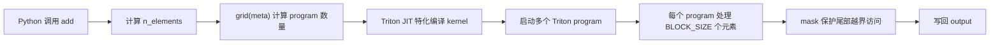
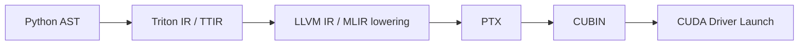

# Triton 基础概念

这篇笔记从一个向量加法 kernel 出发，整理 Triton 入门时最容易混淆的几个概念：

- **Triton program**：对应 CUDA 里的 block / CTA，而不是单个 thread。
- **`tl.tensor`**：表示寄存器中的一组标量值，而不是显存里的 Tensor 对象。
- **`tl.constexpr`**：表示编译期元参数，接近 C++ 模板参数。
- **`tl.load` / `tl.store`**：用 mask 和指针张量表达向量化访存。
- **launch grid**：用 Python 侧的 grid 函数决定启动多少个 program。

Triton 的核心思想是：**把 thread-level 的显式控制隐藏起来，让开发者用 block-level 的向量操作描述 GPU kernel**。这对写深度学习算子很友好，因为大多数算子天然就是 tile、vector、matrix 的计算。

## 环境与安装

Triton 主要面向 Linux + NVIDIA GPU 环境。实际可用的 GPU 架构、CUDA 版本和 PyTorch 版本需要以当前 Triton 版本的官方说明为准。一般可以通过 pip 安装：

```shell
pip install triton
```

安装后通常会配合 PyTorch 使用：

```python
import torch
import triton
import triton.language as tl
```

## 一个最小向量加法示例

下面是 Triton 官方入门里常见的向量加法结构。它的功能很简单：给定两个 CUDA Tensor `x` 和 `y`，计算 `output = x + y`。

```python
import torch
import triton
import triton.language as tl


@triton.jit
def add_kernel(
    x_ptr,
    y_ptr,
    output_ptr,
    n_elements,
    BLOCK_SIZE: tl.constexpr,
):
    pid = tl.program_id(axis=0)
    block_start = pid * BLOCK_SIZE
    offsets = block_start + tl.arange(0, BLOCK_SIZE)
    mask = offsets < n_elements

    x = tl.load(x_ptr + offsets, mask=mask)
    y = tl.load(y_ptr + offsets, mask=mask)
    output = x + y

    tl.store(output_ptr + offsets, output, mask=mask)


def add(x: torch.Tensor, y: torch.Tensor) -> torch.Tensor:
    output = torch.empty_like(x)
    assert x.is_cuda and y.is_cuda and output.is_cuda

    n_elements = output.numel()
    grid = lambda meta: (triton.cdiv(n_elements, meta["BLOCK_SIZE"]),)
    add_kernel[grid](x, y, output, n_elements, BLOCK_SIZE=1024)
    return output
```

这个 kernel 的执行模型可以概括为：



这里最重要的是：`add_kernel` 不是由 Python 解释器逐行执行的普通函数。被 `@triton.jit` 装饰后，它会被 Triton 编译成 GPU kernel，并通过 `add_kernel[grid](...)` 发射到 GPU 上运行。

## Triton 与 CUDA 的概念对应

| Triton 概念 | CUDA C++ 类比 | 说明 |
|---|---|---|
| `@triton.jit` | `__global__` kernel + 编译器前端 | 把 Python 函数编译成 GPU kernel。 |
| `tl.program_id(0)` | `blockIdx.x` | 获取当前 program 在 grid 第 0 维的编号。 |
| `tl.num_programs(0)` | `gridDim.x` | 获取 grid 第 0 维的 program 总数。 |
| `BLOCK_SIZE: tl.constexpr` | `template <int BLOCK_SIZE>` | 编译期常量，用于生成特化版本。 |
| `tl.arange(0, BLOCK_SIZE)` | block 内局部向量索引 | 生成寄存器中的连续索引向量。 |
| `x_ptr + offsets` | 一组待访问地址 | 产生指针张量，而不是立即访存。 |
| `tl.load(...)` | coalesced load | 按指针张量加载一组值到寄存器。 |
| `tl.store(...)` | coalesced store | 把寄存器中的一组值写回显存。 |

一个粗略但有用的理解是：

- CUDA 里你经常手写 `blockIdx.x`、`threadIdx.x`，再让每个 thread 处理一个或多个元素。
- Triton 里你只显式写 `tl.program_id`，然后用 `tl.arange` 构造当前 program 内部的一组元素索引。
- Triton 编译器负责把这些向量操作映射到具体线程、warp、寄存器和访存指令。

## `@triton.jit`

**Purpose:** 把 Python 函数标记为 Triton GPU kernel，并在调用时触发 JIT 编译、缓存和发射。

**Signature:**

```python
@triton.jit
def kernel(...):
    ...
```

或：

```python
triton.jit(
    fn=None,
    *,
    version=None,
    repr=None,
    launch_metadata=None,
    do_not_specialize=None,
    do_not_specialize_on_alignment=None,
    debug=None,
    noinline=None,
)
```

**接口要点：**

| 参数 | 含义 |
|---|---|
| `fn` | 要被 JIT 编译的 Python 函数。通常通过装饰器语法隐式传入。 |
| `do_not_specialize` | 控制哪些参数不参与特化编译。适合减少编译版本数量。 |
| `debug` | 打开调试相关行为。具体输出和行为依赖 Triton 版本。 |
| `noinline` | 提示编译器不要内联该函数。 |

**约束：**

- 被 `@triton.jit` 装饰的函数运行在 GPU 语义下，不能随意调用普通 Python 库。
- kernel 内部应主要使用 `triton.language` 中的原语，例如 `tl.load`、`tl.store`、`tl.arange`、`tl.dot`。
- 传入的 `torch.Tensor` 在 kernel 参数中会被视为指向其首元素的指针。
- 标注为 `tl.constexpr` 的参数会进入编译期特化逻辑，而不是普通运行时参数。

**编译链路：**



这个过程更接近“Python 作为 GPU 编译器前端”，而不是“Python 解释执行 GPU 代码”。

### 为什么 JIT 很重要

`@triton.jit` 的一个核心价值是**特化编译**。例如同一个 kernel 用不同的 `BLOCK_SIZE` 调用时，Triton 可以生成不同的二进制版本：

```python
add_kernel[grid](x, y, output, n_elements, BLOCK_SIZE=256)
add_kernel[grid](x, y, output, n_elements, BLOCK_SIZE=1024)
```

从 CUDA C++ 视角看，它有点像：

```cpp
template <typename T, int BLOCK_SIZE>
__global__ void add_kernel(const T* x, const T* y, T* out, int n_elements);
```

区别是 CUDA C++ 通常是提前编译，Triton 则是在 Python 调用现场按参数进行 JIT 编译和缓存。

## `tl.tensor`

**Purpose:** 表示 Triton kernel 内部的一组标量值，通常位于寄存器中，并参与向量化计算。

`tl.tensor` 很容易被误解。它不是 PyTorch 的 `torch.Tensor`，也不是显存中的一个对象。更准确地说，它是 Triton 编译器看到的一组 SSA 值或寄存器值。

例如：

```python
offsets = block_start + tl.arange(0, BLOCK_SIZE)
x = tl.load(x_ptr + offsets, mask=mask)
y = tl.load(y_ptr + offsets, mask=mask)
output = x + y
```

这里的 `offsets`、`x`、`y`、`output` 都可以理解为 `tl.tensor`。它们表示当前 program 内部的一组元素，而不是 Python 层的数组。

| 特性 | 含义 |
|---|---|
| block-based | 一个 `tl.tensor` 通常表示一个 tile 或 vector，而不是单个 scalar。 |
| implicitly parallel | `x + y` 会作用于整个向量块，不需要显式写 per-thread 循环。 |
| addressless value | `tl.load` 之后得到的是值，不再是显存地址。 |
| static shape | 形状通常由 `tl.constexpr` 决定，编译期已知。 |
| supports broadcasting | 支持类似 NumPy 的广播语义，常用于矩阵 tile、bias、mask 等场景。 |

### 和指针的区别

```python
ptrs = x_ptr + offsets
x = tl.load(ptrs, mask=mask)
```

这两行语义不同：

- `ptrs` 是**指针张量**，每个元素都是一个地址。
- `x` 是**值张量**，每个元素是从对应地址加载出来的数据。

写 Triton 时要反复区分：**指针表达的是在哪里读写，`tl.tensor` 值表达的是已经读到寄存器里的数据**。

## `tl.constexpr`

**Purpose:** 标记编译期元参数，使 Triton 在 JIT 阶段知道该值，并据此生成特化 kernel。

**Example:**

```python
@triton.jit
def add_kernel(x_ptr, y_ptr, output_ptr, n_elements, BLOCK_SIZE: tl.constexpr):
    offsets = tl.arange(0, BLOCK_SIZE)
```

`BLOCK_SIZE` 不只是一个普通整数。它决定了 `tl.arange(0, BLOCK_SIZE)` 的 shape，也会影响寄存器分配、循环展开、访存指令形态和编译缓存键。

| 角度 | `tl.constexpr` 的作用 |
|---|---|
| 编译期求值 | JIT 编译时值已知，可以生成特化二进制。 |
| 静态 shape | `tl.tensor` 的形状依赖它，编译器需要提前知道。 |
| 死代码消除 | `if BLOCK_SIZE > 512` 这类分支可在编译期消除。 |
| 性能调优 | autotune 可以枚举多个 constexpr 组合，选择最快配置。 |

从 C++ CUDA 视角看：

```python
BLOCK_SIZE: tl.constexpr
```

接近：

```cpp
template <int BLOCK_SIZE>
__global__ void kernel(...);
```

### `BLOCK_SIZE` 表示什么

在向量加法示例里，`BLOCK_SIZE` 表示**每个 Triton program 一次处理多少个元素**。

```python
pid = tl.program_id(0)
block_start = pid * BLOCK_SIZE
offsets = block_start + tl.arange(0, BLOCK_SIZE)
```

所以第 `pid` 个 program 覆盖的逻辑范围是：

$$
[pid \times BLOCK\_SIZE,\ (pid + 1) \times BLOCK\_SIZE)
$$

如果 `n_elements` 不能被 `BLOCK_SIZE` 整除，最后一个 program 会覆盖到越界位置，因此需要：

```python
mask = offsets < n_elements
```

从硬件映射角度看，`BLOCK_SIZE` 不是 CUDA blockDim。Triton 还会结合 `num_warps` 等参数决定实际使用多少 warp。一个常见的概念估算是：

$$
threads = num\_warps \times 32
$$

$$
elements\_per\_thread \approx \frac{BLOCK\_SIZE}{threads}
$$

这只是理解负载分配的近似模型，实际映射由 Triton 编译器和后端决定。

## `tl.program_id`

**Purpose:** 返回当前 Triton program 在 launch grid 某个维度上的编号。

**Signature:**

```python
tl.program_id(axis) -> tl.tensor
```

**Parameters:**

| Name | Type | Meaning |
|---|---|---|
| `axis` | `int` | grid 维度，通常为 `0`、`1` 或 `2`。 |

**Returns:**

| Type | Meaning |
|---|---|
| scalar `tl.tensor` | 当前 program 在该维度上的 id。 |

**CUDA 类比：**

| Triton | CUDA C++ |
|---|---|
| `tl.program_id(0)` | `blockIdx.x` |
| `tl.program_id(1)` | `blockIdx.y` |
| `tl.program_id(2)` | `blockIdx.z` |
| `tl.num_programs(0)` | `gridDim.x` |

在向量加法里，每个 program 处理一段连续元素：

```python
pid = tl.program_id(0)
block_start = pid * BLOCK_SIZE
offsets = block_start + tl.arange(0, BLOCK_SIZE)
```

这相当于用 `pid` 选择当前 program 的 tile 起点。

## `tl.arange`

**Purpose:** 在当前 program 内生成一个连续整数向量，通常用来构造局部 offset。

**Signature:**

```python
tl.arange(start, end) -> tl.tensor
```

**Parameters:**

| Name | Type | Meaning |
|---|---|---|
| `start` | compile-time integer | 起始值，闭区间。常见写法是 `0`。 |
| `end` | compile-time integer | 结束值，开区间。常见写法是 `BLOCK_SIZE`。 |

**Returns:**

| Type | Meaning |
|---|---|
| 1D `tl.tensor` | 包含 `[start, end)` 的连续整数，shape 为 `(end - start,)`。 |

最常见的用法是生成当前 tile 内的局部下标：

```python
offsets = block_start + tl.arange(0, BLOCK_SIZE)
```

如果 `pid = 3`，`BLOCK_SIZE = 1024`，那么当前 program 的 `offsets` 就表示全局元素下标：

$$
[3072,\ 4096)
$$

这些下标随后会参与指针计算：

```python
ptrs = x_ptr + offsets
```

这会得到一个指针张量，表示当前 program 要读取的一组地址。

## `tl.load`

**Purpose:** 从显存或 block pointer 指定的位置加载数据，返回寄存器中的 `tl.tensor` 值。

**Signature:**

```python
tl.load(
    pointer,
    mask=None,
    other=None,
    boundary_check=(),
    padding_option="",
    cache_modifier="",
    eviction_policy="",
    volatile=False,
) -> tl.tensor
```

**Parameters:**

| Name | Type | Meaning |
|---|---|---|
| `pointer` | pointer or tensor of pointers | 要读取的地址。可以是单个指针、指针张量，也可以是 block pointer。 |
| `mask` | `tl.tensor` or scalar bool | 保护性掩码。`False` 的位置不会真正访存。 |
| `other` | scalar or `tl.tensor` | `mask=False` 时返回的填充值。常见值有 `0.0` 或 `-float("inf")`。 |
| `boundary_check` | tuple of ints | block pointer 模式下指定哪些维度做边界检查。 |
| `padding_option` | `""`, `"zero"`, `"nan"` | block pointer 越界时的填充策略。 |
| `cache_modifier` | string | NVIDIA PTX 缓存修饰符，例如 `".ca"`、`".cg"`、`".cv"`。 |
| `eviction_policy` | string | 缓存逐出策略，例如 `"evict_first"`、`"evict_last"`。 |
| `volatile` | bool | 是否使用 volatile 语义。 |

**Returns:**

| Type | Meaning |
|---|---|
| `tl.tensor` | 从 `pointer` 对应位置加载出的值。shape 通常与 `pointer` 张量一致。 |

### 三种加载模式

| 模式 | `pointer` 形态 | 用途 |
|---|---|---|
| 标量加载 | 单个指针 | 读取一个配置值或一个标量。 |
| 指针张量加载 | N 维指针张量 | 最常见。配合 `tl.arange` 加载一个 vector / tile。 |
| block pointer 加载 | `tl.make_block_ptr` 生成的 block pointer | 更高级的矩阵 tile 访存形式，可配合边界检查。 |

向量加法使用的是指针张量加载：

```python
x = tl.load(x_ptr + offsets, mask=mask)
```

这里 `x_ptr + offsets` 是一组地址。`mask` 的作用不是“加载后再过滤”，而是**阻止越界位置真正访问内存**。

## `tl.store`

**Purpose:** 把 `tl.tensor` 中的值写回显存或 block pointer 指定的位置。

**Signature:**

```python
tl.store(
    pointer,
    value,
    mask=None,
    boundary_check=(),
    cache_modifier="",
    eviction_policy="",
) -> None
```

**Parameters:**

| Name | Type | Meaning |
|---|---|---|
| `pointer` | pointer or tensor of pointers | 写入目标地址。可以是单个指针、指针张量或 block pointer。 |
| `value` | scalar or `tl.tensor` | 要写回的值，会按目标元素类型做必要转换。 |
| `mask` | `tl.tensor` or scalar bool | `False` 的位置不会写入。 |
| `boundary_check` | tuple of ints | block pointer 模式下指定哪些维度做边界检查。 |
| `cache_modifier` | string | NVIDIA PTX 写缓存修饰符，例如 `".wb"`、`".cg"`、`".cs"`、`".wt"`。 |
| `eviction_policy` | string | 缓存逐出策略，例如 `"evict_first"`、`"evict_last"`。 |

**Side Effects / Constraints:**

- 会修改 `pointer` 指向的显存。
- `mask=False` 的位置不会写入，常用于尾部边界保护。
- `tl.store` 本身不是原子操作。如果多个 program 写同一地址，需要使用 `tl.atomic_add` 等原子接口。
- `value` 会转换为目标指针元素类型，例如把 `fp32` 累加结果写入 `fp16` 输出时会发生精度截断。

向量加法中的写回是：

```python
tl.store(output_ptr + offsets, output, mask=mask)
```

如果 `offsets` 是连续的，硬件通常能生成更友好的合并写入。

## Launch Grid 与 `meta`

Triton kernel 的启动写法和 CUDA C++ 不同：

```python
grid = lambda meta: (triton.cdiv(n_elements, meta["BLOCK_SIZE"]),)
add_kernel[grid](x, y, output, n_elements, BLOCK_SIZE=1024)
```

这里有两个关键点：

- `grid` 可以是一个函数，Triton 会在发射 kernel 前调用它。
- `meta` 是 Triton 收集到的元参数字典，里面包含 `BLOCK_SIZE` 这类编译期参数。

对于向量加法，需要启动的 program 数量是：

$$
num\_programs = \left\lceil \frac{n\_elements}{BLOCK\_SIZE} \right\rceil
$$

所以 grid 函数写成：

```python
grid = lambda meta: (triton.cdiv(n_elements, meta["BLOCK_SIZE"]),)
```

其中 `n_elements` 来自 Python 闭包，`BLOCK_SIZE` 来自 Triton 的 `meta` 字典。

### 为什么返回 `(value,)`

Triton 的 grid 对应 CUDA 里的 `dim3`。即使是一维 grid，也要返回一个元组：

```python
(num_programs,)
```

二维矩阵 kernel 常见写法会变成：

```python
grid = lambda meta: (
    triton.cdiv(M, meta["BLOCK_SIZE_M"]),
    triton.cdiv(N, meta["BLOCK_SIZE_N"]),
)
```

这时 kernel 内部通常会使用：

```python
pid_m = tl.program_id(0)
pid_n = tl.program_id(1)
```

## 向量加法的逐步语义

把 `add_kernel` 拆成接口语义，可以看到每一步都在回答一个固定问题：

| 代码 | 问题 | 含义 |
|---|---|---|
| `pid = tl.program_id(0)` | 我是第几个 program？ | 获取当前 program 的全局编号。 |
| `block_start = pid * BLOCK_SIZE` | 我从哪里开始处理？ | 计算当前 program 覆盖的起始元素下标。 |
| `tl.arange(0, BLOCK_SIZE)` | 我内部有哪些局部 lane？ | 生成当前 tile 内的局部偏移。 |
| `offsets = block_start + ...` | 我要访问哪些全局元素？ | 得到当前 program 的全局元素下标。 |
| `mask = offsets < n_elements` | 哪些元素是有效的？ | 保护最后一个 tile 的越界位置。 |
| `tl.load(x_ptr + offsets, mask=mask)` | 从哪里读？ | 从一组地址加载值到寄存器。 |
| `output = x + y` | 做什么计算？ | 对整个 `tl.tensor` 做逐元素加法。 |
| `tl.store(..., mask=mask)` | 写回哪里？ | 把结果写回对应输出地址。 |

这种写法的关键不是“省略了 threadIdx”，而是把编程粒度提升到了 **program 内部的向量块**。

## 常见误区

- **误区：`tl.tensor` 等于 `torch.Tensor`。**  
  `torch.Tensor` 是 Python 侧对象，拥有 shape、dtype、device、storage 等运行时信息；`tl.tensor` 是 kernel 内部的编译器值，通常表示寄存器中的一个 vector / tile。

- **误区：`BLOCK_SIZE` 等于 CUDA blockDim。**  
  `BLOCK_SIZE` 表示一个 Triton program 处理的元素数量。实际线程数还和 `num_warps`、编译器映射、后端策略有关。

- **误区：`mask` 只是结果过滤。**  
  对 `tl.load` 和 `tl.store` 来说，`mask` 是边界安全机制。`mask=False` 的位置不会发生对应的读写。

- **误区：Triton kernel 里可以写任意 Python。**  
  JIT 函数内部只支持 Triton 能编译到 GPU 的语义。普通 Python 容器、CPU 库调用、动态对象操作都不适合放在 kernel 内部。

## 小结

从 CUDA 视角理解 Triton，可以先抓住这条主线：

- **一个 Triton program 近似对应一个 CUDA block / CTA。**
- **`tl.arange` 生成当前 program 内部的局部向量索引。**
- **`tl.load` 把指针张量对应的数据加载到寄存器值张量。**
- **算术表达式作用在整个 `tl.tensor` 上，由编译器映射到底层线程。**
- **`tl.constexpr` 决定编译期 shape 和特化版本，是性能调优的关键入口。**
- **launch grid 决定启动多少个 program，`meta` 负责把编译期参数传给 grid 函数。**

理解这些概念之后，再看矩阵乘、block pointer、`tl.dot`、autotune 和 grouped GEMM，会更容易把代码里的 tile 坐标、访存形状和编译期参数对应起来。
