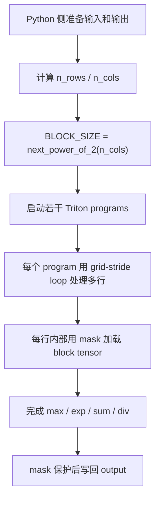

# Triton Fused Softmax

这篇笔记围绕 Triton 官方教程里的 fused softmax 展开。它真正想说明的不是 softmax 公式本身，而是一个 GPU kernel 里的 program、block tensor、mask、归约和 persistent loop 是怎么配合起来的。

本文主要整理这些问题：

- 为什么普通 PyTorch 写法会产生多次中间结果读写。
- Triton fused softmax kernel 的参数、返回值和约束是什么。
- `triton.language.range`、`triton.language.max`、`triton.language.sum`、`triton.language.exp` 这些接口在 kernel 里分别承担什么角色。
- host 端为什么会用 `warmup` 读取资源占用，以及这些资源信息如何影响 persistent kernel 的启动规模。
- `triton.runtime.driver.active`、`DriverConfig`、`CompiledKernel` 这些运行时对象在这里到底参与了什么。

## 从普通 Softmax 到 Fused Softmax

先看一个直接用 PyTorch 写的版本：

```python
import torch


def naive_softmax(x: torch.Tensor) -> torch.Tensor:
    # x 的形状是 (M, N)，这里沿着 dim=1 计算每一行的最大值。
    # torch.max(dim=1) 会返回 values 和 indices，[0] 只取最大值本身。
    x_max = x.max(dim=1)[0]

    # x 是 (M, N)，x_max 是 (M,)。
    # 这里需要把 x_max 扩展成 (M, 1)，才能按行广播到每一列。
    z = x - x_max[:, None]

    # 分子是 exp(x - max(x))。
    numerator = torch.exp(z)

    # 分母是每一行的 exp 求和，形状是 (M,)。
    denominator = numerator.sum(dim=1)

    # denominator[:, None] 变成 (M, 1)，再广播到 (M, N)。
    return numerator / denominator[:, None]
```

这个写法很直观，但它会把 `x_max`、`z`、`numerator`、`denominator` 等中间结果写回显存。对 GPU 来说，softmax 的计算量并不大，真正贵的是反复读写 DRAM。

fused softmax 的目标是：一行数据读入之后，在同一个 Triton program 内完成 `max -> exp -> sum -> div`，最后只把结果写回一次。这样可以减少中间张量落到显存的次数。

## Kernel 总体流程



这里的关键点是 persistent kernel：外部不一定启动 `n_rows` 个 program，而是启动一批 program，让每个 program 在 kernel 内部通过 `tl.range(row_start, n_rows, row_step)` 跨步处理多行。

## `softmax_kernel`

**用途**

`softmax_kernel` 是实际运行在 GPU 上的 Triton kernel。它把输入矩阵的每一行看成一个 softmax 向量，一个 program 负责处理若干行，每一行的列方向计算在一个 block 向量里完成。

**原型**

```python
@triton.jit
def softmax_kernel(
    output_ptr,
    input_ptr,
    input_row_stride,
    output_row_stride,
    n_rows,
    n_cols,
    BLOCK_SIZE: tl.constexpr,
    num_stages: tl.constexpr,
):
    ...
```

**运行时参数**

| 参数 | 类型 | 含义 |
| --- | --- | --- |
| `output_ptr` | 指针 | 输出张量在 GPU 显存中的首地址。 |
| `input_ptr` | 指针 | 输入张量在 GPU 显存中的首地址。 |
| `input_row_stride` | 整数 | 输入张量相邻两行之间的元素跨度，不是字节数。 |
| `output_row_stride` | 整数 | 输出张量相邻两行之间的元素跨度，不是字节数。 |
| `n_rows` | 整数 | 输入矩阵行数。 |
| `n_cols` | 整数 | 输入矩阵列数，也是每一行 softmax 的真实长度。 |

**编译期参数**

| 参数 | 类型 | 含义 |
| --- | --- | --- |
| `BLOCK_SIZE` | `triton.language.constexpr` | 每个 program 一次处理的向量长度，通常取 `triton.next_power_of_2(n_cols)`。 |
| `num_stages` | `triton.language.constexpr` | 传给 `triton.language.range` 的软件流水线级数。 |

**返回值**

这个 kernel 没有 Python 层面的返回值。它通过 `triton.language.store` 把结果写入 `output_ptr` 指向的显存。

**副作用 / 约束**

- `input_ptr` 和 `output_ptr` 必须指向 GPU 上的张量存储。
- `BLOCK_SIZE` 必须大于等于 `n_cols`，通常还需要是 2 的幂，方便 `triton.language.arange` 生成静态长度向量。
- 当 `BLOCK_SIZE > n_cols` 时，尾部位置不是真实列，需要用 `mask = col_offsets < n_cols` 保护 `load` 和 `store`。
- `triton.language.exp` 是快速近似指数函数，性能更好，但它不是严格数学库精度。
- 这个实现默认按行做 softmax，因此传入的 stride 必须能正确描述张量的行布局。

**代码**

```python
# 导入 PyTorch，通常用于准备输入张量和校验结果。
import torch

# 导入 Triton 顶层包，用来使用 @triton.jit 等接口。
import triton

# 导入 Triton language，并按常见习惯简写成 tl。
import triton.language as tl


# 用 @triton.jit 把 Python 函数标记成 Triton kernel。
@triton.jit
def softmax_kernel(
    # 输出张量首地址，kernel 最终把 softmax 结果写到这里。
    output_ptr,
    # 输入张量首地址，kernel 从这里读取原始数据。
    input_ptr,
    # 输入张量相邻两行之间的元素跨度，单位是元素个数，不是字节。
    input_row_stride,
    # 输出张量相邻两行之间的元素跨度，单位也是元素个数。
    output_row_stride,
    # 输入矩阵的行数，也就是一共有多少条 softmax 向量。
    n_rows,
    # 输入矩阵的列数，也就是每条 softmax 向量的真实长度。
    n_cols,
    # 编译期常量，表示每次加载的 block 向量长度。
    # 它通常是大于等于 n_cols 的最小 2 的幂。
    BLOCK_SIZE: tl.constexpr,
    # 编译期常量，传给 tl.range，用来控制循环的软件流水线级数。
    num_stages: tl.constexpr,
):
    # 读取当前 program 在 grid 第 0 维上的编号。
    # 如果 grid=(P, 1, 1)，那么 row_start 的范围就是 [0, P)。
    row_start = tl.program_id(0)

    # 读取 grid 第 0 维一共启动了多少个 program。
    # 这个值会作为跨行循环的步长。
    row_step = tl.num_programs(0)

    # 生成列偏移向量 [0, 1, 2, ..., BLOCK_SIZE - 1]。
    # 这是一个 Triton block tensor，不是普通 Python list。
    col_offsets = tl.arange(0, BLOCK_SIZE)

    # 标记哪些列是真实列。
    # 当 BLOCK_SIZE 大于 n_cols 时，尾部填充列必须被屏蔽掉。
    mask = col_offsets < n_cols

    # 当前 program 从 row_start 开始，每次增加 row_step。
    # 这样多个 program 可以交错处理所有行，形成 grid-stride loop。
    # num_stages 会提示编译器对循环做软件流水线优化。
    for row_idx in tl.range(row_start, n_rows, row_step, num_stages=num_stages):
        # 计算当前行在输入张量中的起始地址。
        # 指针加法按元素类型缩放，所以这里乘的是元素 stride。
        input_row_start = input_ptr + row_idx * input_row_stride

        # 得到当前行中每一列的地址。
        # input_ptrs 是一个 block 指针向量，长度为 BLOCK_SIZE。
        input_ptrs = input_row_start + col_offsets

        # 从显存加载当前行。
        # mask=False 的尾部位置不会真实读取显存，而是填成 -inf。
        # 填 -inf 是为了让这些位置不影响后面的最大值归约。
        row = tl.load(input_ptrs, mask=mask, other=-float("inf"))

        # 对当前行做最大值归约。
        # axis=0 表示沿这个一维 block tensor 的列方向归约。
        row_max = tl.max(row, axis=0)

        # 数值稳定写法：每个元素先减去本行最大值。
        # 这样可以避免 exp(x) 在 x 很大时溢出。
        row_minus_max = row - row_max

        # 对每个元素计算 exp(x - max)。
        # Triton 的 exp 通常是面向 GPU 的快速近似实现。
        numerator = tl.exp(row_minus_max)

        # 对分子做行内求和，得到 softmax 的分母。
        # 因为尾部填充位置来自 exp(-inf)，所以贡献为 0。
        denominator = tl.sum(numerator, axis=0)

        # 每个元素除以分母，得到当前行的 softmax 输出。
        softmax_output = numerator / denominator

        # 计算当前行在输出张量中的起始地址。
        output_row_start = output_ptr + row_idx * output_row_stride

        # 得到当前输出行中每一列的写入地址。
        output_ptrs = output_row_start + col_offsets

        # 把 softmax 结果写回显存。
        # mask=False 的尾部填充位置不会被写入，避免越界。
        tl.store(output_ptrs, softmax_output, mask=mask)
```

## 为什么这里是 Persistent Kernel

普通写法可能会直接启动 `grid = (n_rows,)`，也就是一行对应一个 Triton program。

```python
softmax_kernel[(n_rows,)](...)
```

persistent kernel 的写法会先计算一个更小的 `num_programs`：

```python
num_programs = min(NUM_SM * occupancy, n_rows)
softmax_kernel[(num_programs, 1, 1)](...)
```

然后 kernel 内部通过下面两行形成 grid-stride loop：

```python
row_start = tl.program_id(0)
row_step = tl.num_programs(0)
```

例如 `num_programs = 108`，那么：

- program 0 处理第 `0, 108, 216, ...` 行。
- program 1 处理第 `1, 109, 217, ...` 行。
- program 107 处理第 `107, 215, 323, ...` 行。

这样做的核心收益是减少调度压力。GPU 上同时驻留的 program 数量受寄存器、共享内存、warp 数量限制，外部只启动接近硬件可同时容纳的 program，再让它们持续处理后续行。

## 辅助函数：Persistent Kernel 启动配置

下面这段辅助函数展示了 Triton fused softmax 里非常经典的一层：**不是按数据规模直接启动 program，而是先估算硬件能同时容纳多少 program，再启动固定数量的 persistent programs**。

它承担的职责主要有四个：

- **选择 block 向量长度**：用 `triton.next_power_of_2(n_cols)` 把真实列数扩展到 Triton 更喜欢的 2 的幂。
- **选择编译参数**：例如 `num_warps` 和 `num_stages`。
- **预编译 kernel**：用 `warmup` 拿到 `n_regs` 和 `metadata.shared`，估算每个 program 的资源占用。
- **计算启动规模**：根据 SM 数量、寄存器、共享内存和 warp size 计算 `num_programs`。

```python
# 当前 Triton active driver 对应的 PyTorch device。
DEVICE = triton.runtime.driver.active.get_active_torch_device()


def is_hip() -> bool:
    # 判断当前后端是不是 HIP，也就是 AMD GPU 路线。
    return triton.runtime.driver.active.get_current_target().backend == "hip"


def is_cdna() -> bool:
    # CDNA 是 AMD 面向数据中心的 GPU 架构族。
    # 这里单独判断，是因为 CDNA 上通用寄存器数量的解释和普通路径不完全一样。
    target = triton.runtime.driver.active.get_current_target()
    return is_hip() and target.arch in ("gfx940", "gfx941", "gfx942", "gfx90a", "gfx908")


# 读取当前 GPU 的硬件属性。
# 这些字段来自 Triton CUDA/HIP driver 的 get_device_properties。
properties = triton.runtime.driver.active.utils.get_device_properties(DEVICE.index)

# GPU 上 SM / CU 的数量，用来估算全设备最多铺多少个 persistent programs。
NUM_SM = properties["multiprocessor_count"]

# 每个 block 可用的最大寄存器数量，是 occupancy 计算的核心约束之一。
NUM_REGS = properties["max_num_regs"]

# 每个 block 可用的最大 shared memory，也是 occupancy 计算的核心约束之一。
SIZE_SMEM = properties["max_shared_mem"]

# 一个 warp / wavefront 中有多少线程。
WARP_SIZE = properties["warpSize"]

# 当前编译目标，例如 cuda sm_80、sm_89，或者 hip gfx90a。
target = triton.runtime.driver.active.get_current_target()

# 可以用来缓存不同 shape / dtype / meta 参数下的 compiled kernel。
# 这个示例里没有继续展开使用。
kernels = {}


def softmax(x: torch.Tensor) -> torch.Tensor:
    # 输入是二维矩阵，每一行做一次 softmax。
    n_rows, n_cols = x.shape

    # Triton 的 block 向量长度通常取不小于 n_cols 的最小 2 的幂。
    # 例如 n_cols=781 时，BLOCK_SIZE 会变成 1024。
    BLOCK_SIZE = triton.next_power_of_2(n_cols)

    # 每一行分给多少个 warp。
    # 这里先写成经验值 8，真正工程化时可以交给 triton.autotune 搜索。
    num_warps = 8

    # 软件流水线级数。
    # shared memory 更充足时，可以尝试更深的 pipeline。
    num_stages = 4 if SIZE_SMEM > 200000 else 2

    # 分配输出张量。kernel 只负责写入 y，不负责创建 y。
    y = torch.empty_like(x)

    # warmup 是“只编译，不发射”。
    # 这里的目的不是热身测速，而是拿到编译后 kernel 的资源占用。
    kernel = softmax_kernel.warmup(
        y,
        x,
        x.stride(0),
        y.stride(0),
        n_rows,
        n_cols,
        BLOCK_SIZE=BLOCK_SIZE,
        num_stages=num_stages,
        num_warps=num_warps,
        grid=(1,),
    )

    # 初始化底层 driver 句柄。
    # 这一步之后才能读取 n_regs 等由 driver 返回的资源信息。
    kernel._init_handles()

    # 每个线程使用多少个寄存器。
    n_regs = kernel.n_regs

    # kernel 静态使用多少 shared memory。
    size_smem = kernel.metadata.shared

    if is_hip():
        # AMD CDNA 上 VGPR 有 regular VGPR 和 accumulation VGPR 两类池子。
        # Triton 示例里对 CDNA 做了一个更宽松的 NUM_GPRS 估算。
        NUM_GPRS = NUM_REGS * 2 if is_cdna() else NUM_REGS

        # 每个 SM/CU 最多同时驻留多少线程。
        MAX_NUM_THREADS = properties["max_threads_per_sm"]

        # 换算成最多能驻留多少个 wave。
        max_num_waves = MAX_NUM_THREADS // WARP_SIZE

        # 同时考虑寄存器约束和最大 wave 数约束，再除以每个 program 使用的 num_warps。
        occupancy = min(NUM_GPRS // WARP_SIZE // n_regs, max_num_waves) // num_warps
    else:
        # CUDA 路径下，用寄存器总量估算每个 SM 能驻留多少个 program。
        # n_regs * WARP_SIZE * num_warps 是一个 program 大致消耗的寄存器规模。
        occupancy = NUM_REGS // (n_regs * WARP_SIZE * num_warps)

    # shared memory 也会限制每个 SM 上能同时驻留多少个 program。
    occupancy = min(occupancy, SIZE_SMEM // size_smem)

    # 全设备 program 数 = SM 数量 * 每个 SM 可驻留 program 数。
    num_programs = NUM_SM * occupancy

    # program 数不需要超过行数，否则会有 program 没活干。
    num_programs = min(num_programs, n_rows)

    # 启动 persistent programs。
    # 每个 program 在 softmax_kernel 内部用 row_step = tl.num_programs(0) 跨行处理。
    kernel[(num_programs, 1, 1)](
        y,
        x,
        x.stride(0),
        y.stride(0),
        n_rows,
        n_cols,
        BLOCK_SIZE,
        num_stages,
    )

    return y
```

这段代码的重点不是 `softmax` 这个函数名，而是 **启动策略**：

- 普通启动方式倾向于让 `grid` 跟数据规模直接绑定，例如一行一个 program。
- persistent 启动方式先看硬件资源，估算当前 GPU 同时能容纳多少 program，再让这些 program 在 kernel 内部循环处理多行。
- `warmup` 在这里很关键，因为 `n_regs` 和 `metadata.shared` 只有在 kernel 编译后才知道；没有这两个值，就没法比较准确地估算 occupancy。

## `triton.language.num_programs`

**用途**

`triton.language.num_programs(axis)` 返回 launch grid 在某个维度上启动的 program 数量。它可以类比 CUDA 里的 `gridDim.x / gridDim.y / gridDim.z`。

**原型**

```python
def num_programs(axis, _semantic=None):
    ...
```

**参数**

| 参数 | 类型 | 含义 |
| --- | --- | --- |
| `axis` | `int` | grid 维度，只能是 `0`、`1` 或 `2`。 |
| `_semantic` | 内部参数 | Triton 编译器注入的语义对象，用户代码不用传。 |

**返回值**

| 类型 | 含义 |
| --- | --- |
| `triton.language.tensor` 或标量表达式 | 指定 grid 维度上的 program 总数。 |

**使用场景**

在 fused softmax 中，`tl.num_programs(0)` 用来得到第 0 维 program 总数，并作为每个 program 跨行循环的步长。

```python
row_step = tl.num_programs(0)
```

## `triton.language.range`

**用途**

`triton.language.range` 是只能在 `@triton.jit` 函数里使用的特殊迭代器。它看起来像 Python 的 `range`，但额外携带了编译器优化信息，比如软件流水线级数、循环展开、warp specialization 等。

**原型**

```python
class range:
    def __init__(
        self,
        arg1,
        arg2=None,
        step=None,
        num_stages=None,
        loop_unroll_factor=None,
        disallow_acc_multi_buffer=False,
        flatten=False,
        warp_specialize=False,
        disable_licm=False,
    ):
        ...
```

**构造参数 / 成员变量**

| 参数 / 成员 | 默认值 | 含义 |
| --- | --- | --- |
| `arg1` | 必填 | 如果只传一个参数，它表示 `end`；如果传两个参数，它表示 `start`。 |
| `arg2` | `None` | 循环终止值，不包含该值。 |
| `step` | `1` | 循环步长。 |
| `num_stages` | `None` | 尝试把循环流水线化为多少级。fused softmax 用它隐藏多行处理时的访存延迟。 |
| `loop_unroll_factor` | `None` | 指示 Triton IR 层循环展开的倍数，小于 2 通常表示不展开。 |
| `disallow_acc_multi_buffer` | `False` | 禁止 `dot` 累加器多缓冲，常用于寄存器压力过高的场景。 |
| `flatten` | `False` | 尝试把嵌套循环打平成一个循环，方便流水线优化。 |
| `warp_specialize` | `False` | 启用 warp specialization，让部分 warp 更偏向搬运，部分 warp 更偏向计算。主要面向较新的架构和特定循环形态。 |
| `disable_licm` | `False` | 禁止循环不变式外提，避免某些场景下寄存器生命周期过长。 |

**重要接口**

| 接口 | 含义 |
| --- | --- |
| `__iter__()` | 只允许在 `@triton.jit` 编译语义下被处理；普通 Python 侧调用会报错。 |
| `__next__()` | 同上，不能把它当普通 Python 迭代器在 host 侧执行。 |

**使用场景**

```python
for row_idx in tl.range(row_start, n_rows, row_step, num_stages=num_stages):
    ...
```

这行代码同时表达两层含义：

- 逻辑含义：当前 program 按 `row_step` 跨步处理多行。
- 编译含义：允许编译器根据 `num_stages` 对循环里的 load/compute 做软件流水线优化。

## `triton.language.max`

**用途**

`triton.language.max` 对 block tensor 做最大值归约。在 fused softmax 中，它用来得到当前行的最大值，从而做数值稳定的 softmax。

**原型**

```python
def max(
    input,
    axis=None,
    return_indices=False,
    return_indices_tie_break_left=True,
    keep_dims=False,
):
    ...
```

**参数**

| 参数 | 类型 | 含义 |
| --- | --- | --- |
| `input` | block tensor | 被归约的输入。 |
| `axis` | `int`、`tuple` 或 `None` | 沿哪个维度归约。fused softmax 中 `row` 是一维 block tensor，所以用 `axis=0`。 |
| `return_indices` | `bool` | 是否同时返回最大值所在下标。 |
| `return_indices_tie_break_left` | `bool` | 当多个位置最大值相同，并且需要返回下标时，是否返回更左侧的下标。 |
| `keep_dims` | `bool` | 是否保留被归约维度。 |

**返回值**

| 情况 | 返回值 |
| --- | --- |
| `return_indices=False` | 最大值。 |
| `return_indices=True` | 最大值和最大值下标。 |

**使用场景**

```python
row_minus_max = row - tl.max(row, axis=0)
```

这里 `tl.max(row, axis=0)` 会得到当前行所有列的最大值。尾部 mask 对应的位置在 `load` 时填成 `-inf`，所以不会影响最大值。

## `triton.language.sum`

**用途**

`triton.language.sum` 对 block tensor 做求和归约。在 fused softmax 中，它用来计算 softmax 分母。

**原型**

```python
def sum(input, axis=None, keep_dims=False, dtype: core.constexpr = None):
    ...
```

**参数**

| 参数 | 类型 | 含义 |
| --- | --- | --- |
| `input` | block tensor | 被求和的输入。 |
| `axis` | `int`、`tuple` 或 `None` | 沿哪个维度求和。 |
| `keep_dims` | `bool` | 是否保留被归约维度。 |
| `dtype` | `triton.language.constexpr` 或 `None` | 指定归约输出类型。整数小位宽输入在源码里会自动选择更安全的默认累加类型。 |

**返回值**

返回指定维度上的累加结果。

**使用场景**

```python
denominator = tl.sum(numerator, axis=0)
```

`numerator` 是当前行每一列的 `exp(x - max)`，沿 `axis=0` 求和后得到这一行的 softmax 分母。

## `triton.language.exp`

**用途**

`triton.language.exp` 是逐元素指数函数。在 fused softmax 中，它对 `row_minus_max` 的每个元素计算 `e^x`。

**原型**

```python
def exp(x, _semantic=None):
    ...
```

**参数**

| 参数 | 类型 | 含义 |
| --- | --- | --- |
| `x` | block tensor | 输入元素。源码装饰器要求常见路径是 `fp32` 或 `fp64`。 |
| `_semantic` | 内部参数 | Triton 编译器注入，用户不用传。 |

**返回值**

返回与 `x` 形状相同的 block tensor。

**注意点**

Triton 的 `exp` 通常走快速近似实现，适合 GPU kernel 里的高吞吐计算。对 softmax 来说，这通常是合理选择，因为整体性能主要受访存和归约影响。

## `triton.next_power_of_2`

**用途**

`triton.next_power_of_2(n)` 返回大于等于 `n` 的最小 2 的幂。fused softmax 用它把真实列数 `n_cols` 扩展成 Triton block 向量长度。

**原型**

```python
def next_power_of_2(n: int):
    ...
```

**参数 / 返回值**

| 项 | 类型 | 含义 |
| --- | --- | --- |
| `n` | `int` | 输入整数。 |
| 返回值 | `int` | 大于等于 `n` 的最小 2 的幂。 |

**使用场景**

```python
BLOCK_SIZE = triton.next_power_of_2(n_cols)
```

假设 `n_cols = 781`，那么 `BLOCK_SIZE = 1024`。多出来的列由 `mask` 保护，不会真实访问越界地址。

## `triton.runtime.DriverConfig`

**用途**

`DriverConfig` 是 Triton 运行时的后端驱动管理器。它负责惰性创建默认 driver，并提供当前正在使用的 active driver。

在 fused softmax 中，我们通过它拿到当前设备、当前 target、设备属性和 CUDA stream。

**原型**

```python
class DriverConfig:
    def __init__(self) -> None:
        self._default: DriverBase | None = None
        self._active: DriverBase | None = None

    @property
    def default(self) -> DriverBase:
        ...

    @property
    def active(self) -> DriverBase:
        ...

    def set_active(self, driver: DriverBase) -> None:
        ...

    def reset_active(self) -> None:
        ...
```

**构造参数 / 成员变量**

| 成员 | 类型 | 含义 |
| --- | --- | --- |
| `_default` | `DriverBase | None` | 默认后端 driver，首次访问 `default` 时惰性创建。 |
| `_active` | `DriverBase | None` | 当前 active driver，首次访问 `active` 时默认等于 `default`。 |

**重要接口**

| 接口 | 返回值 | 含义 |
| --- | --- | --- |
| `default` | `DriverBase` | 返回默认 driver；如果尚未创建，会根据当前环境创建。 |
| `active` | `DriverBase` | 返回当前 active driver。 |
| `set_active(driver)` | `None` | 手动切换 active driver。 |
| `reset_active()` | `None` | 把 active driver 恢复成 default driver。 |

**使用场景**

```python
DEVICE = triton.runtime.driver.active.get_active_torch_device()
properties = triton.runtime.driver.active.utils.get_device_properties(DEVICE.index)
```

这两行说明：写 Triton kernel 时，很多硬件信息不是从 PyTorch tensor 上直接拿，而是通过 Triton 当前 active driver 访问。

## `DriverBase` 和 `GPUDriver`

**用途**

`DriverBase` 定义 Triton 后端 driver 必须提供的抽象接口。`GPUDriver` 是面向 GPU 后端的基础实现，它主要把 PyTorch 的 CUDA 设备和 stream 接口绑定给 Triton runtime 使用。

**`DriverBase` 重要接口**

| 接口 | 含义 |
| --- | --- |
| `is_active()` | 判断当前后端在本机环境里是否可用。 |
| `map_python_to_cpp_type(ty)` | 把 Triton 类型字符串映射到底层 C++ 类型。 |
| `get_current_target()` | 返回当前编译目标，例如 CUDA backend、架构号、warp size。 |
| `get_active_torch_device()` | 返回当前 PyTorch 设备对象。 |
| `get_benchmarker()` | 返回该后端默认的 benchmark 函数，autotune 会用到。 |

**`GPUDriver` 构造后绑定的成员**

| 成员 | 来源 | 含义 |
| --- | --- | --- |
| `get_device_capability` | `torch.cuda.get_device_capability` | 获取 GPU compute capability。 |
| `get_current_stream` | PyTorch CUDA stream 接口 | 获取当前 CUDA stream 的底层句柄。 |
| `get_current_device` | `torch.cuda.current_device` | 获取当前 device id。 |
| `set_current_device` | `torch.cuda.set_device` | 切换当前 CUDA device。 |

**使用场景**

`JITFunction.run` 发射 kernel 时会通过 active driver 获取当前 device 和 stream：

```python
device = driver.active.get_current_device()
stream = driver.active.get_current_stream(device)
```

所以 Triton kernel 默认会发射到当前 PyTorch CUDA stream 上。

## `CudaDriver` 和 `CudaUtils`

**用途**

`CudaDriver` 是 NVIDIA CUDA 后端 driver。它继承 `GPUDriver`，并额外持有 `CudaUtils`，用于调用更底层的 CUDA driver 功能。

**`CudaDriver` 重要接口**

| 接口 | 含义 |
| --- | --- |
| `get_current_target()` | 把 PyTorch 返回的 compute capability 转成 Triton 的 `GPUTarget("cuda", capability, 32)`。 |
| `get_active_torch_device()` | 返回 `torch.device("cuda", current_device)`。 |
| `get_device_interface()` | 返回 `torch.cuda`。 |
| `is_active()` | 判断当前环境是否有可用 CUDA，并且不是 HIP。 |
| `map_python_to_cpp_type(ty)` | 把 Triton 类型映射成 CUDA C++ 侧类型。 |
| `get_benchmarker()` | 返回 `triton.testing.do_bench`。 |
| `get_empty_cache_for_benchmark()` | 分配一块缓存清理 buffer，避免 benchmark 被 L2 缓存污染。 |
| `clear_cache(cache)` | 清零 benchmark cache buffer。 |

**`CudaUtils` 重要成员**

| 成员 | 含义 |
| --- | --- |
| `load_binary` | 加载 Triton 编译得到的 CUBIN，并返回 module、function、寄存器数量等信息。 |
| `get_device_properties` | 返回设备属性字典，例如 SM 数量、最大寄存器数、共享内存大小、warp size。 |
| `cuOccupancyMaxActiveClusters` | 查询 cluster 相关 occupancy，主要面向较新的 CUDA 架构能力。 |
| `set_printf_fifo_size` | 设置 device 侧 printf 缓冲区大小。 |
| `fill_tma_descriptor` | 填充 TMA 描述符，面向 Hopper 之后的 Tensor Memory Accelerator 功能。 |

**设备属性字段**

| 字段 | 含义 |
| --- | --- |
| `multiprocessor_count` | SM 数量，persistent kernel 用它估算全 GPU 同时可驻留的 program 数。 |
| `max_num_regs` | 每个 block 可用的最大寄存器数量，occupancy 计算会用到。 |
| `max_shared_mem` | 每个 block 可申请的最大共享内存字节数。 |
| `warpSize` | warp 大小，NVIDIA CUDA 后端通常是 32。 |
| `sm_clock_rate` | SM 主频。 |
| `mem_clock_rate` | 显存频率。 |
| `mem_bus_width` | 显存总线位宽。 |

## `JITFunction.warmup`

**用途**

`warmup` 是一次“只编译、不发射”的调用。它会走 `JITFunction.run(..., warmup=True)`，返回编译后的 kernel 对象，让 host 端读取资源占用。

**原型**

```python
def warmup(self, *args, grid, **kwargs):
    return self.run(grid=grid, warmup=True, *map(MockTensor.wrap_dtype, args), **kwargs)
```

**参数**

| 参数 | 类型 | 含义 |
| --- | --- | --- |
| `*args` | 任意 | 传给 kernel 的普通运行时参数。warmup 会把 tensor 参数包装成只保留 dtype 等信息的 mock tensor。 |
| `grid` | `tuple` 或 callable | 编译时仍需要知道的 launch grid 形式。 |
| `**kwargs` | 任意 | 传给 kernel 的 meta 参数和编译选项，例如 `BLOCK_SIZE`、`num_warps`、`num_stages`。 |

**返回值**

| 类型 | 含义 |
| --- | --- |
| `CompiledKernel | None` | 编译成功时返回 compiled kernel；某些特殊路径可能返回 `None`。 |

**使用场景**

```python
kernel = softmax_kernel.warmup(
    y,
    x,
    x.stride(0),
    y.stride(0),
    n_rows,
    n_cols,
    BLOCK_SIZE=BLOCK_SIZE,
    num_stages=num_stages,
    num_warps=num_warps,
    grid=(1,),
)
kernel._init_handles()
n_regs = kernel.n_regs
size_smem = kernel.metadata.shared
```

这里 `warmup` 的目的不是预热性能，而是拿到编译后的资源信息，然后才能计算 occupancy。

## `JITFunction.run`

**用途**

`run` 是 `@triton.jit` 函数最终执行编译、缓存查找和 kernel 发射的核心入口。平时写 `kernel[grid](...)` 时，会通过 `KernelInterface.__getitem__` 间接调用 `run(grid=grid, warmup=False, ...)`。

**原型**

```python
def run(self, *args, grid, warmup, **kwargs):
    ...
```

**参数**

| 参数 | 类型 | 含义 |
| --- | --- | --- |
| `*args` | 任意 | kernel 的运行时参数。 |
| `grid` | `tuple` 或 callable | launch grid。 |
| `warmup` | `bool` | `True` 表示只编译不发射；`False` 表示编译后发射。 |
| `**kwargs` | 任意 | meta 参数和编译选项。 |

**返回值**

| 类型 | 含义 |
| --- | --- |
| `CompiledKernel | None` | 返回缓存命中或新编译出的 kernel。普通发射路径也会返回该对象。 |

**主要流程**

1. 通过 `driver.active` 获取当前 device 和 stream。
2. 绑定实参，计算 specialization 和编译 options。
3. 根据 specialization 和 options 查 kernel cache。
4. cache miss 时执行编译。
5. `warmup=False` 时解析 grid，并通过 `CompiledKernel.run` 发射到底层 stream。

## `CompiledKernel`

**用途**

`CompiledKernel` 表示已经经过 Triton 编译流程得到的 kernel 对象。它持有 IR、二进制、metadata，以及懒加载后的 CUDA module/function 句柄。

**构造参数 / 成员变量**

| 成员 | 含义 |
| --- | --- |
| `metadata` | 编译产物的元数据，例如 kernel 名称、shared memory、num_warps、target 等。 |
| `packed_metadata` | 后端打包后的 metadata，用于 launch。 |
| `asm` | 不同层级的编译产物，例如 TTIR、LLVM IR、PTX、CUBIN。 |
| `kernel` | 最终二进制内容，CUDA 后端通常是 CUBIN。 |
| `module` | 加载到 CUDA driver 后得到的 module 句柄，初始为 `None`。 |
| `function` | 加载到 CUDA driver 后得到的 function 句柄，初始为 `None`。 |
| `n_regs` | kernel 每个线程使用的寄存器数量，在 `_init_handles()` 后可读。 |
| `n_spills` | 寄存器 spill 数量，在 `_init_handles()` 后可读。 |
| `n_max_threads` | driver 返回的最大线程数限制，在 `_init_handles()` 后可读。 |

**重要接口**

| 接口 | 含义 |
| --- | --- |
| `_init_handles()` | 把二进制 kernel 加载到当前 CUDA driver，初始化 module/function，并读取 `n_regs` 等资源信息。 |
| `run` | 懒加载属性；首次访问时会调用 `_init_handles()`，返回底层 launcher。 |
| `launch_metadata(grid, stream, *args)` | 如果配置了 launch hook，则构造发射元数据。 |
| `__getitem__(grid)` | 允许对 compiled kernel 直接使用 `kernel[grid](*args)` 形式发射。 |

**使用场景**

在 fused softmax 中，`CompiledKernel` 主要用来读资源占用：

```python
kernel._init_handles()
n_regs = kernel.n_regs
size_smem = kernel.metadata.shared
```

这两个值会直接影响 `occupancy`：

```python
occupancy = NUM_REGS // (n_regs * WARP_SIZE * num_warps)
occupancy = min(occupancy, SIZE_SMEM // size_smem)
```

## 校验思路

`softmax_kernel` 本身只负责 GPU 侧计算，不负责创建输入、分配输出、选择 grid 或做 benchmark。真正运行时，你可以在自己的测试代码里做三件事：

1. 用 `torch.randn(M, N, device="cuda")` 构造二维输入。
2. 启动 `softmax_kernel` 得到 Triton 输出。
3. 用 `torch.softmax(x, dim=1)` 做正确性对照。

比较时建议使用 `torch.allclose`，并设置合适的 `atol` 和 `rtol`。因为 `triton.language.exp` 通常是快速近似实现，所以不应该期待逐 bit 完全一致。

## 使用 Checklist

- 输入最好先限制为二维 CUDA tensor，再扩展到更复杂的 shape。
- `BLOCK_SIZE` 用 `triton.next_power_of_2(n_cols)`，并用 mask 保护填充位置。
- `tl.load(..., other=-float("inf"))` 是为了让填充位置不影响 `tl.max`。
- `num_warps` 和 `num_stages` 可以先用经验值，真正写工程 kernel 时再交给 `triton.autotune`。
- persistent kernel 的 `num_programs` 不应该盲目等于 `n_rows`，最好结合 `n_regs`、`metadata.shared`、`NUM_SM` 估算。
- 每次改 kernel 逻辑后，都用 `torch.softmax(x, dim=1)` 做正确性对照。

## 小结

fused softmax 的核心优化是减少显存中间结果读写：一行数据进入 program 后，`max`、`exp`、`sum`、`div` 都在片上完成。

这篇笔记里更值得记住的是 Triton 的完整工作链路：`@triton.jit` 编译 kernel，`warmup` 生成 `CompiledKernel` 并读取资源占用，driver 查询硬件属性，最后用 persistent programs 把行任务分摊到 GPU 上。
