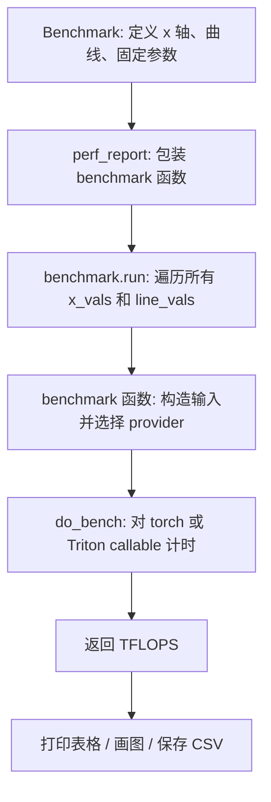

# Triton GEMM

这篇笔记参考本地代码和 Triton 矩阵乘法教程，整理一个 FP16 GEMM 的实现方式。这里的重点不是重新推导矩阵乘法公式，而是把 Triton 里几个关键问题讲清楚：

- 一个 Triton program 如何负责一个 $C$ 矩阵 tile。
- 如何用指针块加载 $A$ 和 $B$ 的 tile。
- 为什么要用 `GROUP_SIZE_M` 改变 program 的调度顺序来提高 L2 缓存复用。
- 如何用 `triton.testing.Benchmark`、`triton.testing.perf_report` 和 `triton.testing.do_bench` 做性能测试。

参考资料：

- Triton 中文教程：<https://triton.hyper.ai/docs/getting-started/tutorials/matrix-multiplication>

## 普通矩阵乘法

矩阵乘法计算的是：

$$
C_{m,n} = \sum_{k=0}^{K-1} A_{m,k} \cdot B_{k,n}
$$

其中：

- $A$ 的形状是 $(M, K)$。
- $B$ 的形状是 $(K, N)$。
- $C$ 的形状是 $(M, N)$。

最朴素的 CPU 视角通常是三重循环：

```python
for m in range(M):
    for n in range(N):
        acc = 0.0
        for k in range(K):
            acc += A[m, k] * B[k, n]
        C[m, n] = acc
```

GPU 上不会让一个线程只算一个元素。Triton 更常见的写法是：**一个 Triton program 负责计算一个 $C$ 的二维 tile**，例如 `[BLOCK_SIZE_M, BLOCK_SIZE_N]`。这个 tile 内部的计算沿着 $K$ 方向分块累加。

```python
# 伪代码：每个 Triton program 负责一个 C tile。
for pid_m in parallel_range(ceil_div(M, BLOCK_SIZE_M)):
    for pid_n in parallel_range(ceil_div(N, BLOCK_SIZE_N)):
        acc = zeros((BLOCK_SIZE_M, BLOCK_SIZE_N), dtype=float32)

        for k in range(0, K, BLOCK_SIZE_K):
            a = A[
                pid_m * BLOCK_SIZE_M : (pid_m + 1) * BLOCK_SIZE_M,
                k : k + BLOCK_SIZE_K,
            ]
            b = B[
                k : k + BLOCK_SIZE_K,
                pid_n * BLOCK_SIZE_N : (pid_n + 1) * BLOCK_SIZE_N,
            ]
            acc += dot(a, b)

        C[
            pid_m * BLOCK_SIZE_M : (pid_m + 1) * BLOCK_SIZE_M,
            pid_n * BLOCK_SIZE_N : (pid_n + 1) * BLOCK_SIZE_N,
        ] = acc
```

这里有两个重要设计：

- **沿 $M/N$ 分块**：每个 program 负责一个输出 tile，天然可以并行。
- **沿 $K$ 循环累加**：每次读入一小块 $A$ 和 $B$，用 `tl.dot` 累加到 FP32 accumulator。

## 普通 program 映射

如果不考虑 L2 缓存优化，最直接的映射方式是把一维 `pid` 按行主序拆成 `(pid_m, pid_n)`：

```python
pid = tl.program_id(axis=0)

# N 方向一共有多少个 C tile。
num_pid_n = tl.cdiv(N, BLOCK_SIZE_N)

# 行主序映射：先填满一行的 N tiles，再进入下一行。
pid_m = pid // num_pid_n
pid_n = pid % num_pid_n
```

这个写法非常直观：

- `pid_m` 表示当前 program 负责第几个 M tile。
- `pid_n` 表示当前 program 负责第几个 N tile。
- 当前 program 计算的输出块是 `C[pid_m, pid_n]` 这个 tile。

但是这个顺序对 L2 缓存不总是友好。连续的 program 如果快速沿着 N 方向移动，它们会复用同一块 A，但 B 的 tile 变化很快；当矩阵比较大时，部分数据还没被充分复用就可能从 L2 中被挤掉。

## 指针块

Triton 的关键写法是一次性构造一整个 tile 的指针块。

对行主序矩阵来说，二维坐标 `(i, j)` 对应的地址是：

$$
\text{ptr}(i, j) = \text{base} + i \cdot \text{stride}_0 + j \cdot \text{stride}_1
$$

所以 `A` 和 `B` 的第一个 K tile 指针可以这样构造：

```python
# 当前 C tile 覆盖的 M 方向下标，形状是 [BLOCK_SIZE_M]。
offs_am = (pid_m * BLOCK_SIZE_M + tl.arange(0, BLOCK_SIZE_M)) % M

# 当前 C tile 覆盖的 N 方向下标，形状是 [BLOCK_SIZE_N]。
offs_bn = (pid_n * BLOCK_SIZE_N + tl.arange(0, BLOCK_SIZE_N)) % N

# 当前 K tile 内部的 K 方向下标，形状是 [BLOCK_SIZE_K]。
offs_k = tl.arange(0, BLOCK_SIZE_K)

# A tile 指针块，形状是 [BLOCK_SIZE_M, BLOCK_SIZE_K]。
a_ptrs = a_ptr + (
    offs_am[:, None] * stride_am +
    offs_k[None, :] * stride_ak
)

# B tile 指针块，形状是 [BLOCK_SIZE_K, BLOCK_SIZE_N]。
b_ptrs = b_ptr + (
    offs_k[:, None] * stride_bk +
    offs_bn[None, :] * stride_bn
)
```

这里的 `[:, None]` 和 `[None, :]` 是为了产生二维广播：

- `offs_am[:, None]` 是 `[BLOCK_SIZE_M, 1]`。
- `offs_k[None, :]` 是 `[1, BLOCK_SIZE_K]`。
- 两者相加之后得到 `[BLOCK_SIZE_M, BLOCK_SIZE_K]`。

`% M` 和 `% N` 的作用是让越界的 M/N 坐标绕回合法地址。真正写回 `C` 的时候仍然会用 mask 防止越界写入；加载 A/B 时，K 方向越界则用 `other=0.0` 填充，不影响累加结果。

## L2 缓存优化

L2 缓存优化的核心是：**不要简单按行主序启动所有 C tile，而是把多个 M tile 分成一个 group，让 group 内部按列主序遍历**。

代码里的映射是：

```python
pid = tl.program_id(axis=0)

# M/N 方向各有多少个 C tile。
num_pid_m = tl.cdiv(M, BLOCK_SIZE_M)
num_pid_n = tl.cdiv(N, BLOCK_SIZE_N)

# 一个 group 中包含 GROUP_SIZE_M 行、num_pid_n 列。
num_pid_in_group = GROUP_SIZE_M * num_pid_n

# 当前 pid 属于第几个 group。
group_id = pid // num_pid_in_group

# 当前 group 覆盖的第一行 M tile。
first_pid_m = group_id * GROUP_SIZE_M

# 最后一个 group 可能不足 GROUP_SIZE_M 行。
group_size_m = min(num_pid_m - first_pid_m, GROUP_SIZE_M)

# group 内按列主序遍历：
# 先固定 N tile，再遍历 group 内多个 M tile。
pid_m = first_pid_m + ((pid % num_pid_in_group) % group_size_m)
pid_n = (pid % num_pid_in_group) // group_size_m
```

参考示意图如下:


这会改变 program 访问 A/B tile 的时间距离。对于矩阵乘法这种数据复用很强的算子，调度顺序会直接影响 L2 命中率。

## `matmul_kernel`

**用途**

`matmul_kernel` 是实际运行在 GPU 上的 Triton kernel。它计算：

$$
C = A \times B
$$

其中 `A` 是 `(M, K)`，`B` 是 `(K, N)`，`C` 是 `(M, N)`。

**原型**

```python
@triton.autotune(
    configs=get_autotune_config(),
    key=["M", "N", "K"],
)
@triton.jit
def matmul_kernel(
    a_ptr,
    b_ptr,
    c_ptr,
    M,
    N,
    K,
    stride_am,
    stride_ak,
    stride_bk,
    stride_bn,
    stride_cm,
    stride_cn,
    BLOCK_SIZE_M: tl.constexpr,
    BLOCK_SIZE_N: tl.constexpr,
    BLOCK_SIZE_K: tl.constexpr,
    GROUP_SIZE_M: tl.constexpr,
    ACTIVATION: tl.constexpr,
):
    ...
```

**运行时参数**

| 参数 | 类型 | 含义 |
| --- | --- | --- |
| `a_ptr` | pointer | 输入矩阵 A 的起始地址，逻辑形状是 `(M, K)`。 |
| `b_ptr` | pointer | 输入矩阵 B 的起始地址，逻辑形状是 `(K, N)`。 |
| `c_ptr` | pointer | 输出矩阵 C 的起始地址，逻辑形状是 `(M, N)`。 |
| `M` | integer | A/C 的 M 维度。 |
| `N` | integer | B/C 的 N 维度。 |
| `K` | integer | A/B 共同的归约维度。 |
| `stride_am` | integer | A 在 M 方向移动 1 个元素时，指针增加的元素数。 |
| `stride_ak` | integer | A 在 K 方向移动 1 个元素时，指针增加的元素数。 |
| `stride_bk` | integer | B 在 K 方向移动 1 个元素时，指针增加的元素数。 |
| `stride_bn` | integer | B 在 N 方向移动 1 个元素时，指针增加的元素数。 |
| `stride_cm` | integer | C 在 M 方向移动 1 个元素时，指针增加的元素数。 |
| `stride_cn` | integer | C 在 N 方向移动 1 个元素时，指针增加的元素数。 |

**编译期 / meta 参数**

| 参数 | 类型 | 含义 |
| --- | --- | --- |
| `BLOCK_SIZE_M` | `tl.constexpr` | 单个 program 计算的 C tile 的 M 方向大小。 |
| `BLOCK_SIZE_N` | `tl.constexpr` | 单个 program 计算的 C tile 的 N 方向大小。 |
| `BLOCK_SIZE_K` | `tl.constexpr` | 每次 `tl.dot` 处理的 K 方向分块大小。 |
| `GROUP_SIZE_M` | `tl.constexpr` | L2 缓存优化中，一个 group 包含多少个 M tile。 |
| `ACTIVATION` | `tl.constexpr` | 是否融合激活函数。示例里支持 `"leaky_relu"` 和空字符串。 |

**核心代码**

```python
@triton.autotune(
    configs=get_autotune_config(),
    key=["M", "N", "K"],
)
@triton.jit
def matmul_kernel(
    a_ptr, b_ptr, c_ptr,
    M, N, K,
    stride_am, stride_ak,
    stride_bk, stride_bn,
    stride_cm, stride_cn,
    BLOCK_SIZE_M: tl.constexpr,
    BLOCK_SIZE_N: tl.constexpr,
    BLOCK_SIZE_K: tl.constexpr,
    GROUP_SIZE_M: tl.constexpr,
    ACTIVATION: tl.constexpr,
):
    # 当前 program 的一维编号。
    pid = tl.program_id(axis=0)

    # 计算 C 矩阵在 M/N 方向分别需要多少个 tile。
    num_pid_m = tl.cdiv(M, BLOCK_SIZE_M)
    num_pid_n = tl.cdiv(N, BLOCK_SIZE_N)

    # L2 缓存优化：把 GROUP_SIZE_M 行的 tile 放进一个 group。
    num_pid_in_group = GROUP_SIZE_M * num_pid_n
    group_id = pid // num_pid_in_group
    first_pid_m = group_id * GROUP_SIZE_M
    group_size_m = min(num_pid_m - first_pid_m, GROUP_SIZE_M)

    # group 内部按列主序排列 pid。
    pid_m = first_pid_m + ((pid % num_pid_in_group) % group_size_m)
    pid_n = (pid % num_pid_in_group) // group_size_m

    # 构造 A/B 第一个 K tile 的二维指针块。
    offs_am = (pid_m * BLOCK_SIZE_M + tl.arange(0, BLOCK_SIZE_M)) % M
    offs_bn = (pid_n * BLOCK_SIZE_N + tl.arange(0, BLOCK_SIZE_N)) % N
    offs_k = tl.arange(0, BLOCK_SIZE_K)
    a_ptrs = a_ptr + (
        offs_am[:, None] * stride_am +
        offs_k[None, :] * stride_ak
    )
    b_ptrs = b_ptr + (
        offs_k[:, None] * stride_bk +
        offs_bn[None, :] * stride_bn
    )

    # FP16 输入通常用 FP32 累加，减少精度损失。
    accumulator = tl.zeros((BLOCK_SIZE_M, BLOCK_SIZE_N), dtype=tl.float32)

    # 沿 K 方向分块累加。
    for k in range(0, tl.cdiv(K, BLOCK_SIZE_K)):
        # K 方向越界的元素用 0 填充，保证不会污染结果。
        a = tl.load(
            a_ptrs,
            mask=offs_k[None, :] < K - k * BLOCK_SIZE_K,
            other=0.0,
        )
        b = tl.load(
            b_ptrs,
            mask=offs_k[:, None] < K - k * BLOCK_SIZE_K,
            other=0.0,
        )

        # [BM, BK] x [BK, BN] -> [BM, BN]。
        accumulator = tl.dot(a, b, accumulator)

        # 前进到下一个 K tile。
        a_ptrs += BLOCK_SIZE_K * stride_ak
        b_ptrs += BLOCK_SIZE_K * stride_bk

    # 可以在 FP32 accumulator 上融合激活函数。
    if ACTIVATION == "leaky_relu":
        accumulator = leaky_relu(accumulator)

    # 输出写成 FP16。
    c = accumulator.to(tl.float16)

    # 构造 C tile 的写回指针，并用 mask 保护 M/N 边界。
    offs_cm = pid_m * BLOCK_SIZE_M + tl.arange(0, BLOCK_SIZE_M)
    offs_cn = pid_n * BLOCK_SIZE_N + tl.arange(0, BLOCK_SIZE_N)
    c_ptrs = c_ptr + stride_cm * offs_cm[:, None] + stride_cn * offs_cn[None, :]
    c_mask = (offs_cm[:, None] < M) & (offs_cn[None, :] < N)
    tl.store(c_ptrs, c, mask=c_mask)
```

**注意点**

- `tl.dot(a, b, accumulator)` 会把当前 K tile 的乘加结果累加到 `accumulator`。
- `accumulator` 使用 `tl.float32`，最后再转换到 `tl.float16` 写回。
- A/B 加载只需要处理 K 方向 mask；M/N 方向通过 `% M` / `% N` 保证读取地址合法。
- C 写回必须使用 `c_mask`，否则最后一个 M/N tile 可能越界写。

## Host 包装函数

**用途**

`matmul` 是 Python 侧包装函数，负责检查输入、分配输出、构造 grid，并启动 `matmul_kernel`。

**原型**

```python
def matmul(a, b, activation=""):
    ...
```

**参数**

| 参数 | 类型 | 含义 |
| --- | --- | --- |
| `a` | `torch.Tensor` | 输入矩阵 A，形状是 `(M, K)`，示例要求 contiguous。 |
| `b` | `torch.Tensor` | 输入矩阵 B，形状是 `(K, N)`。 |
| `activation` | `str` | 传给 kernel 的 meta 参数。空字符串表示不融合激活，`"leaky_relu"` 表示融合激活。 |

**返回值**

| 类型 | 含义 |
| --- | --- |
| `torch.Tensor` | 输出矩阵 C，形状是 `(M, N)`，dtype 是 `torch.float16`。 |

**代码**

```python
def matmul(a, b, activation=""):
    # A 的列数必须等于 B 的行数。
    assert a.shape[1] == b.shape[0], "Incompatible dimensions"

    # 示例代码要求 A 连续，简化 stride 和访存假设。
    assert a.is_contiguous(), "Matrix A must be contiguous"

    M, K = a.shape
    K, N = b.shape

    # 分配输出矩阵。
    c = torch.empty((M, N), device=a.device, dtype=torch.float16)

    # grid 是一个函数，因为 BLOCK_SIZE_M/N 由 autotune 配置决定。
    grid = lambda META: (
        triton.cdiv(M, META["BLOCK_SIZE_M"]) *
        triton.cdiv(N, META["BLOCK_SIZE_N"]),
    )

    # kernel[grid](...) 会启动 Triton kernel。
    matmul_kernel[grid](
        a, b, c,
        M, N, K,
        a.stride(0), a.stride(1),
        b.stride(0), b.stride(1),
        c.stride(0), c.stride(1),
        ACTIVATION=activation,
    )

    return c
```

这里的 `grid` 返回一维 tuple。每个 program 负责一个 C tile，所以 program 总数是：

$$
\left\lceil \frac{M}{BLOCK\_SIZE\_M} \right\rceil
\times
\left\lceil \frac{N}{BLOCK\_SIZE\_N} \right\rceil
$$

## 自动调优配置

示例代码使用 `triton.autotune` 在不同 tile size 和编译配置之间选择最快的一组。

```python
def get_cuda_autotune_config():
    return [
        triton.Config(
            {
                "BLOCK_SIZE_M": 128,
                "BLOCK_SIZE_N": 256,
                "BLOCK_SIZE_K": 64,
                "GROUP_SIZE_M": 8,
            },
            num_stages=3,
            num_warps=8,
        ),
        triton.Config(
            {
                "BLOCK_SIZE_M": 64,
                "BLOCK_SIZE_N": 256,
                "BLOCK_SIZE_K": 32,
                "GROUP_SIZE_M": 8,
            },
            num_stages=4,
            num_warps=4,
        ),
    ]
```

**接口要点**

| 接口 | 含义 |
| --- | --- |
| `triton.Config(kwargs, num_warps=..., num_stages=...)` | 描述一组 meta 参数和编译配置。 |
| `@triton.autotune(configs=..., key=...)` | 对同一个 kernel 尝试多组 `Config`，并按 `key` 缓存最佳配置。 |
| `key=["M", "N", "K"]` | 当 M/N/K 变化时，重新为这个 shape 选择最佳配置。 |

这部分和性能测试不同：`autotune` 是为了选择 kernel 配置，`triton.testing` 是为了生成最终的 benchmark 数据。

## 性能测试代码

本地代码用 `triton.testing.Benchmark` 定义测试矩阵尺寸和曲线，用 `@triton.testing.perf_report` 包装 benchmark 函数，然后在函数里用 `triton.testing.do_bench` 计时。

```python
TORCH_HAS_FP8 = hasattr(torch, "float8_e5m2")
ref_lib = "cuBLAS" if is_cuda() else "rocBLAS"

configs = []
for fp8_inputs in [False, True]:
    if fp8_inputs and (not TORCH_HAS_FP8 or not is_cuda()):
        continue

    configs.append(
        triton.testing.Benchmark(
            # x 轴使用 M/N/K 三个参数。
            x_names=["M", "N", "K"],

            # 每次测试时，M/N/K 都取同一个值：
            # 256, 384, ..., 4096。
            x_vals=[128 * i for i in range(2, 33)],

            # provider 决定画哪条曲线。
            line_arg="provider",

            # FP16 情况比较 cuBLAS/rocBLAS 和 Triton。
            # FP8 情况只测 Triton。
            line_vals=["triton"] if fp8_inputs else [ref_lib.lower(), "triton"],
            line_names=["Triton"] if fp8_inputs else [ref_lib, "Triton"],

            # 曲线样式。
            styles=[("green", "-"), ("blue", "-")],

            # y 轴显示 TFLOPS。
            ylabel="TFLOPS",

            # 图像和输出文件名。
            plot_name="matmul-performance-" + ("fp16" if not fp8_inputs else "fp8"),

            # 固定参数，会传给 benchmark 函数。
            args={"fp8_inputs": fp8_inputs},
        )
    )
```

被 `perf_report` 包装的函数每次接收一组测试参数：

```python
@triton.testing.perf_report(configs)
def benchmark(M, N, K, provider, fp8_inputs):
    # 构造输入。
    a = torch.randn((M, K), device="cuda", dtype=torch.float16)
    b = torch.randn((K, N), device="cuda", dtype=torch.float16)

    # FP8 路径：示例中会把输入转换成 float8。
    if TORCH_HAS_FP8 and fp8_inputs:
        a = a.to(torch.float8_e5m2)
        b = b.T
        b = b.to(torch.float8_e5m2)

    # 返回中位数、20% 分位数、80% 分位数。
    quantiles = [0.5, 0.2, 0.8]

    # 对比库路径。
    if provider == ref_lib.lower():
        ms, min_ms, max_ms = triton.testing.do_bench(
            lambda: torch.matmul(a, b),
            quantiles=quantiles,
        )

    # Triton kernel 路径。
    if provider == "triton":
        ms, min_ms, max_ms = triton.testing.do_bench(
            lambda: matmul(a, b),
            quantiles=quantiles,
        )

    # GEMM 浮点操作数约为 2 * M * N * K。
    perf = lambda ms: 2 * M * N * K * 1e-12 / (ms * 1e-3)

    # perf(ms) 是中位性能，后两个用于画波动范围。
    return perf(ms), perf(max_ms), perf(min_ms)


benchmark.run(show_plots=True, print_data=True)
```

`TFLOPS` 换算公式是：

$$
\text{TFLOPS} =
\frac{2 \times M \times N \times K}{\text{time\_seconds}}
\times 10^{-12}
$$

因为 `do_bench` 返回的是毫秒，所以代码里写成：

```python
perf = lambda ms: 2 * M * N * K * 1e-12 / (ms * 1e-3)
```
## 测试结果

### FP16


### FP8


## `triton.testing.Benchmark`

**用途**

`Benchmark` 用来描述一组 benchmark 维度：x 轴怎么扫、不同曲线怎么区分、图像名称是什么、固定参数有哪些。

**原型**

```python
triton.testing.Benchmark(
    x_names: list[str],
    x_vals: list[Any],
    line_arg: str,
    line_vals: list[Any],
    line_names: list[str],
    plot_name: str,
    args: dict[str, Any],
    xlabel: str = "",
    ylabel: str = "",
    x_log: bool = False,
    y_log: bool = False,
    styles=None,
)
```

**参数**

| 参数 | 类型 | 含义 |
| --- | --- | --- |
| `x_names` | `list[str]` | benchmark 函数中作为 x 轴变量的参数名。 |
| `x_vals` | `list[Any]` | x 轴取值。若 `x_names` 有多个参数而 `x_vals` 是标量列表，则每个 x 参数都会取同一个值。 |
| `line_arg` | `str` | 用来区分不同曲线的参数名。 |
| `line_vals` | `list[Any]` | `line_arg` 的不同取值。每个值对应一条曲线。 |
| `line_names` | `list[str]` | 每条曲线显示在图例里的名字。 |
| `plot_name` | `str` | 图像名称，也会作为保存图片 / CSV 的文件名基础。 |
| `args` | `dict[str, Any]` | 固定传给 benchmark 函数的参数。 |
| `xlabel` | `str` | x 轴标签。不传时使用第一个 `x_names`。 |
| `ylabel` | `str` | y 轴标签，例如 `"TFLOPS"`。 |
| `x_log` | `bool` | x 轴是否使用 log 坐标。 |
| `y_log` | `bool` | y 轴是否使用 log 坐标。 |
| `styles` | `list[tuple[str, str]]` | 曲线样式，例如 `[("green", "-"), ("blue", "-")]`。 |

**写法示例：单参数 x 轴**

```python
bench = triton.testing.Benchmark(
    x_names=["N"],
    x_vals=[1024, 2048, 4096],
    line_arg="provider",
    line_vals=["torch", "triton"],
    line_names=["Torch", "Triton"],
    plot_name="vector-add",
    args={},
    ylabel="GB/s",
)
```

**写法示例：多个 x 参数一起变化**

```python
bench = triton.testing.Benchmark(
    x_names=["M", "N", "K"],
    # 因为每个 x_val 是标量，所以 M/N/K 会同时取相同值。
    x_vals=[512, 1024, 2048],
    line_arg="provider",
    line_vals=["cublas", "triton"],
    line_names=["cuBLAS", "Triton"],
    plot_name="square-gemm",
    args={"fp8_inputs": False},
    ylabel="TFLOPS",
)
```

**写法示例：多个 x 参数分别取值**

```python
bench = triton.testing.Benchmark(
    x_names=["M", "N", "K"],
    # 每个 tuple 分别对应 M/N/K。
    x_vals=[(1024, 1024, 512), (2048, 1024, 1024)],
    line_arg="provider",
    line_vals=["cublas", "triton"],
    line_names=["cuBLAS", "Triton"],
    plot_name="rect-gemm",
    args={},
    ylabel="TFLOPS",
)
```

## `triton.testing.perf_report`

**用途**

`perf_report` 是一个装饰器。它把普通 Python benchmark 函数包装成一个带 `.run(...)` 方法的对象。

**原型**

```python
triton.testing.perf_report(benchmarks)
```

**参数**

| 参数 | 类型 | 含义 |
| --- | --- | --- |
| `benchmarks` | `Benchmark` 或 `list[Benchmark]` | 一组 benchmark 配置。 |

**返回值**

| 类型 | 含义 |
| --- | --- |
| decorator | 用来包装 benchmark 函数。包装后得到的对象可以调用 `.run(...)`。 |

**使用示例**

```python
@triton.testing.perf_report(
    triton.testing.Benchmark(
        x_names=["M", "N", "K"],
        x_vals=[512, 1024, 2048],
        line_arg="provider",
        line_vals=["cublas", "triton"],
        line_names=["cuBLAS", "Triton"],
        plot_name="matmul",
        args={},
        ylabel="TFLOPS",
    )
)
def benchmark(M, N, K, provider):
    ...


benchmark.run(show_plots=True, print_data=True)
```

从源码可以看出，`perf_report` 返回的是 `Mark` 对象。真正执行 benchmark 的是 `Mark.run(...)`。

## `Mark.run`

**用途**

`.run(...)` 执行所有 benchmark 配置，收集数据、打印表格，并可选生成图像和 CSV。

**原型**

```python
benchmark.run(
    show_plots=False,
    print_data=False,
    save_path="",
    return_df=False,
    **kwargs,
)
```

**参数**

| 参数 | 类型 | 含义 |
| --- | --- | --- |
| `show_plots` | `bool` | 是否调用 `plt.show()` 显示图像。 |
| `print_data` | `bool` | 是否把结果表格打印到终端。 |
| `save_path` | `str` | 如果非空，会保存 PNG、CSV 和 `results.html`。 |
| `return_df` | `bool` | 是否返回 pandas DataFrame。 |
| `**kwargs` | `dict` | 额外传给 benchmark 函数的参数。 |

**使用示例**

```python
# 只打印数据，不显示图。
benchmark.run(print_data=True)

# 显示图像并保存文件。
benchmark.run(show_plots=True, print_data=True, save_path="./gemm-bench")

# 直接拿到 DataFrame，方便进一步处理。
df = benchmark.run(print_data=True, return_df=True)
```

## `triton.testing.do_bench`

**用途**

`do_bench` 对一个 callable 做 GPU 计时。它会先估计单次运行耗时，再根据 `warmup` 和 `rep` 计算实际 warmup / repeat 次数。

**原型**

```python
triton.testing.do_bench(
    fn,
    warmup=25,
    rep=100,
    grad_to_none=None,
    quantiles=None,
    return_mode="mean",
)
```

**参数**

| 参数 | 类型 | 含义 |
| --- | --- | --- |
| `fn` | `Callable` | 被测试的函数。通常写成 `lambda: matmul(a, b)`。 |
| `warmup` | `int` | warmup 总时间，单位是毫秒。 |
| `rep` | `int` | 正式重复计时总时间，单位是毫秒。 |
| `grad_to_none` | iterable 或 `None` | 如果 benchmark 包含 backward，可在每次计时前把这些 tensor 的 `.grad` 置为 `None`。 |
| `quantiles` | `list[float]` 或 `None` | 需要返回的分位数。示例用 `[0.5, 0.2, 0.8]`。 |
| `return_mode` | `str` | 不传 `quantiles` 时的统计方式，可选 `"min"`、`"max"`、`"mean"`、`"median"`、`"all"`。 |

**返回值**

| 情况 | 返回值 |
| --- | --- |
| `quantiles=[0.5, 0.2, 0.8]` | 返回三个耗时，例如 `ms, min_ms, max_ms`。 |
| `quantiles=None, return_mode="mean"` | 返回平均耗时。 |
| `return_mode="all"` | 返回所有重复计时结果。 |

**使用示例：返回均值**

```python
ms = triton.testing.do_bench(lambda: matmul(a, b))
```

**使用示例：返回分位数**

```python
ms, min_ms, max_ms = triton.testing.do_bench(
    lambda: matmul(a, b),
    quantiles=[0.5, 0.2, 0.8],
)
```

这里变量名里的 `min_ms` 和 `max_ms` 不是严格数学意义上的最小值 / 最大值，而是示例代码把 20% 和 80% 分位数命名成了 `min_ms` / `max_ms`，用于画性能波动范围。

**从源码推断**

`do_bench` 内部会做这些事：

- 先运行一次 `fn()` 并同步设备。
- 用 CUDA/HIP event 估计单次耗时。
- 根据估计耗时计算 warmup 次数和 repeat 次数。
- 每次正式计时前清理 L2 cache。
- 记录每次运行的 event 时间。
- 按 `quantiles` 或 `return_mode` 汇总结果。

所以 `do_bench` 适合测试 GPU kernel 或包含 GPU kernel 的 Python callable。不要把它理解成普通 CPU wall-clock 计时器。

## 性能测试接口配合关系



从使用者角度看：

- `Benchmark` 决定“测哪些点、画哪些线”。
- `perf_report` 决定“这个函数是一个可运行的 benchmark 报告”。
- `benchmark.run` 决定“现在开始执行并输出结果”。
- `do_bench` 决定“具体某一个 provider 的耗时是多少”。

## 小结

这个 GEMM 示例可以分成三层理解：

- **计算层**：每个 Triton program 计算一个 C tile，沿 K 方向分块加载 A/B，用 `tl.dot` 累加。
- **调度层**：用 `GROUP_SIZE_M` 把 program 重排成 group，提高 L2 缓存复用。
- **测试层**：用 `triton.testing.Benchmark` 描述测试维度，用 `perf_report` 生成报告，用 `do_bench` 测量耗时并换算 TFLOPS。

真正写 Triton GEMM 时，最需要盯住的是三个形状：

- `a` 的形状是 `[BLOCK_SIZE_M, BLOCK_SIZE_K]`。
- `b` 的形状是 `[BLOCK_SIZE_K, BLOCK_SIZE_N]`。
- `accumulator` 的形状是 `[BLOCK_SIZE_M, BLOCK_SIZE_N]`。

只要这三个形状和 `pid_m/pid_n` 的调度关系理顺，Triton GEMM 的主体就不会乱。
