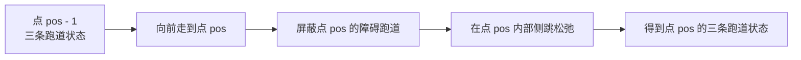

# 动态规划学习笔记

## 核心思维：DP 里哪些内容是一直需要考虑的？

当你面对任何一道 DP 题时，请强制自己按这个“四步走”思考：

- **状态定义 (State Definition)**：
    
    - 这是最重要的一步。问自己：**“为了求得最终答案，我需要记录哪些变量？”**
        
    - _原则_：状态定义要保证“无后效性”（当前状态确定后，未来的决策只依赖于当前，而与过去如何到达当前状态无关）。
        
- **状态转移方程 (Recurrence Relation)**：
    
    - 问自己：**“当前问题（大问题）怎么拆解成子问题？”**
        
    - 找规律：如果当前是 `dp[i]`，它和 `dp[i-1]`、`dp[i-2]` 有什么关系？
        
- **初始化 (Base Case)**：
    
    - 最基础的情况是什么？（例如：`dp[0] = 0` 或 `dp[1] = 1`）。不要漏掉边界。
        
- **遍历顺序 (Iteration Order)**：
    
    - 是从前向后？从后向前？还是按区间长度遍历？确保在计算当前值时，它所依赖的状态已经被计算出来了。


难的 DP 究竟要怎么想？很多同学觉得难，是因为被“凭空构造方程”卡住了。解决瓶颈的思路如下：

- **从“递归 + 记忆化”切入**
	
	不要一上来就写递推数组。**先写暴力递归**。
	**思考：最后一步做了什么？** 如果发现递归树中存在大量重复计算（即重叠子问题），再给它加上一个 `memo` 数组（备忘录）。**递归是人类的思维，递推（DP）是计算机的执行。**

- **对抗“无从下手”：寻找“最后一个步骤”**

	这是最核心的思考技巧。对于一个最优化问题，假设你是最后一步完成的，这一步做了什么操作？
	- 例如：在“爬楼梯”问题中，最后一步要么是跨 1 步，要么跨 2 步。所以 `dp[n] = dp[n-1] + dp[n-2]`。
	    
	- **将大问题拆解成“最后一步”的选择，往往能帮你迅速找到状态转移方程。**
    
- **维度降级技巧**

	当你的状态定义包含很多维度（如 `dp[i][j][k]`），尝试思考是否能去掉一个维度。很多时候，空间优化是通过观察到当前状态只与上一行有关，从而用 `2 * N` 的数组或一维数组代替 `N * N` 的矩阵。
	
- **维度互换（神仙 DP 的来源）**

	当你发现常规的 DP 定义（把资源做下标）导致**资源维度太大**或者**空间不可控**时，请立刻尝试：

	- **“维度互换”**：把原本作为 DP 数组**值**的东西，尝试变成**下标**；把原本作为**下标**的东西，变成**值**。

## 思维步骤

#### 递归切入（探索逻辑）

- **动作**：直接写出递归表达式，关注“最后一步”能做什么选择。
    
- **核心**：如果递归树中有重复计算，加 `memo` 存下来。**这是确认问题是否具备“最优子结构”和“重叠子问题”的试金石。**
    

#### 定义定型（规范表达，处理偏移）

- **动作**：将递归逻辑翻译成 DP 数组：
    
    - **状态**：用下标代表变量，值代表目标（如：`dp[i][j]`）。
        
    - **转移**：方程即递归的逻辑分支。
        
    - **初始化/边界**：递归的 Base Case 即 `dp` 的边界。
        
    - **遍历顺序**：根据依赖关系决定（正序、逆序、区间长）。
		
	- **处理偏移**：是否会访问 `dp[-1]`，如果是，需要整体进行偏移？
        

#### 维度降级（空间优化）

- **动作**：审视状态依赖。
    
    - 如果 `dp[i]` 只依赖 `dp[i-1]`，即可用滚动数组压到 $O(N)$ 或 $O(1)$。
        
    - **关键点**：滚动数组通常伴随着遍历顺序的调整（比如 0/1 背包必须逆序）。
        

#### 维度互换（性能飞跃）

- **动作**：如果发现 `dp` 表太稀疏、下标范围过大（如魔力值 $10^9$）导致爆空间/时间，立刻互换：
    
    - **互换前**：`dp[书本数][魔力值] = 最大挑战数`
        
    - **互换后**：`dp[挑战数] = 剩余最大魔力值`
        

#### 状态“完备性”自检（极其重要）

这是这套流程中必须补充的一环。当你完成上述步骤，问自己两个问题：

- **“这个状态能推导出最终答案吗？”**（如果不行，说明状态记录的信息不够，需增加维度）。
    
- **“这个状态真的无后效性吗？”**（如果当前状态的决策还需要知道“过去”的信息，说明状态定义需要把那个信息也存进下标）。

## [70. 爬楼梯 - 力扣（LeetCode）](https://leetcode.cn/problems/climbing-stairs/)

假设你正在爬楼梯。需要 `n` 阶你才能到达楼顶。

每次你可以爬 `1` 或 `2` 个台阶。你有多少种不同的方法可以爬到楼顶呢？

**示例 1：**

**输入：** n = 2
**输出：** 2
**解释：** 有两种方法可以爬到楼顶。
1. 1 阶 + 1 阶
2. 2 阶

**示例 2：**

**输入：** n = 3
**输出：** 3
**解释：** 有三种方法可以爬到楼顶。
1. 1 阶 + 1 阶 + 1 阶
2. 1 阶 + 2 阶
3. 2 阶 + 1 阶

**提示：**

- `1 <= n <= 45`

### 状态定义 (State Definition)

**思考过程**：为了求第 $n$ 阶，我需要知道什么？

- **直觉**：到达第 $n$ 阶，要么是从第 $n-1$ 阶跨一步，要么是从第 $n-2$ 阶跨两步。
    
- **状态定义**：设 `dp[i]` 为到达第 `i` 阶楼梯的方法总数。
    
- **无后效性验证**：只要我知道了到达第 `i-1` 阶的方法数和第 `i-2` 阶的方法数，我就能算出第 `i` 阶的方法数。我不需要关心你是怎么到达 `i-1` 阶的（是一步步跳的，还是两步两步跳的），这符合无后效性。
    

### 状态转移方程 (Recurrence Relation)

**思考过程**：寻找“最后一步”。

- **最后一步分析**：到达第 $i$ 阶，最后一步的操作只有两种可能：
    
    1. 从第 $i-1$ 阶迈了 1 步。
        
    2. 从第 $i-2$ 阶迈了 2 步。
        
- **得出结论**：到达第 $i$ 阶的总方法数 = (到达 $i-1$ 阶的方法数) + (到达 $i-2$ 阶的方法数)。
    
- **方程**：$dp[i] = dp[i-1] + dp[i-2]$。
    

### 初始化 (Base Case)

**思考过程**：边界条件是什么？

- **观察**：
    
    - `dp[1]`：爬到第 1 阶，只有 {1} 一种方法。即 `dp[1] = 1`。
        
    - `dp[2]`：爬到第 2 阶，有 {1,1}, {2} 两种方法。即 `dp[2] = 2`。
        
- **小技巧**：有时为了代码简洁，会设置 `dp[0] = 1`（表示站在地面不动也是一种方法），这样 `dp[2]` 就能通过 `dp[1] + dp[0]` 得到。根据习惯选择即可。
    

### 遍历顺序 (Iteration Order)

**思考过程**：为了求 `dp[i]`，必须先有 `dp[i-1]` 和 `dp[i-2]`。

- **结论**：显然必须**从前向后**遍历，从 `i=3` 开始一直算到 `n`。
    

### 如何从“递归”跨越到“DP”？

如果你一开始想不到方程，请直接写出暴力递归：


```python
def climbStairs(n):
    if n == 1: return 1
    if n == 2: return 2
    return climbStairs(n-1) + climbStairs(n-2)
```

**加个备忘录 (Memoization)**：

你会发现 `climbStairs(5)` 会重复调用 `climbStairs(3)` 多次，非常浪费。


```python
memo = {}
def climbStairs(n):
    if n in memo: return memo[n]
    if n <= 2: return n
    memo[n] = climbStairs(n-1) + climbStairs(n-2)
    return memo[n]
```

**这就是“记忆化搜索”**。当你把这个递归函数改成 `for` 循环的数组赋值时，你就完成了从“人类直觉”到“DP 递推”的转化。

### 关于“维度降级”的实操

在爬楼梯问题中，你会发现 `dp[i]` 永远只依赖于前两个数：

- **原始空间**：我们需要一个数组 `dp`，大小为 `n+1`，空间复杂度 $O(n)$。
    
- **降级思考**：我们其实不需要存整个数组，只需要存 `current`、`prev1` 和 `prev2` 即可。
    


```python
# 滚动变量实现空间 O(1)
prev2, prev1 = 1, 2
for i in range(3, n + 1):
    current = prev1 + prev2
    prev2 = prev1
    prev1 = current
```

这就是通过**观察状态依赖关系**，将 $O(n)$ 空间压缩为 $O(1)$ 的过程。

## [746. 使用最小花费爬楼梯](https://leetcode.cn/problems/min-cost-climbing-stairs/)

给你一个整数数组 `cost` ，其中 `cost[i]` 是从楼梯第 `i` 个台阶向上爬需要支付的费用。一旦你支付此费用，即可选择向上爬一个或者两个台阶。

你可以选择从下标为 `0` 或下标为 `1` 的台阶开始爬楼梯。

请你计算并返回达到楼梯顶部的最低花费。

**示例 1：**

**输入：** cost =$[10,15,20]$
**输出：** 15
**解释：** 你将从下标为 1 的台阶开始。
- 支付 15 ，向上爬两个台阶，到达楼梯顶部。
总花费为 15 。

**示例 2：**

**输入：** cost = [_**1**_,100,_**1**_,1,_**1**_,100,_**1**_,_**1**_,100,_**1**_]
**输出：** 6
**解释：** 你将从下标为 0 的台阶开始。
- 支付 1 ，向上爬两个台阶，到达下标为 2 的台阶。
- 支付 1 ，向上爬两个台阶，到达下标为 4 的台阶。
- 支付 1 ，向上爬两个台阶，到达下标为 6 的台阶。
- 支付 1 ，向上爬一个台阶，到达下标为 7 的台阶。
- 支付 1 ，向上爬两个台阶，到达下标为 9 的台阶。
- 支付 1 ，向上爬一个台阶，到达楼梯顶部。
总花费为 6 。

**提示：**

- `2 <= cost.length <= 1000`
- `0 <= cost[i] <= 999`

### 递归切入（探索逻辑）

- **最后一步分析**：要到达楼梯顶部（下标为 `n`），最后一步有两种可能：
    
    - 从下标 `n-1` 爬 1 步上来（需支付 `cost[n-1]`）。
        
    - 从下标 `n-2` 爬 2 步上来（需支付 `cost[n-2]`）。
        
- **递归方程**：`solve(i) = min(solve(i-1) + cost[i-1], solve(i-2) + cost[i-2])`。
    
- **重叠子问题**：计算 `solve(n)` 时会多次重复计算 `solve(n-2)` 等，符合 DP 特征。
    

### 定义定型（规范表达）

- **状态定义**：`dp[i]` 表示到达第 `i` 个台阶（或者说通过第 `i` 个台阶）所需的最小花费。
    
- **转移方程**：`dp[i] = min(dp[i-1] + cost[i-1], dp[i-2] + cost[i-2])`。
    
- **初始化/边界**：
    
    - 可以从下标 0 或 1 开始，所以 `dp[0] = 0`，`dp[1] = 0`（到达前两个台阶不需要支付费用）。
        
- **遍历顺序**：从前往后，依次计算每个台阶的最小花费。
    

### 维度降级（空间优化）

- 观察发现 `dp[i]` 只依赖 `dp[i-1]` 和 `dp[i-2]`。
    
- 不需要一个 $O(n)$ 的数组，只需要两个变量 `prev2` 和 `prev1` 滚动更新即可。
    

### 维度互换（分析）

- 在本题中，状态维度非常简单（只有台阶下标），且 $O(N)$ 的空间复杂度已经足够优秀，不需要进行复杂的维度互换。
    

### 状态“完备性”自检

- **能推导最终答案吗？** 可以，`dp[n]` 就是我们要的答案。
    
- **无后效性吗？** 是的，到达第 `i` 阶的最小费用只取决于到达 `i-1` 和 `i-2` 的最小费用，与之前是怎么爬过来的无关。

### 代码实现（DP 数组版）

```cpp
class Solution {
public:
    int minCostClimbingStairs(vector<int>& cost) {
        int n=cost.size();
        vector<int> dp(n+1);
        dp[0]=0;
        dp[1]=0;
        for(int i=2;i<=n;i++){
            dp[i]=min(dp[i-1]+cost[i-1],dp[i-2]+cost[i-2]);
        }
        return dp[n];
    }
};
```

### 代码实现（空间优化版）

```cpp
class Solution {
public:
    int minCostClimbingStairs(vector<int>& cost) {
        int n=cost.size();
        int ans=0;
        int cur=0,pre=0;
        for(int i=2;i<=n;i++){
            ans=min(cur+cost[i-1],pre+cost[i-2]);
            pre=cur;
            cur=ans;
        }
        return ans;
    }
};
```

## [3693. 爬楼梯 II - 力扣（LeetCode）](https://leetcode.cn/problems/climbing-stairs-ii/)

你正在爬一个有 `n + 1` 级台阶的楼梯，台阶编号从 `0` 到 `n`。

你还得到了一个长度为 `n` 的 **下标从 1 开始** 的整数数组 `costs`，其中 `costs[i]` 是第 `i` 级台阶的成本。

从第 `i` 级台阶，你 **只能** 跳到第 `i + 1`、`i + 2` 或 `i + 3` 级台阶。从第 `i` 级台阶跳到第 `j` 级台阶的成本定义为： `costs[j] + (j - i)2`

你从第 0 级台阶开始，初始 `cost = 0`。

返回到达第 `n` 级台阶所需的 **最小** 总成本。

示例 1:

**输入：** n = 4, costs = [1,2,3,4]

**输出：** 13

**解释：**

一个最优路径是 `0 → 1 → 2 → 4`

|跳跃|成本计算|成本|
|---|---|---|
|0 → 1|`costs[0] + (1 - 0)2 = 1 + 1`|2|
|1 → 2|`costs[1] + (2 - 1)2 = 2 + 1`|3|
|2 → 4|`costs[3] + (4 - 2)2 = 4 + 4`|8|

因此，最小总成本为 `2 + 3 + 8 = 13`

***示例 2:***

**输入：** n = 4, costs = [5,1,6,2]

**输出：** 11

**解释：**

一个最优路径是 `0 → 2 → 4`

|跳跃|成本计算|成本|
|---|---|---|
|0 → 2|`costs[2] + (2 - 0)2 = 1 + 4`|5|
|2 → 4|`costs[4] + (4 - 2)2 = 2 + 4`|6|

因此，最小总成本为 `5 + 6 = 11`

**示例 3:***

**输入：** n = 3, costs = [9,8,3]

**输出：** 12

**解释：**

最优路径是 `0 → 3`，总成本 = `costs[3] + (3 - 0)2 = 3 + 9 = 12`

**提示:**

- `1 <= n == costs.length <= 105`
- `1 <= costs[i] <= 104`

### 递归切入（探索逻辑）

- **最后一步分析**：我们要到达 `n`，最后一步可能来自 `n-1`、`n-2` 或 `n-3`。
    
- **递归方程**：`solve(j) = min(solve(j-k) + cost[j] + (j - (j-k))^2)`，其中 `k` 为步长 $\{1, 2, 3\}$。
    
- **递归式**：$solve(j) = min_{k \in \{1,2,3\}} (solve(j-k) + costs[j-1] + k^2)$。
    
    - _注意：题目中 `costs` 是 1-based，`costs[i]` 对应第 `i` 级台阶。_
        

### 定义定型（规范表达）

- **状态定义**：`dp[i]` 表示到达第 `i` 级台阶的最小总成本。
    
- **转移方程**：
    
    `dp[i] = min(`
    `dp[i-1] + costs[i-1] + 1^2,`
    `dp[i-2] + costs[i-2] + 2^2,`
    `dp[i-3] + costs[i-3] + 3^2`
    `)`
    
- **初始化**：`dp[0] = 0`，其他初始化为极大值 `INF`。
    
- **遍历顺序**：从 `i = 1` 到 `n`。
    
### 维度降级（空间优化）

本题由于只依赖于过去 3 个状态，空间复杂度已为 $O(N)$。由于 $N \le 10^5$，空间足够，但若追求极致，可用滚动数组优化至 $O(1)$ 空间。

### 维度互换

本题中 `dp[i]` 本身就是我们要求的最优值，下标 `i` 也是必须的，不存在维度互换的必要。

### 状态“完备性”自检

- **能推导最终答案吗？** 可以，`dp[n]` 即为所求。
    
- **无后效性吗？** 是的，到达 `j` 的最小成本只依赖于前 3 个点的最优解，符合无后效性。

### 递推写法（空间 $O(N)$）

```cpp
class Solution {
public:
    int climbStairs(int n, vector<int>& costs) {
        vector<int> dp(n+1);
        //优化写法，i可以直接从1开始
        for(int i=1;i<=n;i++){
            int res=INT_MAX;
            //需要检测j的合法性
            for(int j=max(i-3,0);j<i;j++){
                res=min(res,dp[j]+(i-j)*(i-j));
            }
            dp[i]=res+costs[i-1];
        }
        return dp[n];
    }
};
```

### 空间优化写法（空间 $O(1)$）

```cpp
class Solution {
public:
    int climbStairs(int n, vector<int>& costs) {
        int f0=0,f1=0,f2=0;
        for(int i=1;i<=n;i++){
            int res=min(f2+1,min(f1+4,f0+9))+costs[i-1];
            f0=f1;
            f1=f2;
            f2=res;
        }
        return f2;
    }
};
```

注意初始值全是0，从1开始即可，不需要从3开始。

## [377. 组合总和 Ⅳ - 力扣（LeetCode）](https://leetcode.cn/problems/combination-sum-iv/description/)(本质爬楼梯)

给你一个由 **不同** 整数组成的数组 `nums` ，和一个目标整数 `target` 。请你从 `nums` 中找出并返回总和为 `target` 的元素组合的个数。

题目数据保证答案符合 32 位整数范围。

**示例 1：**

**输入：** nums = [1,2,3], target = 4
**输出：** 7
**解释：**
所有可能的组合为：
(1, 1, 1, 1)
(1, 1, 2)
(1, 2, 1)
(1, 3)
(2, 1, 1)
(2, 2)
(3, 1)
请注意，顺序不同的序列被视作不同的组合。

**示例 2：**

**输入：** nums = [9], target = 3
**输出：** 0

**提示：**

- `1 <= nums.length <= 200`
- `1 <= nums[i] <= 1000`
- `nums` 中的所有元素 **互不相同**
- `1 <= target <= 1000`

### 递归切入（探索逻辑）

- **最后一步分析**：要凑出目标值 `target`，最后一步可以是选取 `nums` 中的任意一个数 `x`。如果选取了 `x`，那么剩下的任务就是凑出 `target - x`。
    
- **递归方程**：`solve(target) = sum(solve(target - x))`，对于所有 `x` 属于 `nums` 且 `x <= target`。
    
- **重叠子问题**：计算 `solve(4)` 需要计算 `solve(3), solve(2), solve(1)`。计算 `solve(3)` 又会重复计算 `solve(2), solve(1)`，存在大量重叠，符合 DP 特征。
    

### 定义定型（规范表达）

- **状态定义**：`dp[i]` 表示凑成目标总和 `i` 的组合个数。
    
- **转移方程**：`dp[i] = sum(dp[i - x])`，其中 `x` 是 `nums` 中的每一个元素。
    
- **初始化/边界**：`dp[0] = 1`。凑成总和为 0 的唯一方法是“什么都不选”，这是一个有效的组合。
    
- **遍历顺序**：因为 `dp[i]` 依赖于更小的状态 `dp[i - x]`，所以必须**正序遍历** `target`（从 1 到 `target`）。
    

### 维度降级（空间优化）

本题的状态定义本身就是一维的 `dp[i]`，已经是最简形式。

### 维度互换

本题要求的是“个数”，且 `target` 是我们的目标值，因此将 `target` 作为下标是最高效的选择。不需要维度互换。

### 状态“完备性”自检

- **能推导出答案吗？** 可以，`dp[target]` 即为所求。
    
- **无后效性吗？** 是的，凑成 `i` 的方案数只取决于凑成 `i - nums[j]` 的方案数，与之前选了什么数无关（因为我们要的是排列，先选 1 后选 2 和先选 2 后选 1 是不同的路径，DP 恰好记录了这种顺序产生的累加效应）。

### 递推写法

```cpp
#include <vector>
using namespace std;

class Solution {
public:
    int combinationSum4(vector<int>& nums, int target) {
        // dp[i] 表示凑成总和为 i 的排列个数
        vector<int> dp(target + 1, 0);
        
        // 基础情况：凑成总和为 0 的方法只有一种（空集）
        dp[0] = 1;
        
        // 遍历顺序：外层 target，内层 nums，这是求排列的关键
        for (int i = 1; i <= target; ++i) {
            for (int x : nums) {
                // 如果当前总和 i 大于等于 x，则可以从 dp[i - x] 转移过来
                if (i >= x && dp[i - x] > 0) {
                    dp[i] += dp[i - x];
                }
            }
        }
        
        return dp[target];
    }
};
```

## [2266. 统计打字方案数 - 力扣（LeetCode）](https://leetcode.cn/problems/count-number-of-texts/description/)

Alice 在给 Bob 用手机打字。数字到字母的 **对应** 如下图所示。


为了 **打出** 一个字母，Alice 需要 **按** 对应字母 `i` 次，`i` 是该字母在这个按键上所处的位置。

- 比方说，为了按出字母 `'s'` ，Alice 需要按 `'7'` 四次。类似的， Alice 需要按 `'5'` 两次得到字母  `'k'` 。
- 注意，数字 `'0'` 和 `'1'` 不映射到任何字母，所以 Alice **不** 使用它们。

但是，由于传输的错误，Bob 没有收到 Alice 打字的字母信息，反而收到了 **按键的字符串信息** 。

- 比方说，Alice 发出的信息为 `"bob"` ，Bob 将收到字符串 `"2266622"` 。

给你一个字符串 `pressedKeys` ，表示 Bob 收到的字符串，请你返回 Alice **总共可能发出多少种文字信息** 。

由于答案可能很大，将它对 `109 + 7` **取余** 后返回。

**示例 1：**

**输入：** pressedKeys = "22233"
**输出：** 8
**解释：**
Alice 可能发出的文字信息包括：
"aaadd", "abdd", "badd", "cdd", "aaae", "abe", "bae" 和 "ce" 。
由于总共有 8 种可能的信息，所以我们返回 8 。

**示例 2：**

**输入：** pressedKeys = "222222222222222222222222222222222222"
**输出：** 82876089
**解释：**
总共有 2082876103 种 Alice 可能发出的文字信息。
由于我们需要将答案对 109 + 7 取余，所以我们返回 2082876103 % (109 + 7) = 82876089 。

**提示：**

- `1 <= pressedKeys.length <= 105`
- `pressedKeys` 只包含数字 `'2'` 到 `'9'` 。

### 递归切入（探索逻辑）

**思考：最后一步做了什么？**

假设 Alice 刚刚打完最后一段信息，Bob 收到的字符串是 `pressedKeys`。我们盯着字符串的 **最后一个字符**（索引为 $i-1$）：

- **选项 1**：最后 1 个按键独自构成一个字母。那么剩下的问题就是：前 $i-1$ 个按键有多少种组合？即 `solve(i-1)`。
    
- **选项 2**：最后 2 个按键（且必须相同）合并成一个字母。剩下的问题是：前 $i-2$ 个按键有多少种组合？即 `solve(i-2)`。
    
- **选项 3 & 4**：以此类推，直到达到该按键的字母上限（3 或 4）。
    

**核心发现**：

这是一个典型的“爬楼梯”变种。爬楼梯是每次跨 1 或 2 步，而这道题是 **根据连续相同数字的长度，每次可以跨 1、2、3（或 4）步**。

### 定义定型（规范表达）

- **状态定义**：`dp[i]` 表示 **前 $i$ 个按键** 能产生的不同文字信息总数。
    
- **状态转移方程**：
    
    $$dp[i] = \sum_{k=1}^{max\_step} dp[i-k]$$
    
    _条件：$pressedKeys[i-1] == pressedKeys[i-k]$（即最后 $k$ 个按键必须是同一个数字才能合并）。_
    
- **初始化**：`dp[0] = 1`。这代表空字符串只有 1 种解释方式（即什么都没有）。这是所有加法的“基石”。
    
- **遍历顺序**：因为 `dp[i]` 依赖于它之前的状态（`i-1, i-2` 等），所以必须从 $1$ 到 $n$ **正序遍历**。
    

### 维度降级（空间优化）

**审视依赖关系**：

在计算 `dp[i]` 时，我们最多只往回看了 4 个状态（`dp[i-1]` 到 `dp[i-4]`）。

- **目前的做法**：使用了 `vector<long long> dp(n + 1)`，空间复杂度 $O(N)$。
    
- **降级方案**：既然只依赖前 4 位，我们完全可以用 4 个变量循环滚动存储。不过，在 $N=10^5$ 且内存允许的情况下，$O(N)$ 的数组更直观，且不容易在索引偏移上出错。
    

### 维度互换

这道题的维度是“字符串长度”，值是“组合数”。

- 由于字符串长度是有限且连续的（$10^5$），作为下标非常完美。
    
- **什么时候需要互换？** 如果这道题反过来：已知总组合数，求最短的字符串长度，或者某种限制条件变得极大时。
    
- 在此题中，原本的维度定义已经是最优的。
    

### 状态“完备性”自检

- **能推导出答案吗？** 可以，`dp[n]` 涵盖了整个字符串的处理结果。
    
- **是否无后效性？**
    
    - **质疑**：如果我把最后 3 个 '2' 合并成了 'c'，会不会影响后面按键的组合？
        
    - **结论**：不会。因为后面如果是不同的数字（比如 '3'），它根本无法与前面的 '2' 合并。如果后面还是 '2'，我们在计算 `dp[i+1]` 时，会重新考虑“最后 1, 2, 3 个按键合并”的所有可能性。
        
    - **核心**：`dp[i]` 已经把“前 $i$ 个字符能变出的所有花样”都统计成一个数字了。后面的决策只关心这个总数，不关心前面具体是怎么凑出来的。这正是 **无后效性** 的完美体现。

### DP 代码

```cpp
class Solution {
public:
    int countTexts(string pressedKeys) {
        int n = pressedKeys.length();
        long long MOD = 1e9 + 7;
        // dp[i] 表示前 i 个字符能组成的文字信息种类数
        // 为了方便处理索引，我们让 dp 长度为 n+1，dp[0] 表示空字符串的情况
        vector<long long> dp(n + 1, 0);
        dp[0] = 1; // 初始状态，空按键只有 1 种可能
        for (int i = 1; i <= n; ++i) {
            // 当前按键的字符 (注意 dp 的 i 对应字符串的 i-1)
            char curr = pressedKeys[i - 1];
            // 默认限制：大多数按键最多连续按 3 下
            int max_step = (curr == '7' || curr == '9') ? 4 : 3;
            // 倒着往后累加：尝试将当前按键与前面的按键合并
            // k 代表当前字母是由连续多少个按键组成的
            for (int k = 1; k <= max_step; ++k) {
                // 1. 索引不能越界 (i-k >= 0)
                // 2. 连续的按键必须是同一个数字
                if (i - k >= 0 && pressedKeys[i - 1] == pressedKeys[i - k]) {
                    dp[i] = (dp[i] + dp[i - k]) % MOD;
                } else {
                    // 一旦发现不连续了，直接切断，不再往更前面看
                    break;
                }
            }
        }
        return (int)dp[n];
    }
};
```

- **`dp[i]`**：表示 **“前 $i$ 个按键”** 能组成的文字信息种类数。
    - `dp[0]`：前 0 个按键（空串）。
    - `dp[1]`：前 1 个按键（`"2"`）。
    - `dp[2]`：前 2 个按键（`"22"`）。
    - `dp[3]`：前 3 个按键（`"222"`）。
- **`pressedKeys[i - 1]`**：这是 **“当前正在处理的那个按键字符”**。
    - 因为字符串下标是从 0 开始的，所以当我们算 `dp[3]`（前 3 个按键）时，最后那个按键在字符串里的位置是 `pressedKeys[2]`，也就是 `i-1`。
- **`pressedKeys[i - k]`**：这是 **“往前数第 $k$ 个按键”**。
    
    - 比如 $k=1$，就是看当前按键本身；$k=2$，就是看它前一个按键。
        
- **`dp[i - k]`**：这是 **“在拿走最后这 $k$ 个按键之前，前面的按键有多少种组合”**。

### 分块组合

```cpp
const int MOD = 1'000'000'007;
const int MX = 100'001;

long long f[MX], g[MX];

int init = []() {
    f[0] = g[0] = 1;
    f[1] = g[1] = 1;
    f[2] = g[2] = 2;
    f[3] = g[3] = 4;
    for (int i = 4; i < MX; ++i) {
        f[i] = (f[i - 1] + f[i - 2] + f[i - 3]) % MOD;
        g[i] = (g[i - 1] + g[i - 2] + g[i - 3] + g[i - 4]) % MOD;
    }
    return 0;
}();

class Solution {
public:
    int countTexts(string s) {
        long long ans = 1;
        int cnt = 0;
        for (int i = 0; i < s.length(); i++) {
            char c = s[i];
            cnt++;
            if (i == s.length() - 1 || c != s[i + 1]) {
                ans = ans * (c != '7' && c != '9' ? f[cnt] : g[cnt]) % MOD;
                cnt = 0;
            }
        }
        return ans;
    }
};
```

核心是组块。如果有连续的10个2，那么它们的组合就是`f[10]`，如果有连续的7个3，那它们的组合是`g[7]`。
所以可以提前算出f和g，到时候查表即可。

## [198. 打家劫舍 - 力扣（LeetCode）](https://leetcode.cn/problems/house-robber/description/)


你是一个专业的小偷，计划偷窃沿街的房屋。每间房内都藏有一定的现金，影响你偷窃的唯一制约因素就是相邻的房屋装有相互连通的防盗系统，**如果两间相邻的房屋在同一晚上被小偷闯入，系统会自动报警**。

给定一个代表每个房屋存放金额的非负整数数组，计算你 **不触动警报装置的情况下** ，一夜之内能够偷窃到的最高金额。

**示例 1：**

**输入：**[1,2,3,1]
**输出：** 4
**解释：** 偷窃 1 号房屋 (金额 = 1) ，然后偷窃 3 号房屋 (金额 = 3)。
     偷窃到的最高金额 = 1 + 3 = 4 。

**示例 2：**

**输入：**[2,7,9,3,1]
**输出：** 12
**解释：** 偷窃 1 号房屋 (金额 = 2), 偷窃 3 号房屋 (金额 = 9)，接着偷窃 5 号房屋 (金额 = 1)。
     偷窃到的最高金额 = 2 + 9 + 1 = 12 。

**提示：**

- `1 <= nums.length <= 100`
- `0 <= nums[i] <= 400`

### 递归切入（探索逻辑）

**思考：当我站在最后一间房 $i$ 前面时，我的最后一步抉择是什么？**

作为小偷，我只有两个选择：

- **方案 A（偷它）：** 如果我偷第 $i$ 间房，我就**绝对不能**偷第 $i-1$ 间房。那么我的收益就是：`nums[i]` + “前 $i-2$ 间房能偷到的最高金额”。
    
- **方案 B（不偷它）：** 如果我不偷第 $i$ 间房，那么我就可以**自由选择**是否偷第 $i-1$ 间房。此时收益就是：“前 $i-1$ 间房能偷到的最高金额”。
    

**递归表达式：**

$$solve(i) = \max(solve(i-1), nums[i] + solve(i-2))$$

**核心自检：**

计算 $solve(5)$ 时需要 $solve(4)$ 和 $solve(3)$，而计算 $solve(4)$ 也要用到 $solve(3)$。**重叠子问题**出现了，`memo` 必须安排上。

### 定义定型（规范表达）

- **状态定义：** $dp[i]$ 表示从前 $i$ 间房屋中能偷窃到的**最高总金额**。
    
- **转移方程：**
    
    $$dp[i] = \max(dp[i-1], dp[i-2] + nums[i])$$
    
- **初始化（边界）：**
    
    - $dp[0] = nums[0]$（只有一间房，必偷）。
        
    - $dp[1] = \max(nums[0], nums[1])$（有两间房，选钱多的那一间偷）。
        
- **遍历顺序：** 因为 $dp[i]$ 依赖于它左边的两个状态，所以必须**从左向右**正序遍历。
    

### 维度降级

**审视依赖：**

你会发现，$dp[i]$ 仅仅需要知道它前面的两个邻居 $dp[i-1]$ 和 $dp[i-2]$。至于再往前的 $dp[i-3]$ 等，已经没有利用价值了。

- **动作：** 我们可以不用 $O(N)$ 的数组，只用两个变量 `prev1`（代表 $dp[i-1]$）和 `prev2`（代表 $dp[i-2]$）来交替更新。
    
- **空间复杂度：** 从 $O(N)$ 降到 $O(1)$。
    

### 维度互换

**分析：**

- 这道题的规模 $N$ 只有 100，金额也很小。
    
- 原本的定义是 `dp[下标] = 最大金额`。
    
- 如果我们尝试互换：`dp[金额] = 最小房屋数`？这显然没有意义，因为金额的组合是连续且多样的，而房屋数才是我们决策的步进。
    
- **结论：** 本题不需要维度互换。原定义已经非常丝滑。
    

### 状态“完备性”自检

- **能推导出答案吗？** 可以，$dp[n-1]$ 即为所求。
    
- **真的无后效性吗？** * **质疑：** 我怎么知道 $dp[i-1]$ 那个状态里到底有没有偷第 $i-1$ 间房？如果不小心偷了，我现在偷第 $i$ 间不就报警了吗？
    
    - **解答：** 注意转移方程！当我们考虑偷 $i$ 时，我们是强制从 $dp[i-2]$ 转移过来的。这意味着我们自动跳过了第 $i-1$ 间房，无论 $dp[i-1]$ 是怎么选的。这个方程逻辑已经**自我消化**了“不能相邻”的制约，因此它是具备无后效性的。

### DP 代码

直接翻译的话，`dfs(i)` 翻译成 `f[i]`。

但记忆化搜索会访问 `dfs(−2)` 和 `dfs(−1)`，`f[−2]` 和 `f[−1]` 下标越界了。

解决办法：在 $f$ 数组的前面插入两个 0，把 f 数组整体往右偏移 2 位。偏移后，`dfs(i)` 翻译成 $f[i+2]$。

注意只有 $f$ 发生了偏移，$nums$ 并没有偏移。

```cpp
class Solution {
public:
    int rob(vector<int>& nums) {
        int n = nums.size();
        vector<int> f(n + 2);
        for (int i = 0; i < n; i++) {
            f[i + 2] = max(f[i + 1], f[i] + nums[i]);
        }
        return f[n + 1];
    }
};
```

### 空间优化

```cpp
class Solution {
public:
    int rob(vector<int>& nums) {
        int f0 = 0, f1 = 0;
        for (int x : nums) {
            int new_f = max(f1, f0 + x);
            f0 = f1;
            f1 = new_f;
        }
        return f1;
    }
};
```

## [2320. 统计放置房子的方式数 - 力扣（LeetCode）](https://leetcode.cn/problems/count-number-of-ways-to-place-houses/description/)

一条街道上共有 `n * 2` 个 **地块** ，街道的两侧各有 `n` 个地块。每一边的地块都按从 `1` 到 `n` 编号。每个地块上都可以放置一所房子。

现要求街道同一侧不能存在两所房子相邻的情况，请你计算并返回放置房屋的方式数目。由于答案可能很大，需要对 `109 + 7` 取余后再返回。

注意，如果一所房子放置在这条街某一侧上的第 `i` 个地块，不影响在另一侧的第 `i` 个地块放置房子。

**示例 1：**

**输入：** n = 1
**输出：** 4
**解释：**
可能的放置方式：
1. 所有地块都不放置房子。
2. 一所房子放在街道的某一侧。
3. 一所房子放在街道的另一侧。
4. 放置两所房子，街道两侧各放置一所。

**示例 2：**


**输入：** n = 2
**输出：** 9
**解释：** 如上图所示，共有 9 种可能的放置方式。

**提示：**

- `1 <= n <= 104`

### 递归切入（探索逻辑）

**分析核心点**：题目说“两侧互不影响”，这意味着我们只需要算出**一侧的方案数 $f(n)$**，最后的总答案就是 $f(n) \times f(n)$。

**最后一步做了什么？**

假设我们在考虑第 $i$ 个地块：

- **方案 A（不放房子）**：第 $i$ 个不放，那么第 $i-1$ 个放不放都行。方案数 = `dfs(i - 1)`。
    
- **方案 B（放置房子）**：第 $i$ 个放了，那么第 $i-1$ 个**必须不能放**。方案数 = `dfs(i - 2)`。
    

**递归表达式**：

$$dfs(i) = dfs(i - 1) + dfs(i - 2)$$

这正是方案数的累加（加法原理）。

### 定义定型（处理偏移）

**动作：确定偏移量**

- 当 $i=1$（考虑第 1 个地块）时，公式会访问 $dfs(0)$ 和 **$dfs(-1)$**。
    
- **最小下标是 -1**，所以**偏移量为 1**。
    
- 我们将 $dfs(i)$ 翻译成 $f[i+1]$。
    

**初始化边界**：

- $f[0]$ (对应 $dfs(-1)$)：根据逻辑，如果第 1 个放了，第 0 个必不放，这算 1 种情况的延续。但在加法模型中，为了让 $f[2] = f[1] + f[0]$ 成立，且 $dfs(1)=2$（放或不放），$dfs(0)=1$，我们需要 $dfs(-1)=1$。
    
- 更简单的做法：直接给 `f[1]`（地块 0）和 `f[2]`（地块 1）赋初值。
    
    - `f[1] = 1` ($dfs(0)$：空地块也算 1 种方案)
        
    - `f[2] = 2` ($dfs(1)$：第 1 个地块放或不放，共 2 种方案)
        

**转移方程**：

$$f[i+1] = (f[i] + f[i-1]) \pmod{10^9 + 7}$$

### 维度降级（空间优化）

**审视依赖**：

$f[i+1]$ 只依赖前两个状态。因为 $n$ 可能很大（通常这类题 $n$ 会到 $10^5$），所以我们直接用两个变量 `a` 和 `b` 滚动更新。

### 维度互换

本题不需要。

### 状态“完备性”自检

- **能推导答案吗？** 可以。算出单侧 $f[n+1]$ 后，返回 $(f[n+1] \times f[n+1])$。
    
- **注意点**：相乘时也要取模，且因为结果可能很大，C++ 中要先转为 `long long` 再乘。

### DP 写法

```cpp
class Solution {
public:
    int countHousePlacements(int n) {
        const int mod=1e9+7;
        vector<long long> dp(n+2,0);
        dp[0]=1,dp[1]=1;
        for(int i=1;i<=n;i++){
            dp[i+1]=1LL*(dp[i]+dp[i-1])%mod;
        }
        return (dp[n+1]*dp[n+1])%mod;
    }
};
```

### 空间优化

```cpp
class Solution {
public:
    int countHousePlacements(int n) {
        const int mod=1e9+7;
        long long f0=1,f1=1;
        for(int i=1;i<=n;i++){
            long long ans=(f0+f1)%mod;
            f0=f1;
            f1=ans;
        }
        return (1LL*f1*f1)%mod;
    }
};
```

## [3840. 打家劫舍 V - 力扣（LeetCode）](https://leetcode.cn/problems/house-robber-v/description/)

你是一名专业小偷，计划偷窃沿街的房屋。每间房屋都藏有一定的现金，并由带有颜色代码的安全系统保护。

给你两个长度为 `n` 的整数数组 `nums` 和 `colors`，其中 `nums[i]` 是第 `i` 间房屋中的金额，而 `colors[i]` 是该房屋的颜色代码。

如果两间 **相邻** 的房屋具有 **相同** 的颜色代码，则你 **不能同时偷窃** 它们。

返回你能偷窃到的 **最大** 金额。

**示例 1：**

**输入：** nums = [1,4,3,5], colors = [1,1,2,2]

**输出：** 9

**解释：**

- 选择第 `i = 1` 间房屋（金额为 4）和第 `i = 3` 间房屋（金额为 5），因为它们不相邻。
- 因此，偷窃的总金额为 `4 + 5 = 9`。

**示例 2：**

**输入：** nums = [3,1,2,4], colors = [2,3,2,2]

**输出：** 8

**解释：**

- 选择第 `i = 0` 间房屋（金额为 3）、第 `i = 1` 间房屋（金额为 1）和第 `i = 3` 间房屋（金额为 4）。
- 此选择是合法的，因为第 `i = 0` 和 `i = 1` 间房屋颜色不同，且第 `i = 3` 与 `i = 1` 不相邻。
- 因此，偷窃的总金额为 `3 + 1 + 4 = 8`。

**示例 3：**

**输入：** nums = [10,1,3,9], colors = [1,1,1,2]

**输出：** 22

**解释：**

- 选择第 `i = 0` 间房屋（金额为 10）、第 `i = 2` 间房屋（金额为 3）和第 `i = 3` 间房屋（金额为 9）。
- 此选择是合法的，因为第 `i = 0` 和 `i = 2` 间房屋不相邻，且第 `i = 2` 和 `i = 3` 间房屋颜色不同。
- 因此，偷窃的总金额为 `10 + 3 + 9 = 22`。

**提示：**

- `1 <= n == nums.length == colors.length <= 105`
- `1 <= nums[i], colors[i] <= 105`

### 递归切入（探索逻辑）

**思考：当我站在第 $i$ 间房时，颜色不同和颜色相同到底改变了什么？**

- **最后一步的分支：**
    
    - **情况 A：$colors[i] \neq colors[i-1]$**
        
        - 规则说：颜色不同，你可以**同时偷**相邻的房。
            
        - 既然目标是收益最大，且没有约束阻止我，那么我**一定**会偷第 $i$ 间房，并把它加在“前 $i-1$ 间房的最大收益”之上。
            
        - 即：$solve(i) = solve(i-1) + nums[i]$。
            
    - **情况 B：$colors[i] == colors[i-1]$**
        
        - 规则说：颜色相同，**不能同时偷**相邻的房。
            
        - 这退化成了标准的“打家劫舍 I”：
            
            - 偷 $i$：收益是 $nums[i] + solve(i-2)$（必须跳过 $i-1$）。
                
            - 不偷 $i$：收益是 $solve(i-1)$。
                
        - 即：$solve(i) = \max(solve(i-1), solve(i-2) + nums[i])$。
            

**结论**：一维状态之所以可行，是因为在“颜色不同”的情况下，**选择是确定性的（直接累加）**，不需要通过“偷或不偷”的状态机来回旋。

### 定义定型（规范表达，处理偏移）

- **状态定义**：$f[i]$ 表示前 $i$ 间房屋能偷窃到的最大金额。
    
- **转移方程**：
    
    $$f[i+1] = \begin{cases} f[i] + nums[i], & \text{if } colors[i] \neq colors[i-1] \\ \max(f[i], f[i-1] + nums[i]), & \text{if } colors[i] = colors[i-1] \end{cases}$$
    
- **处理偏移**：
    
    - `f[0] = 0`（没房子）。
        
    - `f[1] = nums[0]`（只有第一间房）。
        
    - 循环从 $i=1$（第二间房）开始。
        
    - 在计算 $f[i+1]$ 时，会用到 $f[i]$ 和 $f[i-1]$。因为 $i \ge 1$，所以 $i-1 \ge 0$，**下标永远合法，无需额外偏移**。
        

### 维度降级（空间优化）

**审视依赖**：

$f[i+1]$ 始终只依赖于 $f[i]$ 和 $f[i-1]$。

- 即使是 `f[i] + nums[i]` 这种看似只依赖一个状态的，其实在逻辑链条里也只需要前一个值。
    
- **动作**：可以用两个变量 `p0` 和 `p1` 来滚动。
    

### 维度互换

无需互换。

### 状态“完备性”自检

这是理解这个一维解法的**核心**。

- **质疑：** 在“颜色不同”时直接 $f[i] + nums[i]$，真的安全吗？万一 $f[i]$ 的最优解里其实**没偷**第 $i-1$ 间房，我是不是亏了？
    
- **自检：** 不会。因为如果 $f[i]$ 的最优解没偷 $i-1$，而现在颜色不同允许我们偷 $i$，那么 $f[i] + nums[i]$ 依然涵盖了所有可能。$f[i]$ 已经代表了前 $i$ 间房所能达到的**物理极限**。只要没有规则限制我们（即颜色不同），我们直接在极限上加钱，结果一定还是极限。
    
- **无后效性：** 是的。当前的决策（偷不偷 $i$）只取决于 $i-1$ 的颜色。一旦决定了 $f[i+1]$，之前是怎么偷的就不再影响后面的 $f[i+2]$。

### DP 写法

```cpp
class Solution {
public:
    long long rob(vector<int>& nums, vector<int>& colors) {
        int n=nums.size();
        vector<long long> dp(n+1);
        dp[0]=0;
        dp[1]=nums[0];
        //省的color[i]与color[i-1]还要特判
        for(int i=1;i<n;i++){
            if(colors[i]==colors[i-1]){
                dp[i+1]=max(dp[i],dp[i-1]+nums[i]);
            }else{
                dp[i+1]=dp[i]+nums[i];
            }
        }
        return dp[n];
    }
};
```

### 空间优化

```cpp
class Solution {
public:
    long long rob(vector<int>& nums, vector<int>& colors) {
        int n=nums.size();
        long long f0=0,f1=nums[0];
        //省的color[i]与color[i-1]还要特判
        for(int i=1;i<n;i++){
            if(colors[i]==colors[i-1]){
                long long ans=max(f1,f0+nums[i]);
                f0=f1;
                f1=ans;
            }else{
                long long ans=f1+nums[i];
                f0=f1;
                f1=ans;
            }
        }
        return f1;
    }
};
```

## [740. 删除并获得点数 - 力扣（LeetCode）](https://leetcode.cn/problems/delete-and-earn/description/)

给你一个整数数组 `nums` ，你可以对它进行一些操作。

每次操作中，选择任意一个 `nums[i]` ，删除它并获得 `nums[i]` 的点数。之后，你必须删除 **所有** 等于 `nums[i] - 1` 和 `nums[i] + 1` 的元素。

开始你拥有 `0` 个点数。返回你能通过这些操作获得的最大点数。

**示例 1：**

**输入：** nums = [3,4,2]
**输出：** 6
**解释：**
你可以执行下列步骤：
- 删除 4 获得 4 个点数，因此 3 也被删除。nums = [2]。
- 之后，删除 2 获得 2 个点数。nums = []。
总共获得 6 个点数。

**示例 2：**

**输入：** nums = [2,2,3,3,3,4]
**输出：** 9
**解释：**
你可以执行下列步骤：
- 删除 3 获得 3 个点数。所有的 2 和 4 也被删除。nums = [3,3]。
- 之后，再次删除 3 获得 3 个点数。nums = [3]。
- 再次删除 3 获得 3 个点数。nums = []。
总共获得 9 个点数。

**提示：**

- `1 <= nums.length <= 2 * 104`
- `1 <= nums[i] <= 104`

### 递归切入（探索逻辑）

**分析核心规则**：

- 选择了 $x$，获得 $x$ 的点数，但必须删除所有的 $x-1$ 和 $x+1$。
    
- **潜规则**：既然选了 $x$ 就会导致所有的 $x-1$ 被删，那么我选一次 $x$ 和选掉**所有**的 $x$ 是没有区别的（反正 $x-1$ 都要死）。所以，如果选 $x$，收益一定是 $x \times \text{count}(x)$。
    

**最后一步做了什么？**

假设我们按照数字的大小（从 1 到 10000）排成一排“房子”。对于数字 $i$：

- **不选 $i$**：收益是“处理完前 $i-1$ 个数字的最大收益”。
    
- **选择 $i$**：我获得了所有 $i$ 的总和，但**绝对不能**选 $i-1$。收益是“所有 $i$ 的总和” + “处理完前 $i-2$ 个数字的最大收益”。
    

**结论**：这完全就是“打家劫舍”！“房子”就是数字的值，“金额”就是该数字在原数组中的总和。

### 定义定型（处理偏移）

- **状态预处理**：先开一个 `sum` 数组，`sum[i]` 存储数字 `i` 在原数组中贡献的总点数。
    
- **状态定义**：`dp[i]` 表示处理到数字 `i` 时能获得的最大点数。
    
- **转移方程**：
    
    $$dp[i] = \max(dp[i-1], dp[i-2] + sum[i])$$
    
- **处理偏移**：
    
    如果数字 $i$ 从 0 开始，计算 `dp[0]` 和 `dp[1]` 时会访问 `dp[-1]`。
    
    - **偏移方案**：将 `dp` 数组整体右移 2 位。
        
    - **映射**：`dp[i+2]` 对应处理到数字 `i` 的结果。
        
    - **初始值**：`dp[0] = 0`, `dp[1] = 0`。
        

### 维度降级（空间优化）

**审视依赖**：`dp[i]` 只依赖 `dp[i-1]` 和 `dp[i-2]`。

**动作**：使用两个变量 `prev` 和 `curr` 滚动更新。

### 维度互换

数字范围固定在 10000 以内，当前的 $O(\text{MaxVal})$ 时间和空间非常优秀，不需要互换。

### 状态“完备性”自检

- **能推导答案吗？** 可以，最终答案在 `dp[max_val + 2]`。
    
- **无后效性吗？** 是的，数字 $i$ 的决策只影响 $i-1$ 和 $i+1$，在升序处理过程中，我们只需要保证不看 $i-1$ 即可。

### DP 写法

```cpp
class Solution {
public:
    int deleteAndEarn(vector<int>& nums) {
        if (nums.empty()) return 0;
        
        // 1. 找到最大值以确定房子的范围
        int maxVal = 0;
        for (int x : nums) maxVal = max(maxVal, x);
        
        // 2. 预处理：将 nums 转换为打家劫舍的“金额”数组
        // sum[i] 代表所有数字 i 的总点数
        vector<int> sum(maxVal + 1, 0);
        for (int x : nums) sum[x] += x;
        
        // 3. 定义 DP 数组
        // 使用偏移法：dp[i+2] 对应数字 i 的最优解
        // 这样计算 dp[2] (数字 0) 时会访问 dp[1] 和 dp[0]，不会越界
        vector<int> dp(maxVal + 3, 0);
        
        for (int i = 0; i <= maxVal; ++i) {
            // 翻译：f[i] = max(f[i-1], f[i-2] + sum[i])
            dp[i + 2] = max(dp[i + 1], dp[i] + sum[i]);
        }
        
        return dp[maxVal + 2];
    }
};
```

### 空间优化

```cpp
class Solution {
public:
    int deleteAndEarn(vector<int>& nums) {
        int maxVal = 0;
        for (int x : nums) maxVal = max(maxVal, x);
        
        vector<int> sum(maxVal + 1, 0);
        for (int x : nums) sum[x] += x;
        
        // 维度降级：只用两个变量记录“上上家”和“上家”
        int prev = 0; // 相当于 dp[i-2]
        int curr = 0; // 相当于 dp[i-1]
        
        for (int i = 0; i <= maxVal; ++i) {
            int next = max(curr, prev + sum[i]);
            prev = curr;
            curr = next;
        }
        
        return curr;
    }
};
```

## [2140. 解决智力问题 - 力扣（LeetCode）](https://leetcode.cn/problems/solving-questions-with-brainpower/description/)

给你一个下标从 **0** 开始的二维整数数组 `questions` ，其中 `questions[i] = [pointsi, brainpoweri]` 。

这个数组表示一场考试里的一系列题目，你需要 **按顺序** （也就是从问题 `0` 开始依次解决），针对每个问题选择 **解决** 或者 **跳过** 操作。解决问题 `i` 将让你 **获得**  `pointsi` 的分数，但是你将 **无法** 解决接下来的 `brainpoweri` 个问题（即只能跳过接下来的 `brainpoweri` 个问题）。如果你跳过问题 `i` ，你可以对下一个问题决定使用哪种操作。

- 比方说，给你 `questions = [[3, 2], [4, 3], [4, 4], [2, 5]]` ：
    - 如果问题 `0` 被解决了， 那么你可以获得 `3` 分，但你不能解决问题 `1` 和 `2` 。
    - 如果你跳过问题 `0` ，且解决问题 `1` ，你将获得 `4` 分但是不能解决问题 `2` 和 `3` 。

请你返回这场考试里你能获得的 **最高** 分数。

**示例 1：**

**输入：** questions = [[3,2],[4,3],[4,4],[2,5]]
**输出：** 5
**解释：** 解决问题 0 和 3 得到最高分。
- 解决问题 0 ：获得 3 分，但接下来 2 个问题都不能解决。
- 不能解决问题 1 和 2
- 解决问题 3 ：获得 2 分
总得分为：3 + 2 = 5 。没有别的办法获得 5 分或者多于 5 分。

**示例 2：**

**输入：** questions = [[1,1],[2,2],[3,3],[4,4],[5,5]]
**输出：** 7
**解释：** 解决问题 1 和 4 得到最高分。
- 跳过问题 0
- 解决问题 1 ：获得 2 分，但接下来 2 个问题都不能解决。
- 不能解决问题 2 和 3
- 解决问题 4 ：获得 5 分
总得分为：2 + 5 = 7 。没有别的办法获得 7 分或者多于 7 分。

**提示：**

- `1 <= questions.length <= 105`
- `questions[i].length == 2`
- `1 <= pointsi, brainpoweri <= 105`


### 递归切入（探索逻辑）

**思考：当我面对第 $i$ 个问题时，我有哪两种选择？**

- **选项 A：跳过它**。
    
    - 那我就直接去看第 $i+1$ 个问题。
        
    - 收益 = `dfs(i + 1)`。
        
- **选项 B：解决它**。
    
    - 我拿到了当前的 `points[i]`。
        
    - 但我必须跳过接下来的 `brainpower[i]` 个问题。也就是说，我下一次能做的题是第 **$i + brainpower[i] + 1$** 个。
        
    - 收益 = `points[i] + dfs(i + brainpower[i] + 1)`。
        

**递归表达式**：

$$dfs(i) = \max(dfs(i + 1), \text{points}[i] + dfs(i + \text{brainpower}[i] + 1))$$

> **观察依赖方向**：你会发现，计算 $i$ 需要用到比 $i$ 大的下标（$i+1$ 和更往后的）。这意味着如果我们写递推（DP），得**从后往前**遍历。

### 定义定型（规范表达，处理偏移）

- **状态定义**：`dp[i]` 表示从第 $i$ 个问题开始到最后，能获得的最高分数。
    
- **转移方程**：
    
    $$dp[i] = \max(dp[i+1], \text{points}[i] + dp[\min(n, i + \text{brainpower}[i] + 1)])$$
    
- **处理偏移（防止越界）**：
    
    如果 $i + \text{brainpower}[i] + 1$ 超过了总题数 $n$，说明解决这题后考试就结束了。
    
    - **解决办法**：多开一些空间。我们可以开一个大小为 $n + 1$ 的数组，`dp[n]` 初始化为 0（代表没有题可以做了）。
        
    - 对于越界的索引，统一指向 `dp[n]`。
        

### 维度降级（空间优化）

**审视依赖**：

虽然 `dp[i]` 依赖 `dp[i+1]`，但它还依赖一个可能非常遥远的 `dp[jump_target]`。

- **结论**：因为跳跃的距离是不固定的，我们不能像打家劫舍那样只用两个变量。必须保留完整的 `dp` 数组。
    

### 维度互换

不需要，当前逻辑已是最优。

### 状态“完备性”自检

- **顺序问题**：为什么要从后往前？
    
    因为解决当前的题，会影响**未来**。在 DP 中，“未来”必须是已经计算好的已知值。所以我们从最后一个题开始往回推，推到 `dp[0]` 就是答案。

### DP 写法（倒序）

```cpp
#include <vector>
#include <algorithm>

using namespace std;

class Solution {
public:
    long long numberOfWays(vector<vector<int>>& questions) {
        int n = questions.size();
        // dp[i] 表示从第 i 题开始往后做能拿到的最高分
        // 多开空间 dp[n] 作为边界，表示题目做完了，得分为 0
        vector<long long> dp(n + 1, 0);

        // 倒序遍历：因为 dp[i] 依赖于它后面的状态
        for (int i = n - 1; i >= 0; --i) {
            int points = questions[i][0];
            int brain = questions[i][1];

            // 选项 1：跳过当前题
            long long skip = dp[i + 1];

            // 选项 2：解决当前题
            // 下一题的索引是 i + brain + 1
            int next_idx = i + brain + 1;
            long long solve = points;
            if (next_idx < n) {
                solve += dp[next_idx];
            }

            // 取两者最大值
            dp[i] = max(skip, solve);
        }

        return dp[0];
    }
};
```
你可能直觉想从前往后做（即 `dp[i]` 表示前 `i` 个题的最高分）。

- 如果你从前往后，你会发现：第 $i$ 题到底能不能做，取决于你**过去**在哪一题触发了“冷却期”。
    
- 为了知道过去有没有触发冷却，你得记录“当前处于冷却的第几天”。这会导致状态变成二维 `dp[i][cool_down_remain]`，复杂度直接爆炸。
    
- **逆向思维的魔力**：当我们从后往前看，第 $i$ 题的冷却期只会消耗**未来**的时间。而未来的最高分我们已经算好了。

## [53. 最大子数组和 - 力扣（LeetCode）](https://leetcode.cn/problems/maximum-subarray/description/)

给你一个整数数组 `nums` ，请你找出一个具有最大和的连续子数组（子数组最少包含一个元素），返回其最大和。

**子数组**是数组中的一个连续部分。

**示例 1：**

**输入：** nums = [-2,1,-3,4,-1,2,1,-5,4]
**输出：** 6
**解释：** 连续子数组 [4,-1,2,1] 的和最大，为 6 。

**示例 2：**

**输入：** nums = [1]
**输出：** 1

**示例 3：**

**输入：** nums = [5,4,-1,7,8]
**输出：** 23

**提示：**

- `1 <= nums.length <= 105`
- `-104 <= nums[i] <= 104`

### 递归切入（探索逻辑）

**思考：最后一步做了什么？**

假设我们正在考虑以 `nums[i]` **结尾**的连续子数组的最大和：

- **选项 A：接纳过去**。如果前面的子数组和（以 `i-1` 结尾）是正数，那它对我有增益，我把它加进来：`dfs(i-1) + nums[i]`。
    
- **选项 B：另起炉灶**。如果前面的子数组和是负数，它只会拖累我，那我直接抛弃过去，从 `nums[i]` 重新开始：`nums[i]`。
    

**递归表达式**：

$$dfs(i) = \max(dfs(i-1) + nums[i], \text{nums}[i])$$

> **注意**：最终答案不是 $dfs(n-1)$，而是所有 $dfs(i)$ 中的**最大值**（因为最大子数组可以以任何位置结尾）。

### 定义定型（规范表达，处理偏移）

- **状态定义**：`dp[i]` 表示以 `nums[i]` 结尾的连续子数组的最大和。
    
- **转移方程**：
    
    `dp[i] = max(dp[i-1] + nums[i], nums[i])`
    
    也可以写成：`dp[i] = max(dp[i-1], 0) + nums[i]`（只有前面是正数才加）。
    
- **处理偏移**：
    
    计算 `dp[0]` 时会访问 `dp[-1]`。
    
    - **解决办法**：我们可以让 `dp[0] = nums[0]` 作为初始值，从 `i=1` 开始遍历。
        
    - 或者使用**灵神偏移法**：开 `n+1` 空间，`dp[0] = -infinity`（因为求最大值，初始要足够小，但这里更推荐直接用 `nums[0]` 初始化）。
        

### 维度降级（空间优化）

**审视依赖**：

`dp[i]` 只依赖于 `dp[i-1]`。

- **动作**：我们只需要一个变量 `lastMax` 来记录“以当前上一个位置结尾的最大和”。
    
- 同时用一个变量 `ans` 记录全局见过的最大值。
    

### 维度互换

本题不需要。

### 状态“完备性”自检

- **为什么要定义“以 $i$ 结尾”？**
    
    如果只定义“前 $i$ 个元素的最大子数组和”，你就没法判断第 $i+1$ 个元素能不能连上去（因为不知道第 $i$ 个选没选）。
    
- **无后效性**：一旦确定了以 $i$ 结尾的最大和，它如何构成的并不影响 $i+1$ 的决策。

### DP 写法

```cpp
class Solution {
public:
    int maxSubArray(vector<int>& nums) {
        int n=nums.size();
        vector<int> dp(n+1,0);
        int ans=INT_MIN;
        for(int i=0;i<n;i++){
            if(dp[i]>=0) dp[i+1]=dp[i]+nums[i];
            else dp[i+1]=nums[i];
            ans=max(ans,dp[i+1]);
        }
        return ans;
    }
};
```
### 空间优化

```cpp
class Solution {
public:
    int maxSubArray(vector<int>& nums) {
        int ans = INT_MIN; // 注意答案可以是负数，不能初始化成 0
        int f = 0;
        for (int x : nums) {
            f = max(f, 0) + x;
            ans = max(ans, f);
        }
        return ans;
    }
};
```

在“打家劫舍”里，如果不选当前家，可以拿 $i-1$ 的结果。但在“最大子数组”里，如果不选当前家，你**不能**直接继承 $i-1$ 的结果，因为子数组必须是**连续**的。

所以，这道题的特殊性在于：**状态转移必须连续**，而**全局答案动态更新**。

## [1191. K 次串联后最大子数组之和 - 力扣（LeetCode）](https://leetcode.cn/problems/k-concatenation-maximum-sum/description/)

给定一个整数数组 `arr` 和一个整数 `k` ，通过重复 `k` 次来修改数组。

例如，如果 `arr = [1, 2]` ， `k = 3` ，那么修改后的数组将是 `[1, 2, 1, 2, 1, 2]` 。

返回修改后的数组中的最大的子数组之和。注意，子数组长度可以是 `0`，在这种情况下它的总和也是 `0`。

由于 **结果可能会很大**，需要返回结果对 `109 + 7` 取 **模**。

**示例 1：**

**输入：** arr = [1,2], k = 3
**输出：** 9

**示例 2：**

**输入：** arr = [1,-2,1], k = 5
**输出：** 2

**示例 3：**

**输入：** arr = [-1,-2], k = 7
**输出：** 0

**提示：**

- `1 <= arr.length <= 105`
- `1 <= k <= 105`
- `-104 <= arr[i] <= 104`

### 递归切入与规律探索（分类讨论）

**思考：把数组复制 $k$ 次，最大子数组的形态有哪几种可能？**

我们不需要看 $k$ 很大，只需要看 **$k \ge 2$** 的情况。拼起来的巨型数组其实只取决于两件事：**单周期内的最大子数组和** 还有 **整个数组的总和 `sum(arr)`**。

主要分为两种情况：

- **情况 A：`sum(arr) <= 0`（整个数组的总和是负数或零）**
    
    - 既然整个数组的总和是负的，那么我们绝对不需要跨越很多个周期（每多跨越一个周期，总和就会减少）。
        
    - 最大子数组最多只会跨越 **2 个周期**（因为可能出现“第一个周期的后缀 + 第二个周期的前缀”拼出更大值的情况）。
        
    - **结论**：这时候答案就是把数组复制 **2 次**后，跑一遍经典的 Kadane 算法。
        
- **情况 B：`sum(arr) > 0`（整个数组的总和是正数）**

	- **定理**：设 s 是 arr 的元素和。如果 s>0，那么 arr+arr 的最大子数组和必然横跨两个 arr，不会在其中一个 arr 中间。
    
    - 既然和是正数，那太棒了！中间的 $k-2$ 个完整的周期我们全都要（拼在中间能源源不断提供正收益）。
        
    - 那两头呢？左边我们想要**最大的前缀**，右边我们想要**最大的后缀**。
        
    - **结论**：答案 = `(k - 2) * sum(arr)` + `最大前缀和` + `最大后缀和`。
        
    - 更有趣的是，`最大前缀和 + 最大后缀和` 实际上就等于**把数组复制 2 次后的最大子数组和**（扣掉中间一整个周期的值）。
        

### 定义定型（规范表达）

通过上面的探索，我们发现**根本不需要把循环跑 $k$ 次**！

- 如果 $k = 1$，直接跑 $1$ 遍 Kadane。
    
- 如果 $k \ge 2$，我们只需要把数组**复制 2 次**（长度 $2n$），跑一遍 Kadane 得到一个基础最大值 `max_2`。
    
    - 如果 `sum(arr) <= 0`：答案就是 `max_2`。
        
    - 如果 `sum(arr) > 0`：答案就是 `max_2 + (k - 2) * sum(arr)`。
        

### 维度降级与状态完备性自检

- **完备吗？** 完备。因为 $k \ge 2$ 时，所有跨越多周期的最长连续子数组，其核心驱动力都是中间重复的整个数组。我们的分类讨论完美穷尽了所有边界。
    
- **空间优化**：在把数组复制 2 次跑 Kadane 时，我们依然不需要开 $2n$ 的数组，只需要用 `i % n` 循环 $2n$ 次，用两个变量降级滚动即可。

### 空间优化代码（本题无 DP 写法）

```cpp
class Solution {
public:
    int kConcatenationMaxSum(vector<int>& arr, int k) {
        long long mod = 1e9 + 7;
        int n = arr.size();

        // 1. 计算单个周期的元素总和
        long long total_sum = 0;
        for (int x : arr) total_sum += x;

        // 2. 跑 2 遍周期的 Kadane 算法（如果 k=1 则只跑 1 遍）
        // 这里全程用 long long 保证比较的正确性，绝不在中间取模
        long long max_so_far = 0; // 题目说长度可以为 0，所以初始值为 0
        long long curr_max = 0;
        
        int loop_count = (k == 1) ? n : 2 * n;
        for (int i = 0; i < loop_count; i++) {
            curr_max = max(0LL, curr_max) + arr[i % n];
            max_so_far = max(max_so_far, curr_max);
        }

        // 3. 根据总和正负进行最终决策
        if (k == 1) {
            return max_so_far % mod;
        }
        
        if (total_sum > 0) {
            // 如果总和为正，中间那 k-2 个周期的总和全加上
            long long ans = max_so_far + (k - 2) * total_sum;
            return ans % mod;
        } else {
            // 如果总和为负，最多只跨 2 个周期，直接返回 2 周期的最大值
            return max_so_far % mod;
        }
    }
};
```


>**取模陷阱**：在动态规划中，**取模是具有破坏性的**（破坏了大小关系）。必须保证“先比大小，算出真实最值，最后输出再取模”。
>我之前的写法是在大循环里写了 `f = (max(f, 0) + arr[i%n]) % mod;`
>**结论**：**在 DP 转移过程中绝对不能一边取模一边做 `max` 比较**，必须全程用 `long long` 存真实值，最后输出才取模！

## [918. 环形子数组的最大和 - 力扣（LeetCode）](https://leetcode.cn/problems/maximum-sum-circular-subarray/description/)

给定一个长度为 `n` 的**环形整数数组** `nums` ，返回 _`nums` 的非空 **子数组** 的最大可能和_ 。

**环形数组** 意味着数组的末端将会与开头相连呈环状。形式上， `nums[i]` 的下一个元素是 `nums[(i + 1) % n]` ， `nums[i]` 的前一个元素是 `nums[(i - 1 + n) % n]` 。

**子数组** 最多只能包含固定缓冲区 `nums` 中的每个元素一次。形式上，对于子数组 `nums[i], nums[i + 1], ..., nums[j]` ，不存在 `i <= k1, k2 <= j` 其中 `k1 % n == k2 % n` 。

**示例 1：**

**输入：** nums = [1,-2,3,-2]
**输出：** 3
**解释：** 从子数组 [3] 得到最大和 3

**示例 2：**

**输入：** nums = [5,-3,5]
**输出：** 10
**解释：** 从子数组 [5,5] 得到最大和 5 + 5 = 10

**示例 3：**

**输入：** nums = [3,-2,2,-3]
**输出：** 3
**解释：** 从子数组 [3] 和 [3,-2,2] 都可以得到最大和 3

**提示：**

- `n == nums.length`
- `1 <= n <= 3 * 104`
- `-3 * 104 <= nums[i] <= 3 * 104`
 
 这道题是前面 **53. 最大子数组和** 和 **1749. 任意子数组和的绝对值的最大值** 的超级结合版。我们继续用“五步思维工程”来彻底拆解这个环！

### 递归切入（边界与形态探索）

**思考：一个环形数组里的连续子数组，它的形态有哪几种可能？**

当我们把首尾相连时，最大子数组的形态只有**两种可能**：

- **情况 A（不跨越首尾）**：最大子数组就在数组中间。这完全就是普通的 **53. 最大子数组和**。
    
- **情况 B（跨越了首尾）**：最大子数组包含数组的头部和尾部，在中间断开了。
    
    - **关键转化**：既然最大子数组在两头，那么**中间剩下的那一截连续子数组，它的和一定达到了全局最小**！
        
    - 所以，跨越首尾的最大子数组和 = `数组总和 (sum)` - `最小子数组和`。
        

**结论**：我们同时求出**普通最大子数组和 (`max_sum`)** 和 **普通最小子数组和 (`min_sum`)**，答案一定在 `max_sum` 和 `sum - min_sum` 之间！

### 定义定型（规范表达，处理特殊偏移）

- **状态定义**：
    
    - `dp_max[i]`：以 `nums[i]` 结尾的最大子数组和。
        
    - `dp_min[i]`：以 `nums[i]` 结尾的最小子数组和。
        
- **转移方程**：（和 1749 题完全一致）
    
    - `dp_max[i] = max(dp_max[i-1], 0) + nums[i]`
        
    - `dp_min[i] = min(dp_min[i-1], 0) + nums[i]`
        

#### ⚠️ 极其重要的状态“完备性”自检（极其重要）

这里有一个致命的逻辑漏洞（特殊边界）：**如果数组里全是负数**，会发生什么？

- 如果全是负数，普通最大子数组和 `max_sum` 会选其中最大的那个负数（比如 -1）。
    
- 而整个数组的总和 `sum` 就会等于最小子数组和 `min_sum`（因为大家都想缩到最小，把整条街全打包了）。
    
- 此时如果用 `sum - min_sum`，结果会等于 `0`。但题目规定**子数组非空**，你不能什么都不选！
    
- **自检修正**：如果发现 `max_sum < 0`（即全是负数），直接返回 `max_sum`，不需要考虑跨越首尾的情况。
    

### 维度降级（空间优化）

**审视依赖**：`dp_max` 和 `dp_min` 都只依赖前一个位置的状态。

**动作**：使用 `curr_max` 和 `curr_min` 两个变量滚动更新，配合 `total_sum`、`max_sum` 和 `min_sum` 记录全局最值。空间复杂度直接压到 $O(1)$。

### 维度互换

无需互换。
​​​​​​​

### 空间优化写法

```cpp
class Solution {
public:
    int maxSubarraySumCircular(vector<int>& nums) {
        int n = nums.size();
        
        // 步骤 3：维度降级，初始化变量
        int max_sum = nums[0];  // 全局最大子数组和
        int min_sum = nums[0];  // 全局最小子数组和
        int curr_max = nums[0]; // 以当前元素结尾的最大子数组和
        int curr_min = nums[0]; // 以当前元素结尾的最小子数组和
        int total_sum = nums[0]; // 整个数组的总和

        // 从第 2 个元素开始遍历
        for (int i = 1; i < n; i++) {
            total_sum += nums[i];

            // 经典的 Kadane 算法：断舍离决策
            curr_max = max(curr_max, 0) + nums[i];
            max_sum = max(max_sum, curr_max);

            curr_min = min(curr_min, 0) + nums[i];
            min_sum = min(min_sum, curr_min);
        }

        // 步骤 2 里的完备性自检：
        // 如果 max_sum < 0，说明数组里全是负数。
        // 此时跨越首尾的方案会导致选了一个空数组（sum - min_sum = 0），这是不合法的。
        // 所以直接返回普通的 max_sum。
        if (max_sum < 0) {
            return max_sum;
        }

        // 否则，在“不跨越首尾”和“跨越首尾”两种形态中取最大值
        return max(max_sum, total_sum - min_sum);
    }
};
```

### Gemini 逻辑复盘：怎么看穿“环”的本质？

以后遇到“环形数组求连续片段”的问题，脑子里一定要自动开启两扇大门：

1. **正向思维**：片段被包裹在中间（普通的线性问题）。
    
2. **逆向思维（补集思想）**：片段把两头占满了，说明**被扔掉的中间那一截**在中间被包裹着。

## [2321. 拼接数组的最大分数 - 力扣（LeetCode）](https://leetcode.cn/problems/maximum-score-of-spliced-array/description/)

给你两个下标从 **0** 开始的整数数组 `nums1` 和 `nums2` ，长度都是 `n` 。

你可以选择两个整数 `left` 和 `right` ，其中 `0 <= left <= right < n` ，接着 **交换** 两个子数组 `nums1[left...right]` 和 `nums2[left...right]` 。

- 例如，设 `nums1 = [1,2,3,4,5]` 和 `nums2 = [11,12,13,14,15]` ，整数选择 `left = 1` 和 `right = 2`，那么 `nums1` 会变为 `[1,**_12_,_13_**,4,5]` 而 `nums2` 会变为 `[11,_**2,3**_,14,15]` 。

你可以选择执行上述操作 **一次** 或不执行任何操作。

数组的 **分数** 取 `sum(nums1)` 和 `sum(nums2)` 中的最大值，其中 `sum(arr)` 是数组 `arr` 中所有元素之和。

返回 **可能的最大分数** 。

**子数组** 是数组中连续的一个元素序列。`arr[left...right]` 表示子数组包含 `nums` 中下标 `left` 和 `right` 之间的元素**（含** 下标 `left` 和 `right` 对应元素**）**。

**示例 1：**

**输入：** nums1 = [60,60,60], nums2 = [10,90,10]
**输出：** 210
**解释：** 选择 left = 1 和 right = 1 ，得到 nums1 = [60,_**90**_,60] 和 nums2 = [10,_**60**_,10] 。
分数为 max(sum(nums1), sum(nums2)) = max(210, 80) = 210 。

**示例 2：**

**输入：** nums1 = [20,40,20,70,30], nums2 = [50,20,50,40,20]
**输出：** 220
**解释：** 选择 left = 3 和 right = 4 ，得到 nums1 = [20,40,20,_**40,20**_] 和 nums2 = [50,20,50,_**70,30**_] 。
分数为 max(sum(nums1), sum(nums2)) = max(140, 220) = 220 。

**示例 3：**

**输入：** nums1 = [7,11,13], nums2 = [1,1,1]
**输出：** 31
**解释：** 选择不交换任何子数组。
分数为 max(sum(nums1), sum(nums2)) = max(31, 3) = 31 。

**提示：**

- `n == nums1.length == nums2.length`
- `1 <= n <= 105`
- `1 <= nums1[i], nums2[i] <= 104`

### 递归切入（探索逻辑与形态转化）

**思考：最后一步做了什么？**

假设我们最终的目的是让 `nums1` 的和最大（让 `nums2` 变大是完全对称的镜像问题，我们先算一个）。

我们原本有 `nums1` 的总和 `sum(nums1)`。如果我们把 `nums2[left...right]` 交换过来，对 `nums1` 带来的**净收益**是什么？

对于区间内的每一个位置 $i$，原本贡献的是 `nums1[i]`，交换后贡献的是 `nums2[i]`。

所以，第 $i$ 个位置带来的**差值净收益**是：$diff[i] = nums2[i] - nums1[i]$。

现在问题被完美转化了：

我们想选择一段**连续**的区间 `[left...right]`，使得这段区间的 $\sum diff[i]$ 最大。

这不就是“53. 最大子数组和”吗？！

### 定义定型（规范表达）

既然转化为了最大子数组和，我们直接定义状态：

- **状态定义**：
    
    - `dp[i]`：以 $i$ 结尾的、能给 `nums1` 带来最大增益的连续子数组和。
        
- **转移方程**：
    
    - `dp[i] = max(dp[i-1] + (nums2[i] - nums1[i]), nums2[i] - nums1[i])`
        
    - 也可以写成：`dp[i] = max(dp[i-1], 0) + (nums2[i] - nums1[i])`
        

同理，如果是想让 `nums2` 的和最大，就把差值反过来：

- `dp_2[i] = max(dp_2[i-1], 0) + (nums1[i] - nums2[i])`
    

### 维度降级（空间优化）

**审视依赖**：`dp[i]` 只依赖 `dp[i-1]`。

**动作**：不需要开差值数组，也不需要开 `dp` 数组。在遍历的过程中，直接用 `curr_gain1` 和 `curr_gain2` 滚动计算当前位置结尾的最大增益，并用 `max_gain1` 和 `max_gain2` 记录全局见过的最大增益。

### 维度互换

无需互换。

### 状态“完备性”自检

- **为什么不需要“四种可能”？**
    
    你刚才提到“四种可能取最大值”，其实在 DP 视角下只需要**两种大情况**：
    
    1. 交换一段区间，让 `nums1` 变大。最终答案 = `sum(nums1) + max_gain1`。
        
    2. 交换一段区间，让 `nums2` 变大。最终答案 = `sum(nums2) + max_gain2`。
        
        如果选择不交换，因为 `max_gain` 的初始值可以为 0（大不了不选任何元素），所以不交换的情况已经被自动包含在内了。

### 空间优化

```cpp
#include <vector>
#include <algorithm>

using namespace std;

class Solution {
public:
    int maximumsSplicedArray(vector<int>& nums1, vector<int>& nums2) {
        int n = nums1.size();
        
        long long sum1 = 0, sum2 = 0;
        long long max_gain1 = 0, curr_gain1 = 0; // 帮 nums1 变大的增益
        long long max_gain2 = 0, curr_gain2 = 0; // 帮 nums2 变大的增益

        for (int i = 0; i < n; i++) {
            sum1 += nums1[i];
            sum2 += nums2[i];

            // 1. 尝试把 nums2 的元素换到 nums1 里，看能赚多少差价
            int diff1 = nums2[i] - nums1[i];
            curr_gain1 = max(curr_gain1, 0LL) + diff1;
            max_gain1 = max(max_gain1, curr_gain1);

            // 2. 尝试把 nums1 的元素换到 nums2 里，看能赚多少差价
            int diff2 = nums1[i] - nums2[i];
            curr_gain2 = max(curr_gain2, 0LL) + diff2;
            max_gain2 = max(max_gain2, curr_gain2);
        }

        // 最终结果是：【原来的 sum1 + 换过来的最大增益】 与 【原来的 sum2 + 换过来的最大增益】 取最大值
        return max(sum1 + max_gain1, sum2 + max_gain2);
    }
};
```

## [152. 乘积最大子数组 - 力扣（LeetCode）](https://leetcode.cn/problems/maximum-product-subarray/description/)

给你一个整数数组 `nums` ，请你找出数组中乘积最大的非空连续子数组（该子数组中至少包含一个数字），并返回该子数组所对应的乘积。 测试用例的答案是一个 32-位 整数。

**示例 1:**

- 输入: `nums = [2,3,-2,4]`
    
- 输出: `6`
    
- 解释: 子数组 `[2,3]` 有最大乘积 6。
    

**示例 2:**

- 输入: `nums = [-2,0,-1]`
    
- 输出: `0`
    
- 解释: 结果不能为 2, 因为 `[-2,-1]` 不是子数组。

**提示:**

- `1 <= nums.length <= 2 * 104`
- `-10 <= nums[i] <= 10`
- `nums` 的任何子数组的乘积都 **保证** 是一个 **32-位** 整数

### 递归切入（探索逻辑）

**思考：当我面对 `nums[i]`，为了让以它结尾的乘积最大，我有哪几种选择？**

- **如果 `nums[i]` 是正数**：我当然希望前面累乘出来的结果越**大**越好。最大乘积 = `前面最大值 * nums[i]`。
    
- **如果 `nums[i]` 是负数**：我反而希望前面累乘出来的结果越**小**越好（负得越多越好），因为负负得正！最大乘积 = `前面最小值 * nums[i]`。
    
- **如果前面全都是 0 或者会起副作用**：那我可以像 Kadane 算法一样白手起家，只选 `nums[i]`。
    

**结论**：为了能推导出当前位置的最大乘积，我必须在每一步**同时维护“最大值”和“最小值”**。

### 定义定型（规范表达）

- **状态定义**：
    
    - `dp_max[i]`：以 `nums[i]` 结尾的连续子数组的最大乘积。
        
    - `dp_min[i]`：以 `nums[i]` 结尾的连续子数组的最小乘积。
        
- **转移方程**：
    
    因为 `nums[i]` 可能是正、是负、甚至是 0，当前位置的最佳决策一定在以下三者中产生：
    
    $$dp\_max[i] = \max(\{dp\_max[i-1] \times nums[i],\ dp\_min[i-1] \times nums[i],\ nums[i]\})$$
    
    $$dp\_min[i] = \min(\{dp\_max[i-1] \times nums[i],\ dp\_min[i-1] \times nums[i],\ nums[i]\})$$
    
- **处理偏移**：
	
	因为会访问到`i-1`，我们可以开`n+1`长度的数组，`dp_max[0]=dp_min[0]=1`
    

### 维度降级（空间优化）

**审视依赖**：`dp_max[i]` 和 `dp_min[i]` 只依赖上一轮的 `dp_max[i-1]` 和 `dp_min[i-1]`。

**动作**：使用两个变量 `curr_max` 和 `curr_min` 滚动记录。

- **注意陷阱**：在计算 `curr_min` 时会用到 `curr_max`，但此时 `curr_max` 可能已经被更新过了。所以要先用临时变量 `temp` 把上一轮的 `curr_max` 存起来。
    

### 维度互换

无需互换。

### 状态“完备性”自检

- **0 怎么处理？** 如果遇到 0，三个候选值中 `nums[i]` 是 0，另外两个乘 0 也是 0。通过 `max` 和 `min` 的洗礼，`curr_max` 和 `curr_min` 都会暂时归零，相当于强制“断舍离”，完美符合连续子数组被 0 隔断的物理现实。
    
- **全局答案**：在遍历过程中，用一个变量 `ans` 不断捕捉 `curr_max` 的历史最高点。

### dp数组

```cpp
class Solution {
public:
    int maxProduct(vector<int>& nums) {
        int n=nums.size();
        vector<int> mx(n+1,1);
        vector<int> mn(n+1,1);
        int ans=nums[0];
        for(int i=0;i<n;i++){
            mx[i+1]=max({mx[i]*nums[i],mn[i]*nums[i],nums[i]});
            mn[i+1]=min({mn[i]*nums[i],mx[i]*nums[i],nums[i]});
            ans=max(ans,mx[i+1]);
        }
        return ans;
    }
};
```

### 空间优化

```cpp
class Solution {
public:
    int maxProduct(vector<int>& nums) {
        int ans = INT_MIN; // 注意答案可能是负数
        int f_max = 1, f_min = 1;
        for (int x : nums) {
            int mx = f_max;
            f_max = max({f_max * x, f_min * x, x});
            f_min = min({mx * x, f_min * x, x});
            ans = max(ans, f_max);
        }
        return ans;
    }
};
```
## [1186. 删除一次得到子数组最大和 - 力扣（LeetCode）](https://leetcode.cn/problems/maximum-subarray-sum-with-one-deletion/description/)

给你一个整数数组，返回它的某个 **非空** 子数组（连续元素）在执行一次**可选的删除操作**后，所能得到的最大元素总和。换句话说，你可以从原数组中选出一个子数组，并可以决定要不要从中删除一个元素（只能删一次哦），（删除后）子数组中至少应当有一个元素，然后该子数组（剩下）的元素总和是所有子数组之中最大的。

注意，删除一个元素后，子数组 **不能为空**。

**示例 1：**

**输入：** arr = [1,-2,0,3]  
**输出：** 4  
**解释：** 我们可以选出 [1, -2, 0, 3]，然后删掉 -2，这样得到 [1, 0, 3]，和最大。  

**示例 2：**

**输入：** arr = [1,-2,-2,3]  
**输出：** 3  
**解释：** 我们直接选出 [3]，这就是最大和。  

**示例 3：**

**输入：** arr = [-1,-1,-1,-1]  
**输出：**-1  
**解释：** 最后得到的子数组不能为空，所以我们不能选择 [-1] 并从中删去 -1 来得到 0。
     我们应该直接选择 [-1]，或者选择 [-1, -1] 再从中删去一个 -1。  

**提示：**

- `1 <= arr.length <= 105`
- `-104 <= arr[i] <= 104`

### dp分析

1. 关键词：**连续元素** $\rightarrow$ 底层核心绝对是 **53. 题的 Kadane 算法**（要么接纳过去，要么断舍离重新开始）。
    
2. 限制条件：**可以执行一次可选的删除操作（只能删一次）**。
    

这就属于经典的**状态机 DP** 或者是 **多状态连续子数组问题**。既然多了一个“删没删过”的选择，我们就在状态里增加一个维度来记录它！

### 递归切入（探索逻辑）

**思考：当我面对 `arr[i]` 时，如果我要构建一个以 `arr[i]` 结尾（或者刚刚在这里结束）的子数组，我有哪几种生存状态？**

- **状态 0（从未删过）**：以 `arr[i]` 结尾且**至今没有删除过任何元素**的连续子数组。
    
    - **怎么来？** * 方案 A：接纳过去也没删过的状态：`dfs(i-1, 0) + arr[i]`
        
        - 方案 B：白手起家，从当前元素重新开始：`arr[i]`
            
    - **表达式**：`dfs(i, 0) = max(dfs(i-1, 0) + arr[i], arr[i])`（这完全就是最普通的 Kadane 算法！）
        
- **状态 1（已经删过一次）**：以 `arr[i]` 结尾且**恰好删过一个元素**的连续子数组。
    
    - **怎么来？**
        
        - 方案 A：**就在当前这一步决定把 `arr[i]` 删掉**。这意味着前面的子数组必须“从未删过”，且我们不加上 `arr[i]` 的值：`dfs(i-1, 0)`。
            
        - 方案 B：**过去已经删过一个元素了**，当前这一步只能老老实实接纳 `arr[i]`：`dfs(i-1, 1) + arr[i]`。
            
        - _注意：已经删过一次的状态不能“白手起家”，因为重新开始意味着当前不选，那就是连续删了或者变为空，不合法。_
            
    - **表达式**：`dfs(i, 1) = max(dfs(i-1, 0), dfs(i-1, 1) + arr[i])`
        

### 定义定型（规范表达，处理偏移）

- **状态定义**：
    
    - `dp[i][0]`：以 `arr[i]` 结尾、未删除元素的最大子数组和。
        
    - `dp[i][1]`：以 `arr[i]` 结尾、已删除一个元素的最大子数组和。
        
- **转移方程**：
    
    - `dp[i][0] = max(dp[i-1][0] + arr[i], arr[i])`
        
    - `dp[i][1] = max(dp[i-1][0], dp[i-1][1] + arr[i])`
        
- **遍历顺序**：从前往后正序。
    
- **处理偏移**： 计算 `i = 0` 时会访问 `i - 1`，我们可以使用你最擅长的“安全垫”偏移法！
    
    - 开辟大小为 `(n + 1) * 2` 的数组。
        
    - **初始值（安全垫）**： 因为我们要算最大值，而且有负数，所以没开始前的状态应该设为**无穷小**：`dp[0][0] = dp[0][1] = -1e9`。
        
    - **映射关系**：`dp[i+1][0]` 对应以 `arr[i]` 结尾未删。
        

### 维度降级（空间优化）

**审视依赖**：`dp[i+1]` 的状态只依赖于 `dp[i]` 的状态。 **动作**：完全可以退化成两个变量 `no_del` 和 `has_del`。

### 维度互换

数据范围正常，不需要互换。

### 状态“完备性”自检

- **最终答案去哪里找？** 最大和可以以任意位置结尾，也可以选择删或者不删。所以答案是**所有 `dp[i][0]` 和 `dp[i][1]` 中的最大值**。
    
- **无后效性吗？** 是的，一旦决定了当前删没删，之后怎么做只取决于当前处于状态 0 还是状态 1，不需要知道具体是哪一个位置被删了。

### dp数组

```cpp
class Solution {
public:
    int maximumSum(vector<int>& arr) {
        int n=arr.size();
        // 0 代表未删除，1 代表已删除一次
        // 初始给一个足够小的数，防止拖累后面的 max 比较
        vector<vector<int>> dp(n+1,vector<int>(2,INT_MIN/2));
        int ans=INT_MIN/2;
        for(int i=0;i<n;i++){
            dp[i+1][0]=max(dp[i][0],0)+arr[i];
            // 它可以由上一步不删但这一步删掉(dp[i][0])，
            //或者上一步已删这一步不删(dp[i][1] + arr[i])转移来
            dp[i+1][1]=max(dp[i][0],dp[i][1]+arr[i]);
            // 每一轮都用最新的状态来更新全局最大值
            ans=max({ans,dp[i+1][0],dp[i+1][1]});
        }
        return ans;
    }
};
```

### 空间优化

```cpp
class Solution {
public:
    int maximumSum(vector<int>& arr) {
        int n=arr.size();
        // 滚动变量代表上一步的状态，初始为“安全垫”
        int f0=INT_MIN/2,f1=INT_MIN/2;
        int ans=INT_MIN/2;
        for(int i=0;i<n;i++){
	        // 暂存旧的
            int last_f0=f0;
            f0=max(f0,0)+arr[i];
            f1=max(last_f0,f1+arr[i]);
            ans=max({ans,f0,f1});
        }
        return ans;
    }
};
```

## [64. 最小路径和 - 力扣（LeetCode）](https://leetcode.cn/problems/minimum-path-sum/description/)

给定一个包含非负整数的 $m \times n$ 网格 `grid` ，请找出一条从左上角到右下角的路径，使得路径上的数字总和为最小。 **说明：** 每次只能向下或者向右移动一步。

**示例 1：**


**输入：** grid = $[[1,3,1],[1,5,1],[4,2,1]]$
**输出：** 7
**解释：** 因为路径 1→3→1→1→1 的总和最小。

**示例 2：**

**输入：** grid = $[[1,2,3],[4,5,6]]$
**输出：** 12

**提示：**

- `m == grid.length`
- `n == grid[i].length`
- `1 <= m, n <= 200`
- `0 <= grid[i][j] <= 200`

### 递归切入（探索逻辑）

**思考：最后一步做了什么？**

我们要到达右下角的终点 `(i, j)`。根据题目规则，只能向下或向右移动。

反过来想，能到达 `(i, j)` 的**上一步**只有两个位置：

- **从上方走来**：位置是 `(i - 1, j)`。
    
- **从左方走来**：位置是 `(i, j - 1)`。
    

为了让总和最小，我们当然要在两者的历史最优解里挑一个更小的，再加上当前格子的数字。

**递归表达式**：

$$dfs(i, j) = \min(dfs(i - 1, j), dfs(i, j - 1)) + grid[i][j]$$

### 定义定型（规范表达，处理偏移）

- **状态定义**： `dp[i+1][j+1]` 对应从起点走到 `grid[i][j]` 的最小路径和。
    
- **安全垫初始化**：
    
    - 因为要算 `min`，所以所有不合法的边界（比如最上面一行再往上、最左边一列再往左）都应该设为**无穷大** `INT_MAX / 2`。
        
    - 唯一的特殊起点：`grid[0][0]`，它前面没有地方可以转移过来。你通过 `if(i == 0 && j == 0) dp[1][1] = grid[0][0];` 进行了精准的起点落脚。
        
- **转移方程**：
    
    `dp[i+1][j+1] = min(dp[i][j+1], dp[i+1][j]) + grid[i][j];`
    
    - `dp[i][j+1]` 对应**上方**（`i+1` 往上退一步是 `i`）。
        
    - `dp[i+1][j]` 对应**左方**（`j+1` 往左退一步是 `j`）。
        

### 维度降级（空间优化）

**审视依赖**：

你在计算第 `i+1` 行时，只依赖于第 `i` 行（正上方 `dp[i][j+1]`）和当前行左边刚刚算出来的元素（正左方 `dp[i+1][j]`）。

- **结论**：我们可以把空间从 $O(M \times N)$ 降级为 $O(N)$ 的单行滚动数组。
    

### 维度互换

数据范围 $m, n \le 200$，非常小，不需要互换。

### 状态“完备性”自检

由于方向被严格限制在“只能向下和向右”，路径绝不可能回头，因此不存在环，满足**无后效性**。你的状态定义可以完美推导出右下角的最终解 `dp[m][n]`。

### dp数组

```cpp
#include <vector>
#include <algorithm>

using namespace std;

class Solution {
public:
    int minPathSum(vector<vector<int>>& grid) {
        int m = grid.size(), n = grid[0].size();
        
        // 你的标准偏移矩阵，初始全部灌入无穷大作为求 min 的安全垫
        vector<vector<int>> dp(m + 1, vector<int>(n + 1, 1e9)); 
        
        // 核心妙招：给起点开绿灯
        // 既然 dp[1][1] = min(dp[0][1], dp[1][0]) + grid[0][0]
        // 我们只需把 dp[0][1] 设为 0，这样 min 算出来就是 0，0 + grid[0][0] 正好等于起点值！
        dp[0][1] = 0; 

        for (int i = 0; i < m; i++) {
            for (int j = 0; j < n; j++) {
                // 完全不需要 if 特判了，全线直行！
                dp[i + 1][j + 1] = min(dp[i][j + 1], dp[i + 1][j]) + grid[i][j];
            }
        }
        return dp[m][n];
    }
};
```

### 空间优化

```cpp
class Solution {
public:
    int minPathSum(vector<vector<int>>& grid) {
        int m = grid.size(), n = grid[0].size();
        
        // 只开一维空间的滚动安全垫
        vector<int> dp(n + 1, 1e9);
        dp[1] = 0; // 同样为起点开绿灯

        for (int i = 0; i < m; i++) {
            for (int j = 0; j < n; j++) {
                // dp[j+1] 此时还没被覆盖，代表【上方】
                // dp[j] 在这一轮已经更新过了，代表【左方】
                dp[j + 1] = min(dp[j + 1], dp[j]) + grid[i][j];
            }
        }
        return dp[n];
    }
};
```

## [62. 不同路径 - 力扣（LeetCode）](https://leetcode.cn/problems/unique-paths/description/)

一个机器人位于一个 `m x n` 网格的左上角 （起始点在下图中标记为 “Start” ）。

机器人每次只能向下或者向右移动一步。机器人试图达到网格的右下角（在下图中标记为 “Finish” ）。

问总共有多少条不同的路径？

**示例 1：**


**输入：** m = 3, n = 7
**输出：** 28

**示例 2：**

**输入：** m = 3, n = 2
**输出：** 3
**解释：**
从左上角开始，总共有 3 条路径可以到达右下角。
1. 向右 -> 向下 -> 向下
2. 向下 -> 向下 -> 向右
3. 向下 -> 向右 -> 向下

**示例 3：**

**输入：** m = 7, n = 3
**输出：** 28

**示例 4：**

**输入：** m = 3, n = 3
**输出：** 6

**提示：**

- `1 <= m, n <= 100`
- 题目数据保证答案小于等于$2*10^9$

这道题和上一题（64. 最小路径和）是双胞胎，连网格和移动规则都一模一样。唯一的区别在于：上一题是求**路径上的数字总和最小**（求最值，用 `min`），而这一题是求**总共有多少条不同的路径**（求方案数，用**加法原理**）。

### 递归切入（探索逻辑）

**思考：要到达位置 `(i, j)`，最后一步是怎么来的？**

因为机器人只能向下或向右走，所以能到达 `(i, j)` 的上一步只有两个源头：

- 从上方走来：位置是 `(i - 1, j)`。
    
- 从左方走来：位置是 `(i, j - 1)`。
    

既然是算“总共有多少种方法”，根据加法原理，到达当前格子的总路径数，就等于**到达上方的路径数**加上**到达左方的路径数**。

**递归表达式**：

$$dfs(i, j) = dfs(i - 1, j) + dfs(i, j - 1)$$

### 定义定型（规范表达，处理偏移）

- **状态定义**：我们继续使用你最擅长的偏移法。`dp[i+1][j+1]` 表示到达 `grid[i][j]` 的不同路径总数。
    
- **安全垫初始化**：
    
    - 因为这次是做**加法**，那些不合法的边界（最上面一行再往上、最左边一列再往左）不可能提供任何路径。所以求方案数时的安全垫初始值应该全部灌入 **`0`**。
        
    - **虚拟入口启动资金**：为了让起点 `dp[1][1]` 的计算能够统一，我们需要给它注入 `1` 条启动路径。我们可以通过设置 `dp[0][1] = 1`（或者 `dp[1][0] = 1`）来完美激活。
        
- **转移方程**：
    
    `dp[i+1][j+1] = dp[i][j+1] + dp[i+1][j];`
    
    - `dp[i][j+1]` 对应**上方**传来的路径数。
        
    - `dp[i+1][j]` 对应**左方**传来的路径数。
        

### 维度降级（空间优化）

**审视依赖**：`dp[i+1][j+1]` 只依赖正上方的值（上一行）和正左方的值（当前行）。同样可以轻松压成 $O(N)$的一维滚动数组。

### 维度互换

无需互换。

### 状态“完备性”自检

没有后效性，最终答案直接去 `dp[m][n]` 拿即可。

### 带偏移量的 DP 代码（无 `if` 特判版）

```cpp
#include <vector>

using namespace std;

class Solution {
public:
    int uniquePaths(int m, int n) {
        // 创建二维偏移矩阵，由于是求路径数（加法），安全垫全部初始化为 0
        vector<vector<int>> dp(m + 1, vector<vector<int>::value_type>(n + 1, 0));
        
        // 核心妙招：为起点激活 1 条初始路径
        // 这样在计算 dp[1][1] = dp[0][1] + dp[1][0] 时，得到 1 + 0 = 1
        dp[0][1] = 1;

        for (int i = 0; i < m; i++) {
            for (int j = 0; j < n; j++) {
                // 方程极度纯粹：当前格子的路径数 = 上方路径数 + 左方路径数
                dp[i + 1][j + 1] = dp[i][j + 1] + dp[i + 1][j];
            }
        }
        
        return dp[m][n];
    }
};
```

### 空间优化

```cpp
class Solution {
public:
    int uniquePaths(int m, int n) {
        // 一维滚动安全垫，初始为 0
        vector<int> dp(n + 1, 0);
        dp[1] = 1; // 起点初始化为 1 条路径

        for (int i = 0; i < m; i++) {
            for (int j = 0; j < n; j++) {
                // 等价于二维的 dp[i+1][j+1] = dp[i][j+1] + dp[i+1][j]
                dp[j + 1] += dp[j];
            }
        }
        return dp[n];
    }
};
```
## [3393. 统计异或值为给定值的路径数目 - 力扣（LeetCode）](https://leetcode.cn/problems/count-paths-with-the-given-xor-value/description/)

给你一个大小为 `m x n` 的二维整数数组 `grid` 和一个整数 `k` 。统计从左上格子 `(0, 0)` 出发到达右下格子 `(m - 1, n - 1)` 的路径数目，满足：

- 每一步只能向右或者向下走。
    
- 路径上经过的所有数字的 **XOR 异或值** 必须等于 `k` 。
    

由于答案可能很大，将答案对 $10^9 + 7$ 取余后返回。

**示例 1：**

**输入：** grid = $[[2, 1, 5], [7, 10, 0], [12, 6, 4]]$, k = 11

**输出：** 3

**解释：**

3 条路径分别为：

- `(0, 0) → (1, 0) → (2, 0) → (2, 1) → (2, 2)`
- `(0, 0) → (1, 0) → (1, 1) → (1, 2) → (2, 2)`
- `(0, 0) → (0, 1) → (1, 1) → (2, 1) → (2, 2)`

**示例 2：**

**输入：** grid = $[[1, 3, 3, 3], [0, 3, 3, 2], [3, 0, 1, 1]]$, k = 2

**输出：** 5

**解释：**

5 条路径分别为：

- `(0, 0) → (1, 0) → (2, 0) → (2, 1) → (2, 2) → (2, 3)`
- `(0, 0) → (1, 0) → (1, 1) → (2, 1) → (2, 2) → (2, 3)`
- `(0, 0) → (1, 0) → (1, 1) → (1, 2) → (1, 3) → (2, 3)`
- `(0, 0) → (0, 1) → (1, 1) → (1, 2) → (2, 2) → (2, 3)`
- `(0, 0) → (0, 1) → (0, 2) → (1, 2) → (2, 2) → (2, 3)`

**示例 3：**

**输入：** grid =$[[1, 1, 1, 2], [3, 0, 3, 2], [3, 0, 2, 2]]$, k = 10

**输出：** 0

**提示：**

- `1 <= m == grid.length <= 300`
- `1 <= n == grid[r].length <= 300`
- `0 <= grid[r][c] < 16`
- `0 <= k < 16`

### 递归切入（探索逻辑）

这道题的骨架依然是经典的 **62. 不同路径**（二维网格走格子），但增加了一个限制条件：**路径异或和必须等于 `k`**。

由于异或具有可逆性（即如果 $a \oplus b = c$，那么 $c \oplus b = a$），我们在走到一个位置时，不仅需要知道位置，还需要知道**走到当前格子时，累积的异或和是多少**。

**思考最后一步**：要到达位置 `(i, j)` 且此时的路径异或和为 `v`。

机器人只能从上方 `(i - 1, j)` 或左方 `(i, j - 1)` 走过来。

- 如果从上方走过来，那么在到达 `(i-1, j)` 时，路径的异或和应该为 `v ^ grid[i][j]`。
    
- 如果从左方走过来，那么在到达 `(i, j-1)` 时，路径的异或和也应该为 `v ^ grid[i][j]`。
    

根据加法原理，我们可以得到**递归表达式**：

$$dfs(i, j, v) = dfs(i - 1, j, v \oplus \text{grid}[i][j]) + dfs(i, j - 1, v \oplus \text{grid}[i][j])$$

### 定义定型（规范表达，处理偏移）

提示里有一个超级重大的隐藏福利：**`0 <= grid[r][c] < 16` 且 `0 <= k < 16`**。

这意味着路径上的异或和最大绝对不会超过 `15`（因为 $< 16$ 的数字互相异或，结果永远 $< 16$）。所以异或和这一维度的状态数只有固定的 `16` 个（`0` 到 `15`）。

我们继续套用你最擅长的**安全垫偏移法**，加入异或维：

- **状态定义**：`dp[i+1][j+1][v]` 表示从起点出发，到达 `grid[i][j]` 且此时路径异或和为 `v` 的路径数目。
    
- **安全垫初始化**：
    
    - 因为是求路径数（加法），边界不合法的区域无法提供任何路径，全部初始化为 `0`。
        
    - **虚拟入口启动资金**：在计算起点 `dp[1]1[0]]` 时，我们希望它能从统一的方程中初始化。
        
        由于起点本身的异或和就是 `grid[0][0]`，它往前退一步的异或和应该是 `0`（因为 $grid[0][0] \oplus grid[0][0] = 0$）。
        
        所以，我们只需要把 `dp[0][1][0] = 1` 设为 `1`，就能像启动资金一样激活整个大矩阵。
        
- **转移方程**：
    
    对于当前的每个可能异或值 `v`（从 `0` 到 `15`）：
    
    `dp[i+1][j+1][v] = (dp[i][j+1][v ^ grid[i][j]] + dp[i+1][j][v ^ grid[i][j]]) % mod;`
    

### 维度降级（空间优化）

**审视依赖**：`dp[i+1][j+1]` 这一行的状态只依赖于上一行 `dp[i]` 和当前行左侧刚刚算出来的 `dp[i+1][j]`。

由于第 3 维（异或值维）只有固定的 16 那么大，我们完全可以像之前一样，把前两维压成一维滚动数组 `dp[n+1][16]`。

### 状态“完备性”自检

- **数据范围安全吗？**
    
    `m, n <= 300`，如果开三维数组大小是 `301 * 301 * 16`，大约是 140 万个 `int`，空间完全不会爆。即使不用空间优化，直接开三维也能轻松过。
    
- **无后效性**：每一次移动都严格让坐标增大，且异或运算满足结合律与交换律，状态完全无后效性。最终答案直接去 `dp[m][n][k]` 拿即可。

### 三维DP代码

```cpp
class Solution {
public:
    int countPathsWithXorValue(vector<vector<int>>& grid, int k) {
        int m = grid.size(), n = grid[0].size();
        int mod = 1e9 + 7;
        
        // 创建三维偏移矩阵，安全垫初始全部为 0
        // 第一维 m+1, 第二维 n+1, 第三维固定大小 16 (异或值范围 0~15)
        vector<vector<vector<int>>> dp(m + 1, vector<vector<int>>(n + 1, vector<int>(16, 0)));
        
        // 核心妙招：为起点的【前一步】异或和为 0 开绿灯
        dp[0][1][0] = 1;

        for (int i = 0; i < m; i++) {
            for (int j = 0; j < n; j++) {
                int val = grid[i][j];
                // 枚举所有可能的异或结果 v
                for (int v = 0; v < 16; v++) {
                    // 找出上一步应该具有的异或值
                    int prev_v = v ^ val;
                    
                    // 当前路径数 = 上方来的路径数 + 左方来的路径数
                    dp[i + 1][j + 1][v] = (dp[i][j + 1][prev_v] + dp[i + 1][j][prev_v]) % mod;
                }
            }
        }
        
        // 返回到达右下角且异或值为 k 的路径总数
        return dp[m][n][k];
    }
};
```

这道题的所谓“隐藏 DP 属性”，就是多出来的那一个“异或和限制”。

**当题目多了一个对“历史累积状态”的限制（比如异或和、数字总和、奇偶性），且这个状态的取值范围很小时，直接在 DP 数组里加一个维度去硬生生记录它！**

## [3603. 交替方向的最小路径代价 II - 力扣（LeetCode）](https://leetcode.cn/problems/minimum-cost-path-with-alternating-directions-ii/description/)

给你一个 $m \times n$ 的网格。进入单元格 `(i, j)` 的成本为：

$$
(i + 1) \times (j + 1)
$$

另外，`waitCost[i][j]` 表示在单元格 `(i, j)` 原地等待 1 秒的成本。

路径从第 1 步进入 `(0, 0)` 开始，并支付 `(0, 0)` 的进入成本。之后每一步遵循交替规则：

- **奇数秒**：必须向右或向下移动到相邻单元格，并支付目标单元格的进入成本。
- **偶数秒**：必须在当前单元格等待 1 秒，并支付当前单元格的 `waitCost`。

返回到达 `(m - 1, n - 1)` 所需的最小总成本。

### 题目直觉

这道题看起来有“奇偶秒”的限制，好像需要把时间奇偶性放进状态里。但仔细看移动规则后，会发现一个关键点：

- 从 `(0, 0)` 到任意格子 `(i, j)`，无论路径怎么走，移动次数都一定是 `i + j`。
- 每次移动后，如果还没有到终点，下一秒一定要在当前格子等待。
- 因此，**每个中间格子都会支付一次等待成本，起点和终点不应该额外等待**。

所以它其实可以转化成一个网格最短路径 DP：

- 每进入一个格子，都支付进入成本。
- 每经过一个非起点、非终点的中间格子，还要支付一次等待成本。
- 只能从上方或左方转移过来。

### 递归切入（探索逻辑）

还是先问“最后一步”：

如果最终到达单元格 `(i, j)`，那么最后一步一定来自：

- `(i - 1, j)`，也就是从上方往下走。
- `(i, j - 1)`，也就是从左方往右走。

进入 `(i, j)` 时，一定要支付当前格子的进入成本：

$$
enter(i, j) = (i + 1)(j + 1)
$$

如果我们先把 `waitCost[i][j]` 也统一加进当前格子的代价里，那么递归可以写成：

$$
dfs(i, j) =
\min(dfs(i - 1, j), dfs(i, j - 1))
+ enter(i, j)
+ waitCost[i][j]
$$

这个递归式的含义是：

- `dfs(i, j)` 表示到达 `(i, j)` 后，已经支付了当前格子的进入成本和等待成本。
- 之所以先把等待成本也算进去，是为了让所有格子都走同一个递归公式。
- 起点和终点不应该等待，所以后面用初始化和答案返回做抵消。

用记忆化搜索写出来，大概是这样：

```cpp
#include <algorithm>
#include <climits>
#include <functional>
#include <vector>

using namespace std;

class Solution {
public:
    long long minCost(int m, int n, vector<vector<int>>& waitCost) {
        constexpr long long kInf = LLONG_MAX / 4;
        vector memo(m, vector<long long>(n, -1));

        function<long long(int, int)> dfs = [&](int i, int j) -> long long {
            if (i < 0 || j < 0) {
                return kInf;
            }

            // 起点只支付进入成本，不支付等待成本。
            if (i == 0 && j == 0) {
                return 1;
            }

            long long& res = memo[i][j];
            if (res != -1) {
                return res;
            }

            const long long enter_cost = 1LL * (i + 1) * (j + 1);
            const long long best_prev = min(dfs(i - 1, j), dfs(i, j - 1));

            // 先统一加上当前格子的等待成本。
            // 如果当前格子是终点，最终答案再把这一次等待成本扣掉。
            res = best_prev + enter_cost + waitCost[i][j];
            return res;
        };

        return dfs(m - 1, n - 1) - waitCost[m - 1][n - 1];
    }
};
```

这段递归代码不是最优写法，但它很适合帮助我们确认状态转移：

- 坐标 `(i, j)` 足够描述当前位置。
- 最优代价只依赖上方和左方两个子问题。
- 大量子问题会重复出现，所以可以自然翻译成递推 DP。

### 状态定义

把上面的递归翻译成递推时，继续使用偏移写法：

- `f[i + 1][j + 1]` 表示走到单元格 `(i, j)` 后，已经支付了当前格子的进入成本和当前格子的等待成本时的最小代价。
- 这个定义会把每个格子的 `waitCost[i][j]` 都先加进去。
- 为了让起点和终点不支付等待成本，需要用初始化和最终答案做抵消。

这里的“先统一加，再统一抵消”是这份代码最妙的地方。它让所有格子都可以用同一个转移方程，不需要在循环里特判起点和终点。

### 状态转移

到达 `(i, j)` 的最后一步只可能来自两个方向：

- 从上方 `(i - 1, j)` 向下走来。
- 从左方 `(i, j - 1)` 向右走来。

因此：

$$
f[i + 1][j + 1] =
\min(f[i][j + 1], f[i + 1][j])
+ waitCost[i][j]
+ (i + 1)(j + 1)
$$

其中：

- `f[i][j + 1]` 是上方格子的最小代价。
- `f[i + 1][j]` 是左方格子的最小代价。
- `waitCost[i][j]` 是当前格子的等待成本。
- `(i + 1) * (j + 1)` 是进入当前格子的成本。

### 初始化为什么是负的 `waitCost[0][0]`

按照状态定义，计算 `(0, 0)` 时会自动加上：

- `waitCost[0][0]`
- `(0 + 1) * (0 + 1)`

但起点进入之后，题目并不要求在起点等待。为了抵消这一次多加的等待成本，可以设置：

```cpp
f[0][1] = -waitCost[0][0];
```

这样计算起点时：

$$
f[1][1] = -waitCost[0][0] + waitCost[0][0] + 1 = 1
$$

正好只保留起点的进入成本。

### 为什么答案还要减去终点的等待成本

按统一转移方程，终点 `(m - 1, n - 1)` 也会被加上 `waitCost[m - 1][n - 1]`。

但到达终点后路径已经结束，不需要继续等待。因此最终返回：

```cpp
return f[m][n] - waitCost[m - 1][n - 1];
```

### 二维 DP 写法

```cpp
#include <climits>
#include <vector>

using namespace std;

class Solution {
public:
    long long minCost(int m, int n, vector<vector<int>>& waitCost) {
        vector f(m + 1, vector<long long>(n + 1, LLONG_MAX));

        // 起点不需要等待。这里先放一个负的等待成本，
        // 后面计算 f[1][1] 时会被 waitCost[0][0] 抵消掉。
        f[0][1] = -waitCost[0][0];

        for (int i = 0; i < m; i++) {
            for (int j = 0; j < n; j++) {
                const long long enter_cost = 1LL * (i + 1) * (j + 1);

                // 当前格子的最小代价 = 上方或左方的较小代价
                // + 当前格子的等待成本
                // + 当前格子的进入成本。
                f[i + 1][j + 1] = min(f[i][j + 1], f[i + 1][j])
                                + waitCost[i][j]
                                + enter_cost;
            }
        }

        // 终点到达后不需要等待，所以减去终点被统一加上的等待成本。
        return f[m][n] - waitCost[m - 1][n - 1];
    }
};
```

### 维度降级（空间优化）

观察依赖关系：

- `f[i + 1][j + 1]` 依赖上方 `f[i][j + 1]`。
- `f[i + 1][j + 1]` 依赖左方 `f[i + 1][j]`。

因此只需要保留一行 `dp`：

- `dp[j + 1]` 在更新前表示上方格子的状态。
- `dp[j]` 表示当前行左方格子的状态。
- 更新后的 `dp[j + 1]` 就变成当前格子的状态。

这和最小路径和的滚动数组完全一致。

### 空间优化代码

```cpp
#include <algorithm>
#include <climits>
#include <vector>

using namespace std;

class Solution {
public:
    long long minCost(int m, int n, vector<vector<int>>& waitCost) {
        constexpr long long kInf = LLONG_MAX / 4;
        vector<long long> dp(n + 1, kInf);

        // 虚拟入口。起点本身不需要等待，所以用负等待成本抵消统一转移里的加法。
        dp[1] = -waitCost[0][0];

        for (int i = 0; i < m; i++) {
            for (int j = 0; j < n; j++) {
                const long long enter_cost = 1LL * (i + 1) * (j + 1);

                // dp[j + 1]：上一行同列，也就是从上方走来。
                // dp[j]：当前行左列，也就是从左方走来。
                const long long best_prev = min(dp[j + 1], dp[j]);

                // 更新为当前格子的最小代价。
                // 这里仍然统一加上当前格子的等待成本，终点会在返回前扣掉。
                dp[j + 1] = best_prev + waitCost[i][j] + enter_cost;
            }
        }

        // 终点不需要等待，扣掉统一转移中多算的一次 waitCost。
        return dp[n] - waitCost[m - 1][n - 1];
    }
};
```

### 复杂度分析

- 时间复杂度：$O(mn)$，每个格子只计算一次。
- 空间复杂度：二维版本是 $O(mn)$，空间优化版本是 $O(n)$。

### 状态“完备性”自检

- **是否需要记录时间奇偶？** 不需要。因为只能向右或向下走，到达 `(i, j)` 的移动次数固定为 `i + j`，等待节奏也随之固定。
- **是否有后效性？** 没有。到达当前格子的最小代价确定后，后续只关心当前位置，不关心之前怎么走。
- **为什么可以压缩空间？** 当前格子只依赖上方和左方，不依赖更早的行列。

这道题的核心不是“奇偶时间 DP”，而是看穿题目规则后，把它化简成 **最小路径和 + 中间节点等待成本**。

## [1289. 下降路径最小和 II - 力扣（LeetCode）](https://leetcode.cn/problems/minimum-falling-path-sum-ii/description/)

给你一个 `n x n` 的整数矩阵 `grid`，需要从每一行中选择一个数字，组成一条下降路径。

这条路径有一个限制：**相邻两行选中的数字不能在同一列**。

返回所有合法路径中的最小数字和。

**示例 1：**

**输入：** `grid = [[1,2,3],[4,5,6],[7,8,9]]`

**输出：** `13`

**解释：** 最小路径可以选择 `[1, 5, 7]`，相邻两行的列下标分别是 `0 -> 1 -> 0`，没有连续两次选择同一列。

**示例 2：**

**输入：** `grid = [[7]]`

**输出：** `7`

**提示：**

- `n == grid.length == grid[i].length`
- `1 <= n <= 200`
- `-99 <= grid[i][j] <= 99`

### 递归切入（探索逻辑）

这道题还是先问“最后一步”。

如果我们已经决定最后落在第 `i` 行第 `j` 列，也就是选择了 `grid[i][j]`，那么上一行只能来自第 `i - 1` 行的某个列 `k`，并且必须满足：

$$
k \ne j
$$

所以可以先写出递归含义：

`dfs(i, j)` 表示选择到 `grid[i][j]`，并且路径最后停在第 `i` 行第 `j` 列时的最小路径和。

那么转移就是：

$$
dfs(i, j) =
grid[i][j] + \min_{k \ne j} dfs(i - 1, k)
$$

递归边界也很自然：

$$
dfs(0, j) = grid[0][j]
$$

也就是说，第一行本身就是路径起点，选哪个数都可以。

### 定义定型（规范表达，处理偏移）

把递归翻译成递推：

- **状态定义**：`dp[i][j]` 表示选择到第 `i` 行第 `j` 列，并且以 `grid[i][j]` 作为当前行选择时的最小路径和。
- **初始化**：第一行没有上一行约束，所以 `dp[0][j] = grid[0][j]`。
- **状态转移**：

$$
dp[i][j] =
grid[i][j] + \min_{k \ne j} dp[i - 1][k]
$$

- **最终答案**：

$$
\min_j dp[n - 1][j]
$$

这里不需要像网格路径题那样加安全垫偏移，因为它不是从上/左两个方向处理边界，而是按行推进。第 `0` 行直接作为初始化，后面的每一行只看上一行。

### 维度降级（空间优化）

朴素 DP 的依赖非常单纯：第 `i` 行只依赖第 `i - 1` 行。

所以如果只是从二维表压缩空间，可以用一维数组保存上一行：

- `prev[j]` 表示上一行落在第 `j` 列的最小路径和。
- 计算当前行时，枚举当前列 `j`，再去上一行里找所有 `k != j` 的最小值。

不过这只能把空间从 $O(n^2)$ 压到 $O(n)$，时间仍然是 $O(n^3)$：

- 一共有 $n^2$ 个状态。
- 每个状态都要扫描上一行的 $n$ 个列。

这道题真正重要的优化，不只是“滚动数组”，而是把：

$$
\min_{k \ne j} dp[i - 1][k]
$$

从每次 $O(n)$ 查询，优化成每次 $O(1)$ 查询。

### 维度互换（本题不需要）

这道题里，“行”是天然的阶段，“列”是当前阶段的状态。

相邻限制只发生在连续两行之间：当前列 `j` 不能等于上一行列 `k`。因此状态推进方向必须按行走，没必要把行列维度互换。

如果强行互换，会让问题语义变成“按列选择行”，但题目要求的是“每一行选择一个数”，约束对象就变了。

### 状态“完备性”自检

- **状态里只记录当前列够不够？** 够。题目只限制相邻两行不能同列，转移到下一行时只需要知道上一行选了哪一列。
- **需要记录整条路径吗？** 不需要。路径历史对未来没有影响，未来只关心上一行最后停在哪一列，以及到那里为止的最小和。
- **有负数会不会破坏优化？** 不会。我们维护的是上一行的最小值和次小值，负数只会改变大小关系，不会改变转移逻辑。
- **`n = 1` 怎么办？** 只有一个格子，没有相邻行约束，答案就是 `grid[0][0]`。
- **为什么需要次小值？** 如果当前列 `j` 正好等于上一行最小值所在列，就不能用这个最小值，只能退而求其次，使用上一行的次小值。

### dp代码

这是最直接的二维 DP 写法，思路清楚，但每个状态都要扫描上一行所有列。

```cpp
#include <algorithm>
#include <limits>
#include <vector>

using namespace std;

class Solution {
public:
    /**
     * @brief 使用二维 DP 求非零偏移下降路径的最小和。
     *
     * dp[row][col] 表示路径选择到第 row 行第 col 列时的最小路径和。
     * 当前列 col 不能从上一行的同一列 col 转移过来，所以需要枚举上一行所有 k != col。
     *
     * @param grid n x n 整数矩阵。
     * @return 合法下降路径的最小数字和。
     */
    int minFallingPathSum(vector<vector<int>>& grid) {
        const int n = grid.size();
        vector<vector<int>> dp(n, vector<int>(n, 0));

        dp[0] = grid[0];

        for (int row = 1; row < n; row++) {
            for (int col = 0; col < n; col++) {
                int best_prev = numeric_limits<int>::max();

                // 从上一行选择一个不同列的状态转移过来。
                for (int prev_col = 0; prev_col < n; prev_col++) {
                    if (prev_col == col) {
                        continue;
                    }
                    best_prev = min(best_prev, dp[row - 1][prev_col]);
                }

                dp[row][col] = best_prev + grid[row][col];
            }
        }

        return *min_element(dp[n - 1].begin(), dp[n - 1].end());
    }
};
```

复杂度：

- 时间复杂度：$O(n^3)$。
- 空间复杂度：$O(n^2)$。

### 空间优化

朴素写法慢在这里：

```cpp
for (int prev_col = 0; prev_col < n; prev_col++) {
    if (prev_col == col) {
        continue;
    }
    best_prev = min(best_prev, dp[row - 1][prev_col]);
}
```

对于同一行的所有 `col` 来说，大家都在问同一个问题：

> 上一行里，排除当前列之后，最小值是多少？

上一行的信息其实可以浓缩成三个变量：

- `first_min_sum`：上一行的最小路径和。
- `first_min_col`：上一行最小路径和所在的列。
- `second_min_sum`：上一行的次小路径和。

计算当前列 `col` 时：

- 如果 `col != first_min_col`，说明上一行的最小值不和当前列冲突，可以直接用 `first_min_sum`。
- 如果 `col == first_min_col`，说明上一行最小值在同一列，不能用，只能用 `second_min_sum`。

这样每个状态就能 $O(1)$ 转移，总时间从 $O(n^3)$ 降到 $O(n^2)$。

```cpp
#include <algorithm>
#include <limits>
#include <vector>

using namespace std;

class Solution {
public:
    /**
     * @brief 使用“上一行最小值 + 次小值”优化下降路径最小和。
     *
     * 每一行只需要从上一行转移。为了避免每个状态都扫描上一整行，
     * 维护上一行的最小路径和、最小值所在列、次小路径和。
     *
     * @param grid n x n 整数矩阵。
     * @return 合法下降路径的最小数字和。
     */
    int minFallingPathSum(vector<vector<int>>& grid) {
        const int n = grid.size();

        int first_min_sum = numeric_limits<int>::max();
        int second_min_sum = numeric_limits<int>::max();
        int first_min_col = -1;

        // 用第 0 行初始化“上一行”的最小值和次小值。
        for (int col = 0; col < n; col++) {
            const int value = grid[0][col];
            if (value < first_min_sum) {
                second_min_sum = first_min_sum;
                first_min_sum = value;
                first_min_col = col;
            } else if (value < second_min_sum) {
                second_min_sum = value;
            }
        }

        for (int row = 1; row < n; row++) {
            int cur_first_min_sum = numeric_limits<int>::max();
            int cur_second_min_sum = numeric_limits<int>::max();
            int cur_first_min_col = -1;

            for (int col = 0; col < n; col++) {
                // 如果上一行的最小值和当前列冲突，就只能用上一行次小值。
                const int best_prev =
                    (col == first_min_col) ? second_min_sum : first_min_sum;
                const int cur_sum = best_prev + grid[row][col];

                // 一边计算当前行状态，一边维护当前行的最小值和次小值。
                if (cur_sum < cur_first_min_sum) {
                    cur_second_min_sum = cur_first_min_sum;
                    cur_first_min_sum = cur_sum;
                    cur_first_min_col = col;
                } else if (cur_sum < cur_second_min_sum) {
                    cur_second_min_sum = cur_sum;
                }
            }

            first_min_sum = cur_first_min_sum;
            second_min_sum = cur_second_min_sum;
            first_min_col = cur_first_min_col;
        }

        return first_min_sum;
    }
};
```

复杂度：

- 时间复杂度：$O(n^2)$，每个格子只计算一次。
- 空间复杂度：$O(1)$，只维护最小值、次小值和最小值列下标。

这道题的核心手感是：**当转移里出现“从上一层所有状态里取最小值，但要排除一个状态”时，优先想到维护最小值和次小值。**

## [3882. 网格图中最小异或路径 - 力扣（LeetCode）](https://leetcode.cn/problems/minimum-xor-path-in-a-grid/description/)

给你一个大小为 `m x n` 的整数矩阵 `grid`。

从左上角 `(0, 0)` 出发，每一步只能向右或向下走，直到右下角 `(m - 1, n - 1)`。

路径代价定义为路径上所有格子的按位异或值。返回所有合法路径中的最小可能异或值。

**示例 1：**

**输入：** `grid = [[1,2],[3,4]]`

**输出：** `6`

**解释：**

- `(0, 0) -> (0, 1) -> (1, 1)`，异或值为 `1 ^ 2 ^ 4 = 7`。
- `(0, 0) -> (1, 0) -> (1, 1)`，异或值为 `1 ^ 3 ^ 4 = 6`。

所以最小异或值是 `6`。

**示例 2：**

**输入：** `grid = [[6,7],[5,8]]`

**输出：** `9`

**示例 3：**

**输入：** `grid = [[2,7,5]]`

**输出：** `0`

**提示：**

- `1 <= m == grid.length <= 1000`
- `1 <= n == grid[i].length <= 1000`
- `m * n <= 1000`
- `0 <= grid[i][j] <= 1023`

### 递归切入（探索逻辑）

这道题第一眼很像最小路径和，但它不能直接写成：

```cpp
dp[i][j] = min(dp[i - 1][j], dp[i][j - 1]) ^ grid[i][j];
```

原因是：**异或没有单调性**。

上一格的异或值小，不代表异或当前格子之后仍然小。例如当前格子值是 `6`：

- `1 ^ 6 = 7`
- `7 ^ 6 = 1`

更大的历史异或值，反而可能得到更小的当前异或值。

所以状态不能只保存“到达当前格子的最小异或值”。我们必须保存：**到达当前格子时，哪些异或值是可能出现的**。

先从递归角度看。

如果走到 `(i, j)`，当前路径异或值为 `x`，那么最后一步只可能来自：

- 上方 `(i - 1, j)`。
- 左方 `(i, j - 1)`。

由于当前格子 `grid[i][j]` 一定会参与异或，所以上一步到达相邻格子时的异或值应该是：

$$
x \oplus grid[i][j]
$$

因为：

$$
(x \oplus grid[i][j]) \oplus grid[i][j] = x
$$

所以可以写出递归含义：

`dfs(i, j, x)` 表示是否存在一条从 `(0, 0)` 到 `(i, j)` 的路径，使得路径异或值为 `x`。

递归转移就是：

$$
dfs(i, j, x) =
dfs(i - 1, j, x \oplus grid[i][j])
\lor
dfs(i, j - 1, x \oplus grid[i][j])
$$

### 定义定型（规范表达，处理偏移）

题目有一个非常关键的数据范围：

```cpp
0 <= grid[i][j] <= 1023
```

`1023 = 2^{10} - 1`，也就是说每个格子的值最多只占 10 个 bit。多个 `0..1023` 的数互相异或，结果仍然只会落在 `0..1023`。

所以异或值这一维只有固定的 `1024` 种可能。

状态定义：

- `dp[i][j][x] = true` 表示存在一条从 `(0, 0)` 到 `(i, j)` 的路径，路径异或值正好为 `x`。

初始化：

$$
dp[0][0][grid[0][0]] = true
$$

状态转移：

如果上一格能得到异或值 `prev_xor`，那么当前格子能得到：

$$
prev_xor \oplus grid[i][j]
$$

也就是：

$$
dp[i][j][prev_xor \oplus grid[i][j]] = true
$$

来源可以是上方，也可以是左方。

最终答案：

从小到大枚举 `x`，第一个满足 `dp[m - 1][n - 1][x] = true` 的值就是最小异或路径代价。

### 维度降级（空间优化）

朴素写法可以开三维：

```cpp
dp[m][n][1024]
```

由于 `m * n <= 1000`，这个空间其实也能接受。

不过依赖关系仍然很清楚：

- 当前格子 `(i, j)` 只依赖上方 `(i - 1, j)`。
- 当前格子 `(i, j)` 只依赖左方 `(i, j - 1)`。

所以可以把前两维压成一行：

- `dp[j + 1]` 更新前表示上一行同列，也就是上方格子的可达异或集合。
- `dp[j]` 更新后表示当前行左侧格子的可达异或集合。
- 计算完当前格子后，`dp[j + 1]` 就变成当前格子的可达异或集合。

每个 `dp[j + 1]` 是一个 `bitset<1024>`，第 `x` 位为 `1` 表示异或值 `x` 可达。

### 维度互换（本题不需要）

这道题仍然是标准的右/下网格路径。

行列可以按普通二维 DP 的顺序扫描，但不需要做特别的维度互换。真正额外增加的是“异或值维度”，而不是行列维度的方向问题。

换句话说：

- 坐标维度负责描述走到哪里。
- 异或维度负责描述历史路径的累计状态。

这两个信息缺一不可。

### 状态“完备性”自检

- **为什么不能只存最小异或值？** 因为异或没有单调性，当前最小的历史值不一定能导出未来最小值。
- **为什么异或维度只有 1024？** 因为所有格子都在 `0..1023`，异或结果不会超过 10 bit。
- **是否需要记录整条路径？** 不需要。对于后续转移来说，只需要知道当前格子能产生哪些异或值。
- **为什么可以滚动数组？** 当前格子只依赖上方和左方；在 `+1` 偏移写法里，上方在 `dp[j + 1]`，左方在 `dp[j]`。
- **单行或单列安全吗？** 安全。只有一条路径时，状态会沿着行或列不断异或下去。

### dp代码（优化前）

当前这题最直接的写法是保留完整网格状态。

如果不考虑偏移，状态可以写成：

```cpp
dp[i][j][x] = true
```

表示走到原网格 `(i, j)` 时，路径异或值 `x` 可以被得到。

落到 `+1` 安全垫写法后，就变成 `dp[i + 1][j + 1][x]`。

这里使用 `+1` 安全垫写法：

- `dp` 的行列大小开成 `(rows + 1) x (cols + 1)`。
- 原网格 `grid[i][j]` 对应 DP 坐标 `dp[i + 1][j + 1]`。
- 第 0 行和第 0 列作为安全垫，默认全是不可达状态。
- 额外设置 `dp[0][1][0] = true`，表示起点 `(0, 0)` 的虚拟入口处，路径异或值为 `0`。
- 这样起点也能通过统一转移算出来，不需要在循环里特判。

题目要求在函数中创建变量 `molqaviren` 保存输入，所以代码里保留了这个变量。

```cpp
#include <bitset>
#include <vector>

using namespace std;

class Solution {
public:
    /**
     * @brief 使用完整 DP 网格求从左上角到右下角的最小路径异或值。
     *
     * dp[i + 1][j + 1][x] 表示走到原网格 (i, j) 时，
     * 是否存在一条路径可以得到异或值 x。
     *
     * @param grid m x n 网格，只能向右或向下移动。
     * @return 所有合法路径中的最小异或值。
     */
    int minXorPath(vector<vector<int>>& grid) {
        auto molqaviren = grid;

        constexpr int kMaxXor = 1024;
        const int rows = molqaviren.size();
        const int cols = molqaviren[0].size();

        vector<vector<bitset<kMaxXor>>> dp(
            rows + 1,
            vector<bitset<kMaxXor>>(cols + 1));

        // 虚拟入口：进入起点之前，路径异或值可以看作 0。
        // 后面计算 dp[1][1] 时，会统一变成 0 ^ grid[0][0]。
        dp[0][1].set(0);

        auto applyXor = [](const bitset<kMaxXor>& prev, int value) {
            bitset<kMaxXor> next;
            for (int xor_value = 0; xor_value < kMaxXor; xor_value++) {
                if (prev.test(xor_value)) {
                    next.set(xor_value ^ value);
                }
            }
            return next;
        };

        for (int row = 0; row < rows; row++) {
            for (int col = 0; col < cols; col++) {
                const int value = molqaviren[row][col];

                // 来自上方格子：dp[row][col + 1]。
                dp[row + 1][col + 1] |= applyXor(dp[row][col + 1], value);

                // 来自左方格子：dp[row + 1][col]。
                dp[row + 1][col + 1] |= applyXor(dp[row + 1][col], value);
            }
        }

        for (int xor_value = 0; xor_value < kMaxXor; xor_value++) {
            if (dp[rows][cols].test(xor_value)) {
                return xor_value;
            }
        }

        return -1;
    }
};
```

复杂度：

- 时间复杂度：$O(mn \times 1024)$。
- 空间复杂度：$O(mn \times 1024)$。

这里的 `+1` 安全垫不是为了“空边界 + 起点特判”，而是为了制造一个**虚拟入口**。`dp[0][1][0] = true` 相当于告诉程序：进入起点之前，已经有一条异或值为 `0` 的空路径。于是起点、第一行、第一列都可以走同一套转移。

### 空间优化

上面的完整 DP 中，`dp[i + 1][j + 1]` 只依赖：

- 上方：`dp[i][j + 1]`
- 左方：`dp[i + 1][j]`

所以可以把行维度压掉，只保留一行：

- `dp[j + 1]` 更新前表示上一行同列，也就是上方格子的可达异或集合。
- `dp[j]` 更新后表示当前行左侧格子的可达异或集合。
- 计算完当前格子后，`dp[j + 1]` 覆盖成当前格子的可达异或集合。

这里同样使用 `+1` 安全垫：

- `dp[0]` 永远表示左侧空边界。
- `dp[1]` 在一开始被设为虚拟入口，也就是进入起点前的状态。
- 之后每个格子都统一用 `dp[col + 1]` 的上方状态和 `dp[col]` 的左方状态转移。

```cpp
#include <bitset>
#include <vector>

using namespace std;

class Solution {
public:
    /**
     * @brief 使用滚动数组求从左上角到右下角的最小路径异或值。
     *
     * dp[j + 1] 是一个 bitset，第 x 位为 1 表示当前处理位置可以得到异或值 x。
     * 由于 grid[i][j] <= 1023，任意路径异或值都在 [0, 1023] 内。
     *
     * @param grid m x n 网格，只能向右或向下移动。
     * @return 所有合法路径中的最小异或值。
     */
    int minXorPath(vector<vector<int>>& grid) {
        auto molqaviren = grid;

        constexpr int kMaxXor = 1024;
        const int rows = molqaviren.size();
        const int cols = molqaviren[0].size();

        vector<bitset<kMaxXor>> dp(cols + 1);

        // 虚拟入口：进入起点之前，路径异或值可以看作 0。
        dp[1].set(0);

        auto applyXor = [](const bitset<kMaxXor>& prev, int value) {
            bitset<kMaxXor> next;
            for (int xor_value = 0; xor_value < kMaxXor; xor_value++) {
                if (prev.test(xor_value)) {
                    next.set(xor_value ^ value);
                }
            }
            return next;
        };

        for (int row = 0; row < rows; row++) {
            for (int col = 0; col < cols; col++) {
                const int value = molqaviren[row][col];
                bitset<kMaxXor> reachable;

                // dp[col + 1] 更新前表示上方格子的可达异或集合。
                reachable |= applyXor(dp[col + 1], value);

                // dp[col] 已经是当前行左侧格子的可达异或集合。
                reachable |= applyXor(dp[col], value);

                dp[col + 1] = reachable;
            }
        }

        for (int xor_value = 0; xor_value < kMaxXor; xor_value++) {
            if (dp[cols].test(xor_value)) {
                return xor_value;
            }
        }

        return -1;
    }
};
```

复杂度：

- 时间复杂度：$O(mn \times 1024)$。
- 空间复杂度：$O(n \times 1024)$。

这里的 `1024` 是固定常数，所以在这道题的数据范围下非常稳。

### 为什么这题和 3393 很像

这道题和前面的“统计异或值为给定值的路径数目”本质上是同一种 DP 手感：

- 网格坐标 `(i, j)` 描述当前位置。
- 异或值 `x` 描述路径历史状态。
- 当前格子的值通过 `x ^ grid[i][j]` 参与转移。

区别在于：

- 3393 是统计路径数，所以 `dp[i][j][x]` 存的是数量。
- 3882 是判断某个异或值能否到达，所以 `dp[i][j][x]` 存的是布尔值。
- 最后不是取指定 `k`，而是在终点的可达异或集合里找最小值。

这道题的核心手感是：**当目标函数是 XOR 的最小值时，不要把它当成普通最小值 DP；先把所有可达 XOR 状态保留下来，再从可达集合里取最小。**

## [3418. 机器人可以获得的最大金币数 - 力扣（LeetCode）](https://leetcode.cn/problems/maximum-amount-of-money-robot-can-earn/description/)

给你一个 `m x n` 的网格 `coins`。机器人从左上角 `(0, 0)` 出发，只能向右或向下走，最终到达右下角 `(m - 1, n - 1)`。

每个格子有一个值 `coins[i][j]`：

- 如果 `coins[i][j] >= 0`，机器人获得这些金币。
- 如果 `coins[i][j] < 0`，机器人遇到强盗，会损失 `abs(coins[i][j])` 枚金币。
- 机器人最多可以**感化 2 个强盗**，让这两个负数格子不产生损失。

注意：最终金币数可以是负数。

返回机器人能获得的最大金币数。

**示例 1：**

**输入：** `coins = [[0,1,-1],[1,-2,3],[2,-3,4]]`

**输出：** `8`

**解释：** 一条最优路径是：

- `(0, 0)`：获得 `0`。
- `(0, 1)`：获得 `1`。
- `(1, 1)`：遇到 `-2`，使用一次感化能力，不损失金币。
- `(1, 2)`：获得 `3`。
- `(2, 2)`：获得 `4`。

总金币数是 `0 + 1 + 0 + 3 + 4 = 8`。

**示例 2：**

**输入：** `coins = [[10,10,10],[10,10,10]]`

**输出：** `40`

### 递归切入（探索逻辑）

这道题看起来像“最大路径和”，但多了一个限制：**最多可以感化 2 个负数格子**。

所以状态不能只写成：

```cpp
dp[i][j] = max(dp[i - 1][j], dp[i][j - 1]) + coins[i][j];
```

原因是：到达同一个格子时，剩余的感化次数不同，后续价值完全不同。

例如两条路径到达 `(i, j)` 时金币数都是 `10`：

- 路径 A 已经用完 2 次感化能力。
- 路径 B 还没有用过感化能力。

如果后面有一个 `-1000`，路径 B 显然更有价值。因此状态必须记录：**已经用了几次感化能力**。

从递归角度看，走到 `(i, j)` 的最后一步只可能来自：

- 上方 `(i - 1, j)`。
- 左方 `(i, j - 1)`。

设 `dfs(i, j, used)` 表示走到 `(i, j)`，并且已经使用了 `used` 次感化能力时，能获得的最大金币数。

当前格子有两种处理方式：

- **不感化当前格子**：无论正负，都直接加上 `coins[i][j]`。
- **感化当前格子**：只有当前格子是负数，且 `used > 0` 时才有意义；当前格子贡献 `0`，状态来自 `used - 1`。

所以递归转移大概是：

$$
dfs(i, j, used) =
\max(dfs(i - 1, j, used), dfs(i, j - 1, used)) + coins[i][j]
$$

如果 `coins[i][j] < 0` 且 `used > 0`，还可以选择感化当前强盗：

$$
dfs(i, j, used) =
\max(dfs(i, j, used),
     dfs(i - 1, j, used - 1),
     dfs(i, j - 1, used - 1))
$$

这里第二个转移没有加 `coins[i][j]`，因为强盗被感化后不会抢金币。

### 定义定型（规范表达，处理偏移）

这道题的额外维度非常小：最多只感化 `2` 个强盗，所以 `used` 只有 `0, 1, 2` 三种状态。

状态定义：

- `dp[i + 1][j + 1][used]` 表示走到原网格 `(i, j)`，并且已经使用了 `used` 次感化能力时，最多可以获得多少金币。

这里继续使用 `+1` 安全垫写法：

- 原网格 `coins[i][j]` 对应 DP 坐标 `dp[i + 1][j + 1]`。
- 第 0 行和第 0 列作为安全垫，初始化为负无穷，表示不可达。
- 设置 `dp[0][1][0] = 0` 作为虚拟入口，表示进入起点之前，金币数为 `0`，已经使用 `0` 次感化能力。
- 这样起点 `(0, 0)` 也能通过统一转移算出来。

转移时，令：

```cpp
best_prev = max(dp[i][j + 1][used], dp[i + 1][j][used]);
```

它表示从上方或左方走来，且已经使用 `used` 次感化能力时的最好结果。

如果不感化当前格子：

```cpp
dp[i + 1][j + 1][used] = best_prev + coins[i][j];
```

如果当前格子是负数，并且这一步选择感化它：

```cpp
dp[i + 1][j + 1][used] =
    max(dp[i][j + 1][used - 1], dp[i + 1][j][used - 1]);
```

最终答案不是只看 `used = 2`，因为题目说的是**最多**感化 2 个强盗。答案应该是：

```cpp
max(dp[m][n][0], dp[m][n][1], dp[m][n][2])
```

### 维度降级（空间优化）

朴素写法可以开三维：

```cpp
dp[m + 1][n + 1][3]
```

其中第三维只有 `3`，所以完整 DP 也能过。

但当前格子 `(i, j)` 仍然只依赖：

- 上方：`dp[i][j + 1][used]`
- 左方：`dp[i + 1][j][used]`

所以可以把行维度压掉，只保留一行：

- `dp[j + 1][used]` 更新前表示上方格子的状态。
- `dp[j][used]` 更新后表示当前行左方格子的状态。
- 算出当前格子后，用 `current` 覆盖 `dp[j + 1]`。

### 维度互换（本题不需要）

这道题的行列规模是 `m, n <= 500`，第三维固定为 `3`。

不需要做行列互换。普通从上到下、从左到右扫描即可。

### 状态“完备性”自检

- **为什么不能只存最大金币数？** 因为剩余感化能力会影响后续选择，同一个格子必须区分已经用了几次感化能力。
- **为什么第三维只需要 3？** 因为最多感化 2 个强盗，`used` 只可能是 `0, 1, 2`。
- **正数格子需要感化吗？** 不需要。感化只用于防止负数格子的损失，正数格子直接拿金币。
- **答案为什么取三个状态最大值？** 因为题目是“最多感化 2 个”，不要求必须用完。
- **为什么可以滚动数组？** 当前格子只依赖上方和左方；在 `+1` 偏移写法里，上方在 `dp[j + 1]`，左方在 `dp[j]`。

### dp代码（优化前）

完整 DP 版本直接保存每个格子的三种 `used` 状态。

这里的关键是用 `kNegInf` 表示不可达状态。不能用 `0` 初始化，因为这道题的答案可能是负数。

```cpp
#include <algorithm>
#include <array>
#include <limits>
#include <vector>

using namespace std;

class Solution {
public:
    /**
     * @brief 使用完整三维 DP 求机器人从左上角到右下角的最大金币数。
     *
     * dp[i + 1][j + 1][used] 表示走到原网格 (i, j) 时，
     * 已经使用 used 次感化能力后可以获得的最大金币数。
     *
     * @param coins m x n 网格，只能向右或向下移动。
     * @return 在最多感化 2 个强盗的限制下，路径上的最大金币数。
     */
    int maximumAmount(vector<vector<int>>& coins) {
        constexpr int kMaxNeutralize = 2;
        constexpr int kNegInf = numeric_limits<int>::min() / 4;
        using State = array<int, kMaxNeutralize + 1>;

        const int rows = coins.size();
        const int cols = coins[0].size();

        vector<vector<State>> dp(rows + 1, vector<State>(cols + 1));
        for (auto& row : dp) {
            for (auto& state : row) {
                state.fill(kNegInf);
            }
        }

        // 虚拟入口：进入起点之前，金币数为 0，且没有使用感化能力。
        dp[0][1][0] = 0;

        for (int row = 0; row < rows; row++) {
            for (int col = 0; col < cols; col++) {
                const int value = coins[row][col];

                for (int used = 0; used <= kMaxNeutralize; used++) {
                    const int best_prev = max(
                        dp[row][col + 1][used],
                        dp[row + 1][col][used]);

                    // 不感化当前格子：正数直接获得，负数直接损失。
                    dp[row + 1][col + 1][used] = max(
                        dp[row + 1][col + 1][used],
                        best_prev + value);

                    if (value < 0 && used > 0) {
                        const int best_prev_without_this_neutralize = max(
                            dp[row][col + 1][used - 1],
                            dp[row + 1][col][used - 1]);

                        // 感化当前强盗：当前格子的贡献按 0 计算。
                        dp[row + 1][col + 1][used] = max(
                            dp[row + 1][col + 1][used],
                            best_prev_without_this_neutralize);
                    }
                }
            }
        }

        return max({
            dp[rows][cols][0],
            dp[rows][cols][1],
            dp[rows][cols][2],
        });
    }
};
```

复杂度：

- 时间复杂度：$O(mn \times 3)$，也就是 $O(mn)$。
- 空间复杂度：$O(mn \times 3)$，也就是 $O(mn)$。

### 空间优化

完整 DP 中，当前格子只依赖上方和左方，所以可以压成一维。

滚动数组里：

- `dp[col + 1][used]` 更新前表示上方格子的状态。
- `dp[col][used]` 表示当前行左方格子的状态。
- `current[used]` 临时保存当前格子的三个状态，算完后覆盖 `dp[col + 1]`。

```cpp
#include <algorithm>
#include <array>
#include <limits>
#include <vector>

using namespace std;

class Solution {
public:
    /**
     * @brief 使用滚动数组求机器人从左上角到右下角的最大金币数。
     *
     * dp[col + 1][used] 更新前表示上方格子的状态；
     * dp[col][used] 表示当前行左方格子的状态。
     *
     * @param coins m x n 网格，只能向右或向下移动。
     * @return 在最多感化 2 个强盗的限制下，路径上的最大金币数。
     */
    int maximumAmount(vector<vector<int>>& coins) {
        constexpr int kMaxNeutralize = 2;
        constexpr int kNegInf = numeric_limits<int>::min() / 4;
        using State = array<int, kMaxNeutralize + 1>;

        const int rows = coins.size();
        const int cols = coins[0].size();

        vector<State> dp(cols + 1);
        for (auto& state : dp) {
            state.fill(kNegInf);
        }

        // 虚拟入口：进入起点之前，金币数为 0，且没有使用感化能力。
        dp[1][0] = 0;

        for (int row = 0; row < rows; row++) {
            for (int col = 0; col < cols; col++) {
                const int value = coins[row][col];
                State current;
                current.fill(kNegInf);

                for (int used = 0; used <= kMaxNeutralize; used++) {
                    const int best_prev = max(dp[col + 1][used], dp[col][used]);

                    // 不感化当前格子。
                    current[used] = max(current[used], best_prev + value);

                    if (value < 0 && used > 0) {
                        const int best_prev_without_this_neutralize = max(
                            dp[col + 1][used - 1],
                            dp[col][used - 1]);

                        // 感化当前强盗，当前格子不产生损失。
                        current[used] = max(
                            current[used],
                            best_prev_without_this_neutralize);
                    }
                }

                dp[col + 1] = current;
            }
        }

        return max({dp[cols][0], dp[cols][1], dp[cols][2]});
    }
};
```

复杂度：

- 时间复杂度：$O(mn \times 3)$，也就是 $O(mn)$。
- 空间复杂度：$O(n \times 3)$，也就是 $O(n)$。

### 和 3882 的共同点

3418 和 3882 的共同手感是：**网格位置不够，必须再加一个“历史状态维度”**。

- 3882 的历史状态是“当前路径异或值是多少”。
- 3418 的历史状态是“已经感化了几个强盗”。

只要这个历史状态范围很小，就可以放心把它塞进 DP 维度里：

- 3882 的异或值范围是 `0..1023`。
- 3418 的感化次数范围是 `0..2`。

这类题最重要的不是急着优化空间，而是先问自己：**只知道走到 `(i, j)` 够不够？如果不够，还需要记录哪一个会影响未来决策的历史量？**

## [3742. 网格中得分最大的路径 - 力扣（LeetCode）](https://leetcode.cn/problems/maximum-path-score-in-a-grid/description/)

给你一个 `m x n` 的网格 `grid`，每个格子的值只可能是 `0`、`1` 或 `2`。另给一个整数 `k`。

从左上角 `(0, 0)` 出发，只能向右或向下走，目标是到达右下角 `(m - 1, n - 1)`。

每个格子对路径有两个影响：

| 格子值 | 分数增加 | 花费增加 |
| --- | --- | --- |
| `0` | `0` | `0` |
| `1` | `1` | `1` |
| `2` | `2` | `1` |

要求总花费不超过 `k`，返回可以获得的最大分数。如果不存在合法路径，返回 `-1`。

题目还要求在函数中创建变量 `quantelis` 保存输入，所以代码里会保留这个变量。

**示例 1：**

**输入：** `grid = [[0, 1],[2, 0]], k = 1`

**输出：** `2`

**解释：** 最优路径是 `(0,0) -> (1,0) -> (1,1)`，经过的值是 `0, 2, 0`，总分数是 `2`，总花费是 `1`。

**示例 2：**

**输入：** `grid = [[0, 1],[1, 2]], k = 1`

**输出：** `-1`

**解释：** 所有到达右下角的路径花费都会超过 `1`。

### 递归切入（探索逻辑）

这道题第一眼像最大路径和，但它有一个额外限制：**总花费不能超过 `k`**。

如果只写：

```cpp
dp[i][j] = max(dp[i - 1][j], dp[i][j - 1]) + score(grid[i][j]);
```

是不够的。

原因是：到达同一个格子时，分数大的路径不一定更好，因为它可能已经花费太多，后面无法继续合法到达终点。

所以状态必须记录：**当前已经用了多少花费**。

设 `dfs(i, j, cost)` 表示走到 `(i, j)`，并且总花费刚好是 `cost` 时，可以获得的最大分数。

走到 `(i, j)` 的最后一步只可能来自：

- 上方 `(i - 1, j)`。
- 左方 `(i, j - 1)`。

当前格子的值 `value = grid[i][j]` 对应：

```cpp
cell_score = value;
cell_cost = value == 0 ? 0 : 1;
```

如果当前总花费是 `cost`，那么上一格的花费必须是：

```cpp
cost - cell_cost
```

所以递归关系是：

$$
dfs(i, j, cost) =
\max(dfs(i - 1, j, cost - cell\_cost),
     dfs(i, j - 1, cost - cell\_cost))
+ cell\_score
$$

前提是 `cost >= cell_cost`。

### 定义定型（规范表达，处理偏移）

状态定义：

- `dp[i + 1][j + 1][cost]` 表示走到原网格 `(i, j)`，并且总花费刚好为 `cost` 时，可以获得的最大分数。

这里继续使用 `+1` 安全垫写法：

- 原网格 `grid[i][j]` 对应 DP 坐标 `dp[i + 1][j + 1]`。
- 第 0 行和第 0 列作为安全垫，初始化为负无穷，表示不可达。
- 设置 `dp[0][1][0] = 0` 作为虚拟入口，表示进入起点之前，分数为 `0`，花费为 `0`。
- 题目保证 `grid[0][0] == 0`，所以起点通过统一转移后仍然是分数 `0`、花费 `0`。

转移时：

```cpp
const int cell_score = grid[i][j];
const int cell_cost = grid[i][j] == 0 ? 0 : 1;
```

对于每个 `cost >= cell_cost`：

```cpp
dp[i + 1][j + 1][cost] =
    max(dp[i][j + 1][cost - cell_cost],
        dp[i + 1][j][cost - cell_cost])
    + cell_score;
```

最终答案不是只看 `cost = k`，而是在 `0..k` 里取最大：

```cpp
max(dp[m][n][0], dp[m][n][1], ..., dp[m][n][k])
```

如果全部不可达，返回 `-1`。

### 维度降级（空间优化）

朴素写法可以开三维：

```cpp
dp[m + 1][n + 1][k + 1]
```

其中第三维是花费维度。

当前格子 `(i, j)` 仍然只依赖：

- 上方：`dp[i][j + 1][cost]`
- 左方：`dp[i + 1][j][cost]`

所以可以把行维度压掉，只保留一行：

- `dp[j + 1][cost]` 更新前表示上方格子的状态。
- `dp[j][cost]` 表示当前行左方格子的状态。
- `current[cost]` 保存当前格子的状态，算完后覆盖 `dp[j + 1]`。

### 维度互换（本题不需要）

这道题的 `m, n <= 200`，`k <= 1000`。

三维 DP 的规模大约是：

$$
200 \times 200 \times 1001
$$

完整 DP 在空间上偏大但仍然能作为理解版本。真正提交时更推荐滚动数组，把空间压到：

$$
O(nk)
$$

不需要行列互换，按普通网格 DP 顺序扫描即可。

### 状态“完备性”自检

- **为什么不能只存最大分数？** 因为花费会限制路径是否合法，当前分数最大不代表后续一定可行。
- **为什么第三维是花费？** 题目约束是“总花费不超过 `k`”，所以必须知道每条路径当前用了多少花费。
- **为什么 `dp` 表示刚好花费 `cost`，不是最多花费 `cost`？** “刚好”更容易转移，最终答案再对 `0..k` 取最大即可。
- **为什么起点也不用特判？** `dp[0][1][0] = 0` 是虚拟入口，且 `grid[0][0] == 0`，统一转移自然算出起点状态。
- **为什么可以滚动数组？** 当前格子只依赖上方和左方；在 `+1` 偏移写法里，上方在 `dp[j + 1]`，左方在 `dp[j]`。

### dp代码（优化前）

完整 DP 版本最直观：保留每个格子、每个花费下的最大分数。

这里用 `kNegInf` 表示不可达状态。因为分数非负，所以最终如果答案仍然小于 `0`，就说明不存在合法路径。

```cpp
#include <algorithm>
#include <limits>
#include <vector>

using namespace std;

class Solution {
public:
    /**
     * @brief 使用完整三维 DP 求花费不超过 k 时的最大路径分数。
     *
     * dp[i + 1][j + 1][cost] 表示走到原网格 (i, j) 时，
     * 总花费刚好为 cost 的最大分数。
     *
     * @param grid m x n 网格，元素只可能是 0、1、2。
     * @param k 路径允许的最大总花费。
     * @return 不超过花费限制时的最大分数；如果无法到达终点，返回 -1。
     */
    int maxPathScore(vector<vector<int>>& grid, int k) {
        auto quantelis = grid;

        constexpr int kNegInf = numeric_limits<int>::min() / 4;
        const int rows = quantelis.size();
        const int cols = quantelis[0].size();

        vector<vector<vector<int>>> dp(
            rows + 1,
            vector<vector<int>>(
                cols + 1,
                vector<int>(k + 1, kNegInf)));

        // 虚拟入口：进入起点之前，分数为 0，花费为 0。
        dp[0][1][0] = 0;

        for (int row = 0; row < rows; row++) {
            for (int col = 0; col < cols; col++) {
                const int value = quantelis[row][col];
                const int cell_score = value;
                const int cell_cost = value == 0 ? 0 : 1;

                for (int cost = cell_cost; cost <= k; cost++) {
                    const int best_prev = max(
                        dp[row][col + 1][cost - cell_cost],
                        dp[row + 1][col][cost - cell_cost]);

                    dp[row + 1][col + 1][cost] = max(
                        dp[row + 1][col + 1][cost],
                        best_prev + cell_score);
                }
            }
        }

        const int answer = *max_element(dp[rows][cols].begin(), dp[rows][cols].end());
        return answer < 0 ? -1 : answer;
    }
};
```

复杂度：

- 时间复杂度：$O(mnk)$。
- 空间复杂度：$O(mnk)$。

### 空间优化

完整 DP 的行维度可以压掉。

滚动数组里：

- `dp[col + 1][cost]` 更新前表示上方格子的状态。
- `dp[col][cost]` 表示当前行左方格子的状态。
- `current[cost]` 表示当前格子的状态。

```cpp
#include <algorithm>
#include <limits>
#include <vector>

using namespace std;

class Solution {
public:
    /**
     * @brief 使用滚动数组求花费不超过 k 时的最大路径分数。
     *
     * dp[col + 1][cost] 更新前表示上方格子的状态；
     * dp[col][cost] 表示当前行左方格子的状态。
     *
     * @param grid m x n 网格，元素只可能是 0、1、2。
     * @param k 路径允许的最大总花费。
     * @return 不超过花费限制时的最大分数；如果无法到达终点，返回 -1。
     */
    int maxPathScore(vector<vector<int>>& grid, int k) {
        auto quantelis = grid;

        constexpr int kNegInf = numeric_limits<int>::min() / 4;
        const int rows = quantelis.size();
        const int cols = quantelis[0].size();

        vector<vector<int>> dp(cols + 1, vector<int>(k + 1, kNegInf));

        // 虚拟入口：进入起点之前，分数为 0，花费为 0。
        dp[1][0] = 0;

        for (int row = 0; row < rows; row++) {
            for (int col = 0; col < cols; col++) {
                const int value = quantelis[row][col];
                const int cell_score = value;
                const int cell_cost = value == 0 ? 0 : 1;
                vector<int> current(k + 1, kNegInf);

                for (int cost = cell_cost; cost <= k; cost++) {
                    const int best_prev = max(
                        dp[col + 1][cost - cell_cost],
                        dp[col][cost - cell_cost]);

                    current[cost] = max(current[cost], best_prev + cell_score);
                }

                dp[col + 1] = current;
            }
        }

        const int answer = *max_element(dp[cols].begin(), dp[cols].end());
        return answer < 0 ? -1 : answer;
    }
};
```

复杂度：

- 时间复杂度：$O(mnk)$。
- 空间复杂度：$O(nk)$。

### 和 3882 / 3418 的共同点

这题、3882、3418 都是同一个模式：

> 网格坐标 `(i, j)` 不够描述未来决策，必须再加一个历史状态维度。

- 3882 的历史状态是“当前路径异或值”。
- 3418 的历史状态是“已经感化了几个强盗”。
- 3742 的历史状态是“当前路径已经花费多少”。

只要额外状态范围可控，就可以直接加到 DP 数组里。这里 `k <= 1000`，所以 `cost` 维度是可以接受的。

## [2684. 矩阵中移动的最大次数 - 力扣（LeetCode）](https://leetcode.cn/problems/maximum-number-of-moves-in-a-grid/description/)

### 题目描述

给你一个下标从 `0` 开始、大小为 `m x n` 的矩阵 `grid`，矩阵由若干正整数组成。

你可以从矩阵第一列中的任一单元格出发。当前位置是 `(row, col)` 时，可以移动到右侧相邻列的三个位置之一：

```cpp
(row - 1, col + 1)
(row,     col + 1)
(row + 1, col + 1)
```

但目标单元格必须满足两个条件：

- 行下标不能越界。
- 目标单元格的值必须严格大于当前单元格的值。

返回在矩阵中能够移动的最大次数。

示例 1：

```cpp
输入：grid = [
    [2, 4, 3, 5],
    [5, 4, 9, 3],
    [3, 4, 2, 11],
    [10, 9, 13, 15]
]
输出：3
```

一种可行路径是：

```cpp
(0, 0) -> (0, 1) -> (1, 2) -> (2, 3)
```

示例 2：

```cpp
输入：grid = [
    [3, 2, 4],
    [2, 1, 9],
    [1, 1, 7]
]
输出：0
```

从第一列的任意单元格出发，都无法走到一个严格更大的右侧相邻单元格。

约束：

- `m == grid.length`
- `n == grid[i].length`
- `2 <= m, n <= 1000`
- `4 <= m * n <= 100000`
- `1 <= grid[i][j] <= 1000000`

### 思路

这道题的第一反应很容易写成 DFS：从第一列任意格子出发，每次往右上、右、右下走，并且要求下一个格子的值严格更大。

但它其实是一个非常标准的 DP / DAG 最长路问题。原因是：

- 每一步都只能从 `col` 走到 `col + 1`。
- 列号严格增加，所以路径不可能形成环。
- “能走多少步”只取决于当前位置 `(row, col)`，不需要记录历史路径。

所以它和前面 3882 / 3418 / 3742 最大的区别是：**这题不需要额外历史状态维度**。

### 递推切入（探索逻辑）

我更喜欢从“当前格子怎么来”这个角度看。

如果当前格子是 `(row, col)`，那么上一步一定来自上一列 `col - 1`，并且只可能来自三种前驱：

```cpp
(row - 1, col - 1)
(row,     col - 1)
(row + 1, col - 1)
```

也就是：

```cpp
prev_row = row - 1, row, row + 1
prev_col = col - 1
```

但这个前驱必须满足两个条件：

- `(prev_row, col - 1)` 本身可达。
- `grid[row][col] > grid[prev_row][col - 1]`，也就是当前格子值严格大于前驱格子值。

这样思路就很自然：

```cpp
dp[row][col] = max(dp[prev_row][col - 1] + 1)
```

如果三个前驱都不能转移过来，说明 `(row, col)` 不可达。

### 定义定型（规范表达）

```cpp
dp[row][col] = 从第一列某个起点出发，到达 (row, col) 时的最大移动次数
```

初始化：

```cpp
dp[row][0] = 0
```

因为从第一列任意格子都可以作为起点，起点本身移动次数是 0。

转移：

```cpp
for (int prev_row = row - 1; prev_row <= row + 1; prev_row++) {
    if (prev_row 越界) {
        continue;
    }
    if (dp[prev_row][col - 1] == -1) {
        continue;
    }
    if (grid[row][col] <= grid[prev_row][col - 1]) {
        continue;
    }
    dp[row][col] = max(dp[row][col], dp[prev_row][col - 1] + 1);
}
```

答案是所有 `dp[row][col]` 的最大值。因为走到第 `col` 列时，移动次数就是 `col`，但不是每一列都一定能到，所以用 `answer` 动态维护最大可达移动次数最直接。

### 维度降级（空间优化）

正向 DP 里，计算第 `col` 列只依赖第 `col - 1` 列：

- `prev[prev_row]` 表示上一列 `col - 1` 中 `prev_row` 这一行的最大移动次数。
- `current[row]` 表示当前列 `col` 中 `row` 这一行的最大移动次数。

所以不需要保存完整二维数组，只需要：

- `prev[row]`：上一列每一行的状态。
- `current[row]`：当前列每一行的状态。

每处理完一列，就执行：

```cpp
prev = current;
```

如果某一轮 `current` 全部不可达，说明这一列已经没有任何可达格子，后续列也不可能再被到达，可以直接停止。

### 维度互换（本题不需要）

这道题的移动方向强制是从左往右，列就是天然阶段。

即使 `m` 和 `n` 都可以到 `1000`，且 `m * n <= 100000`，按列扫描也是 $O(mn)$。没有必要做行列互换，因为转移关系本身固定依赖 `col + 1`。

### 状态“完备性”自检

- **状态只写 `(row, col)` 够不够？** 够。未来能不能走，只依赖当前位置的值和下一列三个候选格子的值，不依赖过去怎么到达这里。
- **为什么不用记录起点是哪一行？** 不用。题目只要求最大移动次数，不关心具体路径；到达同一个格子时，移动次数越大越好。
- **为什么不能按普通最短路 / BFS 想？** 这里没有环，也没有边权变化；列号天然拓扑序，DP 比通用图算法更直接。
- **为什么答案不是最大到达列数，而是移动次数？** 起点在第 0 列，走到第 `col` 列时移动了 `col` 次。正向 DP 里 `dp` 存的就是移动次数，所以直接取最大值即可。

### dp代码（优化前）

完整 DP 版本最直观：计算 `dp[row][col]` 时，直接枚举上一列的三个前驱 `prev_row`。

```cpp
#include <algorithm>
#include <utility>
#include <vector>

using namespace std;

class Solution {
public:
    /**
     * @brief 使用二维 DP 计算从第一列出发可以移动的最大次数。
     *
     * dp[row][col] 表示从第一列某个起点出发，到达 (row, col)
     * 时已经移动的最大次数；-1 表示该格子不可达。
     *
     * @param grid m x n 正整数矩阵。
     * @return 按题目规则能够移动的最大次数。
     */
    int maxMoves(vector<vector<int>>& grid) {
        const int rows = grid.size();
        const int cols = grid[0].size();
        vector<vector<int>> dp(rows, vector<int>(cols, -1));

        // 第一列任意格子都可以作为起点，起点移动次数为 0。
        for (int row = 0; row < rows; row++) {
            dp[row][0] = 0;
        }

        int answer = 0;
        for (int col = 1; col < cols; col++) {
            for (int row = 0; row < rows; row++) {
                for (int delta_row = -1; delta_row <= 1; delta_row++) {
                    const int prev_row = row + delta_row;
                    const int prev_col = col - 1;
                    if (prev_row < 0 || prev_row >= rows) {
                        continue;
                    }
                    if (dp[prev_row][prev_col] == -1) {
                        continue;
                    }
                    if (grid[row][col] <= grid[prev_row][prev_col]) {
                        continue;
                    }

                    // 当前格子从上一列的合法前驱转移过来。
                    dp[row][col] = max(dp[row][col], dp[prev_row][prev_col] + 1);
                    answer = max(answer, dp[row][col]);
                }
            }
        }

        return answer;
    }
};
```

复杂度：

- 时间复杂度：$O(mn)$。每个格子最多尝试 3 个转移。
- 空间复杂度：$O(mn)$。

### 空间优化

因为每一列只依赖上一列，可以把空间压到 $O(m)$。

```cpp
#include <algorithm>
#include <vector>

using namespace std;

class Solution {
public:
    /**
     * @brief 使用滚动数组计算从第一列出发可以移动的最大次数。
     *
     * prev[row] 表示上一列 row 这一行的最大移动次数；
     * current[row] 表示当前列 row 这一行的最大移动次数。
     *
     * @param grid m x n 正整数矩阵。
     * @return 按题目规则能够移动的最大次数。
     */
    int maxMoves(vector<vector<int>>& grid) {
        const int rows = grid.size();
        const int cols = grid[0].size();
        vector<int> prev(rows, 0);
        int answer = 0;

        for (int col = 1; col < cols; col++) {
            vector<int> current(rows, -1);

            for (int row = 0; row < rows; row++) {
                for (int delta_row = -1; delta_row <= 1; delta_row++) {
                    const int prev_row = row + delta_row;
                    const int prev_col = col - 1;
                    if (prev_row < 0 || prev_row >= rows) {
                        continue;
                    }
                    if (prev[prev_row] == -1) {
                        continue;
                    }
                    if (grid[row][col] <= grid[prev_row][prev_col]) {
                        continue;
                    }

                    // 当前格子从上一列的合法前驱转移过来。
                    current[row] = max(current[row], prev[prev_row] + 1);
                    answer = max(answer, current[row]);
                }
            }

            // 如果当前列没有任何可达格子，后续列也无法继续到达。
            if (*max_element(current.begin(), current.end()) == -1) {
                break;
            }

            prev = move(current);
        }

        return answer;
    }
};
```

复杂度：

- 时间复杂度：$O(mn)$。
- 空间复杂度：$O(m)$。

### 这题的核心手感

这道题看到“从第一列任意格子出发”时，不要急着把每个起点都暴力搜一遍。先看移动方向：

> 每一步列号都加 1。

这说明整张图天然按列拓扑有序。于是问题就变成：

- 计算第 `col` 列时，只看第 `col - 1` 列的三个前驱。
- 当前格子能从合法前驱转移过来，就把前驱移动次数 `+1`。
- 所有可达状态中的最大值就是答案。

这个写法和普通网格 DP 的手感最一致：**当前状态从前一个阶段递推过来**。

## [1824. 最少侧跳次数 - 力扣（LeetCode）](https://leetcode.cn/problems/minimum-sideway-jumps/description/)

### 题目描述

给你一个长度为 `n + 1` 的数组 `obstacles`，表示一条有 3 条跑道、点编号从 `0` 到 `n` 的道路。

青蛙从 **点 0 的第 2 条跑道** 出发，目标是到达点 `n` 的任意跑道。每一步有两种移动方式：

- **向前跳**：从点 `i` 的当前跑道跳到点 `i + 1` 的同一跑道，前提是点 `i + 1` 的这条跑道没有障碍。
- **侧跳**：在同一个点 `i`，从当前跑道跳到另一条跑道，前提是目标跑道在点 `i` 没有障碍。侧跳的目标跑道不要求相邻。

数组含义：

- `obstacles[i] == 0` 表示点 `i` 没有障碍。
- `obstacles[i] == lane` 表示点 `i` 的第 `lane` 条跑道有障碍。
- 任意点最多只有一条跑道有障碍。

返回青蛙到达点 `n` 的最少侧跳次数。

示例：

```cpp
输入：obstacles = [0,1,2,3,0]
输出：2
```

约束：

- `obstacles.length == n + 1`
- `1 <= n <= 500000`
- `0 <= obstacles[i] <= 3`
- `obstacles[0] == obstacles[n] == 0`

### 思路

这道题的阶段很清楚：点编号从 `0` 推到 `n`。

真正需要注意的是，侧跳发生在**同一个点**，不是从 `col - 1` 直接斜着跳到 `col`。所以每处理一个点 `pos`，更自然的顺序是：

1. 先从 `pos - 1` 向前走到 `pos`。
2. 如果当前点某条跑道有障碍，把这条跑道设为不可达。
3. 在当前点内部做侧跳松弛。

也就是说，状态不是普通网格里“从左上两个方向来”，而是一个很小的三跑道最短路：



图里的“侧跳松弛”就是：如果当前点 `pos` 的某条跑道没有障碍，那么它可以从另外两条没有障碍的跑道侧跳过来，代价额外 `+1`。

### 递归切入（探索逻辑）

如果从递归角度看，可以先定义：

$$
dfs(pos, lane) = 到达点\ pos\ 的\ lane\ 跑道时，最少需要多少次侧跳
$$

那么到达 `(pos, lane)` 有两种方式：

- 从 `(pos - 1, lane)` 向前跳过来，不增加侧跳次数。
- 先到达当前点 `pos` 的其他跑道 `other_lane`，再在点 `pos` 侧跳到 `lane`，增加 `1` 次侧跳。

第一种方式跨点，第二种方式在同一个点内部转移。

所以如果当前点 `pos` 的 `lane` 跑道没有障碍，递归转移可以写成：

$$
dfs(pos, lane)
=
\min\left(
dfs(pos - 1, lane),
\min_{other \ne lane}(dfs(pos, other) + 1)
\right)
$$

其中 `other` 也必须满足当前点 `pos` 的 `other` 跑道没有障碍。

如果当前点 `pos` 的 `lane` 跑道有障碍，那么这个状态不可达：

$$
dfs(pos, lane) = +\infty
$$

这也是这道题最容易写错的地方：不要把侧跳理解成“从上一点的其他跑道直接跳到当前点”。侧跳本身不改变点编号，它只改变跑道。

### 定义定型（规范表达）

$$
dp[lane][pos] = 到达点\ pos\ 的\ lane\ 跑道时，最少需要多少次侧跳
$$

这里把跑道从题目的 `1, 2, 3` 转成数组下标 `0, 1, 2`。

初始化：

$$
dp[0][0] = 1,\quad dp[1][0] = 0,\quad dp[2][0] = 1
$$

因为青蛙一开始在第 2 条跑道，也就是数组下标 `1`：

- 到达跑道 2 的代价是 `0`。
- 如果一开始想站到跑道 1 或跑道 3，需要侧跳一次，所以代价是 `1`。

转移分两步。

第一步，先从上一点同跑道向前走：

```cpp
if (obstacles[pos] != lane + 1) {
    dp[lane][pos] = dp[lane][pos - 1];
}
```

如果当前点 `pos` 的这条跑道有障碍，就不能站在这里，保持不可达。

第二步，在当前点内部侧跳：

```cpp
dp[lane][pos] = min(dp[lane][pos], dp[other_lane][pos] + 1);
```

这里要求 `lane` 和 `other_lane` 在当前点都没有障碍。

合在一起，可以把正式 DP 转移写成：

$$
dp[lane][pos] =
\begin{cases}
+\infty, & obstacles[pos] = lane + 1 \\
\min\left(
dp[lane][pos - 1],
\min\limits_{other \ne lane}(dp[other][pos] + 1)
\right), & obstacles[pos] \ne lane + 1
\end{cases}
$$

注意这里右侧第二项是 `dp[other][pos] + 1`，不是 `dp[other][pos - 1] + 1`。这正好对应“侧跳发生在当前点”的题意。

### 维度降级（空间优化）

计算点 `pos` 时，只需要上一点的三条跑道状态。由于跑道数固定是 3，所以可以直接用一个长度为 3 的数组：

```cpp
dp[lane] = 处理到当前点时，停在 lane 跑道的最少侧跳次数
```

每处理一个新点：

- 先把当前点的障碍跑道设为不可达。
- 再用当前三条跑道的最小值做侧跳松弛。

因为跑道数量固定，空间复杂度可以从 $O(n)$ 降到 $O(1)$。

### 维度互换（本题不需要）

这道题只有 3 条跑道，点编号最多到 `500000`。阶段天然是从左到右的点编号，跑道只是一个固定小维度。

所以没有必要做维度互换。最适合的扫描方式就是：

```cpp
for (int pos = 1; pos <= n; pos++)
```

### 状态“完备性”自检

- **只记录 `(pos, lane)` 够不够？** 够。未来能否前进只取决于当前点、当前跑道和后续障碍，不依赖过去路径。
- **为什么不需要记录已经侧跳了多少次？** 因为目标是最小侧跳次数，`dp` 的值本身就是已经付出的最小代价。
- **为什么侧跳要在当前点做松弛？** 因为题目定义侧跳不改变点编号。先到点 `pos`，再在点 `pos` 换跑道，才符合动作语义。
- **为什么初始化是 `{1, 0, 1}`？** 起点在跑道 2。想从起点切到跑道 1 或跑道 3，只需要在点 0 侧跳一次。
- **为什么障碍跑道直接设为无穷大？** 有障碍的点不能站立，所以这一条状态必须被屏蔽，不能继续参与后续转移。

### dp代码（优化前）

这个版本完整保存 `dp[lane][pos]`。写法上分成两步：先向前走，再在当前点侧跳。

```cpp
#include <algorithm>
#include <limits>
#include <vector>

using namespace std;

class Solution {
public:
    /**
     * @brief 使用二维 DP 计算到达终点的最少侧跳次数。
     *
     * dp[lane][pos] 表示处理到点 pos 时，青蛙停在 lane 跑道的最少侧跳次数。
     * lane 使用 0、1、2 表示题目中的第 1、2、3 条跑道。
     *
     * @param obstacles 障碍数组，obstacles[pos] 表示点 pos 上有障碍的跑道编号。
     * @return 到达点 n 的任意跑道所需的最少侧跳次数。
     */
    int minSideJumps(vector<int>& obstacles) {
        const int n = static_cast<int>(obstacles.size()) - 1;
        const int kInf = numeric_limits<int>::max() / 4;
        vector<vector<int>> dp(3, vector<int>(n + 1, kInf));

        // 起点在第 2 条跑道；如果在点 0 切到另外两条跑道，需要一次侧跳。
        dp[0][0] = 1;
        dp[1][0] = 0;
        dp[2][0] = 1;

        for (int pos = 1; pos <= n; pos++) {
            // 第一步：同跑道从 pos - 1 前进到 pos。
            for (int lane = 0; lane < 3; lane++) {
                if (obstacles[pos] == lane + 1) {
                    dp[lane][pos] = kInf;
                    continue;
                }
                dp[lane][pos] = dp[lane][pos - 1];
            }

            // 第二步：在当前点 pos 内部做侧跳松弛。
            for (int lane = 0; lane < 3; lane++) {
                if (obstacles[pos] == lane + 1) {
                    continue;
                }

                for (int other_lane = 0; other_lane < 3; other_lane++) {
                    if (lane == other_lane || obstacles[pos] == other_lane + 1) {
                        continue;
                    }
                    dp[lane][pos] = min(dp[lane][pos],
                                        dp[other_lane][pos] + 1);
                }
            }
        }

        return min({dp[0][n], dp[1][n], dp[2][n]});
    }
};
```

复杂度：

- 时间复杂度：$O(n)$。每个点只处理 3 条跑道和常数次侧跳松弛。
- 空间复杂度：$O(n)$。

### 空间优化

完整 `dp[lane][pos]` 里，当前点只依赖上一点的三条跑道状态，所以可以压成长度为 3 的数组。

```cpp
#include <algorithm>
#include <array>
#include <limits>
#include <vector>

using namespace std;

class Solution {
public:
    /**
     * @brief 使用滚动状态计算到达终点的最少侧跳次数。
     *
     * dp[lane] 表示处理到当前点时，青蛙停在 lane 跑道的最少侧跳次数。
     * 每一轮先屏蔽当前点的障碍跑道，再在当前点内部做侧跳松弛。
     *
     * @param obstacles 障碍数组，obstacles[pos] 表示点 pos 上有障碍的跑道编号。
     * @return 到达点 n 的任意跑道所需的最少侧跳次数。
     */
    int minSideJumps(vector<int>& obstacles) {
        const int kInf = numeric_limits<int>::max() / 4;
        array<int, 3> dp = {1, 0, 1};

        for (int pos = 1; pos < static_cast<int>(obstacles.size()); pos++) {
            // 当前点的障碍跑道不能站立，必须先屏蔽掉。
            if (obstacles[pos] != 0) {
                dp[obstacles[pos] - 1] = kInf;
            }

            // 在当前点内部侧跳：从另外两条可站立跑道跳过来，代价加 1。
            for (int lane = 0; lane < 3; lane++) {
                if (obstacles[pos] == lane + 1) {
                    continue;
                }

                for (int other_lane = 0; other_lane < 3; other_lane++) {
                    if (lane == other_lane || obstacles[pos] == other_lane + 1) {
                        continue;
                    }
                    dp[lane] = min(dp[lane], dp[other_lane] + 1);
                }
            }
        }

        return min({dp[0], dp[1], dp[2]});
    }
};
```

复杂度：

- 时间复杂度：$O(n)$。
- 空间复杂度：$O(1)$。

### 这题的核心手感

1824 的重点不是“网格 DP”，而是**三条跑道上的最短代价状态转移**。

每个点的处理顺序可以固定记成：

```cpp
向前继承 -> 屏蔽障碍 -> 当前点侧跳松弛
```

只要记住侧跳不改变点编号，这道题的状态就很稳定：`dp[lane]` 永远表示“已经处理到当前点，停在这条跑道的最小侧跳次数”。这也是它可以自然压成 $O(1)$ 空间的原因。

## [1594. 矩阵的最大非负积 - 力扣（LeetCode）](https://leetcode.cn/problems/maximum-non-negative-product-in-a-matrix/description/)

给你一个大小为 `m x n` 的矩阵 `grid`。最初位于左上角 `(0, 0)`，每一步只能向右或向下移动。

在所有从左上角到右下角的路径中，找出路径乘积最大的**非负积**。如果最大乘积是负数，返回 `-1`；否则返回最大非负积对 $10^9 + 7$ 取余的结果。

注意：**取余是在得到最大积之后执行的**，不能在 DP 过程中为了防溢出提前取余。因为乘积的正负号和大小关系都会被取余破坏。

示例：

```cpp
grid = [[1,-2,1],
        [1,-2,1],
        [3,-4,1]]

输出：8
```

一条最优路径的乘积是：

$$
1 \times 1 \times (-2) \times (-4) \times 1 = 8
$$

这道题可以看成 `152. 乘积最大子数组` 的网格拓展版。核心仍然是：**负数会让最大值和最小值互换**。

### 递归切入（探索逻辑）

如果只记录“到达某个格子的最大乘积”，会出问题。

比如当前格子是负数：

- 前面路径的最大正积乘上负数，会变成很小的负数。
- 前面路径的最小负积乘上负数，反而会变成很大的正数。

所以和 152 一样，必须同时记录两个状态：

$$
dfsMax(i, j) = 到达格子\ (i, j)\ 时，路径乘积的最大值
$$

$$
dfsMin(i, j) = 到达格子\ (i, j)\ 时，路径乘积的最小值
$$

到达 `(i, j)` 只能来自上方 `(i - 1, j)` 或左方 `(i, j - 1)`。

设：

$$
x = grid[i][j]
$$

那么所有候选值来自：

$$
dfsMax(i - 1, j) \times x,\quad dfsMin(i - 1, j) \times x
$$

以及：

$$
dfsMax(i, j - 1) \times x,\quad dfsMin(i, j - 1) \times x
$$

因此递归关系可以写成：

$$
dfsMax(i, j) =
\max(candidates)
$$

$$
dfsMin(i, j) =
\min(candidates)
$$

其中 `candidates` 是所有能从上方或左方转移过来的乘积候选。

### 定义定型（规范表达，处理偏移）

这里继续使用 `+1` 安全垫写法。原网格 `grid[i][j]` 对应 DP 坐标：

$$
dp[i + 1][j + 1]
$$

定义两个 DP 数组：

$$
maxDp[i + 1][j + 1] = 从\ (0,0)\ 走到\ grid[i][j]\ 的最大路径乘积
$$

$$
minDp[i + 1][j + 1] = 从\ (0,0)\ 走到\ grid[i][j]\ 的最小路径乘积
$$

安全垫初始化：

- 第 0 行和第 0 列作为安全垫，初始化为不可达状态。
- `maxDp` 的不可达值用负无穷，`minDp` 的不可达值用正无穷。
- 设置 `maxDp[0][1] = minDp[0][1] = 1` 作为虚拟入口。

为什么虚拟入口是 `1`？

因为这道题是乘积 DP，进入起点前的“空路径乘积”应该是乘法单位元 `1`。这样起点 `(0, 0)` 可以通过统一转移算出来：

$$
maxDp[1][1] = minDp[1][1] = 1 \times grid[0][0]
$$

转移时，只看两个方向：

- 上方：`maxDp[i][j + 1]` / `minDp[i][j + 1]`
- 左方：`maxDp[i + 1][j]` / `minDp[i + 1][j]`

设：

$$
x = grid[i][j]
$$

所有候选来自：

$$
maxDp[i][j + 1] \times x,\quad minDp[i][j + 1] \times x
$$

以及：

$$
maxDp[i + 1][j] \times x,\quad minDp[i + 1][j] \times x
$$

也就是：

正式写成：

$$
candidates =
\left\{
maxDp[i][j + 1] \times x,\ 
minDp[i][j + 1] \times x,\ 
maxDp[i + 1][j] \times x,\ 
minDp[i + 1][j] \times x
\right\}
$$

其中不可达安全垫不参与候选计算。

然后：

$$
maxDp[i + 1][j + 1] = \max(candidates)
$$

$$
minDp[i + 1][j + 1] = \min(candidates)
$$

最后看右下角：

```cpp
if (maxDp[m][n] < 0) {
    return -1;
}
return maxDp[m][n] % mod;
```

### 维度降级（空间优化）

计算第 `i` 行时，只依赖：

- 当前行左边的状态。
- 上一行同列的状态。

所以可以把二维 `maxDp` / `minDp` 压成两个一维数组：

```cpp
max_dp[col] = 当前处理到这一行时，走到 col 的最大乘积
min_dp[col] = 当前处理到这一行时，走到 col 的最小乘积
```

更新 `(row, col)` 时：

- `max_dp[col + 1]` / `min_dp[col + 1]` 更新前是上方状态。
- `max_dp[col]` / `min_dp[col]` 是左方状态，因为当前行已经更新过 `col`。

这和普通网格 DP 的滚动数组思路一致，只是每个格子要维护一对最大 / 最小乘积。

### 维度互换（本题不需要）

题目限制：

$$
1 \le m,n \le 15
$$

网格很小，二维 DP 已经足够清楚。虽然可以根据较短维度做滚动数组优化，但这道题的重点不是空间极限，而是**最大积和最小积同时维护**。

### 状态“完备性”自检

- **只记录最大积够不够？** 不够。当前值为负数时，之前的最小负积可能翻成最大正积。
- **为什么要记录最小积？** 因为乘法遇到负数会反转大小关系，这是本题和普通路径和 DP 最大的区别。
- **为什么不能提前取模？** 取模会破坏数值大小和正负号，DP 比较就不再可靠。只能在最终最大非负积确定后取模。
- **为什么起点不用单独特判？** `maxDp[0][1] = minDp[0][1] = 1` 是乘法单位元入口，起点可以通过统一转移得到。
- **为什么不可达安全垫不能直接参与乘法？** 负无穷乘负数会变成巨大的正数，正无穷乘负数会变成巨大的负数，会污染答案，所以代码里要检查前驱是否可达。
- **为什么不需要记录路径？** 未来转移只关心到当前格子的最大 / 最小乘积，不关心具体经过哪些格子。
- **遇到 0 怎么办？** `0` 会让候选乘积变成 `0`。它可能是答案，因为最大非负积允许为 `0`。

### dp代码（优化前）

这个版本完整保存每个格子的最大乘积和最小乘积，并使用 `+1` 安全垫处理边界。

因为矩阵元素范围是 `[-4, 4]`，路径长度最多 `29`，乘积绝对值最多约为 $4^{29}$，需要使用 `long long`。

```cpp
#include <algorithm>
#include <limits>
#include <vector>

using namespace std;

class Solution {
public:
    /**
     * @brief 使用二维 DP 计算从左上角到右下角的最大非负路径乘积。
     *
     * max_dp[row + 1][col + 1] 表示到达 grid[row][col] 时的最大路径乘积。
     * min_dp[row + 1][col + 1] 表示到达 grid[row][col] 时的最小路径乘积。
     * 第 0 行和第 0 列是安全垫，dp[0][1] = 1 表示进入起点前的虚拟入口。
     * 需要同时维护最大值和最小值，因为当前格子为负数时二者会互换角色。
     *
     * @param grid 输入矩阵，每次只能向右或向下移动。
     * @return 最大非负路径乘积对 1e9+7 取模；如果不存在非负积，返回 -1。
     */
    int maxProductPath(vector<vector<int>>& grid) {
        constexpr long long kMod = 1000000007LL;
        constexpr long long kNegInf = numeric_limits<long long>::min() / 4;
        constexpr long long kPosInf = numeric_limits<long long>::max() / 4;
        const int rows = static_cast<int>(grid.size());
        const int cols = static_cast<int>(grid[0].size());

        vector<vector<long long>> max_dp(rows + 1, vector<long long>(cols + 1, kNegInf));
        vector<vector<long long>> min_dp(rows + 1, vector<long long>(cols + 1, kPosInf));

        // 乘法单位元入口：进入起点之前，路径乘积视为 1。
        max_dp[0][1] = 1;
        min_dp[0][1] = 1;

        for (int row = 0; row < rows; row++) {
            for (int col = 0; col < cols; col++) {
                const long long value = grid[row][col];
                long long best_max = kNegInf;
                long long best_min = kPosInf;

                /**
                 * @brief 用一个可达前驱更新当前格子的最大积和最小积。
                 *
                 * @param prev_max 前驱格子的最大路径乘积。
                 * @param prev_min 前驱格子的最小路径乘积。
                 */
                auto relax = [&](long long prev_max, long long prev_min) {
                    if (prev_max == kNegInf) {
                        return;
                    }

                    const long long candidate_a = prev_max * value;
                    const long long candidate_b = prev_min * value;
                    best_max = max({best_max, candidate_a, candidate_b});
                    best_min = min({best_min, candidate_a, candidate_b});
                };

                // 上方：原网格 (row - 1, col)，在安全垫坐标里是 [row][col + 1]。
                relax(max_dp[row][col + 1], min_dp[row][col + 1]);

                // 左方：原网格 (row, col - 1)，在安全垫坐标里是 [row + 1][col]。
                relax(max_dp[row + 1][col], min_dp[row + 1][col]);

                max_dp[row + 1][col + 1] = best_max;
                min_dp[row + 1][col + 1] = best_min;
            }
        }

        const long long answer = max_dp[rows][cols];
        if (answer < 0) {
            return -1;
        }
        return static_cast<int>(answer % kMod);
    }
};
```

复杂度：

- 时间复杂度：$O(mn)$。
- 空间复杂度：$O(mn)$。

### 空间优化

滚动数组版本只保留当前行状态，也继续使用 `+1` 安全垫：

- `max_dp[col + 1]` / `min_dp[col + 1]` 更新前表示上方。
- `max_dp[col]` / `min_dp[col]` 表示当前行左方。
- `max_dp[1] = min_dp[1] = 1` 是虚拟入口。

```cpp
#include <algorithm>
#include <limits>
#include <vector>

using namespace std;

class Solution {
public:
    /**
     * @brief 使用滚动数组计算最大非负路径乘积。
     *
     * max_dp[col + 1] 表示当前行处理到原网格 col 时的最大路径乘积。
     * min_dp[col + 1] 表示当前行处理到原网格 col 时的最小路径乘积。
     * 更新当前格子时，dp[col + 1] 是上方状态，dp[col] 是左方状态。
     *
     * @param grid 输入矩阵，每次只能向右或向下移动。
     * @return 最大非负路径乘积对 1e9+7 取模；如果不存在非负积，返回 -1。
     */
    int maxProductPath(vector<vector<int>>& grid) {
        constexpr long long kMod = 1000000007LL;
        constexpr long long kNegInf = numeric_limits<long long>::min() / 4;
        constexpr long long kPosInf = numeric_limits<long long>::max() / 4;
        const int rows = static_cast<int>(grid.size());
        const int cols = static_cast<int>(grid[0].size());

        vector<long long> max_dp(cols + 1, kNegInf);
        vector<long long> min_dp(cols + 1, kPosInf);

        // 乘法单位元入口：进入起点之前，路径乘积视为 1。
        max_dp[1] = 1;
        min_dp[1] = 1;

        for (int row = 0; row < rows; row++) {
            for (int col = 0; col < cols; col++) {
                const long long value = grid[row][col];
                long long best_max = kNegInf;
                long long best_min = kPosInf;

                /**
                 * @brief 用一个可达前驱更新当前格子的最大积和最小积。
                 *
                 * @param prev_max 前驱格子的最大路径乘积。
                 * @param prev_min 前驱格子的最小路径乘积。
                 */
                auto relax = [&](long long prev_max, long long prev_min) {
                    if (prev_max == kNegInf) {
                        return;
                    }

                    const long long candidate_a = prev_max * value;
                    const long long candidate_b = prev_min * value;
                    best_max = max({best_max, candidate_a, candidate_b});
                    best_min = min({best_min, candidate_a, candidate_b});
                };

                // 上方：更新前的 dp[col + 1]。
                relax(max_dp[col + 1], min_dp[col + 1]);

                // 左方：当前行已经更新好的 dp[col]。
                relax(max_dp[col], min_dp[col]);

                max_dp[col + 1] = best_max;
                min_dp[col + 1] = best_min;
            }
        }

        const long long answer = max_dp[cols];
        if (answer < 0) {
            return -1;
        }
        return static_cast<int>(answer % kMod);
    }
};
```

复杂度：

- 时间复杂度：$O(mn)$。
- 空间复杂度：$O(n)$。

### 这题的核心手感

1594 的本质就是把 `152. 乘积最大子数组` 从一维搬到二维网格：

```cpp
只维护最大值不够 -> 同时维护最大积和最小积
```

普通路径和 DP 里，状态值越大越好；但乘积 DP 里，**最小负数也可能是未来最大正数的种子**。

所以这题最重要的不是取模，也不是边界，而是这个状态对：

$$
(maxDp, minDp)
$$

只要看到“路径乘积 + 负数”，就应该立刻想到：最大值和最小值要一起走。

## [3665. 统计镜子反射路径数目 - 力扣（LeetCode）](https://leetcode.cn/problems/twisted-mirror-path-count/description/)

给你一个 `m x n` 的二进制网格 `grid`：

- `grid[i][j] == 0` 表示空格子。
- `grid[i][j] == 1` 表示一面镜子。

机器人从左上角 `(0, 0)` 出发，目标是到达右下角 `(m - 1, n - 1)`。正常情况下它只能向右或向下移动。

特殊规则在镜子上：

- 如果机器人试图**向右**进入镜子，它会在进入前被反射到**下方**，也就是移动到镜子正下方的格子。
- 如果机器人试图**向下**进入镜子，它会在进入前被反射到**右方**，也就是移动到镜子正右方的格子。
- 如果反射后越界，这条路径无效。
- 如果反射后又遇到镜子，会立刻继续反射，方向由这次进入镜子的方向决定。

返回从 `(0, 0)` 到 `(m - 1, n - 1)` 的不同有效路径数，对 $10^9 + 7$ 取模。

示例：

```cpp
grid = [[0,1,0],
        [0,0,1],
        [1,0,0]]

输出：5
```

这题和普通的 `62. 不同路径` 很像，但镜子让一个信息变得不可省略：**当前这条路径的移动方向是什么**。

下面的写法参考了[灵茶山艾府的安全垫题解](https://leetcode.cn/problems/twisted-mirror-path-count/solutions/3768091/zai-62-ti-de-ji-chu-shang-jia-ge-fang-xi-hori/)。

### 核心直觉

普通网格路径里，到达 `(i, j)` 以后，未来只和当前位置有关，所以一个 `dp[i][j]` 就够了。

但本题遇到镜子时，进入方向会改变结果：

- 从左边向右进入镜子：会被弹到下方。
- 从上方向下进入镜子：会被弹到右方。

所以如果一个镜子同时有两批路径到达：

```cpp
从左边来的路径数 + 从上边来的路径数
```

不能直接相加成一个 `dp[i][j]`，因为它们接下来的去向不同。

灵茶这版写法的关键，是把状态定义成**处理完当前格子后，下一步要往哪个方向走**：

$$
f[i + 1][j + 1][0] = 处理完\ grid[i][j]\ 后，下一步向右走的路径数
$$

$$
f[i + 1][j + 1][1] = 处理完\ grid[i][j]\ 后，下一步向下走的路径数
$$

这里的 `+1` 是安全垫：

- 原网格 `(i, j)` 对应 `f[i + 1][j + 1]`。
- 左边格子 `(i, j - 1)` 对应 `f[i + 1][j]`。
- 上边格子 `(i - 1, j)` 对应 `f[i][j + 1]`。

这样当前格子的来源就可以统一写成：

$$
fromLeft = f[i + 1][j][0]
$$

$$
fromTop = f[i][j + 1][1]
$$

`fromLeft` 表示左边格子处理完后向右走，于是会来到当前格子。`fromTop` 表示上边格子处理完后向下走，于是会来到当前格子。

### 递归切入（探索逻辑）

把“移动一步”看成一个状态处理函数：

```cpp
move(row, col, direction)
```

它表示机器人沿着 `direction` 方向试图进入 `(row, col)`。

如果 `(row, col)` 越界，这条路径无效。

如果 `(row, col)` 是镜子：

- `direction == right`：被反射成向下，下一步进入 `(row + 1, col)`。
- `direction == down`：被反射成向右，下一步进入 `(row, col + 1)`。

如果 `(row, col)` 是空格：

- 机器人真正落在这个格子上。
- 如果这是终点，答案加一条路径。
- 如果不是终点，它可以重新选择向右或向下。

也就是说，镜子不是一个普通落脚点，而是一个**强制转向器**。题目展示路径时会把镜子位置标出来，但程序里更好把它看成一个中转规则。

### 定义定型（方向状态 + 安全垫）

令：

$$
fromLeft = f[i + 1][j][0]
$$

$$
fromTop = f[i][j + 1][1]
$$

这里：

- `f[i + 1][j][0]` 是左边格子处理完后选择向右走的路径数。
- `f[i][j + 1][1]` 是上边格子处理完后选择向下走的路径数。

如果当前格子是空格，机器人真的落在这里。落脚之后，它又可以自由选择向右或向下，所以两个方向的路径数相同：

$$
ways = (fromLeft + fromTop) \bmod MOD
$$

$$
f[i + 1][j + 1][0] = ways
$$

$$
f[i + 1][j + 1][1] = ways
$$

如果当前格子是镜子，机器人不会在这里自由选择方向，而是被强制反射：

$$
f[i + 1][j + 1][0] = fromTop
$$

$$
f[i + 1][j + 1][1] = fromLeft
$$

含义是：

- 从上方向下撞到镜子，会被反射成向右，所以进入 `f[i + 1][j + 1][0]`。
- 从左边向右撞到镜子，会被反射成向下，所以进入 `f[i + 1][j + 1][1]`。

安全垫初始化和 `62. 不同路径` 是同一个味道：

```cpp
f[0][1] = {1, 1};
```

因为起点 `grid[0][0]` 是空格，计算它时：

$$
f[1][1][0] = f[1][0][0] + f[0][1][1] = 0 + 1 = 1
$$

$$
f[1][1][1] = f[1][1][0] = 1
$$

这就相当于给起点注入了 1 条初始路径，然后起点可以向右或向下出发。

最后由于 `grid[m - 1][n - 1] == 0`，终点是空格，所以：

$$
f[m][n][0] = f[m][n][1]
$$

返回任意一个都可以。代码里返回 `f[m][n][0]`。

### 示例拆解

用示例 1：

```cpp
grid = [[0,1,0],
        [0,0,1],
        [1,0,0]]
```

按行列顺序处理时，可以得到下面的关键转移：

| 格子 | 类型 | `fromLeft` | `fromTop` | 当前状态 |
| --- | --- | --- | --- | --- |
| `(0,0)` | 空格 | 0 | 1 | `f[1][1] = {1, 1}`，起点被虚拟入口激活。 |
| `(0,1)` | 镜子 | 1 | 0 | `f[1][2] = {0, 1}`，从左来的 1 条被反射成向下。 |
| `(1,0)` | 空格 | 0 | 1 | `f[2][1] = {1, 1}`，落脚后可向右或向下。 |
| `(1,1)` | 空格 | 1 | 1 | `f[2][2] = {2, 2}`，两边来源合并成 2 条。 |
| `(1,2)` | 镜子 | 2 | 0 | `f[2][3] = {0, 2}`，从左来的 2 条被反射成向下。 |
| `(2,0)` | 镜子 | 0 | 1 | `f[3][1] = {1, 0}`，从上来的 1 条被反射成向右。 |
| `(2,1)` | 空格 | 1 | 2 | `f[3][2] = {3, 3}`，合并得到 3 条。 |
| `(2,2)` | 终点 | 3 | 2 | `f[3][3] = {5, 5}`，答案是 5。 |

这张表也说明了为什么镜子格不能直接把两个方向相加，而空格可以。

### 遍历顺序

所有转移只会让坐标变大：

- 向右：`(i, j) -> (i, j + 1)`
- 向下：`(i, j) -> (i + 1, j)`
- 镜子反射也只会去右方或下方。

所以不存在回头，也不会形成环。直接按 `row` 从小到大、`col` 从小到大遍历即可。

连续镜子也不用特殊写 `while`。因为一次反射只会把路径推到右边或下边的下一个格子；如果下一个格子还是镜子，它会在后续遍历中继续按照方向状态被处理。

### 状态“完备性”自检

- **只用一个 `dp[i][j]` 够不够？** 不够。镜子格的转移依赖进入方向，把方向合并以后会丢信息。
- **为什么空格可以合并方向？** 因为空格是真正的落脚点。机器人落下后可以重新选择向右或向下，未来不再关心它刚才从哪里来。
- **为什么镜子不算一个自由选择点？** 镜子只有强制反射，没有“停下再选方向”的过程。
- **为什么没有环？** 每一步要么行号加一，要么列号加一，坐标单调变大。
- **为什么可以取模？** 本题只统计路径数量，不比较大小关系；加法和取模兼容，可以每次转移后取模。

### dp代码（优化前）

这个版本保留完整的 `f` 矩阵，最贴近安全垫状态定义。

题面要求在函数中创建名为 `vornadexil` 的变量保存输入。这里把它作为 `grid` 的只读引用使用，不改变算法复杂度。

```cpp
#include <array>
#include <vector>

using namespace std;

class Solution {
public:
    /**
     * @brief 使用带安全垫的方向 DP 统计镜子反射后的有效路径数量。
     *
     * f[row + 1][col + 1][0] 表示处理完 grid[row][col] 后，
     * 下一步向右走的路径数。
     * f[row + 1][col + 1][1] 表示处理完 grid[row][col] 后，
     * 下一步向下走的路径数。
     * 第 0 行和第 0 列是安全垫，f[0][1] 是激活起点的虚拟入口。
     *
     * @param grid 输入网格，0 表示空格，1 表示镜子。
     * @return 从左上角到右下角的有效路径数量，对 1e9+7 取模。
     */
    int uniquePaths(vector<vector<int>>& grid) {
        constexpr int kMod = 1000000007;
        const int rows = static_cast<int>(grid.size());
        const int cols = static_cast<int>(grid[0].size());

        // 题面要求保留这个变量名；这里用只读引用避免额外拷贝。
        const vector<vector<int>>& vornadexil = grid;

        vector<vector<array<int, 2>>> f(
            rows + 1,
            vector<array<int, 2>>(cols + 1, {0, 0}));

        // 虚拟入口：让起点 grid[0][0] 能用统一公式得到 1 条路径。
        f[0][1] = {1, 1};

        for (int row = 0; row < rows; row++) {
            for (int col = 0; col < cols; col++) {
                // 左边格子处理完后向右走，会进入当前格子。
                const int from_left = f[row + 1][col][0];

                // 上边格子处理完后向下走，会进入当前格子。
                const int from_top = f[row][col + 1][1];

                if (vornadexil[row][col] == 0) {
                    // 空格是真正的落脚点，两个来源合并后可以重新选择右/下。
                    const int ways = (from_left + from_top) % kMod;
                    f[row + 1][col + 1] = {ways, ways};
                    continue;
                }

                // 镜子不是落脚点，方向被强制反射：
                // 从上方向下撞到镜子 -> 向右离开。
                f[row + 1][col + 1][0] = from_top;

                // 从左边向右撞到镜子 -> 向下离开。
                f[row + 1][col + 1][1] = from_left;
            }
        }

        return f[rows][cols][0];
    }
};
```

复杂度：

- 时间复杂度：$O(mn)$。
- 空间复杂度：$O(mn)$。

### 空间优化

完整 DP 中，当前格子只依赖：

- 左边格子的 `f[i + 1][j][0]`。
- 上边格子的 `f[i][j + 1][1]`。

所以可以用一维数组滚动：

- `dp[col]` 是当前行左边格子的状态。
- `dp[col + 1]` 更新前是上一行同列格子的状态。
- 算出当前格子的 `current` 后，覆盖 `dp[col + 1]`。

注意：读 `dp[col + 1][1]` 时，它还没有被覆盖，所以仍然表示上边格子向下走进当前格子的路径数。

```cpp
#include <array>
#include <vector>

using namespace std;

class Solution {
public:
    /**
     * @brief 使用带安全垫的一维滚动 DP 统计镜子反射路径数。
     *
     * dp[col] 表示当前行左边格子的方向状态；
     * dp[col + 1] 更新前表示上一行同列格子的方向状态。
     *
     * @param grid 输入网格，0 表示空格，1 表示镜子。
     * @return 从左上角到右下角的有效路径数量，对 1e9+7 取模。
     */
    int uniquePaths(vector<vector<int>>& grid) {
        constexpr int kMod = 1000000007;
        const int rows = static_cast<int>(grid.size());
        const int cols = static_cast<int>(grid[0].size());

        // 题面要求保留这个变量名；这里用只读引用避免额外拷贝。
        const vector<vector<int>>& vornadexil = grid;

        vector<array<int, 2>> dp(cols + 1, {0, 0});

        // 虚拟入口：让起点 grid[0][0] 能用统一公式得到 1 条路径。
        dp[1] = {1, 1};

        for (int row = 0; row < rows; row++) {
            for (int col = 0; col < cols; col++) {
                // 当前行左边格子向右走，会进入当前格子。
                const int from_left = dp[col][0];

                // 上一行同列格子向下走，会进入当前格子。
                // 此时 dp[col + 1] 还没有被覆盖，仍然是上一行状态。
                const int from_top = dp[col + 1][1];

                array<int, 2> current = {0, 0};
                if (vornadexil[row][col] == 0) {
                    // 空格落脚后可以重新向右或向下出发。
                    const int ways = (from_left + from_top) % kMod;
                    current = {ways, ways};
                } else {
                    // 镜子会把向下进入的路径反射成向右离开，
                    // 把向右进入的路径反射成向下离开。
                    current = {from_top, from_left};
                }

                dp[col + 1] = current;
            }
        }

        return dp[cols][0];
    }
};
```

复杂度：

- 时间复杂度：$O(mn)$。
- 空间复杂度：$O(n)$。

### 这题的核心手感

3665 的关键不是“镜子链条怎么模拟”，而是把状态拆成：

$$
(向右离开,\ 向下离开)
$$

左边格子的“向右离开”会成为当前格子的 `fromLeft`，上边格子的“向下离开”会成为当前格子的 `fromTop`。

空格会合并来源，并把路径同时分发到两个方向；镜子不合并来源，而是把方向交叉反射。只要抓住这一点，连续反射、越界失效、终点统计都会自然落到同一套安全垫转移里。

## 基础 0-1 背包

0-1 背包没有固定题目链接，可以把它当作背包类 DP 的**最基础地基**。

给定 `n` 个物品和一个容量为 `capacity` 的背包。第 `i` 个物品有重量 `weight[i]` 和价值 `value[i]`，每个物品**最多只能选择一次**。请问在不超过背包容量的前提下，最多能获得多少总价值？

示例：

```text
输入：
capacity = 4
weight = [1, 3, 4]
value  = [15, 20, 30]

输出：
35

解释：
选择重量为 1 和 3 的两个物品，总重量为 4，总价值为 35。
```

不要先急着背模板，而是先把**状态是什么**、**来源从哪里来**、**当前格子如何更新**想清楚。

### 递归切入（探索逻辑）

先不要急着写 `dp` 数组。按照前面的 DP 学习方法，先问自己：**当前这个物品，我到底选不选？**

定义 `dfs(index, cap)` 表示：从下标 `index` 开始考虑物品，当前背包剩余容量为 `cap` 时，最多还能获得多少价值。

站在第 `index` 个物品面前，只有两个选择：

- **不选当前物品**：直接跳到下一个物品，价值为 `dfs(index + 1, cap)`。
- **选当前物品**：前提是 `cap >= weight[index]`，价值为 `value[index] + dfs(index + 1, cap - weight[index])`。

递归边界也很自然：

- 如果 `index == n`，说明所有物品都看完了，返回 0。
- 如果 `cap == 0`，说明背包已经没有容量了，返回 0。

所以递归表达式可以写成：

$$
dfs(index, cap) =
\max(
dfs(index + 1, cap),\
value[index] + dfs(index + 1, cap - weight[index])
)
$$

其中第二项只有在 `cap >= weight[index]` 时才能选择。

```cpp
#include <algorithm>
#include <vector>

using namespace std;

class Solution {
public:
    /**
     * @brief 使用暴力递归探索基础 0-1 背包的决策结构。
     *
     * @param weight 每个物品的重量，weight[i] 对应第 i 个物品。
     * @param value 每个物品的价值，value[i] 对应第 i 个物品。
     * @param capacity 背包最大容量。
     * @return 不超过背包容量时可以获得的最大总价值。
     */
    int knapsack01(const vector<int>& weight, const vector<int>& value, int capacity) {
        return dfs(weight, value, 0, capacity);
    }

private:
    int dfs(const vector<int>& weight, const vector<int>& value, int index, int cap) {
        if (index == static_cast<int>(weight.size()) || cap == 0) {
            return 0;
        }

        // 不选当前物品。
        int best_value = dfs(weight, value, index + 1, cap);

        if (cap >= weight[index]) {
            // 选当前物品。index 向后移动，保证每个物品最多选一次。
            best_value = max(
                best_value,
                value[index] + dfs(weight, value, index + 1, cap - weight[index]));
        }

        return best_value;
    }
};
```

这个递归会出现大量重复状态。例如多个路径都可能走到同一个 `(index, cap)`，所以可以加 `memo[index][cap]` 做记忆化。

```cpp
#include <algorithm>
#include <vector>

using namespace std;

class Solution {
public:
    /**
     * @brief 使用记忆化搜索求解基础 0-1 背包最大价值。
     *
     * @param weight 每个物品的重量，weight[i] 对应第 i 个物品。
     * @param value 每个物品的价值，value[i] 对应第 i 个物品。
     * @param capacity 背包最大容量。
     * @return 不超过背包容量时可以获得的最大总价值。
     */
    int knapsack01(const vector<int>& weight, const vector<int>& value, int capacity) {
        const int n = static_cast<int>(weight.size());
        vector<vector<int>> memo(n, vector<int>(capacity + 1, -1));
        return dfs(weight, value, memo, 0, capacity);
    }

private:
    int dfs(
        const vector<int>& weight,
        const vector<int>& value,
        vector<vector<int>>& memo,
        int index,
        int cap) {
        if (index == static_cast<int>(weight.size()) || cap == 0) {
            return 0;
        }

        int& cached = memo[index][cap];
        if (cached != -1) {
            return cached;
        }

        cached = dfs(weight, value, memo, index + 1, cap);
        if (cap >= weight[index]) {
            cached = max(
                cached,
                value[index] + dfs(weight, value, memo, index + 1, cap - weight[index]));
        }

        return cached;
    }
};
```

到这里再翻译成 DP 就很自然了：

- 递归里的 `index` 对应 DP 中“考虑到第几个物品”。
- 递归里的 `cap` 对应 DP 中“当前容量”。
- 递归里的“不选 / 选”两条分支，对应 DP 转移中的两个来源。

### 状态定义

**思考过程**：为了求“前若干个物品，在某个容量限制下能拿到的最大价值”，我需要记录什么？

- **物品维度**：当前考虑到第几个物品。
- **容量维度**：当前背包容量还允许放多少重量。
- **状态定义**：设 `dp[i][j]` 表示只考虑前 `i` 个物品，背包容量不超过 `j` 时能获得的最大价值。

这里的状态是完备的：当我站在 `dp[i][j]`，只需要知道“前 `i - 1` 个物品在不同容量下的最优结果”，不需要知道这些结果具体选了哪些物品，因此满足无后效性。

### 状态转移

**思考过程**：看第 `i` 个物品的最后决策。它只有两种选择：

- **不选第 `i` 个物品**：答案继承 `dp[i - 1][j]`。
- **选第 `i` 个物品**：前提是 `j >= weight[i - 1]`，此时答案来自 `dp[i - 1][j - weight[i - 1]] + value[i - 1]`。

所以转移方程是：

$$
dp[i][j] =
\begin{cases}
dp[i - 1][j], & j < weight[i - 1] \\
\max(dp[i - 1][j],\ dp[i - 1][j - weight[i - 1]] + value[i - 1]), & j \ge weight[i - 1]
\end{cases}
$$

和 3665 类似，这里的关键也是识别来源：

- 3665 中，当前格子的来源是左边和上边。
- 0-1 背包中，当前状态的来源是“不选当前物品”和“选当前物品”。

只要来源拆清楚，转移就不会凭空出现。

### 初始化

- `dp[0][j] = 0`：不考虑任何物品时，无论容量多大，最大价值都是 0。
- `dp[i][0] = 0`：背包容量为 0 时，无法放入任何正重量物品，最大价值也是 0。

这两个边界相当于给 DP 表铺好“安全垫”，后面的状态都能用统一公式自然推出来。

### 遍历顺序

二维 DP 中：

- 外层从 `i = 1` 到 `n`，逐个加入物品。
- 内层从 `j = 0` 到 `capacity`，枚举当前容量。

因为 `dp[i][j]` 只依赖上一行 `dp[i - 1][...]`，所以上一行必须先算好。

```cpp
#include <algorithm>
#include <vector>

using namespace std;

class Solution {
public:
    /**
     * @brief 使用二维 DP 求解基础 0-1 背包最大价值。
     *
     * @param weight 每个物品的重量，weight[i] 对应第 i 个物品。
     * @param value 每个物品的价值，value[i] 对应第 i 个物品。
     * @param capacity 背包最大容量。
     * @return 不超过背包容量时可以获得的最大总价值。
     */
    int knapsack01(const vector<int>& weight, const vector<int>& value, int capacity) {
        const int n = static_cast<int>(weight.size());
        vector<vector<int>> dp(n + 1, vector<int>(capacity + 1, 0));

        for (int item = 1; item <= n; item++) {
            const int item_weight = weight[item - 1];
            const int item_value = value[item - 1];

            for (int cap = 0; cap <= capacity; cap++) {
                // 不选当前物品：直接继承上一行结果。
                dp[item][cap] = dp[item - 1][cap];

                if (cap >= item_weight) {
                    // 选当前物品：只能从上一行转移，保证每个物品最多选一次。
                    dp[item][cap] = max(
                        dp[item][cap],
                        dp[item - 1][cap - item_weight] + item_value);
                }
            }
        }

        return dp[n][capacity];
    }
};
```

复杂度：

- 时间复杂度：$O(n \times capacity)$。
- 空间复杂度：$O(n \times capacity)$。

### 空间优化

观察二维转移：

$$
dp[i][j] \leftarrow dp[i - 1][j]
$$

$$
dp[i][j] \leftarrow dp[i - 1][j - weight[i - 1]] + value[i - 1]
$$

当前行只依赖上一行，所以可以压成一维：

- `dp[j]` 表示当前已经处理过的物品中，容量不超过 `j` 时的最大价值。
- 处理一个新物品时，尝试用它更新各个容量。

**关键点：0-1 背包的一维容量必须逆序遍历。**

这不是一个单纯的代码写法，而是 0-1 背包一维优化最核心的约束。

先回到二维转移：

$$
dp[i][j] = \max(dp[i - 1][j],\ dp[i - 1][j - weight[i - 1]] + value[i - 1])
$$

注意右边两项都来自**上一行** `i - 1`，含义是：在决定第 `i` 个物品选不选时，之前的状态里还没有用过第 `i` 个物品。

压成一维之后，`dp[j]` 既要表示上一行，又要原地更新成当前行。问题就来了：

- 更新前的 `dp[j]`：表示还没处理当前物品时，容量 `j` 的最优值，也就是二维里的 `dp[i - 1][j]`。
- 更新后的 `dp[j]`：表示处理完当前物品后，容量 `j` 的最优值，也就是二维里的 `dp[i][j]`。

因此，当我们计算：

$$
dp[j] = \max(dp[j],\ dp[j - weight] + value)
$$

这里的 `dp[j - weight]` 必须还是**上一行的旧值**。只有这样，`dp[j - weight] + value` 才表示“在没有选过当前物品的基础上，再选一次当前物品”。

### 为什么正序遍历会错？

用最小例子看最清楚：

```text
capacity = 4
weight = [2]
value  = [10]
```

只有一个物品，重量为 2，价值为 10。因为是 0-1 背包，这个物品最多只能选一次，所以正确答案应该是 10。

如果容量正序遍历：

```cpp
for (int cap = item_weight; cap <= capacity; cap++) {
    dp[cap] = max(dp[cap], dp[cap - item_weight] + item_value);
}
```

初始状态：

```text
dp = [0, 0, 0, 0, 0]
```

处理这个物品时：

- `cap = 2`：`dp[2] = max(dp[2], dp[0] + 10) = 10`。
- `cap = 3`：`dp[3] = max(dp[3], dp[1] + 10) = 10`。
- `cap = 4`：`dp[4] = max(dp[4], dp[2] + 10) = 20`。

问题出在 `cap = 4`：此时 `dp[2]` 已经在本轮被当前物品更新成了 10。再用 `dp[2] + 10` 更新 `dp[4]`，就等于把同一个重量为 2 的物品又选了一次。

于是正序遍历得到：

```text
dp = [0, 0, 10, 10, 20]
```

`dp[4] = 20` 明显不合法，因为只有一个物品，不可能拿到两份价值 10。

### 为什么逆序遍历就对？

还是同一个例子，如果容量逆序遍历：

```cpp
for (int cap = capacity; cap >= item_weight; cap--) {
    dp[cap] = max(dp[cap], dp[cap - item_weight] + item_value);
}
```

初始状态仍然是：

```text
dp = [0, 0, 0, 0, 0]
```

处理这个物品时：

- `cap = 4`：读取的是旧的 `dp[2] = 0`，所以 `dp[4] = max(0, 0 + 10) = 10`。
- `cap = 3`：读取的是旧的 `dp[1] = 0`，所以 `dp[3] = 10`。
- `cap = 2`：读取的是旧的 `dp[0] = 0`，所以 `dp[2] = 10`。

逆序遍历得到：

```text
dp = [0, 0, 10, 10, 10]
```

这就符合 0-1 背包的含义：容量为 2、3、4 时，都最多只能选这一个物品，因此最大价值都是 10。

### 逆序遍历的本质

逆序遍历不是为了“防止数组覆盖”这么简单，而是为了在一维数组中模拟二维 DP 的**上一行依赖**：

- 二维 DP 中，`dp[i][j]` 必须从 `dp[i - 1][...]` 转移。
- 一维 DP 中，逆序遍历保证 `dp[j - weight]` 还没被当前物品更新，所以它仍然等价于二维里的 `dp[i - 1][j - weight]`。
- 如果正序遍历，`dp[j - weight]` 可能已经变成当前行 `dp[i][j - weight]`，这就会把 0-1 背包悄悄改成“当前物品可以重复选”的效果。

所以这句代码：

```cpp
for (int cap = capacity; cap >= item_weight; cap--)
```

真正表达的是：**当前物品只能基于上一轮物品集合的结果来转移，不能基于本轮已经更新过的结果继续转移。**

```cpp
#include <algorithm>
#include <vector>

using namespace std;

class Solution {
public:
    /**
     * @brief 使用一维滚动 DP 求解基础 0-1 背包最大价值。
     *
     * @param weight 每个物品的重量，weight[i] 对应第 i 个物品。
     * @param value 每个物品的价值，value[i] 对应第 i 个物品。
     * @param capacity 背包最大容量。
     * @return 不超过背包容量时可以获得的最大总价值。
     */
    int knapsack01(const vector<int>& weight, const vector<int>& value, int capacity) {
        const int n = static_cast<int>(weight.size());
        vector<int> dp(capacity + 1, 0);

        for (int item = 0; item < n; item++) {
            const int item_weight = weight[item];
            const int item_value = value[item];

            // 逆序遍历容量，避免当前物品在同一轮中被重复使用。
            for (int cap = capacity; cap >= item_weight; cap--) {
                dp[cap] = max(dp[cap], dp[cap - item_weight] + item_value);
            }
        }

        return dp[capacity];
    }
};
```

复杂度：

- 时间复杂度：$O(n \times capacity)$。
- 空间复杂度：$O(capacity)$。

### 这题的核心手感

0-1 背包的核心不是背代码模板，而是牢牢记住这个状态含义：

$$
dp[j] = \text{当前已处理物品中，容量不超过 } j \text{ 时的最大价值}
$$

每个物品来到面前时，只有两个动作：

- 不选它：`dp[j]` 保持不变。
- 选它：尝试用 `dp[j - weight] + value` 更新 `dp[j]`。

二维 DP 里，“上一行”天然保证当前物品只用一次；压成一维后，就必须通过**逆序遍历容量**保留这个约束。这就是 0-1 背包和完全背包最重要的分水岭，也是后续所有背包变体的地基。

## [416. 分割等和子集 - 力扣（LeetCode）](https://leetcode.cn/problems/partition-equal-subset-sum/description/)

给你一个只包含正整数的非空数组 `nums`。请你判断是否可以将这个数组分割成两个子集，使得两个子集的元素和相等。

示例 1：

```text
输入：nums = [1,5,11,5]
输出：true
解释：数组可以分割成 [1, 5, 5] 和 [11]。
```

示例 2：

```text
输入：nums = [1,2,3,5]
输出：false
解释：数组不能分割成两个元素和相等的子集。
```

提示：

- `1 <= nums.length <= 200`
- `1 <= nums[i] <= 100`

这题就是 0-1 背包的第一个典型变形：**不是问最大价值，而是问能不能刚好装满背包**。

### 题目如何转成 0-1 背包？

如果数组能被分成两个和相等的子集，设数组总和为 `sum`，那么两个子集的和都必须是：

$$
target = \frac{sum}{2}
$$

所以第一步先判断：

- 如果 `sum` 是奇数，直接返回 `false`，因为不可能平分。
- 如果 `sum` 是偶数，问题就变成：**能不能从 `nums` 中选出若干个数，使它们的和刚好等于 `target`？**

这时就和基础 0-1 背包完全对上了：

- **物品**：数组里的每个数 `nums[i]`。
- **重量**：这个数本身，也就是 `nums[i]`。
- **价值 / 目标**：这里不再关心最大价值，只关心某个容量能否被凑出来。
- **背包容量**：`target`。
- **0-1 约束**：每个数只能用一次，要么选，要么不选。

也就是说，416 的本质是：

> 给你一堆物品，每个物品的重量是 `nums[i]`，每个物品只能选一次，问能不能刚好装满容量为 `target` 的背包。

### 递归切入（探索逻辑）

仍然先从递归想，不要直接背一维 `dp`。

定义 `dfs(index, remain)` 表示：从下标 `index` 开始考虑数字，当前还需要凑出 `remain`，最后能不能成功。

站在 `nums[index]` 面前，还是只有两个选择：

- **不选当前数字**：继续看下一个数，状态变成 `dfs(index + 1, remain)`。
- **选当前数字**：前提是 `remain >= nums[index]`，状态变成 `dfs(index + 1, remain - nums[index])`。

递归边界：

- 如果 `remain == 0`，说明已经刚好凑出目标和，返回 `true`。
- 如果 `index == nums.size()`，说明数字都看完了还没凑出来，返回 `false`。
- 如果 `remain < 0`，说明当前选择超出了目标，返回 `false`。在正整数数组里，也可以通过选择前判断避免进入这个状态。

递归表达式：

$$
dfs(index, remain) =
dfs(index + 1, remain)\ \lor\ dfs(index + 1, remain - nums[index])
$$

第二项只有在 `remain >= nums[index]` 时才成立。

```cpp
#include <numeric>
#include <vector>

using namespace std;

class Solution {
public:
    /**
     * @brief 使用暴力递归判断数组能否分割成两个等和子集。
     *
     * @param nums 输入数组，只包含正整数。
     * @return 如果可以分割成两个和相等的子集，返回 true；否则返回 false。
     */
    bool canPartition(vector<int>& nums) {
        const int total_sum = accumulate(nums.begin(), nums.end(), 0);
        if (total_sum % 2 != 0) {
            return false;
        }

        return dfs(nums, 0, total_sum / 2);
    }

private:
    bool dfs(const vector<int>& nums, int index, int remain) {
        if (remain == 0) {
            return true;
        }
        if (index == static_cast<int>(nums.size())) {
            return false;
        }

        // 不选当前数字。
        if (dfs(nums, index + 1, remain)) {
            return true;
        }

        // 选当前数字。index 向后移动，保证每个数字最多使用一次。
        if (remain >= nums[index]) {
            return dfs(nums, index + 1, remain - nums[index]);
        }

        return false;
    }
};
```

这个递归会重复计算大量 `(index, remain)` 状态，所以可以加记忆化。

```cpp
#include <numeric>
#include <vector>

using namespace std;

class Solution {
public:
    /**
     * @brief 使用记忆化搜索判断数组能否分割成两个等和子集。
     *
     * @param nums 输入数组，只包含正整数。
     * @return 如果可以分割成两个和相等的子集，返回 true；否则返回 false。
     */
    bool canPartition(vector<int>& nums) {
        const int total_sum = accumulate(nums.begin(), nums.end(), 0);
        if (total_sum % 2 != 0) {
            return false;
        }

        const int target = total_sum / 2;
        vector<vector<int>> memo(nums.size(), vector<int>(target + 1, -1));
        return dfs(nums, memo, 0, target);
    }

private:
    bool dfs(const vector<int>& nums, vector<vector<int>>& memo, int index, int remain) {
        if (remain == 0) {
            return true;
        }
        if (index == static_cast<int>(nums.size())) {
            return false;
        }

        int& cached = memo[index][remain];
        if (cached != -1) {
            return cached == 1;
        }

        bool can_make = dfs(nums, memo, index + 1, remain);
        if (!can_make && remain >= nums[index]) {
            can_make = dfs(nums, memo, index + 1, remain - nums[index]);
        }

        cached = can_make ? 1 : 0;
        return can_make;
    }
};
```

到这里可以看到，416 和基础 0-1 背包的思考骨架是一模一样的：

- 递归里的 `index` 对应“考虑到第几个数字”。
- 递归里的 `remain` 对应“还剩多少容量需要填满”。
- 每个数字都有“不选 / 选”两条分支。
- 因为每个数字只能用一次，所以递归里一旦处理 `nums[index]`，下一步必须去 `index + 1`。

### 状态定义

把递归翻译成 DP 时，可以定义：

`dp[i][j]` 表示只考虑前 `i` 个数字时，能否凑出和 `j`。

这里的 `dp` 值不是最大价值，而是一个布尔值：

- `true`：可以从前 `i` 个数字中选出若干个，刚好凑出 `j`。
- `false`：无法凑出 `j`。

最终答案就是：

$$
dp[n][target]
$$

### 状态转移

仍然看当前数字 `nums[item]`。因为 `dp` 多开了一行安全垫，所以 `dp[item]` 表示还没处理 `nums[item]` 之前的状态，`dp[item + 1]` 表示处理完 `nums[item]` 之后的状态。

- **不选当前数字**：如果处理当前数字之前已经能凑出 `sum`，那么处理完当前数字后也能凑出 `sum`。

$$
dp[item + 1][sum] \leftarrow dp[item][sum]
$$

- **选当前数字**：如果处理当前数字之前能凑出 `sum - nums[item]`，那么再加上当前数字，就能凑出 `sum`。

$$
dp[item + 1][sum] \leftarrow dp[item][sum - nums[item]]
$$

合起来就是：

$$
dp[item + 1][sum] =
dp[item][sum]\ \lor\ dp[item][sum - nums[item]]
$$

第二项需要满足 `sum >= nums[item]`。

### 初始化

- `dp[0][0] = true`：不选任何数字，可以凑出和 0。
- `dp[0][j] = false`，其中 `j > 0`：不选任何数字，不可能凑出正数和。

这和基础 0-1 背包里的 `dp[0][j] = 0` 很像，都是给第一行打底。只不过这题的状态是“能不能凑出”，所以初始化要表达可达性。

### 遍历顺序

二维 DP 中：

- 外层从 `item = 0` 到 `n - 1`，逐个处理真实数字 `nums[item]`。
- 内层从 `sum = 0` 到 `target`，枚举当前要凑出的和。

因为 `dp[item + 1][sum]` 只依赖上一行 `dp[item][...]`，所以二维写法里容量正序或逆序都可以，关键是来源必须是上一行。

```cpp
#include <numeric>
#include <vector>

using namespace std;

class Solution {
public:
    /**
     * @brief 使用二维 0-1 背包判断数组能否分割成两个等和子集。
     *
     * @param nums 输入数组，只包含正整数。
     * @return 如果可以分割成两个和相等的子集，返回 true；否则返回 false。
     */
    bool canPartition(vector<int>& nums) {
        const int total_sum = accumulate(nums.begin(), nums.end(), 0);
        if (total_sum % 2 != 0) {
            return false;
        }

        const int n = static_cast<int>(nums.size());
        const int target = total_sum / 2;
        vector<vector<char>> dp(n + 1, vector<char>(target + 1, 0));
        dp[0][0] = 1;

        for (int item = 0; item < n; item++) {
            const int num = nums[item];

            for (int sum = 0; sum <= target; sum++) {
                // 不选当前数字：继承上一行的可达性。
                dp[item + 1][sum] = dp[item][sum];

                if (sum >= num) {
                    // 选当前数字：只能从上一行转移，保证每个数字最多使用一次。
                    dp[item + 1][sum] = dp[item + 1][sum] || dp[item][sum - num];
                }
            }
        }

        return dp[n][target];
    }
};
```

复杂度：

- 时间复杂度：$O(n \times target)$。
- 空间复杂度：$O(n \times target)$。

### 空间优化

二维转移里，当前行只依赖上一行，所以可以压成一维：

`dp[j]` 表示当前已经处理过的数字中，能否凑出和 `j`。

更新当前数字 `num` 时：

$$
dp[j] = dp[j]\ \lor\ dp[j - num]
$$

这和基础 0-1 背包的一维优化完全一样，容量必须逆序遍历：

```cpp
for (int sum = target; sum >= num; sum--)
```

原因仍然是 0-1 约束：当前数字只能用一次。逆序遍历保证 `dp[sum - num]` 还是处理当前数字之前的旧状态，也就是二维 DP 里的上一行。

如果正序遍历，就可能在同一轮里反复使用当前数字。比如 `nums = [2]`，`target = 4`：

- 正序到 `sum = 2` 时，`dp[2]` 会被当前数字 `2` 更新成 `true`。
- 继续正序到 `sum = 4` 时，又会用刚刚更新过的 `dp[2]` 推出 `dp[4] = true`。
- 这就等于把同一个 `2` 用了两次，但 0-1 背包不允许这样做。

```cpp
#include <numeric>
#include <vector>

using namespace std;

class Solution {
public:
    /**
     * @brief 使用一维 0-1 背包判断数组能否分割成两个等和子集。
     *
     * @param nums 输入数组，只包含正整数。
     * @return 如果可以分割成两个和相等的子集，返回 true；否则返回 false。
     */
    bool canPartition(vector<int>& nums) {
        const int total_sum = accumulate(nums.begin(), nums.end(), 0);
        if (total_sum % 2 != 0) {
            return false;
        }

        const int target = total_sum / 2;
        vector<char> dp(target + 1, 0);
        dp[0] = 1;

        for (const int num : nums) {
            // 逆序遍历，保证当前数字不会在同一轮中被重复使用。
            for (int sum = target; sum >= num; sum--) {
                dp[sum] = dp[sum] || dp[sum - num];
            }
        }

        return dp[target];
    }
};
```

复杂度：

- 时间复杂度：$O(n \times target)$。
- 空间复杂度：$O(target)$。

### 这题的核心手感

416 的关键，是把“分成两个等和子集”翻译成一个更熟悉的问题：

> 能不能从数组里选出若干个数，使它们刚好凑出 `sum / 2`？

一旦翻译成这个问题，它就是标准 0-1 背包：

- 每个 `nums[i]` 是一个物品。
- 物品重量就是 `nums[i]`。
- 背包容量是 `target = sum / 2`。
- 每个物品只能选一次，所以一维优化时必须逆序遍历。

和基础 0-1 背包不同的是，基础题常写成“最大价值”，而 416 写成“可达性”：

$$
dp[j] = \text{当前已处理数字中，能否凑出和 } j
$$

所以转移从 `max` 变成了逻辑或：

$$
dp[j] = dp[j]\ \lor\ dp[j - num]
$$

但它们的骨架完全一样：**不选当前物品，状态保持；选当前物品，从上一轮的剩余容量转移过来**。理解这一点，416 就不是新题，而是 0-1 背包地基上的第一块砖。
