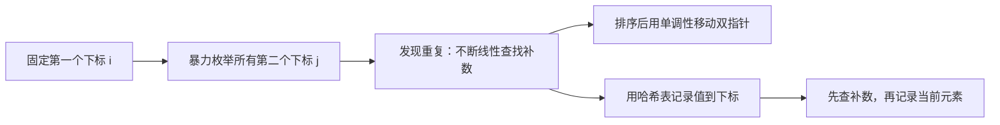
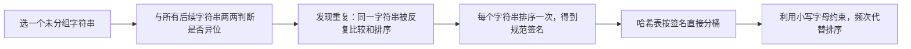
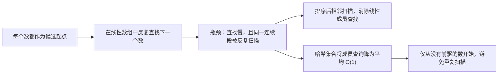
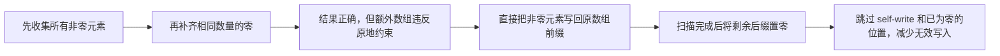
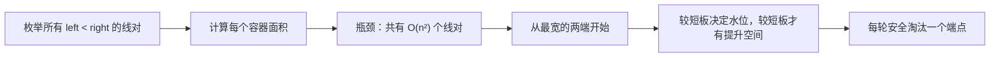
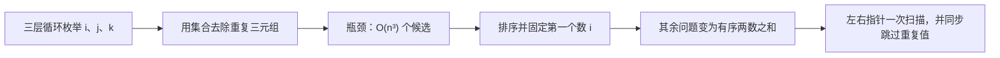

# 力扣 Hot100 面试学习宝典

这份笔记不把“背下最优代码”当作终点，而是训练从题目条件推导算法的能力。每道题都按同一条思考链展开：**读题识别特征 → 写出暴力解 → 定位重复工作 → 选择数据结构或性质优化 → 说清不变量与边界 → 比较方案取舍**。

## 每道题的解题框架

拿到一道新题时，先依次回答下面的问题；即使暂时想不到最优解，也能先产出正确、可验证的思路。

1. **题目特征是什么，为什么会想到这个分类或算法？**
   - 关注输入形态（数组、链表、树、图）、目标（查找、计数、最值、区间）和约束（有序、唯一、连续、可修改）。
   - 例如“在数组中反复判断某值是否存在”是哈希表信号；“有序数组中找两个数的关系”是双指针信号。
2. **暴力解怎样写，瓶颈在哪里？**
   - 暴力解是正确性的锚点。先明确枚举了什么、复杂度是多少，再定位哪一层重复扫描、排序或计算可以被替代。
3. **优化依据是什么？**
   - 不是直接背“这题用哈希”。要说清：哈希表把“线性查找补数”替换为“平均常数时间查找”；排序则制造单调性，让指针移动能排除一批候选。
4. **不变量是什么？**
   - 不变量是循环开始、执行中和结束时始终成立的条件。它既用于证明正确性，也直接指导代码顺序。
   - 常见形式包括“哈希表只存已处理元素”“答案仍在当前双指针区间内”“窗口始终满足约束”。
5. **边界和初始化为什么这样写？**
   - 明确循环区间是左闭右开 `[left, right)` 还是闭区间 `[left, right]`；循环条件是否允许相等；初始值能否代表“尚未找到”。
   - 用最小输入、重复元素、全相同元素、答案在边界等样例手动走一遍。
6. **非最优解有什么取舍？**
   - 比较时间、空间、是否修改输入、是否保留原下标、实现难度和可迁移性。非最优解常常是最优解的推导台阶，也可能更适合题目的变体。

后续每题沿用“题目 → 识别信号 → 暴力到优化 → 各方案（不变量、边界、取舍）→ 面试表达”的结构。

# 哈希

## 1. 两数之和

- 题目链接：[1. 两数之和](https://leetcode.cn/problems/two-sum/description/)
- 难度：简单
- 核心分类：哈希表；也可从排序 + 双指针理解其替代方案。

### 题目

给定一个整数数组 `nums` 和一个整数目标值 `target`，请你在该数组中找出和为目标值 `target` 的那两个整数，并返回它们的数组下标。

你可以假设每种输入只会对应一个答案，并且你不能使用两次相同的元素。

你可以按任意顺序返回答案。

**示例 1：**

```text
输入：nums = [2, 7, 11, 15], target = 9
输出：[0, 1]
解释：因为 nums[0] + nums[1] == 9，返回 [0, 1]。
```

**示例 2：**

```text
输入：nums = [3, 2, 4], target = 6
输出：[1, 2]
```

**示例 3：**

```text
输入：nums = [3, 3], target = 6
输出：[0, 1]
```

**约束：**

- `2 <= nums.length <= 10^4`
- `-10^9 <= nums[i] <= 10^9`
- `-10^9 <= target <= 10^9`
- 只会存在一个有效答案。

**进阶：** 你可以想出一个时间复杂度小于 $O(n^2)$ 的算法吗？

### 读题：哪些特征指向哈希表

这题的等式可以改写为：

$$
nums[j] = target - nums[i]
$$

固定一个数 `nums[i]` 后，问题就变成“数组中是否存在它的补数 `target - nums[i]`”。这正是哈希表的典型使用信号：

| 题目特征 | 推导出的需求 | 对应工具 |
| --- | --- | --- |
| 在无序数组中找两个数的和 | 固定一个数，查询补数是否存在 | 哈希表的 `值 -> 下标` 映射 |
| 要返回下标而不是数值 | 查询到值后还要知道来源位置 | 哈希表的值存下标 |
| 元素不能重复使用 | 查询的补数必须来自另一位置 | 维护“已遍历元素”或显式校验下标 |
| 数据没有有序性 | 不能直接依据大小移动指针 | 若想用双指针，先排序并保存原下标 |

因此，面试中不要只说“这是两数之和，所以用哈希表”，而应说：**暴力解对每个元素都重复线性寻找补数；哈希表能把这次查找降为平均 $O(1)$，并同时保存答案下标。**

### 从暴力到优化



暴力解枚举下标对，排序双指针通过排序消除部分枚举，哈希表则直接消除“寻找补数”的内层扫描。下面按这个推导顺序展开。

### 方案一：两层枚举（正确性起点）

#### 思路

固定第一个下标 `i`，再枚举它之后的下标 `j`。只枚举 `j > i`，每一对不同下标恰好检查一次。

```cpp
class Solution {
public:
    vector<int> twoSum(vector<int>& nums, int target) {
        const int n = static_cast<int>(nums.size());

        for (int i = 0; i < n; ++i) {
            for (int j = i + 1; j < n; ++j) {
                if (nums[i] + nums[j] == target) {
                    return {i, j};
                }
            }
        }

        return {};
    }
};
```

#### 不变量与正确性

- 外层处理到 `i` 时，所有左端点小于 `i` 的下标对都已检查完毕。
- 内层处理到 `j` 时，所有形如 `(i, k)` 且 `i < k < j` 的下标对都已检查完毕。
- 答案的一对下标总能写成 `p < q`。当外层到达 `p`、内层到达 `q` 时必会命中，因此不会漏解；`j = i + 1` 又保证不会出现 `i == j`。

#### 边界与细节

- 内层从 `i + 1` 开始而非 `0`：避免与自身配对，也避免检查 `(i, j)` 与 `(j, i)` 两次。
- 循环条件使用 `i < n`、`j < n`，对应数组合法的左闭右开下标区间 `[0, n)`。
- 题目保证有解；`return {}` 是为了让函数在通用语义下完整。面试时可以说明它在本题不可达。

#### 复杂度与取舍

| 时间复杂度 | 空间复杂度 | 优点 | 代价 |
| --- | --- | --- | --- |
| `O(n²)` | `O(1)` | 最容易写对，不依赖额外数据结构 | 每个 `i` 都重新扫描后续元素，存在大量重复比较 |

它不是最终答案，但应当会写、会讲：这是后续优化的基准，也是在面试中先保证正确性的稳妥起点。

### 方案二：排序 + 双指针（利用单调性）

#### 思路

排序能让数值具有单调性。设左右指针为 `left`、`right`：

- 和太小，必须增大较小端，令 `++left`。
- 和太大，必须减小较大端，令 `--right`。

本题要求返回原下标，不能直接排序 `nums`；需要复制成 `{数值, 原下标}` 后排序。

```cpp
class Solution {
public:
    vector<int> twoSum(vector<int>& nums, int target) {
        vector<pair<int, int>> values_with_indices;
        values_with_indices.reserve(nums.size());

        for (int i = 0; i < static_cast<int>(nums.size()); ++i) {
            values_with_indices.emplace_back(nums[i], i);
        }

        sort(values_with_indices.begin(), values_with_indices.end());

        int left = 0;
        int right = static_cast<int>(values_with_indices.size()) - 1;
        while (left < right) {
            const int sum = values_with_indices[left].first +
                            values_with_indices[right].first;

            if (sum == target) {
                return {values_with_indices[left].second,
                        values_with_indices[right].second};
            }
            if (sum < target) {
                ++left;
            } else {
                --right;
            }
        }

        return {};
    }
};
```

#### 不变量与正确性

若尚未返回答案，则当前闭区间 `[left, right]` 中仍保留至少一组可能的答案。

- 初始时 `[0, n - 1]` 包含所有元素，不变量显然成立。
- 若当前和小于 `target`，对任意 `k < right`，都有 `values[left] + values[k] <= values[left] + values[right] < target`。`left` 不可能参与答案，右移 `left` 不会丢失答案。
- 若当前和大于 `target`，对任意 `k > left`，都有 `values[k] + values[right] >= values[left] + values[right] > target`。`right` 不可能参与答案，左移 `right` 不会丢失答案。
- 每次都安全排除一个端点；最终命中答案，或区间不足两个元素时结束。

#### 边界与细节

- `left = 0`、`right = n - 1` 对应闭区间 `[left, right]`，所以循环条件是 `left < right`，而不是 `left <= right`。相等时只剩一个元素，不能使用两次。
- `pair<int, int>` 的第一个成员是排序依据，第二个成员是原下标；不要对原数组排序后再试图恢复下标。
- 本题范围内两个 `int` 相加安全；遇到范围更大的变体，可把 `sum` 写成 `const long long sum = ...`。

#### 复杂度与取舍

| 时间复杂度 | 空间复杂度 | 获得什么 | 付出什么 | 更适合的场景 |
| --- | --- | --- | --- | --- |
| `O(n log n)` | `O(n)` | 双指针扫描只需 `O(n)`，思路可迁移到有序数组 | 排序主导总复杂度，且必须保留原下标 | 输入已排序、只需返回数值，或问题天然具有单调性 |

这是非最优解，但非常值得掌握。它展示了另一种优化方式：**不是加速查找，而是构造有序性后一次排除一批候选。**

### 方案三：两遍哈希表（把建表与查询分开）

#### 思路

先用一遍遍历建立 `值 -> 下标` 映射，再用第二遍遍历查询每个数的补数。它比一遍哈希多走了一次数组，但把“表里有什么”和“如何查表”分成两段，初学时更容易手写正确。

```cpp
class Solution {
public:
    vector<int> twoSum(vector<int>& nums, int target) {
        unordered_map<int, int> index_by_value;
        index_by_value.reserve(nums.size());

        for (int i = 0; i < static_cast<int>(nums.size()); ++i) {
            index_by_value[nums[i]] = i;
        }

        for (int i = 0; i < static_cast<int>(nums.size()); ++i) {
            const int complement = target - nums[i];
            const auto it = index_by_value.find(complement);

            if (it != index_by_value.end() && it->second != i) {
                return {i, it->second};
            }
        }

        return {};
    }
};
```

#### 不变量与正确性

- 第一轮结束后，对于数组中的每个不同数值，`index_by_value` 至少保存它的一个合法下标；重复值时保存最后一次出现的下标。
- 第二轮处理 `i` 时，若补数存在且 `it->second != i`，两个下标不同且数值和为 `target`，可以直接返回。
- 对答案 `(p, q)` 而言，遍历第二轮到 `p` 或 `q` 时都能查询到另一个值。对于 `[3, 3]`，表保存后一个 `3` 的下标，处理前一个 `3` 时仍能找到不同下标。

#### 边界与细节

- 必须检查 `it->second != i`。两遍建表后，当前元素已经在表中；若补数恰好等于当前值，不检查就可能把同一位置当成两个元素。
- `find` 只查询，不会修改哈希表；不要用 `index_by_value[complement]` 判断存在性，因为键不存在时 `operator[]` 会插入默认值，语义容易出错。
- `reserve(nums.size())` 只是减少扩容和 rehash（重哈希）的工程性优化，不影响核心逻辑。

#### 复杂度与取舍

| 时间复杂度 | 空间复杂度 | 获得什么 | 付出什么 |
| --- | --- | --- | --- |
| 平均 `O(n)` | `O(n)` | 建表、查表逻辑清晰，便于解释下标校验 | 需要第二次遍历，并额外写 `it->second != i` |

`unordered_map` 的查找和插入是**平均** $O(1)$；若发生极端哈希冲突，理论最坏总时间可退化到 $O(n^2)$。面试中通常按平均复杂度分析，同时说明这一前提即可。

### 方案四：一次遍历哈希表（推荐）

#### 思路

当前元素只需要与它之前出现的元素配对。因此遍历到 `i` 时：

1. 先查补数 `target - nums[i]` 是否已出现。
2. 找到则立即返回。
3. 否则记录 `nums[i] -> i`，供后面的元素查询。

```cpp
class Solution {
public:
    vector<int> twoSum(vector<int>& nums, int target) {
        unordered_map<int, int> index_by_value;
        index_by_value.reserve(nums.size());

        for (int i = 0; i < static_cast<int>(nums.size()); ++i) {
            const int complement = target - nums[i];
            const auto it = index_by_value.find(complement);

            if (it != index_by_value.end()) {
                return {it->second, i};
            }

            // 先查后插：哈希表中只保留当前下标之前的元素。
            index_by_value[nums[i]] = i;
        }

        return {};
    }
};
```

#### 不变量与正确性

循环处理下标 `i` 的开头，哈希表 `index_by_value` **只保存左闭右开区间 `[0, i)` 中出现过的值及其下标**。

- 初始 `i = 0` 时，区间为空，哈希表为空，不变量成立。
- 若查到 `complement`，对应下标必在 `[0, i)`，因此必然小于 `i`；返回的两个下标不同，且两数之和恰为 `target`。
- 若查不到，将 `nums[i] -> i` 插入后，哈希表恰好保存 `[0, i + 1)` 的元素；下一轮不变量继续成立。
- 若答案为 `(p, q)` 且 `p < q`，遍历到 `q` 前 `p` 已在表中，所以一定会命中答案。

这就是“**先查后插**”的证明，而不仅是需要记忆的模板。

#### 边界与细节

- `for (int i = 0; i < n; ++i)` 处理的是左闭右开区间 `[0, n)`，所有数组访问都安全。
- 必须先 `find(complement)`，再插入当前值。若反过来，当 `target == 2 * nums[i]` 时，当前元素会被自己匹配；例如单个 `3` 不能构成和为 `6` 的答案。
- `[3, 3]` 不会出错：处理第一个 `3` 时查不到并记录；处理第二个 `3` 时查到第一个的下标，返回 `[0, 1]`。
- 哈希表只需为每个值保存一个历史下标。重复值覆盖较早下标也不影响本题，因为查到的任一历史下标都合法。

#### 示例推演

`nums = [3, 2, 4]`，`target = 6`：

| 当前下标 `i` | 当前值 `nums[i]` | 需要的补数 | 查找前的哈希表 | 操作 |
| --- | --- | --- | --- | --- |
| `0` | `3` | `3` | `{}` | 未找到，记录 `3 -> 0` |
| `1` | `2` | `4` | `{3 -> 0}` | 未找到，记录 `2 -> 1` |
| `2` | `4` | `2` | `{3 -> 0, 2 -> 1}` | 找到 `2 -> 1`，返回 `[1, 2]` |

#### 复杂度与取舍

| 时间复杂度 | 空间复杂度 | 为什么推荐 | 需要特别记住的点 |
| --- | --- | --- | --- |
| 平均 `O(n)` | `O(n)` | 一次遍历完成查询与建表，代码短且自然保证下标不同 | 哈希表语义是“已处理元素”；顺序必须先查后插 |

### 方案选择与 Trade-off

| 方案 | 时间 | 空间 | 是否修改原数组 | 主要优势 | 主要代价 |
| --- | --- | --- | --- | --- | --- |
| 两层枚举 | `O(n²)` | `O(1)` | 否 | 最直接，容易证明 | 大量重复比较 |
| 排序 + 双指针 | `O(n log n)` | `O(n)` | 否，本实现复制后排序 | 单调性强，适合有序数组变体 | 排序较慢，必须维护原下标 |
| 两遍哈希 | 平均 `O(n)` | `O(n)` | 否 | 建表与查询分离，容易写对 | 多一次遍历，要显式排除同下标 |
| 一遍哈希 | 平均 `O(n)` | `O(n)` | 否 | 本题最简洁高效 | 必须准确维护“先查后插”的不变量 |

选择并非只看大 $O$：若原数组已按升序给出，双指针可做到 $O(n)$ 时间、$O(1)$ 额外空间；若需要在线处理数据流，一遍哈希更自然；若面试刚开始且时间充足，可以先给出两层枚举，再推导哈希优化以展示思考过程。

### 面试手撕表达

可以用下面这段逻辑完成从暴力到最优的讲解：

> 暴力做法枚举两个下标，时间是 $O(n^2)$。固定 `nums[i]` 后，我只需要知道补数 `target - nums[i]` 是否已经出现过，因此用哈希表保存“值到下标”。遍历时我先查补数，再记录当前数；这样哈希表始终只含当前下标之前的元素，保证不会重复使用同一个元素。平均时间 $O(n)$，额外空间 $O(n)$。

### 复习检查

- 能否不看答案写出双层循环，并解释为什么 `j` 从 `i + 1` 开始？
- 能否解释排序双指针中，`sum < target` 时为什么只能移动 `left`？
- 能否说出一遍哈希的精确不变量：处理 `i` 前，表中保存 `[0, i)` 的元素？
- 能否解释“一遍哈希必须先查后插”，以及它如何处理 `[3, 3]`？
- 能否区分 `map` 的 $O(n \log n)$ 和 `unordered_map` 的平均 $O(n)$？

## 2. 字母异位词分组

- 题目链接：[49. 字母异位词分组](https://leetcode.cn/problems/group-anagrams/description/)
- 难度：中等
- 核心分类：哈希表、字符串、规范化表示。

### 题目

给你一个字符串数组 `strs`，请你将**字母异位词**组合在一起。可以按任意顺序返回结果列表。

字母异位词指两个字符串使用的每种字符及其出现次数完全相同，只是字符排列顺序不同。

**示例 1：**

```text
输入：strs = ["eat", "tea", "tan", "ate", "nat", "bat"]
输出：[["bat"], ["nat", "tan"], ["ate", "eat", "tea"]]
解释："nat" 和 "tan" 互为字母异位词；"ate"、"eat"、"tea" 互为字母异位词。
```

**示例 2：**

```text
输入：strs = [""]
输出：[[""]]
```

**示例 3：**

```text
输入：strs = ["a"]
输出：[["a"]]
```

**约束：**

- `1 <= strs.length <= 10^4`
- `0 <= strs[i].length <= 100`
- `strs[i]` 仅包含小写字母。

### 读题：哪些特征指向“签名 + 哈希分组”

本题不是询问“某个值是否出现过”，而是要把满足同一关系的多个字符串放入同一个桶。关键是把“两个字符串互为异位词”转化成一个可以作为哈希键的、确定且相同的表示，称为**规范签名**。

| 题目特征 | 推导出的需求 | 对应做法 |
| --- | --- | --- |
| 只要求按字符重排后是否相同 | 忽略字符原始顺序，保留字符组成 | 将排序后的字符串作为签名 |
| 字符仅有 `a` 到 `z` | 可以记录每种字符的次数 | 用长度为 26 的频次数组作为签名 |
| 需要分组而非找单个答案 | 相同签名的元素持续归入同一个容器 | 哈希表：`签名 -> 字符串列表` |
| 输出顺序任意 | 不要求哈希表键的遍历顺序稳定 | `unordered_map` 足够使用 |

面试中的关键表达是：**先为每个字符串构造一个唯一描述其字符组成的签名，再按签名用哈希表分桶。** 哈希表解决“该字符串属于哪一组”，签名解决“什么样的字符串算同一组”。

### 从暴力到优化



设字符串数量为 $n$，最长字符串长度为 $k$。暴力方法的瓶颈是 $O(n^2)$ 次“是否异位词”的比较；优化后，每个字符串只构造一次签名，并只进行一次哈希表查找。

### 方案一：两两比较后分组（暴力起点）

#### 思路

从左到右选取一个尚未分组的字符串作为当前组的代表，再扫描其后的所有字符串。若两个字符串互为字母异位词，就加入同一组，并标记为已使用。

这里用“复制后排序”判断两个字符串是否异位词：原字符串不被修改，排序结果相同当且仅当两个字符串的字符多重集合相同。

```cpp
class Solution {
public:
    vector<vector<string>> groupAnagrams(vector<string>& strs) {
        // 记录每个下标是否已被某个分组收纳，初始时所有字符串均未分组。
        vector<bool> used(strs.size(), false);
        // 保存最终的所有分组。
        vector<vector<string>> result;

        for (int i = 0; i < static_cast<int>(strs.size()); ++i) {
            // 已被此前代表字符串归类的元素不再重复建组。
            if (used[i]) {
                continue;
            }

            // 为当前未分组字符串创建一个新桶，并先放入它自己。
            vector<string> group{strs[i]};
            // 标记当前代表字符串已归入这个新桶。
            used[i] = true;

            for (int j = i + 1; j < static_cast<int>(strs.size()); ++j) {
                // 已经分组的字符串无需再次与当前代表比较。
                if (used[j]) {
                    continue;
                }
                // 只有与代表字符串互为异位词的元素才能进入当前桶。
                if (areAnagrams(strs[i], strs[j])) {
                    // 保存找到的同组字符串。
                    group.push_back(strs[j]);
                    // 防止它在后续外层循环中成为新的代表。
                    used[j] = true;
                }
            }

            // 当前代表能匹配的所有字符串均已扫描，提交该分组。
            result.push_back(std::move(group));
        }

        // 返回所有互不重叠的分组。
        return result;
    }

private:
    bool areAnagrams(const string& first, const string& second) {
        // 长度不同意味着字符总数不同，无需进行排序比较。
        if (first.size() != second.size()) {
            return false;
        }

        // 复制第一个字符串，避免改变输入数组中的内容。
        string sorted_first = first;
        // 复制第二个字符串，供独立排序。
        string sorted_second = second;
        // 排序后，相同字符组成会被排列成相同序列。
        sort(sorted_first.begin(), sorted_first.end());
        // 与第一个排序结果使用相同的规范化规则。
        sort(sorted_second.begin(), sorted_second.end());

        // 两个规范化序列相等，当且仅当原字符串互为字母异位词。
        return sorted_first == sorted_second;
    }
};
```

#### 不变量与正确性

- 每次外层循环开始时，所有 `used == true` 的字符串已经属于 `result` 中某个完整分组，且不会再被处理。
- 选中代表 `strs[i]` 后，内层循环已检查区间 `[i + 1, j)` 中每一个尚未使用的字符串：其中异位词已加入 `group`，非异位词不属于该组。
- “互为异位词”是等价关系，具有传递性：若字符串都与同一代表异位，它们彼此也异位。因此扫描结束时 `group` 就是代表字符串所在的完整分组。

#### 边界与细节

- 内层从 `j = i + 1` 开始，不必重新比较代表自身，也不重复比较已经在左侧出现的字符串。
- 空字符串合法：两个空字符串排序后仍相等，能被分到同一组；一个空字符串会单独形成一组。
- `std::move(group)` 只转移局部 `vector` 的资源到 `result`，不会改变其中字符串的内容；此处不写也正确，只是会多一次容器复制。

#### 复杂度与取舍

| 时间复杂度 | 额外空间 | 优点 | 代价 |
| --- | --- | --- | --- |
| `O(n² × k log k)` | `O(n + k)`，不含输出 | 从分组定义直接出发，正确性直观 | 同一字符串会在多次两两比较中被重复复制和排序 |

这是理解题意的保底方案，但在 `n = 10^4` 时不可接受。优化的目标很明确：让每个字符串只计算一次“属于哪一组”的依据。

### 方案二：排序字符串作为哈希键（通用推荐）

#### 思路

一个字符串排序后，字符顺序被消除，但每种字符的数量被完整保留。例如 `"tea"`、`"eat"`、`"ate"` 都会得到签名 `"aet"`。因此可用排序结果作为键，把原字符串追加到对应的哈希桶中。

```cpp
class Solution {
public:
    vector<vector<string>> groupAnagrams(vector<string>& strs) {
        // 键是排序后的签名，值是具有该签名的原始字符串列表。
        unordered_map<string, vector<string>> groups;
        // 预留桶数量以减少插入大量不同签名时的 rehash。
        groups.reserve(strs.size());

        for (const string& str : strs) {
            // 复制原字符串作为签名，保留 str 以原始顺序进入结果。
            string key = str;
            // 排序把所有异位词规范化为同一个键。
            sort(key.begin(), key.end());
            // 若 key 首次出现则创建空分组，再把当前原字符串放入该组。
            groups[key].push_back(str);
        }

        // 哈希表的值就是答案中的各个分组。
        vector<vector<string>> result;
        // 预留最终分组数，避免搬运分组时反复扩容。
        result.reserve(groups.size());
        for (auto& entry : groups) {
            // 转移一个完整分组；题目允许分组的返回顺序任意。
            result.push_back(std::move(entry.second));
        }

        // 返回按签名划分后的所有分组。
        return result;
    }
};
```

#### 不变量与正确性

处理完前 $t$ 个字符串后，哈希表满足：对于每个签名 `key`，`groups[key]` 恰好包含前缀 `strs[0..t)` 中所有排序后等于 `key` 的字符串。

- 初始时前缀为空，哈希表为空，不变量成立。
- 处理新字符串时，排序得到唯一签名 `key`，再将它追加到 `groups[key]`，不影响其他签名对应的分组，因此不变量保持。
- 两个字符串排序后相同，当且仅当它们每种字符的出现次数相同，即二者互为字母异位词。遍历结束时，每个桶恰好是一组异位词。

#### 边界与细节

- `string key = str` 必须复制：排序 `key` 不应改变 `strs` 的原始内容，也不能对 `const string& str` 排序。
- `groups[key]` 的 `operator[]` 在键不存在时创建一个空 `vector<string>`；这正好符合“首次看到一个签名时新建分组”的需求。
- 空字符串的排序键是空字符串 `""`，能正常作为 `unordered_map` 的键。
- 若题目要求稳定的组顺序或组内顺序，需要额外处理；本题声明任意顺序，哈希表遍历顺序无影响。

#### 复杂度与取舍

每个长度为 $m$ 的字符串需排序 `O(m log m)`。令 $k$ 为最长长度，总时间为 `O(n × k log k)`；哈希表操作按平均 `O(1)` 计算。

| 时间复杂度 | 辅助空间 | 优点 | 代价 | 适用范围 |
| --- | --- | --- | --- | --- |
| 平均 `O(n × k log k)` | `O(n × k)`，不含输出 | 代码短、签名直观、字符集不局限于 26 个小写字母 | 每个字符串都需要排序 | 通用的字母异位词分组 |

这是面试中最推荐先写的版本：签名构造逻辑清楚，代码量小，且不依赖本题“小写字母”这一特定约束。

### 方案三：字符频次作为哈希键（利用题目约束优化）

#### 思路

题目保证字符串只包含 `a` 到 `z`。因此不必排序：统计 26 个字母各出现多少次，得到的频次数组本身就唯一描述了字符组成。

`unordered_map` 不能直接把 `array<int, 26>` 当作键，所以这里将 26 个计数按固定顺序并加分隔符拼成字符串键。分隔符不可省略，例如计数序列 `[1, 11]` 与 `[11, 1]` 不能被拼成同一串。

```cpp
class Solution {
public:
    vector<vector<string>> groupAnagrams(vector<string>& strs) {
        // 键是 26 个字符频次的序列化结果，值是对应的异位词分组。
        unordered_map<string, vector<string>> groups;
        // 提前分配可能的不同签名桶，减少哈希表扩容次数。
        groups.reserve(strs.size());

        for (const string& str : strs) {
            // 零初始化 26 个计数器，第 i 项对应字符 'a' + i。
            array<int, 26> counts{};
            for (const char ch : str) {
                // 题目保证 ch 是小写字母，因此该下标位于 [0, 25]。
                ++counts[ch - 'a'];
            }

            // 构造固定格式的键；预留空间避免多次扩容。
            string key;
            key.reserve(26 * 4);
            for (const int count : counts) {
                // 先写分隔符，消除不同数字序列拼接后的歧义。
                key.push_back('#');
                // 再写当前字母的出现次数，完整保留频次信息。
                key += to_string(count);
            }

            // 相同频次键的字符串必互为异位词，因此追加到同一个桶。
            groups[key].push_back(str);
        }

        // 将哈希表中的每个桶转移到题目要求的二维结果中。
        vector<vector<string>> result;
        // 结果最多与不同签名数一样多，先预留对应容量。
        result.reserve(groups.size());
        for (auto& entry : groups) {
            // 输出顺序任意，可以直接按哈希表的遍历顺序转移分组。
            result.push_back(std::move(entry.second));
        }

        // 返回所有按频次签名聚合的字符串组。
        return result;
    }
};
```

#### 不变量与正确性

处理完前 $t$ 个字符串后，`groups[key]` 恰好包含前缀 `strs[0..t)` 中频次数组序列化为 `key` 的所有字符串。

- `counts{}` 在每次外层循环开始时都重新归零，所以它只描述当前字符串，不会混入上一个字符串的字符。
- 内层计数结束后，`counts[i]` 等于当前字符串中字符 `'a' + i` 的出现次数。
- 两个仅由小写字母组成的字符串频次数组相同，当且仅当它们互为字母异位词；固定顺序和分隔符保证不同数组不会序列化成相同键。
- 将当前字符串放入 `groups[key]` 后，不变量扩展到前缀 `[0, t + 1)`。

#### 边界与细节

- `array<int, 26> counts{}` 的花括号不可省略：它保证所有计数从 `0` 开始。若未初始化，累加结果没有意义。
- `ch - 'a'` 依赖“仅小写字母”的题设；若输入可能包含大写、Unicode 或任意字符，26 格数组不再成立，应回退到排序签名或改用更一般的计数结构。
- 空字符串会得到 26 个 `0` 组成的固定键，多个空字符串自然会进入同一组。
- 序列化键的长度在本题中是常数级：26 个计数且每个计数不超过 100，因此 26 次 `to_string` 不改变关于 $k$ 的线性扫描结论。

#### 复杂度与取舍

统计字符需要 `O(m)`，构建长度固定的 26 维签名为 `O(1)`；对所有字符串，总时间为平均 `O(n × k)`。

| 时间复杂度 | 辅助空间 | 优点 | 代价 | 使用前提 |
| --- | --- | --- | --- | --- |
| 平均 `O(n × k)` | `O(n)`，不含输出 | 不排序，理论更快 | 键构造更绕，强依赖字符集大小固定 | 字符仅为 `a` 到 `z` 或字符集很小且固定 |

### 方案选择与 Trade-off

| 方案 | 时间 | 辅助空间 | 主要优势 | 主要代价 | 面试定位 |
| --- | --- | --- | --- | --- | --- |
| 两两比较 | `O(n² × k log k)` | `O(n + k)` | 直接体现分组定义 | 重复比较、无法通过大规模数据 | 用于从暴力推导优化 |
| 排序签名 + 哈希 | 平均 `O(n × k log k)` | `O(n × k)` | 通用、短小、最容易手写 | 每个字符串都要排序 | 推荐默认答案 |
| 频次签名 + 哈希 | 平均 `O(n × k)` | `O(n)` | 利用 26 字母约束，省去排序 | 依赖固定字符集，签名实现更复杂 | 约束明确时的优化答案 |

这里的“辅助空间”不含题目要求返回的字符串分组。若把输出也算入，三种方案都至少需要 `O(n × k)` 存放所有返回字符串。

### 面试手撕表达

> 暴力做法是选择一个字符串，再与所有其他字符串判断是否互为异位词，最坏有 `O(n²)` 次比较。优化的关键是为每个字符串生成一个不依赖排列顺序的签名：把字符串排序后，所有异位词都会得到同一个键。用哈希表维护“签名到字符串列表”，遍历一次就能完成分组，平均时间是 `O(n × k log k)`。因为这题字符只含小写字母，也可以用 26 位频次替代排序，把时间优化到平均 `O(n × k)`，但通用性更差。

### 复习检查

- 为什么“排序后的字符串相同”等价于“原字符串互为字母异位词”？
- 为什么哈希表的键不能直接使用原字符串？
- 能否说出排序签名方案的循环不变量：处理前 $t$ 个字符串后，每个桶恰好包含此前具有对应签名的所有字符串？
- `array<int, 26> counts{}` 为什么必须每次处理新字符串时重新初始化？
- 频次序列化时为什么要加入分隔符？
- 面试中何时优先写排序签名，何时选择频次签名？

## 3. 最长连续序列

- 题目链接：[128. 最长连续序列](https://leetcode.cn/problems/longest-consecutive-sequence/description/)
- 难度：中等
- 核心分类：哈希集合、连续区间、去重、从起点扩展。

### 题目

给定一个未排序的整数数组 `nums`，找出数字连续的最长序列（不要求序列元素在原数组中连续）的长度。

请你设计并实现时间复杂度为 `O(n)` 的算法解决此问题。

**示例 1：**

```text
输入：nums = [100, 4, 200, 1, 3, 2]
输出：4
解释：最长数字连续序列是 [1, 2, 3, 4]，长度为 4。
```

**示例 2：**

```text
输入：nums = [0, 3, 7, 2, 5, 8, 4, 6, 0, 1]
输出：9
```

**示例 3：**

```text
输入：nums = [1, 0, 1, 2]
输出：3
```

**约束：**

- `0 <= nums.length <= 10^5`
- `-10^9 <= nums[i] <= 10^9`

### 读题：哪些特征指向哈希集合

题目里的“连续”指的是**数值连续**，不是下标连续。例如 `[100, 4, 200, 1, 3, 2]` 中的 `1, 2, 3, 4` 在原数组里并不相邻，却构成答案。

| 题目特征 | 推导出的需求 | 对应做法 |
| --- | --- | --- |
| 原数组无序，但关心 `x - 1`、`x + 1` 是否存在 | 高频执行“某个数是否存在”的查询 | `unordered_set` 平均 `O(1)` 成员查询 |
| 数组允许重复元素 | 重复值不能让同一序列重复计数 | 先放入集合，自动去重 |
| 要求严格优于排序的 `O(n log n)` | 不能依赖全局排序建立相邻关系 | 在集合中直接查找相邻数值 |
| 要找最长完整连续段 | 不能从每个数都重复向后扫描 | 只从不存在前驱的数，即序列起点扩展 |

这题最重要的读题转换是：把数组看成一个“数值集合”。对于数值 `x`，只要知道 `x - 1` 和 `x + 1` 是否存在，就能确定它在连续序列中的位置；原下标和原排列都不再重要。

### 从暴力到优化



设数组长度为 $n$。优化并非只做“线性查找改成哈希查找”：即使哈希查询很快，如果从 `1`、`2`、`3` 都分别扫描 `1,2,3,4,...` 的后缀，同一段仍会被反复走过。**成员查询**和**只选合法起点**缺一不可。

### 方案一：逐个起点 + 线性查找（暴力起点）

#### 思路

把每个 `nums[i]` 都当作可能起点，并不断在线性数组中查找 `current + 1`。只要下一个数存在，序列长度就加一。虽然这能得到正确答案，但同一个数既可能被多次查找，也可能被多次作为中间起点重新向后扩展。

```cpp
class Solution {
public:
    int longestConsecutive(vector<int>& nums) {
        // 保存目前发现的最长连续序列长度；空数组时自然保持为 0。
        int longest = 0;

        for (const int start : nums) {
            // 从当前候选起点开始尝试向右扩展数值序列。
            int current = start;
            // 当前候选序列至少包含起点自身。
            int length = 1;

            // 只要数组中还存在线性查找到的下一个数，就继续延长序列。
            while (find(nums.begin(), nums.end(), current + 1) != nums.end()) {
                // 将当前数推进到刚刚确认存在的后继数。
                ++current;
                // 后继数加入序列后，长度同步增加。
                ++length;
            }

            // 用当前候选序列更新全局最优答案。
            longest = max(longest, length);
        }

        // 所有起点均已尝试完毕，返回最长长度。
        return longest;
    }
};
```

#### 不变量与正确性

- `while` 每轮开始时，`[start, current]` 中的每个整数都在数组中，且 `length == current - start + 1`。
- 查找到 `current + 1` 后，连续区间可安全扩展一位，因此更新后不变量仍成立。
- 最长连续序列的最小数也必然出现在 `nums` 中；当外层循环选到它时，会扩展并得到整个序列，故取最大值不会漏掉答案。

#### 边界与细节

- 空数组时外层循环不执行，初始值 `longest = 0` 正好是答案；不要把初始值写成 `1`。
- 重复值不会影响正确性，但会让相同扩展过程被重复执行，例如两个 `1` 都会再次查找 `2, 3, ...`。
- 本题范围使 `current + 1` 不会触及 `int` 上界；更一般的题目中，若数值可为 `INT_MAX`，需要先处理溢出风险。

#### 复杂度与取舍

最坏情况下，每个起点可扩展 `O(n)` 次，每次 `find` 又扫描 `O(n)` 个位置，总时间为 `O(n³)`。

| 时间复杂度 | 辅助空间 | 优点 | 代价 |
| --- | --- | --- | --- |
| `O(n³)` | `O(1)` | 直接从“连续数值”定义出发 | 重复扫描和线性成员查找都很严重 |

这个版本的价值在于定位两个瓶颈：如何更快地判断后继存在，以及如何不重复扩展同一条序列。

### 方案二：排序后单次扫描（消除查找）

#### 思路

排序后，相同数值和相邻数值都会排在一起。一次从左到右扫描即可维护“以当前数结尾的连续序列长度”：

- 遇到重复值时跳过，不能让长度增加。
- 遇到前一个不同值加一时，当前连续段延长。
- 否则出现断层，当前连续段从 `1` 重新开始。

```cpp
class Solution {
public:
    int longestConsecutive(vector<int>& nums) {
        // 空数组没有任何连续序列，提前返回以避免访问 sorted_nums[0]。
        if (nums.empty()) {
            return 0;
        }

        // 复制输入后再排序，避免改变调用方传入的原数组。
        vector<int> sorted_nums = nums;
        // 让相同和相邻的数在扫描时相邻出现。
        sort(sorted_nums.begin(), sorted_nums.end());

        // 第一个数单独构成长度为 1 的连续序列。
        int current_length = 1;
        // 当前最优答案至少为第一个数形成的长度 1。
        int longest = 1;

        for (size_t i = 1; i < sorted_nums.size(); ++i) {
            // 重复值不能视为连续序列的新元素，直接跳过且不重置长度。
            if (sorted_nums[i] == sorted_nums[i - 1]) {
                continue;
            }

            // 当前不同值恰好接在前一个值之后，延长当前连续段。
            if (sorted_nums[i] == sorted_nums[i - 1] + 1) {
                ++current_length;
            } else {
                // 数值出现断层，当前值只能作为新连续段的起点。
                current_length = 1;
            }

            // 每处理一个不同值后，更新截至当前位置的最长答案。
            longest = max(longest, current_length);
        }

        // 扫描完成后返回全局最长连续段。
        return longest;
    }
};
```

#### 不变量与正确性

处理到 `sorted_nums[i]` 后：

- `current_length` 是去重后的已处理前缀中，以当前不同数值结尾的最长连续后缀长度。
- `longest` 是该前缀中所有连续段长度的最大值。
- 重复值不改变任何连续关系；相差 `1` 时后缀延长；相差大于 `1` 时，旧后缀不可能跨越缺失数，重置为 `1` 正确。

这三个分支覆盖排序后相邻元素的全部关系，因此扫描结束时 `longest` 即为答案。

#### 边界与细节

- 先判断 `nums.empty()`：否则初始化为 `1`、以及从下标 `1` 开始的循环都不成立。
- 循环从 `i = 1` 开始，所以 `sorted_nums[i - 1]` 始终合法；这是左闭右开区间 `[1, sorted_nums.size())` 的直接结果。
- **重复值分支必须 `continue`**。例如 `[1, 1, 2]`：若重复 `1` 时把 `current_length` 重置为 `1`，随后仍可能得到正确值；但更复杂的写法极易在重复值处错误截断，跳过最清晰。
- 本题范围内 `sorted_nums[i - 1] + 1` 安全；通用实现应留意 `INT_MAX + 1` 的溢出。

#### 复杂度与取舍

| 时间复杂度 | 辅助空间 | 是否修改输入 | 主要优势 | 主要代价 |
| --- | --- | --- | --- | --- |
| `O(n log n)` | 本实现为 `O(n)` | 否 | 不依赖哈希表，扫描逻辑稳定、容易验证 | 排序无法满足题目要求的 `O(n)` |

若允许修改输入，可直接对 `nums` 排序，将除排序栈外的额外空间降到常数级；代价是调用者观察到的数组顺序会被改变。这个方案在“数组已排序”或“不要求线性时间”的变体中尤其合适。

### 方案三：哈希集合 + 只从序列起点扩展（推荐）

#### 思路

先将所有数放入 `unordered_set`，得到去重后的数值集合。对集合中的数 `num`：

- 若 `num - 1` 存在，`num` 一定不是一段连续序列的起点，跳过它。
- 若 `num - 1` 不存在，`num` 是该序列唯一的最小值；此时不断检查 `num + 1`、`num + 2`，直到序列结束。

```cpp
class Solution {
public:
    int longestConsecutive(vector<int>& nums) {
        // 用集合去重，并支持平均 O(1) 的“某个数是否存在”查询。
        unordered_set<int> values;
        // 预留与输入等量的桶，减少插入大量元素时的 rehash。
        values.reserve(nums.size());
        for (const int num : nums) {
            // 重复值插入集合不会产生新元素，正好消除重复序列起点。
            values.insert(num);
        }

        // 空集合的答案为 0；非空时由后续起点扫描更新。
        int longest = 0;
        for (const int num : values) {
            // 有前驱说明 num 是某个序列的中间元素，不应再次扫描该序列。
            if (values.find(num - 1) != values.end()) {
                continue;
            }

            // num 没有前驱，因此它是当前连续序列的唯一合法起点。
            int current = num;
            // 起点自身已经属于当前序列。
            int length = 1;
            // 从起点向后查询连续后继，直到下一个整数缺失。
            while (values.find(current + 1) != values.end()) {
                // 将当前位置推进到已确认存在的后继数。
                ++current;
                // 后继加入当前序列，长度增加一。
                ++length;
            }

            // 一整段连续序列扫描完毕后，再更新全局最优值。
            longest = max(longest, length);
        }

        // 所有序列起点均已处理，返回最长连续序列长度。
        return longest;
    }
};
```

#### 为什么“只从起点扩展”是线性的关键

如果对集合中的每个数都执行向后 `while`，连续段 `[1, 2, 3, ..., n]` 会被扫描 $n + (n - 1) + \cdots + 1$ 次，仍是二次复杂度。

起点判定 `num - 1` 不存在后，每个连续段只会由其最小数启动一次。不同连续段彼此不相交，所有内层 `while` 加起来至多访问集合中的每个不同数一次；外层也只遍历每个不同数一次。因此，在哈希操作平均 `O(1)` 的前提下，总时间为平均 `O(n)`。

**不要遍历 `nums`，而要遍历去重后的 `values`。** 若 `nums` 中有大量重复的序列起点，遍历原数组会让同一个起点重复启动扫描，破坏上述线性复杂度证明。

#### 不变量与正确性

- 处理起点 `num` 的 `while` 每轮开始时，区间 `[num, current]` 中每一个整数都在 `values`，且 `length == current - num + 1`。
- `current + 1` 存在时，序列可延长且不变量保持；不存在时，当前区间已经是以 `num` 为起点的完整连续序列。
- 每一条非空连续序列都存在唯一最小数 `start`，且 `start - 1` 不在集合中，所以外层必会从它启动一次扫描。
- 非起点都被跳过，起点扫描又覆盖其整段序列；每段都被计算且仅被计算一次，取最大长度即为答案。

#### 边界与细节

- 空数组构造出的 `values` 为空，循环不执行，`longest = 0` 正确返回。
- 示例 `[0, 3, 7, 2, 5, 8, 4, 6, 0, 1]` 中重复的 `0` 在集合中只保留一次，最长段为 `0` 到 `8`，长度为 `9`。
- `values.find(num - 1)` 使用 `find`，不会修改集合；循环中也不插入或删除集合元素，因此范围 `for` 遍历安全。
- 本题数值范围距 `int` 边界足够远，`num - 1` 与 `current + 1` 均不会溢出。若扩展到完整 `int` 范围，需在 `INT_MIN` 和 `INT_MAX` 附近额外保护。
- `unordered_set` 的查找、插入是平均 `O(1)`，极端哈希冲突下理论最坏会退化；题目所说的 `O(n)` 通常按哈希表的平均复杂度理解。

#### 复杂度与取舍

| 时间复杂度 | 辅助空间 | 是否修改输入 | 为什么推荐 | 代价 |
| --- | --- | --- | --- | --- |
| 平均 `O(n)` | `O(n)` | 否 | 满足题目线性时间要求，自动去重，逻辑直接对应“起点”定义 | 使用额外哈希空间，依赖平均哈希复杂度 |

### 方案选择与 Trade-off

| 方案 | 时间 | 辅助空间 | 是否修改输入 | 主要优势 | 主要代价 | 面试定位 |
| --- | --- | --- | --- | --- | --- | --- |
| 逐个起点 + 线性查找 | `O(n³)` | `O(1)` | 否 | 最直接体现“不断找下一个数” | 查找和扩展都重复 | 用于定位优化方向 |
| 排序 + 单次扫描 | `O(n log n)` | 本实现为 `O(n)` | 否 | 相邻关系直观，容易处理重复值 | 不满足线性时间要求 | 合理的过渡方案 |
| 哈希集合 + 起点扩展 | 平均 `O(n)` | `O(n)` | 否 | 满足题设，避免重复扫描 | 需要准确理解起点判定与哈希前提 | 推荐答案 |

### 面试手撕表达

> 暴力做法是从每个数开始，不断在线性数组中找下一个数，既查找慢又会重复扫描同一段序列。排序后可以线性扫描，但总时间仍是 `O(n log n)`。要做到平均 `O(n)`，我先用哈希集合去重并支持快速查找；只有当 `num - 1` 不存在时，`num` 才是连续段起点，我才向后检查 `num + 1`。这样每个连续段只扫描一次，所有内层扫描总计是线性的。

### 复习检查

- 为什么题目关心的是数值连续，而不是原数组下标连续？
- 排序扫描中，为什么遇到重复值必须跳过而不是增加长度？
- 为什么哈希方案不能从每一个数都向后扩展？请用 `[1, 2, 3, 4]` 说明。
- 为什么推荐代码遍历 `values` 而不是原数组 `nums`？
- 哈希方案的精确不变量是什么？
- 空数组、重复值和负数分别如何处理？

# 双指针

## 1. 移动零

- 题目链接：[283. 移动零](https://leetcode.cn/problems/move-zeroes/description/)
- 难度：简单
- 核心分类：双指针、稳定原地分区、数组原地修改。

### 题目

给定一个数组 `nums`，编写一个函数将所有 `0` 移动到数组的末尾，同时保持非零元素的相对顺序。

**请注意**，必须在不复制数组的情况下原地对数组进行操作。

**示例 1：**

```text
输入：nums = [0, 1, 0, 3, 12]
输出：[1, 3, 12, 0, 0]
```

**示例 2：**

```text
输入：nums = [0]
输出：[0]
```

**提示：**

- `1 <= nums.length <= 10^4`
- `-2^31 <= nums[i] <= 2^31 - 1`

**进阶：** 你能尽量减少完成的操作次数吗？

### 读题：哪些特征指向双指针

这题本质上不是排序：非零元素之间的相对顺序必须不变。它要求把数组稳定地划分为“所有非零元素”与“所有零”两部分，并且必须复用原数组的存储空间。

| 题目特征 | 推导出的需求 | 对应做法 |
| --- | --- | --- |
| 所有非零元素要排在前面 | 需要一个位置记录下一个非零元素应放到哪里 | `slow` 维护写入边界 |
| 要逐个检查原数组元素 | 需要一个位置顺序扫描全部元素 | `fast` 从左到右读取 |
| 非零元素相对顺序不能改变 | 只能按 `fast` 的扫描顺序写入前缀 | 稳定压缩，不做任意交换 |
| 必须原地操作 | 不能用额外数组保存完整结果 | `O(1)` 辅助空间的双指针 |
| 进阶要求减少操作 | 应避免无意义的自写入和交换 | `slow != fast` 时才搬运 |

可以把两个指针理解为两条不同职责的轨道：`fast` 负责**读**每个元素，`slow` 负责**写**下一个非零元素。只要读写职责分开，就能同时保证原地修改和相对顺序稳定。

### 从直觉方案到原地双指针



本题的三种方案时间都可以是 `O(n)`。演进的重点是从“额外空间换取直观”过渡到“原地稳定压缩”，再进一步关注实际写入次数。

### 方案一：辅助数组收集非零元素（直觉方案，不符合原地约束）

#### 思路

先按原顺序把所有非零元素放进额外数组，再依次写回 `nums` 前面，最后把其余位置写成 `0`。它最容易看出稳定性，但额外数组的大小可达 `n`，违反题目的原地要求。

```cpp
class Solution {
public:
    void moveZeroes(vector<int>& nums) {
        // 按原数组顺序暂存所有非零元素。
        vector<int> non_zero_values;
        // 预留最大可能容量，避免收集过程中反复扩容。
        non_zero_values.reserve(nums.size());

        for (const int num : nums) {
            // 只有非零元素需要保留在结果前缀中。
            if (num != 0) {
                // push_back 的顺序就是非零元素在结果中的相对顺序。
                non_zero_values.push_back(num);
            }
        }

        for (size_t i = 0; i < non_zero_values.size(); ++i) {
            // 将稳定收集到的非零元素依次写回原数组前缀。
            nums[i] = non_zero_values[i];
        }
        for (size_t i = non_zero_values.size(); i < nums.size(); ++i) {
            // 前缀之外的位置全部补零，形成题目要求的后缀。
            nums[i] = 0;
        }
    }
};
```

#### 不变量与正确性

- 收集循环处理完原数组前缀 `[0, fast)` 后，`non_zero_values` 恰好按原相对顺序保存该前缀中的全部非零元素。
- 写回结束后，`nums[0, non_zero_values.size())` 与所有原始非零元素顺序一致；后缀全部为零。
- 因而结果同时满足“非零在前”“零在后”“非零相对顺序不变”。

#### 复杂度与取舍

| 时间复杂度 | 辅助空间 | 是否原地 | 优点 | 代价 |
| --- | --- | --- | --- | --- |
| `O(n)` | `O(n)` | 否 | 逻辑最直观，稳定性一目了然 | 不满足题目“不复制数组”的限制 |

### 方案二：原地稳定压缩 + 统一补零（双指针基础版）

#### 思路

不再保存 `non_zero_values`：扫描到一个非零元素时，直接将它写到 `slow` 指向的下一个空位。扫描完后，`slow` 之后的位置都应为零，再用第二轮循环补零。

```cpp
class Solution {
public:
    void moveZeroes(vector<int>& nums) {
        // slow 始终指向下一个非零元素的写入位置。
        size_t slow = 0;

        for (size_t fast = 0; fast < nums.size(); ++fast) {
            // 零不进入前缀，因此只读取并跳过它。
            if (nums[fast] == 0) {
                continue;
            }

            // 按 fast 的扫描顺序写入，保证非零元素的相对顺序不变。
            nums[slow] = nums[fast];
            // 当前写入位置已被占用，边界右移到下一格。
            ++slow;
        }

        for (size_t index = slow; index < nums.size(); ++index) {
            // 扫描结束后，前缀之外的每个位置都必须是零。
            nums[index] = 0;
        }
    }
};
```

#### 不变量与正确性

在处理 `fast` 之前：

- `slow` 等于原数组已扫描区间 `[0, fast)` 中非零元素的数量。
- `nums[0, slow)` 按原顺序保存该已扫描区间中的所有非零元素。
- 区间 `[slow, fast)` 的内容可能是旧值，不作为正确性依据；它会在最后统一置零。

遇到非零元素时，将它写到 `nums[slow]`，再移动 `slow`，上述前缀不变量继续成立。扫描完毕后，前缀已是完整且稳定的非零序列；第二轮将 `[slow, nums.size())` 置零，得到最终数组。

#### 边界与细节

- `slow` 和 `fast` 都使用左闭右开区间 `[0, nums.size())`，所以空数组也能自然处理；虽然本题保证长度至少为 `1`，这种写法对变体更稳健。
- 当 `slow == fast` 时，`nums[slow] = nums[fast]` 是一次自写入，正确但多余。例如数组本来没有零时，会发生 `n` 次无效写入。
- 第二轮必须从 `slow` 而不是 `slow + 1` 开始：`slow` 指向的是**第一个不属于非零前缀的位置**。

#### 复杂度与取舍

| 时间复杂度 | 辅助空间 | 是否原地 | 主要优势 | 主要代价 |
| --- | --- | --- | --- | --- |
| `O(n)` | `O(1)` | 是 | 双指针职责清晰，稳定且易证明 | 无论是否需要，最多会对每个位置写一次 |

基础版的写入次数为“非零写入次数 + 补零次数”，合计恰为 `n`。这已经满足题目，但还可以避免写回原位置或重复写入本来就是零的位置。

### 方案三：跳过无效写入的原地压缩（推荐）

#### 思路

在方案二的基础上增加两个判断：

1. 只有 `slow != fast` 时才把非零元素搬到前面，跳过自写入。
2. 收尾时只有当前位置不是零才置零，跳过已经正确的零。

它仍然是“扫描 + 收尾”两阶段，但写入动作只发生在确实需要修改数组时。

```cpp
class Solution {
public:
    void moveZeroes(vector<int>& nums) {
        // slow 指向下一个非零元素应写入的位置。
        size_t slow = 0;

        for (size_t fast = 0; fast < nums.size(); ++fast) {
            // 零只会留到结果后缀，不参与前缀压缩。
            if (nums[fast] == 0) {
                continue;
            }

            // 只有读写位置不同才需要移动；相同位置已处于正确位置。
            if (slow != fast) {
                // 将当前非零元素稳定地搬到前缀的下一个空位。
                nums[slow] = nums[fast];
            }
            // 无论是否发生搬运，当前非零元素都已占据一个前缀位置。
            ++slow;
        }

        for (size_t index = slow; index < nums.size(); ++index) {
            // 只清除后缀中残留的非零旧值，避免对已有零重复赋值。
            if (nums[index] != 0) {
                // 将残留位置变为结果所需的零。
                nums[index] = 0;
            }
        }
    }
};
```

#### 不变量与正确性

方案三与方案二拥有相同的核心不变量：处理 `fast` 前，`nums[0, slow)` 是已扫描元素中全部非零元素的稳定序列，`slow` 是其长度。

- `slow == fast` 时，当前非零元素本来就在该前缀的末尾，跳过写入不会改变不变量。
- `slow < fast` 时，`nums[slow]` 是已扫描区域中不属于非零稳定前缀的位置；把 `nums[fast]` 复制过去会把当前非零元素追加到正确位置。
- 第一阶段结束时，前缀正确；第二阶段将剩余后缀中所有非零残留清零，因此整个后缀都为零。

#### 示例推演

对 `nums = [0, 1, 0, 3, 12]`：

| `fast` | 读到的值 | `slow` 处理后 | 前缀 `nums[0, slow)` | 关键动作 |
| --- | --- | --- | --- | --- |
| `0` | `0` | `0` | `[]` | 跳过零 |
| `1` | `1` | `1` | `[1]` | 将 `1` 写到下标 `0` |
| `2` | `0` | `1` | `[1]` | 跳过零 |
| `3` | `3` | `2` | `[1, 3]` | 将 `3` 写到下标 `1` |
| `4` | `12` | `3` | `[1, 3, 12]` | 将 `12` 写到下标 `2` |

第一阶段后数组前缀已经是 `[1, 3, 12]`；清理下标 `[3, 5)` 的残留值后得到 `[1, 3, 12, 0, 0]`。

#### 边界与细节

- 全为零时，第一轮从不移动 `slow`，第二轮检查到的也全是零，因此不会发生任何赋值。
- 没有零时，始终 `slow == fast`，第一轮不写，第二轮为空；数组保持不变且不会发生任何赋值。
- `nums = [0]` 时，`slow` 保持 `0`，唯一元素本来就是零，结果正确。
- 不要在第一轮看到零时立即与后面元素交换：那样要额外寻找后续非零元素，且更难保持稳定性。

#### 写入次数的 Trade-off

常见的另一种写法是在遇到非零元素时直接 `swap(nums[slow], nums[fast])`，再移动 `slow`。它也正确且稳定，但交换通常需要临时变量和多次赋值；而本题中被移走位置最终无论如何都要变成零，没有必要立刻把零交换过去。

当前版本先稳定复制非零元素，最后集中清零：

- 没有零或全为零时，赋值次数为 `0`。
- 只有必要时才搬运非零值，并只清理后缀的非零残留。
- 算法的渐进时间仍是 `O(n)`；“减少操作”关注的是常数项和实际内存写入，而不是新的渐进复杂度。

#### 复杂度与取舍

| 时间复杂度 | 辅助空间 | 是否原地 | 为什么推荐 | 代价 |
| --- | --- | --- | --- | --- |
| `O(n)` | `O(1)` | 是 | 满足全部约束，并避开明显无效写入 | 比基础版多了两个条件判断，理解上稍复杂 |

### 方案选择与 Trade-off

| 方案 | 时间 | 辅助空间 | 稳定性 | 是否原地 | 主要取舍 |
| --- | --- | --- | --- | --- | --- |
| 辅助数组收集 | `O(n)` | `O(n)` | 保持 | 否 | 最直观，但违反题设 |
| 原地覆盖 + 补零 | `O(n)` | `O(1)` | 保持 | 是 | 写法简单，最多固定写入 `n` 次 |
| 条件覆盖 + 按需清零 | `O(n)` | `O(1)` | 保持 | 是 | 减少无效写入，条件分支更多 |
| 原地交换 | `O(n)` | `O(1)` | 保持 | 是 | 可一次扫描完成，但通常比复制 + 收尾有更多写操作 |

### 面试手撕表达

> 题目要求原地移动且保持非零元素的相对顺序，本质是稳定地把非零元素压缩到数组前缀。`fast` 从左到右读取所有元素，`slow` 始终指向下一个非零元素应写入的位置。遇到非零值就按扫描顺序写到 `slow` 并右移它；扫描结束后，`slow` 之后全部补零。这样时间 `O(n)`、额外空间 `O(1)`，稳定性也由“按 fast 顺序写入”保证。进阶中可在 `slow == fast` 时跳过自写入，并只清理后缀中非零的残留值。

### 复习检查

- 为什么这题不是排序问题，而是稳定分区问题？
- `slow` 在扫描过程中表示什么？请说出它的精确不变量。
- 为什么 `fast` 只能从左到右扫描，才能保持非零元素的相对顺序？
- 扫描完成后，为什么补零从 `slow` 开始，而不是从 `slow + 1` 开始？
- `[0, 0]`、`[1, 2]`、`[0, 1, 0, 3, 12]` 分别会触发哪些写入？
- 交换写法为什么不一定比“复制 + 收尾”写得更少？

## 2. 盛最多水的容器

- 题目链接：[11. 盛最多水的容器](https://leetcode.cn/problems/container-with-most-water/description/)
- 难度：中等
- 核心分类：双指针、贪心排除、区间收缩。

### 题目

给定一个长度为 `n` 的整数数组 `height`。有 `n` 条垂线，第 `i` 条线的两个端点是 `(i, 0)` 和 `(i, height[i])`。

找出其中的两条线，使得它们与 `x` 轴共同构成的容器可以容纳最多的水，返回该最大水量。

**说明：** 你不能倾斜容器。

**示例 1：**

```text
输入：height = [1, 8, 6, 2, 5, 4, 8, 3, 7]
输出：49
解释：选择下标 1 的高度 8 和下标 8 的高度 7，宽度为 7，面积为 7 × 7 = 49。
```

**示例 2：**

```text
输入：height = [1, 1]
输出：1
```

**提示：**

- `n == height.length`
- `2 <= n <= 10^5`
- `0 <= height[i] <= 10^4`

### 读题：哪些特征指向双指针

选择左右下标 `left`、`right` 后，容器面积由两个量决定：

$$
\text{area} = \min(height[left], height[right]) \times (right - left)
$$

- 两条线不能倾斜，所以水位只能由**较短板**决定；较高的一边无法弥补较低的一边。
- 两个下标离得越远，宽度越大；从两端开始能先获得所有方案中的最大宽度。
- 每次向内移动一个指针都会缩小宽度，因此必须移动那个有机会提升“较短板高度”的指针。

| 题目特征 | 推导出的需求 | 对应做法 |
| --- | --- | --- |
| 要从所有两条线中选一对 | 暴力会枚举所有下标对 | 先建立 `O(n²)` 基准解 |
| 面积由较短板和宽度共同决定 | 只提高长板不能提高当前水位 | 每轮识别并淘汰较短板 |
| 向内移动必然损失宽度 | 移动前必须证明被丢弃端点无用 | 用反证式排除证明收缩安全 |
| 只需要最大值，不需要具体所有方案 | 可以批量丢弃不可能更优的配对 | 左右双指针一次扫描 |

### 从暴力到双指针



双指针不是因为“左右夹逼看起来像”才成立，而是因为每次移动都能证明：被移动的端点与任何未来候选配对，都不可能超过当前面积。

### 方案一：枚举所有线对（暴力起点）

#### 思路

固定左边界 `left`，枚举它右侧的每个 `right`。每对线都依据公式计算面积，并维护最大值。

```cpp
class Solution {
public:
    int maxArea(vector<int>& height) {
        // 保存所有已枚举线对中的最大容积。
        int best_area = 0;
        // 依次固定每一条线作为容器左边界。
        for (int left = 0; left < static_cast<int>(height.size()); ++left) {
            // 只枚举左边界右侧的线，避免重复计算和同一条线配对。
            for (int right = left + 1;
                 right < static_cast<int>(height.size());
                 ++right) {
                // 两条线的横坐标差就是容器宽度。
                const int width = right - left;
                // 不能倾斜时水位由较短的竖线限制。
                const int water_height = min(height[left], height[right]);
                // 用宽度乘有效水位得到当前线对的容积。
                const int area = width * water_height;
                // 将当前线对的结果并入全局最优答案。
                best_area = max(best_area, area);
            }
        }

        // 所有不同线对均已检查，返回最大容积。
        return best_area;
    }
};
```

#### 不变量与正确性

- 外层循环处理到 `left` 时，所有左边界小于 `left` 的线对都已枚举完成。
- 内层循环处理到 `right` 时，所有以当前 `left` 为左边界、右边界位于 `[left + 1, right)` 的线对都已计算。
- 任意两条不同的线都能唯一写成 `left < right`，所以不会漏掉或重复计算任何候选；取所有候选面积的最大值必然正确。

#### 边界与细节

- 内层从 `left + 1` 开始，保证左右边界不同，也避免 `(left, right)` 和 `(right, left)` 的重复。
- 高度可以为 `0`，此时该线对面积为 `0`，无需特殊分支。
- 题目范围下最大面积为 `(10^5 - 1) × 10^4`，小于 `int` 上界；在更大范围的变体中，应使用 `long long` 保存面积。

#### 复杂度与取舍

| 时间复杂度 | 辅助空间 | 优点 | 代价 |
| --- | --- | --- | --- |
| `O(n²)` | `O(1)` | 最直接，公式与代码一一对应 | `n = 10^5` 时无法通过 |

暴力解的价值是明确“所有候选是什么”。接下来要做的是证明：能否在每一步不枚举大量候选、就直接淘汰其中一部分。

### 方案二：左右双指针 + 淘汰短板（推荐）

#### 思路

初始时 `left = 0`、`right = n - 1`，容器宽度最大。每轮先计算当前面积，再移动较短板：

- `height[left] < height[right]` 时移动 `left`。
- `height[left] > height[right]` 时移动 `right`。
- 两端等高时移动任意一端都安全；代码统一移动 `right`。

```cpp
class Solution {
public:
    int maxArea(vector<int>& height) {
        // 从最左端开始，初始时与右端形成最大可能宽度。
        int left = 0;
        // 从最右端开始；题目保证数组至少有两条线。
        int right = static_cast<int>(height.size()) - 1;
        // 保存所有已检查容器中的最大容积。
        int best_area = 0;

        while (left < right) {
            // 当前左右边界之间的横向距离就是容器宽度。
            const int width = right - left;
            // 较短板限制水位，较长板多出的高度不能装入更多水。
            const int water_height = min(height[left], height[right]);
            // 计算当前这对边界形成的容积。
            const int area = width * water_height;
            // 在淘汰任一端点前先记录当前候选的面积。
            best_area = max(best_area, area);

            // 左板较短时，保留它而缩小宽度不可能得到更大面积，故移动左板。
            if (height[left] < height[right]) {
                ++left;
            } else {
                // 右板较短或等高时，移动右板；等高时移动任一端都安全。
                --right;
            }
        }

        // 所有仍可能优于 best_area 的区间均已排除，返回最优容积。
        return best_area;
    }
};
```

#### 为什么必须移动较短板

设当前 `left < right` 且 `height[left] <= height[right]`。当前面积为：

$$
height[left] \times (right - left)
$$

现在考虑保留左边界、把右边界换成任意 `k`，其中 `left < k < right`。由于：

$$
\min(height[left], height[k]) \le height[left]
$$

且新宽度 `k - left` 严格小于 `right - left`，所以：

$$
\min(height[left], height[k]) \times (k - left)
< height[left] \times (right - left)
$$

也就是说，**只要左板不变，右边界向内移动只会得到比当前更差的结果**。左板不可能再参与任何更优解，可以安全淘汰，故移动 `left`。`height[left] > height[right]` 时完全对称，应移动 `right`。

这同时解释了两个常见误区：

- **不能移动较长板**：较短板仍限制水位，而宽度变小，当前长板与任何更窄区间的组合都无从证明有希望。
- **不能只看高度更大的板**：容积还取决于宽度；双指针的正确移动来自“能否安全淘汰”，不是单纯追求更高的柱子。

#### 不变量与正确性

循环每轮开始时，满足下面的不变量：

- 所有至少有一个端点位于当前区间 `[left, right]` 外部的线对，都已经被计算过，或已经被证明不可能超过 `best_area`。
- 因此，全局最优解要么已经记录在 `best_area` 中，要么两个端点都仍位于闭区间 `[left, right]` 内。

初始时区间包含所有端点，不变量显然成立。每轮先计算 `(left, right)`，再根据“较短板可安全淘汰”的证明移动一个端点；被排除端点与任何仍在区间内端点的组合都不会优于刚计算的面积，自然也不会优于更新后的 `best_area`。因此不变量保持。

当 `left == right` 时，区间中不足两条线，已不存在新的容器候选；由不变量可知 `best_area` 就是全局答案。

#### 示例推演

对 `height = [1, 8, 6, 2, 5, 4, 8, 3, 7]`：

| `left` | `right` | 有效高度 | 宽度 | 当前面积 | 移动原因 |
| --- | --- | --- | --- | --- | --- |
| `0` | `8` | `1` | `8` | `8` | 左板 `1` 更短，移动 `left` |
| `1` | `8` | `7` | `7` | `49` | 右板 `7` 更短，移动 `right` |
| `1` | `7` | `3` | `6` | `18` | 右板 `3` 更短，移动 `right` |
| `1` | `6` | `8` | `5` | `40` | 等高，代码移动 `right` |
| `1` | `5` | `4` | `4` | `16` | 右板 `4` 更短，移动 `right` |

后续宽度继续缩小，最终最大面积保持为 `49`。

#### 边界与细节

- 循环条件必须是 `left < right`，不是 `left <= right`：相等时只剩一条线，无法构成容器。
- 当前面积必须在移动指针**之前**计算，否则会漏掉初始最大宽度对应的候选。
- 两端等高时移动左或右都正确；不能停在原地，否则循环不会推进。代码中放进 `else` 统一右移。
- 高度允许为 `0`，面积公式和指针移动规则仍成立。
- 本题不需要修改输入数组；`height` 若不需要改动，实际工程接口可写成 `const vector<int>& height`，但 LeetCode 固定接口通常保留 `vector<int>&`。

#### 复杂度与取舍

| 时间复杂度 | 辅助空间 | 是否修改输入 | 为什么推荐 | 代价 |
| --- | --- | --- | --- | --- |
| `O(n)` | `O(1)` | 否 | 每轮安全淘汰一个端点，满足大规模输入要求 | 正确性依赖短板淘汰证明，不能靠直觉随意移动 |

### 方案选择与 Trade-off

| 方案 | 时间 | 辅助空间 | 主要优势 | 主要代价 | 面试定位 |
| --- | --- | --- | --- | --- | --- |
| 枚举所有线对 | `O(n²)` | `O(1)` | 最容易建立面积公式与正确性 | 无法处理 `10^5` 规模 | 用于推导优化 |
| 双指针淘汰短板 | `O(n)` | `O(1)` | 满足最优复杂度，且不修改数组 | 需要讲清“为什么移动短板” | 推荐答案 |

### 面试手撕表达

> 暴力要枚举所有左右边界，时间 `O(n²)`。双指针从最宽的两端开始，每轮面积由较短板决定。若左板较短，任何保留左板、把右边界向内移动的方案，宽度更小且有效高度不可能超过左板，因此一定不如当前面积；左板不可能参与更优答案，可以安全右移。右板较短时同理。每轮淘汰一个端点，所以总时间 `O(n)`、额外空间 `O(1)`。

### 复习检查

- 为什么有效高度是两端高度的最小值？“不能倾斜”在公式中体现在哪里？
- 为什么初始指针必须放在两端？
- 请用不等式证明：左板较短时，左板不能再参与更优解。
- 为什么循环条件是 `left < right`？
- 两端等高时为什么移动任意一端都正确？
- 为什么“移动较高的板”没有正确性保证？

## 3. 三数之和

- 题目链接：[15. 三数之和](https://leetcode.cn/problems/3sum/description/)
- 难度：中等
- 核心分类：排序、双指针、去重、固定一个元素降维。

### 题目

给你一个整数数组 `nums`，判断是否存在三元组 `[nums[i], nums[j], nums[k]]` 满足 `i != j`、`i != k` 且 `j != k`，同时还满足：

$$
nums[i] + nums[j] + nums[k] = 0
$$

请返回所有和为 `0` 且不重复的三元组。答案中不可以包含重复三元组，输出的顺序和三元组内部的顺序均不重要。

**示例 1：**

```text
输入：nums = [-1, 0, 1, 2, -1, -4]
输出：[[-1, -1, 2], [-1, 0, 1]]
```

**示例 2：**

```text
输入：nums = [0, 1, 1]
输出：[]
```

**示例 3：**

```text
输入：nums = [0, 0, 0]
输出：[[0, 0, 0]]
```

**提示：**

- `3 <= nums.length <= 3000`
- `-10^5 <= nums[i] <= 10^5`

### 读题：哪些特征指向“排序 + 固定 + 双指针”

三元组问题的直接枚举有三层循环。要降低一层复杂度，可以固定第一个数 `nums[i]`，把剩余目标改写为：

$$
nums[left] + nums[right] = -nums[i]
$$

这就变成了一个两数之和问题。进一步排序后，剩余两个数具备单调性，可以使用左右双指针；同时，重复元素相邻，使去重可以在扫描时完成。

| 题目特征 | 推导出的需求 | 对应做法 |
| --- | --- | --- |
| 选择三个不同下标 | 先枚举一个位置，再处理两个剩余位置 | 固定 `i`，令 `left = i + 1`、`right = n - 1` |
| 三数和为固定目标 `0` | 剩余两数有确定目标 `-nums[i]` | 双指针比较当前和与零 |
| 需要所有答案且不能重复 | 相同数值组合只能输出一次 | 排序后跳过重复的 `i`、`left`、`right` |
| 数组原本无序 | 指针移动没有单调依据 | 先排序建立“和变大/变小”的方向 |

排序在本题中承担两份工作：**建立双指针的单调性**，以及**让相同值相邻以便去重**。只做其中一项都无法完整解决问题。

### 从暴力到双指针



### 方案一：三层枚举 + 集合去重（暴力起点）

#### 思路

枚举所有满足 `i < j < k` 的下标组合。命中和为 `0` 后，对这三个值排序并放进 `set`；有序集合会自动合并值相同的三元组。最后再将集合转换为题目要求的二维数组。

```cpp
class Solution {
public:
    vector<vector<int>> threeSum(vector<int>& nums) {
        // 有序集合保存已找到的值三元组，自动去除重复答案。
        set<array<int, 3>> unique_triplets;
        // 缓存长度，使三层循环的边界含义更清楚。
        const int n = static_cast<int>(nums.size());

        for (int i = 0; i < n - 2; ++i) {
            // j 从 i 的右侧开始，确保三个下标互不相同。
            for (int j = i + 1; j < n - 1; ++j) {
                // k 从 j 的右侧开始，每个下标组合只枚举一次。
                for (int k = j + 1; k < n; ++k) {
                    // 本题数值范围内三数之和安全；更大范围可改为 long long。
                    const int sum = nums[i] + nums[j] + nums[k];
                    // 只有和为零的组合才是候选答案。
                    if (sum != 0) {
                        continue;
                    }

                    // 将三个值放入固定长度容器，准备规范化为同一顺序。
                    array<int, 3> triplet{nums[i], nums[j], nums[k]};
                    // 相同值集合排序后具有相同表示，集合才能正确去重。
                    sort(triplet.begin(), triplet.end());
                    // 插入重复值不会改变集合，因此不会产生重复三元组。
                    unique_triplets.insert(triplet);
                }
            }
        }

        // 将集合中的唯一三元组转换为题目要求的二维 vector。
        vector<vector<int>> result;
        // 最终答案数量等于集合大小，提前预留对应容量。
        result.reserve(unique_triplets.size());
        for (const array<int, 3>& triplet : unique_triplets) {
            // 按排序后的固定顺序写入一个三元组。
            result.push_back({triplet[0], triplet[1], triplet[2]});
        }

        // 返回所有不重复的合法三元组。
        return result;
    }
};
```

#### 不变量与正确性

- 三层循环始终满足 `i < j < k`，因此同一个数组元素不会被使用两次，每一组下标组合只出现一次。
- 处理到 `(i, j, k)` 时，所有字典序更早的下标三元组都已经检查过；命中的三元组都被转换成递增的值表示再插入集合。
- 任一合法下标三元组必会被枚举到；任意两个值相同但下标不同的答案，排序后 `array<int, 3>` 相同，因此集合只保留一份。

#### 复杂度与取舍

| 时间复杂度 | 辅助空间 | 优点 | 代价 |
| --- | --- | --- | --- |
| 最坏 `O(n³ log n)` | `O(u)` | 正确性直观，集合直接处理去重 | 枚举量过大，`u` 为不同答案数 |

三元组内排序的长度恒为 `3`，属于常数开销；`log n` 来自 `set` 的插入与查询。即使忽略集合开销，三层枚举也已经无法处理 `n = 3000`。

### 方案二：排序 + 固定首元素 + 双指针（推荐）

#### 思路

先对 `nums` 排序。外层固定 `nums[i]`，剩余两数在区间 `[i + 1, n - 1]` 内用双指针寻找和为 `-nums[i]` 的组合。

- 三数和小于 `0`：需要更大的和，移动 `left` 右移。
- 三数和大于 `0`：需要更小的和，移动 `right` 左移。
- 三数和等于 `0`：记录答案，并跳过左右两侧的重复值。

```cpp
class Solution {
public:
    vector<vector<int>> threeSum(vector<int>& nums) {
        // 排序建立双指针单调性，并让重复值集中到相邻位置。
        sort(nums.begin(), nums.end());
        // 保存最终的不重复三元组。
        vector<vector<int>> result;
        // 缓存数组长度，后续边界均以它为准。
        const int n = static_cast<int>(nums.size());

        for (int i = 0; i < n - 2; ++i) {
            // 相同首元素会生成相同的值三元组，跳过以完成第一层去重。
            if (i > 0 && nums[i] == nums[i - 1]) {
                continue;
            }
            // 排序后首元素已经大于零，后续三个数之和不可能再等于零。
            if (nums[i] > 0) {
                break;
            }

            // left 从首元素右侧开始，保证 i、left、right 三个下标不同。
            int left = i + 1;
            // right 从数组末尾开始，为剩余两数提供最大初始范围。
            int right = n - 1;

            while (left < right) {
                // 当前三数的和决定哪一侧指针需要移动。
                const int sum = nums[i] + nums[left] + nums[right];

                if (sum < 0) {
                    // 左指针右移会使有序数组中的两数和变大，才可能补足到零。
                    ++left;
                    continue;
                }
                if (sum > 0) {
                    // 右指针左移会使两数和变小，才可能降到零。
                    --right;
                    continue;
                }

                // 当前三个值按非递减顺序排列，直接作为一种规范化答案保存。
                result.push_back({nums[i], nums[left], nums[right]});

                // 跳过与当前左值相同的后继，避免重复输出同一值三元组。
                while (left < right && nums[left] == nums[left + 1]) {
                    ++left;
                }
                // 跳过与当前右值相同的前驱，避免重复输出同一值三元组。
                while (left < right && nums[right] == nums[right - 1]) {
                    --right;
                }
                // 跳过重复块后再移动到新的候选值，继续寻找其他答案。
                ++left;
                --right;
            }
        }

        // 所有可能的首元素均已处理，返回去重后的答案集合。
        return result;
    }
};
```

#### 为什么双指针移动不会漏解

固定 `i` 后，数组仍保持有序。设当前 `left < right`：

- 若 `nums[i] + nums[left] + nums[right] < 0`，固定 `left` 而让 `right` 左移，只会让 `nums[right]` 不增、总和更小或不变。因此当前 `left` 不可能与任何更小的右端点凑成 `0`，可以安全右移 `left`。
- 若总和大于 `0`，固定 `right` 而让 `left` 右移，只会让总和更大或不变。因此当前 `right` 不可能与任何更大的左端点凑成 `0`，可以安全左移 `right`。
- 若总和等于 `0`，当前值三元组已经记录。跳过相同的 `nums[left]` 或 `nums[right]` 只会产生同一组值，不会丢失新的答案。

排序带来的单调性让一次指针移动能批量排除一侧候选，而不必逐个枚举。

#### 三层去重：最容易写错的部分

排序后答案被规范为：

$$
nums[i] \le nums[left] \le nums[right]
$$

去重需要分别处理三个位置：

| 位置 | 重复判断 | 为什么安全 |
| --- | --- | --- |
| 首元素 `i` | `i > 0 && nums[i] == nums[i - 1]` | 相同的首值配合后续相同搜索空间，只会得到重复三元组 |
| 左指针 `left` | 命中后跳过 `nums[left] == nums[left + 1]` | 首值和右值不变时，相同左值对应同一三元组 |
| 右指针 `right` | 命中后跳过 `nums[right] == nums[right - 1]` | 首值和左值不变时，相同右值对应同一三元组 |

注意：左右指针的去重发生在**命中答案之后**。当总和偏小或偏大时，指针移动承担的是搜索职责，不能为了去重随意跳过仍可能影响目标和的值。

#### 不变量与正确性

对固定的 `i`，在每次 `while` 循环开始时：

- `left`、`right` 满足 `i < left < right`，所以三个下标互不相同。
- 所有仍可能与 `nums[i]` 组成新答案的两数候选都位于闭区间 `[left, right]` 内；区间外候选要么已经计算过，要么已由单调性证明无法凑成 `0`，要么是已跳过的重复值。
- `result` 已经包含此前所有首值更小的答案，以及当前首值下已经发现的全部不同三元组。

`sum < 0` 和 `sum > 0` 时的单调性证明保证区间收缩不漏解；命中时将同值块整体跳过，保证不重复。外层跳过重复首值后，每个值三元组恰好被记录一次。

#### 示例推演

排序后 `nums = [-4, -1, -1, 0, 1, 2]`。固定 `i = 1`，即 `nums[i] = -1`：

| `left` | `right` | 三元组 | 和 | 动作 |
| --- | --- | --- | --- | --- |
| `2` | `5` | `[-1, -1, 2]` | `0` | 记录，左右均移到新值 |
| `3` | `4` | `[-1, 0, 1]` | `0` | 记录，左右相遇后结束 |

外层到 `i = 2` 时，`nums[2] == nums[1]`，跳过该重复首元素，所以不会重复输出上述两组答案。

#### 边界与细节

- 外层条件是 `i < n - 2`，不是 `i < n`：必须至少为 `left` 和 `right` 留出两个位置。
- 内层条件是 `left < right`，不是 `left <= right`：相等时只剩一个下标，不能重复使用同一个元素。
- `i > 0` 是首元素去重的边界保护；`i = 0` 时不能访问 `nums[-1]`。
- `left < right` 同时保护去重循环中的 `left + 1` 和 `right - 1`，避免越界。
- 排序会修改 `nums`。本题允许这样做；若调用者要求保留原顺序，应先复制数组，代价是 `O(n)` 额外空间。
- 三数和在本题范围内位于 `[-3 × 10^5, 3 × 10^5]`，`int` 安全；泛化到更大数值范围时应使用 `long long`。

#### 复杂度与取舍

排序为 `O(n log n)`。外层最多执行 `n` 次，内层双指针每次最多线性移动，总时间为 `O(n²)`；除返回结果外，只使用常数额外空间。

| 时间复杂度 | 辅助空间 | 是否修改输入 | 为什么推荐 | 代价 |
| --- | --- | --- | --- | --- |
| `O(n²)` | `O(1)`，不含排序栈和输出 | 是 | 比暴力少一层枚举，排序同时解决搜索与去重 | 必须严谨处理排序和三层去重 |

### 方案选择与 Trade-off

| 方案 | 时间 | 辅助空间 | 是否修改输入 | 主要优势 | 主要代价 |
| --- | --- | --- | --- | --- | --- |
| 三层枚举 + 集合 | 最坏 `O(n³ log n)` | `O(u)` | 否 | 直接覆盖所有下标组合，集合自动去重 | 复杂度过高，集合也增加开销 |
| 排序 + 固定 + 双指针 | `O(n²)` | `O(1)`，不含输出 | 是 | 最优主流解，去重与搜索可同步完成 | 需要证明指针移动和去重安全 |
| 固定 + 哈希集合 | 平均 `O(n²)` | `O(n)` | 否 | 不需要排序也能查补数 | 去重逻辑复杂，空间更大，常数通常更高 |

“固定 + 哈希集合”也是可行的二次时间方案：固定 `i` 后，用集合寻找 `-nums[i] - nums[j]`。但要对首元素、第二个元素和最终三元组都做去重，代码往往不如排序双指针清晰；本题默认优先选择后者。

### 面试手撕表达

> 暴力需要三层枚举，时间 `O(n³)`，还要额外去重。排序后固定第一个数 `nums[i]`，问题变成在有序区间中找两个数之和为 `-nums[i]`。左右指针的和偏小时右移 `left`，偏大时左移 `right`，每个 `i` 的扫描是线性的，总时间 `O(n²)`。去重分三层：外层跳过重复 `i`，命中答案后跳过重复的 `left` 和 `right`，这样只输出不同的值三元组。

### 复习检查

- 为什么固定 `i` 后，问题能降为两数之和？
- 排序在本题中同时解决了哪两个问题？
- `sum < 0` 时为什么移动 `left`，而不是移动 `right`？
- 为什么外层去重使用 `nums[i] == nums[i - 1]`，而左右去重使用相邻的下一项或前一项？
- 为什么去重左右指针必须发生在命中答案之后？
- `[0, 0, 0, 0]` 为什么只应输出一个 `[0, 0, 0]`？
