# 力扣 Hot100 面试学习宝典

这份笔记不把“背下最优代码”当作终点，而是训练从题目条件推导算法的能力。每道题都按同一条思考链展开：**读题识别特征 → 写出暴力解 → 定位重复工作 → 选择数据结构或性质优化 → 说清不变量与边界 → 比较方案取舍**。

## 每道题的解题框架

拿到一道新题时，先依次回答下面的问题；即使暂时想不到最优解，也能先产出正确、可验证的思路。

1. **题目特征是什么，为什么会想到这个分类或算法？**
   - 关注输入形态（数组、链表、树、图）、目标（查找、计数、最值、区间）和约束（有序、唯一、连续、可修改）。
   - 例如“在数组中反复判断某值是否存在”是哈希表信号；“有序数组中找两个数的关系”是双指针信号。
2. **暴力解怎样写，瓶颈在哪里？**
   - 暴力解是正确性的锚点。先明确枚举了什么、复杂度是多少，再定位哪一层重复扫描、排序或计算可以被替代。
3. **优化依据是什么？**
   - 不是直接背“这题用哈希”。要说清：哈希表把“线性查找补数”替换为“平均常数时间查找”；排序则制造单调性，让指针移动能排除一批候选。
4. **不变量是什么？**
   - 不变量是循环开始、执行中和结束时始终成立的条件。它既用于证明正确性，也直接指导代码顺序。
   - 常见形式包括“哈希表只存已处理元素”“答案仍在当前双指针区间内”“窗口始终满足约束”。
5. **边界和初始化为什么这样写？**
   - 明确循环区间是左闭右开 `[left, right)` 还是闭区间 `[left, right]`；循环条件是否允许相等；初始值能否代表“尚未找到”。
   - 用最小输入、重复元素、全相同元素、答案在边界等样例手动走一遍。
6. **非最优解有什么取舍？**
   - 比较时间、空间、是否修改输入、是否保留原下标、实现难度和可迁移性。非最优解常常是最优解的推导台阶，也可能更适合题目的变体。

后续每题沿用“题目 → 识别信号 → 暴力到优化 → 各方案（不变量、边界、取舍）→ 面试表达”的结构。

# 哈希

## 1. 两数之和

- 题目链接：[1. 两数之和](https://leetcode.cn/problems/two-sum/description/)
- 难度：简单
- 核心分类：哈希表；也可从排序 + 双指针理解其替代方案。

### 题目

给定一个整数数组 `nums` 和一个整数目标值 `target`，请你在该数组中找出和为目标值 `target` 的那两个整数，并返回它们的数组下标。

你可以假设每种输入只会对应一个答案，并且你不能使用两次相同的元素。

你可以按任意顺序返回答案。

**示例 1：**

```text
输入：nums = [2, 7, 11, 15], target = 9
输出：[0, 1]
解释：因为 nums[0] + nums[1] == 9，返回 [0, 1]。
```

**示例 2：**

```text
输入：nums = [3, 2, 4], target = 6
输出：[1, 2]
```

**示例 3：**

```text
输入：nums = [3, 3], target = 6
输出：[0, 1]
```

**约束：**

- `2 <= nums.length <= 10^4`
- `-10^9 <= nums[i] <= 10^9`
- `-10^9 <= target <= 10^9`
- 只会存在一个有效答案。

**进阶：** 你可以想出一个时间复杂度小于 $O(n^2)$ 的算法吗？

### 读题：哪些特征指向哈希表

这题的等式可以改写为：

$$
nums[j] = target - nums[i]
$$

固定一个数 `nums[i]` 后，问题就变成“数组中是否存在它的补数 `target - nums[i]`”。这正是哈希表的典型使用信号：

| 题目特征 | 推导出的需求 | 对应工具 |
| --- | --- | --- |
| 在无序数组中找两个数的和 | 固定一个数，查询补数是否存在 | 哈希表的 `值 -> 下标` 映射 |
| 要返回下标而不是数值 | 查询到值后还要知道来源位置 | 哈希表的值存下标 |
| 元素不能重复使用 | 查询的补数必须来自另一位置 | 维护“已遍历元素”或显式校验下标 |
| 数据没有有序性 | 不能直接依据大小移动指针 | 若想用双指针，先排序并保存原下标 |

因此，面试中不要只说“这是两数之和，所以用哈希表”，而应说：**暴力解对每个元素都重复线性寻找补数；哈希表能把这次查找降为平均 $O(1)$，并同时保存答案下标。**

### 从暴力到优化

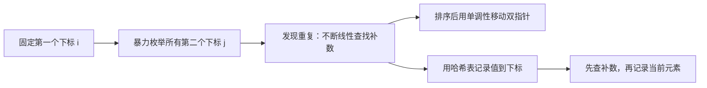

暴力解枚举下标对，排序双指针通过排序消除部分枚举，哈希表则直接消除“寻找补数”的内层扫描。下面按这个推导顺序展开。

### 方案一：两层枚举（正确性起点）

#### 思路

固定第一个下标 `i`，再枚举它之后的下标 `j`。只枚举 `j > i`，每一对不同下标恰好检查一次。

```cpp
class Solution {
public:
    vector<int> twoSum(vector<int>& nums, int target) {
        const int n = static_cast<int>(nums.size());

        for (int i = 0; i < n; ++i) {
            for (int j = i + 1; j < n; ++j) {
                if (nums[i] + nums[j] == target) {
                    return {i, j};
                }
            }
        }

        return {};
    }
};
```

#### 不变量与正确性

- 外层处理到 `i` 时，所有左端点小于 `i` 的下标对都已检查完毕。
- 内层处理到 `j` 时，所有形如 `(i, k)` 且 `i < k < j` 的下标对都已检查完毕。
- 答案的一对下标总能写成 `p < q`。当外层到达 `p`、内层到达 `q` 时必会命中，因此不会漏解；`j = i + 1` 又保证不会出现 `i == j`。

#### 边界与细节

- 内层从 `i + 1` 开始而非 `0`：避免与自身配对，也避免检查 `(i, j)` 与 `(j, i)` 两次。
- 循环条件使用 `i < n`、`j < n`，对应数组合法的左闭右开下标区间 `[0, n)`。
- 题目保证有解；`return {}` 是为了让函数在通用语义下完整。面试时可以说明它在本题不可达。

#### 复杂度与取舍

| 时间复杂度 | 空间复杂度 | 优点 | 代价 |
| --- | --- | --- | --- |
| `O(n²)` | `O(1)` | 最容易写对，不依赖额外数据结构 | 每个 `i` 都重新扫描后续元素，存在大量重复比较 |

它不是最终答案，但应当会写、会讲：这是后续优化的基准，也是在面试中先保证正确性的稳妥起点。

### 方案二：排序 + 双指针（利用单调性）

#### 思路

排序能让数值具有单调性。设左右指针为 `left`、`right`：

- 和太小，必须增大较小端，令 `++left`。
- 和太大，必须减小较大端，令 `--right`。

本题要求返回原下标，不能直接排序 `nums`；需要复制成 `{数值, 原下标}` 后排序。

```cpp
class Solution {
public:
    vector<int> twoSum(vector<int>& nums, int target) {
        vector<pair<int, int>> values_with_indices;
        values_with_indices.reserve(nums.size());

        for (int i = 0; i < static_cast<int>(nums.size()); ++i) {
            values_with_indices.emplace_back(nums[i], i);
        }

        sort(values_with_indices.begin(), values_with_indices.end());

        int left = 0;
        int right = static_cast<int>(values_with_indices.size()) - 1;
        while (left < right) {
            const int sum = values_with_indices[left].first +
                            values_with_indices[right].first;

            if (sum == target) {
                return {values_with_indices[left].second,
                        values_with_indices[right].second};
            }
            if (sum < target) {
                ++left;
            } else {
                --right;
            }
        }

        return {};
    }
};
```

#### 不变量与正确性

若尚未返回答案，则当前闭区间 `[left, right]` 中仍保留至少一组可能的答案。

- 初始时 `[0, n - 1]` 包含所有元素，不变量显然成立。
- 若当前和小于 `target`，对任意 `k < right`，都有 `values[left] + values[k] <= values[left] + values[right] < target`。`left` 不可能参与答案，右移 `left` 不会丢失答案。
- 若当前和大于 `target`，对任意 `k > left`，都有 `values[k] + values[right] >= values[left] + values[right] > target`。`right` 不可能参与答案，左移 `right` 不会丢失答案。
- 每次都安全排除一个端点；最终命中答案，或区间不足两个元素时结束。

#### 边界与细节

- `left = 0`、`right = n - 1` 对应闭区间 `[left, right]`，所以循环条件是 `left < right`，而不是 `left <= right`。相等时只剩一个元素，不能使用两次。
- `pair<int, int>` 的第一个成员是排序依据，第二个成员是原下标；不要对原数组排序后再试图恢复下标。
- 本题范围内两个 `int` 相加安全；遇到范围更大的变体，可把 `sum` 写成 `const long long sum = ...`。

#### 复杂度与取舍

| 时间复杂度 | 空间复杂度 | 获得什么 | 付出什么 | 更适合的场景 |
| --- | --- | --- | --- | --- |
| `O(n log n)` | `O(n)` | 双指针扫描只需 `O(n)`，思路可迁移到有序数组 | 排序主导总复杂度，且必须保留原下标 | 输入已排序、只需返回数值，或问题天然具有单调性 |

这是非最优解，但非常值得掌握。它展示了另一种优化方式：**不是加速查找，而是构造有序性后一次排除一批候选。**

### 方案三：两遍哈希表（把建表与查询分开）

#### 思路

先用一遍遍历建立 `值 -> 下标` 映射，再用第二遍遍历查询每个数的补数。它比一遍哈希多走了一次数组，但把“表里有什么”和“如何查表”分成两段，初学时更容易手写正确。

```cpp
class Solution {
public:
    vector<int> twoSum(vector<int>& nums, int target) {
        unordered_map<int, int> index_by_value;
        index_by_value.reserve(nums.size());

        for (int i = 0; i < static_cast<int>(nums.size()); ++i) {
            index_by_value[nums[i]] = i;
        }

        for (int i = 0; i < static_cast<int>(nums.size()); ++i) {
            const int complement = target - nums[i];
            const auto it = index_by_value.find(complement);

            if (it != index_by_value.end() && it->second != i) {
                return {i, it->second};
            }
        }

        return {};
    }
};
```

#### 不变量与正确性

- 第一轮结束后，对于数组中的每个不同数值，`index_by_value` 至少保存它的一个合法下标；重复值时保存最后一次出现的下标。
- 第二轮处理 `i` 时，若补数存在且 `it->second != i`，两个下标不同且数值和为 `target`，可以直接返回。
- 对答案 `(p, q)` 而言，遍历第二轮到 `p` 或 `q` 时都能查询到另一个值。对于 `[3, 3]`，表保存后一个 `3` 的下标，处理前一个 `3` 时仍能找到不同下标。

#### 边界与细节

- 必须检查 `it->second != i`。两遍建表后，当前元素已经在表中；若补数恰好等于当前值，不检查就可能把同一位置当成两个元素。
- `find` 只查询，不会修改哈希表；不要用 `index_by_value[complement]` 判断存在性，因为键不存在时 `operator[]` 会插入默认值，语义容易出错。
- `reserve(nums.size())` 只是减少扩容和 rehash（重哈希）的工程性优化，不影响核心逻辑。

#### 复杂度与取舍

| 时间复杂度 | 空间复杂度 | 获得什么 | 付出什么 |
| --- | --- | --- | --- |
| 平均 `O(n)` | `O(n)` | 建表、查表逻辑清晰，便于解释下标校验 | 需要第二次遍历，并额外写 `it->second != i` |

`unordered_map` 的查找和插入是**平均** $O(1)$；若发生极端哈希冲突，理论最坏总时间可退化到 $O(n^2)$。面试中通常按平均复杂度分析，同时说明这一前提即可。

### 方案四：一次遍历哈希表（推荐）

#### 思路

当前元素只需要与它之前出现的元素配对。因此遍历到 `i` 时：

1. 先查补数 `target - nums[i]` 是否已出现。
2. 找到则立即返回。
3. 否则记录 `nums[i] -> i`，供后面的元素查询。

```cpp
class Solution {
public:
    vector<int> twoSum(vector<int>& nums, int target) {
        unordered_map<int, int> index_by_value;
        index_by_value.reserve(nums.size());

        for (int i = 0; i < static_cast<int>(nums.size()); ++i) {
            const int complement = target - nums[i];
            const auto it = index_by_value.find(complement);

            if (it != index_by_value.end()) {
                return {it->second, i};
            }

            // 先查后插：哈希表中只保留当前下标之前的元素。
            index_by_value[nums[i]] = i;
        }

        return {};
    }
};
```

#### 不变量与正确性

循环处理下标 `i` 的开头，哈希表 `index_by_value` **只保存左闭右开区间 `[0, i)` 中出现过的值及其下标**。

- 初始 `i = 0` 时，区间为空，哈希表为空，不变量成立。
- 若查到 `complement`，对应下标必在 `[0, i)`，因此必然小于 `i`；返回的两个下标不同，且两数之和恰为 `target`。
- 若查不到，将 `nums[i] -> i` 插入后，哈希表恰好保存 `[0, i + 1)` 的元素；下一轮不变量继续成立。
- 若答案为 `(p, q)` 且 `p < q`，遍历到 `q` 前 `p` 已在表中，所以一定会命中答案。

这就是“**先查后插**”的证明，而不仅是需要记忆的模板。

#### 边界与细节

- `for (int i = 0; i < n; ++i)` 处理的是左闭右开区间 `[0, n)`，所有数组访问都安全。
- 必须先 `find(complement)`，再插入当前值。若反过来，当 `target == 2 * nums[i]` 时，当前元素会被自己匹配；例如单个 `3` 不能构成和为 `6` 的答案。
- `[3, 3]` 不会出错：处理第一个 `3` 时查不到并记录；处理第二个 `3` 时查到第一个的下标，返回 `[0, 1]`。
- 哈希表只需为每个值保存一个历史下标。重复值覆盖较早下标也不影响本题，因为查到的任一历史下标都合法。

#### 示例推演

`nums = [3, 2, 4]`，`target = 6`：

| 当前下标 `i` | 当前值 `nums[i]` | 需要的补数 | 查找前的哈希表 | 操作 |
| --- | --- | --- | --- | --- |
| `0` | `3` | `3` | `{}` | 未找到，记录 `3 -> 0` |
| `1` | `2` | `4` | `{3 -> 0}` | 未找到，记录 `2 -> 1` |
| `2` | `4` | `2` | `{3 -> 0, 2 -> 1}` | 找到 `2 -> 1`，返回 `[1, 2]` |

#### 复杂度与取舍

| 时间复杂度 | 空间复杂度 | 为什么推荐 | 需要特别记住的点 |
| --- | --- | --- | --- |
| 平均 `O(n)` | `O(n)` | 一次遍历完成查询与建表，代码短且自然保证下标不同 | 哈希表语义是“已处理元素”；顺序必须先查后插 |

### 方案选择与 Trade-off

| 方案 | 时间 | 空间 | 是否修改原数组 | 主要优势 | 主要代价 |
| --- | --- | --- | --- | --- | --- |
| 两层枚举 | `O(n²)` | `O(1)` | 否 | 最直接，容易证明 | 大量重复比较 |
| 排序 + 双指针 | `O(n log n)` | `O(n)` | 否，本实现复制后排序 | 单调性强，适合有序数组变体 | 排序较慢，必须维护原下标 |
| 两遍哈希 | 平均 `O(n)` | `O(n)` | 否 | 建表与查询分离，容易写对 | 多一次遍历，要显式排除同下标 |
| 一遍哈希 | 平均 `O(n)` | `O(n)` | 否 | 本题最简洁高效 | 必须准确维护“先查后插”的不变量 |

选择并非只看大 $O$：若原数组已按升序给出，双指针可做到 $O(n)$ 时间、$O(1)$ 额外空间；若需要在线处理数据流，一遍哈希更自然；若面试刚开始且时间充足，可以先给出两层枚举，再推导哈希优化以展示思考过程。

### 面试手撕表达

可以用下面这段逻辑完成从暴力到最优的讲解：

> 暴力做法枚举两个下标，时间是 $O(n^2)$。固定 `nums[i]` 后，我只需要知道补数 `target - nums[i]` 是否已经出现过，因此用哈希表保存“值到下标”。遍历时我先查补数，再记录当前数；这样哈希表始终只含当前下标之前的元素，保证不会重复使用同一个元素。平均时间 $O(n)$，额外空间 $O(n)$。

### 复习检查

- 能否不看答案写出双层循环，并解释为什么 `j` 从 `i + 1` 开始？
- 能否解释排序双指针中，`sum < target` 时为什么只能移动 `left`？
- 能否说出一遍哈希的精确不变量：处理 `i` 前，表中保存 `[0, i)` 的元素？
- 能否解释“一遍哈希必须先查后插”，以及它如何处理 `[3, 3]`？
- 能否区分 `map` 的 $O(n \log n)$ 和 `unordered_map` 的平均 $O(n)$？

## 2. 字母异位词分组

- 题目链接：[49. 字母异位词分组](https://leetcode.cn/problems/group-anagrams/description/)
- 难度：中等
- 核心分类：哈希表、字符串、规范化表示。

### 题目

给你一个字符串数组 `strs`，请你将**字母异位词**组合在一起。可以按任意顺序返回结果列表。

字母异位词指两个字符串使用的每种字符及其出现次数完全相同，只是字符排列顺序不同。

**示例 1：**

```text
输入：strs = ["eat", "tea", "tan", "ate", "nat", "bat"]
输出：[["bat"], ["nat", "tan"], ["ate", "eat", "tea"]]
解释："nat" 和 "tan" 互为字母异位词；"ate"、"eat"、"tea" 互为字母异位词。
```

**示例 2：**

```text
输入：strs = [""]
输出：[[""]]
```

**示例 3：**

```text
输入：strs = ["a"]
输出：[["a"]]
```

**约束：**

- `1 <= strs.length <= 10^4`
- `0 <= strs[i].length <= 100`
- `strs[i]` 仅包含小写字母。

### 读题：哪些特征指向“签名 + 哈希分组”

本题不是询问“某个值是否出现过”，而是要把满足同一关系的多个字符串放入同一个桶。关键是把“两个字符串互为异位词”转化成一个可以作为哈希键的、确定且相同的表示，称为**规范签名**。

| 题目特征 | 推导出的需求 | 对应做法 |
| --- | --- | --- |
| 只要求按字符重排后是否相同 | 忽略字符原始顺序，保留字符组成 | 将排序后的字符串作为签名 |
| 字符仅有 `a` 到 `z` | 可以记录每种字符的次数 | 用长度为 26 的频次数组作为签名 |
| 需要分组而非找单个答案 | 相同签名的元素持续归入同一个容器 | 哈希表：`签名 -> 字符串列表` |
| 输出顺序任意 | 不要求哈希表键的遍历顺序稳定 | `unordered_map` 足够使用 |

面试中的关键表达是：**先为每个字符串构造一个唯一描述其字符组成的签名，再按签名用哈希表分桶。** 哈希表解决“该字符串属于哪一组”，签名解决“什么样的字符串算同一组”。

### 从暴力到优化

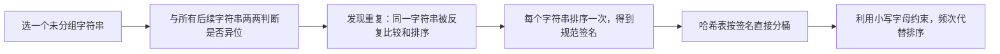

设字符串数量为 $n$，最长字符串长度为 $k$。暴力方法的瓶颈是 $O(n^2)$ 次“是否异位词”的比较；优化后，每个字符串只构造一次签名，并只进行一次哈希表查找。

### 方案一：两两比较后分组（暴力起点）

#### 思路

从左到右选取一个尚未分组的字符串作为当前组的代表，再扫描其后的所有字符串。若两个字符串互为字母异位词，就加入同一组，并标记为已使用。

这里用“复制后排序”判断两个字符串是否异位词：原字符串不被修改，排序结果相同当且仅当两个字符串的字符多重集合相同。

```cpp
class Solution {
public:
    vector<vector<string>> groupAnagrams(vector<string>& strs) {
        // 记录每个下标是否已被某个分组收纳，初始时所有字符串均未分组。
        vector<bool> used(strs.size(), false);
        // 保存最终的所有分组。
        vector<vector<string>> result;

        for (int i = 0; i < static_cast<int>(strs.size()); ++i) {
            // 已被此前代表字符串归类的元素不再重复建组。
            if (used[i]) {
                continue;
            }

            // 为当前未分组字符串创建一个新桶，并先放入它自己。
            vector<string> group{strs[i]};
            // 标记当前代表字符串已归入这个新桶。
            used[i] = true;

            for (int j = i + 1; j < static_cast<int>(strs.size()); ++j) {
                // 已经分组的字符串无需再次与当前代表比较。
                if (used[j]) {
                    continue;
                }
                // 只有与代表字符串互为异位词的元素才能进入当前桶。
                if (areAnagrams(strs[i], strs[j])) {
                    // 保存找到的同组字符串。
                    group.push_back(strs[j]);
                    // 防止它在后续外层循环中成为新的代表。
                    used[j] = true;
                }
            }

            // 当前代表能匹配的所有字符串均已扫描，提交该分组。
            result.push_back(std::move(group));
        }

        // 返回所有互不重叠的分组。
        return result;
    }

private:
    bool areAnagrams(const string& first, const string& second) {
        // 长度不同意味着字符总数不同，无需进行排序比较。
        if (first.size() != second.size()) {
            return false;
        }

        // 复制第一个字符串，避免改变输入数组中的内容。
        string sorted_first = first;
        // 复制第二个字符串，供独立排序。
        string sorted_second = second;
        // 排序后，相同字符组成会被排列成相同序列。
        sort(sorted_first.begin(), sorted_first.end());
        // 与第一个排序结果使用相同的规范化规则。
        sort(sorted_second.begin(), sorted_second.end());

        // 两个规范化序列相等，当且仅当原字符串互为字母异位词。
        return sorted_first == sorted_second;
    }
};
```

#### 不变量与正确性

- 每次外层循环开始时，所有 `used == true` 的字符串已经属于 `result` 中某个完整分组，且不会再被处理。
- 选中代表 `strs[i]` 后，内层循环已检查区间 `[i + 1, j)` 中每一个尚未使用的字符串：其中异位词已加入 `group`，非异位词不属于该组。
- “互为异位词”是等价关系，具有传递性：若字符串都与同一代表异位，它们彼此也异位。因此扫描结束时 `group` 就是代表字符串所在的完整分组。

#### 边界与细节

- 内层从 `j = i + 1` 开始，不必重新比较代表自身，也不重复比较已经在左侧出现的字符串。
- 空字符串合法：两个空字符串排序后仍相等，能被分到同一组；一个空字符串会单独形成一组。
- `std::move(group)` 只转移局部 `vector` 的资源到 `result`，不会改变其中字符串的内容；此处不写也正确，只是会多一次容器复制。

#### 复杂度与取舍

| 时间复杂度 | 额外空间 | 优点 | 代价 |
| --- | --- | --- | --- |
| `O(n² × k log k)` | `O(n + k)`，不含输出 | 从分组定义直接出发，正确性直观 | 同一字符串会在多次两两比较中被重复复制和排序 |

这是理解题意的保底方案，但在 `n = 10^4` 时不可接受。优化的目标很明确：让每个字符串只计算一次“属于哪一组”的依据。

### 方案二：排序字符串作为哈希键（通用推荐）

#### 思路

一个字符串排序后，字符顺序被消除，但每种字符的数量被完整保留。例如 `"tea"`、`"eat"`、`"ate"` 都会得到签名 `"aet"`。因此可用排序结果作为键，把原字符串追加到对应的哈希桶中。

```cpp
class Solution {
public:
    vector<vector<string>> groupAnagrams(vector<string>& strs) {
        // 键是排序后的签名，值是具有该签名的原始字符串列表。
        unordered_map<string, vector<string>> groups;
        // 预留桶数量以减少插入大量不同签名时的 rehash。
        groups.reserve(strs.size());

        for (const string& str : strs) {
            // 复制原字符串作为签名，保留 str 以原始顺序进入结果。
            string key = str;
            // 排序把所有异位词规范化为同一个键。
            sort(key.begin(), key.end());
            // 若 key 首次出现则创建空分组，再把当前原字符串放入该组。
            groups[key].push_back(str);
        }

        // 哈希表的值就是答案中的各个分组。
        vector<vector<string>> result;
        // 预留最终分组数，避免搬运分组时反复扩容。
        result.reserve(groups.size());
        for (auto& entry : groups) {
            // 转移一个完整分组；题目允许分组的返回顺序任意。
            result.push_back(std::move(entry.second));
        }

        // 返回按签名划分后的所有分组。
        return result;
    }
};
```

#### 不变量与正确性

处理完前 $t$ 个字符串后，哈希表满足：对于每个签名 `key`，`groups[key]` 恰好包含前缀 `strs[0..t)` 中所有排序后等于 `key` 的字符串。

- 初始时前缀为空，哈希表为空，不变量成立。
- 处理新字符串时，排序得到唯一签名 `key`，再将它追加到 `groups[key]`，不影响其他签名对应的分组，因此不变量保持。
- 两个字符串排序后相同，当且仅当它们每种字符的出现次数相同，即二者互为字母异位词。遍历结束时，每个桶恰好是一组异位词。

#### 边界与细节

- `string key = str` 必须复制：排序 `key` 不应改变 `strs` 的原始内容，也不能对 `const string& str` 排序。
- `groups[key]` 的 `operator[]` 在键不存在时创建一个空 `vector<string>`；这正好符合“首次看到一个签名时新建分组”的需求。
- 空字符串的排序键是空字符串 `""`，能正常作为 `unordered_map` 的键。
- 若题目要求稳定的组顺序或组内顺序，需要额外处理；本题声明任意顺序，哈希表遍历顺序无影响。

#### 复杂度与取舍

每个长度为 $m$ 的字符串需排序 `O(m log m)`。令 $k$ 为最长长度，总时间为 `O(n × k log k)`；哈希表操作按平均 `O(1)` 计算。

| 时间复杂度 | 辅助空间 | 优点 | 代价 | 适用范围 |
| --- | --- | --- | --- | --- |
| 平均 `O(n × k log k)` | `O(n × k)`，不含输出 | 代码短、签名直观、字符集不局限于 26 个小写字母 | 每个字符串都需要排序 | 通用的字母异位词分组 |

这是面试中最推荐先写的版本：签名构造逻辑清楚，代码量小，且不依赖本题“小写字母”这一特定约束。

### 方案三：字符频次作为哈希键（利用题目约束优化）

#### 思路

题目保证字符串只包含 `a` 到 `z`。因此不必排序：统计 26 个字母各出现多少次，得到的频次数组本身就唯一描述了字符组成。

`unordered_map` 不能直接把 `array<int, 26>` 当作键，所以这里将 26 个计数按固定顺序并加分隔符拼成字符串键。分隔符不可省略，例如计数序列 `[1, 11]` 与 `[11, 1]` 不能被拼成同一串。

```cpp
class Solution {
public:
    vector<vector<string>> groupAnagrams(vector<string>& strs) {
        // 键是 26 个字符频次的序列化结果，值是对应的异位词分组。
        unordered_map<string, vector<string>> groups;
        // 提前分配可能的不同签名桶，减少哈希表扩容次数。
        groups.reserve(strs.size());

        for (const string& str : strs) {
            // 零初始化 26 个计数器，第 i 项对应字符 'a' + i。
            array<int, 26> counts{};
            for (const char ch : str) {
                // 题目保证 ch 是小写字母，因此该下标位于 [0, 25]。
                ++counts[ch - 'a'];
            }

            // 构造固定格式的键；预留空间避免多次扩容。
            string key;
            key.reserve(26 * 4);
            for (const int count : counts) {
                // 先写分隔符，消除不同数字序列拼接后的歧义。
                key.push_back('#');
                // 再写当前字母的出现次数，完整保留频次信息。
                key += to_string(count);
            }

            // 相同频次键的字符串必互为异位词，因此追加到同一个桶。
            groups[key].push_back(str);
        }

        // 将哈希表中的每个桶转移到题目要求的二维结果中。
        vector<vector<string>> result;
        // 结果最多与不同签名数一样多，先预留对应容量。
        result.reserve(groups.size());
        for (auto& entry : groups) {
            // 输出顺序任意，可以直接按哈希表的遍历顺序转移分组。
            result.push_back(std::move(entry.second));
        }

        // 返回所有按频次签名聚合的字符串组。
        return result;
    }
};
```

#### 不变量与正确性

处理完前 $t$ 个字符串后，`groups[key]` 恰好包含前缀 `strs[0..t)` 中频次数组序列化为 `key` 的所有字符串。

- `counts{}` 在每次外层循环开始时都重新归零，所以它只描述当前字符串，不会混入上一个字符串的字符。
- 内层计数结束后，`counts[i]` 等于当前字符串中字符 `'a' + i` 的出现次数。
- 两个仅由小写字母组成的字符串频次数组相同，当且仅当它们互为字母异位词；固定顺序和分隔符保证不同数组不会序列化成相同键。
- 将当前字符串放入 `groups[key]` 后，不变量扩展到前缀 `[0, t + 1)`。

#### 边界与细节

- `array<int, 26> counts{}` 的花括号不可省略：它保证所有计数从 `0` 开始。若未初始化，累加结果没有意义。
- `ch - 'a'` 依赖“仅小写字母”的题设；若输入可能包含大写、Unicode 或任意字符，26 格数组不再成立，应回退到排序签名或改用更一般的计数结构。
- 空字符串会得到 26 个 `0` 组成的固定键，多个空字符串自然会进入同一组。
- 序列化键的长度在本题中是常数级：26 个计数且每个计数不超过 100，因此 26 次 `to_string` 不改变关于 $k$ 的线性扫描结论。

#### 复杂度与取舍

统计字符需要 `O(m)`，构建长度固定的 26 维签名为 `O(1)`；对所有字符串，总时间为平均 `O(n × k)`。

| 时间复杂度 | 辅助空间 | 优点 | 代价 | 使用前提 |
| --- | --- | --- | --- | --- |
| 平均 `O(n × k)` | `O(n)`，不含输出 | 不排序，理论更快 | 键构造更绕，强依赖字符集大小固定 | 字符仅为 `a` 到 `z` 或字符集很小且固定 |

### 方案选择与 Trade-off

| 方案 | 时间 | 辅助空间 | 主要优势 | 主要代价 | 面试定位 |
| --- | --- | --- | --- | --- | --- |
| 两两比较 | `O(n² × k log k)` | `O(n + k)` | 直接体现分组定义 | 重复比较、无法通过大规模数据 | 用于从暴力推导优化 |
| 排序签名 + 哈希 | 平均 `O(n × k log k)` | `O(n × k)` | 通用、短小、最容易手写 | 每个字符串都要排序 | 推荐默认答案 |
| 频次签名 + 哈希 | 平均 `O(n × k)` | `O(n)` | 利用 26 字母约束，省去排序 | 依赖固定字符集，签名实现更复杂 | 约束明确时的优化答案 |

这里的“辅助空间”不含题目要求返回的字符串分组。若把输出也算入，三种方案都至少需要 `O(n × k)` 存放所有返回字符串。

### 面试手撕表达

> 暴力做法是选择一个字符串，再与所有其他字符串判断是否互为异位词，最坏有 `O(n²)` 次比较。优化的关键是为每个字符串生成一个不依赖排列顺序的签名：把字符串排序后，所有异位词都会得到同一个键。用哈希表维护“签名到字符串列表”，遍历一次就能完成分组，平均时间是 `O(n × k log k)`。因为这题字符只含小写字母，也可以用 26 位频次替代排序，把时间优化到平均 `O(n × k)`，但通用性更差。

### 复习检查

- 为什么“排序后的字符串相同”等价于“原字符串互为字母异位词”？
- 为什么哈希表的键不能直接使用原字符串？
- 能否说出排序签名方案的循环不变量：处理前 $t$ 个字符串后，每个桶恰好包含此前具有对应签名的所有字符串？
- `array<int, 26> counts{}` 为什么必须每次处理新字符串时重新初始化？
- 频次序列化时为什么要加入分隔符？
- 面试中何时优先写排序签名，何时选择频次签名？

## 3. 最长连续序列

- 题目链接：[128. 最长连续序列](https://leetcode.cn/problems/longest-consecutive-sequence/description/)
- 难度：中等
- 核心分类：哈希集合、连续区间、去重、从起点扩展。

### 题目

给定一个未排序的整数数组 `nums`，找出数字连续的最长序列（不要求序列元素在原数组中连续）的长度。

请你设计并实现时间复杂度为 `O(n)` 的算法解决此问题。

**示例 1：**

```text
输入：nums = [100, 4, 200, 1, 3, 2]
输出：4
解释：最长数字连续序列是 [1, 2, 3, 4]，长度为 4。
```

**示例 2：**

```text
输入：nums = [0, 3, 7, 2, 5, 8, 4, 6, 0, 1]
输出：9
```

**示例 3：**

```text
输入：nums = [1, 0, 1, 2]
输出：3
```

**约束：**

- `0 <= nums.length <= 10^5`
- `-10^9 <= nums[i] <= 10^9`

### 读题：哪些特征指向哈希集合

题目里的“连续”指的是**数值连续**，不是下标连续。例如 `[100, 4, 200, 1, 3, 2]` 中的 `1, 2, 3, 4` 在原数组里并不相邻，却构成答案。

| 题目特征 | 推导出的需求 | 对应做法 |
| --- | --- | --- |
| 原数组无序，但关心 `x - 1`、`x + 1` 是否存在 | 高频执行“某个数是否存在”的查询 | `unordered_set` 平均 `O(1)` 成员查询 |
| 数组允许重复元素 | 重复值不能让同一序列重复计数 | 先放入集合，自动去重 |
| 要求严格优于排序的 `O(n log n)` | 不能依赖全局排序建立相邻关系 | 在集合中直接查找相邻数值 |
| 要找最长完整连续段 | 不能从每个数都重复向后扫描 | 只从不存在前驱的数，即序列起点扩展 |

这题最重要的读题转换是：把数组看成一个“数值集合”。对于数值 `x`，只要知道 `x - 1` 和 `x + 1` 是否存在，就能确定它在连续序列中的位置；原下标和原排列都不再重要。

### 从暴力到优化

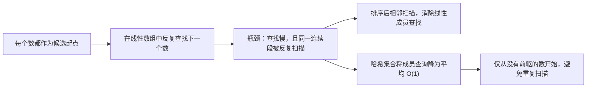

设数组长度为 $n$。优化并非只做“线性查找改成哈希查找”：即使哈希查询很快，如果从 `1`、`2`、`3` 都分别扫描 `1,2,3,4,...` 的后缀，同一段仍会被反复走过。**成员查询**和**只选合法起点**缺一不可。

### 方案一：逐个起点 + 线性查找（暴力起点）

#### 思路

把每个 `nums[i]` 都当作可能起点，并不断在线性数组中查找 `current + 1`。只要下一个数存在，序列长度就加一。虽然这能得到正确答案，但同一个数既可能被多次查找，也可能被多次作为中间起点重新向后扩展。

```cpp
class Solution {
public:
    int longestConsecutive(vector<int>& nums) {
        // 保存目前发现的最长连续序列长度；空数组时自然保持为 0。
        int longest = 0;

        for (const int start : nums) {
            // 从当前候选起点开始尝试向右扩展数值序列。
            int current = start;
            // 当前候选序列至少包含起点自身。
            int length = 1;

            // 只要数组中还存在线性查找到的下一个数，就继续延长序列。
            while (find(nums.begin(), nums.end(), current + 1) != nums.end()) {
                // 将当前数推进到刚刚确认存在的后继数。
                ++current;
                // 后继数加入序列后，长度同步增加。
                ++length;
            }

            // 用当前候选序列更新全局最优答案。
            longest = max(longest, length);
        }

        // 所有起点均已尝试完毕，返回最长长度。
        return longest;
    }
};
```

#### 不变量与正确性

- `while` 每轮开始时，`[start, current]` 中的每个整数都在数组中，且 `length == current - start + 1`。
- 查找到 `current + 1` 后，连续区间可安全扩展一位，因此更新后不变量仍成立。
- 最长连续序列的最小数也必然出现在 `nums` 中；当外层循环选到它时，会扩展并得到整个序列，故取最大值不会漏掉答案。

#### 边界与细节

- 空数组时外层循环不执行，初始值 `longest = 0` 正好是答案；不要把初始值写成 `1`。
- 重复值不会影响正确性，但会让相同扩展过程被重复执行，例如两个 `1` 都会再次查找 `2, 3, ...`。
- 本题范围使 `current + 1` 不会触及 `int` 上界；更一般的题目中，若数值可为 `INT_MAX`，需要先处理溢出风险。

#### 复杂度与取舍

最坏情况下，每个起点可扩展 `O(n)` 次，每次 `find` 又扫描 `O(n)` 个位置，总时间为 `O(n³)`。

| 时间复杂度 | 辅助空间 | 优点 | 代价 |
| --- | --- | --- | --- |
| `O(n³)` | `O(1)` | 直接从“连续数值”定义出发 | 重复扫描和线性成员查找都很严重 |

这个版本的价值在于定位两个瓶颈：如何更快地判断后继存在，以及如何不重复扩展同一条序列。

### 方案二：排序后单次扫描（消除查找）

#### 思路

排序后，相同数值和相邻数值都会排在一起。一次从左到右扫描即可维护“以当前数结尾的连续序列长度”：

- 遇到重复值时跳过，不能让长度增加。
- 遇到前一个不同值加一时，当前连续段延长。
- 否则出现断层，当前连续段从 `1` 重新开始。

```cpp
class Solution {
public:
    int longestConsecutive(vector<int>& nums) {
        // 空数组没有任何连续序列，提前返回以避免访问 sorted_nums[0]。
        if (nums.empty()) {
            return 0;
        }

        // 复制输入后再排序，避免改变调用方传入的原数组。
        vector<int> sorted_nums = nums;
        // 让相同和相邻的数在扫描时相邻出现。
        sort(sorted_nums.begin(), sorted_nums.end());

        // 第一个数单独构成长度为 1 的连续序列。
        int current_length = 1;
        // 当前最优答案至少为第一个数形成的长度 1。
        int longest = 1;

        for (size_t i = 1; i < sorted_nums.size(); ++i) {
            // 重复值不能视为连续序列的新元素，直接跳过且不重置长度。
            if (sorted_nums[i] == sorted_nums[i - 1]) {
                continue;
            }

            // 当前不同值恰好接在前一个值之后，延长当前连续段。
            if (sorted_nums[i] == sorted_nums[i - 1] + 1) {
                ++current_length;
            } else {
                // 数值出现断层，当前值只能作为新连续段的起点。
                current_length = 1;
            }

            // 每处理一个不同值后，更新截至当前位置的最长答案。
            longest = max(longest, current_length);
        }

        // 扫描完成后返回全局最长连续段。
        return longest;
    }
};
```

#### 不变量与正确性

处理到 `sorted_nums[i]` 后：

- `current_length` 是去重后的已处理前缀中，以当前不同数值结尾的最长连续后缀长度。
- `longest` 是该前缀中所有连续段长度的最大值。
- 重复值不改变任何连续关系；相差 `1` 时后缀延长；相差大于 `1` 时，旧后缀不可能跨越缺失数，重置为 `1` 正确。

这三个分支覆盖排序后相邻元素的全部关系，因此扫描结束时 `longest` 即为答案。

#### 边界与细节

- 先判断 `nums.empty()`：否则初始化为 `1`、以及从下标 `1` 开始的循环都不成立。
- 循环从 `i = 1` 开始，所以 `sorted_nums[i - 1]` 始终合法；这是左闭右开区间 `[1, sorted_nums.size())` 的直接结果。
- **重复值分支必须 `continue`**。例如 `[1, 1, 2]`：若重复 `1` 时把 `current_length` 重置为 `1`，随后仍可能得到正确值；但更复杂的写法极易在重复值处错误截断，跳过最清晰。
- 本题范围内 `sorted_nums[i - 1] + 1` 安全；通用实现应留意 `INT_MAX + 1` 的溢出。

#### 复杂度与取舍

| 时间复杂度 | 辅助空间 | 是否修改输入 | 主要优势 | 主要代价 |
| --- | --- | --- | --- | --- |
| `O(n log n)` | 本实现为 `O(n)` | 否 | 不依赖哈希表，扫描逻辑稳定、容易验证 | 排序无法满足题目要求的 `O(n)` |

若允许修改输入，可直接对 `nums` 排序，将除排序栈外的额外空间降到常数级；代价是调用者观察到的数组顺序会被改变。这个方案在“数组已排序”或“不要求线性时间”的变体中尤其合适。

### 方案三：哈希集合 + 只从序列起点扩展（推荐）

#### 思路

先将所有数放入 `unordered_set`，得到去重后的数值集合。对集合中的数 `num`：

- 若 `num - 1` 存在，`num` 一定不是一段连续序列的起点，跳过它。
- 若 `num - 1` 不存在，`num` 是该序列唯一的最小值；此时不断检查 `num + 1`、`num + 2`，直到序列结束。

```cpp
class Solution {
public:
    int longestConsecutive(vector<int>& nums) {
        // 用集合去重，并支持平均 O(1) 的“某个数是否存在”查询。
        unordered_set<int> values;
        // 预留与输入等量的桶，减少插入大量元素时的 rehash。
        values.reserve(nums.size());
        for (const int num : nums) {
            // 重复值插入集合不会产生新元素，正好消除重复序列起点。
            values.insert(num);
        }

        // 空集合的答案为 0；非空时由后续起点扫描更新。
        int longest = 0;
        for (const int num : values) {
            // 有前驱说明 num 是某个序列的中间元素，不应再次扫描该序列。
            if (values.find(num - 1) != values.end()) {
                continue;
            }

            // num 没有前驱，因此它是当前连续序列的唯一合法起点。
            int current = num;
            // 起点自身已经属于当前序列。
            int length = 1;
            // 从起点向后查询连续后继，直到下一个整数缺失。
            while (values.find(current + 1) != values.end()) {
                // 将当前位置推进到已确认存在的后继数。
                ++current;
                // 后继加入当前序列，长度增加一。
                ++length;
            }

            // 一整段连续序列扫描完毕后，再更新全局最优值。
            longest = max(longest, length);
        }

        // 所有序列起点均已处理，返回最长连续序列长度。
        return longest;
    }
};
```

#### 为什么“只从起点扩展”是线性的关键

如果对集合中的每个数都执行向后 `while`，连续段 `[1, 2, 3, ..., n]` 会被扫描 $n + (n - 1) + \cdots + 1$ 次，仍是二次复杂度。

起点判定 `num - 1` 不存在后，每个连续段只会由其最小数启动一次。不同连续段彼此不相交，所有内层 `while` 加起来至多访问集合中的每个不同数一次；外层也只遍历每个不同数一次。因此，在哈希操作平均 `O(1)` 的前提下，总时间为平均 `O(n)`。

**不要遍历 `nums`，而要遍历去重后的 `values`。** 若 `nums` 中有大量重复的序列起点，遍历原数组会让同一个起点重复启动扫描，破坏上述线性复杂度证明。

#### 不变量与正确性

- 处理起点 `num` 的 `while` 每轮开始时，区间 `[num, current]` 中每一个整数都在 `values`，且 `length == current - num + 1`。
- `current + 1` 存在时，序列可延长且不变量保持；不存在时，当前区间已经是以 `num` 为起点的完整连续序列。
- 每一条非空连续序列都存在唯一最小数 `start`，且 `start - 1` 不在集合中，所以外层必会从它启动一次扫描。
- 非起点都被跳过，起点扫描又覆盖其整段序列；每段都被计算且仅被计算一次，取最大长度即为答案。

#### 边界与细节

- 空数组构造出的 `values` 为空，循环不执行，`longest = 0` 正确返回。
- 示例 `[0, 3, 7, 2, 5, 8, 4, 6, 0, 1]` 中重复的 `0` 在集合中只保留一次，最长段为 `0` 到 `8`，长度为 `9`。
- `values.find(num - 1)` 使用 `find`，不会修改集合；循环中也不插入或删除集合元素，因此范围 `for` 遍历安全。
- 本题数值范围距 `int` 边界足够远，`num - 1` 与 `current + 1` 均不会溢出。若扩展到完整 `int` 范围，需在 `INT_MIN` 和 `INT_MAX` 附近额外保护。
- `unordered_set` 的查找、插入是平均 `O(1)`，极端哈希冲突下理论最坏会退化；题目所说的 `O(n)` 通常按哈希表的平均复杂度理解。

#### 复杂度与取舍

| 时间复杂度 | 辅助空间 | 是否修改输入 | 为什么推荐 | 代价 |
| --- | --- | --- | --- | --- |
| 平均 `O(n)` | `O(n)` | 否 | 满足题目线性时间要求，自动去重，逻辑直接对应“起点”定义 | 使用额外哈希空间，依赖平均哈希复杂度 |

### 方案选择与 Trade-off

| 方案 | 时间 | 辅助空间 | 是否修改输入 | 主要优势 | 主要代价 | 面试定位 |
| --- | --- | --- | --- | --- | --- | --- |
| 逐个起点 + 线性查找 | `O(n³)` | `O(1)` | 否 | 最直接体现“不断找下一个数” | 查找和扩展都重复 | 用于定位优化方向 |
| 排序 + 单次扫描 | `O(n log n)` | 本实现为 `O(n)` | 否 | 相邻关系直观，容易处理重复值 | 不满足线性时间要求 | 合理的过渡方案 |
| 哈希集合 + 起点扩展 | 平均 `O(n)` | `O(n)` | 否 | 满足题设，避免重复扫描 | 需要准确理解起点判定与哈希前提 | 推荐答案 |

### 面试手撕表达

> 暴力做法是从每个数开始，不断在线性数组中找下一个数，既查找慢又会重复扫描同一段序列。排序后可以线性扫描，但总时间仍是 `O(n log n)`。要做到平均 `O(n)`，我先用哈希集合去重并支持快速查找；只有当 `num - 1` 不存在时，`num` 才是连续段起点，我才向后检查 `num + 1`。这样每个连续段只扫描一次，所有内层扫描总计是线性的。

### 复习检查

- 为什么题目关心的是数值连续，而不是原数组下标连续？
- 排序扫描中，为什么遇到重复值必须跳过而不是增加长度？
- 为什么哈希方案不能从每一个数都向后扩展？请用 `[1, 2, 3, 4]` 说明。
- 为什么推荐代码遍历 `values` 而不是原数组 `nums`？
- 哈希方案的精确不变量是什么？
- 空数组、重复值和负数分别如何处理？

# 双指针

## 1. 移动零

- 题目链接：[283. 移动零](https://leetcode.cn/problems/move-zeroes/description/)
- 难度：简单
- 核心分类：双指针、稳定原地分区、数组原地修改。

### 题目

给定一个数组 `nums`，编写一个函数将所有 `0` 移动到数组的末尾，同时保持非零元素的相对顺序。

**请注意**，必须在不复制数组的情况下原地对数组进行操作。

**示例 1：**

```text
输入：nums = [0, 1, 0, 3, 12]
输出：[1, 3, 12, 0, 0]
```

**示例 2：**

```text
输入：nums = [0]
输出：[0]
```

**提示：**

- `1 <= nums.length <= 10^4`
- `-2^31 <= nums[i] <= 2^31 - 1`

**进阶：** 你能尽量减少完成的操作次数吗？

### 读题：哪些特征指向双指针

这题本质上不是排序：非零元素之间的相对顺序必须不变。它要求把数组稳定地划分为“所有非零元素”与“所有零”两部分，并且必须复用原数组的存储空间。

| 题目特征 | 推导出的需求 | 对应做法 |
| --- | --- | --- |
| 所有非零元素要排在前面 | 需要一个位置记录下一个非零元素应放到哪里 | `slow` 维护写入边界 |
| 要逐个检查原数组元素 | 需要一个位置顺序扫描全部元素 | `fast` 从左到右读取 |
| 非零元素相对顺序不能改变 | 只能按 `fast` 的扫描顺序写入前缀 | 稳定压缩，不做任意交换 |
| 必须原地操作 | 不能用额外数组保存完整结果 | `O(1)` 辅助空间的双指针 |
| 进阶要求减少操作 | 应避免无意义的自写入和交换 | `slow != fast` 时才搬运 |

可以把两个指针理解为两条不同职责的轨道：`fast` 负责**读**每个元素，`slow` 负责**写**下一个非零元素。只要读写职责分开，就能同时保证原地修改和相对顺序稳定。

### 从直觉方案到原地双指针

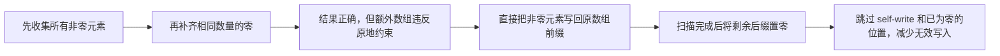

本题的三种方案时间都可以是 `O(n)`。演进的重点是从“额外空间换取直观”过渡到“原地稳定压缩”，再进一步关注实际写入次数。

### 方案一：辅助数组收集非零元素（直觉方案，不符合原地约束）

#### 思路

先按原顺序把所有非零元素放进额外数组，再依次写回 `nums` 前面，最后把其余位置写成 `0`。它最容易看出稳定性，但额外数组的大小可达 `n`，违反题目的原地要求。

```cpp
class Solution {
public:
    void moveZeroes(vector<int>& nums) {
        // 按原数组顺序暂存所有非零元素。
        vector<int> non_zero_values;
        // 预留最大可能容量，避免收集过程中反复扩容。
        non_zero_values.reserve(nums.size());

        for (const int num : nums) {
            // 只有非零元素需要保留在结果前缀中。
            if (num != 0) {
                // push_back 的顺序就是非零元素在结果中的相对顺序。
                non_zero_values.push_back(num);
            }
        }

        for (size_t i = 0; i < non_zero_values.size(); ++i) {
            // 将稳定收集到的非零元素依次写回原数组前缀。
            nums[i] = non_zero_values[i];
        }
        for (size_t i = non_zero_values.size(); i < nums.size(); ++i) {
            // 前缀之外的位置全部补零，形成题目要求的后缀。
            nums[i] = 0;
        }
    }
};
```

#### 不变量与正确性

- 收集循环处理完原数组前缀 `[0, fast)` 后，`non_zero_values` 恰好按原相对顺序保存该前缀中的全部非零元素。
- 写回结束后，`nums[0, non_zero_values.size())` 与所有原始非零元素顺序一致；后缀全部为零。
- 因而结果同时满足“非零在前”“零在后”“非零相对顺序不变”。

#### 复杂度与取舍

| 时间复杂度 | 辅助空间 | 是否原地 | 优点 | 代价 |
| --- | --- | --- | --- | --- |
| `O(n)` | `O(n)` | 否 | 逻辑最直观，稳定性一目了然 | 不满足题目“不复制数组”的限制 |

### 方案二：原地稳定压缩 + 统一补零（双指针基础版）

#### 思路

不再保存 `non_zero_values`：扫描到一个非零元素时，直接将它写到 `slow` 指向的下一个空位。扫描完后，`slow` 之后的位置都应为零，再用第二轮循环补零。

```cpp
class Solution {
public:
    void moveZeroes(vector<int>& nums) {
        // slow 始终指向下一个非零元素的写入位置。
        size_t slow = 0;

        for (size_t fast = 0; fast < nums.size(); ++fast) {
            // 零不进入前缀，因此只读取并跳过它。
            if (nums[fast] == 0) {
                continue;
            }

            // 按 fast 的扫描顺序写入，保证非零元素的相对顺序不变。
            nums[slow] = nums[fast];
            // 当前写入位置已被占用，边界右移到下一格。
            ++slow;
        }

        for (size_t index = slow; index < nums.size(); ++index) {
            // 扫描结束后，前缀之外的每个位置都必须是零。
            nums[index] = 0;
        }
    }
};
```

#### 不变量与正确性

在处理 `fast` 之前：

- `slow` 等于原数组已扫描区间 `[0, fast)` 中非零元素的数量。
- `nums[0, slow)` 按原顺序保存该已扫描区间中的所有非零元素。
- 区间 `[slow, fast)` 的内容可能是旧值，不作为正确性依据；它会在最后统一置零。

遇到非零元素时，将它写到 `nums[slow]`，再移动 `slow`，上述前缀不变量继续成立。扫描完毕后，前缀已是完整且稳定的非零序列；第二轮将 `[slow, nums.size())` 置零，得到最终数组。

#### 边界与细节

- `slow` 和 `fast` 都使用左闭右开区间 `[0, nums.size())`，所以空数组也能自然处理；虽然本题保证长度至少为 `1`，这种写法对变体更稳健。
- 当 `slow == fast` 时，`nums[slow] = nums[fast]` 是一次自写入，正确但多余。例如数组本来没有零时，会发生 `n` 次无效写入。
- 第二轮必须从 `slow` 而不是 `slow + 1` 开始：`slow` 指向的是**第一个不属于非零前缀的位置**。

#### 复杂度与取舍

| 时间复杂度 | 辅助空间 | 是否原地 | 主要优势 | 主要代价 |
| --- | --- | --- | --- | --- |
| `O(n)` | `O(1)` | 是 | 双指针职责清晰，稳定且易证明 | 无论是否需要，最多会对每个位置写一次 |

基础版的写入次数为“非零写入次数 + 补零次数”，合计恰为 `n`。这已经满足题目，但还可以避免写回原位置或重复写入本来就是零的位置。

### 方案三：跳过无效写入的原地压缩（推荐）

#### 思路

在方案二的基础上增加两个判断：

1. 只有 `slow != fast` 时才把非零元素搬到前面，跳过自写入。
2. 收尾时只有当前位置不是零才置零，跳过已经正确的零。

它仍然是“扫描 + 收尾”两阶段，但写入动作只发生在确实需要修改数组时。

```cpp
class Solution {
public:
    void moveZeroes(vector<int>& nums) {
        // slow 指向下一个非零元素应写入的位置。
        size_t slow = 0;

        for (size_t fast = 0; fast < nums.size(); ++fast) {
            // 零只会留到结果后缀，不参与前缀压缩。
            if (nums[fast] == 0) {
                continue;
            }

            // 只有读写位置不同才需要移动；相同位置已处于正确位置。
            if (slow != fast) {
                // 将当前非零元素稳定地搬到前缀的下一个空位。
                nums[slow] = nums[fast];
            }
            // 无论是否发生搬运，当前非零元素都已占据一个前缀位置。
            ++slow;
        }

        for (size_t index = slow; index < nums.size(); ++index) {
            // 只清除后缀中残留的非零旧值，避免对已有零重复赋值。
            if (nums[index] != 0) {
                // 将残留位置变为结果所需的零。
                nums[index] = 0;
            }
        }
    }
};
```

#### 不变量与正确性

方案三与方案二拥有相同的核心不变量：处理 `fast` 前，`nums[0, slow)` 是已扫描元素中全部非零元素的稳定序列，`slow` 是其长度。

- `slow == fast` 时，当前非零元素本来就在该前缀的末尾，跳过写入不会改变不变量。
- `slow < fast` 时，`nums[slow]` 是已扫描区域中不属于非零稳定前缀的位置；把 `nums[fast]` 复制过去会把当前非零元素追加到正确位置。
- 第一阶段结束时，前缀正确；第二阶段将剩余后缀中所有非零残留清零，因此整个后缀都为零。

#### 示例推演

对 `nums = [0, 1, 0, 3, 12]`：

| `fast` | 读到的值 | `slow` 处理后 | 前缀 `nums[0, slow)` | 关键动作 |
| --- | --- | --- | --- | --- |
| `0` | `0` | `0` | `[]` | 跳过零 |
| `1` | `1` | `1` | `[1]` | 将 `1` 写到下标 `0` |
| `2` | `0` | `1` | `[1]` | 跳过零 |
| `3` | `3` | `2` | `[1, 3]` | 将 `3` 写到下标 `1` |
| `4` | `12` | `3` | `[1, 3, 12]` | 将 `12` 写到下标 `2` |

第一阶段后数组前缀已经是 `[1, 3, 12]`；清理下标 `[3, 5)` 的残留值后得到 `[1, 3, 12, 0, 0]`。

#### 边界与细节

- 全为零时，第一轮从不移动 `slow`，第二轮检查到的也全是零，因此不会发生任何赋值。
- 没有零时，始终 `slow == fast`，第一轮不写，第二轮为空；数组保持不变且不会发生任何赋值。
- `nums = [0]` 时，`slow` 保持 `0`，唯一元素本来就是零，结果正确。
- 不要在第一轮看到零时立即与后面元素交换：那样要额外寻找后续非零元素，且更难保持稳定性。

#### 写入次数的 Trade-off

常见的另一种写法是在遇到非零元素时直接 `swap(nums[slow], nums[fast])`，再移动 `slow`。它也正确且稳定，但交换通常需要临时变量和多次赋值；而本题中被移走位置最终无论如何都要变成零，没有必要立刻把零交换过去。

当前版本先稳定复制非零元素，最后集中清零：

- 没有零或全为零时，赋值次数为 `0`。
- 只有必要时才搬运非零值，并只清理后缀的非零残留。
- 算法的渐进时间仍是 `O(n)`；“减少操作”关注的是常数项和实际内存写入，而不是新的渐进复杂度。

#### 复杂度与取舍

| 时间复杂度 | 辅助空间 | 是否原地 | 为什么推荐 | 代价 |
| --- | --- | --- | --- | --- |
| `O(n)` | `O(1)` | 是 | 满足全部约束，并避开明显无效写入 | 比基础版多了两个条件判断，理解上稍复杂 |

### 方案选择与 Trade-off

| 方案 | 时间 | 辅助空间 | 稳定性 | 是否原地 | 主要取舍 |
| --- | --- | --- | --- | --- | --- |
| 辅助数组收集 | `O(n)` | `O(n)` | 保持 | 否 | 最直观，但违反题设 |
| 原地覆盖 + 补零 | `O(n)` | `O(1)` | 保持 | 是 | 写法简单，最多固定写入 `n` 次 |
| 条件覆盖 + 按需清零 | `O(n)` | `O(1)` | 保持 | 是 | 减少无效写入，条件分支更多 |
| 原地交换 | `O(n)` | `O(1)` | 保持 | 是 | 可一次扫描完成，但通常比复制 + 收尾有更多写操作 |

### 面试手撕表达

> 题目要求原地移动且保持非零元素的相对顺序，本质是稳定地把非零元素压缩到数组前缀。`fast` 从左到右读取所有元素，`slow` 始终指向下一个非零元素应写入的位置。遇到非零值就按扫描顺序写到 `slow` 并右移它；扫描结束后，`slow` 之后全部补零。这样时间 `O(n)`、额外空间 `O(1)`，稳定性也由“按 fast 顺序写入”保证。进阶中可在 `slow == fast` 时跳过自写入，并只清理后缀中非零的残留值。

### 复习检查

- 为什么这题不是排序问题，而是稳定分区问题？
- `slow` 在扫描过程中表示什么？请说出它的精确不变量。
- 为什么 `fast` 只能从左到右扫描，才能保持非零元素的相对顺序？
- 扫描完成后，为什么补零从 `slow` 开始，而不是从 `slow + 1` 开始？
- `[0, 0]`、`[1, 2]`、`[0, 1, 0, 3, 12]` 分别会触发哪些写入？
- 交换写法为什么不一定比“复制 + 收尾”写得更少？

## 2. 盛最多水的容器

- 题目链接：[11. 盛最多水的容器](https://leetcode.cn/problems/container-with-most-water/description/)
- 难度：中等
- 核心分类：双指针、贪心排除、区间收缩。

### 题目

给定一个长度为 `n` 的整数数组 `height`。有 `n` 条垂线，第 `i` 条线的两个端点是 `(i, 0)` 和 `(i, height[i])`。

找出其中的两条线，使得它们与 `x` 轴共同构成的容器可以容纳最多的水，返回该最大水量。

**说明：** 你不能倾斜容器。

**示例 1：**

```text
输入：height = [1, 8, 6, 2, 5, 4, 8, 3, 7]
输出：49
解释：选择下标 1 的高度 8 和下标 8 的高度 7，宽度为 7，面积为 7 × 7 = 49。
```

**示例 2：**

```text
输入：height = [1, 1]
输出：1
```

**提示：**

- `n == height.length`
- `2 <= n <= 10^5`
- `0 <= height[i] <= 10^4`

### 读题：哪些特征指向双指针

选择左右下标 `left`、`right` 后，容器面积由两个量决定：

$$
\text{area} = \min(height[left], height[right]) \times (right - left)
$$

- 两条线不能倾斜，所以水位只能由**较短板**决定；较高的一边无法弥补较低的一边。
- 两个下标离得越远，宽度越大；从两端开始能先获得所有方案中的最大宽度。
- 每次向内移动一个指针都会缩小宽度，因此必须移动那个有机会提升“较短板高度”的指针。

| 题目特征 | 推导出的需求 | 对应做法 |
| --- | --- | --- |
| 要从所有两条线中选一对 | 暴力会枚举所有下标对 | 先建立 `O(n²)` 基准解 |
| 面积由较短板和宽度共同决定 | 只提高长板不能提高当前水位 | 每轮识别并淘汰较短板 |
| 向内移动必然损失宽度 | 移动前必须证明被丢弃端点无用 | 用反证式排除证明收缩安全 |
| 只需要最大值，不需要具体所有方案 | 可以批量丢弃不可能更优的配对 | 左右双指针一次扫描 |

### 从暴力到双指针

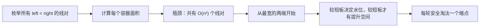

双指针不是因为“左右夹逼看起来像”才成立，而是因为每次移动都能证明：被移动的端点与任何未来候选配对，都不可能超过当前面积。

### 方案一：枚举所有线对（暴力起点）

#### 思路

固定左边界 `left`，枚举它右侧的每个 `right`。每对线都依据公式计算面积，并维护最大值。

```cpp
class Solution {
public:
    int maxArea(vector<int>& height) {
        // 保存所有已枚举线对中的最大容积。
        int best_area = 0;
        // 依次固定每一条线作为容器左边界。
        for (int left = 0; left < static_cast<int>(height.size()); ++left) {
            // 只枚举左边界右侧的线，避免重复计算和同一条线配对。
            for (int right = left + 1;
                 right < static_cast<int>(height.size());
                 ++right) {
                // 两条线的横坐标差就是容器宽度。
                const int width = right - left;
                // 不能倾斜时水位由较短的竖线限制。
                const int water_height = min(height[left], height[right]);
                // 用宽度乘有效水位得到当前线对的容积。
                const int area = width * water_height;
                // 将当前线对的结果并入全局最优答案。
                best_area = max(best_area, area);
            }
        }

        // 所有不同线对均已检查，返回最大容积。
        return best_area;
    }
};
```

#### 不变量与正确性

- 外层循环处理到 `left` 时，所有左边界小于 `left` 的线对都已枚举完成。
- 内层循环处理到 `right` 时，所有以当前 `left` 为左边界、右边界位于 `[left + 1, right)` 的线对都已计算。
- 任意两条不同的线都能唯一写成 `left < right`，所以不会漏掉或重复计算任何候选；取所有候选面积的最大值必然正确。

#### 边界与细节

- 内层从 `left + 1` 开始，保证左右边界不同，也避免 `(left, right)` 和 `(right, left)` 的重复。
- 高度可以为 `0`，此时该线对面积为 `0`，无需特殊分支。
- 题目范围下最大面积为 `(10^5 - 1) × 10^4`，小于 `int` 上界；在更大范围的变体中，应使用 `long long` 保存面积。

#### 复杂度与取舍

| 时间复杂度 | 辅助空间 | 优点 | 代价 |
| --- | --- | --- | --- |
| `O(n²)` | `O(1)` | 最直接，公式与代码一一对应 | `n = 10^5` 时无法通过 |

暴力解的价值是明确“所有候选是什么”。接下来要做的是证明：能否在每一步不枚举大量候选、就直接淘汰其中一部分。

### 方案二：左右双指针 + 淘汰短板（推荐）

#### 思路

初始时 `left = 0`、`right = n - 1`，容器宽度最大。每轮先计算当前面积，再移动较短板：

- `height[left] < height[right]` 时移动 `left`。
- `height[left] > height[right]` 时移动 `right`。
- 两端等高时移动任意一端都安全；代码统一移动 `right`。

```cpp
class Solution {
public:
    int maxArea(vector<int>& height) {
        // 从最左端开始，初始时与右端形成最大可能宽度。
        int left = 0;
        // 从最右端开始；题目保证数组至少有两条线。
        int right = static_cast<int>(height.size()) - 1;
        // 保存所有已检查容器中的最大容积。
        int best_area = 0;

        while (left < right) {
            // 当前左右边界之间的横向距离就是容器宽度。
            const int width = right - left;
            // 较短板限制水位，较长板多出的高度不能装入更多水。
            const int water_height = min(height[left], height[right]);
            // 计算当前这对边界形成的容积。
            const int area = width * water_height;
            // 在淘汰任一端点前先记录当前候选的面积。
            best_area = max(best_area, area);

            // 左板较短时，保留它而缩小宽度不可能得到更大面积，故移动左板。
            if (height[left] < height[right]) {
                ++left;
            } else {
                // 右板较短或等高时，移动右板；等高时移动任一端都安全。
                --right;
            }
        }

        // 所有仍可能优于 best_area 的区间均已排除，返回最优容积。
        return best_area;
    }
};
```

#### 为什么必须移动较短板

设当前 `left < right` 且 `height[left] <= height[right]`。当前面积为：

$$
height[left] \times (right - left)
$$

现在考虑保留左边界、把右边界换成任意 `k`，其中 `left < k < right`。由于：

$$
\min(height[left], height[k]) \le height[left]
$$

且新宽度 `k - left` 严格小于 `right - left`，所以：

$$
\min(height[left], height[k]) \times (k - left)
< height[left] \times (right - left)
$$

也就是说，**只要左板不变，右边界向内移动只会得到比当前更差的结果**。左板不可能再参与任何更优解，可以安全淘汰，故移动 `left`。`height[left] > height[right]` 时完全对称，应移动 `right`。

这同时解释了两个常见误区：

- **不能移动较长板**：较短板仍限制水位，而宽度变小，当前长板与任何更窄区间的组合都无从证明有希望。
- **不能只看高度更大的板**：容积还取决于宽度；双指针的正确移动来自“能否安全淘汰”，不是单纯追求更高的柱子。

#### 不变量与正确性

循环每轮开始时，满足下面的不变量：

- 所有至少有一个端点位于当前区间 `[left, right]` 外部的线对，都已经被计算过，或已经被证明不可能超过 `best_area`。
- 因此，全局最优解要么已经记录在 `best_area` 中，要么两个端点都仍位于闭区间 `[left, right]` 内。

初始时区间包含所有端点，不变量显然成立。每轮先计算 `(left, right)`，再根据“较短板可安全淘汰”的证明移动一个端点；被排除端点与任何仍在区间内端点的组合都不会优于刚计算的面积，自然也不会优于更新后的 `best_area`。因此不变量保持。

当 `left == right` 时，区间中不足两条线，已不存在新的容器候选；由不变量可知 `best_area` 就是全局答案。

#### 示例推演

对 `height = [1, 8, 6, 2, 5, 4, 8, 3, 7]`：

| `left` | `right` | 有效高度 | 宽度 | 当前面积 | 移动原因 |
| --- | --- | --- | --- | --- | --- |
| `0` | `8` | `1` | `8` | `8` | 左板 `1` 更短，移动 `left` |
| `1` | `8` | `7` | `7` | `49` | 右板 `7` 更短，移动 `right` |
| `1` | `7` | `3` | `6` | `18` | 右板 `3` 更短，移动 `right` |
| `1` | `6` | `8` | `5` | `40` | 等高，代码移动 `right` |
| `1` | `5` | `4` | `4` | `16` | 右板 `4` 更短，移动 `right` |

后续宽度继续缩小，最终最大面积保持为 `49`。

#### 边界与细节

- 循环条件必须是 `left < right`，不是 `left <= right`：相等时只剩一条线，无法构成容器。
- 当前面积必须在移动指针**之前**计算，否则会漏掉初始最大宽度对应的候选。
- 两端等高时移动左或右都正确；不能停在原地，否则循环不会推进。代码中放进 `else` 统一右移。
- 高度允许为 `0`，面积公式和指针移动规则仍成立。
- 本题不需要修改输入数组；`height` 若不需要改动，实际工程接口可写成 `const vector<int>& height`，但 LeetCode 固定接口通常保留 `vector<int>&`。

#### 复杂度与取舍

| 时间复杂度 | 辅助空间 | 是否修改输入 | 为什么推荐 | 代价 |
| --- | --- | --- | --- | --- |
| `O(n)` | `O(1)` | 否 | 每轮安全淘汰一个端点，满足大规模输入要求 | 正确性依赖短板淘汰证明，不能靠直觉随意移动 |

### 方案选择与 Trade-off

| 方案 | 时间 | 辅助空间 | 主要优势 | 主要代价 | 面试定位 |
| --- | --- | --- | --- | --- | --- |
| 枚举所有线对 | `O(n²)` | `O(1)` | 最容易建立面积公式与正确性 | 无法处理 `10^5` 规模 | 用于推导优化 |
| 双指针淘汰短板 | `O(n)` | `O(1)` | 满足最优复杂度，且不修改数组 | 需要讲清“为什么移动短板” | 推荐答案 |

### 面试手撕表达

> 暴力要枚举所有左右边界，时间 `O(n²)`。双指针从最宽的两端开始，每轮面积由较短板决定。若左板较短，任何保留左板、把右边界向内移动的方案，宽度更小且有效高度不可能超过左板，因此一定不如当前面积；左板不可能参与更优答案，可以安全右移。右板较短时同理。每轮淘汰一个端点，所以总时间 `O(n)`、额外空间 `O(1)`。

### 复习检查

- 为什么有效高度是两端高度的最小值？“不能倾斜”在公式中体现在哪里？
- 为什么初始指针必须放在两端？
- 请用不等式证明：左板较短时，左板不能再参与更优解。
- 为什么循环条件是 `left < right`？
- 两端等高时为什么移动任意一端都正确？
- 为什么“移动较高的板”没有正确性保证？

## 3. 三数之和

- 题目链接：[15. 三数之和](https://leetcode.cn/problems/3sum/description/)
- 难度：中等
- 核心分类：排序、双指针、去重、固定一个元素降维。

### 题目

给你一个整数数组 `nums`，判断是否存在三元组 `[nums[i], nums[j], nums[k]]` 满足 `i != j`、`i != k` 且 `j != k`，同时还满足：

$$
nums[i] + nums[j] + nums[k] = 0
$$

请返回所有和为 `0` 且不重复的三元组。答案中不可以包含重复三元组，输出的顺序和三元组内部的顺序均不重要。

**示例 1：**

```text
输入：nums = [-1, 0, 1, 2, -1, -4]
输出：[[-1, -1, 2], [-1, 0, 1]]
```

**示例 2：**

```text
输入：nums = [0, 1, 1]
输出：[]
```

**示例 3：**

```text
输入：nums = [0, 0, 0]
输出：[[0, 0, 0]]
```

**提示：**

- `3 <= nums.length <= 3000`
- `-10^5 <= nums[i] <= 10^5`

### 读题：哪些特征指向“排序 + 固定 + 双指针”

三元组问题的直接枚举有三层循环。要降低一层复杂度，可以固定第一个数 `nums[i]`，把剩余目标改写为：

$$
nums[left] + nums[right] = -nums[i]
$$

这就变成了一个两数之和问题。进一步排序后，剩余两个数具备单调性，可以使用左右双指针；同时，重复元素相邻，使去重可以在扫描时完成。

| 题目特征 | 推导出的需求 | 对应做法 |
| --- | --- | --- |
| 选择三个不同下标 | 先枚举一个位置，再处理两个剩余位置 | 固定 `i`，令 `left = i + 1`、`right = n - 1` |
| 三数和为固定目标 `0` | 剩余两数有确定目标 `-nums[i]` | 双指针比较当前和与零 |
| 需要所有答案且不能重复 | 相同数值组合只能输出一次 | 排序后跳过重复的 `i`、`left`、`right` |
| 数组原本无序 | 指针移动没有单调依据 | 先排序建立“和变大/变小”的方向 |

排序在本题中承担两份工作：**建立双指针的单调性**，以及**让相同值相邻以便去重**。只做其中一项都无法完整解决问题。

### 从暴力到双指针

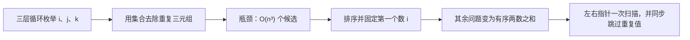

### 方案一：三层枚举 + 集合去重（暴力起点）

#### 思路

枚举所有满足 `i < j < k` 的下标组合。命中和为 `0` 后，对这三个值排序并放进 `set`；有序集合会自动合并值相同的三元组。最后再将集合转换为题目要求的二维数组。

```cpp
class Solution {
public:
    vector<vector<int>> threeSum(vector<int>& nums) {
        // 有序集合保存已找到的值三元组，自动去除重复答案。
        set<array<int, 3>> unique_triplets;
        // 缓存长度，使三层循环的边界含义更清楚。
        const int n = static_cast<int>(nums.size());

        for (int i = 0; i < n - 2; ++i) {
            // j 从 i 的右侧开始，确保三个下标互不相同。
            for (int j = i + 1; j < n - 1; ++j) {
                // k 从 j 的右侧开始，每个下标组合只枚举一次。
                for (int k = j + 1; k < n; ++k) {
                    // 本题数值范围内三数之和安全；更大范围可改为 long long。
                    const int sum = nums[i] + nums[j] + nums[k];
                    // 只有和为零的组合才是候选答案。
                    if (sum != 0) {
                        continue;
                    }

                    // 将三个值放入固定长度容器，准备规范化为同一顺序。
                    array<int, 3> triplet{nums[i], nums[j], nums[k]};
                    // 相同值集合排序后具有相同表示，集合才能正确去重。
                    sort(triplet.begin(), triplet.end());
                    // 插入重复值不会改变集合，因此不会产生重复三元组。
                    unique_triplets.insert(triplet);
                }
            }
        }

        // 将集合中的唯一三元组转换为题目要求的二维 vector。
        vector<vector<int>> result;
        // 最终答案数量等于集合大小，提前预留对应容量。
        result.reserve(unique_triplets.size());
        for (const array<int, 3>& triplet : unique_triplets) {
            // 按排序后的固定顺序写入一个三元组。
            result.push_back({triplet[0], triplet[1], triplet[2]});
        }

        // 返回所有不重复的合法三元组。
        return result;
    }
};
```

#### 不变量与正确性

- 三层循环始终满足 `i < j < k`，因此同一个数组元素不会被使用两次，每一组下标组合只出现一次。
- 处理到 `(i, j, k)` 时，所有字典序更早的下标三元组都已经检查过；命中的三元组都被转换成递增的值表示再插入集合。
- 任一合法下标三元组必会被枚举到；任意两个值相同但下标不同的答案，排序后 `array<int, 3>` 相同，因此集合只保留一份。

#### 复杂度与取舍

| 时间复杂度 | 辅助空间 | 优点 | 代价 |
| --- | --- | --- | --- |
| 最坏 `O(n³ log n)` | `O(u)` | 正确性直观，集合直接处理去重 | 枚举量过大，`u` 为不同答案数 |

三元组内排序的长度恒为 `3`，属于常数开销；`log n` 来自 `set` 的插入与查询。即使忽略集合开销，三层枚举也已经无法处理 `n = 3000`。

### 方案二：排序 + 固定首元素 + 双指针（推荐）

#### 思路

先对 `nums` 排序。外层固定 `nums[i]`，剩余两数在区间 `[i + 1, n - 1]` 内用双指针寻找和为 `-nums[i]` 的组合。

- 三数和小于 `0`：需要更大的和，移动 `left` 右移。
- 三数和大于 `0`：需要更小的和，移动 `right` 左移。
- 三数和等于 `0`：记录答案，并跳过左右两侧的重复值。

```cpp
class Solution {
public:
    vector<vector<int>> threeSum(vector<int>& nums) {
        // 排序建立双指针单调性，并让重复值集中到相邻位置。
        sort(nums.begin(), nums.end());
        // 保存最终的不重复三元组。
        vector<vector<int>> result;
        // 缓存数组长度，后续边界均以它为准。
        const int n = static_cast<int>(nums.size());

        for (int i = 0; i < n - 2; ++i) {
            // 相同首元素会生成相同的值三元组，跳过以完成第一层去重。
            if (i > 0 && nums[i] == nums[i - 1]) {
                continue;
            }
            // 排序后首元素已经大于零，后续三个数之和不可能再等于零。
            if (nums[i] > 0) {
                break;
            }

            // left 从首元素右侧开始，保证 i、left、right 三个下标不同。
            int left = i + 1;
            // right 从数组末尾开始，为剩余两数提供最大初始范围。
            int right = n - 1;

            while (left < right) {
                // 当前三数的和决定哪一侧指针需要移动。
                const int sum = nums[i] + nums[left] + nums[right];

                if (sum < 0) {
                    // 左指针右移会使有序数组中的两数和变大，才可能补足到零。
                    ++left;
                    continue;
                }
                if (sum > 0) {
                    // 右指针左移会使两数和变小，才可能降到零。
                    --right;
                    continue;
                }

                // 当前三个值按非递减顺序排列，直接作为一种规范化答案保存。
                result.push_back({nums[i], nums[left], nums[right]});

                // 跳过与当前左值相同的后继，避免重复输出同一值三元组。
                while (left < right && nums[left] == nums[left + 1]) {
                    ++left;
                }
                // 跳过与当前右值相同的前驱，避免重复输出同一值三元组。
                while (left < right && nums[right] == nums[right - 1]) {
                    --right;
                }
                // 跳过重复块后再移动到新的候选值，继续寻找其他答案。
                ++left;
                --right;
            }
        }

        // 所有可能的首元素均已处理，返回去重后的答案集合。
        return result;
    }
};
```

#### 为什么双指针移动不会漏解

固定 `i` 后，数组仍保持有序。设当前 `left < right`：

- 若 `nums[i] + nums[left] + nums[right] < 0`，固定 `left` 而让 `right` 左移，只会让 `nums[right]` 不增、总和更小或不变。因此当前 `left` 不可能与任何更小的右端点凑成 `0`，可以安全右移 `left`。
- 若总和大于 `0`，固定 `right` 而让 `left` 右移，只会让总和更大或不变。因此当前 `right` 不可能与任何更大的左端点凑成 `0`，可以安全左移 `right`。
- 若总和等于 `0`，当前值三元组已经记录。跳过相同的 `nums[left]` 或 `nums[right]` 只会产生同一组值，不会丢失新的答案。

排序带来的单调性让一次指针移动能批量排除一侧候选，而不必逐个枚举。

#### 三层去重：最容易写错的部分

排序后答案被规范为：

$$
nums[i] \le nums[left] \le nums[right]
$$

去重需要分别处理三个位置：

| 位置 | 重复判断 | 为什么安全 |
| --- | --- | --- |
| 首元素 `i` | `i > 0 && nums[i] == nums[i - 1]` | 相同的首值配合后续相同搜索空间，只会得到重复三元组 |
| 左指针 `left` | 命中后跳过 `nums[left] == nums[left + 1]` | 首值和右值不变时，相同左值对应同一三元组 |
| 右指针 `right` | 命中后跳过 `nums[right] == nums[right - 1]` | 首值和左值不变时，相同右值对应同一三元组 |

注意：左右指针的去重发生在**命中答案之后**。当总和偏小或偏大时，指针移动承担的是搜索职责，不能为了去重随意跳过仍可能影响目标和的值。

#### 不变量与正确性

对固定的 `i`，在每次 `while` 循环开始时：

- `left`、`right` 满足 `i < left < right`，所以三个下标互不相同。
- 所有仍可能与 `nums[i]` 组成新答案的两数候选都位于闭区间 `[left, right]` 内；区间外候选要么已经计算过，要么已由单调性证明无法凑成 `0`，要么是已跳过的重复值。
- `result` 已经包含此前所有首值更小的答案，以及当前首值下已经发现的全部不同三元组。

`sum < 0` 和 `sum > 0` 时的单调性证明保证区间收缩不漏解；命中时将同值块整体跳过，保证不重复。外层跳过重复首值后，每个值三元组恰好被记录一次。

#### 示例推演

排序后 `nums = [-4, -1, -1, 0, 1, 2]`。固定 `i = 1`，即 `nums[i] = -1`：

| `left` | `right` | 三元组 | 和 | 动作 |
| --- | --- | --- | --- | --- |
| `2` | `5` | `[-1, -1, 2]` | `0` | 记录，左右均移到新值 |
| `3` | `4` | `[-1, 0, 1]` | `0` | 记录，左右相遇后结束 |

外层到 `i = 2` 时，`nums[2] == nums[1]`，跳过该重复首元素，所以不会重复输出上述两组答案。

#### 边界与细节

- 外层条件是 `i < n - 2`，不是 `i < n`：必须至少为 `left` 和 `right` 留出两个位置。
- 内层条件是 `left < right`，不是 `left <= right`：相等时只剩一个下标，不能重复使用同一个元素。
- `i > 0` 是首元素去重的边界保护；`i = 0` 时不能访问 `nums[-1]`。
- `left < right` 同时保护去重循环中的 `left + 1` 和 `right - 1`，避免越界。
- 排序会修改 `nums`。本题允许这样做；若调用者要求保留原顺序，应先复制数组，代价是 `O(n)` 额外空间。
- 三数和在本题范围内位于 `[-3 × 10^5, 3 × 10^5]`，`int` 安全；泛化到更大数值范围时应使用 `long long`。

#### 复杂度与取舍

排序为 `O(n log n)`。外层最多执行 `n` 次，内层双指针每次最多线性移动，总时间为 `O(n²)`；除返回结果外，只使用常数额外空间。

| 时间复杂度 | 辅助空间 | 是否修改输入 | 为什么推荐 | 代价 |
| --- | --- | --- | --- | --- |
| `O(n²)` | `O(1)`，不含排序栈和输出 | 是 | 比暴力少一层枚举，排序同时解决搜索与去重 | 必须严谨处理排序和三层去重 |

### 方案选择与 Trade-off

| 方案 | 时间 | 辅助空间 | 是否修改输入 | 主要优势 | 主要代价 |
| --- | --- | --- | --- | --- | --- |
| 三层枚举 + 集合 | 最坏 `O(n³ log n)` | `O(u)` | 否 | 直接覆盖所有下标组合，集合自动去重 | 复杂度过高，集合也增加开销 |
| 排序 + 固定 + 双指针 | `O(n²)` | `O(1)`，不含输出 | 是 | 最优主流解，去重与搜索可同步完成 | 需要证明指针移动和去重安全 |
| 固定 + 哈希集合 | 平均 `O(n²)` | `O(n)` | 否 | 不需要排序也能查补数 | 去重逻辑复杂，空间更大，常数通常更高 |

“固定 + 哈希集合”也是可行的二次时间方案：固定 `i` 后，用集合寻找 `-nums[i] - nums[j]`。但要对首元素、第二个元素和最终三元组都做去重，代码往往不如排序双指针清晰；本题默认优先选择后者。

### 面试手撕表达

> 暴力需要三层枚举，时间 `O(n³)`，还要额外去重。排序后固定第一个数 `nums[i]`，问题变成在有序区间中找两个数之和为 `-nums[i]`。左右指针的和偏小时右移 `left`，偏大时左移 `right`，每个 `i` 的扫描是线性的，总时间 `O(n²)`。去重分三层：外层跳过重复 `i`，命中答案后跳过重复的 `left` 和 `right`，这样只输出不同的值三元组。

### 复习检查

- 为什么固定 `i` 后，问题能降为两数之和？
- 排序在本题中同时解决了哪两个问题？
- `sum < 0` 时为什么移动 `left`，而不是移动 `right`？
- 为什么外层去重使用 `nums[i] == nums[i - 1]`，而左右去重使用相邻的下一项或前一项？
- 为什么去重左右指针必须发生在命中答案之后？
- `[0, 0, 0, 0]` 为什么只应输出一个 `[0, 0, 0]`？

## 4. 接雨水

- 题目链接：[42. 接雨水](https://leetcode.cn/problems/trapping-rain-water/description/)
- 难度：困难
- 核心分类：双指针、前后缀最大值、按位置结算。

### 题目

给定 `n` 个非负整数表示每个宽度为 `1` 的柱子的高度图，计算按此排列的柱子下雨之后能接多少雨水。

**示例 1：**

```text
输入：height = [0, 1, 0, 2, 1, 0, 1, 3, 2, 1, 2, 1]
输出：6
```

**示例 2：**

```text
输入：height = [4, 2, 0, 3, 2, 5]
输出：9
```

**提示：**

- `n == height.length`
- `1 <= n <= 2 × 10^4`
- `0 <= height[i] <= 10^5`

### 从单个位置理解雨水公式

位置 `i` 上能否存水，不取决于紧挨着它的柱子，而取决于它左、右两侧最高柱中较低的那一侧。定义：

- `left_max[i]`：区间 `[0, i]` 的最高高度。
- `right_max[i]`：区间 `[i, n - 1]` 的最高高度。

则位置 `i` 的储水量为：

$$
water[i] = \min(left\_max[i], right\_max[i]) - height[i]
$$

由于两侧最大值都包含 `height[i]` 自身，上式不会为负。总雨水量是所有位置水量的和。

| 题目特征 | 推导出的需求 | 对应做法 |
| --- | --- | --- |
| 每个位置能否接水由两边边界决定 | 需要知道左右的最高柱 | 前后缀最大值 |
| 要累计全部位置的水量 | 每个下标只结算一次 | 从左到右或双指针扫描 |
| 两张最大值数组有重复信息 | 可在扫描时只维护尚未处理边界的最大值 | `left_max`、`right_max` 两个变量 |
| 只需要总量，不需要每格水量 | 不必保存完整前后缀数组 | 双指针压缩空间至 `O(1)` |

### 从暴力到双指针

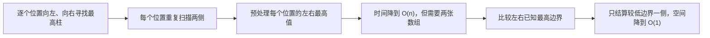

设数组长度为 $n$。本题的优化主线是先消除重复寻找最高柱的时间，再消除保存所有最高值的空间。

### 方案一：逐位置扫描左右最高柱（暴力起点）

#### 思路

对于每一个位置 `i`，分别扫描 `[0, i]` 和 `[i, n - 1]`，找出两侧最高柱，再用水量公式计算当前位置的贡献。

```cpp
class Solution {
public:
    int trap(vector<int>& height) {
        // 用 long long 累加，避免推广到更大约束时总水量溢出。
        long long trapped_water = 0;
        // 依次结算每个柱子上方能够储存的水量。
        for (int index = 0; index < static_cast<int>(height.size()); ++index) {
            // 保存当前位置左侧（含自身）的最高柱。
            int left_max = 0;
            // 扫描左半边以获得左侧挡板高度。
            for (int left = 0; left <= index; ++left) {
                // 将当前柱纳入左侧最高值。
                left_max = max(left_max, height[left]);
            }

            // 保存当前位置右侧（含自身）的最高柱。
            int right_max = 0;
            // 扫描右半边以获得右侧挡板高度。
            for (int right = index;
                 right < static_cast<int>(height.size());
                 ++right) {
                // 将当前柱纳入右侧最高值。
                right_max = max(right_max, height[right]);
            }

            // 较低挡板决定水位，减去当前柱高就是当前位置水量。
            trapped_water += min(left_max, right_max) - height[index];
        }

        // 本题约束下结果位于 int 范围内，按题目接口返回。
        return static_cast<int>(trapped_water);
    }
};
```

#### 不变量与正确性

- 扫描左侧循环结束时，`left_max` 是 `[0, index]` 的最大高度；扫描右侧循环结束时，`right_max` 是 `[index, n - 1]` 的最大高度。
- 两个高度较小者是当前位置能达到的最高水位，减去柱高正是该位置可容纳的雨水。
- 外层循环覆盖每个位置一次，累加所有位置水量即为总雨水量。

#### 复杂度与取舍

| 时间复杂度 | 辅助空间 | 优点 | 代价 |
| --- | --- | --- | --- |
| `O(n²)` | `O(1)` | 直接对应数学公式，容易验证 | 每个位置都重复扫描左右区域 |

### 方案二：前后缀最大值（时间优化版）

#### 思路

位置之间重复扫描的部分可以预处理：从左到右填充 `left_max`，从右到左填充 `right_max`。之后第三次遍历即可按公式结算每一格。

```cpp
class Solution {
public:
    int trap(vector<int>& height) {
        // 记录数组长度，统一后续循环的边界。
        const int n = static_cast<int>(height.size());
        // 保存每个位置左侧（含自身）的最高柱。
        vector<int> left_max(n);
        // 保存每个位置右侧（含自身）的最高柱。
        vector<int> right_max(n);

        // 第一个位置左侧只有自己，作为前缀最大值的初始化。
        left_max[0] = height[0];
        for (int index = 1; index < n; ++index) {
            // 当前前缀最高值由前一个前缀最高值和当前柱共同决定。
            left_max[index] = max(left_max[index - 1], height[index]);
        }

        // 最后一个位置右侧只有自己，作为后缀最大值的初始化。
        right_max[n - 1] = height[n - 1];
        for (int index = n - 2; index >= 0; --index) {
            // 当前后缀最高值由后一个后缀最高值和当前柱共同决定。
            right_max[index] = max(right_max[index + 1], height[index]);
        }

        // 用更宽的类型累计所有位置的雨水量。
        long long trapped_water = 0;
        for (int index = 0; index < n; ++index) {
            // 直接应用预处理好的左右边界公式结算当前位置。
            trapped_water += min(left_max[index], right_max[index]) - height[index];
        }

        // 题目接口要求 int，约束保证转换安全。
        return static_cast<int>(trapped_water);
    }
};
```

#### 不变量与正确性

- 填充 `left_max` 时，处理到 `index` 后，`left_max[index]` 恰为 `[0, index]` 的最高柱。
- 填充 `right_max` 时，处理到 `index` 后，`right_max[index]` 恰为 `[index, n - 1]` 的最高柱。
- 最后一次遍历对每个位置应用相同的水量公式，因此与暴力解计算出的每个位置水量完全一致。

#### 边界与细节

- 本题保证 `n >= 1`，所以 `left_max[0]` 和 `right_max[n - 1]` 合法；若复用到允许空数组的变体，应先在 `n == 0` 时返回 `0`。
- 倒序循环使用 `int index = n - 2`，不要使用无符号的 `size_t` 直接递减到 `0`，否则可能发生下溢并死循环。
- 两张数组都包含当前位置自身，所以 `min(left_max[index], right_max[index]) >= height[index]`，无需额外写 `max(0, ...)`。

#### 复杂度与取舍

| 时间复杂度 | 辅助空间 | 优点 | 代价 |
| --- | --- | --- | --- |
| `O(n)` | `O(n)` | 从公式直接推导，正确性直观 | 存储两张长度为 `n` 的数组 |

### 方案三：双指针实时结算较低边界（推荐）

#### 思路

方案二的核心信息是“当前位置只需要左右最高值中较小的一个”。双指针不再保存每个位置的最大值，而是维护：

- `left`、`right`：尚未结算区域的左右边界。
- `left_max`：已经从左侧扫描过的最高柱。
- `right_max`：已经从右侧扫描过的最高柱。

每轮比较 `left_max` 和 `right_max`：较小的一侧已经确定了自己的水位，可以立刻结算对应边界位置。

```cpp
class Solution {
public:
    int trap(vector<int>& height) {
        // 从数组两端开始，围住尚未结算的柱子区间。
        int left = 0;
        int right = static_cast<int>(height.size()) - 1;
        // 非负高度的题设下，零是左右最高柱的自然初始值。
        int left_max = 0;
        int right_max = 0;
        // 用 long long 累加所有位置水量，避免总和溢出。
        long long trapped_water = 0;

        while (left <= right) {
            // 左侧已知最高边界不高于右侧时，当前位置左端的水位已可确定。
            if (left_max <= right_max) {
                // 先将当前左柱纳入左侧边界信息。
                left_max = max(left_max, height[left]);
                // 右侧存在至少 right_max 高的挡板，因此左端水位由 left_max 决定。
                trapped_water += left_max - height[left];
                // 当前位置已经结算，缩小尚未处理区间的左边界。
                ++left;
            } else {
                // 先将当前右柱纳入右侧边界信息。
                right_max = max(right_max, height[right]);
                // 左侧存在至少 left_max 高的挡板，因此右端水位由 right_max 决定。
                trapped_water += right_max - height[right];
                // 当前位置已经结算，缩小尚未处理区间的右边界。
                --right;
            }
        }

        // 每个位置恰好结算一次后，返回总雨水量。
        return static_cast<int>(trapped_water);
    }
};
```

#### 为什么能只结算较低边界一侧

循环开始时，`left_max` 是已处理左前缀的最高柱，`right_max` 是已处理右后缀的最高柱。

若 `left_max <= right_max`，处理 `left`：

- 若 `height[left] <= left_max`，左侧挡板高度已知为 `left_max`，右侧已知存在不低于 `right_max` 的挡板，且 `right_max >= left_max`。因此当前位置水位确定为 `left_max`，水量就是 `left_max - height[left]`。
- 若 `height[left] > left_max`，当前柱本身成为新的左侧最高柱，水量为 `0`；即使它高于 `right_max`，也不会让已经结算的事实失效。

`left_max > right_max` 时完全对称，右端水位由 `right_max` 确定。关键不是比较当前 `height[left]` 和 `height[right]`，而是比较**已经确定的两侧最高边界**。

#### 不变量与正确性

每轮循环开始前：

- 区间 `[0, left)` 和 `(right, n - 1]` 中的所有位置都已恰好结算一次。
- `left_max` 是左侧已结算前缀的最高高度，`right_max` 是右侧已结算后缀的最高高度。
- 尚未结算的位置恰好位于闭区间 `[left, right]`。

选择较小边界的一侧后，上一节的论证保证该端当前位置水量已完全确定；更新最大值、结算水量并移动一个指针后，已结算区域扩大一格，不变量保持。循环以 `left <= right` 运行，确保每个下标，包括最终相遇位置，都被结算一次。

#### 示例推演

对示例 `height = [0, 1, 0, 2, 1, 0, 1, 3, 2, 1, 2, 1]`，以下列出产生雨水的关键结算：

| 结算下标 | 柱高 | 决定水位的边界 | 该位置雨水 | 累计雨水 |
| --- | --- | --- | --- | --- |
| `2` | `0` | `left_max = 1` | `1` | `1` |
| `4` | `1` | `left_max = 2` | `1` | `2` |
| `5` | `0` | `left_max = 2` | `2` | `4` |
| `6` | `1` | `left_max = 2` | `1` | `5` |
| `9` | `1` | `right_max = 2` | `1` | `6` |

其余位置要么本身刷新某侧最高柱，要么与该侧最高柱等高，因此贡献为 `0`；总量为 `6`。

#### 边界与细节

- 循环使用 `left <= right`：每轮只移动一个指针，能保证每个下标恰好结算一次。若改成 `left < right` 也可写对，但需要额外论证最后一个未处理位置的贡献为零，学习阶段更容易出错。
- `left_max`、`right_max` 初始化为 `0` 依赖本题“高度非负”的约束。若柱高允许负数，初始化策略和物理模型都需要重新定义。
- 更新最大值必须在计算 `left_max - height[left]` 或 `right_max - height[right]` **之前**完成，否则遇到新最高柱时可能算出负水量。
- 本题最大雨水量不超过 `(n - 2) × 10^5`，位于 `int` 范围内；代码仍使用 `long long` 累加，以便迁移到更大范围。
- 只有一个柱子时，第一次循环会把它作为某一侧新最高柱结算出 `0`，然后结束，结果正确。

#### 复杂度与取舍

| 时间复杂度 | 辅助空间 | 是否修改输入 | 为什么推荐 | 代价 |
| --- | --- | --- | --- | --- |
| `O(n)` | `O(1)` | 否 | 与前后缀解同样线性，但省去两张数组 | 需要理解“较低最高边界可先结算”的证明 |

### 方案选择与 Trade-off

| 方案 | 时间 | 辅助空间 | 主要优势 | 主要代价 | 面试定位 |
| --- | --- | --- | --- | --- | --- |
| 逐位置扫描左右最高柱 | `O(n²)` | `O(1)` | 直接套用单点水量公式 | 重复扫描大量区间 | 正确性起点 |
| 前后缀最大值 | `O(n)` | `O(n)` | 最贴近公式，便于首次推导线性解 | 两张数组占用空间 | 清晰过渡方案 |
| 双指针实时结算 | `O(n)` | `O(1)` | 最优空间，逐位置只处理一次 | 不变量与结算方向较抽象 | 推荐答案 |
| 单调栈 | `O(n)` | `O(n)` | 按“凹槽”结算，适合相关变体 | 栈逻辑与边界更复杂 | 补充思路 |

单调栈也能在线性时间内解决本题：当遇到更高的右边界时，弹出凹槽底部并计算一段水量。它适合需要显式找左右边界或处理“下一个更大元素”变体的场景；只求总雨水时，双指针通常更短、更容易手写。

### 面试手撕表达

> 单个位置的水量由左右最高柱中较低者减去当前高度决定。暴力会为每个位置重复找左右最高柱，时间 `O(n²)`；先用前后缀最大值可以做到 `O(n)` 时间、`O(n)` 空间。双指针进一步只维护已扫描两侧的 `left_max` 和 `right_max`：哪一侧最高边界更低，哪一侧当前柱的水位就已经确定，可以立刻结算并移动该指针。因此每个位置只处理一次，时间 `O(n)`、额外空间 `O(1)`。

### 复习检查

- 为什么单个位置的水位取左右最高柱的最小值？
- 前后缀数组为什么都要包含当前位置自身？
- 前后缀方案中，倒序循环为什么适合用 `int` 而非 `size_t`？
- 双指针为什么比较 `left_max` 与 `right_max`，而不是只比较当前两根柱高？
- 更新一侧最大值为什么要发生在结算当前位置之前？
- 为什么推荐代码使用 `left <= right`，而不是 `left < right`？

# 滑动窗口

## 1. 无重复字符的最长子串

- 题目链接：[3. 无重复字符的最长子串](https://leetcode.cn/problems/longest-substring-without-repeating-characters/description/)
- 难度：中等
- 核心分类：滑动窗口、双指针、哈希集合、最近出现位置。

### 题目

给定一个字符串 `s`，找出其中不含重复字符的最长**子串**的长度。

**示例 1：**

```text
输入：s = "abcabcbb"
输出：3
解释：最长无重复子串是 "abc"；"bca" 和 "cab" 也是长度为 3 的答案。
```

**示例 2：**

```text
输入：s = "bbbbb"
输出：1
```

**示例 3：**

```text
输入：s = "pwwkew"
输出：3
解释：最长无重复子串是 "wke"。"pwke" 是子序列，不是连续的子串。
```

**提示：**

- `0 <= s.length <= 10^5`
- `s` 由英文字母、数字、符号和空格组成。

### 读题：哪些特征指向滑动窗口

“子串”意味着答案必须是连续区间，可以用一对边界 `left`、`right` 表示为左闭右闭窗口 `[left, right]`。窗口需要始终满足“没有重复字符”这一约束；当右边加入一个字符导致约束破坏时，只需向右移动左边界，而不必从头重新枚举。

| 题目特征 | 推导出的需求 | 对应做法 |
| --- | --- | --- |
| 求连续子串而非任意子序列 | 用两个下标描述一个连续区间 | 滑动窗口 `[left, right]` |
| 窗口内不能有重复字符 | 快速判断新字符是否已在窗口中 | `unordered_set` 或最近位置表 |
| 只会因右端新增字符破坏约束 | 左端只需单调右移恢复合法性 | 双指针不会回退 |
| 要求最长长度 | 每次窗口合法后更新长度 | `right - left + 1` |

滑动窗口的核心不是“两个指针一起走”，而是维护一个**合法窗口不变量**：窗口内每个字符至多出现一次。

### 从逐起点扩展到滑动窗口

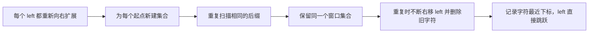

### 方案一：固定起点后向右扩展（暴力起点）

#### 思路

枚举每个起点 `left`，从该位置向右扩展，并用集合记录本次扩展已出现的字符。遇到第一个重复字符时停止，因为以当前 `left` 为起点的更长子串必然仍含重复。

```cpp
class Solution {
public:
    int lengthOfLongestSubstring(string s) {
        // 保存所有起点尝试中出现过的最长合法窗口长度。
        int longest = 0;
        // 依次枚举子串的左边界。
        for (int left = 0; left < static_cast<int>(s.size()); ++left) {
            // 每个新起点重新维护它自己的已见字符集合。
            unordered_set<char> seen;

            for (int right = left; right < static_cast<int>(s.size()); ++right) {
                // 当前字符已在本次窗口中出现，继续扩展只会保留重复，立即停止。
                if (seen.find(s[right]) != seen.end()) {
                    break;
                }

                // 将当前首次出现的字符纳入本次窗口。
                seen.insert(s[right]);
                // 当前窗口 [left, right] 合法，用它更新最长长度。
                longest = max(longest, right - left + 1);
            }
        }

        // 所有起点均已尝试，返回最长合法子串长度。
        return longest;
    }
};
```

#### 不变量与正确性

- 内层循环处理到 `right` 前，`seen` 恰好包含子串 `s[left..right)` 中的所有字符，且没有重复。
- 若 `s[right]` 已在 `seen` 中，`s[left..right]` 已不合法；再加入更多字符无法消除这个重复，所以以 `left` 为起点的搜索可结束。
- 所有可能的左边界都被枚举，因此取每个起点的最长合法扩展长度的最大值不会漏掉答案。

#### 复杂度与取舍

| 时间复杂度 | 辅助空间 | 优点 | 代价 |
| --- | --- | --- | --- |
| 最坏 `O(n²)` | `O(n)` | 思路直接，先建立“遇重复停止”的正确性 | 不同起点会反复扫描相同后缀 |

### 方案二：集合维护的滑动窗口（线性时间基础版）

#### 思路

不再为每个 `left` 新建集合，而是维护唯一的窗口 `[left, right]`。右指针每次尝试加入一个字符；若该字符已在窗口内，就不断从左端删除字符并右移 `left`，直到窗口重新合法，再加入当前字符。

```cpp
class Solution {
public:
    int lengthOfLongestSubstring(string s) {
        // 保存当前窗口 [left, right] 中所有不重复字符。
        unordered_set<char> window;
        // left 指向当前合法窗口的左边界。
        int left = 0;
        // 保存目前见过的最长合法窗口长度。
        int longest = 0;

        for (int right = 0; right < static_cast<int>(s.size()); ++right) {
            // 当前字符重复时，从左端持续移除字符以恢复窗口合法性。
            while (window.find(s[right]) != window.end()) {
                // 删除即将被 left 排除的旧字符，使集合与窗口内容一致。
                window.erase(s[left]);
                // 左边界右移，缩小窗口。
                ++left;
            }

            // 当前字符现在不在窗口中，可以安全加入窗口。
            window.insert(s[right]);
            // 窗口 [left, right] 合法，用其长度更新答案。
            longest = max(longest, right - left + 1);
        }

        // right 已扫描完整字符串，返回最长合法窗口长度。
        return longest;
    }
};
```

#### 不变量与正确性

每次外层循环结束后：

- `window` 恰好包含子串 `s[left..right]` 的全部字符。
- `s[left..right]` 中没有重复字符。
- `left` 从不左移，`right` 每轮只右移一次；每个字符最多被插入集合一次、从集合删除一次。

当 `s[right]` 重复时，`while` 删除左端字符直到删掉其旧出现位置，窗口重新无重复后才插入当前字符。因此不变量保持，所有合法窗口都会在右端到达时被考察。

#### 边界与细节

- `while` 不能写成 `if`：例如 `s = "abba"`，处理第二个 `b` 时窗口为 `"ab"`，必须先删除 `a`、再删除第一个 `b` 才能加入新的 `b`；只有持续收缩才能保证无重复。
- 空字符串时外层循环不执行，`longest = 0` 正确返回。
- `unordered_set<char>` 只存“是否出现”，不存下标；要删除字符必须逐个移动 `left`。

#### 复杂度与取舍

尽管存在嵌套 `while`，两个指针都只单调移动至多 `n` 次，所有集合操作总计为 `O(n)` 次。

| 时间复杂度 | 辅助空间 | 优点 | 代价 |
| --- | --- | --- | --- |
| 平均 `O(n)` | `O(n)` | 滑动窗口不变量最清晰，适用于字符范围未知的场景 | 遇到重复时需逐个删除窗口左端字符 |

### 方案三：最近出现位置 + 左边界跳跃（推荐）

#### 思路

集合版知道“字符重复了”，但不知道旧字符具体在哪。记录每个字符最后出现的下标后，若它仍在当前窗口内，`left` 可以直接跳到旧位置的后一格，而不必逐个删除。

本题字符集是常见英文字符、数字、符号和空格，可用 256 长度的表覆盖单字节字符。`unsigned char` 转换避免某些平台上 `char` 为负值时索引越界。

```cpp
class Solution {
public:
    int lengthOfLongestSubstring(string s) {
        // last_seen[ch] 记录字符 ch 最近一次出现的下标，-1 表示尚未出现。
        vector<int> last_seen(256, -1);
        // left 指向当前无重复窗口的左边界。
        int left = 0;
        // 保存目前见过的最长无重复窗口长度。
        int longest = 0;

        for (int right = 0; right < static_cast<int>(s.size()); ++right) {
            // 转为无符号字节，确保可安全作为 0 到 255 的数组下标。
            const unsigned char ch = static_cast<unsigned char>(s[right]);

            // 只有旧位置仍在当前窗口内，才需要移动左边界排除重复字符。
            if (last_seen[ch] >= left) {
                // 直接跳过旧出现位置，使当前字符在新窗口中只保留一次。
                left = last_seen[ch] + 1;
            }

            // 在处理完重复后，记录当前字符成为它的最新出现位置。
            last_seen[ch] = right;
            // 此时窗口 [left, right] 无重复，更新最优长度。
            longest = max(longest, right - left + 1);
        }

        // 所有字符均已作为窗口右端处理，返回最长长度。
        return longest;
    }
};
```

#### 为什么 `last_seen[ch] >= left` 是关键条件

最近出现过不等于“在当前窗口中重复”。例如处理 `s = "abba"` 的最后一个 `a` 时：

- 上一个 `a` 在下标 `0`，但此前处理第二个 `b` 时，`left` 已跳到 `2`。
- 下标 `0 < left`，旧 `a` 已被窗口排除；最后一个 `a` 可以直接加入，不能把 `left` 错误地回退到 `1`。

因此必须判断 `last_seen[ch] >= left`，并且只能用 `left = max(left, last_seen[ch] + 1)` 的语义前进，绝不能让 `left` 左移。

#### 不变量与正确性

处理 `right` 前：

- `s[left..right)` 中没有重复字符。
- `last_seen` 对每个字符记录它在前缀 `s[0..right)` 中的最后一个位置。
- `left` 是当前右端之前无重复窗口的最小合法左边界。

若当前字符的旧位置位于窗口内，跳到旧位置后一格恰好删除重复的旧字符，并保留尽可能长的后缀；若旧位置在窗口外或不存在，`left` 不变。更新 `last_seen` 后，`s[left..right]` 无重复，且窗口尽可能长，不变量保持。

#### 示例推演

对 `s = "pwwkew"`：

| `right` | 当前字符 | 旧位置 | `left` 处理后 | 当前窗口 | 最长长度 |
| --- | --- | --- | --- | --- | --- |
| `0` | `p` | `-1` | `0` | `"p"` | `1` |
| `1` | `w` | `-1` | `0` | `"pw"` | `2` |
| `2` | `w` | `1` | `2` | `"w"` | `2` |
| `3` | `k` | `-1` | `2` | `"wk"` | `2` |
| `4` | `e` | `-1` | `2` | `"wke"` | `3` |
| `5` | `w` | `2` | `3` | `"kew"` | `3` |

这也解释了为什么 `"pwke"` 不是答案：它跳过了中间字符，属于子序列而非连续子串。

#### 边界与细节

- `last_seen` 必须在判断重复**之后**更新；若先写入 `right`，每个字符都会被误判为与自己重复。
- `left` 只能向右移动。代码通过条件 `last_seen[ch] >= left` 保证这一点。
- `right - left + 1` 对应闭区间 `[left, right]` 的长度；若改用右开区间，公式会不同，不能混用。
- `vector<int>(256, -1)` 以字节为单位处理字符串。题目字符范围适用；若要按 Unicode 码点处理 UTF-8 文本，需要先解码，再用 `unordered_map<char32_t, int>` 等结构。

#### 复杂度与取舍

| 时间复杂度 | 辅助空间 | 为什么推荐 | 代价 |
| --- | --- | --- | --- |
| `O(n)` | `O(1)`，字符表大小固定为 256 | 左边界可一次跳到位，代码短且常数小 | 依赖单字节字符集；通用 Unicode 要换映射结构 |

### 方案选择与 Trade-off

| 方案 | 时间 | 辅助空间 | 主要优势 | 主要代价 | 面试定位 |
| --- | --- | --- | --- | --- | --- |
| 每个起点独立扩展 | 最坏 `O(n²)` | `O(n)` | 最直观地验证子串是否无重复 | 后缀被反复扫描 | 正确性起点 |
| 集合滑动窗口 | 平均 `O(n)` | `O(n)` | 不变量直观，对字符范围更通用 | 重复时需要逐个删除旧字符 | 标准基础答案 |
| 最近位置跳跃 | `O(n)` | `O(1)`，固定字节表 | `left` 可直接跳跃，常数更小 | 字符编码范围需要额外考虑 | 推荐答案 |

### 面试手撕表达

> 因为要求的是连续子串，我用 `[left, right]` 维护一个窗口，并保证窗口内没有重复字符。基础做法用集合：右端加入重复字符时，不断删除左端字符并移动 `left`，直到窗口恢复合法；两个指针都只向右移动，所以总时间平均 `O(n)`。进一步记录每个字符最后出现的位置，若旧位置仍在窗口内，就把 `left` 直接跳到旧位置后一格，避免逐个删除。关键是旧位置必须满足 `last_seen[ch] >= left`，否则它已经在窗口外，不能让 `left` 回退。

### 复习检查

- 为什么 `"pwke"` 是子序列而不是子串？
- 窗口的精确不变量是什么？
- 集合滑动窗口中，为什么重复时要用 `while` 而不是 `if`？
- 最近位置方案中，为什么要判断 `last_seen[ch] >= left`？请用 `"abba"` 说明。
- `last_seen[ch]` 为什么必须在判断重复之后更新？
- 闭区间窗口的长度为什么是 `right - left + 1`？

## 6. 找到字符串中所有字母异位词

- 题目链接：[438. 找到字符串中所有字母异位词](https://leetcode.cn/problems/find-all-anagrams-in-a-string/description/)
- 难度：中等
- 核心分类：固定长度滑动窗口、字符频次、增量维护。

### 题目

给定两个字符串 `s` 和 `p`，找到 `s` 中所有 `p` 的字母异位词子串，返回这些子串的起始索引。答案输出顺序不限。

**示例 1：**

```text
输入：s = "cbaebabacd", p = "abc"
输出：[0, 6]
解释：s[0..2] = "cba"，s[6..8] = "bac"，都与 "abc" 互为异位词。
```

**示例 2：**

```text
输入：s = "abab", p = "ab"
输出：[0, 1, 2]
```

**提示：**

- `1 <= s.length, p.length <= 3 × 10^4`
- `s` 和 `p` 仅包含小写字母。

### 读题：哪些特征指向固定长度滑动窗口

异位词不要求字符顺序相同，只要求每个字符的出现次数相同。因为 `p` 的长度固定为 `m`，所有候选子串也必须恰好长为 `m`；窗口每右移一格，只会新增一个字符、移出一个字符，字符频次可以增量维护。

| 题目特征 | 推导出的需求 | 对应做法 |
| --- | --- | --- |
| 候选子串长度必须等于 `p.size()` | 窗口长度固定 | 固定长度滑动窗口 |
| 异位词只比较字符多重集合 | 比较 26 个小写字母的频次 | `array<int, 26>` |
| 相邻窗口高度重叠 | 不应重新统计整段子串 | 入窗加一、出窗减一 |
| 要返回所有起点 | 每个长度为 `m` 的合法窗口都记录 | `right - m + 1` |

两个字符串互为异位词，当且仅当它们 26 个小写字母的频次数组相同。

### 从逐窗口统计到增量维护

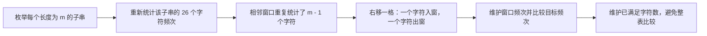

### 方案一：逐窗口重新统计频次（暴力起点）

#### 思路

枚举 `s` 中每一个长度为 `m` 的子串，对每个子串新建频次数组并与 `p` 的频次数组比较。

```cpp
class Solution {
public:
    vector<int> findAnagrams(string s, string p) {
        // 保存所有异位词窗口的起始下标。
        vector<int> result;
        // 缓存目标字符串长度，固定窗口长度等于它。
        const int pattern_size = static_cast<int>(p.size());
        // 目标比文本长时，不存在任何合法窗口。
        if (pattern_size > static_cast<int>(s.size())) {
            return result;
        }

        // 统计 p 的字符频次，作为每个候选窗口的比较目标。
        array<int, 26> target_count{};
        for (const char ch : p) {
            // 题目保证为小写字母，可映射到 [0, 25]。
            ++target_count[ch - 'a'];
        }

        for (int start = 0;
             start + pattern_size <= static_cast<int>(s.size());
             ++start) {
            // 为当前窗口重新统计频次。
            array<int, 26> window_count{};
            for (int offset = 0; offset < pattern_size; ++offset) {
                // 将 s[start..start + pattern_size) 的字符计入窗口。
                ++window_count[s[start + offset] - 'a'];
            }
            // 两张频次表相同，说明当前固定长度窗口是一个异位词。
            if (window_count == target_count) {
                result.push_back(start);
            }
        }

        // 返回所有命中的窗口起点。
        return result;
    }
};
```

#### 复杂度与取舍

| 时间复杂度 | 辅助空间 | 优点 | 代价 |
| --- | --- | --- | --- |
| `O((n - m + 1) × m)` | `O(1)` | 直接对应异位词定义 | 每个相邻窗口重复统计大量字符 |

这里 `n = s.size()`、`m = p.size()`。比较 26 个字符频次是常数时间，主要瓶颈是每个窗口都重新扫描 `m` 个字符。

### 方案二：滑动窗口频次表（线性时间基础版）

#### 思路

维护当前窗口的频次数组。右指针每前进一步，将新字符计入；窗口长度超过 `m` 时，将最左字符移出。窗口长度恰为 `m` 时，比较它与目标频次表。

```cpp
class Solution {
public:
    vector<int> findAnagrams(string s, string p) {
        // 保存所有异位词窗口的起始下标。
        vector<int> result;
        // 固定窗口长度由 p 决定。
        const int pattern_size = static_cast<int>(p.size());
        // 不存在长度足够的窗口时提前返回。
        if (pattern_size > static_cast<int>(s.size())) {
            return result;
        }

        // 保存 p 的目标频次。
        array<int, 26> target_count{};
        // 保存当前滑动窗口的频次。
        array<int, 26> window_count{};
        for (const char ch : p) {
            // 统计每种目标字符需要出现多少次。
            ++target_count[ch - 'a'];
        }

        for (int right = 0; right < static_cast<int>(s.size()); ++right) {
            // 将新的右端字符加入当前窗口。
            ++window_count[s[right] - 'a'];

            if (right >= pattern_size) {
                // 窗口超过目标长度时，移除即将离开左端的字符。
                --window_count[s[right - pattern_size] - 'a'];
            }

            if (right >= pattern_size - 1 && window_count == target_count) {
                // 长度恰为 pattern_size 且频次相同，记录窗口起点。
                result.push_back(right - pattern_size + 1);
            }
        }

        // 返回全部命中的固定长度窗口。
        return result;
    }
};
```

#### 不变量与正确性

处理下标 `right` 后：

- 当 `right < m - 1` 时，`window_count` 描述前缀 `s[0..right]`。
- 当 `right >= m - 1` 时，`window_count` 恰好描述固定长度窗口 `s[right - m + 1..right]`。
- 新字符入窗、`right >= m` 时旧字符出窗，因此窗口始终不会超过 `m`；频次数组等于目标频次数组当且仅当当前窗口是 `p` 的异位词。

每个字符最多入窗一次、出窗一次，避免了方案一的重复统计。

#### 边界与细节

- 出窗条件是 `right >= pattern_size`，不是 `right >= pattern_size - 1`：此时加入新字符后窗口长度才变为 `m + 1`。
- 记录答案的条件是 `right >= pattern_size - 1`：这是第一个完整长度为 `m` 的窗口结束的位置。
- `right - pattern_size` 是出窗下标，`right - pattern_size + 1` 是当前完整窗口的起点，两者相差一格，不能混用。

#### 复杂度与取舍

| 时间复杂度 | 辅助空间 | 优点 | 代价 |
| --- | --- | --- | --- |
| `O(n)` | `O(1)` | 滑动逻辑直观，频次表直接可见 | 每个完整窗口仍要比较 26 个槽位 |

26 是常数，所以该版本已经满足线性复杂度；下一版优化的是常数工作量，让每轮无需比较完整数组。

### 方案三：维护已满足字符数（推荐）

#### 思路

令 `need[c] = ` p 中字符 `c` 的剩余需求量。窗口加入一个字符时：若它此前仍被需要（`need[c] > 0`），已满足字符数 `matched` 加一；之后将 `need[c]` 减一。窗口移出一个字符时做完全对称的恢复。

定义：

$$
matched = \sum_c \min(window\_count[c], target\_count[c])
$$

窗口长度恰为 `m` 时，`matched == m` 当且仅当窗口与 `p` 的全部字符频次相同。

```cpp
class Solution {
public:
    vector<int> findAnagrams(string s, string p) {
        // 保存全部异位词窗口的起始下标。
        vector<int> result;
        // 固定窗口长度等于 p 的长度。
        const int pattern_size = static_cast<int>(p.size());
        // 文本不足以容纳一个完整窗口时直接返回空答案。
        if (pattern_size > static_cast<int>(s.size())) {
            return result;
        }

        // need[c] 表示当前窗口距离满足 p 中字符 c 还差多少次。
        array<int, 26> need{};
        for (const char ch : p) {
            // 初始化每种字符的目标需求量。
            ++need[ch - 'a'];
        }

        // left 指向当前固定长度窗口的左端。
        int left = 0;
        // matched 统计窗口中按需求有效匹配到的字符总数。
        int matched = 0;

        for (int right = 0; right < static_cast<int>(s.size()); ++right) {
            // 计算即将进入窗口的字符编号。
            const int incoming = s[right] - 'a';
            // 进入前仍有需求，说明该字符会新增一个有效匹配。
            if (need[incoming] > 0) {
                ++matched;
            }
            // 无论是否超额，窗口都多了该字符，剩余需求减一。
            --need[incoming];

            if (right - left + 1 > pattern_size) {
                // 计算即将离开窗口的左端字符编号。
                const int outgoing = s[left] - 'a';
                // 离开前 need 非负，说明移走的是一个有效匹配字符。
                if (need[outgoing] >= 0) {
                    --matched;
                }
                // 恢复该字符的一个需求名额，保持 need 与窗口一致。
                ++need[outgoing];
                // 窗口左端右移，使窗口恢复固定长度。
                ++left;
            }

            if (right - left + 1 == pattern_size && matched == pattern_size) {
                // 长度和有效匹配数同时等于 pattern_size，当前窗口必为异位词。
                result.push_back(left);
            }
        }

        // 返回所有满足频次条件的窗口起点。
        return result;
    }
};
```

#### 不变量与正确性

在处理完 `right` 且完成必要出窗后：

- 窗口是闭区间 `[left, right]`，长度不超过 `m`。
- 对每个字符 `c`，`need[c] = target_count[c] - window_count[c]`。
- `matched` 等于窗口中不超过目标需求的有效字符总数，即 $
  \sum_c \min(window\_count[c], target\_count[c])$。

窗口长度达到 `m` 时，`matched == m` 说明窗口内每个位置都贡献了一个目标所需字符；由于窗口总长度也是 `m`，不存在多余字符，所有频次必与目标完全相同。反过来，异位词窗口的每个字符都能有效匹配，所以 `matched` 必为 `m`。

#### 示例推演

对 `s = "cbaebabacd"`、`p = "abc"`，窗口长度为 `3`：

| 窗口 | 起点 | `matched` | 是否记录 |
| --- | --- | --- | --- |
| `"cba"` | `0` | `3` | 是，记录 `0` |
| `"bae"` | `1` | `2` | 否 |
| `"aeb"` | `2` | `2` | 否 |
| `"bac"` | `6` | `3` | 是，记录 `6` |

中间窗口都至少缺少一个 `a`、`b` 或 `c` 的有效匹配，故不会被记录。

#### 边界与细节

- `need[incoming] > 0` 必须在 `--need[incoming]` **之前**判断；否则最后一个刚好需要的字符会被漏计。
- `need[outgoing] >= 0` 必须在 `++need[outgoing]` **之前**判断；若它原本是超额字符（负数），移走它不应减少 `matched`。
- 入窗后先检查窗口是否超长并出窗，再判断答案，保证记录的始终是长度恰为 `m` 的子串。
- `p.length() > s.length()` 的提前返回避免出现不完整窗口，也让后续下标计算更简单。

#### 复杂度与取舍

| 时间复杂度 | 辅助空间 | 为什么推荐 | 代价 |
| --- | --- | --- | --- |
| `O(n)` | `O(1)`，固定 26 个槽位 | 每次右移只更新入窗与出窗字符，不再比较整张表 | `need` 和 `matched` 的更新顺序更易写错 |

### 方案选择与 Trade-off

| 方案 | 时间 | 辅助空间 | 主要优势 | 主要代价 | 面试定位 |
| --- | --- | --- | --- | --- | --- |
| 逐窗口重算频次 | `O((n - m + 1) × m)` | `O(1)` | 最直接地验证异位词定义 | 相邻窗口反复统计 | 正确性起点 |
| 滑动频次数组比较 | `O(n)` | `O(1)` | 最清晰的固定窗口模板 | 每轮比较 26 项 | 推荐先写版本 |
| `need` + `matched` | `O(n)` | `O(1)` | 避免整表比较，便于推广匹配计数问题 | 进入、移出字符的判断顺序更复杂 | 推荐优化版本 |

### 面试手撕表达

> 异位词只比较字符频次，且答案子串长度固定等于 `p.size()`，所以使用固定长度滑动窗口。基础版维护窗口 26 字符频次：右移时加入一个字符，窗口超长时移出一个字符，频次数组相等就记录起点，时间 `O(n)`。进一步可以维护 `need` 和有效匹配字符数 `matched`，当窗口长度和 `matched` 都等于 `p` 的长度时就是异位词，从而避免每轮比较完整频次数组。

### 复习检查

- 为什么异位词窗口的长度必须恰好等于 `p.size()`？
- 窗口超长时，出窗下标为什么是 `right - pattern_size`？
- 记录答案的起点为什么是 `right - pattern_size + 1`？
- `need[incoming] > 0` 与 `need[outgoing] >= 0` 为什么要在更新 `need` 前判断？
- 为什么窗口长度为 `m` 且 `matched == m` 足以证明频次完全相同？


# 子串

## 1. 和为 K 的子数组

- 题目链接：[560. 和为 K 的子数组](https://leetcode.cn/problems/subarray-sum-equals-k/description/)
- 难度：中等
- 真正归类：前缀和 + 哈希表

### 题目

给你一个整数数组 `nums` 和一个整数 `k`，请你统计并返回该数组中和为 `k` 的**连续非空子数组**的个数。

**示例 1：**

```text
输入：nums = [1, 1, 1], k = 2
输出：2
```

**示例 2：**

```text
输入：nums = [1, 2, 3], k = 3
输出：2
```

**提示：**

- `1 <= nums.length <= 2 * 10^4`
- `-1000 <= nums[i] <= 1000`
- `-10^7 <= k <= 10^7`

### 读题：哪些特征指向前缀和 + 哈希表

题目要求的是“连续子数组的和”，看到这种描述，先联想到前缀和是很自然的：任意一段子数组的和，都可以由两个前缀和相减得到。

这题在 Hot100 中放在“子串”附近没有问题，但它的核心并不是双指针或滑动窗口。原因是 `nums[i]` 可以为负数：窗口右边加入一个数后，窗口和可能变小；左边移出一个数后，窗口和也可能变大。因此，窗口和不具备单调性，无法根据“当前和偏大还是偏小”可靠地决定该移动哪一个指针。

例如 `nums = [1, -1, 1]`：从左到右扩展窗口时，窗口和会从 `1` 变成 `0`，再变成 `1`。这种变化让经典的“和大了就缩左边界”失效。

| 题目特征 | 推导出的需求 | 对应做法 |
| --- | --- | --- |
| 要统计连续子数组的和 | 用两个前缀和表示任意区间和 | 前缀和 |
| 数组允许负数 | 区间和没有单调性 | 不使用滑动窗口 |
| 要统计全部子数组 | 同一个目标前缀和可能出现多次 | 哈希表记录出现次数 |
| 当前右端点确定后，要找全部左端点 | 查找历史前缀和 `prefix_sum - k` | 前缀和 + 哈希表 |

定义前缀和：

```text
prefix[t] = nums[0] + nums[1] + ... + nums[t - 1]
```

这里的 `prefix[t]` 表示下标区间 `[0, t)` 的元素和，特别地，`prefix[0] = 0`。

若子数组为 `[left, right]`，则：

```text
nums[left] + ... + nums[right]
= prefix[right + 1] - prefix[left]
```

要让它等于 `k`，只需满足：

```text
prefix[left] = prefix[right + 1] - k
```

因此，当我们计算出当前前缀和 `prefix[right + 1]` 后，只要知道此前有多少个前缀和等于 `prefix[right + 1] - k`，就知道有多少个以 `right` 为右端点的合法子数组。

### 从逐个子数组枚举到前缀和计数

### 方案一：枚举左右端点并累加区间和（暴力起点）

#### 思路

枚举每个左端点 `left`，再不断右扩 `right`，顺手维护区间 `[left, right]` 的和。

```cpp
class Solution {
public:
    int subarraySum(vector<int>& nums, int k) {
        // 记录所有和为 k 的非空子数组数量。
        int count = 0;

        // 枚举子数组的左端点。
        for (int left = 0; left < static_cast<int>(nums.size()); ++left) {
            // 开始新的左端点时，当前区间还没有元素。
            int current_sum = 0;

            // 枚举子数组的右端点，并把 nums[right] 纳入当前区间。
            for (int right = left; right < static_cast<int>(nums.size()); ++right) {
                // 维护闭区间 [left, right] 的元素和。
                current_sum += nums[right];

                // 当前区间和恰好为 k，就找到一个答案。
                if (current_sum == k) {
                    ++count;
                }
            }
        }

        // 返回全部合法子数组的数量。
        return count;
    }
};
```

#### 正确性与复杂度

对于固定的 `left`，内层循环依次考察 `[left, left]`、`[left, left + 1]`，直到 `[left, n - 1]`。外层再枚举全部左端点，因此每个非空子数组恰好被检查一次。

- 时间复杂度：`O(n²)`，共有约 `n(n + 1) / 2` 个子数组。
- 空间复杂度：`O(1)`。

这个版本是很好的手撕起点：逻辑直观、容易证明；但 `n = 2 * 10^4` 时，二次枚举会达到约两亿次检查，通常不够高效。

### 方案二：前缀和数组 + 枚举边界

#### 思路

版本一会反复累加相同元素。可以预处理前缀和，使任意区间和在 `O(1)` 时间得到。

```cpp
class Solution {
public:
    int subarraySum(vector<int>& nums, int k) {
        // prefix_sum[i] 表示前 i 个元素，也就是区间 [0, i) 的元素和。
        vector<int> prefix_sum(nums.size() + 1, 0);

        // 依次构造每一个前缀和。
        for (int i = 0; i < static_cast<int>(nums.size()); ++i) {
            // 在上一个前缀和基础上加入 nums[i]。
            prefix_sum[i + 1] = prefix_sum[i] + nums[i];
        }

        // 记录和为 k 的非空子数组数量。
        int count = 0;

        // 枚举子数组的左边界；它对应前缀边界 left。
        for (int left = 0; left < static_cast<int>(nums.size()); ++left) {
            // 枚举右侧前缀边界 right，区间实际为 [left, right)。
            for (int right = left + 1; right <= static_cast<int>(nums.size()); ++right) {
                // 用两个前缀和相减，得到区间 [left, right) 的元素和。
                if (prefix_sum[right] - prefix_sum[left] == k) {
                    ++count;
                }
            }
        }

        // 返回全部合法子数组的数量。
        return count;
    }
};
```

#### 复杂度与取舍

它将“求某个固定区间的和”从逐个累加优化为一次减法，但仍要枚举全部区间，所以总时间复杂度依然是 `O(n²)`。它的价值在于揭示了关键等式：寻找和为 `k` 的子数组，本质上是在寻找一对前缀和，其差为 `k`。

- 时间复杂度：`O(n²)`。
- 空间复杂度：`O(n)`。

### 方案三：前缀和 + 哈希表计数（推荐）

#### 思路

既然当前前缀和为 `prefix` 时，只关心此前出现过多少次 `prefix - k`，就不必枚举每一个左边界。用哈希表维护“前缀和出现次数”即可。

```cpp
class Solution {
public:
    int subarraySum(vector<int>& nums, int k) {
        // 记录每个已出现前缀和的次数，而不是只记录是否出现过。
        unordered_map<long long, int> prefix_count;

        // 最多会存储 nums.size() + 1 个不同的前缀和，提前预留空间以减少扩容。
        prefix_count.reserve(nums.size() + 1);

        // 空前缀的和为 0，出现一次，用于统计从下标 0 开始的子数组。
        prefix_count[0] = 1;

        // 维护当前已经处理元素的前缀和。
        long long prefix_sum = 0;

        // 使用 long long 保存答案，使写法对更大规模的同类题也安全。
        long long count = 0;

        // 依次把每个元素作为当前子数组可能的右端点。
        for (const int num : nums) {
            // 得到当前前缀和，也就是当前右端点之后的前缀边界。
            prefix_sum += num;

            // 查找能与当前前缀和相差 k 的历史前缀和。
            const auto it = prefix_count.find(prefix_sum - k);

            // 每一个匹配的历史前缀边界都对应一个不同的合法子数组。
            if (it != prefix_count.end()) {
                count += it->second;
            }

            // 当前前缀和从下一轮起可以作为历史前缀和使用。
            ++prefix_count[prefix_sum];
        }

        // 题目范围内答案不超过 int，按题目接口返回。
        return static_cast<int>(count);
    }
};
```

#### 示例推演

以 `nums = [1, 1, 1]`、`k = 2` 为例：

| 当前元素 | 当前前缀和 `prefix_sum` | 查找的历史前缀和 | 新增答案数 | `count` |
| --- | --- | --- | --- | --- |
| 初始化 | `0` | — | `0` | `0` |
| `1` | `1` | `-1` | `0` | `0` |
| `1` | `2` | `0` | `1` | `1` |
| `1` | `3` | `1` | `1` | `2` |

第二个 `1` 处理完后，当前前缀和为 `2`，查找 `2 - 2 = 0`。初始放入的空前缀 `0` 表示子数组 `[0, 1]`；最后一次查找前缀和 `1`，对应子数组 `[1, 2]`。

当某个前缀和出现多次时，必须累加它的出现次数。例如 `nums = [1, -1, 0]`、`k = 0` 中，前缀和 `0` 会重复出现。每一个历史的 `0` 都代表一个不同的左边界，因此不能只用 `unordered_set` 判断“是否存在”。

#### 不变量与正确性

处理 `nums[i]` 前：

```text
prefix_count[x] = 前缀和 prefix[0] 到 prefix[i] 中，值等于 x 的出现次数
```

也就是说，哈希表只保存当前右端点之前的前缀边界。处理 `nums[i]` 后，当前前缀和为 `prefix[i + 1]`：

1. 查询 `prefix[i + 1] - k` 出现了多少次；每一次出现都确定一个和为 `k` 的子数组。
2. 再把 `prefix[i + 1]` 计入哈希表，供之后的元素使用。

这个不变量直接解释了代码中“**先查后插**”的顺序。

```text
历史前缀和 prefix[left]  --相减-->  prefix[right + 1] - prefix[left] = k
                                      ↑
                                当前前缀和
```

#### 边界与细节

**空前缀必须初始化为 `prefix_count[0] = 1`。**

若前 `right + 1` 个元素的和本身就是 `k`，有：

```text
prefix[right + 1] - 0 = k
```

其中的 `0` 就是空前缀 `prefix[0]`。初始化为 `1` 表示它出现过一次；若不初始化，会漏掉所有从下标 `0` 开始的答案。

**必须先查询，再更新当前前缀和。**

当前 `prefix_sum` 对应的是右边界之后的位置。它只能成为**之后**子数组的左边界，不能立刻与自己配对。

若先执行 `++prefix_count[prefix_sum]`，再查询，当 `k = 0` 时会把当前前缀和与自己匹配，错误地统计一个长度为 `0` 的空子数组。先查后插恰好保证统计的都是非空子数组。

**哈希表保存的是次数，不是是否存在。**

不同的历史前缀边界即使前缀和值相同，仍然会形成不同的子数组。哈希表的值必须是频次，匹配时执行：

```cpp
count += it->second;
```

而不是只增加 `1`。

**前缀和边界是 `[0, n]`，区间使用半开区间。**

使用半开区间 `[left, right)` 时，区间和是：

```text
prefix[right] - prefix[left]
```

因此需要 `n + 1` 个前缀边界：`prefix[0]` 是空前缀，`prefix[n]` 是整个数组的和。版本二中 `right` 从 `left + 1` 开始，正是为了保证区间非空。

**本题用 `int` 不会溢出，但 `long long` 更容易迁移。**

按本题范围，前缀和最大绝对值为 `2 * 10^7`，答案最大为 `n(n + 1) / 2 = 200010000`，都没有超过 `int`。代码仍使用 `long long` 保存前缀和和答案，这在迁移到数据范围更大的同类题时更稳妥。

#### 复杂度与取舍

| 方案 | 时间复杂度 | 空间复杂度 | 主要优势 | 主要代价 |
| --- | --- | --- | --- | --- |
| 两层枚举 + 区间累加 | `O(n²)` | `O(1)` | 最直接，适合作为正确性起点 | 会重复累加元素，规模稍大就超时 |
| 前缀和数组 + 枚举边界 | `O(n²)` | `O(n)` | 区间求和变为 `O(1)`，清晰暴露前缀和公式 | 仍枚举全部区间，时间复杂度没有降低 |
| 前缀和 + 哈希表计数 | 平均 `O(n)` | `O(n)` | 不枚举左边界，能处理负数，是本题最优解 | 需理解空前缀、频次和“先查后插”的不变量 |

补充：`unordered_map` 的单次操作平均是 `O(1)`，在极端哈希冲突下理论最坏可能退化；面试和 LeetCode 场景中通常按平均 `O(n)` 分析。若改用 `map`，操作稳定为 `O(log n)`，总复杂度则是 `O(n log n)`。

#### 面试手撕检查清单

1. 先说明：数组允许负数，滑动窗口不能依赖单调性；选择前缀和。
2. 写出等式：`prefix[right + 1] - prefix[left] = k`，因此找 `prefix[right + 1] - k`。
3. 明确哈希表含义：键是前缀和，值是此前该前缀和出现的次数。
4. 初始化 `prefix_count[0] = 1`，处理从下标 `0` 开始的子数组。
5. 每轮固定顺序：更新当前前缀和 → 查询 `prefix_sum - k` → 记录当前前缀和。
6. 匹配时累加频次，而不是只加一次。

这套“前缀和 + 哈希表”模式还会用于统计和为目标值的连续区间、二元数组中和为目标值的子数组等问题；迁移时先判断题目是否允许负数，再决定是否可以改用滑动窗口。

## 2. 滑动窗口最大值

- 题目链接：[239. 滑动窗口最大值](https://leetcode.cn/problems/sliding-window-maximum/description/)
- 难度：困难
- 核心分类：固定长度滑动窗口、单调队列。

### 题目

给你一个整数数组 `nums`，有一个大小为 `k` 的滑动窗口从数组最左侧移动到最右侧。窗口每次向右移动一位，返回每个窗口中的最大值。

**示例 1：**

- 输入：`nums = [1, 3, -1, -3, 5, 3, 6, 7]`，`k = 3`
- 输出：`[3, 3, 5, 5, 6, 7]`
- 解释：长度为 `3` 的窗口依次为 `[1, 3, -1]`、`[3, -1, -3]`、`[-1, -3, 5]` 等，对应最大值为 `3`、`3`、`5` 等。

**示例 2：**

- 输入：`nums = [1]`，`k = 1`
- 输出：`[1]`

**提示：**

- `1 <= nums.length <= 10^5`
- `-10^4 <= nums[i] <= 10^4`
- `1 <= k <= nums.length`

### 读题：哪些特征指向单调队列

窗口长度固定为 `k`，窗口每次只右移一格。相邻两个窗口有 `k - 1` 个元素重叠，因此不应每次都重新扫描整个窗口。

| 题目特征 | 推导出的需求 | 对应做法 |
| --- | --- | --- |
| 窗口长度固定，且每次右移一格 | 相邻窗口高度重叠 | 增量维护窗口状态 |
| 每个窗口只需最大值 | 较小且更早出现的元素可能永远无用 | 删除被支配的候选元素 |
| 窗口左端元素会过期 | 必须知道候选元素的位置 | 队列存储下标而非数值 |
| 要处理 `10^5` 个元素 | 每个元素不能被反复扫描 | 单调队列，均摊 `O(1)` 维护 |

这里的“单调队列”指双端队列中候选元素的值始终单调递减。队首对应当前窗口最大值，队尾用于淘汰不可能再成为最大值的元素。

### 从逐窗口扫描到单调队列


有序容器已经能避免重新扫描窗口；单调队列进一步利用了“只求最大值”的特点，丢弃不可能成为答案的元素。

### 方案一：逐窗口扫描最大值（暴力起点）

#### 思路

枚举每个长度为 `k` 的窗口，并在窗口内扫描所有元素，记录最大值。窗口 `[left, left + k - 1]` 的起点满足 `left + k <= nums.size()`，这样右端点不会越界。

```cpp
class Solution {
public:
    vector<int> maxSlidingWindow(vector<int>& nums, int k) {
        // 保存每个完整窗口的最大值。
        vector<int> result;
        // 缓存数组长度，统一使用 int 下标进行边界计算。
        const int size = static_cast<int>(nums.size());

        // 枚举每个长度为 k 的窗口左端点。
        for (int left = 0; left + k <= size; ++left) {
            // 用窗口第一个元素初始化，避免全负数时错误地初始化为 0。
            int window_max = nums[left];

            // 扫描闭区间 [left, left + k - 1] 中其余元素。
            for (int right = left + 1; right < left + k; ++right) {
                // 持续维护当前窗口已扫描部分的最大值。
                window_max = max(window_max, nums[right]);
            }

            // 当前窗口扫描完成，记录它的最大值。
            result.push_back(window_max);
        }

        // 返回全部窗口的最大值。
        return result;
    }
};
```

#### 正确性与复杂度

每个合法窗口都恰好被枚举一次，内层循环又比较了该窗口的所有元素，所以记录的 `window_max` 就是该窗口的最大值。

| 时间复杂度 | 辅助空间 | 优点 | 代价 |
| --- | --- | --- | --- |
| `O((n - k + 1) × k)` | `O(1)` | 最直观，容易作为手撕起点 | 相邻窗口重复扫描大量元素，`k` 较大时会超时 |

### 方案二：有序容器维护当前窗口

#### 思路

使用 `multiset` 保存当前窗口的全部元素。它会自动排序：`*window.rbegin()` 是窗口最大值；窗口右移时，删除离开窗口的元素，再插入进入窗口的元素。

`multiset` 而不是 `set` 的原因是数组可以有重复值。删除时要使用 `window.find(value)` 找到一个具体迭代器，再传给 `erase`；若写成 `window.erase(value)`，会删除所有等于该值的元素。

```cpp
class Solution {
public:
    vector<int> maxSlidingWindow(vector<int>& nums, int k) {
        // 保存每个完整窗口的最大值。
        vector<int> result;
        // 保存当前窗口的全部元素，并保持从小到大的有序关系。
        multiset<int> window;
        // 缓存数组长度，便于表达窗口右移范围。
        const int size = static_cast<int>(nums.size());

        // 先构造第一个长度为 k 的完整窗口。
        for (int index = 0; index < k; ++index) {
            // 将窗口元素插入有序容器，重复值也会被保留。
            window.insert(nums[index]);
        }
        // 有序容器最后一个元素就是第一个窗口的最大值。
        result.push_back(*window.rbegin());

        // right 指向每次右移后新进入窗口的元素。
        for (int right = k; right < size; ++right) {
            // 找到刚离开窗口的元素的一个实例。
            const auto outgoing = window.find(nums[right - k]);
            // 按迭代器删除一个实例，保留其他相同元素。
            window.erase(outgoing);
            // 将新的右端元素加入当前窗口。
            window.insert(nums[right]);
            // 记录右移后窗口的最大值。
            result.push_back(*window.rbegin());
        }

        // 返回全部窗口的最大值。
        return result;
    }
};
```

#### 不变量与复杂度

每次记录答案前，`window` 恰好保存当前长度为 `k` 的窗口的所有元素。因此其最大元素就是当前窗口最大值。每次插入和删除的代价为 `O(log k)`，共发生 `O(n)` 次。

| 时间复杂度 | 辅助空间 | 优点 | 代价 |
| --- | --- | --- | --- |
| `O(n log k)` | `O(k)` | 插入、删除、取最大值的语义直接，适合维护更多顺序统计信息 | 没有利用“只需最大值”的条件，每次维护仍需对数时间 |

### 方案三：单调队列维护候选最大值（推荐）

#### 思路

不要把 `candidates` 想成“当前窗口的全部元素”，而要把它想成一张**未来仍有机会成为最大值的候选名单**。例如窗口中有 `5`、`1`、`4`：`1` 虽然不是当前最大值，但 `5` 过期后 `4` 可能成为最大值；因此不能只保存当前最大值。相反，`1` 比更晚到来的 `4` 小，且会更早过期，才是真正可以丢弃的元素。

淘汰规则是单调队列的核心。设较早出现的元素为 `a`，较晚出现的新元素为 `b`：

- 若 `a <= b`，从 `b` 进入窗口开始，只要 `a` 还没有过期，`b` 一定也还在窗口中，且 `b` 不小于 `a`。
- 又因为 `b` 的下标更大，`b` 一定比 `a` 更晚过期。
- 所以 `a` 以后既不可能超过 `b` 成为最大值，也不可能比 `b` 活得更久；`a` 已经失去成为答案的机会，可以永久删除。

这就是“从队尾删除较小元素”的依据：队尾是最新的候选，离新元素最近，先淘汰它；若新元素仍更大，就继续向前淘汰。最终保留下来的候选值从队首到队尾严格递减。

双端队列 `candidates` 存储的是**下标**，不是数值。下标既表示元素何时会过期，也让我们能用 `nums[index]` 比较候选元素的大小。

处理新元素 `nums[right]` 时依次做三件事：

1. 删除队首已经不在当前窗口内的下标。
2. 从队尾删除所有值小于等于 `nums[right]` 的下标。
3. 将 `right` 加入队尾；窗口首次完整后，队首就是答案。

```cpp
class Solution {
public:
    vector<int> maxSlidingWindow(vector<int>& nums, int k) {
        // 保存每个完整窗口的最大值。
        vector<int> result;
        // 保存仍可能成为窗口最大值的元素下标。
        deque<int> candidates;
        // 缓存数组长度，统一使用 int 下标进行边界计算。
        const int size = static_cast<int>(nums.size());

        // right 依次作为当前窗口的右端点。
        for (int right = 0; right < size; ++right) {
            // 下标不大于 right - k 的元素已落在当前窗口左侧，必须移除。
            while (!candidates.empty() && candidates.front() <= right - k) {
                candidates.pop_front();
            }

            // 新元素更靠右且不小于队尾元素，队尾元素以后不可能成为最大值。
            while (!candidates.empty() && nums[candidates.back()] <= nums[right]) {
                candidates.pop_back();
            }

            // 当前下标尚未过期，也没有被更大候选元素支配，加入队尾。
            candidates.push_back(right);

            // right 到达 k - 1 后，窗口 [right - k + 1, right] 才首次完整。
            if (right >= k - 1) {
                // 队首值最大，记录当前完整窗口的最大值。
                result.push_back(nums[candidates.front()]);
            }
        }

        // 返回全部窗口的最大值。
        return result;
    }
};
```

#### 不变量与正确性

在处理完 `right` 后，`candidates` 始终满足：

- 队列中的下标都属于当前窗口 `[right - k + 1, right]`；在窗口尚未完整时，左边界可以小于 `0`，不会影响这个条件。
- 下标从队首到队尾递增，因此最早过期的元素一定在队首。
- `nums[candidates[0]] > nums[candidates[1]] > ...`，所以队首值是所有候选值中的最大值。

从队尾删除较小元素不会遗漏答案。若 `index_a < right` 且 `nums[index_a] <= nums[right]`，新元素更大或相等，并且比 `index_a` 更晚过期；在 `right` 仍在窗口内的任何后续窗口中，`index_a` 都不可能超过 `right` 成为最大值，因此可以安全删除。

这也是队列使用 `<=` 而不是 `<` 的原因：值相等时保留更晚进入窗口的下标，它会存活得更久。

每个下标只会入队一次，也只会从队首或队尾出队一次，因此虽然有 `while` 循环，总操作数仍是 `O(n)`。

#### 示例推演

以 `nums = [1, 3, -1, -3, 5, 3, 6, 7]`、`k = 3` 为例。队列中写作“下标:值”；“淘汰动作”展示的正是上面的候选名单变化。

| `right` | 新元素 | 淘汰动作 | 队列 `candidates` | 记录的最大值 |
| --- | --- | --- | --- | --- |
| `0` | `0:1` | 直接加入 | `[0:1]` | — |
| `1` | `1:3` | `1` 不大于 `3`，淘汰 `0:1` | `[1:3]` | — |
| `2` | `2:-1` | 队尾 `3` 更大，保留并加入 `-1` | `[1:3, 2:-1]` | `3` |
| `3` | `3:-3` | 队尾 `-1` 更大，保留并加入 `-3` | `[1:3, 2:-1, 3:-3]` | `3` |
| `4` | `4:5` | `1:3` 过期；`-3`、`-1` 不大于 `5`，从队尾淘汰 | `[4:5]` | `5` |
| `5` | `5:3` | 队尾 `5` 更大，保留并加入 `3` | `[4:5, 5:3]` | `5` |
| `6` | `6:6` | `3`、`5` 都不大于 `6`，从队尾淘汰 | `[6:6]` | `6` |
| `7` | `7:7` | `6` 不大于 `7`，淘汰 `6:6` | `[7:7]` | `7` |

处理下标 `4` 的 `5` 是最关键的一步：窗口变成 `[-1, -3, 5]`。下标 `1` 的 `3` 已经离开窗口；而 `-1`、`-3` 即使暂时留着，也会在 `5` 还在窗口时始终输给 `5`，并且它们更早过期。因此此时只保留 `5`，不是丢失信息，而是提前删除不可能影响未来答案的信息。

#### 边界与细节

**队列必须存下标，不能只存数值。**

窗口左侧元素是否过期取决于位置。若只存数值，遇到重复值时无法判断离开窗口的是哪一个元素；存下标后，可通过 `candidates.front() <= right - k` 精确删除过期元素。

**过期判断是 `<= right - k`。**

当前完整窗口为 `[right - k + 1, right]`，下标 `right - k` 恰好位于窗口左边界之外，因此也必须删除。写成 `< right - k` 会让过期元素多停留一轮。

**答案在 `right >= k - 1` 后记录。**

此时窗口长度为 `right - 0 + 1 = k`，首次形成完整窗口。若提前记录，会把不足 `k` 个元素的前缀误当成合法窗口。

**最大值初始化不能写成 `0`。**

方案一中数组可能全为负数，例如 `[-5, -2]`；因此应从窗口第一个元素 `nums[left]` 开始比较。

**`k = 1` 和 `k = nums.size()` 都自然成立。**

- `k = 1` 时，每个元素刚入队就形成完整窗口，结果就是原数组。
- `k = nums.size()` 时，只会在最后一个元素处理完后记录一次全局最大值。

#### 复杂度与取舍

| 方案 | 时间复杂度 | 辅助空间 | 主要优势 | 主要代价 |
| --- | --- | --- | --- | --- |
| 逐窗口扫描 | `O((n - k + 1) × k)` | `O(1)` | 最直观，便于建立问题模型 | 相邻窗口重复扫描，窗口大时效率低 |
| `multiset` 维护窗口 | `O(n log k)` | `O(k)` | 插入、删除、取最大值清晰，容易扩展 | 维护了窗口全部元素，存在多余排序成本 |
| 单调队列 | `O(n)` | `O(k)` | 只保留最大值候选，达到本题最优复杂度 | 要准确维护过期下标和队尾单调性 |

#### 面试手撕检查清单

1. 先识别固定长度窗口，说明暴力法会重复扫描重叠部分。
2. 明确队列存的是下标，并说明它同时解决了“判断过期”和“处理重复值”。
3. 固定处理顺序：删除过期队首 → 删除被新元素支配的队尾 → 新下标入队 → 窗口完整后取队首。
4. 写出过期条件 `candidates.front() <= right - k`，并将当前窗口写为 `[right - k + 1, right]` 进行核对。
5. 队尾比较使用 `<=`，相等时保留更晚出现、存活更久的元素。

单调队列不仅能维护窗口最大值：若把递减改为递增，队首就是窗口最小值。它尤其适用于“固定窗口 + 极值查询”的题型。

## 3. 最小覆盖子串

- 题目链接：[76. 最小覆盖子串](https://leetcode.cn/problems/minimum-window-substring/description)
- 难度：困难
- 核心分类：可变长度滑动窗口、字符频次、最小化满足条件的区间。

### 题目

给定两个字符串 `s` 和 `t`，返回 `s` 中包含 `t` 的每一个字符（包括重复字符）的最短子串；若不存在这样的子串，返回空字符串 `""`。测试用例保证答案唯一。

**示例 1：**

- 输入：`s = "ADOBECODEBANC"`，`t = "ABC"`
- 输出：`"BANC"`
- 解释：`"BANC"` 包含 `A`、`B`、`C`，并且不存在更短的覆盖子串。

**示例 2：**

- 输入：`s = "a"`，`t = "a"`
- 输出：`"a"`

**示例 3：**

- 输入：`s = "a"`，`t = "aa"`
- 输出：`""`
- 解释：目标字符串需要两个 `a`，但 `s` 中没有足够的字符。

**提示：**

- `1 <= s.length, t.length <= 10^5`
- `s` 和 `t` 由英文字母组成。

### 读题：哪些特征指向可变长度滑动窗口

本题不是固定长度窗口：答案长度未知，但必须满足“覆盖 `t`”这个条件，并且在满足条件的所有窗口中求最短。因此窗口有两种不同状态：**不合法时扩张，合法时收缩**。

| 题目特征 | 推导出的需求 | 对应做法 |
| --- | --- | --- |
| 子串必须包含 `t` 的所有字符 | 需要比较每种字符的数量 | 字符频次数组 |
| 重复字符也必须覆盖 | 不能只记录字符是否出现 | 统计每个字符的缺口 |
| 窗口长度未知 | 不能使用固定长度窗口 | 双指针维护可变窗口 |
| 要求最短合法子串 | 合法后继续移动左指针 | 贪心收缩窗口 |
| `m, n` 均可达 `10^5` | 不能枚举全部子串 | 每个指针最多走一遍 |

可以先记住这句话：**右指针负责把窗口扩张到合法，左指针负责把合法窗口压缩到最短。**

### 从独立枚举到双指针复用窗口

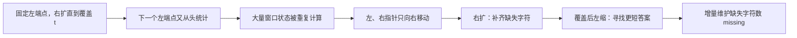

滑动窗口的关键不是同时移动两个指针，而是根据窗口是否覆盖 `t` 选择移动方向：`missing > 0` 时必须右扩，`missing == 0` 时应尝试左缩。

### 方案一：枚举左端点并向右扩张

#### 思路

固定每个左端点 `left`，从它开始不断向右扩张，并维护当前窗口还缺多少目标字符。对于固定的 `left`，第一次覆盖 `t` 的窗口已经是该左端点下的最短答案，记录后即可停止右扩，换下一个左端点重新开始。

```cpp
class Solution {
public:
    string minWindow(string s, string t) {
        // 缓存源字符串长度，后续统一使用 int 下标。
        const int source_size = static_cast<int>(s.size());
        // 缓存目标字符串长度，它也是初始缺失字符总数。
        const int target_size = static_cast<int>(t.size());
        // 目标比源字符串长时，不可能存在覆盖子串。
        if (target_size > source_size) {
            return "";
        }

        // 题目只含英文字母，使用 ASCII 范围统计字符频次。
        constexpr int kCharRange = 128;
        // target_count[c] 表示 t 中字符 c 需要出现的次数。
        array<int, kCharRange> target_count{};
        for (const char ch : t) {
            // 将字符转为非负下标后累计目标需求。
            ++target_count[static_cast<unsigned char>(ch)];
        }

        // best_start 保存当前最优窗口起点。
        int best_start = 0;
        // 用不可能超过的长度作为“尚未找到答案”的标记。
        int best_length = source_size + 1;

        // 依次枚举每一个可能的窗口左端点。
        for (int left = 0; left < source_size; ++left) {
            // 每换一个左端点，都重新复制完整的目标字符需求。
            array<int, kCharRange> need = target_count;
            // missing 记录当前窗口距离覆盖 t 还缺多少个字符实例。
            int missing = target_size;

            // 从当前左端点向右扩张窗口。
            for (int right = left; right < source_size; ++right) {
                // 获取即将进入窗口的字符编号。
                const unsigned char incoming = static_cast<unsigned char>(s[right]);
                // 进入前仍有该字符需求时，当前字符补上一个真实缺口。
                if (need[incoming] > 0) {
                    --missing;
                }
                // 无论是否超额，窗口都多了该字符，剩余需求减一。
                --need[incoming];

                // 首次覆盖 t 时，当前窗口已是固定 left 下的最短窗口。
                if (missing == 0) {
                    // 计算当前闭区间 [left, right] 的长度。
                    const int window_length = right - left + 1;
                    // 仅在更短时更新全局最优答案。
                    if (window_length < best_length) {
                        best_start = left;
                        best_length = window_length;
                    }
                    // 更大的 right 只会让固定 left 的窗口更长，直接处理下一个 left。
                    break;
                }
            }
        }

        // 没有更新过答案时返回空串，否则截取最优窗口。
        return best_length == source_size + 1 ? "" : s.substr(best_start, best_length);
    }
};
```

#### 正确性与复杂度

任何最优窗口都有唯一左端点。枚举到这个左端点时，右指针第一次让窗口合法的位置一定不晚于最优窗口的右端点；又因为最优窗口本身合法，两者只能相同，因此方案会检查到全局最优答案。

| 时间复杂度 | 辅助空间 | 优点 | 代价 |
| --- | --- | --- | --- |
| `O(m² + n)` | `O(1)` | 已经明确“缺失字符”和“第一次覆盖”的含义 | 每个左端点都重新向右扫描，重叠窗口无法复用 |

频次数组大小固定为 `128`，视为常数空间；这里的主要瓶颈是双层扫描。

### 方案二：滑动窗口 + 整表校验

#### 思路

不再为每个 `left` 重头扫描。维护一个连续窗口 `[left, right]`：右指针加入字符后，只要窗口仍覆盖 `t`，就不断左缩，并在每次左缩前更新答案。

这个版本直接维护 `window_count`，再扫描整个频次数组判断 `window_count[c] >= target_count[c]` 是否对每个字符都成立。它非常直观，但每次判断都要比较整张表。

```cpp
class Solution {
private:
    // 判断当前窗口是否覆盖目标字符串中的全部字符需求。
    bool covers(const array<int, 128>& window_count,
                const array<int, 128>& target_count) {
        // 逐个检查每种字符是否都达到目标数量。
        for (int code = 0; code < 128; ++code) {
            // 任一字符数量不足，当前窗口就不合法。
            if (window_count[code] < target_count[code]) {
                return false;
            }
        }
        // 所有字符需求都被满足，当前窗口合法。
        return true;
    }

public:
    string minWindow(string s, string t) {
        // 缓存源字符串长度，后续统一使用 int 下标。
        const int source_size = static_cast<int>(s.size());
        // 目标比源字符串长时，不可能存在覆盖子串。
        if (t.size() > s.size()) {
            return "";
        }

        // 分别保存目标字符串和当前窗口的字符频次。
        array<int, 128> target_count{};
        array<int, 128> window_count{};
        for (const char ch : t) {
            // 统计目标字符串对每种字符的需求量。
            ++target_count[static_cast<unsigned char>(ch)];
        }

        // left 指向当前窗口左端点，并且只会向右移动。
        int left = 0;
        // best_start 保存当前最优窗口起点。
        int best_start = 0;
        // 用超出源字符串的长度标记尚未找到答案。
        int best_length = source_size + 1;

        // right 依次将字符纳入当前窗口。
        for (int right = 0; right < source_size; ++right) {
            // 获取进入窗口的字符编号。
            const unsigned char incoming = static_cast<unsigned char>(s[right]);
            // 增加当前窗口中该字符的出现次数。
            ++window_count[incoming];

            // 窗口合法时持续删除左端冗余字符，直到再次不合法。
            while (covers(window_count, target_count)) {
                // 计算当前合法窗口的长度。
                const int window_length = right - left + 1;
                // 当前窗口更短时更新最优答案。
                if (window_length < best_length) {
                    best_start = left;
                    best_length = window_length;
                }

                // 获取即将移出窗口的左端字符编号。
                const unsigned char outgoing = static_cast<unsigned char>(s[left]);
                // 从窗口频次中移除该字符。
                --window_count[outgoing];
                // 左端右移，尝试得到更短的合法窗口。
                ++left;
            }
        }

        // 没有合法窗口时返回空串，否则返回记录的最优窗口。
        return best_length == source_size + 1 ? "" : s.substr(best_start, best_length);
    }
};
```

#### 不变量与复杂度

处理完 `right` 后，`window_count` 恰好描述闭区间 `[left, right]` 的字符频次。`covers` 为真时窗口合法，因此每次删除左端字符前记录答案；循环结束时窗口重新变为不合法，等待右指针补齐缺口。

| 时间复杂度 | 辅助空间 | 优点 | 代价 |
| --- | --- | --- | --- |
| `O((m + n) × Σ)` | `O(Σ)` | 合法窗口“不断左缩”的逻辑直接可见 | 每次判断合法性都扫描完整频次数组 |

`Σ` 是字符集大小；本实现中 `Σ = 128`，所以渐进复杂度仍可视为线性，但下一版会把这次整表扫描也消除，使状态含义更适合迁移到更大的字符集或键集合。

### 方案三：`missing` 增量维护缺口（推荐）

#### 思路

令 `need[c]` 表示当前窗口相对目标字符串对字符 `c` 的剩余需求：

$$
need[c] = target\_count[c] - window\_count[c]
$$

- `need[c] > 0`：窗口还缺 `need[c]` 个 `c`。
- `need[c] = 0`：窗口中 `c` 的数量刚好满足需求。
- `need[c] < 0`：窗口中 `c` 是多余的。

再用一个整数 `missing` 保存所有正缺口的总和：

$$
missing = \sum_c \max(need[c], 0)
$$

初始时 `missing = t.size()`。窗口每加入一个字符，若它进入前 `need[c] > 0`，才真正补上一个缺口，`missing` 减一；窗口每移出一个字符，若恢复需求后 `need[c] > 0`，才真正制造一个缺口，`missing` 加一。

于是 `missing == 0` 当且仅当窗口覆盖了 `t` 的所有字符，重复字符也被自然计入。

```cpp
class Solution {
public:
    string minWindow(string s, string t) {
        // 缓存源字符串长度，后续统一使用 int 下标。
        const int source_size = static_cast<int>(s.size());
        // 缓存目标字符串长度，它也是初始缺失字符总数。
        const int target_size = static_cast<int>(t.size());
        // 目标比源字符串长时，不可能存在覆盖子串。
        if (target_size > source_size) {
            return "";
        }

        // 题目只含英文字母，使用 ASCII 范围统计字符需求。
        constexpr int kCharRange = 128;
        // need[c] 表示当前窗口距离满足字符 c 的需求还差多少次。
        array<int, kCharRange> need{};
        for (const char ch : t) {
            // 初始化目标字符串中每种字符需要出现的次数。
            ++need[static_cast<unsigned char>(ch)];
        }

        // left 指向当前可变长度窗口的左端点。
        int left = 0;
        // missing 统计当前窗口尚未补齐的字符实例总数，包含重复需求。
        int missing = target_size;
        // best_start 保存当前最短合法窗口的起点。
        int best_start = 0;
        // 用超出源字符串的长度标记尚未找到合法窗口。
        int best_length = source_size + 1;

        // right 依次将字符加入窗口，负责把不合法窗口扩张到合法。
        for (int right = 0; right < source_size; ++right) {
            // 获取即将进入窗口的字符编号。
            const unsigned char incoming = static_cast<unsigned char>(s[right]);
            // 进入前仍有需求时，该字符恰好补上一个缺口。
            if (need[incoming] > 0) {
                --missing;
            }
            // 无论是否超额，窗口都增加了该字符，剩余需求减一。
            --need[incoming];

            // 窗口覆盖 t 后，left 持续右移以删除前缀冗余字符。
            while (missing == 0) {
                // 当前窗口合法，计算闭区间 [left, right] 的长度。
                const int window_length = right - left + 1;
                // 仅在找到更短窗口时更新答案。
                if (window_length < best_length) {
                    best_start = left;
                    best_length = window_length;
                }

                // 获取即将从窗口左端移出的字符编号。
                const unsigned char outgoing = static_cast<unsigned char>(s[left]);
                // 恢复该字符的一个需求名额，反映它将不再位于窗口中。
                ++need[outgoing];
                // 恢复后出现正缺口，说明移走的是不可冗余的目标字符。
                if (need[outgoing] > 0) {
                    ++missing;
                }
                // 左端右移；若窗口仍合法，下一轮会继续尝试收缩。
                ++left;
            }
        }

        // 不存在合法窗口时返回空串，否则截取记录的最优答案。
        return best_length == source_size + 1 ? "" : s.substr(best_start, best_length);
    }
};
```

#### 为什么“合法后不断收缩”不会漏掉答案？

固定右端点 `right` 后，窗口越向左扩展只会越长。第一次得到合法窗口后，移动 `left` 会让窗口变短：

- 移出的是多余字符时，窗口仍合法，当前窗口比刚才更短，必须继续尝试。
- 第一次移出不可冗余字符时，`missing` 变为正数，窗口失效；此时刚才记录的窗口就是**以当前 `right` 为右端点的最短合法窗口**。

因此每个右端点只需把左端点尽可能右移。全局最短窗口必然是某个右端点对应的最短合法窗口，算法不会遗漏它。

#### 示例推演

以 `s = "ADOBECODEBANC"`、`t = "ABC"` 为例，初始 `missing = 3`。只列出窗口状态发生关键变化的位置：

| `right` | 进入字符 | 发生的关键动作 | 收缩后的状态 | 当前最优答案 |
| --- | --- | --- | --- | --- |
| `0` | `A` | 补齐一个需求，`missing = 2` | 窗口仍不合法 | — |
| `3` | `B` | 补齐一个需求，`missing = 1` | 窗口仍不合法 | — |
| `5` | `C` | 首次覆盖 `ABC`，`missing = 0` | 记录 `"ADOBEC"`；移出 `A` 后失效 | `"ADOBEC"` |
| `10` | `A` | 再次覆盖；连续移出 `D`、`O`、冗余 `B`、`E` | 移出 `C` 后失效，最短到 `"CODEBA"` | `"ADOBEC"`（与 `"CODEBA"` 同长） |
| `12` | `C` | 再次覆盖；继续收缩前缀冗余字符 | 依次得到 `"ODEBANC"`、`"DEBANC"`、`"EBANC"`、`"BANC"` | `"BANC"` |

这里 `"ADOBEC"` 和 `"CODEBA"` 长度同为 `6`；代码只在严格更短时更新，最终仍会找到长度为 `4` 的唯一答案 `"BANC"`。

#### 不变量与边界

处理完新字符、且结束本轮收缩后：

- `need[c] = target_count[c] - window_count[c]`，负数表示该字符在窗口中多余。
- `missing` 等于窗口缺少的字符实例总数；所以 `missing == 0` 等价于窗口覆盖 `t`。
- 循环退出时 `missing > 0`，当前窗口刚刚失效；下一轮只能依赖右指针加入字符重新补齐。

**判断补齐缺口要在 `--need[incoming]` 之前。**

若当前仍需要 `A`，即 `need['A'] > 0`，新 `A` 才使 `missing` 减一；若 `need['A'] <= 0`，说明窗口中已有足够的 `A`，新字符只是冗余，不能再减少 `missing`。

**判断制造缺口要在 `++need[outgoing]` 之后。**

移出字符前，`need[c] < 0` 表示它是冗余的；加一后仍不大于 `0`，窗口依然合法。只有加一后变为正数，才表示窗口真正少了一个目标字符。

**必须在移出左端字符前更新答案。**

此时 `[left, right]` 仍是合法窗口；先移出再记录，可能把已经失效的窗口当成答案，或遗漏刚好最短的窗口。

**目标重复字符由 `missing` 自动处理。**

例如 `t = "AABC"` 时，初始 `missing = 4`。第一个 `A` 只能把 `missing` 从 `4` 减到 `3`，第二个 `A` 才继续减到 `2`；仅有一个 `A` 的窗口不会被误判为合法。

#### 复杂度与取舍

| 方案 | 时间复杂度 | 辅助空间 | 主要优势 | 主要代价 |
| --- | --- | --- | --- | --- |
| 枚举左端点并右扩 | `O(m² + n)` | `O(1)` | 容易理解固定左端点下“第一次覆盖即最短” | 每个左端点重复扫描后缀 |
| 滑动窗口 + 整表校验 | `O((m + n) × Σ)` | `O(Σ)` | 双指针的扩张、收缩过程直观 | 每次检查合法性都遍历完整字符表 |
| 滑动窗口 + `missing` | `O(m + n)` | `O(Σ)` | 每次移动只更新一个字符状态，适合大规模与迁移 | 需准确把握 `need` 正负值和更新顺序 |

#### 面试手撕检查清单

1. 先区分：这是**可变长度**窗口，不是固定长度窗口；不合法右扩，合法左缩。
2. 频次必须处理重复字符，不能只用集合记录“是否出现”。
3. 定义 `need[c] = target_count[c] - window_count[c]`，并让 `missing` 统计总缺口。
4. 右扩顺序：若 `need[incoming] > 0`，先减少 `missing`，再减少 `need[incoming]`。
5. 收缩顺序：先更新答案，再增加 `need[outgoing]`；若增加后大于 `0`，再增加 `missing`。
6. `while (missing == 0)` 不能写成 `if`，因为窗口可能连续移出多个冗余字符。

这类“**最短且满足条件的连续子串**”问题，通常都可以从“扩张到合法，再收缩到最短”这个模式开始建模；只需根据题意替换窗口合法性的维护状态。

# 普通数组

## 1. 最大子数组和

- 题目链接：[53. 最大子数组和](https://leetcode.cn/problems/maximum-subarray/description)
- 难度：中等
- 核心分类：动态规划、前缀和、分治、连续区间最值。

### 题目

给你一个整数数组 `nums`，找出一个和最大的**连续非空子数组**，并返回这个最大和。

**示例 1：**

- 输入：`nums = [-2, 1, -3, 4, -1, 2, 1, -5, 4]`
- 输出：`6`
- 解释：连续子数组 `[4, -1, 2, 1]` 的和为 `6`，是最大值。

**示例 2：**

- 输入：`nums = [1]`
- 输出：`1`

**示例 3：**

- 输入：`nums = [5, 4, -1, 7, 8]`
- 输出：`23`

**提示：**

- `1 <= nums.length <= 10^5`
- `-10^4 <= nums[i] <= 10^4`

### 读题：哪些特征指向“丢弃负贡献历史”

题目要求连续子数组，意味着答案由一个区间 `[left, right]` 决定，不能跳过中间的负数。关键问题是：处理到 `nums[i]` 时，之前的连续和要不要保留？

若此前累计和为负数，那么把它接在任何后续元素前只会拉低总和；此时应该从 `nums[i]` 重新开始。若此前累计和为非负数，保留它不会让新子数组变差，可以继续扩展。

| 题目特征 | 推导出的需求 | 对应做法 |
| --- | --- | --- |
| 要求连续子数组 | 答案由左右边界确定 | 枚举区间、前缀和或区间 DP |
| 数组包含正负数 | 需判断历史和是否有益 | 丢弃负贡献前缀 |
| 要求最大和 | 每个位置都要知道最优的“结尾状态” | 动态规划 / Kadane 算法 |
| 数组长度可达 `10^5` | 不能枚举全部区间 | 线性扫描 |
| 进阶提示分治 | 最大区间相对中点有三种位置 | 分治合并跨中点答案 |

本题的多个线性解法本质相通：**前缀和方法减去最小历史前缀，DP 方法丢掉负的历史子数组和。**

### 从区间枚举到“历史只保留有用部分”

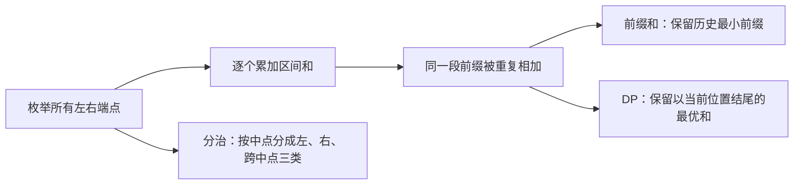

暴力法从所有区间出发；前缀和和 DP 从不同角度将其压缩为一次扫描；分治法虽然不是最优复杂度，但能训练“区间答案如何合并”的思考方式。

### 方案一：枚举左右端点并增量累加（暴力起点）

#### 思路

枚举每个左端点 `left`，向右扩展 `right`，并维护区间 `[left, right]` 的元素和。与每次重新求和相比，内层循环直接在上一个区间和上加 `nums[right]`，避免了第三层扫描。

```cpp
class Solution {
public:
    int maxSubArray(vector<int>& nums) {
        // 用第一个元素初始化答案，保证全负数组也能返回非空子数组和。
        int best_sum = nums[0];

        // 枚举每个子数组的左端点。
        for (int left = 0; left < static_cast<int>(nums.size()); ++left) {
            // 新左端点开始时，当前区间尚未包含元素。
            int current_sum = 0;

            // 向右扩展子数组的右端点。
            for (int right = left; right < static_cast<int>(nums.size()); ++right) {
                // 维护闭区间 [left, right] 的元素和。
                current_sum += nums[right];
                // 当前区间和更大时更新全局答案。
                best_sum = max(best_sum, current_sum);
            }
        }

        // 返回所有非空子数组中的最大和。
        return best_sum;
    }
};
```

#### 正确性与复杂度

外层枚举每一个 `left`，内层枚举从该位置开始的所有 `right`，因此每个非空子数组恰好被检查一次。`current_sum` 始终等于当前 `[left, right]` 的和，所以 `best_sum` 的最大值就是答案。

| 时间复杂度 | 辅助空间 | 优点 | 代价 |
| --- | --- | --- | --- |
| `O(n²)` | `O(1)` | 最直观，直接对应子数组定义 | 大量重叠区间仍被逐个检查，`n = 10^5` 时不可用 |

### 方案二：前缀和 + 历史最小前缀

#### 思路

定义 `prefix[i]` 为前 `i` 个元素的和，即区间 `[0, i)` 的元素和。对于以 `right` 结尾的子数组 `[left, right]`：

$$
sum(left, right) = prefix[right + 1] - prefix[left]
$$

当前 `right` 固定时，`prefix[right + 1]` 已经确定。要让区间和最大，只需在此前所有 `prefix[left]` 中减去最小值。因此扫描数组时维护历史最小前缀和即可，不需要实际保存完整前缀和数组。

```cpp
class Solution {
public:
    int maxSubArray(vector<int>& nums) {
        // prefix_sum 表示已处理元素的前缀和。
        int prefix_sum = 0;
        // 空前缀的和为 0，是第一个元素之前可选的历史前缀。
        int min_prefix_sum = 0;
        // 用第一个元素初始化答案，避免全负数组被空区间的 0 干扰。
        int best_sum = nums[0];

        // 依次把每个元素作为候选子数组的右端点。
        for (const int num : nums) {
            // 得到当前右端点之后的前缀和。
            prefix_sum += num;
            // 减去此前最小前缀和，得到以当前元素结尾的最大子数组和。
            best_sum = max(best_sum, prefix_sum - min_prefix_sum);
            // 当前前缀从下一轮起才能作为历史左边界使用。
            min_prefix_sum = min(min_prefix_sum, prefix_sum);
        }

        // 返回扫描过程中的最大区间和。
        return best_sum;
    }
};
```

#### 不变量与边界

处理当前元素前，`min_prefix_sum` 是此前所有前缀和中的最小值；处理当前元素后，`prefix_sum` 是当前前缀和。

**先用 `min_prefix_sum` 更新答案，再更新最小前缀。**

这样减去的一定是当前右端点之前的前缀，得到的区间至少包含当前元素。若先把当前 `prefix_sum` 放进最小值，当数组全为负数时可能用当前前缀减自己得到 `0`，错误地把空子数组当成答案。

**初始最小前缀和为 `0`。**

它对应空前缀 `prefix[0]`，用于统计从下标 `0` 开始的子数组。例如第一个元素本身是答案时，计算的是 `prefix[1] - prefix[0]`。

#### 复杂度与取舍

| 时间复杂度 | 辅助空间 | 优点 | 代价 |
| --- | --- | --- | --- |
| `O(n)` | `O(1)` | 直接由区间和公式推导，能迁移到许多前缀和问题 | “为何维护最小前缀”不如 DP 的续接/重开直观 |

### 方案三：动态规划 / Kadane 算法（推荐）

#### 思路

定义 `dp[i]`：**必须以 `nums[i]` 结尾**的非空子数组最大和。

以 `nums[i]` 结尾的子数组只有两种选择：

1. 从 `nums[i]` 重新开始，和为 `nums[i]`。
2. 接在以 `nums[i - 1]` 结尾的最优子数组后，和为 `dp[i - 1] + nums[i]`。

因此状态转移为：

$$
dp[i] = \max(nums[i], dp[i - 1] + nums[i])
$$

最终答案是所有 `dp[i]` 的最大值。由于转移只依赖 `dp[i - 1]`，代码用 `best_ending_here` 代替完整 `dp` 数组，将空间压缩为 `O(1)`。

```cpp
class Solution {
public:
    int maxSubArray(vector<int>& nums) {
        // best_ending_here 表示必须以 nums[0] 结尾的最佳非空子数组和。
        int best_ending_here = nums[0];
        // best_sum 保存所有已处理位置中的最大子数组和。
        int best_sum = nums[0];

        // 从第二个元素开始依次计算以当前位置结尾的最优状态。
        for (int index = 1; index < static_cast<int>(nums.size()); ++index) {
            // 要么从 nums[index] 重开，要么接在此前的最优结尾后。
            best_ending_here = max(nums[index], best_ending_here + nums[index]);
            // 将当前位置结尾的最优状态纳入全局答案。
            best_sum = max(best_sum, best_ending_here);
        }

        // 返回所有结尾状态中的最大值。
        return best_sum;
    }
};
```

#### 示例推演

以 `nums = [-2, 1, -3, 4, -1, 2, 1, -5, 4]` 为例：

| 下标 | `nums[i]` | `best_ending_here` | `best_sum` | 当前选择 |
| --- | --- | --- | --- | --- |
| `0` | `-2` | `-2` | `-2` | 初始化 |
| `1` | `1` | `1` | `1` | 丢弃 `-2`，从 `1` 重开 |
| `2` | `-3` | `-2` | `1` | 接在 `1` 后仍优于单独 `-3` |
| `3` | `4` | `4` | `4` | 丢弃负和 `-2`，从 `4` 重开 |
| `4` | `-1` | `3` | `4` | 保留正和 `4` 并继续 |
| `5` | `2` | `5` | `5` | 继续扩展 |
| `6` | `1` | `6` | `6` | 继续扩展，得到最优答案 |
| `7` | `-5` | `1` | `6` | 虽变小但仍为正，暂时保留 |
| `8` | `4` | `5` | `6` | 扩展后未超过全局答案 |

表中的“丢弃”不是把数组元素删除，而是决定后续子数组不再连接此前的负和部分。

#### 不变量与边界

处理完下标 `i` 后：

- `best_ending_here` 恰好是所有**必须以 `i` 结尾**的非空子数组中的最大和。
- `best_sum` 恰好是区间 `[0, i]` 内所有非空子数组的最大和。

**状态必须以 `nums[0]` 初始化，不能初始化为 `0`。**

题目要求子数组非空。若数组为 `[-3, -2]`，初始化为 `0` 会错误返回 `0`；正确答案是 `-2`。

**为什么可以丢弃负的 `best_ending_here`？**

若 `best_ending_here < 0`，则 `best_ending_here + nums[i] < nums[i]`，接上历史一定不如从当前元素重开。若它等于 `0`，接上与重开结果相同；使用 `max` 不需要专门处理这个临界情况。

#### 与前缀和方法的关系

前缀和维护的是“为了让当前前缀和减得最多，应选择多小的历史前缀”；DP 维护的是“为了让当前元素结尾的区间和最大，应保留多大的历史结尾和”。

两者都在排除负贡献历史：最小前缀和越小，`prefix_sum - min_prefix_sum` 越大；DP 中负的历史和则不值得续接。面试中若从前缀和先想到本题完全可行，但 Kadane 的状态通常更短、更贴近题意。

#### 复杂度与取舍

| 时间复杂度 | 辅助空间 | 优点 | 代价 |
| --- | --- | --- | --- |
| `O(n)` | `O(1)` | 状态定义清晰，代码最短，是本题推荐解 | 若要恢复具体区间，需要额外记录重开位置和最优边界 |

### 方案四：分治法

#### 思路

将区间 `[left, right]` 从中点 `mid` 分成两半。最大子数组只有三种可能：

1. 完全位于左半区间。
2. 完全位于右半区间。
3. 横跨中点，同时包含 `mid` 和 `mid + 1`。

前两种递归求解。第三种不能交给单个子问题：从 `mid` 向左扫描得到最大后缀和，从 `mid + 1` 向右扫描得到最大前缀和，两者相加就是最大跨中点子数组和。

```cpp
class Solution {
private:
    // 计算闭区间 [left, right] 内的最大非空子数组和。
    int solve(const vector<int>& nums, int left, int right) {
        // 区间只剩一个元素时，它就是唯一的非空子数组。
        if (left == right) {
            return nums[left];
        }

        // 计算中点，避免直接相加可能产生的溢出写法。
        const int mid = left + (right - left) / 2;
        // 递归求完全位于左半区间的最大子数组和。
        const int left_best = solve(nums, left, mid);
        // 递归求完全位于右半区间的最大子数组和。
        const int right_best = solve(nums, mid + 1, right);

        // 从中点向左累计，寻找必须包含 mid 的最大后缀和。
        int suffix_sum = 0;
        int best_left_suffix = nums[mid];
        for (int index = mid; index >= left; --index) {
            // 将当前左侧元素纳入跨中点区间的左半部分。
            suffix_sum += nums[index];
            // 记录所有包含 mid 的左侧后缀和中的最大值。
            best_left_suffix = max(best_left_suffix, suffix_sum);
        }

        // 从 mid + 1 向右累计，寻找必须包含 mid + 1 的最大前缀和。
        int prefix_sum = 0;
        int best_right_prefix = nums[mid + 1];
        for (int index = mid + 1; index <= right; ++index) {
            // 将当前右侧元素纳入跨中点区间的右半部分。
            prefix_sum += nums[index];
            // 记录所有包含 mid + 1 的右侧前缀和中的最大值。
            best_right_prefix = max(best_right_prefix, prefix_sum);
        }

        // 跨中点答案必须同时包含左右两部分的最佳连接。
        const int cross_best = best_left_suffix + best_right_prefix;
        // 三类候选中最大的一个就是当前区间的答案。
        return max({left_best, right_best, cross_best});
    }

public:
    int maxSubArray(vector<int>& nums) {
        // 将整个数组作为初始闭区间交给分治过程。
        return solve(nums, 0, static_cast<int>(nums.size()) - 1);
    }
};
```

#### 正确性与复杂度

任意连续子数组相对中点只有“全左、全右、跨中点”三种互斥且完备的位置。递归分别求出全左、全右的最优答案；跨中点的最优答案必须是左侧最大后缀加右侧最大前缀，因此三者取最大即可得到当前区间答案。

递推式为：

$$
T(n) = 2T(n / 2) + O(n)
$$

所以时间复杂度为 `O(n log n)`；递归深度为 `O(log n)`，辅助空间为 `O(log n)`。

分治不是本题最快的做法，但它展示了区间问题常见的合并方式。在需要维护更多区间信息的线段树题中，这种“前缀最大、后缀最大、区间最大、区间总和”的思想会再次出现。

### 方案选择与 Trade-off

| 方案 | 时间复杂度 | 辅助空间 | 主要优势 | 主要代价 |
| --- | --- | --- | --- | --- |
| 枚举左右端点 | `O(n²)` | `O(1)` | 最直接，便于证明每个子数组都被检查 | 无法应对大规模输入 |
| 前缀和 + 最小前缀 | `O(n)` | `O(1)` | 由区间和公式直接推出，适合前缀和视角 | 需注意“先算答案再更新最小前缀” |
| DP / Kadane | `O(n)` | `O(1)` | 代码简洁、状态贴近“以当前位置结尾”，推荐手撕 | 需要准确处理全负数组和非空约束 |
| 分治 | `O(n log n)` | `O(log n)` | 训练跨中点合并，能迁移到线段树信息设计 | 比线性解慢，实现也更长 |

### 面试手撕检查清单

1. 先强调子数组必须连续且非空，因此全负数组也必须返回其中最大的元素。
2. 写 DP 状态：`dp[i]` 是必须以 `i` 结尾的最大和，而不是 `[0, i]` 的全局答案。
3. 写转移：`max(nums[i], dp[i - 1] + nums[i])`，再用单独变量维护全局最大值。
4. 初始化 `best_ending_here` 和 `best_sum` 为 `nums[0]`，不要用 `0`。
5. 若用前缀和，初始化空前缀为 `0`，并坚持“先用历史最小前缀更新答案，再纳入当前前缀”。
6. 若追问分治，说明跨中点答案由“左最大后缀 + 右最大前缀”组成。

最大子数组和是“连续区间最优值”最基础的模型。后续遇到环形数组、乘积最大子数组、二维最大子矩阵时，仍可以先问：当前历史状态是应该续接，还是应该丢弃并重开？

## 2. 合并区间

- 题目链接：[56. 合并区间](https://leetcode.cn/problems/merge-intervals/description)
- 难度：中等
- 核心分类：区间排序、贪心扫描、区间合并。

### 题目

以二维数组 `intervals` 表示若干闭区间，其中 `intervals[i] = [start_i, end_i]`。请合并所有重叠区间，返回一个互不重叠、且恰好覆盖所有输入区间的区间数组。

**示例 1：**

- 输入：`intervals = [[1, 3], [2, 6], [8, 10], [15, 18]]`
- 输出：`[[1, 6], [8, 10], [15, 18]]`
- 解释：`[1, 3]` 和 `[2, 6]` 重叠，合并为 `[1, 6]`。

**示例 2：**

- 输入：`intervals = [[1, 4], [4, 5]]`
- 输出：`[[1, 5]]`
- 解释：区间是闭区间，端点 `4` 被两个区间同时包含，因此二者需要合并。

**示例 3：**

- 输入：`intervals = [[4, 7], [1, 4]]`
- 输出：`[[1, 7]]`

**提示：**

- `1 <= intervals.length <= 10^4`
- `intervals[i].length == 2`
- `0 <= start_i <= end_i <= 10^4`

### 读题：哪些特征指向排序 + 贪心扫描

两个闭区间 `[a, b]`、`[c, d]` 重叠，当且仅当：

$$
\max(a, c) \leq \min(b, d)
$$

若按起点排序，且当前已合并区间为 `[a, b]`、新读入区间为 `[c, d]`，就有 `a <= c`。此时重叠条件简化为 `c <= b`：新起点没有越过当前终点，就应该合并。

| 题目特征 | 推导出的需求 | 对应做法 |
| --- | --- | --- |
| 区间顺序杂乱 | 无法局部判断后续是否相交 | 先按起点排序 |
| 重叠区间可能形成链 | `[1, 3]` 与 `[2, 5]`、`[4, 7]` 需要整体合并 | 持续维护当前合并区间 |
| 合并后的区间左端不变 | 只需延长右端 | `end = max(end, current_end)` |
| 排序后新区间起点递增 | 不必回头检查所有历史区间 | 只比较最后一个已合并区间 |
| 端点相等也要合并 | `[1, 4]` 和 `[4, 5]` 不可拆开 | 不重叠条件使用严格小于 `<` |

排序后，区间按从左到右的顺序到来。每一时刻只需维护“当前还在延伸的合并区间”；一旦读到的起点超过它的终点，这个区间就再也不可能和未来区间重叠，可以安全输出。

### 从反复两两合并到一次线性扫描

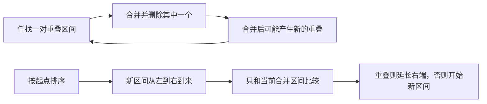

反复两两合并能够得到正确答案，但不断回头检查。排序使重叠链的顺序变得连续，从而把“反复回头”变成“一次向右扫描”。

### 方案一：反复寻找任意重叠对（暴力起点）

#### 思路

在当前区间集合中枚举任意两段。若它们重叠，就替换为并集区间并删除其中一个；一次合并可能让新区间又与其他区间重叠，因此重新从头检查，直到再也找不到可合并的区间。

```cpp
class Solution {
public:
    vector<vector<int>> merge(vector<vector<int>>& intervals) {
        // 复制输入，避免本版本在合并过程中修改调用方的原数组。
        vector<vector<int>> result = intervals;
        // 标记本轮是否合并过任意一对区间。
        bool did_merge = true;

        // 只要还有合并发生，就继续检查新的重叠关系。
        while (did_merge) {
            // 假设本轮没有合并；发现一对重叠区间后会改为 true。
            did_merge = false;

            // 枚举第一段区间；本轮合并后立刻重启扫描。
            for (int first = 0;
                 first < static_cast<int>(result.size()) && !did_merge;
                 ++first) {
                // 仅枚举 first 之后的区间，避免重复检查同一对。
                for (int second = first + 1;
                     second < static_cast<int>(result.size());
                     ++second) {
                    // 两个闭区间互相没有完全落在对方左侧时，它们重叠或相接。
                    const bool overlaps = result[first][1] >= result[second][0] &&
                                          result[second][1] >= result[first][0];
                    // 当前两段不重叠时，继续寻找下一对。
                    if (!overlaps) {
                        continue;
                    }

                    // 合并后左端取两个左端中的较小值。
                    result[first][0] = min(result[first][0], result[second][0]);
                    // 合并后右端取两个右端中的较大值。
                    result[first][1] = max(result[first][1], result[second][1]);
                    // 删除已被并入 first 的第二段区间。
                    result.erase(result.begin() + second);
                    // 新区间可能与此前区间产生重叠，需要从头重新检查。
                    did_merge = true;
                    // 结束内层循环，交给下一轮 while 重启扫描。
                    break;
                }
            }
        }

        // 所有区间两两不重叠后，返回最终集合。
        return result;
    }
};
```

#### 正确性与复杂度

每次合并都用两个重叠闭区间的并集替换它们，因此不会丢失任何覆盖范围；同时区间数量减少一。循环终止时不存在任何重叠对，结果自然互不重叠，且覆盖范围与输入相同。

但一次合并后可能需要再次扫描近 `O(n²)` 对区间，最多发生 `n - 1` 次合并；再考虑 `vector::erase` 的移动成本，最坏时间复杂度为 `O(n³)`。

| 时间复杂度 | 辅助空间 | 是否修改原数组 | 优点 | 代价 |
| --- | --- | --- | --- | --- |
| `O(n³)` | `O(n)` | 否 | 最直接地表达“找到重叠就取并集” | 反复全局扫描，无法应对题目规模 |

### 方案二：排序后维护结果列表（推荐）

#### 思路

先按区间起点升序排序。结果数组 `merged` 始终保存已经处理完的、两两不重叠的区间；新读入区间只可能和 `merged.back()` 重叠。

- 若 `merged.back()[1] < interval[0]`，当前终点严格在新区间起点左侧，二者不重叠，直接开始一个新区间。
- 否则二者重叠或端点相接，保留原左端，并将右端更新为两者最大值。

```cpp
class Solution {
public:
    vector<vector<int>> merge(vector<vector<int>>& intervals) {
        // 按起点升序排列，让可能相交的区间在扫描时相邻出现。
        sort(intervals.begin(), intervals.end(),
             [](const vector<int>& first, const vector<int>& second) {
                 // 起点更小的区间排在前面。
                 return first[0] < second[0];
             });

        // 保存已经完成合并、并且彼此不重叠的区间。
        vector<vector<int>> merged;

        // 从左到右读取排好序的每个区间。
        for (const vector<int>& interval : intervals) {
            // 第一个区间，或与最后一个结果区间严格分离时，直接写入结果。
            if (merged.empty() || merged.back()[1] < interval[0]) {
                merged.push_back(interval);
                continue;
            }

            // 当前区间与最后一个结果区间重叠，右端延长到二者较大值。
            merged.back()[1] = max(merged.back()[1], interval[1]);
        }

        // 返回排序扫描后的全部不重叠区间。
        return merged;
    }
};
```

#### 不变量与正确性

处理每个 `interval` 前，`merged` 中的区间按起点升序、彼此不重叠，并且恰好覆盖此前处理过的所有输入区间。

排序后，新区间的起点不小于 `merged.back()` 的起点：

- 若 `merged.back()[1] < interval[0]`，最后一个区间都已在新起点左侧；更早的区间终点更靠左，也不可能重叠，因此可以直接加入。
- 否则它与最后一个区间重叠。因为新区间的起点更靠右，合并区间的左端不变，只需将右端取最大值。

两种操作都保持不变量，扫描结束后 `merged` 就是答案。

#### 示例推演

以 `[[1, 3], [2, 6], [8, 10], [15, 18]]` 为例，输入本身已经按起点排序：

| 读入区间 | 与最后结果区间的关系 | `merged` 处理后 |
| --- | --- | --- |
| `[1, 3]` | 结果为空，直接加入 | `[[1, 3]]` |
| `[2, 6]` | `2 <= 3`，重叠 | `[[1, 6]]` |
| `[8, 10]` | `6 < 8`，严格分离 | `[[1, 6], [8, 10]]` |
| `[15, 18]` | `10 < 15`，严格分离 | `[[1, 6], [8, 10], [15, 18]]` |

对于 `[1, 4]`、`[4, 5]`，判断“严格分离”的条件 `4 < 4` 为假，所以会走合并分支，得到 `[1, 5]`。

#### 边界与细节

**不重叠条件是 `merged.back()[1] < interval[0]`，不是 `<=`。**

本题把端点相同的闭区间视为重叠。若写成 `<=`，`[1, 4]` 和 `[4, 5]` 会被错误保留为两段。

**合并时只更新右端点。**

排序保证 `merged.back()[0] <= interval[0]`，因此合并区间的左端仍是 `merged.back()[0]`；只有右端可能继续延伸。

**排序会修改 `intervals`。**

LeetCode 的函数参数按引用传入，标准实现直接排序最简洁。若调用方必须保留原始顺序，应先复制一份再排序，此时会额外使用 `O(n)` 空间。

#### 复杂度与取舍

排序占主导：时间复杂度为 `O(n log n)`；扫描一次为 `O(n)`。结果数组最多保存 `n` 个区间，辅助空间为 `O(n)`；排序实现通常还会使用 `O(log n)` 的调用栈空间。

| 时间复杂度 | 辅助空间 | 是否修改原数组 | 优点 | 代价 |
| --- | --- | --- | --- | --- |
| `O(n log n)` | `O(n)` | 是 | 思路清晰、容易证明，是最常用写法 | 需要额外结果数组；排序改变输入顺序 |

### 方案三：排序后原地写回结果

#### 思路

排序和合并规则与方案二完全相同，只是不再维护额外的 `merged` 数组。用 `write` 指向当前已合并区间的位置，`read` 从左到右读取待处理区间：

- 不重叠时，`write` 右移，并把新区间写到 `intervals[write]`。
- 重叠时，直接延长 `intervals[write]` 的右端。

扫描结束后，前 `write + 1` 个位置就是答案。

```cpp
class Solution {
public:
    vector<vector<int>> merge(vector<vector<int>>& intervals) {
        // 按起点升序排序，使可合并区间在扫描时相邻出现。
        sort(intervals.begin(), intervals.end(),
             [](const vector<int>& first, const vector<int>& second) {
                 // 起点更小的区间排在前面。
                 return first[0] < second[0];
             });

        // write 指向当前已合并区间的最后一个有效位置。
        int write = 0;

        // read 从第二个区间开始，依次处理所有待合并区间。
        for (int read = 1; read < static_cast<int>(intervals.size()); ++read) {
            // 当前合并区间终点严格小于新区间起点时，两者不重叠。
            if (intervals[write][1] < intervals[read][0]) {
                // 为新的独立区间预留一个写入位置。
                ++write;
                // 将当前读取区间写入结果区间的下一个位置。
                intervals[write] = intervals[read];
                continue;
            }

            // 两区间重叠或端点相接，延长当前合并区间的右端。
            intervals[write][1] = max(intervals[write][1], intervals[read][1]);
        }

        // 删除写入位置之后的无效尾部，只保留合并结果。
        intervals.resize(write + 1);
        // 直接返回原地压缩后的区间数组。
        return intervals;
    }
};
```

#### 不变量与复杂度

处理完 `read` 前，`intervals[0..write]` 是已经合并好的结果，`intervals[write + 1..read - 1]` 不再有意义；每次处理新读入区间后，这个结论仍成立。

与方案二相比，时间复杂度同为 `O(n log n)`，但除排序调用栈外不再分配额外结果数组。代价是函数会重排并覆盖输入，适合允许原地修改的场景。

### 方案选择与 Trade-off

| 方案 | 时间复杂度 | 辅助空间 | 是否修改原数组 | 主要优势 | 主要代价 |
| --- | --- | --- | --- | --- | --- |
| 反复两两合并 | `O(n³)` | `O(n)` | 否 | 直接表达区间并集，便于理解传递重叠 | 反复全局扫描，效率很低 |
| 排序 + 结果列表 | `O(n log n)` | `O(n)` | 是 | 逻辑最清晰，面试推荐 | 需要输出列表，排序改变原顺序 |
| 排序 + 原地写回 | `O(n log n)` | `O(log n)` | 是 | 减少额外容器，空间更省 | `write` / `read` 语义更容易写错，覆盖输入 |

### 面试手撕检查清单

1. 先确认区间是闭区间，端点相等也要合并。
2. 先按起点排序；没有排序时，不能只比较最后一个结果区间。
3. 写出不重叠条件：`last_end < current_start`，严格小于时才能开始新区间。
4. 发生重叠时，左端因排序保持不变，只有右端更新为 `max(last_end, current_end)`。
5. 说明为什么只比较最后一个结果区间：结果区间已排序且互不重叠，更早区间一定不可能与当前区间相交。
6. 若要求原数组不变，先复制后排序；若允许修改，可使用原地写回版本。

“排序后扫描”是区间题最常见的入口。后续的插入区间、无重叠区间、会议室、最少箭数等题，通常都先问：按什么端点排序后，局部比较是否足以代表全局关系？

## 3. 轮转数组

- 题目链接：[189. 轮转数组](https://leetcode.cn/problems/rotate-array/description)
- 难度：中等
- 核心分类：数组置换、索引映射、原地操作、翻转。

### 题目

给定整数数组 `nums`，将数组元素向右轮转 `k` 个位置，其中 `k` 为非负数。要求尽可能给出多种解法，并思考能否使用 `O(1)` 额外空间原地完成。

**示例 1：**

- 输入：`nums = [1, 2, 3, 4, 5, 6, 7]`，`k = 3`
- 输出：`[5, 6, 7, 1, 2, 3, 4]`

轮转过程为：

- 右转 `1` 步：`[7, 1, 2, 3, 4, 5, 6]`
- 右转 `2` 步：`[6, 7, 1, 2, 3, 4, 5]`
- 右转 `3` 步：`[5, 6, 7, 1, 2, 3, 4]`

**示例 2：**

- 输入：`nums = [-1, -100, 3, 99]`，`k = 2`
- 输出：`[3, 99, -1, -100]`

**提示：**

- `1 <= nums.length <= 10^5`
- `-2^31 <= nums[i] <= 2^31 - 1`
- `0 <= k <= 10^5`

### 读题：哪些特征指向数组置换

设数组长度为 `n`，原下标为 `i` 的元素右转 `k` 步后的目标下标为：

$$
next(i) = (i + k) \bmod n
$$

这说明轮转不是插入、删除或排序，而是一个**位置置换**：每个元素恰好移动到一个新位置，每个位置也恰好接收一个元素。

| 题目特征 | 推导出的需求 | 对应做法 |
| --- | --- | --- |
| 元素只换位置，不改变值和数量 | 需要完成下标到下标的置换 | 索引映射 |
| `k` 可能大于数组长度 | 多转整圈后数组不变 | `k %= n` |
| 要求原地解法 | 不能直接保留完整结果数组 | 环状替换或三次翻转 |
| 右侧后缀会移到前面 | 数组可拆为前缀 `A` 和后缀 `B` | 翻转恢复 `B + A` |
| 要求至少三种方案 | 可从模拟、辅助数组、原地置换递进 | 多种空间与实现取舍 |

归一化后的 `k` 满足 `0 <= k < n`。若 `k = 0`，数组无需变化；若 `k > 0`，原数组可以写成：

$$
[A \mid B]
$$

其中 `B` 是长度为 `k` 的后缀。右转后的目标就是 `[B | A]`。

### 从逐步移动到原地置换

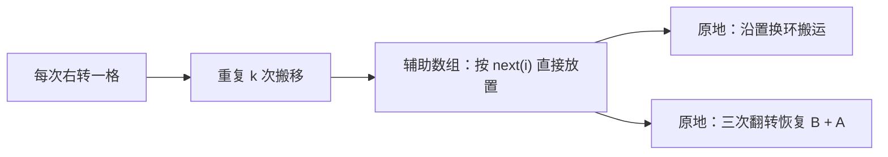

辅助数组最直接地实现了下标映射；环状替换和三次翻转都在不额外保存完整数组的前提下完成同一置换。

### 方案一：重复执行一次右转（模拟起点）

#### 思路

一次右转时，先保存末尾元素，再从右向左搬移其余元素，最后把保存值写回下标 `0`。重复执行 `k` 次即可完成轮转。

```cpp
class Solution {
public:
    void rotate(vector<int>& nums, int k) {
        // 缓存数组长度，后续用于归一化轮转次数。
        const int size = static_cast<int>(nums.size());
        // 去掉完整轮转，保留真正会改变数组的步数。
        k %= size;

        // 重复执行 k 次“向右移动一格”。
        for (int step = 0; step < k; ++step) {
            // 保存本轮将移动到下标 0 的末尾元素。
            const int last_value = nums.back();

            // 从右向左复制，避免覆盖尚未搬走的前一个元素。
            for (int index = size - 1; index > 0; --index) {
                nums[index] = nums[index - 1];
            }

            // 将原末尾元素写入本轮右转后的首位置。
            nums[0] = last_value;
        }
    }
};
```

#### 正确性与复杂度

单次循环后，原下标 `i` 的元素被写入 `i + 1`，原末尾元素被写入 `0`，恰好完成一次右转。重复 `k` 次即可右转 `k` 步。

| 时间复杂度 | 辅助空间 | 是否原地 | 优点 | 代价 |
| --- | --- | --- | --- | --- |
| `O(n × k)` | `O(1)` | 是 | 最直观，容易从题意手写 | `k` 较大时反复搬运同一元素，效率很低 |

### 方案二：辅助数组按目标下标放置

#### 思路

直接使用位置映射：原来的 `nums[i]` 应写入 `rotated[(i + k) % n]`。所有元素放置完成后，再把辅助数组赋回 `nums`。

```cpp
class Solution {
public:
    void rotate(vector<int>& nums, int k) {
        // 缓存数组长度，后续用于下标映射。
        const int size = static_cast<int>(nums.size());
        // 去掉完整轮转，保证目标下标计算简洁。
        k %= size;
        // 创建与原数组等长的结果数组。
        vector<int> rotated(size);

        // 枚举每个原下标，将元素写入右转后的目标位置。
        for (int index = 0; index < size; ++index) {
            // 计算原下标 index 右转 k 步后的新下标。
            const int target_index = (index + k) % size;
            // 将原元素直接放入唯一对应的目标位置。
            rotated[target_index] = nums[index];
        }

        // 用已经完成轮转的辅助数组覆盖原数组。
        nums = rotated;
    }
};
```

#### 不变量与复杂度

处理完原下标 `[0, index]` 后，`rotated` 中这些元素对应的目标位置都已正确写入。模运算保证目标下标落在 `[0, n)`；映射是双射，所以不同原下标不会争夺同一个目标位置。

| 时间复杂度 | 辅助空间 | 是否原地 | 优点 | 代价 |
| --- | --- | --- | --- | --- |
| `O(n)` | `O(n)` | 否 | 索引公式直接，最容易验证 | 额外保存了完整数组，不满足进阶空间要求 |

### 方案三：沿置换环原地替换

#### 思路

目标下标映射 `next(i) = (i + k) % n` 会把所有下标分解成若干个环。例如 `n = 6`、`k = 2` 时：

```text
0 → 2 → 4 → 0
1 → 3 → 5 → 1
```

从一个环的起点出发，用 `previous_value` 保存即将写入下一个位置的值；每次把它写入目标位置，再取出该位置被覆盖的旧值继续传递。回到起点时，一个环刚好完成。

```cpp
class Solution {
public:
    void rotate(vector<int>& nums, int k) {
        // 缓存数组长度，后续用于归一化和目标下标计算。
        const int size = static_cast<int>(nums.size());
        // 去掉完整轮转，保留实际需要执行的位移。
        k %= size;
        // 不需要移动时直接返回，避免无意义地遍历所有单元素环。
        if (k == 0) {
            return;
        }

        // moved 统计已经被写入正确目标位置的元素数量。
        int moved = 0;

        // 依次寻找尚未覆盖到的新环起点。
        for (int start = 0; moved < size; ++start) {
            // 当前环从 start 位置开始。
            int current_index = start;
            // 保存原 start 位置的值，准备写入它的目标位置。
            int previous_value = nums[start];

            // 沿着 next(index) 持续搬运，直到回到本环起点。
            do {
                // 计算当前保存值应被写入的目标下标。
                const int next_index = (current_index + k) % size;
                // 保存目标位置原有的值，供下一次搬运使用。
                const int displaced_value = nums[next_index];
                // 将当前保存值写入它的正确目标位置。
                nums[next_index] = previous_value;
                // 被覆盖的旧值成为下一轮要搬运的值。
                previous_value = displaced_value;
                // 前进到刚刚写入的位置，继续沿同一环移动。
                current_index = next_index;
                // 当前已有一个元素到达正确位置。
                ++moved;
            } while (current_index != start);
        }
    }
};
```

#### 为什么会有多个环？

下标每次加 `k` 后再对 `n` 取模。只有当累计加了若干次 `k` 恰好回到 `0` 时，环才闭合；环的数量为 `gcd(n, k)`，每个环长度为 `n / gcd(n, k)`。

因此不能只从下标 `0` 开始搬运。例如 `n = 6`、`k = 2` 时，从 `0` 出发只会覆盖偶数下标；`moved < size` 让外层循环继续启动另一个环，从而覆盖全部位置。

#### 不变量与复杂度

在环内每次循环开始时，`previous_value` 正是 `current_index` 原本应移动到 `next_index` 的值；写入后，被覆盖的值继续承担下一次搬运。回到 `start` 时，该环所有位置均已写入正确值。

每个元素恰好被写入一次，时间复杂度为 `O(n)`；除了几个变量外没有额外容器，辅助空间为 `O(1)`。

### 方案四：三次翻转（推荐）

#### 思路

将原数组写成 `[A | B]`，其中 `B` 是长度为 `k` 的后缀。目标是 `[B | A]`。

三次翻转的变化如下：

| 操作 | 数组形态 |
| --- | --- |
| 原数组 | `A B` |
| 翻转整个数组 | `reverse(B) reverse(A)` |
| 翻转前 `k` 个位置 | `B reverse(A)` |
| 翻转剩余 `n - k` 个位置 | `B A` |

例如 `[1, 2, 3, 4, 5, 6, 7]` 右转 `3` 步：

| 操作 | 数组状态 |
| --- | --- |
| 初始 | `[1, 2, 3, 4, 5, 6, 7]` |
| 翻转全部 | `[7, 6, 5, 4, 3, 2, 1]` |
| 翻转前 `3` 个 | `[5, 6, 7, 4, 3, 2, 1]` |
| 翻转后 `4` 个 | `[5, 6, 7, 1, 2, 3, 4]` |

```cpp
class Solution {
public:
    void rotate(vector<int>& nums, int k) {
        // 缓存数组长度，后续用于归一化轮转次数和分段边界。
        const int size = static_cast<int>(nums.size());
        // 去掉完整轮转，保证 k 位于 [0, size) 内。
        k %= size;
        // 右转 0 步时不需要修改数组。
        if (k == 0) {
            return;
        }

        // 先翻转全部元素，得到 reverse(B) + reverse(A)。
        reverse(nums.begin(), nums.end());
        // 翻转前 k 个元素，将 reverse(B) 恢复为 B。
        reverse(nums.begin(), nums.begin() + k);
        // 翻转剩余元素，将 reverse(A) 恢复为 A。
        reverse(nums.begin() + k, nums.end());
    }
};
```

#### 正确性与边界

三次翻转的推导直接表明最终数组为 `[B | A]`，即原数组右转 `k` 位后的结果。每个 `reverse` 都只交换区间内的对称位置，因此不需要额外数组。

**必须先执行 `k %= size`。**

右转 `n` 步与不转相同；例如长度为 `7` 的数组右转 `10` 步，等价于右转 `3` 步。若不归一化，`nums.begin() + k` 可能越过数组末尾。

**`reverse` 使用的是半开区间。**

- `reverse(nums.begin(), nums.begin() + k)` 翻转下标 `[0, k)`，正好是原后缀 `B` 的长度。
- `reverse(nums.begin() + k, nums.end())` 翻转下标 `[k, n)`，正好对应前缀 `A`。

**为什么先翻转全部，再翻转两段？**

单独交换 `[A | B]` 两段需要搬运一整段元素；整体翻转会同时改变两段顺序和段内顺序，后两次局部翻转只负责恢复段内顺序，恰好得到 `[B | A]`。

#### 复杂度与取舍

三个翻转操作访问的元素总数是 `n + k + (n - k) = 2n`，所以时间复杂度为 `O(n)`，辅助空间为 `O(1)`。相比环状替换，它不依赖环数和 `gcd`，是面试中最简洁的原地线性解。

### 方案选择与 Trade-off

| 方案 | 时间复杂度 | 辅助空间 | 是否原地 | 主要优势 | 主要代价 |
| --- | --- | --- | --- | --- | --- |
| 重复单步右转 | `O(n × k)` | `O(1)` | 是 | 最贴近题意 | 大量重复搬运，`k` 大时很慢 |
| 辅助数组映射 | `O(n)` | `O(n)` | 否 | 下标映射最直观，容易验证 | 需要完整额外数组 |
| 环状替换 | `O(n)` | `O(1)` | 是 | 直接原地执行置换映射 | 需处理多个环，代码较绕 |
| 三次翻转 | `O(n)` | `O(1)` | 是 | 代码短、边界清晰，推荐手撕 | 需要理解翻转后如何恢复两段顺序 |

### 面试手撕检查清单

1. 首先计算 `k %= n`，处理 `k` 大于数组长度和 `k == 0` 的情况。
2. 写出下标映射：原下标 `i` 到新下标 `(i + k) % n`。
3. 若使用辅助数组，明确读原数组、写目标数组，避免覆盖尚未读取的元素。
4. 若使用环状替换，说明置换会分成 `gcd(n, k)` 个环，不能只处理第一个环。
5. 若使用三次翻转，把数组拆为 `[A | B]`，并按“全翻转 → 前 `k` 翻转 → 后 `n-k` 翻转”写出半开区间边界。
6. 题目保证数组非空，因此可安全对 `size` 取模；若迁移到允许空数组的题目，必须先检查 `nums.empty()`。

轮转数组本质是置换问题。后续遇到原地重排、洗牌、循环替换时，先写清楚“旧位置映射到哪个新位置”，再决定使用辅助数组、环状搬运还是可逆操作组合。

## 4. 除自身以外数组的乘积

- 题目链接：[238. 除自身以外数组的乘积](https://leetcode.cn/problems/product-of-array-except-self/description)
- 难度：中等
- 核心分类：前后缀分解、数组复用、乘积贡献。

### 题目

给你一个整数数组 `nums`，返回数组 `answer`，其中 `answer[i]` 等于 `nums` 中除 `nums[i]` 以外其余元素的乘积。

要求不使用除法，并在 `O(n)` 时间内完成。题目保证每个答案都在 32 位整数范围内；进阶要求 `O(1)` 额外空间，且输出数组不计入额外空间。

**示例 1：**

- 输入：`nums = [1, 2, 3, 4]`
- 输出：`[24, 12, 8, 6]`

**示例 2：**

- 输入：`nums = [-1, 1, 0, -3, 3]`
- 输出：`[0, 0, 9, 0, 0]`

**提示：**

- `2 <= nums.length <= 10^5`
- `-30 <= nums[i] <= 30`
- `answer[i]` 保证在 32 位整数范围内。

### 读题：哪些特征指向前后缀分解

对于每个位置 `i`，答案不包含 `nums[i]`，却包含它左边和右边的全部元素。因此可以自然拆成两部分：

$$
answer[i] = \left(\prod_{j=0}^{i-1} nums[j]\right)
            \times
            \left(\prod_{j=i+1}^{n-1} nums[j]\right)
$$

左边乘积和右边乘积彼此独立，分别扫描一次即可得到。这个分解不依赖除法，因此零元素会自动被正确处理。

| 题目特征 | 推导出的需求 | 对应做法 |
| --- | --- | --- |
| `answer[i]` 排除自身 | 不能直接复用包含 `nums[i]` 的总乘积 | 分成左侧与右侧贡献 |
| 禁止使用除法 | 不能计算总乘积后除以 `nums[i]` | 前后缀乘积 |
| 数组可能包含 `0` | 不应靠除法处理零的特殊分支 | 乘积扫描自然传播零 |
| 要求 `O(n)` 时间 | 不能为每个位置重新遍历数组 | 两次线性扫描 |
| 进阶要求 `O(1)` 额外空间 | 不能保留完整前缀、后缀数组 | 复用输出数组保存左侧乘积 |

### 从逐位置重算到复用输出数组

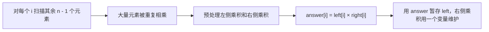

注意：总乘积除以自身在没有零时看似更短，但既违反题目限制，也会在一个或多个零出现时需要额外分类讨论；前后缀方法统一处理所有情况。

### 方案一：逐位置枚举其余元素（暴力起点）

#### 思路

枚举答案位置 `i`，再扫描整个数组，将除 `i` 外的所有元素相乘。它直接对应题意，但每个元素会被重复参与近 `n` 次乘法。

```cpp
class Solution {
public:
    vector<int> productExceptSelf(vector<int>& nums) {
        // 创建答案数组，保存每个位置排除自身后的乘积。
        vector<int> answer(nums.size(), 1);

        // 枚举当前需要计算答案的位置。
        for (int excluded = 0; excluded < static_cast<int>(nums.size()); ++excluded) {
            // product 维护除 nums[excluded] 外已扫描元素的乘积。
            int product = 1;

            // 扫描全部元素，跳过当前位置自身。
            for (int index = 0; index < static_cast<int>(nums.size()); ++index) {
                // 被排除位置不应参与当前答案的乘积。
                if (index == excluded) {
                    continue;
                }
                // 将其他元素累计到当前答案中。
                product *= nums[index];
            }

            // 写入排除当前位置后的最终乘积。
            answer[excluded] = product;
        }

        // 返回全部位置的答案。
        return answer;
    }
};
```

#### 正确性与复杂度

对于每个 `excluded`，内层循环恰好遍历并相乘了所有 `index != excluded` 的元素，故 `answer[excluded]` 符合定义。外层有 `n` 次、内层也有 `n` 次，时间复杂度为 `O(n²)`。

| 时间复杂度 | 辅助空间 | 优点 | 代价 |
| --- | --- | --- | --- |
| `O(n²)` | `O(1)` | 最直接地对应题意 | 同一元素在不同答案中被反复相乘，无法满足规模要求 |

输出数组不计入进阶的额外空间；本节的“辅助空间”也遵循这一约定。

### 方案二：显式前缀数组 + 后缀数组

#### 思路

定义：

- `left[i]`：`nums[i]` 左边所有元素的乘积。
- `right[i]`：`nums[i]` 右边所有元素的乘积。

则 `answer[i] = left[i] * right[i]`。空侧的乘积定义为乘法单位元 `1`，因此 `left[0] = 1`、`right[n - 1] = 1`。

```cpp
class Solution {
public:
    vector<int> productExceptSelf(vector<int>& nums) {
        // 缓存数组长度，便于表达前后缀边界。
        const int size = static_cast<int>(nums.size());
        // left[i] 保存 nums[i] 左边全部元素的乘积。
        vector<int> left(size, 1);
        // right[i] 保存 nums[i] 右边全部元素的乘积。
        vector<int> right(size, 1);
        // 创建最终答案数组。
        vector<int> answer(size, 1);

        // 从左到右构造每个位置的左侧乘积。
        for (int index = 1; index < size; ++index) {
            // 左侧乘积等于前一位置的左侧乘积再乘前一元素。
            left[index] = left[index - 1] * nums[index - 1];
        }

        // 从右到左构造每个位置的右侧乘积。
        for (int index = size - 2; index >= 0; --index) {
            // 右侧乘积等于后一位置的右侧乘积再乘后一元素。
            right[index] = right[index + 1] * nums[index + 1];
        }

        // 将每个位置相互独立的左右贡献相乘。
        for (int index = 0; index < size; ++index) {
            // 左侧与右侧合起来恰好排除了 nums[index] 自身。
            answer[index] = left[index] * right[index];
        }

        // 返回所有位置排除自身后的乘积。
        return answer;
    }
};
```

#### 示例推演

以 `nums = [1, 2, 3, 4]` 为例：

| 下标 `i` | `left[i]` | `right[i]` | `answer[i] = left[i] × right[i]` |
| --- | --- | --- | --- |
| `0` | `1` | `24` | `24` |
| `1` | `1` | `12` | `12` |
| `2` | `2` | `4` | `8` |
| `3` | `6` | `1` | `6` |

`left[0]` 和 `right[3]` 均为 `1`，不是 `0`：它们分别表示没有元素可乘的空前缀和空后缀。若初始化为 `0`，乘积会错误地全部变为 `0`。

#### 不变量与复杂度

构造 `left` 时，处理下标 `i` 后，`left[i]` 是区间 `[0, i)` 的乘积；构造 `right` 时，`right[i]` 是区间 `(i, n - 1]` 的乘积。两者相乘恰好覆盖除 `i` 以外的全部下标。

| 时间复杂度 | 辅助空间 | 优点 | 代价 |
| --- | --- | --- | --- |
| `O(n)` | `O(n)` | 左右贡献含义最清晰，方便推导 | 额外保存两个完整数组，未达到进阶空间要求 |

### 方案三：复用输出数组保存左侧乘积（推荐）

#### 思路

方案二中 `left`、`right` 不必同时存在：

1. 第一遍从左到右，让 `answer[i]` 先保存 `left[i]`。
2. 第二遍从右到左，用一个变量 `suffix_product` 保存当前右侧乘积，并乘入 `answer[i]`。

输出数组本来就必须返回，不计入额外空间；因此除了两个乘积变量外，不再需要辅助容器。

```cpp
class Solution {
public:
    vector<int> productExceptSelf(vector<int>& nums) {
        // 缓存数组长度，便于表达两次扫描的边界。
        const int size = static_cast<int>(nums.size());
        // answer 初始为 1，第一遍将逐项写入左侧乘积。
        vector<int> answer(size, 1);
        // prefix_product 表示当前下标左边所有元素的乘积。
        int prefix_product = 1;

        // 从左到右写入每个位置的左侧乘积。
        for (int index = 0; index < size; ++index) {
            // 写入 nums[index] 之前的乘积，因此不包含 nums[index] 自身。
            answer[index] = prefix_product;
            // 将当前元素纳入后续位置的左侧乘积。
            prefix_product *= nums[index];
        }

        // suffix_product 表示当前下标右边所有元素的乘积。
        int suffix_product = 1;

        // 从右到左补齐每个位置的右侧乘积。
        for (int index = size - 1; index >= 0; --index) {
            // answer[index] 已是左侧乘积，乘右侧乘积后得到最终答案。
            answer[index] *= suffix_product;
            // 将当前元素纳入后续位置的右侧乘积。
            suffix_product *= nums[index];
        }

        // 返回已经填充完左右贡献的答案数组。
        return answer;
    }
};
```

#### 两次扫描分别保证什么？

第一遍处理完下标 `index` 后：

- `answer[index]` 是 `nums[0] × ... × nums[index - 1]`，不含 `nums[index]`。
- `prefix_product` 是 `nums[0] × ... × nums[index]`，供下一位置使用。

第二遍处理完下标 `index` 后：

- `suffix_product` 在乘入前，是 `nums[index + 1] × ... × nums[n - 1]`。
- `answer[index]` 乘上它后，正好得到除 `nums[index]` 外全部元素的乘积。
- 随后才将 `nums[index]` 纳入 `suffix_product`，供左侧位置使用。

这解释了两轮循环中“**先写答案，再更新乘积变量**”的顺序；若先更新，当前位置会错误地把自身乘进去。

#### 为什么零元素不需要特判？

以前缀和后缀直接相乘时，零会自然落入所有应该为零的答案中。

以 `nums = [-1, 1, 0, -3, 3]` 为例：

- 对 `i = 2`，左侧乘积为 `(-1) × 1 = -1`，右侧乘积为 `(-3) × 3 = -9`，答案为 `9`。
- 对其他任意位置，左侧或右侧必然包含中间的 `0`，答案自然为 `0`。

若数组包含两个或更多 `0`，任何位置排除自身后仍至少留下一个 `0`，所有答案也会自然为 `0`。

#### 边界与复杂度

**乘法单位元必须初始化为 `1`。**

第一个位置没有左侧元素，最后一个位置没有右侧元素；空乘积的值是 `1`。初始化为 `0` 会让之后的乘积永远为 `0`。

**右向循环的初值是 `size - 1`。**

题目保证 `nums` 长度至少为 `2`，因此 `int index = size - 1` 安全；若迁移到可能为空的数组，先检查空数组，再进行这种倒序循环。

**题目保证答案和前后缀乘积在 32 位范围内。**

因此本题使用 `int` 安全；在数据范围未知的工程题或变体中，应优先使用 `long long` 检查乘积溢出风险。

两次扫描各访问数组一次，时间复杂度为 `O(n)`。除输出数组和两个标量变量外不使用其他容器，额外空间为 `O(1)`。

### 方案选择与 Trade-off

| 方案 | 时间复杂度 | 辅助空间 | 是否使用除法 | 主要优势 | 主要代价 |
| --- | --- | --- | --- | --- | --- |
| 逐位置枚举其余元素 | `O(n²)` | `O(1)` | 否 | 最直接地对应定义 | 重复乘法过多，无法通过大规模输入 |
| 显式前缀 + 后缀数组 | `O(n)` | `O(n)` | 否 | 左右贡献清晰，最利于推导 | 额外保存两个完整数组 |
| 复用输出数组 | `O(n)` | `O(1)` | 否 | 满足全部要求，零元素自然处理，推荐手撕 | 需准确维护两次扫描的更新顺序 |

### 面试手撕检查清单

1. 先写公式：`answer[i] = 左侧乘积 × 右侧乘积`，说明它不含自身。
2. 不用总乘积除以 `nums[i]`：题目禁止除法，且零会破坏该思路。
3. 第一遍从左到右：先写 `answer[i] = prefix_product`，再乘入 `nums[i]`。
4. 第二遍从右到左：先执行 `answer[i] *= suffix_product`，再乘入 `nums[i]`。
5. 前缀、后缀和输出数组的初值都是乘法单位元 `1`，不是 `0`。
6. 明确输出数组不计入额外空间，所以复用 `answer` 才满足 `O(1)` 进阶要求。

这类“除当前位置外的全体贡献”问题，常可拆成左侧信息与右侧信息两部分。加法可用前后缀和，乘法可用前后缀积；关键是先定义每一侧是否包含当前位置，再确定扫描时的更新顺序。

## 5. 缺失的第一个正数

- 题目链接：[41. 缺失的第一个正数](https://leetcode.cn/problems/first-missing-positive/description)
- 难度：困难
- 核心分类：原地哈希、索引归位、位图。

### 题目

给你一个未排序的整数数组 `nums`，找出其中没有出现的最小正整数。

要求实现 `O(n)` 时间复杂度且只使用常数级别额外空间的解法。

**示例 1：**

- 输入：`nums = [1, 2, 0]`
- 输出：`3`
- 解释：`1`、`2` 都出现了，最小缺失正数是 `3`。

**示例 2：**

- 输入：`nums = [3, 4, -1, 1]`
- 输出：`2`

**示例 3：**

- 输入：`nums = [7, 8, 9, 11, 12]`
- 输出：`1`

**提示：**

- `1 <= nums.length <= 10^5`
- `-2^31 <= nums[i] <= 2^31 - 1`

### 读题：先缩小答案范围

设数组长度为 `n`，答案一定落在 `[1, n + 1]`：

- 若 `1` 到 `n` 中存在缺失值，最小缺失正数显然在 `[1, n]` 内。
- 若 `1` 到 `n` 全部出现，最小缺失正数就是 `n + 1`。

因此，负数、零和大于 `n` 的正数都不可能直接成为答案；它们只会占据数组位置，不需要被记录。

| 题目特征 | 推导出的需求 | 对应做法 |
| --- | --- | --- |
| 只找最小缺失正数 | 无需关心全部整数范围 | 只检查 `[1, n + 1]` |
| 输入无序且含负数、零 | 不能依赖有序性或简单下标 | 过滤无关值 |
| 需要判断是否出现 | 需要一张“存在表” | 位图或原地哈希 |
| 要求 `O(n)` 时间 | 每个值最多处理常数次 | 线性标记或归位 |
| 要求 `O(1)` 额外空间 | 不能另开长度为 `n` 的表 | 用数组下标复用存储位置 |

最优解的核心映射是：值 `x`（仅当 `1 <= x <= n`）应放到下标 `x - 1`。完成归位后，第一个不满足 `nums[i] == i + 1` 的位置 `i`，对应的 `i + 1` 就是答案。

### 从枚举候选到原地哈希

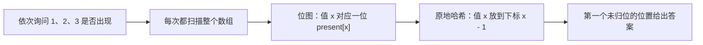

位图已经把“查询某个值是否出现”降为 `O(1)`；原地哈希进一步把这张存在表编码进输入数组，换取常数额外空间。

### 方案一：依次枚举候选值并扫描数组（暴力起点）

#### 思路

答案只会在 `[1, n + 1]` 中，因此从 `1` 开始依次检查候选值是否存在。第一个在数组中找不到的候选值就是答案。

```cpp
class Solution {
public:
    int firstMissingPositive(vector<int>& nums) {
        // 候选答案最多为数组长度加一。
        const int limit = static_cast<int>(nums.size()) + 1;

        // 从最小正整数开始逐个检查候选答案。
        for (int candidate = 1; candidate <= limit; ++candidate) {
            // 标记当前候选值是否已在数组中出现。
            bool found = false;

            // 扫描数组，寻找当前候选值。
            for (const int num : nums) {
                // 找到候选值后无需继续扫描。
                if (num == candidate) {
                    found = true;
                    break;
                }
            }

            // 第一个未出现的正数就是题目答案。
            if (!found) {
                return candidate;
            }
        }

        // 根据答案范围证明，循环一定会在此前返回；此处仅满足编译器控制流要求。
        return limit;
    }
};
```

#### 正确性与复杂度

候选值按从小到大顺序检查，返回第一个未出现者，正是最小缺失正整数。最多检查 `n + 1` 个候选值，每次扫描 `n` 个元素，时间复杂度为 `O(n²)`，辅助空间为 `O(1)`。

### 方案二：位图 / `bitset` 标记出现情况

#### 思路

为每个候选值 `x` 准备一位 `present[x]`：数组中出现有效值 `x` 时就置位，随后从 `1` 起寻找第一个没有置位的位置。

本题 `n <= 10^5`，可以使用容量固定的 `std::bitset`。`bitset` 的长度必须是编译期常量；在数组上界未知的通用场景，可改用动态位图或 `vector<bool>`，思路不变。

```cpp
class Solution {
public:
    int firstMissingPositive(vector<int>& nums) {
        // 题目给出的最大数组长度，用于声明编译期固定容量的 bitset。
        constexpr int kMaxArrayLength = 100000;
        // 下标 x 的位表示正整数 x 是否出现，额外预留 n + 1 的候选位置。
        bitset<kMaxArrayLength + 2> present;
        // 缓存当前实际数组长度，限制需要标记的有效值范围。
        const int size = static_cast<int>(nums.size());

        // 扫描全部元素，只标记可能成为答案范围内成员的正数。
        for (const int num : nums) {
            // 负数、零和大于 size 的值不会影响答案，直接忽略。
            if (num >= 1 && num <= size) {
                present.set(num);
            }
        }

        // 从 1 起查找第一个没有出现的正整数。
        for (int candidate = 1; candidate <= size + 1; ++candidate) {
            // 对应位没有置位时，candidate 就是最小缺失正数。
            if (!present.test(candidate)) {
                return candidate;
            }
        }

        // size + 1 从未被置位，循环理论上一定会返回；此处仅满足控制流要求。
        return size + 1;
    }
};
```

#### 不变量与复杂度

完成标记后，对每个 `x` 属于 `[1, n]`：`present[x]` 为真，当且仅当 `x` 至少在 `nums` 中出现一次。按候选值递增查找的第一个未置位位置自然是最小缺失值。

位图只需每个候选值一位，比 `vector<int>` 标记表更省内存，但它仍随 `n` 增长，额外空间是 `O(n)` **位**，不满足题目的常数空间进阶要求。

| 时间复杂度 | 辅助空间 | 是否修改原数组 | 优点 | 代价 |
| --- | --- | --- | --- | --- |
| `O(n)` | `O(n)` 位 | 否 | 标记语义直观，查询出现情况快 | 需要额外位图，不能满足进阶空间要求 |

### 方案三：原地索引归位（推荐）

#### 思路

既然值 `x` 的“存在位”对应 `x - 1`，就直接让数组位置承担这张表：把每个有效值 `x` 放到 `nums[x - 1]`。

处理下标 `i` 时，若 `nums[i]` 是 `[1, n]` 内的有效值，且还没位于它该在的位置，就把它与 `nums[nums[i] - 1]` 交换。交换后新值会来到 `i`，它可能也需要归位，因此必须持续交换，而不是只交换一次。

```cpp
class Solution {
public:
    int firstMissingPositive(vector<int>& nums) {
        // 缓存数组长度，值 x 的合法归位范围是 [1, size]。
        const int size = static_cast<int>(nums.size());

        // 依次处理每个下标，尽可能让当前位置的有效值回到正确位置。
        for (int index = 0; index < size; ++index) {
            // 当前值有效、未归位且目标位置不是相同值时，继续交换归位。
            while (nums[index] >= 1 && nums[index] <= size &&
                   nums[nums[index] - 1] != nums[index]) {
                // 将值 x 交换到下标 x - 1，使一个有效值到达正确位置。
                swap(nums[index], nums[nums[index] - 1]);
            }
        }

        // 从左到右寻找第一个没有放对值的位置。
        for (int index = 0; index < size; ++index) {
            // 下标 index 应放值 index + 1；不相等就说明该正数缺失。
            if (nums[index] != index + 1) {
                return index + 1;
            }
        }

        // 1 到 size 全部归位时，最小缺失正数只能是 size + 1。
        return size + 1;
    }
};
```

#### 为什么使用 `while` 而不是 `if`？

一次交换会把目标位置原有的值带回当前下标，它可能仍是另一个需要归位的有效值。

以 `nums = [3, 4, -1, 1]` 为例：

| 当前下标 | 归位动作 | 数组状态 |
| --- | --- | --- |
| `0` | `3` 与下标 `2` 交换 | `[-1, 4, 3, 1]` |
| `1` | `4` 与下标 `3` 交换 | `[-1, 1, 3, 4]` |
| `1` | 新到达的 `1` 仍需与下标 `0` 交换 | `[1, -1, 3, 4]` |
| 扫描 | 下标 `1` 应为 `2`，实际为 `-1` | 返回 `2` |

若下标 `1` 处只执行一次 `if` 交换，`1` 会停在错误位置，之后可能错误地得出答案；`while` 会一直处理到当前位置是无关值、已归位值或重复值。

#### 不变量与正确性

归位阶段结束后，对任意 `x` 属于 `[1, n]`：若 `x` 在数组中出现，则 `nums[x - 1] == x`。重复值不要求都归位，只需至少一个 `x` 位于正确位置。

因此在最终扫描中：

- 第一个满足 `nums[i] != i + 1` 的位置，说明 `i + 1` 未出现；否则它本应已归位。
- 若所有位置均正确，则 `1` 到 `n` 全部出现，答案是 `n + 1`。

#### 为什么不会死循环？

`nums[nums[index] - 1] != nums[index]` 是关键去重条件。

例如 `[1, 1]` 中，处理下标 `1` 时当前值 `1` 的目标位置 `0` 已经是 `1`。若仍然交换，两个相同值会无限互换；条件发现目标位置已有相同值后停止。无效值也会被范围判断挡住，避免负下标或越界访问。

每次成功交换都会让一个有效值进入它唯一的正确位置，且该位置之后不会再被换走；最多发生 `n` 次成功交换。两轮线性扫描后总时间复杂度为 `O(n)`，额外空间为 `O(1)`。

#### 边界与细节

**有效值范围是 `1 <= nums[index] <= size`。**

`size + 1` 虽可能是最终答案，却没有对应的合法下标 `size`，所以不应参与归位；负数、零和大于 `size` 的数同样直接忽略。

**范围判断必须在访问 `nums[nums[index] - 1]` 之前。**

C++ 的 `&&` 从左到右短路求值。先确认当前值在 `[1, size]` 内，才能安全把 `nums[index] - 1` 当作下标。

**最佳解会修改输入数组。**

它通过交换把数组变成“值 `x` 尽量位于下标 `x - 1`”的形态。若调用方要求保留原数组，需要先复制，代价是 `O(n)` 额外空间。

### 方案选择与 Trade-off

| 方案 | 时间复杂度 | 辅助空间 | 是否修改原数组 | 主要优势 | 主要代价 |
| --- | --- | --- | --- | --- | --- |
| 枚举候选并扫描 | `O(n²)` | `O(1)` | 否 | 最直观，直接体现“最小且未出现” | 每次候选都重复扫描数组 |
| 位图 / `bitset` | `O(n)` | `O(n)` 位 | 否 | 标记和查询最清晰，适合空间允许的场景 | 不满足常数额外空间要求；固定 `bitset` 依赖输入上界 |
| 原地索引归位 | `O(n)` | `O(1)` | 是 | 满足全部题目要求，是原地哈希经典写法 | `while`、范围判断和重复值判断都容易写错 |

### 面试手撕检查清单

1. 先证明答案范围是 `[1, n + 1]`，据此忽略负数、零和大于 `n` 的值。
2. 位图方案中，候选 `x` 对应 `present[x]`；它是线性时间但需要 `O(n)` 位空间。
3. 最优方案中，值 `x` 的正确位置是下标 `x - 1`。
4. 归位条件必须同时包含：值在 `[1, n]`、尚未归位、目标位置不是相同值。
5. 使用 `while` 持续归位，而不是 `if`；一次交换后当前位置可能来了另一个有效值。
6. 最后从左到右找第一个 `nums[i] != i + 1`；全部正确时返回 `n + 1`。

这题的原地哈希模式会反复出现：当数组长度为 `n`，而题目只关心值域 `[1, n]` 是否出现、每个值有唯一对应下标时，可以考虑把数组本身当作哈希表或存在标记表。

# 矩阵

## 1. 矩阵置零

- 题目链接：[73. 矩阵置零](https://leetcode.cn/problems/set-matrix-zeroes/description/)
- 难度：中等
- 核心分类：矩阵模拟、原地标记

### 题目

给定一个 `m x n` 的矩阵 `matrix`。如果某个元素为 `0`，就将它所在的整行和整列都设为 `0`。要求原地修改矩阵。

**示例 1：**

```text
输入：matrix = [[1,1,1],[1,0,1],[1,1,1]]
输出：[[1,0,1],[0,0,0],[1,0,1]]
```

**示例 2：**

```text
输入：matrix = [[0,1,2,0],[3,4,5,2],[1,3,1,5]]
输出：[[0,0,0,0],[0,4,5,0],[0,3,1,0]]
```

**约束：**

- `m == matrix.size()`，`n == matrix[0].size()`
- `1 <= m, n <= 200`
- `-2³¹ <= matrix[i][j] <= 2³¹ - 1`

### 读题：哪些特征指向“延迟标记”

最容易想到的写法是：扫描到一个 `0`，立刻把它的整行整列改成 `0`。但它是错误的。算法后来写入的 `0` 会在继续扫描时被误当作原始 `0`，进而触发额外的行、列置零，形成连锁污染。

例如 `[[1, 0], [1, 1]]`：如果处理 `(0, 1)` 时立刻置零，`(1, 1)` 会被写成 `0`；后续扫描到它，又会错误地把第 `1` 行也清零。

因此，本题的关键不是如何写 `0`，而是如何先保存“哪些行、哪些列原本出现过 `0`”这一份事实，再统一应用它。

| 题目特征 | 对应思考 |
| --- | --- |
| 一次修改会影响一整行和一整列 | 把“要清零的行 / 列”抽象成两个集合或标记表 |
| 修改后的 `0` 不能再次触发规则 | 必须先记录，再修改，不能边扫边扩散 |
| 要求原地算法 | 尝试复用矩阵中暂时不用的信息位作为标记 |
| 行、列数量不超过 `200` | `O(m + n)` 标记数组已经足够实用；进阶再压到 `O(1)` |

### 从快照到首行首列标记

三种方案的本质都相同：第一阶段只回答“哪些行、列需要清零”，第二阶段才真正改矩阵。区别只在于标记放在哪里。

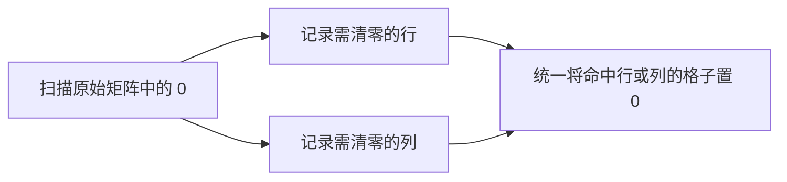

### 方案一：复制一份结果矩阵

#### 思路

保留原矩阵 `matrix` 作为只读快照，再复制出 `result`。扫描原矩阵中每个原始 `0`，并在 `result` 里清零对应行和列。最后用 `result` 覆盖原矩阵。

这版最直观，因为扫描数据与写入数据完全隔离，不会发生连锁污染；但每遇到一个 `0` 都要写一整行和一整列，最坏情况下较慢，也不满足原地要求。

```cpp
class Solution {
public:
    void setZeroes(vector<vector<int>>& matrix) {
        // 复制结果矩阵；matrix 始终保留原始值，供扫描使用。
        vector<vector<int>> result = matrix;

        // 记录矩阵行数，避免在循环条件中反复转换类型。
        const int rows = static_cast<int>(matrix.size());
        // 记录矩阵列数；题目保证矩阵至少有一行一列。
        const int cols = static_cast<int>(matrix[0].size());

        // 只扫描原矩阵，避免 result 中后来写入的 0 触发连锁置零。
        for (int row = 0; row < rows; ++row) {
            for (int col = 0; col < cols; ++col) {
                // 只有原始 0 才需要传播到对应行和列。
                if (matrix[row][col] != 0) {
                    continue;
                }

                // 将该原始 0 所在行写入结果矩阵。
                for (int index = 0; index < cols; ++index) {
                    result[row][index] = 0;
                }
                // 将该原始 0 所在列写入结果矩阵。
                for (int index = 0; index < rows; ++index) {
                    result[index][col] = 0;
                }
            }
        }

        // 最后一次性回写结果，完成原地可见的修改。
        matrix = result;
    }
};
```

#### 不变量与正确性

扫描过程中，`matrix` 从不被修改，所以当前看到的 `matrix[row][col] == 0` 一定是输入中的原始 `0`。每个原始 `0` 都会在 `result` 中清零它的行、列；反过来，`result` 中被改写的位置也一定与至少一个原始 `0` 同行或同列，恰好符合题意。

最坏情况下有 `m * n` 个 `0`，每个都要写 `m + n` 个位置，因此时间复杂度是 `O(mn(m + n))`，额外空间是复制矩阵的 `O(mn)`。

### 方案二：行列标记数组

#### 思路

使用 `zero_rows[row]` 记录第 `row` 行是否含有原始 `0`，使用 `zero_cols[col]` 记录第 `col` 列是否含有原始 `0`。

第一遍扫描只填写这两张标记表；第二遍扫描每个格子，只要其行或列被标记，就把它置为 `0`。这样每个格子只被常数次访问，避免了方案一对同一行、列的重复写入。

```cpp
class Solution {
public:
    void setZeroes(vector<vector<int>>& matrix) {
        // 记录矩阵的行数。
        const int rows = static_cast<int>(matrix.size());
        // 记录矩阵的列数；题目保证 matrix 非空。
        const int cols = static_cast<int>(matrix[0].size());
        // 标记哪些行含有原始 0。
        vector<bool> zero_rows(rows, false);
        // 标记哪些列含有原始 0。
        vector<bool> zero_cols(cols, false);

        // 第一遍只读取原矩阵，建立行列标记。
        for (int row = 0; row < rows; ++row) {
            for (int col = 0; col < cols; ++col) {
                // 当前原始值不是 0 时，不会影响任何标记。
                if (matrix[row][col] != 0) {
                    continue;
                }
                // 记录当前行之后需要被清零。
                zero_rows[row] = true;
                // 记录当前列之后需要被清零。
                zero_cols[col] = true;
            }
        }

        // 第二遍根据已经固定的标记统一修改矩阵。
        for (int row = 0; row < rows; ++row) {
            for (int col = 0; col < cols; ++col) {
                // 行或列命中任一标记，就应成为 0。
                if (zero_rows[row] || zero_cols[col]) {
                    matrix[row][col] = 0;
                }
            }
        }
    }
};
```

#### 不变量与正确性

第一遍扫描结束后，`zero_rows[row]` 为真，当且仅当原矩阵第 `row` 行存在 `0`；`zero_cols[col]` 的含义完全对称。第二遍不会再根据矩阵当前值做判断，只根据已经固定的标记置零，因此写入的 `0` 不会污染判断。

时间复杂度为 `O(mn)`，额外空间为 `O(m + n)`。这是面试中最稳妥、最容易一次写对的线性解。

### 方案三：复用首行首列作为标记（最优）

#### 思路

方案二的两个标记数组只需要保存布尔值。既然第 `row` 行需要一个标记，可以借用 `matrix[row][0]`；第 `col` 列需要一个标记，可以借用 `matrix[0][col]`。

对于内部格子 `(row, col)`，其中 `row >= 1`、`col >= 1`：

- `matrix[row][0] == 0` 表示第 `row` 行要清零；
- `matrix[0][col] == 0` 表示第 `col` 列要清零。

唯一的冲突点是 `matrix[0][0]`：它既可能表示首行，也可能表示首列。这里让它只承担“首行是否清零”的角色，另用一个布尔变量 `first_col_zero` 保存“首列是否清零”。

```cpp
class Solution {
public:
    void setZeroes(vector<vector<int>>& matrix) {
        // 记录行数；题目保证 matrix 至少包含一个元素。
        const int rows = static_cast<int>(matrix.size());
        // 记录列数；题目保证每一行至少包含一个元素。
        const int cols = static_cast<int>(matrix[0].size());
        // 单独保存首列是否含原始 0，避免与 matrix[0][0] 的首行标记冲突。
        bool first_col_zero = false;

        // 第一阶段：扫描原始信息，并把内部行列的标记写到首行、首列。
        for (int row = 0; row < rows; ++row) {
            // 首列不能直接当作普通标记读取，因此单独记录它是否需要清零。
            if (matrix[row][0] == 0) {
                first_col_zero = true;
            }

            // 从第 1 列开始，内部 0 才同时写入行标记和列标记。
            for (int col = 1; col < cols; ++col) {
                // 当前原始位置为 0 时，它所在行和列都需要清零。
                if (matrix[row][col] == 0) {
                    // 用首列记录当前行需要清零。
                    matrix[row][0] = 0;
                    // 用首行记录当前列需要清零。
                    matrix[0][col] = 0;
                }
            }
        }

        // 第二阶段：只处理内部格子，避免过早破坏首行和首列标记。
        for (int row = 1; row < rows; ++row) {
            for (int col = 1; col < cols; ++col) {
                // 行标记或列标记为 0，就清零当前内部格子。
                if (matrix[row][0] == 0 || matrix[0][col] == 0) {
                    matrix[row][col] = 0;
                }
            }
        }

        // matrix[0][0] 作为首行标记；先据它处理完整首行。
        if (matrix[0][0] == 0) {
            for (int col = 0; col < cols; ++col) {
                matrix[0][col] = 0;
            }
        }

        // 最后按独立标记处理首列，不能提前写坏 matrix[0][0]。
        if (first_col_zero) {
            for (int row = 0; row < rows; ++row) {
                matrix[row][0] = 0;
            }
        }
    }
};
```

#### 分阶段推演：为什么首行首列不会互相误伤

以示例 2 为例：

```text
初始矩阵
[0, 1, 2, 0]
[3, 4, 5, 2]
[1, 3, 1, 5]
```

扫描时，首列的 `matrix[0][0]` 是 `0`，所以 `first_col_zero = true`；右上角 `(0, 3)` 是 `0`，于是 `matrix[0][3]` 保持为列标记 `0`。首行的 `matrix[0][0]` 也为 `0`，表示首行最终必须清零。

接着只处理内部格子：第 `3` 列因首行标记为 `0` 而清零；此时首行、首列都没有被当作普通格子覆盖。之后按顺序处理首行，再处理首列，得到目标答案。

如果反过来先处理首列，当 `first_col_zero` 为真时会把 `matrix[0][0]` 写成 `0`。而它原本可能是 `1`，表示首行本不该清零；随后再根据 `matrix[0][0]` 处理首行，就会误清零整行。这正是“首行先、首列后”的原因。

#### 不变量与正确性

第一阶段结束后，对任意内部行 `row >= 1`，`matrix[row][0] == 0` 当且仅当原矩阵第 `row` 行存在 `0`；对任意内部列 `col >= 1`，`matrix[0][col] == 0` 当且仅当原矩阵第 `col` 列存在 `0`。首列的原始信息由 `first_col_zero` 保存，首行的信息由 `matrix[0][0]` 保存。

第二阶段只依据这些已经建立好的标记处理内部格子。最后再独立处理首行和首列，所以每个位置会且只会在其原始行或原始列含 `0` 时被置零。

每个格子至多被常数次访问，时间复杂度为 `O(mn)`；除一个布尔变量外没有额外存储，额外空间为 `O(1)`。

#### 边界与细节

**为什么内部循环从 `1` 开始？**

首行和首列正在保存标记，不能在第二阶段像普通格子一样覆盖；它们必须留到最后单独处理。因此内部区域严格是 `[1, rows)` 与 `[1, cols)`，也就是左闭右开区间。

**为什么第一阶段每一行都要先检查 `matrix[row][0]`？**

首列的原始 `0` 不会进入 `col >= 1` 的内层循环；必须单独记录。即使后续某个内部 `0` 把 `matrix[row][0]` 写成 `0`，也不会影响 `first_col_zero`，因为它只描述“原始首列”是否有 `0`。

**单行或单列是否成立？**

成立。若只有一行或一列，内部循环自然不执行，最后的首行、首列处理仍能给出正确结果。

**为什么这里可以直接访问 `matrix[0]`？**

题目保证 `m, n >= 1`。如果复用到不保证非空的工程接口，应在读取 `matrix[0]` 前先处理 `matrix.empty()` 或 `matrix[0].empty()`。

### 方案选择与 Trade-off

| 方案 | 时间复杂度 | 辅助空间 | 原地修改 | 主要优势 | 主要代价 |
| --- | --- | --- | --- | --- | --- |
| 复制结果矩阵 | `O(mn(m + n))` | `O(mn)` | 否（复制后回写） | 读写隔离，最容易理解连锁污染问题 | 大量重复清零，不满足进阶要求 |
| 行列标记数组 | `O(mn)` | `O(m + n)` | 是 | 两阶段清晰，最容易手撕正确 | 多用了两张标记表 |
| 首行首列标记 | `O(mn)` | `O(1)` | 是 | 满足进阶的常数额外空间要求 | `matrix[0][0]` 冲突和处理顺序容易出错 |

### 面试手撕检查清单

1. 不要扫描到 `0` 就立刻清零；先区分原始 `0` 与后来写入的 `0`。
2. 先说明两阶段框架：第一遍记录，第二遍应用。
3. `O(m + n)` 解中，行、列标记都必须在第一遍完成后再使用。
4. `O(1)` 解中，首行、首列分别是内部列、内部行的标记区；内部循环从下标 `1` 开始。
5. `matrix[0][0]` 只能承担一种含义；本写法让它表示首行，`first_col_zero` 表示首列。
6. 最优解的收尾顺序是：内部格子、首行、首列，避免首列提前改写 `matrix[0][0]`。

这题体现了原地算法的一种常见升级路径：先用额外空间把状态表达清楚，再观察这些状态是否能借用输入中暂时不需要的位置存放。首行首列并非技巧性的特例，而是把“行列标记数组”压缩回原矩阵的结果。

## 2. 螺旋矩阵

- 题目链接：[54. 螺旋矩阵](https://leetcode.cn/problems/spiral-matrix/description/)
- 难度：中等
- 核心分类：矩阵模拟、边界收缩

### 题目

给定一个 `m` 行 `n` 列的矩阵 `matrix`，按照**顺时针螺旋顺序**返回其中所有元素。

**示例 1：** 输入 `matrix = [[1,2,3],[4,5,6],[7,8,9]]`，输出 `[1,2,3,6,9,8,7,4,5]`。

**示例 2：** 输入 `matrix = [[1,2,3,4],[5,6,7,8],[9,10,11,12]]`，输出 `[1,2,3,4,8,12,11,10,9,5,6,7]`。

**约束：**

- `m == matrix.size()`，`n == matrix[i].size()`
- `1 <= m, n <= 10`
- `-100 <= matrix[i][j] <= 100`

### 读题：哪些特征指向“模拟 + 边界收缩”

螺旋遍历没有复杂的数值关系，难点在于**访问顺序**：先向右走完上边，再向下走完右边，再向左、向上，随后进入更小的一圈。它本质上是在不断剥掉当前未访问矩形的外层。

| 题目特征 | 对应思考 |
| --- | --- |
| 访问方向固定为右、下、左、上 | 可以用方向数组模拟，并在无法前进时转向 |
| 路径会向内收缩成一圈又一圈 | 可以直接维护上、下、左、右四条边界 |
| 每个元素只能输出一次 | 需要访问标记，或让边界收缩来排除已访问区域 |
| 矩阵可能是单行、单列或剩下一条窄边 | 反向遍历前必须判断当前边界是否仍有效 |

### 从“走一步看一步”到“按圈剥离”

两种解法都沿同一个顺时针方向前进，区别在于如何判断下一步能否走：方向模拟版保存每个位置是否访问过；边界收缩版直接把已访问区域排除在四条边界之外。

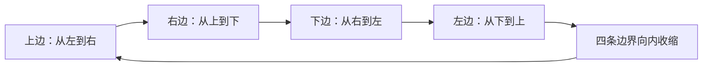

图中的一轮恰好输出当前最外层。边界收缩后，下一轮处理的是尚未访问的、更小的矩形。

### 方案一：访问标记 + 方向数组

#### 思路

从左上角 `(0, 0)` 出发，依次尝试右、下、左、上四个方向。`visited[row][col]` 表示该位置是否已经加入答案。

每走到一个位置就标记为已访问。若下一个位置越界或已经访问，方向顺时针转一次，再走。因为矩阵是连通的矩形，且每次只在即将撞到已访问区域时转向，所以一次转向就能找到下一个未访问位置；所有元素都输出后循环结束。

```cpp
class Solution {
public:
    vector<int> spiralOrder(vector<vector<int>>& matrix) {
        // 兼容工程接口中的空矩阵；本题约束下该分支不会触发。
        if (matrix.empty() || matrix[0].empty()) {
            return {};
        }

        // 缓存矩阵行数，后续用于边界判断和答案容量预留。
        const int rows = static_cast<int>(matrix.size());
        // 缓存矩阵列数。
        const int cols = static_cast<int>(matrix[0].size());
        // 记录每个位置是否已输出，防止绕圈时重复访问。
        vector<vector<bool>> visited(rows, vector<bool>(cols, false));
        // 保存螺旋顺序。
        vector<int> answer;
        // 每个矩阵元素都会恰好加入一次，预留容量避免扩容。
        answer.reserve(rows * cols);
        // 定义右、下、左、上四个方向的行增量。
        const int row_delta[4] = {0, 1, 0, -1};
        // 定义右、下、左、上四个方向的列增量。
        const int col_delta[4] = {1, 0, -1, 0};
        // 从向右移动开始。
        int direction = 0;
        // 从左上角开始访问。
        int row = 0;
        // 从左上角开始访问。
        int col = 0;

        // 固定执行 rows * cols 次，保证每个位置只输出一次。
        for (int count = 0; count < rows * cols; ++count) {
            // 输出当前尚未访问的位置。
            answer.push_back(matrix[row][col]);
            // 立即标记当前格子，供下一次转向判断使用。
            visited[row][col] = true;

            // 按当前方向计算候选的下一格。
            int next_row = row + row_delta[direction];
            // 按当前方向计算候选的下一格。
            int next_col = col + col_delta[direction];

            // 越界或碰到已访问格子时，说明当前方向已经走到尽头。
            if (next_row < 0 || next_row >= rows || next_col < 0 || next_col >= cols ||
                visited[next_row][next_col]) {
                // 顺时针切换到下一个方向。
                direction = (direction + 1) % 4;
                // 根据新方向重新计算下一行。
                next_row = row + row_delta[direction];
                // 根据新方向重新计算下一列。
                next_col = col + col_delta[direction];
            }

            // 将游标移动到下一次循环要输出的位置。
            row = next_row;
            // 将游标移动到下一次循环要输出的位置。
            col = next_col;
        }

        // 返回已经按螺旋顺序收集的结果。
        return answer;
    }
};
```

#### 不变量与正确性

在第 `count` 次循环开始时，`answer` 恰好保存了前 `count` 个螺旋位置，`visited` 恰好标记了这些位置，而 `(row, col)` 是第 `count` 个待输出位置。当前格子输出并标记后，算法优先沿原方向前进；原方向不可行时顺时针转向，因此始终遵循螺旋的转向规则。

循环次数固定为 `m * n`，每次恰好输出一个此前未访问的格子，所以最终每个元素恰好出现一次。时间复杂度为 `O(mn)`；`visited` 占用 `O(mn)` 额外空间。

#### 边界与细节

**为什么最后一次循环也会计算下一格？**

最后一个元素输出后，下一格可能无效，但循环已经结束，不会再读取这个坐标，因此不会影响答案。若希望避免这一次无意义计算，也可以在最后一次输出后提前 `break`；两种写法正确性相同。

**为什么只转一次方向就够？**

在尚有未访问元素时，当前路径的下一个合法螺旋位置一定位于顺时针的下一个方向；不会需要连续转两次。全部访问完毕时，即使计算出的下一位置无意义，循环也已结束。

### 方案二：四条边界按圈收缩（最优）

#### 思路

维护尚未访问矩形的闭区间边界：

- `top`：尚未访问区域的最上行；
- `bottom`：尚未访问区域的最下行；
- `left`：尚未访问区域的最左列；
- `right`：尚未访问区域的最右列。

每一轮依次走完上、右、下、左四条边。走完一条边后，立刻把对应边界向内收缩：上边走完 `++top`，右边走完 `--right`，下边走完 `--bottom`，左边走完 `++left`。这样，下一条边只会访问还未输出的区域，无需 `visited` 数组。

```cpp
class Solution {
public:
    vector<int> spiralOrder(vector<vector<int>>& matrix) {
        // 兼容空矩阵，避免访问 matrix[0] 越界。
        if (matrix.empty() || matrix[0].empty()) {
            return {};
        }

        // 记录矩阵行数。
        const int rows = static_cast<int>(matrix.size());
        // 记录矩阵列数。
        const int cols = static_cast<int>(matrix[0].size());
        // 初始化尚未访问区域的上边界。
        int top = 0;
        // 初始化尚未访问区域的下边界。
        int bottom = rows - 1;
        // 初始化尚未访问区域的左边界。
        int left = 0;
        // 初始化尚未访问区域的右边界。
        int right = cols - 1;
        // 保存按螺旋顺序输出的元素。
        vector<int> answer;
        // 输出数组大小已知，提前分配足够容量。
        answer.reserve(rows * cols);

        // 只要未访问区域仍是一个有效矩形，就继续剥离最外层。
        while (top <= bottom && left <= right) {
            // 沿上边从左到右输出，并包含两个上侧拐角。
            for (int col = left; col <= right; ++col) {
                answer.push_back(matrix[top][col]);
            }
            // 上边已经完全访问，下一轮从更下一行开始。
            ++top;

            // 沿右边从上到下输出；top 已增加，因此不会重复右上角。
            for (int row = top; row <= bottom; ++row) {
                answer.push_back(matrix[row][right]);
            }
            // 右边已经完全访问，下一轮从更左一列开始。
            --right;

            // 只在仍有未访问行、列时走下边，避免单行时重复输出。
            if (top <= bottom && left <= right) {
                // 沿下边从右到左输出；right 已减少，因此不会重复右下角。
                for (int col = right; col >= left; --col) {
                    answer.push_back(matrix[bottom][col]);
                }
                // 下边已经完全访问，下一轮从更上一行结束。
                --bottom;
            }

            // 只在仍有未访问行、列时走左边，避免单列时重复输出。
            if (top <= bottom && left <= right) {
                // 沿左边从下到上输出；bottom 已减少，因此不会重复左下角。
                for (int row = bottom; row >= top; --row) {
                    answer.push_back(matrix[row][left]);
                }
                // 左边已经完全访问，下一轮从更右一列开始。
                ++left;
            }
        }

        // 四条边界收缩完毕后，答案已包含全部元素。
        return answer;
    }
};
```

#### 不变量与正确性

每次进入 `while` 时，闭区间 `[top, bottom] x [left, right]` 恰好是所有尚未输出的元素；边界之外的元素都已按正确螺旋顺序加入 `answer`。

本轮中：

1. 上边使用 `[left, right]`，然后 `top` 加一；
2. 右边从新的 `top` 开始，因此不重复右上角，再令 `right` 减一；
3. 若仍有有效区域，下边从新的 `right` 开始，因此不重复右下角，再令 `bottom` 减一；
4. 若仍有有效区域，左边从新的 `bottom` 开始，因此不重复左下角，再令 `left` 加一。

四条边覆盖当前外层且不重叠，收缩后不变量继续成立。每个元素恰好被加入一次，时间复杂度为 `O(mn)`。除返回的 `answer` 外只使用四个整型边界，额外空间为 `O(1)`；返回数组本身通常不计入额外空间。

#### 边界与细节

**边界使用闭区间，所以循环条件是 `<=`。**

`top == bottom` 时仍剩一整行，`left == right` 时仍剩一整列，都必须继续处理；写成 `<` 会漏掉最后一行或最后一列。

**为什么下边和左边前要再次判断？**

上边或右边走完后，剩余区域可能已经为空。以单行矩阵为例，上边走完后 `top > bottom`；若仍执行“从右到左”的下边遍历，就会把同一行重复加入答案。单列矩阵也会有同类问题。

**为什么反向循环可以写 `col >= left`、`row >= top`？**

这里的下标类型是有符号的 `int`，当循环变量减到边界之外时条件自然失败。若改用无符号 `size_t`，减到 `0` 后会下溢成极大值，不能直接照抄这种反向循环。

### 方案选择与 Trade-off

| 方案 | 时间复杂度 | 辅助空间 | 是否修改原矩阵 | 主要优势 | 主要代价 |
| --- | --- | --- | --- | --- | --- |
| 访问标记 + 方向数组 | `O(mn)` | `O(mn)` | 否 | 与“人沿着路径走”的直觉一致，转向规则清晰 | 需要访问数组和越界判断，空间较大 |
| 四条边界按圈收缩 | `O(mn)` | `O(1)` | 否 | 不需要标记数组，是本题推荐的最优解 | 下、左两条边的判断与边界收缩顺序容易写错 |

### 面试手撕检查清单

1. 先说清楚螺旋遍历是在不断处理未访问矩形的外圈。
2. 方向模拟版：当前格子先输出并标记；下一格越界或已访问时顺时针转向。
3. 边界版维护的是闭区间 `[top, bottom] x [left, right]`，所以总循环条件使用 `<=`。
4. 每走完一条边立刻收缩对应边界，后续边从收缩后的边界开始，避免重复四个拐角。
5. 下边、左边前必须确认 `top <= bottom && left <= right`，特别检查单行和单列。
6. 返回数组是题目要求的输出；分析最优解辅助空间时，不把它计入额外空间。

这题的价值不在于记住四段 `for` 循环，而在于建立“**边界代表尚未处理区域**”这一不变量。之后遇到按层遍历、顺时针填充矩阵、逆时针遍历等题，都可以先写出边界含义，再根据方向调整循环与收缩顺序。


## 3. 旋转图像

- 题目链接：[48. 旋转图像](https://leetcode.cn/problems/rotate-image/description/)
- 难度：中等
- 核心分类：矩阵坐标变换、原地置换

### 题目

给定一个 `n x n` 的二维矩阵 `matrix` 表示一幅图像，请将图像顺时针旋转 `90` 度。必须**原地**修改输入矩阵，不能使用另一个矩阵来完成旋转。

**示例 1：** 输入 `matrix = [[1,2,3],[4,5,6],[7,8,9]]`，输出 `[[7,4,1],[8,5,2],[9,6,3]]`。

**示例 2：** 输入 `matrix = [[5,1,9,11],[2,4,8,10],[13,3,6,7],[15,14,12,16]]`，输出 `[[15,13,2,5],[14,3,4,1],[12,6,8,9],[16,7,10,11]]`。

**约束：**

- `n == matrix.length == matrix[i].length`
- `1 <= n <= 20`
- `-1000 <= matrix[i][j] <= 1000`

### 读题：哪些特征指向“坐标置换”

矩阵是正方形，旋转后仍然是同样大小的矩阵。每个元素只改变位置，不改变值，因此可以先问：**原位置 `(row, col)` 的元素，旋转后应该去哪个坐标？**

顺时针旋转后，原矩阵第一列变成新矩阵第一行的反向排列。推广到任意位置，坐标变换为：

$$
(row, col) \longrightarrow (col, n - 1 - row)
$$

这给出直接映射，但如果按原位置逐个写到新位置，原矩阵中后续还没读取的值可能被覆盖。因此，解题的关键分两步：先用新矩阵直观表达映射，再找不借助新矩阵的原地变换。

| 题目特征 | 对应思考 |
| --- | --- |
| 每个元素只改变坐标 | 先写出源坐标到目标坐标的映射公式 |
| 目标坐标依赖原行、原列 | 观察映射能否拆成两个简单变换 |
| 要求原地且不能使用另一矩阵 | 利用交换或循环置换，避免覆盖未处理元素 |
| 矩阵是正方形 | 转置后仍是同形矩阵，便于组合翻转操作 |

### 从坐标映射到两个原地变换

直接的顺时针坐标公式可以拆成两步：先沿主对角线转置，再将每一行左右翻转。

原位置先转置：

$$
(row, col) \longrightarrow (col, row)
$$

再对新矩阵每行左右翻转：

$$
(col, row) \longrightarrow (col, n - 1 - row)
$$

合起来正好是顺时针旋转的目标坐标。下面先看新矩阵映射如何帮助确认方向，再比较两种常数额外空间的实现。


转置把行列互换，左右翻转把列坐标 `col` 替换为 `n - 1 - col`；套用到转置后的坐标，最终得到原坐标映射 `(row, col) -> (col, n - 1 - row)`。

### 方案一：新矩阵按坐标公式搬运

#### 思路

依据 `(row, col) -> (col, n - 1 - row)`，把每个原元素写到新矩阵对应位置。写回前，源矩阵一直不变，所以不存在读写覆盖问题。这是最直观的正确性基线，也能用来检查旋转方向。

但它使用 `O(n²)` 额外空间，违反本题“不使用另一个矩阵”的要求，不能作为最终提交解。它的价值在于先把坐标规则推导清楚，再由后续版本消除额外矩阵。

```cpp
class Solution {
public:
    void rotate(vector<vector<int>>& matrix) {
        // 记录正方形矩阵的边长。
        const int size = static_cast<int>(matrix.size());
        // 创建目标矩阵，先用 0 填满全部位置。
        vector<vector<int>> rotated(size, vector<int>(size, 0));

        // 遍历原矩阵中的每个源位置。
        for (int row = 0; row < size; ++row) {
            for (int col = 0; col < size; ++col) {
                // 按顺时针坐标映射，把原元素写入目标矩阵。
                rotated[col][size - 1 - row] = matrix[row][col];
            }
        }

        // 将完整旋转结果复制回输入矩阵。
        matrix = rotated;
    }
};
```

#### 不变量与正确性

遍历到 `(row, col)` 时，`matrix` 保持原样，`rotated` 中已经写入的每个元素都遵循旋转坐标公式。坐标变换是双射：每个源位置对应唯一目标位置，每个目标位置也恰好有一个源位置，因此不会遗漏或覆盖目标值。

时间复杂度为 `O(n²)`，额外空间为 `O(n²)`。由于题目明确禁止辅助矩阵，此版本只作为推导和对照，不满足最终约束。

### 方案二：主对角线转置 + 每行翻转（推荐）

#### 思路

把旋转拆成两个可原地完成的操作：

1. 沿主对角线转置：交换 `matrix[row][col]` 与 `matrix[col][row]`；
2. 每一行左右翻转：交换该行对称位置。

转置时，只需处理主对角线一侧的元素。若遍历整个矩阵，会先交换 `(row, col)` 与 `(col, row)`，随后再次访问对称位置，又把它们交换回来。因此令 `col` 从 `row + 1` 开始，保证每对只交换一次；对角线元素无需移动。

```cpp
class Solution {
public:
    void rotate(vector<vector<int>>& matrix) {
        // 记录正方形矩阵的边长。
        const int size = static_cast<int>(matrix.size());

        // 第一步：只遍历主对角线右上方，避免每对元素被交换两次。
        for (int row = 0; row < size; ++row) {
            for (int col = row + 1; col < size; ++col) {
                // 对称交换 (row, col) 与 (col, row)，完成主对角线转置。
                swap(matrix[row][col], matrix[col][row]);
            }
        }

        // 第二步：逐行做左右翻转，把转置结果变成顺时针旋转结果。
        for (int row = 0; row < size; ++row) {
            // reverse 原地反转当前行，不需要另建行副本。
            reverse(matrix[row].begin(), matrix[row].end());
        }
    }
};
```

#### 不变量与正确性

转置阶段处理完第 `row` 行后，所有已处理的非对角线对都满足 `matrix[row][col]` 与原矩阵的转置对应关系；只遍历 `col > row`，所以每一对 `(row, col)`、`(col, row)` 恰好交换一次。

转置完成后，原元素 `(row, col)` 位于 `(col, row)`。对新矩阵的每一行左右翻转后，该元素从 `(col, row)` 到达 `(col, n - 1 - row)`，正是顺时针旋转的目标位置。两步均在原矩阵内交换，除常数个变量外不需要额外空间。

时间复杂度为 `O(n²)`，额外空间为 `O(1)`。这是最容易记忆和手撕的原地版本。

#### 边界与细节

**为什么转置循环从 `row + 1` 开始？**

主对角线元素 `(row, row)` 与自身对称，不需要交换；左下三角与右上三角互为镜像。只遍历一侧，才能让每个对称元素对恰好交换一次。

**为什么是先转置再左右翻转？**

按坐标推导，先得到 `(col, row)`，再把列坐标翻成 `n - 1 - row`，才能得到顺时针目标 `(col, n - 1 - row)`。若改成上下翻转加转置，也可以实现旋转，但应重新确认操作顺序和方向。

**`n == 1` 时会怎样？**

转置循环和行翻转都不会改变唯一元素，结果仍是原矩阵，符合旋转后的结果。

### 方案三：逐层四元轮换

#### 思路

旋转也可以直接看成四个位置组成一个循环：

$$
\text{左} \rightarrow \text{上},\quad
\text{下} \rightarrow \text{左},\quad
\text{右} \rightarrow \text{下},\quad
\text{上} \rightarrow \text{右}
$$

先看最外层，再逐渐向中心处理。对某一层，`first` 和 `last` 是这一圈正方形的上、下边界；令 `index` 沿上边从 `first` 走到 `last - 1`，每次计算相对偏移 `offset`，将四条边对应位置轮换。

四个位置为：

- 上：`(first, index)`
- 右：`(index, last)`
- 下：`(last, last - offset)`
- 左：`(last - offset, first)`

使用一个临时变量保存上边元素，然后按“左到上、下到左、右到下、原上到右”的顺序覆盖，就完成这一组四元轮换。

```cpp
class Solution {
public:
    void rotate(vector<vector<int>>& matrix) {
        // 记录正方形矩阵的边长。
        const int size = static_cast<int>(matrix.size());

        // 每一层向内推进一格；中心元素若单独存在，不需要移动。
        for (int layer = 0; layer < size / 2; ++layer) {
            // 当前层的上边界和左边界相同。
            const int first = layer;
            // 当前层的下边界和右边界相同。
            const int last = size - 1 - layer;

            // 沿当前层的上边逐组轮换，右上角留给本层第一组处理。
            for (int index = first; index < last; ++index) {
                // 计算当前元素距本层左上角的偏移量。
                const int offset = index - first;
                // 暂存上边元素，避免后续覆盖后丢失。
                const int top_value = matrix[first][index];

                // 左边元素顺时针移动到上边。
                matrix[first][index] = matrix[last - offset][first];
                // 下边元素顺时针移动到左边。
                matrix[last - offset][first] = matrix[last][last - offset];
                // 右边元素顺时针移动到下边。
                matrix[last][last - offset] = matrix[index][last];
                // 暂存的上边元素顺时针移动到右边，完成四位置循环。
                matrix[index][last] = top_value;
            }
        }
    }
};
```

#### 不变量与正确性

每次内层循环开始时，当前四个坐标分别处于本层的上、右、下、左边，`offset` 保证它们沿边对齐。临时变量保存上边原值，其余赋值按顺时针循环方向依次搬运，因此这一组四个值恰好各移动一次，且没有值丢失。

每层处理完后，该层所有位置都完成旋转；下一层只处理更内侧、尚未处理的位置。层数为 `floor(n / 2)`，最中间的单个格子在奇数阶矩阵中不需要移动。总计处理 `O(n²)` 个位置，时间复杂度为 `O(n²)`，额外空间为 `O(1)`。

#### 边界与细节

**为什么外层是 `layer < size / 2`？**

每次旋转需要四条边上的四个位置。奇数阶矩阵的中心只有一个格子，不存在另外三个位置与它轮换；偶数阶矩阵则有 `size / 2` 层。因此整数除法 `size / 2` 正好给出需要处理的层数。

**为什么内层是 `index < last`，不包含 `last`？**

`index == last` 对应本层右上角。若纳入循环，会把右上角作为上边起点再处理一次，形成重复轮换。每一组四元轮换覆盖本层上边的一个位置，循环范围是半开区间 `[first, last)`。

**为什么需要 `offset`？**

当上边位置从左向右移动时，对应的左、下、右位置也要沿各自边移动相同距离。`offset = index - first` 把当前位置与本层左上角的相对距离传递给另外三条边。

### 方案选择与 Trade-off

| 方案 | 时间复杂度 | 辅助空间 | 满足原地要求 | 主要优势 | 主要代价 |
| --- | --- | --- | --- | --- | --- |
| 新矩阵按坐标搬运 | `O(n²)` | `O(n²)` | 否 | 坐标映射直接，最适合作为推导基线 | 违反题目限制，不能作为提交解 |
| 转置 + 每行翻转 | `O(n²)` | `O(1)` | 是 | 操作简单，映射证明清楚，最容易记忆 | 需要记准两步顺序与转置边界 |
| 逐层四元轮换 | `O(n²)` | `O(1)` | 是 | 直接体现原地置换，不依赖库函数 `reverse` | 四个坐标和赋值顺序更容易写错 |

### 面试手撕检查清单

1. 先写出顺时针映射：`(row, col) -> (col, n - 1 - row)`，用左上角或第一列检查方向。
2. 最容易手撕的原地方案是主对角线转置，再逐行左右翻转。
3. 转置只遍历 `col > row`，避免对称位置交换两次。
4. 若用分层轮换，层数是 `n / 2`，上边循环为 `[first, last)`，中心元素不处理。
5. 四元交换先保存一个旧值，再沿同一方向移动其余三个位置，最后放回暂存值。
6. 复杂度要区分辅助矩阵方案 `O(n²)` 空间与原地方案 `O(1)` 额外空间；返回的矩阵就是输入本身。

这题可以用坐标公式验证实现，也可以用“转置 + 翻转”构造实现。面试中先推公式，再选自己最稳的原地分解；如果面试官追问，也能进一步给出逐层四元轮换，说明原地置换如何避免覆盖尚未处理的数据。

## 4. 搜索二维矩阵 II

- 题目链接：[240. 搜索二维矩阵 II](https://leetcode.cn/problems/search-a-2d-matrix-ii/description/)
- 难度：中等
- 核心分类：有序矩阵、二分查找、阶梯式搜索

### 题目

编写一个高效算法，在 `m x n` 的矩阵 `matrix` 中查找目标值 `target`。矩阵满足：

- 每一行从左到右按升序排列；
- 每一列从上到下按升序排列。

找到 `target` 返回 `true`，否则返回 `false`。

**示例 1：**

```text
输入：matrix = [[1,4,7,11,15],
               [2,5,8,12,19],
               [3,6,9,16,22],
               [10,13,14,17,24],
               [18,21,23,26,30]], target = 5
输出：true
```

**示例 2：**

```text
输入：matrix = [[1,4,7,11,15],
               [2,5,8,12,19],
               [3,6,9,16,22],
               [10,13,14,17,24],
               [18,21,23,26,30]], target = 20
输出：false
```

**约束：**

- `m == matrix.length`，`n == matrix[i].length`
- `1 <= m, n <= 300`
- `-10⁹ <= matrix[i][j], target <= 10⁹`
- 每行从左到右升序，每列从上到下升序

### 读题：哪些特征指向“排除整行或整列”

一行有序，首先能想到**逐行二分**；一列也有序，则提示我们能否把两个方向同时用上。看右上角元素：它是当前行的最大值，也是当前列的最小值，因此与 `target` 比较后，恰好可以安全排除一整行或一整列。

| 题目特征 | 对应思考 |
| --- | --- |
| 每一行有序 | 可以在每行使用二分查找 |
| 每一列也有序 | 比较右上角后，可以排除当前整行或整列 |
| 行与行的数值范围可能重叠 | 不能把矩阵按行展开后直接做一次二分 |
| 只需判断是否存在 | 找到即可返回，不需要记录全部匹配位置 |

这里与“搜索二维矩阵 I”不同：后一行的第一个数不一定大于前一行的最后一个数。例如本题示例的第一行以 `15` 结尾，第二行却以 `2` 开头。**整体不是一条有序的一维数组**。

### 从逐格扫描到阶梯式搜索

- **暴力扫描：** 检查每个格子，完全不利用有序性。
- **逐行二分：** 利用行有序，把一行的查找从 `O(n)` 降到 `O(log n)`。
- **右上角出发：** 同时利用行、列有序；每次比较都排除当前候选区域的一整行或一整列。

### 方案一：逐格扫描

#### 思路

依次查看矩阵中的每个元素，只要发现 `target` 就返回 `true`；全部扫完仍未找到时返回 `false`。这是最简单的正确性基线。

```cpp
class Solution {
public:
    bool searchMatrix(vector<vector<int>>& matrix, int target) {
        // 逐行读取矩阵，不修改输入。
        for (const vector<int>& values : matrix) {
            // 检查当前行的每个元素。
            for (int value : values) {
                // 一旦找到目标，就无需继续扫描。
                if (value == target) {
                    return true;
                }
            }
        }

        // 所有位置都检查过仍未命中，说明目标不存在。
        return false;
    }
};
```

#### 不变量与正确性

每次检查新格子之前，之前检查过的格子都不等于 `target`。遇到相等值时直接返回；如果遍历结束仍未找到，则矩阵中不存在目标值。

最坏时间复杂度为 `O(mn)`，额外空间为 `O(1)`。它适合作为保底解，但没有利用题目提供的两维有序性。

### 方案二：逐行二分查找

#### 思路

每一行本身有序，因此可以逐行使用二分查找。行首是当前行最小值，行尾是最大值：若 `target` 大于行尾，跳过这一行；若 `target` 小于行首，由于**第一列也从上到下有序**，后面的行首只会更大，可直接返回 `false`。

进入二分后，维护半开区间 `[left, right)`，寻找当前行中第一个不小于 `target` 的位置。最终检查该位置是否恰好等于 `target`。

```cpp
class Solution {
public:
    bool searchMatrix(vector<vector<int>>& matrix, int target) {
        // 兼容空矩阵，避免访问 matrix[0]。
        if (matrix.empty() || matrix[0].empty()) {
            return false;
        }

        // 缓存行数，用于逐行检查。
        const int rows = static_cast<int>(matrix.size());
        // 缓存列数，用作二分查找的右边界。
        const int cols = static_cast<int>(matrix[0].size());

        // 每一行独立进行二分查找。
        for (int row = 0; row < rows; ++row) {
            // 当前行最小值已大于 target；后续各行的首元素只会更大。
            if (matrix[row][0] > target) {
                return false;
            }
            // 当前行最大值仍小于 target，整行都不可能命中。
            if (matrix[row][cols - 1] < target) {
                continue;
            }

            // 在半开区间 [left, right) 中查找第一个 >= target 的位置。
            int left = 0;
            int right = cols;
            while (left < right) {
                // 用差值计算中点，避免 left + right 潜在溢出。
                const int mid = left + (right - left) / 2;
                if (matrix[row][mid] < target) {
                    // mid 及其左侧都小于 target，继续查右半段。
                    left = mid + 1;
                } else {
                    // mid 可能就是答案，保留它并缩小右边界。
                    right = mid;
                }
            }

            // 若第一个 >= target 的元素恰好等于 target，即已找到。
            if (left < cols && matrix[row][left] == target) {
                return true;
            }
        }

        // 所有可能包含 target 的行都已检查。
        return false;
    }
};
```

#### 不变量与正确性

二分过程中，当前行中下标小于 `left` 的元素都小于 `target`，下标不小于 `right` 的元素都不小于 `target`。循环结束时 `left == right`，它是当前行第一个不小于目标的位置；检查是否相等即可判断本行。

跳过行尾小于目标的行不会漏解；当行首已大于目标时，列有序保证后续行首也大于目标，提前结束同样安全。

最坏时间复杂度为 `O(m log n)`，额外空间为 `O(1)`。当矩阵只有很少的行、却有很多列时，逐行二分可能比从右上角逐格移动更省比较次数。

#### 边界与细节

**为什么 `right` 初始化为 `cols`？**

半开区间的右边界不属于有效下标，`[0, cols)` 刚好覆盖整行。循环条件是 `left < right`；每一步都会缩小区间，最后 `left == right`。

**为什么还要检查 `left < cols`？**

一般的二分模板中，若本行所有值都小于 `target`，查找结果会是 `cols`，不能直接下标访问。本实现先用行尾范围判断排除了这种情况，但保留检查能让二分代码独立、安全。

### 方案三：右上角阶梯式搜索（推荐）

#### 思路

从矩阵右上角开始，维护“目标如果存在，只可能在尚未排除的矩形中”这一条件。初始候选区域是整张矩阵；每一步的候选行是半开区间 `[row, rows)`，候选列是闭区间 `[0, col]`，所以剩余区域为 `[row, rows) × [0, col]`。

当前 `matrix[row][col]` 位于候选区域**最上行的最右端**：

- 如果当前值 **大于** `target`，由于该列从上到下有序，当前列从此行向下的值都不小于当前值；整列可以排除，令 `--col`。
- 如果当前值 **小于** `target`，由于该行从左到右有序，当前行从左侧到此列的值都不大于当前值；整行可以排除，令 `++row`。
- 如果相等，立即返回 `true`。

用示例 1 查找 `5`，比较路径很短：

| 当前坐标和值 | 与 `5` 比较 | 安全排除 |
| --- | --- | --- |
| `(0, 4) = 15` | 大于 | 第 `4` 列 |
| `(0, 3) = 11` | 大于 | 第 `3` 列 |
| `(0, 2) = 7` | 大于 | 第 `2` 列 |
| `(0, 1) = 4` | 小于 | 第 `0` 行 |
| `(1, 1) = 5` | 相等 | 找到目标 |

每次移动后，剩余候选区域仍是一个矩形；右上角始终同时提供“这一行的最大值”和“这一列的最小值”，所以能继续排除整行或整列。

```cpp
class Solution {
public:
    bool searchMatrix(vector<vector<int>>& matrix, int target) {
        // 兼容空矩阵，避免访问 matrix[0]。
        if (matrix.empty() || matrix[0].empty()) {
            return false;
        }

        // 缓存行数，作为向下移动的边界。
        const int rows = static_cast<int>(matrix.size());
        // 缓存列数，用来定位初始右上角。
        const int cols = static_cast<int>(matrix[0].size());
        // 从候选区域的最上行出发。
        int row = 0;
        // 从候选区域的最右列出发。
        int col = cols - 1;

        // 候选区域还有行、列时，继续排除。
        while (row < rows && col >= 0) {
            // 当前值位于候选区域的右上角。
            const int current = matrix[row][col];
            // 命中目标即可结束。
            if (current == target) {
                return true;
            }

            if (current > target) {
                // 当前列从此行向下的值都不小于 current，整列不可能命中。
                --col;
            } else {
                // 当前行从左侧到此列的值都不大于 current，整行不可能命中。
                ++row;
            }
        }

        // 候选区域已经缩成空集，目标不存在。
        return false;
    }
};
```

#### 不变量与正确性

每次进入 `while` 时，如果 `target` 在矩阵中，那么它一定还在候选区域 `[row, rows) × [0, col]` 中。

- 当 `current > target` 时，候选区域的当前列从上到下都不小于 `current`，所以删去该列不会删掉目标。
- 当 `current < target` 时，候选区域的当前行从左到右都不大于 `current`，所以删去该行不会删掉目标。

因此不变量始终成立。若遇到相等则找到目标；若 `row == rows` 或 `col == -1`，候选区域已空，而目标仍不可能在被排除部分，故返回 `false`。

每次循环使 `row` 增一或 `col` 减一，两者均不会回退。最多做 `m + n - 1` 次比较，时间复杂度为 `O(m + n)`；只使用两个游标和常数个变量，额外空间为 `O(1)`。

#### 边界与细节

**为什么从右上角出发？**

在这里，`current` 同时是当前行的最大值、当前列的最小值。比较大小后，要么能排除一整行，要么能排除一整列。左下角也有对称性质，可以从那里出发；左上角或右下角通常无法仅凭一次比较确定该向哪边走。

**循环条件为什么是 `row < rows && col >= 0`？**

`row == rows` 表示所有候选行都已排除，`col == -1` 表示所有候选列都已排除。`col` 用有符号的 `int`，才能安全地从 `0` 减到 `-1` 并终止；若直接用无符号下标，会发生下溢。

**单行、单列以及重复值怎么办？**

单行时可能一直向左，单列时可能一直向下，都符合边界条件。即使存在重复值，行列的有序关系仍成立；相等时直接返回，严格大于或小于时排除的区域仍不可能含目标。

### 方案选择与 Trade-off

| 方案 | 时间复杂度 | 辅助空间 | 主要优势 | 主要代价 |
| --- | --- | --- | --- | --- |
| 逐格扫描 | `O(mn)` | `O(1)` | 保底解，最直接 | 完全没有利用有序性 |
| 逐行二分 | `O(m log n)` | `O(1)` | 适合行数少、列数多的矩阵；二分模板易复用 | 仍需逐行检查，最坏做 `m` 次二分 |
| 右上角阶梯式搜索 | `O(m + n)` | `O(1)` | 同时利用行、列有序，移动规则简单 | 必须证明排除的是整行还是整列 |

### 面试手撕检查清单

1. 先辨认“行有序 + 列有序，但整体按行展开不一定有序”，不要直接套一维二分。
2. 逐行二分使用半开区间 `[left, right)`；`right` 初始化为 `cols`，循环用 `left < right`。
3. 右上角版本的候选区域是 `[row, rows) × [0, col]`，每步都让它缩小。
4. `current > target` 时删当前列并左移；`current < target` 时删当前行并下移。
5. 列游标使用有符号整数；当 `col == -1` 时循环停止，不访问越界下标。
6. 单行、单列、重复值及目标不存在的情况都能由同一循环处理。

这类题的关键是寻找一个“比较后能确定排除方向”的位置。二维矩阵的右上角和左下角兼具行、列两种单调性；把剩余候选区域的不变量说清楚，移动方向就不必死记。


# 链表

## 1. 相交链表

- 题目链接：[160. 相交链表](https://leetcode.cn/problems/intersection-of-two-linked-lists/description/)
- 难度：简单
- 核心分类：链表、节点身份、双指针

### 题目

给定两个单链表的头节点 `headA` 和 `headB`，找出并返回两个链表**相交的起始节点**；如果不相交，返回 `nullptr`。题目保证整个链式结构中不存在环。函数返回后，两个链表必须保持原始结构。

这里的“相交”指两个指针指向**同一个节点对象**，不是两个节点的 `val` 相等。由于单链表的每个节点只有一个 `next`，两条无环链表一旦汇合，后续节点必然全部共用。

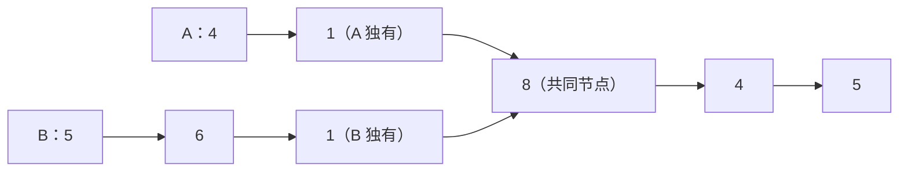

图中的两个值为 `1` 的节点只是数值相同；两条链表第一次指向同一个节点是在值为 `8` 的位置。此后的 `4` 和 `5` 也是同一批节点。

**示例 1：**

```text
输入：intersectVal = 8
     listA = [4,1,8,4,5], listB = [5,6,1,8,4,5]
     skipA = 2, skipB = 3
输出：值为 8 的相交节点
```

**示例 2：**

```text
输入：intersectVal = 2
     listA = [1,9,1,2,4], listB = [3,2,4]
     skipA = 3, skipB = 1
输出：值为 2 的相交节点
```

**示例 3：**

```text
输入：intersectVal = 0
     listA = [2,6,4], listB = [1,5]
     skipA = 3, skipB = 2
输出：无交点，返回 nullptr
```

`intersectVal`、`listA`、`listB`、`skipA` 和 `skipB` 是评测器构造测试链表时使用的信息；待实现的函数只接收 `headA`、`headB` 两个头指针。`skipA` 与 `skipB` 分别表示从各自头节点到交点之前有多少个节点。

**约束：**

- 链表 A 的节点数为 `m`，链表 B 的节点数为 `n`，`1 <= m, n <= 3 × 10⁴`
- `1 <= Node.val <= 10⁵`，`0 <= skipA <= m`，`0 <= skipB <= n`
- 无交点时 `intersectVal = 0`；有交点时，评测器保证指定位置引用同一个节点
- 两条链表都无环，且不能通过改写 `next` 改变原始结构
- 进阶：时间 `O(m + n)`、额外空间 `O(1)`

### 读题：哪些特征指向“节点身份 + 路径对齐”

| 题目特征 | 对应思考 |
| --- | --- |
| 返回相交的“节点” | 比较指针是否相等，而不是比较节点值 |
| 单链表一旦相交就共享后缀 | 只需找到两条路径第一次重合的位置 |
| 两条链表长度可能不同 | 同步遍历前要消除长度差，或让两指针走过相同总路径 |
| 无环且结构不能改变 | 遍历必然终止；只能移动局部指针，不能接尾造环或修改 `next` |
| 进阶要求常数空间 | 哈希集合可以作为过渡，最终要用长度对齐或换头双指针 |

一个常见误判是 `node_a->val == node_b->val`：示例 1 中两个值为 `1` 的节点并不相交。判断条件必须是 `node_a == node_b`；这个比较检查的是**地址 / 节点身份**。

### 从双重遍历到路径对齐

最直接的方法是拿 A 的每个节点去 B 中寻找，代价是重复扫描。用哈希集合保存 A 的节点地址，可以让查找变快，但需要额外内存。若利用“相交后共享同一段尾巴”，便可以先对齐两条链表的**剩余长度**；另一种写法让两个指针交换链表起点，自然走出相同长度的路径。

### 方案一：双重遍历

#### 思路

从头到尾枚举 A 的每个节点，对每个节点再从头扫描 B。第一次发现指针相等时，当前 A 节点就是最早的交点。

```cpp
class Solution {
public:
    ListNode* getIntersectionNode(ListNode* headA, ListNode* headB) {
        // 按 A 链表的顺序枚举候选交点。
        for (ListNode* node_a = headA; node_a != nullptr; node_a = node_a->next) {
            // 在 B 中寻找与当前 A 节点身份相同的节点。
            for (ListNode* node_b = headB; node_b != nullptr; node_b = node_b->next) {
                // 比较指针本身；值相等不能说明链表相交。
                if (node_a == node_b) {
                    return node_a;
                }
            }
        }

        // A 的所有节点都不在 B 中，两条链表没有交点。
        return nullptr;
    }
};
```

#### 不变量与正确性

外层循环到 `node_a` 时，A 中更靠前的节点已经证实不在 B 中。内层若找到相同指针，`node_a` 便是 A 中第一个同时属于 B 的节点；若全部扫描完仍无命中，则没有共同节点。

最坏要比较 `m × n` 对节点，时间复杂度为 `O(mn)`，额外空间为 `O(1)`。在两条链表都接近 `3 × 10⁴` 个节点时，重复扫描代价很高。

### 方案二：哈希集合记录节点地址

#### 思路

先把 A 的每个**节点指针**放进 `unordered_set`，再从头扫描 B。B 中第一个已经出现于集合的节点，就是两条链表的起始交点。

```cpp
class Solution {
public:
    ListNode* getIntersectionNode(ListNode* headA, ListNode* headB) {
        // 保存 A 的节点地址；集合不拥有、也不释放这些节点。
        unordered_set<ListNode*> nodes_in_a;

        // 将 A 中每个节点的身份记录下来。
        for (ListNode* current = headA; current != nullptr; current = current->next) {
            nodes_in_a.insert(current);
        }

        // 按 B 的顺序查找第一个也属于 A 的节点。
        for (ListNode* current = headB; current != nullptr; current = current->next) {
            // 查找的是指针地址，不依赖节点的 val。
            if (nodes_in_a.find(current) != nodes_in_a.end()) {
                return current;
            }
        }

        // B 中没有任何节点出现在 A 的地址集合中。
        return nullptr;
    }
};
```

#### 不变量与正确性

建表结束后，集合恰好包含 A 的全部节点地址。扫描 B 时，已经检查过的节点都不在 A 中；遇到第一个命中节点就返回，所以返回的正是 B 的第一个共同节点，也就是相交起点。

哈希操作平均为常数时间，总时间平均 `O(m + n)`，额外空间 `O(m)`。理论最坏情况下哈希冲突可能使时间退化；面试中通常按平均复杂度比较。此解容易写对，但不满足常数额外空间的进阶要求。

### 方案三：先算长度，再对齐双指针

#### 思路

设 A 独有前缀长 `a`，B 独有前缀长 `b`，共同后缀长 `c`。于是 `m = a + c`、`n = b + c`，长度差 `m - n = a - b`。先让较长链表的指针走过差值，再让两个指针同步前进，它们距尾部始终一样远，因此会在第一个共同节点相遇；若不相交，则同时走到 `nullptr`。

```cpp
class Solution {
public:
    ListNode* getIntersectionNode(ListNode* headA, ListNode* headB) {
        // 计算 A 的长度，不修改节点连接。
        int length_a = 0;
        for (ListNode* current = headA; current != nullptr; current = current->next) {
            ++length_a;
        }

        // 计算 B 的长度，用来求两条路径的起点差。
        int length_b = 0;
        for (ListNode* current = headB; current != nullptr; current = current->next) {
            ++length_b;
        }

        // 两个游标分别从各自链表头部出发。
        ListNode* pointer_a = headA;
        ListNode* pointer_b = headB;

        if (length_a > length_b) {
            // 先跳过 A 多出来的前缀，让两指针剩余长度相同。
            for (int skipped = 0; skipped < length_a - length_b; ++skipped) {
                pointer_a = pointer_a->next;
            }
        } else {
            // B 不短于 A 时，跳过 B 多出来的前缀。
            for (int skipped = 0; skipped < length_b - length_a; ++skipped) {
                pointer_b = pointer_b->next;
            }
        }

        // 剩余长度相等；同步前进直到指向同一节点或同时为空。
        while (pointer_a != pointer_b) {
            pointer_a = pointer_a->next;
            pointer_b = pointer_b->next;
        }

        // 相交时是共同节点；不相交时两者都为 nullptr。
        return pointer_a;
    }
};
```

#### 不变量与正确性

完成前缀跳过后，`pointer_a` 和 `pointer_b` 到各自尾部的剩余节点数相等。之后每轮同时前进一步，这个剩余长度始终相等。若有共同后缀，两指针会在该后缀的首节点首次相等；若没有，它们会同时到达 `nullptr`。

计算长度、跳过多余前缀、同步扫描都是线性过程，总时间 `O(m + n)`，额外空间 `O(1)`。这版的“剩余长度相同”不变量直观，适合先给出一份容易证明的常数空间解。

#### 边界与细节

**为什么 `while` 中可以直接访问两个指针的 `next`？**

前缀对齐后，两者的剩余长度相等。若不相交，它们会在同一轮变成 `nullptr`，下一次循环条件失败；不会出现一个已空、另一个仍需解引用的情况。

**如果一条链表本身就是共同后缀呢？**

较长链表先跳过独有前缀，随后两个指针会立刻指向短链表的头节点，直接返回该节点。

### 方案四：换头双指针（推荐）

#### 思路

让 `pointer_a` 先走 A，再走 B；`pointer_b` 先走 B，再走 A。每次都只走一步。指针走到 `nullptr` 后，下一步才切换到另一条链表的头节点。

两条路径所含的独有前缀总长度都是 `a + b`：

| 指针 | 到交点之前走过的节点段 |
| --- | --- |
| `pointer_a` | A 独有的 `a` 个 → 共同后缀 `c` 个 → B 独有的 `b` 个 |
| `pointer_b` | B 独有的 `b` 个 → 共同后缀 `c` 个 → A 独有的 `a` 个 |

两者都经历一次 `nullptr` 换头过渡，步数差也相同。若独有前缀等长，两指针在第一次遍历就会于交点相遇；否则会在换头后相遇。若没有交点，各自走完 A、B 两条链表后会同时到达 `nullptr`。

以示例 1 为例，A 的独有前缀长 `a = 2`，B 的独有前缀长 `b = 3`，共同后缀长 `c = 3`。`pointer_a` 先走完 A 的 5 个节点，再走 B 的 3 个独有节点；`pointer_b` 先走完 B 的 6 个节点，再走 A 的 2 个独有节点。两边都经过 8 个节点，并各经历一次从 `nullptr` 换头的过渡，接着同时指向值为 `8` 的共同节点。

```cpp
class Solution {
public:
    ListNode* getIntersectionNode(ListNode* headA, ListNode* headB) {
        // 两个非拥有型游标分别从 A、B 的头节点出发。
        ListNode* pointer_a = headA;
        ListNode* pointer_b = headB;

        // 指针身份相同表示相交；同时为 nullptr 表示不相交。
        while (pointer_a != pointer_b) {
            // A 走完后切到 B；未走完则沿当前链表前进。
            pointer_a = pointer_a == nullptr ? headB : pointer_a->next;
            // B 走完后切到 A；未走完则沿当前链表前进。
            pointer_b = pointer_b == nullptr ? headA : pointer_b->next;
        }

        // 可能是首个共同节点，也可能是双方同时到达的 nullptr。
        return pointer_a;
    }
};
```

#### 不变量与正确性

每轮循环开始时，两个指针已经前进了相同步数；它们各自按 A→B、B→A 的顺序行走，且不改动任何 `next`。若独有前缀长分别为 `a`、`b`，共同后缀长为 `c`：当 `a == b` 时，它们在第一遍就会同时到达交点；当 `a != b` 时，换头后到交点之前分别经过 `a + c + b` 和 `b + c + a` 个链表节点，节点数相等，空指针过渡次数也相同，因此同时指向首个共同节点。

无交点时，两条路径都包含 A、B 的全部节点，也都经历一次空指针换头过渡，最后会同时指向 `nullptr`。题目保证无环，所以过程一定结束。每个指针最多遍历两条链表，时间 `O(m + n)`、额外空间 `O(1)`，也没有修改原始结构。

#### 边界与细节

**为什么在 `pointer_a == nullptr` 时换头，而不是在尾节点换头？**

尾节点仍是链表中的有效节点；标准写法先让它走到 `nullptr`，下一次更新再换头。两边的空指针过渡因此完全对称；若在尾节点提前换头，证明中的路径长度与代码执行步数就不再一致。

**为什么循环条件只比较指针？**

同一节点在两条链表中就是同一个地址。若 `headA == headB`，循环一次都不执行，直接返回共同头节点；若两条链表不相交，两个指针最终会同时等于 `nullptr`，也会正常退出。

**原结构如何保证不变？**

四种写法都只移动局部指针，哈希版也只是保存节点地址；没有改写 `next`、修改 `val`、分配或释放链表节点。返回的 `ListNode*` 是借用的节点指针，不负责其生命周期。

### 方案选择与 Trade-off

| 方案 | 时间复杂度 | 辅助空间 | 主要优势 | 主要代价 |
| --- | --- | --- | --- | --- |
| 双重遍历 | `O(mn)` | `O(1)` | 最直接，便于说明“节点身份” | 长链表上重复比较过多 |
| 哈希节点地址 | 平均 `O(m + n)` | `O(m)` | 思路清楚，容易手撕 | 不满足常数空间要求，存在哈希开销 |
| 长度对齐 | `O(m + n)` | `O(1)` | 不变量直观，便于证明 | 先要分别统计两条链表长度 |
| 换头双指针 | `O(m + n)` | `O(1)` | 代码简短，满足进阶要求 | 必须讲清 `nullptr` 换头与无交点终止条件 |

### 面试手撕检查清单

1. “相交”比较 `ListNode*` 是否相同，不能比较 `val`。
2. 单链表无环且每个节点只有一个 `next`，所以相交后必定共享整个后缀。
3. `intersectVal`、`skipA`、`skipB` 是评测器信息，函数实参只有 `headA` 和 `headB`。
4. 长度对齐版先让较长链表多走 `|m - n|` 步，再同步比较指针。
5. 换头版仅在指针已经为 `nullptr` 时切换到另一链表头，循环条件写 `pointer_a != pointer_b`。
6. 无交点时两个指针最终同为 `nullptr`；共有头节点时可立即返回；全程不修改链表。

这题的可迁移思路是：当两条链式路径拥有共同后缀时，可以用“剩余长度对齐”或“交换遍历顺序”消除起点距离差。遇到节点身份问题，先分清**地址相同**与**数值相同**，再选择时间和空间的取舍。

## 2. 反转链表

- 题目链接：[206. 反转链表](https://leetcode.cn/problems/reverse-linked-list/description/)
- 难度：简单
- 核心分类：链表指针操作、迭代、递归

### 题目

给定单链表的头节点 `head`，反转链表，并返回反转后链表的头节点。

**示例 1：** 输入 `head = [1,2,3,4,5]`，输出 `[5,4,3,2,1]`。

**示例 2：** 输入 `head = [1,2]`，输出 `[2,1]`。

**示例 3：** 输入 `head = []`，输出 `[]`。

**约束：**

- 链表节点数在 `[0, 5000]` 范围内
- `-5000 <= Node.val <= 5000`

**进阶：** 分别用迭代和递归两种方法完成反转。

### 读题：哪些特征指向“保存后继，再修改连接”

反转后，原来的尾节点成为新头，原来的头节点成为新尾。每个节点的 `val` 可以保持不变，真正需要改变的是 `next` 指向。

上一题只移动游标、不改变链表结构；本题需要主动修改节点之间的连接。要分清两种赋值：`current = next_node` 只移动局部游标，`current->next = previous` 则会改写节点中的指针字段。

| 题目特征 | 对应思考 |
| --- | --- |
| 单链表只能沿 `next` 向后走 | 改写 `next` 前必须保存原后继，否则可能找不到剩余节点 |
| 反转整个链表 | 可以维护已反转的前缀，每次把一个新节点接到它前面 |
| 允许空链表 | 循环与递归出口都要覆盖 `head == nullptr` |
| 要求返回反转后的链表 | C++ 接口返回新头指针，不需要复制或重新创建节点 |
| 进阶指定迭代与递归 | 既要会维护循环不变量，也要能说明递归返回后子链表的状态 |

下面三个版本都复用原有节点、保持节点值不变。LeetCode 已提供包含 `val`、`next` 的 `ListNode` 定义，提交时只需填写 `Solution`。

### 从保存全部节点到只保存局部状态

直观做法是先把节点地址收集到数组里，再按相反方向连接。这解决了“断开后找不到节点”的问题，但保存了整条链表。

继续观察：从左向右处理时，只需要知道**已反转链表的头、当前待处理节点、当前节点的原后继**，就能完成本轮接线。于是可以将额外空间从 `O(n)` 压到 `O(1)`。

递归提供另一种分解：先把 `head->next` 开始的后缀反转，再把当前 `head` 接到它的尾部。它也只写几行代码，但调用栈占用 `O(n)` 空间。

### 方案一：数组保存节点，再重新连接

#### 思路

先遍历链表，将每个 `ListNode*` 按原顺序存入数组。数组中的第 `i` 个节点应指向第 `i - 1` 个节点，原头节点的 `next` 应设为 `nullptr`，新头则是数组最后一个节点。

数组保存的是原节点的地址。即使某条原始连接被断开，仍然能通过数组找到全部节点。

```cpp
class Solution {
public:
    ListNode* reverseList(ListNode* head) {
        // 空链表没有可反转的节点，也不能访问数组首尾。
        if (head == nullptr) {
            return nullptr;
        }

        // 保存原节点的地址，不创建节点副本。
        vector<ListNode*> nodes;
        // 在修改连接前，先完整记录原来的节点顺序。
        for (ListNode* current = head; current != nullptr; current = current->next) {
            nodes.push_back(current);
        }

        // 原头将成为新尾，先断开它的旧连接。
        nodes.front()->next = nullptr;
        // 每个后续节点都指回数组中原本排在它前面的节点。
        for (std::size_t index = 1; index < nodes.size(); ++index) {
            nodes[index]->next = nodes[index - 1];
        }

        // 原尾节点成为反转后的头节点。
        return nodes.back();
    }
};
```

#### 不变量与正确性

重连循环处理下标 `index` 之前，数组区间 `[0, index)` 中的节点已经组成反向链，且原头的 `next` 为 `nullptr`。本轮把 `nodes[index]` 接到这条反向链前面，已处理范围扩大一个节点。

所有节点都处理完后，原来的每条相邻关系都已反向，原尾成为新头，原头成为空指针结尾的新尾。遍历和重连各进行一遍，时间复杂度为 `O(n)`，保存节点指针的额外空间为 `O(n)`。

#### 边界与细节

数组必须非空才能调用 `front()`、`back()`，因此先处理空链表。重连从 `index = 1` 开始，因为第 `0` 个节点没有前驱；单节点输入只需要将它的 `next` 保持为 `nullptr`。

### 方案二：三指针迭代（推荐）

#### 思路

把链表分成两个部分：

- `previous` 指向已经反转好的前缀，新处理的节点会接到它前面；
- `current` 指向尚未处理的后缀，第一个待反转节点就是它；
- `next_node` 临时保存 `current` 的原后继，保证接线后还能继续处理后缀。

每轮按顺序做四件事：**保存后继 → 反转当前连接 → 更新反向链头 → 移动到原后继**。

以 `1 → 2 → 3 → nullptr` 为例：

| 循环入口 | `previous` 指向的已反转部分 | `current` 指向的未处理部分 | 保存的 `next_node` | 本轮改写 |
| --- | --- | --- | --- | --- |
| 第 1 轮 | `nullptr` | `1 → 2 → 3 → nullptr` | 节点 `2` | `1.next = nullptr` |
| 第 2 轮 | `1 → nullptr` | `2 → 3 → nullptr` | 节点 `3` | `2.next = 1` |
| 第 3 轮 | `2 → 1 → nullptr` | `3 → nullptr` | `nullptr` | `3.next = 2` |
| 循环结束 | `3 → 2 → 1 → nullptr` | `nullptr` | — | 返回 `previous` |

表中的节点数字用来标识示例节点，实际赋值的右侧是节点指针。每轮恰好把未处理部分的第一个节点，移到已反转部分的最前面。

```cpp
class Solution {
public:
    ListNode* reverseList(ListNode* head) {
        // 尚未处理任何节点，已反转部分为空；也决定原头最终指向 nullptr。
        ListNode* previous = nullptr;
        // 从原头开始处理尚未反转的后缀。
        ListNode* current = head;

        // 只要还有待处理节点，就反转它的出边。
        while (current != nullptr) {
            // 先保存原后继，否则改写 next 后会失去通往后缀的入口。
            ListNode* next_node = current->next;
            // 当前节点指向已反转部分，成为这部分的新头。
            current->next = previous;
            // 更新已反转部分的入口。
            previous = current;
            // 沿保存的原后继继续处理，而不是沿已经反向的 next 前进。
            current = next_node;
        }

        // current 已为空；previous 才是完整反向链表的头节点。
        return previous;
    }
};
```

#### 不变量与正确性

每次进入 `while` 时，原链表的全部节点被分成两个互不重叠的部分：

- `previous` 开始的链表恰好是已处理前缀的反向结果，并以 `nullptr` 结尾；
- `current` 开始的链表仍保持未处理后缀的原始顺序。

初始时，已处理前缀为空，`previous = nullptr`，所以不变量成立。本轮先用 `next_node` 保存剩余后缀，再把 `current` 接到 `previous` 前面；更新两个游标后，已处理前缀增加一个节点，未处理后缀减少一个节点，不变量继续成立。

结束时 `current == nullptr`，说明全部节点都已进入反向链，返回 `previous` 即得到答案。每个节点处理一次，时间复杂度为 `O(n)`，额外空间为 `O(1)`。

#### 边界与细节

**保存 `next_node` 必须发生在改写 `current->next` 之前。**

如果先执行 `current->next = previous`，再从 `current->next` 获取“下一节点”，拿到的就是反向链入口，原后缀入口已经被覆盖。因此四步的顺序不能随意交换。

**循环判断当前节点，而不是当前节点的后继。**

`while (current != nullptr)` 能处理空链表，也会处理最后一个节点。直接判断 `current->next` 既可能在空链表上解引用空指针，又会漏掉原尾节点的反向连接。

**`previous` 初始化为空，而不是原头。**

第一轮应让原头变成尾节点，并指向 `nullptr`。如果把 `previous` 初始化成 `head`，第一轮就可能让原头指向自身，形成自环。

**返回值必须接住。**

参数 `head` 是按值传入的指针。函数会改写节点的 `next`，但调用方原来的头指针变量不会自动变成新头；调用方通常写 `head = solution.reverseList(head)`。

### 方案三：递归反转后缀，再接回当前节点

#### 思路

先给递归函数一个明确的契约：**反转以 `head` 为起点的整段链表，并返回反转后的新头**。

若 `head` 为空或只有一个节点，直接返回。否则递归反转 `head->next` 开始的后缀。递归返回后：

- `new_head` 指向已经反转好的后缀的头，也就是原链表的尾；
- `head->next` 仍指向原来的第二个节点，而这个节点现在是反向后缀的尾；
- 将这个尾节点的 `next` 指向 `head`，再让 `head->next = nullptr`，当前节点就被接到了末尾。

关键接线是 `head->next->next = head`：这里修改的是“原第二个节点”的 `next`，并没有修改局部变量 `head`。

```cpp
class Solution {
public:
    ListNode* reverseList(ListNode* head) {
        // 空链表或单节点已经完成反转；短路求值保证不会解引用空 head。
        if (head == nullptr || head->next == nullptr) {
            return head;
        }

        // 先反转原第二个节点开始的后缀，得到最终要返回的新头。
        ListNode* new_head = reverseList(head->next);
        // 原第二个节点已成为反向后缀的尾，让它指回当前 head。
        head->next->next = head;
        // 当前 head 成为新尾，断开旧的正向边，消除两节点之间的环。
        head->next = nullptr;
        // 每一层都返回同一个新头，不能返回本层已经成为尾节点的 head。
        return new_head;
    }
};
```

#### 回溯推演：以三个节点为例

对 `1 → 2 → 3 → nullptr`，递归先依次进入 `head = 1`、`head = 2`、`head = 3`。到节点 `3` 时命中单节点出口，随后才开始向外回溯。

| 当前返回层 | 已反转的后缀 | 本层接线与断线 | 本层返回的 `new_head` |
| --- | --- | --- | --- |
| `head = 3` | 无需继续递归 | 保持 `3 → nullptr` | 节点 `3` |
| `head = 2` | `3 → nullptr` | `3.next = 2`，`2.next = nullptr` | 节点 `3` |
| `head = 1` | `3 → 2 → nullptr` | `2.next = 1`，`1.next = nullptr` | 节点 `3` |

回到 `head = 1` 这一层时，`head->next` 仍指向节点 `2`，所以可以找到后缀的新尾，把节点 `1` 接在它后面。`new_head` 始终指向节点 `3`，不会随回溯向前移动。

#### 不变量与正确性

递归的正确性来自子问题契约：

- 长度为 `0` 或 `1` 时，原链表就是反转结果；
- 假设后缀反转正确，递归返回后它的尾节点就是原来的第二个节点；
- 将该尾节点接到 `head`，并断开 `head` 原来的出边，就得到包含全部原节点、顺序完全反向且尾部为空的新链表。

每一层只做常数次接线，时间复杂度为 `O(n)`。递归深度为 `O(n)`，调用栈也要计入额外空间，因此空间复杂度是 `O(n)`，不能因为没有显式容器就写成 `O(1)`。

#### 边界与细节

**`head->next = nullptr` 不能省略。**

以 `1 → 2` 为例，执行 `2.next = 1` 后，原来的 `1.next = 2` 还在，两个节点暂时形成环。紧接着断开 `1.next` 才能得到 `2 → 1 → nullptr`。

**递归返回后再断开旧边。**

代码还要借助 `head->next` 定位后缀尾节点；如果过早把它置空，就无法通过 `head->next->next` 完成接线。应先利用原后继接回当前节点，再断开旧连接。

**递归不适合无限增长的链表。**

这份代码在递归返回后还要接线，并非尾递归。长度增长时栈深也增长，能否承受取决于运行环境；面试默认优先写迭代版，再用递归版展示对子问题与回溯的理解。

### 方案选择与 Trade-off

| 方案 | 时间复杂度 | 辅助空间 | 主要优势 | 主要代价 |
| --- | --- | --- | --- | --- |
| 数组保存节点后重连 | `O(n)` | `O(n)` | 所有节点都可通过下标找到，思路直观 | 额外保存全部地址 |
| 三指针迭代 | `O(n)` | `O(1)` | 空间最省，适合长链表，便于手撕 | 保存后继与更新游标的顺序必须正确 |
| 递归反转后缀 | `O(n)` | `O(n)` 调用栈 | 递归契约清楚，代码简洁 | 需要理解回溯接线，长链表有栈深限制 |

三种写法都复用原节点并改写 `next`，不需要新建或释放链表节点。与数组版相比，迭代版主要优化的是额外空间；三者的时间复杂度都已达到逐个处理节点的线性量级。

### 面试手撕检查清单

1. 反转的是 `next` 连接，节点的 `val` 保持不变。
2. 迭代初始化：`previous = nullptr`，`current = head`。
3. 每轮按“保存后继、反向接线、更新 `previous`、前进 `current`”的顺序执行。
4. 迭代循环使用 `current != nullptr`，结束后返回 `previous`。
5. 递归出口覆盖空链表和单节点；先反转后缀，再接回当前节点。
6. 递归的 `head->next->next = head` 后必须执行 `head->next = nullptr`，最终返回 `new_head`。
7. 复盘空链表、单节点、两个节点三种情况；尤其检查是否产生自环或两节点环。
8. 调用方接住新的头指针；递归栈计入空间复杂度。

这题是后续区间反转、K 个一组反转、回文链表等题的基础。先给每个指针分配明确职责，再按“保存仍需使用的信息 → 修改连接 → 更新游标”的顺序写代码，就能解释每条赋值为何放在当前位置。
