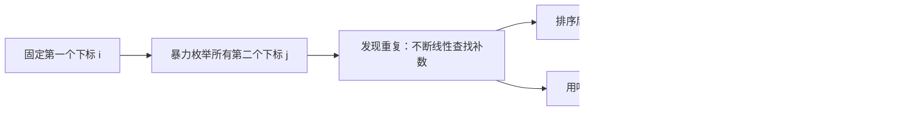
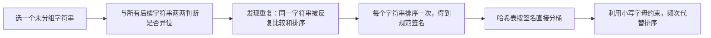

# 力扣 Hot100 面试学习宝典

这份笔记不把“背下最优代码”当作终点，而是训练从题目条件推导算法的能力。每道题都按同一条思考链展开：**读题识别特征 → 写出暴力解 → 定位重复工作 → 选择数据结构或性质优化 → 说清不变量与边界 → 比较方案取舍**。

## 每道题的解题框架

拿到一道新题时，先依次回答下面的问题；即使暂时想不到最优解，也能先产出正确、可验证的思路。

1. **题目特征是什么，为什么会想到这个分类或算法？**
   - 关注输入形态（数组、链表、树、图）、目标（查找、计数、最值、区间）和约束（有序、唯一、连续、可修改）。
   - 例如“在数组中反复判断某值是否存在”是哈希表信号；“有序数组中找两个数的关系”是双指针信号。
2. **暴力解怎样写，瓶颈在哪里？**
   - 暴力解是正确性的锚点。先明确枚举了什么、复杂度是多少，再定位哪一层重复扫描、排序或计算可以被替代。
3. **优化依据是什么？**
   - 不是直接背“这题用哈希”。要说清：哈希表把“线性查找补数”替换为“平均常数时间查找”；排序则制造单调性，让指针移动能排除一批候选。
4. **不变量是什么？**
   - 不变量是循环开始、执行中和结束时始终成立的条件。它既用于证明正确性，也直接指导代码顺序。
   - 常见形式包括“哈希表只存已处理元素”“答案仍在当前双指针区间内”“窗口始终满足约束”。
5. **边界和初始化为什么这样写？**
   - 明确循环区间是左闭右开 `[left, right)` 还是闭区间 `[left, right]`；循环条件是否允许相等；初始值能否代表“尚未找到”。
   - 用最小输入、重复元素、全相同元素、答案在边界等样例手动走一遍。
6. **非最优解有什么取舍？**
   - 比较时间、空间、是否修改输入、是否保留原下标、实现难度和可迁移性。非最优解常常是最优解的推导台阶，也可能更适合题目的变体。

后续每题沿用“题目 → 识别信号 → 暴力到优化 → 各方案（不变量、边界、取舍）→ 面试表达”的结构。

# 哈希

## 1. 两数之和

- 题目链接：[1. 两数之和](https://leetcode.cn/problems/two-sum/description/)
- 难度：简单
- 核心分类：哈希表；也可从排序 + 双指针理解其替代方案。

### 题目

给定一个整数数组 `nums` 和一个整数目标值 `target`，请你在该数组中找出和为目标值 `target` 的那两个整数，并返回它们的数组下标。

你可以假设每种输入只会对应一个答案，并且你不能使用两次相同的元素。

你可以按任意顺序返回答案。

**示例 1：**

```text
输入：nums = [2, 7, 11, 15], target = 9
输出：[0, 1]
解释：因为 nums[0] + nums[1] == 9，返回 [0, 1]。
```

**示例 2：**

```text
输入：nums = [3, 2, 4], target = 6
输出：[1, 2]
```

**示例 3：**

```text
输入：nums = [3, 3], target = 6
输出：[0, 1]
```

**约束：**

- `2 <= nums.length <= 10^4`
- `-10^9 <= nums[i] <= 10^9`
- `-10^9 <= target <= 10^9`
- 只会存在一个有效答案。

**进阶：** 你可以想出一个时间复杂度小于 $O(n^2)$ 的算法吗？

### 读题：哪些特征指向哈希表

这题的等式可以改写为：

$$
nums[j] = target - nums[i]
$$

固定一个数 `nums[i]` 后，问题就变成“数组中是否存在它的补数 `target - nums[i]`”。这正是哈希表的典型使用信号：

| 题目特征 | 推导出的需求 | 对应工具 |
| --- | --- | --- |
| 在无序数组中找两个数的和 | 固定一个数，查询补数是否存在 | 哈希表的 `值 -> 下标` 映射 |
| 要返回下标而不是数值 | 查询到值后还要知道来源位置 | 哈希表的值存下标 |
| 元素不能重复使用 | 查询的补数必须来自另一位置 | 维护“已遍历元素”或显式校验下标 |
| 数据没有有序性 | 不能直接依据大小移动指针 | 若想用双指针，先排序并保存原下标 |

因此，面试中不要只说“这是两数之和，所以用哈希表”，而应说：**暴力解对每个元素都重复线性寻找补数；哈希表能把这次查找降为平均 $O(1)$，并同时保存答案下标。**

### 从暴力到优化



暴力解枚举下标对，排序双指针通过排序消除部分枚举，哈希表则直接消除“寻找补数”的内层扫描。下面按这个推导顺序展开。

### 方案一：两层枚举（正确性起点）

#### 思路

固定第一个下标 `i`，再枚举它之后的下标 `j`。只枚举 `j > i`，每一对不同下标恰好检查一次。

```cpp
class Solution {
public:
    vector<int> twoSum(vector<int>& nums, int target) {
        const int n = static_cast<int>(nums.size());

        for (int i = 0; i < n; ++i) {
            for (int j = i + 1; j < n; ++j) {
                if (nums[i] + nums[j] == target) {
                    return {i, j};
                }
            }
        }

        return {};
    }
};
```

#### 不变量与正确性

- 外层处理到 `i` 时，所有左端点小于 `i` 的下标对都已检查完毕。
- 内层处理到 `j` 时，所有形如 `(i, k)` 且 `i < k < j` 的下标对都已检查完毕。
- 答案的一对下标总能写成 `p < q`。当外层到达 `p`、内层到达 `q` 时必会命中，因此不会漏解；`j = i + 1` 又保证不会出现 `i == j`。

#### 边界与细节

- 内层从 `i + 1` 开始而非 `0`：避免与自身配对，也避免检查 `(i, j)` 与 `(j, i)` 两次。
- 循环条件使用 `i < n`、`j < n`，对应数组合法的左闭右开下标区间 `[0, n)`。
- 题目保证有解；`return {}` 是为了让函数在通用语义下完整。面试时可以说明它在本题不可达。

#### 复杂度与取舍

| 时间复杂度 | 空间复杂度 | 优点 | 代价 |
| --- | --- | --- | --- |
| `O(n²)` | `O(1)` | 最容易写对，不依赖额外数据结构 | 每个 `i` 都重新扫描后续元素，存在大量重复比较 |

它不是最终答案，但应当会写、会讲：这是后续优化的基准，也是在面试中先保证正确性的稳妥起点。

### 方案二：排序 + 双指针（利用单调性）

#### 思路

排序能让数值具有单调性。设左右指针为 `left`、`right`：

- 和太小，必须增大较小端，令 `++left`。
- 和太大，必须减小较大端，令 `--right`。

本题要求返回原下标，不能直接排序 `nums`；需要复制成 `{数值, 原下标}` 后排序。

```cpp
class Solution {
public:
    vector<int> twoSum(vector<int>& nums, int target) {
        vector<pair<int, int>> values_with_indices;
        values_with_indices.reserve(nums.size());

        for (int i = 0; i < static_cast<int>(nums.size()); ++i) {
            values_with_indices.emplace_back(nums[i], i);
        }

        sort(values_with_indices.begin(), values_with_indices.end());

        int left = 0;
        int right = static_cast<int>(values_with_indices.size()) - 1;
        while (left < right) {
            const int sum = values_with_indices[left].first +
                            values_with_indices[right].first;

            if (sum == target) {
                return {values_with_indices[left].second,
                        values_with_indices[right].second};
            }
            if (sum < target) {
                ++left;
            } else {
                --right;
            }
        }

        return {};
    }
};
```

#### 不变量与正确性

若尚未返回答案，则当前闭区间 `[left, right]` 中仍保留至少一组可能的答案。

- 初始时 `[0, n - 1]` 包含所有元素，不变量显然成立。
- 若当前和小于 `target`，对任意 `k < right`，都有 `values[left] + values[k] <= values[left] + values[right] < target`。`left` 不可能参与答案，右移 `left` 不会丢失答案。
- 若当前和大于 `target`，对任意 `k > left`，都有 `values[k] + values[right] >= values[left] + values[right] > target`。`right` 不可能参与答案，左移 `right` 不会丢失答案。
- 每次都安全排除一个端点；最终命中答案，或区间不足两个元素时结束。

#### 边界与细节

- `left = 0`、`right = n - 1` 对应闭区间 `[left, right]`，所以循环条件是 `left < right`，而不是 `left <= right`。相等时只剩一个元素，不能使用两次。
- `pair<int, int>` 的第一个成员是排序依据，第二个成员是原下标；不要对原数组排序后再试图恢复下标。
- 本题范围内两个 `int` 相加安全；遇到范围更大的变体，可把 `sum` 写成 `const long long sum = ...`。

#### 复杂度与取舍

| 时间复杂度 | 空间复杂度 | 获得什么 | 付出什么 | 更适合的场景 |
| --- | --- | --- | --- | --- |
| `O(n log n)` | `O(n)` | 双指针扫描只需 `O(n)`，思路可迁移到有序数组 | 排序主导总复杂度，且必须保留原下标 | 输入已排序、只需返回数值，或问题天然具有单调性 |

这是非最优解，但非常值得掌握。它展示了另一种优化方式：**不是加速查找，而是构造有序性后一次排除一批候选。**

### 方案三：两遍哈希表（把建表与查询分开）

#### 思路

先用一遍遍历建立 `值 -> 下标` 映射，再用第二遍遍历查询每个数的补数。它比一遍哈希多走了一次数组，但把“表里有什么”和“如何查表”分成两段，初学时更容易手写正确。

```cpp
class Solution {
public:
    vector<int> twoSum(vector<int>& nums, int target) {
        unordered_map<int, int> index_by_value;
        index_by_value.reserve(nums.size());

        for (int i = 0; i < static_cast<int>(nums.size()); ++i) {
            index_by_value[nums[i]] = i;
        }

        for (int i = 0; i < static_cast<int>(nums.size()); ++i) {
            const int complement = target - nums[i];
            const auto it = index_by_value.find(complement);

            if (it != index_by_value.end() && it->second != i) {
                return {i, it->second};
            }
        }

        return {};
    }
};
```

#### 不变量与正确性

- 第一轮结束后，对于数组中的每个不同数值，`index_by_value` 至少保存它的一个合法下标；重复值时保存最后一次出现的下标。
- 第二轮处理 `i` 时，若补数存在且 `it->second != i`，两个下标不同且数值和为 `target`，可以直接返回。
- 对答案 `(p, q)` 而言，遍历第二轮到 `p` 或 `q` 时都能查询到另一个值。对于 `[3, 3]`，表保存后一个 `3` 的下标，处理前一个 `3` 时仍能找到不同下标。

#### 边界与细节

- 必须检查 `it->second != i`。两遍建表后，当前元素已经在表中；若补数恰好等于当前值，不检查就可能把同一位置当成两个元素。
- `find` 只查询，不会修改哈希表；不要用 `index_by_value[complement]` 判断存在性，因为键不存在时 `operator[]` 会插入默认值，语义容易出错。
- `reserve(nums.size())` 只是减少扩容和 rehash（重哈希）的工程性优化，不影响核心逻辑。

#### 复杂度与取舍

| 时间复杂度 | 空间复杂度 | 获得什么 | 付出什么 |
| --- | --- | --- | --- |
| 平均 `O(n)` | `O(n)` | 建表、查表逻辑清晰，便于解释下标校验 | 需要第二次遍历，并额外写 `it->second != i` |

`unordered_map` 的查找和插入是**平均** $O(1)$；若发生极端哈希冲突，理论最坏总时间可退化到 $O(n^2)$。面试中通常按平均复杂度分析，同时说明这一前提即可。

### 方案四：一次遍历哈希表（推荐）

#### 思路

当前元素只需要与它之前出现的元素配对。因此遍历到 `i` 时：

1. 先查补数 `target - nums[i]` 是否已出现。
2. 找到则立即返回。
3. 否则记录 `nums[i] -> i`，供后面的元素查询。

```cpp
class Solution {
public:
    vector<int> twoSum(vector<int>& nums, int target) {
        unordered_map<int, int> index_by_value;
        index_by_value.reserve(nums.size());

        for (int i = 0; i < static_cast<int>(nums.size()); ++i) {
            const int complement = target - nums[i];
            const auto it = index_by_value.find(complement);

            if (it != index_by_value.end()) {
                return {it->second, i};
            }

            // 先查后插：哈希表中只保留当前下标之前的元素。
            index_by_value[nums[i]] = i;
        }

        return {};
    }
};
```

#### 不变量与正确性

循环处理下标 `i` 的开头，哈希表 `index_by_value` **只保存左闭右开区间 `[0, i)` 中出现过的值及其下标**。

- 初始 `i = 0` 时，区间为空，哈希表为空，不变量成立。
- 若查到 `complement`，对应下标必在 `[0, i)`，因此必然小于 `i`；返回的两个下标不同，且两数之和恰为 `target`。
- 若查不到，将 `nums[i] -> i` 插入后，哈希表恰好保存 `[0, i + 1)` 的元素；下一轮不变量继续成立。
- 若答案为 `(p, q)` 且 `p < q`，遍历到 `q` 前 `p` 已在表中，所以一定会命中答案。

这就是“**先查后插**”的证明，而不仅是需要记忆的模板。

#### 边界与细节

- `for (int i = 0; i < n; ++i)` 处理的是左闭右开区间 `[0, n)`，所有数组访问都安全。
- 必须先 `find(complement)`，再插入当前值。若反过来，当 `target == 2 * nums[i]` 时，当前元素会被自己匹配；例如单个 `3` 不能构成和为 `6` 的答案。
- `[3, 3]` 不会出错：处理第一个 `3` 时查不到并记录；处理第二个 `3` 时查到第一个的下标，返回 `[0, 1]`。
- 哈希表只需为每个值保存一个历史下标。重复值覆盖较早下标也不影响本题，因为查到的任一历史下标都合法。

#### 示例推演

`nums = [3, 2, 4]`，`target = 6`：

| 当前下标 `i` | 当前值 `nums[i]` | 需要的补数 | 查找前的哈希表 | 操作 |
| --- | --- | --- | --- | --- |
| `0` | `3` | `3` | `{}` | 未找到，记录 `3 -> 0` |
| `1` | `2` | `4` | `{3 -> 0}` | 未找到，记录 `2 -> 1` |
| `2` | `4` | `2` | `{3 -> 0, 2 -> 1}` | 找到 `2 -> 1`，返回 `[1, 2]` |

#### 复杂度与取舍

| 时间复杂度 | 空间复杂度 | 为什么推荐 | 需要特别记住的点 |
| --- | --- | --- | --- |
| 平均 `O(n)` | `O(n)` | 一次遍历完成查询与建表，代码短且自然保证下标不同 | 哈希表语义是“已处理元素”；顺序必须先查后插 |

### 方案选择与 Trade-off

| 方案 | 时间 | 空间 | 是否修改原数组 | 主要优势 | 主要代价 |
| --- | --- | --- | --- | --- | --- |
| 两层枚举 | `O(n²)` | `O(1)` | 否 | 最直接，容易证明 | 大量重复比较 |
| 排序 + 双指针 | `O(n log n)` | `O(n)` | 否，本实现复制后排序 | 单调性强，适合有序数组变体 | 排序较慢，必须维护原下标 |
| 两遍哈希 | 平均 `O(n)` | `O(n)` | 否 | 建表与查询分离，容易写对 | 多一次遍历，要显式排除同下标 |
| 一遍哈希 | 平均 `O(n)` | `O(n)` | 否 | 本题最简洁高效 | 必须准确维护“先查后插”的不变量 |

选择并非只看大 $O$：若原数组已按升序给出，双指针可做到 $O(n)$ 时间、$O(1)$ 额外空间；若需要在线处理数据流，一遍哈希更自然；若面试刚开始且时间充足，可以先给出两层枚举，再推导哈希优化以展示思考过程。

### 面试手撕表达

可以用下面这段逻辑完成从暴力到最优的讲解：

> 暴力做法枚举两个下标，时间是 $O(n^2)$。固定 `nums[i]` 后，我只需要知道补数 `target - nums[i]` 是否已经出现过，因此用哈希表保存“值到下标”。遍历时我先查补数，再记录当前数；这样哈希表始终只含当前下标之前的元素，保证不会重复使用同一个元素。平均时间 $O(n)$，额外空间 $O(n)$。

### 复习检查

- 能否不看答案写出双层循环，并解释为什么 `j` 从 `i + 1` 开始？
- 能否解释排序双指针中，`sum < target` 时为什么只能移动 `left`？
- 能否说出一遍哈希的精确不变量：处理 `i` 前，表中保存 `[0, i)` 的元素？
- 能否解释“一遍哈希必须先查后插”，以及它如何处理 `[3, 3]`？
- 能否区分 `map` 的 $O(n \log n)$ 和 `unordered_map` 的平均 $O(n)$？

## 2. 字母异位词分组

- 题目链接：[49. 字母异位词分组](https://leetcode.cn/problems/group-anagrams/description/)
- 难度：中等
- 核心分类：哈希表、字符串、规范化表示。

### 题目

给你一个字符串数组 `strs`，请你将**字母异位词**组合在一起。可以按任意顺序返回结果列表。

字母异位词指两个字符串使用的每种字符及其出现次数完全相同，只是字符排列顺序不同。

**示例 1：**

```text
输入：strs = ["eat", "tea", "tan", "ate", "nat", "bat"]
输出：[["bat"], ["nat", "tan"], ["ate", "eat", "tea"]]
解释："nat" 和 "tan" 互为字母异位词；"ate"、"eat"、"tea" 互为字母异位词。
```

**示例 2：**

```text
输入：strs = [""]
输出：[[""]]
```

**示例 3：**

```text
输入：strs = ["a"]
输出：[["a"]]
```

**约束：**

- `1 <= strs.length <= 10^4`
- `0 <= strs[i].length <= 100`
- `strs[i]` 仅包含小写字母。

### 读题：哪些特征指向“签名 + 哈希分组”

本题不是询问“某个值是否出现过”，而是要把满足同一关系的多个字符串放入同一个桶。关键是把“两个字符串互为异位词”转化成一个可以作为哈希键的、确定且相同的表示，称为**规范签名**。

| 题目特征 | 推导出的需求 | 对应做法 |
| --- | --- | --- |
| 只要求按字符重排后是否相同 | 忽略字符原始顺序，保留字符组成 | 将排序后的字符串作为签名 |
| 字符仅有 `a` 到 `z` | 可以记录每种字符的次数 | 用长度为 26 的频次数组作为签名 |
| 需要分组而非找单个答案 | 相同签名的元素持续归入同一个容器 | 哈希表：`签名 -> 字符串列表` |
| 输出顺序任意 | 不要求哈希表键的遍历顺序稳定 | `unordered_map` 足够使用 |

面试中的关键表达是：**先为每个字符串构造一个唯一描述其字符组成的签名，再按签名用哈希表分桶。** 哈希表解决“该字符串属于哪一组”，签名解决“什么样的字符串算同一组”。

### 从暴力到优化



设字符串数量为 $n$，最长字符串长度为 $k$。暴力方法的瓶颈是 $O(n^2)$ 次“是否异位词”的比较；优化后，每个字符串只构造一次签名，并只进行一次哈希表查找。

### 方案一：两两比较后分组（暴力起点）

#### 思路

从左到右选取一个尚未分组的字符串作为当前组的代表，再扫描其后的所有字符串。若两个字符串互为字母异位词，就加入同一组，并标记为已使用。

这里用“复制后排序”判断两个字符串是否异位词：原字符串不被修改，排序结果相同当且仅当两个字符串的字符多重集合相同。

```cpp
class Solution {
public:
    vector<vector<string>> groupAnagrams(vector<string>& strs) {
        // 记录每个下标是否已被某个分组收纳，初始时所有字符串均未分组。
        vector<bool> used(strs.size(), false);
        // 保存最终的所有分组。
        vector<vector<string>> result;

        for (int i = 0; i < static_cast<int>(strs.size()); ++i) {
            // 已被此前代表字符串归类的元素不再重复建组。
            if (used[i]) {
                continue;
            }

            // 为当前未分组字符串创建一个新桶，并先放入它自己。
            vector<string> group{strs[i]};
            // 标记当前代表字符串已归入这个新桶。
            used[i] = true;

            for (int j = i + 1; j < static_cast<int>(strs.size()); ++j) {
                // 已经分组的字符串无需再次与当前代表比较。
                if (used[j]) {
                    continue;
                }
                // 只有与代表字符串互为异位词的元素才能进入当前桶。
                if (areAnagrams(strs[i], strs[j])) {
                    // 保存找到的同组字符串。
                    group.push_back(strs[j]);
                    // 防止它在后续外层循环中成为新的代表。
                    used[j] = true;
                }
            }

            // 当前代表能匹配的所有字符串均已扫描，提交该分组。
            result.push_back(std::move(group));
        }

        // 返回所有互不重叠的分组。
        return result;
    }

private:
    bool areAnagrams(const string& first, const string& second) {
        // 长度不同意味着字符总数不同，无需进行排序比较。
        if (first.size() != second.size()) {
            return false;
        }

        // 复制第一个字符串，避免改变输入数组中的内容。
        string sorted_first = first;
        // 复制第二个字符串，供独立排序。
        string sorted_second = second;
        // 排序后，相同字符组成会被排列成相同序列。
        sort(sorted_first.begin(), sorted_first.end());
        // 与第一个排序结果使用相同的规范化规则。
        sort(sorted_second.begin(), sorted_second.end());

        // 两个规范化序列相等，当且仅当原字符串互为字母异位词。
        return sorted_first == sorted_second;
    }
};
```

#### 不变量与正确性

- 每次外层循环开始时，所有 `used == true` 的字符串已经属于 `result` 中某个完整分组，且不会再被处理。
- 选中代表 `strs[i]` 后，内层循环已检查区间 `[i + 1, j)` 中每一个尚未使用的字符串：其中异位词已加入 `group`，非异位词不属于该组。
- “互为异位词”是等价关系，具有传递性：若字符串都与同一代表异位，它们彼此也异位。因此扫描结束时 `group` 就是代表字符串所在的完整分组。

#### 边界与细节

- 内层从 `j = i + 1` 开始，不必重新比较代表自身，也不重复比较已经在左侧出现的字符串。
- 空字符串合法：两个空字符串排序后仍相等，能被分到同一组；一个空字符串会单独形成一组。
- `std::move(group)` 只转移局部 `vector` 的资源到 `result`，不会改变其中字符串的内容；此处不写也正确，只是会多一次容器复制。

#### 复杂度与取舍

| 时间复杂度 | 额外空间 | 优点 | 代价 |
| --- | --- | --- | --- |
| `O(n² × k log k)` | `O(n + k)`，不含输出 | 从分组定义直接出发，正确性直观 | 同一字符串会在多次两两比较中被重复复制和排序 |

这是理解题意的保底方案，但在 `n = 10^4` 时不可接受。优化的目标很明确：让每个字符串只计算一次“属于哪一组”的依据。

### 方案二：排序字符串作为哈希键（通用推荐）

#### 思路

一个字符串排序后，字符顺序被消除，但每种字符的数量被完整保留。例如 `"tea"`、`"eat"`、`"ate"` 都会得到签名 `"aet"`。因此可用排序结果作为键，把原字符串追加到对应的哈希桶中。

```cpp
class Solution {
public:
    vector<vector<string>> groupAnagrams(vector<string>& strs) {
        // 键是排序后的签名，值是具有该签名的原始字符串列表。
        unordered_map<string, vector<string>> groups;
        // 预留桶数量以减少插入大量不同签名时的 rehash。
        groups.reserve(strs.size());

        for (const string& str : strs) {
            // 复制原字符串作为签名，保留 str 以原始顺序进入结果。
            string key = str;
            // 排序把所有异位词规范化为同一个键。
            sort(key.begin(), key.end());
            // 若 key 首次出现则创建空分组，再把当前原字符串放入该组。
            groups[key].push_back(str);
        }

        // 哈希表的值就是答案中的各个分组。
        vector<vector<string>> result;
        // 预留最终分组数，避免搬运分组时反复扩容。
        result.reserve(groups.size());
        for (auto& entry : groups) {
            // 转移一个完整分组；题目允许分组的返回顺序任意。
            result.push_back(std::move(entry.second));
        }

        // 返回按签名划分后的所有分组。
        return result;
    }
};
```

#### 不变量与正确性

处理完前 $t$ 个字符串后，哈希表满足：对于每个签名 `key`，`groups[key]` 恰好包含前缀 `strs[0..t)` 中所有排序后等于 `key` 的字符串。

- 初始时前缀为空，哈希表为空，不变量成立。
- 处理新字符串时，排序得到唯一签名 `key`，再将它追加到 `groups[key]`，不影响其他签名对应的分组，因此不变量保持。
- 两个字符串排序后相同，当且仅当它们每种字符的出现次数相同，即二者互为字母异位词。遍历结束时，每个桶恰好是一组异位词。

#### 边界与细节

- `string key = str` 必须复制：排序 `key` 不应改变 `strs` 的原始内容，也不能对 `const string& str` 排序。
- `groups[key]` 的 `operator[]` 在键不存在时创建一个空 `vector<string>`；这正好符合“首次看到一个签名时新建分组”的需求。
- 空字符串的排序键是空字符串 `""`，能正常作为 `unordered_map` 的键。
- 若题目要求稳定的组顺序或组内顺序，需要额外处理；本题声明任意顺序，哈希表遍历顺序无影响。

#### 复杂度与取舍

每个长度为 $m$ 的字符串需排序 `O(m log m)`。令 $k$ 为最长长度，总时间为 `O(n × k log k)`；哈希表操作按平均 `O(1)` 计算。

| 时间复杂度 | 辅助空间 | 优点 | 代价 | 适用范围 |
| --- | --- | --- | --- | --- |
| 平均 `O(n × k log k)` | `O(n × k)`，不含输出 | 代码短、签名直观、字符集不局限于 26 个小写字母 | 每个字符串都需要排序 | 通用的字母异位词分组 |

这是面试中最推荐先写的版本：签名构造逻辑清楚，代码量小，且不依赖本题“小写字母”这一特定约束。

### 方案三：字符频次作为哈希键（利用题目约束优化）

#### 思路

题目保证字符串只包含 `a` 到 `z`。因此不必排序：统计 26 个字母各出现多少次，得到的频次数组本身就唯一描述了字符组成。

`unordered_map` 不能直接把 `array<int, 26>` 当作键，所以这里将 26 个计数按固定顺序并加分隔符拼成字符串键。分隔符不可省略，例如计数序列 `[1, 11]` 与 `[11, 1]` 不能被拼成同一串。

```cpp
class Solution {
public:
    vector<vector<string>> groupAnagrams(vector<string>& strs) {
        // 键是 26 个字符频次的序列化结果，值是对应的异位词分组。
        unordered_map<string, vector<string>> groups;
        // 提前分配可能的不同签名桶，减少哈希表扩容次数。
        groups.reserve(strs.size());

        for (const string& str : strs) {
            // 零初始化 26 个计数器，第 i 项对应字符 'a' + i。
            array<int, 26> counts{};
            for (const char ch : str) {
                // 题目保证 ch 是小写字母，因此该下标位于 [0, 25]。
                ++counts[ch - 'a'];
            }

            // 构造固定格式的键；预留空间避免多次扩容。
            string key;
            key.reserve(26 * 4);
            for (const int count : counts) {
                // 先写分隔符，消除不同数字序列拼接后的歧义。
                key.push_back('#');
                // 再写当前字母的出现次数，完整保留频次信息。
                key += to_string(count);
            }

            // 相同频次键的字符串必互为异位词，因此追加到同一个桶。
            groups[key].push_back(str);
        }

        // 将哈希表中的每个桶转移到题目要求的二维结果中。
        vector<vector<string>> result;
        // 结果最多与不同签名数一样多，先预留对应容量。
        result.reserve(groups.size());
        for (auto& entry : groups) {
            // 输出顺序任意，可以直接按哈希表的遍历顺序转移分组。
            result.push_back(std::move(entry.second));
        }

        // 返回所有按频次签名聚合的字符串组。
        return result;
    }
};
```

#### 不变量与正确性

处理完前 $t$ 个字符串后，`groups[key]` 恰好包含前缀 `strs[0..t)` 中频次数组序列化为 `key` 的所有字符串。

- `counts{}` 在每次外层循环开始时都重新归零，所以它只描述当前字符串，不会混入上一个字符串的字符。
- 内层计数结束后，`counts[i]` 等于当前字符串中字符 `'a' + i` 的出现次数。
- 两个仅由小写字母组成的字符串频次数组相同，当且仅当它们互为字母异位词；固定顺序和分隔符保证不同数组不会序列化成相同键。
- 将当前字符串放入 `groups[key]` 后，不变量扩展到前缀 `[0, t + 1)`。

#### 边界与细节

- `array<int, 26> counts{}` 的花括号不可省略：它保证所有计数从 `0` 开始。若未初始化，累加结果没有意义。
- `ch - 'a'` 依赖“仅小写字母”的题设；若输入可能包含大写、Unicode 或任意字符，26 格数组不再成立，应回退到排序签名或改用更一般的计数结构。
- 空字符串会得到 26 个 `0` 组成的固定键，多个空字符串自然会进入同一组。
- 序列化键的长度在本题中是常数级：26 个计数且每个计数不超过 100，因此 26 次 `to_string` 不改变关于 $k$ 的线性扫描结论。

#### 复杂度与取舍

统计字符需要 `O(m)`，构建长度固定的 26 维签名为 `O(1)`；对所有字符串，总时间为平均 `O(n × k)`。

| 时间复杂度 | 辅助空间 | 优点 | 代价 | 使用前提 |
| --- | --- | --- | --- | --- |
| 平均 `O(n × k)` | `O(n)`，不含输出 | 不排序，理论更快 | 键构造更绕，强依赖字符集大小固定 | 字符仅为 `a` 到 `z` 或字符集很小且固定 |

### 方案选择与 Trade-off

| 方案 | 时间 | 辅助空间 | 主要优势 | 主要代价 | 面试定位 |
| --- | --- | --- | --- | --- | --- |
| 两两比较 | `O(n² × k log k)` | `O(n + k)` | 直接体现分组定义 | 重复比较、无法通过大规模数据 | 用于从暴力推导优化 |
| 排序签名 + 哈希 | 平均 `O(n × k log k)` | `O(n × k)` | 通用、短小、最容易手写 | 每个字符串都要排序 | 推荐默认答案 |
| 频次签名 + 哈希 | 平均 `O(n × k)` | `O(n)` | 利用 26 字母约束，省去排序 | 依赖固定字符集，签名实现更复杂 | 约束明确时的优化答案 |

这里的“辅助空间”不含题目要求返回的字符串分组。若把输出也算入，三种方案都至少需要 `O(n × k)` 存放所有返回字符串。

### 面试手撕表达

> 暴力做法是选择一个字符串，再与所有其他字符串判断是否互为异位词，最坏有 `O(n²)` 次比较。优化的关键是为每个字符串生成一个不依赖排列顺序的签名：把字符串排序后，所有异位词都会得到同一个键。用哈希表维护“签名到字符串列表”，遍历一次就能完成分组，平均时间是 `O(n × k log k)`。因为这题字符只含小写字母，也可以用 26 位频次替代排序，把时间优化到平均 `O(n × k)`，但通用性更差。

### 复习检查

- 为什么“排序后的字符串相同”等价于“原字符串互为字母异位词”？
- 为什么哈希表的键不能直接使用原字符串？
- 能否说出排序签名方案的循环不变量：处理前 $t$ 个字符串后，每个桶恰好包含此前具有对应签名的所有字符串？
- `array<int, 26> counts{}` 为什么必须每次处理新字符串时重新初始化？
- 频次序列化时为什么要加入分隔符？
- 面试中何时优先写排序签名，何时选择频次签名？
