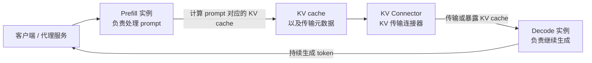
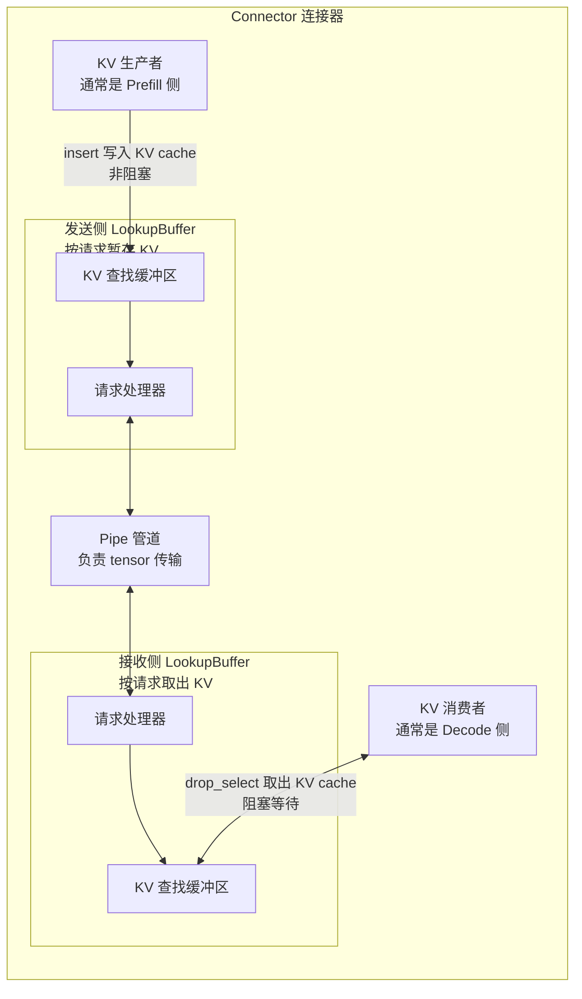
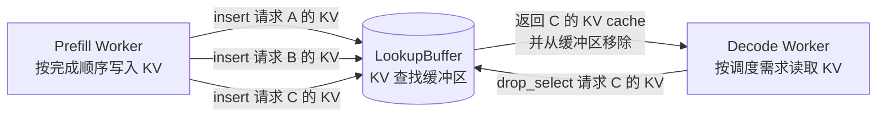
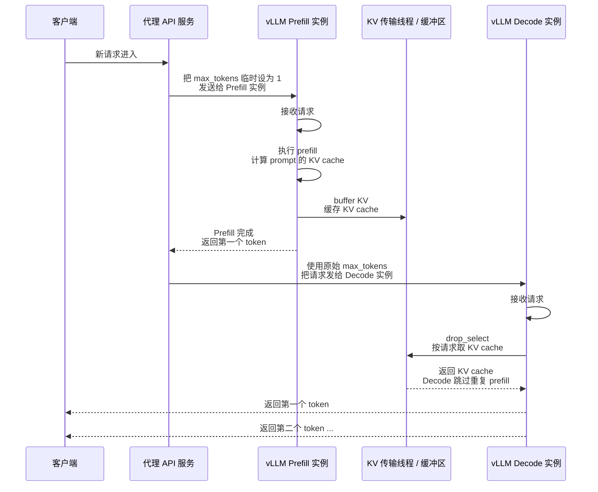
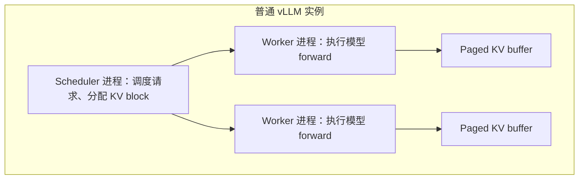
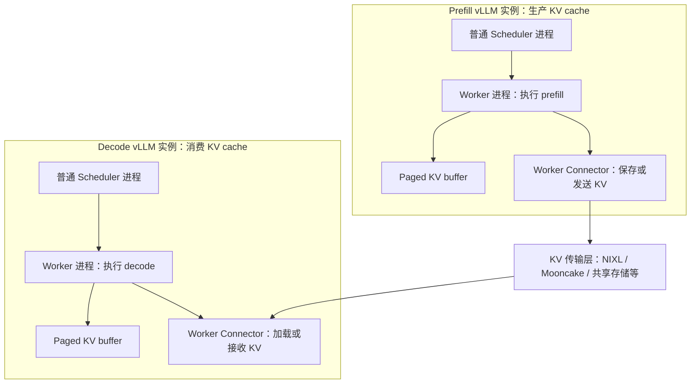
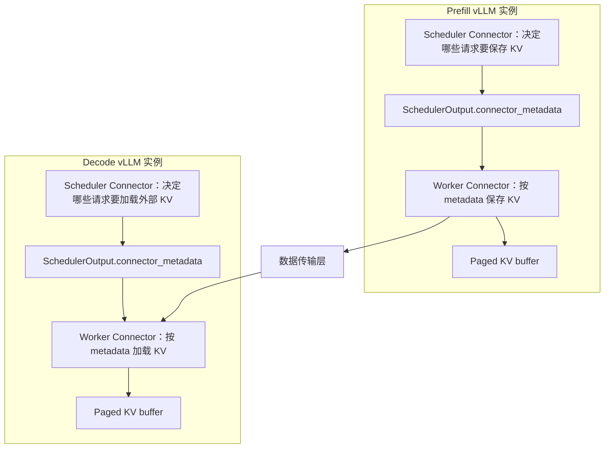
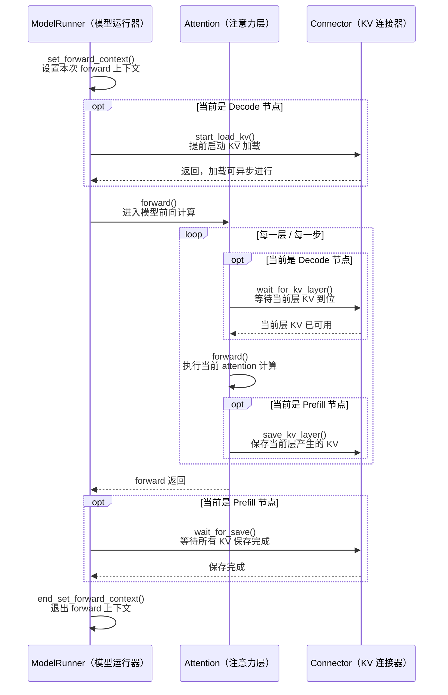

# vLLM PD 分离基础介绍

本文是对 `docs/features/disagg_prefill.md` 的中文学习笔记整理。PD 分离在 vLLM 文档中称为 **Disaggregated Prefilling**，也就是把 LLM 推理中的 **Prefill 阶段** 和 **Decode 阶段** 放到不同的 vLLM 实例中运行。

该功能目前仍是实验性功能，接口、行为和支持范围都可能继续变化。

## 学习路径

以下路径的根目录为 `vllm` 源码。

- `docs/features/disagg_prefill.md`：先读概念、动机、抽象和整体流程。
- `vllm/distributed/kv_transfer/README.md`：从源码目录视角理解 KV transfer 的三层抽象。
- `docs/features/nixl_connector_usage.md`：如果重点学习 NIXL，继续看具体部署、参数和运行方式。
- `examples/disaggregated/disaggregated_serving/`：看 proxy 如何把请求路由到 Prefill 和 Decode 实例。
- `vllm/config/kv_transfer.py`：看 `--kv-transfer-config` 如何进入 vLLM 配置。
- `vllm/distributed/kv_transfer/kv_connector/v1/base.py`：看 connector 的基础接口。
- `vllm/distributed/kv_transfer/kv_connector/v1/nixl/`：深入 NIXL connector 的 scheduler、worker、metadata、push/pull 实现。
- `docs/design/nixl_kv_cache_lease.md`：进阶理解 KV cache lease，也就是 Prefill 侧 KV block 在 Decode 读取前如何保留和释放。

## 核心目的

PD 分离的目标不是直接提升吞吐，而是让 Prefill 和 Decode 两个阶段可以分别优化。

- **分别调优 TTFT 和 ITL**：Prefill 阶段主要影响首 token 延迟，也就是 **TTFT**；Decode 阶段主要影响连续生成 token 的延迟，也就是 **ITL**。把两个阶段拆到不同实例后，可以给 Prefill 和 Decode 配置不同的并行策略，例如不同的 `tp` 或 `pp`，从而独立优化两个阶段。
- **控制尾部 ITL**：如果不做 PD 分离，普通 vLLM 实例可能会在某个请求 decode 过程中插入其他请求的 prefill 任务，这会抬高尾部延迟。PD 分离把 prefill 工作隔离到单独实例中，使 decode 实例更专注于稳定生成 token。
- **不要把它理解为吞吐优化**：原文特别强调，disaggregated prefill **不会提升吞吐**。它更像是延迟形态和资源隔离的优化手段。

## 基本执行模型

PD 分离通常需要两个 vLLM 实例：

- **Prefill instance**：负责处理 prompt，计算 prompt 对应的 KV cache。
- **Decode instance**：接收或拉取 Prefill 产生的 KV cache，然后继续执行 token-by-token decode。
- **Connector**：负责把 Prefill 实例产生的 KV cache 和相关结果传给 Decode 实例。



这张图先抓住一件事：**Prefill 负责算 prompt，Decode 负责继续生成，中间靠 KV Connector 传 KV cache**。客户端请求不会只在一个 vLLM 实例里完成，而是被拆成两个阶段。Prefill 实例把 prompt 的注意力缓存算好后，Decode 实例复用这份缓存，避免再把 prompt 从头算一遍。

## 支持的 Connector

原文写到当前支持 9 类 connector；当前这段文档中列出的主要 connector 如下。

- **ExampleConnector**：用于理解和演示 connector 的基本用法，示例在 `examples/disaggregated/example_connector/run.sh`。
- **LMCacheConnectorV1**：通过 LMCache 做 KV cache 管理，底层可使用 NIXL 进行 KV 传输，示例在 `examples/disaggregated/lmcache/disagg_prefill_lmcache_v1/disagg_example_nixl.sh`。
- **NixlConnector**：支持完全异步的 send / recv，是当前学习 PD 分离和高性能 KV 传输时最值得关注的实现之一。使用示例在 `tests/v1/kv_connector/nixl_integration/run_accuracy_test.sh`，更完整说明在 `docs/features/nixl_connector_usage.md`。
- **MooncakeConnector**：另一种面向分布式 KV 传输的 connector，示例在 `examples/disaggregated/mooncake_connector/run_mooncake_connector.sh`。
- **MoRIIOConnector**：ROCm 平台使用的 connector，详细说明在 `docs/features/moriio_connector_usage.md`。
- **MultiConnector**：允许把多个 connector 组合起来，按顺序放进 `kv_connector_extra_config`。
- **OffloadingConnector**：把 KV 数据 offload 到 CPU 内存，并可配置 CPU block size 和可用 CPU 内存大小。
- **FlexKVConnectorV1**：面向大规模推理的分布式 KV Store 和多级缓存管理系统。

NIXL connector 的配置示例：

```bash
--kv-transfer-config '{"kv_connector":"NixlConnector","kv_role":"kv_both", "kv_buffer_device":"cuda", "kv_connector_extra_config":{"backends":["UCX", "GDS"]}}'
```

MultiConnector 的配置示例：

```bash
--kv-transfer-config '{"kv_connector":"MultiConnector","kv_role":"kv_both","kv_connector_extra_config":{"connectors":[{"kv_connector":"NixlConnector","kv_role":"kv_both"},{"kv_connector":"ExampleConnector","kv_role":"kv_both","kv_connector_extra_config":{"shared_storage_path":"local_storage"}}]}}'
```

OffloadingConnector 的配置示例：

```bash
--kv-transfer-config '{"kv_connector":"OffloadingConnector","kv_role":"kv_both","kv_connector_extra_config":{"block_size": 64, "cpu_bytes_to_use": 1000000000}}'
```

FlexKVConnectorV1 的配置示例：

```bash
--kv-transfer-config '{"kv_connector":"FlexKVConnectorV1","kv_role":"kv_both"}'
```

## 三层核心抽象

vLLM 的 PD 分离实现位于 `vllm/distributed/kv_transfer`。源码抽象可以先理解为三层：`Pipe`、`LookupBuffer` 和 `Connector`。

- **Pipe**：单向 FIFO tensor 传输管道，核心接口是 `send_tensor` 和 `recv_tensor`。它适合表达最基础的点对点 tensor 传输。
- **LookupBuffer**：类似一个按条件查询的 KV cache buffer，核心接口是 `insert` 和 `drop_select`。`insert` 把 KV cache 放入 buffer，`drop_select` 查找符合条件的 KV cache 并取出。
- **Connector**：连接 vLLM 执行流程和底层 KV 传输能力。它允许 **KV consumer** 从 **KV producer** 获取一批请求的 KV cache。



这张图是在解释 connector 的内部抽象。**KV 生产者**一般是 Prefill 侧，它把算好的 KV cache 通过 `insert` 放进发送侧缓冲区；`insert` 是非阻塞的，意思是写入后可以继续往下执行。中间的 `pipe` 只负责搬 tensor，不理解“我要哪个请求的 KV”。**KV 消费者**一般是 Decode 侧，它用 `drop_select` 按条件取 KV cache；如果目标 KV 还没到，`drop_select` 会阻塞等待。

这里要分清两层语义：`pipe` 解决“怎么传 tensor”，`LookupBuffer` 解决“Decode 要的这个请求的 KV cache 到底是哪一份”。

## LookupBuffer 的语义

`LookupBuffer` 的设计是为了解决 FIFO 顺序和请求消费顺序不一致的问题。

- Prefill worker 可能按 `A -> B -> C` 的顺序产生 KV cache。
- Decode worker 在高 QPS 场景下可能先需要请求 `C` 的 KV cache。
- 单纯 FIFO pipe 很难处理这种乱序匹配，因此需要一个支持按条件查找的 buffer。



这张图解释为什么不能只靠 FIFO 队列。Prefill 侧可能按 `A -> B -> C` 的顺序算完 KV，但 Decode 侧可能因为调度原因先处理 `C`。如果只有 FIFO，Decode 必须先拿 A、B，顺序就错了；有了 `LookupBuffer`，Decode 可以直接指定“我要 C 的 KV”。

所以 `LookupBuffer` 的价值是把底层顺序传输转换成**按请求匹配**的 KV cache 查询。

## PD 分离工作流

原图中 `buffer` 对应 `LookupBuffer.insert`，`drop_select` 对应 `LookupBuffer.drop_select`。从请求生命周期看，可以理解为下面这条链路。



这张图是最核心的请求流程，可以按两段看。

- **第一段发生在 Prefill 实例**：代理服务收到请求后，先把 `max_tokens` 临时设成 1，再发给 Prefill 实例。这样 Prefill 实例主要负责把 prompt 跑完，生成 prompt 对应的 KV cache，同时产出第一个 token。
- **第二段发生在 Decode 实例**：代理服务再用原始的 `max_tokens` 把请求交给 Decode 实例。Decode 不再重复计算 prompt，而是通过 `drop_select` 从 KV 缓冲区拿到 Prefill 刚才算好的 KV cache，然后继续生成后续 token。

图里的 `buffer KV` 可以理解成“Prefill 把 KV cache 放到可被 Decode 找到的位置”；`drop_select` 可以理解成“Decode 按请求 ID 或 token 信息把对应 KV cache 取出来”。

## Scheduler Connector 和 Worker Connector


这里最容易混的是：**Scheduler / Worker** 和 **Prefill / Decode** 不是同一层概念。

- **Scheduler / Worker 是 vLLM 实例内部的进程分工**：一个普通 vLLM 实例内部就有 scheduler 和 worker。scheduler 负责调度请求、分配 KV block、生成 `SchedulerOutput`；worker 负责真正跑模型 forward、执行 attention、读写 paged KV buffer。
- **Prefill / Decode 是 PD 分离部署时的实例角色**：PD 分离不是把 scheduler 改成 PrefillScheduler / DecodeScheduler，而是启动多个普通 vLLM 实例，让其中一些实例主要承担 Prefill 角色，另一些实例主要承担 Decode 角色。
- **所以 P 侧和 D 侧都会有 scheduler 和 worker**：Prefill 实例内部有自己的普通 scheduler 和 worker；Decode 实例内部也有自己的普通 scheduler 和 worker。

先看一个普通 vLLM 实例：



在普通 vLLM 里，scheduler 本身并不叫“prefill scheduler”或“decode scheduler”。它只是根据请求状态决定本轮要调度哪些 token：可能是 prompt prefill，也可能是 decode token，也可能是 chunked prefill 的一部分。

PD 分离之后，结构变成“多个普通 vLLM 实例协作”：



这张图里的 `PS` 和 `DS` 都是普通 vLLM scheduler。它们不是两套不同的 scheduler 类，而是运行在两个不同 vLLM 实例里的两个 scheduler 进程。区别来自实例承担的部署角色：Prefill 实例主要生产 KV cache，Decode 实例主要消费 KV cache。

Connector 也有类似的“实例内部角色”划分：

- **Scheduler Connector**：运行在某个 vLLM 实例的 scheduler 侧，负责决定本轮 KV transfer 该怎么做。它会参与 scheduler 决策，例如外部 KV cache 命中多少 token、哪些请求需要 load、哪些请求需要 store，然后生成 `connector_metadata`。
- **Worker Connector**：运行在某个 vLLM 实例的 worker 侧，负责真正执行 KV cache 的读写。它会接触 paged KV buffer，在 forward 前加载 KV，在 attention 层执行时保存 KV，或者等待异步传输完成。



这张图把 connector 的两种角色放到了 P/D 两个实例里看：

- 在 **Prefill 实例** 中，scheduler connector 通常会告诉 worker connector：“这个请求的 KV 需要保存或发送出去。”worker connector 会在 attention 层产生 KV 后，把 KV 从 paged KV buffer 取出并交给数据传输层。
- 在 **Decode 实例** 中，scheduler connector 通常会告诉 worker connector：“这个请求有外部 KV 可用，需要加载回来。”worker connector 会把外部 KV 注入本地 paged KV buffer，让 decode worker 可以跳过重复 prefill。

`connector_metadata` 是连接 scheduler 和 worker 的桥。scheduler 侧负责生成计划，worker 侧负责执行计划。worker 不需要自己判断“我是 P 还是 D”，它只看 metadata：本轮要 store 就保存 KV，本轮要 load 就加载 KV。

更准确的心智模型是：

- **普通 vLLM 架构层**：每个 vLLM 实例都有 scheduler 和 worker。
- **PD 分离部署层**：有 Prefill 实例和 Decode 实例，它们都是普通 vLLM 实例。
- **KV transfer 扩展层**：每个相关 scheduler / worker 旁边挂一个 connector；scheduler connector 生成元数据，worker connector 读写 KV cache。

所以不要把“Decode 实例里的 scheduler”理解成一种特殊调度器。它仍然是普通 vLLM scheduler，只是启用了 KV connector，并且 connector 会告诉它：某些 prompt token 的 KV cache 已经由外部 Prefill 实例算好了，可以作为 `num_external_computed_tokens` 计入调度，从而减少或跳过本地 prefill。

## Worker Connector 和 Attention 的关系

PD 分离不是一次性在模型外部搬一整个抽象对象，而是要和 attention 层的 KV cache 读写配合。原文最后一张图展示的是 worker connector 如何和 attention 模块协作，实现逐层 KV cache store 和 load。



这张图是在讲 **KV cache 和 attention 层如何配合**。Decode 节点在真正进入 attention 计算前，会先调用 `start_load_kv()`，让 KV 加载尽早开始；每一层 attention 执行前，再调用 `wait_for_kv_layer()`，确保当前层需要的 KV 已经到位。

Prefill 节点的方向相反：它不是加载已有 KV，而是在每一层 attention 算完后调用 `save_kv_layer()`，把这一层新产生的 KV 保存给 Decode 使用。整个 forward 结束后，`wait_for_save()` 确认 KV 都保存完成，避免 Decode 侧拿到不完整的数据。

把它和前面的流程连起来看：**Prefill 是逐层生产 KV，Decode 是逐层等待并消费 KV**。这也是为什么 PD 分离不仅是网络传输问题，还必须嵌入 attention 的执行过程。

## 第三方 Connector 的实现方式

PD 分离和底层基础设施关系很强，因此 vLLM 鼓励第三方贡献生产级 connector。原文推荐三种实现路线。

- **Fully-customized connector**：直接实现自己的 `Connector`，并调用第三方通信库完成 KV cache 的发送、接收，甚至调整 vLLM 的模型执行流程。这种方式控制力最强，但也最容易随 vLLM 内部接口变化而失效。
- **Database-like connector**：实现自己的 `LookupBuffer`，支持类似 SQL 语义的 `insert` 和 `drop_select`。这种方式适合底层服务天然支持按 key 查询 KV cache 的场景。
- **Distributed P2P connector**：实现自己的 `Pipe`，支持类似 `torch.distributed` 的 `send_tensor` 和 `recv_tensor`。这种方式适合底层能力主要是点对点 tensor 传输的场景。


## 阅读时抓住的主线

- **控制流**：请求如何从 client/proxy 分别进入 Prefill 和 Decode 实例。
- **数据流**：Prefill 产生的 KV cache 如何通过 connector 被 Decode 消费。
- **资源约束**：Prefill 侧 KV cache 不能无限期保留，Decode 侧也需要处理 KV 传输失败或超时。
- **接口边界**：Scheduler connector 负责任务安排，Worker connector 负责实际 KV cache 传输。

用一句话概括：PD 分离把“算 prompt KV cache”和“基于 KV cache 继续生成 token”拆成两个实例，中间通过 connector 把 KV cache 生命周期和传输过程接起来。
