# KV Transfer 样例代码阅读

本文接着 `study_docs/PD分离/PD分离基础介绍.md`，从源码角度理解 vLLM 的 KV transfer 体系。重点阅读这些文件：

- `vllm/distributed/kv_transfer/README.md`
- `vllm/distributed/kv_transfer/kv_transfer_state.py`
- `vllm/distributed/kv_transfer/kv_connector/base.py`
- `vllm/distributed/kv_transfer/kv_connector/factory.py`
- `vllm/distributed/kv_transfer/kv_connector/v1/base.py`
- `vllm/distributed/kv_transfer/kv_connector/v1/example_connector.py`

## 和基础介绍的对应关系

基础介绍里说过，PD 分离的核心是：**Prefill 负责生产 KV cache，Decode 负责消费 KV cache，中间通过 Connector 传输或查找 KV cache**。源码里对应关系如下。

- **KV pipe / LookupBuffer / Connector 三层抽象**：README 里给出概念；v1 的 connector 基类主要直接暴露 connector 层接口，具体 connector 可以选择是否真的实现 pipe 和 lookup buffer 两层。
- **Scheduler connector**：`KVConnectorBase_V1` 的 scheduler-side 方法，例如 `get_num_new_matched_tokens()`、`update_state_after_alloc()`、`build_connector_meta()`、`request_finished()`。
- **Worker connector**：`KVConnectorBase_V1` 的 worker-side 方法，例如 `bind_connector_metadata()`、`start_load_kv()`、`wait_for_layer_load()`、`save_kv_layer()`、`wait_for_save()`。
- **SchedulerOutput.connector_metadata**：scheduler 侧把本轮需要 load/store 的元数据塞进 `SchedulerOutput`，worker 侧在 forward 前读取这份元数据。
- **ExampleConnector**：一个最小 debug 实现，不走真正网络通信，而是把每层 KV cache 存到磁盘上的 `.safetensors` 文件，再从磁盘读回来。

## 目录层级

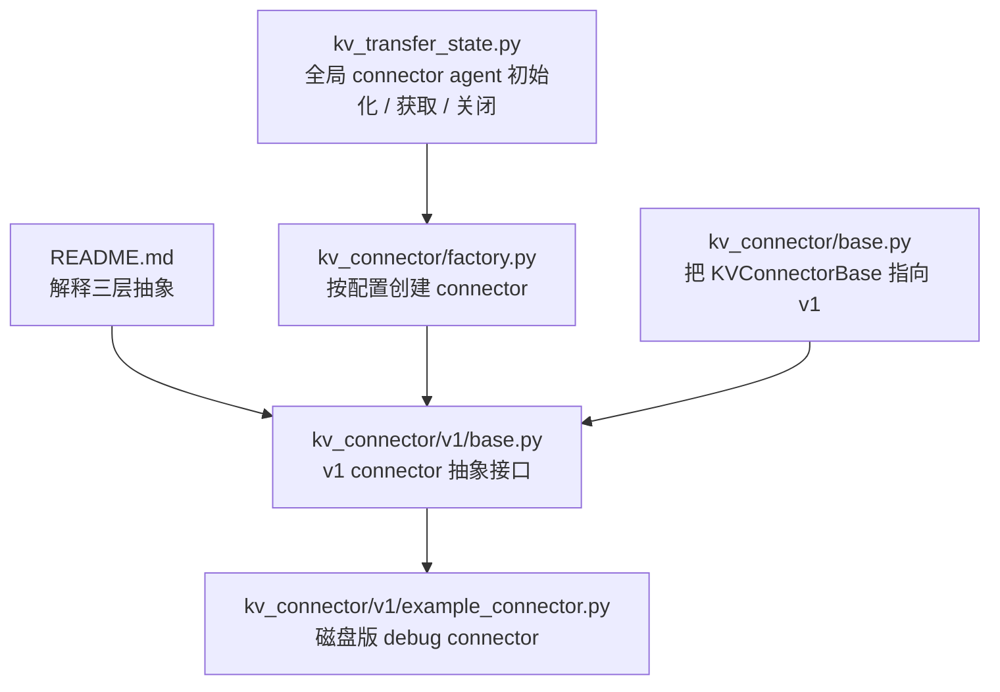

可以把 `README.md` 当成概念地图，把 `v1/base.py` 当成接口契约，把 `example_connector.py` 当成“最容易读懂的实现”。

## README 里的三层抽象

README 把 KV transfer 拆成三层。

- **KV pipe**：只负责 tensor FIFO 传输，关键接口是 `send_tensor` 和 `recv_tensor`。
- **KV lookup buffer**：把 token 序列映射到 KV cache 或 hidden states，关键接口是 `insert` 和 `drop_select`。
- **KV connector**：把 pipe / lookup buffer 接入 vLLM，关键接口是 `send_kv_caches_and_hidden_states` 和 `recv_kv_caches_and_hidden_states`。

在 v1 connector 里，接口已经演化成更贴近模型执行的形式，例如 `start_load_kv()`、`save_kv_layer()`、`build_connector_meta()`。也就是说，README 里的三层是**系统设计抽象**，而 `KVConnectorBase_V1` 是**当前代码里的扩展接口**。

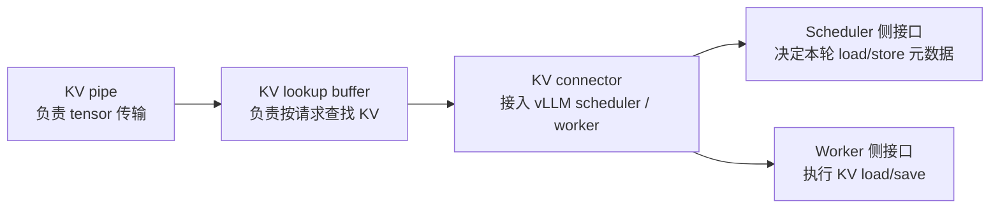

这张图可以和基础介绍里的“Pipe / LookupBuffer / Connector”对应起来。区别是，真正的 v1 代码更关注 scheduler 和 worker 如何协作，而不强制每个 connector 都显式实现独立的 pipe 类或 lookup buffer 类。

## 全局状态和初始化

`kv_transfer_state.py` 维护了一个进程内全局变量 `_KV_CONNECTOR_AGENT`。这个变量就是当前 worker 进程里真正使用的 connector 实例。

```python
_KV_CONNECTOR_AGENT: KVConnectorBaseType | None = None


def get_kv_transfer_group() -> KVConnectorBaseType:
    # 获取全局 KV connector；如果还没初始化就直接报错。
    assert _KV_CONNECTOR_AGENT is not None, (
        "disaggregated KV cache transfer parallel group is not initialized"
    )
    return _KV_CONNECTOR_AGENT


def has_kv_transfer_group() -> bool:
    # 判断当前进程是否已经有 KV connector。
    return _KV_CONNECTOR_AGENT is not None
```

初始化发生在 `ensure_kv_transfer_initialized()`。它只在配置里启用了 KV transfer，并且当前还没有 connector agent 时创建 connector。

```python
def ensure_kv_transfer_initialized(vllm_config, kv_cache_config) -> None:
    global _KV_CONNECTOR_AGENT

    if vllm_config.kv_transfer_config is None:
        return

    if (
        vllm_config.kv_transfer_config.is_kv_transfer_instance
        and _KV_CONNECTOR_AGENT is None
    ):
        # 先同步 engine_id，保证 TP / PP 组内看到同一个 engine 身份。
        _sync_engine_id_across_tp(vllm_config)

        # 通过 factory 创建 worker 角色的 connector。
        _KV_CONNECTOR_AGENT = KVConnectorFactory.create_connector(
            config=vllm_config,
            role=KVConnectorRole.WORKER,
            kv_cache_config=kv_cache_config,
        )
```

这里有两个要点：

- **engine_id 要在 TP / PP rank 间同步**：多卡或多节点时，同一个模型并行引擎里的 worker 需要共享同一个 `engine_id`，否则远端可能不知道该找哪个 producer / consumer。
- **这里创建的是 Worker connector**：scheduler 侧 connector 也存在，但这个全局 agent 主要被 worker/model runner 侧调用，用于 forward 前后的 KV load/save。

## Factory 如何创建 Connector

`kv_connector/base.py` 很薄，只是把当前默认基类指到 v1：

```python
from vllm.distributed.kv_transfer.kv_connector.v1 import KVConnectorBase_V1

KVConnectorBase = KVConnectorBase_V1
KVConnectorBaseType = KVConnectorBase_V1
```

真正负责创建 connector 的是 `KVConnectorFactory`。它维护一个 registry，把配置里的字符串映射到具体类。

```python
KVConnectorFactory.register_connector(
    "ExampleConnector",
    "vllm.distributed.kv_transfer.kv_connector.v1.example_connector",
    "ExampleConnector",
)
```

创建流程可以这样看：

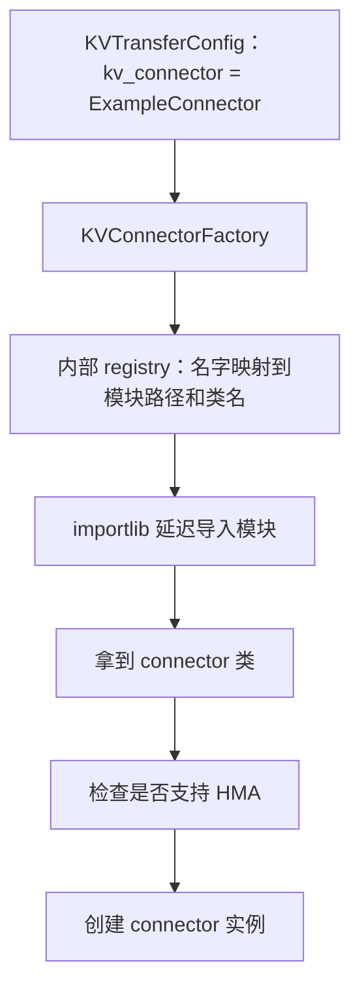

Factory 的几个设计点值得注意：

- **延迟导入**：注册时只保存模块路径和类名，真正用到某个 connector 时才 import 对应文件，避免所有 connector 都被加载。
- **支持外部 connector**：如果 `kv_connector_module_path` 不为空，外部模块优先于内部 registry。
- **强制区分角色**：`create_connector()` 会传入 `KVConnectorRole.SCHEDULER` 或 `KVConnectorRole.WORKER`，让 connector 知道自己运行在哪一侧。
- **检查 HMA 支持**：如果没有关闭 hybrid KV cache manager，而 connector 不支持 HMA，会直接报错。

## v1 基类的角色划分

`KVConnectorBase_V1` 是最重要的接口文件。它把 connector 明确拆成 scheduler-side 和 worker-side 两组方法。

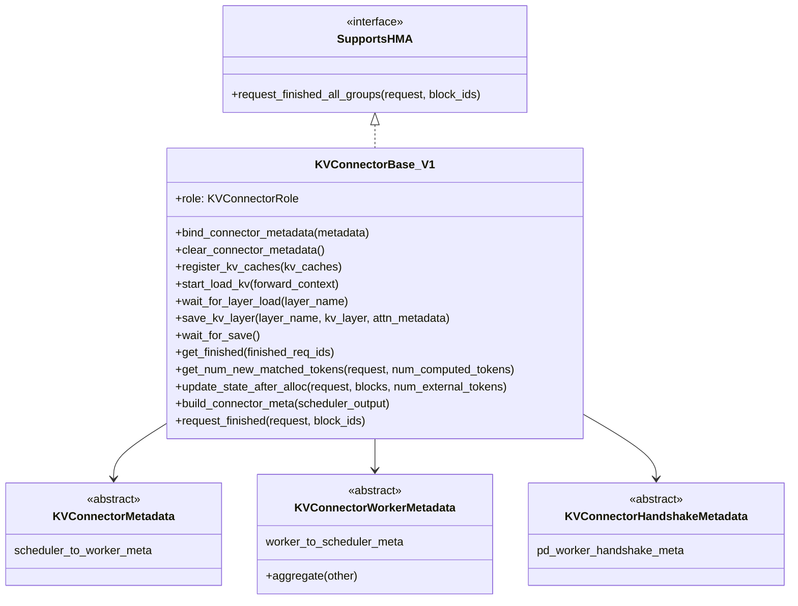

这张类图故意只放核心方法。读这个基类时，最重要的是分清方法运行位置。

### Scheduler 侧接口

Scheduler 侧接口负责**决定本轮该加载什么、保存什么、什么时候释放 block**。

- `get_num_new_matched_tokens(request, num_computed_tokens)`：查询外部 KV cache 命中多少新 token。返回 `(tokens, load_kv_async)`；如果 tokens 是 `None`，表示 connector 还不能确定，需要 scheduler 之后再试。
- `update_state_after_alloc(request, blocks, num_external_tokens)`：scheduler 分配 KV block 后通知 connector。connector 可以记录这些 block，下一次构造 metadata 时告诉 worker 去加载 KV。
- `build_connector_meta(scheduler_output)`：根据本轮调度结果生成 `KVConnectorMetadata`，放进 `SchedulerOutput.kv_connector_metadata`。
- `request_finished(request, block_ids)`：请求结束、block 即将释放前调用。connector 可以选择接管异步保存/发送，返回 `True` 表示 block 暂时不能立即释放。

Scheduler 中查询外部 KV 命中的逻辑大致是：

```python
# 如果启用了 KVConnector，就查询外部已经缓存了多少 token。
if self.connector is not None:
    ext_tokens, load_kv_async = self.connector.get_num_new_matched_tokens(
        request, num_new_local_computed_tokens
    )

    if ext_tokens is None:
        # connector 暂时无法判断命中数量，本轮先不调度这个请求。
        request_queue.pop_request()
        step_skipped_waiting.prepend_request(request)
        continue

    num_external_computed_tokens = ext_tokens

# 本地 prefix cache 命中 + 外部 KV cache 命中 = 已计算 token 数。
num_computed_tokens = (
    num_new_local_computed_tokens + num_external_computed_tokens
)
```

这段代码对应基础介绍里的“Decode 可以跳过一部分 prefill”。这里的 `num_external_computed_tokens` 就是“外部 connector 能提供的 KV cache 覆盖了多少 token”。

### Worker 侧接口

Worker 侧接口负责**在模型 forward 前后真正搬 KV cache**。

- `bind_connector_metadata(metadata)`：model runner 在 forward 前绑定 scheduler 传来的 metadata。
- `start_load_kv(forward_context)`：forward 前启动 KV 加载，可以同步，也可以异步。
- `wait_for_layer_load(layer_name)`：attention 层执行前等待这一层的 KV 加载完成。
- `save_kv_layer(layer_name, kv_layer, attn_metadata)`：attention 层执行后保存这一层的 KV。
- `wait_for_save()`：forward 结束后等待所有保存任务完成，避免 paged KV buffer 被覆盖。
- `get_finished(finished_req_ids)`：把异步发送/接收完成的请求 ID 回报给 scheduler。

Worker 侧调用点在 `vllm/v1/worker/gpu/kv_connector.py` 里：

```python
def pre_forward(self, scheduler_output):
    kv_connector_metadata = scheduler_output.kv_connector_metadata
    assert kv_connector_metadata is not None

    # 处理抢占或即将被覆盖的 block。
    self.kv_connector.handle_preemptions(kv_connector_metadata)

    # 把 scheduler 生成的 metadata 绑定到 worker connector。
    self.kv_connector.bind_connector_metadata(kv_connector_metadata)

    # forward 前启动 KV 加载。
    self.kv_connector.start_load_kv(get_forward_context())


def post_forward(self, finished_req_ids, wait_for_save=True):
    output = KVConnectorOutput()
    if wait_for_save:
        # forward 后等待 KV 保存完成。
        self.kv_connector.wait_for_save()

    # 回报异步发送 / 接收完成的请求。
    output.finished_sending, output.finished_recving = (
        self.kv_connector.get_finished(finished_req_ids)
    )

    output.kv_connector_worker_meta = (
        self.kv_connector.build_connector_worker_meta()
    )
    self.kv_connector.clear_connector_metadata()
    return output
```

这段代码对应基础介绍里的最后一张时序图：`start_load_kv()` 在 forward 前发生，`wait_for_save()` 在 forward 后发生，layer-wise 的 `wait_for_layer_load()` 和 `save_kv_layer()` 则由 attention 层内部调用。

## Scheduler 到 Worker 的元数据通路

整体通路可以画成下面这样。

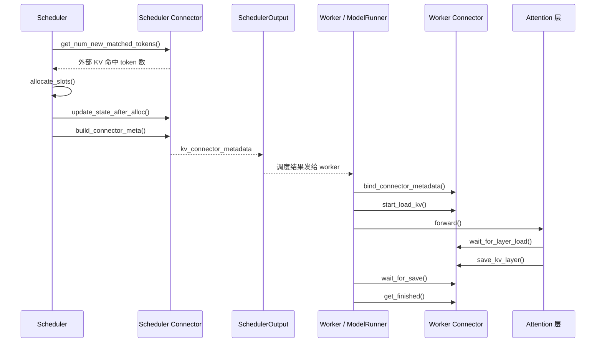

这里要注意，scheduler connector 和 worker connector 可能是同一个类的不同实例，但运行位置不同，职责也不同。metadata 是连接两边的桥。

## ExampleConnector 的数据结构

`ExampleConnector` 定义了两个小数据结构：`ReqMeta` 和 `ExampleConnectorMetadata`。

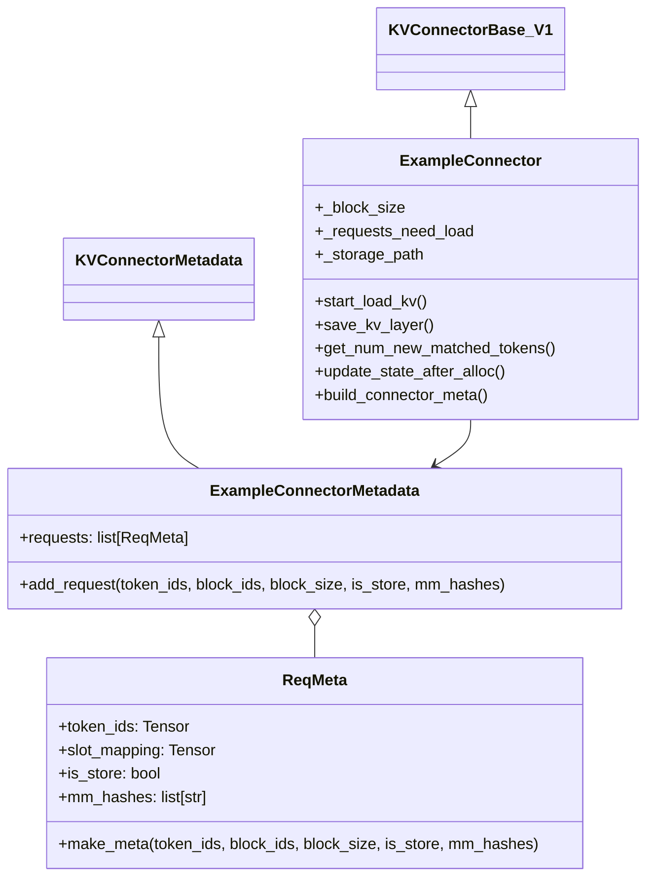

`ReqMeta` 是每个请求的 KV 操作描述。

- `token_ids`：用于构造磁盘缓存 key 的 token 序列。
- `slot_mapping`：这些 token 在 vLLM paged KV buffer 里的位置。
- `is_store`：`True` 表示本轮要保存 KV，`False` 表示本轮要加载 KV。
- `mm_hashes`：多模态输入的 hash，用来避免不同多模态内容使用同一个 token key 时冲突。

`slot_mapping` 是理解 ExampleConnector 的关键。`block_ids` 是 block 级别的位置，`slot_mapping` 是 token 级别的位置。

```python
# 根据 block_id 和 block_size，把 block 位置展开成 token slot 位置。
block_offsets = torch.arange(0, block_size)
slot_mapping = (
    block_offsets.reshape((1, block_size))
    + block_ids_tensor.reshape((num_blocks, 1)) * block_size
)
slot_mapping = slot_mapping.flatten()[:valid_num_tokens]
```

如果 `block_size = 16`，`block_ids = [3, 4]`，那么 slot 范围大致就是 `48..63` 和 `64..79`。后面加载或保存 KV 时，就靠这个映射从 paged KV buffer 里定位对应 token 的 KV。

## ExampleConnector 的存储模型

ExampleConnector 不是生产级 connector，它是一个 debug connector。它不通过网络传输 KV cache，而是把每层 KV cache 存成磁盘文件。

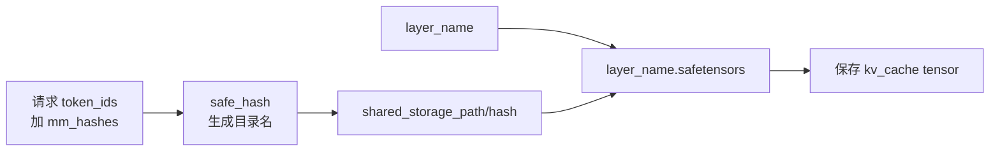

文件路径由 token 序列和多模态 hash 决定：

```python
def _generate_foldername_debug(self, token_ids, mm_hashes, create_folder=False):
    # token_ids 的 bytes 作为缓存 key 的主体。
    token_bytes = token_ids.numpy().tobytes()

    # 多模态 hash 也加入 key，避免路径冲突并形成规范 key。
    if mm_hashes:
        mm_str = "-".join(mm_hashes)
        token_bytes += mm_str.encode("utf-8")

    input_ids_hash = safe_hash(token_bytes, usedforsecurity=False).hexdigest()
    foldername = os.path.join(self._storage_path, input_ids_hash)
    return foldername
```

每一层 attention 的 KV 单独存一个文件：

```python
def _generate_filename_debug(self, layer_name, token_ids, mm_hashes):
    foldername = self._generate_foldername_debug(
        token_ids, mm_hashes=mm_hashes, create_folder=True
    )
    return os.path.join(foldername, f"{layer_name}.safetensors")
```

这个实现很直观：**token 序列决定缓存目录，layer name 决定文件名**。

## ExampleConnector 的加载流程

加载 KV cache 的入口是 `start_load_kv()`。它会遍历 metadata 里的请求，只处理 `is_store=False` 的请求，也就是需要从外部缓存加载 KV 的请求。

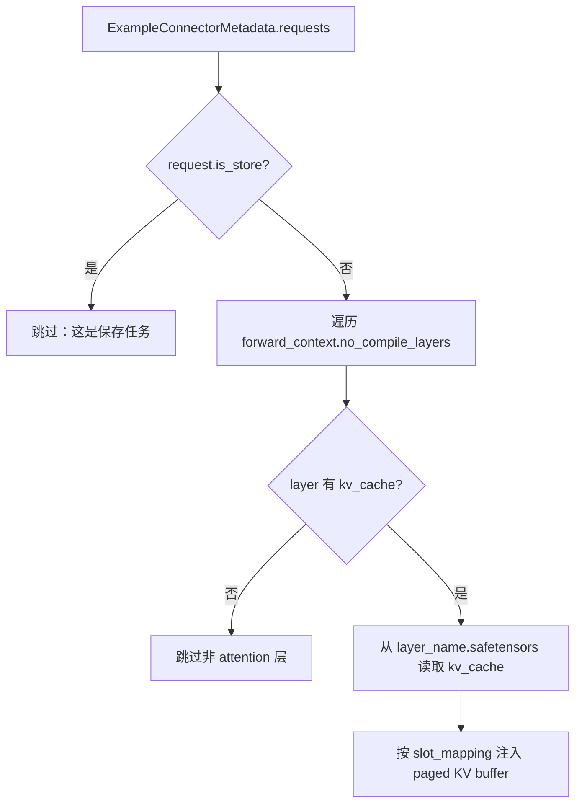

核心代码逻辑如下，注释改成中文后更容易读：

```python
metadata = self._get_connector_metadata()
assert isinstance(metadata, ExampleConnectorMetadata)

attn_metadata = forward_context.attn_metadata
if attn_metadata is None:
    # 没有 attention metadata 时无法知道如何写入 KV buffer。
    return

for request in metadata.requests:
    if request.is_store:
        # 保存任务不在 start_load_kv 里处理。
        continue

    for layer_name in forward_context.no_compile_layers:
        layer = forward_context.no_compile_layers[layer_name]

        # 只处理有 kv_cache 属性的 attention 层，跳过 MLP / MoE 等层。
        kv_cache_layer = getattr(layer, "kv_cache", None)
        if kv_cache_layer is None:
            continue

        filename = self._generate_filename_debug(
            layer_name, request.token_ids, request.mm_hashes
        )
        kv_cache = safetensors.torch.load_file(
            filename, device=str(kv_cache_layer.device)
        )["kv_cache"]

        # 根据 slot_mapping 把磁盘读出的 KV 写回 paged KV buffer。
        inject_kv_into_layer(
            kv_cache_layer,
            kv_cache,
            request.slot_mapping,
            attn_metadata[layer_name],
        )
```

`inject_kv_into_layer()` 要区分 MLA 和普通 attention 的 KV cache 布局。

- MLA 布局里，KV cache 大致按 `[num_pages, page_size, ...]` 展开后写入。
- 普通 attention 布局里，KV cache 大致按 `[num_pages, 2, page_size, ...]` 写入，其中 `2` 通常对应 K/V 两部分。

```python
if isinstance(attn_metadata, MLACommonMetadata):
    # MLA：先把 page 维度展平，再按 slot_mapping 写入。
    dst_kv_cache_layer = dst_kv_cache_layer.reshape(num_pages * page_size, -1)
    dst_kv_cache_layer[slot_mapping, ...] = src_kv_cache
else:
    # 普通 attention：slot_mapping 拆成 block index 和 block 内 offset。
    block_idxs = slot_mapping // self._block_size
    offsets = slot_mapping % self._block_size
    dst_kv_cache_layer[block_idxs, :, offsets] = src_kv_cache
```

ExampleConnector 的 `wait_for_layer_load()` 是空实现，因为它的加载是同步读文件并立即注入，没有真正的异步 layer-by-layer pipeline。

## ExampleConnector 的保存流程

保存 KV cache 的入口是 `save_kv_layer()`。它由 attention 层在每层执行时调用，用来把当前层的 paged KV buffer 抽取出来并写到磁盘。

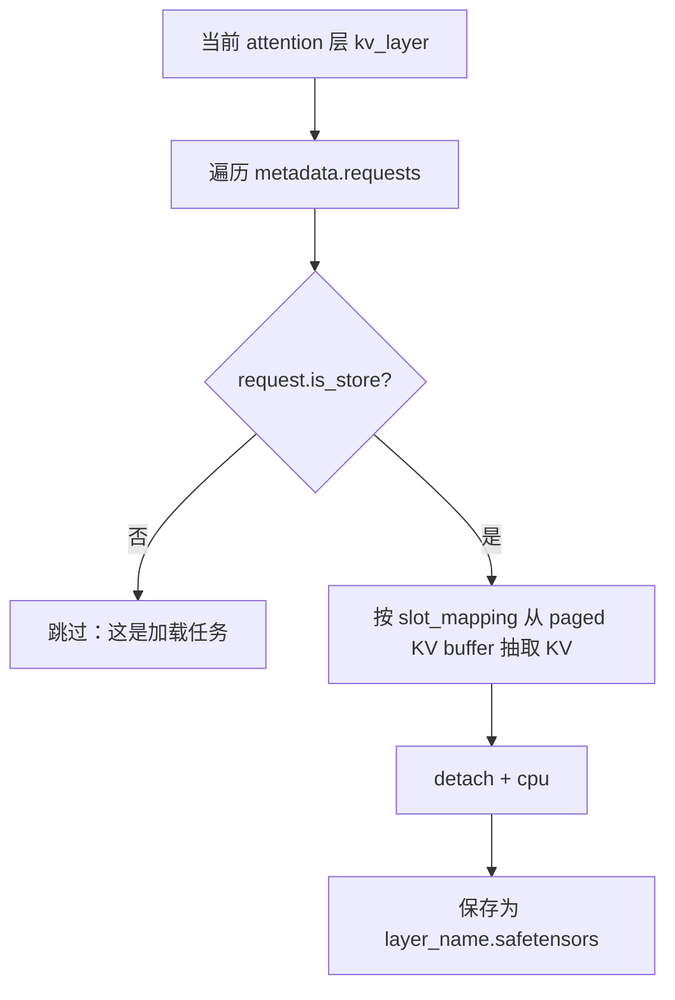

核心代码逻辑如下：

```python
connector_metadata = self._get_connector_metadata()
assert isinstance(connector_metadata, ExampleConnectorMetadata)

for request in connector_metadata.requests:
    if request.is_store:
        filename = self._generate_filename_debug(
            layer_name, request.token_ids, request.mm_hashes
        )

        # 从当前层的 paged KV buffer 里抽出这个请求对应 token 的 KV。
        kv_cache = extract_kv_from_layer(kv_layer, request.slot_mapping)

        # debug 实现：落盘保存为 safetensors。
        tensors = {"kv_cache": kv_cache.detach().cpu()}
        safetensors.torch.save_file(tensors, filename)
```

保存和加载是一对反向操作：

- 保存时：`paged KV buffer -> slot_mapping 抽取 -> safetensors 文件`。
- 加载时：`safetensors 文件 -> slot_mapping 注入 -> paged KV buffer`。

## ExampleConnector 的 Scheduler 侧逻辑

ExampleConnector 的 scheduler 侧负责决定哪些请求要 load，哪些请求要 store。

### 查询外部缓存命中

`get_num_new_matched_tokens()` 用磁盘目录是否存在来判断命中。

```python
def get_num_new_matched_tokens(self, request, num_computed_tokens):
    # debug 假设：prompt = cached_prompt + newly_generated_single_token。
    # 所以用 prompt_token_ids[:-1] 来判断缓存目录。
    if not self._found_match_for_request(request):
        return 0, False

    token_ids = request.prompt_token_ids or []
    num_tokens_to_check = align_to_block_size(
        len(token_ids) - 1, self._block_size
    )

    # 返回外部缓存比本地已计算部分多覆盖了多少 token。
    return num_tokens_to_check - num_computed_tokens, False
```

这里的 `False` 表示不是 async load。ExampleConnector 读磁盘是同步完成的。

`align_to_block_size()` 的实现是向下对齐到 block 边界：

```python
def align_to_block_size(num_tokens: int, block_size) -> int:
    # 返回小于 num_tokens 的最大 block 对齐 token 数。
    return (num_tokens - 1) // block_size * block_size
```

这和 scheduler 的要求有关：当前 v1 scheduler 期望外部命中的 token 数也按 block 粒度对齐。

### 分配 block 后记录需要加载的请求

如果外部命中 token 数大于 0，scheduler 分配完 block 后会调用 `update_state_after_alloc()`。ExampleConnector 在这里把请求记录到 `_requests_need_load`。

```python
def update_state_after_alloc(self, request, blocks, num_external_tokens):
    # 如果这个请求有外部 KV cache 命中，就记录下来。
    # 下一次 build_connector_meta 会把它变成 load metadata。
    if num_external_tokens > 0:
        self._requests_need_load[request.request_id] = request
```

这里的 `blocks` 参数在 ExampleConnector 里没有直接使用，因为它从 `SchedulerOutput` 里拿 block ids。

### 构造本轮 connector metadata

`build_connector_meta()` 是 ExampleConnector 的关键 scheduler-side 方法。它生成 `ExampleConnectorMetadata`，里面每个 `ReqMeta` 都带着 `is_store` 标记。

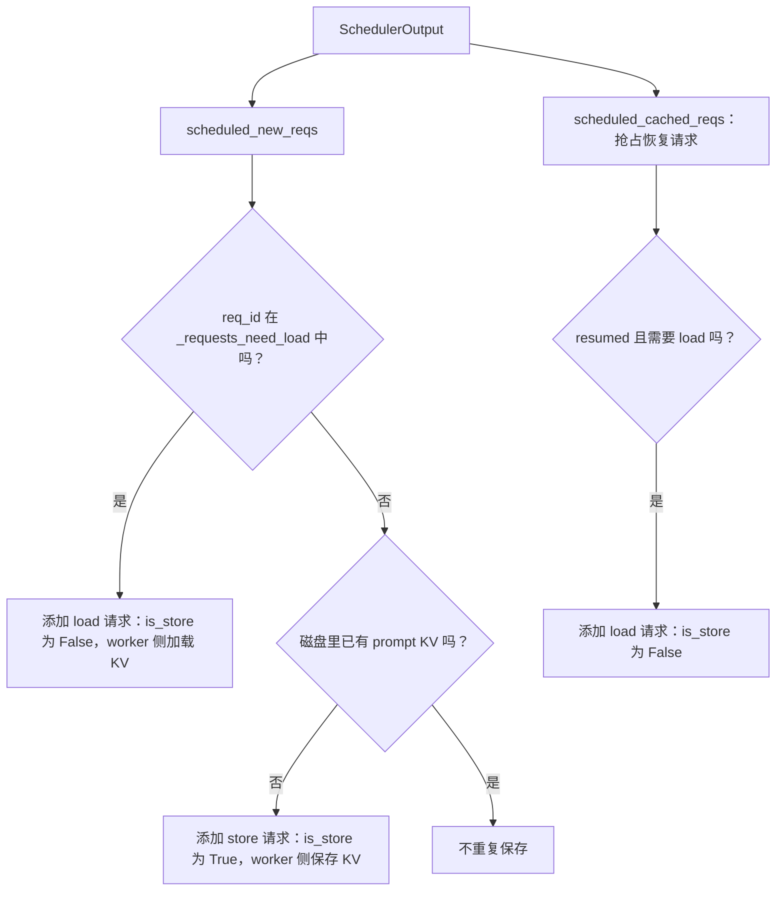

按新请求逻辑看：

```python
for new_req in scheduler_output.scheduled_new_reqs:
    token_ids = new_req.prompt_token_ids or []
    mm_hashes = [f.identifier for f in new_req.mm_features]

    if new_req.req_id in self._requests_need_load:
        # 外部缓存命中：本轮让 worker 加载 KV。
        meta.add_request(
            token_ids=token_ids,
            block_ids=new_req.block_ids[0],
            block_size=self._block_size,
            is_store=False,
            mm_hashes=mm_hashes,
        )
    else:
        # 外部缓存未命中：本轮让 worker 保存 KV，供后续请求复用。
        if not self._found_match_for_prompt(token_ids, mm_hashes):
            meta.add_request(
                token_ids=token_ids,
                block_ids=new_req.block_ids[0],
                block_size=self._block_size,
                is_store=True,
                mm_hashes=mm_hashes,
            )
```

这段逻辑可以和基础介绍里的 producer / consumer 对上：

- `is_store=True`：当前 worker 是 KV producer，要把 KV cache 保存出去。
- `is_store=False`：当前 worker 是 KV consumer，要把已有 KV cache 加载回来。

## ExampleConnector 的完整读写流程

把 scheduler 侧和 worker 侧合起来，ExampleConnector 的一个典型流程如下。

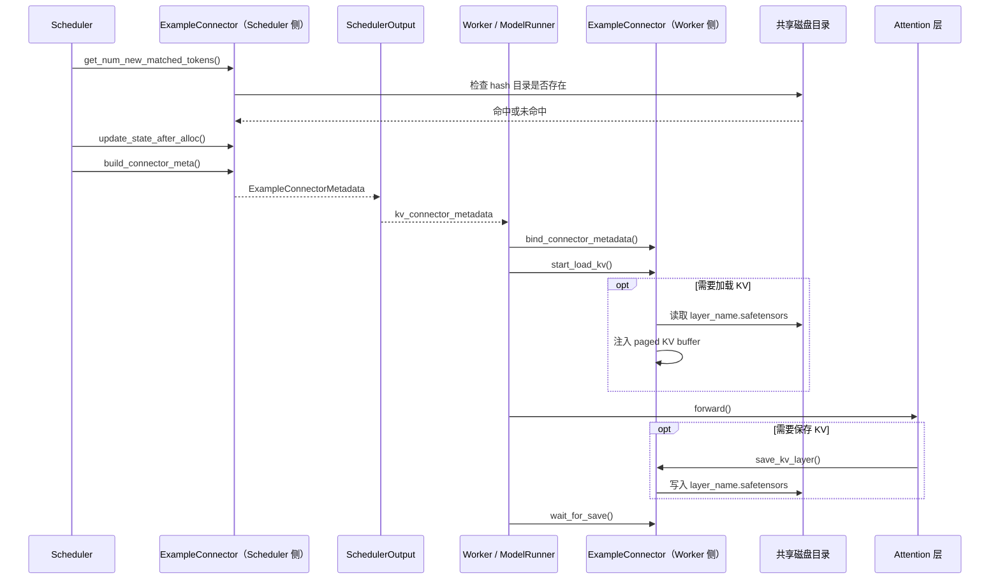

这个流程里，磁盘目录扮演了“外部 KV cache 存储”的角色。生产级 connector 会把这个角色换成 RDMA、分布式 KV store、CPU offload、NIXL 等后端。

## ExampleConnector 的局限

ExampleConnector 很适合学习接口，但不适合作为性能实现。

- **磁盘 I/O 很慢**：每层 KV 都写 `.safetensors`，只是为了 debug 和演示。
- **同步加载**：`wait_for_layer_load()` 是空实现，说明没有真正实现异步分层加载。
- **store / load 被简化为互斥**：代码注释里也说明了，一个请求理论上可以同时有 store 和 load，但这个 debug 实现里把它们简化为互斥。
- **会覆盖已有 prefix cache**：文件头注释提到它会做额外工作，可能覆盖 GPU 里的 prefix cache；要减少开销，需要在 `ReqMeta` 里增加 mask。
- **请求完成逻辑没有特别处理**：它没有 override `request_finished()`，因此使用基类默认行为，不接管 block 的异步释放。

## 从这几个文件建立的整体心智模型

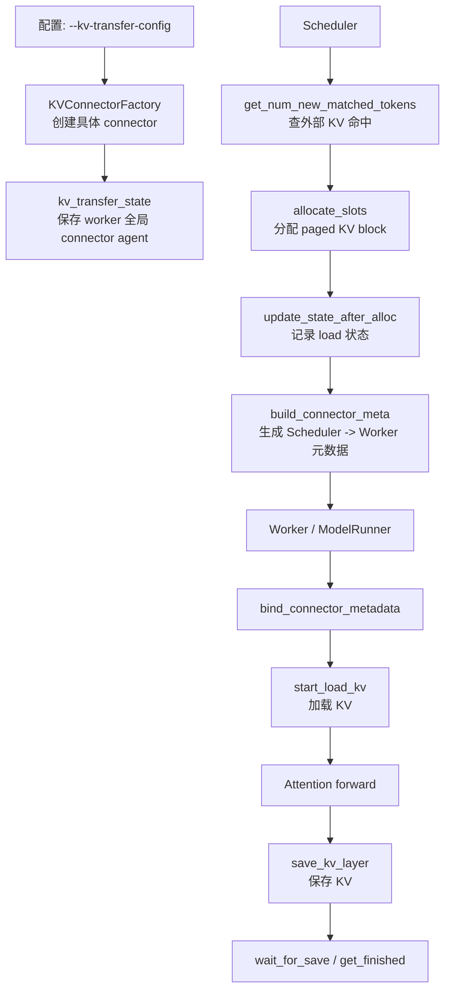

这张图可以作为后续读 NIXL connector 的路线图。NIXL 的代码会复杂很多，但它仍然要填这些接口：scheduler 侧决定哪些请求要传，worker 侧注册 KV cache、启动传输、等待层级加载或保存完成。

## 逐行注释源码附录

这一节补上更接近源码的“逐行注释版”。为了不让笔记被 import、license 和长英文 docstring 淹没，下面保留的是**核心类、字段和方法主体**；每行尽量加中文注释。读的时候可以左右对照原文件：

- `vllm/distributed/kv_transfer/kv_connector/v1/base.py`
- `vllm/distributed/kv_transfer/kv_connector/v1/example_connector.py`

### KVConnectorBase_V1 接口骨架逐行注释

`KVConnectorBase_V1` 最重要的作用是定义“scheduler 侧该实现什么”和“worker 侧该实现什么”。这里必须保留源码里的分区标记，因为它直接告诉你：哪些方法是 worker/model runner/attention 调用的，哪些方法是 scheduler 调用的。

```python
class SupportsHMA(ABC):  # 标记某个 connector 支持 Hybrid Memory Allocator，也就是 HMA。
    """表示 connector 支持 HMA 的接口。

    HMA 场景下，一个请求可能跨多个 KV cache group。支持 HMA 的 connector
    需要在请求结束时一次性处理所有 group 的 block，而不是只处理单组 block。
    """

    @abstractmethod  # 支持 HMA 的 connector 必须实现这个接口。
    def request_finished_all_groups(self, request, block_ids):  # scheduler 侧：请求结束时拿到所有 KV cache group 的 block ids。
        """请求结束且所有 KV cache group 的 block 即将释放前调用。

        Args:
            request: 已经结束的请求对象。
            block_ids: 每个 KV cache group 对应的 block id 列表。

        Returns:
            `(defer_free, kv_transfer_params)`：
            - `defer_free=True` 表示 connector 接管异步保存/发送，block 暂时不能释放。
            - `kv_transfer_params` 会随请求输出返回，可被后续请求或 proxy 使用。
        """
        raise NotImplementedError  # 这里只定义协议，不给默认实现。


def supports_hma(connector: Any) -> bool:  # 工具函数：判断 connector 类或实例是否支持 HMA。
    if isinstance(connector, type):  # 如果传进来的是类。
        return issubclass(connector, SupportsHMA)  # 判断类是否继承 SupportsHMA。
    else:  # 如果传进来的是实例。
        return isinstance(connector, SupportsHMA)  # 判断实例是否实现 SupportsHMA。


class KVConnectorRole(enum.Enum):  # 定义 connector 运行在哪一种 vLLM 内部角色里。
    SCHEDULER = 0  # scheduler 进程里的 connector，负责调度和生成 metadata。
    WORKER = 1  # worker 进程里的 connector，负责模型执行时真正 load/save KV。


class KVConnectorHandshakeMetadata(ABC):  # P/D worker 之间带外握手用的 metadata 基类。
    """P/D worker 之间的带外握手 metadata。

    例如 NIXL 这类 connector 可能需要交换地址、rank、内存注册信息等。
    这个对象必须可序列化，因为它会跨进程或跨节点传递。
    """
    pass  # 基类不规定字段，具体 connector 自己定义。


class KVConnectorMetadata(ABC):  # Scheduler Connector 传给 Worker Connector 的 metadata 基类。
    """Scheduler -> Worker 的 connector metadata。

    Scheduler connector 会在 `build_connector_meta()` 中构造它，
    Worker connector 会在 forward 前通过 `bind_connector_metadata()` 读取它。
    """
    pass  # 例如 ExampleConnector 会定义 ExampleConnectorMetadata(requests=...)。


class KVConnectorWorkerMetadata(ABC):  # Worker Connector 回传给 Scheduler Connector 的 metadata 基类。
    """Worker -> Scheduler 的 connector metadata。

    每个 worker 都可能生成自己的 metadata。单个 engine step 结束后，
    这些 metadata 会先聚合，再交给 scheduler connector。
    """

    @abstractmethod  # 要求子类实现聚合逻辑。
    def aggregate(self, other: "KVConnectorWorkerMetadata") -> "KVConnectorWorkerMetadata":
        """把另一个 worker metadata 合并到当前 metadata。"""
        pass  # scheduler 收到多个 worker metadata 前，需要先把它们合并。


class KVConnectorBase_V1(ABC):  # 所有 v1 KV connector 的抽象基类。
    """v1 KV connector 基类。

    这个类本身不实现具体传输，只规定 scheduler 侧和 worker 侧的接口。
    具体 connector 需要实现抽象方法，并按需要 override 默认空实现。
    """

    @property  # 这是一个属性，不是普通函数调用。
    def prefer_cross_layer_blocks(self) -> bool:  # 是否偏好“跨层 KV block”布局。
        """是否偏好把所有层 KV 放进跨层 block。

        Returns:
            默认 `False`。某些 connector 如果希望按跨层连续内存传输来提升效率，
            可以 override 成 `True`。
        """
        return False  # 默认不要求跨层 block；生产级 connector 可按需要 override。

    def __init__(self, vllm_config, role, kv_cache_config):  # 所有 connector 初始化入口。
        """初始化 connector 基类状态。

        Args:
            vllm_config: 完整 vLLM 配置。
            role: 当前 connector 是 scheduler 侧还是 worker 侧。
            kv_cache_config: KV cache 布局和分组配置。
        """
        self._connector_metadata = None  # worker 侧当前 step 绑定的 Scheduler -> Worker metadata。
        self._vllm_config = vllm_config  # 保存完整 vLLM 配置，子类可能要读并行、缓存等配置。
        if vllm_config.kv_transfer_config is not None:  # KV transfer 配置必须存在。
            self._kv_transfer_config = vllm_config.kv_transfer_config  # 保存 connector 专用配置。
        else:  # 没有 KV transfer 配置却创建 connector，属于使用错误。
            raise ValueError("kv_transfer_config must be set for KVConnectorBase_V1")
        self._kv_cache_config = kv_cache_config  # 保存 KV cache 布局、group 等信息。
        self._role = role  # 记录当前 connector 是 scheduler 角色还是 worker 角色。

    @property  # 让外部可以只读访问 role。
    def role(self) -> KVConnectorRole:  # 返回当前 connector 所在角色。
        """返回当前 connector 的运行角色。"""
        return self._role  # SCHEDULER 或 WORKER。

    # ==============================
    # Worker-side methods
    # ==============================
    # 下面这些方法运行在 worker / model runner / attention 侧。
    # 它们负责绑定 metadata、加载 KV、逐层等待、逐层保存、回报完成状态。

    def bind_connector_metadata(self, connector_metadata: KVConnectorMetadata) -> None:
        """绑定 scheduler 生成的 connector metadata。

        这个函数通常由 model runner 在每次模型执行前调用。
        metadata 会在本轮 forward 中指导 worker connector 加载或保存 KV cache。
        """
        self._connector_metadata = connector_metadata  # worker forward 前绑定 scheduler 生成的 metadata。

    def clear_connector_metadata(self) -> None:
        """清理当前绑定的 connector metadata。

        这个函数通常由 model runner 在每次模型执行后调用，避免 metadata 泄漏到下一轮。
        """
        self._connector_metadata = None  # worker forward 后清理 metadata，避免污染下一步。

    def _get_connector_metadata(self) -> KVConnectorMetadata:
        """获取当前已绑定的 connector metadata。

        这个函数只应该在 connector 内部调用。调用前必须已经执行过
        `bind_connector_metadata()`。
        """
        assert self._connector_metadata is not None  # 只有绑定 metadata 后才能读取。
        return self._connector_metadata  # 子类内部通过它拿到本轮 load/store 计划。

    def has_connector_metadata(self) -> bool:
        """判断当前 worker connector 是否已经绑定 metadata。"""
        return self._connector_metadata is not None  # True 表示当前 forward 有 connector metadata。

    def register_kv_caches(self, kv_caches: dict[str, torch.Tensor]):
        """注册每层 KV cache tensor。

        Args:
            kv_caches: layer name 到 KV cache tensor 的映射。

        Note:
            NIXL 这类 connector 可能需要提前注册 GPU 内存，ExampleConnector 不需要。
        """
        return  # 默认空实现。

    def register_cross_layers_kv_cache(self, kv_cache, attn_backend):
        """注册跨层 KV cache tensor。

        某些模型或 connector 会使用一个大 tensor 存所有层 KV。只有当
        `prefer_cross_layer_blocks=True` 且模型层布局统一时才会走这个接口。
        """
        return  # 默认不处理。

    def set_host_xfer_buffer_ops(self, copy_operation: CopyBlocksOp):
        """设置 host/device KV 拷贝操作。

        host buffer 传输时可能需要平台相关的 h2d / d2h copy op。
        """
        return  # 默认不处理。

    def handle_preemptions(self, kv_connector_metadata: KVConnectorMetadata):
        """处理抢占或 block 覆盖前的 connector 逻辑。

        异步保存类 connector 可能要在 block 被覆盖前先把旧 KV 保存出去。
        """
        return  # 默认不处理。

    @abstractmethod  # 子类必须实现 worker 侧加载入口。
    def start_load_kv(self, forward_context: "ForwardContext", **kwargs: Any) -> None:
        """开始把 connector 中的 KV cache 加载到 vLLM paged KV buffer。

        调用位置通常在 forward 前。connector 可以同步完成加载，也可以只启动异步加载，
        再由 `wait_for_layer_load()` 在每层 attention 前等待。
        """
        pass  # 抽象方法，子类必须实现。

    @abstractmethod  # 子类必须实现 layer 级等待加载完成接口。
    def wait_for_layer_load(self, layer_name: str) -> None:
        """等待指定层的 KV cache 已经加载到 paged KV buffer。

        调用位置通常在 attention layer 内部。这个接口支持 layer-by-layer pipeline。
        """
        pass  # 抽象方法，子类必须实现。

    @abstractmethod  # 子类必须实现 layer 级保存接口。
    def save_kv_layer(self, layer_name, kv_layer, attn_metadata, **kwargs) -> None:
        """把当前层 KV cache 从 paged KV buffer 保存到 connector。

        调用位置通常在 attention layer 内部。connector 可以同步保存，也可以启动异步保存。
        """
        pass  # 抽象方法，子类必须实现。

    @abstractmethod  # 子类必须实现保存完成等待接口。
    def wait_for_save(self):
        """等待所有 save 操作完成。

        调用位置通常在 forward 结束时。这样可以避免 paged KV buffer 被覆盖时，
        异步保存还没有完成。
        """
        pass  # 抽象方法，子类必须实现。

    def get_finished(self, finished_req_ids: set[str]) -> tuple[set[str] | None, set[str] | None]:
        """回报异步发送/保存和接收/加载完成的请求。

        Args:
            finished_req_ids: worker 已经完成生成的请求 id 集合。

        Returns:
            `(finished_sending, finished_recving)`，分别表示异步 send/save 和 recv/load 完成的请求。
        """
        return None, None  # 默认没有异步任务。

    def get_block_ids_with_load_errors(self) -> set[int]:
        """返回加载失败的 block id 集合。"""
        return set()  # 默认认为没有失败。

    def shutdown(self):
        """worker 退出时关闭 connector 并释放资源。"""
        return None  # 默认无需清理。

    def get_kv_connector_stats(self):
        """返回最近一个统计周期内的 connector 指标。"""
        return None  # 默认没有指标。

    def get_kv_connector_kv_cache_events(self):
        """返回最近收集到的 KV cache events。"""
        return None  # 默认没有事件。

    def get_handshake_metadata(self):
        """返回 P/D worker 带外握手 metadata。"""
        return None  # 默认不需要握手。

    def build_connector_worker_meta(self):
        """构造 Worker -> Scheduler 的 metadata。"""
        return None  # 默认 worker 没有额外信息要回传。

    # ==============================
    # Scheduler-side methods
    # ==============================
    # 下面这些方法运行在 scheduler 侧。
    # 它们负责查询外部 KV 命中、记录 block 分配、生成 worker metadata、处理请求结束。

    def bind_gpu_block_pool(self, gpu_block_pool: "BlockPool") -> None:
        """绑定 GPU block pool 给 scheduler connector 使用。

        connector 如果需要追踪 block 引用计数、prefix cache block 状态，可以 override。
        """
        return  # 默认不处理。

    @abstractmethod  # 子类必须实现 scheduler 侧“外部 KV 命中查询”。
    def get_num_new_matched_tokens(self, request: "Request", num_computed_tokens: int):
        """查询外部 KV cache 能提供多少额外 token。

        Args:
            request: 当前 scheduler 正在考虑调度的请求。
            num_computed_tokens: 本地已经计算或本地 prefix cache 命中的 token 数。

        Returns:
            `(num_external_tokens, load_kv_async)`：
            - `num_external_tokens=None` 表示暂时无法确定，scheduler 应稍后重试。
            - `load_kv_async=True` 表示外部 KV 会异步加载。
        """
        pass  # 抽象方法，子类必须实现。

    @abstractmethod  # 子类必须实现 scheduler 侧“分配 block 后更新状态”。
    def update_state_after_alloc(self, request: "Request", blocks: "KVCacheBlocks", num_external_tokens: int):
        """scheduler 分配 KV block 后通知 connector 更新状态。

        典型用途是：如果某个请求要从外部加载 KV，那么 connector 需要记录
        request、block ids、token 数等，供 `build_connector_meta()` 使用。
        """
        pass  # 抽象方法，子类必须实现。

    @abstractmethod  # 子类必须实现 scheduler 侧“构造 metadata”。
    def build_connector_meta(self, scheduler_output: SchedulerOutput) -> KVConnectorMetadata:
        """根据本轮调度结果构造 Scheduler -> Worker metadata。

        注意：这个函数不应该修改 `scheduler_output` 的其他字段。
        """
        pass  # 抽象方法，子类必须实现。

    def on_new_request(self, request: "Request") -> None:
        """scheduler 接收到新请求时的 connector 钩子。"""
        return  # 默认不做 bookkeeping。

    def update_connector_output(self, connector_output: KVConnectorOutput):
        """scheduler 根据 worker connector 输出更新自身状态。"""
        return  # 默认不处理。

    def request_finished(self, request: "Request", block_ids: list[int]):
        """请求结束且 block 即将释放前调用。

        Returns:
            `(defer_free, kv_transfer_params)`。默认 `defer_free=False`，表示 connector
            不接管异步释放，scheduler 可以按正常流程释放 block。
        """
        return False, None  # 默认不接管 block 释放，也不返回 kv_transfer_params。

    def take_events(self):
        """取走 connector 收集到的新 KV cache events。"""
        return ()  # 默认没有事件。

    def has_pending_push_work(self) -> bool:
        """是否还有 push 模式后台工作需要 engine 继续 step。"""
        return False  # 默认没有 pending push work。

    @classmethod
    def get_required_kvcache_layout(cls, vllm_config) -> str | None:
        """返回 connector 要求的 KV cache layout，例如 HND 或 NHD。"""
        if cls is KVConnectorBase_V1:  # 抽象基类不能被直接查询布局要求。
            raise TypeError("get_required_kvcache_layout should not be called on the abstract base class")
        return None  # 默认不要求特殊 KV cache layout。

    @classmethod
    def requires_piecewise_for_cudagraph(cls, extra_config: dict[str, Any]) -> bool:
        """判断 connector 是否要求 PIECEWISE CUDA graph 模式。

        如果 connector 依赖 Python 逐层执行 `wait_for_layer_load()` 或 `save_kv_layer()`，
        就不能让整段 forward 被 CUDA graph 完整捕获，需要 piecewise 模式。
        """
        return False  # 默认不需要 PIECEWISE CUDA graph。

    def get_finished_count(self) -> int | None:
        """返回 connector 期望聚合的完成计数。"""
        return None  # 默认使用 world_size。

    @classmethod
    def build_kv_connector_stats(cls, data=None):
        """根据 connector 自定义数据构造 stats 对象。"""
        return None  # 默认没有自定义 stats。

    def set_xfer_handshake_metadata(self, metadata):
        """设置 TP rank -> handshake metadata。"""
        return None  # 默认不处理。

    def set_xfer_handshake_metadata_pp_aware(self, metadata):
        """设置 PP-aware 的 handshake metadata。"""
        if any(pp_rank != 0 for pp_rank, _ in metadata):  # 默认实现只支持 pp_rank 为 0。
            raise ValueError(f"{type(self).__name__} received pp_rank > 0 handshake metadata but does not support PP-disaggregated KV transfer.")
        self.set_xfer_handshake_metadata({tp_rank: meta for (_, tp_rank), meta in metadata.items()})  # 转成非 PP-aware 格式。

    def reset_cache(self) -> bool | None:
        """重置 connector 内部缓存。"""
        logger.debug("Connector cache reset requested, but %s does not implement reset_cache().", type(self).__name__)  # 记录 debug 日志。
        return None  # 默认不支持 reset cache。
```

这段骨架说明了一个核心事实：`KVConnectorBase_V1` 本身没有任何具体 KV 传输逻辑，它只是规定了 **scheduler 如何问、worker 如何做、两边如何通过 metadata 对接**。读这个文件时，先看分区标题：`Worker-side methods` 是模型执行期间调用的，`Scheduler-side methods` 是调度阶段调用的。

### ExampleConnector 逐行注释版

`ExampleConnector` 是最适合入门的实现，因为它把“外部 KV cache 后端”简化成了共享磁盘目录：Prefill 侧把 KV 写成 `.safetensors`，Decode 侧再按同样的 key 读回来。

```python
@dataclass  # 自动生成 __init__ 等方法，适合保存请求级 metadata。
class ReqMeta:  # 一个请求在 connector 里对应的一条 load/store 计划。
    token_ids: torch.Tensor  # 参与缓存 key 计算的 token 序列，通常是 prompt token 的 block 对齐前缀。
    slot_mapping: torch.Tensor  # token 在 paged KV buffer 中的 slot 位置，一般和 token_ids 等长。
    is_store: bool  # True 表示保存 KV，False 表示加载 KV。
    mm_hashes: list[str]  # 多模态输入的 hash，避免同 token 不同图片/音频发生 key 冲突。

    @staticmethod  # 不依赖已有 ReqMeta 实例，只是一个构造辅助函数。
    def make_meta(token_ids, block_ids, block_size, is_store, mm_hashes) -> "ReqMeta":
        valid_num_tokens = align_to_block_size(len(token_ids), block_size)  # token 数向下对齐到 block 边界。
        token_ids_tensor = torch.tensor(token_ids)[:valid_num_tokens]  # 只保留 block 对齐后的 token。
        block_ids_tensor = torch.tensor(block_ids)  # 把 block id 列表转成 tensor，方便向量化计算。
        num_blocks = block_ids_tensor.shape[0]  # 当前请求占用了多少个 KV block。
        block_offsets = torch.arange(0, block_size)  # 一个 block 内部的 token offset：0 到 block_size-1。
        slot_mapping = (  # 计算每个 token 在 paged KV buffer 中的全局 slot。
            block_offsets.reshape((1, block_size))  # 形状变成 [1, block_size]，用于广播。
            + block_ids_tensor.reshape((num_blocks, 1)) * block_size  # block_id * block_size 得到 block 起始 slot。
        )  # 结果形状是 [num_blocks, block_size]。
        slot_mapping = slot_mapping.flatten()[:valid_num_tokens]  # 展平成 token 级 slot，并裁掉多余位置。
        return ReqMeta(  # 返回请求级 metadata。
            token_ids=token_ids_tensor,  # 保存对齐后的 token ids。
            slot_mapping=slot_mapping,  # 保存 token -> paged KV slot 的映射。
            is_store=is_store,  # 保存本请求是 store 还是 load。
            mm_hashes=mm_hashes,  # 保存多模态 hash。
        )


@dataclass  # scheduler -> worker 的 metadata 容器。
class ExampleConnectorMetadata(KVConnectorMetadata):  # 继承 KVConnectorMetadata，说明它会塞进 SchedulerOutput。
    requests: list[ReqMeta] = field(default_factory=list)  # 本轮所有需要 connector 处理的请求计划。

    def add_request(self, token_ids, block_ids, block_size, is_store, mm_hashes) -> None:
        self.requests.append(  # 往本轮 metadata 里追加一个请求计划。
            ReqMeta.make_meta(token_ids, block_ids, block_size, is_store, mm_hashes)  # 把原始字段转成 ReqMeta。
        )


class ExampleConnector(KVConnectorBase_V1):  # ExampleConnector 是 KVConnectorBase_V1 的一个具体实现。
    def __init__(self, vllm_config, role, kv_cache_config):  # connector 初始化入口。
        super().__init__(  # 先调用基类初始化，保存 vllm_config、kv_transfer_config、role 等。
            vllm_config=vllm_config,  # 完整 vLLM 配置。
            role=role,  # 当前实例是 scheduler connector 还是 worker connector。
            kv_cache_config=kv_cache_config,  # KV cache 配置。
        )
        self._block_size = vllm_config.cache_config.block_size  # 记录 block_size，后面算 slot_mapping 要用。
        self._requests_need_load: dict[str, Request] = {}  # scheduler 侧状态：哪些请求下一步需要 load 外部 KV。
        self._storage_path = self._kv_transfer_config.get_from_extra_config(  # 从 extra_config 读取共享存储目录。
            "shared_storage_path", "/tmp"  # 没配时默认写到 /tmp。
        )
        logger.info(self._kv_transfer_config)  # 打印 KV transfer 配置，方便 debug。
        logger.info("Shared storage path is %s", self._storage_path)  # 打印共享目录。
```

上面这段先建立 ExampleConnector 的数据模型：scheduler 侧会构造 `ExampleConnectorMetadata(requests=[ReqMeta, ...])`，worker 侧拿到 metadata 后按 `ReqMeta.is_store` 决定保存还是加载。

```python
    def start_load_kv(self, forward_context, **kwargs) -> None:  # worker 侧：forward 前启动 KV 加载。
        """从 connector 缓冲区加载 KV cache 到 vLLM 的 paged KV buffer。

        Args:
            forward_context: 当前模型 forward 的上下文，里面包含 attention metadata
                和可访问的 layer 对象。
            **kwargs: 预留给具体 connector 的额外加载参数。

        Note:
            ExampleConnector 是同步磁盘读取实现：这个函数返回时，匹配请求的
            KV cache 已经被写入本地 paged KV buffer。
        """
        def inject_kv_into_layer(dst_kv_cache_layer, src_kv_cache, slot_mapping, attn_metadata) -> None:
            if isinstance(attn_metadata, MLACommonMetadata):  # MLA attention 的 KV cache 布局不同，需要特殊处理。
                dst_kv_cache_layer_shape = dst_kv_cache_layer.shape  # 读取目标 KV cache tensor 形状。
                num_pages = dst_kv_cache_layer_shape[0]  # 第一维是 page 数。
                page_size = dst_kv_cache_layer_shape[1]  # 第二维是每个 page 的 token 数。
                dst_kv_cache_layer = dst_kv_cache_layer.reshape(num_pages * page_size, -1)  # 展平成 token slot 维度。
                dst_kv_cache_layer[slot_mapping, ...] = src_kv_cache  # 按 slot_mapping 把外部 KV 写进目标 KV buffer。
            else:  # 非 MLA attention 使用常见的 [block, K/V, offset, ...] 布局。
                block_idxs = slot_mapping // self._block_size  # slot 除以 block_size 得到 block index。
                offsets = slot_mapping % self._block_size  # slot 对 block_size 取模得到 block 内 offset。
                dst_kv_cache_layer[block_idxs, :, offsets] = src_kv_cache  # 写入对应 block 和 offset 的 K/V 位置。

        metadata = self._get_connector_metadata()  # 读取 scheduler 通过 SchedulerOutput 传来的 metadata。
        assert isinstance(metadata, ExampleConnectorMetadata)  # ExampleConnector 只接受自己的 metadata 类型。

        attn_metadata = forward_context.attn_metadata  # 从 forward context 拿 attention metadata。
        if attn_metadata is None:  # 没有 attention metadata 就无法判断 KV 布局。
            logger.warning("In connector.start_load_kv, but the attn_metadata is None")  # 打 warning 方便定位。
            return  # 直接退出，不加载 KV。

        for request in metadata.requests:  # 遍历本轮 scheduler 交给 worker 的每个请求计划。
            if request.is_store:  # start_load_kv 只处理 load 请求。
                continue  # store 请求留给 save_kv_layer 处理。
            logger.info("Inject KV cache of %d tokens to the paged memory", len(request.slot_mapping))  # 打印注入 token 数。
            for layer_name in forward_context.no_compile_layers:  # 遍历不被 compile 捕获的层，通常可访问 Python 层对象。
                layer = forward_context.no_compile_layers[layer_name]  # 根据层名拿到层对象。
                kv_cache_layer = getattr(layer, "kv_cache", None)  # 只有 attention 层才有 kv_cache 属性。
                if kv_cache_layer is None:  # MLP / MoE 等非 attention 层没有 KV cache。
                    continue  # 跳过非 attention 层。
                filename = self._generate_filename_debug(layer_name, request.token_ids, request.mm_hashes)  # 算出这一层 KV 文件路径。
                kv_cache = safetensors.torch.load_file(filename, device=str(kv_cache_layer.device))["kv_cache"]  # 从磁盘读 KV 到目标设备。
                if isinstance(attn_metadata, dict):  # 多层 attention metadata 通常按 layer_name 存在 dict 里。
                    inject_kv_into_layer(  # 把磁盘读出的 KV 注入本地 paged KV buffer。
                        kv_cache_layer,  # 目标：当前 attention 层的 paged KV buffer。
                        kv_cache,  # 来源：磁盘读取的 KV tensor。
                        request.slot_mapping,  # token 写入位置。
                        attn_metadata[layer_name],  # 当前层 attention metadata。
                    )
```

这段代码对应 Decode worker 的行为：**外部 KV cache 已经存在，所以 worker 在 forward 前把 KV 注入本地 paged KV buffer**。ExampleConnector 是同步读文件，所以它的 `wait_for_layer_load()` 是空实现。

```python
    def wait_for_layer_load(self, layer_name: str) -> None:  # worker 侧：等待某一层 KV 加载完成。
        """等待指定 attention 层的 KV cache 加载完成。

        Args:
            layer_name: 当前 attention 层的名字。

        Note:
            ExampleConnector 没有异步加载，所以这里是空实现。异步 connector
            会在这里阻塞，直到当前层 KV 已经可用。
        """
        return  # ExampleConnector 同步加载，start_load_kv 返回时已经加载完，所以这里什么都不做。

    def save_kv_layer(self, layer_name, kv_layer, attn_metadata, **kwargs) -> None:  # worker 侧：保存当前层 KV。
        """把当前 attention 层的 KV cache 从 paged KV buffer 保存到 connector。

        Args:
            layer_name: 当前 attention 层名字，用来生成每层独立的缓存文件名。
            kv_layer: 当前层在 vLLM 内部的 paged KV buffer。
            attn_metadata: 当前层 attention metadata，用来判断 KV cache 布局。
            **kwargs: 预留给具体 connector 的额外保存参数。

        Note:
            ExampleConnector 会按 `slot_mapping` 抽取请求对应 token 的 KV，
            然后同步保存成 safetensors 文件。
        """
        def extract_kv_from_layer(layer, slot_mapping) -> torch.Tensor:  # 从 paged KV buffer 抽取当前请求对应 token 的 KV。
            if isinstance(attn_metadata, MLACommonMetadata):  # MLA 布局特殊处理。
                num_pages, page_size = layer.shape[0], layer.shape[1]  # 取 page 数和 page size。
                return layer.reshape(num_pages * page_size, -1)[slot_mapping, ...]  # 展平后按 slot 抽取 KV。
            block_idxs = slot_mapping // self._block_size  # 普通布局：slot -> block index。
            offsets = slot_mapping % self._block_size  # 普通布局：slot -> block 内 offset。
            return layer[block_idxs, :, offsets]  # 抽取对应 token 的 K/V。

        connector_metadata = self._get_connector_metadata()  # 读取本轮 scheduler metadata。
        assert isinstance(connector_metadata, ExampleConnectorMetadata)  # 确认 metadata 类型正确。
        for request in connector_metadata.requests:  # 遍历本轮请求计划。
            if request.is_store:  # save_kv_layer 只处理 store 请求。
                filename = self._generate_filename_debug(layer_name, request.token_ids, request.mm_hashes)  # 生成当前层输出文件路径。
                kv_cache = extract_kv_from_layer(kv_layer, request.slot_mapping)  # 从本地 paged KV buffer 抽出 KV。
                tensors = {"kv_cache": kv_cache.detach().cpu()}  # detach 避免 autograd，cpu 表示写盘前搬到 CPU。
                safetensors.torch.save_file(tensors, filename)  # 保存为 safetensors 文件。

    def wait_for_save(self):  # worker 侧：等待保存完成。
        """等待所有 KV 保存任务完成。

        Note:
            ExampleConnector 是同步保存，`save_kv_layer()` 返回时文件已经写完，
            所以这里不需要额外等待。异步 connector 会在这里等待后台传输完成。
        """
        return  # ExampleConnector 同步保存，save_kv_layer 返回时已经写完。
```

这段代码对应 Prefill worker 的行为：**Prefill 计算出每层 KV 后，worker connector 把这些 KV 从 paged KV buffer 抽出来并写到共享目录**。

```python
    def get_num_new_matched_tokens(self, request, num_computed_tokens) -> tuple[int | None, bool]:  # scheduler 侧：查询外部 KV 命中。
        """查询外部 KV cache 能覆盖多少新的 token。

        Args:
            request: scheduler 当前正在考虑调度的请求。
            num_computed_tokens: 本地 prefix cache 已经命中的 token 数。

        Returns:
            一个二元组 `(num_external_tokens, load_kv_async)`：
            - `num_external_tokens` 表示外部 KV cache 比本地已计算部分多覆盖多少 token。
            - `load_kv_async` 表示这些外部 KV 是否会异步加载。

        Note:
            ExampleConnector 用磁盘目录是否存在来判断外部缓存命中，并且同步加载，
            所以第二个返回值恒为 `False`。
        """
        if not self._found_match_for_request(request):  # 如果磁盘上找不到这个请求对应的缓存目录。
            return 0, False  # 外部命中 0 个 token，并且不需要异步加载。

        logger.info("External Cache Hit!")  # 打日志说明外部 KV cache 命中。
        token_ids = request.prompt_token_ids or []  # 取 prompt token；没有时用空列表兜底。
        num_tokens_to_check = align_to_block_size(len(token_ids) - 1, self._block_size)  # 只检查 prompt 去掉最后一个 token 后的 block 对齐前缀。
        return num_tokens_to_check - num_computed_tokens, False  # 返回“外部比本地多覆盖的 token 数”；False 表示同步加载。

    def update_state_after_alloc(self, request, blocks, num_external_tokens):  # scheduler 侧：KV block 分配后更新 connector 状态。
        """在 scheduler 分配 KV block 后更新 connector 状态。

        Args:
            request: 当前请求对象。
            blocks: scheduler 为该请求分配的 KV cache blocks。
            num_external_tokens: 将从外部 KV cache 加载的 token 数。

        Note:
            ExampleConnector 只需要记录“哪些请求下一步要 load”，真正的 block ids
            会在 `build_connector_meta()` 里从 `SchedulerOutput` 获取。
        """
        if num_external_tokens > 0:  # 只有外部 KV 命中时才需要加载。
            self._requests_need_load[request.request_id] = request  # 记录请求，稍后 build_connector_meta 会生成 load metadata。

    def build_connector_meta(self, scheduler_output) -> KVConnectorMetadata:  # scheduler 侧：构造本轮传给 worker 的 metadata。
        """根据本轮 scheduler 输出构造 Scheduler -> Worker 的 connector metadata。

        Args:
            scheduler_output: 本轮调度结果，包含新请求、cached 请求、block ids、
                每个请求本轮调度 token 数等信息。

        Returns:
            `ExampleConnectorMetadata`，里面每个 `ReqMeta` 描述一个请求本轮
            要 load KV 还是 store KV，以及 token 到 paged KV buffer 的映射。

        Note:
            这个函数会消耗并清空 `_requests_need_load`，因此它既是 metadata
            构造函数，也是 ExampleConnector scheduler 侧状态推进点。
        """
        meta = ExampleConnectorMetadata()  # 新建空 metadata 容器。
        total_need_load = 0  # 统计本轮需要 load 的请求数，用于最后自检。

        for new_req in scheduler_output.scheduled_new_reqs:  # 遍历本轮新调度的请求。
            token_ids = new_req.prompt_token_ids or []  # 取请求 prompt token。
            mm_hashes = [f.identifier for f in new_req.mm_features]  # 取多模态特征 hash。
            if new_req.req_id in self._requests_need_load:  # 如果之前 update_state_after_alloc 标记它需要 load。
                meta.add_request(  # 往 metadata 添加一个 load 请求。
                    token_ids=token_ids,  # 用 prompt token 构造缓存 key。
                    block_ids=new_req.block_ids[0],  # 使用第一个 KV cache group 的 block ids。
                    block_size=self._block_size,  # 传入 block_size 以计算 slot_mapping。
                    is_store=False,  # False 表示 worker 侧要加载 KV。
                    mm_hashes=mm_hashes,  # 传入多模态 hash。
                )
                total_need_load += 1  # 记录一个 load 请求。
            else:  # 如果这个新请求不需要 load，则考虑是否需要 store。
                if not self._found_match_for_prompt(token_ids, mm_hashes):  # 如果磁盘还没有对应 prompt KV。
                    meta.add_request(  # 往 metadata 添加一个 store 请求。
                        token_ids=token_ids,  # 保存这个 prompt 对应的 KV。
                        block_ids=new_req.block_ids[0],  # 当前请求分配到的 KV block ids。
                        block_size=self._block_size,  # 用于计算 slot_mapping。
                        is_store=True,  # True 表示 worker 侧要保存 KV。
                        mm_hashes=mm_hashes,  # 多模态 hash 参与缓存 key。
                    )

        cached_reqs = scheduler_output.scheduled_cached_reqs  # 本轮调度的 cached/resumed 请求集合。
        for i, req_id in enumerate(cached_reqs.req_ids):  # 遍历这些 cached 请求。
            resumed_from_preemption = req_id in cached_reqs.resumed_req_ids  # 判断是否从 preemption 恢复。
            if not resumed_from_preemption or req_id not in self._requests_need_load:  # 只处理“恢复且需要 load”的请求。
                continue  # 其他 cached 请求不需要 ExampleConnector 处理。

            num_computed_tokens = cached_reqs.num_computed_tokens[i]  # 已经计算的 token 数。
            num_new_tokens = scheduler_output.num_scheduled_tokens[req_id]  # 本轮新调度的 token 数。
            new_block_ids = cached_reqs.new_block_ids[i]  # 恢复请求本轮使用的 block ids。
            request = self._requests_need_load[req_id]  # 从暂存 dict 找回完整 Request。
            total_tokens = num_computed_tokens + num_new_tokens  # 需要覆盖的总 token 数。
            token_ids = request.all_token_ids[:total_tokens]  # cached_req 本身 token 信息不全，所以从 Request 里取完整前缀。
            assert new_block_ids is not None  # resumed 请求应当有 block ids。
            block_ids = new_block_ids[0]  # 取第一个 KV cache group 的 block ids。

            meta.add_request(  # 添加一个 load 请求。
                token_ids=token_ids,  # 用完整前缀 token 构造 key。
                block_ids=block_ids,  # 对应目标 paged KV block。
                block_size=self._block_size,  # 用于 slot_mapping。
                is_store=False,  # 这是 load。
                mm_hashes=[f.identifier for f in request.mm_features],  # 多模态 hash。
            )
            total_need_load += 1  # load 请求计数加一。

        assert total_need_load == len(self._requests_need_load)  # 确保所有标记要 load 的请求都被放进 metadata。
        self._requests_need_load.clear()  # metadata 已经构造完，清空临时状态，避免下轮重复处理。
        return meta  # 返回 Scheduler -> Worker metadata。
```

这段是 ExampleConnector 最关键的 scheduler 逻辑：命中外部缓存的请求会走 `is_store=False`，未命中的新请求会走 `is_store=True`。也就是说，**同一个 connector 类既能在 P 侧做 KV 生产，也能在 D 侧做 KV 消费，具体行为由 scheduler 生成的 metadata 决定**。

```python
    def _found_match_for_request(self, request) -> bool:  # scheduler 侧辅助函数：判断某个 Request 是否命中磁盘缓存。
        """判断一个 Request 的 prompt 前缀是否已经有磁盘 KV cache。"""
        return self._found_match_for_prompt(  # 复用 prompt 级判断函数。
            list(request.prompt_token_ids or []),  # Request 里的 prompt token。
            [f.identifier for f in request.mm_features],  # Request 里的多模态 hash。
        )

    def _found_match_for_prompt(self, prompt_token_ids, mm_hashes) -> bool:  # 根据 prompt token 和多模态 hash 判断缓存是否存在。
        """根据 prompt token 和多模态 hash 检查对应缓存目录是否存在。"""
        num_tokens_to_check = align_to_block_size(  # 计算需要作为 key 的 block 对齐 token 数。
            len(prompt_token_ids) - 1, self._block_size  # debug 假设最后一个 token 是新生成 token，所以排除掉。
        )
        foldername = self._generate_foldername_debug(  # 根据 token 前缀和 mm_hashes 生成缓存目录。
            torch.tensor(prompt_token_ids)[:num_tokens_to_check],  # 只使用 block 对齐后的前缀 token。
            mm_hashes,  # 多模态 hash 也参与 key。
            create_folder=False,  # 查询时不创建目录。
        )
        return os.path.exists(foldername)  # 目录存在就认为外部 KV cache 命中。

    def _generate_foldername_debug(self, token_ids, mm_hashes, create_folder=False) -> str:  # 生成缓存目录名。
        """根据 token 前缀和多模态 hash 生成缓存目录路径。"""
        token_bytes = token_ids.numpy().tobytes()  # 把 token tensor 转成 bytes，作为 hash 输入。
        if mm_hashes:  # 如果请求有多模态输入。
            mm_str = "-".join(mm_hashes)  # 把多个多模态 hash 拼成一个字符串。
            token_bytes += mm_str.encode("utf-8")  # 加入 hash 输入，避免同 token 不同多模态内容冲突。
        input_ids_hash = safe_hash(token_bytes, usedforsecurity=False).hexdigest()  # 计算稳定 hash，作为目录名。
        foldername = os.path.join(self._storage_path, input_ids_hash)  # 拼出共享存储路径下的缓存目录。
        if create_folder:  # 如果调用方需要写入文件。
            os.makedirs(foldername, exist_ok=True)  # 创建目录，已存在也不报错。
        return foldername  # 返回缓存目录。

    def _generate_filename_debug(self, layer_name, token_ids, mm_hashes) -> str:  # 生成某一层 KV cache 文件路径。
        """根据 layer name 和缓存目录生成该层 safetensors 文件路径。"""
        foldername = self._generate_foldername_debug(  # 先根据 token 前缀生成目录。
            token_ids,  # 参与 key 的 token。
            mm_hashes=mm_hashes,  # 参与 key 的多模态 hash。
            create_folder=True,  # 生成文件路径通常是为了写入，所以确保目录存在。
        )
        return os.path.join(foldername, f"{layer_name}.safetensors")  # 每层一个 safetensors 文件。


def align_to_block_size(num_tokens: int, block_size) -> int:  # 把 token 数向下对齐到 block 边界。
    """返回小于 `num_tokens` 的最大 block 对齐 token 数。"""
    return (num_tokens - 1) // block_size * block_size  # 例如 block_size=16 时，17 会对齐到 16。
```

辅助函数说明了 ExampleConnector 的缓存 key 设计：**目录名由 token 前缀和多模态 hash 决定，文件名由 layer name 决定**。所以它能按“同一个 prompt 前缀”复用 KV cache，但它不是生产级实现，只是为了把接口链路讲清楚。

## 后续阅读建议

- 先把 `ExampleConnector` 的 `build_connector_meta()`、`start_load_kv()`、`save_kv_layer()` 三个函数串熟，因为这三个函数已经覆盖了 scheduler 到 worker 的核心通路。
- 再看 `vllm/v1/worker/gpu/kv_connector.py`，确认 model runner 在 forward 前后如何调用 connector。
- 最后再进入 `vllm/distributed/kv_transfer/kv_connector/v1/nixl/`，重点找同名方法，看 NIXL 如何把“磁盘读写”替换成真正的跨实例 KV 传输。
