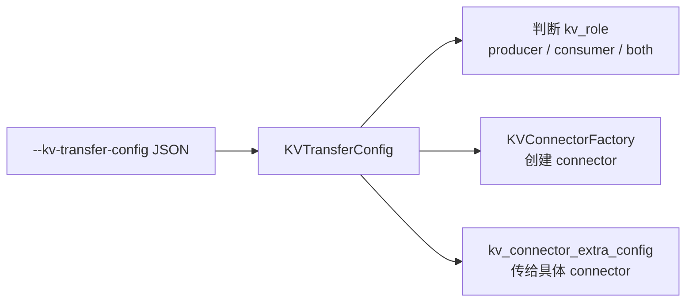
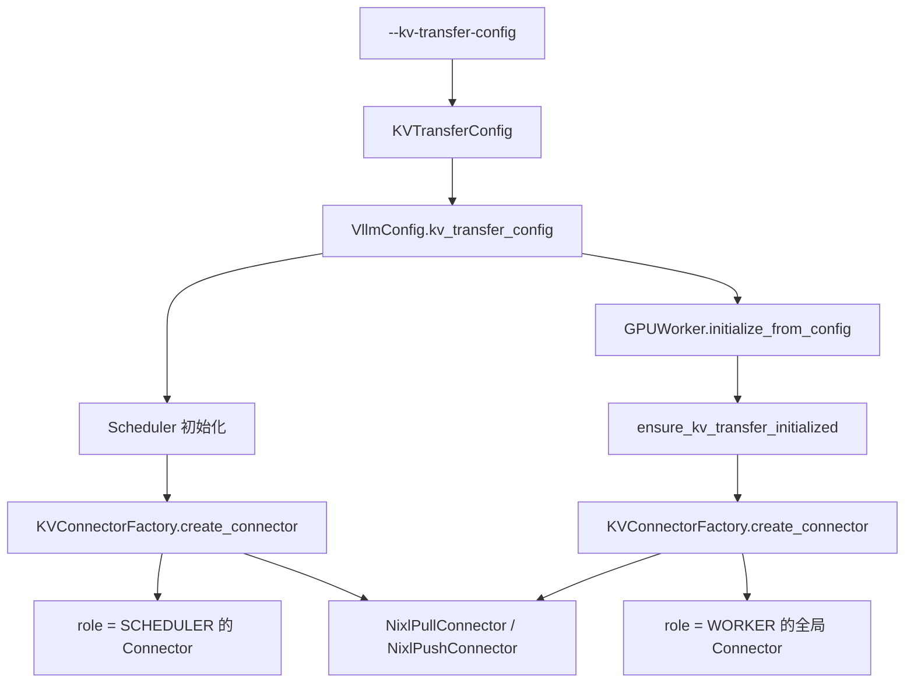
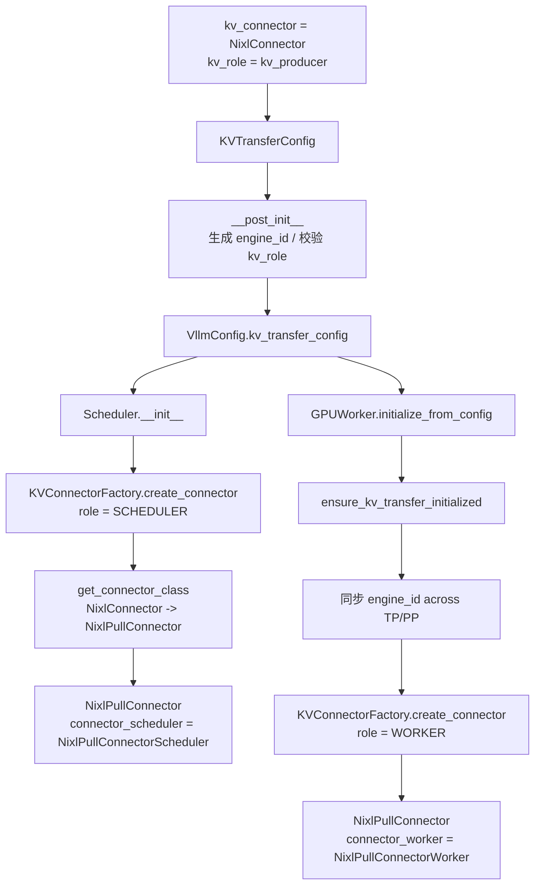
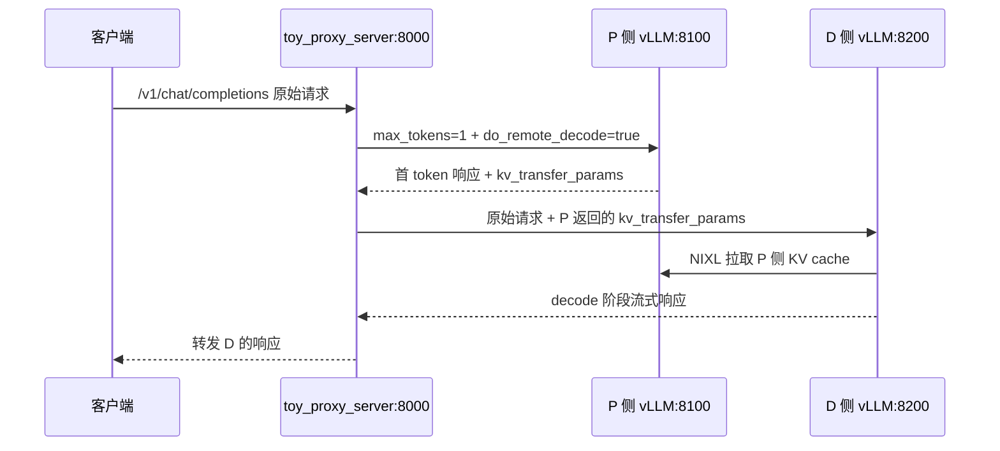
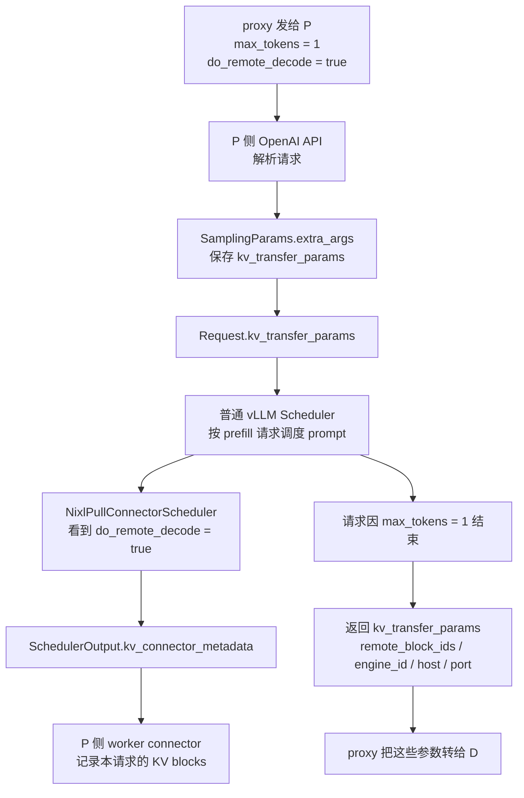
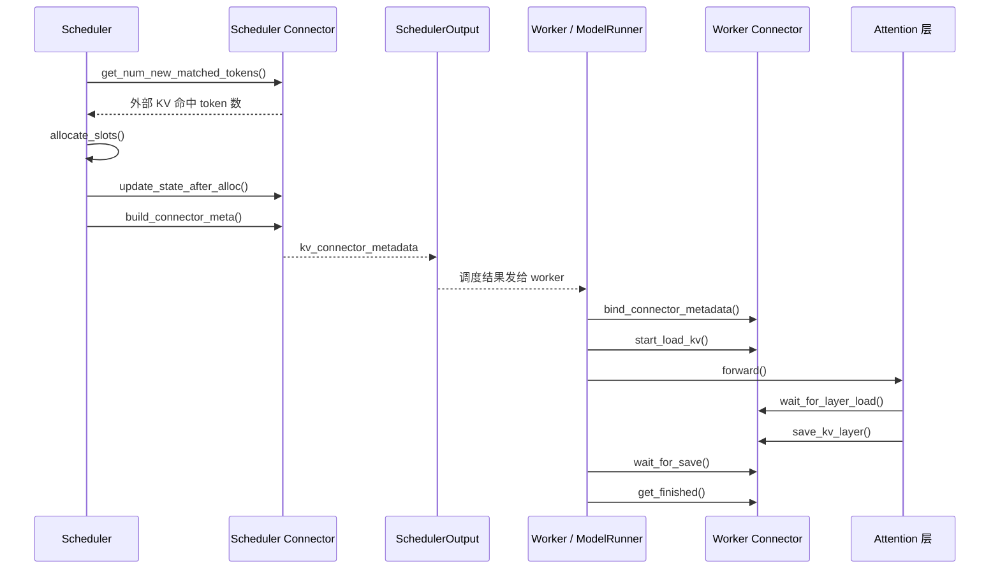
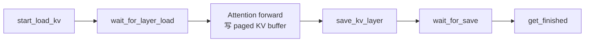
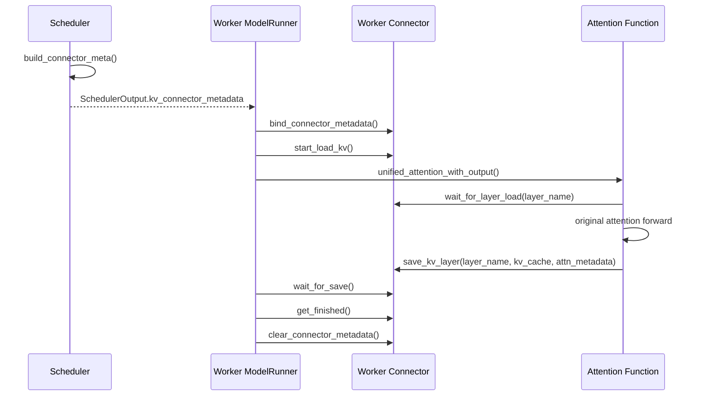
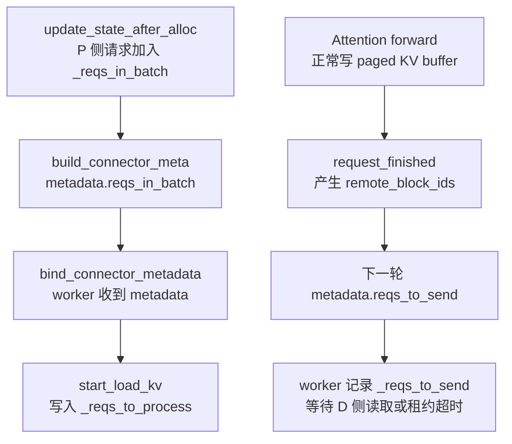
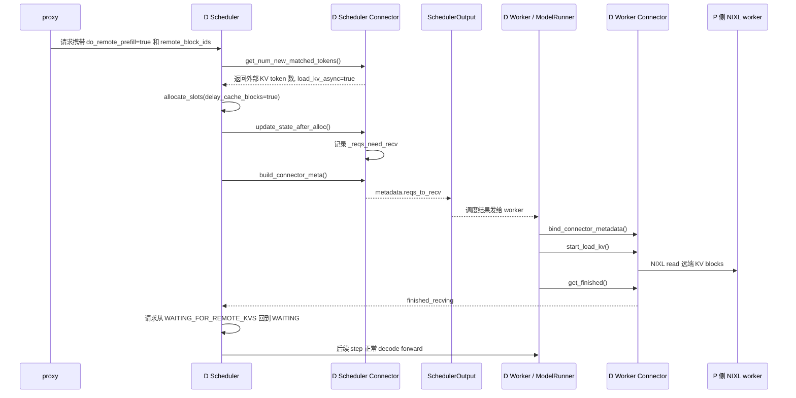

# PD 分离实战部署源码流程

这份笔记从“怎么把 PD 分离服务跑起来”倒推源码链路。先从配置入口开始看：`vllm/config/kv_transfer.py` 负责把命令行里的 `--kv-transfer-config` 解析成 vLLM 内部使用的 `KVTransferConfig`。

## KVTransferConfig 配置入口

源码位置：vllm/config/kv_transfer.py

这个文件定义了 PD 分离里最核心的一组配置：使用哪个 connector、当前实例是 P 侧还是 D 侧、KV 传输缓冲区放在哪里、connector 需要哪些额外参数。

### 源码注释版

下面是 `vllm/config/kv_transfer.py` 的完整配置类源码。这里没有改真实源码，只把英文 docstring 和注释翻成中文，方便阅读。

```python
# SPDX-License-Identifier: Apache-2.0
# SPDX-FileCopyrightText: Copyright contributors to the vLLM project

import uuid
from dataclasses import field
from typing import Any, Literal, get_args

from vllm.config.utils import config
from vllm.utils.hashing import safe_hash

# 可以生产 KV cache 的角色：纯 producer，或者 producer/consumer 都能做。
KVProducer = Literal["kv_producer", "kv_both"]

# 可以消费 KV cache 的角色：纯 consumer，或者 producer/consumer 都能做。
KVConsumer = Literal["kv_consumer", "kv_both"]

# KV 传输实例的完整角色集合。
KVRole = Literal[KVProducer, KVConsumer]


def kv_buffer_device_default_factory() -> str:
    from vllm.platforms import current_platform

    return current_platform.device_type


@config
class KVTransferConfig:
    """分布式 KV cache 传输配置。"""

    kv_connector: str | None = None
    """vLLM 用来在不同 vLLM 实例之间传输 KV cache 的 KV connector。"""

    engine_id: str | None = None
    """用于 KV 传输的 engine id。"""

    kv_buffer_device: str = field(default_factory=kv_buffer_device_default_factory)
    """KV connector 用来缓存 KV cache 的设备。

    可选值通常是 `"cuda"`、`"cpu"` 和 `"xpu"`。
    """

    kv_buffer_size: float = 1e9
    """TorchDistributedConnector 使用的缓冲区大小。

    单位是字节。推荐值是 `1e9`，也就是大约 1GB。
    """

    kv_role: KVRole | None = None
    """当前 vLLM 实例是生产 KV cache、消费 KV cache，还是两者都做。

    可选值是 `"kv_producer"`、`"kv_consumer"` 和 `"kv_both"`。
    """

    kv_rank: int | None = None
    """当前 vLLM 实例在 KV cache 传输中的 rank。

    典型值：
    - `0` 表示 prefill 实例。
    - `1` 表示 decode 实例。

    当前只支持 1P1D。
    """

    kv_parallel_size: int = 1
    """KV cache 传输的并行实例数量。"""

    kv_ip: str = "127.0.0.1"
    """KV connector 的 IP，用于建立分布式连接。"""

    kv_port: int = 14579
    """KV connector 的端口，用于建立分布式连接。"""

    kv_connector_extra_config: dict[str, Any] = field(default_factory=dict)
    """connector 可能需要的额外配置。"""

    kv_connector_module_path: str | None = None
    """动态加载 KV connector 的 Python module path。

    只在 V1 中支持。
    """

    enable_permute_local_kv: bool = False
    """实验性开关：启用 HND 到 NHD 的 KV transfer。"""

    kv_load_failure_policy: Literal["recompute", "fail"] = "fail"
    """KV cache 加载失败时的处理策略。

    - `"recompute"`：重新调度请求，重算加载失败的 blocks。
    - `"fail"`：立刻让请求失败，并返回错误 finish reason。默认是 `"fail"`。
    """

    def compute_hash(self) -> str:
        """
        警告：只要这个 config 新增字段，并且该字段会影响计算图，
        就要确保它被加入下面的 factors 列表。

        这个函数提供一个 hash，用于唯一标识所有会影响计算图结构的配置。
        这里说的计算图范围是从 input ids / embeddings 到最终 hidden states；
        不包含 input ids / embeddings 之前的处理，也不包含最终 hidden states 之后的处理。
        """
        # 没有需要考虑的 factors。
        # 这个配置不会影响计算图。
        factors: list[Any] = []
        hash_str = safe_hash(str(factors).encode(), usedforsecurity=False).hexdigest()
        return hash_str

    def __post_init__(self) -> None:
        if self.engine_id is None:
            self.engine_id = str(uuid.uuid4())

        if self.kv_role is not None and self.kv_role not in get_args(KVRole):
            raise ValueError(
                f"Unsupported kv_role: {self.kv_role}. "
                f"Supported roles are {get_args(KVRole)}"
            )

        if self.kv_connector is not None and self.kv_role is None:
            raise ValueError(
                "Please specify kv_role when kv_connector "
                f"is set, supported roles are {get_args(KVRole)}"
            )

    @property
    def is_kv_transfer_instance(self) -> bool:
        return self.kv_connector is not None and self.kv_role in get_args(KVRole)

    @property
    def is_kv_producer(self) -> bool:
        return self.kv_connector is not None and self.kv_role in get_args(KVProducer)

    @property
    def is_kv_consumer(self) -> bool:
        return self.kv_connector is not None and self.kv_role in get_args(KVConsumer)

    def get_from_extra_config(self, key, default) -> Any:
        return self.kv_connector_extra_config.get(key, default)
```

### 接口概览

`KVTransferConfig` 是 PD 分离部署的配置入口。命令行里的这段 JSON：

```bash
--kv-transfer-config '{"kv_connector":"NixlConnector","kv_role":"kv_producer"}'
```

最终会变成一个 `KVTransferConfig` 对象。后续初始化 KV connector、判断当前实例是否是 P/D 角色、读取 connector 私有参数，都会从这个对象开始。



### 类型别名

| 名称 | 类型 | 含义 |
| --- | --- | --- |
| `KVProducer` | `Literal["kv_producer", "kv_both"]` | 表示“具备生产 KV cache 能力”的角色集合。Prefill 实例通常使用 `kv_producer`。 |
| `KVConsumer` | `Literal["kv_consumer", "kv_both"]` | 表示“具备消费 KV cache 能力”的角色集合。Decode 实例通常使用 `kv_consumer`。 |
| `KVRole` | `Literal[KVProducer, KVConsumer]` | 合并后的完整角色集合，也就是 `kv_producer`、`kv_consumer`、`kv_both`。 |

这里有一个小细节：`kv_both` 同时属于 `KVProducer` 和 `KVConsumer`，所以 `is_kv_producer` 和 `is_kv_consumer` 对 `kv_both` 都会返回 `True`。

### 成员变量

| 成员 | 类型 | 默认值 | 作用 |
| --- | --- | --- | --- |
| `kv_connector` | `str \| None` | `None` | connector 名字，例如 `NixlConnector`、`MooncakeConnector`、`ExampleConnector`。如果为 `None`，这个实例不是 KV transfer 实例。 |
| `engine_id` | `str \| None` | `None` | 当前 vLLM engine 在 KV transfer 中的唯一标识。没有显式传入时，`__post_init__()` 会自动生成 UUID。 |
| `kv_buffer_device` | `str` | 当前平台设备类型 | connector 用来放 KV 传输缓冲区的设备，例如 `cuda`、`cpu`、`xpu`。默认通过 `current_platform.device_type` 推断。 |
| `kv_buffer_size` | `float` | `1e9` | KV 传输缓冲区大小，单位是字节。源码注释里说主要给 `TorchDistributedConnector` 使用。 |
| `kv_role` | `KVRole \| None` | `None` | 当前实例在 KV transfer 里的部署角色。P 侧常用 `kv_producer`，D 侧常用 `kv_consumer`。 |
| `kv_rank` | `int \| None` | `None` | 当前实例在 KV transfer 并行组里的 rank。源码注释说典型值是 P=0、D=1，目前只支持 1P1D。 |
| `kv_parallel_size` | `int` | `1` | KV transfer 并行实例数量。 |
| `kv_ip` | `str` | `"127.0.0.1"` | KV connector 建立分布式连接时使用的 IP。 |
| `kv_port` | `int` | `14579` | KV connector 建立分布式连接时使用的端口。 |
| `kv_connector_extra_config` | `dict[str, Any]` | `{}` | connector 私有扩展配置。例如 NIXL 的 `bidirectional_kv_xfer`、Mooncake 的 `num_workers`、ExampleConnector 的 `shared_storage_path`。 |
| `kv_connector_module_path` | `str \| None` | `None` | 动态加载自定义 connector 的 Python module path。源码注明只支持 V1。 |
| `enable_permute_local_kv` | `bool` | `False` | 实验性开关，用于启用 HND 到 NHD 的 KV transfer。NIXL 异构 KV layout 场景会用到。 |
| `kv_load_failure_policy` | `Literal["recompute", "fail"]` | `"fail"` | KV cache 加载失败时的处理策略。`recompute` 表示重算失败 blocks，`fail` 表示直接让请求失败。 |

### 重要接口

| 接口 | 原型 | 作用 |
| --- | --- | --- |
| `kv_buffer_device_default_factory` | `def kv_buffer_device_default_factory() -> str` | 返回当前平台的默认设备类型，作为 `kv_buffer_device` 的默认值。 |
| `compute_hash` | `def compute_hash(self) -> str` | 返回影响计算图结构的配置 hash。当前 `factors` 为空，表示这个配置本身不影响模型计算图。 |
| `__post_init__` | `def __post_init__(self) -> None` | 初始化后校验和补全字段：自动生成 `engine_id`，校验 `kv_role`，并要求设置 `kv_connector` 时必须同时设置 `kv_role`。 |
| `is_kv_transfer_instance` | `@property def is_kv_transfer_instance(self) -> bool` | 判断当前实例是否启用了 KV transfer。 |
| `is_kv_producer` | `@property def is_kv_producer(self) -> bool` | 判断当前实例是否具备生产 KV cache 的角色。`kv_producer` 和 `kv_both` 都为真。 |
| `is_kv_consumer` | `@property def is_kv_consumer(self) -> bool` | 判断当前实例是否具备消费 KV cache 的角色。`kv_consumer` 和 `kv_both` 都为真。 |
| `get_from_extra_config` | `def get_from_extra_config(self, key, default) -> Any` | 从 `kv_connector_extra_config` 中读取 connector 私有配置，不存在就返回默认值。 |

### 初始化约束

`__post_init__()` 里有两个关键约束：

- **`engine_id` 可以不传**：如果为 `None`，会自动生成一个 UUID。这个 ID 会在 P/D 之间传递，用来标识远端 engine。
- **设置了 `kv_connector` 就必须设置 `kv_role`**：否则会抛出 `ValueError`。也就是说，下面这种配置是非法的：

```json
{"kv_connector": "NixlConnector"}
```

必须写成：

```json
{"kv_connector": "NixlConnector", "kv_role": "kv_producer"}
```

### P 侧和 D 侧配置怎么对应

结合官方 NIXL 部署，P/D 两侧最核心的区别就是 `kv_role`：

```bash
# P 侧：生产 KV cache
--kv-transfer-config '{"kv_connector":"NixlConnector","kv_role":"kv_producer"}'

# D 侧：消费 KV cache
--kv-transfer-config '{"kv_connector":"NixlConnector","kv_role":"kv_consumer"}'
```

在代码里对应这三个 property：

| `kv_role` | `is_kv_transfer_instance` | `is_kv_producer` | `is_kv_consumer` | 常见部署含义 |
| --- | --- | --- | --- | --- |
| `None` | `False` | `False` | `False` | 普通 vLLM 实例，不参与 KV transfer。 |
| `kv_producer` | `True` | `True` | `False` | Prefill / P 侧，生产 KV cache。 |
| `kv_consumer` | `True` | `False` | `True` | Decode / D 侧，消费 KV cache。 |
| `kv_both` | `True` | `True` | `True` | 同时具备生产和消费能力，常见于示例、实验或双向传输场景。 |

### 额外配置的读取方式

`kv_connector_extra_config` 是 connector 自己解释的一块字典。`KVTransferConfig` 不理解里面每个 key 的具体含义，只提供统一读取接口：

```python
def get_from_extra_config(self, key, default) -> Any:
    return self.kv_connector_extra_config.get(key, default)
```

例如：

- `ExampleConnector` 用它读取 `shared_storage_path`。
- `NixlConnector` 用它读取 `bidirectional_kv_xfer`、`kv_recompute_threshold`、`kv_lease_duration` 等。
- `MooncakeConnector` 用它读取 `num_workers`、`mooncake_protocol` 等。

所以这层配置的设计是：**通用字段放在 `KVTransferConfig` 顶层，connector 专属字段放进 `kv_connector_extra_config`**。

### 小结

`KVTransferConfig` 本身不负责传输 KV cache。它只解决三件事：

- **声明使用哪个 connector**：由 `kv_connector` 和 `kv_connector_module_path` 决定。
- **声明当前实例的 P/D 角色**：由 `kv_role` 和几个 `is_kv_*` property 决定。
- **给具体 connector 提供参数**：通用参数走顶层字段，私有参数走 `kv_connector_extra_config`。

## 配置如何应用并创建 Connector

上一节看的是 `KVTransferConfig` 本身。这一节看它怎么真的被用起来：配置对象先挂在 `VllmConfig.kv_transfer_config` 上，然后 scheduler 进程和 worker 进程分别创建自己的 connector。

这条链路可以先记成一张图：



注意这里有两个 connector 对象：

- **Scheduler connector**：由 `Scheduler` 直接创建，运行在 scheduler 进程里，负责调度侧决策。
- **Worker connector**：由 `ensure_kv_transfer_initialized()` 创建，保存在全局 `_KV_CONNECTOR_AGENT`，运行在 worker 进程里，负责真正搬 KV。

### Scheduler 侧创建入口

源码位置：vllm/v1/core/sched/scheduler.py；接口位置：`Scheduler.__init__()` 中创建 scheduler-side connector 的逻辑。

这里不是本节重点文件，但它解释了为什么 factory 里会传入 `KVConnectorRole.SCHEDULER`。

```python
# 先取出完整 vLLM 配置里的 KV transfer 配置。
kv_transfer_config = self.vllm_config.kv_transfer_config

# 只要 kv_transfer_config 不为 None，scheduler 就会尝试创建 scheduler-side connector。
if kv_transfer_config is not None:
    # 当前 encoder-decoder 模型还不支持 KV connector。
    assert not self.is_encoder_decoder, (
        "Encoder-decoder models are not currently supported with KV connectors"
    )

    # 创建运行在 scheduler 进程里的 connector。
    # 注意 role 是 KVConnectorRole.SCHEDULER。
    self.connector = KVConnectorFactory.create_connector(
        config=self.vllm_config,
        role=KVConnectorRole.SCHEDULER,
        kv_cache_config=self.kv_cache_config,
    )

    # 如果开启统计，就准备 prefix cache 统计对象。
    if self.log_stats:
        self.connector_prefix_cache_stats = PrefixCacheStats()

    # 读取 KV 加载失败策略。
    kv_load_failure_policy = kv_transfer_config.kv_load_failure_policy

    # 如果策略是 recompute，则加载失败后尝试重算 KV。
    self.recompute_kv_load_failures = kv_load_failure_policy == "recompute"

    # async scheduling 或 pipeline parallel 场景下，一个 step 可能还在写已经释放请求的 KV blocks。
    # 如果 consumer connector 又复用了这些 block 去 load，就可能和旧写入乱序。
    multiple_inflight_batches = self.vllm_config.max_concurrent_batches > 1

    # 因此：多个 in-flight batch 且当前实例是 KV consumer 时，scheduler 会延迟释放 block。
    if multiple_inflight_batches and kv_transfer_config.is_kv_consumer:
        self.defer_block_free = True
```

这段代码说明：`kv_load_failure_policy`、`is_kv_consumer` 不是只给 connector 自己用，scheduler 本身也会根据这些配置调整调度行为。

### Worker 侧创建入口

源码位置：vllm/v1/worker/gpu_worker.py；接口位置：`GPUWorker.initialize_from_config()` 中初始化 KV cache 前的 connector 创建逻辑。

worker 侧创建 connector 的时机比较靠后，因为它需要 `kv_cache_config`。这个配置要等 profiling / KV cache block 规划完成后才知道。

```python
# 根据 profiling 后的 kv_cache_config 更新本地 cache_config。
# 后续 warmup 阶段也需要这些 block 数量信息。
self.cache_config.num_gpu_blocks = kv_cache_config.num_blocks

# 在这里初始化 KV cache connector，因为 connector 需要 kv_cache_config。
#
# 注意：这一步要发生在 initialize_kv_cache 之前。
# 原因是 initialize_kv_cache 会注入一些和 KV connector 无关的 KV cache group，
# 例如 KV cache sharing layers。
ensure_kv_transfer_initialized(self.vllm_config, kv_cache_config)

# 真正分配并初始化模型 runner 的 KV cache。
with self._maybe_get_memory_pool_context(tag="kv_cache"):
    self.model_runner.initialize_kv_cache(kv_cache_config)
```

这里的重点是顺序：**worker connector 先初始化，模型 KV cache 后初始化**。因为 connector 可能需要提前知道 KV cache group 布局，甚至提前注册 KV cache 内存。

### kv_transfer_state.py

源码位置：vllm/distributed/kv_transfer/kv_transfer_state.py

这个文件负责 worker 侧的全局 connector 状态。它不是 factory，而是“connector 单例管理器”：创建后放进 `_KV_CONNECTOR_AGENT`，后续 model runner / attention 层通过 `get_kv_transfer_group()` 拿到同一个对象。

```python
# SPDX-License-Identifier: Apache-2.0
# SPDX-FileCopyrightText: Copyright contributors to the vLLM project

from typing import TYPE_CHECKING

from vllm.distributed.kv_transfer.kv_connector.base import KVConnectorBaseType
from vllm.distributed.kv_transfer.kv_connector.factory import KVConnectorFactory
from vllm.distributed.kv_transfer.kv_connector.v1 import (
    KVConnectorBase_V1,
    KVConnectorRole,
)

if TYPE_CHECKING:
    from vllm.config import VllmConfig
    from vllm.v1.kv_cache_interface import KVCacheConfig

# worker 进程里的全局 KV connector。
# 没初始化前是 None；初始化后保存具体 connector 实例。
_KV_CONNECTOR_AGENT: KVConnectorBaseType | None = None


def get_kv_transfer_group() -> KVConnectorBaseType:
    # 访问前必须已经初始化，否则说明调用顺序错了。
    assert _KV_CONNECTOR_AGENT is not None, (
        "disaggregated KV cache transfer parallel group is not initialized"
    )

    # 返回 worker 侧全局 connector。
    return _KV_CONNECTOR_AGENT


def has_kv_transfer_group() -> bool:
    # 判断 worker 侧全局 connector 是否已经存在。
    return _KV_CONNECTOR_AGENT is not None


def is_v1_kv_transfer_group(connector: KVConnectorBaseType | None = None) -> bool:
    """检查 KV connector 是否是 v1 connector。

    如果参数是 None，就检查全局 KV connector。

    Args:
        connector: 要检查的 KV connector。如果是 None，则检查全局 KV connector。

    Note:
        等 v1 KV connector 成为默认实现之后，这个函数就不再需要。
    """
    # 如果调用方没有传 connector，就用全局 connector。
    if connector is None:
        connector = _KV_CONNECTOR_AGENT

    # 全局 connector 还没初始化时，不可能是 v1。
    if connector is None:
        return False

    # v1 connector 都继承 KVConnectorBase_V1。
    return isinstance(connector, KVConnectorBase_V1)


def _sync_engine_id_across_tp(vllm_config: "VllmConfig") -> None:
    """从 TP rank 0 广播 engine_id，让同一个 TP 组里的所有 worker 使用同一个值。

    如果启用了 PP，也会跨 PP ranks 广播，让同一个 model-parallel engine
    里的所有 worker 使用同一个值。
    """
    from vllm.distributed.parallel_state import (
        get_pp_group,
        get_tp_group,
    )

    # 走到这里时，必须已经有 kv_transfer_config。
    assert vllm_config.kv_transfer_config is not None

    # 先在 tensor parallel 组内从 rank 0 广播 engine_id。
    synced_id = get_tp_group().broadcast_object(
        vllm_config.kv_transfer_config.engine_id, src=0
    )

    # 如果有 pipeline parallel，再在 pipeline parallel 组内广播一次。
    if vllm_config.parallel_config.pipeline_parallel_size > 1:
        synced_id = get_pp_group().broadcast_object(synced_id, src=0)

    # 把同步后的 engine_id 写回配置对象。
    vllm_config.kv_transfer_config.engine_id = synced_id


def ensure_kv_transfer_initialized(
    vllm_config: "VllmConfig", kv_cache_config: "KVCacheConfig"
) -> None:
    """初始化 KV cache transfer parallel group。"""

    global _KV_CONNECTOR_AGENT

    # 没有 KV transfer 配置，直接返回。
    if vllm_config.kv_transfer_config is None:
        return

    # 只有当前实例确实启用了 KV transfer，并且全局 connector 还没创建时，才创建。
    if (
        vllm_config.kv_transfer_config.is_kv_transfer_instance
        and _KV_CONNECTOR_AGENT is None
    ):
        # 先同步 engine_id，保证 TP/PP 内所有 worker 对外表现为同一个 engine。
        _sync_engine_id_across_tp(vllm_config)

        # 通过 factory 创建 worker-side connector。
        # 注意 role 是 KVConnectorRole.WORKER。
        _KV_CONNECTOR_AGENT = KVConnectorFactory.create_connector(
            config=vllm_config,
            role=KVConnectorRole.WORKER,
            kv_cache_config=kv_cache_config,
        )


def ensure_kv_transfer_shutdown() -> None:
    global _KV_CONNECTOR_AGENT

    # 如果全局 connector 存在，就先调用 connector 自己的 shutdown。
    if _KV_CONNECTOR_AGENT is not None:
        _KV_CONNECTOR_AGENT.shutdown()

        # 清空全局引用，避免进程内残留旧 connector。
        _KV_CONNECTOR_AGENT = None
```

这里最重要的是 `_sync_engine_id_across_tp()`。如果一个 P 实例或 D 实例内部用了 TP/PP，多张卡上会有多个 worker 进程；但对远端 P/D 来说，它们应该属于同一个 engine，所以 `engine_id` 必须同步。

### KVConnectorFactory

源码位置：vllm/distributed/kv_transfer/kv_connector/factory.py

factory 的职责是把配置里的字符串：

```json
{"kv_connector": "NixlConnector"}
```

变成真正的 Python 类：

```python
vllm.distributed.kv_transfer.kv_connector.v1.nixl.NixlConnector
```

这里有两个路径：

- **内置 connector**：走 `_registry`，例如 `NixlConnector`、`MooncakeConnector`。
- **外部 connector**：如果配置了 `kv_connector_module_path`，就从外部 Python module 动态 import。

```python
# SPDX-License-Identifier: Apache-2.0
# SPDX-FileCopyrightText: Copyright contributors to the vLLM project

import importlib
from collections.abc import Callable
from typing import TYPE_CHECKING, cast

from vllm.config.kv_transfer import KVTransferConfig
from vllm.distributed.kv_transfer.kv_connector.base import (
    KVConnectorBase,
    KVConnectorBaseType,
)
from vllm.distributed.kv_transfer.kv_connector.v1 import (
    KVConnectorRole,
    supports_hma,
)
from vllm.logger import init_logger
from vllm.utils.func_utils import supports_kw

if TYPE_CHECKING:
    from vllm.config import VllmConfig
    from vllm.v1.kv_cache_interface import KVCacheConfig

logger = init_logger(__name__)


class KVConnectorFactory:
    # connector 注册表。
    # key 是配置里的 connector 名字，value 是一个懒加载函数。
    _registry: dict[str, Callable[[], type[KVConnectorBase]]] = {}

    @classmethod
    def register_connector(cls, name: str, module_path: str, class_name: str) -> None:
        """用懒加载 module path 和 class name 注册一个 connector。"""

        # 防止同名 connector 重复注册。
        if name in cls._registry:
            raise ValueError(f"Connector '{name}' is already registered.")

        # 真正需要 connector 类时才 import module。
        def loader() -> type[KVConnectorBase]:
            # 动态导入 connector 所在模块。
            module = importlib.import_module(module_path)

            # 从模块里取出 connector 类。
            return getattr(module, class_name)

        # 把 loader 放进注册表。
        cls._registry[name] = loader

    @classmethod
    def create_connector(
        cls,
        config: "VllmConfig",
        role: KVConnectorRole,
        kv_cache_config: "KVCacheConfig",
    ) -> KVConnectorBase:
        # 从完整 vLLM 配置中取 KV transfer 配置。
        kv_transfer_config = config.kv_transfer_config

        # 创建 connector 时必须已经有 kv_transfer_config。
        if kv_transfer_config is None:
            raise ValueError("kv_transfer_config must be set to create a connector")

        # 根据 kv_transfer_config.kv_connector 找到具体 connector 类。
        connector_cls = cls.get_connector_class(kv_transfer_config)

        # 检查当前是否启用了 HMA，也就是 hybrid KV cache manager。
        hma_enabled = not config.scheduler_config.disable_hybrid_kv_cache_manager

        # 如果 HMA 启用了，但 connector 不支持 HMA，就直接报错。
        if hma_enabled and not cls.supports_hma_config(kv_transfer_config):
            raise ValueError(
                f"Connector {connector_cls.__name__} does not support HMA but "
                f"HMA is enabled. Please set `--disable-hybrid-kv-cache-manager`."
            )

        # 打印创建的 connector 名字和 engine_id。
        logger.info(
            "Creating v1 connector with name: %s and engine_id: %s",
            connector_cls.__name__,
            kv_transfer_config.engine_id,
        )

        # v1 connector 显式拆成两个角色。
        #
        # Scheduler connector：
        # - 和 scheduler 进程放在一起。
        # - 只应该在 Scheduler 类里使用。
        #
        # Worker connector：
        # - 和 worker 进程放在一起。
        # - 只应该在 forward context 和 attention layer 内部使用。
        #
        # 分开创建是为了强制维持 scheduler / worker 的边界。
        return connector_cls(config, role, kv_cache_config)

    @classmethod
    def get_connector_class_by_name(
        cls, connector_name: str
    ) -> type[KVConnectorBaseType]:
        """根据名字获取已注册的 connector 类。

        如果 connector 没有注册，会抛出 ValueError。

        Args:
            connector_name: 已注册 connector 的名字。

        Returns:
            connector class。
        """
        # connector 名字必须存在于 registry。
        if connector_name not in cls._registry:
            raise ValueError(f"Connector '{connector_name}' is not registered.")

        # 调用 loader，懒加载并返回 connector 类。
        return cls._registry[connector_name]()

    @classmethod
    def get_connector_class(
        cls, kv_transfer_config: "KVTransferConfig"
    ) -> type[KVConnectorBaseType]:
        # 读取配置里的 connector 名字。
        connector_name = kv_transfer_config.kv_connector

        # connector 名字不能为空。
        if connector_name is None:
            raise ValueError("Connector name is not set in KVTransferConfig")

        # 读取外部 connector module path。
        connector_module_path = kv_transfer_config.kv_connector_module_path

        # module path 不能是空字符串。
        if connector_module_path is not None and not connector_module_path:
            raise ValueError("kv_connector_module_path cannot be an empty string.")

        # 如果配置了外部 module path，则外部 module 优先级高于内部 registry。
        if connector_module_path:
            # 动态导入外部 connector module。
            connector_module = importlib.import_module(connector_module_path)

            try:
                # 从外部 module 中取出 connector 类。
                connector_cls = getattr(connector_module, connector_name)
            except AttributeError as e:
                raise AttributeError(
                    f"Class {connector_name} not found in {connector_module_path}"
                ) from e

            # 类型转换，告诉类型检查器这是一个 connector 类。
            connector_cls = cast(type[KVConnectorBaseType], connector_cls)

            # 外部 v1 KV connector 必须支持第三个构造参数 kv_cache_config。
            if not supports_kw(connector_cls, "kv_cache_config"):
                msg = (
                    f"Connector {connector_cls.__name__} uses deprecated "
                    "2-argument constructor signature. External v1 KV "
                    "connectors must accept kv_cache_config as the third "
                    "constructor argument and pass it to super().__init__()."
                )
                logger.error(msg)
                raise ValueError(msg)

        # 如果没有外部 module path，就从内置 registry 中查找。
        elif connector_name in cls._registry:
            connector_cls = cls._registry[connector_name]()

        # 两条路径都找不到，就说明 connector 类型不支持。
        else:
            raise ValueError(f"Unsupported connector type: {connector_name}")

        # 返回最终 connector 类。
        return connector_cls

    @classmethod
    def supports_hma_config(cls, kv_transfer_config: "KVTransferConfig") -> bool:
        """返回这个 KV transfer config 对应的 connector 是否支持 HMA。

        MultiConnector 是特殊情况：wrapper class 自己实现了 SupportsHMA，
        但实际是否支持取决于每个 child connector 是否都支持 HMA。
        """
        # 先根据配置找到 connector 类。
        connector_cls = cls.get_connector_class(kv_transfer_config)

        # 普通 connector 直接检查类是否支持 HMA。
        if kv_transfer_config.kv_connector != "MultiConnector":
            return supports_hma(connector_cls)

        from vllm.distributed.kv_transfer.kv_connector.v1.multi_connector import (
            MultiConnector,
        )

        # MultiConnector 要求所有 child connector 都支持 HMA。
        return MultiConnector.all_children_support_hma(kv_transfer_config)
```

下面是和 NIXL 相关的注册表片段：

```python
# 这里只集中注册各种 connector。
# 不在每个 connector 文件里注册，是为了只加载当前真正需要的 connector 文件。

KVConnectorFactory.register_connector(
    # 配置里的名字：{"kv_connector": "NixlConnector"}。
    "NixlConnector",
    # 要 import 的 Python module。
    "vllm.distributed.kv_transfer.kv_connector.v1.nixl",
    # module 里的类名。
    "NixlConnector",
)

KVConnectorFactory.register_connector(
    # 显式指定 pull 模式的 NIXL connector。
    "NixlPullConnector",
    "vllm.distributed.kv_transfer.kv_connector.v1.nixl",
    "NixlPullConnector",
)

KVConnectorFactory.register_connector(
    # 显式指定 push 模式的 NIXL connector。
    "NixlPushConnector",
    "vllm.distributed.kv_transfer.kv_connector.v1.nixl",
    "NixlPushConnector",
)
```

这说明官方文档里的：

```bash
--kv-transfer-config '{"kv_connector":"NixlConnector","kv_role":"kv_producer"}'
```

会先通过 registry 找到 `vllm.distributed.kv_transfer.kv_connector.v1.nixl` 模块，再从 `__init__.py` 导出的符号里拿到 `NixlConnector`。而在 NIXL 当前实现里，`NixlConnector` 是 `NixlPullConnector` 的兼容别名。

### NIXL connector 构造函数

源码位置：vllm/distributed/kv_transfer/kv_connector/v1/nixl/connector.py

这个文件里的 `NixlBaseConnector` 是一层 facade。它自己不做太多具体传输，而是根据 role 创建更细的 scheduler / worker 子对象，然后把方法转发给这些子对象。

#### 基类里如何读取 kv_transfer_config

```python
class NixlBaseConnector(KVConnectorBase_V1, SupportsHMA):
    """Pull 和 push 模式共享的基础 connector。"""

    @property
    def prefer_cross_layer_blocks(self) -> bool:
        # 如果 KV cache group 里有 MambaSpec，说明是 Hybrid SSM 模型。
        if any(
            [
                isinstance(group.kv_cache_spec, MambaSpec)
                for group in self.kv_cache_config.kv_cache_groups
            ]
        ):
            # Hybrid SSM 模型目前还不支持 cross-layer layout。
            return False

        # 读取当前 attention backend。
        backend = get_current_attn_backend(self._vllm_config)

        # 只有这些 backend 才考虑启用 cross-layer blocks。
        if backend.get_name() not in (
            "FLASH_ATTN",
            "FLASHINFER",
            "TRITON_ATTN",
        ):
            return False

        # 当前只有 HND layout 下启用 cross layers 才有收益。
        if get_kv_cache_layout() != "HND":
            return False

        # 从 kv_transfer_config.kv_connector_extra_config 里读取 NIXL 私有配置。
        extra_config = self.kv_transfer_config.kv_connector_extra_config

        # enable_cross_layers_blocks 写成字符串或布尔值都能兼容；
        # 最终转成小写字符串，等于 "true" 就开启。
        return (
            str(extra_config.get("enable_cross_layers_blocks", "False")).lower()
            == "true"
        )

    def __init__(
        self,
        vllm_config: VllmConfig,
        role: KVConnectorRole,
        kv_cache_config: "KVCacheConfig",
    ):
        # 先进入 KVConnectorBase_V1，保存 _vllm_config、_kv_transfer_config、_role 等。
        super().__init__(vllm_config, role, kv_cache_config)

        # NIXL connector 必须有 kv_transfer_config。
        assert vllm_config.kv_transfer_config is not None

        # engine_id 也必须已经存在。
        # 如果用户没传，KVTransferConfig.__post_init__ 会生成；
        # worker 侧还会通过 _sync_engine_id_across_tp 同步。
        assert vllm_config.kv_transfer_config.engine_id is not None

        # NIXL 不推荐继续使用 kv_both。
        # 官方建议 P 侧用 kv_producer，D 侧用 kv_consumer。
        if vllm_config.kv_transfer_config.kv_role == "kv_both":
            logger.warning_once(
                "Using kv_role='kv_both' with NixlConnector is deprecated "
                "and will be removed in a future release. Please set "
                "kv_role='kv_producer' for prefill instances and "
                "kv_role='kv_consumer' for decode instances. "
            )

        # 保存 KV cache 配置。
        self.kv_cache_config = kv_cache_config

        # 从 kv_transfer_config 里取 engine_id，作为当前 NIXL connector 的 engine id。
        self.engine_id: EngineId = vllm_config.kv_transfer_config.engine_id

        # 保存完整 kv_transfer_config，后面 NIXL scheduler / worker 子对象也会继续读取。
        self.kv_transfer_config = vllm_config.kv_transfer_config

        # 子类必须设置 connector_scheduler 和 connector_worker。
        # facade 层只保留这两个引用，具体逻辑交给 mode-specific 类。
        self.connector_scheduler: NixlBaseConnectorScheduler | None = None
        self.connector_worker: NixlBaseConnectorWorker | None = None
```

这里 `kv_transfer_config` 被真正“落地”成了 NIXL connector 的两个核心字段：

- `self.engine_id`：当前 vLLM engine 在 P/D 传输里的身份。
- `self.kv_transfer_config`：完整配置对象，后续 scheduler/worker 子类继续读取其中的 `kv_role`、`kv_connector_extra_config` 等字段。

#### NIXL 选择 KV cache layout

```python
@classmethod
def get_required_kvcache_layout(cls, vllm_config: VllmConfig):
    # 如果还无法读取完整 vLLM config，就不强行指定 layout。
    if vllm_config.model_config is None:
        logger.warning_once(
            "Unable to detect current VLLM config. "
            "Fallback to default kv cache layout."
        )
        return None

    # MLA 模型不强制 NIXL 的 HND layout。
    use_mla = vllm_config.model_config.use_mla
    if use_mla:
        # MLA 场景下 layout 不重要，因此返回 None，走默认行为。
        return None

    # 非 MLA 模型默认让 NIXL 使用 HND layout，以提升传输性能。
    logger.info_once(
        "NixlConnector setting KV cache layout to HND for better xfer performance."
    )
    return "HND"
```

这段不是直接读取 `kv_transfer_config`，但它解释了为什么 NIXL 文档和测试脚本经常看到 `VLLM_KV_CACHE_LAYOUT=HND`：NIXL 希望 KV cache 采用更适合传输的布局。

#### Pull 模式构造

```python
class NixlPullConnector(NixlBaseConnector):
    """基于 pull / READ 的 NIXL KV transfer connector。"""

    def __init__(
        self,
        vllm_config: VllmConfig,
        role: KVConnectorRole,
        kv_cache_config: "KVCacheConfig",
    ):
        # 先执行 NixlBaseConnector 的初始化。
        # 这里会保存 kv_transfer_config、engine_id、kv_cache_config。
        super().__init__(vllm_config, role, kv_cache_config)

        # 如果当前 connector 运行在 scheduler 进程里。
        if role == KVConnectorRole.SCHEDULER:
            # 创建 pull 模式 scheduler 子对象。
            # 它负责调度侧的外部 KV 命中判断、metadata 构造、request_finished 等。
            self.connector_scheduler = NixlPullConnectorScheduler(
                vllm_config, self.engine_id, kv_cache_config
            )

            # scheduler connector 不持有 worker 子对象。
            self.connector_worker = None

        # 如果当前 connector 运行在 worker 进程里。
        elif role == KVConnectorRole.WORKER:
            # worker connector 不持有 scheduler 子对象。
            self.connector_scheduler = None

            # 创建 pull 模式 worker 子对象。
            # 它负责真正通过 NIXL 读取远端 KV，并写入本地 paged KV buffer。
            self.connector_worker = NixlPullConnectorWorker(
                vllm_config, self.engine_id, kv_cache_config
            )
```

如果你启动的是：

```bash
--kv-transfer-config '{"kv_connector":"NixlConnector","kv_role":"kv_producer"}'
```

factory 里的 `NixlConnector` 会落到这里，因为文件底部有：

```python
# 向后兼容：NixlConnector 是 pull-based connector。
NixlConnector = NixlPullConnector
```

所以默认 `NixlConnector` 是 **pull 模式**：D 侧 worker 根据 P 返回的 `kv_transfer_params` 去 P 侧拉取 KV。

#### Push 模式构造

```python
class NixlPushConnector(NixlBaseConnector):
    """基于 push / WRITE 的 NIXL KV transfer connector。"""

    def __init__(
        self,
        vllm_config: VllmConfig,
        role: KVConnectorRole,
        kv_cache_config: "KVCacheConfig",
    ):
        # 先执行 NixlBaseConnector 的初始化。
        super().__init__(vllm_config, role, kv_cache_config)

        # 先把两个子对象引用初始化为空。
        self.connector_scheduler: NixlPushConnectorScheduler | None = None
        self.connector_worker: NixlPushConnectorWorker | None = None

        # scheduler 进程创建 push scheduler 子对象。
        if role == KVConnectorRole.SCHEDULER:
            self.connector_scheduler = NixlPushConnectorScheduler(
                vllm_config, self.engine_id, kv_cache_config
            )

        # worker 进程创建 push worker 子对象。
        elif role == KVConnectorRole.WORKER:
            self.connector_worker = NixlPushConnectorWorker(
                vllm_config, self.engine_id, kv_cache_config
            )

        # 其他 role 都不支持。
        else:
            raise ValueError(f"Unsupported KVConnectorRole: {role}")
```

Push 模式不是 `NixlConnector` 默认别名。要显式配置：

```bash
--kv-transfer-config '{"kv_connector":"NixlPushConnector","kv_role":"kv_producer"}'
```

### 从配置到 NIXL 对象的完整路径

以 P 侧命令为例：

```bash
--kv-transfer-config '{"kv_connector":"NixlConnector","kv_role":"kv_producer"}'
```

配置应用路径是：



这张图里最容易漏掉的一点是：**同一个 `kv_transfer_config` 会创建两个不同 role 的 connector**。它们 对外的 Facade 类 相同，但内部持有的子对象不同：

| 创建位置 | `role` | NIXL facade 对象 | 内部实际对象 |
| --- | --- | --- | --- |
| `Scheduler.__init__` | `KVConnectorRole.SCHEDULER` | `NixlPullConnector` | `NixlPullConnectorScheduler` |
| `ensure_kv_transfer_initialized()` | `KVConnectorRole.WORKER` | `NixlPullConnector` | `NixlPullConnectorWorker` |

### 和部署命令对应起来

P 侧启动命令里的核心配置：

```bash
--kv-transfer-config '{"kv_connector":"NixlConnector","kv_role":"kv_producer","kv_load_failure_policy":"fail"}'
```

在源码里对应：

- `kv_connector="NixlConnector"`：factory 从 registry 中找到 `NixlConnector`，也就是 `NixlPullConnector`。
- `kv_role="kv_producer"`：`KVTransferConfig.is_kv_producer=True`，NIXL 不再警告 `kv_both` deprecated。
- `kv_load_failure_policy="fail"`：scheduler 里 `recompute_kv_load_failures=False`，加载失败时不走重算策略。
- `engine_id`：如果命令没传，`KVTransferConfig.__post_init__()` 自动生成；worker 侧会在 TP/PP 内同步。

D 侧启动命令里的核心配置：

```bash
--kv-transfer-config '{"kv_connector":"NixlConnector","kv_role":"kv_consumer","kv_load_failure_policy":"fail"}'
```

在源码里对应：

- `kv_connector="NixlConnector"`：同样创建 `NixlPullConnector`。
- `kv_role="kv_consumer"`：`KVTransferConfig.is_kv_consumer=True`，scheduler 在多 in-flight batch 场景下会启用 defer block free。
- `kv_load_failure_policy="fail"`：D 侧加载 P 侧 KV 失败时直接 fail，而不是重新调度重算。

所以 P/D 的差异不是 factory 创建了两个不同类，而是**同一个 connector 类拿到不同 `kv_role` 后，在 scheduler / worker 子逻辑里解释成不同职责**。

## NIXL PD 分离实战部署和代理流程

这一节开始把前面的源码配置链路落到实际部署命令上。例子使用本地模型 `Qwen2.5-3B`，P 侧跑在 GPU 0，D 侧跑在 GPU 1，中间用官方测试里的 `toy_proxy_server.py` 做请求编排。

### 部署命令

P 侧是 **Prefill / KV producer**，端口是 `8100`：

```bash
CUDA_VISIBLE_DEVICES=0 \
UCX_NET_DEVICES=all \
VLLM_NIXL_SIDE_CHANNEL_PORT=5600 \
python -m vllm.entrypoints.openai.api_server \
  --model ~/Models/Qwen2.5-3B/ \
  --served-model-name qwen2.5-3b \
  --trust-remote-code \
  --dtype auto \
  --gpu-memory-utilization 0.85 \
  --max-model-len 4096 \
  --host 0.0.0.0 \
  --port 8100 \
  --enforce-eager \
  --kv-transfer-config '{"kv_connector":"NixlConnector","kv_role":"kv_producer","kv_load_failure_policy":"fail"}'
```

D 侧是 **Decode / KV consumer**，端口是 `8200`：

```bash
CUDA_VISIBLE_DEVICES=1 \
UCX_NET_DEVICES=all \
VLLM_NIXL_SIDE_CHANNEL_PORT=5601 \
python -m vllm.entrypoints.openai.api_server \
  --model ~/Models/Qwen2.5-3B/ \
  --served-model-name qwen2.5-3b \
  --trust-remote-code \
  --dtype auto \
  --gpu-memory-utilization 0.85 \
  --max-model-len 4096 \
  --host 0.0.0.0 \
  --port 8200 \
  --enforce-eager \
  --kv-transfer-config '{"kv_connector":"NixlConnector","kv_role":"kv_consumer","kv_load_failure_policy":"fail"}'
```

Proxy 对外暴露 `8000`，客户端只需要请求 proxy：

```bash
python tests/v1/kv_connector/nixl_integration/toy_proxy_server.py \
  --port 8000 \
  --prefiller-hosts localhost \
  --prefiller-ports 8100 \
  --decoder-hosts localhost \
  --decoder-ports 8200
```

整体请求路径是：



这张图里要注意：**proxy 不直接搬 KV cache**。真正的 KV 传输发生在 D 侧 NIXL worker 和 P 侧 NIXL worker 之间；proxy 只负责把必要的 `kv_transfer_params` 从 P 响应里拿出来，再塞给 D 请求。

### proxy 文件结构

源码位置：tests/v1/kv_connector/nixl_integration/toy_proxy_server.py

这个文件没有定义类，主要是一个 FastAPI app 加几组模块级函数：

| 所在位置 | 接口 | 作用 |
| --- | --- | --- |
| 模块级函数 | `lifespan(app: FastAPI)` | FastAPI 生命周期钩子，启动时创建 P/D 的 HTTP client pool，关闭时释放 client。 |
| 模块级函数 | `parse_args()` | 解析 proxy 自己的端口，以及 P/D 服务地址。 |
| 模块级函数 | `get_next_client(app, service_type)` | 用 round-robin 选择下一个 P 或 D 后端。 |
| 模块级函数 | `send_request_to_service(...)` | 构造并发送 P 阶段请求。这里会把原请求改成 `max_tokens=1`。 |
| 模块级函数 | `stream_service_response(...)` | 把请求发给 D，并把 D 的响应字节流转发回客户端。 |
| 模块级函数 | `_handle_completions(api, request)` | `/v1/completions` 和 `/v1/chat/completions` 共用的核心处理函数。 |
| FastAPI 路由函数 | `handle_completions(request)` | 处理 `/v1/completions`。 |
| FastAPI 路由函数 | `handle_chat_completions(request)` | 处理 `/v1/chat/completions`。 |
| FastAPI 路由函数 | `healthcheck()` | 简单健康检查，返回 P/D 后端数量。 |

### 启动阶段：建立 P/D client pool

源码位置：toy_proxy_server.py；接口位置：模块级函数 `lifespan(app: FastAPI)`。

```python
@asynccontextmanager
async def lifespan(app: FastAPI):
    """FastAPI 生命周期管理器，用来处理启动和关闭事件。"""

    # 启动阶段：初始化 prefill 和 decode 服务的 client pool。
    app.state.prefill_clients = []
    app.state.decode_clients = []

    # 为每个 prefiller 实例创建一个 HTTP client。
    for i, (host, port) in enumerate(global_args.prefiller_instances):
        # prefiller_base_url 对应 P 侧 OpenAI API 根路径，例如 http://localhost:8100/v1。
        prefiller_base_url = f"http://{host}:{port}/v1"

        # 把 P 侧 client 和元信息保存到 app.state.prefill_clients。
        app.state.prefill_clients.append(
            {
                # 使用 httpx.AsyncClient 复用连接。
                "client": httpx.AsyncClient(
                    # timeout=None 表示不设置整体超时，避免长请求被 proxy 主动切断。
                    timeout=None,
                    # 所有请求路径会基于 /v1。
                    base_url=prefiller_base_url,
                    # 不限制连接数和 keepalive 连接数。
                    limits=httpx.Limits(
                        max_connections=None,
                        max_keepalive_connections=None,
                    ),
                ),
                # 保存 host，方便 debug 或日志展示。
                "host": host,
                # 保存 port，方便 debug 或日志展示。
                "port": port,
                # 当前 P 实例在列表里的编号。
                "id": i,
            }
        )

    # 为每个 decoder 实例创建一个 HTTP client。
    for i, (host, port) in enumerate(global_args.decoder_instances):
        # decoder_base_url 对应 D 侧 OpenAI API 根路径，例如 http://localhost:8200/v1。
        decoder_base_url = f"http://{host}:{port}/v1"

        # 把 D 侧 client 和元信息保存到 app.state.decode_clients。
        app.state.decode_clients.append(
            {
                "client": httpx.AsyncClient(
                    timeout=None,
                    base_url=decoder_base_url,
                    limits=httpx.Limits(
                        max_connections=None,
                        max_keepalive_connections=None,
                    ),
                ),
                "host": host,
                "port": port,
                "id": i,
            }
        )

    # 初始化 P/D 的 round-robin 迭代器。
    app.state.prefill_iterator = itertools.cycle(range(len(app.state.prefill_clients)))
    app.state.decode_iterator = itertools.cycle(range(len(app.state.decode_clients)))

    print(
        f"Initialized {len(app.state.prefill_clients)} prefill clients "
        f"and {len(app.state.decode_clients)} decode clients."
    )

    # yield 前是启动逻辑，yield 后是关闭逻辑。
    yield

    # 关闭阶段：关闭所有 P 侧 client。
    for client_info in app.state.prefill_clients:
        await client_info["client"].aclose()

    # 关闭阶段：关闭所有 D 侧 client。
    for client_info in app.state.decode_clients:
        await client_info["client"].aclose()
```

这段代码说明 proxy 支持多个 P 和多个 D。即使我们现在只传一个 P、一个 D，它内部也按列表和 round-robin 的方式管理。

### 参数解析：把 host 和 port 配成 P/D 实例列表

源码位置：toy_proxy_server.py；接口位置：模块级函数 `parse_args()`。

```python
def parse_args():
    # 创建命令行参数解析器。
    parser = argparse.ArgumentParser()

    # proxy 自己监听的端口，默认 8000。
    parser.add_argument("--port", type=int, default=8000)

    # proxy 自己监听的 host。
    # 源码注释说：CI 上 localhost 会绑定到被阻止的 IPv6，因此默认使用 127.0.0.1。
    parser.add_argument("--host", type=str, default="127.0.0.1")

    # P 侧 host 列表，兼容 --prefiller-hosts 和 --prefiller-host 两种写法。
    parser.add_argument(
        "--prefiller-hosts",
        "--prefiller-host",
        type=str,
        nargs="+",
        default=["localhost"],
    )

    # P 侧 port 列表，默认 8100。
    parser.add_argument(
        "--prefiller-ports", "--prefiller-port", type=int, nargs="+", default=[8100]
    )

    # D 侧 host 列表，兼容 --decoder-hosts 和 --decoder-host 两种写法。
    parser.add_argument(
        "--decoder-hosts", "--decoder-host", type=str, nargs="+", default=["localhost"]
    )

    # D 侧 port 列表，默认 8200。
    parser.add_argument(
        "--decoder-ports", "--decoder-port", type=int, nargs="+", default=[8200]
    )

    # 解析命令行参数。
    args = parser.parse_args()

    # P 侧 host 数量必须和 port 数量一致。
    if len(args.prefiller_hosts) != len(args.prefiller_ports):
        raise ValueError(
            "Number of prefiller hosts must match number of prefiller ports"
        )

    # D 侧 host 数量必须和 port 数量一致。
    if len(args.decoder_hosts) != len(args.decoder_ports):
        raise ValueError("Number of decoder hosts must match number of decoder ports")

    # 把 P 侧 host 和 port 配对成 [(host, port), ...]。
    args.prefiller_instances = list(zip(args.prefiller_hosts, args.prefiller_ports))

    # 把 D 侧 host 和 port 配对成 [(host, port), ...]。
    args.decoder_instances = list(zip(args.decoder_hosts, args.decoder_ports))

    return args
```

你的启动命令会被解析成：

```python
args.prefiller_instances = [("localhost", 8100)]
args.decoder_instances = [("localhost", 8200)]
args.port = 8000
```

### 负载均衡：round-robin 选择 P 或 D

源码位置：toy_proxy_server.py；接口位置：模块级函数 `get_next_client(app, service_type)`。

```python
def get_next_client(app, service_type: str):
    """用 round-robin 的方式获取下一个 client。

    Args:
        app: FastAPI app 实例。
        service_type: `prefill` 或 `decode`。

    Returns:
        下一个要使用的 client 信息。
    """
    # 如果要选择 P 侧实例。
    if service_type == "prefill":
        # 从 P 侧 round-robin iterator 里取一个 index。
        client_idx = next(app.state.prefill_iterator)

        # 返回对应 P client。
        return app.state.prefill_clients[client_idx]

    # 如果要选择 D 侧实例。
    elif service_type == "decode":
        # 从 D 侧 round-robin iterator 里取一个 index。
        client_idx = next(app.state.decode_iterator)

        # 返回对应 D client。
        return app.state.decode_clients[client_idx]

    # 其他 service_type 都不合法。
    else:
        raise ValueError(f"Unknown service type: {service_type}")
```

这个函数解释了为什么 proxy 参数支持多个 P/D。多实例时，proxy 会对 P 和 D 分别轮询调度，但它不是 vLLM 的 scheduler，只是 HTTP 层面的简单流量分发。

### P 阶段：把原始请求改成 prefill-only 请求

源码位置：toy_proxy_server.py；接口位置：模块级函数 `send_request_to_service(...)`。

这个函数专门负责给 P 侧发请求。它最关键的动作是：**把客户端原始请求改造成只生成 1 个 token 的 prefill 准备请求**。

```python
async def send_request_to_service(
    client_info: dict, endpoint: str, req_data: dict, request_id: str
):
    """使用 client pool 里的 client 向某个服务发送请求。"""

    # 复制请求，避免直接修改客户端原始请求对象。
    req_data = req_data.copy()

    # 给 P 侧请求注入 kv_transfer_params。
    # do_remote_decode=True 表示：P 侧执行完后，需要把 KV 暴露给后续 D 侧使用。
    # do_remote_prefill=False 表示：这次 P 侧不需要从远端加载已有 prefill KV。
    req_data["kv_transfer_params"] = {
        "do_remote_decode": True,
        "do_remote_prefill": False,
        "remote_engine_id": None,
        "remote_block_ids": None,
        "remote_host": None,
        "remote_port": None,
    }

    # P 阶段不走流式输出。
    req_data["stream"] = False

    # P 阶段只生成 1 个 token。
    # 这一步的目的不是让 P 完整回答，而是让 P 完成 prompt prefill 并产出 KV 信息。
    req_data["max_tokens"] = 1

    # 如果请求使用 chat/completions 的 max_completion_tokens，也改成 1。
    if "max_completion_tokens" in req_data:
        req_data["max_completion_tokens"] = 1

    # P 阶段不需要 stream_options，而且非 streaming 请求带这个字段可能不合适。
    if "stream_options" in req_data:
        del req_data["stream_options"]

    # 这些参数 P 侧不支持，因此只在发给 P 的副本里移除。
    min_tokens = req_data.pop("min_tokens", None)
    min_completion_tokens = req_data.pop("min_completion_tokens", None)

    # 构造请求头。
    # X-Request-Id 用于让 P/D 两阶段请求共享同一个 request id。
    headers = {
        "Authorization": f"Bearer {os.environ.get('OPENAI_API_KEY')}",
        "X-Request-Id": request_id,
    }

    # 把改造后的请求发给 P 侧服务。
    response = await client_info["client"].post(
        endpoint, json=req_data, headers=headers
    )

    # 如果 P 返回非 2xx，就抛异常。
    response.raise_for_status()

    # 读取并消费响应体，用于释放连接。
    # 否则可能出现 http.ReadError。
    await response.aread()

    # 把 min_tokens / min_completion_tokens 加回这个副本。
    # 注意原始 req_data 没有被 pop，因为函数开头做了 copy。
    req_data["min_tokens"] = min_tokens
    req_data["min_completion_tokens"] = min_completion_tokens

    # 返回 P 侧响应，调用方会从里面取 kv_transfer_params。
    return response
```

这里最关键的是 `kv_transfer_params` 的语义：

| 字段 | P 阶段设置 | 含义 |
| --- | --- | --- |
| `do_remote_decode` | `True` | 告诉 P：这次请求后面会有远端 decode，需要把 KV block 信息返回出来。 |
| `do_remote_prefill` | `False` | 告诉 P：这次不是从别的远端加载 KV 来做 prefill。 |
| `remote_engine_id` | `None` | P 阶段还没有远端 engine 信息。 |
| `remote_block_ids` | `None` | P 阶段还没有远端 block 信息。 |
| `remote_host` / `remote_port` | `None` | P 阶段还没有远端地址信息。 |

P 侧完成这个请求后，会在响应中带回新的 `kv_transfer_params`。这些参数才是 D 阶段真正需要的远端 KV 地址和 block 信息。

### D 阶段：把请求转给 Decode 并流式返回

源码位置：toy_proxy_server.py；接口位置：模块级函数 `stream_service_response(...)`。

```python
async def stream_service_response(
    client_info: dict, endpoint: str, req_data: dict, request_id: str
):
    """使用 client pool 里的 client，从某个服务异步流式读取响应。"""

    # 构造 D 侧请求头。
    # 这里沿用同一个 X-Request-Id，把 P/D 两阶段关联起来。
    headers = {
        "Authorization": f"Bearer {os.environ.get('OPENAI_API_KEY')}",
        "X-Request-Id": request_id,
    }

    # 把请求发给 D 侧，并以 streaming 方式读取响应。
    async with client_info["client"].stream(
        "POST", endpoint, json=req_data, headers=headers
    ) as response:
        # D 侧非 2xx 时直接抛异常。
        response.raise_for_status()

        # 逐 chunk 读取 D 返回的字节流。
        async for chunk in response.aiter_bytes():
            # 原样 yield 给 proxy 的 HTTP 响应。
            yield chunk
```

这个函数没有再改 `kv_transfer_params`。原因是 `_handle_completions()` 已经把 P 返回的 `kv_transfer_params` 写回原始请求了。

### 核心编排：先 P 后 D

源码位置：toy_proxy_server.py；接口位置：模块级函数 `_handle_completions(api, request)`。

这是整个 proxy 最核心的函数。`/v1/completions` 和 `/v1/chat/completions` 最后都会走到这里。

```python
async def _handle_completions(api: str, request: Request):
    try:
        # 读取客户端请求 JSON。
        req_data = await request.json()

        # 为这次 P/D 两阶段流程生成一个 request id。
        request_id = str(uuid.uuid4())

        # round-robin 选择一个 P 侧 client。
        prefill_client_info = get_next_client(request.app, "prefill")

        # 先把请求发给 P 侧。
        # 这个函数内部会把请求改成 max_tokens=1，并注入 do_remote_decode=True。
        response = await send_request_to_service(
            prefill_client_info, api, req_data, request_id
        )

        # 从 P 响应里解析 JSON。
        response_json = response.json()

        # 释放连接回连接池。
        await response.aclose()

        # 从 P 响应里提取 kv_transfer_params。
        kv_transfer_params = response_json.get("kv_transfer_params", {})

        # 如果 P 返回了 kv_transfer_params，就把它写回原始请求。
        # D 侧会根据这些参数去 P 侧拉取 KV cache。
        if kv_transfer_params:
            req_data["kv_transfer_params"] = kv_transfer_params

        # round-robin 选择一个 D 侧 client。
        decode_client_info = get_next_client(request.app, "decode")

        logger.debug("Using %s %s", prefill_client_info, decode_client_info)

        # 构造一个 generator，把 D 侧响应流式转发给客户端。
        async def generate_stream():
            async for chunk in stream_service_response(
                decode_client_info, api, req_data, request_id=request_id
            ):
                yield chunk

        # 客户端最终看到的是 D 阶段响应，而不是 P 阶段响应。
        return StreamingResponse(generate_stream(), media_type="application/json")

    except Exception as e:
        import sys
        import traceback

        exc_info = sys.exc_info()
        print(f"Error occurred in disagg prefill proxy server - {api} endpoint")
        print(e)
        print("".join(traceback.format_exception(*exc_info)))
        raise
```

可以把这个函数拆成四步：

- **读原始请求**：客户端请求先到 proxy，proxy 生成一个新的 `request_id`。
- **调用 P**：proxy 选择一个 P 实例，构造 `max_tokens=1` 的请求，让 P 完成 prefill 并返回 `kv_transfer_params`。
- **准备 D 请求**：proxy 把 P 返回的 `kv_transfer_params` 塞回原始请求。
- **调用 D 并返回**：proxy 选择一个 D 实例，把请求发给 D，D 通过 NIXL 拉取 KV，然后生成完整响应。

### FastAPI 路由

源码位置：toy_proxy_server.py；接口位置：模块级函数 `handle_completions(request)` 和 `handle_chat_completions(request)`。

```python
@app.post("/v1/completions")
async def handle_completions(request: Request):
    # completions 请求转成内部 endpoint /completions。
    return await _handle_completions("/completions", request)


@app.post("/v1/chat/completions")
async def handle_chat_completions(request: Request):
    # chat completions 请求转成内部 endpoint /chat/completions。
    return await _handle_completions("/chat/completions", request)
```

这里的 `api` 参数之所以是不带 `/v1` 的路径，是因为 `httpx.AsyncClient` 的 `base_url` 已经是 `http://host:port/v1`。

### 代理做了什么，又没做什么

`toy_proxy_server.py` 做了这些事：

- **维护 P/D 后端列表**：启动时根据 `--prefiller-hosts/ports` 和 `--decoder-hosts/ports` 创建 HTTP client。
- **简单负载均衡**：用 round-robin 分别选择 P 和 D。
- **拆分请求阶段**：先发 P 阶段请求，再发 D 阶段请求。
- **改写 P 阶段请求**：把 `max_tokens` 改成 `1`，加上 `do_remote_decode=True`。
- **传递 KV 元信息**：从 P 响应里取 `kv_transfer_params`，放进 D 请求。
- **转发 D 响应**：客户端最终收到 D 的流式响应。

它没有做这些事：

- **不直接传输 KV tensor**：KV tensor 由 NIXL connector 在 P/D worker 间传输。
- **不理解 block 具体怎么搬**：proxy 只传 `kv_transfer_params`，不解析 KV block 内容。
- **不做复杂调度**：这里只有简单 round-robin，不是 vLLM scheduler。
- **不是生产级网关**：这是测试用 toy proxy，没有鉴权、限流、故障恢复、请求级重试等完整能力。

### 和 P/D 两条启动命令的关系

你的 P/D 命令里真正让 proxy 流程成立的是这些配置：

| 组件 | 关键参数 | 为什么重要 |
| --- | --- | --- |
| P 侧 | `kv_role="kv_producer"` | P 侧负责生成并暴露 prompt KV。proxy 给 P 发 `do_remote_decode=True` 后，P 会在响应里返回 `kv_transfer_params`。 |
| D 侧 | `kv_role="kv_consumer"` | D 侧收到带 `kv_transfer_params` 的请求后，会把外部 KV 视为可加载缓存，并通过 NIXL 从 P 拉取。 |
| P 侧 | `VLLM_NIXL_SIDE_CHANNEL_PORT=5600` | P 侧 NIXL worker 用这个端口做握手/side channel。 |
| D 侧 | `VLLM_NIXL_SIDE_CHANNEL_PORT=5601` | D 侧 NIXL worker 用另一个端口做握手/side channel，和 P 侧不能冲突。 |
| P/D 两侧 | `UCX_NET_DEVICES=all` | NIXL 默认使用 UCX 后端时，用它选择网络设备。单机测试时可以先用 `all`。 |
| Proxy | `--prefiller-ports 8100` | 告诉 proxy P 侧 OpenAI API 在哪里。 |
| Proxy | `--decoder-ports 8200` | 告诉 proxy D 侧 OpenAI API 在哪里。 |

所以整个 PD 分离不是“客户端自己发两次请求”，而是：**客户端只打 proxy；proxy 帮你先打 P，再打 D，并把 `kv_transfer_params` 这条控制信息接起来**。


## P 侧收到 proxy 请求后的处理链路

上一节看到 proxy 发给 P 侧的请求不是原样请求，而是被改成了“只让 P 做 prefill，并把 KV 暴露给 D”的请求：

```json
{
  "kv_transfer_params": {
    "do_remote_decode": true,
    "do_remote_prefill": false,
    "remote_engine_id": null,
    "remote_block_ids": null,
    "remote_host": null,
    "remote_port": null
  },
  "max_tokens": 1,
  "stream": false
}
```

这里最容易混的是：**vLLM 的 scheduler 本身不分 P scheduler / D scheduler**。P 侧之所以成为 Prefill 节点，是因为两个条件叠加：

- **实例级角色**：启动命令里写了 `kv_role="kv_producer"`，所以这个 vLLM 实例创建的是能够生产 KV 的 NIXL connector。
- **请求级语义**：proxy 给请求加了 `do_remote_decode=True`，NIXL scheduler connector 会把它理解成“这个请求在本节点做 prefill，后续 decode 会在远端做”。

可以先用一张图抓住主线：



这张图里的关键点是：**P 侧并不是把 KV tensor 放进 HTTP 响应**。HTTP 响应只带回 `remote_block_ids`、`remote_engine_id`、`remote_host`、`remote_port` 这些“去哪拉、拉哪些 block”的元信息。真正的 KV tensor 后面由 D 侧 NIXL worker 根据这些元信息去 P 侧拉。

### 请求参数进入 SamplingParams

源码位置：vllm/entrypoints/openai/completion/protocol.py；接口位置：`CompletionRequest.to_sampling_params()`。

源码位置：vllm/entrypoints/openai/chat_completion/protocol.py；接口位置：`ChatCompletionRequest.to_sampling_params()`。

completion 和 chat completion 都有同样的处理：如果请求体里带了 `kv_transfer_params`，就把它塞进 `SamplingParams.extra_args`。

```python
# extra_args 默认来自 vllm_xargs；如果没有就是空字典。
extra_args: dict[str, Any] = self.vllm_xargs if self.vllm_xargs else {}

# proxy 发来的 kv_transfer_params 会从 OpenAI 请求体进入这里。
if self.kv_transfer_params:
    # 通过 extra_args 把 kv_transfer_params 传给 vLLM 内部 Request。
    extra_args["kv_transfer_params"] = self.kv_transfer_params

# 后面 SamplingParams.from_optional(...) 会带着 extra_args 一起构造 SamplingParams。
return SamplingParams.from_optional(
```

这里说明 `kv_transfer_params` 没有单独开一条调度通道，而是作为采样参数的扩展字段进入 engine。这样 OpenAI API、内部 engine、scheduler 可以复用普通请求链路。

### Request 保存请求级 KV 参数

源码位置：vllm/v1/request.py；接口位置：`Request.__init__()`。

```python
# P/D: connector 专用的 KV transfer 参数。
self.kv_transfer_params: dict[str, Any] | None = None

# 生成式模型请求会走 sampling_params。
elif sampling_params is not None:
    # max_tokens 已经被 proxy 改成 1，所以 P 侧最多生成 1 个 token。
    assert sampling_params.max_tokens is not None
    self.max_tokens = sampling_params.max_tokens

    # 如果 SamplingParams.extra_args 里有 kv_transfer_params，就保存到 Request 上。
    if sampling_params.extra_args is not None:
        self.kv_transfer_params = sampling_params.extra_args.get(
            "kv_transfer_params"
        )
```

从这一刻开始，后面的 scheduler 和 connector 都只看 `request.kv_transfer_params`。对 P 侧请求来说，它大致长这样：

```python
request.kv_transfer_params == {
    "do_remote_decode": True,
    "do_remote_prefill": False,
    "remote_engine_id": None,
    "remote_block_ids": None,
    "remote_host": None,
    "remote_port": None,
}
```

这几个字段的含义可以先这样记：

| 字段 | P 侧 proxy 请求里的值 | 含义 |
| --- | --- | --- |
| `do_remote_decode` | `True` | 当前节点要做 prefill，decode 会交给远端。对 NIXL 来说，这就是 P 侧请求标记。 |
| `do_remote_prefill` | `False` | 当前节点不是要从远端加载 prompt KV。这个字段在 D 侧请求里会变成 `True`。 |
| `remote_*` | `None` | P 侧此时还没有远端 block 信息；这些字段会在 P 侧请求结束时由 connector 填出来。 |

### EngineCore 接收请求

源码位置：vllm/v1/engine/core.py；接口位置：`EngineCore.add_request()`。

```python
# 如果请求带了 kv_transfer_params，但当前 engine 没有 KV connector，说明配置不匹配。
if request.kv_transfer_params is not None and (
    not self.scheduler.get_kv_connector()
):
    # 这种情况下会打印 warning，并禁用这个请求的 KVTransfer 语义。
    logger.warning(
        "Got kv_transfer_params, but no KVConnector found. "
        "Disabling KVTransfer for this request."
    )

# 请求继续进入普通 vLLM scheduler。
self.scheduler.add_request(request)
```

这里能看出一个重要约束：**P 侧启动时必须真的启用 `--kv-transfer-config`**。否则 proxy 虽然传了 `kv_transfer_params`，但 P 侧没有 connector，后续就不会返回 D 侧需要的远端 KV 信息。

### Scheduler 入队时通知 connector

源码位置：vllm/v1/core/sched/scheduler.py；接口位置：`Scheduler.add_request()`。

```python
# 新请求进入 waiting 队列。
self._enqueue_waiting_request(request)

# scheduler 用 request_id 管理请求对象。
self.requests[request.request_id] = request

# 如果当前 scheduler 有 KV connector，就通知 connector 有新请求。
if self.connector is not None:
    self.connector.on_new_request(request)
```

对这条 P 侧请求来说，`on_new_request()` 基本不会做太多事。NIXL base scheduler 的这个钩子主要是给 D 侧 remote prefill 请求维护 heartbeat 的：

源码位置：vllm/distributed/kv_transfer/kv_connector/v1/nixl/base_scheduler.py；接口位置：`NixlBaseConnectorScheduler.on_new_request()`。

```python
# 取出请求级 KV 参数。
params = request.kv_transfer_params

# 如果不是 do_remote_prefill，就直接返回。
# P 侧 proxy 请求是 do_remote_decode=True、do_remote_prefill=False，所以这里会返回。
if params is None or not params.get("do_remote_prefill"):
    return
```

这也正好解释了 P/D 的区别：

- P 侧请求：`do_remote_decode=True`，本节点负责生产 KV，不需要 heartbeat 远端 P。
- D 侧请求：`do_remote_prefill=True`，本节点要从远端 P 拉 KV，才需要跟踪远端 P 的租约/heartbeat。

### Scheduler 调度时不会远端加载

源码位置：vllm/v1/core/sched/scheduler.py；接口位置：`Scheduler.schedule()` 中调度 waiting request 的逻辑。

scheduler 每次调度新请求时，会先问 connector：外部 KV cache 里有没有可用 tokens？

```python
# 如果有 KV connector，就询问外部 KV 命中 token 数。
if self.connector is not None:
    ext_tokens, load_kv_async = (
        self.connector.get_num_new_matched_tokens(
            request, num_new_local_computed_tokens
        )
    )

    # ext_tokens 表示外部 KV 能提供多少 token。
    num_external_computed_tokens = ext_tokens
```

对 NIXL pull connector 来说，P 侧请求会进入这个方法：

源码位置：vllm/distributed/kv_transfer/kv_connector/v1/nixl/pull_scheduler.py；接口位置：`NixlPullConnectorScheduler.get_num_new_matched_tokens()`。

```python
# 请求级 KV 参数来自 request.kv_transfer_params。
params = request.kv_transfer_params

# D 侧 remote prefill 请求会走这个分支：从远端 P 拉 prompt KV。
if params is not None and params.get("do_remote_prefill"):
    token_ids = request.prompt_token_ids or []
    actual = self._mamba_prefill_token_count(len(token_ids))
    count = actual - num_computed_tokens
    if count > 0:
        return count, True

# P 侧 proxy 请求是 do_remote_decode=True。
# 对普通 attention-only 模型，这里不会触发远端加载。
# 对 Mamba/hybrid 模型，会做一次 P 侧 prompt 截断处理。
if params is not None and params.get("do_remote_decode") and self._has_mamba:
    self._truncate_mamba_request_for_prefill(request)

# 只有 do_remote_decode=True 且请求里已经带 remote_block_ids 等远端信息时，
# 才可能从远端节点拉一部分 KV 回来。
# 你现在这个 toy proxy 给 P 的第一次请求 remote_block_ids 是 None，所以不会走这里。
if (
    params is not None
    and params.get("do_remote_decode")
    and params.get("remote_block_ids")
    and all(
        p in params
        for p in (
            "remote_engine_id",
            "remote_request_id",
            "remote_host",
            "remote_port",
        )
    )
):
    ...

# P 侧普通情况：没有外部 KV 命中，也不异步加载。
return 0, False
```

所以 P 侧第一次请求的调度结果是：**scheduler 把它当普通 prompt prefill 去算，不会从远端加载 KV**。这和你的直觉是一致的：P 侧是 KV producer，第一次当然没有远端 KV 要拿。

### Scheduler 分配 KV blocks 后更新 connector 状态

源码位置：vllm/v1/core/sched/scheduler.py；接口位置：`Scheduler.schedule()` 中 `allocate_slots()` 后的 connector 钩子。

```python
# KVTransfer: connector 会用这些信息判断是否需要发起 load / save。
if self.connector is not None:
    self.connector.update_state_after_alloc(
        request,
        self.kv_cache_manager.get_blocks(request_id),
        num_external_computed_tokens,
    )
```

NIXL pull scheduler 在 P 侧请求里会这样处理：

源码位置：vllm/distributed/kv_transfer/kv_connector/v1/nixl/pull_scheduler.py；接口位置：`NixlPullConnectorScheduler.update_state_after_alloc()`。

```python
# 取出请求级 KV 参数。
params = request.kv_transfer_params

# 没有 KV 参数就不是 P/D disagg 请求。
if not params:
    return

# P 侧请求 do_remote_decode=True，会把 request_id 记录到本 step 的 batch 集合。
if params.get("do_remote_decode") or (
    params.get("do_remote_prefill") and self.is_bidirectional_kv_xfer_enabled
):
    self._reqs_in_batch.add(request.request_id)

# 如果 NIXL 使用 host buffer，并且当前是 P 侧请求，
# scheduler 会记录这个请求后续需要把 KV 保存到 host buffer。
if self.use_host_buffer and params.get("do_remote_decode"):
    self._reqs_need_save[request.request_id] = request
```

这里要分两种情况看：

- **常见 GPU 直接传输路径**：`use_host_buffer=False`，P 侧不需要显式 `save_kv_layer()`，NIXL 后面会让 D 侧直接从 P 侧注册过的 KV cache 内存读。
- **host buffer 路径**：`use_host_buffer=True`，P 侧 worker 需要根据 `_reqs_need_save` 把 KV 从设备 cache 保存到 host buffer，后面供远端读取。

无论哪种路径，P 侧请求都会被放进 `_reqs_in_batch`。这个集合后面会传给 worker，用来告诉 worker：这些请求已经参与过 P 侧 batch，后续请求结束时要保留它们的 KV blocks 一段时间，等待 D 侧来读。

### SchedulerOutput 携带 connector metadata

源码位置：vllm/v1/core/sched/scheduler.py；接口位置：`Scheduler.schedule()` 构造 `SchedulerOutput` 后的 connector metadata 构造逻辑。

```python
# 构造普通 SchedulerOutput，里面包含本 step 调度了哪些请求、每个请求调度多少 tokens 等。
scheduler_output = SchedulerOutput(
    scheduled_new_reqs=new_reqs_data,
    scheduled_cached_reqs=cached_reqs_data,
    num_scheduled_tokens=num_scheduled_tokens,
    total_num_scheduled_tokens=total_num_scheduled_tokens,
    ...
)

# 如果有 KV connector，就让 connector 把本 step 的 KV 传输计划打包进 metadata。
if self.connector is not None:
    meta = self._build_kv_connector_meta(self.connector, scheduler_output)
    scheduler_output.kv_connector_metadata = meta
```

NIXL base scheduler 的 metadata 构造逻辑如下：

源码位置：vllm/distributed/kv_transfer/kv_connector/v1/nixl/base_scheduler.py；接口位置：`NixlBaseConnectorScheduler.build_connector_meta()`。

```python
# 创建 NIXL 专用 metadata。
meta = NixlConnectorMetadata()

# D 侧会用 _reqs_need_recv 生成 reqs_to_recv。
# P 侧第一次请求通常没有 reqs_need_recv。
for req_id, (req, block_ids) in self._reqs_need_recv.items():
    assert req.kv_transfer_params is not None
    meta.add_new_req_to_recv(
        request_id=req_id,
        local_block_ids=block_ids,
        kv_transfer_params=req.kv_transfer_params,
    )

# 如果 P 侧使用 host buffer，这里会把需要保存的请求写入 reqs_to_save。
if self.use_host_buffer:
    self._build_save_meta(meta, scheduler_output)

# P 侧请求结束后，_reqs_need_send 会告诉 worker：这些 KV blocks 要继续保留到过期时间。
meta.reqs_to_send = self._reqs_need_send

# P 侧当前 batch 中出现过的请求。
meta.reqs_in_batch = self._reqs_in_batch

# 某些 abort / 不需要处理的请求，用这个集合通知 worker 清掉状态。
meta.reqs_not_processed = self._reqs_not_processed

# metadata 构造完后，scheduler 侧临时状态清空，避免下一 step 重复发送。
self._reqs_need_recv.clear()
self._reqs_in_batch = set()
self._reqs_not_processed = set()
self._reqs_need_send = {}

# 返回给 SchedulerOutput.kv_connector_metadata。
return meta
```

对 P 侧来说，这个 metadata 主要把两类信息送到 worker：

| metadata 字段 | P 侧意义 |
| --- | --- |
| `reqs_in_batch` | 哪些请求已经在 P 侧 batch 中计算过 KV，worker 后续要知道它们可能会被 D 侧读取。 |
| `reqs_to_save` | 只有 host buffer 路径需要，表示哪些新 KV blocks 要先保存到 host buffer。 |
| `reqs_to_send` | 请求结束后才会出现，表示哪些请求的 KV blocks 要保留到租约过期，等待远端读取。 |

### 对照流程图定位接口调用点

先不要急着看 NIXL 的具体实现。对照这张流程图，先把“接口在哪里被调用”找出来。这样后面再看 P 侧具体行为，就不会把 scheduler 侧接口、worker 侧接口、attention 层钩子混在一起。



这张图可以分成两半：

- **Scheduler 半边**：决定“这个请求需要多少外部 KV、分配哪些本地 KV blocks、要给 worker 发什么 metadata”。
- **Worker 半边**：拿到 metadata 后，在模型 forward 前后执行 connector 的 worker-side 钩子。

#### Scheduler 半边的调用点

源码位置：vllm/v1/core/sched/scheduler.py；接口位置：`Scheduler.schedule()`。

```python
# 如果有 KV connector，scheduler 会先问 connector：
# 外部 KV cache 里能命中多少 token，是否需要异步加载。
if self.connector is not None:
    ext_tokens, load_kv_async = (
        self.connector.get_num_new_matched_tokens(
            request, num_new_local_computed_tokens
        )
    )

    # ext_tokens 会加入 num_computed_tokens，影响后续需要调度的新 token 数。
    num_external_computed_tokens = ext_tokens

# 结合本地 prefix cache 命中和外部 KV 命中，计算已经完成的 token 数。
num_computed_tokens = (
    num_new_local_computed_tokens + num_external_computed_tokens
)

# 如果是异步加载外部 KV，本轮不调度新计算 token，只先占住 blocks。
if load_kv_async:
    assert num_external_computed_tokens > 0
    num_new_tokens = 0
else:
    # 普通 prefill / decode 路径会计算本轮需要新跑多少 token。
    num_new_tokens = request.num_tokens - num_computed_tokens

# 分配 paged KV blocks。
new_blocks = self.kv_cache_manager.allocate_slots(
    request,
    num_new_tokens,
    num_new_computed_tokens=num_new_local_computed_tokens,
    new_computed_blocks=new_computed_blocks,
    num_external_computed_tokens=num_external_computed_tokens,
    delay_cache_blocks=load_kv_async,
    ...
)

# 分配 blocks 后，把 request、block 信息、外部命中 token 数交给 connector。
if self.connector is not None:
    self.connector.update_state_after_alloc(
        request,
        self.kv_cache_manager.get_blocks(request_id),
        num_external_computed_tokens,
    )
```

这一段对应流程图里的：

| 流程图节点 | 调用点 | 作用 |
| --- | --- | --- |
| `get_num_new_matched_tokens` | `Scheduler.schedule()` | 查询外部 KV 命中 token 数。P 侧第一次请求一般返回 `0, False`。 |
| `allocate_slots` | `Scheduler.schedule()` | 给本轮要计算或要加载的 token 分配 paged KV blocks。 |
| `update_state_after_alloc` | `Scheduler.schedule()` | connector 记录本请求和 blocks 的关系，为后面生成 metadata 做准备。 |

然后 scheduler 构造 `SchedulerOutput`，再把 connector metadata 塞进去：

源码位置：vllm/v1/core/sched/scheduler.py；接口位置：`Scheduler.schedule()` 和 `Scheduler._build_kv_connector_meta()`。

```python
# 构造本轮 scheduler 输出。
scheduler_output = SchedulerOutput(
    scheduled_new_reqs=new_reqs_data,
    scheduled_cached_reqs=cached_reqs_data,
    num_scheduled_tokens=num_scheduled_tokens,
    total_num_scheduled_tokens=total_num_scheduled_tokens,
    finished_req_ids=self.finished_req_ids,
    ...
)

# connector 把自己积累的状态打包成 opaque metadata。
if self.connector is not None:
    meta = self._build_kv_connector_meta(self.connector, scheduler_output)
    scheduler_output.kv_connector_metadata = meta


def _build_kv_connector_meta(
    self, connector: KVConnectorBase_V1, scheduler_output: SchedulerOutput
) -> KVConnectorMetadata:
    return connector.build_connector_meta(scheduler_output)
```

这一步对应流程图里的 `build_connector_meta`。注意：`SchedulerOutput.kv_connector_metadata` 是 scheduler 到 worker 的主要数据通道。scheduler 不直接碰 worker 的 KV cache tensor，它只把“计划”放到 metadata 里。

#### Worker 半边的调用点

worker 侧是在模型执行前后处理这个 metadata。

源码位置：vllm/v1/worker/kv_connector_model_runner_mixin.py；接口位置：`KVConnectorModelRunnerMixin._get_kv_connector_output()`。

```python
# 取 worker 进程里的全局 connector。
kv_connector = get_kv_transfer_group()

# SchedulerOutput 必须已经带有 kv_connector_metadata。
assert scheduler_output.kv_connector_metadata is not None

# 把 scheduler 侧 metadata 绑定到 worker connector。
kv_connector.bind_connector_metadata(scheduler_output.kv_connector_metadata)

# 在模型 forward 前启动 KV connector 工作。
kv_connector.start_load_kv(get_forward_context())
try:
    # 这里会包住真正的模型 forward。
    yield output
finally:
    # forward 结束后等待保存动作完成。
    if wait_for_save and not defer_finalize:
        kv_connector.wait_for_save()

    # 查询异步 send / recv 是否完成，返回给 scheduler。
    output.finished_sending, output.finished_recving = (
        kv_connector.get_finished(scheduler_output.finished_req_ids)
    )
```

这段对应流程图里的：

| 流程图节点 | 调用点 | 作用 |
| --- | --- | --- |
| `bind_connector_metadata` | `_get_kv_connector_output()` | worker connector 接收 scheduler 生成的 metadata。 |
| `start_load_kv` | `_get_kv_connector_output()` | forward 前启动 connector 工作。D 侧常用于发起 load，P 侧常用于登记待保留 blocks。 |
| `wait_for_save` | `_get_kv_connector_output()` 的 `finally` | forward 后等待保存完成。NIXL pull 只有 host buffer 路径会真的保存。 |
| `get_finished` | `_get_kv_connector_output()` 的 `finally` | 把完成发送 / 接收的 request id 回报给 scheduler。 |

如果走另一套 GPU worker 封装，也能看到同样的前后处理：

源码位置：vllm/v1/worker/gpu/kv_connector.py；接口位置：`KVConnectorModelRunnerMixin.pre_forward()` 和 `post_forward()`。

```python
# pre_forward：绑定 metadata，并启动 KV connector 工作。
self.kv_connector.bind_connector_metadata(kv_connector_metadata)
self.kv_connector.start_load_kv(get_forward_context())

# post_forward：等待保存完成，并取回完成状态。
if wait_for_save:
    self.kv_connector.wait_for_save()
output.finished_sending, output.finished_recving = (
    self.kv_connector.get_finished(finished_req_ids)
)
```

#### Attention forward 前后的调用点

`forward` 节点不是 connector 接口本身，而是模型 attention 层的真正计算。vLLM 在 attention forward 外面套了一个装饰器，用来给 connector 留出逐层 load/save 的钩子。

源码位置：vllm/model_executor/layers/attention/kv_transfer_utils.py；接口位置：`maybe_transfer_kv_layer()`。

```python
# 没有 KV transfer 或不是 v1 connector，就直接执行 attention forward。
if not has_kv_transfer_group() or not is_v1_kv_transfer_group():
    return func(*args, **kwargs)

# 取当前 attention layer 的上下文，包括 attn_metadata 和 kv_cache。
attn_metadata, _, kv_cache, _ = get_attention_context(layer_name)
connector = get_kv_transfer_group()

# 没有 metadata 时，本层不走 connector 钩子。
if attn_metadata is None or not connector.has_connector_metadata():
    return func(*args, **kwargs)

# Attention forward 前：等待这一层需要的 KV load 完成。
connector.wait_for_layer_load(layer_name)

# 真正的 attention forward。
# P 侧 prefill 产生的 K/V 就是在这里写入 paged KV buffer。
result = func(*args, **kwargs)

# Attention forward 后：把这一层 KV 交给 connector 保存。
connector.save_kv_layer(layer_name, kv_cache, attn_metadata)
```

这段对应流程图里的：



这里先只记调用顺序：`start_load_kv()` 在模型 forward 之前；`wait_for_layer_load()` 和 `save_kv_layer()` 在每个 attention layer 的 forward 前后；`wait_for_save()` 和 `get_finished()` 在模型 forward 之后。


#### `maybe_transfer_kv_layer` 这个 hook 是在哪注册的

这里的“注册”不是 `KVConnectorFactory` 那种 registry 注册，也不是 connector 初始化时动态把 hook 塞进去。它是更朴素的 Python decorator：attention 函数定义时，`@maybe_transfer_kv_layer` 直接把原始 attention forward 包成了一个 wrapper。

也就是说，这个 hook 的挂载点在模型 attention 算子本身：

源码位置：vllm/model_executor/layers/attention/attention.py；接口位置：`unified_attention_with_output()`。

```python
from vllm.model_executor.layers.attention.kv_transfer_utils import (
    maybe_transfer_kv_layer,
)


@eager_break_during_capture
@maybe_transfer_kv_layer
def unified_attention_with_output(
    query: torch.Tensor,
    key: torch.Tensor,
    value: torch.Tensor,
    output: torch.Tensor,
    layer_name: LayerNameType,
    output_scale: torch.Tensor | None = None,
    output_block_scale: torch.Tensor | None = None,
    kv_cache_dummy_dep: torch.Tensor | None = None,
) -> None:
    # 这个参数不参与计算。
    # 它的作用是给 torch.compile 制造数据依赖，保证 KV cache update
    # 和 attention forward 的顺序不会被编译器重排。
    del kv_cache_dummy_dep

    # 根据 layer_name 找到当前 attention 层的上下文。
    # 这里会拿到：
    # - attn_metadata：本轮 attention 的调度元数据；
    # - self：当前 Attention layer；
    # - kv_cache：当前层对应的 paged KV cache；
    # - layer_slot_mapping：KV 写入 slot 映射，这里没有直接用。
    layer_name = _resolve_layer_name(layer_name)
    attn_metadata, self, kv_cache, _ = get_attention_context(layer_name)

    # 真正执行 attention backend。
    # 如果本轮是 prefill，K/V 会在前面的 KV cache update 路径写入
    # paged KV buffer；attention forward 使用同一份 kv_cache。
    self.impl.forward(
        self,
        query,
        key,
        value,
        kv_cache,
        attn_metadata,
        output=output,
        output_scale=output_scale,
        output_block_scale=output_block_scale,
    )
```

MLA attention 也用同一个 hook：

源码位置：vllm/model_executor/layers/attention/mla_attention.py；接口位置：`unified_mla_attention_with_output()`。

```python
@eager_break_during_capture
@maybe_transfer_kv_layer
def unified_mla_attention_with_output(
    q: torch.Tensor,
    kv_c_normed: torch.Tensor,
    k_pe: torch.Tensor,
    output: torch.Tensor,
    layer_name: LayerNameType,
    ...
) -> None:
    # 和普通 attention 一样，先通过 layer_name 找到当前层上下文。
    layer_name = _resolve_layer_name(layer_name)
    attn_metadata, layer, kv_cache, _ = get_attention_context(layer_name)

    # 再进入 MLA attention 的具体实现。
    layer.forward_impl(
        q,
        kv_c_normed,
        k_pe,
        kv_cache,
        attn_metadata,
        output=output,
        ...
    )
```

Python decorator 的执行时机是函数定义时。模块 import 到这里时，解释器会先创建原始 `unified_attention_with_output` 函数，然后把它传给 `maybe_transfer_kv_layer(func)`，返回的 `wrapper` 会替换原来的函数名。所以下游代码再调用 `unified_attention_with_output(...)` 时，实际先进入的是 `maybe_transfer_kv_layer` 生成的 wrapper。

可以把它理解成手写了这句：

```python
unified_attention_with_output = eager_break_during_capture(
    maybe_transfer_kv_layer(unified_attention_with_output)
)
```

因此它不是在某个 P/D connector 里注册的，而是在 attention op 层静态挂好的。connector 只决定这个 wrapper 运行时是否真的做事。

#### `maybe_transfer_kv_layer` 什么时候会调用

只要模型 forward 走到这些统一 attention 函数，wrapper 就会被调用一次。因为每个 transformer layer 都会调用自己的 attention，所以它天然就是“每层调用一次”的 hook。

但 wrapper 被调用不等于一定会传 KV。它有三层开关：

| 条件 | 不满足时会怎样 | 含义 |
| --- | --- | --- |
| `has_kv_transfer_group()` | 直接执行原 attention forward | 当前 worker 进程没有初始化 KV connector。 |
| `is_v1_kv_transfer_group()` | 直接执行原 attention forward | 只有 v1 connector 使用这一套逐层 hook。 |
| `connector.has_connector_metadata()` | 直接执行原 attention forward | 本轮 scheduler 没有给 worker 绑定 KV transfer metadata。 |

第三个条件最容易漏。它对应前面 worker 半边的：

```python
kv_connector.bind_connector_metadata(scheduler_output.kv_connector_metadata)
kv_connector.start_load_kv(get_forward_context())
```

也就是说，`maybe_transfer_kv_layer` 真正开始调用 `wait_for_layer_load()` / `save_kv_layer()` 的前提是：

1. worker 进程已经通过 `ensure_kv_transfer_initialized()` 创建了全局 connector；
2. scheduler 本轮在 `SchedulerOutput.kv_connector_metadata` 里带了 connector metadata；
3. model runner 在 forward 前调用 `bind_connector_metadata()` 把这份 metadata 绑定到 worker connector；
4. attention forward 进入被 decorator 包过的 `unified_attention_with_output()` 或 `unified_mla_attention_with_output()`。

所以完整时序是：



这也解释了为什么 hook 要挂在 attention 函数上，而不是挂在整个 model forward 上：KV cache 是按 layer 组织的，很多 connector 可以一边算前面的层，一边异步搬后面的层；到某一层真正要用 KV 时，再 `wait_for_layer_load(layer_name)` 精确等待这一层。

### NIXL 对这些接口的具体实现

上面讲的是“谁调用这些接口”。下面再看你当前用的 `NixlConnector`，也就是 `NixlPullConnector`，这些接口具体落到哪里。

#### Scheduler 侧接口转发到 NixlPullConnectorScheduler

源码位置：vllm/distributed/kv_transfer/kv_connector/v1/nixl/connector.py；接口位置：`NixlBaseConnector` scheduler-side methods。

```python
def get_num_new_matched_tokens(
    self, request: "Request", num_computed_tokens: int
) -> tuple[int | None, bool]:
    assert self.connector_scheduler is not None
    return self.connector_scheduler.get_num_new_matched_tokens(
        request, num_computed_tokens
    )


def update_state_after_alloc(
    self, request: "Request", blocks: "KVCacheBlocks", num_external_tokens: int
):
    assert self.connector_scheduler is not None
    return self.connector_scheduler.update_state_after_alloc(
        request, blocks, num_external_tokens
    )


def build_connector_meta(
    self,
    scheduler_output: SchedulerOutput,
) -> KVConnectorMetadata:
    assert self.connector_scheduler is not None
    return self.connector_scheduler.build_connector_meta(scheduler_output)
```

也就是说，scheduler 看到的是外层 `NixlPullConnector`，但真正处理调度状态的是内部的 `NixlPullConnectorScheduler`。

#### Worker 侧接口转发到 NixlPullConnectorWorker

源码位置：vllm/distributed/kv_transfer/kv_connector/v1/nixl/connector.py；接口位置：`NixlBaseConnector` 和 `NixlPullConnector` worker-side methods。

```python
def get_finished(self, finished_req_ids: set[str]) -> tuple[set[str], set[str]]:
    """Get the finished recving and sending requests."""
    assert self.connector_worker is not None
    return self.connector_worker.get_finished()


def wait_for_layer_load(self, layer_name: str) -> None:
    """NixlConnector does not do layerwise saving."""
    pass


def save_kv_layer(
    self,
    layer_name: str,
    kv_layer: torch.Tensor,
    attn_metadata: AttentionMetadata,
    **kwargs,
) -> None:
    """NixlConnector does not save explicitly."""
    pass


def wait_for_save(self):
    assert self.connector_worker is not None
    assert isinstance(self._connector_metadata, NixlConnectorMetadata)
    if self.connector_worker.use_host_buffer and self.connector_worker.copy_blocks:
        self.connector_worker.save_kv_to_host(self._connector_metadata)


def start_load_kv(self, forward_context: "ForwardContext", **kwargs) -> None:
    assert self.connector_worker is not None
    assert isinstance(self.connector_worker, NixlPullConnectorWorker)
    assert isinstance(self._connector_metadata, NixlConnectorMetadata)
    self.connector_worker.start_load_kv(self._connector_metadata)
```

这里有个很重要的结论：**NIXL pull 不靠 `save_kv_layer()` 逐层保存 KV**。P 侧 prefill 产生的 KV 会先正常写入 vLLM 的 paged KV buffer；NIXL worker 后续通过注册过的 KV cache 内存和 block id 让 D 侧读取。

所以对 NIXL pull 来说：

| 接口 | NIXL pull 中的行为 |
| --- | --- |
| `start_load_kv()` | 真正进入 `NixlPullConnectorWorker.start_load_kv(metadata)`。 |
| `wait_for_layer_load()` | 空实现，不做逐层等待。 |
| `save_kv_layer()` | 空实现，不做逐层保存。 |
| `wait_for_save()` | 只有 host buffer 场景才调用 `save_kv_to_host()`。 |
| `get_finished()` | 转发给 worker，返回完成 send/recv 的请求集合。 |

#### P 侧 NIXL worker 在 start_load_kv 中处理什么

源码位置：vllm/distributed/kv_transfer/kv_connector/v1/nixl/pull_worker.py；接口位置：`NixlPullConnectorWorker.start_load_kv()`。

```python
# D 侧路径：metadata.reqs_to_recv 非空时，发起从远端 P 读取 KV 的 NIXL read。
for req_id, meta in metadata.reqs_to_recv.items():
    ...

# P 侧路径：记录本 batch 里出现过的请求。
# 这样请求结束后如果 scheduler 发送 reqs_to_send，worker 能确认这个请求确实在本 worker 上处理过。
for req_id in metadata.reqs_in_batch:
    self._reqs_to_process.add(req_id)

# abort 或不需要处理的请求，从待处理集合中移除。
for req_id in metadata.reqs_not_processed:
    self._reqs_to_process.discard(req_id)
    assert req_id not in self._reqs_to_send

# P 侧请求结束后，scheduler 会通过 reqs_to_send 告诉 worker：
# 这些请求的 KV blocks 还不能释放，要等 D 侧读取完成或租约超时。
for req_id, expiration_time in metadata.reqs_to_send.items():
    if req_id in self._reqs_to_process:
        self._reqs_to_send[req_id] = expiration_time
```

因此，按照你的 P 侧请求来看，`Scheduler -> Worker` 的数据流可以简化成：



这个图里最关键的是：P 侧 `start_load_kv()` 这个名字容易误导。它在 D 侧确实常常表示“开始 load KV”；但在 P 侧，它主要是消费同一个 metadata 对象里的 `reqs_in_batch / reqs_to_send`，建立“哪些 KV blocks 要保留给远端读”的 worker 状态。

### 请求结束时生成返回给 D 的 kv_transfer_params

因为 proxy 把 P 侧请求的 `max_tokens` 改成了 `1`，P 侧通常会在 prefill 后采样一个 token，然后很快结束。请求结束时，scheduler 会释放请求；释放前会先问 connector：这个请求的 KV blocks 能不能马上释放？是否需要返回远端 KV 信息？

源码位置：vllm/v1/core/sched/scheduler.py；接口位置：`Scheduler._free_request()` 和 `Scheduler._connector_finished()`。

```python
# 请求已经结束，准备释放资源。
assert request.is_finished()

# 先问 connector：是否要延迟释放 blocks？是否要返回 kv_transfer_params？
connector_delay_free_blocks, kv_xfer_params = self._connector_finished(request)

# 普通 encoder cache 释放。
self.encoder_cache_manager.free(request)

# 如果 connector 要求延迟释放，就不能马上 free blocks。
delay_free_blocks |= connector_delay_free_blocks
if not delay_free_blocks:
    self._free_blocks(request)

# kv_xfer_params 会一路进入 EngineCoreOutput，再进入 RequestOutput。
return kv_xfer_params
```

`_connector_finished()` 会把当前请求的 block ids 取出来交给 connector：

```python
# 先移除 sliding window 外不该暴露的 prefix blocks。
self.kv_cache_manager.remove_skipped_blocks(
    request_id=request.request_id,
    total_computed_tokens=request.num_computed_tokens,
)

# 拿到这个请求在 paged KV buffer 里的 block id。
block_ids = self.kv_cache_manager.get_block_ids(request.request_id)

# HMA connector 走 all groups 接口。
return self.connector.request_finished_all_groups(request, block_ids)
```

NIXL pull scheduler 真正把 P 侧请求识别出来的地方在这里：

源码位置：vllm/distributed/kv_transfer/kv_connector/v1/nixl/pull_scheduler.py；接口位置：`NixlPullConnectorScheduler.request_finished()`。

```python
# 取出请求级 KV 参数。
params = request.kv_transfer_params

# 没有 KV 参数，就不是 PD disagg 请求。
if not params:
    return False, None

# P 侧判断的关键：proxy 给 P 的请求带 do_remote_decode=True。
is_p_node = bool(params.get("do_remote_decode"))

# 反过来，不是 P 侧就是 D 侧。
is_d_node = not is_p_node

# 如果请求不是正常 length capped / stopped，就不继续暴露 KV。
if request.status not in (
    RequestStatus.FINISHED_LENGTH_CAPPED,
    RequestStatus.FINISHED_STOPPED,
):
    self._reqs_not_processed.add(request.request_id)
    self._reqs_need_save.pop(request.request_id, None)
    return False, None

# 只要 block_ids 非空，就说明有 KV blocks 需要暂时保留。
delay_free_blocks = any(len(group) > 0 for group in block_ids)

# P 侧要返回给 D 的 remote_num_tokens。
remote_num_tokens = 0
if delay_free_blocks:
    # P 侧 blocks 使用 kv_lease_duration 控制保留时间。
    request_kv_blocks_ttl = self._kv_lease_duration

    # 把请求加入 _reqs_need_send：后续 build_connector_meta 会交给 worker。
    self._reqs_need_send[request.request_id] = (
        time.perf_counter() + request_kv_blocks_ttl
    )

    # sliding window / HMA 情况下裁剪真正要暴露的 blocks。
    block_ids = self.get_sw_clipped_blocks(block_ids)

    # D 侧需要知道远端已经计算了多少 tokens。
    remote_num_tokens = request.num_computed_tokens

# 返回两个东西：
# 1. delay_free_blocks：告诉 scheduler 这些 blocks 现在不能释放。
# 2. kv_transfer_params：告诉 proxy/D 侧应该从哪里拉 KV。
return delay_free_blocks, dict(
    do_remote_prefill=is_p_node,
    do_remote_decode=is_d_node,
    remote_block_ids=block_ids,
    remote_engine_id=self.engine_id,
    remote_request_id=request.request_id,
    remote_host=self.side_channel_host,
    remote_port=self.side_channel_port,
    tp_size=self.vllm_config.parallel_config.tensor_parallel_size,
    remote_num_tokens=remote_num_tokens,
)
```

这段代码是理解 P 侧角色的核心。对 P 侧请求来说：

```python
is_p_node = True
is_d_node = False
```

所以返回给 proxy 的参数会变成：

```python
{
    "do_remote_prefill": True,
    "do_remote_decode": False,
    "remote_block_ids": block_ids,
    "remote_engine_id": self.engine_id,
    "remote_request_id": request.request_id,
    "remote_host": self.side_channel_host,
    "remote_port": self.side_channel_port,
    "tp_size": tensor_parallel_size,
    "remote_num_tokens": request.num_computed_tokens,
}
```

也就是说：**P 侧输入请求是 `do_remote_decode=True`，P 侧输出给 D 的请求参数会变成 `do_remote_prefill=True`**。这个翻转非常关键：

- `do_remote_decode=True`：告诉 P，“你做 prefill，远端会 decode”。
- `do_remote_prefill=True`：告诉 D，“你的 prefill 已经在远端 P 做完了，你去远端拉 KV”。

### kv_transfer_params 进入 P 侧响应

源码位置：vllm/v1/core/sched/scheduler.py；接口位置：scheduler 更新请求输出时把 `_free_request()` 的返回值塞进 `EngineCoreOutput`。

```python
# 请求停止后，释放请求资源。
if stopped:
    finished = self._handle_stopped_request(request)
    if finished:
        # _free_request() 返回的就是 connector 生成的 kv_transfer_params。
        kv_transfer_params = self._free_request(request)

# 只要有 new_token_ids、pooling_output、kv_transfer_params 或 stopped，
# 就会给上层输出一个 EngineCoreOutput。
if (
    new_token_ids
    or pooler_output is not None
    or kv_transfer_params
    or stopped
):
    outputs[request.client_index].append(
        EngineCoreOutput(
            request_id=req_id,
            new_token_ids=new_token_ids,
            finish_reason=finish_reason,
            ...
            # P 侧远端 KV 信息挂在这里。
            kv_transfer_params=kv_transfer_params,
        )
    )
```

源码位置：vllm/v1/engine/output_processor.py；接口位置：`OutputProcessor` 更新请求状态并生成 `RequestOutput`。

```python
# 从 EngineCoreOutput 里取出 kv_transfer_params。
kv_transfer_params = engine_core_output.kv_transfer_params

# 生成 RequestOutput 时继续带上 kv_transfer_params。
if request_output := req_state.make_request_output(
    new_token_ids,
    pooling_output,
    finish_reason,
    stop_reason,
    kv_transfer_params,
):
    ...
```

源码位置：vllm/outputs.py；接口位置：`RequestOutput.__init__()`。

```python
# RequestOutput 构造参数中有 kv_transfer_params。
kv_transfer_params: dict[str, Any] | None = None,

# 保存到 RequestOutput 对象上。
self.kv_transfer_params = kv_transfer_params
```

最后 OpenAI serving 层把它放进 HTTP 响应：

源码位置：vllm/entrypoints/openai/completion/serving.py；接口位置：completion 响应构造逻辑。

```python
# final_res_batch 里是 RequestOutput。
if final_res_batch:
    # 取第一个结果上的 kv_transfer_params。
    kv_transfer_params = final_res_batch[0].kv_transfer_params

# 放进 OpenAI-compatible CompletionResponse。
return CompletionResponse(
    id=request_id,
    created=created_time,
    model=model_name,
    choices=choices,
    usage=usage,
    system_fingerprint=self.system_fingerprint,
    kv_transfer_params=kv_transfer_params,
)
```

源码位置：vllm/entrypoints/openai/chat_completion/serving.py；接口位置：chat completion 响应构造逻辑。

```python
# ChatCompletionResponse 也会把 final_res.kv_transfer_params 放进响应体。
response = ChatCompletionResponse(
    id=request_id,
    created=created_time,
    model=model_name,
    choices=choices,
    usage=usage,
    system_fingerprint=self.system_fingerprint,
    prompt_logprobs=clamp_prompt_logprobs(final_res.prompt_logprobs),
    prompt_token_ids=(
        final_res.prompt_token_ids if request.return_token_ids else None
    ),
    prompt_text=prompt_text,
    kv_transfer_params=final_res.kv_transfer_params,
)
```

于是 proxy 在 P 阶段拿到的 HTTP 响应里就会有 `kv_transfer_params`，也就是上一节 `_handle_completions()` 里这一句读取的东西：

```python
kv_transfer_params = response_json.get("kv_transfer_params", {})
```

### P 侧 blocks 为什么不能马上释放

P 侧请求已经结束了，但 D 侧还没来得及拉 KV。这个时候如果 scheduler 像普通请求一样马上释放 P 侧 blocks，D 侧拿到的 `remote_block_ids` 就会指向已经被复用的内存，后果很严重。

所以 NIXL 在 `request_finished()` 里返回了 `delay_free_blocks=True`，scheduler 会保留这些 blocks：

```python
# connector_delay_free_blocks 为 True 时，delay_free_blocks 也会变成 True。
delay_free_blocks |= connector_delay_free_blocks

# 只有不需要延迟释放时，才真正 free blocks。
if not delay_free_blocks:
    self._free_blocks(request)
```

随后 worker 侧会通过 `reqs_to_send` 跟踪这些请求。等 D 侧读完后，或者租约超时，worker 会把 `finished_sending` 回报给 scheduler：

源码位置：vllm/distributed/kv_transfer/kv_connector/v1/nixl/base_worker.py；接口位置：`NixlBaseConnectorWorker.get_finished()`。

```python
# done_sending 表示远端已经读取完，或者租约超时后认为可以释放。
done_sending = self._get_new_notifs()

# 超时也会把请求加入 done_sending，避免 P 侧 KV blocks 永久泄漏。
while self._reqs_to_send:
    req_id, expires = next(iter(self._reqs_to_send.items()))
    if now < expires:
        break
    self._reqs_to_process.remove(req_id)
    del self._reqs_to_send[req_id]
    done_sending.add(req_id)

return done_sending, done_recving
```

scheduler 收到 `finished_sending` 后才真正释放 P 侧 blocks：

源码位置：vllm/v1/core/sched/scheduler.py；接口位置：`Scheduler._update_from_kv_xfer_finished()`。

```python
# worker 说某些请求已经 finished_sending，说明远端读取完成或租约到期。
for req_id in kv_connector_output.finished_sending or ():
    logger.debug("Finished sending KV transfer for request %s", req_id)
    assert req_id in self.requests

    # 现在才真正释放 P 侧请求的 KV blocks。
    self._free_blocks(self.requests[req_id])
```

这个延迟释放机制就是 P 侧能安全把 KV 暴露给 D 的关键。


### 小结：P 侧到底做了什么

P 侧收到 proxy 请求后，实际做的是这几件事：

- **像普通 vLLM 请求一样解析 OpenAI 请求**：`kv_transfer_params` 被放进 `SamplingParams.extra_args`，再进入 `Request.kv_transfer_params`。
- **像普通 scheduler 一样调度 prefill**：vLLM scheduler 不单独区分 P/D scheduler；P 侧请求因为没有 `do_remote_prefill` 和 `remote_block_ids`，不会从远端加载 KV。
- **在 connector 钩子里识别 P 侧语义**：`NixlPullConnectorScheduler.request_finished()` 通过 `do_remote_decode=True` 判断这是 P 侧请求。
- **返回远端 KV 元信息**：P 侧把 `remote_block_ids`、`remote_engine_id`、`remote_host`、`remote_port`、`remote_num_tokens` 放进响应的 `kv_transfer_params`。
- **延迟释放本地 KV blocks**：P 侧请求虽然结束了，但 KV blocks 要保留到 D 侧读取完成或租约超时。

所以，“vLLM 示例不分 PD”这句话更准确地说是：**核心 scheduler 代码不分 P scheduler / D scheduler；PD 角色是由实例级 `kv_role` 创建不同 connector 能力，再由请求级 `kv_transfer_params` 触发不同 connector 行为实现的**。


## D 侧收到 proxy 请求后的处理链路

D 侧的整体调用骨架和 P 侧一样，还是那张 `Scheduler -> Scheduler Connector -> SchedulerOutput -> Worker Connector -> Attention` 的图。区别在于请求级参数已经被 P 侧改写过：proxy 发给 D 的请求里带着 P 返回的 `kv_transfer_params`，其中最关键的是 `do_remote_prefill=True` 和远端 P 的 block / engine / host / port 信息。

也就是说，D 侧收到的请求大致是这样：

```python
request.kv_transfer_params == {
    "do_remote_prefill": True,
    "do_remote_decode": False,
    "remote_block_ids": ...,      # P 侧已经算好的 KV blocks
    "remote_engine_id": ...,      # P 侧 engine_id
    "remote_request_id": ...,     # P 侧 request_id
    "remote_host": ...,           # P 侧 NIXL side channel host
    "remote_port": ...,           # P 侧 NIXL side channel port
    "tp_size": ...,               # P 侧 tensor parallel size
    "remote_num_tokens": ...,     # P 侧已经计算好的 token 数
}
```

这会让 D 侧 scheduler 先把 prompt KV 当作“外部已计算 tokens”，然后在 worker 侧通过 NIXL 把这些 KV blocks 拉到 D 侧本地 paged KV buffer。拉完之后，请求才回到普通调度路径继续 decode。

### D 侧主流程



这张图里最关键的状态是 `WAITING_FOR_REMOTE_KVS`。D 侧第一次调度时不会马上跑 attention forward，而是先分配本地 KV blocks，然后发起异步 KV 拉取。只有 worker 回报 `finished_recving` 之后，请求才会重新进入可调度队列。

### 请求被 D 侧接收时的兜底清理

源码位置：vllm/entrypoints/openai/engine/serving.py；接口位置：`OpenAIServing._with_kv_transfer_rejection_cleanup()`。

```python
# 只有带 do_remote_prefill 的请求才需要这个兜底。
kv_transfer_params = self.has_kv_connector and request.kv_transfer_params
if not kv_transfer_params or not kv_transfer_params.get("do_remote_prefill"):
    return await awaitable

notify = True
try:
    result = await awaitable
    # 如果请求成功进入 engine，就不需要这里额外通知清理。
    if not isinstance(result, ErrorResponse):
        notify = False
    return result
finally:
    if notify:
        # 如果 D 侧请求在进入 engine 前就被拒绝，需要通知 connector 清理 P 侧 pinned blocks。
        await self.engine_client.notify_kv_transfer_request_rejected(
            request.request_id,
            kv_transfer_params,
            data_parallel_rank=self._get_data_parallel_rank(raw_request),
        )
```

这段不是正常路径的核心，但它解释了为什么 D 侧请求进入失败时也要通知 KV connector：P 侧已经把 KV blocks 延迟释放了，如果 D 侧连 engine 都没进去，就需要额外通知，避免 P 侧 blocks 一直被保留。

### get_num_new_matched_tokens：D 侧声明要远端加载

源码位置：vllm/distributed/kv_transfer/kv_connector/v1/nixl/pull_scheduler.py；接口位置：`NixlPullConnectorScheduler.get_num_new_matched_tokens()`。

```python
# 请求级 KV 参数来自 request.kv_transfer_params。
params = request.kv_transfer_params

# D 侧请求的关键标记是 do_remote_prefill=True。
if params is not None and params.get("do_remote_prefill"):
    # remote prefill 场景：prompt blocks 已经在远端 P 侧算好。
    token_ids = request.prompt_token_ids or []
    actual = self._mamba_prefill_token_count(len(token_ids))

    # count 表示还能从外部 KV cache 加载多少 token。
    count = actual - num_computed_tokens
    if count > 0:
        # 第二个返回值 True 表示这批 KV 会异步加载。
        return count, True
```

对 D 侧来说，这一步告诉 scheduler：prompt 的 KV 已经在 P 侧算好了，不要在 D 侧重新 prefill；先给这些外部 KV 分配本地 blocks，然后让 worker 去拉。

### allocate_slots：D 侧只占 blocks，不跑本轮计算

源码位置：vllm/v1/core/sched/scheduler.py；接口位置：`Scheduler.schedule()`。

```python
if load_kv_async:
    # KVTransfer: 正在加载远端 KV，本轮不做新的模型计算。
    assert num_external_computed_tokens > 0
    num_new_tokens = 0
else:
    # 普通调度路径才会计算本轮要跑多少 token。
    num_new_tokens = request.num_tokens - num_computed_tokens

# 给即将加载的外部 KV 分配本地 paged KV blocks。
new_blocks = self.kv_cache_manager.allocate_slots(
    request,
    num_new_tokens,
    num_external_computed_tokens=num_external_computed_tokens,
    delay_cache_blocks=load_kv_async,
    ...
)
```

这里 `delay_cache_blocks=True` 很重要：D 侧 blocks 已经分配出来，但 KV 内容还没到，不能立刻把它们当作 prefix cache 命中写入缓存状态。要等 worker 真的拉完 KV 之后再 cache。

### update_state_after_alloc：记录要从 P 侧接收哪些 KV

源码位置：vllm/distributed/kv_transfer/kv_connector/v1/nixl/pull_scheduler.py；接口位置：`NixlPullConnectorScheduler.update_state_after_alloc()`。

```python
params = request.kv_transfer_params
if not params:
    return

# D 侧 remote prefill 请求会走这个分支。
elif params.get("do_remote_prefill") or (
    params.get("do_remote_decode")
    and self.is_bidirectional_kv_xfer_enabled
    and not params.get("_remote_blocks_processed")
):
    if params.get("remote_block_ids"):
        if all(
            p in params
            for p in (
                "remote_engine_id",
                "remote_request_id",
                "remote_host",
                "remote_port",
            )
        ):
            # 如果 num_external_tokens > 0，需要把本地分配出来的 blocks 交给 worker。
            unhashed_local_block_ids: BlockIds = (
                blocks.get_unhashed_block_ids_all_groups()
                if num_external_tokens > 0
                else ()
            )
            local_block_ids = self.get_sw_clipped_blocks(
                unhashed_local_block_ids
            )

            # 记录这个请求需要接收远端 KV。
            self._reqs_need_recv[request.request_id] = (
                request,
                local_block_ids,
            )

    # 同一个请求只触发一次远端 prefill 加载。
    params["do_remote_prefill"] = False
    params["_remote_blocks_processed"] = True
```

这一步把 D 侧请求从“请求参数里有远端 KV 信息”变成 connector scheduler 内部状态 `_reqs_need_recv`。后面的 `build_connector_meta()` 会把它变成 worker 能理解的 `metadata.reqs_to_recv`。

### build_connector_meta：把接收计划放进 SchedulerOutput

源码位置：vllm/distributed/kv_transfer/kv_connector/v1/nixl/base_scheduler.py；接口位置：`NixlBaseConnectorScheduler.build_connector_meta()`。

```python
meta = NixlConnectorMetadata()

# 把 scheduler 侧记录的 _reqs_need_recv 转成 worker 侧 metadata。
for req_id, (req, block_ids) in self._reqs_need_recv.items():
    assert req.kv_transfer_params is not None
    meta.add_new_req_to_recv(
        request_id=req_id,
        local_block_ids=block_ids,
        kv_transfer_params=req.kv_transfer_params,
    )

# 后续 model runner 会通过 SchedulerOutput.kv_connector_metadata 把它交给 worker。
return meta
```

这里 `add_new_req_to_recv()` 会把本地 blocks 和远端 P 侧信息合到一个 `ReqMeta` 里。D 侧 worker 后面需要知道两件事：

- **本地写到哪里**：`local_block_ids`，也就是 D 侧刚分配的 paged KV blocks。
- **远端从哪里读**：`remote_block_ids`、`remote_engine_id`、`remote_host`、`remote_port`。

### start_load_kv：D 侧 worker 发起 NIXL read

源码位置：vllm/distributed/kv_transfer/kv_connector/v1/nixl/pull_worker.py；接口位置：`NixlPullConnectorWorker.start_load_kv()`。

```python
# D 侧 metadata.reqs_to_recv 非空，开始处理每个要接收 KV 的请求。
for req_id, meta in metadata.reqs_to_recv.items():
    # 把逻辑 block id 转成 kernel 实际使用的物理 block id。
    meta.local_physical_block_ids = self._logical_to_kernel_block_ids(
        meta.local_block_ids
    )
    assert meta.remote is not None

    # 远端 engine 就是 P 侧 engine。
    remote_engine_id = meta.remote.engine_id

    # 保存 metadata，后续 get_finished 做完成处理 / 失败恢复时还要用。
    self._recving_metadata[req_id] = meta

    if remote_engine_id not in self._remote_agents:
        # 第一次遇到这个 P engine 时，先做 NIXL handshake。
        with self._handshake_lock:
            if remote_engine_id not in self._remote_agents:
                self._background_nixl_handshake(req_id, remote_engine_id, meta)
                continue

    # handshake 已经完成时，直接发起异步 read。
    self._read_blocks_for_req(req_id, meta)

# handshake 后变成 ready 的请求，也在这里继续发起 read。
while not self._ready_requests.empty():
    self._read_blocks_for_req(*self._ready_requests.get_nowait())
```

这一步是真正开始搬 KV 的地方。proxy 只传元信息；D 侧 worker 根据元信息和 P 侧建立 NIXL 连接，再把 P 侧 KV blocks 读到 D 侧本地 paged KV buffer。

### scheduler 把请求放进 WAITING_FOR_REMOTE_KVS

源码位置：vllm/v1/core/sched/scheduler.py；接口位置：`Scheduler.schedule()`。

```python
request = request_queue.pop_request()
if load_kv_async:
    # 如果是异步加载 KV，先不进入 running，而是进入 WAITING_FOR_REMOTE_KVS。
    request.status = RequestStatus.WAITING_FOR_REMOTE_KVS
    step_skipped_waiting.prepend_request(request)

    # 这里先把 num_computed_tokens 设置成包含外部 KV 的 token 数。
    # 但这些 KV 还没真的到，只有 transfer 完成后才会使用这个值。
    request.num_computed_tokens = num_computed_tokens
    self._inflight_prefills.add(request)
    continue
```

这解释了为什么 D 侧第一次收到请求时，不会马上开始 decode forward。它需要等远端 KV 到本地之后，才能把这些 prompt tokens 当作已经计算完成的上下文。

### get_finished：worker 回报 KV 接收完成

源码位置：vllm/distributed/kv_transfer/kv_connector/v1/nixl/base_worker.py；接口位置：`NixlBaseConnectorWorker.get_finished()`。

```python
# done_recving 表示哪些请求的 NIXL read 已经完成。
done_recving = self._pop_done_transfers(self._recving_transfers)

# 失败请求也会被放进 done_recving，让 scheduler 有机会做失败策略处理。
done_recving.update(failed_recv_reqs)

for req_id in done_recving:
    # 取出这个请求的接收 metadata。
    meta = self._recving_metadata.pop(req_id, None)
    assert meta is not None, f"{req_id} not found in recving_metadata list"

    # 如果使用 host buffer，接收完成后还要从 host 同步到 device KV buffer。
    if self.use_host_buffer:
        self.sync_recved_kv_to_device(req_id, meta)

    # 异构 block size / attention backend 场景会做后处理。
    ...

return done_sending, done_recving
```

`done_recving` 会通过 `KVConnectorOutput.finished_recving` 回到 scheduler。

### scheduler 恢复 D 侧请求

源码位置：vllm/v1/core/sched/scheduler.py；接口位置：`Scheduler._update_from_kv_xfer_finished()` 和 `Scheduler._try_promote_blocked_waiting_request()`。

```python
# worker 回报 finished_recving 后，scheduler 先记到 finished_recving_kv_req_ids。
for req_id in kv_connector_output.finished_recving or ():
    assert req_id in self.requests
    req = self.requests[req_id]
    if req.status == RequestStatus.WAITING_FOR_REMOTE_KVS:
        self.finished_recving_kv_req_ids.add(req_id)
```

后续 scheduler 会尝试把 blocked waiting request 提升回可调度状态：

```python
if request.status == RequestStatus.WAITING_FOR_REMOTE_KVS:
    # 如果 worker 还没回报 finished_recving，就继续阻塞。
    if request.request_id not in self.finished_recving_kv_req_ids:
        return False

    # KV 已经到本地，更新 cache 状态。
    self._update_waiting_for_remote_kv(request)

    # 回到 WAITING，后续 step 可以正常调度 decode。
    if request.num_preemptions:
        request.status = RequestStatus.PREEMPTED
    else:
        request.status = RequestStatus.WAITING
    return True
```

`_update_waiting_for_remote_kv()` 会把已经收到的 KV blocks 写入 cache manager 状态：

```python
# KV transfer 成功时，把本地 blocks 标记成已经 cache。
self.kv_cache_manager.cache_blocks(request, request.num_computed_tokens)

# 如果是完整 prompt 命中，需要把最后一个 token 留出来重算，方便采样下一个 token。
if request.num_computed_tokens == request.num_tokens:
    request.num_computed_tokens = request.num_tokens - 1

# 清掉 finished_recving 标记。
self.finished_recving_kv_req_ids.remove(request.request_id)
```

这个 “`num_computed_tokens = request.num_tokens - 1`” 很重要：D 侧已经拿到了 prompt KV，但为了生成下一个 token，通常还要让最后一个位置进入一次正常 forward / sampling 流程。

### D 侧小结

D 侧收到 proxy 请求后，实际做的是这几件事：

- **识别远端 prefill 请求**：`do_remote_prefill=True` 让 `get_num_new_matched_tokens()` 返回外部 KV token 数，并标记 `load_kv_async=True`。
- **先分配本地 paged KV blocks**：`allocate_slots(..., delay_cache_blocks=True)` 给即将接收的 KV 预留本地位置。
- **把接收任务写进 metadata**：`update_state_after_alloc()` 记录 `_reqs_need_recv`，`build_connector_meta()` 生成 `metadata.reqs_to_recv`。
- **worker 发起真正的 NIXL read**：`start_load_kv()` 根据 `metadata.reqs_to_recv` 和 P 侧 `remote_*` 信息，从 P 侧读取 KV blocks。
- **请求先阻塞再恢复**：scheduler 把请求放入 `WAITING_FOR_REMOTE_KVS`；worker 回报 `finished_recving` 后，请求回到 `WAITING`，后续正常 decode。

所以 D 侧和 P 侧的最大区别是：**P 侧主要负责生产并保留 KV，D 侧主要负责把远端 KV 拉到本地 paged KV buffer，然后继续 decode**。
