# EngineCore 架构

这篇笔记专门看 vLLM V1 的 `EngineCore`。它不是 HTTP 层，也不是 tokenizer / detokenizer 层，而是 **后端核心循环**：接收前端发来的 `EngineCoreRequest`，交给 `Scheduler` 管理请求和 KV cache，再通过 `Executor` 驱动 worker / model runner 执行模型，最后产出 `EngineCoreOutputs`。

本文默认关注常见在线路径：`AsyncLLM -> AsyncMPClient -> EngineCoreProc -> Scheduler / Executor`。DP、Ray、MoE 相关子类也会说明它们为什么存在，但不展开具体 DP 调度策略。

## 核心结论

- **`EngineCore` 是调度和执行的核心对象**：它持有 `SchedulerInterface` 和 `Executor`，一次 `step()` 就是 schedule、execute model、sample token、update scheduler 的闭环。
- **在线服务常用的是 `EngineCoreProc`**：它继承 `EngineCore`，额外负责 ZMQ socket、输入/输出线程、进程内 `input_queue` / `output_queue`。
- **`CoreEngineProcManager` 负责启动和监控 EngineCore 后台进程**：它在 `launch_core_engines()` 里创建 `multiprocessing.Process`，target 是 `EngineCoreProc.run_engine_core()`。
- **输入输出不是主循环直接读写 socket**：`EngineCoreProc` 有两个后台线程，`process_input_sockets()` 把 ZMQ 输入搬到 `input_queue`，`process_output_sockets()` 把 `output_queue` 搬到 ZMQ 输出 socket。
- **worker 不由 `EngineCore` 直接逐个管理**：`EngineCore` 创建一个 `Executor`，由 `Executor` 进一步管理本进程 driver worker 或多进程 worker 集合。

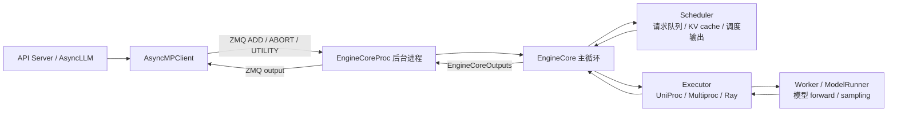

这张图强调职责边界：`AsyncMPClient` 是前端进程里的客户端；`EngineCoreProc` 是后端进程包装；`EngineCore` 是核心逻辑；`Executor` 再向下管理 worker。

## 创建链路：从 AsyncLLM 到 CoreEngineProcManager

`AsyncLLM.__init__()` 中会创建 `EngineCoreClient`：

```python
self.engine_core = EngineCoreClient.make_async_mp_client(
    vllm_config=vllm_config,
    executor_class=executor_class,
    log_stats=self.log_stats,
    ...
)
```

这里的 `executor_class` 来自 `Executor.get_class(vllm_config)`，例如 `MultiprocExecutor`、`UniProcExecutor`、`RayDistributedExecutor`。

`EngineCoreClient.make_async_mp_client()` 根据 DP 配置选择 client 类型：

- `AsyncMPClient`：普通在线路径，单 DP 或当前 client 只连一个 EngineCore。
- `DPAsyncMPClient`：外部 LB / 每个 DP rank 一个 client 的场景。
- `DPLBAsyncMPClient`：内部 LB，前端 client 需要在多个 DP rank 之间做路由。

普通路径里会进入 `AsyncMPClient.__init__()`，它继承 `MPClient.__init__()`。`MPClient` 做三件关键事：

- 创建 ZMQ `ROUTER` 输入 socket 和 `PULL` 输出 socket。
- 如果没有外部传入 `client_addresses`，调用 `launch_core_engines()` 启动本 client 管理的 EngineCore 进程。
- 等待每个 EngineCore 通过输入 socket 发 ready message，再记录 engine identity，例如 `rank.to_bytes(2, "little")`。

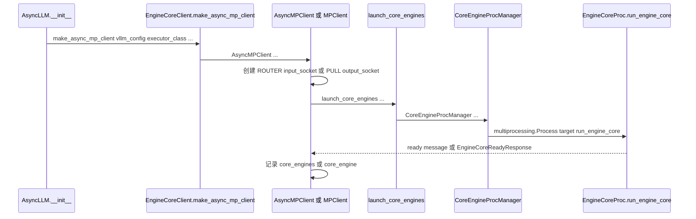

注意这个时序：`CoreEngineProcManager` 不是管理 `AsyncMPClient`，而是由 `MPClient` 在启动本地 EngineCore 时创建，用来管理后台 EngineCore 进程的生命周期。

### 源码对照：AsyncLLM 创建 EngineCore client

这段源码对应上面的第一跳：`AsyncLLM.__init__()` 不直接创建 `EngineCoreProc`，而是先创建一个 `EngineCoreClient`。普通在线路径下，这个 client 会是 `AsyncMPClient`。

```python
# vllm/v1/engine/async_llm.py
# 说明：AsyncLLM 前端持有 engine_core client，而不是直接持有 EngineCoreProc。
self.engine_core = EngineCoreClient.make_async_mp_client(
    # 说明：把完整 VllmConfig 传给后端，后端会继续用它初始化 scheduler/executor。
    vllm_config=vllm_config,
    # 说明：executor_class 已经由 Executor.get_class(vllm_config) 选好。
    executor_class=executor_class,
    # 说明：前端是否收集/输出 engine 统计信息，会继续传到后端。
    log_stats=self.log_stats,
    # 说明：如果外部已经创建好 ZMQ 地址，就通过 client_addresses 连接已有 core。
    client_addresses=client_addresses,
    # 说明：多 API server / 多 client 场景下，用 client_count 区分前端数量。
    client_count=client_count,
    # 说明：client_index 会写入请求，EngineCore 输出时用它路由回对应前端。
    client_index=client_index,
)
```

```python
# vllm/v1/engine/core_client.py
@staticmethod
@instrument(span_name="Overall Loading")
def make_async_mp_client(
    vllm_config: VllmConfig,
    executor_class: type[Executor],
    log_stats: bool,
    client_addresses: dict[str, Any] | None = None,
    client_count: int = 1,
    client_index: int = 0,
) -> "AsyncMPClient":
    # 说明：先取 parallel_config，因为 client 类型主要由 DP 配置决定。
    parallel_config = vllm_config.parallel_config
    # 说明：把几个 client 构造参数打包，避免下面三个分支重复写参数。
    client_args = (
        vllm_config,
        executor_class,
        log_stats,
        client_addresses,
        client_count,
        client_index,
    )
    # 说明：DP size 大于 1 时，需要选择 DP 专用 client。
    if parallel_config.data_parallel_size > 1:
        # 说明：外部 LB 表示每个 DP rank 通常由外部系统路由，所以 client 只连一个 rank。
        if parallel_config.data_parallel_external_lb:
            return DPAsyncMPClient(*client_args)
        # 说明：内部 LB 表示前端 client 自己维护多个 DP rank 的路由和负载均衡。
        return DPLBAsyncMPClient(*client_args)
    # 说明：最常见的非 DP 在线路径，直接创建 AsyncMPClient。
    return AsyncMPClient(*client_args)
```

```python
# vllm/v1/engine/core_client.py
class AsyncMPClient(MPClient):
    """Asyncio-compatible client for multi-proc EngineCore."""

    def __init__(
        self,
        vllm_config: VllmConfig,
        executor_class: type[Executor],
        log_stats: bool,
        client_addresses: dict[str, Any] | None = None,
        client_count: int = 1,
        client_index: int = 0,
    ):
        # 说明：MPClient.__init__ 负责 ZMQ socket、launch_core_engines 和 ready 握手。
        super().__init__(
            asyncio_mode=True,
            vllm_config=vllm_config,
            executor_class=executor_class,
            log_stats=log_stats,
            client_addresses=client_addresses,
        )

        # 说明：记录前端 client 总数，DP 或多 API server 场景会用到。
        self.client_count = client_count
        # 说明：记录当前 client 编号，ADD 请求发送前会写入 EngineCoreRequest.client_index。
        self.client_index = client_index
        # 说明：前端异步输出队列，ZMQ receiver task 会 put，AsyncLLM.output_handler 会 get。
        self.outputs_queue = asyncio.Queue[EngineCoreOutputs | Exception]()
        try:
            # 说明：如果当前线程已有 event loop，就立即启动输出 socket 接收 task。
            asyncio.get_running_loop()
            self._ensure_output_queue_task()
        except RuntimeError:
            # 说明：没有 event loop 时延迟启动，第一次 get/send 时再创建 task。
            pass
```


## CoreEngineProcManager 管什么

`CoreEngineProcManager` 在 `vllm/v1/engine/utils.py` 中，职责比较单一：**创建、监控、关闭 EngineCore 后台进程**。

构造时它会：

- 根据 `local_engine_count` 创建一个或多个 `multiprocessing.Process`。
- 每个进程的 target 都是 `EngineCoreProc.run_engine_core`。
- 进程名通常是 `EngineCore`；DP 场景下是 `EngineCore_DP{rank}`。
- 启动前会处理 NUMA 和 DP 场景下的设备可见性。
- 持有 `self.processes`，并注册 finalizer，确保异常时能清理子进程。

它还提供：

- `CoreEngineProcManager.shutdown()`：停止所有 EngineCore 进程。
- `CoreEngineProcManager.monitor_engine_liveness()`：等待子进程 sentinel；如果某个进程异常退出，记录失败进程名并触发前端清理。

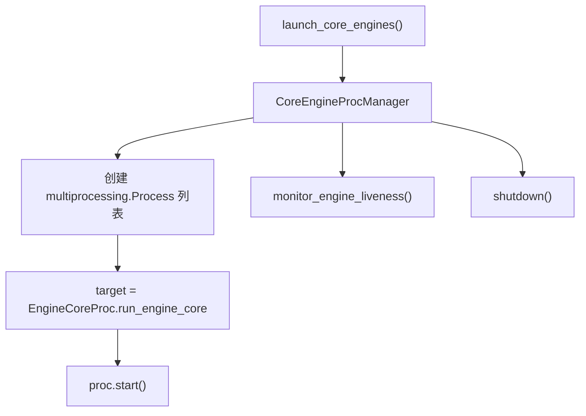

如果使用 Ray DP 后端，则会走 `CoreEngineActorManager`，它管理 Ray actor 版 EngineCore；普通多进程路径才是 `CoreEngineProcManager`。

### 源码对照：`launch_core_engines()` 和 `CoreEngineProcManager`

这段源码对应“谁把后台 EngineCore 进程拉起来”。`launch_core_engines()` 先判断 DP / Ray / offline 形态；普通多进程路径会创建 `CoreEngineProcManager`，由它持有 `multiprocessing.Process` 列表。

```python
# vllm/v1/engine/utils.py
def launch_core_engines(
    vllm_config: VllmConfig,
    executor_class: type[Executor],
    log_stats: bool,
    addresses: EngineZmqAddresses,
    num_api_servers: int = 1,
) -> Iterator[tuple[CoreEngineProcManager | CoreEngineActorManager | None,
                    DPCoordinator | None,
                    EngineZmqAddresses,
                    Queue | None]]:
    # 说明：EngineCore 启动形态主要由 parallel_config 决定。
    parallel_config = vllm_config.parallel_config
    # 说明：全局 DP size，决定是否需要多个 EngineCore rank。
    dp_size = parallel_config.data_parallel_size
    # 说明：本节点要启动多少个本地 EngineCore。
    local_engine_count = parallel_config.data_parallel_size_local
    # 说明：本节点第一个本地 DP rank，用于计算每个进程的 local rank。
    local_start_index = parallel_config.data_parallel_rank_local
    # 说明：当前进程所属 DP rank；offline mode 下通常只启动一个本地 core。
    dp_rank = parallel_config.data_parallel_rank

    # 说明：Ray 后端不走本地 multiprocessing.Process，而走 actor manager。
    if parallel_config.data_parallel_backend == "ray":
        engine_actor_manager = CoreEngineActorManager(
            vllm_config=vllm_config,
            addresses=addresses,
            executor_class=executor_class,
            log_stats=log_stats,
        )
        yield engine_actor_manager, coordinator, addresses, tensor_queue
        return
```

```python
# vllm/v1/engine/utils.py
class CoreEngineProcManager:
    """管理 AsyncLLM / LLMEngine 使用的后台 EngineCore 进程。"""

    def __init__(
        self,
        local_engine_count: int,
        start_index: int,
        local_start_index: int,
        vllm_config: VllmConfig,
        local_client: bool,
        handshake_address: str,
        executor_class: type[Executor],
        log_stats: bool,
        client_handshake_address: str | None = None,
        tensor_queue: Queue | None = None,
    ):
        # 说明：使用 vLLM 统一的 multiprocessing context，兼容 fork/spawn 策略。
        context = get_mp_context()
        # 说明：所有 EngineCoreProc 进程共享的启动参数。
        common_kwargs = {
            "vllm_config": vllm_config,
            "local_client": local_client,
            "handshake_address": handshake_address,
            "executor_class": executor_class,
            "log_stats": log_stats,
            "tensor_queue": tensor_queue,
        }

        # 说明：DP size > 1 时，进程名和 rank 计算都需要带 DP 信息。
        is_dp = vllm_config.parallel_config.data_parallel_size > 1
        from vllm.v1.engine.core import EngineCoreProc

        # 说明：manager 只管理进程对象，不管理请求对象。
        self.processes: list[BaseProcess] = []
        local_dp_ranks = []
        # 说明：为本节点负责的每个本地 engine 创建一个后台进程。
        for index in range(local_engine_count):
            local_index = local_start_index + index
            global_index = start_index + index
            local_dp_ranks.append(local_index)
            self.processes.append(
                context.Process(
                    # 说明：每个进程入口都是 EngineCoreProc.run_engine_core。
                    target=EngineCoreProc.run_engine_core,
                    # 说明：DP 场景用 EngineCore_DP{rank}，普通场景用 EngineCore。
                    name=f"EngineCore_DP{global_index}" if is_dp else "EngineCore",
                    # 说明：dp_rank/local_dp_rank 注入进程入口，决定当前 core 的 DP 身份。
                    kwargs=common_kwargs
                    | {"dp_rank": global_index, "local_dp_rank": local_index},
                )
            )
```

```python
# vllm/v1/engine/utils.py
def monitor_engine_liveness(self) -> None:
    """监控 EngineCore 子进程是否异常退出。"""

    # 说明：每个进程 sentinel 可被 connection.wait() 等待，用来感知进程退出。
    sentinel_to_proc = {proc.sentinel: proc for proc in self.processes}
    sentinels = set(sentinel_to_proc.keys())

    # 说明：只要还有存活进程且 manager 没主动停止，就持续轮询。
    while sentinels and not self.manager_stopped.is_set():
        died_sentinels = connection.wait(sentinels, timeout=1)

        for sentinel in died_sentinels:
            proc = sentinel_to_proc.pop(cast(int, sentinel))
            exitcode = proc.exitcode
            # 说明：非 0 退出码表示 EngineCore 异常死亡，前端需要感知并清理。
            if exitcode != 0 and not self.manager_stopped.is_set():
                self.failed_proc_name = proc.name
        if died_sentinels:
            # 说明：当前策略是任一 engine 退出就整体 shutdown。
            break

    self.shutdown()
```


## EngineCoreProc 启动过程

每个后台进程从 `EngineCoreProc.run_engine_core()` 开始：

- 设置进程标题，例如 `EngineCore` 或 `EngineCore_DP{rank}`。
- 初始化 tracing、日志、NUMA、DP rank 等环境。
- 如果是 MoE + DP，创建 `DPEngineCoreProc`；否则创建 `EngineCoreProc`。
- 注册 `SIGTERM` / `SIGINT` 处理器，把 shutdown 状态改成 `REQUESTED`，再向 `input_queue` 放一个 `WAKEUP`，唤醒可能阻塞的主循环。
- 调用 `EngineCoreProc.run_busy_loop()`。

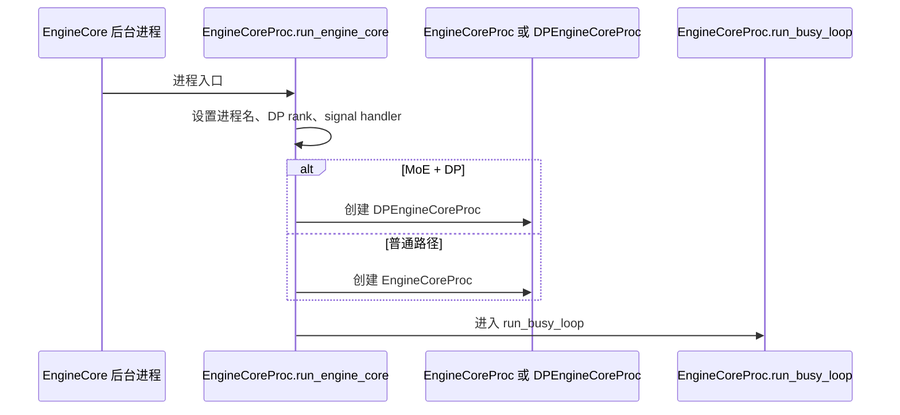

`EngineCoreProc.__init__()` 先创建两个 Python 队列：

- `EngineCoreProc.input_queue: queue.Queue[tuple[EngineCoreRequestType, Any]]`
- `EngineCoreProc.output_queue: queue.Queue[tuple[int, EngineCoreOutputs] | bytes]`

然后它会执行握手、初始化数据并行状态、调用 `EngineCore.__init__()` 创建 scheduler 和 executor，最后启动两个后台线程。

### 源码对照：`EngineCoreProc.run_engine_core()` 和 `__init__()`

`run_engine_core()` 是子进程入口；`EngineCoreProc.__init__()` 则把进程内队列、握手、`EngineCore` 基类初始化、输入/输出线程串起来。

```python
# vllm/v1/engine/core.py
@staticmethod
def run_engine_core(*args, dp_rank: int = 0, local_dp_rank: int = 0, **kwargs):
    """在后台进程中启动 EngineCore busy loop。"""

    # 说明：spawn 后重新注册 transformer config 序列化逻辑，避免配置对象不能跨进程序列化。
    maybe_register_config_serialize_by_value()
    # 说明：engine_core 先置 None，异常路径可以区分“创建失败”和“运行中失败”。
    engine_core: EngineCoreProc | None = None
    try:
        # 说明：从 kwargs 取 VllmConfig，后续 DP / MoE / KV transfer 都依赖它。
        vllm_config: VllmConfig = kwargs["vllm_config"]
        parallel_config: ParallelConfig = vllm_config.parallel_config
        # 说明：只要 DP size > 1 或当前 rank 非 0，就认为处于 data parallel 形态。
        data_parallel = parallel_config.data_parallel_size > 1 or dp_rank > 0
        if data_parallel:
            # 说明：记录本地 DP rank，并设置进程标题便于日志和 ps 观察。
            parallel_config.data_parallel_rank_local = local_dp_rank
            process_title = f"EngineCore_DP{dp_rank}"
        else:
            process_title = "EngineCore"
        set_process_title(process_title)

        # 说明：MoE + DP 需要 DPEngineCoreProc；普通路径用 EngineCoreProc。
        if data_parallel and vllm_config.model_config.is_moe:
            parallel_config.data_parallel_rank = dp_rank
            engine_core = DPEngineCoreProc(*args, **kwargs)
        else:
            # 说明：非 MoE 的 DP rank 可以当成独立单 DP engine 运行。
            parallel_config.data_parallel_size = 1
            parallel_config.data_parallel_size_local = 1
            parallel_config.data_parallel_rank = 0
            engine_core = EngineCoreProc(*args, engine_index=dp_rank, **kwargs)

        assert engine_core is not None

        def wakeup_engine():
            # 说明：signal handler 只触发 callback；真正唤醒通过 input_queue 的 WAKEUP 消息完成。
            engine_core.input_queue.put_nowait((EngineCoreRequestType.WAKEUP, None))

        def signal_handler(signum, frame):
            # 说明：收到 SIGTERM/SIGINT 后不立刻硬杀，而是请求 busy loop 进入 shutdown 状态。
            engine_core.shutdown_state = EngineShutdownState.REQUESTED
            signal_callback.trigger()

        signal.signal(signal.SIGTERM, signal_handler)
        signal.signal(signal.SIGINT, signal_handler)
        # 说明：进入 EngineCoreProc 主循环；正常退出会 raise SystemExit。
        engine_core.run_busy_loop()
```

```python
# vllm/v1/engine/core.py
class EngineCoreProc(EngineCore):
    """把 EngineCore 包装成后台进程 + ZMQ IO 的运行形态。"""

    def __init__(
        self,
        vllm_config: VllmConfig,
        local_client: bool,
        handshake_address: str,
        executor_class: type[Executor],
        log_stats: bool,
        client_handshake_address: str | None = None,
        tensor_queue: Queue | None = None,
        *,
        engine_index: int = 0,
    ):
        # 说明：输入线程写入 input_queue，busy loop 从这里读取 ADD/ABORT/UTILITY。
        self.input_queue = queue.Queue[tuple[EngineCoreRequestType, Any]]()
        # 说明：busy loop 写入 output_queue，输出线程从这里取 EngineCoreOutputs 发回前端。
        self.output_queue = queue.Queue[tuple[int, EngineCoreOutputs] | bytes]()
        # 说明：executor 失败时往 input_queue 放 EXECUTOR_FAILED，让主循环统一处理 fatal error。
        executor_fail_callback = lambda: self.input_queue.put_nowait(
            (EngineCoreRequestType.EXECUTOR_FAILED, b"")
        )

        # 说明：engine_index 会写入 EngineCoreOutputs.engine_index，前端可区分输出来源。
        self.engine_index = engine_index
        # 说明：ZMQ DEALER identity 使用固定长度 bytes，前端 ROUTER 用它区分 engine。
        identity = self.engine_index.to_bytes(length=2, byteorder="little")
        # 说明：shutdown_state 驱动 busy loop 是否继续运行或 drain/abort 请求。
        self.shutdown_state = EngineShutdownState.RUNNING

        with self._perform_handshakes(
            handshake_address,
            identity,
            local_client,
            vllm_config,
            client_handshake_address,
        ) as addresses:
            # 说明：握手后拿到前端 input/output socket 地址和可选 DP coordinator 地址。
            self.addresses = addresses
            # 说明：默认允许 _process_input_queue 在没有工作时阻塞等待输入。
            self.process_input_queue_block = True
            # 说明：先初始化 DP 状态，再进入 EngineCore.__init__ 创建 executor/scheduler。
            self._init_data_parallel(vllm_config)

            super().__init__(
                vllm_config,
                executor_class,
                log_stats,
                executor_fail_callback,
                internal_dp_balancing,
            )

            # 说明：输入线程负责 Socket -> input_queue。
            ready_event = threading.Event()
            input_thread = threading.Thread(
                target=self.process_input_sockets,
                args=(addresses.inputs, addresses.coordinator_input, identity, ready_event),
                daemon=True,
            )
            input_thread.start()

            # 说明：输出线程负责 output_queue -> Socket。
            self.output_thread = threading.Thread(
                target=self.process_output_sockets,
                args=(addresses.outputs, addresses.coordinator_output, self.engine_index),
                daemon=True,
            )
            self.output_thread.start()
```


## 输入输出队列和线程

`EngineCoreProc` 的主循环不直接碰 ZMQ socket。它只和 Python queue 交互：

- `input_queue`：socket 输入线程写入，主循环读取。
- `output_queue`：主循环写入，socket 输出线程读取。

```mermaid
flowchart LR
    FrontIn["前端 ROUTER input_socket"] --> InThread["EngineCoreProc.process_input_sockets()<br>输入线程"]
    InThread --> IQ["EngineCoreProc.input_queue"]
    IQ --> Loop["EngineCoreProc.run_busy_loop()<br>主线程"]
    Loop --> OQ["EngineCoreProc.output_queue"]
    OQ --> OutThread["EngineCoreProc.process_output_sockets()<br>输出线程"]
    OutThread --> FrontOut["前端 PULL output_socket"]
```

这样的设计有两个目的：

- **让 socket IO 和 GPU 执行重叠**：ZMQ 收发会释放 GIL，后台线程可以在模型 forward 时继续接收请求或发送输出。
- **让序列化 / 反序列化和主循环解耦**：输入线程负责 msgpack decode，输出线程负责 msgpack encode，主循环只处理已经转换好的 Python 对象。

## 输入线程：process_input_sockets

`EngineCoreProc.process_input_sockets()` 是输入 socket IO 线程。

启动时它会：

- 为每个前端 input address 创建 `DEALER` socket，identity 是当前 engine rank 的 bytes。
- 如果有 DP coordinator，还会创建 `XSUB` coordinator socket。
- 向每个前端 input socket 发送 `EngineCoreReadyResponse`，这是前端 `MPClient` 等待的 ready message。
- 注册 poller，循环等待输入 socket 可读。

收到消息后：

- 第一帧是 `type_frame`，转成 `EngineCoreRequestType`，例如 `ADD`、`ABORT`、`UTILITY`。
- 如果是 `ADD`，用 `MsgpackDecoder(EngineCoreRequest)` 解码，然后调用 `EngineCore.preprocess_add_request()`。
- 如果是 `ABORT`，除了放进 `input_queue`，还会放进 `aborts_queue`，这样模型执行期间也能尽早观察到 abort。
- 最后把 `(request_type, request)` 放进 `EngineCoreProc.input_queue`。

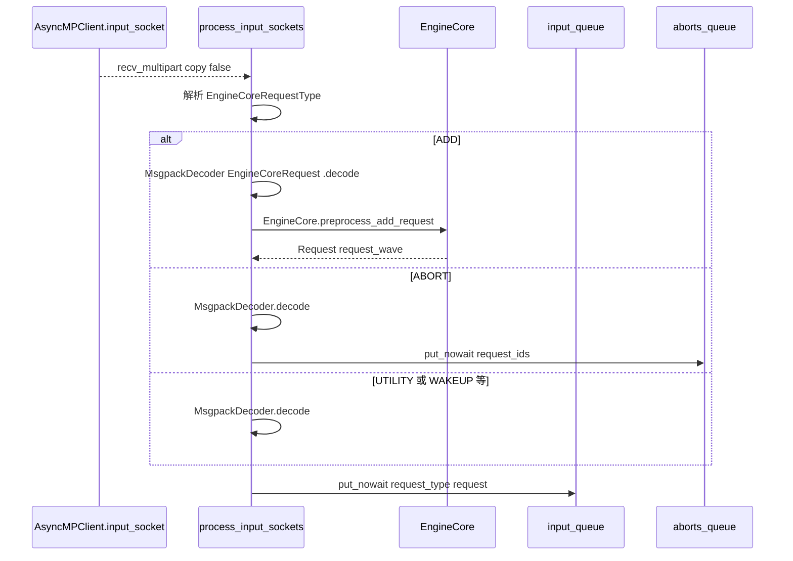

这里有一个重要细节：**`ADD` 请求在输入线程里已经被预处理成 scheduler 内部的 `Request`**。这样做可以让 request 初始化、multimodal receiver cache、structured output grammar init 等工作和模型执行并行。

### 源码对照：输入线程如何把 ZMQ 消息变成 `input_queue` item

这段源码直接对应上面的输入线程图。重点是：`ADD` 在输入线程里先 decode 成 `EngineCoreRequest`，再调用 `preprocess_add_request()` 转成 scheduler 内部 `Request`。

```python
# vllm/v1/engine/core.py
def process_input_sockets(
    self,
    input_addresses: list[str],
    coord_input_address: str | None,
    identity: bytes,
    ready_event: threading.Event,
):
    """输入 socket IO 线程。"""

    # 说明：ADD 请求需要按 EngineCoreRequest 类型解码，并支持 tensor IPC 附带数据。
    add_request_decoder = MsgpackDecoder(
        EngineCoreRequest, oob_tensor_provider=self.tensor_ipc_receiver
    )
    # 说明：ABORT / UTILITY / WAKEUP 等请求不固定为 EngineCoreRequest，用通用 decoder。
    generic_decoder = MsgpackDecoder(oob_tensor_provider=self.tensor_ipc_receiver)

    with ExitStack() as stack, zmq.Context() as ctx:
        # 说明：为每个前端 input address 创建 DEALER socket，并使用 engine identity。
        input_sockets = [
            stack.enter_context(
                make_zmq_socket(
                    ctx, input_address, zmq.DEALER, identity=identity, bind=False
                )
            )
            for input_address in input_addresses
        ]
        # 说明：ready_response 是 EngineCore 启动完成后发给前端的握手消息。
        ready_response = EngineCoreReadyResponse(
            max_model_len=self.vllm_config.model_config.max_model_len,
            num_gpu_blocks=self.vllm_config.cache_config.num_gpu_blocks or 0,
            block_size=self.vllm_config.cache_config.block_size,
            dp_stats_address=self.frontend_stats_publish_address,
            dtype=str(self.vllm_config.model_config.dtype).removeprefix("torch."),
            vllm_version=VLLM_VERSION,
        )
        ready_payload = msgspec.msgpack.encode(ready_response)
        for input_socket in input_sockets:
            # 说明：DEALER 先发 ready，前端 ROUTER 才知道这个 identity 可以收消息。
            input_socket.send(ready_payload)
            poller.register(input_socket, zmq.POLLIN)

        ready_event.set()
        while True:
            # 说明：阻塞等待任意 input socket 可读。
            for input_socket, _ in poller.poll():
                # 说明：第一帧是请求类型，后续帧是 msgpack 数据或 tensor buffer。
                type_frame, *data_frames = input_socket.recv_multipart(copy=False)
                if type_frame.buffer == b"READY":
                    # 说明：DP coordinator 的 READY 只用于协调，不进入请求队列。
                    assert input_socket == coord_socket
                    continue
                # 说明：把 bytes frame 转成 EngineCoreRequestType 枚举。
                request_type = EngineCoreRequestType(bytes(type_frame.buffer))

                if request_type == EngineCoreRequestType.ADD:
                    # 说明：ADD 请求还原成 EngineCoreRequest。
                    req: EngineCoreRequest = add_request_decoder.decode(data_frames)
                    try:
                        # 说明：提前转成 scheduler 内部 Request，让预处理和模型执行重叠。
                        request = self.preprocess_add_request(req)
                    except Exception:
                        # 说明：预处理失败时返回 request-scoped error，并跳过该请求。
                        self._handle_request_preproc_error(req)
                        continue
                else:
                    # 说明：非 ADD 请求保持原始 payload，例如 request_ids 或 utility 参数。
                    request = generic_decoder.decode(data_frames)

                    if request_type == EngineCoreRequestType.ABORT:
                        # 说明：ABORT 额外进入 aborts_queue，使 step() 能尽早处理执行期间的取消。
                        self.aborts_queue.put_nowait(request)

                # 说明：所有请求最终进入 input_queue，由 busy loop 串行分发。
                self.input_queue.put_nowait((request_type, request))
```

```python
# vllm/v1/engine/core.py
def preprocess_add_request(self, request: EngineCoreRequest) -> tuple[Request, int]:
    """把前端 EngineCoreRequest 转成 scheduler 内部 Request。"""

    # 说明：多模态特征可能通过 tensor IPC 到达，需要先从 receiver cache 合并真实数据。
    if self.mm_receiver_cache is not None and request.mm_features:
        request.mm_features = self.mm_receiver_cache.get_and_update_features(
            request.mm_features
        )

    # 说明：Request 是 scheduler 内部对象，会携带 block hash / sampling params / 状态字段。
    req = Request.from_engine_core_request(request, self.request_block_hasher)
    # 说明：structured output 请求需要提前初始化 grammar，scheduler 后续会检查编译状态。
    if req.use_structured_output:
        self.structured_output_manager.grammar_init(req)
    # 说明：request.current_wave 用于 DP wave / 弹性场景的顺序控制。
    return req, request.current_wave
```


## 输出线程：process_output_sockets

`EngineCoreProc.process_output_sockets()` 是输出 socket IO 线程。

它会：

- 为每个前端 output address 创建 `PUSH` socket。
- 如果有 DP coordinator，也会创建 coordinator output socket。
- 循环从 `EngineCoreProc.output_queue.get()` 取输出。
- 如果取到 `EngineCoreProc.ENGINE_CORE_DEAD`，向前端发送死亡哨兵，然后退出。
- 否则输出格式是 `(client_index, EngineCoreOutputs)`。
- 给 `EngineCoreOutputs.engine_index` 写入当前 engine index。
- 如果 `client_index == -1`，说明这是给 DP coordinator 的消息。
- 否则用 `MsgpackEncoder.encode_into()` 编码，然后 `send_multipart(copy=False, track=True)` 发给对应前端 output socket。

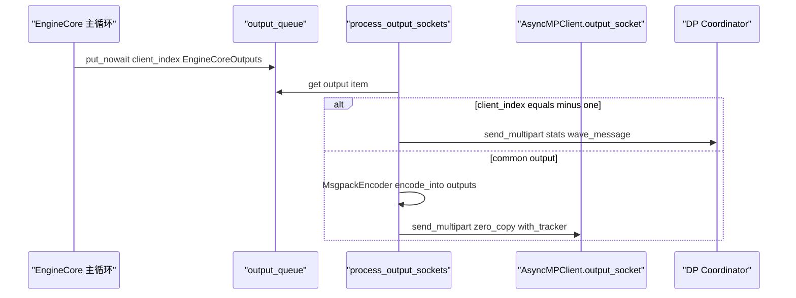

输出线程还会复用 `bytearray` buffer，并用 `MessageTracker` 保持输出对象和 buffer 的引用，避免 ZMQ zero-copy 发送还没完成时底层内存被释放。

### 源码对照：输出线程如何把 `output_queue` 发回前端

输出线程和输入线程正好相反：主循环只负责把 `(client_index, EngineCoreOutputs)` 放进 `output_queue`，ZMQ 编码和 zero-copy 发送都在输出线程完成。

```python
# vllm/v1/engine/core.py
def process_output_sockets(
    self,
    output_paths: list[str],
    coord_output_path: str | None,
    engine_index: int,
):
    """输出 socket IO 线程。"""

    # 说明：EngineCoreOutputs 通过 msgpack 发回前端。
    encoder = MsgpackEncoder()
    # 说明：复用 bytearray，减少每轮输出编码时的内存分配。
    reuse_buffers: list[bytearray] = []
    # 说明：ZMQ zero-copy 未完成前，必须保留 outputs 和 buffer 引用。
    pending = deque[tuple[zmq.MessageTracker, Any, bytearray]]()

    with ExitStack() as stack, zmq.Context() as ctx:
        # 说明：每个前端 output address 对应一个 PUSH socket。
        sockets = [
            stack.enter_context(make_zmq_socket(ctx, output_path, zmq.PUSH, linger=4000))
            for output_path in output_paths
        ]
        while True:
            # 说明：输出线程阻塞等待主循环放入输出。
            output = self.output_queue.get()
            # 说明：死亡哨兵需要发给所有前端，然后退出输出线程。
            if output == EngineCoreProc.ENGINE_CORE_DEAD:
                for socket in sockets:
                    socket.send(output)
                break
            assert not isinstance(output, bytes)
            # 说明：client_index 决定发给哪个前端 client；outputs 是真实 EngineCoreOutputs。
            client_index, outputs = output
            # 说明：写入 engine_index，前端可知道这个输出来自哪个 EngineCore rank。
            outputs.engine_index = engine_index

            if client_index == -1:
                # 说明：-1 是 DP coordinator 消息，不走普通前端 socket。
                assert coord_socket is not None
                coord_socket.send_multipart(encoder.encode(outputs))
                continue

            # 说明：回收已经完成发送的 buffer，降低分配压力。
            while pending and pending[-1][0].done:
                reuse_buffers.append(pending.pop()[2])

            # 说明：优先复用旧 buffer，没有可用 buffer 时再创建新的 bytearray。
            buffer = reuse_buffers.pop() if reuse_buffers else bytearray()
            # 说明：encode_into 会把 outputs 编码到 buffer，并返回 multipart buffers。
            buffers = encoder.encode_into(outputs, buffer)
            # 说明：copy=False + track=True 开启 zero-copy，并返回 MessageTracker。
            tracker = sockets[client_index].send_multipart(
                buffers, copy=False, track=True
            )
            if not tracker.done:
                # 说明：发送未完成时，把 outputs/buffer 放进 pending 防止内存提前释放。
                ref = outputs if len(buffers) > 1 else None
                pending.appendleft((tracker, ref, buffer))
            elif len(reuse_buffers) < max_reuse_bufs:
                # 说明：发送立即完成时，buffer 可以回收到复用池。
                reuse_buffers.append(buffer)
```


## 主循环：run_busy_loop 在干嘛

普通 `EngineCoreProc.run_busy_loop()` 很短，但它是整个后端的心跳。下面先看概念，再看后面的源码对照。它每轮做两件事：

- **先处理输入队列**：把前端发来的 ADD / ABORT / UTILITY / WAKEUP 等请求分发出去。
- **再推进 engine step**：如果 scheduler 里有请求，调用 `EngineCore.step()` 或 `EngineCore.step_with_batch_queue()`，把输出放进 `output_queue`。

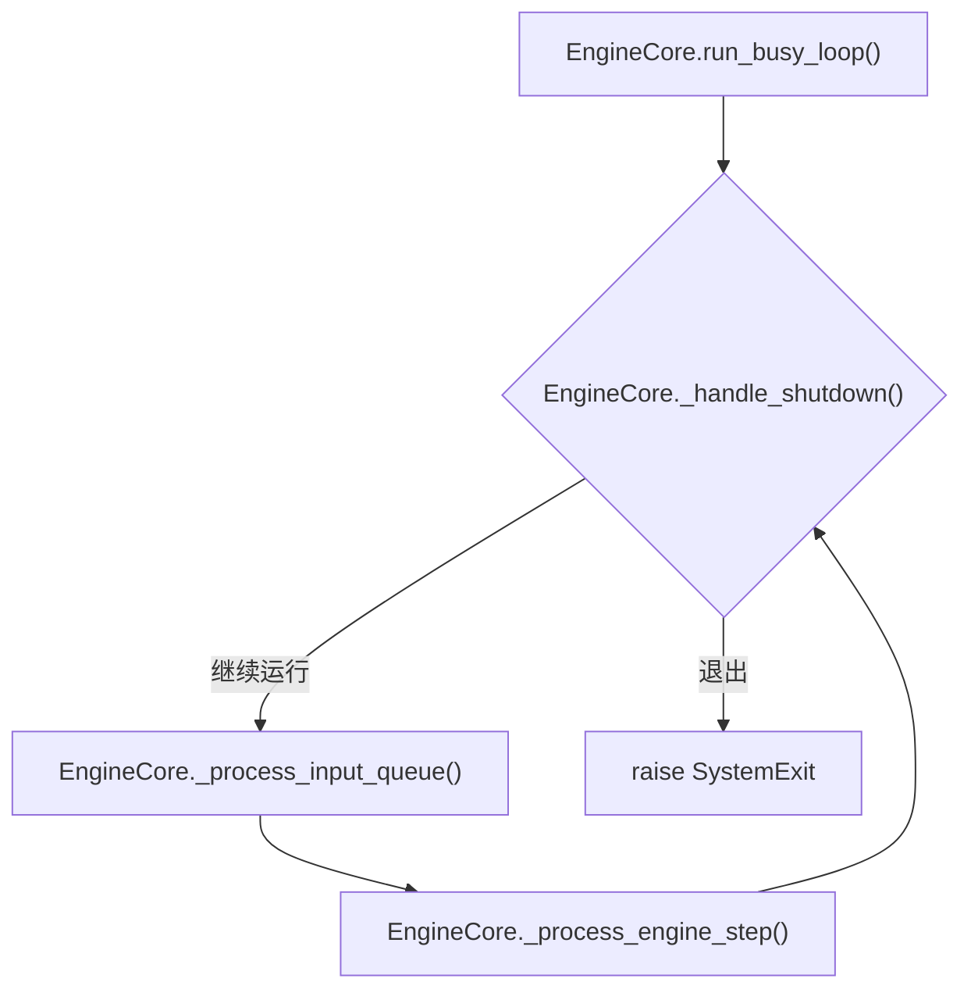

### _process_input_queue

`EngineCore._process_input_queue()` 的目标不是无限消费输入，而是 **在没有工作时阻塞等待，有工作时快速排空现有输入**。

逻辑可以这样理解：

- 当 `EngineCore.has_work()` 为假，并且没有 shutdown，它会阻塞在 `input_queue.get(block=process_input_queue_block)`。
- `has_work()` 为真表示 scheduler 有请求、DP engine 正在运行，或者 batch queue 里有未完成 batch。
- 收到请求后调用 `EngineCore._handle_client_request()`。
- 跳出等待后，它会把当前 `input_queue` 中剩余请求用 `get_nowait()` 全部处理掉。

`EngineCore._handle_client_request()` 分发逻辑：

- `WAKEUP`：只用于唤醒阻塞循环。
- `ADD`：调用 `EngineCore.add_request()`，最终进入 `Scheduler.add_request()`。
- `ABORT`：调用 `EngineCore.abort_requests()`，最终进入 `Scheduler.finish_requests()`。
- `UTILITY`：动态调用 EngineCore 上的工具方法，例如 profile、sleep、reset cache、collective_rpc 等，并把 `UtilityOutput` 放进 `output_queue`。
- `EXECUTOR_FAILED`：抛出异常，让 EngineCore 进入 fatal error 路径。

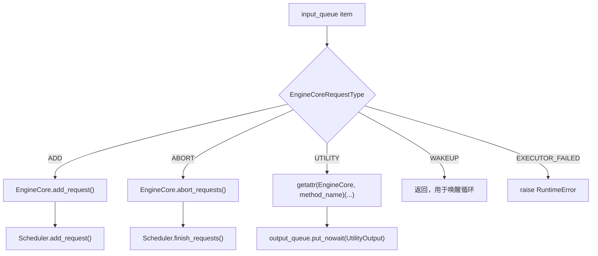

### _process_engine_step

`EngineCore._process_engine_step()` 是主循环推进模型的一层包装：

- 调用 `EngineCore.step_fn()`。`step_fn` 在 `EngineCore.__init__()` 里决定：普通情况下是 `EngineCore.step()`，启用 batch queue 时是 `EngineCore.step_with_batch_queue()`。
- `step_fn()` 返回 `dict[int, EngineCoreOutputs]` 和 `model_executed`。
- 对每个 `(client_index, EngineCoreOutputs)`，放入 `EngineCoreProc.output_queue`。
- 调用 `EngineCore.post_step(model_executed)`，例如 speculative / diffusion 场景更新 draft token ids。
- 如果这轮没有执行模型但 scheduler 仍有请求，短暂 `sleep(0.001)`，给后台 KV transfer 等线程让出进度。

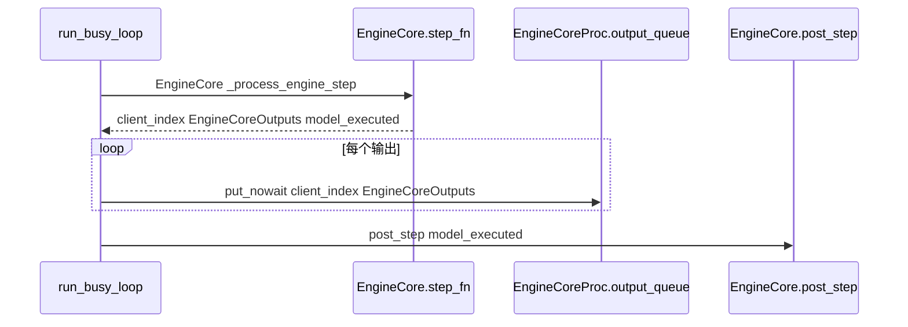


### 源码对照：`run_busy_loop()`、输入分发和 step 包装

这一段把“主循环心跳”落到源码上：先处理输入，再推进 step，再把输出放进输出队列。

```python
# vllm/v1/engine/core.py
def run_busy_loop(self):
    """EngineCore 的主循环。"""
    # 说明：_handle_shutdown() 返回 True 表示还能继续处理请求。
    while self._handle_shutdown():
        # 说明：先处理前端输入，可能新增请求、取消请求或执行 utility 方法。
        self._process_input_queue()
        # 说明：再推进一次 scheduler/executor/model output 的闭环。
        self._process_engine_step()

    # 说明：shutdown drain/abort 完成后，用 SystemExit 退出后台进程。
    raise SystemExit
```

```python
# vllm/v1/engine/core.py
def _process_input_queue(self):
    """在需要执行 engine step 前处理输入队列。"""

    waited = False
    # 说明：没有 scheduler work 时，可以阻塞等 input_queue，避免空转。
    while not self.has_work() and self.is_running():
        self._notify_idle_state_callbacks()
        if self.input_queue.empty():
            # 说明：ABORT 也会走 input_queue；空闲等待前可以清掉旁路 aborts_queue。
            with self.aborts_queue.mutex:
                self.aborts_queue.queue.clear()
        block = self.process_input_queue_block
        try:
            # 说明：阻塞或非阻塞地拿一个前端请求。
            req = self.input_queue.get(block=block)
            # 说明：根据 EngineCoreRequestType 分发到 ADD/ABORT/UTILITY 等处理函数。
            self._handle_client_request(*req)
        except queue.Empty:
            break
        if not block:
            break

    # 说明：一旦已经有工作要执行，就快速排空当前队列，减少新请求等待下一轮。
    while not self.input_queue.empty():
        req = self.input_queue.get_nowait()
        self._handle_client_request(*req)
```

```python
# vllm/v1/engine/core.py
def _handle_client_request(
    self, request_type: EngineCoreRequestType, request: Any
) -> None:
    """分发前端请求。"""

    if request_type == EngineCoreRequestType.WAKEUP:
        # 说明：WAKEUP 只用于唤醒阻塞的 busy loop，不改变 scheduler 状态。
        return
    elif request_type == EngineCoreRequestType.ADD:
        # 说明：输入线程已经把 ADD 预处理成 (Request, request_wave)。
        req, request_wave = request
        if self._reject_add_in_shutdown(req):
            return
        # 说明：真正把请求交给 Scheduler.add_request()。
        self.add_request(req, request_wave)
    elif request_type == EngineCoreRequestType.ABORT:
        # 说明：取消请求最终会进入 scheduler.finish_requests()。
        self.abort_requests(request)
    elif request_type == EngineCoreRequestType.UTILITY:
        # 说明：utility 是前端发起的控制命令，例如 profile/reset/sleep。
        client_idx, call_id, method_name, args = request
        output = UtilityOutput(call_id)
        # 说明：动态查找 EngineCore 方法，统一包装成功/失败结果。
        get_result = lambda: (
            (method := getattr(self, method_name))
            and method(*self._convert_msgspec_args(method, args))
        )
        # 说明：utility 输出也走 output_queue 返回前端。
        enqueue_output = lambda out: self.output_queue.put_nowait(
            (client_idx, EngineCoreOutputs(utility_output=out))
        )
        self._invoke_utility_method(method_name, get_result, output, enqueue_output)
    elif request_type == EngineCoreRequestType.EXECUTOR_FAILED:
        # 说明：executor 失败是 fatal error，直接让 EngineCore 退出错误路径。
        raise RuntimeError("Executor failed.")
```

```python
# vllm/v1/engine/core.py
def _process_engine_step(self) -> bool:
    """只有存在未完成本地请求时才会推进模型。"""

    # 说明：step_fn 在 __init__ 里选择，可能是 step() 或 step_with_batch_queue()。
    outputs, model_executed = self.step_fn()
    # 说明：outputs 按 client_index 分组，输出线程会按 client_index 发回对应前端。
    for output in outputs.items() if outputs else ():
        self.output_queue.put_nowait(output)
    # 说明：执行 step 后处理 speculative/diffusion draft token 等后置逻辑。
    self.post_step(model_executed)

    # 说明：没执行模型但 scheduler 仍有请求时，短暂让出 GIL 给 KV transfer 等后台线程。
    if not model_executed and self.scheduler.has_requests():
        time.sleep(0.001)

    return model_executed
```

## step：一次 EngineCore 迭代做了什么

普通 `EngineCore.step()` 是最核心的执行闭环：

1. `Scheduler.has_requests()`：如果 scheduler 没有请求，返回空输出。
2. `Scheduler.schedule()`：选择本轮要执行的请求和 token，产出 `SchedulerOutput`。本文不展开具体调度策略。
3. `Executor.execute_model(scheduler_output, non_block=True)`：把 `SchedulerOutput` 发给 worker / model runner，返回 `Future`。
4. `Scheduler.get_grammar_bitmask(scheduler_output)`：structured output 场景下获取 grammar mask。
5. `future.result()`：等待模型 forward 结果。
6. 如果 `model_output is None`，调用 `Executor.sample_tokens(grammar_output)` 采样 token。
7. `EngineCore._process_aborts_queue()`：处理模型执行期间到达的 abort。
8. `Scheduler.update_from_output(scheduler_output, model_output)`：把模型输出写回 scheduler 状态，生成 `EngineCoreOutputs`。
9. 返回 `(engine_core_outputs, model_executed)`。

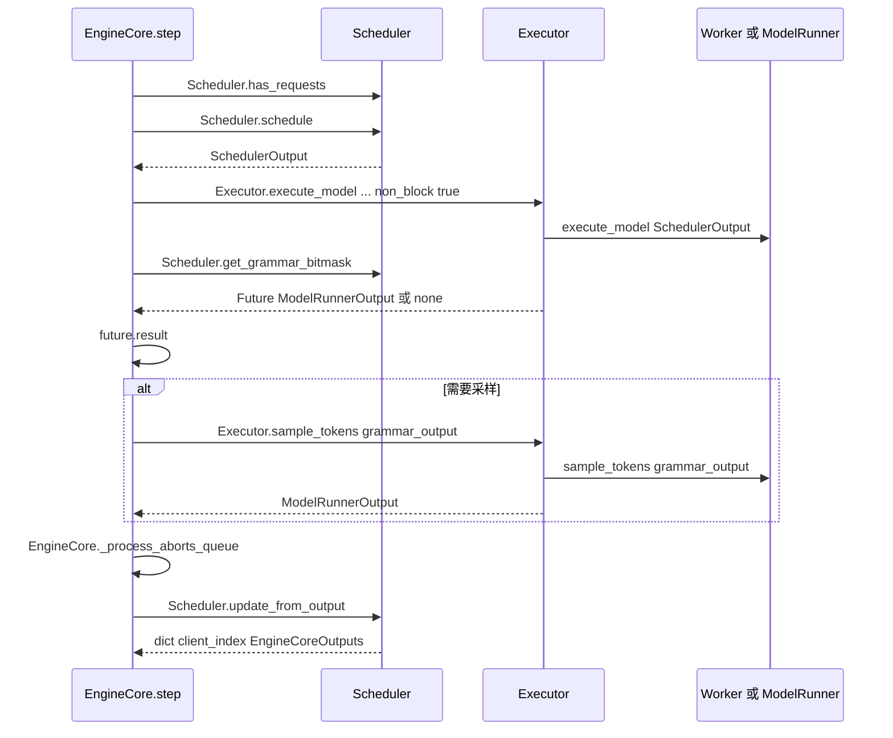

`SchedulerOutput` 是 scheduler 给 executor 的执行计划；`ModelRunnerOutput` 是 worker / model runner 执行后的输出；`EngineCoreOutputs` 是发回前端的 engine-core 级输出。


### 源码对照：普通 `EngineCore.step()`

`step()` 是 EngineCore 最核心的 schedule -> execute -> sample -> update 闭环。

```python
# vllm/v1/engine/core.py
def step(self) -> tuple[dict[int, EngineCoreOutputs], bool]:
    """调度、执行模型，并生成 EngineCoreOutputs。"""

    # 说明：scheduler 没有请求时，本轮没有工作，直接返回空输出。
    if not self.scheduler.has_requests():
        return {}, False
    # 说明：scheduler 选择本轮运行哪些请求和 token，并产出 worker 需要的执行计划。
    scheduler_output = self.scheduler.schedule(self._should_throttle_prefills())
    # 说明：把 SchedulerOutput 交给 executor，non_block=True 允许提交后先做其他工作。
    future = self.model_executor.execute_model(scheduler_output, non_block=True)
    # 说明：structured output 请求需要 grammar bitmask 约束采样。
    grammar_output = self.scheduler.get_grammar_bitmask(scheduler_output)
    with (
        self.log_error_detail(scheduler_output),
        self.log_iteration_details(scheduler_output),
    ):
        # 说明：等待 worker/model runner 的 forward 输出。
        model_output = future.result()
        # 说明：某些路径 forward 不直接返回采样结果，需要单独 sample_tokens。
        if model_output is None:
            model_output = self.model_executor.sample_tokens(grammar_output)

    # 说明：模型执行期间可能收到 abort；更新 scheduler 前先处理取消。
    self._process_aborts_queue()
    # 说明：scheduler 消化 model_output，更新请求状态、KV cache 状态并生成前端输出。
    engine_core_outputs = self.scheduler.update_from_output(
        scheduler_output, model_output
    )

    # 说明：第二个返回值表示本轮是否真的调度了 token / 执行了模型。
    return engine_core_outputs, scheduler_output.total_num_scheduled_tokens > 0
```

## step_with_batch_queue：为什么还有 batch queue

`EngineCore.__init__()` 中有：

- `batch_queue_size = vllm_config.max_concurrent_batches`
- 如果 `batch_queue_size > 1`，启用 `EngineCore.step_with_batch_queue()`。

这个路径主要用于 pipeline parallelism（流水线并行）等需要异步排队多个 batch 的场景，目标是减少 pipeline bubble。

它和普通 `step()` 的差别是：

- 优先尝试 schedule 新 batch，并把 `Future`、`SchedulerOutput`、`exec_future` 放进 `batch_queue`。
- 如果 batch queue 未满，而且还有可继续推进的工作，可以先返回 `None`，不阻塞等模型输出。
- 当队列满或没有新 batch 可排时，再 pop 最早的 future，等待输出并调用 `Scheduler.update_from_output()`。
- structured output / speculative 场景下，可能延后 sampling，等拿到必要 token 后再计算 grammar bitmask。

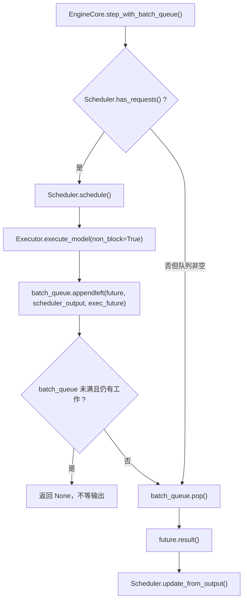

普通阅读请求调用链时，可以先理解 `EngineCore.step()`；遇到 pipeline parallelism 或 `max_concurrent_batches > 1` 时，再看 `step_with_batch_queue()`。


### 源码对照：`step_with_batch_queue()` 的核心差异

batch queue 路径的关键点是：先尽量提交新 batch，让 pipeline 里保持多个未完成 future；只有队列满或没有新 batch 时才等待最早 future。

```python
# vllm/v1/engine/core.py
def step_with_batch_queue(
    self,
) -> tuple[dict[int, EngineCoreOutputs] | None, bool]:
    """使用 batch queue 调度和执行多个并发 batch。"""

    # 说明：batch_queue 保存尚未取回结果的 future / SchedulerOutput。
    batch_queue = self.batch_queue
    assert batch_queue is not None
    # 说明：调用这个方法时，队列必须还有空位容纳新提交的 batch。
    assert len(batch_queue) < self.batch_queue_size

    model_executed = False
    deferred_scheduler_output = None
    # 说明：如果 scheduler 还有请求，优先尝试提交一个新 batch。
    if self.scheduler.has_requests():
        scheduler_output = self.scheduler.schedule(self._should_throttle_prefills())
        exec_future = self.model_executor.execute_model(
            scheduler_output, non_block=True
        )
        # 说明：当前 engine 是 consumer 时，用 scheduled token 数判断是否真的执行模型。
        if self.is_ec_consumer:
            model_executed = scheduler_output.total_num_scheduled_tokens > 0

        if self.is_pooling_model or not model_executed:
            # 说明：pooling 或空调度不需要额外采样，直接等待 execute_model future。
            future = cast(Future[ModelRunnerOutput], exec_future)
        else:
            # 说明：普通生成请求可以立刻根据 grammar mask 触发 sample_tokens。
            grammar_output = self.scheduler.get_grammar_bitmask(scheduler_output)
            future = self.model_executor.sample_tokens(grammar_output, non_block=True)

        # 说明：把本轮 future 放入队列，后续再 pop 等待结果。
        batch_queue.appendleft((future, scheduler_output, exec_future))
        if len(batch_queue) < self.batch_queue_size and (
            model_executed or self.scheduler.has_requests()
        ):
            # 说明：队列未满且仍有工作时先返回，让下一轮继续提交 batch，减少 pipeline bubble。
            return None, model_executed

    # 说明：队列满或没有新 batch 可提交时，等待最早提交的 batch 输出。
    future, scheduler_output, exec_model_fut = batch_queue.pop()
    model_output = future.result()
    self._process_aborts_queue()
    engine_core_outputs = self.scheduler.update_from_output(
        scheduler_output, model_output
    )
    return engine_core_outputs, model_executed
```

## EngineCore 类图

`vllm/v1/engine/core.py` 里 EngineCore 相关类不少，原因是它要覆盖普通多进程、DP + MoE、Ray actor 和弹性扩缩容等场景。

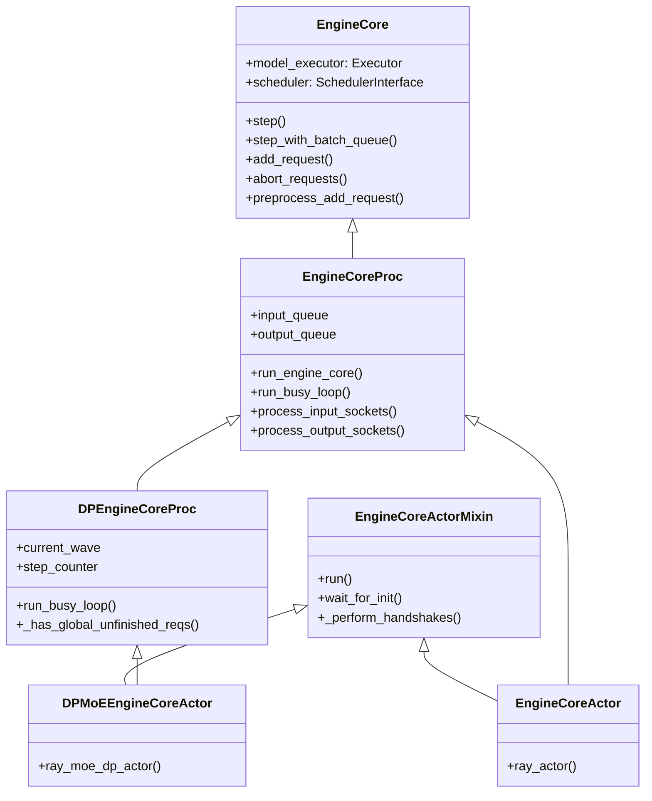

各类用途：

| 类 | 常见程度 | 用途 |
| --- | --- | --- |
| `EngineCore` | 核心基类 | 不直接负责 socket / 进程，只负责 scheduler、executor、KV cache、step 逻辑。`InprocClient` 也可以直接在进程内持有它。 |
| `EngineCoreProc` | **最常见在线路径** | 给 `EngineCore` 加上 ZMQ socket、输入/输出线程、后台进程主循环。普通 `AsyncLLM` 在线服务通常用它。 |
| `DPEngineCoreProc` | DP + MoE | 在 `EngineCoreProc` 基础上加入 DP wave、全局 unfinished request 同步、dummy batch、DP coordinator stats 等逻辑。 |
| `EngineCoreActorMixin` | Ray 后端 | 给 Ray actor 版本提供地址注入、可见设备设置、`run()` 等 actor 生命周期逻辑。 |
| `EngineCoreActor` | Ray 非 MoE / 非 DP 特化 | Ray actor 版 `EngineCoreProc`，内部会把 DP size 视为 1。 |
| `DPMoEEngineCoreActor` | Ray + MoE DP | Ray actor 版 `DPEngineCoreProc`。 |

普通在线路径里最常见的是 `EngineCoreProc`；其他子类主要服务 DP、MoE、Ray actor、弹性扩缩容等部署形态。

## EngineCore 如何管理 Scheduler

`EngineCore.__init__()` 会创建 scheduler：

- 先通过 `executor_class(vllm_config)` 创建 `EngineCore.model_executor`。
- 调用 `EngineCore._initialize_kv_caches()`，它会让 executor / worker 报告 KV cache specs，profile 可用显存，并初始化 KV cache。
- 从 `vllm_config.scheduler_config.get_scheduler_cls()` 拿到 scheduler 类。
- 创建 `Scheduler(...)`，传入 `vllm_config`、`kv_cache_config`、`StructuredOutputManager`、block size、hash block size 等。
- 如果 scheduler 有 KV connector，则调用 `Executor.init_kv_output_aggregator()`，让 worker 输出能和 KV connector 协作。

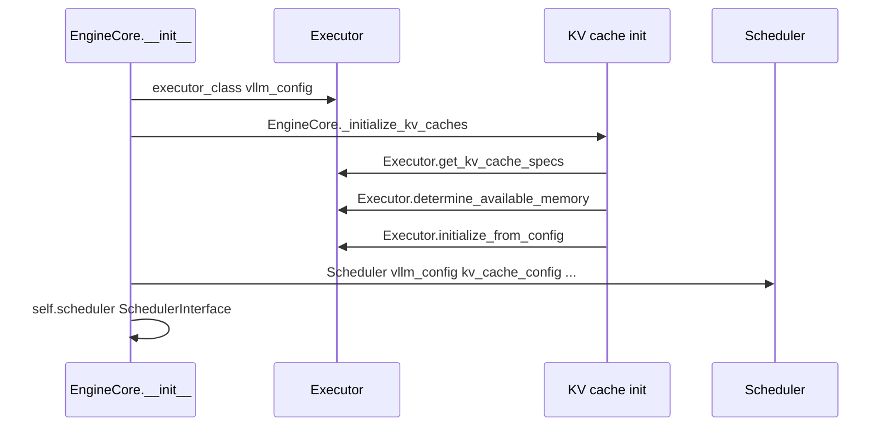

Scheduler 在 EngineCore 里的主要接口：

- `Scheduler.add_request(request)`：把新请求纳入调度队列。
- `Scheduler.schedule(throttle_prefills)`：生成一轮 `SchedulerOutput`。
- `Scheduler.get_grammar_bitmask(scheduler_output)`：structured output 约束。
- `Scheduler.update_from_output(scheduler_output, model_output)`：根据模型输出更新请求状态、KV cache 状态，生成 `EngineCoreOutputs`。
- `Scheduler.finish_requests(request_ids, status)`：abort / shutdown 时结束请求。
- `Scheduler.has_requests()` / `Scheduler.has_unfinished_requests()`：主循环判断是否还有工作。


### 源码对照：`EngineCore.__init__()` 如何创建 Executor 和 Scheduler

这段源码对应“EngineCore 管 scheduler，但 worker 通过 executor 间接管理”。初始化顺序很关键：先创建 executor，再初始化 KV cache，最后创建 scheduler。

```python
# vllm/v1/engine/core.py
class EngineCore:
    """vLLM engine 的后端核心循环。"""

    def __init__(
        self,
        vllm_config: VllmConfig,
        executor_class: type[Executor],
        log_stats: bool,
        executor_fail_callback: Callable | None = None,
        include_finished_set: bool = False,
    ):
        # 说明：保存完整运行配置，后续 scheduler/executor/KV cache 都会读取。
        self.vllm_config = vllm_config
        # 说明：记录是否启用 engine/scheduler 统计日志。
        self.log_stats = log_stats

        # 说明：Executor 是 worker/model runner 的管理入口，EngineCore 不直接管理 worker。
        self.model_executor = executor_class(vllm_config)
        if executor_fail_callback is not None:
            # 说明：executor 失败时回调会把 EXECUTOR_FAILED 放入 input_queue。
            self.model_executor.register_failure_callback(executor_fail_callback)

        # 说明：profile 可用显存并初始化 KV cache，返回 scheduler 需要的 KV cache 配置。
        kv_cache_config = self._initialize_kv_caches(vllm_config)
        # 说明：structured output manager 管 grammar 编译和请求级 grammar 状态。
        self.structured_output_manager = StructuredOutputManager(vllm_config)

        # 说明：scheduler 类来自配置，便于替换不同调度实现。
        Scheduler = vllm_config.scheduler_config.get_scheduler_cls()
        # 说明：scheduler 和 KV cache manager 需要统一 block size / hash block size。
        scheduler_block_size, hash_block_size = resolve_kv_cache_block_sizes(
            kv_cache_config, vllm_config
        )

        # 说明：scheduler 是请求队列、KV cache 分配、每轮 SchedulerOutput 的核心管理者。
        self.scheduler: SchedulerInterface = Scheduler(
            vllm_config=vllm_config,
            kv_cache_config=kv_cache_config,
            structured_output_manager=self.structured_output_manager,
            include_finished_set=include_finished_set,
            log_stats=self.log_stats,
            block_size=scheduler_block_size,
            hash_block_size=hash_block_size,
        )
        # 说明：speculative / diffusion 场景需要额外处理 draft token。
        self.use_spec_decode = vllm_config.speculative_config is not None
        self.check_for_draft_tokens = (
            self.use_spec_decode or vllm_config.model_config.is_diffusion
        )
        # 说明：如果 scheduler 配了 KV connector，executor 需要聚合 worker 的 KV 输出。
        if self.scheduler.connector is not None:  # type: ignore
            self.model_executor.init_kv_output_aggregator(self.scheduler.connector)  # type: ignore
```

## EngineCore 如何管理 Worker

严格说，`EngineCore` **不直接管理 worker 进程**，它管理的是 `Executor`。worker 由具体 `Executor` 管理。

`Executor.get_class(vllm_config)` 根据 `parallel_config.distributed_executor_backend` 选择实现：

- `"uni"`：`UniProcExecutor`，单进程内 driver worker。
- `"mp"`：`MultiprocExecutor`，本地多进程 worker，常见 GPU 多卡路径。
- `"ray"`：`RayDistributedExecutor` 或 `RayExecutorV2`。
- `"external_launcher"`：外部 launcher 路径。
- 自定义字符串或类：解析成自定义 `Executor` 子类。

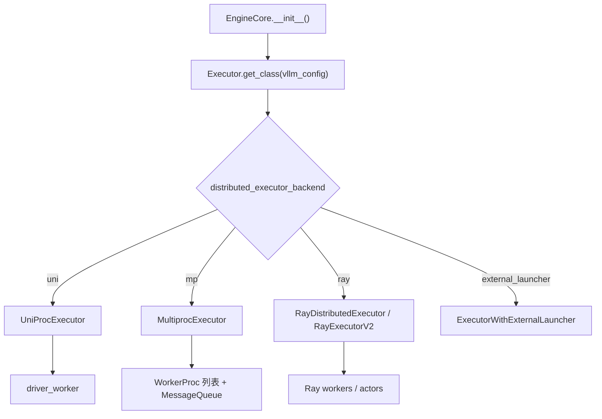

以 `MultiprocExecutor` 为例：

- `_init_executor()` 根据 TP / PP / PCP 配置计算 `world_size` 和 `local_world_size`。
- 创建 `MessageQueue`，用于广播 `SchedulerOutput` 并收集 `ModelRunnerOutput`。
- 为每个 local rank 创建 `WorkerProc`。
- 等待 worker ready。
- 启动 `MultiprocWorkerMonitor` 线程监控 worker 存活。
- `MultiprocExecutor.execute_model()` 本质上调用 `MultiprocExecutor.collective_rpc("execute_model", ...)`，把 `SchedulerOutput` 发给 worker。
- `MultiprocExecutor.sample_tokens()` 同理调用 worker 的 `sample_tokens`。

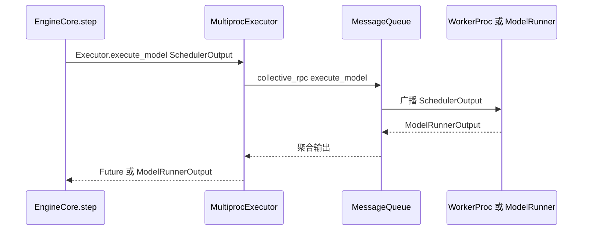

在 `UniProcExecutor` 下，没有额外 worker 进程，`collective_rpc()` 直接在 `driver_worker` 上调用方法；在 `MultiprocExecutor` 下，worker 是独立进程；在 Ray 后端，worker 由 Ray 管理。

### 源码对照：`Executor.get_class()` 和 `MultiprocExecutor.execute_model()`

这段源码说明 `EngineCore` 为什么“不直接管理 worker”：它只拿到一个 `Executor` 类，后续 worker 创建、RPC、监控都交给具体 executor 子类。

```python
# vllm/v1/executor/abstract.py
@staticmethod
def get_class(vllm_config: VllmConfig) -> type["Executor"]:
    # 说明：执行后端由 parallel_config.distributed_executor_backend 决定。
    parallel_config = vllm_config.parallel_config
    distributed_executor_backend = parallel_config.distributed_executor_backend

    if isinstance(distributed_executor_backend, type):
        # 说明：允许用户直接传 Executor 子类。
        if not issubclass(distributed_executor_backend, Executor):
            raise TypeError("distributed_executor_backend must be a subclass of Executor")
        executor_class = distributed_executor_backend
    elif distributed_executor_backend == "ray":
        # 说明：Ray 后端由 Ray actor / worker 管理模型执行。
        from vllm.v1.executor.ray_executor import RayDistributedExecutor
        executor_class = RayDistributedExecutor
    elif distributed_executor_backend == "mp":
        # 说明：本地多进程 GPU worker 路径，常见于多卡在线服务。
        from vllm.v1.executor.multiproc_executor import MultiprocExecutor
        executor_class = MultiprocExecutor
    elif distributed_executor_backend == "uni":
        # 说明：单进程 driver worker 路径，适合单卡或简单调试。
        from vllm.v1.executor.uniproc_executor import UniProcExecutor
        executor_class = UniProcExecutor
    elif distributed_executor_backend == "external_launcher":
        # 说明：外部 launcher 负责 worker 生命周期，vLLM 只通过 executor 接口协作。
        executor_class = ExecutorWithExternalLauncher
    else:
        raise ValueError(f"Unknown distributed executor backend: {distributed_executor_backend}")
    return executor_class
```

```python
# vllm/v1/executor/multiproc_executor.py
class MultiprocExecutor(Executor):
    supports_pp: bool = True

    def _init_executor(self) -> None:
        # 说明：注册 finalizer，确保 executor 销毁时 worker 进程被清理。
        self._finalizer = weakref.finalize(self, self.shutdown)
        # 说明：失败状态用于阻止后续 collective_rpc 继续发送请求。
        self.is_failed = False
        self.failure_callback: FailureCallback | None = None

        # 说明：TP / PP / PCP 共同决定 worker world_size。
        tp_size, pp_size, pcp_size = self._get_parallel_sizes()
        assert self.world_size == tp_size * pp_size * pcp_size

        # 说明：worker 之间通过本地 loopback 地址初始化分布式通信。
        distributed_init_method = get_distributed_init_method(
            get_loopback_ip(), get_open_port()
        )
        # 说明：后续代码会创建 MessageQueue、WorkerProc，并等待 worker ready。
```

```python
# vllm/v1/executor/multiproc_executor.py
def execute_model(
    self, scheduler_output: SchedulerOutput, non_block: bool = False
) -> ModelRunnerOutput | None | Future[ModelRunnerOutput | None]:
    # 说明：EngineCore.step() 调用 execute_model，本质是广播 execute_model RPC 给 worker。
    return self.collective_rpc(
        "execute_model",
        args=(scheduler_output,),
        # 说明：只需要 output_rank 返回 ModelRunnerOutput，避免所有 rank 都回大对象。
        unique_reply_rank=self.output_rank,
        # 说明：non_block=True 时返回 Future，让 EngineCore 可以和其他工作重叠。
        non_block=non_block,
        timeout=envs.VLLM_EXECUTE_MODEL_TIMEOUT_SECONDS,
        # 说明：KV connector 场景下需要聚合 worker 输出里的 KV transfer 信息。
        kv_output_aggregator=self.kv_output_aggregator,
    )


def sample_tokens(
    self, grammar_output: GrammarOutput | None, non_block: bool = False
) -> ModelRunnerOutput | Future[ModelRunnerOutput]:
    # 说明：采样也通过 collective_rpc 发送到 worker，只是方法名换成 sample_tokens。
    return self.collective_rpc(
        "sample_tokens",
        args=(grammar_output,),
        unique_reply_rank=self.output_rank,
        non_block=non_block,
        timeout=envs.VLLM_EXECUTE_MODEL_TIMEOUT_SECONDS,
        kv_output_aggregator=self.kv_output_aggregator,
    )
```


## 输入输出数据结构

EngineCore 这一层最常见的数据结构如下：

| 数据结构 | 方向 | 说明 |
| --- | --- | --- |
| `EngineCoreRequest` | 前端 -> EngineCore 输入线程 | 前端构造的请求，包含 `request_id`、`prompt_token_ids`、`sampling_params`、`client_index` 等。 |
| `Request` | EngineCore 内部 | `EngineCore.preprocess_add_request()` 把 `EngineCoreRequest` 转成 scheduler 内部请求。 |
| `SchedulerOutput` | Scheduler -> Executor | 本轮要执行哪些请求、哪些 token、KV cache / grammar 等执行计划。 |
| `ModelRunnerOutput` | Executor / Worker -> EngineCore | 模型 forward / sampling 后的 worker 输出。 |
| `EngineCoreOutput` | Scheduler -> 前端 | 单个请求的新 token、finish reason、logprobs、prefill stats 等。 |
| `EngineCoreOutputs` | EngineCore -> 前端 | 一批 `EngineCoreOutput`，外加 scheduler stats、utility output、DP wave 信息等。 |
| `UtilityOutput` | EngineCore -> 前端 | `profile`、`sleep`、`reset_prefix_cache`、`collective_rpc` 等 utility 调用的返回值。 |

## 普通请求的一轮数据流

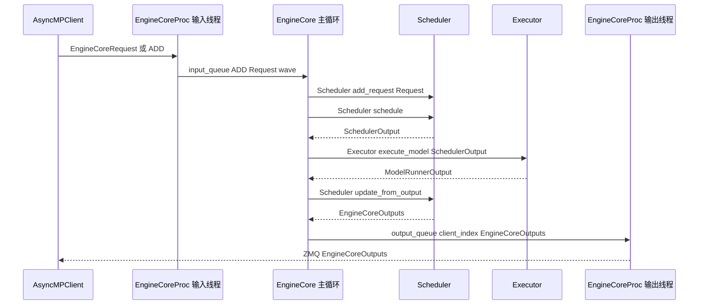

这个图可以当作 EngineCore 的最小心智模型：**输入线程入队，请求主循环调度执行，输出线程出队发送**。

## 几个容易混淆的点

- **`EngineCoreProc` 是 `EngineCore` 的进程化包装，不是另一个调度器**。真正的 schedule / execute / update 逻辑仍来自 `EngineCore.step()`。
- **`CoreEngineProcManager` 管进程，不管请求**。请求进入后由 `EngineCoreProc.input_queue`、`EngineCore.run_busy_loop()`、`Scheduler` 管。
- **输入线程会预处理 ADD 请求**。`EngineCore.preprocess_add_request()` 不在主循环里做，而是在输入 socket 线程里做，这能和模型执行重叠。
- **`aborts_queue` 是旁路加速 abort 的队列**。ABORT 同时进入 `input_queue` 和 `aborts_queue`，这样 `EngineCore.step()` 在模型执行结束后、`Scheduler.update_from_output()` 前能先处理执行期间到达的 abort。
- **`output_queue` 不等于前端 async queue**。这里的 `output_queue` 是 EngineCore 后台进程内的 Python queue；前端 `AsyncMPClient` 收到 ZMQ 输出后，还会放进前端进程的 `asyncio.Queue`，再由 `AsyncLLM.output_handler` 消费。
- **`EngineCore` 不直接管理具体 worker 生命周期**。它创建 `Executor`，worker 的创建、RPC、监控由 `Executor` 子类处理。

## 关键接口速查

| 类 / 函数 | 文件 | 作用 |
| --- | --- | --- |
| `EngineCoreClient.make_async_mp_client()` | `vllm/v1/engine/core_client.py` | 在线 async 路径创建 `AsyncMPClient` / DP client。 |
| `MPClient.__init__()` | `vllm/v1/engine/core_client.py` | 创建前端 ZMQ socket，调用 `launch_core_engines()`，等待 EngineCore ready。 |
| `launch_core_engines()` | `vllm/v1/engine/utils.py` | 根据 DP / Ray 配置启动 EngineCore 进程或 actor，并处理握手。 |
| `CoreEngineProcManager` | `vllm/v1/engine/utils.py` | 创建、监控、关闭本地 EngineCore 后台进程。 |
| `EngineCoreProc.run_engine_core()` | `vllm/v1/engine/core.py` | EngineCore 后台进程入口，创建 `EngineCoreProc` / `DPEngineCoreProc` 并进入 busy loop。 |
| `EngineCoreProc.__init__()` | `vllm/v1/engine/core.py` | 创建 `input_queue` / `output_queue`，执行握手，初始化 `EngineCore`，启动输入/输出线程。 |
| `EngineCoreProc.process_input_sockets()` | `vllm/v1/engine/core.py` | 输入线程，从 ZMQ 收消息，decode / preprocess，写入 `input_queue`。 |
| `EngineCoreProc.process_output_sockets()` | `vllm/v1/engine/core.py` | 输出线程，从 `output_queue` 取 `EngineCoreOutputs`，编码并发回前端。 |
| `EngineCore.run_busy_loop()` | `vllm/v1/engine/core.py` | 主循环，反复处理输入队列并推进 engine step。 |
| `EngineCore.step()` | `vllm/v1/engine/core.py` | 单轮 schedule、execute model、sample token、update scheduler。 |
| `EngineCore.step_with_batch_queue()` | `vllm/v1/engine/core.py` | batch queue / pipeline parallelism 场景下的异步批处理 step。 |
| `Scheduler.schedule()` | `vllm/v1/core/sched/scheduler.py` | 生成本轮 `SchedulerOutput`。 |
| `Scheduler.update_from_output()` | `vllm/v1/core/sched/scheduler.py` | 消化 `ModelRunnerOutput`，生成 `EngineCoreOutputs`。 |
| `Executor.execute_model()` | `vllm/v1/executor/abstract.py` | 驱动 worker / model runner 执行模型。 |
| `MultiprocExecutor` | `vllm/v1/executor/multiproc_executor.py` | 多进程 worker 管理与 collective RPC。 |

## 一句话心智模型

`CoreEngineProcManager` 把 `EngineCoreProc` 启成后台进程；`EngineCoreProc` 用输入线程把 ZMQ 请求搬进 `input_queue`，主线程在 `run_busy_loop()` 中把请求交给 `Scheduler` 并通过 `Executor` 推动 worker，得到 `EngineCoreOutputs` 后放进 `output_queue`，再由输出线程编码并发回前端。
