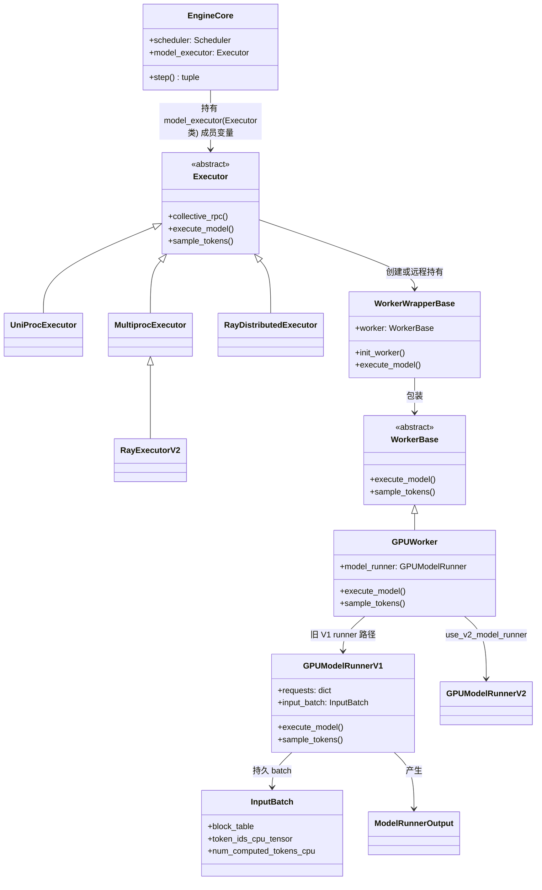
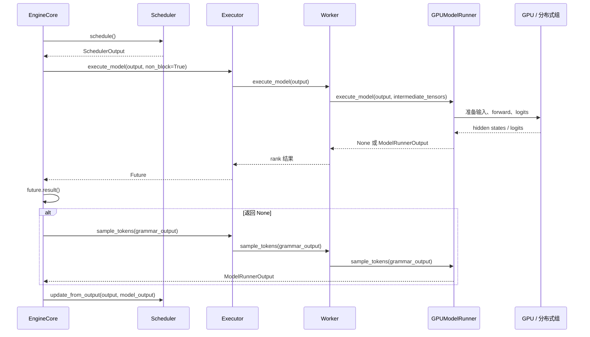
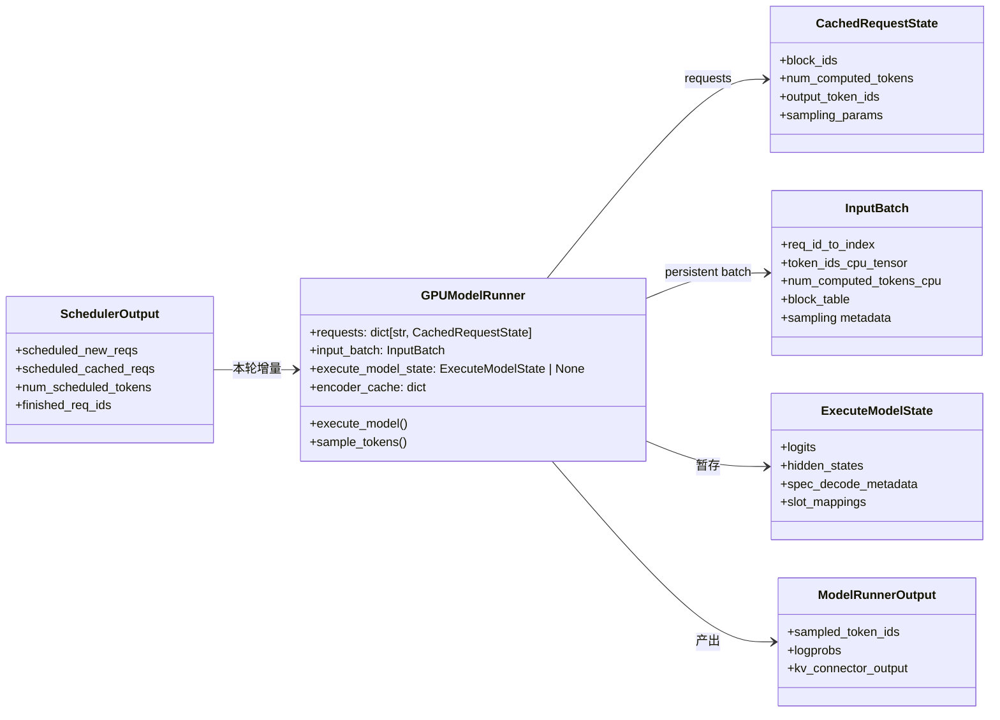
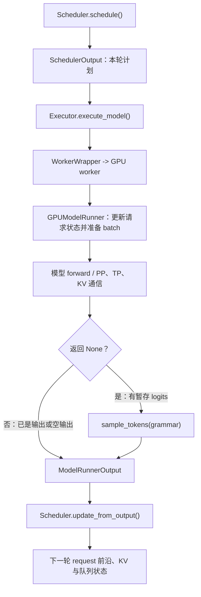

# vLLM V1 Executor：从 SchedulerOutput 到 GPU Forward

> 源码基线：`/home/huangxy/Projects/vllm/vllm/v1`。本文接在《vLLM V1 Scheduler 调度策略笔记》之后：前文的 `SchedulerOutput` 回答“**本轮要算谁、每个请求推进多少 token**”，本文回答它“**由谁送到哪张卡、怎样变成模型输入、何时产生采样结果**”。

## 先建立全景：Executor 不等于模型执行器

一句话区分各层职责：

- `EngineCore` 拥有 `Scheduler` 与 `Executor`，负责把**调度、执行、回写调度状态**串成一次 step。
- `Executor` 是**编排边界（orchestration boundary）**：它决定调用本地 worker、子进程 worker 还是 Ray actor，并在多卡时把 RPC 广播给各 rank。
- `WorkerWrapperBase` 是每个 worker 的**RPC 门面**：负责构造实际 `Worker`、转发方法，并在执行前处理多模态接收端缓存。
- `vllm.v1.worker.gpu_worker.Worker`（以下称 GPU worker，注意源码类名就是 `Worker`）掌管设备、分布式组与 Pipeline Parallelism（PP）收发。
- `GPUModelRunner` 才是**单个 rank 上的执行核心**：维护 persistent batch，把 `SchedulerOutput` 变成 `input_ids`、`positions`、block table、attention metadata，调用模型 forward、计算 logits，并最终采样。

`Executor` 只负责“把命令正确送到 worker”。它本身不拼 `input_ids`，也不直接调用 Transformer。



图中的 `GPUModelRunnerV1` 与 `GPUModelRunnerV2` 是两条**互斥**路径，而非同一请求会经过两者。源码的选择是：

```python
# vllm/v1/worker/gpu_worker.py：在 GPU worker 完成设备初始化后创建 runner。
if self.use_v2_model_runner:
    # 新路径：导入包目录下的 V2 GPUModelRunner。
    from vllm.v1.worker.gpu.model_runner import GPUModelRunner as GPUModelRunnerV2

    # 当前 worker 后续所有 execute_model / sample_tokens 都委托给 V2。
    self.model_runner: GPUModelRunner = GPUModelRunnerV2(
        self.vllm_config,  # 整个配置树：模型、并行、缓存、调度等。
        self.device,  # 当前 rank 绑定的 accelerator。
    )
else:
    # 旧 V1 路径：本文后面深入解读的实现，文件名没有 gpu/ 子目录。
    from vllm.v1.worker.gpu_model_runner import GPUModelRunner as GPUModelRunnerV1

    # 当前 worker 后续所有执行都委托给 V1 runner。
    self.model_runner = GPUModelRunnerV1(
        self.vllm_config,  # 与 V2 相同的配置入口。
        self.device,  # 与 V2 相同的设备入口。
    )
```

后文以 `vllm/v1/worker/gpu_model_runner.py` 的 V1 runner 讲解内部数据流；V2 的职责边界相同，但实现已拆入 `worker/gpu/`，不能把两份同名类的字段或私有方法混在一起阅读。

## `EngineCore.step()`：一次执行从哪里开始

用户关心的调用点位于 `EngineCore.step()`。这是同步调度模式的主链；异步调度另有 `step_with_batch_queue()`，其目标是让下一批与上一批的输出处理重叠，但不会改变下列对象边界。

```python
def step(self) -> tuple[dict[int, EngineCoreOutputs], bool]:
    # 先检查 Scheduler 是否仍有 running、waiting 或尚未从 batch 移除的请求。
    if not self.scheduler.has_requests():
        # 无工作时既没有输出，也没有模型执行。
        return {}, False

    # Scheduler 输出本轮执行计划：每个请求推进多少 token、block table 变化、
    # 新/恢复请求数据、encoder 与 KV connector 元数据等。
    scheduler_output = self.scheduler.schedule()

    # 把执行计划交给 Executor；non_block=True 的统一接口返回 Future。
    # 注意：这不必然代表 Python 调用一定在后台线程中执行，后文专节说明。
    future = self.model_executor.execute_model(
        scheduler_output,  # 本轮唯一的调度输入协议。
        non_block=True,  # 请求非阻塞形式的返回值。
    )

    # 结构化输出的 grammar bitmask 由 Scheduler 依照本轮请求计算。
    # 它被延后到 sample_tokens() 使用，因为 mask 作用于 logits。
    grammar_output = self.scheduler.get_grammar_bitmask(scheduler_output)

    with (
        # 发生异常时补充本轮调度细节，便于诊断执行错误。
        self.log_error_detail(scheduler_output),
        # 记录本轮请求数、token 数与耗时统计。
        self.log_iteration_details(scheduler_output),
    ):
        # 等到 Executor/worker 的 execute_model 阶段完成。
        model_output = future.result()

        # None 是一项明确协议：forward 已经留下待采样的 runner 状态，
        # EngineCore 必须紧接着调用 sample_tokens 才能取回最终输出。
        if model_output is None:
            model_output = self.model_executor.sample_tokens(
                grammar_output,  # 在采样前将 grammar mask 施加到 logits。
            )

    # forward 期间可能新到 abort；先处理它，避免将已取消请求继续回写。
    self._process_aborts_queue()

    # 把 token、logprob、KV/encoder connector 事件等写回 Scheduler，
    # 使下一个 schedule() 看到更新后的 request 前沿。
    engine_core_outputs = self.scheduler.update_from_output(
        scheduler_output,  # “本轮原计划”。
        model_output,  # “本轮实际执行/采样结果”。
    )

    # 第二个返回值表示本轮是否实际调度过至少一个 token。
    return engine_core_outputs, scheduler_output.total_num_scheduled_tokens > 0
```



这里的控制面与数据面需要分开看：

- **控制面**：`SchedulerOutput`、RPC 方法名、`ModelRunnerOutput` 等 Python 对象。`Executor.collective_rpc()` 主要负责这部分。
- **数据面**：同一模型计算中的 GPU tensor、TP collective、PP 中间激活张量、KV transfer。它们由 PyTorch/NCCL、PP group 或 connector 直接处理，不应理解成“Executor 把每个 tensor 序列化再发给所有 worker”。

## `Executor`：统一调用面与后端选择

### 抽象类怎样选择具体执行后端

`Executor.get_class()` 把 `parallel_config.distributed_executor_backend` 映射为实现类。下面是与选择有关的完整分支，注释补充了每个判断的意义。

```python
@staticmethod
def get_class(vllm_config: VllmConfig) -> type["Executor"]:
    # 从总配置中取得并行配置；后端选择由它保存。
    parallel_config = vllm_config.parallel_config

    # 值可以是用户给出的 Executor 子类、内置后端名字或可导入的限定名。
    distributed_executor_backend = parallel_config.distributed_executor_backend

    # 用户直接传入类时，不需要字符串到对象的解析。
    if isinstance(distributed_executor_backend, type):
        # 防止把任意 Python 类误当作 Executor。
        if not issubclass(distributed_executor_backend, Executor):
            raise TypeError(
                "distributed_executor_backend must be a subclass of Executor"
            )
        executor_class = distributed_executor_backend

    # Ray 有两种 V1 实现，环境变量决定使用传统 Ray DAG 还是 V2。
    elif distributed_executor_backend == "ray":
        if envs.VLLM_USE_RAY_V2_EXECUTOR_BACKEND:
            from vllm.v1.executor.ray_executor_v2 import RayExecutorV2

            executor_class = RayExecutorV2
        else:
            from vllm.v1.executor.ray_executor import RayDistributedExecutor

            executor_class = RayDistributedExecutor

    # mp：引擎进程通过消息队列控制多个本地子进程 worker。
    elif distributed_executor_backend == "mp":
        from vllm.v1.executor.multiproc_executor import MultiprocExecutor

        executor_class = MultiprocExecutor

    # uni：当前进程直接持有一个 worker wrapper，便于单卡/单进程。
    elif distributed_executor_backend == "uni":
        from vllm.v1.executor.uniproc_executor import UniProcExecutor

        executor_class = UniProcExecutor

    # external_launcher：torchrun 等外部启动器下的特殊单 worker 封装。
    elif distributed_executor_backend == "external_launcher":
        executor_class = ExecutorWithExternalLauncher

    # 允许配置写自定义类的 Python 限定名。
    elif isinstance(distributed_executor_backend, str):
        executor_class = resolve_obj_by_qualname(distributed_executor_backend)
        if not issubclass(executor_class, Executor):
            raise TypeError(
                "distributed_executor_backend must be a subclass of Executor"
            )

    # 到这里仍未知，说明配置值非法。
    else:
        raise ValueError(
            f"Unknown distributed executor backend: {distributed_executor_backend}"
        )

    # 返回类而不是实例；EngineCore 构造阶段才实例化它。
    return executor_class
```

`Executor.__init__()` 保存的配置不是“调度状态”的副本，而是供 worker 生命周期、初始化、KV 缓存配置与 RPC 使用的公共配置入口。下面按当前源码的赋值顺序摘录；每个 `: Type` 是本文补加的类型标注（原源码只显式标注了最后两个成员）。

```python
@instrument(span_name="Executor init")  # 将 executor 构造过程纳入 tracing span。
def __init__(
    self,
    vllm_config: VllmConfig,  # 由 EngineCore 传入的全局配置根对象。
) -> None:
    # 保留完整配置；初始化、睡眠/唤醒等 executor 级操作会从这里继续取子配置。
    self.vllm_config: VllmConfig = vllm_config

    # 模型结构、dtype、最大上下文长度和 runner 类型等模型级只读配置视图。
    self.model_config: ModelConfig = vllm_config.model_config

    # KV cache 的 dtype、容量、块策略及 offload 相关配置视图。
    self.cache_config: CacheConfig = vllm_config.cache_config

    # 可选 LoRA 配置；未启用 LoRA 时为 None。
    self.lora_config: LoRAConfig | None = vllm_config.lora_config

    # 权重加载格式、下载与加载行为的配置视图。
    self.load_config: LoadConfig = vllm_config.load_config

    # TP/PP/DP 拓扑、worker 类和 distributed executor backend 的配置视图。
    self.parallel_config: ParallelConfig = vllm_config.parallel_config

    # 每轮 token/请求上限等需要和 worker persistent buffer 对齐的配置视图。
    self.scheduler_config: SchedulerConfig = vllm_config.scheduler_config

    # 设备类型、设备 ID 等 worker 设备初始化所需配置视图。
    self.device_config: DeviceConfig = vllm_config.device_config

    # 可选投机解码配置；未启用 draft/proposer 时为 None。
    self.speculative_config: SpeculativeConfig | None = (
        vllm_config.speculative_config
    )

    # tracing、metrics、日志等观测能力的配置视图。
    self.observability_config: ObservabilityConfig = (
        vllm_config.observability_config
    )

    # 交由 UniProc/Multiproc/Ray 等子类建立实际 worker、进程或 actor。
    self._init_executor()

    # executor 当前是否处于 sleep 状态；注意它在 worker 初始化完成后才建立。
    self.is_sleeping: bool = False

    # 记录触发 sleep 的逻辑标签，多个机制可共享同一个 executor。
    self.sleeping_tags: set[str] = set()

    # 多 rank KV connector 输出的聚合器；初始化阶段尚未创建时为 None。
    self.kv_output_aggregator: KVOutputAggregator | None = None
```

这里的 `model_config` 等字段都只是对子配置对象的**引用**，没有复制一份独立状态。例如 worker 预分配需要读 `scheduler_config.max_num_batched_tokens`，executor 直接从同一配置树取得这个对象；真正随请求变化的 `SchedulerOutput`、runner 的 `InputBatch` 和 `CachedRequestState` 不保存在这里。

### `collective_rpc()`：所有 worker 调用的共同协议

```python
@overload
def collective_rpc(
    self,
    method: str | Callable[[WorkerBase], _R],  # worker 方法名，或以 worker 为首参的可序列化函数。
    timeout: float | None = None,  # 最长等待秒数；None 表示无限等待。
    args: tuple = (),  # 传给 worker 方法的位置参数。
    kwargs: dict | None = None,  # 传给 worker 方法的关键字参数。
    non_block: Literal[False] = False,  # False 时在当前调用中等待所有结果。
) -> list[_R]:  # 按 worker/rank 收集的结果列表。
    ...

@overload
def collective_rpc(
    self,
    method: str | Callable[[WorkerBase], _R],  # 与同步重载相同的目标。
    timeout: float | None = None,  # 同步等待时限也会传给 Future 完成路径。
    args: tuple = (),  # 同步重载同义。
    kwargs: dict | None = None,  # 同步重载同义。
    non_block: Literal[True] = True,  # True 时立即交回 Future。
) -> Future[list[_R]]:  # Future 兑现后才得到各 worker 的结果。
    ...
```

这个接口的 docstring 特别强调：它推荐传递**控制消息**，数据面另行建立通信。原因是 TP/PP 的 tensor 尺寸大、频率高，而且同一个 rank 组内已有高效的 NCCL 通道。

### `execute_model()` 与 `sample_tokens()`：薄封装，但有关键返回契约

```python
@overload
def execute_model(
    self,
    scheduler_output: SchedulerOutput,  # Scheduler 给出的本轮执行计划。
    non_block: Literal[False] = False,  # 是否立即等待 worker 完成。
) -> ModelRunnerOutput | None:  # 普通输出，或“需要随后采样”的 None。
    ...

@overload
def execute_model(
    self,
    scheduler_output: SchedulerOutput,  # 与同步形式相同的执行计划。
    non_block: Literal[True] = True,  # 要求 Future 形式。
) -> Future[ModelRunnerOutput | None]:  # Future 的值仍可能是 None。
    ...

def execute_model(
    self,
    scheduler_output: SchedulerOutput,  # 不改写调度计划，而是将其转交 worker。
    non_block: bool = False,  # 运行时布尔值统一两种重载。
) -> ModelRunnerOutput | None | Future[ModelRunnerOutput | None]:
    # 在所有 worker 上调用同名方法；Executor 子类可覆盖通信与聚合策略。
    output = self.collective_rpc(
        "execute_model",  # WorkerBase 定义的 RPC 方法名。
        args=(scheduler_output,),  # SchedulerOutput 是唯一的位置实参。
        non_block=non_block,  # 保留调用方请求的同步语义。
    )

    # 默认实现取第 0 个 worker 的结果；PP/connector 场景由子类覆写。
    return output[0]

def sample_tokens(
    self,
    grammar_output: GrammarOutput | None,  # 对本轮 logits 的可选 grammar mask。
    non_block: bool = False,  # 同样支持 Future 返回。
) -> ModelRunnerOutput | Future[ModelRunnerOutput]:
    # 与 execute_model 对称：把延后的采样命令广播给 worker。
    output = self.collective_rpc(
        "sample_tokens",  # WorkerBase 定义的第二阶段 RPC。
        args=(grammar_output,),  # 采样阶段不再重复传 SchedulerOutput。
        non_block=non_block,  # 维持调用模式。
    )
    # 默认取第一个结果；特殊后端按自己的 rank 规则覆写。
    return output[0]
```

`execute_model()` 返回 `None` 不是“没有执行”。它表示 runner 已完成 forward、logits 已暂存到 `ExecuteModelState`，而将 grammar mask、采样和某些投机解码后处理拆到紧随其后的 `sample_tokens()`。后文会看到这份暂存状态。

## 各 Executor 子类：初始化、执行与通信 override

`EngineCore` 总是传入 `non_block=True`，但不同 executor 的实现方式不同。它是**接口级 Future 契约**，不是“所有场景都起一个后台线程”的同义词。

| 后端 | `execute_model(..., non_block=True)` 的实际行为 | `future.result()` 等待什么 |
| --- | --- | --- |
| `UniProcExecutor` | 直接在当前进程调用 `WorkerWrapperBase`。若结果是 `AsyncModelRunnerOutput`，返回一个惰性 `AsyncOutputFuture`；否则创建一个已完成的 `Future`。 | 异步 D2H 输出的完成；普通路径往往已经执行完。 |
| `MultiprocExecutor` | 将 RPC 放入 `rpc_broadcast_mq`，返回按 FIFO 接收回应的 `FutureWrapper`。 | 子进程 worker 的响应；可能还包含 KV 输出聚合。 |
| 传统 `RayDistributedExecutor` | 普通 generation 会先暂存 `SchedulerOutput`，在 `sample_tokens()` 时触发 Ray compiled DAG；其他情况可直接执行 DAG。 | Ray ObjectRef / DAG 执行的结果。 |
| `RayExecutorV2` | 继承多进程的消息队列式协议，但 worker 由 Ray actor 承载。 | 相应 actor/worker 的消息队列返回。 |

下面按子类展开源码。这里有一个阅读规则：**只有类中真实出现的 override 才摘录为该类的方法；其余方法明确标为继承**。这比为每个子类重复粘贴基类实现更能显示设计边界。

### `UniProcExecutor`：同进程 wrapper + 直接方法调用

`UniProcExecutor` 的 `_init_executor()` 不创建子进程。它构造一个 `WorkerWrapperBase`，在当前进程依次完成 wrapper 初始化、设备初始化和模型加载：

```python
def _init_executor(self) -> None:
    # 单进程后端只需要 RPC rank 为 0 的一个 wrapper。
    self.driver_worker = WorkerWrapperBase(rpc_rank=0)

    # 生成当前进程自己的 torch.distributed 初始化地址、全局 rank 与本地设备 rank。
    distributed_init_method, rank, local_rank = self._distributed_args()

    # 这些参数会被 WorkerWrapperBase.init_worker() 转交给实际 Worker。
    kwargs = dict(
        vllm_config=self.vllm_config,  # 全局配置树。
        local_rank=local_rank,  # 本进程使用的设备编号。
        rank=rank,  # 单进程通常为全局 rank 0。
        distributed_init_method=distributed_init_method,  # 本地 PG 初始化地址。
        is_driver_worker=True,  # 该 worker 也承担 driver 职责。
        shared_worker_lock=Lock(),  # 多模态共享缓存需要的跨 worker 锁。
    )

    # 若配置了 NIC PCIe 映射，先设置当前 worker 所需网络设备环境变量。
    set_worker_net_device(local_rank, self.vllm_config)

    # 解析 worker_cls、加载插件，并创建真实 GPU Worker。
    self.driver_worker.init_worker(all_kwargs=[kwargs])

    # 建立 device、torch distributed group 和 GPUModelRunner。
    self.driver_worker.init_device()

    # 弹性 EP 扩容模式通过专用入口加载；通常路径直接加载权重。
    if envs.VLLM_ELASTIC_EP_SCALE_UP_LAUNCH:
        self.driver_worker.elastic_ep_execute("load_model")
    else:
        self.driver_worker.load_model()

    # 某些平台会据后端修正 KV cache block size。
    current_platform.update_block_size_for_backend(self.vllm_config)
```

它的 `execute_model()` 与 `sample_tokens()` 都是直接调用同进程的一个 wrapper；`collective_rpc()` 完整实现紧随其后。

```python
def execute_model(
    self,
    scheduler_output: SchedulerOutput,  # 直接交给同进程的单个 wrapper。
    non_block: bool = False,  # 对齐 Executor 统一 Future 契约。
) -> ModelRunnerOutput | None | Future[ModelRunnerOutput | None]:
    # single_value=True 使 collective_rpc 返回单个结果而非 [result]。
    output = self.collective_rpc(
        "execute_model",
        args=(scheduler_output,),
        non_block=non_block,
        single_value=True,
    )

    # 若调用已同步失败，立刻在 EngineCore 所在线程抛出，避免延后到 future.result()。
    if non_block and output.done():
        output.result()
    return output

def sample_tokens(
    self,
    grammar_output: GrammarOutput | None,  # 已由 Scheduler 生成的 grammar mask。
    non_block: bool = False,  # 与 execute_model 保持相同的 Future 约定。
) -> ModelRunnerOutput | None | Future[ModelRunnerOutput | None]:
    # 和 execute_model 对称地直接调用单个 wrapper。
    return self.collective_rpc(
        "sample_tokens",
        args=(grammar_output,),
        non_block=non_block,
        single_value=True,
    )
```

`ExecutorWithExternalLauncher(UniProcExecutor)` 是一个值得单独点出的变体：它不另建 Python 子进程，而由外部 `torchrun` 启动的多个 Engine 实例组成并行组。它的实际 `_init_executor()` override 只有这段：

```python
def _init_executor(self) -> None:
    # external launcher 已在进程外完成 rank/world 的启动，不能再启用 V1 multiprocessing。
    assert not envs.VLLM_ENABLE_V1_MULTIPROCESSING, (
        "To get deterministic execution, "
        "please set VLLM_ENABLE_V1_MULTIPROCESSING=0"
    )

    # 设备、模型与 wrapper 初始化完全复用 UniProcExecutor。
    super()._init_executor()
```

它以 `_distributed_args()` 改为读取 `env://` 的 `RANK`、`LOCAL_RANK`、`MASTER_ADDR`、`MASTER_PORT`；因此它**继承** `UniProcExecutor` 的 `execute_model()`、`sample_tokens()` 与 `collective_rpc()`。

`UniProcExecutor.collective_rpc()` 的完整实现如下：

```python
def collective_rpc(
    self,
    method: str | Callable,  # 目标 worker 方法或可调用对象。
    timeout: float | None = None,  # 此实现没有使用该超时参数。
    args: tuple = (),  # 目标方法的位置参数。
    kwargs: dict | None = None,  # 目标方法的关键字参数。
    non_block: bool = False,  # 请求 Future 形式的结果。
    single_value: bool = False,  # 单 worker 场景下是否不包成 list。
) -> Any:
    # 避免把 None 传给 run_method。
    if kwargs is None:
        kwargs = {}

    # 同步路径：就在本进程直接调用 wrapper。
    if not non_block:
        result = run_method(
            self.driver_worker,  # 单个 WorkerWrapperBase。
            method,  # 方法名或函数。
            args,  # 原样转发的位置参数。
            kwargs,  # 原样转发的关键字参数。
        )
        # 异步 runner 输出必须在这里完成 D2H，才符合同步接口。
        if isinstance(result, AsyncModelRunnerOutput):
            result = result.get_output()
        # 对齐 collective RPC：默认仍返回单元素列表。
        return result if single_value else [result]

    try:
        # 非阻塞路径也先直接发起调用；它没有把普通调用转去另一个线程。
        result = run_method(self.driver_worker, method, args, kwargs)
        if isinstance(result, AsyncModelRunnerOutput):
            # 真正尚在进行的 D2H 由 AsyncOutputFuture 延迟等待。
            return AsyncOutputFuture(result, single_value)

        # 对已经得到的普通值，构造一个立刻完成的 Future 以统一上层接口。
        future = Future[Any]()
        future.set_result(result if single_value else [result])
    except Exception as e:
        # 同样把异常放进 Future，保留 Future 的错误传播语义。
        future = Future[Any]()
        future.set_exception(e)

    # 返回已完成或稍后完成的 Future。
    return future
```

这解释了为什么 `EngineCore` 紧随其后算 `grammar_output` 仍有价值：多进程/Ray/异步 D2H 场景中这段 CPU 工作能与执行重叠；但不应据此假设 uni 普通同步 forward 已被后台化。

### 多进程与 Ray：命令传递的差异

#### `MultiprocExecutor`：本地子进程 + MessageQueue 控制面

`MultiprocExecutor._init_executor()` 完成 worker 子进程和双向消息队列的建立。下面按源码的启动顺序摘录；worker 真正的无限 RPC 消费循环位于 `WorkerProc.worker_main()`，不在 executor 构造函数中。

```python
def _init_executor(self) -> None:
    # 注册析构清理：正常忘记 shutdown 时也尝试终止所有子进程。
    self._finalizer = weakref.finalize(self, self.shutdown)
    self.is_failed = False  # worker 是否已经永久失败。
    self.failure_callback: FailureCallback | None = None  # 失败时通知 EngineCore 的回调。

    # 读取 TP、PP、prefill context parallel（PCP）尺寸，并验证乘积等于 world_size。
    tp_size, pp_size, pcp_size = self._get_parallel_sizes()
    assert self.world_size == tp_size * pp_size * pcp_size, (
        f"world_size ({self.world_size}) must be equal to the "
        f"tensor_parallel_size ({tp_size}) x pipeline"
        f"_parallel_size ({pp_size}) x prefill_context"
        f"_parallel_size ({pcp_size}). "
    )

    # 设置 multiprocessing worker 需要的进程环境变量。
    set_multiprocessing_worker_envs()

    # 本机多进程通过 loopback 地址建立 torch.distributed 初始化地址。
    distributed_init_method = get_distributed_init_method(
        get_loopback_ip(),
        get_open_port(),
    )

    # 只有每个 DP group 的 leader 持有广播发送端；follower node 只消费。
    self.rpc_broadcast_mq: MessageQueue | None = None
    scheduler_output_handle: Handle | None = None
    if self.parallel_config.node_rank_within_dp == 0:
        # MessageQueue 单个 chunk 的字节上限。
        max_chunk_bytes = envs.VLLM_MQ_MAX_CHUNK_BYTES_MB * 1024 * 1024
        mq_connect_ip = get_ip()

        # 创建到 world_size 个 rank 的广播控制面队列。
        self.rpc_broadcast_mq = MessageQueue(
            self.world_size,
            self.local_world_size,
            max_chunk_bytes=max_chunk_bytes,
            connect_ip=mq_connect_ip,
        )
        # 导出可跨子进程传递的共享内存/连接句柄。
        scheduler_output_handle = self.rpc_broadcast_mq.export_handle()

    # 用指定 multiprocessing context 创建 shared lock 与 worker 进程。
    context = get_mp_context()
    shared_worker_lock = context.Lock()
    unready_workers: list[UnreadyWorkerProcHandle] = []
    success = False
    try:
        # 当前 DP node 的第一个全局 rank；本节点 worker 排在其后。
        global_start_rank = (
            self.local_world_size * self.parallel_config.node_rank_within_dp
        )

        # fork 会继承 socket fd；后续 worker 必须关闭不属于自己的继承 fd。
        inherited_fds: list[int] | None = (
            [] if context.get_start_method() == "fork" else None
        )

        # CPU 后端需设置 OMP affinity；GPU 后端这个 manager 不改变核心语义。
        cpu_omp_manager = OMPProcessManager(self.vllm_config)
        for local_rank in range(self.local_world_size):
            # 为这个子进程计算 global rank 与它是否为 driver worker。
            global_rank = global_start_rank + local_rank
            is_driver_worker = self._is_driver_worker(global_rank)

            # 进程创建期间临时应用 rank 对应的 OMP 环境。
            with cpu_omp_manager.configure_omp_envs(
                rank=global_rank,
                local_rank=local_rank,
            ):
                # WorkerProc 内部会创建 WorkerWrapperBase，调用 init_device/load_model，
                # 并拿到 scheduler output 的广播队列句柄。
                unready_worker_handle = WorkerProc.make_worker_process(
                    vllm_config=self.vllm_config,
                    local_rank=local_rank,
                    rank=global_rank,
                    distributed_init_method=distributed_init_method,
                    input_shm_handle=scheduler_output_handle,
                    shared_worker_lock=shared_worker_lock,
                    is_driver_worker=is_driver_worker,
                    inherited_fds=inherited_fds,
                )
            unready_workers.append(unready_worker_handle)

            # 记录本进程的 death pipe / ready pipe，供下个 fork child 主动关闭。
            if inherited_fds is not None:
                inherited_fds.append(unready_worker_handle.death_writer.fileno())
                inherited_fds.append(unready_worker_handle.ready_pipe.fileno())

        # 所有 worker 必须先创建再等待 ready；init_device() 会 device sync，反过来等会死锁。
        self.workers = WorkerProc.wait_for_ready(unready_workers)

        # 后台线程观察任一 worker 意外退出。
        if self.monitor_workers:
            self.start_worker_monitor()

        # leader 收集所有 rank 的 response queue；远端节点的队列句柄由本地 worker 提供。
        self.response_mqs = []
        if self.parallel_config.node_rank_within_dp == 0:
            for rank in range(self.world_size):
                if rank < self.local_world_size:
                    local_mq = self.workers[rank].worker_response_mq
                    assert local_mq is not None
                    self.response_mqs.append(local_mq)
                else:
                    remote_mq = self.workers[0].peer_worker_response_mqs[rank]
                    assert remote_mq is not None
                    self.response_mqs.append(remote_mq)

        # 先等待发送队列和所有回应队列 ready，顺序必须与 WorkerProc 一致。
        if self.rpc_broadcast_mq is not None:
            self.rpc_broadcast_mq.wait_until_ready()
        for response_mq in self.response_mqs:
            response_mq.wait_until_ready()

        # 所有 future 放入一个 FIFO deque，强制 RPC 回应按广播顺序兑现。
        self.futures_queue = deque[FutureWrapper]()
        self._post_init_executor()  # 给子类的启动后扩展点。
        success = True
    finally:
        # 初始化中任何一步失败都关闭 death writer 并等待已创建子进程退出。
        if not success:
            for worker in unready_workers:
                if worker.death_writer is not None:
                    worker.death_writer.close()
                    worker.death_writer = None
            self._ensure_worker_termination(
                [worker.proc for worker in unready_workers]
            )

    # 选出最终产生 ModelRunnerOutput 的 rank；通常是最后 PP stage 的输出 rank。
    self.output_rank = self._get_output_rank()
```

`MultiprocExecutor` 的 `execute_model()` 覆写看似很短，关键在于它把“哪个 rank 的结果有意义”交给了 `collective_rpc()`：

```python
def execute_model(
    self,
    scheduler_output: SchedulerOutput,  # 本轮调度计划，发送到所有本地 worker 子进程。
    non_block: bool = False,  # 是否立即返回 FutureWrapper。
) -> ModelRunnerOutput | None | Future[ModelRunnerOutput | None]:
    return self.collective_rpc(
        "execute_model",  # 子进程 WorkerWrapperBase 上的目标方法。
        args=(scheduler_output,),  # 消息负载中的唯一业务参数。
        # 模型输出只应从 output_rank 收回；TP 的其他 rank 不需要重复返回。
        unique_reply_rank=self.output_rank,
        non_block=non_block,  # 决定直接等待还是返回 FutureWrapper。
        # 防止模型执行 RPC 永久卡死。
        timeout=envs.VLLM_EXECUTE_MODEL_TIMEOUT_SECONDS,
        # KV connector 有跨 rank 的额外回传信息，不能只丢弃非 output rank。
        kv_output_aggregator=self.kv_output_aggregator,
    )
```

```python
def sample_tokens(
    self,
    grammar_output: GrammarOutput | None,  # 结构化输出采样 mask。
    non_block: bool = False,  # 是否延迟到 FutureWrapper.result() 收取回复。
) -> ModelRunnerOutput | Future[ModelRunnerOutput]:
    # 与 execute_model 使用同一 output rank、超时和 KV 聚合策略。
    return self.collective_rpc(
        "sample_tokens",
        args=(grammar_output,),
        unique_reply_rank=self.output_rank,
        non_block=non_block,
        timeout=envs.VLLM_EXECUTE_MODEL_TIMEOUT_SECONDS,
        kv_output_aggregator=self.kv_output_aggregator,
    )
```

它的 `collective_rpc()` 将控制消息压入广播队列，后续再由每个 worker 进程消费。完整 override 如下：

```python
def collective_rpc(
    self,
    method: str | Callable,  # worker 方法名，或待 cloudpickle 的可调用对象。
    timeout: float | None = None,  # 从发送起到收齐回复的总超时秒数。
    args: tuple = (),  # 广播给每个 worker 的位置参数。
    kwargs: dict | None = None,  # 广播给每个 worker 的关键字参数。
    non_block: bool = False,  # True 时返回 FutureWrapper，不立刻收消息。
    unique_reply_rank: int | None = None,  # 仅该 rank 回传普通模型输出。
    kv_output_aggregator: KVOutputAggregator | None = None,  # KV 事件需跨 rank 聚合时使用。
) -> Any:
    # follower DP node 没有广播发送端，因此不能从那里调用 executor RPC。
    assert self.rpc_broadcast_mq is not None, (
        "collective_rpc should not be called on follower node"
    )
    # 一旦 monitor 判定 worker 失败，拒绝继续将命令发送给已损坏的进程组。
    if self.is_failed:
        raise RuntimeError("Executor failed.")

    # 将绝对 deadline 固化，后面每个 response queue 消耗剩余时间。
    deadline = None if timeout is None else time.monotonic() + timeout
    kwargs = kwargs or {}

    # 有 KV 聚合器时必须收集所有 rank 的 connector 输出；
    # 否则只取 unique_reply_rank，或收集全体 worker 的普通 RPC 返回值。
    if kv_output_aggregator is not None:
        output_rank = None
        aggregate: Callable[[Any], Any] = partial(
            kv_output_aggregator.aggregate,
            output_rank=unique_reply_rank or 0,
        )
    else:
        output_rank = unique_reply_rank
        aggregate = lambda x: x

    # 字符串方法名无需序列化；闭包/函数则用 cloudpickle 以跨进程执行。
    if isinstance(method, str):
        send_method = method
    else:
        send_method = cloudpickle.dumps(
            method,
            protocol=pickle.HIGHEST_PROTOCOL,
        )

    # 广播一条控制消息；worker 通过 output_rank 决定是否将结果写入回应队列。
    self.rpc_broadcast_mq.enqueue((send_method, args, kwargs, output_rank))

    # 默认等待所有 response queue；指定输出 rank 后只等待该 rank。
    response_mqs: Sequence[MessageQueue] = self.response_mqs
    if output_rank is not None:
        response_mqs = (response_mqs[output_rank],)

    def get_response():
        # 此闭包在 FutureWrapper.result() 中执行；它按 RPC 广播顺序取回应。
        responses = []
        for mq in response_mqs:
            # 每次 dequeue 使用到 deadline 的剩余时间，而不是重复给完整 timeout。
            dequeue_timeout = (
                None if deadline is None else (deadline - time.monotonic())
            )
            try:
                status, result = mq.dequeue(timeout=dequeue_timeout)
            except TimeoutError as e:
                raise TimeoutError(f"RPC call to {method} timed out.") from e

            # worker 抛出的异常已被 WorkerProc 编码为非 SUCCESS 响应。
            if status != WorkerProc.ResponseStatus.SUCCESS:
                raise RuntimeError(
                    f"Worker failed with error '{result}', please check the "
                    "stack trace above for the root cause"
                )
            responses.append(result)

        # 指定 output rank 时返回单对象；否则返回所有 worker 的结果列表。
        return responses[0] if output_rank is not None else responses

    # FutureWrapper 挂入 futures_queue，保证调用方乱序 result() 时仍先兑现较早 RPC。
    future = FutureWrapper(
        self.futures_queue,
        get_response=get_response,
        aggregate=aggregate,
    )
    return future if non_block else future.result()
```

#### 传统 `RayDistributedExecutor`：Ray actor + compiled DAG

传统 Ray executor 的 `_init_executor()` 不建立本地 `WorkerProc`，而是初始化 Ray placement group，并创建 `RayWorkerWrapper` actor。它还预先记录“本轮 SchedulerOutput 是否已被暂存”的状态：

```python
def _init_executor(self) -> None:
    # DAG 延迟到第一轮真正执行时编译，避免构造 executor 时立刻触发 Ray DAG 开销。
    self.forward_dag: ray.dag.CompiledDAG | None = None

    # TPU/XPU 不应使用 NVIDIA NCCL compiled-DAG channel，改用共享内存 channel。
    if current_platform.is_tpu() or current_platform.is_xpu():
        os.environ["VLLM_USE_RAY_COMPILED_DAG_CHANNEL_TYPE"] = "shm"

    # 这个类的静态设计前提就是 Ray 后端。
    assert self.uses_ray

    # 连接或创建 Ray cluster，并从 parallel_config 获得 placement group。
    initialize_ray_cluster(self.parallel_config)
    placement_group = self.parallel_config.placement_group

    # 除非用户显式打开，否则关闭 Ray usage stats。
    ray_usage = os.environ.get("RAY_USAGE_STATS_ENABLED", "0")
    if ray_usage != "1":
        os.environ["RAY_USAGE_STATS_ENABLED"] = "0"

    # 在 placement group 中创建所有 GPU worker actor，并建立 TP/PP 分组。
    self._init_workers_ray(placement_group)

    # 是否有 KV connector 决定最终是否要从全部 actor 收集并聚合结果。
    self.has_connector = self.vllm_config.kv_transfer_config is not None

    # pooling 和非 EC-consumer 场景不需 token sampler；它们可直接执行 DAG。
    self.uses_sampler = (
        self.vllm_config.model_config.runner_type != "pooling"
        and (
            self.vllm_config.ec_transfer_config is None
            or self.vllm_config.ec_transfer_config.is_ec_consumer
        )
    )

    # 正常 generation 会在 execute_model() 暂存计划，等待 sample_tokens() 带上 grammar。
    self.scheduler_output: SchedulerOutput | None = None
```

传统 `RayDistributedExecutor` 的正常 generation 则有一个容易漏掉的分段：当它需要 sampler 时，`execute_model()` 不立即启动 Ray DAG，而先缓存计划，等 grammar bitmask 准备好后由 `sample_tokens()` 一起提交。

```python
def execute_model(
    self,
    scheduler_output: SchedulerOutput,  # 当前计划，可能暂存到下一阶段。
    non_block: bool = False,  # 是否返回 Ray Future。
) -> ModelRunnerOutput | None | Future[ModelRunnerOutput | None]:
    # 同一 executor 不能还未消费上个计划就接收下个计划。
    if self.scheduler_output is not None:
        raise RuntimeError(
            "State error: sample_tokens() must be called "
            "after execute_model() returns None."
        )

    # 无采样器或本轮没有 token 时，无需等待 grammar mask，可直接跑 DAG。
    if not self.uses_sampler or not scheduler_output.total_num_scheduled_tokens:
        return self._execute_dag(
            scheduler_output,  # 立即执行的调度计划。
            None,  # 此路径没有 grammar 输出。
            non_block,  # 转交 Ray DAG 的非阻塞选项。
        )

    # 将计划留在 executor；sample_tokens() 会取出并和 grammar_output 组合。
    self.scheduler_output = scheduler_output

    # 对齐 EngineCore 的 Future 契约：execute 阶段本身先不返回模型结果。
    return COMPLETED_NONE_FUTURE if non_block else None

def sample_tokens(
    self,
    grammar_output: GrammarOutput | None,  # 已经准备好的结构化输出 mask。
    non_block: bool = False,  # DAG 是否用 Future 返回。
) -> ModelRunnerOutput | None | Future[ModelRunnerOutput | None]:
    # 取出 execute_model 暂存的同一轮计划。
    scheduler_output = self.scheduler_output

    # 无待执行计划时，返回完成值为 None 的 Future 或同步 None。
    if scheduler_output is None:
        return COMPLETED_NONE_FUTURE if non_block else None

    # 立刻清空，防止同一个 SchedulerOutput 被重复提交。
    self.scheduler_output = None

    # 现在将计划和 grammar_output 一次送入 compiled DAG。
    return self._execute_dag(scheduler_output, grammar_output, non_block)
```

`RayDistributedExecutor.collective_rpc()` 没有 MessageQueue：它将同一控制方法直接发给每个 Ray actor，阻塞时用 `ray.get`，非阻塞时用 Ray ObjectRef 的 `FutureWrapper`。

```python
def collective_rpc(
    self,
    method: str | Callable,  # actor 上执行的方法名，或待序列化的函数。
    timeout: float | None = None,  # ray.get 的超时秒数。
    args: tuple = (),  # 传给每个 actor 的位置参数。
    kwargs: dict[str, Any] | None = None,  # 传给每个 actor 的关键字参数。
    non_block: bool = False,  # 是否立即返回包装 Ray ObjectRef 的 Future。
) -> list[Any] | Future[list[Any]]:
    # 字符串直接传递；函数/闭包必须 cloudpickle 后才能在 actor 侧反序列化。
    sent_method = (
        method
        if isinstance(method, str)
        else cloudpickle.dumps(method)
    )
    del method  # 后续只使用已经可跨进程发送的 sent_method。

    # 避免对每个 actor 展开调用时传入 None。
    if kwargs is None:
        kwargs = {}

    # 每一个 RayWorkerWrapper actor 通过 execute_method 运行同一 RPC。
    ray_worker_outputs = [
        worker.execute_method.remote(
            sent_method,
            *args,
            **kwargs,
        )
        for worker in self.workers
    ]

    # 非阻塞模式仅包装 ObjectRef，调用方 result() 时才等待。
    if non_block:
        return FutureWrapper(ray_worker_outputs)

    # 同步模式在 driver 进程等待全部 actor 的返回值。
    return ray.get(ray_worker_outputs, timeout=timeout)
```

因此，在传统 Ray 后端，`EngineCore` 中“先 `execute_model`，再求 `grammar_output`，再 `sample_tokens`”不仅是抽象上的两阶段，还是实际 DAG 提交时机。

#### `RayExecutorV2`：Ray actor 承载的 MessageQueue worker

`RayExecutorV2(MultiprocExecutor)` 只覆写 `_init_executor()`。它**继承** `MultiprocExecutor` 的 `execute_model()`、`sample_tokens()` 与 `collective_rpc()`，所以请求仍走 `rpc_broadcast_mq -> response_mqs -> FutureWrapper`；差别只在于 worker 进程由 Ray actor 托管和放置。

它的 `_init_executor()` 较长，以下按源码的十个启动阶段完整摘录。和 `MultiprocExecutor` 相比，最重要的替换关系是：`WorkerProc.make_worker_process()` 被 `ray.remote(RayWorkerProc).remote(...)` 替代，但 MQ 的创建、导出、ready barrier 和输出 rank 逻辑仍保留。

```python
def _init_executor(self) -> None:
    # 与 MultiprocExecutor 一样注册析构清理与 worker 失败状态。
    self._finalizer = weakref.finalize(self, self.shutdown)
    self.is_failed = False
    self.failure_callback = None
    self.shutting_down = False
    self.shutdown_lock = threading.Lock()

    # 阶段 1：Ray 必须已安装；连接集群时 driver 不要求持有 GPU。
    if ray is None:
        raise ImportError("Using Ray backend requires installation of ray.")
    initialize_ray_cluster(
        self.parallel_config,
        require_gpu_on_driver=False,
    )
    placement_group = self.parallel_config.placement_group

    # 仍使用父类的并行尺寸计算和 world-size 不变量。
    tp_size, pp_size, pcp_size = self._get_parallel_sizes()
    assert self.world_size == tp_size * pp_size * pcp_size, (
        f"world_size ({self.world_size}) must be equal to the "
        f"tensor_parallel_size ({tp_size}) x pipeline"
        f"_parallel_size ({pp_size}) x prefill_context"
        f"_parallel_size ({pcp_size}). "
    )

    # 阶段 2：将每一个全局 rank 映射到 Ray placement-group bundle / 节点。
    if envs.VLLM_RAY_BUNDLE_INDICES:
        bundle_to_node_id = get_bundles_for_indices(
            placement_group,
            list(map(int, envs.VLLM_RAY_BUNDLE_INDICES.split(","))),
            self.world_size,
        )
    else:
        bundle_to_node_id = get_bundles_sorted_by_node(placement_group)
    driver_node = ray.get_runtime_context().get_node_id()

    bundle_assignments: list[dict[str, Any]] = []
    for rank, (bundle_id_idx, node_id, node_ip) in enumerate(bundle_to_node_id):
        bundle_assignments.append(
            {
                "rank": rank,
                "bundle_id_idx": bundle_id_idx,
                "node_id": node_id,
                "node_ip": node_ip,
            }
        )

    # 阶段 3：torch.distributed TCPStore 应由 rank 0 所在节点提供可达地址。
    dist_ip = bundle_assignments[0]["node_ip"]
    distributed_init_method = get_distributed_init_method(
        dist_ip,
        get_open_port(),
    )

    # 阶段 4：创建控制面广播 MQ。本 driver 节点 worker 用共享内存，远端走 TCP。
    max_chunk_bytes = envs.VLLM_MQ_MAX_CHUNK_BYTES_MB * 1024 * 1024
    n_local = sum(
        1
        for assignment in bundle_assignments
        if assignment["node_id"] == driver_node
    )
    self.rpc_broadcast_mq = MessageQueue(
        self.world_size,
        n_local,
        max_chunk_bytes=max_chunk_bytes,
        connect_ip=ray.util.get_node_ip_address(),
    )
    scheduler_output_handle = self.rpc_broadcast_mq.export_handle()

    # 阶段 5：创建轻量 RayWorkerProc actor；完整 worker 初始化延后到发现 GPU ID 后。
    self.ray_worker_handles: list[RayWorkerHandle] = []
    instance_id = self.vllm_config.instance_id
    self.driver_env_vars = get_driver_env_vars(
        worker_specific_vars=WORKER_SPECIFIC_ENV_VARS,
    )
    runtime_env = self._build_runtime_env()
    resource_kwargs = self._get_actor_resource_kwargs()

    for bundle_idx in range(self.world_size):
        bundle = bundle_assignments[bundle_idx]
        is_driver_worker = self._is_driver_worker(bundle["rank"])
        is_driver_node = bundle["node_id"] == driver_node
        scheduling_strategy = PlacementGroupSchedulingStrategy(
            placement_group=placement_group,
            placement_group_bundle_index=bundle["bundle_id_idx"],
        )
        actor_name = build_actor_name(
            instance_id,
            bundle["rank"],
            tp_size,
            pp_size,
            pcp_size,
        )
        actor = (
            ray.remote(RayWorkerProc)
            .options(
                name=actor_name,
                num_cpus=0,
                **resource_kwargs,
                scheduling_strategy=scheduling_strategy,
                runtime_env=runtime_env,
            )
            .remote(
                vllm_config=self.vllm_config,
                rank=bundle["rank"],
                distributed_init_method=distributed_init_method,
                input_shm_handle=scheduler_output_handle,
                is_driver_worker=is_driver_worker,
                is_driver_node=is_driver_node,
            )
        )
        handle = RayWorkerHandle(
            actor=actor,
            rank=bundle["rank"],
            local_rank=-1,
            node_id=bundle["node_id"],
            bundle_id_idx=bundle["bundle_id_idx"],
        )
        self.ray_worker_handles.append(handle)

    # 阶段 6：查询 actor 真实所在节点和 Ray 分配的 GPU ID。
    worker_node_and_gpu_ids = ray.get(
        [
            handle.actor.get_node_and_gpu_ids.remote()
            for handle in self.ray_worker_handles
        ]
    )
    node_workers: dict[str, list[int]] = defaultdict(list)
    node_gpus: dict[str, list[int]] = defaultdict(list)
    for index, (node_id, gpu_ids) in enumerate(worker_node_and_gpu_ids):
        node_workers[node_id].append(index)
        node_gpus[node_id].extend(gpu_ids)
    for node_id, gpu_ids in node_gpus.items():
        node_gpus[node_id] = sorted(gpu_ids)

    # 阶段 7：用稳定 local_rank 和该 executor 节点内的 GPU 可见集初始化 actor。
    init_worker_refs = []
    for index, (node_id, _) in enumerate(worker_node_and_gpu_ids):
        local_rank = node_workers[node_id].index(index)
        worker_env_vars = {
            current_platform.device_control_env_var: ",".join(
                map(str, node_gpus[node_id])
            ),
        }
        self.ray_worker_handles[index].local_rank = local_rank
        init_worker_refs.append(
            self.ray_worker_handles[index].actor.initialize_worker.remote(
                local_rank,
                worker_env_vars,
                self.driver_env_vars,
            )
        )
    ray.get(init_worker_refs)

    # 阶段 8：收集各 actor 的 response MQ handle，并在 driver 侧重建队列对象。
    init_results = ray.get(
        [
            handle.actor.wait_for_init.remote()
            for handle in self.ray_worker_handles
        ]
    )
    self.response_mqs: list[MessageQueue] = []
    for index, result in enumerate(init_results):
        if result["status"] != RayWorkerProc.READY_STR:
            raise RuntimeError(f"Worker {index} failed to initialize: {result}")
        self.response_mqs.append(
            MessageQueue.create_from_handle(result["handle"], 0)
        )

    # 阶段 9：先运行 actor 的 MQ 消费循环，再做 ready barrier，顺序反过来会死锁。
    for handle in self.ray_worker_handles:
        handle.run()

    # 阶段 10：所有 MQ subscription 就绪后，才能发出第一个 collective RPC。
    self.rpc_broadcast_mq.wait_until_ready()
    for response_mq in self.response_mqs:
        response_mq.wait_until_ready()

    # 继承父类的 FIFO future 协议与启动后 hook。
    self.futures_queue = deque[FutureWrapper]()
    self._post_init_executor()

    # 为 Ray actor 的 run() ObjectRef 启动 liveness monitor，并确定输出 rank。
    self.start_worker_monitor()
    self.output_rank = self._get_output_rank()
```

传统 `RayDistributedExecutor` 与 `RayExecutorV2` 的核心差异可以压缩为：

| 后端 | worker 承载 | `execute_model / sample_tokens` | `collective_rpc` |
| --- | --- | --- | --- |
| 传统 `RayDistributedExecutor` | `RayWorkerWrapper` actor | 覆写为“缓存计划 -> compiled DAG”两阶段提交 | 直接 actor RPC：`execute_method.remote()`。 |
| `RayExecutorV2` | `RayWorkerProc` actor | **继承** `MultiprocExecutor`：向 MQ 广播 `SchedulerOutput`。 | **继承** `MultiprocExecutor`：MQ + `FutureWrapper`。 |

## `WorkerWrapperBase`：RPC 门面，不是模型 runner

### 类的责任与关键成员

`WorkerWrapperBase` 让 executor 不必知道具体 worker 类型；具体类型由 `parallel_config.worker_cls` 决定。它自身不持有模型 tensor，`worker` 才持有。

| 成员 | 类型 | 含义与生命周期 |
| --- | --- | --- |
| `rpc_rank` | `int` | wrapper 在 executor 的 RPC 编号，用来从 `all_kwargs` 取自己的启动参数。 |
| `global_rank` | `int` | 分布式全局 rank；若未单独提供，默认等于 `rpc_rank`。 |
| `worker` | `WorkerBase` | 真实 worker，在 `init_worker()` 后创建；模型 runner 在它内部。 |
| `vllm_config` | `VllmConfig` | 从本 rank 的构造参数取出，初始化和每次调用时设为当前配置上下文。 |
| `mm_receiver_cache` | 多模态接收端缓存或 `None` | 在进程/节点间传递多模态特征时复用；执行前把 scheduler 里的 feature 替换为本地可用对象。 |

### 创建真实 worker：`init_worker()`

```python
def init_worker(self, all_kwargs: list[dict[str, Any]]) -> None:
    # 一组启动参数包含所有 rank；rpc_rank 决定当前 wrapper 用哪一份。
    kwargs = all_kwargs[self.rpc_rank]

    # 配置必须存在，因为下面要由它解析 worker 类、插件及缓存策略。
    vllm_config: VllmConfig | None = kwargs.get("vllm_config")
    assert vllm_config is not None
    self.vllm_config = vllm_config

    # 使 trace function 在当前 worker 线程生效。
    vllm_config.enable_trace_function_call_for_thread()

    # worker 创建前先加载通用插件，插件可以注册模型或扩展行为。
    load_general_plugins()

    # worker_cls 是字符串限定名；这里解析后得到 WorkerBase 的具体子类。
    parallel_config = vllm_config.parallel_config
    if isinstance(parallel_config.worker_cls, str):
        worker_class: type[WorkerBase] = resolve_obj_by_qualname(
            parallel_config.worker_cls
        )
    else:
        # V1 不再接受直接传入类对象，保证多进程/Ray 都能按名称解析。
        raise ValueError("passing worker_cls is no longer supported")

    # 可选扩展类会在不冲突时动态加入 worker 的基类，用于扩展 RPC 能力。
    if parallel_config.worker_extension_cls:
        worker_extension_cls = resolve_obj_by_qualname(
            parallel_config.worker_extension_cls
        )
        if worker_extension_cls not in worker_class.__bases__:
            # 源码在这里逐个检查 attribute 冲突，之后修改 __bases__。
            worker_class.__bases__ = worker_class.__bases__ + (
                worker_extension_cls,
            )

    # shared_worker_lock 同时服务多模态共享内存接收端缓存。
    shared_worker_lock = kwargs.pop("shared_worker_lock", None)
    if shared_worker_lock is None:
        # 不使用共享内存缓存时可以没有这把锁。
        self.mm_receiver_cache = None
    else:
        # 依配置建立本 wrapper/rank 所属的多模态接收缓存。
        self.mm_receiver_cache = (
            MULTIMODAL_REGISTRY.worker_receiver_cache_from_config(
                vllm_config,
                shared_worker_lock,
            )
        )

    # 让配置在构造期间成为当前上下文，再真正创建 GPU Worker 等具体对象。
    with set_current_vllm_config(self.vllm_config):
        self.worker = worker_class(**kwargs)
```

### 转发 `execute_model()` 前为什么先处理多模态缓存

```python
def _apply_mm_cache(self, scheduler_output: SchedulerOutput) -> None:
    # 没有接收端缓存时，SchedulerOutput 的 feature 可直接使用。
    mm_cache = self.mm_receiver_cache
    if mm_cache is None:
        return

    # 只可能是新 admission 的请求携带新的多模态 feature 描述。
    for req_data in scheduler_output.scheduled_new_reqs:
        # 根据 feature 的 hash/描述取得或更新本地缓存，并原地替换字段。
        req_data.mm_features = mm_cache.get_and_update_features(
            req_data.mm_features
        )

def execute_model(
    self,
    scheduler_output: SchedulerOutput,  # 从 executor 送达的本轮计划。
) -> ModelRunnerOutput | AsyncModelRunnerOutput | None:
    # 在真实 worker 看到计划前，将跨进程的多模态引用解析为本地 cache 对象。
    self._apply_mm_cache(scheduler_output)

    # wrapper 不做模型计算，直接委托真实 WorkerBase 子类。
    return self.worker.execute_model(scheduler_output)
```

还有一个看似小却很重要的转发机制是 `__getattr__`：找不到的属性会落到 `self.worker`。所以 executor 通过 wrapper 进行 `load_model`、`initialize_from_config`、`sample_tokens` 等 RPC，接口最终仍由实际 worker 提供。

## GPU worker：设备边界与 Pipeline Parallelism 边界

### `WorkerBase` 规定的两阶段协议

无论最终是 GPU、CPU 还是其他加速器 worker，executor 所依赖的是这两个抽象接口，而不是具体的 GPU runner：

```python
def execute_model(
    self,
    scheduler_output: SchedulerOutput,  # 本轮调度协议，来自 EngineCore。
) -> ModelRunnerOutput | AsyncModelRunnerOutput | None:
    # 返回 None 时不是错误：调用方必须立刻进入 sample_tokens 阶段。
    # 这条规则是 EngineCore/Executor/Worker 三层共同遵守的状态机约束。
    raise NotImplementedError

def sample_tokens(
    self,
    grammar_output: GrammarOutput,  # 对 logits 施加的结构化输出约束。
) -> ModelRunnerOutput | AsyncModelRunnerOutput:
    # 只有前一个 execute_model() 返回 None 时，才应该紧接着调用此方法。
    raise NotImplementedError
```

返回类型含义：

| 返回值 | 含义 | 谁继续处理 |
| --- | --- | --- |
| `ModelRunnerOutput` | 本轮已取得 CPU 可消费的 token/统计/connector 输出。 | `EngineCore.update_from_output()`。 |
| `AsyncModelRunnerOutput` | GPU 已发起非阻塞 D2H 拷贝，输出对象还未完全落到 CPU。 | executor 的 Future 或同步路径调用 `get_output()`。 |
| `None` | forward 已完成但 runner 暂存 logits；必须紧接 `sample_tokens()`。 | `EngineCore` 先准备 grammar bitmask 再调用 executor。 |

### GPU worker 的成员与 runner 选择

`vllm/v1/worker/gpu_worker.py` 的具体类名为 `Worker`。为了和抽象 `WorkerBase` 区分，本节称它为 **GPU worker**。其重要成员如下：

| 成员 | 类型/来源 | 作用 |
| --- | --- | --- |
| `device` | `torch.device` | 这个分布式 rank 使用的 CUDA/加速器设备。 |
| `model_runner` | V1 或 V2 `GPUModelRunner` | 真正维护 batch、准备输入与调用模型的对象。 |
| `_pp_send_work` | work handle 列表 | 前一个 PP stage 向下一 stage 异步发送中间激活的句柄；下轮前必须等待。 |
| `rank` / `local_rank` | `int` | 全局 rank 与本机设备 rank，来自 worker 构造参数。 |
| `vllm_config` | `VllmConfig` | 判断 PP、SP、编译、KV、模型等全部执行分支。 |

`use_v2_model_runner` 的源码选择已在开头给出。注意 PP 里的 sequence parallel（SP）分支当前注明“仅支持 V1 runner”，这也是两条 runner 路径不完全等价的实际例子。

### `GPUWorker.execute_model()`：PP 收发外壳

下段是该方法的完整主干。省略的仅是中间一小段 V2 pooling 特判，其余返回分支均保留。

```python
@torch.inference_mode()  # 推理阶段关闭 autograd，避免保存反向传播状态。
def execute_model(
    self,
    scheduler_output: "SchedulerOutput",  # 本 rank 同步收到的调度计划。
) -> ModelRunnerOutput | AsyncModelRunnerOutput | None:
    # 若上一次作为非末 PP rank 发起了异步发送，先确保其 buffer 不再被占用。
    if self._pp_send_work:
        for handle in self._pp_send_work:
            handle.wait()  # 等待每一个 PP send work 完成。
        self._pp_send_work = []  # 清空已完成的 work，避免下轮重复等待。

    # 非首 PP stage 会在下面填入上游发来的中间激活；首 stage 则保持 None。
    intermediate_tensors = None

    # 0 token 的计划可能只承载 KV/connector 控制工作，不能错误地进行 PP 收发。
    forward_pass = scheduler_output.total_num_scheduled_tokens > 0

    # 下方 SP padding 计算和 PP 收发都会用到本轮 token 总数。
    num_scheduled_tokens = scheduler_output.total_num_scheduled_tokens

    # SP 下 irecv/isend 需要知道 residual 是否另行 all-gather。
    all_gather_tensors = {}

    # 缩短后续条件，二者均为本 worker 的静态配置。
    compilation_config = self.vllm_config.compilation_config
    parallel_config = self.vllm_config.parallel_config

    # PP、编译 pass 中的 SP、且本轮有 forward 时，预先推断 batch padding 描述。
    if (
        parallel_config.pipeline_parallel_size > 1
        and compilation_config.pass_config.enable_sp
        and forward_pass
    ):
        # 此组合的代码路径目前只支持旧 V1 GPUModelRunner。
        assert not self.use_v2_model_runner

        # 按请求取 token 数；后续 runner 也会据此计算相同的 batch descriptor。
        num_scheduled_tokens_np = np.array(
            list(scheduler_output.num_scheduled_tokens.values()),
            dtype=np.int32,
        )

        # 这里只为 PP/SP 通信决定 tensor 形状与 residual 规则，实际 runner 内仍会
        # 再进行一次完整的 batch/padding 决策。
        _, batch_desc, _, _, _ = (
            self.model_runner._determine_batch_execution_and_padding(
                num_tokens=num_scheduled_tokens,
                num_reqs=len(num_scheduled_tokens_np),
                num_scheduled_tokens_np=num_scheduled_tokens_np,
                max_num_scheduled_tokens=num_scheduled_tokens_np.max(),
                use_cascade_attn=False,
            )
        )

        # 指示 PP group 收发时 residual 是否要作为 all-gather tensor 处理。
        all_gather_tensors = {
            "residual": not is_residual_scattered_for_sp(
                self.vllm_config,
                batch_desc.num_tokens,
            )
        }

    # 非首 PP stage 的 forward 依赖上一个 stage 的 hidden states/residual。
    if forward_pass and not get_pp_group().is_first_rank:
        tensor_dict, comm_handles, comm_postprocess = (
            get_pp_group().irecv_tensor_dict(
                all_gather_group=get_tp_group(),
                all_gather_tensors=all_gather_tensors,
            )
        )
        # 有 forward 时 PP group 应提供中间 tensor 字典。
        assert tensor_dict is not None

        # 包装成异步中间张量；runner 在真正需要时等待接收，便于重叠一部分准备工作。
        intermediate_tensors = AsyncIntermediateTensors(
            tensor_dict,
            comm_handles=comm_handles,
            comm_postprocess=comm_postprocess,
        )

    # profile annotation 覆盖这个 batch 的 runner 执行。
    with self.annotate_profile(scheduler_output):
        output = self.model_runner.execute_model(
            scheduler_output,  # 计划驱动 runner 更新 persistent batch 和准备输入。
            intermediate_tensors,  # 首 PP 为 None，其余 stage 为上游激活。
        )

        # V2 pooling 模型可将 runner execute 后的 None 用 pool() 兑现为输出。
        if (
            self.use_v2_model_runner
            and self.model_runner.is_pooling_model
            and output is None
        ):
            output = self.model_runner.pool()

        # 末 PP rank 或无需 PP 时在这里得到最终值；直接回传 executor。
        if isinstance(
            output,
            ModelRunnerOutput | AsyncModelRunnerOutput | NoneType,
        ):
            return output

    # 走到这里说明 runner 给出了 IntermediateTensors：这是非末 PP stage 的正常结果。
    assert isinstance(output, IntermediateTensors)
    assert (
        parallel_config.distributed_executor_backend != "external_launcher"
        and not get_pp_group().is_last_rank
    )

    # 向下一个 PP stage 异步发送 tensor；不在这里等待，使通信可与其他工作重叠。
    self._pp_send_work = get_pp_group().isend_tensor_dict(
        output.tensors,
        all_gather_group=get_tp_group(),
        all_gather_tensors=all_gather_tensors,
    )

    # 非末 stage 没有 logits/采样结果，仍以 None 维持两阶段上层协议。
    return None

@torch.inference_mode()  # 采样同样不需要 autograd。
def sample_tokens(
    self,
    grammar_output: "GrammarOutput | None",  # EngineCore 在 execute 后准备的 mask。
) -> ModelRunnerOutput | AsyncModelRunnerOutput:
    # GPU worker 不自行采样，直接由当前选中的 runner 处理。
    return self.model_runner.sample_tokens(grammar_output)
```

PP 下可以把返回值理解为一条接力：


每个 PP rank 都收到了相同的 `SchedulerOutput`，因此都能建立一致的 positions、block table 与 attention metadata；但只有最后一个 PP stage 持有最终 hidden states 并计算 logits。中间 rank 的核心职责是继续本 rank 的模型层，并把中间激活交给下一 stage。

## `GPUModelRunner`：把调度描述降成 GPU batch

### 先看它维护的三个尺度

容易把 `GPUModelRunner` 想成“调用一次 `model(...)` 的小封装”，但它实际管理了三种不同寿命的数据：

| 尺度 | 关键对象 | 寿命 | 解决的问题 |
| --- | --- | --- | --- |
| 请求尺度 | `CachedRequestState` | 请求从 admission 到 finished | 保存 token 前沿、KV block table、采样参数、LoRA、多模态状态。 |
| 持久 batch 尺度 | `InputBatch` | 多个相邻调度轮之间 | 大量请求不变时复用 CPU/GPU buffer，避免每轮重建整批元数据。 |
| 单轮执行尺度 | `ExecuteModelState` | `execute_model()` 返回 `None` 到下一次 `sample_tokens()` | 保存 logits、hidden states、投机解码与 attention 元数据。 |



### runner 构造时固定的资源上界

构造函数一开始就将调度配置中的上界转成预分配与执行选择的上界；它们不是每轮 `SchedulerOutput` 才临时决定的数。

```python
def __init__(
    self,
    vllm_config: VllmConfig,  # 配置根对象，runner 从中拆出常用子配置。
    device: torch.device,  # 这个 model-parallel rank 的设备。
):
    # 保存各配置，后续所有输入准备/模型执行分支都从这里读。
    self.vllm_config = vllm_config
    self.model_config = vllm_config.model_config
    self.cache_config = vllm_config.cache_config
    self.parallel_config = vllm_config.parallel_config
    self.scheduler_config = vllm_config.scheduler_config
    self.speculative_config = vllm_config.speculative_config

    # 当前设备与 host buffer 是否可 pin，是 CPU-GPU 元数据拷贝策略的基础。
    self.device = device
    self.pin_memory = is_pin_memory_available()
    self.dtype = self.model_config.dtype

    # KV tensor 的实际数据类型可独立于权重 dtype。
    self.kv_cache_dtype = kv_cache_dtype_str_to_dtype(
        self.cache_config.cache_dtype,
        self.model_config,
    )

    # runner 侧最大序列长度，与 Scheduler 的长度判断必须一致。
    self.max_model_len = self.model_config.max_model_len

    # 以下两个上界对应 Scheduler 的 batch 容量，用来分配 persistent buffers。
    self.max_num_tokens = self.scheduler_config.max_num_batched_tokens
    self.max_num_reqs = self.scheduler_config.max_num_seqs

    # 是否是 embedding/rerank 等 pooling 模型；它决定末端不是 token sampler。
    self.is_pooling_model = self.model_config.runner_type == "pooling"

    # 每个 runner 自己持有一个 sampler，并不让 Executor 做采样。
    self.sampler = Sampler(
        logprobs_mode=self.model_config.logprobs_mode,
        use_fp64_gumbel=self.model_config.use_fp64_gumbel,
    )

    # 后续 load/initialize 阶段填充：模型 KV cache 与 attention group。
    self.kv_caches = []
    self.attn_groups = []

    # 编码器输出按多模态 hash 缓存；SchedulerOutput 可要求释放其中条目。
    self.encoder_cache: dict[str, torch.Tensor] = {}

    # 所有未完成请求的 runner 侧事实状态，key 为 req_id。
    self.requests: dict[str, CachedRequestState] = {}

    # 稳定复用的批处理表和 CPU/GPU staging buffer。
    self.input_batch = InputBatch(
        max_num_reqs=self.max_num_reqs,
        max_model_len=self.max_model_len,
        max_num_batched_tokens=self.max_num_tokens,
        # 其余参数包括 block sizes、vocab、采样/LoRA 配置，此处省略。
        ...,
    )
```

### 数据类一：`CachedRequestState`

它是 runner 对单个请求的本地镜像。不要把它与 scheduler 里的 `Request` 混同：Scheduler 决定本轮应推进的前沿；runner 需要另存一份可连续更新、可直接生成张量的状态。

```python
@dataclass
class CachedRequestState:
    req_id: str  # 请求标识，作为 GPUModelRunner.requests 的 key。
    prompt_token_ids: list[int] | None  # 原始 prompt token；纯 prompt_embeds 时可为 None。
    mm_features: list[MultiModalFeatureSpec]  # 已在 worker 本地解析的多模态 feature。
    sampling_params: SamplingParams | None  # temperature/top-p/logprob/seed 等采样参数。
    generator: torch.Generator | None  # RANDOM_SEED 请求的独立 GPU 随机数发生器。

    # 每个 KV cache group 一份物理 block ID 列表，而非“所有 group 拼成一维数组”。
    block_ids: tuple[list[int], ...]

    # 已被模型计算并写入 KV 的 token 数；它是下轮 positions 的起点。
    num_computed_tokens: int

    # Scheduler 尚未回写到 prompt 的已生成 token；与 prompt 共同形成完整序列。
    output_token_ids: list[int]

    # M-RoPE 模型预先计算的多维 position 与偏移；普通文本模型为 None。
    mrope_positions: torch.Tensor | None = None
    mrope_position_delta: int | None = None

    # XD-RoPE 模型使用的 position 表；无此模型特性时为 None。
    xdrope_positions: torch.Tensor | None = None

    # 当前请求绑定的 adapter；None 表示基座模型。
    lora_request: LoRARequest | None = None

    # prompt 直接以 embedding 给出时的张量；不能由 token id 重新查表。
    prompt_embeds: torch.Tensor | None = None

    # chunked prefill 分段累计的 prompt logprobs CPU 张量。
    in_progress_prompt_logprobs_cpu: LogprobsTensors | None = None

    # 混合 token-id / embedding prompt 的逐位置标记。
    prompt_is_token_ids: list[bool] | None = None

    # async scheduling + speculative decoding 时保存上一轮乐观 draft 长度，
    # 以便接受数与乐观状态不一致时校正。
    prev_num_draft_len: int = 0

    # pooling 模型的参数和跨轮池化状态。
    pooling_params: PoolingParams | None = None
    pooling_states: PoolingStates | None = None

    def __post_init__(self):
        # 统一从 token ids 或 embeddings 得到 prompt 长度，供后续位置计算使用。
        self.num_prompt_tokens = length_from_prompt_token_ids_or_embeds(
            self.prompt_token_ids,
            self.prompt_embeds,
        )

        # pooling 请求创建专用的增量状态。
        if self.pooling_params is not None:
            self.pooling_states = PoolingStates()

    @property
    def num_tokens(self) -> int:
        # 当前逻辑序列长度 = prompt 长度 + 已生成但未并回 prompt 的 token。
        return self.num_prompt_tokens + len(self.output_token_ids)
```

其中 `block_ids: tuple[list[int], ...]` 的第一层 `tuple` 是 **KV cache group 维**，内层 `list[int]` 才是该组从逻辑 block index 到物理 block ID 的表。模型可能有多个 KV cache group（层的 KV 布局、注意力类型或 cache spec 不同），同一 token position 在不同 group 不一定映射到同一物理 block，所以不能只维护一条共享 `list[int]`。

### 数据类二：`ExecuteModelState`

当 `execute_model()` 返回 `None`，不是把 logits 丢掉，而是把这份 NamedTuple 放到 `self.execute_model_state`。它正是两阶段协议的实物。

```python
class ExecuteModelState(NamedTuple):
    # 与这些 logits 对应的原始调度计划；采样/回写必须使用同一轮语义。
    scheduler_output: SchedulerOutput

    # 最后 PP stage 计算得到、尚未施加 grammar mask 的 logits。
    logits: torch.Tensor

    # 投机解码的请求级元数据，如每个请求 draft/query 的分段信息。
    spec_decode_metadata: SpecDecodeMetadata | None

    # 投机 proposer 会复用的公共 attention metadata。
    spec_decode_common_attn_metadata: CommonAttentionMetadata | None

    # 模型 forward 产生的 hidden states；某些 drafter/后处理仍需要它。
    hidden_states: torch.Tensor

    # 对应需要 compute logits / sampling 的压缩后的 hidden state 行。
    sample_hidden_states: torch.Tensor

    # 辅助 hidden states，供特定投机方法或模型结构使用。
    aux_hidden_states: list[torch.Tensor] | None

    # encoder-cache connector 的本轮回传事件。
    ec_connector_output: ECConnectorOutput | None

    # CUDA graph 执行统计，原样回传给 Scheduler/观测层。
    cudagraph_stats: CUDAGraphStat | None

    # token 行到 KV slot 的映射；投机草稿器也可能使用它。
    slot_mappings: dict[str, torch.Tensor] | list[dict[str, torch.Tensor]] | None
```

**不变量**：若 `execute_model_state is not None`，下一步必须是 `sample_tokens()`。在同一 runner 上再次 `execute_model()` 会触发 `RuntimeError`，以防新的 batch 覆盖尚未采样的 logits。

### 大型状态类：`InputBatch`

`InputBatch` 不是一次性 Python list，而是 persistent batch 的“表格 + staging buffer”。每轮只更新新增、恢复、暂停或前沿改变的请求，随后选择需要的行拼出 GPU 输入。

```python
class InputBatch:
    def __init__(
        self,
        max_num_reqs: int,  # persistent batch 最多容纳的请求行数。
        max_model_len: int,  # 每个请求 token 行的最大逻辑长度。
        max_num_batched_tokens: int,  # 单轮扁平化 query buffer 的最大 token 数。
        device: torch.device,  # GPU 采样参数、metadata 与 staging buffer 所在设备。
        pin_memory: bool,  # CPU 元数据 buffer 是否页锁定，以支持非阻塞 H2D。
        vocab_size: int,  # sampler/logits processor 所需词表大小。
        block_sizes: list[int],  # 每个 KV cache group 的逻辑 block 大小。
        kernel_block_sizes: list[int],  # attention kernel 实际使用的 block 大小。
        ...,
    ):
        self.max_num_reqs = max_num_reqs  # 行容量上界。
        self.max_model_len = max_model_len  # 每行 token 列容量。
        self.max_num_batched_tokens = max_num_batched_tokens  # 本轮扁平 token 容量。

        # persistent batch 的行号到请求 ID 及其反向索引。
        self._req_ids: list[str | None] = []
        self.req_id_to_index: dict[str, int] = {}

        # CPU 上的二维 token 表，shape 为 [max_num_reqs, max_model_len]。
        # 它不直接整体 H2D；_prepare_inputs 会按本轮位置 gather 所需元素。
        self.token_ids_cpu_tensor = torch.zeros(
            (max_num_reqs, max_model_len),
            device="cpu",
            dtype=torch.int32,
            pin_memory=False,
        )
        self.token_ids_cpu = self.token_ids_cpu_tensor.numpy()

        # 与 token 表同形的标记，区分 token-id 与 prompt embedding 位置。
        self.is_token_ids_tensor = torch.zeros(
            (max_num_reqs, max_model_len),
            device="cpu",
            dtype=bool,
            pin_memory=False,
        )
        self.is_token_ids = self.is_token_ids_tensor.numpy()

        # embedding 不预分配 [req, length, hidden] 大表，按请求单独保存以防 OOM。
        self.req_prompt_embeds: dict[int, torch.Tensor] = {}

        # 每个 persistent batch 行已有的普通 token 数（投机 token 不计入）。
        self.num_tokens_no_spec_cpu_tensor = torch.zeros(
            (max_num_reqs,),
            device="cpu",
            dtype=torch.int32,
            pin_memory=pin_memory,
        )
        self.num_tokens_no_spec = self.num_tokens_no_spec_cpu_tensor.numpy()

        # 每行 prompt 长度，用于 prompt logprobs 与位置边界。
        self.num_prompt_tokens_cpu_tensor = torch.zeros(
            (max_num_reqs,),
            device="cpu",
            dtype=torch.int32,
            pin_memory=pin_memory,
        )
        self.num_prompt_tokens = self.num_prompt_tokens_cpu_tensor.numpy()

        # 每行已经写进 KV 的 token 数；本轮 positions 从这里开始。
        self.num_computed_tokens_cpu_tensor = torch.zeros(
            (max_num_reqs,),
            device="cpu",
            dtype=torch.int32,
            pin_memory=pin_memory,
        )
        self.num_computed_tokens_cpu = self.num_computed_tokens_cpu_tensor.numpy()

        # 多个 KV cache group 的 block table；commit 时把必要的部分异步拷到 GPU。
        self.block_table = MultiGroupBlockTable(
            max_num_reqs=max_num_reqs,
            max_model_len=max_model_len,
            max_num_batched_tokens=max_num_batched_tokens,
            pin_memory=pin_memory,
            device=device,
            block_sizes=block_sizes,
            kernel_block_sizes=kernel_block_sizes,
            ...,
        )
```

其余字段主要是每个请求行的 `temperature`、`top_p`、`top_k`、各类 penalty、随机 generator、logprob 选项和 LoRA 映射。它们的共同模式是“CPU pinned staging + GPU tensor + 按 request index 更新”，目的是让大部分 batch 未变化时不重新构造整个采样元数据。

## 从 `SchedulerOutput` 到模型输入

### 第一步：`_update_states()` 消费调度增量

`SchedulerOutput` 不会携带整个活跃 batch 的 token tensor。它只描述“与上一轮相比发生了什么”。runner 先用 `_update_states()` 把这个增量合并进 `requests` 与 `input_batch`，然后才有资格准备输入。

```python
def _update_states(
    self,
    scheduler_output: "SchedulerOutput",  # 本轮调度产生的增量与资源事件。
) -> Callable | None:
    # 已完成/取消请求从 runner 的请求镜像中移除。
    for req_id in scheduler_output.finished_req_ids:
        self.requests.pop(req_id, None)
        self.num_prompt_logprobs.pop(req_id, None)

    # pooling/late-interaction 的请求级状态也要在此时结束。
    self.late_interaction_runner.on_requests_finished(
        scheduler_output.finished_req_ids
    )

    # 同一个 finished 请求还必须从 persistent batch 的某一行移除。
    for req_id in scheduler_output.finished_req_ids:
        self.input_batch.remove_request(req_id)

    # 新分配物理 block 时置零，避免旧 NaN 或数据污染 attention / SSM state。
    if scheduler_output.new_block_ids_to_zero:
        self._zero_block_ids(scheduler_output.new_block_ids_to_zero)

    # Scheduler 已不再引用的多模态 encoder 结果可以释放。
    for mm_hash in scheduler_output.free_encoder_mm_hashes:
        self.encoder_cache.pop(mm_hash, None)

    # 本轮真正会进入 forward 的请求 ID。
    scheduled_req_ids = scheduler_output.num_scheduled_tokens.keys()

    # 当前 persistent batch 的请求 ID；它是一个动态 key view。
    cached_req_ids = self.input_batch.req_id_to_index.keys()

    # 被恢复的请求需特殊处理：先从旧行移除，后面按恢复路径重新写入。
    resumed_req_ids = scheduler_output.scheduled_cached_reqs.resumed_req_ids

    # 未调度的请求可能是抢占或暂时跳过；从 batch 行移除，但保留 self.requests，
    # 因为下轮恢复时仍需要其 token/KV/采样状态。
    unscheduled_req_ids = cached_req_ids - (
        scheduled_req_ids - resumed_req_ids
    )
    for req_id in unscheduled_req_ids:
        self.input_batch.remove_request(req_id)

    # 下面收集需要（重新）写入 persistent batch 的请求状态。
    reqs_to_add: list[CachedRequestState] = []

    # 新 admission 请求带有完整 NewRequestData，首次建立 CachedRequestState。
    for new_req_data in scheduler_output.scheduled_new_reqs:
        req_id = new_req_data.req_id

        # 已有同 ID 仅用于 streaming 更新：清旧行、更新 prompt，再当作重新加入。
        if req_id in self.requests:
            req_state = self._update_streaming_request(req_id, new_req_data)
            reqs_to_add.append(req_state)
            continue

        # 固定 seed 的请求建立独立 generator，避免批次重排改变采样随机序列。
        sampling_params = new_req_data.sampling_params
        if (
            sampling_params
            and sampling_params.sampling_type == SamplingType.RANDOM_SEED
        ):
            generator = torch.Generator(device=self.device)
            generator.manual_seed(sampling_params.seed)
        else:
            generator = None

        # 将 SchedulerOutput 新请求字段逐个落为 worker 本地状态。
        req_state = CachedRequestState(
            req_id=req_id,
            prompt_token_ids=new_req_data.prompt_token_ids,
            prompt_embeds=new_req_data.prompt_embeds,
            prompt_is_token_ids=new_req_data.prompt_is_token_ids,
            mm_features=new_req_data.mm_features,
            sampling_params=sampling_params,
            pooling_params=new_req_data.pooling_params,
            generator=generator,
            block_ids=new_req_data.block_ids,
            num_computed_tokens=new_req_data.num_computed_tokens,
            output_token_ids=[],
            lora_request=new_req_data.lora_request,
        )

        # 缓存在 requests 中，今后 running/cached 更新只发送增量。
        self.requests[req_id] = req_state
        reqs_to_add.append(req_state)

    # 源码接下来处理 scheduled_cached_reqs：更新已有请求的 block_ids、
    # num_computed_tokens、output_token_ids 与投机 draft 长度，处理 resumed，
    # 最后把 reqs_to_add 写入 InputBatch、压缩空洞行并刷新采样/LoRA metadata。
    # 这些分支不改变本节的核心不变量：InputBatch 仅保留本轮实际执行的请求行。
    ...
```

这一步产生两个很重要的效果：

1. `self.requests` 是**请求级真相**，抢占时不会被删除；`input_batch` 是**本轮 GPU batch 视图**，未调度的请求可以临时不在其中。
2. 新请求的 `block_ids` 与 `num_computed_tokens` 不是 runner 自己猜的，而是 Scheduler 已经通过 KV Cache Manager 作出资源决策后下发的事实。因此 runner 不负责 admission 或 block 分配。

### 第二步：`_prepare_inputs()` 将“每请求 token 数”压平为 GPU query

假设本轮有三个 batch 行、`num_scheduled_tokens = [2, 5, 3]`。Scheduler 的表示是“每个请求各推进多少”；模型的 forward 输入则需要一维 query token 流 `[10]`。`_prepare_inputs()` 负责这次降维，并保留每个 token 属于哪个请求和哪个 KV slot 的信息。

```python
def _prepare_inputs(
    self,
    scheduler_output: "SchedulerOutput",  # 本轮资源与请求计划。
    num_scheduled_tokens: np.ndarray,  # 按 InputBatch 行顺序排列的每请求 token 数。
) -> tuple[
    torch.Tensor,  # 需要取 logits 的扁平 token 行下标。
    SpecDecodeMetadata | None,  # 投机解码使用的分段元数据。
]:
    # 本轮扁平 query token 总数，必须大于零；零 token 已由 execute_model 提前返回。
    total_num_scheduled_tokens = scheduler_output.total_num_scheduled_tokens
    assert total_num_scheduled_tokens > 0

    # persistent batch 中实际活跃的行数。
    num_reqs = self.input_batch.num_reqs
    assert num_reqs > 0

    # 首先启动 block table 的 H2D；CPU 后续计算可与该拷贝重叠。
    self.input_batch.block_table.commit_block_table(num_reqs)

    # 例：[2, 5, 3] -> [0, 0, 1, 1, 1, 1, 1, 2, 2, 2]。
    # 第 i 个扁平 token 对应哪个 persistent batch 行。
    req_indices = np.repeat(
        self.arange_np[:num_reqs],
        num_scheduled_tokens,
    )

    # 例：[2, 5, 3] -> cu=[2, 7, 10]；
    # 同时写入 query_pos=[0,1,0,1,2,3,4,0,1,2]。
    cu_num_tokens = self._get_cumsum_and_arange(
        num_scheduled_tokens,
        self.query_pos.np,
    )

    # 每个扁平 token 的逻辑位置 = 它所属请求已计算的前沿 + 该请求内 query 偏移。
    # 例如某请求 C=10、这轮 3 token，则位置为 10、11、12。
    positions_np = (
        self.input_batch.num_computed_tokens_cpu[req_indices]
        + self.query_pos.np[:cu_num_tokens[-1]]
    )

    # M-RoPE / XD-RoPE 需要额外的多维位置；普通模型沿用一维 positions_np。
    if self.uses_mrope:
        self._calc_mrope_positions(scheduler_output)
    if self.uses_xdrope_dim > 0:
        self._calc_xdrope_positions(scheduler_output)

    # 二维 token 表的一维下标 = position + request_row * max_model_len。
    token_indices = (
        positions_np
        + req_indices * self.input_batch.token_ids_cpu.shape[1]
    )
    token_indices_tensor = torch.from_numpy(token_indices)

    # 只 gather 这轮真正要执行的 token IDs 到固定大小的扁平 CPU staging buffer。
    torch.index_select(
        self.input_batch.token_ids_cpu_tensor.flatten(),
        0,
        token_indices_tensor,
        out=self.input_ids.cpu[:total_num_scheduled_tokens],
    )

    # query_start_loc 是 ragged batch 的 CSR 边界，如 [0, 2, 7, 10]。
    # attention kernel 依靠它知道每个请求 query 的范围。
    self.query_start_loc.np[0] = 0
    self.query_start_loc.np[1 : num_reqs + 1] = cu_num_tokens
    self.query_start_loc.np[num_reqs + 1 :].fill(cu_num_tokens[-1])
    self.query_start_loc.copy_to_gpu()

    # 乐观的 sequence length = 旧的已计算长度 + 本轮所有安排 token。
    # 投机解码后若 draft 被拒绝，会在后续状态校正中回退。
    torch.add(
        self.input_batch.num_computed_tokens_cpu_tensor[:num_reqs],
        torch.from_numpy(num_scheduled_tokens),
        out=self.optimistic_seq_lens_cpu[:num_reqs],
    )

    # 源码后续继续准备 slot mapping、attention metadata、LoRA mapping、spec decode
    # metadata，并把 CPU staging 输入异步拷至 GPU；最终返回 logits_indices 和 spec 信息。
    ...
```

`positions_np` 正是 scheduler 笔记中 `num_computed_tokens`（常写作 C）在 worker 侧的实际消费点：它不是“已经向用户确认的输出 token 数”，而是**该请求第一个尚未计算 token 的逻辑位置**。因此这轮每请求调度 `N` 个 token 时，位置区间恒为 `[C, C + N)`。

```mermaid
gantt
    title 一个请求如何从 C 推进到 C + N
    dateFormat  X
    axisFormat  token %L
    section 已有状态
    已计算且 KV 已就绪 [0, C) :done, 0, 10
    section 本轮 query
    positions = C 到 C+N-1 :active, 10, 13
    section 本轮之后
    尚未计算 : 13, 16
```



图中 `C = 10`、`N = 3` 只说明模型输入位置为 10、11、12；它不蕴含“已经确认生成了 2 个 token”。确认输出数、draft token 数和 KV 已计算前沿在投机解码、chunked prefill、流水线重叠下都可能不相等。

## forward、logits 与采样：runner 内的两阶段执行

### `GPUModelRunner.execute_model()`：先执行，不一定采样

下面按 `vllm/v1/worker/gpu_model_runner.py` 的真实语句顺序摘录主干。这个函数很长，因为它在一个入口协调 KV connector、encoder、多模态、投机解码、CUDA graph、microbatch、LoRA、Mamba/SSM 等特性；`...` 只代表原函数中为篇幅省略的连续分支，不是源码中的 API。

```python
@torch.inference_mode()  # 整个 runner forward 都在 inference mode 下执行。
def execute_model(
    self,
    scheduler_output: "SchedulerOutput",  # Scheduler 给出的本轮增量计划。
    intermediate_tensors: IntermediateTensors | None = None,  # 非首 PP stage 的上游激活。
) -> ModelRunnerOutput | AsyncModelRunnerOutput | IntermediateTensors | None:
    # 前一轮若留下待采样状态，绝不能用下一轮 forward 覆盖它。
    if self.execute_model_state is not None:
        raise RuntimeError(
            "State error: sample_tokens() must be called "
            "after execute_model() returns None."
        )

    # routed-experts 统计使用共享 capture buffer；新一轮开始前清空。
    if self.routed_experts_initialized:
        self.routed_experts_capturer.clear_buffer()

    # ngram GPU 草稿器会修改部分调度字段；复制两个 dict，不能反向污染 EngineCore。
    if (
        self.speculative_config is not None
        and self.speculative_config.use_ngram_gpu()
    ):
        num_scheduled_tokens_copy = scheduler_output.num_scheduled_tokens.copy()
        spec_decode_tokens_copy = (
            scheduler_output.scheduled_spec_decode_tokens.copy()
        )
        scheduler_output = replace(
            scheduler_output,
            num_scheduled_tokens=num_scheduled_tokens_copy,
            scheduled_spec_decode_tokens=spec_decode_tokens_copy,
        )

    # P/D 分离等 KV transfer 场景：先将抢占事件通知 connector。
    if has_kv_transfer_group():
        kv_connector_metadata = scheduler_output.kv_connector_metadata
        assert kv_connector_metadata is not None
        get_kv_transfer_group().handle_preemptions(kv_connector_metadata)

    # 这是本轮扁平 query token 总数，后续据此决定是否真的跑模型。
    num_scheduled_tokens = scheduler_output.total_num_scheduled_tokens

    with (
        # profiler 中将下列 CPU/GPU 输入准备标成 preprocess。
        record_function_or_nullcontext("gpu_model_runner: preprocess"),
        # 等待上轮异步输入准备相关依赖，保证复用 buffer 安全。
        self.synchronize_input_prep(),
    ):
        # 将调度增量合并到 requests 与 persistent InputBatch。
        deferred_state_corrections_fn = self._update_states(scheduler_output)

        # 非 encoder consumer 的场景只执行多模态 encoder/传输，不进入语言模型 forward。
        if has_ec_transfer() and not get_ec_transfer().is_consumer:
            with self.maybe_get_ec_connector_output(
                scheduler_output,
                encoder_cache=self.encoder_cache,
            ) as ec_connector_output:
                self._execute_mm_encoder(scheduler_output)
                return make_empty_encoder_model_runner_output(scheduler_output)

        # 0 token 轮仍可能为了 connector 或外部 launcher 同步而存在。
        if not num_scheduled_tokens:
            if (
                self.parallel_config.distributed_executor_backend
                == "external_launcher"
                and self.parallel_config.data_parallel_size > 1
            ):
                # 外部 launcher + DP 需要 dummy run 保持各进程批次协调一致。
                self._dummy_run(1)
            if not has_kv_transfer_group():
                # 既没有 query 也没有 KV connector 工作，立即给空输出。
                return EMPTY_MODEL_RUNNER_OUTPUT
            # connector 仍可能有发送/接收完成事件需要回传给 Scheduler。
            return self.kv_connector_no_forward(
                scheduler_output,
                self.vllm_config,
            )

        # 当前 persistent batch 的行数与行顺序；输入准备必须沿用它。
        num_reqs = self.input_batch.num_reqs
        req_ids = self.input_batch.req_ids

        # 由 req_ids 顺序把 dict 形式的 token 数变成紧凑 int32 数组。
        tokens = [
            scheduler_output.num_scheduled_tokens[req_id]
            for req_id in req_ids
        ]
        num_scheduled_tokens_np = np.array(tokens, dtype=np.int32)

        # 最大单请求 query 长度影响 kernel/cudagraph 的 batch 描述。
        max_num_scheduled_tokens = int(num_scheduled_tokens_np.max())

        # 尚未 padding 的真实 token 总数，用于最后移除 graph padding。
        num_tokens_unpadded = scheduler_output.total_num_scheduled_tokens

        # 构造 input_ids、positions、slot mappings、attention 元数据的前半部分。
        logits_indices, spec_decode_metadata = self._prepare_inputs(
            scheduler_output,
            num_scheduled_tokens_np,
        )

        # 没有 microbatch 时，公共前缀可启用 cascade attention。
        cascade_attn_prefix_lens = None
        if self.cascade_attn_enabled and not self.parallel_config.use_ubatching:
            cascade_attn_prefix_lens = self._compute_cascade_attn_prefix_lens(
                num_scheduled_tokens_np,
                self.input_batch.num_computed_tokens_cpu[:num_reqs],
                scheduler_output.num_common_prefix_blocks,
            )

        # 依据 token 数、请求数、DP 与编译配置决定 eager/cudagraph、padding 与 ubatch。
        (
            cudagraph_mode,
            batch_desc,
            should_ubatch,
            num_tokens_across_dp,
            cudagraph_stats,
        ) = self._determine_batch_execution_and_padding(
            num_tokens=num_tokens_unpadded,
            num_reqs=num_reqs,
            num_scheduled_tokens_np=num_scheduled_tokens_np,
            max_num_scheduled_tokens=max_num_scheduled_tokens,
            use_cascade_attn=cascade_attn_prefix_lens is not None,
            num_encoder_reqs=len(scheduler_output.scheduled_encoder_inputs),
        )

        # 源码接下来依次完成：
        # 1. Mamba/混合模型的状态与 slot mapping 准备；
        # 2. attention metadata、LoRA mapping、KV connector 事件；
        # 3. 向 GPU 拷贝 input_ids/positions 并可选 padding/ubatch；
        # 4. 设置 forward context 后调用 self._model_forward()。
        ...

    # 非末 PP stage 的模型层返回中间激活；GPU worker 会负责 isend。
    if not get_pp_group().is_last_rank:
        # 此时 hidden_states 的实际类型是 IntermediateTensors。
        assert isinstance(hidden_states, IntermediateTensors)
        return hidden_states

    # 末 PP stage 从需要采样的 token 行取 hidden states，并让模型投影为 logits。
    sample_hidden_states = hidden_states[logits_indices]
    logits = self.model.compute_logits(sample_hidden_states)

    # 不立即采样：保存本轮所有后续采样需要的数据，交回 None。
    self.execute_model_state = ExecuteModelState(
        scheduler_output=scheduler_output,
        logits=logits,
        spec_decode_metadata=spec_decode_metadata,
        spec_decode_common_attn_metadata=spec_decode_common_attn_metadata,
        hidden_states=hidden_states,
        sample_hidden_states=sample_hidden_states,
        aux_hidden_states=aux_hidden_states,
        ec_connector_output=ec_connector_output,
        cudagraph_stats=cudagraph_stats,
        slot_mappings=slot_mappings,
    )
    # 将本轮 KV connector 的完成事件留给紧随其后的 sample_tokens() 回传。
    self.kv_connector_output = kv_connector_output

    # 异步调度下，现在才安全地应用上轮的接受数校正，避免破坏已发射 forward。
    if deferred_state_corrections_fn:
        deferred_state_corrections_fn()
    return None
```

需要特别区分两类“没有 token 输出”的返回：

- `EMPTY_MODEL_RUNNER_OUTPUT`：本轮没有模型 query，但调用已完整结束，`EngineCore` 不会再为它调用 `sample_tokens()`。
- `None`：末 PP stage 已得到 logits，并把它们存进 `execute_model_state`；`EngineCore` **必须**立即进行 `sample_tokens()`。

### `sample_tokens()`：施加 grammar，采样，投机草稿与封装输出

```python
@torch.inference_mode()  # 采样、draft 与输出拷贝均不建立 autograd 图。
def sample_tokens(
    self,
    grammar_output: "GrammarOutput | None",  # 本轮结构化输出 mask；允许为空。
) -> ModelRunnerOutput | AsyncModelRunnerOutput | IntermediateTensors:
    # 没有暂存 forward 状态时，通常是非末 PP rank；只需透传可能的 KV connector 事件。
    if self.execute_model_state is None:
        kv_connector_output = self.kv_connector_output
        self.kv_connector_output = None

        # async scheduling + PP 下，非末 stage 仍要接收最后 stage 广播的 sampled IDs，
        # 以更新自己 persistent batch 的 token 前沿。
        if self.use_async_scheduling and not get_pp_group().is_last_rank:
            self._pp_receive_prev_sampled_token_ids_to_input_batch()

        return ModelRunnerOutput.with_kv_conn_output_only(kv_connector_output)

    # 解包上个 execute_model() 留下的同一轮全部上下文。
    (
        scheduler_output,
        logits,
        spec_decode_metadata,
        spec_decode_common_attn_metadata,
        hidden_states,
        sample_hidden_states,
        aux_hidden_states,
        ec_connector_output,
        cudagraph_stats,
        slot_mappings,
    ) = self.execute_model_state

    # 先清空字段，确保即使采样抛异常也不会把状态误用于下一轮。
    self.execute_model_state = None

    # grammar 约束作用在 logits 上，必须发生在 sampler 之前。
    if grammar_output is not None:
        apply_grammar_bitmask(
            scheduler_output,
            grammar_output,
            self.input_batch,
            logits,
        )

    # 普通 decode 通常每请求采一个 token；投机/跳跃解码可在这里返回多个 token。
    sampler_output = self._sample(logits, spec_decode_metadata)

    # 混合 Mamba/SSM 模型需要按接受 token 数移动或对齐 recurrent state。
    self._update_states_after_model_execute(
        sampler_output.sampled_token_ids,
        scheduler_output,
    )

    # 源码接下来按 speculative_config 的具体模式调用 EAGLE、draft model、
    # ngram GPU 等 proposer，并把下一轮 draft token IDs 写入 runner 侧缓存。
    if self.speculative_config is not None:
        # 这里用省略号代表源码中按 proposer 类型展开的多个分支。
        ...

    # 将 GPU sampler 结果、logprobs、prompt logprobs 与请求索引整理/拷回 CPU。
    (
        num_nans_in_logits,
        logprobs_lists,
        valid_sampled_token_ids,
        prompt_logprobs_dict,
        req_ids_output_copy,
        req_id_to_index_output_copy,
        invalid_req_indices,
    ) = self._bookkeeping_sync(
        scheduler_output,
        sampler_output,
        logits,
        hidden_states,
        scheduler_output.total_num_scheduled_tokens,
    )

    # 取走本轮 connector 事件；清空字段防止下轮重复回传。
    kv_connector_output = self.kv_connector_output
    self.kv_connector_output = None

    # 建立引擎/调度器可消费的纯 Python/CPU 输出对象。
    output = ModelRunnerOutput(
        req_ids=req_ids_output_copy,
        req_id_to_index=req_id_to_index_output_copy,
        sampled_token_ids=valid_sampled_token_ids,
        logprobs=logprobs_lists,
        prompt_logprobs_dict=prompt_logprobs_dict,
        kv_connector_output=kv_connector_output,
        ec_connector_output=ec_connector_output
        if self.supports_mm_inputs
        else None,
        num_nans_in_logits=num_nans_in_logits,
        cudagraph_stats=cudagraph_stats,
        routed_experts=None,
    )

    # 非 async scheduling 路径到此已有 CPU 结果，可直接返回。
    if not self.use_async_scheduling:
        return output

    # async scheduling 路径把 sampled IDs / logprobs 的 D2H 放到专用 copy stream；
    # 调用方会得到 AsyncGPUModelRunnerOutput，并在 get_output() 时等待该 copy。
    return AsyncGPUModelRunnerOutput(...)
```

投机解码的关键影响是：`sampled_token_ids` 的每个请求内层 list **不保证长度为 1**。Scheduler 回写时必须按实际接受数推进前沿，并在下次将 draft 放入 `SchedulerOutput.scheduled_spec_decode_tokens`。

## `ModelRunnerOutput`：worker 怎样把执行结果交回 Scheduler

这是 worker -> executor -> EngineCore 的核心数据类。注释写出字段在 Scheduler 回写中的角色。

```python
@dataclass
class ModelRunnerOutput:
    # 请求 ID 列表，与 sampled_token_ids、logprobs 的第 0 维使用同一顺序。
    req_ids: list[str]

    # 同一顺序的反向索引；Scheduler 用它定位某个 req_id 的输出位置。
    req_id_to_index: dict[str, int]

    # 每请求本轮实际生成的 token ID 列表。
    # 普通 decode 常为长度 1；投机/跳跃解码时各请求长度可以不同。
    sampled_token_ids: list[list[int]] = field(default_factory=list)

    # 采样 token 的 logprob/rank 列表；不请求时为 None。
    logprobs: LogprobsLists | None = None

    # prompt logprob 的分段累计结果，key 是 req_id。
    # 值为 None 也有语义：该请求不需要或尚无 prompt logprob。
    prompt_logprobs_dict: dict[str, LogprobsTensors | None] = field(
        default_factory=dict
    )

    # pooling 模型每请求的 CPU pooler 输出；生成模型通常为 None。
    pooler_output: list[torch.Tensor | None] | None = None

    # P/D 分离等 KV connector 的发送/接收完成事件、统计和失效 block 信息。
    kv_connector_output: KVConnectorOutput | None = None

    # encoder connector 的多模态 encoder 传输完成事件。
    ec_connector_output: ECConnectorOutput | None = None

    # 每请求 logits 中 NaN 的计数，供诊断和观测使用。
    num_nans_in_logits: dict[str, int] | None = None

    # 本轮 CUDA graph 执行统计。
    cudagraph_stats: CUDAGraphStat | None = None

    # MoE routed-expert 的每 token 路由记录；只有显式启用返回时非 None。
    routed_experts: RoutedExpertsLists | None = None
```

| 字段群 | 谁写入 | 谁消费 | 为什么在这里而不是 Executor |
| --- | --- | --- | --- |
| `req_ids`、`sampled_token_ids`、`logprobs` | 最后 PP stage 的 `GPUModelRunner` | `Scheduler.update_from_output()` | 只有 runner 知道实际采到/接受了哪些 token。 |
| `prompt_logprobs_dict`、`pooler_output` | runner 的 bookkeep/pool 分支 | 引擎输出构造与请求状态更新 | 它们依赖具体模型任务和 GPU 结果。 |
| `kv_connector_output`、`ec_connector_output` | runner/connector | Scheduler 的 KV/encoder 资源状态 | Executor 只转发或跨 rank 聚合，不解释其语义。 |
| `cudagraph_stats`、`routed_experts` | runner 观测路径 | scheduler/监控 | 属于实际一次 GPU 执行的附属数据。 |

异步调度下，返回的是 `AsyncModelRunnerOutput` 的具体子类。其共同接口只有一个：

```python
class AsyncModelRunnerOutput(ABC):
    @abstractmethod
    def get_output(self) -> ModelRunnerOutput:
        # 等待专用 copy stream 的 D2H 完成，并将 device tensor 转为 CPU 输出。
        # 该方法只能调用一次；第一次调用后内部 device tensor 引用会被释放。
        raise NotImplementedError
```

这正好和 `UniProcExecutor.AsyncOutputFuture.result()` 的行为对上：Future 兑现时才调用 `async_output.get_output()`，从而把 GPU -> CPU 拷贝等待推迟到 EngineCore 真正需要结果的时刻。

## 回到 `EngineCore`：闭合一次执行循环

现在可以把开头的调用压缩成如下因果关系：



最值得带着源码继续看的四个不变量是：

- `SchedulerOutput` 是 **Scheduler -> worker 的增量协议**；worker 用 `_update_states()` 把它合并进自己的请求镜像和 persistent batch。
- `Executor` 管**进程/节点/rank 编排**，GPU worker 管**设备与 PP 激活收发**，`GPUModelRunner` 管**实际张量与模型计算**。
- `num_computed_tokens` 在 runner 中直接决定本轮 `positions` 的起点；它描述 KV/模型计算前沿，而不是用户已经看到多少输出。
- `None` 是严格的两阶段状态信号而不是空结果：后面必须调用 `sample_tokens()`，否则下一个 `execute_model()` 会因仍有 `ExecuteModelState` 而失败。

## 建议的继续阅读顺序

1. 先对照 scheduler 笔记中的 `SchedulerOutput`、`NewRequestData` 与 `CachedRequestData`，再看本文 `_update_states()` 如何消费它们。
2. 想理解 attention/KV 的具体 tensor，继续进入 `GPUModelRunner._prepare_inputs()` 中 `slot_mapping`、`_build_attention_metadata()` 与 `MultiGroupBlockTable`。
3. 想理解 PP，沿 `GPUWorker.execute_model()` 的 `irecv_tensor_dict()` / `isend_tensor_dict()` 查看 PP group 的通信实现。
4. 想理解异步模式，接着读 `EngineCore.step_with_batch_queue()`、`AsyncGPUModelRunnerOutput` 与 `InputBatch.set_async_sampled_token_ids()`。
