# 一个请求的一生：从 `/generate` 到返回 decode 结果

刚开始看 vLLM 推理服务时，最容易被一串名字绕住：`AsyncLLMEngine`、
`AsyncLLM`、`EngineCore`、`Scheduler`、`OutputProcessor`、`Worker`。这些名字单独看
都能理解，但一旦放进在线推理链路里，就很容易不知道“请求到底在哪里被推进”。

所以这篇笔记不从抽象架构图开始，而是从 demo 异步服务
`vllm/entrypoints/api_server.py` 的 `POST /generate` 入口切进去，沿着一个普通文本生成
请求的生命周期往下追：它如何进入 vLLM、如何被 `EngineCore` 执行、如何把 token id
增量 detokenize（反 token 化）成文本，最后如何回到 HTTP 响应。

## 先给结论

- API Server 进程不直接执行模型 forward，它主要负责 HTTP、输入解析、请求注册和输出返回。
- `AsyncLLMEngine` 在当前路径下实际是 `AsyncLLM` 的别名，demo server 调用的核心对象就是
  V1 的 `AsyncLLM`。
- `AsyncLLM.generate()` 是一个 async generator。它一边把请求送进后端
  `EngineCore`，一边从请求自己的队列里异步等待 `RequestOutput`。
- 后台 `EngineCoreProc` 通过 busy loop 推进请求：接收输入、调度、执行模型、采样 token，
  再把 `EngineCoreOutputs` 发回前端。
- detokenize 不在 HTTP handler 里直接做，而是在前端进程的后台 `output_handler` 中增量完成。

## 阅读边界

本文只看 **V1 默认路径**，并且**先不展开 DP 分离 / data parallel 细节**。调度器
内部的具体策略也暂时当作黑盒，只标注它在调用链中的输入输出边界。

## 先看官方架构说明

官方文档里已经有架构总览：

- `docs/design/arch_overview.md` 说明了 vLLM 的入口、`AsyncLLMEngine` /
  `LLMEngine`、V1 多进程架构。
- 当前仓库里 `vllm/engine/async_llm_engine.py` 只有一行关键别名：
  `AsyncLLMEngine = AsyncLLM`，也就是说 demo API server 调用的
  `AsyncLLMEngine` 实际进入 `vllm/v1/engine/async_llm.py` 的
  `AsyncLLM`。
- `docs/design/arch_overview.md` 也说明了 V1 在线服务的主要进程：
  **API Server 进程**负责 HTTP、输入处理和流式输出，**Engine Core 进程**
  负责 scheduler、KV cache 和模型执行协调，**GPU Worker 进程**负责真正的
  forward。

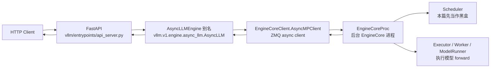

这张图只展示控制流主干。实际返回文本时，前端进程里还有一个后台
`output_handler` task 专门从 `EngineCore` 拉输出，并把结果放进每个请求自己的
`RequestOutputCollector`。

## 初始化阶段：服务器和引擎如何建起来

入口文件是 `vllm/entrypoints/api_server.py`：

- `asyncio.run(run_server(args))` 启动异步服务器。
- `run_server()` 调用 `init_app()` 初始化 FastAPI app 和全局 `engine`。
- `init_app()` 用 `AsyncEngineArgs.from_cli_args(args)` 构造 engine 参数。
- 如果没有外部传入 `llm_engine`，则调用
  `AsyncLLMEngine.from_engine_args(engine_args, usage_context=UsageContext.API_SERVER)`。
- 因为 `AsyncLLMEngine` 是 `AsyncLLM` 的别名，实际进入
  `AsyncLLM.from_engine_args()`。
- `AsyncLLM.__init__()` 内部会创建：
  - `renderer`：负责 tokenizer、chat/completion 渲染等前端输入语义。
  - `InputProcessor`：把 prompt / engine input 转成 `EngineCoreRequest`。
  - `OutputProcessor`：把 `EngineCoreOutput` 转成 `RequestOutput`，其中包括
    detokenize。
  - `EngineCoreClient.make_async_mp_client()`：创建异步多进程 client，并启动或连接
    后台 `EngineCore`。

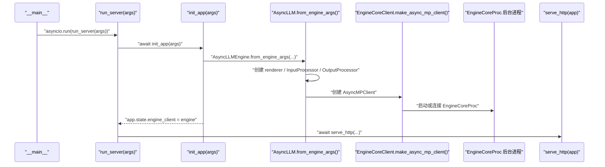

**异步点：**

- `run_server()`、`init_app()`、`serve_http()` 都在 asyncio event loop 中运行。
- `AsyncLLM.__init__()` 如果发现当前已经在 event loop 中，会尽早调用
  `_run_output_handler()`，启动后台 `asyncio.Task`。
- `EngineCore` 默认在独立进程中跑 busy loop，前端 API server 和后端
  EngineCore 之间通过 ZMQ 通信。

## 请求进入：FastAPI handler 到 `AsyncLLM.generate()`

demo server 的核心接口是：

- `@app.post("/generate") async def generate(request: Request)`
- `@with_cancellation async def _generate(request_dict, raw_request)`

`generate()` 先 `await request.json()` 读 JSON，然后把字典交给 `_generate()`。
`_generate()` 做几件事：

- 从 JSON 中取出 `prompt`。
- 从 JSON 中取出 `stream`，默认 `False`。
- 剩余字段传给 `SamplingParams(**request_dict, skip_clone=True)`。
- 用 `random_uuid()` 生成 `request_id`。
- 调用 `AsyncLLM.generate(prompt, sampling_params, request_id)` 得到
  `results_generator`。在 `api_server.py` 源码里写成全局对象
  `engine.generate(...)`，但这个 `engine` 的实际类型是 `AsyncLLM`。

注意：`AsyncLLM.generate(...)` 返回的是 **async generator**。调用这一行本身并不会
马上把所有结果算完，真正推进请求和取结果发生在后续 `async for` 迭代中。

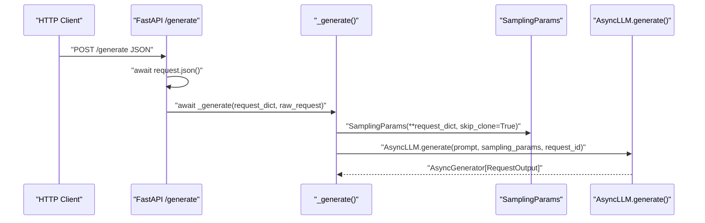

## streaming 和 non-streaming 的分叉

`_generate()` 里有两条返回路径：

- `stream=True`：返回 `StreamingResponse(stream_results())`，客户端会随着
  `stream_results()` 的 `yield` 增量收到 JSON 行。
- `stream=False`：API server 自己 `async for request_output in results_generator`
  一直消费到结束，只保留最后一个 `final_output`，最后返回一次 `JSONResponse`。

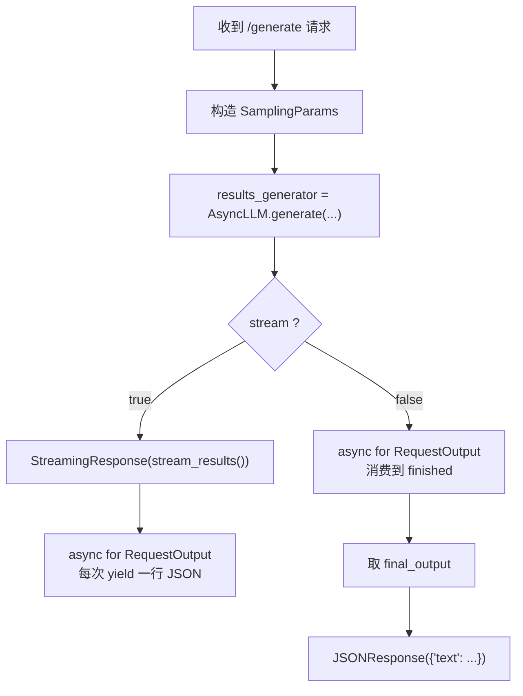

`api_server.py` 返回的文本格式是：

- 对每个 `request_output.outputs` 中的候选输出，取 `output.text`。
- demo server 会拼上原始 `prompt`：`prompt + output.text`。
- 返回结构是 `{"text": [ ... ]}`。

## 前端异步生成：`AsyncLLM.generate()`

`AsyncLLM.generate()` 是 API server 真正调用的生成入口。源码注释也直接说它是
API server 用来 kick off 一个请求的主函数。

核心流程：

1. `await AsyncLLM.add_request(...)`：处理输入、创建输出队列、把请求发给
   `EngineCore`。
2. 循环从 `RequestOutputCollector` 取输出：
   `out = RequestOutputCollector.get_nowait()` 或 `await RequestOutputCollector.get()`。
3. 如果 `out.finished` 为真，结束循环。
4. 每次拿到 `RequestOutput` 就 `yield out` 给 API server。
5. 如果请求被取消，会调用 `await AsyncLLM.abort(q.request_id, internal=True)`。

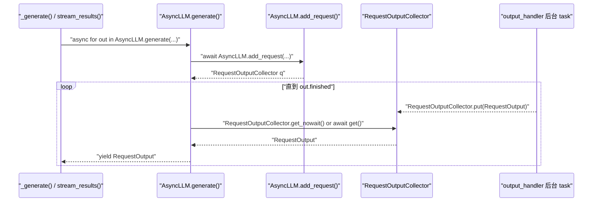

**异步点：**

- `AsyncLLM.generate()` 本身是 async generator。
- `await AsyncLLM.add_request(...)` 会异步等待输入处理需要的 utility 调用和 ZMQ send。
- `RequestOutputCollector.get_nowait()` 或 `await RequestOutputCollector.get()` 是前端请求协程的等待点：如果后台
  `output_handler` 还没有放入输出，这里会让出 event loop。
- 客户端断开时，`with_cancellation` / generator cancellation 会触发 abort 路径。

## 输入处理：prompt 到 `EngineCoreRequest`

`AsyncLLM.add_request()` 负责把外部输入转成 engine core 能理解的请求：

- 首先检查 `AsyncLLM.errored`，如果引擎已经失败则抛 `EngineDeadError`。
- 对普通 prompt，调用
  `InputProcessor.process_inputs(request_id, prompt, params, supported_tasks=...)`（通过 `AsyncLLM.input_processor` 调用）。
- `InputProcessor.process_inputs()` 会：
  - 校验 `SamplingParams` 或 `PoolingParams`。
  - 如果传入的是 raw prompt，调用 `InputPreprocessor.preprocess()` 做 tokenization /
    输入标准化。
  - 用 `split_enc_dec_input()` 拆分 encoder / decoder 输入。
  - 得到 `prompt_token_ids` 或 `prompt_embeds`。
  - 克隆并补全 `SamplingParams`，例如 `max_tokens`、generation config、tokenizer
    相关 stop/eos 信息。
  - 处理 multimodal features。
  - 返回 `EngineCoreRequest`。
- `InputProcessor.assign_request_id(request)` 会把外部 `request_id` 保存到
  `external_req_id`，然后给内部 `request_id` 加一段随机后缀，避免重复。

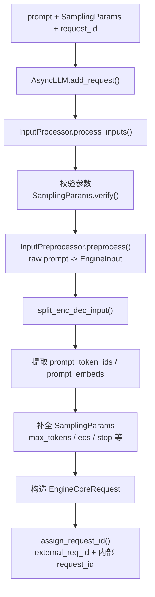

对本文的普通文本请求来说，最重要的数据变化是：

- `prompt: str`
- 经过 tokenizer / preprocessor 后变成 `prompt_token_ids: list[int]`
- 和 `sampling_params` 一起封装成 `EngineCoreRequest`

## 注册输出队列并发送请求到 EngineCore

`AsyncLLM.add_request()` 处理完输入后，会启动输出处理任务并创建请求自己的输出队列：

- `AsyncLLM._run_output_handler()`：确保后台 output handler task 已经运行。
- `queue = RequestOutputCollector(params.output_kind, request.request_id)`。
- `await AsyncLLM._add_request(request, prompt_text, None, 0, queue)`。

`AsyncLLM._add_request()` 做两个动作：

- `OutputProcessor.add_request(request, prompt, parent_req, index, queue)`（通过 `AsyncLLM.output_processor` 调用）：
  在 API server 进程中注册 `RequestState`，后续 detokenize 和输出聚合都靠它。
- `await AsyncMPClient.add_request_async(request)`（通过 `AsyncLLM.engine_core` 调用）：
  通过 `AsyncMPClient` 把 `EngineCoreRequest` 发送给后台 `EngineCore` 进程。

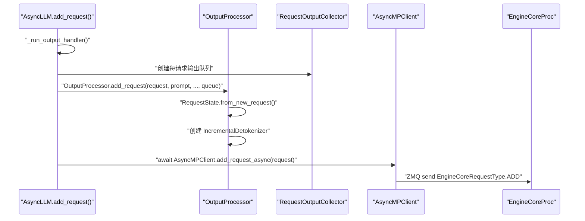

**异步点：**

- `AsyncMPClient.add_request_async()` 使用 `zmq.asyncio` 发送 multipart message。
- `RequestOutputCollector` 内部用 `asyncio.Event` 协调生产者和消费者。
- 对 `n > 1` 的 sampling，`AsyncLLM.add_request()` 会 fan out 多个 child request；
  本文先按 `n == 1` 的普通请求理解。


## AsyncMPClient 到 EngineCore 的 ADD 消息链路

`AsyncMPClient` 会把 `EngineCoreRequest` 编码成 ZMQ multipart 消息，后台 `EngineCoreProc` 的 socket loop 收到后再转成内部 `Request`，最后放进 `EngineCore.input_queue`。

关键调用链如下：

- `AsyncMPClient.add_request_async(request)`：给请求写入 `request.client_index = AsyncMPClient.client_index`，然后调用 `AsyncMPClient._send_input(EngineCoreRequestType.ADD, request)`。发送完成后调用 `AsyncMPClient._ensure_output_queue_task()`，确保前端输出接收 task 已经启动。
- `AsyncMPClient._send_input(request_type, request, engine=None)`：如果没有指定 engine，就使用 `AsyncMPClient.core_engine`。它把消息整理成 `(request_type.value, *MsgpackEncoder.encode(request))`，也就是把 `ADD` 类型和序列化后的 `EngineCoreRequest` 放在一起。
- `AsyncMPClient._send_input_message(message, engine, objects)`：先做 `ensure_alive()` 和 `free_pending_messages()`，再拼出最终 ZMQ 消息 `(engine,) + message`。这里的第一个 frame 是 engine identity，用来让 ROUTER socket 把消息路由到目标 `EngineCoreProc`。
- `AsyncMPClient.input_socket.send_multipart(...)`：真正把 multipart message 发出去。如果请求里有 tensor backing buffers 等辅助 buffer，会使用 `track=True` 并把 `MessageTracker` 记录到 pending messages，避免 buffer 提前释放。
- `EngineCoreProc` 的 socket loop：`poller.poll()` 等待输入 socket 可读，然后 `input_socket.recv_multipart(copy=False)` 收到前端发来的 frames。
- `EngineCoreProc` 解析 `type_frame`：`request_type = EngineCoreRequestType(bytes(type_frame.buffer))`。如果是 `ADD`，就用 `add_request_decoder.decode(data_frames)` 反序列化出 `EngineCoreRequest`。
- `EngineCore.preprocess_add_request(req)`：把前端请求转成 scheduler 内部的 `Request`，返回 `(Request, request_wave)`。
- `EngineCore.input_queue.put_nowait((request_type, request))`：socket loop 不直接调度请求，而是先放入输入队列；真正的调度入口在 `EngineCore.run_busy_loop()` 里的 `EngineCore._process_input_queue()`。

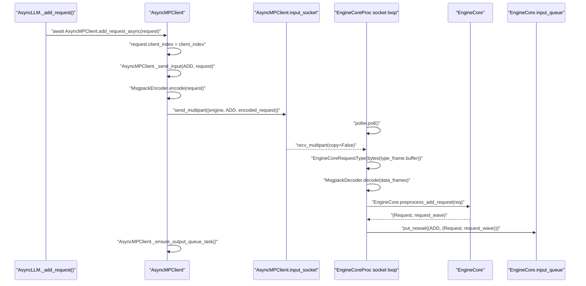

这张图的重点是：**跨进程边界发生在 `AsyncMPClient.input_socket.send_multipart()` 和 `EngineCoreProc` 的 `recv_multipart()` 之间**。在这之前，请求还在 API server 进程；在这之后，请求进入 EngineCore 后台进程，但还没有被 scheduler 接收，只是排进了 `EngineCore.input_queue`。

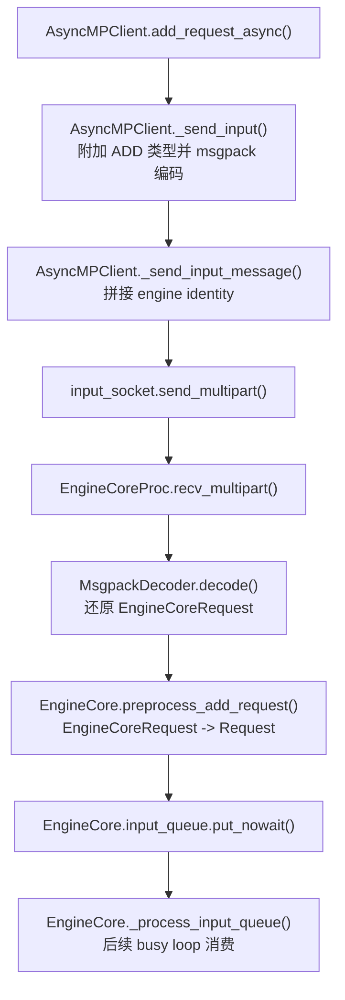

因此，下面的 `EngineCore 进程：接收请求并进入 busy loop` 小节讲的是 **后端已经收到 ZMQ ADD 消息之后** 的路径。

## EngineCore 进程：接收请求并进入 busy loop

后台进程里的关键类是 `vllm/v1/engine/core.py`：

- `EngineCoreProc` 负责 ZMQ 包装、输入 socket、输出 socket。
- 它收到 `EngineCoreRequestType.ADD` 后，先反序列化为 `EngineCoreRequest`。
- 调用 `EngineCore.preprocess_add_request()`：
  - 可处理 multimodal receiver cache。
  - 调用 `Request.from_engine_core_request(...)` 转成 scheduler 内部的 `Request`。
  - 如果有 structured output，初始化 grammar。
- 然后把 `(request_type, request)` 放入 `EngineCore.input_queue`。
- `EngineCore.run_busy_loop()` 持续：
  - `EngineCore._process_input_queue()`：取输入请求并分发。
  - `EngineCore._process_engine_step()`：如果有未完成请求，则推进一次 engine step。

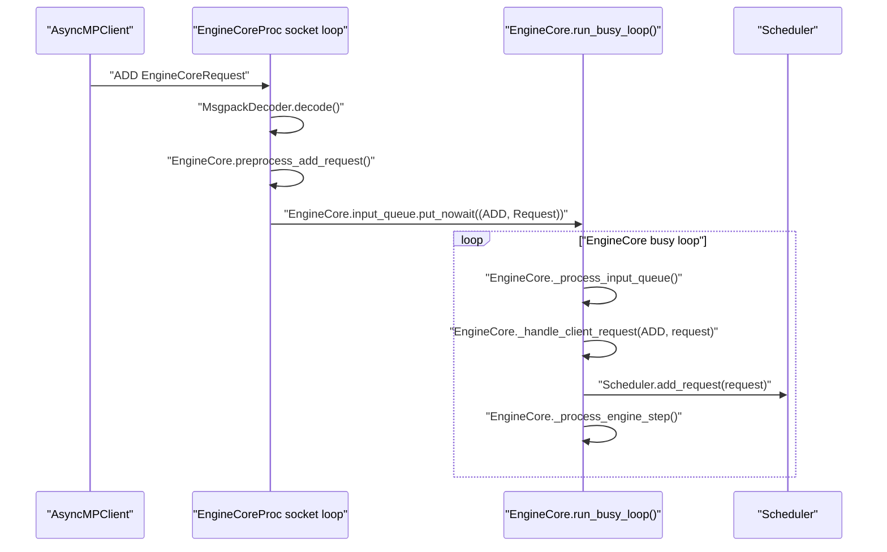

这里的 `Scheduler` 内部如何选择 prefill / decode 请求、如何分配 KV block，本篇先不展开。

## EngineCore step：调度、模型执行、生成 token id

`EngineCore.step()` 是一次核心迭代的主要入口：

- 如果 `Scheduler.has_requests()` 为假，直接返回空输出。
- `scheduler_output = Scheduler.schedule(...)`。
- `future = Executor.execute_model(scheduler_output, non_block=True)`。
- 获取 structured output grammar bitmask。
- `model_output = future.result()` 等待模型执行结果。
- 如果 `model_output is None`，调用 `Executor.sample_tokens(...)` 采样。
- 调用 `EngineCore._process_aborts_queue()` 处理执行期间到来的 abort。
- `engine_core_outputs = Scheduler.update_from_output(scheduler_output, model_output)`。
- 返回 `dict[int, EngineCoreOutputs]`。

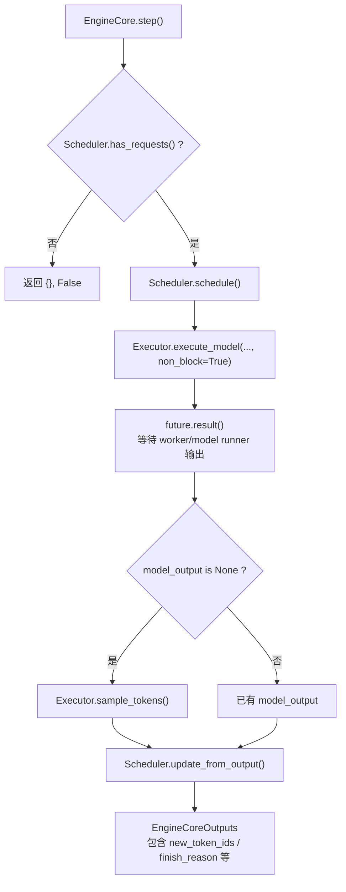

`EngineCoreOutput` 中和 decode 返回最相关的字段：

- `request_id`：内部请求 id。
- `new_token_ids: list[int]`：这次迭代新生成的 token。
- `new_logprobs` / `new_prompt_logprobs_tensors`：logprobs 相关信息。
- `finish_reason` / `stop_reason`：请求是否结束以及结束原因。
- `prefill_stats`：prefill 统计信息，例如 prefix cache 命中 token 数。

`EngineCore._process_engine_step()` 会把每个 engine rank 的 `EngineCoreOutputs` 放到
`output_queue`，再经由 socket 发回前端 `AsyncMPClient`。

## 前端 output handler：从 EngineCoreOutputs 到 RequestOutput

`AsyncLLM._run_output_handler()` 启动一个后台 `asyncio.Task`。它的循环非常关键：

1. `outputs = await AsyncMPClient.get_output_async()`：从 `AsyncMPClient` 的输出队列拿
   `EngineCoreOutputs`。
2. 按 `VLLM_V1_OUTPUT_PROC_CHUNK_SIZE` 分 chunk，避免长时间阻塞 event loop。
3. 调用 `OutputProcessor.process_outputs(outputs_slice, ...)`。
4. 如果 detokenizer 因 stop string 发现需要提前停止，则调用
   `AsyncMPClient.abort_requests_async(...)`。
5. 更新 scheduler stats 和 metrics。

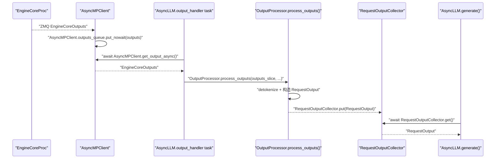

**异步点：**

- `AsyncMPClient` 有独立的 async socket receive task，把 ZMQ 输出放入
  `asyncio.Queue`。
- `output_handler` 是单独的 `asyncio.Task`，它是 `RequestOutput` 的生产者。
- 每个 HTTP 请求对应的 `AsyncLLM.generate()` 是消费者。
- `output_handler` 处理大批输出时会在 chunk 之间 `await asyncio.sleep(0)`，主动让出
  event loop。

## detokenize：token id 如何变成 `output.text`

detokenize 发生在 `OutputProcessor.process_outputs()` 中：

- 根据 `engine_core_output.request_id` 找到对应 `RequestState`。
- 取出 `new_token_ids`、`finish_reason`、`stop_reason`。
- 如果是生成任务而不是 pooling：
  - 调用 `IncrementalDetokenizer.update(new_token_ids, stop_terminated)`（通过 `RequestState.detokenizer` 调用）。
  - `IncrementalDetokenizer.update()` 会把新 token id 增量 decode 到
    `output_text`。
  - 同时检查 stop string；如果命中，会更新 `finish_reason` 和 `stop_reason`。
  - `LogprobsProcessor.update_from_output(...)`（通过 `RequestState.logprobs_processor` 调用） 更新 logprobs。
- 调用 `RequestState.make_request_output(...)` 构造 `RequestOutput`。
- 如果这个请求有 queue，则 `RequestOutputCollector.put(request_output)`（通过 `RequestState.queue` 调用），交给
  `AsyncLLM.generate()`。

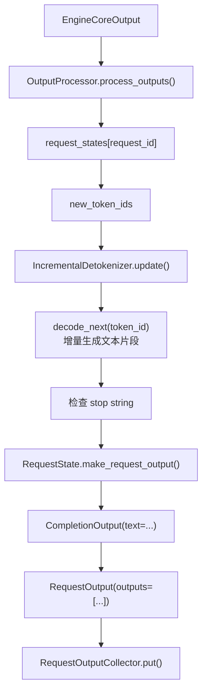

`IncrementalDetokenizer` 有两种主要实现：

- `FastIncrementalDetokenizer`：当 tokenizer 是 `PreTrainedTokenizerFast` 且
  `tokenizers` 版本支持 `DecodeStream` 时使用。它会用 prompt token ids 初始化
  decode stream，然后每来一个 token 调 `stream.step(...)`。
- `SlowIncrementalDetokenizer`：回退路径，内部调用
  `detokenize_incrementally(...)`，维护 `tokens`、`prefix_offset`、`read_offset`。

构造最终文本的接口是：

- `RequestState._new_completion_output()`
- `IncrementalDetokenizer.get_next_output_text(finished, delta)`（通过 `RequestState.detokenizer` 调用）
- 返回 `CompletionOutput(text=text, token_ids=token_ids, ...)`

如果 `output_kind == RequestOutputKind.DELTA`，`text` 是增量文本；否则通常是当前累计文本。

## 返回 HTTP 响应

当 `RequestOutputCollector.put()` 被调用后，等待中的 `AsyncLLM.generate()` 会继续：

- `RequestOutputCollector.get_nowait()` 或 `await RequestOutputCollector.get()` 取得 `RequestOutput`。
- `finished = out.finished`。
- `yield out` 给 API server。

API server 再按 streaming / non-streaming 两种模式返回。

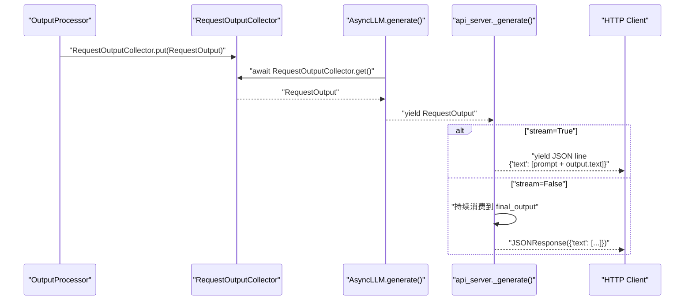

这里要注意 demo server 的返回文本不是裸生成文本，而是：

```python
text_outputs = [prompt + output.text for output in request_output.outputs]
```

也就是说，`output.text` 是 detokenizer 得到的模型输出部分；HTTP 返回里的字符串会再拼上
原始 prompt。

## 全链路时序图

下面把主链路压到一张图里，方便复习。

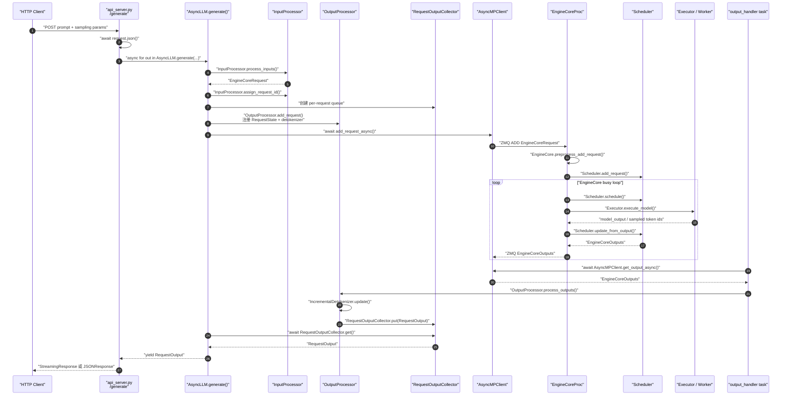

## 关键类和接口速查

| 阶段 | 类 / 函数 | 文件 | 职责 |
| --- | --- | --- | --- |
| HTTP 入口 | `generate()` / `_generate()` | `vllm/entrypoints/api_server.py` | 解析 JSON，构造 `SamplingParams`，调用 `AsyncLLM.generate()`，返回 streaming 或 final JSON |
| 引擎别名 | `AsyncLLMEngine = AsyncLLM` | `vllm/engine/async_llm_engine.py` | 兼容旧导入路径，实际进入 V1 `AsyncLLM` |
| 异步前端 | `AsyncLLM.generate()` | `vllm/v1/engine/async_llm.py` | 每请求 async generator，等待队列并 yield `RequestOutput` |
| 输入处理 | `InputProcessor.process_inputs()` | `vllm/v1/engine/input_processor.py` | prompt/token/多模态输入标准化，构造 `EngineCoreRequest` |
| 请求注册 | `OutputProcessor.add_request()` | `vllm/v1/engine/output_processor.py` | 创建 `RequestState`、`IncrementalDetokenizer` 和输出队列映射 |
| 前后端通信 | `AsyncMPClient.add_request_async()` | `vllm/v1/engine/core_client.py` | 设置 `client_index`，发起 ADD 请求发送 |
| ADD 消息封装 | `AsyncMPClient._send_input()` / `_send_input_message()` | `vllm/v1/engine/core_client.py` | msgpack 编码 `EngineCoreRequest`，通过 `input_socket.send_multipart()` 发给 `EngineCoreProc` |
| 后台引擎 | `EngineCoreProc` / `EngineCore.run_busy_loop()` | `vllm/v1/engine/core.py` | 接收请求、驱动 scheduler 和 model executor |
| 单步执行 | `EngineCore.step()` | `vllm/v1/engine/core.py` | schedule、execute model、sample token、生成 `EngineCoreOutputs` |
| 输出处理 | `AsyncLLM._run_output_handler()` | `vllm/v1/engine/async_llm.py` | 后台 task，持续拉 `EngineCoreOutputs` 并交给 `OutputProcessor` |
| detokenize | `IncrementalDetokenizer.update()` | `vllm/v1/engine/detokenizer.py` | 把 `new_token_ids` 增量 decode 成文本，并检查 stop string |
| 最终对象 | `RequestOutput` / `CompletionOutput` | `vllm/outputs.py` | API server 消费的生成结果对象 |

## 异步边界总结

- **HTTP 层异步**：FastAPI handler 是 async，`await request.json()` 和后续
  streaming response 都在 event loop 中运行。
- **请求生成异步**：`AsyncLLM.generate()` 是 async generator；API server 用
  `async for` 消费它。
- **前后端通信异步**：`AsyncMPClient` 使用 `zmq.asyncio`，请求通过
  `add_request_async()` 发给后台进程，输出通过 async socket task 放入
  `asyncio.Queue`。
- **输出处理异步**：`AsyncLLM._run_output_handler()` 是后台 `asyncio.Task`，它和每个
  请求的 `generate()` 协程通过 `RequestOutputCollector` 交接结果。
- **EngineCore 执行并非前端 await 直接执行**：真正的 schedule / model forward 在
  后台 `EngineCoreProc` busy loop 中推进，前端只是发送请求并异步等待输出。
- **取消路径是异步传播的**：客户端断开或 generator 被取消后，
  `AsyncLLM.generate()` 会调用 `abort()`，再通过 `AsyncMPClient.abort_requests_async()`
  通知后端停止对应请求。

## 一句话心智模型

一个 `/generate` 请求进入 FastAPI 后，API server 先把 JSON 转成
`SamplingParams`，再通过 `AsyncLLM.generate()` 把 prompt 处理成
`EngineCoreRequest` 并发给后台 `EngineCore`；`EngineCore` 在自己的 busy loop 中
调度和执行模型，产出 `new_token_ids`；前端的 `output_handler` 把这些 token id
增量 detokenize 成 `RequestOutput.outputs[*].text`，放入请求队列；最后
API server 的 `async for` 取出这些 `RequestOutput`，以流式或非流式 HTTP 响应返回。

## 后续可以继续看的点

这篇文章只是把一条在线推理主链路串起来。真正影响性能和行为的细节，还藏在几个更深的模块里：

- `Scheduler` 如何在 prefill、decode、抢占和 KV cache 约束之间做取舍。
- KV cache block 如何分配、复用和释放。
- `Executor`、`Worker`、`ModelRunner` 之间如何组织真正的 GPU forward。
- 流式输出、stop string、取消请求在高并发下如何相互配合。
- disaggregated prefill 和 data parallel 打开后，这条链路会被拆成什么形状。

如果把本文当作地图，那么后面这些模块就是可以继续放大的局部区域。
