# 一个请求的一生：从 `/generate` 到返回 decode 结果

刚开始看 vLLM 推理服务时，最容易被一串名字绕住：`AsyncLLMEngine`、
`AsyncLLM`、`EngineCore`、`Scheduler`、`OutputProcessor`、`Worker`。这些名字单独看
都能理解，但一旦放进在线推理链路里，就很容易不知道“请求到底在哪里被推进”。

所以这篇笔记不从抽象架构图开始，而是从 demo 异步服务
`vllm/entrypoints/api_server.py` 的 `POST /generate` 入口切进去，沿着一个普通文本生成
请求的生命周期往下追：它如何进入 vLLM、如何被 `EngineCore` 执行、如何把 token id
增量 detokenize（反 token 化）成文本，最后如何回到 HTTP 响应。

## 先给结论

- API Server 进程不直接执行模型 forward，它主要负责 HTTP、输入解析、请求注册和输出返回。
- `AsyncLLMEngine` 在当前路径下实际是 `AsyncLLM` 的别名，demo server 调用的核心对象就是
  V1 的 `AsyncLLM`。
- `AsyncLLM.generate()` 是一个 async generator。它一边把请求送进后端
  `EngineCore`，一边从请求自己的队列里异步等待 `RequestOutput`。
- 后台 `EngineCoreProc` 通过 busy loop 推进请求：接收输入、调度、执行模型、采样 token，
  再把 `EngineCoreOutputs` 发回前端。
- detokenize 不在 HTTP handler 里直接做，而是在前端进程的后台 `output_handler` 中增量完成。

## 阅读边界

本文只看 **V1 默认路径**，并且**先不展开 DP 分离 / data parallel 细节**。调度器
内部的具体策略也暂时当作黑盒，只标注它在调用链中的输入输出边界。

## 先看官方架构说明

官方文档里已经有架构总览：

- `docs/design/arch_overview.md` 说明了 vLLM 的入口、`AsyncLLMEngine` /
  `LLMEngine`、V1 多进程架构。
- 当前仓库里 `vllm/engine/async_llm_engine.py` 只有一行关键别名：
  `AsyncLLMEngine = AsyncLLM`，也就是说 demo API server 调用的
  `AsyncLLMEngine` 实际进入 `vllm/v1/engine/async_llm.py` 的
  `AsyncLLM`。
- `docs/design/arch_overview.md` 也说明了 V1 在线服务的主要进程：
  **API Server 进程**负责 HTTP、输入处理和流式输出，**Engine Core 进程**
  负责 scheduler、KV cache 和模型执行协调，**GPU Worker 进程**负责真正的
  forward。

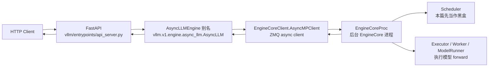

这张图只展示控制流主干。实际返回文本时，前端进程里还有一个后台
`output_handler` task 专门从 `EngineCore` 拉输出，并把结果放进每个请求自己的
`RequestOutputCollector`。

## 初始化阶段：服务器和引擎如何建起来

入口文件是 `vllm/entrypoints/api_server.py`：

- `asyncio.run(run_server(args))` 启动异步服务器。
- `run_server()` 调用 `init_app()` 初始化 FastAPI app 和全局 `engine`。
- `init_app()` 用 `AsyncEngineArgs.from_cli_args(args)` 构造 engine 参数。
- 如果没有外部传入 `llm_engine`，则调用
  `AsyncLLMEngine.from_engine_args(engine_args, usage_context=UsageContext.API_SERVER)`。
- 因为 `AsyncLLMEngine` 是 `AsyncLLM` 的别名，实际进入
  `AsyncLLM.from_engine_args()`。
- `AsyncLLM.__init__()` 内部会创建：
  - `renderer`：负责 tokenizer、chat/completion 渲染等前端输入语义。
  - `InputProcessor`：把 prompt / engine input 转成 `EngineCoreRequest`。
  - `OutputProcessor`：把 `EngineCoreOutput` 转成 `RequestOutput`，其中包括
    detokenize。
  - `EngineCoreClient.make_async_mp_client()`：创建异步多进程 client，并启动或连接
    后台 `EngineCore`。

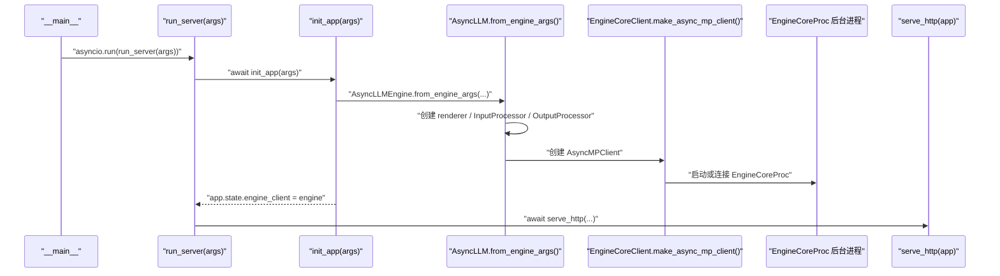

**异步点：**

- `run_server()`、`init_app()`、`serve_http()` 都在 asyncio event loop 中运行。
- `AsyncLLM.__init__()` 如果发现当前已经在 event loop 中，会尽早调用
  `_run_output_handler()`，启动后台 `asyncio.Task`。
- `EngineCore` 默认在独立进程中跑 busy loop，前端 API server 和后端
  EngineCore 之间通过 ZMQ 通信。


### 源码对照：初始化链路

这一段直接对应上面的初始化 bullet：`__main__` 进入 `asyncio.run()`，`run_server()` 调 `init_app()`，`init_app()` 再创建 `AsyncLLMEngine`。V1 下 `AsyncLLMEngine` 是 `AsyncLLM` 的别名，所以后面实际进入 `AsyncLLM.from_engine_args()` 和 `AsyncLLM.__init__()`。

```python
# vllm/entrypoints/api_server.py
# 说明：只有直接执行 demo API server 文件时，才进入 CLI 启动路径。
if __name__ == "__main__":
    # 说明：创建 vLLM 自定义 parser，后续会注册 server 参数和 engine 参数。
    parser = FlexibleArgumentParser()
    # 省略 host、port、ssl、log-level 等 CLI 参数注册。
    parser = AsyncEngineArgs.add_cli_args(parser)  # 注册模型、并行、缓存等 engine 参数。
    # 说明：把命令行参数解析成 Namespace，后续 run_server() 只依赖这个对象。
    args = parser.parse_args()

    asyncio.run(run_server(args))  # 创建并运行 asyncio event loop。
```

```python
# vllm/entrypoints/api_server.py
# 说明：定义 demo API server 的异步启动入口，负责初始化 app 并交给 uvicorn。
async def run_server(
    args: Namespace, llm_engine: AsyncLLMEngine | None = None, **uvicorn_kwargs: Any
) -> None:
    # 说明：提高进程资源限制，避免高并发连接或文件句柄数量不够。
    set_ulimit()

    app = await init_app(args, llm_engine)  # 初始化 FastAPI app 和全局 engine。
    # 说明：保护内部不变量：init_app() 返回后全局 engine 必须已经可用。
    assert engine is not None

    # 说明：把 FastAPI app 交给 HTTP server，并拿到用于等待退出的 shutdown task。
    shutdown_task = await serve_http(
        app,
        sock=None,
        enable_ssl_refresh=args.enable_ssl_refresh,
        host=args.host,
        port=args.port,
        log_level=args.log_level,
        timeout_keep_alive=envs.VLLM_HTTP_TIMEOUT_KEEP_ALIVE,
        ssl_keyfile=args.ssl_keyfile,
        ssl_certfile=args.ssl_certfile,
        ssl_ca_certs=args.ssl_ca_certs,
        ssl_cert_reqs=args.ssl_cert_reqs,
        **uvicorn_kwargs,
    )

    await shutdown_task  # server 生命周期挂在这个 shutdown_task 上。
```

```python
# vllm/entrypoints/api_server.py
# 说明：定义 app 初始化逻辑：构造 FastAPI app，并创建或接收外部传入的 engine。
async def init_app(
    args: Namespace,
    llm_engine: AsyncLLMEngine | None = None,
) -> FastAPI:
    # 说明：根据 CLI 参数创建 FastAPI app，同时设置 root_path 等基础属性。
    app = build_app(args)

    # 说明：声明后续写入模块级 engine，demo handler 会通过这个全局变量访问引擎。
    global engine

    # 说明：把通用 CLI Namespace 转成 vLLM engine 专用参数对象。
    engine_args = AsyncEngineArgs.from_cli_args(args)  # CLI Namespace -> AsyncEngineArgs。
    # 说明：选择 engine 来源：优先使用测试/外部传入的 llm_engine，否则现场创建。
    engine = (
        # 说明：优先复用外部传入的 engine，常见于测试或自定义嵌入场景。
        llm_engine
        if llm_engine is not None
        # 说明：没有外部 engine 时，从 engine 参数创建异步引擎。
        else AsyncLLMEngine.from_engine_args(
            # 说明：标记当前使用场景是 demo API server，影响配置和 usage 统计。
            engine_args, usage_context=UsageContext.API_SERVER
        )
    )
    app.state.engine_client = engine  # 把引擎挂到 FastAPI app 上。
    # 说明：把启动参数也保存到 app.state，便于后续路由读取 server 配置。
    app.state.args = args
    # 说明：返回初始化完成的 FastAPI app。
    return app
```

```python
# vllm/v1/engine/async_llm.py
# 说明：声明类方法，调用时不需要已有 AsyncLLM 实例。
@classmethod
# 说明：从 AsyncEngineArgs 创建 AsyncLLM，是 API server 初始化进入 V1 引擎的入口。
def from_engine_args(
    cls,
    engine_args: AsyncEngineArgs,
    start_engine_loop: bool = True,
    usage_context: UsageContext = UsageContext.ENGINE_CONTEXT,
    stat_loggers: list[StatLoggerFactory] | None = None,
) -> "AsyncLLM":
    vllm_config = engine_args.create_engine_config(usage_context)  # 合并模型/并行/缓存配置。
    executor_class = Executor.get_class(vllm_config)  # 根据配置选择 executor 实现。

    # 说明：实例化 AsyncLLM，并把整理好的配置继续传给 __init__。
    return cls(
        # 说明：把同一份运行时配置传给 EngineCore。
        vllm_config=vllm_config,
        # 说明：告诉 EngineCore 后端应该使用哪类 executor 执行模型。
        executor_class=executor_class,
        log_requests=engine_args.enable_log_requests,
        log_stats=not engine_args.disable_log_stats,
        start_engine_loop=start_engine_loop,
        usage_context=usage_context,
        stat_loggers=stat_loggers,
    )
```

```python
# vllm/v1/engine/async_llm.py
# 说明：AsyncLLM 是前端异步引擎封装，对外提供 generate/add_request/abort 等接口。
class AsyncLLM(EngineClient):
    # 说明：初始化 AsyncLLM 前端对象，并创建输入处理、输出处理和 EngineCore client。
    def __init__(
        self,
        vllm_config: VllmConfig,
        executor_class: type[Executor],
        log_stats: bool,
        usage_context: UsageContext = UsageContext.ENGINE_CONTEXT,
        mm_registry: MultiModalRegistry = MULTIMODAL_REGISTRY,
        log_requests: bool = True,
        start_engine_loop: bool = True,
        stat_loggers: list[StatLoggerFactory] | None = None,
        aggregate_engine_logging: bool = False,
        client_addresses: dict[str, Any] | None = None,
        client_count: int = 1,
        client_index: int = 0,
    ) -> None:
        # 说明：保存全局配置，后续 input/output processor 和 EngineCore client 都会复用。
        self.vllm_config = vllm_config
        # 说明：缓存模型配置，避免后续频繁从 vllm_config 里取。
        self.model_config = vllm_config.model_config
        # 说明：缓存可观测性配置，用于 tracing 和 metrics。
        self.observability_config = vllm_config.observability_config

        # 说明：读取 OTLP tracing 地址，用来决定是否开启前端 tracing。
        tracing_endpoint = self.observability_config.otlp_traces_endpoint
        # 说明：记录是否打印请求级日志。
        self.log_requests = log_requests
        # 说明：记录是否启用统计日志，OutputProcessor 和 logger manager 会使用。
        self.log_stats = log_stats

        # 说明：根据配置创建 renderer，负责 tokenizer 和 prompt/chat 渲染语义。
        self.renderer = renderer = renderer_from_config(self.vllm_config)

        # Convert EngineInput --> EngineCoreRequest.
        # 说明：创建输入处理器，把外部 prompt 或 EngineInput 转成 EngineCoreRequest。
        self.input_processor = InputProcessor(self.vllm_config, renderer)

        # Converts EngineCoreOutputs --> RequestOutput.
        # 说明：创建输出处理器，把 EngineCoreOutput detokenize 并组装成 RequestOutput。
        self.output_processor = OutputProcessor(
            # 说明：把 renderer 持有的 tokenizer 交给输出侧 detokenizer 使用。
            renderer.tokenizer,
            # 说明：把统计日志开关传给 EngineCore client，后端会据此记录 scheduler/engine 指标。
            log_stats=self.log_stats,
            # 说明：控制流式输出的 token 间隔，避免每个 token 都必然触发一次前端输出。
            stream_interval=self.vllm_config.scheduler_config.stream_interval,
            # 说明：只在配置了 tracing endpoint 时启用 tracing 相关处理。
            tracing_enabled=tracing_endpoint is not None,
        )

        # EngineCore (starts the engine in background process).
        # 说明：创建异步多进程 EngineCore client，并启动或连接后台 EngineCore。
        self.engine_core = EngineCoreClient.make_async_mp_client(
            # 说明：把同一份运行时配置传给 EngineCore。
            vllm_config=vllm_config,
            # 说明：告诉 EngineCore 后端应该使用哪类 executor 执行模型。
            executor_class=executor_class,
            # 说明：把统计日志开关传给 EngineCore client，后端会据此记录 scheduler/engine 指标。
            log_stats=self.log_stats,
            # 说明：传入可选的 ZMQ 地址，用于连接已有 EngineCore 或多进程部署。
            client_addresses=client_addresses,
            # 说明：记录前端 client 数量，多 client/DP 场景会用它区分来源。
            client_count=client_count,
            # 说明：记录当前 client 的编号，后续请求会带上这个 index 以便输出路由。
            client_index=client_index,
        )

        # 说明：初始化后台输出处理 task 句柄，真正启动后会保存 asyncio.Task。
        self.output_handler: asyncio.Task | None = None
        try:
            asyncio.get_running_loop()  # 如果已经在 event loop 中，就提前启动输出处理任务。
            # 说明：如果 event loop 已经存在，就提前启动后台 output_handler。
            self._run_output_handler()
        # 说明：没有运行中的 event loop 时会抛 RuntimeError，此时延后到 add_request() 再启动。
        except RuntimeError:
            # 说明：初始化阶段允许没有 event loop，因此这里静默跳过。
            pass
```

这段源码和上面的对象职责正好一一对应：`renderer` 负责前端输入语义，`InputProcessor` 负责输入转 `EngineCoreRequest`，`OutputProcessor` 负责输出转 `RequestOutput`，`EngineCoreClient.make_async_mp_client()` 负责连接或启动后台 `EngineCore`。

## 请求进入：FastAPI handler 到 `AsyncLLM.generate()`

demo server 的核心接口是：

- `@app.post("/generate") async def generate(request: Request)`
- `@with_cancellation async def _generate(request_dict, raw_request)`

`generate()` 先 `await request.json()` 读 JSON，然后把字典交给 `_generate()`。
`_generate()` 做几件事：

- 从 JSON 中取出 `prompt`。
- 从 JSON 中取出 `stream`，默认 `False`。
- 剩余字段传给 `SamplingParams(**request_dict, skip_clone=True)`。
- 用 `random_uuid()` 生成 `request_id`。
- 调用 `AsyncLLM.generate(prompt, sampling_params, request_id)` 得到
  `results_generator`。在 `api_server.py` 源码里写成全局对象
  `engine.generate(...)`，但这个 `engine` 的实际类型是 `AsyncLLM`。

注意：`AsyncLLM.generate(...)` 返回的是 **async generator**。调用这一行本身并不会
马上把所有结果算完，真正推进请求和取结果发生在后续 `async for` 迭代中。

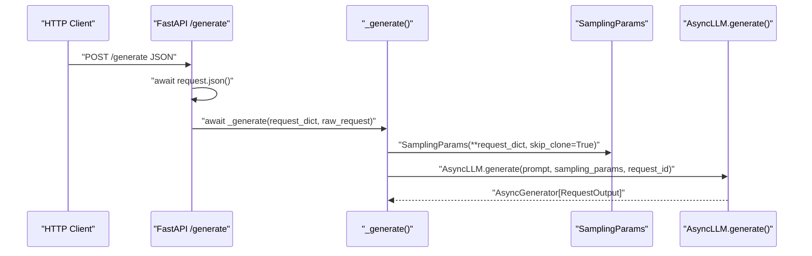


### 源码对照：HTTP handler 到 `engine.generate()`

这一段对应“请求进入 FastAPI handler”。`results_generator` 只是拿到一个 async generator，真正执行发生在后面的 `async for`。

```python
# vllm/entrypoints/api_server.py
# 说明：把 generate() 注册为 demo server 的 POST /generate 路由。
@app.post("/generate")
# 说明：FastAPI 收到 HTTP 请求后进入这个异步 handler。
async def generate(request: Request) -> Response:
    request_dict = await request.json()  # HTTP body 解析成 dict。
    # 说明：把解析后的 dict 交给带取消处理的内部生成函数。
    return await _generate(request_dict, raw_request=request)


# 说明：包装请求取消逻辑，客户端断开时可以取消后端生成。
@with_cancellation
# 说明：内部生成函数负责构造 SamplingParams 并消费 AsyncLLM.generate()。
async def _generate(request_dict: dict, raw_request: Request) -> Response:
    prompt = request_dict.pop("prompt")  # demo server 要求 prompt 在 JSON 顶层。
    stream = request_dict.pop("stream", False)  # 决定走流式还是非流式返回。
    # 说明：把剩余 JSON 字段解释成采样参数；新建对象可跳过额外 clone。
    sampling_params = SamplingParams(**request_dict, skip_clone=True)
    request_id = random_uuid()  # 外部请求 id，后面会成为 external_req_id。

    # 说明：保护内部不变量：init_app() 返回后全局 engine 必须已经可用。
    assert engine is not None
    # 说明：拿到异步结果生成器；真正执行要等后续 async for 推进。
    results_generator = engine.generate(prompt, sampling_params, request_id)
```

## streaming 和 non-streaming 的分叉

`_generate()` 里有两条返回路径：

- `stream=True`：返回 `StreamingResponse(stream_results())`，客户端会随着
  `stream_results()` 的 `yield` 增量收到 JSON 行。
- `stream=False`：API server 自己 `async for request_output in results_generator`
  一直消费到结束，只保留最后一个 `final_output`，最后返回一次 `JSONResponse`。

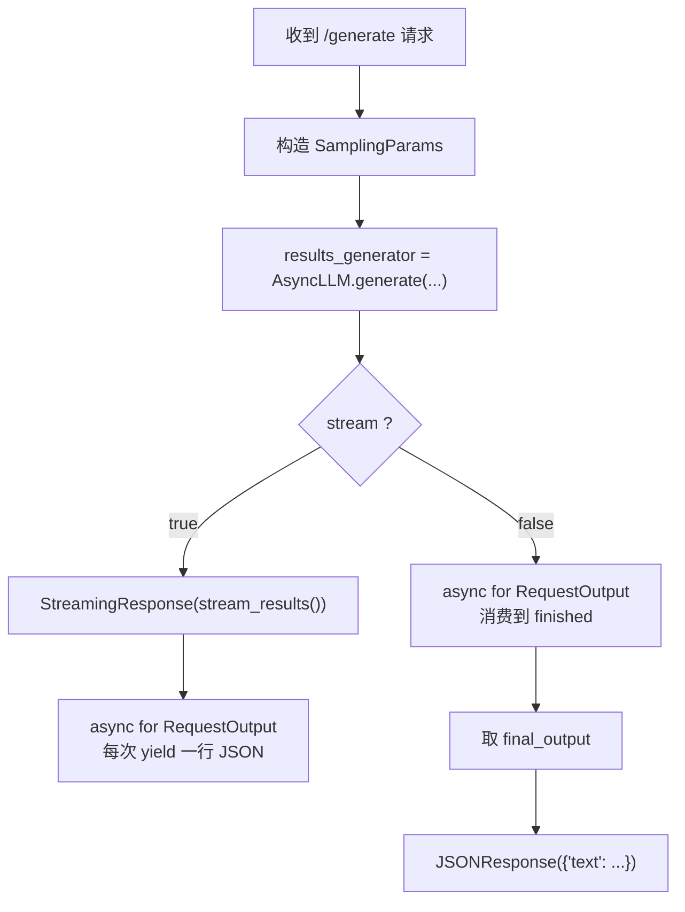

`api_server.py` 返回的文本格式是：

- 对每个 `request_output.outputs` 中的候选输出，取 `output.text`。
- demo server 会拼上原始 `prompt`：`prompt + output.text`。
- 返回结构是 `{"text": [ ... ]}`。


### 源码对照：两种返回路径

`stream=True` 时，每次 `RequestOutput` 到达就返回一行 JSON；`stream=False` 时，server 自己消费到结束，只返回最后一次输出。这里也能看到 demo server 返回的是 `prompt + output.text`，不是裸 `output.text`。

```python
# vllm/entrypoints/api_server.py
# 说明：定义流式响应生成器，每次产出一行 JSON bytes。
async def stream_results() -> AsyncGenerator[bytes, None]:
    # 说明：消费 AsyncLLM.generate() 产出的 RequestOutput。
    async for request_output in results_generator:
        # 说明：从 RequestOutput 取回原始 prompt，demo 返回时需要拼接。
        prompt = request_output.prompt
        # 说明：保护内部不变量，避免后续逻辑在非法状态下继续运行。
        assert prompt is not None
        # output.text 只包含生成部分；demo server 返回时会拼回原始 prompt。
        # 说明：把原始 prompt 和生成文本拼接成 demo API 返回格式。
        text_outputs = [prompt + output.text for output in request_output.outputs]
        # 说明：构造 demo API 的 JSON 响应对象。
        ret = {"text": text_outputs}
        # 说明：序列化为 JSON line，并编码成 StreamingResponse 需要的 bytes。
        yield (json.dumps(ret) + "\n").encode("utf-8")

# 说明：根据用户请求选择流式路径。
if stream:
    # 说明：把 async generator 包装成 HTTP 流式响应。
    return StreamingResponse(stream_results())

# 说明：非流式路径只保留最后一次 RequestOutput。
final_output = None
try:
    # 说明：消费 AsyncLLM.generate() 产出的 RequestOutput。
    async for request_output in results_generator:
        final_output = request_output  # 非流式只保留最后一个完整输出。
# 说明：如果请求协程被取消，说明客户端可能已经断开。
except asyncio.CancelledError:
    # 说明：返回 499 表示客户端关闭请求。
    return Response(status_code=499)

# 说明：保护内部不变量，避免后续逻辑在非法状态下继续运行。
assert final_output is not None
# 说明：非流式最终输出也需要取回 prompt 来拼接返回文本。
prompt = final_output.prompt
# 说明：保护内部不变量，避免后续逻辑在非法状态下继续运行。
assert prompt is not None
text_outputs = [prompt + output.text for output in final_output.outputs]
# 说明：非流式路径一次性返回最终 JSON。
return JSONResponse({"text": text_outputs})
```

## 前端异步生成：`AsyncLLM.generate()`

`AsyncLLM.generate()` 是 API server 真正调用的生成入口。源码注释也直接说它是
API server 用来 kick off 一个请求的主函数。

核心流程：

1. `await AsyncLLM.add_request(...)`：处理输入、创建输出队列、把请求发给
   `EngineCore`。
2. 循环从 `RequestOutputCollector` 取输出：
   `out = RequestOutputCollector.get_nowait()` 或 `await RequestOutputCollector.get()`。
3. 如果 `out.finished` 为真，结束循环。
4. 每次拿到 `RequestOutput` 就 `yield out` 给 API server。
5. 如果请求被取消，会调用 `await AsyncLLM.abort(q.request_id, internal=True)`。

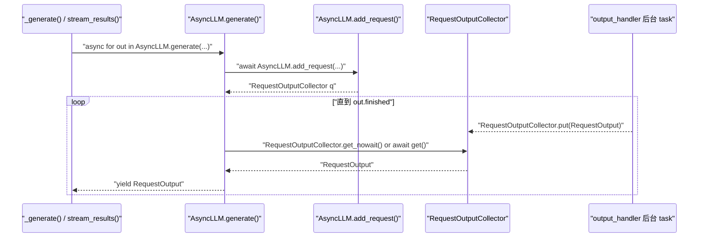

**异步点：**

- `AsyncLLM.generate()` 本身是 async generator。
- `await AsyncLLM.add_request(...)` 会异步等待输入处理需要的 utility 调用和 ZMQ send。
- `RequestOutputCollector.get_nowait()` 或 `await RequestOutputCollector.get()` 是前端请求协程的等待点：如果后台
  `output_handler` 还没有放入输出，这里会让出 event loop。
- 客户端断开时，`with_cancellation` / generator cancellation 会触发 abort 路径。


### 源码对照：`AsyncLLM.generate()` 消费输出队列

`AsyncLLM.generate()` 是请求协程的核心。它先 `add_request()`，然后不断从 per-request queue 里拿 `RequestOutput` 并 `yield` 给 API server。

```python
# vllm/v1/engine/async_llm.py
# 说明：AsyncLLM.generate() 是前端生成入口，返回 RequestOutput 的 async generator。
async def generate(
    self,
    prompt: EngineCoreRequest | PromptType | EngineInput
    | AsyncGenerator[StreamingInput, None],
    sampling_params: SamplingParams,
    request_id: str,
    *,
    prompt_text: str | None = None,
    lora_request: LoRARequest | None = None,
    tokenization_kwargs: dict[str, Any] | None = None,
    trace_headers: Mapping[str, str] | None = None,
    priority: int = 0,
    data_parallel_rank: int | None = None,
    reasoning_ended: bool | None = None,
    reasoning_parser_kwargs: dict[str, Any] | None = None,
) -> AsyncGenerator[RequestOutput, None]:
    # 说明：先声明 per-request 输出队列；异常取消时需要用它找到 request_id。
    q: RequestOutputCollector | None = None
    try:
        # 说明：把请求注册到前端 OutputProcessor，并发送给后台 EngineCore。
        q = await self.add_request(
            request_id,
            prompt,
            sampling_params,
            # 说明：携带可选 LoRA 配置，worker 会据此加载/选择 adapter。
            lora_request=lora_request,
            tokenization_kwargs=tokenization_kwargs,
            # 说明：传递 tracing 上下文，便于跨组件串联链路。
            trace_headers=trace_headers,
            # 说明：携带调度优先级，scheduler 可据此排序。
            priority=priority,
            # 说明：指定 DP rank 时，用于把请求路由到特定数据并行副本。
            data_parallel_rank=data_parallel_rank,
            prompt_text=prompt_text,
            reasoning_ended=reasoning_ended,
            reasoning_parser_kwargs=reasoning_parser_kwargs,
        )

        # 说明：记录请求是否已经收到最终输出。
        finished = False
        # 说明：持续从请求队列取输出，直到 OutputProcessor 标记 finished。
        while not finished:
            # output_handler 是生产者；generate() 是消费者。
            # 说明：优先无等待取队列，没数据时再 await 让出 event loop。
            out = q.get_nowait() or await q.get()
            # 说明：保护内部不变量，避免后续逻辑在非法状态下继续运行。
            assert isinstance(out, RequestOutput)
            # 说明：用 RequestOutput.finished 判断本请求是否完成。
            finished = out.finished
            # 说明：STREAM_FINISHED 是内部哨兵，不应该暴露给 API server。
            if out is not STREAM_FINISHED:
                # 说明：把 RequestOutput 交还给 HTTP handler 的 async for。
                yield out
```

## 输入处理：prompt 到 `EngineCoreRequest`

`AsyncLLM.add_request()` 负责把外部输入转成 engine core 能理解的请求：

- 首先检查 `AsyncLLM.errored`，如果引擎已经失败则抛 `EngineDeadError`。
- 对普通 prompt，调用
  `InputProcessor.process_inputs(request_id, prompt, params, supported_tasks=...)`（通过 `AsyncLLM.input_processor` 调用）。
- `InputProcessor.process_inputs()` 会：
  - 校验 `SamplingParams` 或 `PoolingParams`。
  - 如果传入的是 raw prompt，调用 `InputPreprocessor.preprocess()` 做 tokenization /
    输入标准化。
  - 用 `split_enc_dec_input()` 拆分 encoder / decoder 输入。
  - 得到 `prompt_token_ids` 或 `prompt_embeds`。
  - 克隆并补全 `SamplingParams`，例如 `max_tokens`、generation config、tokenizer
    相关 stop/eos 信息。
  - 处理 multimodal features。
  - 返回 `EngineCoreRequest`。
- `InputProcessor.assign_request_id(request)` 会把外部 `request_id` 保存到
  `external_req_id`，然后给内部 `request_id` 加一段随机后缀，避免重复。

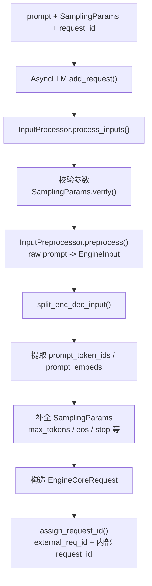

对本文的普通文本请求来说，最重要的数据变化是：

- `prompt: str`
- 经过 tokenizer / preprocessor 后变成 `prompt_token_ids: list[int]`
- 和 `sampling_params` 一起封装成 `EngineCoreRequest`


### 源码对照：`InputProcessor.process_inputs()`

普通文本请求走 `input_preprocessor.preprocess(...)` 分支：raw prompt 先标准化成 `EngineInput`，然后拆出 decoder 侧的 `prompt_token_ids`，最后和 `SamplingParams` 一起封装成 `EngineCoreRequest`。

```python
# vllm/v1/engine/input_processor.py
# 说明：把外部 prompt/EngineInput 标准化成 EngineCoreRequest。
def process_inputs(
    self,
    request_id: str,
    prompt: PromptType | EngineInput,
    params: SamplingParams | PoolingParams,
    supported_tasks: tuple[SupportedTask, ...],
    arrival_time: float | None = None,
    lora_request: LoRARequest | None = None,
    tokenization_kwargs: dict[str, Any] | None = None,
    trace_headers: Mapping[str, str] | None = None,
    priority: int = 0,
    data_parallel_rank: int | None = None,
    resumable: bool = False,
) -> EngineCoreRequest:
    self._validate_params(params, supported_tasks)  # 校验 SamplingParams/PoolingParams。
    # 说明：校验 LoRA 请求是否能和当前模型配置一起使用。
    self._validate_lora(lora_request)

    # 说明：如果已经是结构化 EngineInput，就不再走 raw prompt 预处理。
    if isinstance(prompt, dict) and "type" in prompt:
        # 说明：把传入的结构化输入直接作为预处理结果。
        processed_inputs: EngineInput = prompt
    else:
        # 说明：如果外部没有提供到达时间，就在前端处理时补上当前时间。
        if arrival_time is None:
            # 说明：记录请求进入输入处理阶段的时间戳，用于指标统计。
            arrival_time = time.time()
        # 说明：把 raw prompt tokenization/标准化为 EngineInput。
        processed_inputs = self.input_preprocessor.preprocess(
            prompt,
            tokenization_kwargs=tokenization_kwargs,
        )

    # 说明：拆分 encoder-decoder 模型需要的两侧输入；decoder-only 模型主要看 decoder_inputs。
    encoder_inputs, decoder_inputs = split_enc_dec_input(processed_inputs)
    # 说明：检查 prompt 长度、多模态占位等是否满足模型约束。
    self._validate_model_inputs(encoder_inputs, decoder_inputs)

    # 说明：处理直接传入 prompt embeddings 的路径。
    if decoder_inputs["type"] == "embeds":
        # 说明：保存 prompt embeddings，后续 EngineCoreRequest 会携带。
        prompt_embeds = decoder_inputs["prompt_embeds"]
        # 说明：embedding 路径可能仍带 token ids，供输出和缓存逻辑参考。
        prompt_token_ids = decoder_inputs.get("prompt_token_ids")
        # 说明：记录 prompt 是否原本就是 token ids。
        prompt_is_token_ids = decoder_inputs.get("is_token_ids")
    else:
        prompt_token_ids = decoder_inputs["prompt_token_ids"]  # 普通文本最终落到 token ids。
        # 说明：普通文本路径没有 prompt embeddings。
        prompt_embeds = None
        # 说明：普通文本路径不需要额外记录 token ids 来源。
        prompt_is_token_ids = None
```

```python
# vllm/v1/engine/input_processor.py
# 说明：生成任务走 SamplingParams 分支；pooling 任务走另一个分支。
if isinstance(params, SamplingParams):
    # 说明：克隆采样参数，避免输入处理修改调用方原对象。
    sampling_params = params.clone()
    # 说明：用户没指定最大生成长度时，需要根据模型上下文长度补默认值。
    if sampling_params.max_tokens is None:
        # 说明：计算 prompt 已占用的 token/embedding 长度。
        seq_len = length_from_prompt_token_ids_or_embeds(
            prompt_token_ids, prompt_embeds
        )
        # 未显式传 max_tokens 时，默认生成到 max_model_len。
        # 说明：默认最多生成到模型上下文窗口上限。
        sampling_params.max_tokens = self.model_config.max_model_len - seq_len

    # 说明：把模型 generation config 中的默认生成参数合并进 SamplingParams。
    sampling_params.update_from_generation_config(
        self.generation_config_fields,
        # 说明：从 renderer/tokenizer 获取 EOS token，供 stop/eos 逻辑使用。
        self.renderer.get_eos_token_id(),
    )
    # 说明：只有存在 tokenizer 时，才能补充 tokenizer 相关 stop/eos 信息。
    if self.tokenizer is not None:
        # 说明：从 tokenizer 补齐特殊 token、stop token 等采样配置。
        sampling_params.update_from_tokenizer(self.tokenizer)

# 说明：把前端处理结果封装成 EngineCore 能消费的请求对象。
return EngineCoreRequest(
    # 说明：携带当前请求 id；后续 assign_request_id() 会生成内部 id。
    request_id=request_id,
    # 说明：携带 prompt token ids，scheduler 和 worker 都依赖它。
    prompt_token_ids=prompt_token_ids,
    # 说明：如果请求使用 embeddings，则把 embeddings 一并传给后端。
    prompt_embeds=prompt_embeds,
    prompt_is_token_ids=prompt_is_token_ids,
    mm_features=mm_features,
    # 说明：生成请求的采样参数。
    sampling_params=sampling_params,
    # 说明：池化请求的参数；普通生成请求这里通常为 None。
    pooling_params=pooling_params,
    # 说明：携带请求到达时间，用于排队延迟和 tracing 指标。
    arrival_time=arrival_time,
    # 说明：携带可选 LoRA 配置，worker 会据此加载/选择 adapter。
    lora_request=lora_request,
    cache_salt=decoder_inputs.get("cache_salt"),
    # 说明：携带调度优先级，scheduler 可据此排序。
    priority=priority,
    # 说明：指定 DP rank 时，用于把请求路由到特定数据并行副本。
    data_parallel_rank=data_parallel_rank,
    # 说明：传递 tracing 上下文，便于跨组件串联链路。
    trace_headers=trace_headers,
    # 说明：标记请求是否支持 streaming input/resume。
    resumable=resumable,
)
```

## 注册输出队列并发送请求到 EngineCore

`AsyncLLM.add_request()` 处理完输入后，会启动输出处理任务并创建请求自己的输出队列：

- `AsyncLLM._run_output_handler()`：确保后台 output handler task 已经运行。
- `queue = RequestOutputCollector(params.output_kind, request.request_id)`。
- `await AsyncLLM._add_request(request, prompt_text, None, 0, queue)`。

`AsyncLLM._add_request()` 做两个动作：

- `OutputProcessor.add_request(request, prompt, parent_req, index, queue)`（通过 `AsyncLLM.output_processor` 调用）：
  在 API server 进程中注册 `RequestState`，后续 detokenize 和输出聚合都靠它。
- `await AsyncMPClient.add_request_async(request)`（通过 `AsyncLLM.engine_core` 调用）：
  通过 `AsyncMPClient` 把 `EngineCoreRequest` 发送给后台 `EngineCore` 进程。

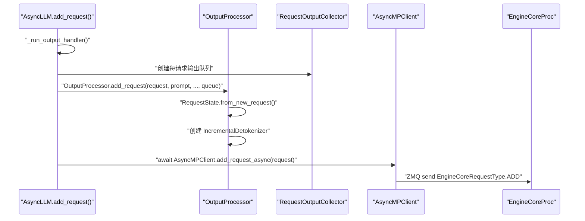

**异步点：**

- `AsyncMPClient.add_request_async()` 使用 `zmq.asyncio` 发送 multipart message。
- `RequestOutputCollector` 内部用 `asyncio.Event` 协调生产者和消费者。
- 对 `n > 1` 的 sampling，`AsyncLLM.add_request()` 会 fan out 多个 child request；
  本文先按 `n == 1` 的普通请求理解。


### 源码对照：注册 `RequestState` 并发送请求

这里发生两件事：前端进程注册 `RequestState`，后端进程接收 `EngineCoreRequest`。前者用于 detokenize 和聚合输出，后者用于调度和执行。

```python
# vllm/v1/engine/async_llm.py
self.input_processor.assign_request_id(request)  # external_req_id 保留原 id，request_id 加随机后缀。
self._run_output_handler()  # 确保后台输出处理 task 已经启动。

# 说明：创建当前请求专属输出队列，generate() 会从这里取结果。
queue = RequestOutputCollector(params.output_kind, request.request_id)
params = request.params  # 使用 process_inputs() 里克隆并补全后的 params。

# 说明：普通 n=1 请求不需要拆 child request，直接发送。
if is_pooling or params.n == 1:
    # 说明：注册输出状态并把请求发给 EngineCore。
    await self._add_request(request, prompt_text, None, 0, queue)
    # 说明：把 per-request 队列交给 generate() 消费。
    return queue
```

```python
# vllm/v1/engine/async_llm.py
# 说明：把单个 EngineCoreRequest 同时登记到前端输出处理和后端执行队列。
async def _add_request(
    self,
    request: EngineCoreRequest,
    prompt: str | None,
    parent_req: ParentRequest | None,
    index: int,
    queue: RequestOutputCollector,
):
    # 前端进程注册 RequestState，后续 detokenize 和 RequestOutput 都依赖它。
    # 说明：前端注册 RequestState，建立 request_id 到 detokenizer/queue 的映射。
    self.output_processor.add_request(request, prompt, parent_req, index, queue)

    # 后端 EngineCore 进程接收 EngineCoreRequest，真正进入调度和执行。
    # 说明：通过 EngineCoreClient 把请求异步发送给后台 EngineCore。
    await self.engine_core.add_request_async(request)
```

```python
# vllm/v1/engine/output_processor.py
# 说明：OutputProcessor 记录新请求的输出状态。
def add_request(
    self,
    request: EngineCoreRequest,
    prompt: str | None,
    parent_req: ParentRequest | None = None,
    request_index: int = 0,
    queue: RequestOutputCollector | None = None,
) -> None:
    # 说明：取内部 request_id 作为前端 request_states 的 key。
    request_id = request.request_id
    # 说明：根据新请求创建 RequestState，里面包含 detokenizer、logprobs processor 和 queue。
    req_state = RequestState.from_new_request(
        tokenizer=self.tokenizer,
        request=request,
        prompt=prompt,
        parent_req=parent_req,
        request_index=request_index,
        queue=queue,
        # 说明：把统计日志开关传给输出处理器，让它决定是否维护请求指标。
        log_stats=self.log_stats,
        stream_interval=self.stream_interval,
    )
    # 说明：登记内部 request_id 到 RequestState 的映射。
    self.request_states[request_id] = req_state  # request_id -> RequestState。
    # 说明：维护外部 id 到内部 id 的反向映射，abort 和 n>1 聚合会用到。
    self.external_req_ids[req_state.external_req_id].append(request_id)
```

## AsyncMPClient 到 EngineCore 的 ADD 消息链路

`AsyncMPClient` 会把 `EngineCoreRequest` 编码成 ZMQ multipart 消息，后台 `EngineCoreProc` 的 socket loop 收到后再转成内部 `Request`，最后放进 `EngineCore.input_queue`。

关键调用链如下：

- `AsyncMPClient.add_request_async(request)`：给请求写入 `request.client_index = AsyncMPClient.client_index`，然后调用 `AsyncMPClient._send_input(EngineCoreRequestType.ADD, request)`。发送完成后调用 `AsyncMPClient._ensure_output_queue_task()`，确保前端输出接收 task 已经启动。
- `AsyncMPClient._send_input(request_type, request, engine=None)`：如果没有指定 engine，就使用 `AsyncMPClient.core_engine`。它把消息整理成 `(request_type.value, *MsgpackEncoder.encode(request))`，也就是把 `ADD` 类型和序列化后的 `EngineCoreRequest` 放在一起。
- `AsyncMPClient._send_input_message(message, engine, objects)`：先做 `ensure_alive()` 和 `free_pending_messages()`，再拼出最终 ZMQ 消息 `(engine,) + message`。这里的第一个 frame 是 engine identity，用来让 ROUTER socket 把消息路由到目标 `EngineCoreProc`。
- `AsyncMPClient.input_socket.send_multipart(...)`：真正把 multipart message 发出去。如果请求里有 tensor backing buffers 等辅助 buffer，会使用 `track=True` 并把 `MessageTracker` 记录到 pending messages，避免 buffer 提前释放。
- `EngineCoreProc` 的 socket loop：`poller.poll()` 等待输入 socket 可读，然后 `input_socket.recv_multipart(copy=False)` 收到前端发来的 frames。
- `EngineCoreProc` 解析 `type_frame`：`request_type = EngineCoreRequestType(bytes(type_frame.buffer))`。如果是 `ADD`，就用 `add_request_decoder.decode(data_frames)` 反序列化出 `EngineCoreRequest`。
- `EngineCore.preprocess_add_request(req)`：把前端请求转成 scheduler 内部的 `Request`，返回 `(Request, request_wave)`。
- `EngineCore.input_queue.put_nowait((request_type, request))`：socket loop 不直接调度请求，而是先放入输入队列；真正的调度入口在 `EngineCore.run_busy_loop()` 里的 `EngineCore._process_input_queue()`。

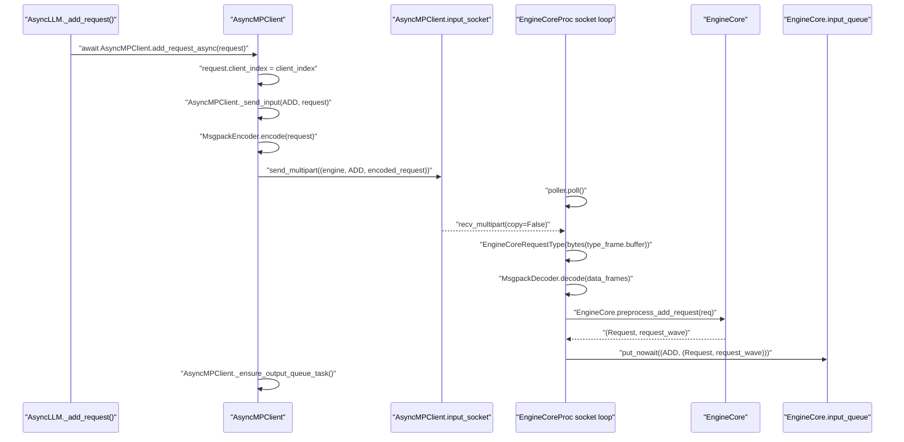

这张图的重点是：**跨进程边界发生在 `AsyncMPClient.input_socket.send_multipart()` 和 `EngineCoreProc` 的 `recv_multipart()` 之间**。在这之前，请求还在 API server 进程；在这之后，请求进入 EngineCore 后台进程，但还没有被 scheduler 接收，只是排进了 `EngineCore.input_queue`。

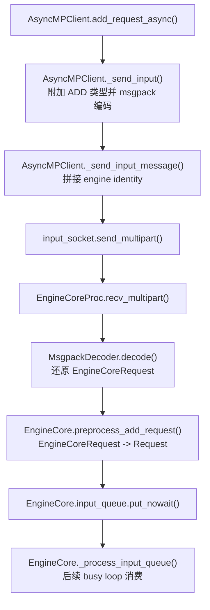

因此，下面的 `EngineCore 进程：接收请求并进入 busy loop` 小节讲的是 **后端已经收到 ZMQ ADD 消息之后** 的路径。


### 源码对照：`AsyncMPClient` 封装 ADD 消息

跨进程边界发生在 `send_multipart()`。消息前面带 engine identity，后面是 `ADD` 类型和 msgpack 编码后的 `EngineCoreRequest`。

```python
# vllm/v1/engine/core_client.py
# 说明：AsyncMPClient 的异步 ADD 入口。
async def add_request_async(self, request: EngineCoreRequest) -> None:
    request.client_index = self.client_index  # 标记这个请求属于哪个前端 client。
    # 说明：把请求按 ADD 类型编码并发送到 EngineCore 输入 socket。
    await self._send_input(EngineCoreRequestType.ADD, request)
    self._ensure_output_queue_task()  # 确保输出接收 task 已经启动。


# 说明：把请求类型和请求对象打包成可发送的 ZMQ message。
def _send_input(
    self,
    request_type: EngineCoreRequestType,
    request: Any,
    engine: EngineIdentity | None = None,
) -> Awaitable[Any]:
    # 说明：未指定目标 engine 时，默认发给当前 client 管理的 core engine。
    if engine is None:
        # 说明：选择默认 EngineCore identity。
        engine = self.core_engine

    # 说明：把请求类型 frame 和 msgpack 编码后的请求数据拼成 message。
    message = (request_type.value, *self.encoder.encode(request))
    # 说明：继续拼接 engine identity，并执行 socket 发送。
    return self._send_input_message(message, engine, request)


# 说明：最终执行 ZMQ multipart 发送。
def _send_input_message(
    self, message: tuple[bytestr, ...], engine: EngineIdentity, objects: Any
) -> Awaitable[Any]:
    # 说明：发送前确认 EngineCore client 仍然存活。
    self.ensure_alive()
    # 说明：清理已经发送完成的 buffer tracker，避免内存滞留。
    self.free_pending_messages()

    msg = (engine,) + message  # ROUTER socket 用 engine identity 路由到目标 EngineCore。
    # 说明：根据当前请求或运行状态选择后续处理分支。
    if not objects or len(msg) <= 3:
        # 说明：没有额外 tensor buffer 时，直接零拷贝发送 multipart message。
        return self.input_socket.send_multipart(msg, copy=False)

    # 有 tensor backing buffers 时，用 tracker 延长对象生命周期。
    # 说明：有额外 buffer 时，需要保存 tracker 直到 ZMQ 完成发送。
    future: asyncio.Future[zmq.MessageTracker]
    # 说明：开启 ZMQ tracker，避免请求对象里的 buffer 过早释放。
    future = self.input_socket.send_multipart(msg, copy=False, track=True)
```

## EngineCore 进程：接收请求并进入 busy loop

后台进程里的关键类是 `vllm/v1/engine/core.py`：

- `EngineCoreProc` 负责 ZMQ 包装、输入 socket、输出 socket。
- 它收到 `EngineCoreRequestType.ADD` 后，先反序列化为 `EngineCoreRequest`。
- 调用 `EngineCore.preprocess_add_request()`：
  - 可处理 multimodal receiver cache。
  - 调用 `Request.from_engine_core_request(...)` 转成 scheduler 内部的 `Request`。
  - 如果有 structured output，初始化 grammar。
- 然后把 `(request_type, request)` 放入 `EngineCore.input_queue`。
- `EngineCore.run_busy_loop()` 持续：
  - `EngineCore._process_input_queue()`：取输入请求并分发。
  - `EngineCore._process_engine_step()`：如果有未完成请求，则推进一次 engine step。

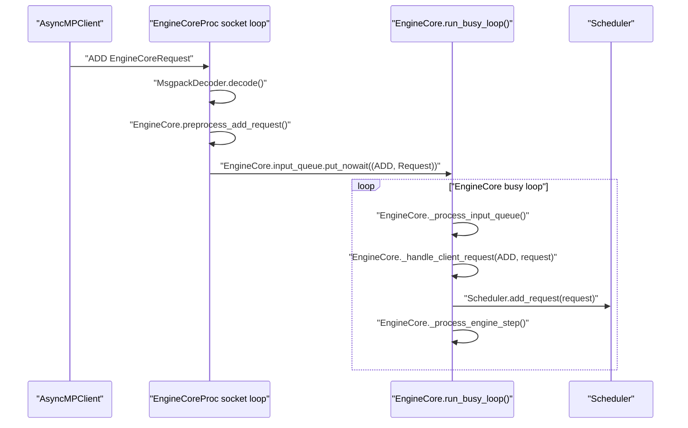

这里的 `Scheduler` 内部如何选择 prefill / decode 请求、如何分配 KV block，本篇先不展开。


### 源码对照：EngineCoreProc 接收并入队

`process_input_sockets()` 在线程里处理 ZMQ IO。它不直接跑 scheduler，而是把解析后的请求放入 `input_queue`，再由 busy loop 顺序消费。

```python
# vllm/v1/engine/core.py
# 说明：输入 socket 线程阻塞等待来自前端的 ZMQ 消息。
for input_socket, _ in poller.poll():
    # 说明：读取 multipart frames：第一个 frame 是请求类型，其余是序列化数据。
    type_frame, *data_frames = input_socket.recv_multipart(copy=False)
    # 说明：DP coordinator 的 READY 消息不是请求，需要特殊跳过。
    if type_frame.buffer == b"READY":
        # 说明：保护内部不变量，避免后续逻辑在非法状态下继续运行。
        assert input_socket == coord_socket
        # 说明：READY 只是协调消息，不进入 EngineCore.input_queue。
        continue
    # 说明：把类型 frame 转成 EngineCoreRequestType 枚举。
    request_type = EngineCoreRequestType(bytes(type_frame.buffer))

    # 说明：busy loop 收到 ADD 时，说明 socket 线程已经完成了解码和预处理。
    if request_type == EngineCoreRequestType.ADD:
        # 说明：把 msgpack frames 还原成前端构造的 EngineCoreRequest。
        req: EngineCoreRequest = add_request_decoder.decode(data_frames)
        try:
            # 说明：把 EngineCoreRequest 转成 scheduler 内部 Request。
            request = self.preprocess_add_request(req)
        # 说明：捕获该阶段可能出现的异常，并转换成上层能理解的行为。
        except Exception:
            # 说明：预处理失败时，把错误返回前端并跳过该请求。
            self._handle_request_preproc_error(req)
            # 说明：当前 ADD 请求预处理失败，跳过它并继续接收后续消息。
            continue
    else:
        # 说明：非 ADD 消息使用通用 decoder，例如 ABORT/UTILITY。
        request = generic_decoder.decode(data_frames)

    # socket 线程只负责入队；EngineCore busy loop 再按顺序处理。
    # 说明：把解析后的请求放入 EngineCore busy loop 消费的输入队列。
    self.input_queue.put_nowait((request_type, request))
```

```python
# vllm/v1/engine/core.py
# 说明：在 socket 线程里把前端请求预处理成 scheduler 请求。
def preprocess_add_request(self, request: EngineCoreRequest) -> tuple[Request, int]:
    # 说明：多模态请求需要先从 receiver cache 合并特征数据。
    if self.mm_receiver_cache is not None and request.mm_features:
        # 说明：替换/更新多模态 features，确保后端能拿到真实数据。
        request.mm_features = self.mm_receiver_cache.get_and_update_features(
            request.mm_features
        )

    # 说明：构造 scheduler 内部 Request，并准备 prefix/block hash。
    req = Request.from_engine_core_request(request, self.request_block_hasher)
    # 说明：structured output 请求需要提前初始化 grammar 状态。
    if req.use_structured_output:
        # 说明：异步或延迟编译 grammar，scheduler 后续会检查是否可调度。
        self.structured_output_manager.grammar_init(req)
    # 说明：返回内部 Request 和请求 wave，用于 DP/弹性场景的顺序控制。
    return req, request.current_wave
```

### 源码对照：busy loop 消费输入队列

`run_busy_loop()` 是后端进程的主循环。`_process_input_queue()` 处理前端消息，`_process_engine_step()` 推进一次调度和执行。

```python
# vllm/v1/engine/core.py
# 说明：EngineCore 后台进程的主循环。
def run_busy_loop(self):
    # 说明：只要没有收到 shutdown，就持续处理输入和执行模型。
    while self._handle_shutdown():
        self._process_input_queue()  # 把 input_queue 里的 ADD 分发给 scheduler。
        self._process_engine_step()  # 如果有未完成请求，就推进一次模型执行。


# 说明：按请求类型分发前端消息。
def _handle_client_request(
    self, request_type: EngineCoreRequestType, request: Any
) -> None:
    # 说明：busy loop 收到 ADD 时，说明 socket 线程已经完成了解码和预处理。
    if request_type == EngineCoreRequestType.ADD:
        # 说明：ADD 预处理结果包含内部 Request 和 wave 信息。
        req, request_wave = request
        # 说明：shutdown 过程中拒绝新请求，避免请求进入无法完成的状态。
        if self._reject_add_in_shutdown(req):
            return
        self.add_request(req, request_wave)  # 最终进入 Scheduler.add_request()。
```

## EngineCore step：调度、模型执行、生成 token id

`EngineCore.step()` 是一次核心迭代的主要入口：

- 如果 `Scheduler.has_requests()` 为假，直接返回空输出。
- `scheduler_output = Scheduler.schedule(...)`。
- `future = Executor.execute_model(scheduler_output, non_block=True)`。
- 获取 structured output grammar bitmask。
- `model_output = future.result()` 等待模型执行结果。
- 如果 `model_output is None`，调用 `Executor.sample_tokens(...)` 采样。
- 调用 `EngineCore._process_aborts_queue()` 处理执行期间到来的 abort。
- `engine_core_outputs = Scheduler.update_from_output(scheduler_output, model_output)`。
- 返回 `dict[int, EngineCoreOutputs]`。

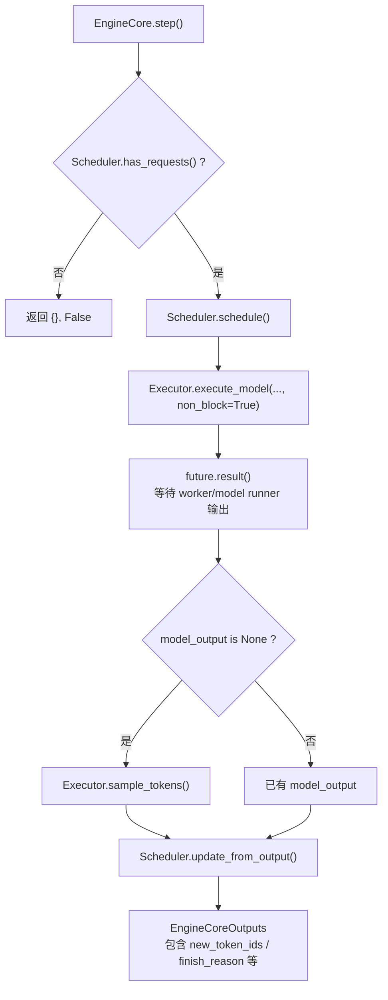

`EngineCoreOutput` 中和 decode 返回最相关的字段：

- `request_id`：内部请求 id。
- `new_token_ids: list[int]`：这次迭代新生成的 token。
- `new_logprobs` / `new_prompt_logprobs_tensors`：logprobs 相关信息。
- `finish_reason` / `stop_reason`：请求是否结束以及结束原因。
- `prefill_stats`：prefill 统计信息，例如 prefix cache 命中 token 数。

`EngineCore._process_engine_step()` 会把每个 engine rank 的 `EngineCoreOutputs` 放到
`output_queue`，再经由 socket 发回前端 `AsyncMPClient`。


### 源码对照：一次 `EngineCore.step()`

这段是一次后端迭代的骨架：scheduler 决定本轮谁能跑，executor 做模型 forward，必要时单独 sample tokens，最后 scheduler 根据模型输出更新请求状态并产出 `EngineCoreOutputs`。

```python
# vllm/v1/engine/core.py
# 说明：执行一次 EngineCore 迭代，返回本轮输出和是否真的执行了模型。
def step(self) -> tuple[dict[int, EngineCoreOutputs], bool]:
    """Schedule, execute, and make output."""

    # 说明：没有等待或运行中的请求时，本轮无需调度。
    if not self.scheduler.has_requests():
        # 说明：返回空输出，并标记没有执行模型。
        return {}, False

    # 说明：让 scheduler 选择本轮要执行的 token/request，并生成 worker 输入元数据。
    scheduler_output = self.scheduler.schedule(self._should_throttle_prefills())
    # 说明：异步提交模型 forward，返回 future 以便和其他工作重叠。
    future = self.model_executor.execute_model(scheduler_output, non_block=True)
    # 说明：为 structured output 请求准备 grammar 约束 bitmask。
    grammar_output = self.scheduler.get_grammar_bitmask(scheduler_output)

    with (
        self.log_error_detail(scheduler_output),
        self.log_iteration_details(scheduler_output),
    ):
        model_output = future.result()  # 等待 worker/model runner 的 forward 结果。
        # 说明：某些执行模式会把采样拆出去，此时 forward future 不直接返回 token。
        if model_output is None:
            # 说明：基于 grammar bitmask 对 logits 采样，得到新 token。
            model_output = self.model_executor.sample_tokens(grammar_output)

    self._process_aborts_queue()  # 先处理执行期间到来的取消请求。
    # 说明：把模型输出交给 scheduler 更新请求状态、KV 状态和完成原因。
    engine_core_outputs = self.scheduler.update_from_output(
        scheduler_output, model_output
    )

    # 说明：返回按 client/rank 分组的输出，并说明本轮是否调度了 token。
    return engine_core_outputs, scheduler_output.total_num_scheduled_tokens > 0
```

```python
# vllm/v1/engine/core.py
# 说明：busy loop 中推进一次 EngineCore step，并把输出放到 output_queue。
def _process_engine_step(self) -> bool:
    # 说明：调用当前配置选择的 step 函数，可能是普通 step 或 batch queue step。
    outputs, model_executed = self.step_fn()

    # EngineCoreOutputs 放进输出队列，后续由 output socket 发回前端进程。
    # 说明：遍历每个 client/rank 对应的 EngineCoreOutputs。
    for output in outputs.items() if outputs else ():
        # 说明：把输出交给 output socket 线程发回前端。
        self.output_queue.put_nowait(output)

    # 说明：执行 step 后清理或 draft token 更新等后置逻辑。
    self.post_step(model_executed)
    # 说明：告诉 busy loop 本轮是否真的执行了模型。
    return model_executed
```

## 前端 output handler：从 EngineCoreOutputs 到 RequestOutput

`AsyncLLM._run_output_handler()` 启动一个后台 `asyncio.Task`。它的循环非常关键：

1. `outputs = await AsyncMPClient.get_output_async()`：从 `AsyncMPClient` 的输出队列拿
   `EngineCoreOutputs`。
2. 按 `VLLM_V1_OUTPUT_PROC_CHUNK_SIZE` 分 chunk，避免长时间阻塞 event loop。
3. 调用 `OutputProcessor.process_outputs(outputs_slice, ...)`。
4. 如果 detokenizer 因 stop string 发现需要提前停止，则调用
   `AsyncMPClient.abort_requests_async(...)`。
5. 更新 scheduler stats 和 metrics。

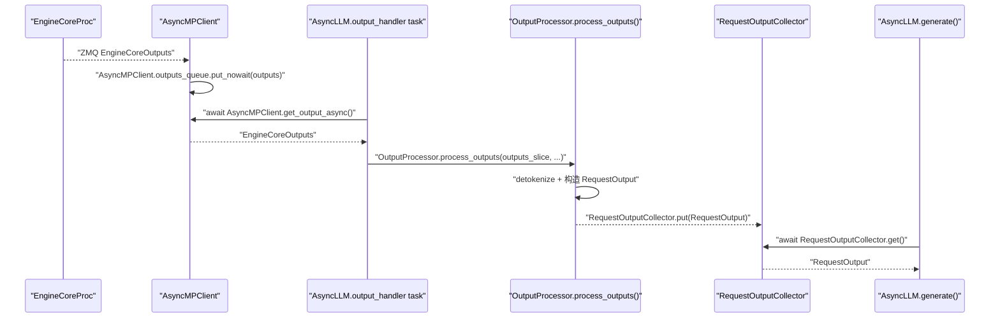

**异步点：**

- `AsyncMPClient` 有独立的 async socket receive task，把 ZMQ 输出放入
  `asyncio.Queue`。
- `output_handler` 是单独的 `asyncio.Task`，它是 `RequestOutput` 的生产者。
- 每个 HTTP 请求对应的 `AsyncLLM.generate()` 是消费者。
- `output_handler` 处理大批输出时会在 chunk 之间 `await asyncio.sleep(0)`，主动让出
  event loop。


### 源码对照：输出队列和 `OutputProcessor.process_outputs()`

这个类是每个请求自己的交接点：`output_handler` 往里 `put()`，对应的 `AsyncLLM.generate()` 从里面 `get()`。

```python
# vllm/v1/engine/output_processor.py
# 说明：每个前端请求对应一个输出收集器，用于 output_handler 和 generate() 交接。
class RequestOutputCollector:
    # 说明：初始化 AsyncLLM 前端对象，并创建输入处理、输出处理和 EngineCore client。
    def __init__(self, output_kind: RequestOutputKind, request_id: str):
        # 说明：DELTA 模式下如果生产者快于消费者，需要合并增量输出。
        self.aggregate = output_kind == RequestOutputKind.DELTA
        # 说明：保存内部 request_id，取消请求时 generate() 会用它 abort。
        self.request_id = request_id
        # 说明：保存当前待消费输出；None 表示消费者需要等待。
        self.output: RequestOutput | PoolingRequestOutput | Exception | None = None
        self.ready = asyncio.Event()  # 生产者 put 后唤醒消费者 get。

    # 说明：output_handler 调用 put() 投递输出。
    def put(self, output: RequestOutput | PoolingRequestOutput | Exception) -> None:
        # 说明：队列为空或要投递异常时，直接覆盖当前槽位。
        if self.output is None or isinstance(output, Exception):
            # 说明：保存待消费输出。
            self.output = output
            # 说明：唤醒正在 await get() 的请求协程。
            self.ready.set()
        # 说明：如果已有 RequestOutput 且新输出也是 RequestOutput，则尝试合并。
        elif isinstance(self.output, RequestOutput) and isinstance(
            output, RequestOutput
        ):
            # 说明：合并输出，避免消费者慢时丢失 delta 或候选结果。
            self.output.add(output, aggregate=self.aggregate)

    # 说明：generate() 调用 get() 等待下一个输出。
    async def get(self) -> RequestOutput | PoolingRequestOutput:
        # 说明：只要还没有生产者投递输出，就继续等待。
        while (output := self.output) is None:
            # 说明：让出 event loop，直到 put() 调用 ready.set()。
            await self.ready.wait()
        # 说明：取走输出后清空槽位。
        self.output = None
        # 说明：重置事件，下一次 get() 可以继续等待新输出。
        self.ready.clear()
        # 说明：如果 output_handler 投递的是异常，就在请求协程中重新抛出。
        if isinstance(output, Exception):
            # 说明：把后台异常传播给 AsyncLLM.generate() 调用方。
            raise output
        # 说明：返回当前阶段整理好的结果，交给上游调用方继续处理。
        return output
```

### 源码对照：`EngineCoreOutput` 转 `RequestOutput`

普通生成请求会先 detokenize，再构造 `CompletionOutput` / `RequestOutput`，最后放入请求队列。

```python
# vllm/v1/engine/output_processor.py
# 说明：遍历 EngineCore 本轮返回的每个请求输出。
for engine_core_output in engine_core_outputs:
    # 说明：取内部 request_id，用于找到前端 RequestState。
    req_id = engine_core_output.request_id
    # 说明：查找请求状态，里面保存 detokenizer、logprobs 和输出队列。
    req_state = self.request_states.get(req_id)
    # 说明：请求可能已经 abort 或清理，过期输出直接忽略。
    if req_state is None:
        # 说明：READY 只是协调消息，不进入 EngineCore.input_queue。
        continue

    # 说明：取本轮新增 token ids，后面会增量 detokenize。
    new_token_ids = engine_core_output.new_token_ids
    # 说明：取 pooling 输出；生成请求这里通常为 None。
    pooling_output = engine_core_output.pooling_output
    # 说明：取后端判断的完成原因。
    finish_reason = engine_core_output.finish_reason
    # 说明：取 stop token/string 等更具体的停止信息。
    stop_reason = engine_core_output.stop_reason

    # 说明：普通生成请求需要走 detokenize；pooling 请求不需要文本解码。
    if pooling_output is None:
        # 说明：生成请求必须已经在 RequestState 里创建 detokenizer。
        assert req_state.detokenizer is not None
        # 说明：生成请求必须有 logprobs processor，即使用户不一定请求 logprobs。
        assert req_state.logprobs_processor is not None
        # token ids -> 文本，并顺便检查 stop string。
        # 说明：把新增 token ids 增量转成文本，并检查 stop string。
        stop_string = req_state.detokenizer.update(
            new_token_ids, finish_reason == FinishReason.STOP
        )
        # 说明：如果前端 detokenizer 检测到 stop string，需要覆盖完成原因。
        if stop_string:
            # 说明：把完成原因改成 STOP，表示由 stop string 触发结束。
            finish_reason = FinishReason.STOP
            # 说明：记录具体命中的 stop string。
            stop_reason = stop_string

        # 说明：同步更新 token logprobs 和累计 logprob。
        req_state.logprobs_processor.update_from_output(engine_core_output)

    # 说明：根据当前请求状态构造 RequestOutput 或 PoolingRequestOutput。
    request_output = req_state.make_request_output(
        new_token_ids,
        pooling_output,
        finish_reason,
        stop_reason,
        engine_core_output.kv_transfer_params,
    )
    # 说明：AsyncLLM 路径有 per-request queue，构造出输出后要投递给 generate()。
    if request_output and req_state.queue is not None:
        req_state.queue.put(request_output)  # 唤醒对应的 AsyncLLM.generate()。
```

## detokenize：token id 如何变成 `output.text`

detokenize 发生在 `OutputProcessor.process_outputs()` 中：

- 根据 `engine_core_output.request_id` 找到对应 `RequestState`。
- 取出 `new_token_ids`、`finish_reason`、`stop_reason`。
- 如果是生成任务而不是 pooling：
  - 调用 `IncrementalDetokenizer.update(new_token_ids, stop_terminated)`（通过 `RequestState.detokenizer` 调用）。
  - `IncrementalDetokenizer.update()` 会把新 token id 增量 decode 到
    `output_text`。
  - 同时检查 stop string；如果命中，会更新 `finish_reason` 和 `stop_reason`。
  - `LogprobsProcessor.update_from_output(...)`（通过 `RequestState.logprobs_processor` 调用） 更新 logprobs。
- 调用 `RequestState.make_request_output(...)` 构造 `RequestOutput`。
- 如果这个请求有 queue，则 `RequestOutputCollector.put(request_output)`（通过 `RequestState.queue` 调用），交给
  `AsyncLLM.generate()`。

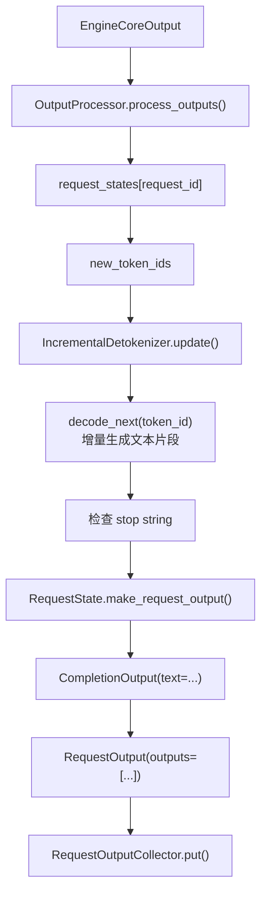

`IncrementalDetokenizer` 有两种主要实现：

- `FastIncrementalDetokenizer`：当 tokenizer 是 `PreTrainedTokenizerFast` 且
  `tokenizers` 版本支持 `DecodeStream` 时使用。它会用 prompt token ids 初始化
  decode stream，然后每来一个 token 调 `stream.step(...)`。
- `SlowIncrementalDetokenizer`：回退路径，内部调用
  `detokenize_incrementally(...)`，维护 `tokens`、`prefix_offset`、`read_offset`。

构造最终文本的接口是：

- `RequestState._new_completion_output()`
- `IncrementalDetokenizer.get_next_output_text(finished, delta)`（通过 `RequestState.detokenizer` 调用）
- 返回 `CompletionOutput(text=text, token_ids=token_ids, ...)`

如果 `output_kind == RequestOutputKind.DELTA`，`text` 是增量文本；否则通常是当前累计文本。


### 源码对照：增量 detokenize 和 `CompletionOutput.text`

`IncrementalDetokenizer.update()` 不重新 decode 全部输出，而是把本轮新增 token id 逐个追加到 `output_text`，再检查 stop string。

```python
# vllm/v1/engine/detokenizer.py
# 说明：增量更新 detokenizer 状态，并返回命中的 stop string。
def update(self, new_token_ids: list[int], stop_terminated: bool) -> str | None:
    # 说明：本轮没有新 token 时，不需要做 detokenize。
    if not new_token_ids:
        # 说明：异常情况下返回 None，让上层把它当作空字符串。
        return None

    # 说明：如果后端因 stop token 结束且用户不想输出 stop token，则跳过最后一个 token 的文本解码。
    if stop_terminated and not self.include_stop_str_in_output:
        # 说明：保存被跳过的 stop token id，后面仍要加入 token_ids 维护计数。
        skipped_stop_token_id = new_token_ids[-1]
        # 说明：从待解码列表里移除 stop token。
        new_token_ids = new_token_ids[:-1]
    else:
        # 说明：没有跳过 stop token 时，用 None 表示无需额外清理。
        skipped_stop_token_id = None

    # 说明：记录本轮新增文本前的位置，stop string 只需检查新增附近。
    stop_check_offset = len(self.output_text)
    # 说明：逐个处理本轮新增 token，保持增量 decode 状态。
    for new_token_id in new_token_ids:
        # 说明：把 token id 追加到完整输出 token 序列。
        self.token_ids.append(new_token_id)
        self.output_text += self.decode_next(new_token_id)  # 增量 decode 一个 token。
        # 说明：min_tokens 约束未满足时，不允许 stop string 提前终止。
        if self.min_tokens and self.num_output_tokens() <= self.min_tokens:
            # 说明：记录本轮新增文本前的位置，stop string 只需检查新增附近。
            stop_check_offset = len(self.output_text)

    # 说明：如果刚才跳过了 stop token 的文本解码，还需要把 id 放回 token 序列。
    if skipped_stop_token_id is not None:
        # 说明：保留 stop token id，保证 token 计数和后端输出一致。
        self.token_ids.append(skipped_stop_token_id)

    # 说明：默认没有命中 stop string。
    stop_string = None
    # 说明：只有配置了 stop string 且超过 min_tokens 后才检查停止条件。
    if self.stop and self.num_output_tokens() > self.min_tokens:
        # 说明：在累计输出文本中查找本轮可能新命中的 stop string。
        stop = check_stop_strings(
            output_text=self.output_text,
            new_char_count=len(self.output_text) - stop_check_offset,
            stop=self.stop,
            include_in_output=self.include_stop_str_in_output,
        )
        # 说明：命中 stop string 时，需要返回 stop 信息并按配置截断文本。
        if stop is not None:
            # 说明：解析命中的 stop string 和需要保留的文本长度。
            stop_string, truncate_to = stop
            # 说明：truncate_to=-1 表示无需截断；否则需要裁掉 stop 后面的内容。
            if truncate_to != -1:
                # 说明：按 stop string 策略截断累计输出文本。
                self.output_text = self.output_text[:truncate_to]

    # 说明：返回命中的 stop string；没有命中则返回 None。
    return stop_string
```

Fast tokenizer 路径通过 `DecodeStream.step(...)` 做单 token decode：

```python
# vllm/v1/engine/detokenizer.py
# 说明：fast tokenizer 路径使用 tokenizers DecodeStream 做增量解码。
class FastIncrementalDetokenizer(BaseIncrementalDetokenizer):
    # 说明：把单个新增 token id 解码成文本片段。
    def decode_next(self, next_token_id: int) -> str:
        # 说明：调用底层 DecodeStream.step，并用保护函数处理异常 token id。
        token = self._protected_step(next_token_id)

        # 说明：如果配置不希望特殊 token 之间自动插空格，需要额外修正。
        if not self.spaces_between_special_tokens:
            # 说明：检查当前 token 是否是 added special token。
            special_token = self.added_token_ids.get(next_token_id)
            # 说明：把查找结果转成布尔状态，后面要记录 last_special。
            is_special = special_token is not None
            # 说明：连续特殊 token 时，避免 tokenizer 自动插入额外空格。
            if is_special and self.last_special:
                # 说明：直接使用特殊 token 原始字符串。
                token = special_token
            # 说明：记录当前 token 是否特殊 token，供下一个 token 判断。
            self.last_special = is_special

        # 说明：底层返回 None 时转成空字符串，保证调用方可以拼接。
        return token or ""

    # 说明：包装 DecodeStream.step，避免异常 token id 直接打断整个输出处理。
    def _protected_step(self, next_token_id: int) -> str | None:
        try:
            # 说明：调用 tokenizers 的增量 decode stream。
            return self.stream.step(self.tokenizer, next_token_id)
        # 说明：处理极少数非法 token id 或底层 tokenizer 类型错误。
        except (OverflowError, TypeError):
            # 说明：记录异常 token id，方便定位模型或采样问题。
            logger.exception("Encountered invalid token id: %r", next_token_id)
            # 说明：异常情况下返回 None，让上层把它当作空字符串。
            return None
```

### 源码对照：`CompletionOutput(text=...)`

`output.text` 真正落到 `CompletionOutput` 是在 `RequestState._new_completion_output()`。API server 后面读取的就是这个字段。

```python
# vllm/v1/engine/output_processor.py
# 说明：把当前 RequestState 转成对外的 CompletionOutput。
def _new_completion_output(
    self,
    token_ids: list[int],
    finish_reason: FinishReason | None,
    stop_reason: int | str | None,
) -> CompletionOutput:
    # 说明：保护内部不变量，避免后续逻辑在非法状态下继续运行。
    assert self.detokenizer is not None
    # 说明：保护内部不变量，避免后续逻辑在非法状态下继续运行。
    assert self.logprobs_processor is not None
    # 说明：只要有 finish_reason，就认为这个候选输出已经结束。
    finished = finish_reason is not None
    # 说明：判断当前输出模式是否只返回增量文本。
    delta = self.output_kind == RequestOutputKind.DELTA

    # 说明：从 detokenizer 获取本次应该暴露给用户的文本。
    text = self.detokenizer.get_next_output_text(finished, delta)
    # 说明：非 delta 模式需要返回完整 token ids 和累计文本。
    if not delta:
        # 说明：用 detokenizer 维护的完整输出 token ids 覆盖本轮新增 ids。
        token_ids = self.detokenizer.output_token_ids

    # 说明：构造 API server 最终消费的单个候选输出对象。
    return CompletionOutput(
        # 说明：标记当前候选在 n 个输出中的下标。
        index=self.request_index,
        text=text,  # demo server 最后读取的就是 output.text。
        # 说明：保存对应的输出 token ids。
        token_ids=token_ids,
        # 说明：携带 token 级 logprobs；未请求时通常为空或 None。
        logprobs=self.logprobs_processor.logprobs,
        # 说明：携带累计 logprob，方便排序或调试采样结果。
        cumulative_logprob=self.logprobs_processor.cumulative_logprob,
        # 说明：完成时把 FinishReason 转成字符串；未完成则为 None。
        finish_reason=str(finish_reason) if finished else None,
        # 说明：完成时携带具体停止原因；未完成不暴露。
        stop_reason=stop_reason if finished else None,
    )
```

## 返回 HTTP 响应

当 `RequestOutputCollector.put()` 被调用后，等待中的 `AsyncLLM.generate()` 会继续：

- `RequestOutputCollector.get_nowait()` 或 `await RequestOutputCollector.get()` 取得 `RequestOutput`。
- `finished = out.finished`。
- `yield out` 给 API server。

API server 再按 streaming / non-streaming 两种模式返回。

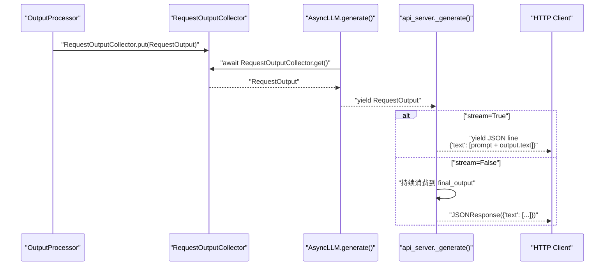

这里要注意 demo server 的返回文本不是裸生成文本，而是：

```python
# 说明：把原始 prompt 和生成文本拼接成 demo API 返回格式。
text_outputs = [prompt + output.text for output in request_output.outputs]
```

也就是说，`output.text` 是 detokenizer 得到的模型输出部分；HTTP 返回里的字符串会再拼上
原始 prompt。


## 全链路时序图

下面把主链路压到一张图里，方便复习。

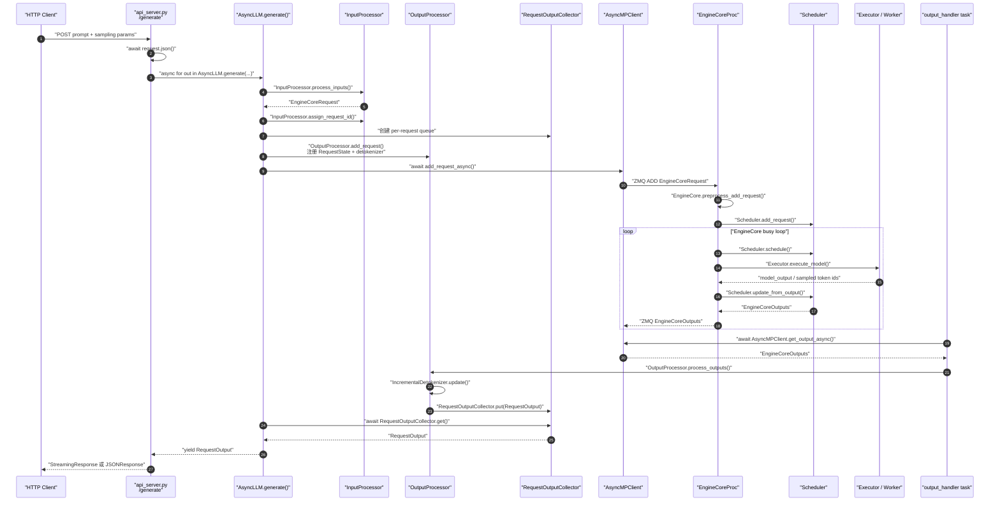

## 关键类和接口速查

| 阶段 | 类 / 函数 | 文件 | 职责 |
| --- | --- | --- | --- |
| HTTP 入口 | `generate()` / `_generate()` | `vllm/entrypoints/api_server.py` | 解析 JSON，构造 `SamplingParams`，调用 `AsyncLLM.generate()`，返回 streaming 或 final JSON |
| 引擎别名 | `AsyncLLMEngine = AsyncLLM` | `vllm/engine/async_llm_engine.py` | 兼容旧导入路径，实际进入 V1 `AsyncLLM` |
| 异步前端 | `AsyncLLM.generate()` | `vllm/v1/engine/async_llm.py` | 每请求 async generator，等待队列并 yield `RequestOutput` |
| 输入处理 | `InputProcessor.process_inputs()` | `vllm/v1/engine/input_processor.py` | prompt/token/多模态输入标准化，构造 `EngineCoreRequest` |
| 请求注册 | `OutputProcessor.add_request()` | `vllm/v1/engine/output_processor.py` | 创建 `RequestState`、`IncrementalDetokenizer` 和输出队列映射 |
| 前后端通信 | `AsyncMPClient.add_request_async()` | `vllm/v1/engine/core_client.py` | 设置 `client_index`，发起 ADD 请求发送 |
| ADD 消息封装 | `AsyncMPClient._send_input()` / `_send_input_message()` | `vllm/v1/engine/core_client.py` | msgpack 编码 `EngineCoreRequest`，通过 `input_socket.send_multipart()` 发给 `EngineCoreProc` |
| 后台引擎 | `EngineCoreProc` / `EngineCore.run_busy_loop()` | `vllm/v1/engine/core.py` | 接收请求、驱动 scheduler 和 model executor |
| 单步执行 | `EngineCore.step()` | `vllm/v1/engine/core.py` | schedule、execute model、sample token、生成 `EngineCoreOutputs` |
| 输出处理 | `AsyncLLM._run_output_handler()` | `vllm/v1/engine/async_llm.py` | 后台 task，持续拉 `EngineCoreOutputs` 并交给 `OutputProcessor` |
| detokenize | `IncrementalDetokenizer.update()` | `vllm/v1/engine/detokenizer.py` | 把 `new_token_ids` 增量 decode 成文本，并检查 stop string |
| 最终对象 | `RequestOutput` / `CompletionOutput` | `vllm/outputs.py` | API server 消费的生成结果对象 |

## 异步边界总结

- **HTTP 层异步**：FastAPI handler 是 async，`await request.json()` 和后续
  streaming response 都在 event loop 中运行。
- **请求生成异步**：`AsyncLLM.generate()` 是 async generator；API server 用
  `async for` 消费它。
- **前后端通信异步**：`AsyncMPClient` 使用 `zmq.asyncio`，请求通过
  `add_request_async()` 发给后台进程，输出通过 async socket task 放入
  `asyncio.Queue`。
- **输出处理异步**：`AsyncLLM._run_output_handler()` 是后台 `asyncio.Task`，它和每个
  请求的 `generate()` 协程通过 `RequestOutputCollector` 交接结果。
- **EngineCore 执行并非前端 await 直接执行**：真正的 schedule / model forward 在
  后台 `EngineCoreProc` busy loop 中推进，前端只是发送请求并异步等待输出。
- **取消路径是异步传播的**：客户端断开或 generator 被取消后，
  `AsyncLLM.generate()` 会调用 `abort()`，再通过 `AsyncMPClient.abort_requests_async()`
  通知后端停止对应请求。

## 一句话心智模型

一个 `/generate` 请求进入 FastAPI 后，API server 先把 JSON 转成
`SamplingParams`，再通过 `AsyncLLM.generate()` 把 prompt 处理成
`EngineCoreRequest` 并发给后台 `EngineCore`；`EngineCore` 在自己的 busy loop 中
调度和执行模型，产出 `new_token_ids`；前端的 `output_handler` 把这些 token id
增量 detokenize 成 `RequestOutput.outputs[*].text`，放入请求队列；最后
API server 的 `async for` 取出这些 `RequestOutput`，以流式或非流式 HTTP 响应返回。

## 后续可以继续看的点

这篇文章只是把一条在线推理主链路串起来。真正影响性能和行为的细节，还藏在几个更深的模块里：

- `Scheduler` 如何在 prefill、decode、抢占和 KV cache 约束之间做取舍。
- KV cache block 如何分配、复用和释放。
- `Executor`、`Worker`、`ModelRunner` 之间如何组织真正的 GPU forward。
- 流式输出、stop string、取消请求在高并发下如何相互配合。
- disaggregated prefill 和 data parallel 打开后，这条链路会被拆成什么形状。

如果把本文当作地图，那么后面这些模块就是可以继续放大的局部区域。
