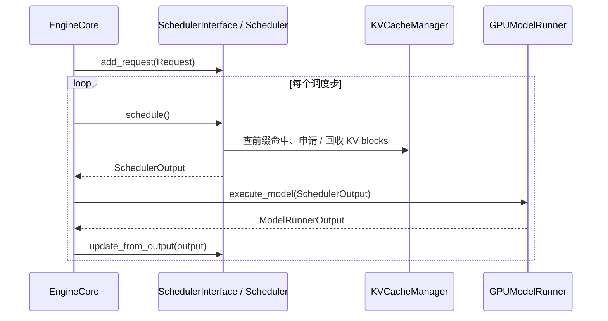
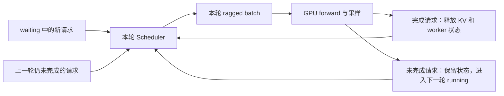
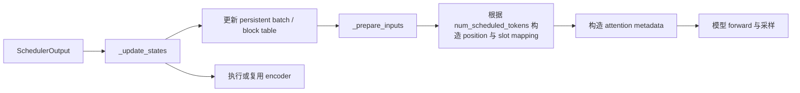
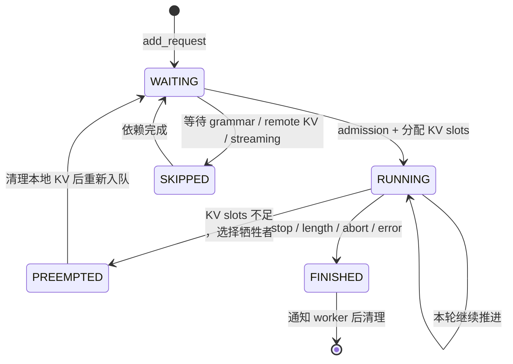
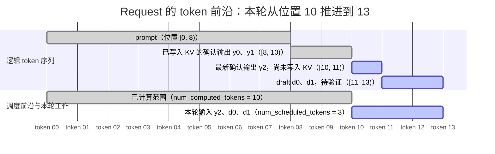

# vLLM V1 Scheduler：从请求状态到一次 forward 的调度决策

> 源码基线：`vllm/vllm/v1/core/sched/`。本文对应 V1 调度器；不同 commit 的字段名和少量分支可能变化。

## 核心模型

调度器并不把请求硬分成「prefill 队列」和「decode 队列」。它维护每个 `Request` 的**计算前沿**：本轮从哪里开始、最多推进多少 token、KV cache 是否够用、是否需先运行 encoder，以及应把怎样的批次描述交给 worker。

### 先把 $C$ 讲清楚：它是 KV 计算前沿，不是输出 token 数

令 $C = \texttt{num\_computed\_tokens}$。它的准确含义是：**逻辑 token 区间 $[0, C)$ 的 KV 已可供下一次 attention 读取，因此 target model 本轮无需重新计算这些位置**。这批 KV 既可能由该请求先前的 forward 写入，也可能来自 local prefix cache 或 KV connector 的远端命中。

- $C$ 不是 `num_output_tokens`，也不是「已经采样给用户的 token 数」。最新采样 token 已经属于 `_all_token_ids`，但要到下一次 decode 才作为模型输入写入 KV。
- 因而普通同步自回归生成在「收到本轮采样结果、下一轮尚未开始」的观察点，通常满足 $C = \texttt{num\_tokens} - 1$；唯一落后的一格就是最新采样 token。
- `SchedulerOutput` 记录本轮 forward **开始前** 的 $C$ 交给 worker；随后 `_update_after_schedule()` 才乐观把 scheduler 内部的 $C$ 加上 `num_scheduled_tokens`。这两个时刻的值不能混在一起。
- async scheduling 或一次产生多个 token 的路径中，未进入 KV 前沿的 token 可能不只一个；此时 `num_output_placeholders` 记录尚未回收的欠账。
- P/D 的远端 KV load 是一个额外例外：scheduler 可能先用 $C$ 记录「远端已计算到哪里」，但请求仍处于 `WAITING_FOR_REMOTE_KVS`，直到 connector 确认 KV 可读才能真正执行 attention。

设本轮开始时的前沿为 $C$，本轮主模型应追上的已知 token 序列长度为 $T$。调度器的目标是：

$$
C \longrightarrow \min(T, C + B_{\text{req}})
$$

$B_{\text{req}}$ 受全局 token 预算、模型最大长度、KV block、encoder 预算和扩展功能共同限制。投机解码时，$T$ 还包含 draft token，因而不是固定的 prompt 长度。



`schedule()` 描述的是**即将执行的 forward**；`update_from_output()` 才依据采样结果、投机 token 的接受数和 stop 条件把请求状态变成下一轮的真实状态。

## 从静态批处理到连续批处理

### 连续批处理解决什么问题

LLM 服务不能像训练那样等一组请求都完成后再换下一组：每个请求的 prompt 长度和输出长度不同，某个请求生成完之前，GPU 仍应继续处理其它请求。**连续批处理（continuous batching）** 的定义是：每一次 forward 结束后，都允许 batch 中结束的请求离开、waiting 请求进入、原有请求继续生成；batch 的成员随调度步持续变化。

| 模式 | batch 成员何时改变 | 空闲来源 | 对在线推理的结果 |
| --- | --- | --- | --- |
| 静态批处理 | 等整批所有请求完成后。 | 短请求已结束，但仍要等待长请求。 | 容易浪费 GPU，也会让后到短请求排队。 |
| 连续批处理 | 每一次 forward 后。 | 只剩本轮暂时无法调度的请求或资源不足。 | 已完成请求立即释放 KV / batch 槽位，waiting 请求可在下一步补入。 |
| 连续批处理 + chunked prefill | 每一次 forward 后，且长 prompt 只推进一段。 | 长 prompt 不再一次吞掉全部 token 预算。 | decode 与部分 prefill 能混在同一个 forward 中，平衡 TTFT、ITL 与吞吐。 |



连续批处理不是「每轮重新组一个完全不同的 batch」，而是**对长期存活请求做增量更新**。这正是 `scheduled_new_reqs` 与 `scheduled_cached_reqs` 分开的原因：worker 的 persistent batch 保留大多数未结束请求的状态和 block table，只同步新增、恢复、完成或 block id 变化的差量。`docs/design/model_runner_v2.md` 说明，V1 的 persistent batch 正是为了避免每一步在 Python 里从零构造 block table 等大 tensor。

### prefill、decode 与 chunked prefill 的资源形状

- **prefill** 同时处理一段长 prompt，通常计算密集（compute-bound）；若让一个超长 prompt 独占 batch，会拖慢其他请求下一 token 的返回。
- **decode** 每个活跃请求每轮通常只处理一个已知 token，计算量小但需要读取很长的 KV cache，通常更接近内存带宽受限（memory-bound）。
- **chunked prefill** 把长 prompt 切成若干连续片段；剩余 token 预算再填入 prefill chunk，使 decode 与 prefill 可以共存。它不改变 token 顺序，而是把同一请求的 $[C, T)$ 拆到多个调度步推进。

官方 `docs/configuration/optimization.md` 将 V1 的公开策略概括为：启用 chunked prefill 时优先照顾 pending decode，再用 `max_num_batched_tokens` 的余量调度 prefill；放不下的 prompt 自动分块。这与本文随后从源码得到的「统一前沿」模型不矛盾：代码中没有固定的 `PrefillPhase` / `DecodePhase` 枚举，而是通过每个请求距前沿的欠账大小和队列顺序实现这个偏好。

### 一个预算参数如何改变 TTFT 与 ITL

这里的全局 token 预算在 V1 scheduler 中对应 `max_num_scheduled_tokens`；它受配置中的 `max_num_batched_tokens` 控制。它回答的是：**一个 forward 最多接收多少个 query token**，不是单请求最大生成长度。

| 预算取向 | 调度行为 | 主要收益 | 主要代价 |
| --- | --- | --- | --- |
| 较小 | 少给 prefill chunk 留空间，尽快完成 decode。 | 较好的 ITL（相邻输出 token 延迟）。 | 新请求 TTFT 增大。 |
| 较大 | 单步吞入更多 prefill token。 | 较好的 TTFT，通常也有更高吞吐。 | prefill 更容易干扰 decode，尾部 ITL 变差。 |

这也是 P/D 分离存在的系统层原因：官方 `docs/features/disagg_prefill.md` 指出，分离 prefill 与 decode 可以独立调 TTFT / ITL，并控制混合 prefill 带来的尾部 ITL；但它**不等价于提高总吞吐**。后续的 connector 章节只讨论这种选择落到 scheduler 后，如何变成远端 KV 的等待与分配判断。

### 本文采用的官方文档参考

本节依据以下仓库内文档重新组织、翻译和结合源码解释，未直接复制原文：

| 文档 | 本文吸收的内容 |
| --- | --- |
| `docs/configuration/optimization.md` 的 “Chunked Prefill” | decode / prefill 混批、`max_num_batched_tokens` 对 TTFT 与 ITL 的取舍。 |
| `docs/serving/offline_inference.md` | 连续批处理持续填满 replica、提高 GPU 利用率的服务动机。 |
| `docs/design/model_runner_v2.md` 的 persistent batch 说明 | 为什么 worker 使用增量更新而不是每步重建 batch。 |
| `docs/features/disagg_prefill.md` | P/D 分离用于隔离 TTFT 与 ITL 的动机和吞吐边界。 |
| `docs/design/prefix_caching.md` | 新 / running 请求分别怎样调用 `get_computed_blocks()` 与 `allocate_slots()`。 |

## 对外接口与 Facade 边界

### 三层边界

这里不是只有一个传统 GoF Facade 类。按源码分层，下面的说法更准确：

| 边界 | 源码位置 | 职责 |
| --- | --- | --- |
| `EngineCore` | `vllm/v1/engine/core.py` | 编排一次完整循环：`schedule -> execute_model -> update_from_output`，隔离上层 engine 与 worker 执行细节。 |
| `SchedulerInterface` | `vllm/v1/core/sched/interface.py` | scheduler 的稳定抽象接口；具体实现由 `scheduler_config.get_scheduler_cls()` 选择。它是 engine 面对的调度门面 / 策略接口。 |
| `SchedulerOutput` | `vllm/v1/core/sched/output.py` | scheduler 到 worker 的数据传输契约（DTO）。worker 不读 scheduler 的队列或 KV 管理器内部状态。 |

`EngineCore.__init__()` 从 `scheduler_config.get_scheduler_cls()` 取得实现类，并以 `SchedulerInterface` 类型保存。默认是 `Scheduler`；`AsyncScheduler` 继承它，仅改变异步场景所需的状态推进等语义。调用方只依赖下列接口：

```python
# vllm/v1/core/sched/interface.py（接口语义摘录）
scheduler.add_request(request)
scheduler_output = scheduler.schedule()
grammar_output = scheduler.get_grammar_bitmask(scheduler_output)
outputs = scheduler.update_from_output(scheduler_output, model_runner_output)
scheduler.finish_requests(request_ids, finished_status)
```

`EngineCore.step()` 正是按这个顺序调用。`get_grammar_bitmask()` 是结构化输出的补充输入，不是另一次调度。

### 交给调度器的对象：`Request`

上游先提交 `EngineCoreRequest`，scheduler 通过 `Request.from_engine_core_request(...)` 把它变成内部可变的 `Request`。前者是跨层请求描述，后者才是调度状态机实体。

下面是 `vllm/v1/request.py: Request.__init__()` 中与调度直接相关的成员摘录。保留字段类型和初始化顺序，并补充中文注释；不是重新设计的伪代码。

```python
# ---------- 身份、排队与结束状态 ----------
self.request_id = request_id  # 连接 scheduler、worker 与输出的全局键。
self.client_index = client_index  # 多前端场景下，结果应回传给哪个 client。
self.priority = priority  # priority 队列的第一比较键，数值越小优先级越高。
self.arrival_time = arrival_time if arrival_time is not None else time.time()
self.status = RequestStatus.WAITING  # 初始状态；结构化输出请求会在下方改为等待 grammar。
self.events: list[EngineCoreEvent] = []  # 记录入队、调度、抢占等生命周期事件。
self.stop_reason: int | str | None = None  # 保存 stop token 或外部停止原因。

# ---------- 用户参数与扩展约束 ----------
self.sampling_params = sampling_params  # 生成请求的采样、max_tokens、额外参数等。
self.pooling_params = pooling_params  # pooling 请求不走常规自回归生成。
self.lora_request = lora_request  # admission 时要满足同批 LoRA 数量限制。
self.structured_output_request = StructuredOutputRequest.from_sampling_params(
    sampling_params
)  # 从采样参数派生 grammar 约束。
self.kv_transfer_params: dict[str, Any] | None = None  # P/D connector 的请求级传输参数。

if pooling_params is not None:
    self.max_tokens = 1  # pooling 得到一次输出后即可结束。
elif sampling_params is not None:
    assert sampling_params.max_tokens is not None
    self.max_tokens = sampling_params.max_tokens  # 用户允许生成的最大输出 token 数。
    if self.structured_output_request is not None:
        self.status = RequestStatus.WAITING_FOR_STRUCTURED_OUTPUT_GRAMMAR
    if sampling_params.extra_args is not None:
        self.kv_transfer_params = sampling_params.extra_args.get(
            "kv_transfer_params"
        )  # connector 用它区分远端 KV 的 load / save 策略。

# ---------- 逻辑 token 序列 ----------
self.prompt_token_ids = prompt_token_ids  # 文本 prompt；使用 prompt embeds 时可以为 None。
self.prompt_embeds = prompt_embeds  # embedding prompt，与 token ids 可混合。
self.num_prompt_tokens = length_from_prompt_token_ids_or_embeds(
    prompt_token_ids, prompt_embeds
)  # prompt 的逻辑长度，后续用于长度上界和多模态位置判断。
self._output_token_ids: list[int] = []  # 仅保存已确认、会返回给用户的输出。
self._all_token_ids: list[int] = (
    self.prompt_token_ids.copy()
    if self.prompt_token_ids is not None
    else [0] * self.num_prompt_tokens
)  # 保存 prompt + 已确认输出；没有 ids 的 embed 位置以占位值维持长度。

# ---------- 调度计算前沿 ----------
self.spec_token_ids: list[int] = []  # 尚待主模型验证的 draft token，不属于最终输出。
self.num_computed_tokens = 0  # 已可复用 KV 或被本轮乐观预留到的逻辑前沿。
self.num_output_placeholders = 0  # async 下尚未回收的输出 / draft 占位数。
self.next_decode_eligible_step = 0  # V2 + PP + async 下同请求下一次可 decode 的调度步。
self.is_prefill_chunk = False  # True 表示本次调度后仍有 prompt / 已知 token 未计算。

# ---------- KV cache 与多模态 ----------
self.cache_salt: str | None = cache_salt  # 为 prefix cache hash 加盐，隔离不可共享上下文。
self.mm_features = mm_features or []  # 每个 feature 带有其在 decoder 序列中的位置。
self.block_hashes: list[BlockHash] = []  # 所有完整逻辑 block 的 hash，用于 prefix cache 查找。
self._block_hasher = block_hasher  # 把 token 序列转换为 block hash 的函数。
self.update_block_hashes()  # 初始化时即生成当前完整 prompt blocks 的 hash。
self.skip_reading_prefix_cache = self.get_skip_reading_prefix_cache()
self.num_preemptions = 0  # 统计并标记这个请求是否经历过抢占。
```

| 类别 | 关键字段 / 属性 | 调度器如何使用 |
| --- | --- | --- |
| 身份与顺序 | `request_id`、`client_index`、`arrival_time`、`priority` | 维护 `requests` 字典；FCFS / priority 队列排序；将结果回给发起 client。 |
| 输入与长度 | `prompt_token_ids`、`prompt_embeds`、`num_prompt_tokens`、`_all_token_ids`、`num_tokens` | 决定 prompt、完整上下文长度和可计算 token 来源。`_all_token_ids = prompt + 已确认输出`。 |
| 生成限制 | `sampling_params`、`pooling_params`、`max_tokens` | 影响采样、停止判断和最大输出长度；pooling 请求的 `max_tokens` 为 1。 |
| 调度前沿 | `num_computed_tokens`、`spec_token_ids`、`num_tokens_with_spec` | 最关键的一组：决定主模型还欠多少计算。 |
| 生命周期 | `status`、`num_preemptions`、`is_prefill_chunk` | 控制请求所在队列、是否抢占以及是否仍处于 chunked prefill。 |
| KV / 前缀缓存 | `block_hashes`、`cache_salt`、`skip_reading_prefix_cache` | block hash 用于 prefix hit；salt 避免不该共享的请求共享；最后一个字段可禁止读取前缀缓存。 |
| 多模态 | `mm_features`、`has_encoder_inputs`、`get_num_encoder_embeds()` | 判断本轮 token 区间是否跨 feature，并消耗 encoder 的计算与缓存预算。 |
| 投机与异步 | `spec_token_ids`、`num_output_placeholders`、`next_decode_eligible_step` | draft token 扩展本轮目标长度；异步模式使用 placeholder 乐观推进；PP + async 还限制下一次 decode 时机。 |
| 其他约束 | `lora_request`、`structured_output_request`、`kv_transfer_params`、`resumable` | 分别限制 LoRA 批次、等待 grammar、触发 P/D KV transfer，以及支持流式会话重新入队。 |

三个长度属性是源码中的真实 property，正是前沿模型的定义：

```python
@property
def num_tokens(self) -> int:
    return len(self._all_token_ids)  # prompt 与已确认输出的逻辑总长度。

@property
def num_tokens_with_spec(self) -> int:
    # draft token 也需要被 target model 验证，故本轮目标长度要包含它们。
    return len(self._all_token_ids) + len(self.spec_token_ids)

@property
def num_output_tokens(self) -> int:
    return len(self._output_token_ids)  # 仅统计已确认、可交付给用户的输出。
```

`_all_token_ids` 只含 prompt 和已被接受的输出；`spec_token_ids` 是尚待主模型验证的 draft token。

### `SchedulerInterface` 的重要操作

| 接口 | 用途 | 对状态的影响 |
| --- | --- | --- |
| `add_request(request)` | 接收新请求。 | 写入 `requests`，按状态进入 `waiting` 或 `skipped_waiting`。 |
| `schedule()` | 选择本轮运行请求并预留资源。 | 分配 block、可能抢占请求，并构造 `SchedulerOutput`。 |
| `update_from_output(...)` | 消费 worker 的真实结果。 | 追加输出、纠正被拒绝 draft、检查 stop、释放完成请求的资源。 |
| `finish_requests(...)` | 处理客户端 abort 或前端检测的 stop string。 | 释放 KV / encoder 资源，随后用 `finished_req_ids` 通知 worker 清理本地状态。 |
| `get_grammar_bitmask(...)` | 为结构化输出生成 grammar mask。 | 不改 token 预算；为 worker 的采样提供允许 token 集合。 |
| `reset_prefix_cache()` / `reset_encoder_cache()` | 权重热更新等缓存失效场景。 | 前者可能需先抢占 running 请求；后者清空 encoder 输出复用。 |

源码中的抽象方法原型如下。`SchedulerInterface` 只定义契约；`Scheduler` / `AsyncScheduler` 负责具体状态变化。

```python
class SchedulerInterface(ABC):
    @abstractmethod
    def schedule(self) -> "SchedulerOutput":
        # 一次调用恰好描述一次模型 forward；返回本批的请求与 token 布局。
        raise NotImplementedError

    @abstractmethod
    def get_grammar_bitmask(
        self, scheduler_output: "SchedulerOutput"
    ) -> "GrammarOutput | None":
        # 根据刚刚调度的请求计算结构化输出的 token 可选掩码。
        raise NotImplementedError

    @abstractmethod
    def update_from_output(
        self,
        scheduler_output: "SchedulerOutput",
        model_runner_output: "ModelRunnerOutput",
    ) -> dict[int, "EngineCoreOutputs"]:
        # 消费真实 forward / sample 结果，更新请求并按 client_index 组织输出。
        raise NotImplementedError

    @abstractmethod
    def update_draft_token_ids(self, draft_token_ids: "DraftTokenIds") -> None:
        # 将 proposer 产生的 draft 写回 Request；必要时通过 grammar 校验。
        raise NotImplementedError

    @abstractmethod
    def add_request(self, request: "Request") -> None:
        # 加入内部请求表与等待队列，不会立即执行 forward。
        raise NotImplementedError

    @abstractmethod
    def finish_requests(
        self,
        request_ids: str | Iterable[str] | None,
        finished_status: "RequestStatus",
    ) -> list[tuple[str, int]]:
        # abort / 前端 stop 时终止请求；返回被终止请求及其 client 索引。
        raise NotImplementedError

    @abstractmethod
    def reset_prefix_cache(
        self,
        reset_running_requests: bool = False,
        reset_connector: bool = False,
    ) -> bool:
        # 热更新权重等场景下失效 prefix cache；可选择先抢占 running 请求。
        raise NotImplementedError

    @abstractmethod
    def reset_encoder_cache(self) -> None:
        # 失效多模态 encoder 输出，避免复用旧权重产生的 embedding。
        raise NotImplementedError
```

## 调度结果：`SchedulerOutput` 怎样指导 worker 执行

`SchedulerOutput` 不只是「选中了哪些 request」，还携带请求增量、token 形状、缓存布局和跨组件清理信号。

| 字段 | 含义 | worker 中的用途 |
| --- | --- | --- |
| `scheduled_new_reqs: list[NewRequestData]` | 首次进入 worker 的完整请求数据。 | 新建 `CachedRequestState` 与 persistent batch 条目，初始化 prompt、采样参数、block table、LoRA。 |
| `scheduled_cached_reqs: CachedRequestData` | 已在 worker 缓存过的请求增量。 | 更新 block id、`num_computed_tokens`、输出长度；`resumed_req_ids` 表示以新 blocks 替换旧 blocks。 |
| `num_scheduled_tokens: dict[str, int]` | 每个请求本轮送入主模型的 query token 数。 | 决定 query length、position、slot mapping、attention metadata。 |
| `total_num_scheduled_tokens` | 上一字段之和。 | 决定扁平化 batch 输入大小；为 0 时通常没有主模型 forward。 |
| `scheduled_spec_decode_tokens` | 随主模型验证的 draft token。 | 生成 speculative metadata，之后按接受数修正前沿。 |
| `scheduled_encoder_inputs` | 本轮需执行 encoder 的多模态输入下标。 | 在主模型前运行 encoder 或复用 encoder cache。 |
| `num_common_prefix_blocks` | 各 KV group 的公共前缀 block 数。 | cascade attention 的优化输入。 |
| `finished_req_ids`、`free_encoder_mm_hashes` | 已结束请求与待释放 encoder 输出。 | 删除 worker 的 requests / persistent batch 状态，并释放 encoder cache。 |
| `preempted_req_ids`、`new_block_ids_to_zero` | 抢占信息与新分配物理 KV blocks。 | 后者在使用前清零，避免旧数据或 NaN 进入 attention。 |
| `kv_connector_metadata` / `ec_connector_metadata` | P/D 或外部缓存连接器的本轮操作描述。 | worker 绑定 metadata，执行 KV / encoder cache 的 load、save、完成通知。 |

下面是 `vllm/v1/core/sched/output.py` 中 `SchedulerOutput` 的字段定义。这个类是 worker 的输入协议，字段本身比调度算法的局部变量更稳定，值得逐项阅读。

```python
@dataclass
class SchedulerOutput:
    # 首次进入 worker 的请求；携带 prompt、采样参数、完整初始 block ids 等。
    scheduled_new_reqs: list[NewRequestData]
    # 已在 worker 建立状态的请求；只传本步发生的增量。
    scheduled_cached_reqs: CachedRequestData

    # req_id -> 本轮主模型实际处理的 query token 数。
    num_scheduled_tokens: dict[str, int]
    # 等于 sum(num_scheduled_tokens.values())，决定扁平化输入 batch 的总长度。
    total_num_scheduled_tokens: int
    # req_id -> 本轮由 target model 验证的 draft token ids；无 draft 的请求不出现。
    scheduled_spec_decode_tokens: dict[str, list[int]]
    # req_id -> 本轮要执行 encoder 的 multimodal feature 下标。
    scheduled_encoder_inputs: dict[str, list[int]]
    # 每个 KV cache group 的公共前缀 block 数，供 cascade attention 使用。
    num_common_prefix_blocks: list[int]

    # 上轮之后、当前轮之前结束的请求；worker 看到后删除 persistent state。
    finished_req_ids: set[str]
    # 应从 worker encoder cache 删除的 multimodal feature hash。
    free_encoder_mm_hashes: list[str]

    # 本轮抢占的请求；当前主要供 V2 model runner 使用。
    preempted_req_ids: set[str] | None = None
    # async scheduling 下，本批是否含结构化输出请求。
    has_structured_output_requests: bool = False
    # 是否需要等待本批 output token 齐备后才能计算 grammar bitmask。
    pending_structured_output_tokens: bool = False
    # ngram 等 proposer 发现无效 draft 后，用于校正接受率统计。
    num_invalid_spec_tokens: dict[str, int] | None = None

    # KV P/D connector 的本步 load / save / 完成等元数据。
    kv_connector_metadata: KVConnectorMetadata | None = None
    # encoder cache connector 的对应元数据。
    ec_connector_metadata: ECConnectorMetadata | None = None
    # 本步刚从 block pool 取得的物理 block id；worker 必须先清零。
    new_block_ids_to_zero: list[int] | None = None
    # 动态投机解码为下一步选出的 draft token 数 K。
    num_spec_tokens_to_schedule: int = 0
```

### 为什么区分新请求与旧请求

`NewRequestData.from_request()` 发送 prompt、multimodal features、采样参数、LoRA 和完整 block id；worker 据此建立持久 `CachedRequestState`。之后同一请求只用 `CachedRequestData` 发送变更，避免每步重传大段 prompt。

`GPUModelRunner.execute_model()` 的前半段可概括为：



worker 会把每请求 token 数展平。例如 `[2, 5, 3]` 变成 request index `[0, 0, 1, 1, 1, 1, 1, 2, 2, 2]`，再按：

$$
\text{position}[i] = \text{num\_computed\_tokens}[\text{req}(i)] + \text{query\_offset}(i)
$$

构造 position、KV slot mapping 和 query length。调度结果不仅决定「谁运行」，还精确决定「每个 token 写哪个 KV slot、在 attention 中处于哪个位置」。

worker 的 `_update_states()` 先消费清理信号，再把新请求建立成持久状态。以下摘录解释了为什么 `finished_req_ids`、`scheduled_new_reqs` 和 `scheduled_cached_reqs` 都必须出现在 `SchedulerOutput` 中：

```python
def _update_states(self, scheduler_output: "SchedulerOutput") -> Callable | None:
    # 先清除 scheduler 已经结束的请求，避免 persistent batch 留下无效条目。
    for req_id in scheduler_output.finished_req_ids:
        self.requests.pop(req_id, None)
        self.num_prompt_logprobs.pop(req_id, None)
        self.input_batch.remove_request(req_id)

    if scheduler_output.new_block_ids_to_zero:
        # 新 KV block 可能残留旧数据或 NaN，必须在 attention 使用前清零。
        self._zero_block_ids(scheduler_output.new_block_ids_to_zero)

    for mm_hash in scheduler_output.free_encoder_mm_hashes:
        self.encoder_cache.pop(mm_hash, None)  # 回收不再引用的 encoder 输出。

    scheduled_req_ids = scheduler_output.num_scheduled_tokens.keys()
    resumed_req_ids = scheduler_output.scheduled_cached_reqs.resumed_req_ids
    # 不在本批的旧请求从 persistent batch 移除；其 scheduler 状态仍可保留。
    unscheduled_req_ids = (
        self.input_batch.req_id_to_index.keys()
        - (scheduled_req_ids - resumed_req_ids)
    )
    for req_id in unscheduled_req_ids:
        self.input_batch.remove_request(req_id)

    for new_req_data in scheduler_output.scheduled_new_reqs:
        # 新请求的完整数据被一次性转成 worker 侧 CachedRequestState。
        req_state = CachedRequestState(
            req_id=new_req_data.req_id,
            prompt_token_ids=new_req_data.prompt_token_ids,
            prompt_embeds=new_req_data.prompt_embeds,
            prompt_is_token_ids=new_req_data.prompt_is_token_ids,
            mm_features=new_req_data.mm_features,
            sampling_params=new_req_data.sampling_params,
            pooling_params=new_req_data.pooling_params,
            generator=generator,
            block_ids=new_req_data.block_ids,
            num_computed_tokens=new_req_data.num_computed_tokens,
            output_token_ids=[],
            lora_request=new_req_data.lora_request,
        )
        self.requests[new_req_data.req_id] = req_state
```

## 调度模型：队列、状态与优先级

### 三个队列与一个总表

| 容器 | 类型 | 保存什么 | 调度顺序 |
| --- | --- | --- | --- |
| `requests` | `dict[str, Request]` | 所有未完全清理请求的权威索引。 | 不是直接调度队列。 |
| `running` | `list[Request]` | 已获得运行资格和 KV 状态的活跃请求。 | 每轮**先**扫描。 |
| `waiting` | `RequestQueue` | 可立即尝试 admission 的新请求或被抢占请求。 | running 之后扫描。 |
| `skipped_waiting` | `RequestQueue` | 暂时不能 admission 的请求。 | 例如等 grammar、远端 KV load、下一段 streaming 输入；条件满足后才会 promote。 |

`RequestQueue` 会按策略选择实现：FCFS 用双端队列，priority 用堆。priority 越小越优先，比较键为 `(priority, arrival_time, request_id)`。



严格说，`PREEMPTED` 是状态而非独立队列：`_preempt_request()` 释放 KV / encoder 状态，把 `num_computed_tokens` 归零（之后可能借 prefix cache 重建），清空 draft token，并将请求放回 `waiting` 队首。

### 每轮的优先顺序

`schedule()` 的执行顺序是 `running` 推进、`waiting` admission、输出封装三段真实控制流。下面按源码顺序完整解读；每个代码块保留原语句，并用紧邻中文注释说明条件、变量与状态写回。

`running` 优先的原因是：普通 decode 的欠账通常只有一个 token，先混入 batch 能改善 ITL；长 prefill 则通过 `long_prefill_token_threshold` 与全局 `token_budget` 被切块，不能独占 batch。实际控制流是：`running` 推进（KV 不足时可能抢占）→ 无抢占且未暂停时接纳 `waiting` → 封装输出 → 乐观推进本地前沿。


## KV cache：调度器使用哪些接口

本文暂不展开 `BlockPool`、哈希和不同 attention spec 的内部实现。先建立调度层所需的 block 模型。

### KV block 的基本思想

KV cache 按固定 token 数的 **block** 分配，不按「整个请求」连续分配。请求维护逻辑位置到物理 `block_id` 的映射；共享 prompt 前缀的请求可指向同一批已缓存 block。

- block 可独立回收/复用，避免为每请求分配连续大块显存；
- prefix cache 用 block hash 找到公共前缀；
- sliding-window attention 可提前移除无用 block；
- scheduler 将「本轮能否继续」归结为：申请 block 后是否仍满足容量与 watermark。

### `KVCacheManager` 接口

| 接口 | 调度时机 | 作用 |
| --- | --- | --- |
| `new_step_starts()` | `schedule()` 开始。 | 重置本步 block 分配追踪。 |
| `get_computed_blocks(request)` | 新请求或抢占后重新 admission。 | 由 `request.block_hashes` 查本地 prefix cache，返回 `(KVCacheBlocks, num_computed_tokens)`。全命中仍保留最后一个 token 重算，以取得 logits。 |
| `allocate_slots(request, num_new_tokens, ...)` | running 推进和 waiting admission。 | 综合已计算、prefix hit、外部 KV、lookahead、encoder token、watermark 申请 slots；成功返回新 blocks，失败返回 `None`。 |
| `free(request)` | 完成或抢占。 | 释放该请求持有的 blocks。 |
| `cache_blocks(request, num_computed_tokens)` | token 已确认后，异步路径尤其会调用。 | 将完整且可确认的 block 写入 prefix cache。 |
| `get_blocks()` / `get_block_ids()` | 构造 worker 输入。 | 取得请求在各 KV group 中的物理 block id。 |
| `get_num_common_prefix_blocks()` | 组织 batch 后。 | 给 cascade attention 提供公共前缀长度。 |
| `take_new_block_ids()` | 输出前。 | 让 worker 清零新分配 blocks。 |
| `reset_prefix_cache()` | 权重热更新等管理操作。 | 只有安全时才清理 prefix cache。 |

`allocate_slots()` 的参数就是扩展功能进入调度的入口：`num_new_computed_tokens` / `new_computed_blocks` 是本地 prefix hit，`num_external_computed_tokens` 是 connector 已缓存的远端 KV，`num_lookahead_tokens` 为投机解码预留，`num_encoder_tokens` 服务 encoder-decoder；`reserved_blocks` 与 watermark 保护在途请求。

对应的接口原型位于 `vllm/v1/core/kv_cache_manager.py`。下面只摘录调度层调用时需要理解的参数，block pool 内部实现留到后续章节：

```python
def get_computed_blocks(self, request: Request) -> tuple[KVCacheBlocks, int]:
    # 通过 request.block_hashes 查找最长本地 prefix hit。
    # 返回值分别是命中的物理 blocks 与可直接跳过的 token 数。
    ...

def allocate_slots(
    self,
    request: Request,
    num_new_tokens: int,  # 本轮需要为主模型计算并分配 slot 的 token 数。
    num_new_computed_tokens: int = 0,  # 新命中的本地 prefix token 数。
    new_computed_blocks: KVCacheBlocks | None = None,  # 上述 prefix hit 对应的 blocks。
    num_lookahead_tokens: int = 0,  # proposer 需要预留的投机 lookahead slots。
    num_external_computed_tokens: int = 0,  # connector 已缓存、但不由本地 vLLM 管理的 KV。
    delay_cache_blocks: bool = False,  # P/D 接收远端 KV 时暂缓把 blocks 写入 prefix cache。
    num_encoder_tokens: int = 0,  # encoder-decoder 的 cross-attention cache 开销。
    full_sequence_must_fit: bool = False,  # admission 时可要求整个序列都放得下。
    reserved_blocks: int = 0,  # 为在途请求保留的空闲 blocks。
    has_scheduled_reqs: bool = True,  # 决定 admission 是否应用 watermark。
) -> KVCacheBlocks | None:
    # 成功：返回本次新增 blocks；失败：返回 None，scheduler 选择等待或抢占。
    ...

def free(self, request: Request) -> None:
    # 请求结束或被抢占时释放其 blocks。
    ...

def get_num_common_prefix_blocks(self, running_request_id: str) -> list[int]:
    # 返回每个 KV group 被所有持有 KV 的请求共享的前缀 block 数。
    ...
```

## 统一 token 前沿：最容易混淆的数量

### 用时间轴看 `num_*`

假设 prompt 长度为 8，连续生成了三个确认输出 `y0, y1, y2`，又有两个 draft token `d0, d1`。当前状态不是「三个输出都已经写入 KV」，而是下面这五段逻辑位置：

| 逻辑区间 | token 内容 | KV 是否已可读 | 为什么 |
| --- | --- | --- | --- |
| `[0, 8)` | prompt 的 8 个 token。 | 是。 | 初始 prefill 已计算。 |
| `[8, 10)` | 确认输出 `y0, y1`。 | 是。 | 前两次 decode 已分别把它们作为输入计算。 |
| `[10, 11)` | 最新确认输出 `y2`。 | 否。 | 上一轮刚由 sampler 采样出来；它还没作为下一轮模型输入。 |
| `[11, 13)` | draft token `d0, d1`。 | 否。 | 它们只由 proposer 猜出，尚待 target model 验证。 |

因此 `C = num_computed_tokens = 10`，表示 KV 可读范围为 `[0, 10)`，即 prompt 加上 `y0, y1`。`num_tokens = 11` 则表示 prompt 加上**全部三个**确认输出 `y0, y1, y2`；这两个量相差的一个位置恰是最新 token `y2`。

上一轮开始时，scheduler 令 `C = 9`，把 `y1`（位置 9）送入 target model；forward 后其 KV 可用范围推进到 `[0, 10)`，随后 sampler 才产生 `y2`（位置 10）。现在开始下一轮时，target model 必须处理 `y2`，同时验证 `d0, d1`。为让甘特图的横轴直接表示逻辑 token 位置，图中将 token 下标映射到从 `1970-01-01 00:00:00` 起算的秒数；`token 10` 即逻辑位置 10，不表示真实时间。



本例是同步路径，故 `num_output_placeholders = 0`；本轮 token 数并不是凭经验写成 3，而是源码中的前沿差：

$$
\begin{aligned}
\texttt{num\_scheduled\_tokens}
&= \texttt{num\_tokens\_with\_spec} - \texttt{num\_computed\_tokens} \\
&= (8 + 3 + 2) - 10 = 3
\end{aligned}
$$

这三个输入正是区间 $[10, 13) = \{y2, d0, d1\}$：先把最新确认输出 `y2` 写入 KV，再让 target model 验证 draft `d0, d1`。调度后 scheduler 乐观把前沿推进到 `C' = 13`；若两个 draft 有一个被拒绝，`update_from_output()` 会把前沿回退到 `12`。下一次 sampler 新产生的 token 仍不属于本轮 `num_scheduled_tokens`，因为它是在本轮 forward 之后才出现的。

| 变量 | 定义 | 谁更新 | 容易混淆之处 |
| --- | --- | --- | --- |
| `num_prompt_tokens` | prompt ids / embeds 总长度。 | 创建请求；streaming 更新可改变它。 | 不是已计算长度；prefix hit 后 prompt 可不用重新 forward。 |
| `num_tokens` | `len(_all_token_ids)`，即 prompt + **已确认**输出。 | `append_output_token_ids()`。 | 不含未验证 draft。 |
| `spec_token_ids` | 等待主模型验证的 draft token。 | draft proposer 或 async worker。 | 不是最终输出。 |
| `num_tokens_with_spec` | `num_tokens + len(spec_token_ids)`。 | 派生属性。 | 是本轮想追上的目标，不是永久序列长度。 |
| `num_computed_tokens` | KV 已可复用 / 已安排计算到的前沿。 | prefix / 远端 KV 命中时跳跃；schedule 后先乐观增加；收到结果后按 rejected draft 修正。 | 不等于 `num_output_tokens`，也不必等于 prompt 长度。 |
| `num_new_tokens` | 某 request 本轮计划推进数。 | `schedule()` 局部变量。 | 还会被预算、模型长度、encoder、Mamba 对齐、KV 容量截断。 |
| `num_scheduled_tokens[req_id]` | 写入输出的最终 `num_new_tokens`。 | `schedule()`。 | 是 worker 的实际 query length，不含未来采样 token。 |
| `token_budget` | 本轮还可分配的全局 token 数。 | 每成功调度后减少；抢占已调度者可恢复。 | 是 batch 预算，不是单请求 `max_tokens`。 |
| `max_tokens` | 用户允许的最大输出数。 | 请求创建时。 | 约束生命周期，不是单步大小。 |
| `num_output_placeholders` | async 中尚未取回输出/draft 的占位数。 | `AsyncScheduler` 乐观推进，收到输出后扣减。 | 同步时通常为 0，不能当作已确认输出。 |

同步路径的关键计算：

```python
num_new_tokens = request.num_tokens_with_spec - request.num_computed_tokens
num_new_tokens = min(num_new_tokens, token_budget)
num_new_tokens = min(
    num_new_tokens,
    max_model_len - request.num_computed_tokens - num_sampled_tokens_per_step,
)
```

异步模式将 `num_output_placeholders` 加到欠账中，因为上一轮输出还没回 scheduler：

```python
num_new_tokens = (
    request.num_tokens_with_spec
    + request.num_output_placeholders
    - request.num_computed_tokens
)
```

### prefill 与 decode 只是同一模型的不同形状

- 新 prompt / chunked prefill：`num_tokens_with_spec - num_computed_tokens` 很大，一次可调度多个 token。
- 普通 decode：上一轮采样新增一个确认 token，差值通常为 1。
- prefix cache hit：admission 时 `num_computed_tokens` 跳到命中前缀末尾，剩余部分仍走同一公式。
- 投机解码：差值包含 draft token，forward 后按接受数回滚。

源码不是用独立 phase enum 判断分块 prefill，而是在调度推进后设置：

```python
request.is_prefill_chunk = request.num_computed_tokens < (
    request.num_tokens + request.num_output_placeholders
)
```

## 扩展功能怎样改变调度判断

基础连续批处理只需从 `waiting` 取请求，并给 `running` 请求继续分配 token。真实的 vLLM 还要同时管理可复用 KV、异构 cache、远端传输、额外 encoder 计算和 worker 通信节拍。因此这些功能没有各自独立的 scheduler；它们向同一个 `schedule()` 注入额外的**目标前沿、可运行状态或资源约束**。

| 设计 | 它解决的问题 | 调度中新增的判断 |
| --- | --- | --- |
| prefix cache | 相同 prompt 前缀不应重复 prefill。 | admission 前跳过命中的 token，并合入已有 block。 |
| 抢占 | KV 不足时仍让高优先级工作继续。 | `allocate_slots()` 失败后选择牺牲者并撤销本步账本。 |
| P/D | prefill KV 可在其他 decode worker 使用。 | 区分本地 / 外部 token、异步传输状态与 reservation。 |
| encoder | decoder 不得越过尚未得到 embedding 的 feature。 | 新增 encoder compute/cache 预算，必要时截短 chunk。 |
| speculative decoding | target 一次验证多个 draft。 | 前沿含 draft、KV 有 lookahead、结果后可能回退。 |
| Mamba hybrid | SSM state 与 attention KV 的分块规则不同。 | chunk 对齐，prefix hit 按 KV group 处理。 |
| LoRA | 同批并存 adapter 数有限。 | 即使 token/KV 足够也可能暂缓 admission。 |
| grammar、async、PP | 有额外状态依赖和 worker 时序。 | blocked 状态、placeholder 或 decode step gate。 |

下面逐项先建立直觉；读最后的 `schedule()` 时，可以把每个分支归回其中一项。

### Prefix caching：把前沿从 0 跳到命中位置

**思想。** KV cache 以 block hash 缓存 token 前缀。两个请求有相同 prompt 前缀时，后一个请求应直接复用这些物理 blocks，而不是再次 prefill。

- 新请求 admission 前调用 `get_computed_blocks()`。prefix hit 提高 `num_computed_tokens`，减少需要 prefill 的 token。
- 此时实际计算量是 `request.num_tokens - num_computed_tokens`。`allocate_slots()` 同时接收 `new_computed_blocks` 与 `num_new_computed_tokens`，将命中的 blocks 合入新 request 的 block table。
- 命中整个 prompt 也不等于零计算：通常仍保留最后一个 token 重算，才能得到下一 token 的 logits。因此“命中长度”和“本轮 query 长度”必须分开看。
- running 请求基于当前 blocks 调 `allocate_slots()` 延长序列。

### 抢占与 watermark：KV 不足时的恢复机制

**思想。** 连续批处理让很多未完成请求同时持有 KV。没有空闲 block 时，scheduler 可以释放一个较低优先级 running 请求的状态，让当前请求继续；被释放者之后作为 `PREEMPTED` 重新 admission，并可能再次命中 prefix cache。

- `allocate_slots()` 返回 `None` 时，FCFS 通常从 `running` 尾部抢占；priority 策略选 `(priority, arrival_time)` 最大的牺牲者。
- 若牺牲者已在**本轮**写入 `scheduled_running_reqs`，scheduler 必须撤销 `num_scheduled_tokens`、`req_to_new_blocks`、`scheduled_spec_decode_tokens` 和 encoder 预算；否则 worker 会执行一段已被抢占的幽灵工作。
- `_preempt_request()` 释放 KV / encoder cache、清空 draft token，并将请求放回等待侧。若最终抢占到当前请求自己，running 扫描会 `break`，本轮也不会接纳新请求。
- `watermark_blocks` 只在新 / 抢占请求 admission 且本轮已有请求被调度时保留余量，减少“刚接纳、下一轮又抢占”的抖动。

### P/D 分离与 KV connector

P/D（prefill/decode disaggregation）不是两个普通队列，而是 connector 给 request 增加「KV 在哪里、何时可用」的状态。

- `Request.kv_transfer_params` 来自 sampling 参数的 `extra_args`。
- connector 的 `get_num_new_matched_tokens(request, num_new_local_computed_tokens)` 返回远端命中长度 `num_external_computed_tokens` 与 `load_kv_async`。调度前沿变为「本地 prefix 命中 + 外部 KV 命中」。
- 返回 `None` 时，scheduler 不能猜测 KV 前沿，必须将请求暂放 `step_skipped_waiting`。请求可能处于 `WAITING_FOR_REMOTE_KVS`；load 未完成时不能正常 admission。
- 同步远端命中会减少 `num_new_tokens`；异步 load 则把本轮 `num_new_tokens` 置为 0，只分配接收 KV 的 slots，状态改为 `WAITING_FOR_REMOTE_KVS`，并不进入 `running`。
- 异步路径会乐观写入 `request.num_computed_tokens`，但该值在 connector 宣告传输完成前**不是本地可读 KV 前沿**；传输失败时 connector 会再校正它。
- `reserved_blocks = _inflight_prefill_reserved_blocks()` 为其它不可抢占的在途 transfer 预留空间，避免多个 async load 占尽 free blocks 而死锁。
- scheduler 用 `num_external_computed_tokens` 调 `allocate_slots()`，最后用 `SchedulerOutput.kv_connector_metadata` 把 load/save 计划交给 worker。因此 P/D 主要改变**可晋升条件、外部已计算长度、KV 容量检查和状态转换**。

### Encoder / 多模态 / encoder-decoder

多模态 feature 在 decoder token 序列中占据位置。`_try_schedule_encoder_inputs()` 检查窗口：

$$
[C, C + N)
$$

其中 $C = \text{num\_computed\_tokens}$，$N = \text{num\_new\_tokens}$。窗口跨越未缓存 feature 时，只有同时满足以下条件才能通过：

- 若 encoder 输出已在本地 cache，可直接复用；若 EC connector 能外部装入，则写入 `external_load_encoder_input`，无需本地 encoder compute；
- 若两者都没有，则剩余 `encoder_compute_budget` 必须能容纳所需 embedding 数；
- 同时 encoder cache 必须有位置。

否则调度器把 `num_new_tokens` 截断到 feature 前；若无法推进任何 token，running 路径会暂时跳过该请求、继续看后面的请求，waiting 路径则停止 admission 以保持队列顺序。成功时下标写入 `scheduled_encoder_inputs`，worker 据此运行 encoder 或复用输出，scheduler 再逐项分配 encoder cache。

encoder-decoder 模型的 `allocate_slots()` 还会收到 `num_encoder_tokens`，因为 cross-attention cache 也消耗资源。

### 投机解码

1. 候选 draft 放入 `request.spec_token_ids`，故目标变成 `num_tokens_with_spec`。
2. scheduler 把本轮实际验证 token 写入 `scheduled_spec_decode_tokens`，并按需用 `num_lookahead_tokens` 预留 proposer KV。
3. `num_scheduled_spec_tokens` 会把 draft 列表截成当前 query 窗口真正覆盖的前缀；长 chunk 被截断时不能错误验证后续 draft。
4. `max_model_len - num_computed_tokens - num_sampled_tokens_per_step` 为“本步验证 + 本步采样”共同施加长度上界。
5. `schedule()` 先乐观增加 `num_computed_tokens`；worker 返回接受 token 后，`update_from_output()` 用 rejected draft 数将前沿回退。异步时也要修正 placeholder。
6. dynamic speculative decoding 根据 batch 请求数选择下一步 `num_spec_tokens_to_schedule`。P/D + EAGLE 异步接收会将有效 `num_lookahead_tokens` 压为 0，避免本地与远端 block 数不一致。

投机解码同时影响**token 前沿、模型长度上界、KV lookahead 容量和调度后回滚**，不只是「一次多生成 K 个 token」。

### Mamba / hybrid cache：分块对齐与按 group 命中

**思想。** hybrid 模型同时含 attention 层和 Mamba / SSM 层。attention KV 能按普通 token block 复用，Mamba state 则对 block 边界敏感；在错误位置切分 prefill，会让 state cache 语义不完整。

- `need_mamba_block_aligned_split` 打开后，running 与 waiting 两个路径都调用 `_mamba_block_aligned_split()`，将 `num_new_tokens` 缩到合法 block 边界；缩到 0 时本步不能提交。
- 连接 connector 的 hybrid 模型按 KV group 查最长 prefix hit，而不是只使用普通 `get_computed_blocks()`。`num_new_local_computed_tokens = max(per_group_hits)` 用于避免重复传输已在 decode 侧的 attention blocks。
- coordinator 给出的 `num_uncached_common_prefix_tokens` 也是 waiting 对齐切分的输入；异步 KV receive 没有本地 forward 工作，故专门跳过对齐切分。

### LoRA：独立于 token 和 KV 的 admission 上限

**思想。** 同 batch 同时存在过多 LoRA adapter 会增加权重切换、显存和 kernel 管理开销，因此 `max_loras` 限制不同 LoRA id 的数量。

- running 阶段先收集本步已安排请求的 `scheduled_loras`，确保现有 batch 本身不越界。
- waiting admission 时，若请求的 LoRA 不在集合且集合已满，即使 `token_budget`、KV 和 encoder 预算都足够，也会被移入 `step_skipped_waiting`。
- 因此“能否调度”是 token、KV、encoder、LoRA 等约束的交集，而非单一预算判断。

### 结构化输出、async、PP 与暂停：时序约束

- **结构化输出 / grammar。** 请求可先处于 `WAITING_FOR_STRUCTURED_OUTPUT_GRAMMAR`。`_try_promote_blocked_waiting_request()` 未成功前不能 admission；worker 后续取得 `get_grammar_bitmask()` 施加 token mask。
- **async scheduling。** CPU 在 GPU 执行上一批时就可安排下一批，故 `num_output_placeholders` 必须加入欠账；`AsyncScheduler._update_after_schedule()` 还会为未来输出加入 placeholder / draft 占位，结果返回时再校正前沿。
- **pipeline parallelism。** V2 + PP + async 用 `next_decode_eligible_step` 限制同一请求的 decode 间隔，匹配 worker sampled-token broadcast ring 的槽位轮转；条件不满足时只跳过当前请求，不堵塞后续 running 请求。
- **暂停。** `PAUSED_ALL` 把 `token_budget` 清零；`PAUSED_NEW_REQUESTS` 不阻止 running 推进，却阻止 waiting admission。因此暂停是分阶段的开关，而不是简单停止 scheduler。
- **worker 执行细节。** `needs_kv_cache_zeroing` 决定是否输出 `new_block_ids_to_zero`；`num_common_prefix_blocks` 给 cascade attention 共享前缀信息。二者不改变 admission 优先级，但改变 worker 如何执行已选 batch。

## 阅读源码的推荐路径

1. `vllm/v1/engine/core.py`：scheduler 创建位置与 `EngineCore.step()`。
2. `vllm/v1/core/sched/interface.py`：外部可见接口边界。
3. `vllm/v1/request.py`：`Request.__init__`、三个 `num_*` 属性、`RequestStatus`。
4. `vllm/v1/core/sched/output.py`：先理解 worker 得到什么。
5. `vllm/v1/core/kv_cache_manager.py`：先理解 `get_computed_blocks()` 与 `allocate_slots()` 提供的资源语义。
6. `vllm/v1/worker/gpu_model_runner.py`：读 `_update_states()`、`_prepare_inputs()`、`execute_model()`，验证输出如何变成 GPU batch。
7. `vllm/v1/core/sched/scheduler.py`：最后再读 `schedule()`、`_update_after_schedule()`、`_make_cached_request_data()`；本笔记最后一章即按这一顺序展开。

## 暂未展开

- `KVCacheManager` 内部的 block refcount、哈希、KV cache group、sliding window 与 Mamba/SSM spec。
- KV / EC connector 的具体协议和远端传输生命周期。
- speculative proposer（EAGLE、draft model、ngram 等）怎样产生 `spec_token_ids`。
- `GPUModelRunner` 的 attention backend、CUDA graph、DBO microbatch 与采样 kernel。

下一步最适合沿着一个「prefix hit + chunked prefill + 投机 decode 被部分拒绝」的请求，逐步追踪 `Request`、block table 与 worker position 的数值变化。


## `schedule()` 完整源码逐段解读

#### 开场：初始化本轮账本

```python
    def schedule(self) -> SchedulerOutput:
        # 调度逻辑步号；V2 + PP + async 用它约束同一请求两次 decode 的最小间隔。
        self.current_step += 1

        # 本方法没有“先 prefill、再 decode”的 phase 分支。
        # 对任意 request，都让 num_computed_tokens 追赶
        # num_tokens_with_spec = prompt + confirmed output + draft tokens。

        # 本轮刚从 WAITING admission 的请求；随后转换成 NewRequestData。
        scheduled_new_reqs: list[Request] = []
        # 本轮从 PREEMPTED 恢复的请求；V1 runner 将它与新请求区分，V2 稍后合并。
        scheduled_resumed_reqs: list[Request] = []
        # 调度开始时已在 RUNNING，且本轮实际获得计算 token 的请求。
        scheduled_running_reqs: list[Request] = []
        # 本步因腾挪 KV 而抢占的请求，用于返回 preempted_req_ids。
        preempted_reqs: list[Request] = []

        # request id -> 本步新增的 KV blocks；构造 worker block table 时需要它。
        req_to_new_blocks: dict[str, KVCacheBlocks] = {}
        # request id -> 本轮真正送往模型的 query token 数。
        num_scheduled_tokens: dict[str, int] = {}
        # 全 batch 的 token 预算，而不是某一 Request 的 max_tokens。
        token_budget = self.max_num_scheduled_tokens
        # 全局暂停时不清队列或 KV，只把本步可提交的 token 置零。
        if self._pause_state == PauseState.PAUSED_ALL:
            # 两个后续调度循环都会因 token_budget == 0 自然跳过。
            token_budget = 0

        # request id -> 本步应运行或装入的 encoder input 下标。
        scheduled_encoder_inputs: dict[str, list[int]] = {}
        # encoder embedding 的 batch 级实算预算。
        encoder_compute_budget = self.max_num_encoder_input_tokens
        # request id -> 本步由 target model 验证的 draft token。
        scheduled_spec_decode_tokens: dict[str, list[int]] = {}

        # 记录本步 admission 的单调时间，用于请求事件与统计。
        scheduled_timestamp = time.monotonic()

        # 重置 KV manager 对“本调度步新分配 blocks”的追踪。
        self.kv_cache_manager.new_step_starts()
```

注意：这里没有改变 request 的 `num_computed_tokens`。输出记录的是 forward **开始前**的前沿；全部输出构造完成后，`_update_after_schedule()` 才乐观推进本地前沿。

#### 第一段：计算 `running` 请求的本轮长度

```python
    # 使用下标而非 for-each：priority 抢占会删除 self.running 中的元素，需要修正位置。
    req_index = 0
    # 只有尚未扫描完 running 队列且 batch 尚有 token 预算时才继续。
    while req_index < len(self.running) and token_budget > 0:
        # running 请求已有执行资格，优先于等待队列。
        request = self.running[req_index]

        # async：存在未收回的输出占位符，且在最保守的 draft 拒绝情形下也已达 max_tokens。
        if (
            request.num_output_placeholders > 0
            # placeholders 已在 computed 计数中；减去 draft 影响后检查长度上限。
            and request.num_computed_tokens + 2 - request.num_output_placeholders
            >= request.num_prompt_tokens + request.max_tokens
        ):
            # 不调度只验证部分 draft 的额外步骤，以保持 uniform decode 优化。
            req_index += 1
            # 当前请求跳过，但不阻塞后面的 running 请求。
            continue

        # V2 + PP + async：worker 的 sampled-token broadcast ring 尚未轮到此请求。
        if self.current_step < request.next_decode_eligible_step:
            # 保证同一请求的两次 decode 相隔足够的 pipeline step。
            req_index += 1
            # 后续 running 请求仍可获得预算。
            continue

        # 欠账 = 含 draft 的目标前沿 + async 占位欠账 - 当前已计算前沿。
        num_new_tokens = (
            request.num_tokens_with_spec
            + request.num_output_placeholders
            - request.num_computed_tokens
        )
        # 仅当阈值为正且欠账更大时，把长 prefill 切成一个 chunk。
        if 0 < self.scheduler_config.long_prefill_token_threshold < num_new_tokens:
            # 限制单请求推进量，避免其占满整个 batch。
            num_new_tokens = self.scheduler_config.long_prefill_token_threshold
        # 全 batch 的剩余预算是第二个上界。
        num_new_tokens = min(num_new_tokens, token_budget)

        # 为本步采样 token 预留序列位置；spec decode 下尤其不能越过模型上下文长度。
        num_new_tokens = min(
            num_new_tokens,
            self.max_model_len
            - request.num_computed_tokens
            - self.num_sampled_tokens_per_step,
        )

        # 默认没有本地 encoder 输入需要提交。
        encoder_inputs_to_schedule = None
        # 默认没有从 EC connector 外部装入的 encoder 输入。
        external_load_encoder_input: list[int] = []
        # helper 可能扣预算；调用前先把“新预算”初始化为原预算。
        new_encoder_compute_budget = encoder_compute_budget
        # 只有含多模态 / encoder-decoder 输入的请求才调用 encoder 调度 helper。
        if request.has_encoder_inputs:
            (
                # 本轮实际运行的 encoder input 下标。
                encoder_inputs_to_schedule,
                # 若 encoder 资源不足，helper 可截短 decoder chunk。
                num_new_tokens,
                # helper 计算出的剩余 encoder compute 预算。
                new_encoder_compute_budget,
                # 可由外部 connector 载入、不需本地重算的 input 下标。
                external_load_encoder_input,
            ) = self._try_schedule_encoder_inputs(
                # 正在检查的请求。
                request,
                # decoder 工作窗口的左边界。
                request.num_computed_tokens,
                # 当前打算推进的 token 数。
                num_new_tokens,
                # 本批剩余 encoder embedding 预算。
                encoder_compute_budget,
                # EAGLE 的 token 对齐偏移为一格。
                shift_computed_tokens=1 if self.use_eagle else 0,
            )

        # hybrid attention + Mamba 的 align 模式要求 chunk 在 Mamba block 边界处分割。
        if self.need_mamba_block_aligned_split:
            # 把候选长度缩至合法的对齐长度。
            num_new_tokens = self._mamba_block_aligned_split(
                request, num_new_tokens
            )

        # 没有一个合法 token 可提交时，当前 request 本步跳过。
        if num_new_tokens == 0:
            # 可能原因：PP 未完成、async 已达长度上限、encoder 预算/缓存耗尽，
            # 或 Mamba 对齐后不足一个完整 block。
            # 这里 continue 而不是 break，故受限的高优先级请求不会堵塞后面请求。
            req_index += 1
            continue
```

#### 第一段续：申请 KV、抢占与提交 `running` 工作

```python
    # 为当前 request 所需 token 申请 KV blocks；profile 名仅用于性能追踪。
    with record_function_or_nullcontext("schedule: allocate_slots"):
        # 申请失败后会抢占一个 request 再重试，所以使用无限循环。
        while True:
            # 运行中请求只需追加本轮 token；lookahead slots 为投机 proposer 预留。
            new_blocks = self.kv_cache_manager.allocate_slots(
                request,
                num_new_tokens,
                num_lookahead_tokens=self.num_lookahead_tokens,
            )

            # 非 None 表示所有 KV 容量检查通过，且本步 blocks 已成功分配。
            if new_blocks is not None:
                # 结束申请 / 抢占重试循环。
                break

            # KV 不足时，根据 policy 从 running 队列选一个牺牲者。
            if self.policy == SchedulingPolicy.PRIORITY:
                # priority 和 arrival_time 越大越低优先级；max 即本次应抢占的请求。
                preempted_req = max(
                    self.running,
                    key=lambda r: (r.priority, r.arrival_time),
                )
                # 先从 scheduler 的权威 running 队列删除牺牲者。
                self.running.remove(preempted_req)
                # 已在本步被安排过的牺牲者还占用着临时账本，必须逐项撤销。
                if preempted_req in scheduled_running_reqs:
                    # 缓存 request id，作为所有临时 map 的键。
                    preempted_req_id = preempted_req.request_id
                    # 不再让 worker 执行它已经登记的本步工作。
                    scheduled_running_reqs.remove(preempted_req)
                    # pop 同时删除输出记录，并归还其已扣掉的 token 预算。
                    token_budget += num_scheduled_tokens.pop(preempted_req_id)
                    # 删除该请求本步新增 KV block 的记录。
                    req_to_new_blocks.pop(preempted_req_id)
                    # 删除可能已登记的 draft 验证 token；不存在也不报错。
                    scheduled_spec_decode_tokens.pop(preempted_req_id, None)
                    # 移除并取回本步 encoder 工作，以决定是否应归还 encoder 预算。
                    preempted_encoder_inputs = scheduled_encoder_inputs.pop(
                        preempted_req_id, None
                    )
                    # 只有被安排过 encoder input 时才需归还 embedding 预算。
                    if preempted_encoder_inputs:
                        # 汇总每个 input 的 encoder embedding 数。
                        num_embeds_to_restore = sum(
                            preempted_req.get_num_encoder_embeds(i)
                            for i in preempted_encoder_inputs
                        )
                        # 把牺牲者本步用掉的 encoder compute budget 加回。
                        encoder_compute_budget += num_embeds_to_restore
                    # 删除当前索引之前的元素后回退，避免下一轮跳过一个请求。
                    req_index -= 1
            else:
                # FCFS：队尾通常是最近进入 running 的请求，直接弹出作为牺牲者。
                preempted_req = self.running.pop()

            # 释放牺牲者的 KV / encoder 资源，清空 draft，并把它改为 PREEMPTED 等待重入。
            self._preempt_request(preempted_req, scheduled_timestamp)
            # 输出只需其 id，但先保留对象以便最后统一建立 set。
            preempted_reqs.append(preempted_req)
            # 若已经抢占到当前 request，说明没有其它 running 请求可再释放。
            if preempted_req == request:
                # new_blocks 仍为 None；结束本请求的重试。
                break

    # 连当前请求也无法容纳时，停止 running 扫描，也禁止本轮 waiting admission。
    if new_blocks is None:
        # 防止“刚抢占已有请求又接纳新请求”的抖动。
        break

    # 到此才正式把当前 request 写入本步的 running 输出集合。
    scheduled_running_reqs.append(request)
    # 反复使用的 map 键。
    request_id = request.request_id
    # 保存新分配 blocks，worker 的 CachedRequestData 需要它。
    req_to_new_blocks[request_id] = new_blocks
    # 保存该 request 本轮真实的 query 长度。
    num_scheduled_tokens[request_id] = num_new_tokens
    # 从 batch 全局预算中扣除已提交工作。
    token_budget -= num_new_tokens
    # 当前 running 元素已处理，推进扫描位置。
    req_index += 1

    # 只有有 draft token 的请求才需告诉 worker 其中哪些落在本轮工作窗口。
    if request.spec_token_ids:
        # 当前工作范围越过 confirmed output 后的长度，就是实际验证的 draft 数。
        num_scheduled_spec_tokens = (
            num_new_tokens
            + request.num_computed_tokens
            - request.num_tokens
            - request.num_output_placeholders
        )
        # 正数才说明本轮确实触及 draft 区间。
        if num_scheduled_spec_tokens > 0:
            # 先获取请求当前维护的完整 draft 列表。
            spec_token_ids = request.spec_token_ids
            # chunk 或预算可使本轮只验证 draft 前缀。
            if len(spec_token_ids) > num_scheduled_spec_tokens:
                # 裁剪为与本轮 query 范围严格一致的前缀。
                spec_token_ids = spec_token_ids[:num_scheduled_spec_tokens]
            # 作为 SchedulerOutput 的 spec decode 字段交给 worker。
            scheduled_spec_decode_tokens[request.request_id] = spec_token_ids

        # 已消费的 draft 不留到下一轮；新 draft 会在 update_draft_token_ids 中补入。
        request.spec_token_ids = []

    # helper 给出本地 encoder input 时，登记到输出并占用 encoder cache。
    if encoder_inputs_to_schedule:
        # worker 通过这个 map 知道要执行哪些 encoder input。
        scheduled_encoder_inputs[request_id] = encoder_inputs_to_schedule
        # 每个 input 独立申请 encoder cache。
        for i in encoder_inputs_to_schedule:
            # 为本地 encoder 结果占用缓存。
            self.encoder_cache_manager.allocate(request, i)
            # 存在 EC connector 时同步更新其资源状态。
            if self.ec_connector is not None:
                self.ec_connector.update_state_after_alloc(request, i)
        # 只有本地 encoder 计算实际提交后才更新全局 encoder 预算。
        encoder_compute_budget = new_encoder_compute_budget
    # 外部载入的 encoder input 不消耗 compute budget，但仍需本地 cache 槽位。
    if external_load_encoder_input:
        # 逐个登记外部载入结果。
        for i in external_load_encoder_input:
            # 为外部 feature 分配 encoder cache。
            self.encoder_cache_manager.allocate(request, i)
            # 同步 EC connector 看到的已分配状态。
            if self.ec_connector is not None:
                self.ec_connector.update_state_after_alloc(request, i)
```

#### `running` 段结束：预占 LoRA 集合

```python
    # 先收集本步已经安排的 running 请求所需 LoRA，waiting admission 以此检查上限。
    scheduled_loras: set[int] = set()
    # 未启用 LoRA 时无需维护集合或执行约束检查。
    if self.lora_config:
        # 只收集实际携带正整数 LoRA id 的 request。
        scheduled_loras = set(
            req.lora_request.lora_int_id
            for req in scheduled_running_reqs
            if req.lora_request and req.lora_request.lora_int_id > 0
        )
        # running 阶段本身也不得超过配置允许的最大并存 adapter 数。
        assert len(scheduled_loras) <= self.lora_config.max_loras
```

#### 第二段：从 `waiting` / `skipped_waiting` 接纳请求

```python
    # 只有 running 阶段没有发生抢占、且 scheduler 未暂停新请求时才 admission。
    if not preempted_reqs and self._pause_state == PauseState.UNPAUSED:
        # 本轮暂时不能接纳的请求放在独立队列，最后会被放回 skipped_waiting 队首。
        step_skipped_waiting = create_request_queue(self.policy)

        # waiting 与 skipped_waiting 都可能有可晋升请求；预算耗尽时停止。
        while (self.waiting or self.skipped_waiting) and token_budget > 0:
            # running 数已达并发请求数上限，不能再接纳。
            if len(self.running) == self.max_num_running_reqs:
                # 后续等待请求也不可能被接纳，结束本轮 admission。
                break

            # 根据 policy 和请求状态，从 waiting 或 skipped_waiting 选择本次检查的队列。
            request_queue = self._select_waiting_queue_for_scheduling()
            # 两个队列非空时 helper 必须返回一个队列。
            assert request_queue is not None

            # 先 peek；检查成功前不把请求从队列弹出。
            request = request_queue.peek_request()
            # 复用 id 作为 KV / 输出 map 键。
            request_id = request.request_id

            # grammar、remote KV 等 blocked 状态需先尝试提升为普通 WAITING。
            if self._is_blocked_waiting_status(
                request.status
            ) and not self._try_promote_blocked_waiting_request(request):
                # remote KV 尚未抵达时额外打 debug 日志，便于观察 P/D 等待。
                if request.status == RequestStatus.WAITING_FOR_REMOTE_KVS:
                    logger.debug(
                        "%s is still in WAITING_FOR_REMOTE_KVS state.",
                        request_id,
                    )
                # 当前请求本轮不可运行，从原队列移走。
                request_queue.pop_request()
                # 放入本轮 skipped 队列，避免紧接着再次挑中。
                step_skipped_waiting.prepend_request(request)
                # 继续考察其他 waiting 请求。
                continue

            # admission 前确保加入该请求后并存 LoRA adapter 数仍不超 max_loras。
            if (
                self.lora_config
                and request.lora_request
                and (
                    len(scheduled_loras) == self.lora_config.max_loras
                    and request.lora_request.lora_int_id not in scheduled_loras
                )
            ):
                # token/KV 尚有余量也不能破坏 LoRA 并存上限。
                request_queue.pop_request()
                # 保持相对优先级，留待下一个 batch。
                step_skipped_waiting.prepend_request(request)
                # 本请求不进入后续 prefix、encoder、KV 检查。
                continue

            # connector 已在远端计算/保存的 token 数；初始假定没有。
            num_external_computed_tokens = 0
            # connector 是否要求先异步接收 KV；初始假定同步。
            load_kv_async = False
            # 两个统计量分别记录 connector 查询 token 数与其中命中数。
            connector_prefix_cache_queries, connector_prefix_cache_hits = 0, 0
            # hybrid Mamba / attention 的 APC 提示，默认无未缓存公共前缀。
            num_uncached_common_prefix_tokens = 0

            # num_computed_tokens 为 0 表示尚未为这个新 / 抢占请求建立有效本地前沿。
            if request.num_computed_tokens == 0:
                # 尝试复用本地 prefix cache。
                if (
                    self.connector is not None
                    and self.has_mamba_layers
                    and isinstance(
                        self.kv_cache_manager.coordinator,
                        HybridKVCacheCoordinator,
                    )
                ):
                    # hybrid Mamba 的不同 KV group 命中长度可能不同，需逐 group 查找。
                    computed, per_group_hits = (
                        self.kv_cache_manager.coordinator.find_longest_cache_hit_per_group(
                            request.block_hashes,
                            request.num_tokens - 1,
                        )
                    )
                    # 将 per-group 命中结果包装为统一的 KVCacheBlocks。
                    new_computed_blocks = (
                        self.kv_cache_manager.create_kv_cache_blocks(computed)
                    )
                    # 对 connector 报告 FA 命中长度，避免再次传输 D-side 已有的 FA blocks。
                    num_new_local_computed_tokens = max(per_group_hits)
                    # 启用统计时，记录本地 prefix hit；preempted 表示是否是重复 prefill。
                    if self.kv_cache_manager.log_stats:
                        # 统计对象在 log_stats 打开时必须存在。
                        assert self.kv_cache_manager.prefix_cache_stats is not None
                        # 记录本次 prefix 查询的 token 总数、命中数与抢占标志。
                        self.kv_cache_manager.prefix_cache_stats.record(
                            num_tokens=request.num_tokens,
                            num_hits=num_new_local_computed_tokens,
                            preempted=request.num_preemptions > 0,
                        )
                else:
                    # 普通模型通过 KV manager 的 prefix cache 查询本地最长命中。
                    new_computed_blocks, num_new_local_computed_tokens = (
                        self.kv_cache_manager.get_computed_blocks(request)
                    )

                # hybrid 模型还读取 Marconi 风格 APC 所需的未缓存公共前缀提示。
                if self.has_mamba_layers:
                    # coordinator 不支持该属性时安全地使用 0。
                    num_uncached_common_prefix_tokens = getattr(
                        self.kv_cache_manager.coordinator,
                        "num_uncached_common_prefix_tokens",
                        0,
                    )

                # 有 KV connector 时，继续询问远端还可复用多少 KV。
                if self.connector is not None:
                    # 返回远端命中 token 数与是否需要异步 load。
                    ext_tokens, load_kv_async = (
                        self.connector.get_num_new_matched_tokens(
                            request, num_new_local_computed_tokens
                        )
                    )

                    # None 表示 connector 暂时无法确定命中长度，不能安全 admission。
                    if ext_tokens is None:
                        # 从原队列取走请求。
                        request_queue.pop_request()
                        # 留待本轮其他请求之后或未来 step 再试。
                        step_skipped_waiting.prepend_request(request)
                        # 不执行任何本地 KV 分配。
                        continue

                    # 保存 connector 报告的远端可复用长度。
                    num_external_computed_tokens = ext_tokens

                    # connector 查询范围是未被本地 prefix 覆盖的 request token。
                    connector_prefix_cache_queries = (
                        request.num_tokens - num_new_local_computed_tokens
                    )
                    # connector 命中数就是远端已计算 token 数。
                    connector_prefix_cache_hits = num_external_computed_tokens

                # admission 时可跳过的总长度 = 本地 prefix 命中 + 远端 KV 命中。
                num_computed_tokens = (
                    num_new_local_computed_tokens + num_external_computed_tokens
                )
                # 命中前沿不得超过当前请求已有 token 总数。
                assert num_computed_tokens <= request.num_tokens

                # 多模态 encoding 正在预取而未就绪时，不能让 decoder 先使用它。
                if (
                    self.ec_connector is not None
                    and request.mm_features
                    and not self.ec_connector.ensure_cache_available(
                        request, num_computed_tokens
                    )
                ):
                    # 暂时从原队列拿出。
                    request_queue.pop_request()
                    # 放回本轮 skipped 队列等待 encoder cache 可用。
                    step_skipped_waiting.prepend_request(request)
                    # 不进入 KV slot 分配。
                    continue

                # 只在第一次 prefill 记录统计；被抢占后的重复 prefill 不重新计为首轮。
                if request.prefill_stats is not None:
                    # prefill cache hit 前沿不应跨过 prompt。
                    assert num_computed_tokens <= request.num_prompt_tokens
                    # 写入 prompt 长度、本地命中与远端命中三项统计。
                    request.prefill_stats.set(
                        num_prompt_tokens=request.num_prompt_tokens,
                        num_local_cached_tokens=num_new_local_computed_tokens,
                        num_external_cached_tokens=num_external_computed_tokens,
                    )
            else:
                # 异步 KV 接收完成的请求会在 WAITING 中带着已有 computed 前沿重入。
                new_computed_blocks = self.kv_cache_manager.empty_kv_cache_blocks
                # 这些命中不是本轮新发现的本地 prefix。
                num_new_local_computed_tokens = 0
                # 沿用完成远端接收后已经保存到 request 的前沿。
                num_computed_tokens = request.num_computed_tokens

            # encoder 辅助返回值的默认初始化，与 running 分支保持一致。
            encoder_inputs_to_schedule = None
            # 默认没有外部 encoder cache load。
            external_load_encoder_input = []
            # 默认不改变本批 encoder compute budget。
            new_encoder_compute_budget = encoder_compute_budget

            # 异步 KV load 本步只建传输所需的 block，不再给模型分配新 token 工作。
            if load_kv_async:
                # connector 报告异步 load 时必须至少有一个远端命中 token。
                assert num_external_computed_tokens > 0
                # 令后续 allocate_slots 只处理 KV 接收所需的状态。
                num_new_tokens = 0
            else:
                # 对 resumed request 使用 num_tokens（含已确认输出），而非只用 prompt 长度。
                num_new_tokens = request.num_tokens - num_computed_tokens
                # 长 prefill chunk 的单请求上限。
                threshold = self.scheduler_config.long_prefill_token_threshold
                # 上限有效且欠账更大时进行切块。
                if 0 < threshold < num_new_tokens:
                    # 把候选工作量限制到长 prefill 阈值。
                    num_new_tokens = threshold

                # 未显式启用 chunked prefill 时，不能拆分一个超过剩余 batch 预算的请求。
                if (
                    not self.scheduler_config.enable_chunked_prefill
                    and num_new_tokens > token_budget
                ):
                    # 队首无法整体放入时，遵从 FCFS，停止尝试更靠后的等待请求。
                    break

                # chunked 模式或请求足够小时，将其限制在剩余 batch 预算内。
                num_new_tokens = min(num_new_tokens, token_budget)
                # 进入同步 admission 的请求一定至少有一个 token 待计算。
                assert num_new_tokens > 0

                # 请求带 encoder 输入时，必须让 decoder 区间与 encoder cache / budget 一起可行。
                if request.has_encoder_inputs:
                    (
                        # 本轮要本地计算的 encoder input 索引。
                        encoder_inputs_to_schedule,
                        # helper 可能把 decoder token 数截到下一个 feature 前。
                        num_new_tokens,
                        # 提交后剩余 encoder 预算。
                        new_encoder_compute_budget,
                        # 由外部 EC connector 载入的 encoder input 索引。
                        external_load_encoder_input,
                    ) = self._try_schedule_encoder_inputs(
                        # 当前 admission 请求。
                        request,
                        # prefix / connector 命中后的有效前沿。
                        num_computed_tokens,
                        # 当前候选 decoder 长度。
                        num_new_tokens,
                        # 当前 batch 剩余 encoder compute 预算。
                        encoder_compute_budget,
                        # EAGLE 所需的一 token 位置偏移。
                        shift_computed_tokens=1 if self.use_eagle else 0,
                    )
                    # encoder 资源使 decoder 无法推进时，不跳过队首，结束本轮 waiting admission。
                    if num_new_tokens == 0:
                        break

            # 异步接收没有本地 forward 工作，故跳过 Mamba block 对齐。
            if self.need_mamba_block_aligned_split and not load_kv_async:
                # hybrid 模型的 split 同时考虑本地、远端与公共前缀命中范围。
                num_new_tokens = self._mamba_block_aligned_split(
                    request,
                    num_new_tokens,
                    num_new_local_computed_tokens,
                    num_external_computed_tokens,
                    num_uncached_common_prefix_tokens,
                )
                # 对齐后为空时，队首不能被安全推进。
                if num_new_tokens == 0:
                    break

            # P/D + EAGLE 的异步接收避免多申请一个 lookahead block，从而保持本地/远端 block 数一致。
            limit_lookahead_tokens = load_kv_async and self.use_eagle
            # 需要限制时传 0，否则沿用 scheduler 配置的 lookahead token 数。
            effective_lookahead_tokens = (
                0 if limit_lookahead_tokens else self.num_lookahead_tokens
            )

            # cross-attention block 的 token 数；普通 decoder-only 模型保持 0。
            num_encoder_tokens = 0
            # 只有 encoder-decoder、确有 encoder 输入且本步安排了 input 时才申请该类 blocks。
            if (
                self.is_encoder_decoder
                and request.has_encoder_inputs
                and encoder_inputs_to_schedule
            ):
                # 将每个安排的 encoder input 的 embedding 长度求和。
                num_encoder_tokens = sum(
                    request.get_num_encoder_embeds(i)
                    for i in encoder_inputs_to_schedule
                )

            # 异步 KV load 期间请求无 forward 进度且不能在这里被抢占，需要预留其它在途 load 的 blocks。
            reserved_blocks = 0
            if load_kv_async:
                # 只在 free blocks 扣除已有 reservation 后仍能放下时才接纳，避免死锁/可预测抢占。
                reserved_blocks = self._inflight_prefill_reserved_blocks()

            # 统一入口：同时考虑本地 prefix、远端 prefix、encoder、lookahead、watermark 与 reservation。
            new_blocks = self.kv_cache_manager.allocate_slots(
                # 待接纳的请求。
                request,
                # 本轮本地模型计算的 token 数；异步 load 时为 0。
                num_new_tokens,
                # 本轮新得到的本地 prefix 命中 token 数。
                num_new_computed_tokens=num_new_local_computed_tokens,
                # 与本地命中对应的物理 blocks。
                new_computed_blocks=new_computed_blocks,
                # P/D + EAGLE 修正后的 spec lookahead。
                num_lookahead_tokens=effective_lookahead_tokens,
                # connector 已有、但本地不一定持有的 KV 前缀长度。
                num_external_computed_tokens=num_external_computed_tokens,
                # 异步接收时，不要在 data 真正抵达前将 blocks 放进 prefix cache。
                delay_cache_blocks=load_kv_async,
                # encoder-decoder cross-attention 所需的额外 token 容量。
                num_encoder_tokens=num_encoder_tokens,
                # 配置要求时，admission 必须能容纳整个 ISL 序列。
                full_sequence_must_fit=self.scheduler_reserve_full_isl,
                # 为其它无进度 in-flight transfer 保留的空闲 blocks。
                reserved_blocks=reserved_blocks,
                # running 非空时对新请求应用 watermark，降低立刻抢占的抖动。
                has_scheduled_reqs=bool(self.running),
            )

            # None 表示当前队首无法满足 KV / watermark / encoder 约束。
            if new_blocks is None:
                # encoder helper 可能已经触碰 encoder cache；失败时必须撤销该占用。
                if request.has_encoder_inputs:
                    # 恢复该 request 的 encoder cache 状态。
                    self.encoder_cache_manager.free(request)
                # 维持 waiting 队首顺序，结束 admission。
                break

            # 有 connector 时，把最终 block table 与远端命中长度告知它，供它决定是否 load。
            if self.connector is not None:
                # get_blocks 取得该 request 的完整 block table，而非仅本步新增部分。
                self.connector.update_state_after_alloc(
                    request,
                    self.kv_cache_manager.get_blocks(request_id),
                    num_external_computed_tokens,
                )
                # connector 做过 prefix 查询时才更新其独立统计。
                if (
                    self.connector_prefix_cache_stats is not None
                    and connector_prefix_cache_queries != 0
                ):
                    # 记录 connector 查询范围、命中范围与是否抢占后重试。
                    self.connector_prefix_cache_stats.record(
                        num_tokens=connector_prefix_cache_queries,
                        num_hits=connector_prefix_cache_hits,
                        preempted=request.num_preemptions > 0,
                    )

            # 所有 admission 检查与分配成功后，才真正从 waiting / skipped 队列弹出。
            request = request_queue.pop_request()
            # 异步 load 的请求先保留已分配空间，状态仍不进入 RUNNING。
            if load_kv_async:
                # worker / connector 会把它当作等待远端 KV 的请求。
                request.status = RequestStatus.WAITING_FOR_REMOTE_KVS
                # 本轮 skip 队列确保它不会立即又被尝试。
                step_skipped_waiting.prepend_request(request)
                # 先保存远端命中前沿；完成传输前调度器不会把它作为可本地执行的 KV 使用。
                request.num_computed_tokens = num_computed_tokens
                # 计入 in-flight 集合，使 reservation 逻辑看到此 transfer。
                self._inflight_prefills.add(request)
                # 不消耗 token_budget，也不进入 running；继续找其它请求。
                continue

            # 同步 admission 成功，请求现在成为 running 队列成员。
            self.running.append(request)
            # 启用统计时记录 SCHEDULED 生命周期事件。
            if self.log_stats:
                # 事件时间使用本次 schedule 开始时采集的统一 timestamp。
                request.record_event(
                    EngineCoreEventType.SCHEDULED, scheduled_timestamp
                )
            # 原本是普通等待请求时，归入“新请求”输出。
            if request.status == RequestStatus.WAITING:
                # worker 将为它初始化新的 request 状态。
                scheduled_new_reqs.append(request)
            # 原本被抢占时，归入“恢复请求”输出。
            elif request.status == RequestStatus.PREEMPTED:
                # worker 将为它恢复已有的 request 状态。
                scheduled_resumed_reqs.append(request)
            else:
                # 上面 promotion 保证其余状态都不能来到这里。
                raise RuntimeError(f"Invalid request status: {request.status}")

            # 新 admission 的 LoRA 现在也占据本 batch 的 adapter 集合。
            if self.lora_config and request.lora_request:
                # add 是幂等的：已有 adapter 不会扩大集合。
                scheduled_loras.add(request.lora_request.lora_int_id)
            # waiting 分支传递完整 block table，因为 prefix / 外部 KV 也可能刚刚合入。
            req_to_new_blocks[request_id] = self.kv_cache_manager.get_blocks(
                request_id
            )
            # 写下 worker 本轮要运行的 token 数。
            num_scheduled_tokens[request_id] = num_new_tokens
            # 同步计算工作消耗 batch token 预算。
            token_budget -= num_new_tokens
            # 把状态机推进为 RUNNING。
            request.status = RequestStatus.RUNNING
            # 写入命中的前沿；最后统一 _update_after_schedule 再加本轮新 token。
            request.num_computed_tokens = num_computed_tokens
            # 本 chunk 后仍未追上 request.num_tokens 时，保持为 in-flight prefill。
            if num_computed_tokens + num_new_tokens < request.num_tokens:
                # 该集合亦用于异步 reservation 与统计。
                self._inflight_prefills.add(request)
            # 本地 encoder input 已被本步采用时，写入输出并占用 cache。
            if encoder_inputs_to_schedule:
                # worker 通过该 map 安排 encoder 的本地计算。
                scheduled_encoder_inputs[request_id] = encoder_inputs_to_schedule
                # 逐 input 建立 encoder cache 占用。
                for i in encoder_inputs_to_schedule:
                    # 分配该 feature 的本地 encoder cache。
                    self.encoder_cache_manager.allocate(request, i)
                    # 若有 EC connector，通知它此 feature 已在本地分配。
                    if self.ec_connector is not None:
                        self.ec_connector.update_state_after_alloc(request, i)
                # 本地 encoder 计算提交后，更新剩余 compute 预算。
                encoder_compute_budget = new_encoder_compute_budget
            # 外部 encoder load 同样需要 cache，但不扣本地 compute budget。
            if external_load_encoder_input:
                # 逐个登记由 EC connector 提供的 feature。
                for i in external_load_encoder_input:
                    # 分配对应 cache 槽位。
                    self.encoder_cache_manager.allocate(request, i)
                    # 同步 connector 的状态机。
                    if self.ec_connector is not None:
                        self.ec_connector.update_state_after_alloc(request, i)

        # 本轮刚跳过的请求放在旧 skipped 项之前，确保下一 step 先重新检查它们。
        if step_skipped_waiting:
            # 按队列自身的 policy 语义批量前插。
            self.skipped_waiting.prepend_requests(step_skipped_waiting)
```

#### 第三段：校验、组装 `SchedulerOutput`、再推进前沿

```python
    # 本轮所有 request query 长度之和；这是 worker batch 的总 token 数。
    total_num_scheduled_tokens = sum(num_scheduled_tokens.values())
    # 防御性检查：各种截断后仍绝不允许超过配置上限。
    assert total_num_scheduled_tokens <= self.max_num_scheduled_tokens

    # 每次提交都会扣预算；这里验证不会发生负预算。
    assert token_budget >= 0
    # waiting admission 和抢占后，running 总数仍须受并发上限约束。
    assert len(self.running) <= self.max_num_running_reqs
    # 有些 running 请求本步因 encoder / PP 等原因未获调度，故左侧可以小于 running 长度。
    assert len(scheduled_new_reqs) + len(scheduled_resumed_reqs) + len(
        scheduled_running_reqs
    ) <= len(self.running)

    # cascade attention 需要所有 running 请求共享的最长前缀 block 数；默认每个 KV group 为 0。
    num_common_prefix_blocks = [0] * len(self.kv_cache_config.kv_cache_groups)
    # profile 仅包围公共前缀查询，不改变语义。
    with record_function_or_nullcontext("schedule: get_num_common_prefix_blocks"):
        # 没有 running 请求时不能选出查询锚点，保留全 0 默认值。
        if self.running:
            # 任取一个 running request id；manager 根据全局运行集计算共同前缀。
            any_request_id = self.running[0].request_id
            # 结果按 KV cache group 返回，供 cascade attention 使用。
            num_common_prefix_blocks = (
                self.kv_cache_manager.get_num_common_prefix_blocks(any_request_id)
            )

    # V2 worker 以统一的新请求格式初始化，恢复请求也合并到 new 集合。
    if self.use_v2_model_runner:
        # 先合并两个对象列表。
        scheduled_new_reqs = scheduled_new_reqs + scheduled_resumed_reqs
        # 合并后不再单独传递 resumed 列表。
        scheduled_resumed_reqs = []
        # 为每个新 / 恢复请求创建 V2 所需完整数据。
        new_reqs_data = [
            NewRequestData.from_request(
                # request 的静态与初始状态字段。
                req,
                # 对应 KV blocks 的物理 id 列表。
                req_to_new_blocks[req.request_id].get_block_ids(),
                # V2 在初始化时还接收完整 token 序列。
                req._all_token_ids,
            )
            # 遍历刚合并后的请求集合。
            for req in scheduled_new_reqs
        ]
    else:
        # V1 同样为新请求建立数据，但初始化接口不接受完整 token id 列表。
        new_reqs_data = [
            NewRequestData.from_request(
                # 请求对象。
                req,
                # 对应 KV blocks 的物理 id 列表。
                req_to_new_blocks[req.request_id].get_block_ids()
            )
            # 仅对真正新 admission 的请求建立 NewRequestData。
            for req in scheduled_new_reqs
        ]

    # 将已在 worker 中存在的 running / resumed 请求转换为增量 CachedRequestData。
    with record_function_or_nullcontext("schedule: make_cached_request_data"):
        # helper 读取本轮 token、spec token 与新 blocks，保留推进前的 computed 前沿。
        cached_reqs_data = self._make_cached_request_data(
            # 普通 running 请求。
            scheduled_running_reqs,
            # V1 的恢复请求；V2 在上面已清空。
            scheduled_resumed_reqs,
            # 每个请求的本轮 query 长度。
            num_scheduled_tokens,
            # 每个请求本轮要验证的 draft tokens。
            scheduled_spec_decode_tokens,
            # 本步新分配 / 合入的 KV blocks。
            req_to_new_blocks,
        )

    # 清空上一 step 的 scheduled id 集合。
    self.prev_step_scheduled_req_ids.clear()
    # 写入本 step 真正获得 token 调度的所有 request id。
    self.prev_step_scheduled_req_ids.update(num_scheduled_tokens.keys())

    # 某些 attention backend 要在 worker 使用前清零新 block；不需要时明确传 None。
    new_block_ids_to_zero = (
        # take_new_block_ids 同时取走并清空 KV manager 的本步新 block 追踪。
        (self.kv_cache_manager.take_new_block_ids() or None)
        # 由配置决定是否真的执行清零协议。
        if self.needs_kv_cache_zeroing
        # 不需要清零时不给 worker 任何 block id。
        else None
    )

    # 默认 speculative K 使用 scheduler 初始化时的固定值。
    num_spec_tokens_to_schedule = self.num_spec_tokens
    # dynamic SD 表存在且本轮至少调度一个请求时，按 batch request 数查最优 K。
    if self.dynamic_sd_lookup is not None and len(num_scheduled_tokens) > 0:
        # lookup 的键是本轮请求数，而不是 token 总数。
        num_spec_tokens_to_schedule = self.dynamic_sd_lookup[
            len(num_scheduled_tokens)
        ]

    # 汇聚 worker 执行本批所需的所有调度信息。
    scheduler_output = SchedulerOutput(
        # 新请求 / V2 合并后的初始化数据。
        scheduled_new_reqs=new_reqs_data,
        # 已存在请求的增量数据；含其调度前 KV 前沿。
        scheduled_cached_reqs=cached_reqs_data,
        # request id -> 本轮真实 query 长度。
        num_scheduled_tokens=num_scheduled_tokens,
        # 上述长度的 batch 总和。
        total_num_scheduled_tokens=total_num_scheduled_tokens,
        # target worker 需要验证的 draft token。
        scheduled_spec_decode_tokens=scheduled_spec_decode_tokens,
        # worker 需要执行 / 装入的 encoder input。
        scheduled_encoder_inputs=scheduled_encoder_inputs,
        # cascade attention 可复用的公共 prefix block 数。
        num_common_prefix_blocks=num_common_prefix_blocks,
        # 本步被抢占的 request id 集合。
        preempted_req_ids={req.request_id for req in preempted_reqs},
        # 这是 scheduler 已有状态：两 step 之间刚 finished 的请求，不是本步新调度。
        finished_req_ids=self.finished_req_ids,
        # encoder cache manager 本步释放的多模态 hash，worker 可据此清理。
        free_encoder_mm_hashes=self.encoder_cache_manager.get_freed_mm_hashes(),
        # 需要 worker 清零的新增 KV blocks，或 None。
        new_block_ids_to_zero=new_block_ids_to_zero,
        # 下一步 proposer 应尝试的 speculative K。
        num_spec_tokens_to_schedule=num_spec_tokens_to_schedule,
    )

    # KV connector 在此规划 store、封装 load/save 操作，并清理自己的内部临时状态。
    if self.connector is not None:
        # 从本次完整调度输出构造不透明的 connector metadata。
        meta = self._build_kv_connector_meta(self.connector, scheduler_output)
        # 让 worker 在执行 batch 时一并获取 KV 传输指令。
        scheduler_output.kv_connector_metadata = meta

    # encoder cache connector 也根据完整输出构造本步传输元数据。
    if self.ec_connector is not None:
        # 使用显式类型标注保留 EC metadata 的接口边界。
        ec_meta: ECConnectorMetadata = self.ec_connector.build_connector_meta(
            scheduler_output
        )
        # 交给 worker 的 encoder connector 字段。
        scheduler_output.ec_connector_metadata = ec_meta

    # 到输出完全固定后才乐观更新 scheduler 内部 request 前沿。
    with record_function_or_nullcontext("schedule: update_after_schedule"):
        # 通常把 request.num_computed_tokens 加上本轮 num_scheduled_tokens；
        # async / spec 的最终接受数会在后续 output 更新中校正。
        self._update_after_schedule(scheduler_output)
    # 返回给 EngineCore / worker；worker 据此构造 batch 并执行 forward。
    return scheduler_output
```
