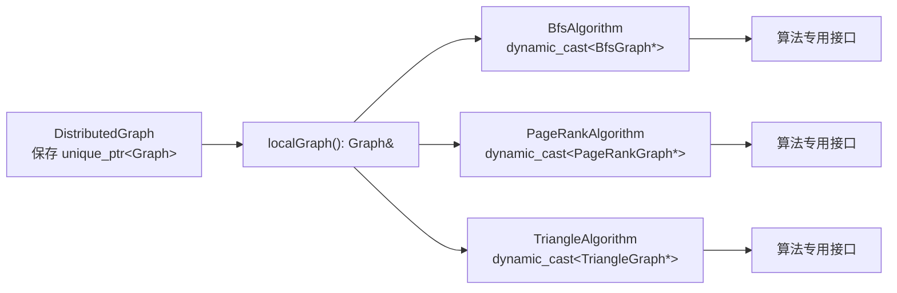

# Abstraction：当 `dynamic_cast` 成为常态，接口哪里出了问题？

`dynamic_cast` 不是禁用词。插件系统、反序列化边界、调试工具等场景确实需要在运行时识别
具体类型。但如果一个业务算法的主流程中到处都是 `dynamic_cast`，它通常不是“多态用得不够”，
而是一个信号：**当前暴露的抽象没有表达调用方真正需要的能力。**

这一篇用分布式图算法做例子。重点不是把所有代码改成模板或虚函数，而是回答三个更基础的问题：

- 算法真正依赖的是哪些图能力？
- 算法专用的数据布局与状态，究竟是不是“任意 Graph 都应具备的能力”？
- 运行时选择算法时，怎样在边界处完成动态分派，而不是把具体类型泄漏到每一个算法里？

## 先给结论

- `Graph&` 只能承诺 `Graph` 接口中写出的能力；拿到它后再转成 `BfsGraph&`，等于调用方否定了
  这个承诺。
- 如果 BFS、PageRank、三角计数只共享“图”这个名词，却依赖不同布局、索引和临时状态，它们未必
  适合组成一个可随意替换的 `Graph` 继承层次。
- **稳定且可复用的行为**应抽成能力接口，例如 `TraversalGraph`；算法只依赖该接口。
- **算法专用表示**应通过类型配对表达，例如 `DistributedGraph<BfsGraph>` 与
  `BfsAlgorithm::run(DistributedGraph<BfsGraph>&)`；这种关系应在编译期检查。
- 必须运行时选择时，把类型擦除或虚调用收敛在工厂、任务调度器等边界。不要先返回一个无差别的
  `Graph&`，再让每个调用点自己猜真实类型。

## 问题从哪里来：看似通用的图基类

设想一个图计算框架。最初需要支持多种算法，于是先定义一个图基类；每个算法再定义带有专用
数据的图子类。`DistributedGraph` 管理分区、通信和一个基类图指针：

```cpp
#include <cstddef>
#include <cstdint>
#include <memory>
#include <stdexcept>
#include <vector>

using VertexId = std::size_t;

class Graph {
public:
    virtual ~Graph() = default;

    [[nodiscard]] virtual std::size_t vertexCount() const noexcept = 0;
};

class BfsGraph final : public Graph {
public:
    [[nodiscard]] std::size_t vertexCount() const noexcept override {
        return mAdjacency.size();
    }

    [[nodiscard]] const std::vector<VertexId>& outNeighbors(VertexId vertex) const {
        return mAdjacency.at(vertex);
    }

    void beginNextLevel() {
        mNextFrontier.clear();
    }

private:
    std::vector<std::vector<VertexId>> mAdjacency;
    std::vector<VertexId> mNextFrontier;
};

class PageRankGraph final : public Graph {
public:
    [[nodiscard]] std::size_t vertexCount() const noexcept override {
        return mIncomingWeight.size();
    }

    [[nodiscard]] float incomingWeight(VertexId vertex) const {
        return mIncomingWeight.at(vertex);
    }

private:
    std::vector<float> mIncomingWeight;
};

class DistributedGraph {
public:
    /**
     * @brief 接管一个分区图的所有权。
     *
     * @param local_graph 当前进程持有的局部图；调用后由 DistributedGraph 负责销毁。
     */
    explicit DistributedGraph(std::unique_ptr<Graph> local_graph)
        : mLocalGraph(std::move(local_graph)) {
        if (!mLocalGraph) {
            throw std::invalid_argument("local_graph must not be null");
        }
    }

    /**
     * @brief 借用当前进程的局部图。
     *
     * @return 图基类引用；调用方只能依赖 Graph 明确公开的能力。
     */
    [[nodiscard]] Graph& localGraph() noexcept {
        return *mLocalGraph;
    }

private:
    std::unique_ptr<Graph> mLocalGraph;
};

class BfsAlgorithm {
public:
    /**
     * @brief 在局部分区上执行一层 BFS。
     *
     * @param graph 提供局部图和分布式运行环境的借用引用。
     */
    void runOneLevel(DistributedGraph& graph) {
        auto* bfs_graph = dynamic_cast<BfsGraph*>(&graph.localGraph());
        if (!bfs_graph) {
            throw std::logic_error("BfsAlgorithm requires BfsGraph");
        }

        bfs_graph->beginNextLevel();
        for (VertexId vertex = 0; vertex < bfs_graph->vertexCount(); ++vertex) {
            for (VertexId neighbor : bfs_graph->outNeighbors(vertex)) {
                visit(neighbor);
            }
        }
    }

private:
    void visit(VertexId) {
        // 省略：更新本地 frontier，并把远端顶点放入通信缓冲区。
    }
};
```

这段代码能够运行，也比“无检查的 `static_cast`”安全：若工厂误把 `PageRankGraph` 交给
`BfsAlgorithm`，它会抛出异常，而不是静默地触发未定义行为。但它仍然暴露了一个设计矛盾：

```text
DistributedGraph::localGraph() 的合同：这里有任意一种 Graph
BfsAlgorithm 的真实需求：这里必须是 BfsGraph
```

只要第二句话才是事实，第一句话就是**过宽且不诚实的接口**。当 PageRank、SSSP、三角计数都
复制这套检查时，类型知识已经散落在所有算法主流程中。



`DistributedGraph` 试图隐藏具体实现，算法却不得不重新发现它。抽象边界在 `localGraph()` 处
打开，又立即被 `dynamic_cast` 撕开；这就是 **抽象泄漏（leaky abstraction）**。

## 异味与根因：问题不是 RTTI 慢

很多人首先担心 RTTI 的性能。循环内重复 `dynamic_cast` 确实不理想，应至少在循环外检查一次；
但这不是主要问题。即使 cast 只做一次，架构仍有以下风险：

- **错误推迟到运行时。** `BfsAlgorithm` 能接受任何 `DistributedGraph&`，编译器无法阻止将
  `PageRankGraph` 塞进去；错误要到执行该分支时才出现。
- **新增算法要修改多处。** 新增 `KCoreGraph` 时，除了图和算法本身，还要在各个调度、转换、
  校验位置补类型判断。遗漏一个位置，就可能在很晚才失败。
- **基类变成最低公分母。** `Graph` 只留下谁都能同意的 `vertexCount()`；真正有用的行为全在
  子类，基类几乎没有抽象价值。
- **分布式职责与算法表示混在一起。** 分区归属、远端通信是分布式图的能力；frontier、入边权重、
  邻接排序则是算法或表示的能力。一个 `Graph&` 把这两类问题模糊地揉在一起。
- **重构缺乏编译器保护。** 给 BFS 改一个布局，或更换图构建工厂后，所有依赖 `BfsGraph` 的地方
  只能靠搜索 `dynamic_cast` 与测试发现。

根因可以一句话概括：**继承关系按“算法名字”组织，接口需求却按“能力与数据布局”变化。**

`BfsGraph` 是 `Graph`，在“它也有顶点数”这个极弱命题上没有错；但它不能在当前体系中替代任意
`Graph` 来运行任意算法。里氏替换原则关心的不是对象有没有共同祖先，而是：把子类放入基类接口
允许的位置后，调用方的合理预期是否仍然成立。这里的答案显然是否定的。

## 先拆开三个不该混为一谈的概念

在决定重构前，先把“图”拆成三个层次。不同层次的变化应该由不同的抽象承担：

| 层次 | 典型内容 | 应由谁表达 |
|---|---|---|
| 拓扑 / 查询能力 | 顶点数、出边遍历、边权查询、顶点归属 | 面向能力的接口或 view |
| 算法专用表示与状态 | BFS frontier、PageRank 残差、三角计数的排序邻接表 | 算法私有状态，或明确的专用图表示 |
| 分布式运行能力 | 分区边界、远端 owner、消息交换、同步屏障 | `Distributed...` 运行环境或通信接口 |

一个实用的判断题是：**如果把算法从 BFS 换成 PageRank，这个字段还应该存在吗？**

- 若答案是否定的，例如 `mNextFrontier`，它不应该被塞进通用 `Graph` 基类。
- 若答案是肯定的，而且多个算法都以同样语义使用它，例如 `forEachOutNeighbor()`，它可能适合
  成为一个稳定的能力接口。
- 若它只属于分布式执行，例如“顶点在哪个进程”，应让算法依赖分布式查询能力，而不是反查某个
  算法图子类。

## 重构路径一：按稳定能力设计接口

当多个算法真正共享某种操作语义时，应让算法依赖这个操作，而不是依赖“某个图类碰巧实现了它”。
例如 BFS、连通分量和随机游走都需要遍历出邻居，可以定义 `TraversalGraph`：

```cpp
#include <cstddef>
#include <cstdint>
#include <vector>

using VertexId = std::size_t;

/**
 * @brief 提供出边遍历能力的图接口。
 *
 * 算法只可借用该接口；实现方负责底层 CSR、邻接表或压缩布局的生命周期。
 */
class TraversalGraph {
public:
    virtual ~TraversalGraph() = default;

    [[nodiscard]] virtual std::size_t vertexCount() const noexcept = 0;

    /**
     * @brief 返回一个顶点的本地出邻居。
     *
     * @param vertex 要查询的本地顶点。
     * @return 对邻居序列的只读借用；该引用只在图对象存活且布局未重建期间有效。
     */
    [[nodiscard]] virtual const std::vector<VertexId>& outNeighbors(VertexId vertex) const = 0;
};

class BfsAlgorithm {
public:
    /**
     * @brief 遍历给定图的本地出边。
     *
     * @param graph 提供遍历能力的借用图；函数不保存该引用。
     */
    void runOneLevel(const TraversalGraph& graph) {
        for (VertexId vertex = 0; vertex < graph.vertexCount(); ++vertex) {
            for (VertexId neighbor : graph.outNeighbors(vertex)) {
                visit(neighbor);
            }
        }
    }

private:
    void visit(VertexId) {
        // 省略：BFS 算法自己的访问逻辑。
    }
};
```

这里有两个有意为之的变化：

- `BfsAlgorithm` 不再向 `DistributedGraph` 索要“某种真实类型”，而是直接声明自己需要
  `TraversalGraph`。任何满足这个合同的 CSR 图、压缩图或邻接表图都可以使用。
- `mNextFrontier` 不再是图接口的一部分。它属于一次 BFS 执行的工作状态，应放在算法对象、
  `BfsState` 或一次调用的局部对象中；图表示只负责提供拓扑。

真实的高性能图框架未必返回 `std::vector<VertexId>&`：CSR 实现更可能返回一个轻量 range，或用
回调 / iterator 暴露连续区间。这里选择 `vector` 是为了把接口语义讲清楚；**替换容器时必须保持
“借用范围何时失效”的合同不变。**

若 BFS 还要查询顶点归属和交换 frontier，就把这些能力明确加入另一个小接口，例如
`DistributedTraversalGraph`。不要为了方便又退回成什么都不承诺的 `Graph&`。

### 这条路径的边界

能力接口适合“多个算法以相同语义调用同一能力”的场景。它不适合把每种算法的优化细节都抽象进去。
若为了容纳所有算法而不断向接口增加 `incomingWeight()`、`sortedNeighbors()`、`frontier()`、
`residual()`，新的基类只是换了名字的 God Interface（上帝接口）。这时应走第二条路径。

## 重构路径二：让算法与专用图表示在类型上配对

如果 `BfsGraph`、`PageRankGraph` 的区别不仅是几个查询函数，而是内存布局、预处理索引和执行状态
都不同，那么它们并不是可互换的通用图。与其先擦除成 `Graph`，不如在静态类型中保留这层关系：

```cpp
#include <cstddef>
#include <cstdint>
#include <utility>
#include <vector>

using VertexId = std::size_t;

class BfsGraph {
public:
    [[nodiscard]] std::size_t vertexCount() const noexcept {
        return mAdjacency.size();
    }

    [[nodiscard]] const std::vector<VertexId>& outNeighbors(VertexId vertex) const {
        return mAdjacency.at(vertex);
    }

private:
    std::vector<std::vector<VertexId>> mAdjacency;
};

/**
 * @brief 为一种局部图表示提供分区与通信运行环境。
 *
 * @tparam LocalGraph 当前算法需要的局部图表示；DistributedGraph 按值拥有它。
 */
template <typename LocalGraph>
class DistributedGraph {
public:
    /**
     * @brief 接管局部图表示，并建立其分布式运行环境。
     *
     * @param local_graph 将被移动进分布式图的局部表示。
     */
    explicit DistributedGraph(LocalGraph local_graph)
        : mLocalGraph(std::move(local_graph)) {
    }

    /**
     * @brief 借用局部图表示。
     *
     * @return 与 DistributedGraph 模板参数完全相同的局部图类型。
     */
    [[nodiscard]] LocalGraph& localGraph() noexcept {
        return mLocalGraph;
    }

    [[nodiscard]] const LocalGraph& localGraph() const noexcept {
        return mLocalGraph;
    }

    [[nodiscard]] int ownerOf(VertexId) const noexcept {
        // 省略：按分区表查询顶点 owner。
        return 0;
    }

private:
    LocalGraph mLocalGraph;
};

class BfsAlgorithm {
public:
    /**
     * @brief 在 BFS 专用局部图表示上执行一层遍历。
     *
     * @param graph BFS 图及其分区、通信能力的借用引用。
     */
    void runOneLevel(DistributedGraph<BfsGraph>& graph) {
        BfsGraph& local_graph = graph.localGraph();
        for (VertexId vertex = 0; vertex < local_graph.vertexCount(); ++vertex) {
            for (VertexId neighbor : local_graph.outNeighbors(vertex)) {
                const int owner = graph.ownerOf(neighbor);
                visitLocalOrRemote(neighbor, owner);
            }
        }
    }

private:
    void visitLocalOrRemote(VertexId, int) {
        // 省略：本地更新或写入远端消息缓冲区。
    }
};
```

这段代码的关键不是模板本身，而是合同变了：

```text
之前：BfsAlgorithm 接受任意 DistributedGraph，然后在运行时希望它碰巧装着 BfsGraph。
之后：BfsAlgorithm 只接受 DistributedGraph<BfsGraph>，不匹配的组合无法通过编译。
```

`DistributedGraph<BfsGraph>` 负责拥有 `BfsGraph` 和分布式环境；`BfsAlgorithm` 只是借用它们。
这既保留了 Ownership 一章中的所有权边界，也让“BFS 只能运行在 BFS 所需表示上”成为类型系统的事实。

### 不要把算法临时状态误放进图对象

上例的 `BfsGraph` 只保存拓扑。BFS 的当前层、已访问位图、下一层 frontier 通常更适合由
`BfsAlgorithm` 或单独的 `BfsState` 拥有：同一张图可以被多个 BFS 查询复用，两个并发 BFS 也不会
争抢同一份隐藏状态。

只有当某份数据确实是图表示不可分割的一部分——例如为遍历而预构建的 CSR 索引、按算法要求排序的
邻接表、压缩编码——才应保存在专用图类型里。名字叫 `BfsGraph` 容易掩盖这个区别；必要时可改成更
诚实的 `CsrTraversalGraph`、`SortedAdjacencyGraph` 等表示名。

## 运行时仍要选算法：把动态性收敛在边界

分布式服务常常根据配置在运行时选择 BFS 或 PageRank。不能因为这一点就让每个算法都接收
`Graph&` 并自行 cast。更清楚的做法是让工厂构造**已经匹配好的任务**，调度器只面对一个很小的
运行时接口：

```cpp
#include <memory>
#include <utility>

class GraphJob {
public:
    virtual ~GraphJob() = default;

    /** @brief 执行一个已完成算法与图表示匹配的任务。 */
    virtual void execute() = 0;
};

/**
 * @brief 将一对静态匹配的算法和分布式图封装成可调度任务。
 *
 * @tparam Algorithm 仅接受 DistributedGraph<LocalGraph> 的具体算法类型。
 * @tparam LocalGraph 该算法所需的局部图表示。
 */
template <typename Algorithm, typename LocalGraph>
class TypedGraphJob final : public GraphJob {
public:
    /**
     * @brief 按值接管算法和图运行环境。
     *
     * @param algorithm 将被移动进任务的算法对象。
     * @param graph 将被移动进任务的分布式图。
     */
    TypedGraphJob(Algorithm algorithm, DistributedGraph<LocalGraph> graph)
        : mAlgorithm(std::move(algorithm)),
          mGraph(std::move(graph)) {
    }

    void execute() override {
        mAlgorithm.runOneLevel(mGraph);
    }

private:
    Algorithm mAlgorithm;
    DistributedGraph<LocalGraph> mGraph;
};
```

工厂读取配置后，可以构造 `TypedGraphJob<BfsAlgorithm, BfsGraph>` 或
`TypedGraphJob<PageRankAlgorithm, PageRankGraph>` 并以 `std::unique_ptr<GraphJob>` 返回给调度器。
运行时多态只发生在 `GraphJob::execute()` 这一个边界；任务内部仍是静态匹配的具体类型，没有散落的
`dynamic_cast`。工厂正是应该集中验证“算法与图表示是否匹配”的地方。


若图类型集合很小且封闭，`std::variant` 加 `std::visit` 也是类似的选择：把所有可能类型列在一个边界
处，由编译器检查分派是否穷尽。若算法可由第三方插件无限扩展，则需要更稳定的插件接口；但即使如此，
插件也应声明自己需要的能力或数据格式，而不是把 RTTI 检查复制到算法循环中。

## 几种看似省事、实际没有修复的做法

| 做法 | 为什么没有解决根因 | 何时才可能合理 |
|---|---|---|
| 在 `Graph` 里不断添加 `outNeighbors()`、`residual()`、`frontier()` 等 | 基类变成所有算法的并集，很多实现只能抛异常或返回无意义结果 | 只有该能力对每一个合法 `Graph` 都有相同语义时 |
| 封装 `template <typename T> T& graphAs()` | 只是把 `dynamic_cast` 藏到一个辅助函数，错误仍在运行时、类型知识仍由调用方承担 | 调试、迁移期或一个明确的运行时边界 |
| 把 cast 改成 `static_cast` | 消除了检查，却把配置错误变成未定义行为 | 已由编译期类型或不可变外部协议严格证明类型时；普通业务代码很少满足 |
| 用 `enum GraphKind` 加 `switch` | 类型判断从 RTTI 变成手写 RTTI；新增类型仍要修改多个分支 | 类型集合很小，且 `switch` 被收敛在一个工厂或适配边界 |
| 引入 Visitor，但每个 visitor 仍要访问算法专用状态 | 可能只是把 N 个 cast 移进 `accept()` / `visit()`；类型与操作的交叉复杂度仍在 | 图类型封闭、外部操作稳定且确实适合双分派时 |

特别要避免“为了没有 `dynamic_cast` 而过度模板化”。如果一套通用 CSR 图已经满足所有算法的查询需求，
一个小的能力接口比为每种算法复制 `BfsGraph`、`PageRankGraph` 更简单。设计的目的不是选择某个语言
特性，而是让变化的方向和依赖关系对齐。

## 如何选择两条重构路径

| 事实 | 更合适的设计 | 得到什么保证 |
|---|---|---|
| 多个算法共享稳定的查询语义，只是计算逻辑不同 | 小而明确的能力接口，例如 `TraversalGraph` | 实现可替换；算法不关心布局类型 |
| 算法确实依赖不同布局、索引、预处理数据 | `DistributedGraph<LocalGraph>` 与具体算法参数配对 | 不匹配的算法 / 图组合在编译期失败 |
| 同一图有多种物理表示，但调用方只需少量共同能力 | 物理表示实现能力接口，必要时用 adapter | 表示优化不泄漏给算法 |
| 算法、图格式由配置或插件在运行时选择 | 工厂构造已匹配的 `GraphJob`，在边界类型擦除 | 动态性集中，核心循环仍具备静态合同 |

不要从类名猜答案。先写出一个算法必须调用的最小操作集合；如果它是稳定的行为合同，就抽接口；如果
它依赖的是一整套无法与其他算法互换的表示，就保留具体类型。

## 代码审查清单

看到 `dynamic_cast`、`typeid` 或 `GraphKind` 分支时，可以依次追问：

- 调用方在 cast 后使用的能力，为什么不在当前参数类型的合同中？
- 这是一条真正的运行时边界，还是业务主流程中的常态？能否把检查移动到工厂、解析或适配层？
- 两个子类是否真的能替换为同一个基类对象，还是只是共享一部分存储 / 名称？
- 哪些字段是拓扑表示，哪些字段是某一次算法的工作状态，哪些字段属于分布式运行环境？
- 将新增一个算法或图布局时，需要修改哪些 `switch`、cast 和工厂？这些修改点能否收敛为一个？
- 为了消除 cast 是否引入了过大的接口、虚调用开销或模板实例化？这些成本是否有实际收益？
- 这条路径是否位于性能关键循环？若是，先测量，再决定能力接口、模板或数据布局如何取舍。

## 练习题

建议先根据“调用方需要什么能力”作答，再阅读答案。答案不只给出类型选择，也说明为什么另一条路径
不合适。

### 为一个新算法选择边界

现有 `BfsAlgorithm` 只调用 `vertexCount()`、`outNeighbors()` 和 `ownerOf()`。团队准备加入连通分量
算法，它也只调用这三个操作，但两者的 frontier 与收敛状态完全不同。

- 应为它再创建一个带 `mFrontier` 的 `ConnectedComponentsGraph` 吗？
- `ownerOf()` 应属于通用 `Graph`、算法专用图，还是另一个面向分布式遍历的接口？
- 请写出你认为 `ConnectedComponentsAlgorithm::run(...)` 最合适的参数类型。

#### 参考答案

不应仅因为算法不同就复制一份图类型。两种算法共享的是真实且稳定的能力：遍历本地出边、查询远端
owner。它们不同的是执行状态，应各自拥有自己的 frontier / label / worklist。

可以定义 `DistributedTraversalGraph`，它继承或组合 `TraversalGraph`，并额外提供 `ownerOf()`；然后让
`ConnectedComponentsAlgorithm::run(const DistributedTraversalGraph& graph)` 依赖这一小接口。若通信操作
会修改图对象，则应把只读拓扑接口与可变通信 / 消息接口进一步拆开，避免为了一个 `const` 问题把所有
能力重新混在一起。

### 把错误提前到编译期

下面的工厂能编译，但可能在运行时才报错：

```cpp
std::unique_ptr<DistributedGraph> makeDistributedGraph(AlgorithmKind kind);

void runBfs(DistributedGraph& graph) {
    BfsAlgorithm algorithm;
    algorithm.runOneLevel(graph);
}
```

- 为什么 `makeDistributedGraph(AlgorithmKind::PageRank)` 的结果仍能传给 `runBfs()`？
- 使用本章的“类型配对”路径后，`runBfs()` 的签名应如何变化？
- 若必须根据配置选择任务，哪个组件应负责把 `BfsAlgorithm` 和 `BfsGraph` 配对？

#### 参考答案

因为返回类型只保留了 `DistributedGraph`，它没有携带局部图的具体类型信息；`runBfs()` 在类型层面只能
看到“某个分布式图”。只有进入 `BfsAlgorithm` 后的 `dynamic_cast` 才会发现它实际装的是
`PageRankGraph`。

类型配对后，签名应为：

```cpp
void runBfs(DistributedGraph<BfsGraph>& graph) {
    BfsAlgorithm algorithm;
    algorithm.runOneLevel(graph);
}
```

此时 `DistributedGraph<PageRankGraph>` 不能传入，错误由编译器报告。读取配置的工厂应负责构造
`TypedGraphJob<BfsAlgorithm, BfsGraph>` 等合法组合，并把它擦除为 `std::unique_ptr<GraphJob>` 交给
调度器；调度器不需要、也不应该知道里面是哪一种图。


