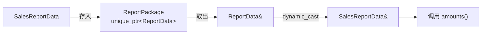

# Downcasting：为什么取出基类后又要转回子类？

一个报表系统要导出销售报表和考勤报表。最后的代码里，每个导出器都在对报表数据做
`dynamic_cast`。这样的代码通常不是一次设计决定写出来的；先回到只有销售报表的时候，
看看几个当时看起来都说得通的改动怎样叠在一起。

## 设计是怎样一步步长出来的

1. **最初只有销售报表。** `SalesExporter` 直接接收 `SalesReportData`，读取每笔销售金额并
   生成文本。此时依赖关系很直白：导出器知道自己要处理什么数据，也没有转换类型的需要。
2. **后来要批量保存不同报表。** 考勤报表也要导出，而且每份报表都带一个输出名称。为了让
   同一批次的代码保存它们，开发者抽出 `ReportData` 基类，让 `ReportPackage` 持有
   `std::unique_ptr<ReportData>` 和输出名称。这一步解决了“放在同一种容器里”的问题。
3. **导出器开始统一接收 `ReportPackage`。** 调用方只需把整个包传进去，导出器也能直接
   取得输出名称。但 `SalesExporter` 还得读取 `amounts()`；从 `ReportPackage::data()`
   取回来的却只有 `ReportData&`。于是有人加了一次带检查的 `dynamic_cast`。它能处理
   类型不匹配的情况，眼前的功能也完成了。写考勤导出器时，同样的做法又复制了一遍。

这段经历中，第二步的容器确实解决了一个需求。值得追问的是第三步：**方便传递的参数类型，
是否仍表达了导出器实际接受的数据类型？** 带着这个问题看最终代码。

## 从一段 `dynamic_cast` 代码开始

```cpp
#include <memory>
#include <numeric>
#include <stdexcept>
#include <string>
#include <utility>
#include <vector>

/** @brief 报表数据的共同基类。 */
class ReportData {
public:
    virtual ~ReportData() = default;
};

/** @brief 保存销售金额。 */
class SalesReportData final : public ReportData {
public:
    /** @param amounts 按值接收并保存的每笔销售金额。 */
    explicit SalesReportData(std::vector<int> amounts)
        : mAmounts(std::move(amounts)) {}

    /** @return 销售金额的只读借用。 */
    [[nodiscard]] const std::vector<int>& amounts() const noexcept {
        return mAmounts;
    }

private:
    std::vector<int> mAmounts;
};

/** @brief 保存每日出勤分钟数。 */
class AttendanceReportData final : public ReportData {
public:
    /** @param minutes 按值接收并保存的出勤分钟数。 */
    explicit AttendanceReportData(std::vector<int> minutes)
        : mMinutes(std::move(minutes)) {}

    /** @return 出勤分钟数的只读借用。 */
    [[nodiscard]] const std::vector<int>& minutes() const noexcept {
        return mMinutes;
    }

private:
    std::vector<int> mMinutes;
};

/** @brief 拥有一份报表数据和一个输出名称。 */
class ReportPackage {
public:
    /**
     * @param data 接管的报表数据，不能为空。
     * @param output_name 按值接收并保存的输出名称。
     */
    ReportPackage(std::unique_ptr<ReportData> data, std::string output_name)
        : mData(std::move(data)), mOutputName(std::move(output_name)) {
        if (!mData) {
            throw std::invalid_argument("report data is null");
        }
    }

    /** @return 数据的只读借用，不能超过当前对象的生命周期。 */
    [[nodiscard]] const ReportData& data() const noexcept { return *mData; }

    /** @return 输出名称的只读借用。 */
    [[nodiscard]] const std::string& outputName() const noexcept {
        return mOutputName;
    }

private:
    std::unique_ptr<ReportData> mData;
    std::string mOutputName;
};

/** @brief 导出销售报表。 */
class SalesExporter {
public:
    /**
     * @param package 借用报表包；实际要求它装着 SalesReportData。
     * @return 包含销售总额的文本。
     */
    [[nodiscard]] std::string render(const ReportPackage& package) const {
        const auto* sales_data = dynamic_cast<const SalesReportData*>(&package.data());
        if (!sales_data) {
            throw std::invalid_argument("sales data required");
        }

        const int total = std::accumulate(
            sales_data->amounts().begin(), sales_data->amounts().end(), 0);
        return package.outputName() + ": " + std::to_string(total);
    }
};

/** @brief 导出考勤报表。 */
class AttendanceExporter {
public:
    /**
     * @param package 借用报表包；实际要求它装着 AttendanceReportData。
     * @return 包含总出勤分钟数的文本。
     */
    [[nodiscard]] std::string render(const ReportPackage& package) const {
        const auto* attendance_data =
            dynamic_cast<const AttendanceReportData*>(&package.data());
        if (!attendance_data) {
            throw std::invalid_argument("attendance data required");
        }

        const int total = std::accumulate(
            attendance_data->minutes().begin(), attendance_data->minutes().end(), 0);
        return package.outputName() + ": " + std::to_string(total);
    }
};
```

把装有 `AttendanceReportData` 的 `ReportPackage` 传给 `SalesExporter::render()`，
编译器会接受；运行到 `dynamic_cast` 才会抛异常。检查能让错误更明确，但两个导出器
都要做相似检查，说明参数类型遗漏了重要条件。

## 沿着数据流寻找根因

| 位置 | 声称可以接收什么 | 实际需要什么 |
|---|---|---|
| `ReportPackage` | 任意 `ReportData` | 它确实可以拥有任意子类 |
| `SalesExporter` | 任意 `ReportPackage` | 装着 `SalesReportData` 的包 |
| `AttendanceExporter` | 任意 `ReportPackage` | 装着 `AttendanceReportData` 的包 |

销售导出器必须调用 `amounts()`，考勤导出器必须调用 `minutes()`。这些需求在编写函数
时就已确定。可 `ReportPackage::data()` 只返回 `ReportData&`，于是代码先把具体类型
藏起来，随后又试图找回来：



图中丢失的是 **`SalesExporter` 必须搭配 `SalesReportData`** 这一关系。函数接收基类后
总要转回某个固定子类，通常称为 **Downcasting（向下转型）异味**。这里不是
`dynamic_cast` 语法本身造成错误；它显露出一个本来可以由函数签名表达的类型约束，
被推迟到运行时才检查。

`ReportPackage` 能装任意报表，说的是容器的**存储能力**；销售导出器能否处理任意报表，
说的是它的**行为能力**。两者不是同一件事。如果数据和导出器各自形成一套一一对应的
继承层级，还可能伴随“平行继承体系”；但本例即便没有导出器基类，问题已经成立。

## 修正：把具体依赖写进参数

销售导出器实际只需要销售数据和输出名称。去掉多余的 `ReportPackage` 中转，让调用者
直接传入这两项。示例中的两个数据类也无需为了共同的业务名称继承一个空基类：

```cpp
#include <numeric>
#include <string>
#include <string_view>
#include <utility>
#include <vector>

/** @brief 保存销售报表数据。 */
class SalesReportData {
public:
    /** @param amounts 按值接收并保存的销售金额。 */
    explicit SalesReportData(std::vector<int> amounts)
        : mAmounts(std::move(amounts)) {}

    /** @return 销售金额的只读借用。 */
    [[nodiscard]] const std::vector<int>& amounts() const noexcept {
        return mAmounts;
    }

private:
    std::vector<int> mAmounts;
};

/** @brief 保存考勤报表数据。 */
class AttendanceReportData {
public:
    /** @param minutes 按值接收并保存的出勤分钟数。 */
    explicit AttendanceReportData(std::vector<int> minutes)
        : mMinutes(std::move(minutes)) {}

    /** @return 出勤分钟数的只读借用。 */
    [[nodiscard]] const std::vector<int>& minutes() const noexcept {
        return mMinutes;
    }

private:
    std::vector<int> mMinutes;
};

/** @brief 导出销售报表。 */
class SalesExporter {
public:
    /**
     * @param data 调用期间借用的销售数据。
     * @param output_name 调用期间借用的输出名称。
     * @return 独立拥有内容的导出文本。
     */
    [[nodiscard]] std::string render(
        const SalesReportData& data, std::string_view output_name) const {
        const int total = std::accumulate(data.amounts().begin(), data.amounts().end(), 0);
        return std::string(output_name) + ": " + std::to_string(total);
    }
};

/** @brief 导出考勤报表。 */
class AttendanceExporter {
public:
    /**
     * @param data 调用期间借用的考勤数据。
     * @param output_name 调用期间借用的输出名称。
     * @return 独立拥有内容的导出文本。
     */
    [[nodiscard]] std::string render(
        const AttendanceReportData& data, std::string_view output_name) const {
        const int total = std::accumulate(data.minutes().begin(), data.minutes().end(), 0);
        return std::string(output_name) + ": " + std::to_string(total);
    }
};
```

例如 `SalesExporter{}.render(SalesReportData({100, 250}), "本月销售")` 返回
`"本月销售: 350"`。把 `AttendanceReportData` 传给它会编译失败；这正是旧接口推迟到
运行时才发现的错误。`std::string_view` 只在同步调用期间借用名称，返回的
`std::string` 则独立拥有内容。

## 如果确实需要混装不同任务

假设后台队列需要同时保存销售和考勤导出请求。它真正需要的共同能力是“执行一个导出任务”。
沿用上一节的数据类和导出器，可以在**任务**这一层使用运行时多态：

```cpp
#include <memory>
#include <string>
#include <utility>
#include <vector>

/** @brief 可由后台队列统一执行的导出任务。 */
class ExportTask {
public:
    virtual ~ExportTask() = default;

    /** @return 当前任务生成的导出文本。 */
    [[nodiscard]] virtual std::string render() const = 0;
};

/** @brief 拥有销售数据和输出名称的导出任务。 */
class SalesExportTask final : public ExportTask {
public:
    /**
     * @param data 按值接收并由任务保存的销售数据。
     * @param output_name 按值接收并由任务保存的输出名称。
     */
    SalesExportTask(SalesReportData data, std::string output_name)
        : mData(std::move(data)), mOutputName(std::move(output_name)) {}

    [[nodiscard]] std::string render() const override {
        return SalesExporter{}.render(mData, mOutputName);
    }

private:
    SalesReportData mData;
    std::string mOutputName;
};

/**
 * @brief 向队列加入一项销售导出任务。
 * @param queue 由调用方拥有的队列；函数向它转移新任务的所有权。
 */
void enqueue_sales(std::vector<std::unique_ptr<ExportTask>>& queue) {
    queue.push_back(std::make_unique<SalesExportTask>(
        SalesReportData({100, 250}), "本月销售"));
}
```

考勤任务同理，持有 `AttendanceReportData` 并调用 `AttendanceExporter`。队列只调用
`task->render()`，无需恢复数据的具体类型。构造 `SalesExportTask` 时，销售数据与
销售导出器已完成配对。若没有后台队列或其他混装需求，直接调用导出器即可；新增任务
层级会带来更多类和一次虚调用。

## `dynamic_cast` 什么时候合理？

外部插件、反序列化旧格式等场景，具体类型可能确实要到运行时才能确定。可以在**进入
具体业务流程的边界**验证类型，失败后报告错误，再构造类型匹配的任务。检查仍然存在，
但不必散落在每个正常业务操作里。

把 cast 包装成 `package.as<SalesReportData>()` 只是改写语法；导出器仍承担猜类型的责任。
换成 `static_cast` 则取消了运行时检查，类型不匹配时会产生未定义行为。

## 代码审查清单

- 函数拿到 `Base&` 后是否立即转回固定的 `Derived&`？参数能否直接写成 `Derived&`？
- 容器允许装的类型，与调用者实际能处理的类型是否一致？
- 子类共享的是可替换的行为，还是只有相似的业务名称？
- 类型检查集中在输入边界，还是散落在正常业务操作中？
- 新增一个类型时，不合法的配对会在编译期还是运行时被发现？

## 练习题

先找出谁真正需要具体类型，再核对参考答案。

### 快递计费器为什么要检查包裹类型？

`Shipment` 保存 `std::unique_ptr<Parcel>` 并返回 `Parcel&`。
`ColdChainPricer::quote(Shipment&)` 首先调用
`dynamic_cast<ColdChainParcel*>(&shipment.parcel())`，随后读取
`requiredTemperature()` 计算冷链费用。

- 如果调用方创建 `Shipment` 时就知道包裹是冷链包裹，`quote()` 的参数应如何改？
- 如果 `Shipment` 还有收件城市等通用信息，应如何传给计费器？

#### 参考答案

让 `quote()` 接收 `const ColdChainParcel&`，将具体依赖写入参数。收件城市等通用信息
可以作为第二个参数，例如 `const ShippingOptions&`；无需为了读取城市而要求整个
`Shipment` 包装对象。若包裹类型来自运行时输入，就在创建计费任务的边界检查配对。

### 任务队列还需要基类吗？

后台队列保存 `std::vector<std::unique_ptr<ExportTask>>`，只调用每个任务的 `render()`，
从不访问销售金额或出勤分钟数。是否应该删除 `ExportTask` 基类？

#### 参考答案

不应该。队列真正需要的共同操作就是 `render()`，`ExportTask` 对所有合法任务都承诺了
这一行为。队列不必恢复具体类型；销售数据与销售导出器的配对由 `SalesExportTask` 保留。

## 小结

函数接收基类后若总要转回固定子类，检查它真正需要的参数类型。明确写出具体依赖，
能让不合法的组合更早暴露。只有调用方确实依赖一项共同操作时，基类多态才表达了
有效的接口合同。
