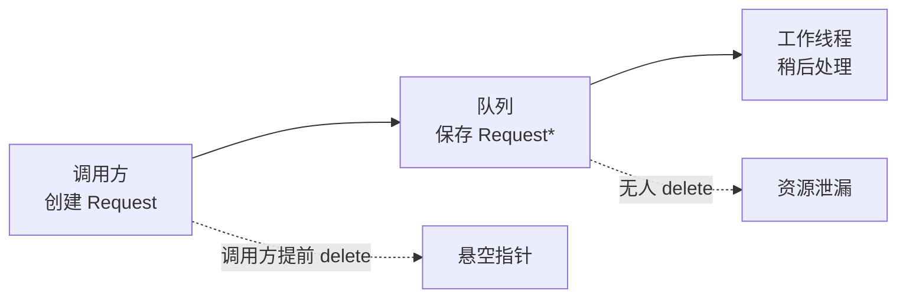
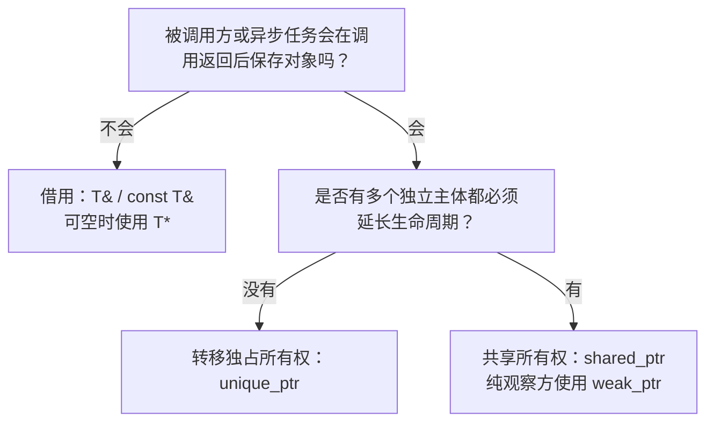
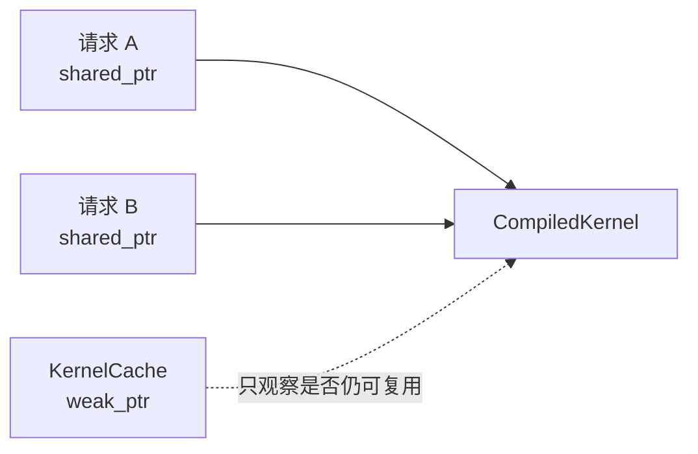
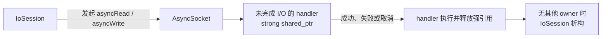

# Ownership：谁拥有资源，谁承担生命周期责任？

在系统软件里，很多看似不同的问题最后都会落到同一个问题上：**资源现在归谁负责，
它又会在什么时候失效？**

这里的资源不只指堆内存，也可以是 socket、文件描述符、CUDA stream、MPI communicator、
线程、任务、连接或一段缓存。只要某个东西需要被创建、使用和释放，就需要回答所有权
（ownership）问题。

## 先给结论

- **所有权**表示“谁有责任最终释放资源”；它不是“谁现在正在使用资源”。
- **生命周期**表示资源实际有效的时间范围；借用者可以访问资源，但不能擅自延长或结束其
  生命周期。
- 默认优先让资源由**值成员**或 `std::unique_ptr<T>` 独占管理；只有多个相互独立的主体
  都必须延长其生命周期时，才使用 `std::shared_ptr<T>`。
- `T&`、`T*`、`std::span<T>`、`std::string_view` 都通常表示**非拥有访问**。它们的正确性
  依赖于外部 owner 活得足够久。
- `shared_ptr` 只解决“对象何时析构”，**不解决对象内部状态的并发安全**。

这一篇的目标不是背下智能指针的 API，而是让接口和成员类型直接表达资源关系。读者看到
类型后，应能回答“谁释放它”“调用方能否保留它”“异步任务结束前它会不会消失”。

## 问题从哪里来：一个异步队列里的裸指针

假设服务端把请求交给异步工作队列：

```cpp
class RequestQueue {
public:
    void submit(Request* request) {
        mPending.push_back(request);
    }

    Request* takeNext() {
        if (mPending.empty()) {
            return nullptr;
        }

        Request* request = mPending.front();
        mPending.pop_front();
        return request;
    }

private:
    std::deque<Request*> mPending;
};

void submitRequest(RequestQueue& queue) {
    auto* request = new Request{"hello"};
    queue.submit(request);
    delete request;
}
```

`submit()` 之后调用 `delete`，队列里留下的是悬空指针；工作线程稍后取出并访问它时，就会
触发 use-after-free（释放后使用）。如果为了避免这个问题而不调用 `delete`，则又马上出现
另一个问题：**现在是谁负责释放 `Request`？**

队列、工作线程和调用方都可能“以为别人会处理”，最终造成泄漏、重复释放，或某次重构后
才暴露的崩溃。根因不在 `new` 或 `delete` 本身，而在接口
`void submit(Request*)` 没有表达它是否接管资源。



这段代码有两个信号：资源会在调用返回后继续被保存，而且资源只能有一个自然的销毁者。
这正是**转移独占所有权**的场景。

## 先分清三个角色

所有权讨论最容易混淆“能访问”和“要负责”。先把角色拆开：

| 角色 | 可以做什么 | 必须承担什么 |
|---|---|---|
| Owner（所有者） | 使用、转移或释放资源 | 保证资源最终被释放，并定义或参与定义其生命周期 |
| Borrower（借用者） | 在约定时间内访问资源 | 不释放资源，也不让访问超出 owner 的生命周期 |
| Observer（观察者） | 尝试观察资源是否仍然存在 | 不延长生命周期；失效时必须能处理“资源已不存在” |

一个对象可以有很多借用者，但应尽量有一个清楚的主 owner。即使采用共享所有权，也要能说明
哪些主体为什么有资格让对象继续存活，而不是把 `shared_ptr` 当作“不会出错的指针”。

还需要区分两个概念：

- **所有权不是分配位置。** 栈上的 `std::vector` 拥有它的动态缓冲区；类的值成员由外层对象
  拥有；资源不必因为在堆上才谈所有权。
- **所有权不是访问权限。** 一个 `const T&` 可以提供只读访问，但并不拥有 `T`；一个 owner
  也可以暂时不使用它管理的资源。

## 让类型成为所有权合同

在现代 C++ 中，优先用接口和成员类型表达所有权，而不是依赖注释或团队默契。

| 表达方式 | 通常表达的语义 | 适用场景 |
|---|---|---|
| `T`（按值传递） | 函数拥有一份独立对象或接管移动进来的资源 | 值语义自然，或调用方不再需要原对象时 |
| `T mObject` | 外层对象直接拥有 `T` | 默认首选；对象总是存在且值语义自然 |
| `std::unique_ptr<T>` | 独占所有权，可移动、不可复制 | 多态对象、可选的大对象、需要延后创建的资源 |
| `std::shared_ptr<T>` | 共享所有权 | 多个独立主体都需要延长同一对象生命周期 |
| `std::weak_ptr<T>` | 不拥有对象的可失效观察 | 回调、缓存与可能比被观察对象活得更久的服务观察者 |
| `T&` / `const T&` | 非空借用 | 同步调用中临时使用一个必需对象 |
| `T*` / `const T*` | 通常是可空借用 | 可选对象、数组、C API 互操作；必须说明是否会保存 |
| `std::span<T>` / `std::string_view` | 非拥有的范围或文本视图 | 在明确 owner 生命周期内传递连续数据 |

这里的“通常”很重要：C++ 语言不会阻止某个 `T*` 指向由调用方转移的对象。因此，面对遗留
接口时不能只靠猜测；应阅读文档、调用点和销毁路径，并尽快把含糊的接口改成上表中更明确的
形式。

### 参数类型如何表达调用后的关系

下面这张图可以作为设计新接口时的快速判断：



“独立主体”是关键限定。例如，一个 `Runtime` 创建 `Worker`，而 `Worker` 只是由
`Runtime` 调度，那么 `Runtime` 仍然是自然 owner；为了让两者都能方便访问而改成两个
`shared_ptr`，通常是在隐藏本应清楚的层级关系。

## 重构：让队列显式接管请求

队列要在调用方返回后持有请求，因此使用 `std::unique_ptr<Request>` 表示所有权转移：

```cpp
#include <cassert>
#include <deque>
#include <memory>
#include <string>
#include <utility>

class Request {
public:
    explicit Request(std::string payload)
        : mPayload(std::move(payload)) {
    }

    [[nodiscard]] const std::string& payload() const noexcept {
        return mPayload;
    }

private:
    std::string mPayload;
};

/**
 * @brief 保存待处理请求的非线程安全队列。
 *
 * 队列中的 unique_ptr 表示队列独占每个待处理请求；takeNext() 会把所有权交给消费者。
 * 真正的多线程队列还需要额外的互斥、条件变量或无锁同步设计。
 */
class RequestQueue {
public:
    /**
     * @brief 接管一个待处理请求的所有权。
     *
     * @param request 调用方通过 std::move 传入的非空请求；调用返回后，调用方不再拥有该对象。
     */
    void submit(std::unique_ptr<Request> request) {
        assert(request != nullptr);
        mPending.push_back(std::move(request));
    }

    /**
     * @brief 取出下一个请求，并把所有权交给调用方。
     *
     * @return 非空 unique_ptr 表示一个待处理请求；空指针表示队列为空。
     */
    [[nodiscard]] std::unique_ptr<Request> takeNext() {
        if (mPending.empty()) {
            return nullptr;
        }

        auto request = std::move(mPending.front());
        mPending.pop_front();
        return request;
    }

private:
    std::deque<std::unique_ptr<Request>> mPending;
};

void processRequest(const Request& request) {
    // 这里只借用 request；函数返回前完成访问，不保存它的地址或引用。
    (void)request.payload();
}

void submitRequest(RequestQueue& queue) {
    auto request = std::make_unique<Request>("hello");
    queue.submit(std::move(request));

    // request 仍是一个合法对象，但已经为空；它不再拥有刚才的 Request。
    assert(request == nullptr);
}

void processOne(RequestQueue& queue) {
    auto request = queue.takeNext();
    if (!request) {
        return;
    }

    processRequest(*request);
    // 离开作用域时，unique_ptr 自动销毁 Request。
}
```

重构后，资源流动变得可见：


这段代码同时体现了 RAII（资源获取即初始化）：资源由对象的构造、移动和析构管理，而不是靠
某个遥远位置的 `delete`。`unique_ptr` 不只是“自动 delete”；它把“谁负责删除”变成了编译器
能够检查的移动语义。

如果 owner 通过基类指针管理多态对象，基类还必须具有虚析构函数：

```cpp
class Backend {
public:
    virtual ~Backend() = default;
    virtual void run() = 0;
};

std::unique_ptr<Backend> makeBackend();
```

否则，`std::unique_ptr<Backend>` 销毁实际的派生对象时可能只执行基类析构，资源清理便不完整。

## 借用也需要生命周期约束

`processRequest(const Request&)` 很适合上面的同步处理函数：它不需要拥有请求，只需要在函数
执行期间读取它。这里有一个隐含但重要的约束：**函数不得把这个引用保存到调用返回之后。**

下面的代码则违反了该约束：

```cpp
void submitLater(Executor& executor) {
    Request request{"hello"};

    executor.submit([&request] {
        processRequest(request);
    });
}  // request 在这里销毁，异步回调可能稍后访问悬空引用。
```

`[this]` 和隐式捕获的 `this` 也有同样的问题：它们保存的只是裸地址，并不会让对象存活。
因此，异步回调不能仅因“现在能访问对象”就保存引用、指针或 `this`。

如果异步执行器需要在函数返回后继续访问对象，必须重新设计生命周期协议。常见选择是：

- 让任务队列像前面的 `RequestQueue` 一样接管 `std::unique_ptr<Request>`，维持单一 owner。
- 如果任务与其他独立组件确实都需要让请求保持存活，让回调捕获
  `std::shared_ptr<Request>`；此时要明确取消任务、清空队列时对象何时才会释放。
- 如果回调不应延长对象寿命，捕获 `std::weak_ptr<Request>`，执行时先 `lock()`；对象已销毁时
  安静地跳过或走取消路径。

异步代码尤其容易把“当前可用”误当成“未来仍可用”。因此，跨线程、跨队列或跨回调边界时，
所有权协议应比普通同步接口更明确。

更完整地说，**生命周期安全、对象状态线程安全、取消或停止语义、任务执行顺序是四个独立
问题；`shared_ptr` 至多解决其中一部分生命周期问题。**

## `shared_ptr`：共享销毁责任，而非默认安全指针

使用 `shared_ptr` 的正确理由是：多个主体彼此独立，并且每一个主体都应能让对象继续存活。
例如，一个连接对象同时被进行中的 I/O 操作、超时计时器和结果回调持有；在所有操作结束前，
连接都不能销毁。

它不适合用来回避“到底谁拥有对象”“为了少写 `std::move` 能不能所有地方都共享”这类问题。
比起事件订阅，资源缓存更直接地展示了 `weak_ptr` 的职责：**缓存只负责复用，不负责保活。**

### 更直接的 `weak_ptr` 例子：只复用、不保活的编译产物缓存

推理运行时可能按模型、数据类型和 shape 编译 kernel 或执行计划。多个并发请求可以安全地使用
同一个 `CompiledKernel`，因此第一版缓存很容易写成这样：

```cpp
#include <memory>
#include <string>
#include <unordered_map>
#include <utility>

class CompiledKernel {
public:
    explicit CompiledKernel(std::string key)
        : mKey(std::move(key)) {
    }

private:
    std::string mKey;
};

class KernelCache {
public:
    [[nodiscard]] std::shared_ptr<CompiledKernel> getOrCompile(const std::string& key) {
        if (const auto it = mKernels.find(key); it != mKernels.end()) {
            return it->second;
        }

        auto kernel = std::make_shared<CompiledKernel>(key);
        mKernels.emplace(key, kernel);
        return kernel;
    }

private:
    std::unordered_map<std::string, std::shared_ptr<CompiledKernel>> mKernels;
};
```

它能复用 kernel，但 `KernelCache` 也成为了每个 `CompiledKernel` 的长期 owner。只要 runtime
不退出，出现过的每个 key 都会把编译产物、底层模块或相关 buffer 留在内存中。面对大量动态
shape 或用户自定义表达式时，这种“缓存”会逐渐变成无上限的资源收集器。

需求其实是：正在执行请求必须持有 kernel；缓存只希望**如果仍有人在用**，下次请求能复用它。
这正是 `weak_ptr` 的语义：

```cpp
class KernelCache {
public:
    /**
     * @brief 返回仍在使用的编译产物，或创建一个新的产物。
     *
     * 本例假定调用发生在同一控制线程。多线程缓存还需用互斥、future 或单飞机制防止重复编译。
     *
     * @param key 编译产物的缓存键。
     * @return 调用方获得的强引用；它决定 CompiledKernel 是否继续存活。
     */
    [[nodiscard]] std::shared_ptr<CompiledKernel> getOrCompile(const std::string& key) {
        if (const auto it = mKernels.find(key); it != mKernels.end()) {
            if (auto kernel = it->second.lock()) {
                return kernel;
            }

            // 缓存条目还在，但它观察的对象已经析构。
            mKernels.erase(it);
        }

        auto kernel = std::make_shared<CompiledKernel>(key);
        mKernels.emplace(key, kernel);
        return kernel;
    }

private:
    // 缓存记录 key 与对象的对应关系，但不参与对象的销毁责任。
    std::unordered_map<std::string, std::weak_ptr<CompiledKernel>> mKernels;
};
```



当请求 A 和 B 都结束时，最后一个 `shared_ptr` 消失，`CompiledKernel` 随即析构；
`KernelCache` 中只留下一个已过期的 `weak_ptr`，下次查询时通过 `lock()` 发现失效、删除条目并
重新编译。这里没有异步回调、注销或额外 shutdown 协议，所有权关系只有“请求保活、缓存观察”。

这个例子也划清了边界：`weak_ptr` 缓存不是“把所有历史对象都留在内存里的性能缓存”。如果产品
确实需要按 LRU、显存预算或 TTL 保留热点 kernel，那么缓存就应当**有意地拥有**对象，并实现明确
的驱逐策略；此时 `shared_ptr` 是合理的。`weak_ptr` 版本表达的只是“不要因为缓存本身让对象活着”。

### 另一个对照：未完成的 I/O 操作确实应该保活 session

上一节的 `KernelCache` 只想复用仍在使用的资源，因此它不应决定 kernel 能否继续存活。I/O
完成回调的语义不同：一次尚未完成的读或写操作会直接使用 session 的 socket、读缓冲区和待发送
消息；在操作完成或被取消前销毁 session，回调就没有合法的对象和 buffer 可以访问。

| 持有者 | 它与对象的关系 | 合适的指针 |
|---|---|---|
| `KernelCache` | 复用机会；对象消失后可以重新创建 | `weak_ptr<CompiledKernel>` |
| 未完成的 socket 读写 | 正在执行的工作；完成前必须保留 socket 与 buffer | `shared_ptr<IoSession>` |

下面用一个简化的 `AsyncSocket` 表示异步 I/O 库。假定 `IoSession` 的所有成员函数均在同一个
event loop 或 strand（串行执行器）上执行；因此本例不展开 `mWriteQueue` 的并发同步。

```cpp
#include <array>
#include <cstddef>
#include <deque>
#include <functional>
#include <memory>
#include <string>
#include <system_error>
#include <utility>

/**
 * @brief 简化的异步 socket 接口。
 *
 * cancel() 只请求取消；每个未完成操作仍会通过 completion handler 返回，
 * 通常携带一个取消错误。调用方必须保留传入的 buffer，直到对应 handler 执行。
 */
class AsyncSocket {
public:
    using CompletionHandler = std::function<void(std::error_code, std::size_t)>;

    void asyncReadSome(char* buffer, std::size_t buffer_size, CompletionHandler handler);
    void asyncWrite(const char* buffer, std::size_t buffer_size, CompletionHandler handler);
    void cancel() noexcept;
};

/**
 * @brief 管理一条连接及其未完成的异步 I/O 操作。
 *
 * 每个 I/O handler 都持有 shared_ptr<IoSession>：只要操作尚未回调，socket、读缓冲区和
 * 写队列就必须继续存在。对象的所有状态只允许由所属 event loop 访问。
 */
class IoSession : public std::enable_shared_from_this<IoSession> {
public:
    explicit IoSession(AsyncSocket socket)
        : mSocket(std::move(socket)) {
    }

    /**
     * @brief 启动持续读取。
     *
     * 必须在 std::make_shared<IoSession>() 返回后调用，因为 doRead() 会取得 shared_from_this()。
     */
    void start() {
        doRead();
    }

    /**
     * @brief 把消息放入写队列；空闲时发起第一笔异步写。
     *
     * @param message 需要发送的消息，调用后由 session 保存其内容。
     */
    void send(std::string message) {
        if (mStopped) {
            return;
        }

        const bool should_start_write = mWriteQueue.empty();
        mWriteQueue.push_back(std::move(message));
        if (should_start_write) {
            doWrite();
        }
    }

    /**
     * @brief 请求停止这条连接，并取消未完成 I/O。
     *
     * stop() 不会立即清空 mWriteQueue，因为取消中的 asyncWrite 仍可能引用队首 buffer；
     * 必须等对应 completion handler 返回后，资源才能随 session 一起释放。
     */
    void stop() noexcept {
        if (mStopped) {
            return;
        }

        mStopped = true;
        mSocket.cancel();
    }

private:
    void doRead() {
        if (mStopped) {
            return;
        }

        auto self = shared_from_this();
        mSocket.asyncReadSome(
            mReadBuffer.data(), mReadBuffer.size(),
            [self](std::error_code error, std::size_t bytes_read) {
                if (error) {
                    self->onIoError(error);
                    return;
                }

                self->onBytesReceived(self->mReadBuffer.data(), bytes_read);
                self->doRead();
            });
    }

    void doWrite() {
        if (mStopped || mWriteQueue.empty()) {
            return;
        }

        // 队首消息在 handler 弹出前不会移动，因此其 data() 对异步写始终有效。
        const std::string& message = mWriteQueue.front();
        auto self = shared_from_this();
        mSocket.asyncWrite(
            message.data(), message.size(),
            [self](std::error_code error, std::size_t) {
                if (error) {
                    self->onIoError(error);
                    return;
                }

                self->mWriteQueue.pop_front();
                self->doWrite();
            });
    }

    void onBytesReceived(const char* data, std::size_t size);

    void onIoError(const std::error_code&) noexcept {
        if (!mStopped) {
            mStopped = true;
            mSocket.cancel();
        }
    }

    static constexpr std::size_t kReadBufferSize = 4096;

    AsyncSocket mSocket;
    std::array<char, kReadBufferSize> mReadBuffer{};
    std::deque<std::string> mWriteQueue;
    bool mStopped = false;
};
```

此处的 `shared_ptr` 并非“为了不崩溃而随手捕获”。每个 handler 都代表一项尚在进行的 I/O
工作：它需要读缓冲区、写队列和 socket 一直有效到完成回调。因此 handler 是一个临时的、
合理的 owner。



这也解释了一个反直觉的 shutdown 规则：**不能只期待析构函数调用 `stop()`。** 如果外部 owner
直接 `reset()`，等待中的 I/O handler 仍持有 session，析构函数根本不会运行；而 pending read
可能无限期等待。正确的关闭路径应先显式请求停止，再交出外部 owner：

```cpp
session->stop();
session.reset();
// IoSession 会在所有被 cancel 的 I/O handler 返回并释放其 shared_ptr 后析构。
```

`stop()` 必须让底层 I/O 库最终完成或取消所有 pending operation；每个 error handler 在看到
`mStopped` 后都不会再启动下一次读写，从而打断“回调创建下一笔 I/O、下一笔 I/O 再保活
session”的链条。若需要保证 `stop()` 返回后绝无回调，还需要 event loop 的 drain barrier 或
in-flight 计数；`shared_ptr` 本身不提供这类停止协议。

最后一个 `shared_ptr` 在哪个线程被释放，析构通常就在哪个线程发生。对于具有线程亲和性、
析构可能阻塞或析构时会触发回调的资源，不能把销毁线程交给“恰好最后一次 `reset()` 的地方”；
应设计明确的 shutdown 或回收路径。

## 所有权与系统资源

内存只是最容易看见的资源。系统软件中更重要的是把相同的原则映射到非内存资源上：

| 资源 | 合适的 owner 形式 | 借用者通常拿到什么 |
|---|---|---|
| 文件描述符或 socket | 不可复制的 RAII 包装类 | `int` 或包装类引用，只在 owner 存活期使用 |
| CUDA stream / event | 不可复制、可移动的 RAII 包装类 | `cudaStream_t` 或包装类引用；发射方不负责销毁 |
| MPI communicator | 明确封装释放协议的包装类 | `MPI_Comm` 的非拥有访问；还需满足 MPI 生命周期与最终化约束 |
| 工作任务 | `unique_ptr<Task>` 或按值放入队列 | 处理函数的 `Task&` / `const Task&` |
| 缓冲区切片 | `std::vector<std::byte>` 等 owner | `std::span<std::byte>` 等短生命周期 view |

RAII 的价值在于：不论资源是内存、GPU 句柄还是文件描述符，只要把释放动作放进 owner 的析构，
异常路径、提前返回和普通返回都会遵循同一套清理规则。对于 CUDA、MPI 这类资源，还要额外把
库自身的同步、线程和进程约束写进包装类的接口说明；智能指针不会替库协议做正确性判断。

## 常见误区

| 做法 | 为什么不够好 | 更清楚的选择 |
|---|---|---|
| 用裸指针表达“调用方需要释放” | 类型无法区分拥有与借用，容易漏掉或重复 `delete` | 返回 `unique_ptr<T>`，或改为按值返回 |
| 所有成员都用 `shared_ptr` | 把层级关系、销毁时机和意外保活隐藏起来 | 先找到主 owner，其余位置使用引用、裸观察指针或 `weak_ptr` |
| 为了避免悬空引用而把一切改成 `shared_ptr` | 对象可能被意外保活，取消和资源回收变得不可预测 | 先判断是转移、共享还是只观察生命周期 |
| 在类中保存 `T&` 或 `string_view` 却不说明约束 | 类的寿命可能长于被借用对象 | 改为拥有值，或在接口与类型中建立明确的外部 owner 关系 |
| 认为 `shared_ptr` 让对象线程安全 | 它只协调控制块和析构时机 | 为对象状态单独设计锁、消息传递或线程归属 |

## 设计 API 时的命名与检查清单

类型是第一层合同，命名应提供第二层语义。通常可以采用下面的约定：

- `makeWorker()` 返回 `std::unique_ptr<Worker>`：调用方获得一个新 worker 的所有权。
- `addWorker(std::unique_ptr<Worker>)`：容器或 runtime 接管 worker。
- `worker(id)` 返回 `Worker&`：返回已有对象的非空借用，调用方不得自行销毁或长期保存。
- `findWorker(id)` 返回 `Worker*`：可能找不到；仍是借用，不表示调用方可以 `delete`。

在设计或审查一条资源路径时，逐项回答：

- 资源由谁创建、由谁销毁？销毁是否能在异常和提前返回时自动发生？
- 调用返回后，被调用方是否还会使用这个对象？如果会，所有权是否已经显式转移？
- 是否真的有多个独立主体需要保活它，还是只是没有找出主 owner？
- 借用引用、指针或 view 的有效期由哪个 owner 保证？异步回调会不会越过这个边界？
- 是否存在意外的保活链、隐藏的全局 owner，或两个包装对象释放同一底层资源？
- 资源跨线程时，除了生命周期外，对象状态由哪个线程拥有，如何同步？

## 练习题

先根据类型和调用关系画出 owner，再决定是否需要智能指针。重点不是选出唯一的“标准答案”，而是能说清楚：谁负责释放、谁只是借用、异步工作结束前什么必须存活。每题后都附有参考答案；建议先停下来自己判断，再继续阅读。

### 为接口选择所有权语义

下面三个函数分别应使用值、`std::unique_ptr`、`std::shared_ptr`、引用或 `std::span` 中的哪一种形式？写出你的选择和理由。

```cpp
// 1. 立即解析一段字节，并且不会保存它。
Message parse(const std::byte* data, std::size_t size);

// 2. Runtime 接管一个只能由它销毁的后台任务。
void Runtime::addTask(/* ? */);

// 3. 两个未完成的异步操作都需要让同一个连接对象持续有效。
void startReplication(/* ? */);
```

额外判断：若第 1 个函数把字节区间保存到 `Message` 内部，原来的接口还能表达正确的生命周期吗？

#### 参考答案

1. 在 C++20 中，接口可以写成 `Message parse(std::span<const std::byte> data)`；它准确表达“只借用一段连续的只读字节”。若工程仍使用 C++17，原来的 `const std::byte*` 加 `size` 也是可行的借用接口，但调用方必须保证指针非空（或允许空且 size 为零）并在调用期间有效。
2. 应写成 `void Runtime::addTask(std::unique_ptr<Task> task)`。形参按值接收 `unique_ptr`，要求调用方显式 `std::move`，而 `Runtime` 成为唯一的销毁责任方。若任务可按值构造，也可以让 runtime 自己创建，进一步减少所有权转移。
3. 可以写成 `void startReplication(std::shared_ptr<Connection> connection)`。函数将它复制到两个异步 handler 中；两个操作任一个仍未结束时，`Connection` 都不会析构。这只适用于两个操作确实都是独立的保活责任方，而不是为了回避生命周期分析。

第 1 个函数一旦把区间保存到 `Message`，原接口就不再安全地表达其实现：`data` 只是借用，调用返回后来源缓冲区可能已经销毁。`Message` 应复制到自己的 `std::vector<std::byte>` 或 `std::string`；只有在明确要共享一个不可变缓冲区时，才考虑让 `Message` 持有 `std::shared_ptr<const Buffer>`。

### 找出缓存中的意外 owner

```cpp
class ImageCache {
public:
    std::shared_ptr<Image> load(std::string_view path) {
        if (auto it = mImages.find(std::string(path)); it != mImages.end()) {
            return it->second;
        }

        auto image = decode(path);
        mImages.emplace(image->path(), image);
        return image;
    }

private:
    std::unordered_map<std::string, std::shared_ptr<Image>> mImages;
};
```

- 当路径来自用户输入、数量没有上限时，最后一个调用者释放 `Image` 后，它会析构吗？为什么？
- 如果缓存的目标只是复用仍被其他调用者使用的图片，如何把成员类型改为不拥有的观察者？`load()` 中需要新增哪一个关键操作？
- 如果产品要求缓存至少保存最近 1 000 张图片，这个改动还合适吗？此时缺少的设计是什么？

#### 参考答案

最后一个调用者释放 `Image` 后，它**不会**析构。`mImages` 中的 `shared_ptr` 仍是一个强 owner；路径不断增加时，缓存会持续占用内存。这不是循环引用，而是一个没有回收策略的 owner。

如果缓存只想“发现仍然活着的同一张图片”，缓存应改为 `weak_ptr`，并在查询时用 `lock()` 把尚未失效的观察者暂时提升为 `shared_ptr`：

```cpp
class ImageCache {
public:
    std::shared_ptr<Image> load(std::string_view path) {
        const std::string key(path);
        if (auto it = mImages.find(key); it != mImages.end()) {
            if (auto image = it->second.lock()) {
                return image;
            }
            mImages.erase(it);
        }

        auto image = decode(path);
        mImages.insert_or_assign(image->path(), image);
        return image;
    }

private:
    std::unordered_map<std::string, std::weak_ptr<Image>> mImages;
};
```

这里的关键操作是 `lock()`：成功代表其他调用者仍在拥有图片；失败代表对象已经析构，应删除过期索引并重新解码。注意 `weak_ptr` 条目本身仍会随不同路径增长，因此实际工程还可能需要清理过期 key 的时机。

“至少保留最近 1 000 张”是另一种需求：缓存**故意拥有**对象，此时 `shared_ptr` 可以合理，但必须补上容量、淘汰顺序（例如 LRU）和内存预算等缓存策略。把所有权从 `shared_ptr` 换成 `weak_ptr` 反而会违背这个产品语义。

### 推演异步 session 的关闭顺序

`IoSession::doRead()` 把 `shared_from_this()` 捕获进 read handler，而外部代码随后执行：

```cpp
session.reset();
```

- 为什么 `IoSession` 的析构函数可能迟迟不执行？
- 如果网络对端一直不发送数据，资源会处于什么状态？
- 应将哪一步放在 `reset()` 前面，才能让 pending I/O 有机会结束？为什么仅依赖 `shared_ptr` 不够？

#### 参考答案

read handler 持有 `shared_ptr<IoSession>`，因此外部变量的 `reset()` 只释放了一个强引用，并非最后一个引用；`IoSession` 不会析构。若对端始终不发送数据，pending read 仍在等待，进而持续保活 socket、读缓冲区和 session 本身。析构函数中的清理逻辑也不会自动开始，因为析构尚未发生。

关闭方应先显式停止，再放弃外部 owner：

```cpp
session->stop();   // 取消 pending I/O，并阻止 handler 发起下一次读写。
session.reset();
```

`stop()` 只是发出取消请求；event loop 仍需要执行被取消操作的完成回调，回调释放其 `shared_ptr` 后 session 才可能析构。`shared_ptr` 只能保证“对象还活着”，不能取消底层 I/O、阻止回调继续投递，也不能保证在哪个线程析构。这些都属于显式 shutdown 协议的责任。

