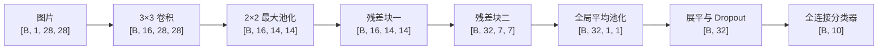
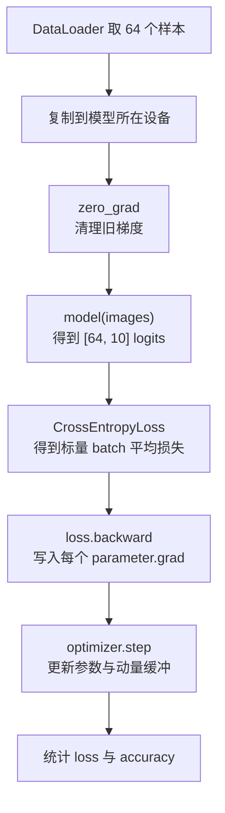

# 用 PyTorch 训练一个小型 ResNet

[[training-mathematical-theory|《深度学习训练的数学原理》]]已经从公式出发，解释了前向传播、损失函数、反向传播和优化器。这篇文章换一个方向：写一份真的可以运行的 PyTorch 代码，再把代码中的每一个关键动作翻译回数学。

这次训练的任务是：输入一张 MNIST 手写数字图片，让一个小型
ResNet（Residual Network，残差网络）判断它属于数字
$0,1,\ldots,9$ 中的哪一类。

网络只使用两个残差块，不追求很深，也不追求最高准确率。它刻意保留训练中最值得观察的组成部分：

- `DataLoader` 把单个样本组成 mini-batch；
- `Conv2d` 提取局部图像特征；
- `MaxPool2d` 和 `AdaptiveAvgPool2d` 缩小空间尺寸；
- 残差连接把主分支与捷径分支相加；
- `BatchNorm2d` 展示训练模式与推理模式的区别；
- `Dropout` 展示训练时随机、推理时确定的正则化层；
- `CrossEntropyLoss` 把 logits 和标签变成一个标量损失；
- `loss.backward()` 沿计算图执行反向传播；
- Momentum SGD 根据梯度更新模型参数；
- 外层 epoch 循环让模型反复遍历训练集。

> **先记住整篇文章最重要的五行**
>
> ```python
> optimizer.zero_grad(set_to_none=True)  # 清除上一轮保存在参数上的梯度。
> logits = model(images)                 # 前向传播：得到每一类的未归一化分数。
> loss = criterion(logits, labels)       # 计算当前 mini-batch 的平均交叉熵。
> loss.backward()                        # 反向传播：求损失对每个参数的梯度。
> optimizer.step()                       # 使用梯度和动量状态更新参数。
> ```
>
> 其余代码都在回答：`images` 从哪里来、`model` 里面有什么、
> `loss` 到底是什么、梯度如何到达参数，以及怎样评价训练结果。

## 先把数学目标和代码对象对上

设训练集一共有 $N$ 个样本。模型是 $f_\theta$，其中
$\theta$ 表示所有卷积核、归一化缩放和平移参数，以及最后全连接层的权重和偏置。

对于第 $i$ 张图片 $\mathbf{x}_i$ 和标签 $y_i$，模型输出十个
logits：

$$
\mathbf{z}_i
=
f_\theta(\mathbf{x}_i)
\in\mathbb{R}^{10}.
$$

单样本交叉熵损失是：

$$
\ell_i(\theta)
=
-\log
\frac{\exp(z_{i,y_i})}
{\sum_{k=0}^{9}\exp(z_{i,k})}.
$$

训练集经验风险是所有样本损失的平均值：

$$
\widehat R(\theta)
=
\frac{1}{N}
\sum_{i=1}^{N}
\ell_i(\theta).
$$

实际代码不会等收集完全部 $60\,000$ 个样本后才更新一次，而是从当前
mini-batch $\mathcal{B}_t$ 计算：

$$
L_t
=
\frac{1}{B_t}
\sum_{i\in\mathcal{B}_t}
\ell_i(\theta_t),
$$

$$
\mathbf{g}_t
=
\nabla_\theta L_t.
$$

这里的 $B_t$ 是**当前 batch 的实际样本数**。大多数 batch 中
$B_t=64$，但最后一个 batch 可能更小。

为了先把训练主线写清楚，上式沿用了常见的逐样本简写
$f_\theta(\mathbf{x}_i)$。本例训练模式下还包含 BatchNorm 和
Dropout，严格地说，第 $i$ 个输出还依赖当前 batch 的统计量和本轮随机
mask。把这些状态显式写出来，当前 step 更准确地表示为：

$$
\mathbf Z_t
=
f_{\theta_t}
\left(
\mathbf X_t;\mathbf m_t
\right),
$$

$$
L_t
=
\frac{1}{B_t}
\sum_{i=1}^{B_t}
\ell
\left(
\mathbf z_{t,i},y_{t,i}
\right).
$$

$\mathbf X_t$ 是整个 batch，$\mathbf m_t$ 统称本轮 Dropout 随机
mask；BatchNorm 的均值与方差由 $\mathbf X_t$ 中的中间激活共同决定。
因此这里的随机训练目标仍是“对 batch 内交叉熵取平均”，但不能严格说每个
logit 只由自己的单张图片决定。后文会分别展开这两个模块。

代码对象与数学符号的对应关系如下：

| 数学对象 | 代码对象 | 具体含义 |
| --- | --- | --- |
| $\mathbf{X}$ | `images` | 当前 batch 的图片，形状为 `[B, 1, 28, 28]` |
| $\mathbf{y}$ | `labels` | 当前 batch 的整数标签，形状为 `[B]` |
| $\theta$ | `model.parameters()` | 所有需要学习的参数 |
| $f_\theta(\mathbf{X})$ | `model(images)` | 整个网络的前向计算 |
| $\mathbf{Z}$ | `logits` | 每张图片的十个类别分数，形状为 `[B, 10]` |
| $L_t$ | `loss` | 当前 batch 的平均交叉熵，是一个标量 |
| $\nabla_\theta L_t$ | `parameter.grad` | `loss.backward()` 计算并保存的梯度 |
| 参数更新规则 | `optimizer.step()` | Momentum SGD 更新参数和动量缓冲区 |

## MNIST 的一个样本到底长什么样

`torchvision.datasets.MNIST` 返回的一条训练数据包含：

- 图片张量 `image`，形状为 `[1, 28, 28]`；
- 整数标签 `label`，取值为 `0` 到 `9` 中的一个数。

图片的三个维度不是三个样本，而是：

$$
[C,H,W]=[1,28,28].
$$

- $C=1$ 表示只有一个灰度通道；彩色 RGB 图片通常有三个通道；
- $H=28$ 表示图片高为 $28$ 个像素；
- $W=28$ 表示图片宽为 $28$ 个像素。

PyTorch 卷积层使用 **NCHW** 布局。`DataLoader` 取出 $B$ 条样本并沿最前面堆叠后，图片形状变成：

$$
[B,C,H,W]=[B,1,28,28].
$$

若 `batch_size=64`，通常会看到：

```python
images.shape == torch.Size([64, 1, 28, 28])
labels.shape == torch.Size([64])
```

`labels` 为什么不是 `[64, 10]` 的 one-hot 矩阵？因为
`nn.CrossEntropyLoss` 支持直接接收类别索引。比如：

```python
labels[:8] == tensor([5, 0, 4, 1, 9, 2, 1, 3])
```

就表示这八张图片的真实类别依次是 $5,0,4,1,9,2,1,3$。损失函数会在每一行 logits 中找到真实类别对应的位置，不需要我们手动构造 one-hot 标签。

## 小型 ResNet 的完整形状变化

这份示例使用以下网络：



逐层形状如下：

| 位置 | 运算 | 输出形状 | 形状变化原因 |
| --- | --- | --- | --- |
| 输入 | 一个 mini-batch | `[B, 1, 28, 28]` | $B$ 张单通道图片 |
| `stem` | $3\times3$ 卷积，`padding=1` | `[B, 16, 28, 28]` | 通道变为 $16$，高宽不变 |
| `stem_pool` | $2\times2$ 最大池化，`stride=2` | `[B, 16, 14, 14]` | 高宽减半 |
| `block1` | $16\to16$，`stride=1` | `[B, 16, 14, 14]` | 主分支与恒等捷径同形 |
| `block2` | $16\to32$，`stride=2` | `[B, 32, 7, 7]` | 通道翻倍，高宽减半 |
| `global_pool` | 自适应平均池化到 $1\times1$ | `[B, 32, 1, 1]` | 每个通道压成一个数 |
| `torch.flatten` | 从通道维开始展平 | `[B, 32]` | 保留 batch 维 |
| `dropout` | 随机丢弃部分特征 | `[B, 32]` | 只改数值，不改形状 |
| `classifier` | 线性层 $32\to10$ | `[B, 10]` | 每张图片得到十个 logits |

这里有一个非常重要的工程习惯：

> **batch 维始终放在第零维，而且不会被卷积、池化或全连接层混进特征维。**

`torch.flatten(features, 1)` 中的 `1` 正是在说“从第一维开始展平”，所以第零维
$B$ 被保留下来。如果误写成 `torch.flatten(features)`，整个 batch 也会被压成一条长向量。

## 卷积层的前向与反向公式

### 前向：一个卷积核会在所有位置重复使用

先忽略 dilation（膨胀）和 groups（分组），采用 PyTorch 的互相关写法。输入：

$$
\mathbf{X}
\in
\mathbb{R}^{B\times C_{\mathrm{in}}\times H_{\mathrm{in}}\times W_{\mathrm{in}}},
$$

卷积核：

$$
\mathbf{K}
\in
\mathbb{R}^{C_{\mathrm{out}}\times C_{\mathrm{in}}\times K_h\times K_w}.
$$

输出某个位置的值为：

$$
\boxed{
Y_{n,c_o,h,w}
=
b_{c_o}
+
\sum_{c_i=0}^{C_{\mathrm{in}}-1}
\sum_{u=0}^{K_h-1}
\sum_{v=0}^{K_w-1}
K_{c_o,c_i,u,v}
X_{n,c_i,\,hs_h+u-p_h,\,ws_w+v-p_w}
}
$$

其中：

- $n$ 表示 batch 中第几张图片；
- $c_o$ 表示第几个输出通道；
- $c_i$ 表示第几个输入通道；
- $(h,w)$ 表示输出特征图的位置；
- $(u,v)$ 表示卷积核内部的位置；
- $s_h,s_w$ 是步幅，$p_h,p_w$ 是 padding；
- 超出原图范围的位置由 padding 补零。

在 dilation 为 $1$ 时，输出高度是：

$$
H_{\mathrm{out}}
=
\left\lfloor
\frac{H_{\mathrm{in}}+2p_h-K_h}{s_h}
\right\rfloor
+1,
$$

宽度同理。

例如 `stem` 使用 $K_h=K_w=3$、$p=1$、$s=1$：

$$
H_{\mathrm{out}}
=
\left\lfloor
\frac{28+2-3}{1}
\right\rfloor+1
=28.
$$

所以它把 `[B, 1, 28, 28]` 变成 `[B, 16, 28, 28]`，只改变通道数。

代码中的卷积设置了 `bias=False`，因此实际没有上式的 $b_{c_o}$。原因是卷积后紧跟
`BatchNorm2d`，后者已经拥有可学习平移参数 $\beta$，再保留卷积偏置通常是冗余的。

### 反向：共享参数收到所有使用位置的梯度之和

记从后续计算传回来的输出梯度为：

$$
G_{n,c_o,h,w}
=
\frac{\partial L}{\partial Y_{n,c_o,h,w}}.
$$

卷积核某个元素 $K_{c_o,c_i,u,v}$ 在不同图片、不同空间位置被重复使用，所以它的梯度要把所有路径贡献加起来：

$$
\boxed{
\frac{\partial L}
{\partial K_{c_o,c_i,u,v}}
=
\sum_n\sum_h\sum_w
G_{n,c_o,h,w}
X_{n,c_i,\,hs_h+u-p_h,\,ws_w+v-p_w}
}
$$

如果存在偏置，则：

$$
\boxed{
\frac{\partial L}{\partial b_{c_o}}
=
\sum_n\sum_h\sum_w
G_{n,c_o,h,w}
}
$$

输入中一个像素也可能被多个卷积窗口使用，因此输入梯度同样要把所有相关输出位置的贡献相加：

$$
\boxed{
\frac{\partial L}{\partial X_{n,c_i,r,t}}
=
\sum_{\substack{c_o,h,w,u,v\\
r=hs_h+u-p_h\\
t=ws_w+v-p_w}}
G_{n,c_o,h,w}
K_{c_o,c_i,u,v}
}
$$

最后一个式子的下标看起来很多，但意思很朴素：

> 找出前向时所有用过 $X_{n,c_i,r,t}$ 的输出位置，把“上游梯度
> $\times$ 当时使用的卷积核权重”全部加起来。

这就是理论文章所说的“一个变量沿多条路径影响损失时，反向梯度必须相加”。PyTorch 的卷积反向算子会完成这些求和。

## 池化层的前向与反向公式

### 最大池化：梯度只回到获胜位置

对于一个池化窗口 $\mathcal{W}_{h,w}$：

$$
Y_{n,c,h,w}
=
\max_{(r,t)\in\mathcal{W}_{h,w}}
X_{n,c,r,t}.
$$

前向传播会保存最大值来自哪个位置。设这个位置是
$(r^\star,t^\star)$，则反向传播为：

$$
\frac{\partial L}{\partial X_{n,c,r,t}}
+=
\begin{cases}
\dfrac{\partial L}{\partial Y_{n,c,h,w}},
& (r,t)=(r^\star,t^\star),\\[6pt]
0,
& \text{其他位置}.
\end{cases}
$$

式子中的 `+=` 强调：若池化窗口发生重叠，同一个输入位置可能从多个输出位置收到梯度，需要累加。最大值恰好相同时，具体选择哪个位置属于实现细节；框架会保存前向实际选择的索引，并在反向时保持一致。

本例的 `MaxPool2d(kernel_size=2, stride=2)` 使用互不重叠的
$2\times2$ 窗口，把 $28\times28$ 变为 $14\times14$。

### 全局平均池化：梯度平均分回每个位置

`AdaptiveAvgPool2d((1, 1))` 会把每个通道的整张特征图平均成一个数。若输入空间大小为 $H\times W$：

$$
Y_{n,c,0,0}
=
\frac{1}{HW}
\sum_{h=0}^{H-1}
\sum_{w=0}^{W-1}
X_{n,c,h,w}.
$$

因此：

$$
\boxed{
\frac{\partial L}{\partial X_{n,c,h,w}}
=
\frac{1}{HW}
\frac{\partial L}{\partial Y_{n,c,0,0}}
}
$$

每个位置得到同样大小的梯度。这个池化没有可训练参数，反向时只需要把输入梯度算出来。

## 残差块怎样保证两条分支能够相加

一个残差块写成：

$$
\mathbf{u}
=
F_\theta(\mathbf{x})
+
S(\mathbf{x}),
\qquad
\mathbf{y}
=
\operatorname{ReLU}(\mathbf{u}).
$$

$F_\theta$ 是包含两个 $3\times3$ 卷积的残差分支，$S$ 是捷径分支。

### 形状不变时使用恒等捷径

`block1` 的输入和输出都是 `[B, 16, 14, 14]`，所以：

$$
S(\mathbf{x})=\mathbf{x}.
$$

两个分支形状完全相同，可以逐元素相加。

### 形状变化时使用投影捷径

`block2` 的主分支把：

$$
[B,16,14,14]
\longrightarrow
[B,32,7,7].
$$

此时不能直接把主分支结果与原输入相加，因为通道、高度和宽度都不同。捷径分支因此使用
$1\times1$、`stride=2` 的卷积：

$$
S(\mathbf{x})
=
\operatorname{BN}
\left(
\operatorname{Conv}_{1\times1,s=2}(\mathbf{x})
\right),
$$

把输入也变成 `[B, 32, 7, 7]`。

$1\times1$ 卷积虽然不观察相邻像素，但会对输入通道做线性组合，因此可以改变通道数；`stride=2` 负责让高宽减半。

### 反向时为什么会出现一条直接路径

先暂时忽略最后 ReLU，若：

$$
\mathbf{u}
=
F_\theta(\mathbf{x})+\mathbf{x},
$$

那么：

$$
\frac{\partial\mathbf{u}}{\partial\mathbf{x}}
=
\mathbf{J}_{F_\theta}+\mathbf{I}.
$$

设上游梯度为 $\nabla_{\mathbf{u}}L$，则：

$$
\boxed{
\nabla_{\mathbf{x}}L
=
\mathbf{J}_{F_\theta}^{\mathsf T}
\nabla_{\mathbf{u}}L
+
\nabla_{\mathbf{u}}L
}
$$

右边第一项来自残差分支，第二项来自恒等捷径。即使残差分支的梯度很小，捷径仍能直接把一份上游梯度传回去。

实际代码在相加后还有 ReLU，所以先经过：

$$
\nabla_{\mathbf{u}}L
=
\nabla_{\mathbf{y}}L
\odot
\mathbf{1}_{\mathbf{u}>0},
$$

然后这份梯度才沿两条分支传播。对于使用投影捷径的 `block2`，恒等矩阵
$\mathbf I$ 要换成投影分支的 Jacobian
$\mathbf J_S$，但“分支梯度相加”的原则不变。

## BatchNorm 与 Dropout 在哪里起作用

### BatchNorm2d 按通道统计一个 batch

对于某个通道 $c$，`BatchNorm2d` 会在 batch 维和空间维
$(n,h,w)$ 上统计均值与方差。设这个通道共有 $M=BHW$ 个数：

$$
\mu_c
=
\frac{1}{M}
\sum_{n,h,w}
X_{n,c,h,w},
$$

$$
\sigma_c^2
=
\frac{1}{M}
\sum_{n,h,w}
(X_{n,c,h,w}-\mu_c)^2,
$$

$$
Y_{n,c,h,w}
=
\gamma_c
\frac{X_{n,c,h,w}-\mu_c}
{\sqrt{\sigma_c^2+\varepsilon}}
+
\beta_c.
$$

$\gamma_c$ 和 $\beta_c$ 是可训练参数，属于 $\theta$；运行均值和运行方差是
buffer（缓冲状态），不通过优化器求梯度更新。

- `model.train()` 时，前向使用当前 batch 的统计量，并更新运行统计量；
- `model.eval()` 时，前向使用训练阶段积累的运行统计量，不再使用当前 batch 的统计量。

因此 BatchNorm 让同一个 batch 内的样本发生了耦合：一个样本会轻微影响其他样本使用的均值和方差。这正是理论文章在 mini-batch 无偏性讨论中单独提醒 BatchNorm 的原因。

输入变换中的 `transforms.Normalize` 与 BatchNorm 不是同一层：

- `Normalize` 使用预先给定的 MNIST 全局均值和标准差，没有可训练参数；
- `BatchNorm2d` 使用中间特征的 batch 统计量，并学习 $\gamma,\beta$。

### Dropout 放在分类器之前

本例在全局平均池化之后、全连接分类器之前使用：

```python
self.dropout = nn.Dropout(p=0.20)
```

`p=0.20` 表示**丢弃概率**是 $20\%$，保留概率是：

$$
q=1-p=0.8.
$$

训练时：

$$
m_j\sim\operatorname{Bernoulli}(q),
\qquad
\widetilde h_j
=
\frac{m_j}{q}h_j.
$$

- 若 $m_j=0$，该特征被置零，它这一轮的输入梯度也为零；
- 若 $m_j=1$，该特征乘 $1/q=1.25$，保持激活的条件期望不变；
- Dropout 不改变 `[B, 32]` 的形状，只改变其中的数值。

`model.eval()` 时 Dropout 变成恒等映射，不再随机丢弃特征。

经典图像 ResNet 常主要依赖数据增强、BatchNorm 和权重衰减，不一定在分类器前使用
Dropout。本例保留它，是为了明确展示这种训练/推理行为不同的层应该放在哪里，以及为什么验证前必须调用 `model.eval()`。

## 完整可运行代码

把下面代码保存为 `train_mnist_resnet.py`：

```python
"""使用小型残差网络训练 MNIST，并展示完整的 PyTorch 训练闭环。"""

from __future__ import annotations

import argparse
import random
from dataclasses import dataclass
from pathlib import Path

import torch
from torch import Tensor, nn
from torch.optim import SGD, Optimizer
from torch.utils.data import DataLoader
from torchvision import datasets, transforms


MNIST_MEAN = (0.1307,)  # MNIST 训练图像常用的单通道全局均值。
MNIST_STD = (0.3081,)  # MNIST 训练图像常用的单通道全局标准差。
NUM_CLASSES = 10  # MNIST 标签是数字 0 到 9，共十个互斥类别。


@dataclass(frozen=True, slots=True)
class TrainConfig:
    """保存数据、模型和优化器所需的训练配置。

    这个配置对象只描述一次实验，不保存会在训练中变化的模型参数、
    梯度或优化器动量状态。
    """

    data_dir: Path = Path("./data")  # 保存或读取 MNIST 文件的目录。
    num_epochs: int = 5  # 完整遍历训练集的次数。
    batch_size: int = 64  # 每个常规 mini-batch 包含的样本数。
    learning_rate: float = 0.05  # Momentum SGD 的基础学习率。
    momentum: float = 0.9  # 动量缓冲区保留上一轮状态的比例。
    weight_decay: float = 5e-4  # 加到梯度上的 L2 正则系数。
    dropout_probability: float = 0.20  # 分类器之前的特征丢弃概率。
    num_workers: int = 2  # DataLoader 并行读取数据的子进程数。
    random_seed: int = 42  # 控制参数初始化和数据打乱的随机种子。


@dataclass(frozen=True, slots=True)
class EpochMetrics:
    """保存一个 epoch 聚合后的平均损失和分类准确率。"""

    loss: float  # 按样本加权后的整轮平均交叉熵。
    accuracy: float  # 预测正确的样本数除以总样本数。


class BasicResidualBlock(nn.Module):
    """实现带两个 3×3 卷积的基础残差块。

    当输入输出形状一致时，捷径分支直接返回输入；当通道数或空间
    尺寸变化时，捷径分支使用 1×1 卷积和 BatchNorm 完成投影。

    Args:
        in_channels: 输入特征图的通道数。
        out_channels: 输出特征图的通道数。
        stride: 残差分支第一个卷积的步幅，支持 1 或 2。
    """

    def __init__(
        self,
        in_channels: int,
        out_channels: int,
        stride: int = 1,
    ) -> None:
        super().__init__()

        if stride not in (1, 2):
            raise ValueError(f"stride 必须是 1 或 2，实际得到 {stride}")

        # 主分支先改变通道数或空间尺寸，再提取同形状特征。
        self.residual_branch = nn.Sequential(
            nn.Conv2d(
                in_channels,
                out_channels,
                kernel_size=3,
                stride=stride,
                padding=1,
                bias=False,
            ),
            nn.BatchNorm2d(out_channels),
            nn.ReLU(),
            nn.Conv2d(
                out_channels,
                out_channels,
                kernel_size=3,
                stride=1,
                padding=1,
                bias=False,
            ),
            nn.BatchNorm2d(out_channels),
        )

        needs_projection = stride != 1 or in_channels != out_channels

        # 相加要求两条分支形状完全相同，形状变化时必须投影捷径。
        if needs_projection:
            self.shortcut = nn.Sequential(
                nn.Conv2d(
                    in_channels,
                    out_channels,
                    kernel_size=1,
                    stride=stride,
                    bias=False,
                ),
                nn.BatchNorm2d(out_channels),
            )
        else:
            self.shortcut = nn.Identity()

        # 两条分支相加后再通过 ReLU，构成经典的 post-activation 基础块。
        self.output_activation = nn.ReLU()

    def forward(self, inputs: Tensor) -> Tensor:
        """计算残差分支、捷径分支及其逐元素和。"""

        residual = self.residual_branch(inputs)  # 计算 F(inputs)。
        shortcut = self.shortcut(inputs)  # 计算恒等或投影捷径 S(inputs)。

        # 两个张量同形，AddBackward 会在反向时把梯度分发给两条分支。
        merged = residual + shortcut
        return self.output_activation(merged)


class SmallResNet(nn.Module):
    """实现适配 1×28×28 MNIST 图片的小型 ResNet。

    网络包含一个卷积 stem、两个基础残差块、全局平均池化、
    Dropout 和一个十分类线性层。

    Args:
        dropout_probability: 分类器之前的特征丢弃概率。
    """

    def __init__(self, dropout_probability: float) -> None:
        super().__init__()

        if not 0.0 <= dropout_probability < 1.0:
            raise ValueError(
                "dropout_probability 必须位于 [0, 1)，"
                f"实际得到 {dropout_probability}"
            )

        # stem 保持 28×28 空间尺寸，只把灰度通道扩展到 16 个通道。
        self.stem = nn.Sequential(
            nn.Conv2d(
                in_channels=1,
                out_channels=16,
                kernel_size=3,
                stride=1,
                padding=1,
                bias=False,
            ),
            nn.BatchNorm2d(16),
            nn.ReLU(),
        )

        # 2×2 最大池化把空间尺寸从 28×28 降到 14×14。
        self.stem_pool = nn.MaxPool2d(kernel_size=2, stride=2)

        # 第一个残差块保持 [B, 16, 14, 14] 不变，捷径是恒等映射。
        self.block1 = BasicResidualBlock(
            in_channels=16,
            out_channels=16,
            stride=1,
        )

        # 第二个残差块输出 [B, 32, 7, 7]，捷径使用 1×1 投影。
        self.block2 = BasicResidualBlock(
            in_channels=16,
            out_channels=32,
            stride=2,
        )

        # 每个通道的 7×7 特征图被平均成一个数。
        self.global_pool = nn.AdaptiveAvgPool2d(output_size=(1, 1))
        self.dropout = nn.Dropout(p=dropout_probability)
        self.classifier = nn.Linear(
            in_features=32,
            out_features=NUM_CLASSES,
        )

        self._initialize_parameters()

    def _initialize_parameters(self) -> None:
        """显式初始化卷积、归一化和线性层参数。

        这个方法会原地修改模型参数。卷积层使用适合 ReLU 的 He
        初始化；BatchNorm 初始为近似恒等缩放；分类器使用小方差
        正态初始化。
        """

        for module in self.modules():
            if isinstance(module, nn.Conv2d):
                # fan_in 模式让 ReLU 网络前向激活的尺度在初始时更稳定。
                nn.init.kaiming_normal_(
                    module.weight,
                    mode="fan_in",
                    nonlinearity="relu",
                )
            elif isinstance(module, nn.BatchNorm2d):
                nn.init.ones_(module.weight)  # 初始缩放 gamma 为 1。
                nn.init.zeros_(module.bias)  # 初始平移 beta 为 0。
            elif isinstance(module, nn.Linear):
                nn.init.normal_(module.weight, mean=0.0, std=0.01)
                nn.init.zeros_(module.bias)

    def forward(self, images: Tensor) -> Tensor:
        """把 `[B, 1, 28, 28]` 图片映射为 `[B, 10]` logits。"""

        features = self.stem(images)  # [B, 1, 28, 28] -> [B, 16, 28, 28]
        features = self.stem_pool(features)  # -> [B, 16, 14, 14]
        features = self.block1(features)  # -> [B, 16, 14, 14]
        features = self.block2(features)  # -> [B, 32, 7, 7]
        features = self.global_pool(features)  # -> [B, 32, 1, 1]

        # 从通道维开始展平，明确保留第零维的 batch 结构。
        features = torch.flatten(features, start_dim=1)  # -> [B, 32]
        features = self.dropout(features)  # 训练时随机丢弃部分通道特征。
        logits = self.classifier(features)  # -> [B, 10]
        return logits


def set_random_seed(random_seed: int) -> None:
    """设置 Python、CPU 和 CUDA 随机种子。

    这个函数会修改进程级随机数状态。相同种子有助于复现实验，
    但不同硬件和算子实现之间仍不保证逐位完全一致。

    Args:
        random_seed: 本次实验使用的非负随机种子。
    """

    if random_seed < 0:
        raise ValueError(f"random_seed 必须非负，实际得到 {random_seed}")

    random.seed(random_seed)
    torch.manual_seed(random_seed)

    if torch.cuda.is_available():
        torch.cuda.manual_seed_all(random_seed)


def resolve_device() -> torch.device:
    """优先选择 CUDA；没有可用 GPU 时回退到 CPU。"""

    if torch.cuda.is_available():
        return torch.device("cuda")
    return torch.device("cpu")


def build_data_loaders(
    config: TrainConfig,
    device: torch.device,
) -> tuple[DataLoader, DataLoader]:
    """创建训练集和测试集 DataLoader。

    训练集每个 epoch 都重新打乱；测试集保持固定顺序。若数据目录
    中不存在 MNIST，`download=True` 会从网络下载并保存数据。

    Args:
        config: 数据目录、batch 大小和 worker 数等实验配置。
        device: 训练设备，用于决定是否启用页锁定内存。

    Returns:
        `(train_loader, test_loader)`：
        - `train_loader` 产生随机打乱的训练 mini-batch。
        - `test_loader` 产生固定顺序的测试 mini-batch。
    """

    if config.batch_size <= 0:
        raise ValueError(
            f"batch_size 必须为正数，实际得到 {config.batch_size}"
        )
    if config.num_workers < 0:
        raise ValueError(
            f"num_workers 不能为负数，实际得到 {config.num_workers}"
        )

    # ToTensor 把图片变成 [1, 28, 28] 的 float32 张量并缩放到 [0, 1]。
    transform = transforms.Compose(
        [
            transforms.ToTensor(),
            transforms.Normalize(MNIST_MEAN, MNIST_STD),
        ]
    )

    train_dataset = datasets.MNIST(
        root=config.data_dir,
        train=True,
        transform=transform,
        download=True,
    )
    test_dataset = datasets.MNIST(
        root=config.data_dir,
        train=False,
        transform=transform,
        download=True,
    )

    # 独立 generator 控制训练样本的随机排列，便于使用相同种子复现。
    shuffle_generator = torch.Generator()
    shuffle_generator.manual_seed(config.random_seed)

    use_pinned_memory = device.type == "cuda"
    keep_workers_alive = config.num_workers > 0

    train_loader = DataLoader(
        train_dataset,
        batch_size=config.batch_size,
        shuffle=True,
        num_workers=config.num_workers,
        pin_memory=use_pinned_memory,
        persistent_workers=keep_workers_alive,
        generator=shuffle_generator,
        drop_last=False,
    )
    test_loader = DataLoader(
        test_dataset,
        batch_size=config.batch_size,
        shuffle=False,
        num_workers=config.num_workers,
        pin_memory=use_pinned_memory,
        persistent_workers=keep_workers_alive,
        drop_last=False,
    )
    return train_loader, test_loader


def inspect_first_batch(
    model: nn.Module,
    data_loader: DataLoader,
    device: torch.device,
) -> None:
    """打印一个真实 mini-batch 及模型输出的形状。

    检查时临时切换到 eval 模式，避免仅为观察形状而更新 BatchNorm
    运行统计量或触发 Dropout。结束后恢复模型原来的训练状态。
    """

    images, labels = next(iter(data_loader))
    was_training = model.training
    model.eval()

    with torch.no_grad():
        logits = model(images.to(device))

    model.train(was_training)
    print(
        "shape check:",
        f"images={tuple(images.shape)},",
        f"labels={tuple(labels.shape)},",
        f"logits={tuple(logits.shape)},",
        f"label_dtype={labels.dtype}",
    )


def train_one_epoch(
    model: nn.Module,
    data_loader: DataLoader,
    criterion: nn.Module,
    optimizer: Optimizer,
    device: torch.device,
) -> EpochMetrics:
    """使用训练集完成一个 epoch，并更新模型参数。

    每个 mini-batch 都执行一次清梯度、前向、计算损失、反向和
    优化器更新。这个函数会修改模型参数、BatchNorm 运行统计量和
    优化器动量状态。

    Args:
        model: 当前需要训练的小型 ResNet。
        data_loader: 产生训练 mini-batch 的 DataLoader。
        criterion: 把 `[B, 10]` logits 和 `[B]` 标签变成标量损失。
        optimizer: 保存参数引用和动量状态的优化器。
        device: 模型与当前 batch 所在的计算设备。

    Returns:
        当前 epoch 按样本聚合后的平均损失和准确率。
    """

    model.train()  # 启用 Dropout，并让 BatchNorm 使用当前 batch 统计量。

    total_loss = 0.0  # 累加“batch 平均损失 × 当前 batch 样本数”。
    num_correct = 0  # 累加预测正确的样本数量。
    num_samples = 0  # 累加实际处理的样本数量。
    use_non_blocking_copy = device.type == "cuda"

    for images, labels in data_loader:
        # 模型、输入和标签必须位于同一设备；标签保持 int64 类别索引。
        images = images.to(
            device,
            non_blocking=use_non_blocking_copy,
        )
        labels = labels.to(
            device,
            non_blocking=use_non_blocking_copy,
        )

        # PyTorch 默认累加 parameter.grad，必须先清除上一轮梯度。
        optimizer.zero_grad(set_to_none=True)

        # 前向传播构造本轮计算图，并得到每个样本的十个 logits。
        logits = model(images)

        # CrossEntropyLoss 内部完成 LogSoftmax 与负对数似然并对 batch 取平均。
        loss = criterion(logits, labels)

        # 从标量 loss 出发执行反向模式自动微分，填充每个参数的 .grad。
        loss.backward()

        # Momentum SGD 读取 .grad，更新参数与每个参数对应的动量缓冲区。
        optimizer.step()

        current_batch_size = labels.size(0)

        # loss 已是 batch 平均值，先乘实际 batch 大小才能正确汇总整轮均值。
        total_loss += loss.item() * current_batch_size

        # argmax 只用于计算准确率，不参与损失，也不参与反向传播。
        predictions = logits.argmax(dim=1)
        num_correct += int((predictions == labels).sum().item())
        num_samples += current_batch_size

    return EpochMetrics(
        loss=total_loss / num_samples,
        accuracy=num_correct / num_samples,
    )


@torch.no_grad()
def evaluate(
    model: nn.Module,
    data_loader: DataLoader,
    criterion: nn.Module,
    device: torch.device,
) -> EpochMetrics:
    """在测试集上计算平均损失和准确率，不更新任何参数。

    `model.eval()` 会关闭 Dropout 的随机丢弃，并让 BatchNorm 使用
    运行统计量；`torch.no_grad()` 会关闭梯度记录，减少内存和计算开销。
    """

    model.eval()

    total_loss = 0.0
    num_correct = 0
    num_samples = 0
    use_non_blocking_copy = device.type == "cuda"

    for images, labels in data_loader:
        images = images.to(
            device,
            non_blocking=use_non_blocking_copy,
        )
        labels = labels.to(
            device,
            non_blocking=use_non_blocking_copy,
        )

        logits = model(images)
        loss = criterion(logits, labels)

        current_batch_size = labels.size(0)
        total_loss += loss.item() * current_batch_size

        predictions = logits.argmax(dim=1)
        num_correct += int((predictions == labels).sum().item())
        num_samples += current_batch_size

    return EpochMetrics(
        loss=total_loss / num_samples,
        accuracy=num_correct / num_samples,
    )


def parse_args() -> TrainConfig:
    """解析常用实验参数，并构造不可变训练配置。"""

    parser = argparse.ArgumentParser(
        description="使用小型 ResNet 训练 MNIST。",
    )
    parser.add_argument(
        "--data-dir",
        type=Path,
        default=Path("./data"),
        help="MNIST 数据目录，默认是 ./data。",
    )
    parser.add_argument(
        "--epochs",
        type=int,
        default=5,
        help="训练 epoch 数，默认是 5。",
    )
    parser.add_argument(
        "--batch-size",
        type=int,
        default=64,
        help="mini-batch 大小，默认是 64。",
    )
    parser.add_argument(
        "--learning-rate",
        type=float,
        default=0.05,
        help="Momentum SGD 学习率，默认是 0.05。",
    )
    parser.add_argument(
        "--num-workers",
        type=int,
        default=2,
        help="DataLoader 子进程数，默认是 2。",
    )
    args = parser.parse_args()

    if args.epochs <= 0:
        parser.error("--epochs 必须为正数")
    if args.learning_rate <= 0.0:
        parser.error("--learning-rate 必须为正数")

    return TrainConfig(
        data_dir=args.data_dir,
        num_epochs=args.epochs,
        batch_size=args.batch_size,
        learning_rate=args.learning_rate,
        num_workers=args.num_workers,
    )


def main() -> None:
    """组装数据、模型、损失和优化器，并执行完整训练与验证流程。"""

    config = parse_args()
    set_random_seed(config.random_seed)
    device = resolve_device()

    train_loader, test_loader = build_data_loaders(config, device)

    # 创建模型后立即移动到目标设备，优化器持有这些参数对象的引用。
    model = SmallResNet(
        dropout_probability=config.dropout_probability,
    ).to(device)

    # 输入是原始 logits，标签是 int64 类别索引，默认对 batch 取平均。
    criterion = nn.CrossEntropyLoss()

    # PyTorch SGD 使用未归一化动量缓冲，并把 weight_decay 加到梯度中。
    optimizer = SGD(
        model.parameters(),
        lr=config.learning_rate,
        momentum=config.momentum,
        weight_decay=config.weight_decay,
    )

    print(f"device={device}")
    print(
        f"train_samples={len(train_loader.dataset)}, "
        f"test_samples={len(test_loader.dataset)}, "
        f"steps_per_epoch={len(train_loader)}"
    )
    inspect_first_batch(model, train_loader, device)

    # 每次外层循环都让 DataLoader 大体遍历一遍完整训练集。
    for epoch_index in range(config.num_epochs):
        train_metrics = train_one_epoch(
            model,
            train_loader,
            criterion,
            optimizer,
            device,
        )
        test_metrics = evaluate(
            model,
            test_loader,
            criterion,
            device,
        )

        print(
            f"epoch={epoch_index + 1:02d}/{config.num_epochs:02d} "
            f"train_loss={train_metrics.loss:.4f} "
            f"train_acc={train_metrics.accuracy:.2%} "
            f"test_loss={test_metrics.loss:.4f} "
            f"test_acc={test_metrics.accuracy:.2%}"
        )


if __name__ == "__main__":
    main()
```

## 使用指定 Python 环境运行

先把代码保存为 `train_mnist_resnet.py`，然后使用：

```shell
python train_mnist_resnet.py \
    --data-dir ./data \
    --epochs 5 \
    --batch-size 64
```

第一次运行时，`download=True` 会下载 MNIST。若数据已经存在，torchvision 会直接复用，不会重复下载。

只想先验证程序能否正常训练，可以运行一个 epoch：

```shell
python train_mnist_resnet.py \
    --data-dir ./data \
    --epochs 1
```

程序开头会打印类似：

```text
device=cpu
train_samples=60000, test_samples=10000, steps_per_epoch=938
shape check: images=(64, 1, 28, 28), labels=(64,), logits=(64, 10), label_dtype=torch.int64
```

本文使用 PyTorch 2.5、torchvision 0.20 和 CPU 对文章中的同一份代码实际运行一个
epoch，得到过：

```text
epoch=01/01 train_loss=0.4963 train_acc=83.52% test_loss=0.1372 test_acc=95.80%
```

这里第一轮的测试准确率高于训练准确率并不矛盾：

- 训练准确率是在一整个 epoch 中边更新边统计的，前半轮使用的模型还比较弱；
- 训练前向启用了 Dropout，并使用当前 batch 的 BatchNorm 统计量；
- 测试准确率在 epoch 结束后用最终参数统一计算，同时 Dropout 已关闭。

如果机器上 CUDA 可用，`device` 会自动变成 `cuda`。训练得到的具体损失和准确率会受硬件、PyTorch 算法实现、数据顺序和随机状态影响，不应该把某一组小数当作必须逐位复现的标准答案。

这个示例为了保持代码紧凑，每个 epoch 都在 MNIST 官方测试划分上报告指标。严谨实验中，如果根据这些结果反复调学习率、网络结构或 epoch 数，这个划分事实上已经承担了**验证集**职责；最终泛化结果应再使用一份从未参与调参的独立测试集评估。

## DataLoader 怎样组成 mini-batch

训练集共有 $N=60\,000$ 个样本，代码设置：

```python
DataLoader(
    train_dataset,
    batch_size=64,
    shuffle=True,
    drop_last=False,
)
```

它做的事情可以理解为：

1. 在每个 epoch 开始建立一份随机样本顺序；
2. 按这份顺序每次取最多 $64$ 个样本；
3. 把图片沿新出现的 batch 维堆成 `[B, 1, 28, 28]`；
4. 把整数标签堆成 `[B]`；
5. `drop_last=False` 表示保留不足 $64$ 个样本的最后一个 batch。

因为：

$$
60\,000
=
937\times64+32,
$$

所以：

$$
\text{steps per epoch}
=
\left\lceil
\frac{60\,000}{64}
\right\rceil
=938.
$$

前 $937$ 个 batch 的 $B_t=64$，最后一个 batch 的 $B_t=32$。训练五个
epoch 一共执行：

$$
5\times938=4690
$$

次 `optimizer.step()`。

这里必须区分：

- **样本**：一张 `[1, 28, 28]` 图片和一个标量标签；
- **mini-batch**：一次前向和反向处理的一组样本；
- **step / iteration**：处理一个 mini-batch 并更新一次参数；
- **epoch**：训练集中的每条样本大体都被使用一遍。

`shuffle=True` 会改变每个 epoch 的样本组合和顺序。因此第二个 epoch 不是机械地把第一个 epoch 的
938 个 batch 原样重放，而是让当前参数在新的 mini-batch 顺序上继续训练。

## 前向传播在哪

这行代码启动完整前向传播：

```python
logits = model(images)
```

调用 `model(images)` 最终会进入 `SmallResNet.forward()`。其中每一行都在构造一个中间张量：

$$
\mathbf{X}
\to
\mathbf{H}_1
\to
\mathbf{H}_2
\to
\cdots
\to
\mathbf{Z}.
$$

PyTorch 在梯度模式开启时，还会记录产生这些张量所需的运算关系。例如：

- 卷积输出知道自己由哪个输入和卷积核产生；
- 最大池化保存前向选中的最大值索引；
- ReLU 知道哪些位置在前向时大于零；
- Dropout 保存这一轮采样到的 mask；
- 残差加法知道结果来自两个输入分支；
- 最终 logits 连接到所有实际参与计算的模型参数。

这组关系就是当前 batch 的动态计算图。图中保存的是反向所需的信息，不是把前向代码文本再复制一遍。

## 损失计算在哪

损失在这里计算：

```python
loss = criterion(logits, labels)
```

其中：

```python
criterion = nn.CrossEntropyLoss()
```

输入形状是：

```python
logits.shape == [B, 10]
labels.shape == [B]
loss.shape == []
```

`loss.shape == []` 表示它是零维标量张量。

对于当前 batch 第 $i$ 个样本，若真实标签是 $y_i$，PyTorch 计算：

$$
\ell_i
=
-z_{i,y_i}
+
\log
\sum_{k=0}^{9}
e^{z_{i,k}}.
$$

再按默认 `reduction="mean"` 得到：

$$
\boxed{
L_t
=
\frac{1}{B_t}
\sum_{i=1}^{B_t}
\ell_i
}
$$

这就是当前 mini-batch 对经验风险的估计。

### 为什么模型末尾没有 Softmax

`SmallResNet.forward()` 直接返回 logits，没有写：

```python
probabilities = torch.softmax(logits, dim=1)
```

这是有意为之。`nn.CrossEntropyLoss` 需要的正是**未经 Softmax 的
logits**，它内部以数值稳定方式融合了 `LogSoftmax` 与负对数似然。

如果先手动 Softmax，再把概率交给 `CrossEntropyLoss`，数学含义就错了，因为损失会把这些概率再次当作 logits。

只有在训练之外展示预测概率时，才显式计算：

```python
probabilities = torch.softmax(logits, dim=1)
```

## 模型怎样知道最后对应哪个数字

对于一张图片，模型返回十个 logits：

$$
\mathbf z
=
[z_0,z_1,\ldots,z_9].
$$

下标与 MNIST 类别的对应关系由数据集规定：

| logit 下标 | 类别含义 |
| --- | --- |
| `0` | 数字 0 |
| `1` | 数字 1 |
| $\vdots$ | $\vdots$ |
| `9` | 数字 9 |

预测类别使用：

```python
predictions = logits.argmax(dim=1)
```

假设某张图片输出：

$$
\mathbf z
=
[-1.2,0.3,0.8,1.1,-0.5,3.7,0.2,-0.4,0.9,0.1].
$$

最大值 $3.7$ 位于下标 $5$，所以模型预测这张图片是数字 $5$。

`argmax` 不需要先做 Softmax，因为 Softmax 保持大小顺序：

$$
\operatorname*{arg\,max}_k z_k
=
\operatorname*{arg\,max}_k p_k.
$$

训练时，真实标签不是来自 `argmax`，而是数据集给出的 `labels`。如果真实标签也是
$5$，交叉熵就会推动第 $5$ 类概率升高；如果真实标签是 $3$，交叉熵会推动第 $3$ 类相对其他类别升高。

## 反向传播在哪

反向传播由这一行触发：

```python
loss.backward()
```

因为 `loss` 是标量，PyTorch 从：

$$
\frac{\partial L}{\partial L}=1
$$

出发，按照计算图的反方向连续执行 vector-Jacobian product（向量与
Jacobian 的乘积）。对于 Softmax 交叉熵输出层，batch 平均损失对 logits 的梯度是：

$$
\boxed{
\nabla_{\mathbf Z}L
=
\frac{1}{B_t}
(\mathbf P-\mathbf Y)
}
$$

这里 $\mathbf Y$ 是为了推导而写出的 one-hot 矩阵；代码中的
`labels` 仍然可以只保存类别索引。

这个梯度继续经过：

$$
\text{线性层}
\leftarrow
\text{Dropout}
\leftarrow
\text{平均池化}
\leftarrow
\text{残差块}
\leftarrow
\text{卷积 stem}.
$$

最终每个可训练参数 $\theta_j$ 都得到：

$$
\theta_j.\texttt{grad}
=
\frac{\partial L}{\partial\theta_j}.
$$

`loss.backward()` **只计算并保存梯度，不更新参数**。参数真正改变发生在后面的：

```python
optimizer.step()
```

### 残差加法的反向不需要手写

前向有：

```python
merged = residual + shortcut
```

若上游传回 $\nabla_{\texttt{merged}}L$，加法对两个输入的局部导数都是
$1$，所以：

$$
\nabla_{\texttt{residual}}L
+=
\nabla_{\texttt{merged}}L,
$$

$$
\nabla_{\texttt{shortcut}}L
+=
\nabla_{\texttt{merged}}L.
$$

随后两条分支各自反向，最后在共同输入 `inputs` 处再次相加。自动微分系统会根据计算图拓扑自动完成这些梯度归约。

## 为什么每轮先调用 zero_grad

PyTorch 的 `parameter.grad` 默认使用**累加语义**。连续调用两次
`backward()` 而不清理，会得到：

$$
\texttt{grad}
\leftarrow
\texttt{grad}
+
\nabla_\theta L.
$$

这种设计支持梯度累积和参数共享，但普通的一步一更新训练必须先调用：

```python
optimizer.zero_grad(set_to_none=True)
```

`set_to_none=True` 把梯度引用设为 `None`，而不是把已有梯度张量逐元素写成零。下一次反向时再按需创建梯度，通常能减少一次内存写入。

要牢牢记住三个状态：

1. `logits = model(images)` 只产生预测和计算图，参数还没变；
2. `loss.backward()` 产生 `.grad`，参数仍然没变；
3. `optimizer.step()` 读取 `.grad` 后，参数才真正改变。

## 优化器使用的具体公式

代码使用：

```python
optimizer = SGD(
    model.parameters(),
    lr=0.05,
    momentum=0.9,
    weight_decay=5e-4,
)
```

这里不是最简单的无状态 SGD，而是 **带 Momentum 和 L2 weight decay 的
PyTorch SGD**。

先由当前 batch 得到数据梯度：

$$
\mathbf g_t
=
\nabla_\theta L_t.
$$

PyTorch `SGD` 的 、$\text{weight\_decay}=\lambda$ 会先把参数的 L2 项加到梯度：

$$
\widetilde{\mathbf g}_t
=
\mathbf g_t+\lambda\theta_t.
$$

再更新动量缓冲区：

$$
\mathbf v_t
=
\mu\mathbf v_{t-1}
+
\widetilde{\mathbf g}_t.
$$

最后更新参数：

$$
\boxed{
\theta_{t+1}
=
\theta_t-\eta\mathbf v_t
}
$$

本例中：

$$
\eta=0.05,
\qquad
\mu=0.9,
\qquad
\lambda=5\times10^{-4}.
$$

PyTorch 在某个参数第一次收到梯度时，会用该梯度初始化对应动量缓冲区。后续 step 才持续使用上面的递推关系。

还要注意：理论文章为了让动量状态接近梯度的指数平均，使用过带
$(1-\mu)$ 的写法：

$$
\mathbf m_t
=
\mu\mathbf m_{t-1}
+
(1-\mu)\mathbf g_t.
$$

PyTorch `SGD(momentum=...)` 的缓冲区递推**没有**
$(1-\mu)$。二者表达的是相似思想，但状态尺度和有效步长不同，不能看到
`momentum=0.9` 就忽略具体实现公式。

本例把 `weight_decay` 应用于 `model.parameters()` 中的全部可训练参数，便于看清一条统一公式。更精细的大型训练配置经常使用参数组，让卷积/线性权重衰减，而对
BatchNorm 的 $\gamma,\beta$ 和偏置关闭衰减。

## 一个 batch 怎样完成完整训练步骤

假设当前从 `DataLoader` 得到：

```python
images.shape == [64, 1, 28, 28]
labels.shape == [64]
```

一次 step 的数据流与状态变化如下：



对应数学链路是：

$$
\mathbf Z_t
=
f_{\theta_t}(\mathbf X_t),
$$

$$
L_t
=
\frac{1}{64}
\sum_{i=1}^{64}
\ell(\mathbf z_i,y_i),
$$

$$
\mathbf g_t
=
\nabla_\theta L_t,
$$

$$
\theta_{t+1}
=
\operatorname{MomentumSGD}
(\theta_t,\mathbf g_t,\mathbf v_{t-1}).
$$

下一次循环中的 `model(images)` 已经使用更新后的
$\theta_{t+1}$。所以一个 epoch 内第 $500$ 个 batch 使用的模型，一般已经不同于第一个 batch 使用的模型。

## epoch 平均损失为什么要乘回 batch 大小

`CrossEntropyLoss` 默认返回当前 batch 的平均值。训练循环中却写：

```python
total_loss += loss.item() * current_batch_size
```

这是因为最后一个 batch 可能只有 $32$ 个样本，不能把每个 batch 的平均损失再做简单平均。

假设两个 batch 分别有 $64$ 和 $32$ 个样本，平均损失分别是
$0.2$ 和 $0.5$。正确的整轮样本平均是：

$$
\frac{64\times0.2+32\times0.5}{64+32}
=0.3.
$$

如果错误地直接平均两个 batch 均值，会得到：

$$
\frac{0.2+0.5}{2}
=0.35.
$$

后者相当于让只有 $32$ 个样本的最后一批拥有与 $64$ 样本批次相同的权重。

因此代码先把 batch 平均值还原成 batch 损失总和，最后再除以整轮实际样本数：

```python
epoch_loss = total_loss / num_samples
```

## 准确率不是反向传播使用的损失

代码中：

```python
predictions = logits.argmax(dim=1)
num_correct += int((predictions == labels).sum().item())
```

只是在统计准确率：

$$
\text{accuracy}
=
\frac{\text{预测正确的样本数}}
{\text{总样本数}}.
$$

它没有进入 `loss`，也没有调用 `backward()`。原因是 `argmax` 和“预测对记
$1$、错记 $0$”几乎处处没有可用于训练的有效梯度。

训练真正最小化的是平滑得多的交叉熵。准确率负责回答“最终猜对了多少”，交叉熵还会区分：

- 正确类别概率是 $0.51$ 还是 $0.99$；
- 错误预测是犹豫地错，还是极度自信地错。

所以训练损失下降和准确率上升经常相关，但它们不是同一个量，也不保证每一步同时改善。

## train、eval 和 no_grad 分别控制什么

这三个概念很容易混在一起：

| 调用 | 控制对象 | 是否记录计算图 | 是否更新参数 |
| --- | --- | --- | --- |
| `model.train()` | Dropout 与 BatchNorm 等模块行为 | 不决定 | 不直接更新 |
| `model.eval()` | Dropout 与 BatchNorm 等模块行为 | 不决定 | 不直接更新 |
| `torch.no_grad()` | 自动微分是否记录运算 | 关闭记录 | 不直接更新 |
| `optimizer.step()` | 优化器参数和状态 | 无关 | 真正更新参数 |

因此验证代码同时需要：

```python
model.eval()

with torch.no_grad():
    logits = model(images)
```

- 只有 `model.eval()` 而没有 `no_grad()`：结果正确，但仍可能记录无用计算图，浪费内存和计算；
- 只有 `no_grad()` 而没有 `model.eval()`：虽然不记录梯度，但 Dropout 仍随机丢特征，BatchNorm 仍使用测试 batch 的统计量，验证语义错误；
- 两者都调用：得到正确、稳定且开销更小的推理行为。

## 参数、梯度和 buffer 是三类不同状态

以 `BatchNorm2d` 和 Momentum SGD 为例，训练进程中至少有三类状态：

| 状态 | 示例 | 由谁更新 | 是否属于 `model.parameters()` |
| --- | --- | --- | --- |
| 可训练参数 | 卷积核、线性层权重、$\gamma,\beta$ | `optimizer.step()` | 是 |
| 梯度 | `parameter.grad` | `loss.backward()` | 不是独立参数 |
| buffer | BatchNorm 运行均值和方差 | 模块训练前向 | 否 |
| 优化器状态 | Momentum 的 $\mathbf v_t$ | `optimizer.step()` | 否，保存在 optimizer 中 |

这对训练系统和 checkpoint 非常重要。只保存：

```python
model.state_dict()
```

会保存模型参数和模型 buffer，但不会包含 Momentum 缓冲区。若要无缝续训，还需要保存：

```python
optimizer.state_dict()
```

更完整的 checkpoint 通常还会保存 epoch / step、学习率调度器、随机数状态和数据迭代位置。

## 从训练系统角度观察这段代码

虽然示例只有一个 Python 文件，它已经包含训练框架需要协调的几条主线。

### 控制流

```text
epoch 循环
  -> mini-batch 循环
    -> 清梯度
    -> 前向
    -> 计算损失
    -> 反向
    -> 参数更新
  -> 验证
```

控制流决定何时更新参数、何时切换训练/验证模式、一个 epoch 有多少 step。

### 数据流

```text
磁盘上的 MNIST
  -> Dataset
  -> DataLoader worker
  -> CPU batch
  -> CPU/GPU 设备复制
  -> 模型中间激活
  -> logits
  -> loss
  -> gradients
```

数据流决定张量在哪个设备、使用什么 dtype、形状是否匹配，以及传输能否与计算重叠。

### 状态流

```text
参数 theta_t
  + parameter.grad
  + Momentum buffer
  + BatchNorm running statistics
  + random state
  -> 下一训练 step 的完整状态
```

状态流决定 checkpoint 能否真正恢复训练，而不是只恢复一份可以推理的权重。

### 资源约束

训练时内存不只保存参数，还要保存：

- 当前 mini-batch 输入；
- 反向所需的中间激活；
- 每个参数的梯度；
- Momentum 优化器状态；
- 卷积算子选择的临时工作空间。

batch size 增大时，中间激活通常近似按 $B$ 增长；模型参数和 Momentum 状态不会因为
$B$ 增大而同比增长。这也是显存不足时通常先减小 batch size 的原因。

## 逐项对应理论文章

| 理论问题 | 本例中的工程落点 |
| --- | --- |
| 模型 $f_\theta$ 是什么 | `SmallResNet` 及其 `forward()` |
| 参数 $\theta$ 在哪里 | `model.parameters()` |
| 单样本输入是什么 | `[1, 28, 28]` 的 MNIST 图片 |
| 批量输入是什么 | `[B, 1, 28, 28]` 的 `images` |
| 仿射变换在哪里 | 最后的 `nn.Linear(32, 10)`，以及卷积每个局部窗口的线性计算 |
| 非线性在哪里 | 每个 `nn.ReLU()` |
| 参数共享在哪里 | 同一个卷积核扫过所有图片和所有空间位置 |
| 分支梯度相加在哪里 | `residual + shortcut` |
| 交叉熵在哪里 | `criterion(logits, labels)` |
| batch 平均损失在哪里 | `CrossEntropyLoss` 默认的 `reduction="mean"` |
| 反向传播在哪里 | `loss.backward()` |
| mini-batch 梯度在哪里 | 当前 batch 执行 `backward()` 后的 `.grad` |
| SGD 更新在哪里 | `optimizer.step()` |
| epoch 在哪里 | `for epoch_index in range(config.num_epochs)` |
| Dropout 在哪里 | 全局平均池化后、分类器前的 `self.dropout` |
| 推理模式在哪里 | `model.eval()` 与 `torch.no_grad()` |
| 总体风险在哪里 | 无法直接计算；测试集损失只是对未知数据表现的有限样本估计 |

## 建议按这个顺序动手验证

第一次运行通以后，可以做几个小实验。每次只改一个变量，观察现象并解释原因。

1. **打印形状**：在 `forward()` 每层后打印 `features.shape`，确认形状表不是背出来的。
2. **验证参数真的更新**：在一次 `optimizer.step()` 前后复制同一个卷积核元素，观察数值变化。
3. **观察梯度**：在 `loss.backward()` 后打印
   `model.classifier.weight.grad.norm()`，确认反向已经产生梯度。
4. **故意删掉 `zero_grad`**：观察梯度范数和训练行为，理解 PyTorch 的梯度累加语义，然后恢复代码。
5. **比较 train 与 eval**：固定同一张图片，训练模式下连续前向两次会受 Dropout 影响；推理模式下应得到相同结果。
6. **把 Dropout 改为零**：比较训练损失和测试损失，不要只看某一个 epoch 的准确率。
7. **把 Momentum 改为零**：此时公式退化为带 L2 项的普通 mini-batch SGD，比较收敛速度。
8. **去掉残差加法**：保持其他结构尽量一致，观察浅网络可能差别不大；这也提醒我们残差连接的优势主要在更深网络中显现。

## 最后把一次训练压缩成一句话

对当前 mini-batch，ResNet 用参数 $\theta_t$ 把
`[B, 1, 28, 28]` 图片变成 `[B, 10]` logits；交叉熵把 logits 和
`[B]` 标签变成标量平均损失 $L_t$；自动微分计算
$\nabla_\theta L_t$；Momentum SGD 结合当前梯度、L2 项和历史动量，把参数更新到
$\theta_{t+1}$。这个过程每个 batch 执行一次，每完整遍历训练集一次叫一个
epoch。

代码里的训练闭环没有脱离数学理论。框架只是替我们管理了计算图、局部反向算子、梯度累加、设备内存和优化器状态；真正发生的仍然是：

$$
\boxed{
\text{数据}
\longrightarrow
\text{前向预测}
\longrightarrow
\text{标量损失}
\longrightarrow
\text{链式法则}
\longrightarrow
\text{参数更新}
}
$$
