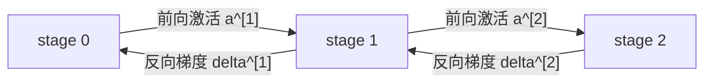

# 分布式训练基础

单卡训练的数学闭环已经在 [[training-mathematical-theory|深度学习训练的数学原理]] 中介绍过：前向计算得到预测和损失，反向传播得到参数梯度，优化器根据梯度更新参数。[[llm-training|大语言模型训练的数学原理]] 把同一套闭环具体化到了 decoder-only Transformer。本文继续回答另一个问题：

> 当一个 batch、一个模型或一个优化器状态放不进单张 GPU 时，训练公式怎样被拆到多张 GPU 上？

分布式训练不是改变训练目标，而是改变**计算、状态和通信的布局**。理想情况下，分布式训练得到的梯度应与某个等价的大 batch 或等价的完整模型训练一致；差异主要来自数值精度、通信时机、流水线调度、随机数和优化器实现细节。

本文只介绍理论基础，不展开框架接口和代码。通信原语的精确定义可以对照 [[communication-strategy|从 torchrun 到 NCCL：集合通信原语与接口实践]]。

## 单卡训练作为参照

设模型由 $L$ 个可微模块串联而成：

$$
\mathbf{h}^{(0)}=\mathbf{x},
\qquad
\mathbf{h}^{(\ell)}
=
f_\ell\left(\mathbf{h}^{(\ell-1)};\theta^{(\ell)}\right),
\qquad
\hat{\mathbf{y}}=\mathbf{h}^{(L)}.
$$

一个 mini-batch 的平均损失为：

$$
\mathcal L(\theta)
=
\frac{1}{B}
\sum_{i=1}^{B}
\ell\left(f_\theta(\mathbf{x}_i),\mathbf{y}_i\right).
$$

反向传播从损失对最后输出的梯度开始：

$$
\boldsymbol{\Delta}^{(L)}
=
\frac{\partial \mathcal L}{\partial \mathbf{h}^{(L)}}.
$$

对第 $\ell$ 层，局部反向可以抽象写成：

$$
\boxed{
\mathbf{g}^{(\ell)}
=
\frac{\partial \mathcal L}{\partial \theta^{(\ell)}},
\qquad
\boldsymbol{\Delta}^{(\ell-1)}
=
\frac{\partial \mathcal L}{\partial \mathbf{h}^{(\ell-1)}}
}
$$

其中 $\mathbf{g}^{(\ell)}$ 是这一层参数梯度，$\boldsymbol{\Delta}^{(\ell-1)}$ 是继续传给左侧层的激活梯度。以线性层为例，若：

$$
\mathbf{Y}=\mathbf{X}\mathbf{W},
\qquad
\mathbf{X}\in\mathbb{R}^{B\times d_{\text{in}}},
\qquad
\mathbf{W}\in\mathbb{R}^{d_{\text{in}}\times d_{\text{out}}},
$$

则：

$$
\boxed{
\nabla_{\mathbf{W}}\mathcal L
=
\mathbf{X}^{\mathsf T}\nabla_{\mathbf{Y}}\mathcal L,
\qquad
\nabla_{\mathbf{X}}\mathcal L
=
\nabla_{\mathbf{Y}}\mathcal L\mathbf{W}^{\mathsf T}
}
$$

优化器以 AdamW 为例，维护一阶、二阶动量：

$$
\mathbf{m}_t=\beta_1\mathbf{m}_{t-1}+(1-\beta_1)\mathbf{g}_t,
\qquad
\mathbf{v}_t=\beta_2\mathbf{v}_{t-1}+(1-\beta_2)\mathbf{g}_t\odot\mathbf{g}_t.
$$

再用偏置校正后的 $\hat{\mathbf{m}}_t,\hat{\mathbf{v}}_t$ 更新参数：

$$
\theta_{t+1}
=
\theta_t
-
\eta
\frac{\hat{\mathbf{m}}_t}{\sqrt{\hat{\mathbf{v}}_t}+\epsilon}
-
\eta\lambda\theta_t.
$$

所以一次训练 step 至少涉及四类状态：

| 状态 | 单卡语义 | 为什么分布式时重要 |
| --- | --- | --- |
| **权重** $\theta$ | 前向和反向都要读取 | 模型太大时不能每卡完整保存 |
| **激活值** $\mathbf{h}^{(\ell)}$ | 反向需要用前向中间结果 | batch、序列长度或层数变大时占用显存很高 |
| **梯度** $\mathbf{g}$ | 优化器更新前的参数导数 | 多个 rank 计算出的局部梯度需要合并或分片保存 |
| **优化器状态** $\mathbf{m},\mathbf{v}$ | AdamW 等优化器的历史状态 | 通常是参数量的 2 倍或更多，是大模型训练的显存大头 |

分布式训练的每一种并行方式，本质上都是回答下面四个问题：

- **前向怎么拆**：输入、层、矩阵维度或 token 是否被划分。
- **反向怎么合**：局部梯度怎样组成全局等价梯度。
- **状态放在哪里**：权重、激活、梯度、优化器状态是复制还是分片。
- **通信用什么原语**：需要 `AllReduce`、`AllGather`、`ReduceScatter`、`AlltoAll`，还是 `Send / Recv`。

## 通信原语速查

设一个通信组中有 $p$ 个 rank。本文用下面的数学语义描述通信：

| 原语 | 数学语义 | 在训练中的常见角色 |
| --- | --- | --- |
| `AllReduce(sum)` | 每个 rank 得到 $\sum_{r=0}^{p-1}\mathbf{x}_r$ | 数据并行梯度求和、张量并行局部结果求和 |
| `AllGather` | 每个 rank 得到 $[\mathbf{x}_0;\ldots;\mathbf{x}_{p-1}]$ | 参数重组、激活拼接、张量并行输出拼接 |
| `ReduceScatter(sum)` | 先求和，再让 rank $r$ 只保留第 $r$ 个分片 | FSDP 梯度分片、ZeRO 梯度同步 |
| `AlltoAll` | rank $i$ 给每个 rank $j$ 发送不同分片 | MoE token dispatch / combine |
| `Broadcast` | root 的数据复制给所有 rank | 初始化参数、同步少量控制信息 |
| `Send / Recv` | 指定两个 rank 之间传输张量 | pipeline 相邻 stage 传激活和激活梯度 |

`AllReduce` 可以理解成 `ReduceScatter + AllGather` 的组合。FSDP / ZeRO 这类分片方法经常故意保留前半段的结果，因为每张卡只需要自己的梯度或参数分片。

## DP：数据并行

**Data Parallelism（数据并行，DP）** 把 batch 切开，把模型完整复制到每张 GPU 上。每个 rank 处理不同样本，计算本地梯度，然后把梯度合并成全局梯度。

### 与单卡公式对照

单卡大 batch 损失为：

$$
\mathcal L(\theta)
=
\frac{1}{B}
\sum_{i=1}^{B}
\ell_i(\theta).
$$

如果有 $p$ 个数据并行 rank，每个 rank 处理 $B_{\text{local}}$ 个样本，总 batch 为：

$$
B_{\text{global}}=pB_{\text{local}}.
$$

rank $r$ 的本地损失为：

$$
\mathcal L_r(\theta)
=
\frac{1}{B_{\text{local}}}
\sum_{i\in\mathcal B_r}
\ell_i(\theta).
$$

若每个 rank 的 local batch 大小相同，则全局损失是：

$$
\boxed{
\mathcal L_{\text{global}}(\theta)
=
\frac{1}{p}
\sum_{r=0}^{p-1}
\mathcal L_r(\theta)
}
$$

对应梯度为：

$$
\boxed{
\nabla_\theta\mathcal L_{\text{global}}
=
\frac{1}{p}
\sum_{r=0}^{p-1}
\nabla_\theta\mathcal L_r
}
$$

因此 DP 的关键不是前向，而是**把所有 rank 的局部梯度求平均**。

### 前向计算

每个 rank 都持有完整参数副本 $\theta_r$，并保证初始时：

$$
\theta_0=\theta_1=\cdots=\theta_{p-1}.
$$

rank $r$ 的前向为：

$$
\mathbf{h}^{(L)}_r
=
f_{\theta_r}(\mathbf{X}_r),
\qquad
\mathcal L_r
=
\frac{1}{B_{\text{local}}}
\sum_{i\in\mathcal B_r}
\ell_i.
$$

前向阶段通常不需要跨 rank 通信，因为每个 rank 的样本互不依赖。

### 反向传播与梯度同步

每个 rank 先本地反向：

$$
\mathbf{g}_r
=
\nabla_{\theta_r}\mathcal L_r.
$$

然后执行梯度 `AllReduce(sum)`：

$$
\mathbf{g}_{\text{sum}}
=
\sum_{r=0}^{p-1}\mathbf{g}_r.
$$

如果本地 loss 已经按 $B_{\text{local}}$ 平均，那么等价全局平均梯度是：

$$
\boxed{
\mathbf{g}
=
\frac{1}{p}\mathbf{g}_{\text{sum}}
}
$$

所有 rank 用同一个 $\mathbf{g}$ 做优化器更新：

$$
\theta_{r,t+1}
=
\operatorname{Opt}\left(\theta_{r,t},\mathbf{g},\text{state}_{r,t}\right).
$$

只要每个 rank 的参数、梯度和优化器状态在更新前一致，更新后仍保持一致。

### 状态保存与划分

| 状态 | DP 中的布局 | 说明 |
| --- | --- | --- |
| 权重 $\theta$ | 每个 rank 完整复制 | 显存开销随 rank 数不下降 |
| 激活值 | 每个 rank 只保存本地 batch 的激活 | batch 被切开，所以单卡激活显存约随 $1/p$ 下降 |
| 梯度 $\mathbf{g}$ | 同步后每个 rank 完整复制 | 通过 `AllReduce` 保证一致 |
| 优化器状态 | 每个 rank 完整复制 | AdamW 的 $\mathbf{m},\mathbf{v}$ 不省显存 |

DP 适合模型本身能放进单卡、但希望扩大吞吐或全局 batch 的场景。它不能解决“单个模型副本放不下”的问题。

## PP：流水线并行

**Pipeline Parallelism（流水线并行，PP）** 按层切分模型。rank 只保存一段连续层，前向时激活从前一段流向后一段，反向时激活梯度从后一段流回前一段。

设模型被切成 $p$ 个 stage：

$$
f_\theta
=
F_{p-1}\circ F_{p-2}\circ\cdots\circ F_0,
$$

其中 stage $s$ 保存参数 $\theta^{[s]}$，负责一段层：

$$
\mathbf{a}^{[s+1]}
=
F_s\left(\mathbf{a}^{[s]};\theta^{[s]}\right).
$$

### 与单卡公式对照

单卡前向是：

$$
\mathbf{h}^{(L)}
=
f_L(\cdots f_2(f_1(\mathbf{x}))).
$$

PP 只是把层序列分段：

$$
\boxed{
\mathbf{a}^{[0]}=\mathbf{x},
\qquad
\mathbf{a}^{[s+1]}
=
F_s\left(\mathbf{a}^{[s]};\theta^{[s]}\right),
\qquad
\hat{\mathbf{y}}=\mathbf{a}^{[p]}
}
$$

最终 loss 仍然是：

$$
\mathcal L
=
\ell(\mathbf{a}^{[p]},\mathbf{y}).
$$

### 前向计算

stage $0$ 接收输入 batch 或 micro-batch，计算：

$$
\mathbf{a}^{[1]}
=
F_0(\mathbf{a}^{[0]};\theta^{[0]}),
$$

然后把边界激活 $\mathbf{a}^{[1]}$ 发送给 stage $1$。一般地：

$$
\boxed{
\text{stage }s:
\quad
\mathbf{a}^{[s+1]}
=
F_s(\mathbf{a}^{[s]};\theta^{[s]}),
\quad
\operatorname{Send}\left(\mathbf{a}^{[s+1]},s+1\right)
}
$$

最后一个 stage 计算 logits 和 loss。为了填满流水线，通常会把一个 mini-batch 再切成多个 micro-batch：

$$
B_{\text{global step}}
=
M\cdot B_{\text{micro}},
$$

其中 $M$ 是 micro-batch 数。流水线调度会影响空泡、显存和梯度累积时机，但不改变链式法则本身。

### 反向传播

最后一个 stage 从 loss 得到：

$$
\boldsymbol{\delta}^{[p]}
=
\frac{\partial\mathcal L}{\partial\mathbf{a}^{[p]}}.
$$

stage $s$ 收到右侧传回的 $\boldsymbol{\delta}^{[s+1]}$ 后，局部反向得到：

$$
\boxed{
\mathbf{g}^{[s]}
=
\frac{\partial\mathcal L}{\partial\theta^{[s]}},
\qquad
\boldsymbol{\delta}^{[s]}
=
\frac{\partial\mathcal L}{\partial\mathbf{a}^{[s]}}
}
$$

若 $s>0$，stage $s$ 再把 $\boldsymbol{\delta}^{[s]}$ 发送给 stage $s-1$：

$$
\operatorname{Send}\left(\boldsymbol{\delta}^{[s]},s-1\right).
$$

从数据流看，PP 的反向通信正好是前向通信的反方向：

### 状态保存与划分

| 状态 | PP 中的布局 | 说明 |
| --- | --- | --- |
| 权重 $\theta$ | 按层分片，每个 stage 保存自己的层 | 单个 rank 不再保存完整模型 |
| 激活值 | 每个 stage 保存本段内部反向需要的激活，以及发送出去的边界激活 | micro-batch 越多，未反向的激活越多 |
| 梯度 | 每个 stage 只保存本段参数梯度 | 若同一 stage 还做 DP，则 stage 内还要梯度 `AllReduce` |
| 优化器状态 | 每个 stage 只保存本段参数的优化器状态 | 优化器天然随参数按层切分 |

PP 的主要通信原语是相邻 stage 的 `Send / Recv`。它能降低单卡模型状态显存，但会引入流水线空泡，并且 stage 之间负载不均会让最慢 stage 决定吞吐。

## TP：张量并行

**Tensor Parallelism（张量并行，TP）** 把单个层内部的大矩阵切到多个 rank 上。它适合 Transformer 中巨大的线性层、attention 投影和 MLP 投影。

TP 的核心问题是：矩阵乘法 $\mathbf{Y}=\mathbf{X}\mathbf{W}$ 中，$\mathbf{W}$ 沿哪一维切分。下面只看线性层，attention 和 MLP 都可以还原成若干线性层加逐元素操作。

### 列并行线性层

列并行把输出维度切开：

$$
\mathbf{W}
=
\left[
\mathbf{W}_0,\mathbf{W}_1,\ldots,\mathbf{W}_{p-1}
\right],
\qquad
\mathbf{W}_r\in\mathbb{R}^{d_{\text{in}}\times d_{\text{out}}/p}.
$$

单卡公式是：

$$
\mathbf{Y}=\mathbf{X}\mathbf{W}.
$$

TP 后，rank $r$ 计算自己的输出分片：

$$
\boxed{
\mathbf{Y}_r
=
\mathbf{X}\mathbf{W}_r
}
$$

完整输出为：

$$
\mathbf{Y}
=
\left[
\mathbf{Y}_0,\mathbf{Y}_1,\ldots,\mathbf{Y}_{p-1}
\right].
$$

如果后续算子也按同样的输出维度分片，$\mathbf{Y}_r$ 可以继续留在本地；如果后续需要完整 $\mathbf{Y}$，则需要 `AllGather`。

反向时，若右侧传回的梯度也按列切分为 $\nabla_{\mathbf{Y}_r}\mathcal L$，则：

$$
\boxed{
\nabla_{\mathbf{W}_r}\mathcal L
=
\mathbf{X}^{\mathsf T}\nabla_{\mathbf{Y}_r}\mathcal L
}
$$

输入梯度来自所有输出分片的贡献：

$$
\nabla_{\mathbf{X}}\mathcal L
=
\sum_{r=0}^{p-1}
\nabla_{\mathbf{Y}_r}\mathcal L
\mathbf{W}_r^{\mathsf T}.
$$

因此每个 rank 先算局部输入梯度：

$$
\mathbf{D}_{X,r}
=
\nabla_{\mathbf{Y}_r}\mathcal L
\mathbf{W}_r^{\mathsf T},
$$

再通过 `AllReduce(sum)` 得到完整输入梯度：

$$
\boxed{
\nabla_{\mathbf{X}}\mathcal L
=
\operatorname{AllReduce}_{\text{sum}}(\mathbf{D}_{X,r})
}
$$

### 行并行线性层

行并行把输入维度切开：

$$
\mathbf{W}
=
\begin{bmatrix}
\mathbf{W}_0\\
\mathbf{W}_1\\
\vdots\\
\mathbf{W}_{p-1}
\end{bmatrix},
\qquad
\mathbf{W}_r\in\mathbb{R}^{d_{\text{in}}/p\times d_{\text{out}}}.
$$

输入也按隐藏维切开：

$$
\mathbf{X}
=
\left[
\mathbf{X}_0,\mathbf{X}_1,\ldots,\mathbf{X}_{p-1}
\right].
$$

如果 $\mathbf{X}\in\mathbb{R}^{B\times d_{\text{in}}}$，则：

$$
\mathbf{X}_r\in\mathbb{R}^{B\times d_{\text{in}}/p},
\qquad
\mathbf{Y}\in\mathbb{R}^{B\times d_{\text{out}}}.
$$

单卡输出：

$$
\mathbf{Y}
=
\mathbf{X}\mathbf{W}
=
\sum_{r=0}^{p-1}\mathbf{X}_r\mathbf{W}_r.
$$

TP 后 rank $r$ 先算局部部分和：

$$
\mathbf{Z}_r
=
\mathbf{X}_r\mathbf{W}_r.
$$

然后通过 `AllReduce(sum)` 得到完整输出：

$$
\boxed{
\mathbf{Y}
=
\operatorname{AllReduce}_{\text{sum}}(\mathbf{Z}_r)
}
$$

这一步 `AllReduce` 的结果是：**每个 rank 都拿到一份完整 $\mathbf{Y}$**，而不是只拿输出的一片。因此后续 loss 或下一层如果基于完整 $\mathbf{Y}$ 继续计算，反向时每个 rank 也会拿到完整的 $\nabla_{\mathbf{Y}}\mathcal L$。

反向时，若每个 rank 都拥有完整 $\nabla_{\mathbf{Y}}\mathcal L\in\mathbb{R}^{B\times d_{\text{out}}}$，则本 rank 只对自己的输入分片和权重分片求导：

$$
\boxed{
\nabla_{\mathbf{W}_r}\mathcal L
=
\mathbf{X}_r^{\mathsf T}
\nabla_{\mathbf{Y}}\mathcal L,
\qquad
\nabla_{\mathbf{X}_r}\mathcal L
=
\nabla_{\mathbf{Y}}\mathcal L
\mathbf{W}_r^{\mathsf T}
}
$$

这里两个梯度的形状分别是：

$$
\nabla_{\mathbf{W}_r}\mathcal L
\in
\mathbb{R}^{d_{\text{in}}/p\times d_{\text{out}}},
\qquad
\nabla_{\mathbf{X}_r}\mathcal L
\in
\mathbb{R}^{B\times d_{\text{in}}/p}.
$$

也就是说，虽然 $\nabla_{\mathbf{Y}}\mathcal L$ 是完整的，但 $\nabla_{\mathbf{X}_r}\mathcal L$ 不是完整输入梯度，而只是完整输入梯度沿隐藏维切开的第 $r$ 片：

$$
\nabla_{\mathbf{X}}
=
\left[
\nabla_{\mathbf{X}_0},\ldots,\nabla_{\mathbf{X}_{p-1}}
\right].
$$

接下来要不要把这些分片 `AllGather` 成完整 $\nabla_{\mathbf{X}}\mathcal L$，取决于**上一层前向输出 $\mathbf{X}$ 的布局**：

- 如果上一层的输出本来就是分片布局，例如上一层是列并行线性层并保留了 $\mathbf{X}_r$，那么反向传回 $\nabla_{\mathbf{X}_r}\mathcal L$ 正好匹配上一层的输出分片，**不需要 `AllGather`**。
- 如果上一层的输出是每个 rank 都完整复制的 $\mathbf{X}$，那么上一层反向需要完整 $\nabla_{\mathbf{X}}\mathcal L$，此时才需要用 `AllGather` 把 $[\nabla_{\mathbf{X}_0}\mathcal L,\ldots,\nabla_{\mathbf{X}_{p-1}}\mathcal L]$ 拼出来。

所以这句话的重点是：**激活梯度的通信不是固定每层都做，而是在相邻算子的布局不一致时才做布局转换**。

### TP 中的参数更新

TP group 内的每个参数 shard 都是**唯一归属**某个 rank 的，不需要在 TP 维度把 $\nabla_{\mathbf{W}_r}\mathcal L$ 再拼成完整 $\nabla_{\mathbf{W}}\mathcal L$ 才能更新。列并行和行并行虽然前向 / 激活梯度通信不同，但参数更新的原则相同：

$$
\boxed{
\mathbf{W}_{r,t+1}
=
\operatorname{Opt}
\left(
\mathbf{W}_{r,t},
\nabla_{\mathbf{W}_r}\mathcal L,
\text{state}_{r,t}
\right)
}
$$

以 AdamW 为例，rank $r$ 只为自己的参数分片维护动量：

$$
\mathbf{m}_{r,t}
=
\beta_1\mathbf{m}_{r,t-1}
+
(1-\beta_1)\nabla_{\mathbf{W}_r}\mathcal L,
$$

$$
\mathbf{v}_{r,t}
=
\beta_2\mathbf{v}_{r,t-1}
+
(1-\beta_2)
\nabla_{\mathbf{W}_r}\mathcal L
\odot
\nabla_{\mathbf{W}_r}\mathcal L.
$$

然后本地更新：

$$
\mathbf{W}_{r,t+1}
=
\mathbf{W}_{r,t}
-
\eta
\frac{\hat{\mathbf{m}}_{r,t}}{\sqrt{\hat{\mathbf{v}}_{r,t}}+\epsilon}
-
\eta\lambda\mathbf{W}_{r,t}.
$$

因此在**纯 TP** 中：

- **参数不 AllGather 后再更新**：完整 $\mathbf{W}$ 只是数学上的拼接视图，优化器实际只更新本 rank 的 $\mathbf{W}_r$。
- **优化器状态跟着参数 shard 走**：$\mathbf{m}_r,\mathbf{v}_r$ 与 $\mathbf{W}_r$ 同形状，不需要每个 rank 保存完整 Adam 状态。
- **TP 通信主要服务于激活 / 激活梯度**：例如列并行反向中的输入梯度 `AllReduce`，行并行前向中的输出 `AllReduce`。参数梯度本身通常已经是本地 shard 的梯度。

如果同时叠加 DP，则同一个 TP shard 会在不同 DP replica 中各有一份副本。此时需要在 **DP group** 内同步对应 shard 的梯度：

$$
\nabla_{\mathbf{W}_r}\mathcal L_{\text{global}}
=
\frac{1}{p_{\text{dp}}}
\sum_{q=0}^{p_{\text{dp}}-1}
\nabla_{\mathbf{W}_r}\mathcal L_q.
$$

这里的通信发生在 DP 维度，而不是 TP 维度。普通 DP 用 `AllReduce` 让每个副本得到同一个 shard 梯度；若叠加 FSDP / ZeRO，则可以用 `ReduceScatter` 让每个 rank 只保留进一步切分后的梯度 shard。

### Transformer 中的常见 TP 布局

Transformer 里的 TP 通常不是孤立地给每个线性层随便选一种切法，而是让相邻算子的布局互相配合。最典型的是 MLP 中的：

$$
\boxed{
\text{列并行线性层}
\rightarrow
\text{逐元素激活}
\rightarrow
\text{行并行线性层}
}
$$

这组布局的目的很明确：**中间维度通常很宽，尽量让中间激活保持分片，不在中间插入 `AllGather`。**

#### 普通 MLP 的完整公式

先看不做 TP 的两层 MLP。为简化记号，先用普通激活函数 $\phi$ 表示 GeLU、SiLU 这类逐元素函数：

$$
\mathbf{U}
=
\mathbf{X}\mathbf{W}_{\text{up}},
\qquad
\mathbf{A}
=
\phi(\mathbf{U}),
\qquad
\mathbf{Y}
=
\mathbf{A}\mathbf{W}_{\text{down}}.
$$

形状通常是：

$$
\mathbf{X}\in\mathbb{R}^{B\times d},
\qquad
\mathbf{W}_{\text{up}}\in\mathbb{R}^{d\times d_{ff}},
\qquad
\mathbf{W}_{\text{down}}\in\mathbb{R}^{d_{ff}\times d},
\qquad
\mathbf{Y}\in\mathbb{R}^{B\times d}.
$$

其中 $d_{ff}$ 往往比 $d$ 大很多，所以 $\mathbf{U},\mathbf{A}\in\mathbb{R}^{B\times d_{ff}}$ 是很大的中间激活。TP 的设计目标就是不要让每张卡都保存完整的 $\mathbf{U}$ 和 $\mathbf{A}$。

#### 第一步：列并行产生分片中间激活

把 $\mathbf{W}_{\text{up}}$ 沿输出维切开：

$$
\mathbf{W}_{\text{up}}
=
\left[
\mathbf{W}_{\text{up},0},
\ldots,
\mathbf{W}_{\text{up},p-1}
\right],
\qquad
\mathbf{W}_{\text{up},r}
\in
\mathbb{R}^{d\times d_{ff}/p}.
$$

rank $r$ 计算：

$$
\boxed{
\mathbf{U}_r
=
\mathbf{X}\mathbf{W}_{\text{up},r}
}
$$

此时完整中间激活只是数学上的拼接：

$$
\mathbf{U}
=
\left[
\mathbf{U}_0,\ldots,\mathbf{U}_{p-1}
\right],
\qquad
\mathbf{U}_r\in\mathbb{R}^{B\times d_{ff}/p}.
$$

注意这里**不需要马上 `AllGather` 成完整 $\mathbf{U}$**。因为下一步是逐元素激活，每个元素只依赖自己：

$$
A_{i,j}=\phi(U_{i,j}).
$$

所以 rank $r$ 可以直接本地计算：

$$
\boxed{
\mathbf{A}_r
=
\phi(\mathbf{U}_r)
}
$$

这就是“上一层输出本来就是分片的”的具体含义：列并行线性层的输出不是完整 $\mathbf{U}$，而是每个 rank 各自持有 $\mathbf{U}_r$；逐元素激活天然接受这种分片布局，因为它不需要访问别的 rank 的元素。

#### 第二步：行并行消费分片中间激活

接着把 $\mathbf{W}_{\text{down}}$ 沿输入维切开：

$$
\mathbf{W}_{\text{down}}
=
\begin{bmatrix}
\mathbf{W}_{\text{down},0}\\
\vdots\\
\mathbf{W}_{\text{down},p-1}
\end{bmatrix},
\qquad
\mathbf{W}_{\text{down},r}
\in
\mathbb{R}^{d_{ff}/p\times d}.
$$

这正好匹配本地中间激活 $\mathbf{A}_r$：

$$
\mathbf{A}_r
\in
\mathbb{R}^{B\times d_{ff}/p},
\qquad
\mathbf{W}_{\text{down},r}
\in
\mathbb{R}^{d_{ff}/p\times d}.
$$

rank $r$ 先算输出的局部贡献：

$$
\mathbf{Z}_r
=
\mathbf{A}_r\mathbf{W}_{\text{down},r}.
$$

完整输出需要把所有输入分片的贡献相加：

$$
\boxed{
\mathbf{Y}
=
\sum_{r=0}^{p-1}\mathbf{Z}_r
=
\operatorname{AllReduce}_{\text{sum}}(\mathbf{Z}_r)
}
$$

到这里才发生一次 `AllReduce`，使每个 rank 都重新得到完整 $\mathbf{Y}\in\mathbb{R}^{B\times d}$。这通常是合理的，因为 Transformer block 的残差相加、后续 norm、attention / MLP 分支入口往往希望残差流 $\mathbf{Y}$ 是完整复制布局。

整个前向数据流可以写成：

$$
\boxed{
\mathbf{X}
\xrightarrow{\text{列并行}}
\mathbf{U}_r
\xrightarrow{\text{逐元素激活}}
\mathbf{A}_r
\xrightarrow{\text{行并行局部 matmul}}
\mathbf{Z}_r
\xrightarrow{\text{AllReduce(sum)}}
\mathbf{Y}
}
$$

这里没有中间 `AllGather`，因为 $\mathbf{A}_r$ 的分片维度正好就是 $\mathbf{W}_{\text{down},r}$ 的输入维度。

#### 反向为什么也能保持中间梯度分片

反向从完整 $\nabla_{\mathbf{Y}}\mathcal L$ 开始。行并行层本地计算：

$$
\nabla_{\mathbf{W}_{\text{down},r}}\mathcal L
=
\mathbf{A}_r^{\mathsf T}
\nabla_{\mathbf{Y}}\mathcal L,
\qquad
\nabla_{\mathbf{A}_r}\mathcal L
=
\nabla_{\mathbf{Y}}\mathcal L
\mathbf{W}_{\text{down},r}^{\mathsf T}.
$$

这里得到的 $\nabla_{\mathbf{A}_r}\mathcal L$ 是分片梯度，形状是 $B\times d_{ff}/p$。它正好可以传给逐元素激活的反向：

$$
\nabla_{\mathbf{U}_r}\mathcal L
=
\nabla_{\mathbf{A}_r}\mathcal L
\odot
\phi'(\mathbf{U}_r).
$$

逐元素激活反向也不需要别的 rank 的数据，因为第 $j$ 个元素的梯度只依赖第 $j$ 个元素的前向值和上游梯度。

最后回到列并行线性层。rank $r$ 计算自己的权重梯度：

$$
\nabla_{\mathbf{W}_{\text{up},r}}\mathcal L
=
\mathbf{X}^{\mathsf T}
\nabla_{\mathbf{U}_r}\mathcal L.
$$

输入梯度 $\nabla_{\mathbf{X}}\mathcal L$ 需要汇总所有输出分片对 $\mathbf{X}$ 的贡献：

$$
\nabla_{\mathbf{X}}\mathcal L
=
\sum_{r=0}^{p-1}
\nabla_{\mathbf{U}_r}\mathcal L
\mathbf{W}_{\text{up},r}^{\mathsf T}.
$$

所以列并行线性层的反向通常需要一次 `AllReduce(sum)` 来得到完整 $\nabla_{\mathbf{X}}\mathcal L$：

$$
\boxed{
\nabla_{\mathbf{X}}\mathcal L
=
\operatorname{AllReduce}_{\text{sum}}
\left(
\nabla_{\mathbf{U}_r}\mathcal L
\mathbf{W}_{\text{up},r}^{\mathsf T}
\right)
}
$$

这条反向链说明了为什么“上一层输出本来就是分片”时不需要 `AllGather`：

- 行并行层反向产出的 $\nabla_{\mathbf{A}_r}\mathcal L$ 是分片的；
- 逐元素激活前向输入也是分片的 $\mathbf{U}_r$，所以它的反向正好吃分片梯度；
- 列并行层前向输出也是分片的 $\mathbf{U}_r$，所以它的反向也正好吃 $\nabla_{\mathbf{U}_r}\mathcal L$；
- 只有当梯度回到完整输入 $\mathbf{X}$ 时，才需要通过 `AllReduce` 汇总各 rank 对 $\mathbf{X}$ 的贡献。

#### SwiGLU 的情况

Llama 这类模型常用 SwiGLU，而不是简单的 $\phi(\mathbf{X}\mathbf{W}_{\text{up}})$。普通公式可写成：

$$
\mathbf{A}
=
\operatorname{SiLU}(\mathbf{X}\mathbf{W}_{\text{gate}})
\odot
(\mathbf{X}\mathbf{W}_{\text{up}}),
\qquad
\mathbf{Y}
=
\mathbf{A}\mathbf{W}_{\text{down}}.
$$

TP 时通常把 $\mathbf{W}_{\text{gate}}$ 和 $\mathbf{W}_{\text{up}}$ 都按输出维列并行切分：

$$
\mathbf{G}_r
=
\mathbf{X}\mathbf{W}_{\text{gate},r},
\qquad
\mathbf{U}_r
=
\mathbf{X}\mathbf{W}_{\text{up},r}.
$$

然后本地计算：

$$
\boxed{
\mathbf{A}_r
=
\operatorname{SiLU}(\mathbf{G}_r)
\odot
\mathbf{U}_r
}
$$

因为 $\operatorname{SiLU}$ 和 $\odot$ 都是逐元素操作，rank $r$ 不需要其他 rank 的 $\mathbf{G}_{r'}$ 或 $\mathbf{U}_{r'}$。接着 `down_proj` 做行并行：

$$
\mathbf{Y}
=
\operatorname{AllReduce}_{\text{sum}}
\left(
\mathbf{A}_r\mathbf{W}_{\text{down},r}
\right).
$$

所以 SwiGLU 里的 `gate_proj`、`up_proj`、`down_proj` 很自然地对应：

| 模块 | TP 切法 | 输出布局 |
| --- | --- | --- |
| `gate_proj` | 列并行 | $\mathbf{G}_r$ 分片 |
| `up_proj` | 列并行 | $\mathbf{U}_r$ 分片 |
| `SiLU` 与逐元素乘法 | 本地逐元素计算 | $\mathbf{A}_r$ 分片 |
| `down_proj` | 行并行 | `AllReduce(sum)` 后得到完整 $\mathbf{Y}$ |

在 attention 中：

- $Q,K,V$ 投影常按 head 维度切分，每个 rank 负责一部分 attention heads。
- 每个 rank 可以本地完成自己 heads 的 softmax attention。
- 输出投影再把各 head 的贡献合并，通常需要行并行中的 `AllReduce(sum)`。

### 状态保存与划分

| 状态 | TP 中的布局 | 说明 |
| --- | --- | --- |
| 权重 $\theta$ | 层内矩阵按列、行或 head 分片 | 单层参数显存随 TP size 下降 |
| 激活值 | 可能完整，也可能按隐藏维或 head 分片 | 取决于相邻算子的分片约定 |
| 梯度 | 参数梯度随参数分片；激活梯度可能需要求和或拼接 | 常见通信是 `AllReduce` 与 `AllGather` |
| 优化器状态 | 通常随参数分片 | 每个 rank 只维护本地权重分片的 Adam 状态 |

TP 的优点是能拆开单层大矩阵，缺点是层内通信频繁，通常要求同一 TP group 内 GPU 之间有高带宽互连。

## SDP / FSDP：分片数据并行

**Sharded Data Parallelism（分片数据并行，SDP）** 仍然按数据并行处理不同样本，但不再让每个 rank 长期保存完整的参数、梯度和优化器状态。**Fully Sharded Data Parallel（FSDP）** 可以看作更彻底的 SDP：参数、梯度、优化器状态都分片保存。

这一类方法常和 ZeRO 的三个阶段对应理解：

| 方法 | 参数 | 梯度 | 优化器状态 | 核心收益 |
| --- | --- | --- | --- | --- |
| 普通 DP | 复制 | 复制 | 复制 | 简单，主要扩 batch |
| ZeRO-1 | 复制 | 复制 | 分片 | 省优化器状态 |
| ZeRO-2 | 复制 | 分片 | 分片 | 再省梯度 |
| ZeRO-3 / FSDP | 分片 | 分片 | 分片 | 进一步省参数 |

下面按 FSDP / ZeRO-3 的理论语义介绍。

### 参数分片

设某层参数展平成向量：

$$
\theta^{(\ell)}
=
\left[
\theta^{(\ell)}_0;
\theta^{(\ell)}_1;
\ldots;
\theta^{(\ell)}_{p-1}
\right].
$$

rank $r$ 长期只保存自己的参数分片：

$$
\theta^{(\ell)}_r.
$$

但计算第 $\ell$ 层前向时通常需要完整参数 $\theta^{(\ell)}$。因此每个 rank 在进入该层前执行 `AllGather`：

$$
\boxed{
\theta^{(\ell)}
=
\operatorname{AllGather}
\left(
\theta^{(\ell)}_r
\right)
}
$$

得到完整参数后，rank $r$ 用自己的本地 batch 计算：

$$
\mathbf{h}^{(\ell)}_r
=
f_\ell
\left(
\mathbf{h}^{(\ell-1)}_r;\theta^{(\ell)}
\right).
$$

层计算结束后，完整参数副本可以释放，只保留本地 shard。

### 反向传播

反向到第 $\ell$ 层时，如果前向后已经释放了完整参数，需要再次 `AllGather` 得到 $\theta^{(\ell)}$。rank $r$ 对本地 batch 计算完整参数梯度：

$$
\tilde{\mathbf{g}}^{(\ell)}_r
=
\nabla_{\theta^{(\ell)}}
\mathcal L_r.
$$

全局平均梯度仍是 DP 公式：

$$
\mathbf{g}^{(\ell)}
=
\frac{1}{p}
\sum_{r=0}^{p-1}
\tilde{\mathbf{g}}^{(\ell)}_r.
$$

但 FSDP 不需要每个 rank 都保存完整 $\mathbf{g}^{(\ell)}$。它执行 `ReduceScatter(sum)`，直接得到全局梯度的本地分片：

$$
\boxed{
\mathbf{g}^{(\ell)}_r
=
\operatorname{ReduceScatter}_{\text{sum}}
\left(
\tilde{\mathbf{g}}^{(\ell)}_0,\ldots,\tilde{\mathbf{g}}^{(\ell)}_{p-1}
\right)_r
}
$$

若 loss 是本地平均，还需要除以 $p$：

$$
\mathbf{g}^{(\ell)}_r
\leftarrow
\frac{1}{p}\mathbf{g}^{(\ell)}_r.
$$

然后 rank $r$ 只更新自己的参数分片：

$$
\theta^{(\ell)}_{r,t+1}
=
\operatorname{Opt}
\left(
\theta^{(\ell)}_{r,t},
\mathbf{g}^{(\ell)}_{r,t},
\text{state}^{(\ell)}_{r,t}
\right).
$$

优化器状态也按同样分片保存：

$$
\mathbf{m}^{(\ell)}
=
[\mathbf{m}^{(\ell)}_0;\ldots;\mathbf{m}^{(\ell)}_{p-1}],
\qquad
\mathbf{v}^{(\ell)}
=
[\mathbf{v}^{(\ell)}_0;\ldots;\mathbf{v}^{(\ell)}_{p-1}].
$$

### 与普通 DP 的等价关系

FSDP 的训练目标仍是：

$$
\mathcal L_{\text{global}}
=
\frac{1}{p}\sum_{r=0}^{p-1}\mathcal L_r.
$$

区别在于普通 DP 先让每个 rank 得到完整平均梯度：

$$
\mathbf{g}^{(\ell)}
=
\operatorname{AllReduce}_{\text{avg}}
\left(
\tilde{\mathbf{g}}^{(\ell)}_r
\right),
$$

而 FSDP 只让 rank $r$ 得到其中第 $r$ 个分片：

$$
\mathbf{g}^{(\ell)}_r
=
\operatorname{Shard}_r
\left(
\operatorname{AllReduce}_{\text{avg}}
\left(
\tilde{\mathbf{g}}^{(\ell)}
\right)
\right).
$$

从数学结果看，FSDP 的本地 shard 等价于“先做完整 AllReduce，再切片”；从通信实现看，它通常用 `ReduceScatter` 避免形成完整梯度副本。

### 状态保存与划分

| 状态 | FSDP 中的布局 | 说明 |
| --- | --- | --- |
| 权重 $\theta$ | 长期分片，计算层时临时 `AllGather` 成完整参数 | 完整参数副本生命周期很短 |
| 激活值 | 默认仍按数据并行本地 batch 保存，不因 FSDP 自动分片 | 常配合 activation checkpointing 降低激活显存 |
| 梯度 | `ReduceScatter` 后只保留本地 shard | 不长期保存完整梯度 |
| 优化器状态 | 随参数 shard 保存 | AdamW 的 $\mathbf{m},\mathbf{v}$ 显存约随 shard size 下降 |

FSDP 的主要通信原语是参数 `AllGather` 和梯度 `ReduceScatter`。它的瓶颈常在通信与计算重叠、参数 gather 粒度、释放时机和重算策略，而不是数学目标本身。

## EP：专家并行

**Expert Parallelism（专家并行，EP）** 主要用于 Mixture of Experts（MoE）模型。MoE 不让每个 token 通过同一个 MLP，而是先用 router 选择少数专家，再只计算这些专家。

设一层 MoE 有 $E$ 个专家，每个专家是一个函数 $E_e(\cdot;\theta_e)$。对 token 表示 $\mathbf{x}_i$，router 产生 logits：

$$
\mathbf{s}_i
=
\mathbf{x}_i\mathbf{W}_g,
\qquad
\boldsymbol{\alpha}_i
=
\operatorname{softmax}(\mathbf{s}_i).
$$

若使用 top-$k$ 路由，选择集合为：

$$
\mathcal T_i
=
\operatorname{TopK}(\boldsymbol{\alpha}_i,k).
$$

MoE 输出为：

$$
\boxed{
\mathbf{y}_i
=
\sum_{e\in\mathcal T_i}
\alpha_{i,e}
E_e(\mathbf{x}_i;\theta_e)
}
$$

当 $k=1$ 时，每个 token 只进一个专家；当 $k=2$ 时，每个 token 进两个专家并加权求和。

### 前向计算

EP 把专家分布到不同 rank 上。设专家 $e$ 的 owner rank 为 $o(e)$。每个 rank 起初持有一批 token 表示 $\mathbf{X}_r$，先本地计算 router：

$$
\mathcal T_i,\alpha_{i,e}
=
\operatorname{Router}(\mathbf{x}_i).
$$

然后按专家 owner 把 token 重排并发送：

$$
\operatorname{Dispatch}_{r\to q}
=
\left\{
\mathbf{x}_i
\mid
\exists e\in\mathcal T_i,\ o(e)=q
\right\}.
$$

这个“每个 rank 给不同 rank 发送不同 token 桶”的模式正是 `AlltoAll`：

$$
\boxed{
\text{expert 输入桶}
=
\operatorname{AlltoAll}
\left(
\text{按目的专家 rank 分桶的 token}
\right)
}
$$

收到 token 后，rank $q$ 只计算自己拥有的专家：

$$
\mathbf{u}_{i,e}
=
E_e(\mathbf{x}_i;\theta_e),
\qquad
o(e)=q.
$$

专家输出再通过第二次 `AlltoAll` 返回 token 原来的 rank。原 rank 根据 router 权重组合：

$$
\mathbf{y}_i
=
\sum_{e\in\mathcal T_i}
\alpha_{i,e}\mathbf{u}_{i,e}.
$$

### 反向传播

设右侧传回 $\nabla_{\mathbf{y}_i}\mathcal L$。组合公式：

$$
\mathbf{y}_i
=
\sum_{e\in\mathcal T_i}\alpha_{i,e}\mathbf{u}_{i,e}
$$

给出两个局部梯度：

$$
\boxed{
\nabla_{\mathbf{u}_{i,e}}\mathcal L
=
\alpha_{i,e}\nabla_{\mathbf{y}_i}\mathcal L
}
$$

以及 router 权重梯度：

$$
\boxed{
\frac{\partial\mathcal L}{\partial \alpha_{i,e}}
=
\left\langle
\nabla_{\mathbf{y}_i}\mathcal L,
\mathbf{u}_{i,e}
\right\rangle
}
$$

其中 $\langle\cdot,\cdot\rangle$ 表示向量内积。$\nabla_{\mathbf{u}_{i,e}}\mathcal L$ 需要沿前向返回路径发送给专家所在 rank，通常仍是 `AlltoAll`。

专家 rank 对本地专家执行普通反向：

$$
\nabla_{\theta_e}\mathcal L
=
\sum_{i:e\in\mathcal T_i}
\frac{\partial\mathcal L}{\partial \mathbf{u}_{i,e}}
\frac{\partial E_e(\mathbf{x}_i;\theta_e)}{\partial\theta_e}.
$$

同时得到 token 输入梯度：

$$
\nabla_{\mathbf{x}_i}^{\text{expert}}
=
\sum_{e\in\mathcal T_i}
\alpha_{i,e}
\frac{\partial E_e(\mathbf{x}_i;\theta_e)}{\partial\mathbf{x}_i}^{\mathsf T}
\nabla_{\mathbf{u}_{i,e}}\mathcal L.
$$

这些输入梯度再通过反向 `AlltoAll` 回到 token 原 rank，并与 router 分支产生的梯度相加：

$$
\nabla_{\mathbf{x}_i}\mathcal L
=
\nabla_{\mathbf{x}_i}^{\text{expert}}
+
\nabla_{\mathbf{x}_i}^{\text{router}}.
$$

### 状态保存与划分

| 状态 | EP 中的布局 | 说明 |
| --- | --- | --- |
| 专家权重 $\theta_e$ | 按专家分片，owner rank 保存对应专家 | 专家数增大时参数量可以随 EP 扩展 |
| 共享权重 | 通常仍用 DP、TP 或 FSDP 处理 | attention、embedding、router 等不一定按专家切 |
| 激活值 | 需要保存 router logits / top-k 结果、token permutation、专家输入激活 | 反向要知道 token 被送到哪个专家 |
| 专家梯度 | owner rank 本地计算和保存 | 若专家还有数据并行副本，则专家梯度也要同步 |
| 优化器状态 | 随专家权重放在 owner rank | 专家参数的 Adam 状态不需要每卡完整复制 |

EP 的核心通信原语是 `AlltoAll`。它的数学收益来自稀疏激活：每个 token 只计算少数专家；它的系统难点是 token 分布可能不均，导致某些专家过载。

## HP：混合并行

**Hybrid Parallelism（混合并行，HP）**不是一种新的数学并行，而是把 DP、PP、TP、FSDP、EP 组合起来。大模型训练通常至少是 3D parallelism（DP + PP + TP），MoE 模型还会加入 EP，参数状态压力大时再叠加 FSDP / ZeRO。

### 进程组视角

设总 GPU 数为：

$$
P
=
p_{\text{dp}}
\cdot
p_{\text{pp}}
\cdot
p_{\text{tp}}
\cdot
p_{\text{ep}}.
$$

实际训练会把 rank 组织成多个正交通信组：

| 维度 | 组内 rank 做什么 | 主要通信 |
| --- | --- | --- |
| DP / FSDP group | 处理不同数据副本，合并或分片梯度 | `AllReduce`、`ReduceScatter`、`AllGather` |
| PP group | 相邻 stage 传激活和激活梯度 | `Send / Recv` |
| TP group | 同一层内部切矩阵或 attention heads | `AllReduce`、`AllGather`、`ReduceScatter` |
| EP group | MoE token 在专家 owner 之间重排 | `AlltoAll` |

可以把一个 rank 看成多维坐标：

$$
\operatorname{rank}
\leftrightarrow
(i_{\text{dp}},i_{\text{pp}},i_{\text{tp}},i_{\text{ep}}).
$$

不同公式只在对应维度的通信组里发生。例如 TP 的 `AllReduce` 不应该跨 DP group；PP 的 `Send / Recv` 只发生在同一 pipeline 链的相邻 stage。

### 前向组合公式

对一个 micro-batch，混合并行的前向可以概括为：

1. **DP 维度**：不同 $i_{\text{dp}}$ 处理不同样本 $\mathbf{X}_{i_{\text{dp}}}$。
2. **PP 维度**：样本激活按 stage 顺序流动：

$$
\mathbf{a}^{[s+1]}
=
F_s(\mathbf{a}^{[s]};\theta^{[s]}).
$$

3. **TP 维度**：stage 内部的线性层按矩阵维度分片，例如：

$$
\mathbf{Y}
=
\sum_{j=0}^{p_{\text{tp}}-1}
\mathbf{X}_j\mathbf{W}_j.
$$

4. **EP 维度**：MoE 层把 token dispatch 到专家 owner：

$$
\mathbf{y}_i
=
\sum_{e\in\mathcal T_i}
\alpha_{i,e}E_e(\mathbf{x}_i;\theta_e).
$$

5. **FSDP 维度**：某层计算前临时 gather 参数：

$$
\theta^{(\ell)}
=
\operatorname{AllGather}(\theta^{(\ell)}_r).
$$

这些操作可以嵌套。例如一个 pipeline stage 内部可能包含 TP 切分的 attention、EP 切分的 MoE MLP，同时这个 stage 的参数还被 FSDP 分片。

### 反向组合公式

反向沿前向的相反方向执行：

- PP 先把 $\boldsymbol{\delta}^{[s+1]}$ 从右侧 stage 传回 stage $s$，局部求 $\mathbf{g}^{[s]}$ 和 $\boldsymbol{\delta}^{[s]}$。
- TP 在线性层内部把局部矩阵梯度保留在本 rank，对需要求和的激活梯度或输出执行 `AllReduce`。
- EP 把专家输出梯度通过 `AlltoAll` 发回专家 owner，计算专家参数梯度，再把 token 输入梯度送回原 rank。
- FSDP 对本地 batch 产生的完整参数梯度执行 `ReduceScatter`，只保留本 rank 的梯度 shard。
- DP 语义要求所有数据副本最终使用等价的全局平均梯度；在普通 DP 中表现为 `AllReduce`，在 FSDP 中表现为 `ReduceScatter` 后的梯度 shard。

从目标函数看，混合并行仍然是在优化：

$$
\mathcal L_{\text{global}}
=
\frac{1}{B_{\text{global}}}
\sum_{i=1}^{B_{\text{global}}}
\ell(f_\theta(\mathbf{x}_i),\mathbf{y}_i).
$$

只是 $f_\theta$ 的一次前向和 $\nabla_\theta\mathcal L$ 的一次反向被拆成了多组局部计算和通信。

### 状态组合

混合并行下，状态布局要逐维理解：

| 状态 | 可能的组合布局 | 典型解释 |
| --- | --- | --- |
| 权重 | PP 按层切，TP 按矩阵切，EP 按专家切，FSDP 再按 shard 切 | 一个 rank 只持有“自己 stage、自己 TP shard、自己专家、自己 FSDP shard”的交集 |
| 激活值 | DP 按样本切，PP 保存本 stage 的 micro-batch 激活，TP / EP 可能保存分片激活和路由信息 | 激活不一定随参数同样分片，经常需要 checkpointing |
| 梯度 | 随参数分片保存，但要在 DP / FSDP 维度合并数据贡献 | 普通 DP 用 `AllReduce`，FSDP 用 `ReduceScatter` |
| 优化器状态 | 通常跟随参数最终 owner 保存 | AdamW 状态应与对应参数 shard 对齐 |

HP 的设计目标是在三类资源之间找平衡：

- **显存**：参数、梯度、优化器状态和激活是否放得下。
- **计算**：每个 rank 的 FLOPs 是否均衡，pipeline 是否有空泡。
- **通信**：通信量、通信频率和网络拓扑是否匹配。

## 常见并行方式对照

| 并行方式 | 切分对象 | 前向通信 | 反向通信 | 主要节省 |
| --- | --- | --- | --- | --- |
| DP | batch | 通常无 | 梯度 `AllReduce` | 激活随 batch 切分，吞吐扩展 |
| PP | 层 | 相邻 stage `Send / Recv` 激活 | 相邻 stage `Send / Recv` 激活梯度 | 参数、优化器状态按层切 |
| TP | 层内矩阵 / attention head | `AllReduce` 或 `AllGather` | `AllReduce`、`AllGather` 或 `ReduceScatter` | 单层参数和计算拆分 |
| SDP / FSDP | 参数、梯度、优化器状态 shard | 参数 `AllGather` | 梯度 `ReduceScatter` | 参数、梯度、优化器状态显存 |
| EP | MoE expert 与 token 路由 | token `AlltoAll` | token 梯度 `AlltoAll` | 专家参数和专家计算扩展 |
| HP | 多个维度同时切 | 取决于组合 | 取决于组合 | 同时解决模型、batch、状态和吞吐瓶颈 |

## 复习：六种并行的核心公式

- **DP**：

$$
\nabla_\theta\mathcal L_{\text{global}}
=
\frac{1}{p}\sum_{r=0}^{p-1}
\nabla_\theta\mathcal L_r.
$$

- **PP**：

$$
\mathbf{a}^{[s+1]}
=
F_s(\mathbf{a}^{[s]};\theta^{[s]}),
\qquad
\boldsymbol{\delta}^{[s]}
=
\frac{\partial\mathcal L}{\partial\mathbf{a}^{[s]}}.
$$

- **列并行 TP**：

$$
\mathbf{Y}_r=\mathbf{X}\mathbf{W}_r,
\qquad
\nabla_{\mathbf{X}}\mathcal L
=
\sum_r
\nabla_{\mathbf{Y}_r}\mathcal L\mathbf{W}_r^{\mathsf T}.
$$

- **行并行 TP**：

$$
\mathbf{Y}
=
\sum_r\mathbf{X}_r\mathbf{W}_r,
\qquad
\nabla_{\mathbf{X}_r}\mathcal L
=
\nabla_{\mathbf{Y}}\mathcal L\mathbf{W}_r^{\mathsf T}.
$$

- **FSDP**：

$$
\theta^{(\ell)}
=
\operatorname{AllGather}(\theta^{(\ell)}_r),
\qquad
\mathbf{g}^{(\ell)}_r
=
\frac{1}{p}
\operatorname{ReduceScatter}_{\text{sum}}
\left(
\tilde{\mathbf{g}}^{(\ell)}_0,\ldots,\tilde{\mathbf{g}}^{(\ell)}_{p-1}
\right)_r.
$$

- **EP**：

$$
\mathbf{y}_i
=
\sum_{e\in\operatorname{TopK}(i)}
\alpha_{i,e}E_e(\mathbf{x}_i;\theta_e),
\qquad
\text{token dispatch / combine}
=
\operatorname{AlltoAll}.
$$

把这些公式放在一起看，分布式训练的主线很简单：**前向必须让每个局部算子拿到它需要的输入和权重；反向必须把每个局部贡献合成为等价的全局梯度；优化器状态必须和最终负责更新的参数 shard 对齐。**
