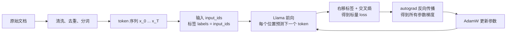
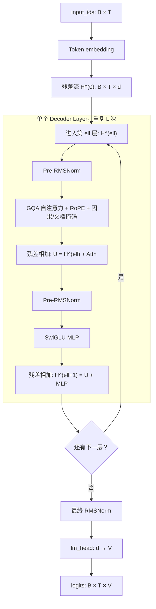
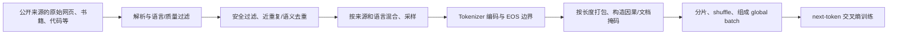

# 大语言模型训练的数学原理

大语言模型（Large Language Model，LLM）训练的核心并不神秘：它仍然是在最小化一个损失并用反向传播更新参数。变化在于，模型不再接收一个固定维度的样本并只输出一个类别；它接收一段长度可变的 token 序列，并在**每一个位置**输出“下一个 token 是什么”的完整概率分布。

因此，LLM 的预训练可以概括为一句话：

> 给定前缀 $x_{<t}$，让模型分配给真实下一个 token $x_t$ 的条件概率尽可能大。

这篇笔记承接 [深度学习训练的数学原理](./training-mathematical-theory.md)。上一篇已经建立了“前向计算 $\rightarrow$ 标量损失 $\rightarrow$ 链式法则反向传播 $\rightarrow$ 优化器更新”的通用闭环；本文只把这个闭环具体化到 decoder-only Transformer。重点是理解每个张量、每个公式和 Transformers 源码接口在训练中究竟扮演什么角色。

本文所称的“Llama 3”，主要指原始 Llama 3 8B/70B 所采用的文本 decoder-only 架构思想；代码以 **Transformers 5.9.0** 的 `transformers.models.llama` 为准。库中的 `LlamaConfig` 默认值兼容较早的 Llama 配置，实际 Llama 3 checkpoint 会用自己的 `config.json` 覆盖这些值，不能把默认的 `vocab_size=32000` 当成 Llama 3 的真实词表大小。

## 先建立全局图景



注意 `labels = input_ids` 并不意味着模型在位置 $t$ 预测自己的输入 $x_t$。模型输出位置 $t$ 的 logits 会和**右移一位后的标签** $x_{t+1}$ 对齐。这个“移位”是因果语言模型的关键。

## 统一符号、形状与概率记号

以下约定与 PyTorch/Transformers 的批量布局一致：batch 在前，序列维在中，隐藏维在后。

| 符号 | 含义 | 典型形状 |
| --- | --- | --- |
| $B$ | 一个 micro-batch 中的序列数 | 标量 |
| $T$ | 每个打包序列的 token 数 | 标量 |
| $V$ | 词表大小 | 标量；Llama 3 为 $128\,256$ |
| $d$ | `hidden_size`，残差流宽度 | 标量 |
| $L$ | Transformer block 层数 | 标量 |
| $H$、$H_{kv}$ | Query 头数、KV 头数 | 标量 |
| $d_h$ | 每个头的宽度，通常 $d/H$ | 标量 |
| $d_{ff}$ | MLP 中间层宽度 | 标量 |
| $\mathbf{X}$ | token id 整数张量 | $\{0,\ldots,V-1\}^{B\times T}$ |
| $\mathbf{H}^{(\ell)}$ | 第 $\ell$ 层残差流 | $\mathbb{R}^{B\times T\times d}$ |
| $\mathbf{Z}$ | 未归一化分类分数 logits | $\mathbb{R}^{B\times T\times V}$ |
| $\theta$ | 所有可训练参数 | 由模型决定 |

一个 Llama 3 8B 的常见配置是 $L=32$、$d=4096$、$H=32$、$H_{kv}=8$、$d_h=128$、$d_{ff}=14336$；70B 则更宽更深。这里的“8B”是参数量级，不是精确等于八十亿个独立的浮点数。架构公式对任意这些超参数均成立。

为了简化推导，下文常省略 batch 下标，只写一条长度为 $T$ 的序列 $x_{0:T-1}$。矩阵乘法按“每个 token 一行”书写；真正实现只是多出一个可广播的 batch 维。

## 从分类训练到语言生成训练

### 分类模型学的是一个有限标签分布

上一篇文章中的单标签分类样本是 $(\mathbf{u}, y)$：输入 $\mathbf{u}$ 可以是一张图片或一个固定维特征，标签 $y\in\{1,\ldots,C\}$ 由人工标注。分类网络产生 logits $\mathbf{z}\in\mathbb{R}^{C}$，再由 softmax 给出：

$$
p_\theta(y=c\mid \mathbf{u})
=
\frac{\exp(z_c)}{\sum_{j=1}^{C}\exp(z_j)}.
$$

对于真实类别 $y$，负对数似然（也就是交叉熵）为：

$$
\ell_{\text{cls}}
= -\log p_\theta(y\mid\mathbf{u})
= -z_y + \log\sum_{c=1}^{C}\exp(z_c).
$$

它要求模型为正确类分配更大概率。分类模型常只在一个样本末端产生一次 $C$ 类选择。

### 自回归模型学的是整段文本的联合分布

语言的一条样本本身就是一个序列：

$$
\mathbf{x}=(x_0,x_1,\ldots,x_{T-1}),\qquad x_t\in\{0,\ldots,V-1\}.
$$

任意联合分布都可由概率链式法则严格分解为：

$$
\boxed{
p_\theta(x_0,\ldots,x_{T-1})
= p_\theta(x_0)
  \prod_{t=1}^{T-1}p_\theta(x_t\mid x_{<t})
}
$$

其中 $x_{<t}=(x_0,\ldots,x_{t-1})$ 是位置 $t$ 左侧的前缀。实践中会在开头加入 BOS（begin of sequence）token，并把目标写为从 $x_1$ 开始的“预测下一个 token”；这只是索引约定的差异。

取负对数，乘积变成求和：

$$
-\log p_\theta(\mathbf{x})
= -\sum_{t=1}^{T-1}\log p_\theta(x_t\mid x_{<t}).
$$

所以语言模型并没有发明一种全新的损失：**它在每个位置都做一次 $V$ 分类，并把这些分类交叉熵相加或平均。** 不同之处在于：

- 分类任务的标签通常来自人；预训练语言模型的标签直接来自同一段原始文本右侧的 token，故称**自监督学习**。
- 同一个序列一次前向会产生约 $T-1$ 个监督位置，而不是一个。
- 条件 $x_{<t}$ 长度随 $t$ 增长，且模型必须保证不能偷看 $x_t$ 及未来 token。
- 推理时模型把自己已经生成的 token 接到前缀后，再采样下一个 token，因而把训练时的条件分布串成一段文本。

### 最大似然、交叉熵与困惑度

对数据集 $\mathcal{D}$ 中所有有效预测位置，最大似然估计为：

$$
\theta^\star
= \arg\max_\theta
\sum_{\mathbf{x}\in\mathcal D}\sum_{t=1}^{T-1}
\log p_\theta(x_t\mid x_{<t}).
$$

训练框架习惯最小化其相反数。设一个 batch 中有效（未 padding、未被忽略）的目标 token 集合是 $\mathcal I$，则 token 平均损失是：

$$
\boxed{
\mathcal L_{\text{NLL}}
=-\frac{1}{|\mathcal I|}
\sum_{(b,t)\in\mathcal I}
\log p_\theta\left(x^{(b)}_{t+1}\mid x^{(b)}_{\le t}\right)
}
$$

当经验数据分布记为 $p_{\text{data}}$ 时，这还是条件分布的交叉熵：

$$
H(p_{\text{data}},p_\theta)
=H(p_{\text{data}})
+D_{\mathrm{KL}}(p_{\text{data}}\Vert p_\theta).
$$

$H(p_{\text{data}})$ 不依赖模型参数，故最小化交叉熵等价于最小化真实条件分布到模型条件分布的 KL 散度。常见评估量**困惑度**是平均 NLL 的指数：

$$
\operatorname{PPL}=\exp(\mathcal L_{\text{NLL}}).
$$

若使用自然对数，它可以直观理解为“模型等效地在多少个候选 token 间困惑”。它只适合在**同一分词器、同一评估切分**下比较；不同 tokenization 的 PPL 不可直接横比。

## 文本如何变成训练用整数

### 分词不是按“字”或“词”切开

神经网络只能处理整数和浮点张量，不能直接处理 Unicode 字符串。tokenizer 定义一个从文本到有限字典的可逆或近似可逆映射：

$$
\operatorname{tokenize}: \text{string}\mapsto(x_0,\ldots,x_{T-1}),
\qquad x_t\in[0,V).
$$

Llama 3 使用基于 byte-level BPE（字节级 Byte Pair Encoding）的 tokenization 思路，词表为 $128\,256$。它不是“一个英文词对应一个 token”，也不是“一个中文字符必然对应一个 token”：高频片段可合并为一个 token，罕见文本可退回字节序列。这使词表能够覆盖任意 UTF-8 文本，也使 token 数成为模型实际看到的长度单位。Meta 说明 Llama 3 的 128K 词表比 Llama 2 更有效率；不要把字符数或单词数直接当作训练 token 数。[Meta 的 Llama 3 发布说明](https://ai.meta.com/blog/meta-llama-3/)

分词器还定义若干特殊 token，例如：

- **BOS**：文档或序列开头，给模型一个明确的生成起点。
- **EOS**：文档结束；既能作为语言建模目标，也可在生成时终止解码。
- **PAD**：为了把不同长度样本堆成 $B\times T$，在较短样本右侧补齐。PAD 不应贡献注意力或损失。
- **对话控制 token**：instruct/checkpoint 可能额外约定角色、消息边界等；这是后训练数据格式的一部分，而不是基础 Transformer 必需结构。

### 文档边界与打包

预训练吞吐量很高，逐篇文档 padding 会浪费计算。常见做法是把 token 化后的文档连接并切成固定长度块：

$$
[\mathrm{BOS},d_1,\mathrm{EOS},\mathrm{BOS},d_2,\mathrm{EOS},\ldots]
\longrightarrow
\text{长度为 }T\text{ 的训练块}.
$$

这样一个块内会并存多篇文档。若不采取额外措施，文档 A 最后一个 token 能注意到文档 B 的 token，目标也会把 B 的开头视作 A 的自然续写。这不是绝对不可训练，但会引入人为跨文档关系。Llama 3 的公开说明明确提到以 8,192-token 序列训练，并使用 mask 防止 self-attention 跨越文档边界。[Meta 的说明](https://ai.meta.com/blog/meta-llama-3/)

对 packed sequence，可定义每个位置所属文档 $s_t$，注意力可见性为：

$$
M_{t,j}=
\begin{cases}
0, & j\le t\ \text{且}\ s_j=s_t,\\
-\infty, & \text{否则}.
\end{cases}
$$

损失也应在文档边界断开：文档末尾通常预测 EOS，而不是下一篇文档的 BOS。实际高性能实现可能把这种二维块对角因果关系编码为 segment id、cu-seqlens 或 FlashAttention 的变长接口；数学语义仍是上式。

### `input_ids`、`labels` 与右移

设某条未 padding 的输入是：

$$
\texttt{input\_ids}=[x_0,x_1,x_2,x_3].
$$

给 `LlamaForCausalLM` 时，通常直接令：

$$
\texttt{labels}=[x_0,x_1,x_2,x_3].
$$

模型计算得到四组 logits $[\mathbf{z}_0,\mathbf{z}_1,\mathbf{z}_2,\mathbf{z}_3]$。损失实际对齐为：

| logits 的位置 | 条件前缀 | 被比较的目标 |
| --- | --- | --- |
| $0$ | $x_0$（以及左侧 BOS） | $x_1$ |
| $1$ | $x_0,x_1$ | $x_2$ |
| $2$ | $x_0,x_1,x_2$ | $x_3$ |
| $3$ | 全部输入 | 无目标，忽略 |

因此可理解为 `shift_logits = logits[:, :-1, :]` 与 `shift_labels = labels[:, 1:]` 的交叉熵。当前 Transformers 5.9.0 的 `ForCausalLMLoss` 等价地把 `labels` 在右侧补一个 `-100` 后取 `labels[..., 1:]`；`-100` 是 PyTorch `cross_entropy` 的 `ignore_index`，所以最后一个位置不计损失。官方 API 也说明 `labels=-100` 的位置会被忽略，返回的 `loss` 是 next-token language-modeling loss。[Transformers Llama 文档](https://huggingface.co/docs/transformers/model_doc/llama)

对于右侧 PAD 或不希望训练的 token，数据整理器应把相应 `labels` 写成 `-100`，而不是让模型学习预测 PAD。`attention_mask` 和 `labels == -100` 分别控制“能否作为上下文被看见”和“是否计入损失”，两者常一起处理 padding，但语义并不相同。

## Llama 3 前向传播：从 token 到 logits

### 总体结构

Llama 是 **decoder-only Transformer**：没有 encoder，也没有 cross-attention。它由 token embedding、$L$ 个相同结构的 decoder block、最终 RMSNorm 和语言模型输出头组成。



图里的循环表示 decoder layer 会执行 $L$ 次：第 $\ell$ 层吃进 $\mathbf{H}^{(\ell)}$，输出 $\mathbf{H}^{(\ell+1)}$，再交给下一层。所有 layer 跑完之后，才进入最终 RMSNorm 和 `lm_head`；`lm_head` 是从隐藏维度 $d$ 到词表大小 $V$ 的出口，不属于 decoder layer 循环内部。

在本地源码中，这条路径对应：

| 数学组件 | Transformers 5.9.0 类 / 成员 | 关键实现语义 |
| --- | --- | --- |
| 输入嵌入 | `LlamaModel.embed_tokens` | `nn.Embedding(vocab_size, hidden_size)` |
| 位置旋转 | `LlamaRotaryEmbedding`、`apply_rotary_pos_emb` | 只作用于 $Q,K$ |
| 单层 block | `LlamaDecoderLayer` | 两个 pre-norm 子层和两次残差 |
| 注意力 | `LlamaAttention` | `q_proj/k_proj/v_proj/o_proj`，KV 可分组复用 |
| 前馈网络 | `LlamaMLP` | `down_proj(silu(gate_proj(x)) * up_proj(x))` |
| 输出头 | `LlamaForCausalLM.lm_head` | 线性映射到词表 logits |
| 训练损失 | `ForCausalLMLoss` | 移位标签、展平 token、交叉熵 |

下面的推导按一个 block 的数据流展开。为不让符号淹没重点，线性层偏置暂未写出；Llama 3 的标准配置通常将 attention/MLP bias 关闭，Transformers 也由 `attention_bias` 与 `mlp_bias` 配置控制。

### Token embedding：查表，而不是 one-hot 矩阵乘法

分词器输出的 $x_t$ 首先只是一个**整数 id**。例如某个 token 被映射成 id $1287$，这个数字本身没有连续空间里的几何意义：id $1288$ 并不一定比 id $1287$ “语义上更接近”。模型需要做的第一步，就是把这个离散编号变成一个可以参与矩阵乘法、注意力和非线性变换的连续向量。

设词表大小为 $V$，隐藏维度为 $d$，词嵌入矩阵为：

$$
\mathbf{E}\in\mathbb R^{V\times d}.
$$

可以把 $\mathbf{E}$ 理解成一张“向量码表”：

- 一共有 $V$ 行，每一行对应词表里的一个 token。
- 每一行有 $d$ 个数，所以一个 token embedding 不是 $V$ 维 one-hot 向量，而是一个 $d$ 维稠密向量。
- 这 $d$ 个维度是训练学出来的连续特征坐标。可以粗略理解为每个维度都承载某些语义、语法或上下文偏好的信息，但在大模型里它们通常是**分布式表示**：一个维度未必对应一个人类可命名的概念，一个概念也往往分散在许多维度上。

第 $t$ 个 token id 为 $x_t$ 时，输入嵌入层做的是**按 id 查行**，取出 $\mathbf{E}$ 的第 $x_t$ 行作为初始隐藏向量：

$$
\mathbf{h}_t^{(0)}=\mathbf{E}[x_t]\in\mathbb R^d.
$$

如果一个 batch 的 `input_ids` 形状是 $B\times T$，那么 embedding lookup 之后得到的张量形状就是：

$$
\operatorname{Embedding}(\mathbf{X})
\in\mathbb R^{B\times T\times d}.
$$

也就是说，原来每个位置只有一个整数 id；经过 embedding 之后，每个位置都变成了一个 $d$ 维向量。后面的 self-attention、MLP 和 RMSNorm 处理的都是这些连续向量，而不是 token id 本身。

从数学上看，如果令 $\mathbf{e}_{x_t}\in\{0,1\}^V$ 是 one-hot 向量，也可以写成：

$$
\mathbf{h}_t^{(0)}
=\mathbf{e}_{x_t}^{\mathsf T}\mathbf{E}.
$$

这个写法说明了“按 id 查第 $x_t$ 行”和“one-hot 乘 embedding 矩阵”在数学上等价：one-hot 里只有第 $x_t$ 个位置是 $1$，矩阵乘法会把 $\mathbf{E}$ 的第 $x_t$ 行选出来。但真实实现不会构造 $V$ 维稀疏 one-hot 张量，因为那会浪费大量显存和计算；`nn.Embedding` 直接把 token id 当作索引，从权重矩阵中取出对应行。

反向传播时，来自输入 embedding 路径的梯度也只会更新本 batch 出现过的 token 对应行。若输入 embedding 和输出头权重绑定，输出头的 softmax 交叉熵还会通过词表竞争项给更多行带来梯度。

与早期 Transformer 不同，Llama 不把“绝对位置向量”加到 token embedding 上；位置信息通过后面注意力中的 RoPE 写入 $Q,K$。

### RMSNorm：只校准均方根，不减均值

对任一 token 隐状态 $\mathbf{h}\in\mathbb R^d$，RMSNorm 计算：

$$
\operatorname{RMSNorm}(\mathbf{h})
=\boldsymbol\gamma\odot
\frac{\mathbf{h}}{\sqrt{\frac1d\sum_{i=1}^{d}h_i^2+\varepsilon}},
\qquad \boldsymbol\gamma\in\mathbb R^d.
$$

- 分母是向量的 root mean square（均方根），让特征尺度保持可控。
- $\boldsymbol\gamma$ 是逐维可训练缩放；经典 LayerNorm 还会减去均值并常带平移 $\boldsymbol\beta$，RMSNorm 不做这两步。
- $\varepsilon$ 防止分母为零。当前源码以 float32 计算 `hidden_states.pow(2).mean(-1)` 和倒平方根，再转回原精度，降低 BF16/FP16 下的数值风险。

Llama block 是 **Pre-Norm**，即先归一化再送进注意力/MLP：

$$
\widetilde{\mathbf{H}}^{(\ell)}
=\operatorname{RMSNorm}_{\ell,1}(\mathbf{H}^{(\ell)}).
$$

残差旁路仍直接保留 $\mathbf{H}^{(\ell)}$。这给深层网络留下一条较直接的梯度通道，是大规模 Transformer 稳定训练的重要结构选择。

### 多头投影与 GQA

对一个 block 输入的归一化隐状态：

$$
\widetilde{\mathbf{H}}\in\mathbb R^{B\times T\times d},
$$

先做三个线性投影。这里的投影还没有“分头”，只是把每个 token 的 $d$ 维向量映射成 Query、Key、Value 所需的长向量：

$$
\begin{aligned}
\mathbf{Q}_{\text{flat}}&=\widetilde{\mathbf{H}}\mathbf{W}_Q^{\mathsf T}
\in\mathbb R^{B\times T\times(Hd_h)},\\
\mathbf{K}_{\text{flat}}&=\widetilde{\mathbf{H}}\mathbf{W}_K^{\mathsf T}
\in\mathbb R^{B\times T\times(H_{kv}d_h)},\\
\mathbf{V}_{\text{flat}}&=\widetilde{\mathbf{H}}\mathbf{W}_V^{\mathsf T}
\in\mathbb R^{B\times T\times(H_{kv}d_h)}.
\end{aligned}
$$

普通多头注意力（MHA）有 $H$ 组 Query、Key、Value 头，每头宽度 $d_h$。Llama 3 使用 **Grouped-Query Attention（GQA）**：保持 $H$ 个 Query 头，但只存 $H_{kv}<H$ 个 Key/Value 头。

$$
\begin{aligned}
&\mathbf{W}_Q\in\mathbb R^{(Hd_h)\times d},\\
&\mathbf{W}_K,\mathbf{W}_V\in\mathbb R^{(H_{kv}d_h)\times d},\\
&g(a)=\left\lfloor\frac{a}{H/H_{kv}}\right\rfloor,
\qquad a\in\{0,\ldots,H-1\}.
\end{aligned}
$$

这里的 $\mathbf{W}_Q,\mathbf{W}_K,\mathbf{W}_V$ 与 Transformers 里
`q_proj.weight`、`k_proj.weight`、`v_proj.weight` 的实际存储形状一致，都是
`[out_features, in_features]`。因此前向公式里要写
$\mathbf{W}^{\mathsf T}$，这和 `nn.Linear` 内部执行
$\mathbf{X}\,\texttt{weight}^{\mathsf T}$ 完全一致。

接下来才是**分头**。投影得到的最后一维会被拆成“头数 $\times$ 每头宽度”，然后把头维移动到序列维前面，方便每个头并行计算注意力：

$$
\begin{aligned}
\mathbf{Q}
&=\operatorname{transpose}_{1,2}
\bigl(\operatorname{reshape}(\mathbf{Q}_{\text{flat}},B,T,H,d_h)\bigr)
\in\mathbb R^{B\times H\times T\times d_h},\\
\mathbf{K}
&=\operatorname{transpose}_{1,2}
\bigl(\operatorname{reshape}(\mathbf{K}_{\text{flat}},B,T,H_{kv},d_h)\bigr)
\in\mathbb R^{B\times H_{kv}\times T\times d_h},\\
\mathbf{V}
&=\operatorname{transpose}_{1,2}
\bigl(\operatorname{reshape}(\mathbf{V}_{\text{flat}},B,T,H_{kv},d_h)\bigr)
\in\mathbb R^{B\times H_{kv}\times T\times d_h}.
\end{aligned}
$$

所以“多头”并不是多复制了 $H$ 份完整的 hidden state，而是把投影后的通道维切成 $H$ 个较窄的子空间。每个 Query 头只看到自己的 $d_h$ 维子向量，并在这个子空间里计算注意力。Llama 3 8B 中常见 $d=4096,H=32,d_h=128,H_{kv}=8$，因此形状变化可以写成：

$$
[B,T,4096]
\xrightarrow[]{q\_proj}
[B,T,4096]
\xrightarrow[]{view+transpose}
[B,32,T,128],
$$

而 Key/Value 是：

$$
[B,T,4096]
\xrightarrow[]{k\_proj/v\_proj}
[B,T,1024]
\xrightarrow[]{view+transpose}
[B,8,T,128].
$$

第 $a$ 个 Query 头使用第 $g(a)$ 个 KV 头。例如 8B 常见 $H=32,H_{kv}=8$，每 4 个 Query 头共享一组 $K,V$。源码中的 `num_key_value_groups = num_attention_heads // num_key_value_heads` 和 `repeat_kv` 正是这个映射；概念上可把 KV 沿头维复制成：

$$
\operatorname{repeat\_kv}(\mathbf{K}),
\operatorname{repeat\_kv}(\mathbf{V})
\in\mathbb R^{B\times H\times T\times d_h},
$$

这样每个 Query 头都有一个对应的 Key/Value 头。高性能实现不一定真的物理复制 KV，但数学语义等价。GQA 减少 KV 参数、带宽和推理 KV cache，却仍让多个 Query 子空间从同一内容表中检索。

### RoPE：把绝对位置变成旋转相位

若没有位置编码，自注意力只依赖 token 向量集合，对调换顺序不敏感。Rotary Position Embedding（RoPE）不向 $\mathbf{h}_t$ 相加位置向量，而是在每个注意力头中，把 $Q,K$ 的通道成对组成二维平面，再按 token 的位置旋转这些二维向量。

对某一层、某一个头、某一个 token，Query 向量可写成：

$$
\mathbf{q}_t\in\mathbb R^{d_h}.
$$

这里先把“坐标”这个词说清楚。一个 $d_h$ 维向量本质上就是一串数：

$$
\mathbf{x}=[x_0,x_1,\ldots,x_{d_h-1}].
$$

其中 $x_0$ 是第 0 个维度的值，$x_1$ 是第 1 个维度的值，这些维度也常被叫作向量的**坐标**。二维旋转一次只能作用在两个数上，比如平面坐标 $(x,y)$ 旋转后仍是两个数。因此 RoPE 的做法是：不要一次旋转整个 $d_h$ 维向量，而是先把它拆成许多组二维坐标，每组两个数，各自做一次二维旋转。

因为每组要用两个维度，所以 $d_h$ 必须是偶数。令：

$$
m=\frac{d_h}{2},
\qquad i\in\{0,\ldots,m-1\}.
$$

这里的 $m$ 是“可以拆出多少个二维组”，$i$ 表示**第 $i$ 个二维组**，不是序列位置。以一个很小的例子看，若 $d_h=8$，那么 $m=4$，向量可以写成：

$$
\mathbf{x}=[x_0,x_1,x_2,x_3,x_4,x_5,x_6,x_7].
$$

Transformers Llama 的实现会把前半段和后半段配对：

| $i$ | 第一维 | 第二维 | 二维组 |
|---:|---:|---:|---|
| 0 | $x_0$ | $x_{0+4}=x_4$ | $(x_0,x_4)$ |
| 1 | $x_1$ | $x_{1+4}=x_5$ | $(x_1,x_5)$ |
| 2 | $x_2$ | $x_{2+4}=x_6$ | $(x_2,x_6)$ |
| 3 | $x_3$ | $x_{3+4}=x_7$ | $(x_3,x_7)$ |

所以 $i+m$ 不是新的神秘操作，只是在说：**第 $i$ 个前半段维度，要和后半段同一相对位置的维度配成一组**。如果 $i=2,m=4$，它的伙伴维度就是 $2+4=6$。

每个二维组使用一组频率 $\omega_i$。在标准 RoPE 中，$\omega_i$ 随 $i$ 增大而逐渐降低，让不同维度对短距离、长距离位置差有不同敏感度：

$$
\omega_i=\theta^{-2i/d_h},
\qquad \phi_{t,i}=t\omega_i,
$$

其中 `rope_theta` 是基数，$t$ 是当前 token 在整个输入序列的**绝对位置下标**，通常来自 `position_ids`。若当前 Query 在第 $t$ 个位置，某个 Key 在第 $j$ 个位置，那么后面注意力里出现的 $j-t$ 就是 Key 相对 Query 的位置偏移。因果注意力下通常 $j\le t$，所以它表示“往前看了多少个 token”；有些资料也会写成 $t-j$，只是符号方向约定不同。

先看一个二维平面。对角度 $\phi$，旋转矩阵为：

$$
\mathbf{R}(\phi)=
\begin{bmatrix}
\cos\phi&-\sin\phi\\
\sin\phi&\cos\phi
\end{bmatrix}.
$$

如果把第 $i$ 对坐标写成 $(x_i,x_{i+m})$，那么旋转后的结果是：

$$
\begin{bmatrix}
\widehat x_i\\
\widehat x_{i+m}
\end{bmatrix}
=
\begin{bmatrix}
\cos\phi_{t,i}&-\sin\phi_{t,i}\\
\sin\phi_{t,i}&\cos\phi_{t,i}
\end{bmatrix}
\begin{bmatrix}
x_i\\
x_{i+m}
\end{bmatrix}.
$$

注意这里按 Transformers Llama 的实现习惯，把最后一维分成前半和后半，所以第 $i$ 对坐标是 $(i,i+m)$。有些 RoPE 讲解会把相邻维度 $(2i,2i+1)$ 作为一对；二者只差一个维度重排，本质都是把 $d_h$ 维向量拆成 $m$ 个二维平面。

把所有二维平面的旋转矩阵放到一个 block diagonal（分块对角）矩阵里，就得到作用在整个头向量上的 $\mathbf{R}_t$：

$$
\widehat{\mathbf{q}}_t=\mathbf{R}_t\mathbf{q}_t,
\qquad
\widehat{\mathbf{k}}_t=\mathbf{R}_t\mathbf{k}_t.
$$

为什么 RoPE 能把绝对位置变成相对位置？关键是二维旋转矩阵满足：

$$
\mathbf{R}(\alpha)^{\mathsf T}=\mathbf{R}(-\alpha),
\qquad
\mathbf{R}(\alpha)\mathbf{R}(\beta)=\mathbf{R}(\alpha+\beta).
$$

所以同一个二维平面上：

$$
\mathbf{R}(\phi_{t,i})^{\mathsf T}\mathbf{R}(\phi_{j,i})
=\mathbf{R}(-\phi_{t,i})\mathbf{R}(\phi_{j,i})
=\mathbf{R}(\phi_{j,i}-\phi_{t,i})
=\mathbf{R}((j-t)\omega_i).
$$

把所有二维平面合起来，就得到：

$$
(\mathbf{R}_t\mathbf{q}_t)^{\mathsf T}(\mathbf{R}_j\mathbf{k}_j)
=\mathbf{q}_t^{\mathsf T}\mathbf{R}_t^{\mathsf T}\mathbf{R}_j\mathbf{k}_j
=\mathbf{q}_t^{\mathsf T}\mathbf{R}_{j-t}\mathbf{k}_j.
$$

因此注意力分数虽然使用的是位置 $t$ 和 $j$ 的绝对旋转，但点积里只剩下相对位移 $j-t$。这就是 RoPE 的核心：**把绝对位置编码进旋转相位，让 Query-Key 点积自然感知相对距离**。

Transformers 的 Llama 源码没有显式构造 $\mathbf{R}_t$ 这个大矩阵，而是生成 `cos/sin` 并用逐元素形式：

$$
\operatorname{RoPE}(\mathbf{q})
=\mathbf{q}\odot\cos\boldsymbol\phi
+\operatorname{rotate\_half}(\mathbf{q})\odot\sin\boldsymbol\phi,
$$

其中源码里的 `rotate_half` 是：

$$
\operatorname{rotate\_half}([\mathbf{x}^{(1)},\mathbf{x}^{(2)}])
=[-\mathbf{x}^{(2)},\mathbf{x}^{(1)}],
$$

其中 $\mathbf{x}^{(1)}=\mathbf{x}_{0:m}$，$\mathbf{x}^{(2)}=\mathbf{x}_{m:2m}$。源码先计算 `freqs`，再做 `emb = torch.cat((freqs, freqs), dim=-1)`，所以同一个 $\cos\phi_{t,i},\sin\phi_{t,i}$ 会同时出现在第 $i$ 维和第 $i+m$ 维。展开第 $i$ 对坐标：

$$
\begin{aligned}
\widehat x_i
&=x_i\cos\phi_{t,i}+(-x_{i+m})\sin\phi_{t,i}
=x_i\cos\phi_{t,i}-x_{i+m}\sin\phi_{t,i},\\
\widehat x_{i+m}
&=x_{i+m}\cos\phi_{t,i}+x_i\sin\phi_{t,i}.
\end{aligned}
$$

这和前面二维旋转矩阵的结果完全一致：

$$
\begin{bmatrix}
\widehat x_i\\
\widehat x_{i+m}
\end{bmatrix}
=
\begin{bmatrix}
\cos\phi_{t,i}&-\sin\phi_{t,i}\\
\sin\phi_{t,i}&\cos\phi_{t,i}
\end{bmatrix}
\begin{bmatrix}
x_i\\
x_{i+m}
\end{bmatrix}.
$$

因此 `q * cos + rotate_half(q) * sin` 不是近似写法，而是在 half-split 维度布局下对每个二维平面同时执行标准旋转。RoPE 的 `cos/sin` 由 `position_ids` 生成，且对同一序列的所有层可复用；它们不是可训练参数。

### 因果自注意力：允许回看，禁止偷看未来

对 Query 头 $a$ 的位置 $t$ 与对应 KV 头 $g(a)$ 的位置 $j$，注意力分数为：

$$
s_{t,j}^{a}
=\frac{\left\langle
\widehat{\mathbf{q}}_{t}^{a},
\widehat{\mathbf{k}}_{j}^{g(a)}
\right\rangle}{\sqrt{d_h}}+M_{t,j}.
$$

这里写的是**单个 Query 向量和单个 Key 向量的点积**。点积就是对应维度相乘再相加：

$$
\left\langle \mathbf{q},\mathbf{k}\right\rangle
=\sum_{r=0}^{d_h-1}q_rk_r.
$$

如果把向量都看成列向量，点积也常写成 $\mathbf{q}^{\mathsf T}\mathbf{k}$。这个转置只是列向量记法的要求，不是 attention 里额外做了一个复杂操作。为了避免混淆，单个位置的分数直接理解成“Query 和 Key 的相似度点积”就可以。

若把一个头里所有位置的 Query/Key 按行堆成矩阵：

$$
\widehat{\mathbf{Q}}^a\in\mathbb R^{T\times d_h},
\qquad
\widehat{\mathbf{K}}^{g(a)}\in\mathbb R^{T\times d_h},
$$

那么整张注意力分数矩阵就是更常见的形式：

$$
\mathbf{S}^a
=\frac{\widehat{\mathbf{Q}}^a
(\widehat{\mathbf{K}}^{g(a)})^{\mathsf T}}
{\sqrt{d_h}}+\mathbf{M}
\in\mathbb R^{T\times T}.
$$

矩阵中第 $(t,j)$ 个元素正好是 $\left\langle \widehat{\mathbf{q}}_t^a,\widehat{\mathbf{k}}_j^{g(a)}\right\rangle$。所以单个位置看是向量点积；展开成矩阵批量计算时，为了一次得到所有 Query 位置对所有 Key 位置的分数，才写成 $QK^{\mathsf T}$。

缩放 $1/\sqrt{d_h}$ 控制内积方差，避免 softmax 在头宽变大时过快饱和。纯因果掩码为：

$$
M_{t,j}=
\begin{cases}
0,&j\le t,\\
-\infty,&j>t.
\end{cases}
$$

经过 softmax 时，要特别注意归一化的维度。$\mathbf{S}^a\in\mathbb R^{T\times T}$ 的第 $t$ 行表示：**第 $t$ 个 Query 位置分别看向所有 Key 位置 $j=0,\ldots,T-1$ 的分数**。softmax 是按行做的，也就是每个 Query 位置独立归一化一组长度为 $T$ 的分数：

$$
\alpha_{t,j}^{a}
=\frac{\exp(s_{t,j}^{a})}
{\sum_{r=0}^{T-1}\exp(s_{t,r}^{a})}.
$$

这里分母固定了行号 $t$，只沿着列号 $r$ 求和。因此每一行的注意力权重和为 $1$：

$$
\sum_{j=0}^{T-1}\alpha_{t,j}^{a}=1.
$$

换成张量实现语言，如果分数张量形状是 `[B,H,T,T]`，最后一维通常是 Key 位置维度，所以 attention softmax 是 `softmax(scores, dim=-1)`。它不是对整个 $T\times T$ 矩阵一起做 softmax，也不是让所有行加起来等于 $1$。

被遮蔽位置的分子为 $\exp(-\infty)=0$，故它们概率严格为零。输出是可见 Value 的加权和：

$$
\mathbf{o}_t^a=\sum_{j=0}^{t}\alpha_{t,j}^{a}\mathbf{v}_j^{g(a)}.
$$

对所有 batch、所有 Query 头并行算完后，注意力输出的形状是：

$$
\mathbf{O}\in\mathbb R^{B\times H\times T\times d_h}.
$$

它还不能直接加回残差流，因为残差流的布局是 $B\times T\times d$。因此需要把头维移回序列维后面，再把 $H$ 个头的 $d_h$ 维子空间拼回一个 $Hd_h=d$ 维向量：

$$
\mathbf{O}_{\text{cat}}
=\operatorname{reshape}
\bigl(\operatorname{transpose}_{1,2}(\mathbf{O}),B,T,Hd_h\bigr)
\in\mathbb R^{B\times T\times(Hd_h)}.
$$

随后用输出投影 $\mathbf{W}_O$ 混合不同头的信息，并回到残差流维度：

$$
\operatorname{Attn}(\widetilde{\mathbf{H}})
=\mathbf{O}_{\text{cat}}\mathbf{W}_O^{\mathsf T}
\in\mathbb R^{B\times T\times d},
\qquad \mathbf{W}_O\in\mathbb R^{d\times(Hd_h)}.
$$

最后做第一个残差更新：

$$
\mathbf{U}=\mathbf{H}^{(\ell)}+\operatorname{Attn}(\widetilde{\mathbf{H}}^{(\ell)}).
$$

训练时虽然模型在位置 $t$ 只能看见 $\le t$ 的 token，但所有 $t$ 的 $QK^{\mathsf T}$ 可以一次大矩阵乘法并行算出，再套上三角掩码。这就是“自回归生成必须逐 token 解码”与“自回归训练仍可并行处理整段已知文本”并不矛盾的原因。

`attention_mask` 还会叠加 padding 和 packed-document 约束。它不是模型参数，也没有梯度；它改变的是 softmax 之前哪些边允许存在。

### SwiGLU MLP：按 token 独立地变换特征

注意力负责跨 token 混合信息；MLP（也叫 FFN）在每一个位置独立地进行非线性通道混合。Llama 使用 SwiGLU：

$$
\begin{aligned}
\mathbf{G}&=\mathbf{U}'\mathbf{W}_{\mathrm{gate}}^{\mathsf T},\\
\mathbf{A}&=\mathbf{U}'\mathbf{W}_{\mathrm{up}}^{\mathsf T},\\
\operatorname{SiLU}(z)&=z\,\sigma(z),\qquad
\sigma(z)=\frac{1}{1+e^{-z}},\\
\operatorname{MLP}(\mathbf{U}')
&=\bigl(\operatorname{SiLU}(\mathbf{G})\odot\mathbf{A}\bigr)
\mathbf{W}_{\mathrm{down}}^{\mathsf T},
\end{aligned}
$$

其中 $\mathbf{U}'=\operatorname{RMSNorm}_{\ell,2}(\mathbf{U})$，三个矩阵形状是：

$$
\mathbf{W}_{\mathrm{gate}},\mathbf{W}_{\mathrm{up}}\in\mathbb R^{d_{ff}\times d},
\qquad
\mathbf{W}_{\mathrm{down}}\in\mathbb R^{d\times d_{ff}}.
$$

`gate_proj` 决定哪些中间特征通过，`up_proj` 提供被门控的内容，逐元素积完成动态门控；`down_proj` 把宽中间表示投回 $d$。源码的一行 `down_proj(act_fn(gate_proj(x)) * up_proj(x))` 与此完全对应。

再做第二个残差更新，得到下一层输入：

$$
\mathbf{H}^{(\ell+1)}
=\mathbf{U}+\operatorname{MLP}(\operatorname{RMSNorm}_{\ell,2}(\mathbf{U})).
$$

每层的注意力子层与 MLP 子层都保留残差连接。注意力的计算和序列长度二次相关，而 MLP 的计算随 $T\,d\,d_{ff}$ 线性增长；在不同模型规模、上下文长度下，两者会成为不同的主要算力瓶颈。

### 最终归一化、词表头与 softmax

经过 $L$ 层后：

$$
\mathbf{H}_{\mathrm{final}}
=\operatorname{RMSNorm}_{\mathrm{final}}(\mathbf{H}^{(L)}).
$$

语言模型头把每个位置的 $d$ 维向量映射到 $V$ 个 logits：

$$
\mathbf{z}_t=\mathbf{h}_{\mathrm{final},t}\mathbf{W}_{\mathrm{lm}}^{\mathsf T},
\qquad \mathbf{W}_{\mathrm{lm}}\in\mathbb R^{V\times d}.
$$

第 $v$ 个分量 $z_{t,v}$ 不是概率，也不是 token id；它是“在当前前缀下选 vocabulary item $v$”的未归一化分数。softmax 才把它变成条件分布：

$$
p_\theta(x_{t+1}=v\mid x_{\le t})
=\frac{e^{z_{t,v}}}{\sum_{u=0}^{V-1}e^{z_{t,u}}}.
$$

实现交叉熵时不会先显式计算这一整式再取对数，而采用稳定的 `logsumexp`：

$$
\log\sum_v e^{z_v}
=m+\log\sum_v e^{z_v-m},
\qquad m=\max_vz_v.
$$

这避免了 $e^{z_v}$ 溢出。`LlamaForCausalLM` 的 `lm_head` 输出张量形状为 $(B,T,V)$；官方文档也明确将其定义为每个 vocabulary token 的 softmax 之前分数。[Transformers Llama 文档](https://huggingface.co/docs/transformers/model_doc/llama)

### 输出权重是否与输入 embedding 共享

若权重绑定（weight tying），可令：

$$
\mathbf{W}_{\mathrm{lm}}=\mathbf{E}.
$$

这样输入“查表”和输出“给词表打分”共用同一词向量空间，减少参数。Transformers 中 `LlamaForCausalLM` 声明了可绑定的 `lm_head.weight` 与 `model.embed_tokens.weight`；是否实际绑定由 checkpoint/config 的 `tie_word_embeddings` 决定。不要把“代码支持绑定”与“所有 Llama checkpoint 都绑定”混为一谈。

## 损失与反向传播：梯度究竟怎样穿过 Llama

### 从单个位置到整个 batch 的交叉熵梯度

对于位置 $t$ 的真实下一个 token $y=x_{t+1}$，令 one-hot 标签为 $\mathbf{q}$，即 $q_v=\mathbb 1[v=y]$。预测概率 $p_v=\operatorname{softmax}(\mathbf{z})_v$，单点损失：

$$
\ell_t=-\sum_{v=0}^{V-1}q_v\log p_v=-\log p_y.
$$

交叉熵配合 softmax 有极其简洁的导数：

$$
\boxed{\frac{\partial\ell_t}{\partial z_{t,v}}=p_v-q_v.}
$$

这正是“预测概率减真实分布”。若正确词概率太低，$v=y$ 的梯度为负；梯度下降会增大 $z_{t,y}$。错误词概率越高，正梯度越大；梯度下降会压低其 logit。对有效 token 平均时，所有这些梯度再除以有效 token 数 $|\mathcal I|$。

上面只是一个位置。训练时真正得到的是整段序列、整个 batch 的 logits：

$$
\mathbf{Z}\in\mathbb R^{B\times T\times V}.
$$

因果语言模型会右移标签，所以位置 $t$ 的 logits 监督目标是：

$$
y_{b,t}=Y_{b,t+1}.
$$

如果 $y_{b,t}=-100$，说明这个目标被忽略，不参与损失。令有效监督位置集合为：

$$
\mathcal I=\{(b,t)\mid 0\le b<B,\ 0\le t<T-1,\ y_{b,t}\ne -100\},
\qquad N_{\text{eff}}=|\mathcal I|.
$$

对每个有效位置，先对词表维做 softmax：

$$
p_{b,t,v}
=\operatorname{softmax}(\mathbf{Z}_{b,t,:})_v
=\frac{\exp Z_{b,t,v}}
{\sum_{u=0}^{V-1}\exp Z_{b,t,u}}.
$$

整个 batch 的 token 平均交叉熵就是：

$$
\boxed{
\mathcal L
=-\frac{1}{N_{\text{eff}}}
\sum_{(b,t)\in\mathcal I}
\log p_{b,t,y_{b,t}}
}
$$

也可以写成 one-hot 的交叉熵形式。令 $q_{b,t,v}=\mathbb 1[v=y_{b,t}]$，则：

$$
\mathcal L
=-\frac{1}{N_{\text{eff}}}
\sum_{(b,t)\in\mathcal I}
\sum_{v=0}^{V-1}q_{b,t,v}\log p_{b,t,v}.
$$

因此对 logits 的梯度是：

$$
\boxed{
\frac{\partial\mathcal L}{\partial Z_{b,t,v}}
=
\begin{cases}
\dfrac{1}{N_{\text{eff}}}\left(p_{b,t,v}-q_{b,t,v}\right),
&(b,t)\in\mathcal I,\\
0,&(b,t)\notin\mathcal I.
\end{cases}
}
$$

这就是单位置公式的 batch 版本：每个有效 token 都贡献一份 $p-q$，最后因为默认 `reduction="mean"` 再除以有效 token 数。若实现使用 `reduction="sum"`，则没有这个 $1/N_{\text{eff}}$。

实际实现一般不会构造三维 one-hot 张量，而是把 logits 展平成二维矩阵：

$$
\mathbf{Z}_{\text{flat}}\in\mathbb R^{N_{\text{eff}}\times V},
\qquad
\mathbf{y}_{\text{flat}}\in\{0,\ldots,V-1\}^{N_{\text{eff}}},
$$

然后调用交叉熵。`ignore_index=-100` 的位置在展平后被跳过，因此不会贡献 loss，也不会产生 logits 梯度。

输出头的梯度也可以按有效 token 展平来看。设有效位置对应的隐藏状态为：

$$
\mathbf{H}_{\text{eff}}\in\mathbb R^{N_{\text{eff}}\times d},
\qquad
\mathbf{G}_{Z}
=\frac{\partial\mathcal L}{\partial\mathbf{Z}_{\text{eff}}}
\in\mathbb R^{N_{\text{eff}}\times V}.
$$

因为输出头是：

$$
\mathbf{Z}_{\text{eff}}
=\mathbf{H}_{\text{eff}}\mathbf{W}_{\mathrm{lm}}^{\mathsf T},
\qquad
\mathbf{W}_{\mathrm{lm}}\in\mathbb R^{V\times d},
$$

所以输出头和隐藏状态的梯度为：

$$
\frac{\partial\mathcal L}{\partial\mathbf{W}_{\mathrm{lm}}}
=\mathbf{G}_{Z}^{\mathsf T}\mathbf{H}_{\text{eff}}
\in\mathbb R^{V\times d},
\qquad
\frac{\partial\mathcal L}{\partial\mathbf{H}_{\text{eff}}}
=\mathbf{G}_{Z}\mathbf{W}_{\mathrm{lm}}
\in\mathbb R^{N_{\text{eff}}\times d}.
$$

这里得到的隐藏状态梯度会按原来的 batch/sequence 位置放回 $\mathbb R^{B\times T\times d}$，无效位置填零，然后继续反向穿过最终 RMSNorm、所有 Transformer block 和输入 embedding。

### 线性层统一约定：匹配 Llama / PyTorch 实际权重形状

为了避免手推时在转置上来回切换，本文统一采用和
Transformers Llama 源码一致的权重形状。对任意
`nn.Linear(in_features, out_features)`，PyTorch 实际保存：

$$
\mathbf{W}
\in\mathbb R^{d_{\mathrm{out}}\times d_{\mathrm{in}}},
\qquad
\mathbf{b}\in\mathbb R^{d_{\mathrm{out}}}.
$$

一个 batch 的 token 隐状态按行排列：

$$
\mathbf{X}\in\mathbb R^{N\times d_{\mathrm{in}}},
\qquad N=BT.
$$

因此线性层前向统一写成：

$$
\boxed{
\mathbf{Y}
=
\mathbf{X}\mathbf{W}^{\mathsf T}
+\mathbf{1}\mathbf{b}^{\mathsf T}
\in\mathbb R^{N\times d_{\mathrm{out}}}.
}
$$

Llama 3 的 attention、MLP 和 `lm_head` 通常没有 bias；没有 bias 时直接去掉
$\mathbf{1}\mathbf{b}^{\mathsf T}$。这就是源码里
`self.q_proj(hidden_states)`、`self.gate_proj(x)`、`self.lm_head(hidden_states)`
背后的矩阵乘法语义。

这和上一篇 `训练理论` 的列向量公式并不矛盾。上一篇先讲单个样本：

$$
\mathbf{z}_{\mathrm{col}}
=
\mathbf{W}\mathbf{x}_{\mathrm{col}}
+\mathbf{b},
\qquad
\mathbf{x}_{\mathrm{col}}\in\mathbb R^{d_{\mathrm{in}}\times1},
\quad
\mathbf{W}\in\mathbb R^{d_{\mathrm{out}}\times d_{\mathrm{in}}}.
$$

把多个样本改成按行排列后，自然就是：

$$
\mathbf{Y}
=
\mathbf{X}\mathbf{W}^{\mathsf T}
+\mathbf{1}\mathbf{b}^{\mathsf T}.
$$

也就是说，本文现在使用的 $\mathbf{W}$ 与 PyTorch checkpoint 里的
`.weight` 同形，也与上一篇列向量公式里的 $\mathbf{W}$ 同形。以后看到
$\mathbf{W}^{\mathsf T}$，它不是另一个参数，只是同一个源码权重在行向量 batch 前向里需要转置后参与乘法。

给定上游梯度：

$$
\boldsymbol{\Delta}_{\mathbf{Y}}
=
\frac{\partial\mathcal L}{\partial\mathbf{Y}}
\in\mathbb R^{N\times d_{\mathrm{out}}},
$$

线性层反向也统一为：

$$
\boxed{
\boldsymbol{\Delta}_{\mathbf{X}}
=
\boldsymbol{\Delta}_{\mathbf{Y}}\mathbf{W},
\qquad
\frac{\partial\mathcal L}{\partial\mathbf{W}}
=
\boldsymbol{\Delta}_{\mathbf{Y}}^{\mathsf T}\mathbf{X},
\qquad
\frac{\partial\mathcal L}{\partial\mathbf{b}}
=
\sum_{n=1}^{N}\boldsymbol{\Delta}_{\mathbf{Y}_{n,:}}.
}
$$

形状可以直接核对：

$$
(N\times d_{\mathrm{out}})(d_{\mathrm{out}}\times d_{\mathrm{in}})
=
N\times d_{\mathrm{in}},
$$

$$
(d_{\mathrm{out}}\times N)(N\times d_{\mathrm{in}})
=
d_{\mathrm{out}}\times d_{\mathrm{in}}.
$$

所以参数梯度
$\partial\mathcal L/\partial\mathbf{W}$ 与源码权重
`.weight` 形状完全一致。后面所有
$\mathbf{W}_Q,\mathbf{W}_K,\mathbf{W}_V,\mathbf{W}_O,
\mathbf{W}_{\mathrm{gate}},\mathbf{W}_{\mathrm{up}},
\mathbf{W}_{\mathrm{down}},\mathbf{W}_{\mathrm{lm}}$
都遵守这套约定。

Llama 主要权重形状可统一记为：

| 参数 | 源码 / 本文形状 | 前向 |
| --- | --- | --- |
| $\mathbf{W}_Q$ | $(Hd_h)\times d$ | $\mathbf{Q}_{\text{flat}}=\mathbf{X}\mathbf{W}_Q^{\mathsf T}$ |
| $\mathbf{W}_K,\mathbf{W}_V$ | $(H_{kv}d_h)\times d$ | $\mathbf{K}_{\text{flat}}=\mathbf{X}\mathbf{W}_K^{\mathsf T}$，$\mathbf{V}_{\text{flat}}=\mathbf{X}\mathbf{W}_V^{\mathsf T}$ |
| $\mathbf{W}_O$ | $d\times(Hd_h)$ | $\mathbf{C}=\mathbf{O}_{\mathrm{cat}}\mathbf{W}_O^{\mathsf T}$ |
| $\mathbf{W}_{\mathrm{gate}},\mathbf{W}_{\mathrm{up}}$ | $d_{ff}\times d$ | $\mathbf{G}=\mathbf{X}\mathbf{W}_{\mathrm{gate}}^{\mathsf T}$，$\mathbf{A}=\mathbf{X}\mathbf{W}_{\mathrm{up}}^{\mathsf T}$ |
| $\mathbf{W}_{\mathrm{down}}$ | $d\times d_{ff}$ | $\mathbf{F}=\mathbf{P}\mathbf{W}_{\mathrm{down}}^{\mathsf T}$ |
| $\mathbf{W}_{\mathrm{lm}}$ | $V\times d$ | $\mathbf{Z}=\mathbf{H}\mathbf{W}_{\mathrm{lm}}^{\mathsf T}$ |
| $\mathbf{E}$ | $V\times d$ | $\mathbf{h}_t=\mathbf{E}[x_t]$ |

`lm_head` 不再是特殊例外：它也是 `nn.Linear(d, V, bias=False)`，所以
`lm_head.weight` 和本文的 $\mathbf{W}_{\mathrm{lm}}$ 都是
$V\times d$。它同时又和输入 embedding $\mathbf{E}\in\mathbb R^{V\times d}$
同形，因此可以做 weight tying。

### 记号：用 $\boldsymbol{\Delta}$ 表示从右侧传回的梯度

要继续把梯度推过 decoder block，关键是区分“某个张量的值”和“损失对它的梯度”。下面记：

$$
\boldsymbol{\Delta}_{\mathbf{A}}
=\frac{\partial\mathcal L}{\partial\mathbf{A}},
$$

它与 $\mathbf{A}$ 形状相同，表示从计算图右侧传回的梯度。为了让线性层公式简洁，凡是不需要保留头维或序列依赖的张量，都把 batch、序列两维合并为：

$$
N=BT,\qquad
\mathbf{X}\in\mathbb R^{N\times d}.
$$

这只是记号上的 `reshape`：第 $n=bT+t$ 行仍对应原来的第 $b$ 个样本、第 $t$ 个 token。`reshape`、`transpose` 和把多头拼接/拆开都只是在重新解释同一批数字的轴，不含可学习参数；反向时只需按相反方式变回原形状。

后面 attention 和 MLP 的普通投影都沿用上一节的源码权重约定
$\mathbf{Y}=\mathbf{X}\mathbf{W}^{\mathsf T}$。特别地，参数被所有
$N=BT$ 个 token 共享，所以
$\boldsymbol{\Delta}_{\mathbf{Y}}^{\mathsf T}\mathbf{X}$ 中的矩阵乘法已经自动累加了所有 token 对同一参数的贡献。

### RMSNorm 的局部反向公式

先推一个 token 的 RMSNorm。这里的输入不是 token id，而是某个位置已经得到的隐藏向量：

$$
\mathbf{x}_{b,t}
=
(x_{b,t,1},x_{b,t,2},\ldots,x_{b,t,d})
\in\mathbb R^d.
$$

也就是说，$x_i$ 指的是**一个 token 的 $d$ 维隐藏向量里的第 $i$ 个坐标值**。为了先把公式写清楚，暂时省略 batch 和位置下标 $(b,t)$，记这个 token 的输入为 $\mathbf{x}$：

$$
r=\sqrt{\frac1d\sum_{i=1}^{d}x_i^2+\varepsilon},
\qquad
y_i=\gamma_i\frac{x_i}{r}.
$$

假设从后续计算收到：

$$
\delta_i=\frac{\partial\mathcal L}{\partial y_i}.
$$

它同样是这个 token 第 $i$ 个输出坐标上的梯度。由于 $r$ 依赖同一个 token 的全部 $d$ 个坐标，不能只把梯度逐元素除以 $r$；完整结果是：

$$
\boxed{
\frac{\partial\mathcal L}{\partial x_i}
=\frac{\gamma_i\delta_i}{r}
-\frac{x_i}{r^3}
\left(
\frac1d\sum_{k=1}^{d}\gamma_k\delta_kx_k
\right).
}
$$

第一项来自分子里的 $x_i$，第二项来自分母 $r$。它正是 RMSNorm 会耦合同一 token 内各隐藏维度梯度的原因。缩放参数的梯度为：

$$
\boxed{
\frac{\partial\mathcal L}{\partial\gamma_i}
=\delta_i\frac{x_i}{r}.
}
$$

如果把 batch 和序列维放回来，输入、输出和上游梯度都是三维张量：

$$
\mathbf{X},\mathbf{Y},\boldsymbol{\Delta}_{\mathbf{Y}}
\in\mathbb R^{B\times T\times d}.
$$

RMSNorm 对每个 $(b,t)$ 位置独立计算均方根，只沿最后的隐藏维 $d$ 做归一化：

$$
r_{b,t}
=
\sqrt{
\frac1d
\sum_{i=1}^{d}x_{b,t,i}^2
+\varepsilon
},
\qquad
y_{b,t,i}
=
\gamma_i\frac{x_{b,t,i}}{r_{b,t}}.
$$

因此整批输入的梯度是：

$$
\boxed{
\frac{\partial\mathcal L}{\partial x_{b,t,i}}
=
\frac{\gamma_i\delta_{b,t,i}}{r_{b,t}}
-
\frac{x_{b,t,i}}{r_{b,t}^{3}}
\left(
\frac1d
\sum_{k=1}^{d}
\gamma_k\delta_{b,t,k}x_{b,t,k}
\right).
}
$$

这个公式的含义很重要：对固定的 $(b,t)$，第 $i$ 维梯度会用到同一个 token 内所有 $k=1,\ldots,d$ 维的信息；但它不会用到别的样本、别的位置的 token。也就是 **RMSNorm 在隐藏维内部耦合梯度，但不跨 token 耦合梯度**。

写成更接近 PyTorch 实现的向量化形式，令 $\boldsymbol\gamma$ 在 batch 和序列维上广播：

$$
\mathbf{R}
=
\sqrt{
\operatorname{mean}(\mathbf{X}\odot\mathbf{X},\operatorname{dim}=-1,\operatorname{keepdim}=\mathrm{true})
+\varepsilon
}
\in\mathbb R^{B\times T\times 1},
$$

$$
\mathbf{S}
=
\operatorname{mean}
\left(
(\boldsymbol{\Delta}_{\mathbf{Y}}\odot\boldsymbol\gamma)\odot\mathbf{X},
\operatorname{dim}=-1,
\operatorname{keepdim}=\mathrm{true}
\right)
\in\mathbb R^{B\times T\times 1}.
$$

则整个 $\mathbf{X}$ 的梯度可以一次写成：

$$
\boxed{
\boldsymbol{\Delta}_{\mathbf{X}}
=
\frac{\boldsymbol{\Delta}_{\mathbf{Y}}\odot\boldsymbol\gamma}{\mathbf{R}}
-
\frac{\mathbf{X}\odot\mathbf{S}}{\mathbf{R}^{3}}.
}
$$

这里所有除法、乘法都是逐元素运算；$\mathbf{R}$ 和 $\mathbf{S}$ 的最后一维是 $1$，会广播到 $d$ 个隐藏维。

一层 RMSNorm 的 $\boldsymbol\gamma$ 被 $B\times T$ 个 token 共用，因此实现中还要对所有 $(b,t)$ 的上述参数梯度求和：

$$
\frac{\partial\mathcal L}{\partial\gamma_i}
=\sum_{b=0}^{B-1}\sum_{t=0}^{T-1}
\delta_{b,t,i}\frac{x_{b,t,i}}{r_{b,t}}.
$$

向量化地写，就是：

$$
\boxed{
\frac{\partial\mathcal L}{\partial\boldsymbol\gamma}
=
\sum_{b,t}
\left(\boldsymbol{\Delta}_{\mathbf{Y}}\right)_{b,t,:}
\odot
\frac{\mathbf{X}_{b,t,:}}{r_{b,t}}
\in\mathbb R^d.
}
$$

最终 RMSNorm、每个 block 内的两个 Pre-RMSNorm 都使用同一局部公式，只是各自有独立的 $\boldsymbol\gamma$ 参数。

### 从一个 decoder block 的输出倒推回输入

先把第 $\ell$ 个 block 的前向路径压缩为五个节点：

$$
\begin{aligned}
\mathbf{N}_1&=\operatorname{RMSNorm}_{\ell,1}(\mathbf{H}^{(\ell)}),\\
\mathbf{C}&=\operatorname{Attn}_{\ell}(\mathbf{N}_1),\\
\mathbf{U}&=\mathbf{H}^{(\ell)}+\mathbf{C},\\
\mathbf{N}_2&=\operatorname{RMSNorm}_{\ell,2}(\mathbf{U}),\\
\mathbf{F}&=\operatorname{MLP}_{\ell}(\mathbf{N}_2),\\
\mathbf{H}^{(\ell+1)}&=\mathbf{U}+\mathbf{F}.
\end{aligned}
$$

设从下一层传回的梯度为：

$$
\boldsymbol{\Delta}_{\mathbf{H}^{(\ell+1)}}
=\frac{\partial\mathcal L}{\partial\mathbf{H}^{(\ell+1)}}.
$$

最右侧的 MLP 残差是 $\mathbf{H}^{(\ell+1)}=\mathbf{U}+\mathbf{F}$，所以加法把同一份上游梯度复制给两条输入边：

$$
\boldsymbol{\Delta}_{\mathbf{F}}
=\boldsymbol{\Delta}_{\mathbf{H}^{(\ell+1)}},
\qquad
\boldsymbol{\Delta}_{\mathbf{U}}^{\text{skip}}
=\boldsymbol{\Delta}_{\mathbf{H}^{(\ell+1)}}.
$$

把 $\boldsymbol{\Delta}_{\mathbf{F}}$ 穿过 MLP 得到
$\boldsymbol{\Delta}_{\mathbf{N}_2}$，再按上一节 RMSNorm 公式得到
$\boldsymbol{\Delta}_{\mathbf{U}}^{\text{norm}}$。两条依赖路径在 $\mathbf{U}$ 汇合：

$$
\boldsymbol{\Delta}_{\mathbf{U}}
=\boldsymbol{\Delta}_{\mathbf{U}}^{\text{skip}}
+\boldsymbol{\Delta}_{\mathbf{U}}^{\text{norm}}.
$$

接着是注意力残差 $\mathbf{U}=\mathbf{H}^{(\ell)}+\mathbf{C}$：

$$
\boldsymbol{\Delta}_{\mathbf{C}}
=\boldsymbol{\Delta}_{\mathbf{U}},
\qquad
\boldsymbol{\Delta}_{\mathbf{H}^{(\ell)}}^{\text{skip}}
=\boldsymbol{\Delta}_{\mathbf{U}}.
$$

把 $\boldsymbol{\Delta}_{\mathbf{C}}$ 完整穿过 attention 得到
$\boldsymbol{\Delta}_{\mathbf{N}_1}$，再穿过第一个 RMSNorm 得到
$\boldsymbol{\Delta}_{\mathbf{H}^{(\ell)}}^{\text{norm}}$。本层最终交给更浅层的梯度是：

$$
\boxed{
\boldsymbol{\Delta}_{\mathbf{H}^{(\ell)}}
=\boldsymbol{\Delta}_{\mathbf{H}^{(\ell)}}^{\text{skip}}
+\boldsymbol{\Delta}_{\mathbf{H}^{(\ell)}}^{\text{norm}}.
}
$$

这不是“残差让梯度原封不动穿过”的意思；它提供一条恒等梯度
$\boldsymbol{\Delta}^{\text{skip}}$，同时仍要加上 attention、RMSNorm、MLP 路径的梯度。反向会按 $\ell=L-1,L-2,\ldots,0$ 重复这个过程。

### SwiGLU MLP 的反向传播

把 $\mathbf{N}_2$ 展平为 $\mathbf{X}\in\mathbb R^{N\times d}$，沿用前向部分的记号：

$$
\begin{aligned}
\mathbf{G}&=\mathbf{X}\mathbf{W}_{\mathrm{gate}}^{\mathsf T},&
\mathbf{A}&=\mathbf{X}\mathbf{W}_{\mathrm{up}}^{\mathsf T},\\
\mathbf{P}&=\operatorname{SiLU}(\mathbf{G})\odot\mathbf{A},&
\mathbf{F}&=\mathbf{P}\mathbf{W}_{\mathrm{down}}^{\mathsf T}.
\end{aligned}
$$

给定 MLP 输出梯度 $\boldsymbol{\Delta}_{\mathbf{F}}$，最后一个下投影先按普通线性层反传：

$$
\begin{aligned}
\boldsymbol{\Delta}_{\mathbf{P}}
&=\boldsymbol{\Delta}_{\mathbf{F}}
\mathbf{W}_{\mathrm{down}},\\
\frac{\partial\mathcal L}{\partial\mathbf{W}_{\mathrm{down}}}
&=\boldsymbol{\Delta}_{\mathbf{F}}^{\mathsf T}\mathbf{P}.
\end{aligned}
$$

逐元素乘法 $\mathbf{P}=\operatorname{SiLU}(\mathbf{G})\odot\mathbf{A}$ 有两条输入支路：

$$
\begin{aligned}
\boldsymbol{\Delta}_{\mathbf{A}}
&=\boldsymbol{\Delta}_{\mathbf{P}}\odot\operatorname{SiLU}(\mathbf{G}),\\
\boldsymbol{\Delta}_{\mathbf{G}}
&=\boldsymbol{\Delta}_{\mathbf{P}}\odot\mathbf{A}
\odot\operatorname{SiLU}'(\mathbf{G}).
\end{aligned}
$$

其中：

$$
\operatorname{SiLU}'(z)
=\sigma(z)+z\sigma(z)(1-\sigma(z))
=\sigma(z)\bigl(1+z(1-\sigma(z))\bigr).
$$

于是两个上投影的参数梯度，以及送回 MLP 输入的梯度为：

$$
\boxed{
\begin{aligned}
\frac{\partial\mathcal L}{\partial\mathbf{W}_{\mathrm{gate}}}
&=\boldsymbol{\Delta}_{\mathbf{G}}^{\mathsf T}\mathbf{X},&
\frac{\partial\mathcal L}{\partial\mathbf{W}_{\mathrm{up}}}
&=\boldsymbol{\Delta}_{\mathbf{A}}^{\mathsf T}\mathbf{X},\\
\boldsymbol{\Delta}_{\mathbf{X}}
&=\boldsymbol{\Delta}_{\mathbf{G}}\mathbf{W}_{\mathrm{gate}}
+\boldsymbol{\Delta}_{\mathbf{A}}\mathbf{W}_{\mathrm{up}}.
\end{aligned}
}
$$

最后一行中的加号来自 $\mathbf{X}$ 同时喂给 `gate_proj` 和 `up_proj`。这与残差的“分支梯度相加”是同一条链式法则，只是分支发生在线性投影之前。

### GQA 自注意力的反向传播

注意力的反向最容易看清三个事实：Value 决定“取什么”，$Q,K$ 决定“看哪里”，softmax 把同一 Query 行的所有 Key 耦合起来。下面固定一个 batch 下标；batch 维只是在相同公式上独立重复。对 Query 头 $a$，令 $g=g(a)$ 为它使用的 KV 头，前向为：

$$
\begin{aligned}
s_{t,j}^{a}
&=\frac{\langle\widehat{\mathbf{q}}_{t}^{a},
\widehat{\mathbf{k}}_{j}^{g}\rangle}{\sqrt{d_h}}+M_{t,j},\\
\alpha_{t,:}^{a}
&=\operatorname{softmax}(\mathbf{s}_{t,:}^{a}),\\
\mathbf{o}_t^a
&=\sum_{j\in\mathcal V_t}\alpha_{t,j}^{a}\mathbf{v}_j^g,
\end{aligned}
$$

其中 $\mathcal V_t$ 是位置 $t$ 可见的 Key 集合；纯因果情况为 $\{0,\ldots,t\}$，padding 或 packed sequence 会进一步删去不可见位置。反向公式里对 $j$ 的求和也只在 $\mathcal V_t$ 上进行。

#### 输出投影、加权求和与 Value 梯度

设多头拼接后的矩阵为 $\mathbf{O}_{\mathrm{cat}}\in\mathbb R^{N\times d}$，attention 输出为：

$$
\mathbf{C}=\mathbf{O}_{\mathrm{cat}}\mathbf{W}_O^{\mathsf T}.
$$

给定 $\boldsymbol{\Delta}_{\mathbf{C}}$：

$$
\boldsymbol{\Delta}_{\mathbf{O}_{\mathrm{cat}}}
=\boldsymbol{\Delta}_{\mathbf{C}}\mathbf{W}_O,
\qquad
\frac{\partial\mathcal L}{\partial\mathbf{W}_O}
=\boldsymbol{\Delta}_{\mathbf{C}}^{\mathsf T}\mathbf{O}_{\mathrm{cat}}.
$$

把 $\boldsymbol{\Delta}_{\mathbf{O}_{\mathrm{cat}}}$ reshape 回
$\boldsymbol{\Delta}_{\mathbf{o}_t^a}$ 后，对
$\mathbf{o}_t^a=\sum_j\alpha_{t,j}^a\mathbf{v}_j^g$ 有：

$$
\begin{aligned}
\frac{\partial\mathcal L}{\partial\alpha_{t,j}^a}
&=\left\langle
\boldsymbol{\Delta}_{\mathbf{o}_t^a},\mathbf{v}_j^g
\right\rangle,\\
\boldsymbol{\Delta}_{\mathbf{v}_j^g}
&\mathrel{+}=
\sum_{\substack{a:\,g(a)=g\\t:\,j\in\mathcal V_t}}
\alpha_{t,j}^a\boldsymbol{\Delta}_{\mathbf{o}_t^a}.
\end{aligned}
$$

第一行说明：若改变权重 $\alpha_{t,j}^a$，输出沿着对应 Value 向量变化。第二行的 $\mathrel{+}=$ 非常重要：同一个 KV 头的 $\mathbf{v}_j^g$ 被同组多个 Query 头、以及所有能看见位置 $j$ 的 Query 位置复用，因此梯度必须累加。普通 MHA 也按位置累加；GQA 额外沿 Query 头组累加。

#### 行 softmax 如何把梯度传回分数

对固定的 $(a,t)$，softmax 的一整行输入是
$\mathbf{s}_{t,:}^a$，输出是 $\boldsymbol\alpha_{t,:}^a$。令：

$$
d_{t,j}^a
=\frac{\partial\mathcal L}{\partial\alpha_{t,j}^a}.
$$

softmax 的 Jacobian 与上一篇分类部分相同，化简后的逐元素 VJP 为：

$$
\boxed{
\frac{\partial\mathcal L}{\partial s_{t,j}^a}
=\alpha_{t,j}^a
\left(
d_{t,j}^a
-\sum_{r\in\mathcal V_t}\alpha_{t,r}^a d_{t,r}^a
\right),
\qquad j\in\mathcal V_t.
}
$$

因此一个 $\alpha_{t,j}$ 的变化会影响同一行所有 score，而不是只影响 $s_{t,j}$ 自己。对 $j\notin\mathcal V_t$，mask 使前向概率为零，在数学上可直接规定该边的
$\partial\mathcal L/\partial s_{t,j}^a=0$。$M_{t,j}$ 是常量 mask，故没有可训练梯度。

#### 分数、RoPE 与 \(Q/K\) 梯度

记：

$$
\delta s_{t,j}^a
=\frac{\partial\mathcal L}{\partial s_{t,j}^a}.
$$

由点积的局部导数：

$$
\begin{aligned}
\boldsymbol{\Delta}_{\widehat{\mathbf{q}}_t^a}
&=
\sum_{j\in\mathcal V_t}
\frac{\delta s_{t,j}^a}{\sqrt{d_h}}
\widehat{\mathbf{k}}_j^{g(a)},\\
\boldsymbol{\Delta}_{\widehat{\mathbf{k}}_j^g}
&\mathrel{+}=
\sum_{\substack{a:\,g(a)=g\\t:\,j\in\mathcal V_t}}
\frac{\delta s_{t,j}^a}{\sqrt{d_h}}
\widehat{\mathbf{q}}_t^a.
\end{aligned}
$$

第二行再次体现 GQA：一个 $\mathbf{k}_j^g$ 服务多个 Query 头，其梯度要沿这些头求和。

RoPE 在前向中对每个位置做的是正交旋转：

$$
\widehat{\mathbf{q}}_t=\mathbf{R}_t\mathbf{q}_t,
\qquad
\widehat{\mathbf{k}}_t=\mathbf{R}_t\mathbf{k}_t,
\qquad
\mathbf{R}_t^{\mathsf T}\mathbf{R}_t=\mathbf{I}.
$$

所以反向只需乘逆旋转（也就是转置）：

$$
\boxed{
\boldsymbol{\Delta}_{\mathbf{q}_t}
=\mathbf{R}_t^{\mathsf T}
\boldsymbol{\Delta}_{\widehat{\mathbf{q}}_t}
=\mathbf{R}_{-t}
\boldsymbol{\Delta}_{\widehat{\mathbf{q}}_t},
\qquad
\boldsymbol{\Delta}_{\mathbf{k}_t}
=\mathbf{R}_{-t}
\boldsymbol{\Delta}_{\widehat{\mathbf{k}}_t}.
}
$$

用 Transformers 的 half-split 实现写，不必显式构造 $\mathbf{R}_t$：

$$
\boldsymbol{\Delta}_{\mathbf{q}}
=\boldsymbol{\Delta}_{\widehat{\mathbf{q}}}\odot\cos\boldsymbol\phi
-\operatorname{rotate\_half}
(\boldsymbol{\Delta}_{\widehat{\mathbf{q}}})
\odot\sin\boldsymbol\phi,
$$

$K$ 完全同理。这里 $\cos\boldsymbol\phi,\sin\boldsymbol\phi$ 与 `position_ids` 都是固定前向数据，不是可训练参数；它们只决定如何旋转梯度。

#### 回到 \(Q/K/V\) 投影与 attention 输入

把 $\boldsymbol{\Delta}_{\mathbf{Q}}$、
$\boldsymbol{\Delta}_{\mathbf{K}}$、$\boldsymbol{\Delta}_{\mathbf{V}}$
按分头的相反顺序 transpose、reshape 成
$\boldsymbol{\Delta}_{\mathbf{Q}_{\mathrm{flat}}}$、
$\boldsymbol{\Delta}_{\mathbf{K}_{\mathrm{flat}}}$、
$\boldsymbol{\Delta}_{\mathbf{V}_{\mathrm{flat}}}$。令展平后的 attention 输入为
$\mathbf{X}=\operatorname{flatten}(\mathbf{N}_1)\in\mathbb R^{N\times d}$，则：

$$
\begin{aligned}
\frac{\partial\mathcal L}{\partial\mathbf{W}_Q}
&=\boldsymbol{\Delta}_{\mathbf{Q}_{\mathrm{flat}}}^{\mathsf T}\mathbf{X},&
\frac{\partial\mathcal L}{\partial\mathbf{W}_K}
&=\boldsymbol{\Delta}_{\mathbf{K}_{\mathrm{flat}}}^{\mathsf T}\mathbf{X},&
\frac{\partial\mathcal L}{\partial\mathbf{W}_V}
&=\boldsymbol{\Delta}_{\mathbf{V}_{\mathrm{flat}}}^{\mathsf T}\mathbf{X},\\
\boldsymbol{\Delta}_{\mathbf{X}}
&=\boldsymbol{\Delta}_{\mathbf{Q}_{\mathrm{flat}}}\mathbf{W}_Q
+\boldsymbol{\Delta}_{\mathbf{K}_{\mathrm{flat}}}\mathbf{W}_K
+\boldsymbol{\Delta}_{\mathbf{V}_{\mathrm{flat}}}\mathbf{W}_V.
\end{aligned}
$$

$\boldsymbol{\Delta}_{\mathbf{X}}$ reshape 回 $[B,T,d]$，就是前面 block 链路中的
$\boldsymbol{\Delta}_{\mathbf{N}_1}$。至此，attention 内部所有可训练矩阵
$\mathbf{W}_Q,\mathbf{W}_K,\mathbf{W}_V,\mathbf{W}_O$ 的梯度都已得到。

### 最终归一化、embedding 与跨层递推

输出头已经给出了
$\boldsymbol{\Delta}_{\mathbf{H}_{\mathrm{final}}}$。先按 RMSNorm 公式得到
$\boldsymbol{\Delta}_{\mathbf{H}^{(L)}}$ 和最终 norm scale 的梯度；然后以上一节的 block 反向链路依次计算：

$$
\boldsymbol{\Delta}_{\mathbf{H}^{(L)}}
\longrightarrow
\boldsymbol{\Delta}_{\mathbf{H}^{(L-1)}}
\longrightarrow\cdots\longrightarrow
\boldsymbol{\Delta}_{\mathbf{H}^{(0)}}.
$$

输入 embedding 前向是
$\mathbf{h}_{b,t}^{(0)}=\mathbf{E}[x_{b,t}]$，所以 lookup 的反向是稀疏行累加：

$$
\boxed{
\frac{\partial\mathcal L}{\partial\mathbf{E}[r,:]}
=\sum_{(b,t):\,x_{b,t}=r}
\boldsymbol{\Delta}_{\mathbf{H}^{(0)}_{b,t,:}},
\qquad r\in\{0,\ldots,V-1\}.
}
$$

即一个 token id 出现 $k$ 次，就有 $k$ 条计算路径给 embedding 表的同一行贡献梯度。若启用 weight tying，$\mathbf{W}_{\mathrm{lm}}=\mathbf{E}$，同一块参数还会收到输出头的梯度：

$$
\frac{\partial\mathcal L}{\partial\mathbf{E}}
=\left.\frac{\partial\mathcal L}{\partial\mathbf{E}}\right|_{\text{input lookup}}
+\frac{\partial\mathcal L}{\partial\mathbf{W}_{\mathrm{lm}}}.
$$

这也解释了为何输入侧 lookup 本身只访问少数 token 行，而绑定的输出 softmax 仍可能给词表的许多行提供梯度。

### 这些公式在 autograd 中如何执行

把整个模型写成：

$$
\mathbf{Z}=f_\theta(\mathbf{X}),\qquad
\mathcal L=\ell(\mathbf{Z},\mathbf{Y}).
$$

这里的粗体大写表示一整个 batch 的张量：

- $\mathbf{X}$ 是输入 token id 矩阵，也就是 `input_ids`，形状通常是 $B\times T$。
- $\mathbf{Y}$ 是标签矩阵，也就是 `labels`，形状也是 $B\times T$。在因果语言模型里它通常先复制自 `input_ids`，再把 padding 或不计损失的位置改成 `-100`；真正计算损失时会右移，让位置 $t$ 的 logits 去预测 $Y_{t+1}$。
- $\mathbf{Z}$ 是模型输出的 logits，形状是 $B\times T\times V$。

链式法则给出：

$$
\nabla_\theta\mathcal L
=\left(\frac{\partial\mathbf{Z}}{\partial\theta}\right)^{\mathsf T}
\nabla_{\mathbf{Z}}\mathcal L.
$$

全 Jacobian 大到不可显式存储。PyTorch autograd 从标量 `loss` 开始，按计算图反向执行每个算子的 vector-Jacobian product（VJP），只传播“下游损失对当前输出的梯度”。这与上一篇中线性层、激活函数的反向传播是同一件事，只是计算图换成了更深、更宽、更复杂的 Transformer。

几个容易混淆的梯度路径是：

- **残差相加**：若 $\mathbf{y}=\mathbf{x}+g(\mathbf{x})$，则 $\nabla_{\mathbf{x}}\mathcal L$ 同时收到恒等路径的梯度和 $g$ 路径的梯度。恒等项有助于深层梯度传递。
- **注意力 softmax**：一个 attention score 的变化会改变同一行所有 attention weights，因为它们分母共享；它不是逐元素独立激活。因果 mask 的位置在前向概率为零，对应边不参与有意义的梯度传递。
- **$Q,K,V$ 投影**：注意力输出对 $Q,K,V$ 都有梯度；其中 $Q,K$ 通过分数影响“看哪里”，$V$ 通过加权和影响“取什么内容”。GQA 共享的 $K,V$ 头会累加来自多个 Query 头的梯度。
- **RoPE**：cos/sin 由固定位置和超参数确定，通常不是可训练量；梯度会通过正交旋转回传到原始 $Q,K$。
- **embedding 查表**：对于 id 为 $x_t$ 的行，梯度会累加到 $\mathbf{E}[x_t]$；同一 token 在不同位置出现，会对同一参数行累加贡献。
- **RMSNorm**：分母依赖整个隐藏维，所以某一维的梯度会通过均方根耦合到同一 token 的其他维；它不跨 token 混合信息。

### 一个训练 step 的准确顺序

下面是刻意简化但和 API 语义对齐的 PyTorch 伪代码。代码块采用高注释密度，重点不是提供大规模训练器，而是固定 `labels`、反向、优化器更新的先后关系。

```python
import torch  # 提供张量、自动微分和数值计算。
from transformers import AutoModelForCausalLM  # 导入带语言模型头的因果模型类。

# batch["input_ids"] 的形状是 [B, T]，每个元素是词表中的 token id。
input_ids: torch.LongTensor = batch["input_ids"].to(device)
# attention_mask 的 1 表示真实 token，0 表示 padding；它控制可见上下文。
attention_mask: torch.Tensor = batch["attention_mask"].to(device)
# 预训练中标签通常复制输入；模型内部会把标签右移一位再计算损失。
labels: torch.LongTensor = input_ids.clone()
# padding 和其他不应监督的位置必须以 -100 标记，交叉熵会忽略它们。
labels[attention_mask == 0] = -100

# forward 同时产生 [B, T, V] logits 和已按有效 token 平均的标量 loss。
outputs = model(
    input_ids=input_ids,
    attention_mask=attention_mask,
    labels=labels,
)
# loss 是可微标量，保存了通向所有可训练参数的计算图。
loss: torch.Tensor = outputs.loss
# backward 按链式法则累积每个参数的 param.grad；它不会更新参数。
loss.backward()
# 可选的全局范数裁剪限制更新前的梯度长度，缓解偶发梯度尖峰。
torch.nn.utils.clip_grad_norm_(model.parameters(), max_norm=1.0)
# optimizer.step() 读取 param.grad 和自身动量状态，原地更新模型参数。
optimizer.step()
# 梯度默认会累积，因此下一轮前必须显式清空。
optimizer.zero_grad(set_to_none=True)
```

实际训练常用 BF16 混合精度、梯度累积、分布式梯度归约、学习率 warmup/decay、loss scaling 和断点保存。它们改变的是数值精度、显存、吞吐与并行方式，不改变上述最大似然目标和链式法则。

### AdamW 如何把梯度变成参数更新

把本次得到的梯度记为 $\mathbf{g}_t=\nabla_\theta\mathcal L_t$。常用 AdamW 维护一阶、二阶矩估计：

$$
\begin{aligned}
\mathbf{m}_t&=\beta_1\mathbf{m}_{t-1}+(1-\beta_1)\mathbf{g}_t,\\
\mathbf{v}_t&=\beta_2\mathbf{v}_{t-1}+(1-\beta_2)\mathbf{g}_t^{\odot2},\\
\widehat{\mathbf{m}}_t&=\frac{\mathbf{m}_t}{1-\beta_1^t},\qquad
\widehat{\mathbf{v}}_t=\frac{\mathbf{v}_t}{1-\beta_2^t},\\
\theta_{t+1}&=(1-\eta_t\lambda)\theta_t
-\eta_t\frac{\widehat{\mathbf{m}}_t}{\sqrt{\widehat{\mathbf{v}}_t}+\epsilon}.
\end{aligned}
$$

最后一行中 $(1-\eta_t\lambda)\theta_t$ 是 decoupled weight decay；它与把 $L_2$ 项混入 Adam 自适应梯度并不等价。通常不会对 norm scale、bias 等一维参数施加 weight decay，具体参数分组是训练配方的选择。

大模型通常还会：

- 使用 token 数而非 batch 数来刻度学习率 schedule；一个 step 的 $B\times T$ 和梯度累积次数变化时，实际处理 token 数可能不同。
- 先 warmup，让学习率从很小值升到峰值，减少训练初期不稳定；随后常做 cosine decay 或其他衰减。
- 在数据并行 worker 间 all-reduce 梯度，得到等价于更大 global batch 的梯度近似；梯度累积也是先累加多个 micro-batch 梯度、再做一次更新。
- 监控训练 NLL、验证 NLL/PPL、梯度范数和数值异常；训练损失下降只是优化正确性的信号，不单独证明泛化、安全或指令遵循。

## 预训练阶段：数据、标签和训练流程

### 预训练到底在学习什么

预训练使用海量文本、代码、数学内容与多语言数据，让模型拟合这些数据的 token 条件分布。它没有“这是猫/这是狗”那样单独标注的任务标签；原文中相邻 token 自身就是监督信号：

$$
[\mathrm{BOS},\;\text{今},\;\text{天},\;\text{下},\;\text{雨},\;\mathrm{EOS}]
\quad\Rightarrow\quad
\begin{cases}
\text{BOS}\mapsto\text{今},\\
\text{今}\mapsto\text{天},\\
\text{天}\mapsto\text{下},\\
\text{下}\mapsto\text{雨},\\
\text{雨}\mapsto\text{EOS}.
\end{cases}
$$

这不是把整句压缩成一个唯一“正确答案”，而是在所有上下文上拟合下一个 token 的多峰分布。例如给定“北京是中国的”，语料可能高度集中到“首都”；给定“我喜欢”，后续可能有许多合理选项，交叉熵不会要求模型只记住一个确定字符串，而是让训练分布中的续写具有较高概率。

### 数据处理是目标函数的一部分

“最大化什么数据上的似然”决定模型学到什么，因此数据选择并不是与数学无关的外围工作。典型流水线如下：



- **质量与去重**：重复内容会改变经验分布，使模型过度看到同一文本；低质量网页、格式噪声、模板和泄漏评测集会污染目标。过滤本质上是在选择经验分布 $p_{\text{data}}$。
- **数据混合**：网页、书籍、代码、数学、多语言来源有不同 token 占比。采样权重会改变优化器看到的梯度期望，因此“按来源配比”可看作对训练目标中各子分布赋权。
- **切分与保留集**：验证集必须独立于训练集，并尽可能做文档级去重，才能使验证 NLL 近似未见样本上的交叉熵，而非记忆程度。
- **隐私、版权与安全**：训练数据是否有权使用、是否含个人信息或有害内容，是数据治理问题，也会通过似然目标直接影响模型输出。数学上的无监督并不意味着数据选择没有责任边界。

以已公开的 Llama 3 信息为例：Meta 称原始 Llama 3 预训练使用超过 15T 个来自公开来源的 token，包含更多代码，超过 5% 为覆盖 30 多种语言的高质量非英语数据；其管线包含启发式、NSFW、语义去重和质量分类器过滤。[Meta 的 Llama 3 发布说明](https://ai.meta.com/blog/meta-llama-3/) 这些数字描述的是该模型的公开训练报告，不能据此推断每个数据源、每条文本或任何其他模型的训练集。

### 一次预训练迭代的张量语义

设全局 batch 有 $B_g$ 条、每条 $T$ token，global batch token 数为近似 $N_{\text{tok}}=B_gT$（扣除 padding/掩码后为有效 token 数）。一次迭代可以拆成：

1. 数据 worker 读取并随机抽取文档，tokenize、加入边界 token、打包成长度 $T$ 的整数张量。
2. 每张 GPU 取得一个 micro-batch $(\mathbf{X},\mathbf{A},\mathbf{Y})$：$\mathbf{X}$ 是 `input_ids`，形状为 $(B,T)$；$\mathbf{A}$ 是 `attention_mask`，表示上下文可见性；$\mathbf{Y}$ 是 `labels`，通常复制 `input_ids` 后将忽略位置置 `-100`。
3. 模型并行计算所有位置 logits $\mathbf{Z}\in\mathbb R^{B\times T\times V}$；没有任何位置直接读取“未来的真实 token”。
4. 损失函数在逻辑上把 $\mathbf{Z}[:,0:T-1,:]$ 和 $\mathbf{Y}[:,1:T]$ 比较，仅对有效目标求平均。
5. autograd 得到局部梯度；数据并行组对同名参数梯度求和/平均。若做梯度累积，先重复若干 micro-batch 的 2--4，再同步和更新。
6. 优化器更新 $\theta$，学习率调度器推进；按固定 token 间隔记录指标、在一致状态点保存模型、优化器和数据进度。

当使用张量并行（TP）时，大矩阵的行/列会切到多张 GPU；流水线并行（PP）把不同层切给不同 stage；数据并行（DP）复制模型并分数据。它们共同实现的是同一目标的分布式近似：

$$
\nabla_\theta\mathcal L_{\text{global}}
=\frac1{R}\sum_{r=1}^{R}\nabla_\theta\mathcal L_r,
$$

其中 $R$ 是数据并行副本数且各副本处理不同子 batch。Meta 公开说明其 Llama 3 大规模训练组合使用了数据、模型和流水线三类并行。[Meta 的 Llama 3 发布说明](https://ai.meta.com/blog/meta-llama-3/)

### 训练与生成为何一个并行、一个串行

训练时整条真值序列已经给定。因果 mask 保证第 $t$ 位只用真值前缀，却允许 GPU 在一个 $T\times T$ 注意力矩阵中同时计算所有位置，因此称为 **teacher forcing**。

生成时，$x_{t+1}$ 尚未知，必须先由当前分布采样/选择一个 token，再把它追加到输入，才能计算下一步：

$$
\hat x_{t+1}\sim p_\theta(\cdot\mid \hat x_{\le t}).
$$

推理用 KV cache 保存各层过去位置的 $K,V$，避免每一步重复投影旧 token。当前 Transformers `LlamaModel` 在 `use_cache=True` 且未传入 cache 时建立 `DynamicCache`，并在每层更新它；这只改变解码效率，不改变训练概率模型。官方文档同样说明缓存用于加速顺序解码，使用 cache 时只应输入尚未处理的新 token。[Transformers Llama 文档](https://huggingface.co/docs/transformers/model_doc/llama)

这也揭示了一个训练—推理差异：训练条件是数据中的真实 $x_{<t}$，生成条件是模型此前生成的 $\hat x_{<t}$。后者的早期错误可能改变后续前缀，称为 exposure bias 的来源之一；仅靠 next-token NLL 优化并不自动解决它。

## 预训练之后：为什么还需要后训练

基础预训练目标只要求高概率复现广泛文本中的下一个 token，并不直接定义“遵循用户指令”“有帮助”“避免不安全回答”“符合某种对话格式”。后训练通常仍以自回归模型为骨干，但数据和目标发生变化：

- **监督微调（SFT）**：输入是结构化 prompt/response；通常只对 assistant response token 计算 next-token NLL，system/user token 的 labels 设为 `-100`。数学上仍是掩码化交叉熵。
- **偏好优化（如 DPO）或 RLHF/PPO**：每个 prompt 有偏好回答 $y^+$ 与非偏好回答 $y^-$，目标直接比较两段回答的对数概率或优化由奖励模型给出的回报；它不再只是无条件地拟合网页 token 频率。
- **拒绝采样、合成数据、评测回路**：改变后训练的经验分布与筛选方式。它们对对话行为影响很大，但应与“从公开文本做 next-token 预训练”分开理解。

Meta 对 Llama 3 公开描述的后训练组合包括 SFT、rejection sampling、PPO 和 DPO。[Meta 的 Llama 3 发布说明](https://ai.meta.com/blog/meta-llama-3/) 本文的网络前向、因果掩码和大部分反向传播在这些阶段仍成立；主要变化是哪些 token 被计入损失，以及损失函数如何由样本构造。

## 常见误解与检查清单

- **“LLM 是生成模型，所以不用分类损失。”** 不对。decoder LM 的每个预测位置仍是 $V$ 分类，最常用损失正是 softmax 交叉熵；“生成”来自按条件分布不断采样。
- **“模型训练时看到了完整文本，所以泄漏未来。”** 不对。完整序列被并行送入只是计算技巧；因果 mask 令位置 $t$ 对 $j>t$ 的注意力概率为零，损失目标又右移一位。
- **“`labels=input_ids` 意味着复制输入就能预测自己。”** 不对。`ForCausalLMLoss` 会将标签右移，logits 第 $t$ 位监督的是 token $t+1$。
- **“attention mask 就是 loss mask。”** 不完全对。attention mask 控制哪些 token 可作为上下文；loss mask 控制哪些目标对交叉熵有贡献。padding 时二者常同时屏蔽，但 SFT 只训练回答时可见上下文与可监督目标并不相同。
- **“RoPE 是把位置 embedding 加到输入。”** 不对。Llama 的 RoPE 将 $Q,K$ 通道按位置旋转，位置通过注意力内积进入分数。
- **“GQA 改变了自回归概率分解。”** 不对。它只是让多个 Query 头共享较少的 KV 头，改变参数/计算/缓存布局，不改变 $\prod_t p(x_t\mid x_{<t})$ 的训练目标。
- **“loss 下降就说明模型真的理解。”** 不能这样推出。NLL 衡量数据分布上的预测拟合；能力、泛化、事实性、偏见、安全和对齐需要各自的独立评测与治理。

## 复习：把整套机制压缩成七个等式

1. **自回归分解**：$p_\theta(\mathbf{x})=\prod_t p_\theta(x_t\mid x_{<t})$。
2. **嵌入**：$\mathbf{h}_t^{(0)}=\mathbf{E}[x_t]$。
3. **RoPE 注意力**：$\operatorname{softmax}(\widehat Q\widehat K^{\mathsf T}/\sqrt{d_h}+M)V$。
4. **因果约束**：$M_{t,j}=-\infty$ 当 $j>t$（packed 时还要求同一文档）。
5. **Llama block**：$\mathbf{U}=\mathbf{H}+\operatorname{Attn}(\operatorname{RMSNorm}(\mathbf{H}))$，$\mathbf{H}'=\mathbf{U}+\operatorname{SwiGLU}(\operatorname{RMSNorm}(\mathbf{U}))$。
6. **词表分布**：$p(v\mid x_{\le t})=\operatorname{softmax}(\mathbf{h}_t\mathbf{W}_{lm}^{\mathsf T})_v$。
7. **训练目标**：$\mathcal L=-\frac1{|\mathcal I|}\sum_{(b,t)\in\mathcal I}\log p_\theta(x_{t+1}^{(b)}\mid x_{\le t}^{(b)})$，并由 $\nabla_\theta\mathcal L$ 经 AdamW 更新参数。

只要能沿着这七步说清一个 token 怎样变成概率、真实下一个 token 怎样变成交叉熵、这个标量怎样对所有投影矩阵和 embedding 产生梯度，就已经掌握了 Llama 类大模型预训练的数学主线。

## 参考资料

- [Meta：Introducing Meta Llama 3](https://ai.meta.com/blog/meta-llama-3/)：Llama 3 的公开架构、数据规模、8,192 序列与文档边界掩码、并行训练和后训练概述。
- [The Llama 3 Herd of Models](https://arxiv.org/abs/2407.21783)：Llama 3 系列的正式技术报告。
- [Hugging Face Transformers：Llama 文档](https://huggingface.co/docs/transformers/model_doc/llama)：`LlamaModel` / `LlamaForCausalLM` 输入、输出、`labels` 与 KV cache 的 API 语义。
- 源码：`transformers/models/llama/modeling_llama.py` 与 `transformers/loss/loss_utils.py`，核对版本为 Transformers 5.9.0。
