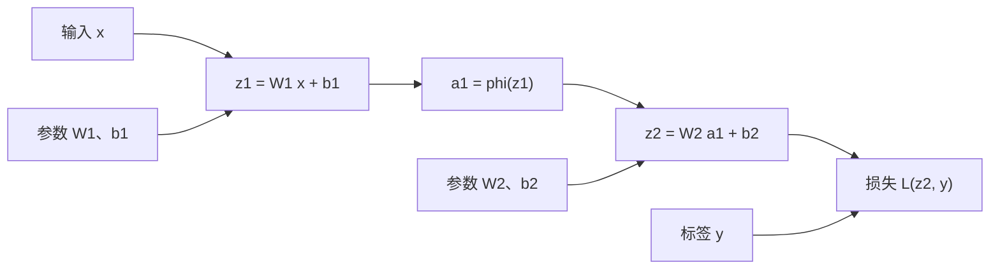

# 深度学习训练的数学原理

训练神经网络看起来涉及很多名词：矩阵乘法、激活函数、交叉熵、反向传播、自动微分、Adam、权重衰减、梯度裁剪。把这些名词分开背，很容易知道公式却不知道公式为什么成立。

实际上，一次训练只在重复三件事：

1. **前向计算**：用当前参数把输入变成预测，并计算一个标量损失。
2. **反向传播**：用链式法则求出“每个参数改变一点，损失会怎样改变”。
3. **参数更新**：优化器根据梯度和历史状态，决定参数下一步往哪里走、走多远。

整篇文章围绕下面一个目标展开：

$$
\boxed{
F_{\text{emp}}(\theta)
=
\frac{1}{N}\sum_{i=1}^{N}
\ell\bigl(f_\theta(\mathbf{x}_i), \mathbf{y}_i\bigr)
+
\lambda\Omega(\theta)
}
$$

理想情况下希望找到：

$$
\boxed{
\theta^\star
\in
\operatorname*{arg\,min}_{\theta}
F_{\text{emp}}(\theta)
}
$$

其中，$f_\theta$ 是神经网络，$\theta$ 表示全部可训练参数，$\ell$ 衡量单个样本的预测误差，$\Omega$ 是可选的正则项，$\lambda\ge0$ 控制正则强度。`argmin` 返回“让目标达到最小值的参数集合”，而 `min` 返回“最小值是多少”。例如：

$$
\operatorname*{arg\,min}_w(w-3)^2=\{3\},
\qquad
\min_w(w-3)^2=0.
$$

这里假设最小值能够取到。一般问题的 `argmin` 可能包含多个点，甚至可能为空；实际深度学习训练通常只寻找一个足够低损失的一阶驻点或近似驻点，并不保证得到全局最优参数
$\theta^\star$。理解训练，就是理解目标式中的每个对象怎样计算、怎样求导，以及怎样被优化。

本文只要求读者知道：

- 导数可以描述函数的瞬时变化率；
- 向量是一列数，矩阵是一张二维数表；
- 矩阵乘法的元素由“对应元素相乘再求和”得到。

不要求预先学过矩阵微积分、概率统计或自动微分。所有核心公式都会从标量或元素级表达式推到矩阵形式。

> **理论边界**
>
> 本文所说的“完整”，是指建立一条能够解释实际训练闭环的理论主线：前向、损失、反向、优化、稳定性和泛化。对于一般的深度非凸网络，目前并不存在“保证找到全局最优解并保证在未知数据上表现最好”的统一定理；这仍是研究问题。严谨不等于假装所有问题都已经解决。

## 先看全局：训练中的信息怎样流动

前向传播让数据从左向右流动，反向传播让“损失对各中间量的敏感度”从右向左流动。优化器不负责执行反向求导；它接收显式 loss 的梯度，并可结合历史状态、权重衰减或裁剪等规则产生参数更新量。

学习本文时，可以始终用三个问题检查自己是否真正理解了某个公式：

- **它在算什么？** 是预测值、概率、损失、梯度，还是参数更新量？
- **它的形状是什么？** 每一次矩阵乘法和转置是否能够对上？
- **它为什么能沿计算图传递？** 具体使用了哪一步链式法则？

全文较长，适合分三遍阅读：

- **第一遍抓主干**：导数与链式法则 → 仿射层求导 → 损失函数 → 两层网络反向传播 → 梯度下降。
- **第二遍理解稳定训练**：mini-batch 与优化器 → 梯度消失和爆炸 → 初始化 → 残差连接与归一化。
- **第三遍补齐工程与边界**：曲率、自动微分、梯度检查、混合精度、分布式归约、正则化与泛化。

第一遍可以暂时跳过带有“理论边界”“数值稳定”和二阶曲率的段落，不影响理解训练闭环。

## 统一符号与形状约定

矩阵求导最常见的错误不是不会求导，而是混用了不同的向量方向和批量布局。本文采用以下约定。

| 符号 | 含义 | 典型形状 |
| --- | --- | --- |
| $x$、$y$、$L$ | 标量 | $1$ |
| $\mathbf{x}$ | 单个输入，默认是列向量 | $\mathbb{R}^{d}$，即 $d\times1$ |
| $\mathbf{b}$ | 一层的偏置，默认是列向量 | $\mathbb{R}^{m}$，即 $m\times1$ |
| $\mathbf{W}$ | 矩阵 | $\mathbb{R}^{m\times d}$ |
| $\theta$ | 模型全部参数的统称 | 由模型决定 |
| $\mathbf{X}$ | 一批输入，每个样本占一行 | $\mathbb{R}^{B\times d}$ |
| $\mathbf{1}_B$ | 长度为 $B$ 的全 $1$ 列向量 | $\mathbb{R}^{B}$，即 $B\times1$ |
| $\odot$ | 对应位置相乘，即 Hadamard 积 | 两边形状相同 |
| $\lVert\mathbf{x}\rVert_2$ | 欧几里得范数 | 标量 |
| $\nabla_{\mathbf{x}}L$ | $L$ 对 $\mathbf{x}$ 的梯度 | 与 $\mathbf{x}$ 同形状 |

上标 $[l]$ 表示第 $l$ 层，不表示幂。例如 $\mathbf{W}^{[2]}$ 是第二层权重。

### Hadamard 积：对应位置各乘各的

符号 $\odot$ 表示 **Hadamard product（Hadamard 积，也叫逐元素乘法）**。它不做行列之间的求和，只把两个向量或矩阵中位置相同的元素相乘。

例如：

$$
\mathbf{a}
=
\begin{bmatrix}
1\\2\\3
\end{bmatrix},
\qquad
\mathbf{b}
=
\begin{bmatrix}
4\\5\\6
\end{bmatrix}.
$$

那么：

$$
\mathbf{a}\odot\mathbf{b}
=
\begin{bmatrix}
1\times4\\
2\times5\\
3\times6
\end{bmatrix}
=
\begin{bmatrix}
4\\10\\18
\end{bmatrix}.
$$

输入是两个三维向量，输出仍是三维向量，所以要求两边形状相同。

它与点积不同。相同的两个向量做点积会得到一个标量：

$$
\mathbf{a}\cdot\mathbf{b}
=
1\times4+2\times5+3\times6
=
32.
$$

可以这样记：

- $\odot$：**对应位置相乘后保留每个结果**，所以输出形状不变；
- 点积：**对应位置相乘后再全部求和**，所以输出是一个数。

当 $\phi$ 是 ReLU、Sigmoid 这类**逐元素激活函数**时，神经网络反向传播中经常出现：

$$
\nabla_{\mathbf{z}}L
=
\nabla_{\mathbf{a}}L
\odot
\phi'(\mathbf{z}).
$$

它表示第 $i$ 个位置的梯度，只乘第 $i$ 个位置的激活函数导数：

$$
\frac{\partial L}{\partial z_i}
=
\frac{\partial L}{\partial a_i}
\phi'(z_i).
$$

不同位置互不混合，因此这里使用 Hadamard 积，而不是矩阵乘法。

### 欧几里得范数：把一个向量压缩成“长度”

$\lVert\mathbf{x}\rVert_2$ 读作“$\mathbf{x}$ 的二范数”，也叫**欧几里得范数**。它就是二维、三维几何中“向量长度”的推广：

$$
\boxed{
\lVert\mathbf{x}\rVert_2
=
\sqrt{x_1^2+x_2^2+\cdots+x_d^2}
}
$$

例如：

$$
\mathbf{x}
=
\begin{bmatrix}
3\\4
\end{bmatrix},
$$

则：

$$
\lVert\mathbf{x}\rVert_2
=
\sqrt{3^2+4^2}
=
5.
$$

这里输入是一个二维向量，输出却是一个标量 $5$，因为范数只回答一个问题：**整个向量有多长？**

它也可以表示两点之间的距离。两个向量
$\mathbf{x}$、$\mathbf{y}$ 的欧几里得距离是：

$$
\lVert\mathbf{x}-\mathbf{y}\rVert_2.
$$

训练中常见的用途包括：

- $\lVert\nabla_\theta L\rVert_2$：衡量全部梯度整体有多大；
- 按全局范数进行梯度裁剪时：梯度长度超过阈值后，把它等比例缩短；
- $\lVert\theta\rVert_2^2$：衡量参数整体大小，用于 L2 正则化。

下标 $2$ 表示先对每个分量取平方、再求和、最后开平方。它不是“把向量直接平方”，而是把所有分量合并成一个非负长度。

因此还要区分：

$$
\lVert\mathbf{x}\rVert_2
=
\sqrt{x_1^2+\cdots+x_d^2},
\qquad
\lVert\mathbf{x}\rVert_2^2
=
x_1^2+\cdots+x_d^2.
$$

前者是长度，后者是长度的平方。

### 单个样本的仿射变换

神经网络最基本的计算是：

$$
\mathbf{z}=\mathbf{W}\mathbf{x}+\mathbf{b}
$$

若

$$
\mathbf{x}\in\mathbb{R}^{d},\qquad
\mathbf{W}\in\mathbb{R}^{m\times d},\qquad
\mathbf{b}\in\mathbb{R}^{m},
$$

那么 $\mathbf{z}\in\mathbb{R}^{m}$。

这里的 $\mathbb{R}^{d}$ 是简写；按照本文约定，
$\mathbf{x}$ 实际按 $d\times1$ 的列向量理解，
$\mathbf{b}$ 和 $\mathbf{z}$ 按 $m\times1$ 的列向量理解。因此形状是：

$$
\underbrace{\mathbf{W}}_{m\times d}
\underbrace{\mathbf{x}}_{d\times1}
+
\underbrace{\mathbf{b}}_{m\times1}
=
\underbrace{\mathbf{z}}_{m\times1}.
$$

矩阵乘法中间的两个 $d$ 能对上，结果留下外侧的
$m\times1$。

展开第 $j$ 个输出：

$$
z_j=\sum_{i=1}^{d}W_{ji}x_i+b_j.
$$

这句话有非常直接的含义：第 $j$ 个神经元取权重矩阵第 $j$ 行，与输入做点积，再加偏置。深度学习中的线性层主要使用**点积和矩阵乘法**，不是三维几何中的叉乘。

### 一批样本的仿射变换

单样本公式是：

$$
\mathbf{z}=\mathbf{W}\mathbf{x}+\mathbf{b}.
$$

批量公式之所以多出两个转置，不是因为换了一套计算规则，而是因为我们把多个样本从**列向量**改成了矩阵中的**行**。

设第 $r$ 个样本是列向量：

$$
\mathbf{x}_r
=
\begin{bmatrix}
x_{r1}\\
x_{r2}\\
\vdots\\
x_{rd}
\end{bmatrix}
\in\mathbb{R}^{d\times1}.
$$

把 $B$ 个样本按行堆起来：

$$
\mathbf{X}
=
\begin{bmatrix}
\mathbf{x}_1^{\mathsf T}\\
\mathbf{x}_2^{\mathsf T}\\
\vdots\\
\mathbf{x}_B^{\mathsf T}
\end{bmatrix}
\in\mathbb{R}^{B\times d}.
$$

现在每个样本占一行，每行有 $d$ 个特征。我们希望输出也让每个样本占一行，因此
$\mathbf{Z}$ 应当是 $B\times m$。

也可以直接把第 $r$ 个样本的单样本公式整体转置：

$$
\begin{aligned}
\mathbf{z}_r^{\mathsf T}
&=
\left(
\mathbf{W}\mathbf{x}_r+\mathbf{b}
\right)^{\mathsf T}\\
&=
\mathbf{x}_r^{\mathsf T}\mathbf{W}^{\mathsf T}
+
\mathbf{b}^{\mathsf T}.
\end{aligned}
$$

这里使用了乘积转置规则：

$$
(\mathbf{A}\mathbf{B})^{\mathsf T}
=
\mathbf{B}^{\mathsf T}\mathbf{A}^{\mathsf T}.
$$

因为批量矩阵的每一行就是
$\mathbf{x}_r^{\mathsf T}$，把所有样本的这一行公式堆起来，自然就会出现
$\mathbf{X}\mathbf{W}^{\mathsf T}$ 和
$\mathbf{1}_B\mathbf{b}^{\mathsf T}$。

#### 为什么权重需要转置

权重原本是：

$$
\mathbf{W}\in\mathbb{R}^{m\times d}.
$$

如果直接计算 $\mathbf{X}\mathbf{W}$，形状会是：

$$
(B\times d)(m\times d),
$$

中间两个维度 $d$ 和 $m$ 通常不同，矩阵乘法无法进行。

即使某个例子碰巧有 $d=m$，直接相乘在数值形状上能够执行，被成对相乘并求和的那一维含义也不对：$\mathbf{X}$ 的列表示输入特征，而
$\mathbf{W}$ 的行表示输出神经元。我们需要让
$\mathbf{X}$ 的输入特征列与 $\mathbf{W}$ 的输入特征列对应，因此仍要把
$\mathbf{W}$ 转置。

转置会交换矩阵的行和列：

$$
\mathbf{W}^{\mathsf T}
\in
\mathbb{R}^{d\times m}.
$$

于是：

$$
\underbrace{\mathbf{X}}_{B\times d}
\underbrace{\mathbf{W}^{\mathsf T}}_{d\times m}
=
\underbrace{\mathbf{X}\mathbf{W}^{\mathsf T}}_{B\times m}.
$$

这正好得到“$B$ 个样本、每个样本 $m$ 个输出”的形状。

更重要的是，它与单样本计算逐元素完全一致。批量结果第
$r$ 行、第 $j$ 列是：

$$
\begin{aligned}
(\mathbf{X}\mathbf{W}^{\mathsf T})_{rj}
&=
\sum_{i=1}^{d}
X_{ri}
(\mathbf{W}^{\mathsf T})_{ij}\\
&=
\sum_{i=1}^{d}
x_{ri}W_{ji}.
\end{aligned}
$$

这就是单样本第 $j$ 个神经元中的
$\sum_iW_{ji}x_{ri}$，只是一次把所有样本都算了。

#### 为什么偏置也需要转置

按照单样本约定，偏置是 $m\times1$ 列向量：

$$
\mathbf{b}
=
\begin{bmatrix}
b_1\\b_2\\\vdots\\b_m
\end{bmatrix}.
$$

但批量输出 $\mathbf{Z}$ 的每个样本占一行，所以要加到每一行上的偏置也应写成
$1\times m$ 行向量：

$$
\mathbf{b}^{\mathsf T}
=
\begin{bmatrix}
b_1&b_2&\cdots&b_m
\end{bmatrix}.
$$

再用 $B\times1$ 的全 $1$ 列向量
$\mathbf{1}_B$ 复制它：

$$
\mathbf{1}_B\mathbf{b}^{\mathsf T}
=
\begin{bmatrix}
\mathbf{b}^{\mathsf T}\\
\mathbf{b}^{\mathsf T}\\
\vdots\\
\mathbf{b}^{\mathsf T}
\end{bmatrix}
\in\mathbb{R}^{B\times m}.
$$

因此批量计算写成：

$$
\boxed{
\mathbf{Z}
=
\mathbf{X}\mathbf{W}^{\mathsf T}
+
\mathbf{1}_B\mathbf{b}^{\mathsf T}
}
$$

形状逐项检查：

$$
(B\times d)(d\times m)=B\times m,
$$

$$
(B\times 1)(1\times m)=B\times m.
$$

#### 用两个样本完整算一遍

取 $d=2$ 个输入特征、$m=3$ 个输出神经元、$B=2$ 个样本：

$$
\mathbf{x}_1
=
\begin{bmatrix}
1\\2
\end{bmatrix},
\qquad
\mathbf{x}_2
=
\begin{bmatrix}
3\\4
\end{bmatrix},
$$

$$
\mathbf{W}
=
\begin{bmatrix}
1&0\\
0&1\\
1&1
\end{bmatrix},
\qquad
\mathbf{b}
=
\begin{bmatrix}
10\\20\\30
\end{bmatrix}.
$$

按行堆叠样本，并转置权重：

$$
\mathbf{X}
=
\begin{bmatrix}
1&2\\
3&4
\end{bmatrix},
\qquad
\mathbf{W}^{\mathsf T}
=
\begin{bmatrix}
1&0&1\\
0&1&1
\end{bmatrix}.
$$

先做矩阵乘法：

$$
\mathbf{X}\mathbf{W}^{\mathsf T}
=
\begin{bmatrix}
1&2&3\\
3&4&7
\end{bmatrix}.
$$

再把同一偏置复制到两行：

$$
\mathbf{1}_2\mathbf{b}^{\mathsf T}
=
\begin{bmatrix}
10&20&30\\
10&20&30
\end{bmatrix}.
$$

最终：

$$
\mathbf{Z}
=
\begin{bmatrix}
11&22&33\\
13&24&37
\end{bmatrix}.
$$

第一行正是
$(\mathbf{W}\mathbf{x}_1+\mathbf{b})^{\mathsf T}$，第二行正是
$(\mathbf{W}\mathbf{x}_2+\mathbf{b})^{\mathsf T}$。因此批量公式只是把多次单样本计算合并成一次矩阵乘法。

> **关键结论**
>
> 两个转置都来自“批量数据按行存放”这个约定：
>
> - $\mathbf{W}^{\mathsf T}$ 把权重从 $m\times d$ 变成
>   $d\times m$，使样本矩阵能够右乘它；
> - $\mathbf{b}^{\mathsf T}$ 把偏置从列向量变成行向量，使它能够复制到批量输出的每一行。
>
> 如果改成把样本按列堆成
> $\mathbf{X}_{\text{col}}\in\mathbb{R}^{d\times B}$，批量公式就会写成
> $\mathbf{Z}_{\text{col}}
> =\mathbf{W}\mathbf{X}_{\text{col}}
> +\mathbf{b}\mathbf{1}_B^{\mathsf T}$，此时权重不需要转置。可见转置来自数据布局，不是神经网络额外增加的数学操作。

代码库常把行批量公式写成 `X @ W.T + b`。其中 `b` 依靠 broadcasting（广播）自动复制到每一行，数学上等价于
$\mathbf{1}_B\mathbf{b}^{\mathsf T}$。

## 训练所需的最小概率基础

损失函数和泛化理论会用到少量概率概念。这里不展开测度论，只建立后文需要的直觉。

### 随机变量与概率分布

**随机变量**不是“数值本身随机变化”，而是把一次随机试验的结果映射成一个数或向量。例如，从真实用户请求中随机抽一个样本，输入 $\mathbf{X}$ 和标签 $\mathbf{Y}$ 就可以视为随机变量；实际抽到的 $\mathbf{x}$、$\mathbf{y}$ 是它们的一次取值。

概率分布 $P(\mathbf{X},\mathbf{Y})$ 描述不同输入、标签组合出现的可能性。条件概率

$$
P(\mathbf{Y}=\mathbf{y}\mid\mathbf{X}=\mathbf{x})
$$

描述已经知道输入 $\mathbf{x}$ 后，标签为 $\mathbf{y}$ 的概率。监督学习模型通常正是在近似这个条件关系。

### 期望与方差

离散随机变量 $X$ 取值为 $x_i$、对应概率为 $p_i$ 时，期望为：

$$
\mathbb{E}[X]
=
\sum_i p_ix_i.
$$

期望可以理解为按发生概率加权的长期平均值。它具有线性性质：

$$
\mathbb{E}[aX+bY]
=
a\mathbb{E}[X]+b\mathbb{E}[Y].
$$

方差描述数值围绕均值的波动尺度：

$$
\operatorname{Var}(X)
=
\mathbb{E}
\left[
\left(X-\mathbb{E}[X]\right)^2
\right].
$$

训练中说“mini-batch 梯度方差较大”，意思是不同随机 batch 产生的梯度估计围绕完整梯度波动得更明显。

### 独立同分布假设

很多基础推导假设训练样本是独立同分布的，常缩写为 **i.i.d.**：

- **同分布**：每个样本都来自同一个数据分布；
- **独立**：知道某个样本后，不会改变其他样本的概率。

现实中的时间序列、同一用户的重复请求和相邻视频帧往往相关，训练分布与部署分布也可能不同。i.i.d. 是便于分析的建模假设，不是所有数据天然满足的事实。

## 训练目标：从样本误差到期望风险

### 先把总体风险翻译成一句话

先固定一组模型参数 $\theta$。模型拿到一个样本
$(\mathbf{x},\mathbf{y})$ 后，会产生一个损失：

$$
\ell\bigl(f_\theta(\mathbf{x}),\mathbf{y}\bigr).
$$

但未来会遇到很多不同样本，每个样本的损失也不同。因此我们真正关心的不是某一个样本损失，而是：

> **采用参数 $\theta$ 后，模型在真实世界未来样本上的长期平均损失是多少？**

这个长期平均损失就是 $R(\theta)$。字母 $R$ 来自 risk（风险），但这里的“风险”不是指危险程度，而是指**期望损失**。

逐个拆开符号：

- $\theta$：模型当前使用的全部参数；
- $f_\theta(\mathbf{x})$：这组参数下，模型对输入 $\mathbf{x}$ 的预测；
- $\ell(f_\theta(\mathbf{x}),\mathbf{y})$：模型在一个样本上的损失；
- $P_{\text{data}}$：真实世界产生不同样本的概率规律；
- $\mathbb{E}$：按照这些概率，对所有可能损失取加权平均；
- $R(\theta)$：把一组参数映射成一个“未来平均损失”标量的函数。

设真实世界中的输入和标签服从某个未知分布 $P_{\text{data}}(\mathbf{x},\mathbf{y})$。理想目标是在未来数据上的平均损失最小：

$$
R(\theta)
=
\mathbb{E}_{(\mathbf{x},\mathbf{y})\sim P_{\text{data}}}
\left[
\ell\bigl(f_\theta(\mathbf{x}),\mathbf{y}\bigr)
\right].
$$

这个 $R(\theta)$ 叫做**总体风险**。在离散的简单情形中，期望符号可以展开成：

$$
R(\theta)
=
\sum_{\mathbf{x},\mathbf{y}}
P_{\text{data}}(\mathbf{x},\mathbf{y})
\,
\ell\bigl(f_\theta(\mathbf{x}),\mathbf{y}\bigr).
$$

也就是“每种情况的损失 × 这种情况出现的概率”，最后全部相加。

例如，未来数据只有普通样本和罕见样本两类：

| 未来样本类型 | 出现概率 | 参数 $\theta_A$ 下的损失 | 参数 $\theta_B$ 下的损失 |
| --- | ---: | ---: | ---: |
| 普通样本 | $0.8$ | $0.1$ | $0.3$ |
| 罕见样本 | $0.2$ | $4.0$ | $0.8$ |

参数 $\theta_A$ 的总体风险为：

$$
R(\theta_A)
=
0.8\times0.1+0.2\times4.0
=
0.88.
$$

参数 $\theta_B$ 的总体风险为：

$$
R(\theta_B)
=
0.8\times0.3+0.2\times0.8
=
0.40.
$$

$R(\theta)$ 会随着参数变化。虽然 $\theta_A$ 在普通样本上更好，但它在罕见样本上的损失太大，所以未来加权平均损失反而更高。在这个例子中，我们更希望得到
$\theta_B$。

只有当损失函数专门选成“预测错误记 $1$、预测正确记 $0$”的 0–1 损失时，$R(\theta)$ 才等于错误率。使用交叉熵、平方误差等损失时，它表示相应损失的未来平均值，不是错误率。

问题是我们不知道真实分布，也无法枚举未来的所有样本，只拥有有限训练集

$$
\mathcal{D}=\{(\mathbf{x}_i,\mathbf{y}_i)\}_{i=1}^{N}.
$$

因此实际优化的是**经验风险**：

$$
\widehat{R}(\theta)
=
\frac{1}{N}
\sum_{i=1}^{N}
\ell\bigl(f_\theta(\mathbf{x}_i),\mathbf{y}_i\bigr).
$$

帽子 $\widehat{\phantom{R}}$ 可以理解为“估计值”的标记：
$\widehat R(\theta)$ 是用有限训练样本平均值去估计无法直接计算的
$R(\theta)$。

例如，某组参数在四个训练样本上的损失为：

$$
0.2,\qquad0.5,\qquad0.1,\qquad0.4,
$$

那么：

$$
\widehat R(\theta)
=
\frac{0.2+0.5+0.1+0.4}{4}
=
0.3.
$$

这个 $0.3$ 是当前训练集上的平均损失，不保证恰好等于未来真实平均损失
$R(\theta)$。训练数据越有代表性，$\widehat R(\theta)$ 才越有希望成为
$R(\theta)$ 的好估计。

### $R(\theta)$ 不是另一种损失函数

这里容易产生一个误会：既然最终目标写成 $R(\theta)$ 或
$\widehat R(\theta)$，为什么后面又说“用交叉熵做损失”？

关键是分清两个层级：

- $\ell$ 是**单个样本怎么计算损失**；
- $R(\theta)$ 或 $\widehat R(\theta)$ 是**把很多样本的损失平均起来之后的目标函数**。

也就是说，$R(\theta)$ 不是和交叉熵并列竞争的另一个损失函数。它更像一个外壳：

$$
R(\theta)
=
\mathbb{E}_{(\mathbf{x},\mathbf{y})\sim P_{\text{data}}}
\left[
\ell(f_\theta(\mathbf{x}),\mathbf{y})
\right].
$$

这个外壳里必须放入一个具体的单样本损失 $\ell$。不同任务会选择不同的 $\ell$：

| 任务 | 常用单样本损失 $\ell$ | 对应的风险含义 |
| --- | --- | --- |
| 回归 | 平方误差 | 未来样本的平均平方误差 |
| 二分类 | 二元交叉熵 | 未来样本的平均负对数概率 |
| 多分类 | Softmax 交叉熵 | 未来样本的平均负对数概率 |
| 只关心对错 | 0–1 损失 | 未来样本的错误率 |

所以当我们说“用交叉熵训练分类模型”时，更完整的说法是：

> 把单样本损失 $\ell$ 选成交叉熵，然后最小化训练集上的经验风险
> $\widehat R(\theta)$。

公式写出来就是：

$$
\ell_i
=
H(\mathbf{q}_i,\mathbf{p}_i)
=
-\sum_{j=1}^{K}q_{ij}\log p_{ij},
$$

$$
\widehat R(\theta)
=
\frac{1}{N}\sum_{i=1}^{N}\ell_i
=
\frac{1}{N}\sum_{i=1}^{N}
H(\mathbf{q}_i,\mathbf{p}_i).
$$

如果标签是 one-hot，上式又等价于：

$$
\widehat R(\theta)
=
-\frac{1}{N}
\sum_{i=1}^{N}
\log p_\theta(y_i\mid\mathbf{x}_i).
$$

这正是平均负对数似然。因此链路应该理解为：

$$
\text{最大似然原则}
\Longrightarrow
\text{选择负对数似然作为单样本损失}
\Longleftrightarrow
\text{one-hot 分类下的交叉熵}
\Longrightarrow
\text{最小化经验风险 } \widehat R(\theta).
$$

至于前面的 $1/N$，它只是把总损失变成平均损失。对固定训练集来说，乘不乘 $1/N$ 不改变最优的 $\theta$，但会改变梯度的整体尺度。实际训练框架通常默认返回平均损失，因为这样 batch size 改变时，学习率更容易保持可比。

> **进阶补充：第一次阅读可以先跳过**
>
> 上面的逐样本平均适用于损失可分解的基础情形。若训练包含随机数据增强、Dropout，或者 BatchNorm、对比学习等依赖整个 batch 的计算，更一般的目标可写成：

$$
F_{\text{train}}(\theta)
=
\mathbb{E}_{\mathcal{B},\xi}
\left[
\mathcal{L}_{\mathcal{B}}(\theta;\xi)
\right],
$$

其中 $\mathcal{B}$ 是随机 batch，$\xi$ 统称随机 mask、随机增强等训练随机性。此时一次 step 得到的是某个
$(\mathcal{B},\xi)$ 上的随机目标及其梯度，而不一定是若干彼此独立的单样本损失简单相加。

这立即区分了两个不同问题：

- **优化问题**：怎样让训练集上的 $\widehat{R}(\theta)$ 下降？
- **泛化问题**：为什么训练集上学到的参数，也能让未知数据上的 $R(\theta)$ 较小？

反向传播和优化器主要解决第一个问题；数据质量、模型归纳偏置和正则化等因素共同影响第二个问题。训练损失很低不等于模型已经学会泛化。

## 导数的本质：局部线性近似

### 一元导数不只是“切线斜率”

若标量函数 $f(x)$ 在 $x$ 附近可导，那么当改变量 $h$ 很小时：

$$
f(x+h)
=
f(x)
+
f'(x)h
+
o(|h|).
$$

$o(|h|)$ 表示比 $|h|$ 更快趋近于零的高阶误差。忽略高阶项后：

$$
\Delta f\approx f'(x)\Delta x.
$$

所以导数的核心含义是：

> **输入发生微小变化时，导数给出输出的一阶变化量。**

例如：

$$
f(x)=x^2,\qquad f'(x)=2x.
$$

在 $x=3$ 处把输入增加 $0.01$，一阶近似给出：

$$
\Delta f\approx 2\times3\times0.01=0.06.
$$

真实变化是 $3.01^2-3^2=0.0601$，差异 $0.0001$ 就是被忽略的二阶项。

#### 从实际变化到微分

这里需要区分两个容易混淆的记号：

- $\Delta x$ 和 $\Delta f=f(x+\Delta x)-f(x)$ 表示输入与输出的
  **实际变化**；
- $\mathrm{d}x$ 表示任意给定的微小输入改变量，
  $\mathrm{d}f$ 表示由导数预测的**一阶变化**。

一元函数的局部线性近似可以写成：

$$
\Delta f
=
f'(x)\Delta x
+
o(|\Delta x|).
$$

把其中的一阶线性部分单独拿出来，就定义了函数在 $x$ 处的微分：

$$
\boxed{
\mathrm{d}f
=
f'(x)\,\mathrm{d}x
}
$$

因此，**$\mathrm{d}x$ 前面的系数就是导数 $f'(x)$**。这不是额外的
求导口诀：导数本来就是把输入小改变量映射成输出一阶变化的那个线性
系数。

仍以 $f(x)=x^2$ 为例。在 $x=3$ 处：

$$
\mathrm{d}f
=
2x\,\mathrm{d}x
=
6\,\mathrm{d}x.
$$

所以 $\mathrm{d}x$ 前面的系数 $6$，就是 $f'(3)$。若取
$\mathrm{d}x=0.01$，微分给出
$\mathrm{d}f=6\times0.01=0.06$，也就是前面算出的真实变化
$0.0601$ 的一阶近似。

### 偏导数、全微分、梯度与方向导数

当函数有多个输入：

$$
L=f(x_1,x_2,\ldots,x_d),
$$

偏导数 $\partial L/\partial x_i$ 表示只改变 $x_i$、暂时固定其他变量时，
$L$ 的变化率。

#### 全微分：梯度就是各个小改变量前的系数

一元函数只有一个输入小改变量 $\mathrm{d}x$。多元函数有
$\mathrm{d}x_1,\ldots,\mathrm{d}x_d$。当 $L$ 在当前点可微时，它的
一阶变化需要把每个输入分量造成的影响加起来：

$$
\boxed{
\mathrm{d}L
=
\frac{\partial L}{\partial x_1}\mathrm{d}x_1
+
\frac{\partial L}{\partial x_2}\mathrm{d}x_2
+
\cdots
+
\frac{\partial L}{\partial x_d}\mathrm{d}x_d
}
$$

这称为 $L$ 的**全微分**。为什么每个 $\mathrm{d}x_i$ 前面的系数
恰好是偏导数？可以从多元局部线性近似看出来。若 $L$ 在当前点可微，
就存在系数 $c_1,\ldots,c_d$，使得：

$$
L(\mathbf{x}+\Delta\mathbf{x})-L(\mathbf{x})
=
c_1\Delta x_1+\cdots+c_d\Delta x_d
+
o(\lVert\Delta\mathbf{x}\rVert_2).
$$

若只改变第 $k$ 个输入，把其他改变量全部设为零，就得到：

$$
\Delta L
=
c_k\Delta x_k
+
o(|\Delta x_k|).
$$

按照偏导数的定义，此时 $L$ 对 $x_k$ 的一阶变化率就是：

$$
c_k
=
\frac{\partial L}{\partial x_k}.
$$

这个结论对每个 $k$ 都成立，所以多元线性近似中的系数只能是各个偏导数。
换句话说：

> **梯度就是全微分中，各个独立变量的小改变量前面的系数所组成的向量。**

把这些偏导数按照变量顺序组成列向量，就定义了**梯度**：

$$
\nabla_{\mathbf{x}}L
=
\begin{bmatrix}
\frac{\partial L}{\partial x_1}\\
\frac{\partial L}{\partial x_2}\\
\vdots\\
\frac{\partial L}{\partial x_d}
\end{bmatrix}.
$$

因此，全微分也可以写成向量内积：

$$
\boxed{
\mathrm{d}L
=
\nabla_{\mathbf{x}}L^{\mathsf T}\mathrm{d}\mathbf{x}
}
$$

例如：

$$
L(x_1,x_2)
=
x_1^2+3x_1x_2.
$$

它的两个偏导数是：

$$
\frac{\partial L}{\partial x_1}
=
2x_1+3x_2,
\qquad
\frac{\partial L}{\partial x_2}
=
3x_1.
$$

因此全微分为：

$$
\mathrm{d}L
=
(2x_1+3x_2)\mathrm{d}x_1
+
(3x_1)\mathrm{d}x_2.
$$

在 $(x_1,x_2)=(1,2)$ 处：

$$
\mathrm{d}L
=
8\,\mathrm{d}x_1
+
3\,\mathrm{d}x_2.
$$

不需要再求一次导数，仅通过比较系数就能读出：

$$
\frac{\partial L}{\partial x_1}=8,
\qquad
\frac{\partial L}{\partial x_2}=3,
\qquad
\nabla_{\mathbf{x}}L
=
\begin{bmatrix}
8\\
3
\end{bmatrix}.
$$

这里的 $\mathrm{d}x_1,\ldots,\mathrm{d}x_d$ 被当作可以独立选择的任意
小改变量。因此，把一个式子整理成下面的形式，并且 $c_i$ 中已经不再
含有任何变量的微分：

$$
\mathrm{d}L
=
c_1\mathrm{d}x_1+\cdots+c_d\mathrm{d}x_d
$$

那么必有
$c_i=\partial L/\partial x_i$。实际推导时，要先把同一个
$\mathrm{d}x_i$ 的所有项收集到一起，再读取它前面的总系数。若变量之间
存在约束、不能独立改变，则需要先改用一组独立变量。

对于一个很小的有限改变量 $\Delta\mathbf{x}$，把全微分作为真实变化的
一阶近似，就得到：

$$
L(\mathbf{x}+\Delta\mathbf{x})
\approx
L(\mathbf{x})
+
\nabla_{\mathbf{x}}L^{\mathsf T}\Delta\mathbf{x}.
$$

若沿单位方向 $\mathbf{u}$ 移动，方向导数为：

$$
D_{\mathbf{u}}L
=
\nabla_{\mathbf{x}}L^{\mathsf T}\mathbf{u}.
$$

根据柯西—施瓦茨不等式：

$$
\nabla L^{\mathsf T}\mathbf{u}
\le
\lVert\nabla L\rVert_2\lVert\mathbf{u}\rVert_2
=
\lVert\nabla L\rVert_2.
$$

当 $\nabla L\ne\mathbf{0}$ 时，等号在
$\mathbf{u}=\nabla L/\lVert\nabla L\rVert_2$ 时成立。因此：

- 梯度方向是局部上升最快的方向；
- 负梯度方向是局部下降最快的方向；
- 梯度的模长表示局部最陡方向上的变化率。

这里的“最快”依赖欧几里得距离。若改变距离度量或用预条件矩阵缩放坐标，最陡下降方向也会改变；自适应优化器可以从这个角度理解。

### 标量链式法则

若

$$
u=f(x),\qquad L=g(u),
$$

则：

$$
\frac{\mathrm{d}L}{\mathrm{d}x}
=
\frac{\mathrm{d}L}{\mathrm{d}u}
\frac{\mathrm{d}u}{\mathrm{d}x}.
$$

直觉上，$x$ 先让 $u$ 变化，$u$ 再让 $L$ 变化：

$$
\Delta L
\approx
\frac{\mathrm{d}L}{\mathrm{d}u}\Delta u
\approx
\frac{\mathrm{d}L}{\mathrm{d}u}
\frac{\mathrm{d}u}{\mathrm{d}x}\Delta x.
$$

例如：

$$
\widehat{y}=wx+b,\qquad
L=\frac{1}{2}(\widehat{y}-y)^2.
$$

沿着 $w\rightarrow\widehat{y}\rightarrow L$ 使用链式法则：

$$
\frac{\partial L}{\partial w}
=
\frac{\partial L}{\partial\widehat{y}}
\frac{\partial\widehat{y}}{\partial w}
=
(\widehat{y}-y)x.
$$

这已经是最小版本的反向传播。

## 从标量链式法则到向量链式法则

### Jacobian 矩阵

若向量函数

$$
\mathbf{y}=f(\mathbf{x}),\qquad
f:\mathbb{R}^{d}\rightarrow\mathbb{R}^{m},
$$

每个输出都可能依赖每个输入。把所有局部偏导数排成矩阵：

$$
\mathbf{J}_f
=
\frac{\partial\mathbf{y}}{\partial\mathbf{x}}
=
\begin{bmatrix}
\frac{\partial y_1}{\partial x_1} & \cdots & \frac{\partial y_1}{\partial x_d}\\
\vdots & \ddots & \vdots\\
\frac{\partial y_m}{\partial x_1} & \cdots & \frac{\partial y_m}{\partial x_d}
\end{bmatrix}
\in\mathbb{R}^{m\times d}.
$$

它叫做 **Jacobian（雅可比矩阵）**，满足局部线性近似：

$$
\Delta\mathbf{y}\approx\mathbf{J}_f\Delta\mathbf{x}.
$$

若最终输出是标量损失 $L$，并且已经知道
$\nabla_{\mathbf{y}}L$，这里的“已经知道”是指已经得到：

$$
\nabla_{\mathbf{y}}L
=
\begin{bmatrix}
\frac{\partial L}{\partial y_1}\\
\frac{\partial L}{\partial y_2}\\
\vdots\\
\frac{\partial L}{\partial y_m}
\end{bmatrix}.
$$

这个向量告诉我们：每个输出 $y_i$ 改变一点时，最终损失
$L$ 会怎样改变。

现在看某一个输入 $x_j$。它可能同时影响
$y_1,y_2,\ldots,y_m$，而这些输出又分别影响损失。每条路径都使用一次标量链式法则，最后把所有路径的贡献相加：

$$
\boxed{
\frac{\partial L}{\partial x_j}
=
\sum_{i=1}^{m}
\frac{\partial L}{\partial y_i}
\frac{\partial y_i}{\partial x_j}
}
$$

例如，$x_j$ 同时通过 $y_1$ 和 $y_2$ 影响损失时：

$$
\frac{\partial L}{\partial x_j}
=
\frac{\partial L}{\partial y_1}
\frac{\partial y_1}{\partial x_j}
+
\frac{\partial L}{\partial y_2}
\frac{\partial y_2}{\partial x_j}.
$$

这仍然只是熟悉的标量链式法则，只是多条路径需要相加。

按照前面的定义，Jacobian 第 $i$ 行、第 $j$ 列是：

$$
(\mathbf{J}_f)_{ij}
=
\frac{\partial y_i}{\partial x_j}.
$$

但我们现在希望逐个计算
$\partial L/\partial x_j$。固定一个 $x_j$ 时，需要把
$\partial y_1/\partial x_j$ 到
$\partial y_m/\partial x_j$ 取出来；它们原本位于 Jacobian 的第
$j$ 列。转置后，这一列会变成第 $j$ 行：

$$
\mathbf{J}_f^{\mathsf T}
=
\begin{bmatrix}
\frac{\partial y_1}{\partial x_1} &
\frac{\partial y_2}{\partial x_1} &
\cdots &
\frac{\partial y_m}{\partial x_1}\\
\frac{\partial y_1}{\partial x_2} &
\frac{\partial y_2}{\partial x_2} &
\cdots &
\frac{\partial y_m}{\partial x_2}\\
\vdots & \vdots & \ddots & \vdots\\
\frac{\partial y_1}{\partial x_d} &
\frac{\partial y_2}{\partial x_d} &
\cdots &
\frac{\partial y_m}{\partial x_d}
\end{bmatrix}.
$$

它乘上 $\nabla_{\mathbf{y}}L$ 后，第 $j$ 行正好计算：

$$
\sum_{i=1}^{m}
\frac{\partial y_i}{\partial x_j}
\frac{\partial L}{\partial y_i}
=
\frac{\partial L}{\partial x_j}.
$$

把所有 $x_j$ 的结果堆起来，就得到：

$$
\boxed{
\nabla_{\mathbf{x}}L
=
\mathbf{J}_f^{\mathsf T}
\nabla_{\mathbf{y}}L
}
$$

形状也能对上：

$$
(d\times m)(m\times1)=d\times1.
$$

输入有 $d$ 个分量，所以最终得到的
$\nabla_{\mathbf{x}}L$ 正好是 $d\times1$ 向量。

#### 用两个输入、两个输出完整算一遍

设：

$$
y_1=x_1+2x_2,
\qquad
y_2=x_1x_2,
$$

再定义一个便于手算的标量损失：

$$
L=y_1^2+3y_2.
$$

在 $(x_1,x_2)=(3,4)$ 处：

$$
y_1=3+2\times4=11,
\qquad
y_2=3\times4=12.
$$

先求输出对输入的 Jacobian：

$$
\mathbf{J}_f
=
\begin{bmatrix}
\frac{\partial y_1}{\partial x_1} &
\frac{\partial y_1}{\partial x_2}\\
\frac{\partial y_2}{\partial x_1} &
\frac{\partial y_2}{\partial x_2}
\end{bmatrix}
=
\begin{bmatrix}
1&2\\
x_2&x_1
\end{bmatrix}
=
\begin{bmatrix}
1&2\\
4&3
\end{bmatrix}.
$$

再求损失对两个输出的梯度：

$$
\nabla_{\mathbf{y}}L
=
\begin{bmatrix}
\frac{\partial L}{\partial y_1}\\
\frac{\partial L}{\partial y_2}
\end{bmatrix}
=
\begin{bmatrix}
2y_1\\3
\end{bmatrix}
=
\begin{bmatrix}
22\\3
\end{bmatrix}.
$$

最后把输出侧梯度传回两个输入：

$$
\begin{aligned}
\nabla_{\mathbf{x}}L
&=
\mathbf{J}_f^{\mathsf T}
\nabla_{\mathbf{y}}L\\
&=
\begin{bmatrix}
1&4\\
2&3
\end{bmatrix}
\begin{bmatrix}
22\\3
\end{bmatrix}\\
&=
\begin{bmatrix}
34\\53
\end{bmatrix}.
\end{aligned}
$$

第一个分量单独展开：

$$
\begin{aligned}
\frac{\partial L}{\partial x_1}
&=
\frac{\partial L}{\partial y_1}
\frac{\partial y_1}{\partial x_1}
+
\frac{\partial L}{\partial y_2}
\frac{\partial y_2}{\partial x_1}\\
&=
22\times1+3\times4\\
&=
34.
\end{aligned}
$$

第二个分量同理：

$$
\frac{\partial L}{\partial x_2}
=
22\times2+3\times3
=
53.
$$

因此，$\mathbf{J}_f^{\mathsf T}$ 不是 Jacobian 的逆矩阵，也不是在“倒着求出原输入”。它只是在按输入重新排列局部导数，把所有“输出如何受这个输入影响”的路径贡献汇总起来。

这就是向量形式的链式法则。反向传播不断执行的，正是“当前层 Jacobian 的转置乘以从输出侧传回的梯度”。

实际训练一般不显式构造完整 Jacobian，因为它可能非常大。自动微分直接计算
$\mathbf{J}_f^{\mathsf T}\mathbf{v}$。标准行向量记法常把同一运算写成
$\mathbf{v}^{\mathsf T}\mathbf{J}_f$，称为 **vector-Jacobian product（VJP，向量—雅可比乘积）**；本文使用列梯度，所以写成它的转置形式。

### 分支处的梯度为什么要相加

若一个变量同时沿两条路径影响损失：

$$
L=g_1(x)+g_2(x),
$$

那么：

$$
\frac{\mathrm{d}L}{\mathrm{d}x}
=
\frac{\mathrm{d}g_1}{\mathrm{d}x}
+
\frac{\mathrm{d}g_2}{\mathrm{d}x}.
$$

所以计算图中一个节点被多次使用时，各条反向路径的梯度必须相加。残差连接、参数共享、循环网络和同一 embedding 被多次查表，都依赖这条规则。

## 矩阵求导：先写微分，再识别梯度

死记“矩阵求导公式表”很容易在转置上出错。更稳定的方法是：

1. 写出中间量的微分；
2. 把损失微分整理成“梯度与变量微分的内积”；
3. 根据形状识别梯度。

这里的 $\mathrm{d}\mathbf{x}$ 可以先直观理解为“给
$\mathbf{x}$ 的每个分量一个任意小改变量”，$\mathrm{d}L$ 是它引起的损失一阶变化。

对于向量，微分满足：

$$
\mathrm{d}L
=
\nabla_{\mathbf{x}}L^{\mathsf T}\mathrm{d}\mathbf{x}.
$$

### Frobenius 内积就是“矩阵版本的点积”

先回忆两个同长度向量的点积：

$$
\mathbf{a}\cdot\mathbf{b}
=
\sum_i a_i b_i.
$$

它会把对应位置的元素相乘，再把所有乘积相加，最终得到一个标量。

Frobenius 内积做的事情完全相同，只是输入从向量变成了矩阵。对于两个
**形状相同**的矩阵
$\mathbf{A},\mathbf{B}\in\mathbb{R}^{m\times n}$，定义：

$$
\langle\mathbf{A},\mathbf{B}\rangle_F
=
\sum_{i=1}^{m}\sum_{j=1}^{n}A_{ij}B_{ij}.
$$

下标 $F$ 只表示这里使用的是 Frobenius 内积。可以把它理解成：

1. 按照相同顺序把 $\mathbf{A}$ 和 $\mathbf{B}$ 各自摊平成一个
   $mn$ 维长向量；
2. 对这两个长向量做普通点积。

它和前面介绍的 Hadamard 积关系很直接：

- $\mathbf{A}\odot\mathbf{B}$ 只做对应元素相乘，结果仍然是一个
  $m\times n$ 矩阵；
- $\langle\mathbf{A},\mathbf{B}\rangle_F$ 还会把这些乘积全部加起来，
  所以结果是一个标量。

也就是：

$$
\langle\mathbf{A},\mathbf{B}\rangle_F
=
\sum_{i,j}
\left(\mathbf{A}\odot\mathbf{B}\right)_{ij}.
$$

例如：

$$
\mathbf{A}
=
\begin{bmatrix}
1&2\\
3&4
\end{bmatrix},
\qquad
\mathbf{B}
=
\begin{bmatrix}
5&6\\
7&8
\end{bmatrix}.
$$

那么：

$$
\begin{aligned}
\langle\mathbf{A},\mathbf{B}\rangle_F
&=
1\times5+2\times6+3\times7+4\times8\\
&=70.
\end{aligned}
$$

#### 为什么还要写成迹

Frobenius 内积还有一种在矩阵推导中很方便的等价写法：

$$
\boxed{
\langle\mathbf{A},\mathbf{B}\rangle_F
=
\operatorname{tr}
\left(\mathbf{A}^{\mathsf T}\mathbf{B}\right)
}
$$

其中，$\operatorname{tr}(\mathbf{M})$ 称为矩阵的**迹**，就是把方阵的
对角元素相加。例如：

$$
\operatorname{tr}
\begin{bmatrix}
2&7\\
5&3
\end{bmatrix}
=2+3=5.
$$

迹的写法之所以和逐元素求和相同，是因为：

$$
\begin{aligned}
\operatorname{tr}
\left(\mathbf{A}^{\mathsf T}\mathbf{B}\right)
&=
\sum_j
\left(\mathbf{A}^{\mathsf T}\mathbf{B}\right)_{jj}\\
&=
\sum_j\sum_i A_{ij}B_{ij}.
\end{aligned}
$$

最后一行正好遍历并相加了两个矩阵所有对应位置的乘积。第一次阅读时，
只要记住“**Frobenius 内积等于对应元素相乘再求和**”即可；迹只是同一件事
的紧凑写法。

#### 为什么矩阵微分需要它

矩阵 $\mathbf{W}\in\mathbb{R}^{m\times d}$ 可以看成由 $md$ 个独立变量
$W_{ji}$ 组成。给每个元素一个任意小改变量 $\mathrm{d}W_{ji}$ 后，损失
的一阶变化是：

$$
\mathrm{d}L
=
\sum_{j=1}^{m}\sum_{i=1}^{d}
\frac{\partial L}{\partial W_{ji}}
\mathrm{d}W_{ji}.
$$

把所有偏导数按原来的位置排成梯度矩阵：

$$
\left(\nabla_{\mathbf{W}}L\right)_{ji}
=
\frac{\partial L}{\partial W_{ji}},
$$

上面的逐元素求和就可以简写成：

$$
\boxed{
\mathrm{d}L
=
\left\langle
\nabla_{\mathbf{W}}L,
\mathrm{d}\mathbf{W}
\right\rangle_F
}
$$

这与向量公式
$\mathrm{d}L=\nabla_{\mathbf{x}}L^{\mathsf T}\mathrm{d}\mathbf{x}$
本质相同：**梯度中的每个分量，乘以对应变量的小改变量，再把所有影响
加起来。**

例如，假设：

$$
\nabla_{\mathbf{W}}L
=
\begin{bmatrix}
1&-2\\
3&4
\end{bmatrix},
\qquad
\mathrm{d}\mathbf{W}
=
\begin{bmatrix}
0.01&0.02\\
-0.01&0.03
\end{bmatrix}.
$$

那么这些参数小改动共同引起的损失一阶变化为：

$$
\begin{aligned}
\mathrm{d}L
&=
\left\langle
\nabla_{\mathbf{W}}L,
\mathrm{d}\mathbf{W}
\right\rangle_F\\
&=
1\times0.01
+(-2)\times0.02
+3\times(-0.01)
+4\times0.03\\
&=0.06.
\end{aligned}
$$

### 完整推导仿射层的三个梯度

单样本仿射层为：

$$
\mathbf{z}=\mathbf{W}\mathbf{x}+\mathbf{b}.
$$

假设反向传播已经从后面得到：

$$
\boldsymbol{\delta}
=
\nabla_{\mathbf{z}}L
=
\frac{\partial L}{\partial\mathbf{z}}.
$$

对前向式取微分：

$$
\mathrm{d}\mathbf{z}
=
\mathrm{d}\mathbf{W}\,\mathbf{x}
+
\mathbf{W}\,\mathrm{d}\mathbf{x}
+
\mathrm{d}\mathbf{b}.
$$

为什么这里没有
$\mathrm{d}\mathbf{W}\,\mathrm{d}\mathbf{x}$？若写的是两个有限改变量
造成的真实变化，完整展开应为：

$$
\begin{aligned}
\Delta\mathbf{z}
&=
(\mathbf{W}+\Delta\mathbf{W})
(\mathbf{x}+\Delta\mathbf{x})
+(\mathbf{b}+\Delta\mathbf{b})
-
(\mathbf{W}\mathbf{x}+\mathbf{b})\\
&=
\Delta\mathbf{W}\,\mathbf{x}
+
\mathbf{W}\,\Delta\mathbf{x}
+
\Delta\mathbf{b}
+
\Delta\mathbf{W}\,\Delta\mathbf{x}.
\end{aligned}
$$

最后一项同时包含两个小改变量，属于二阶小量。微分只保留一阶线性部分，
所以 $\mathrm{d}\mathbf{z}$ 中只有前三项。

损失微分为：

$$
\begin{aligned}
\mathrm{d}L
&=
\boldsymbol{\delta}^{\mathsf T}\mathrm{d}\mathbf{z}\\
&=
\boldsymbol{\delta}^{\mathsf T}\mathrm{d}\mathbf{W}\,\mathbf{x}
+
\boldsymbol{\delta}^{\mathsf T}\mathbf{W}\,\mathrm{d}\mathbf{x}
+
\boldsymbol{\delta}^{\mathsf T}\mathrm{d}\mathbf{b}.
\end{aligned}
$$

先把权重项按元素展开：

$$
\begin{aligned}
\boldsymbol{\delta}^{\mathsf T}
\mathrm{d}\mathbf{W}\,\mathbf{x}
&=
\sum_j\delta_j
\sum_i\mathrm{d}W_{ji}x_i\\
&=
\sum_{j,i}
(\delta_jx_i)\mathrm{d}W_{ji}.
\end{aligned}
$$

这正是前面全微分规则的双下标版本。识别权重梯度时，先固定
$\mathbf{x}$ 和 $\mathbf{b}$，也就是令
$\mathrm{d}\mathbf{x}=\mathbf{0}$、$\mathrm{d}\mathbf{b}=\mathbf{0}$。
矩阵中的每个 $W_{ji}$ 都是一个独立变量，此时损失微分已经整理成：

$$
\mathrm{d}L
=
\sum_{j,i}
c_{ji}\,\mathrm{d}W_{ji},
\qquad
c_{ji}=\delta_jx_i.
$$

因此，每个 $\mathrm{d}W_{ji}$ 前面的系数就是对应偏导数：

$$
\frac{\partial L}{\partial W_{ji}}
=
\delta_jx_i.
$$

也可以只令某一个元素发生改动来检验。若
$\mathrm{d}W_{ab}=t$，其余 $\mathrm{d}W_{ji}$ 都为零，那么：

$$
\mathrm{d}L
=
(\delta_a x_b)t.
$$

按照偏导数“只改变一个变量、固定其他变量”的定义，这就说明
$\partial L/\partial W_{ab}=\delta_a x_b$。

把这些元素排回 $m\times d$ 的矩阵，就得到外积
$\boldsymbol{\delta}\mathbf{x}^{\mathsf T}$。另外两项同理：

$$
\boldsymbol{\delta}^{\mathsf T}
\mathbf{W}\,\mathrm{d}\mathbf{x}
=
\sum_i
\left(
\sum_jW_{ji}\delta_j
\right)
\mathrm{d}x_i,
$$

$$
\boldsymbol{\delta}^{\mathsf T}
\mathrm{d}\mathbf{b}
=
\sum_j\delta_j\,\mathrm{d}b_j.
$$

因此逐项对照梯度定义可得：

$$
\boxed{
\nabla_{\mathbf{W}}L
=
\boldsymbol{\delta}\mathbf{x}^{\mathsf T}
}
$$

$$
\boxed{
\nabla_{\mathbf{x}}L
=
\mathbf{W}^{\mathsf T}\boldsymbol{\delta}
}
$$

$$
\boxed{
\nabla_{\mathbf{b}}L
=
\boldsymbol{\delta}
}
$$

形状检查：

| 梯度 | 计算 | 结果形状 |
| --- | --- | --- |
| $\nabla_{\mathbf{W}}L$ | $(m\times1)(1\times d)$ | $m\times d$，与 $\mathbf{W}$ 相同 |
| $\nabla_{\mathbf{x}}L$ | $(d\times m)(m\times1)$ | $d$，与 $\mathbf{x}$ 相同 |
| $\nabla_{\mathbf{b}}L$ | $\boldsymbol{\delta}$ | $m$，与 $\mathbf{b}$ 相同 |

为什么权重梯度是外积 $\boldsymbol{\delta}\mathbf{x}^{\mathsf T}$？展开其中一个元素：

$$
\frac{\partial L}{\partial W_{ji}}
=
\frac{\partial L}{\partial z_j}
\frac{\partial z_j}{\partial W_{ji}}
=
\delta_jx_i.
$$

它表示：一个权重的梯度等于“这个输出神经元收到的误差信号”乘以“这个权重在前向时看到的输入”。

## 神经网络为什么需要非线性

### 单个神经元

一个神经元通常先做仿射变换，再做激活：

$$
z=\mathbf{w}\cdot\mathbf{x}+b
=
\sum_{i=1}^{d}w_ix_i+b,
\qquad
a=\phi(z).
$$

$\mathbf{w}\cdot\mathbf{x}$ 表示两个向量的点积，也就是对应元素相乘后
求和。这里不直接写 $\mathbf{w}\mathbf{x}$，因为按照本文约定，
$\mathbf{w}$ 和 $\mathbf{x}$ 都是 $d\times1$ 列向量，两个列向量不能
直接做这样的矩阵乘法。使用点积记号可以直接表达“每个输入乘以对应权重，
然后全部相加”，不需要在这里额外处理行向量与列向量的方向。

- $\mathbf{w}$ 决定输入各方向的重要程度；
- $b$ 平移分界面；
- $\phi$ 引入非线性；
- $a$ 作为下一层的输入。

### 没有激活函数，多层仍只是一层

若两层都只是仿射变换：

$$
\mathbf{h}
=
\mathbf{W}^{[1]}\mathbf{x}+\mathbf{b}^{[1]},
$$

$$
\mathbf{y}
=
\mathbf{W}^{[2]}\mathbf{h}+\mathbf{b}^{[2]},
$$

代入得到：

$$
\mathbf{y}
=
\underbrace{\mathbf{W}^{[2]}\mathbf{W}^{[1]}}_{\widetilde{\mathbf{W}}}\mathbf{x}
+
\underbrace{
\mathbf{W}^{[2]}\mathbf{b}^{[1]}+\mathbf{b}^{[2]}
}_{\widetilde{\mathbf{b}}}.
$$

它仍然只是 $\widetilde{\mathbf{W}}\mathbf{x}+\widetilde{\mathbf{b}}$。因此，仅堆叠线性层不会提升函数表达能力；激活函数使模型在不同输入区域具有不同的局部响应和导数。ReLU 类网络进一步具有分片仿射结构，而 Sigmoid、Tanh、GELU 等平滑激活并不是分片线性的。

### 常见逐元素激活函数

对于矩阵 $\mathbf{Z}$，写作 $\phi(\mathbf{Z})$ 通常表示对每个元素独立应用同一个标量函数：

$$
A_{ij}=\phi(Z_{ij}).
$$

其反向传播为：

$$
\boxed{
\nabla_{\mathbf{Z}}L
=
\nabla_{\mathbf{A}}L
\odot
\phi'(\mathbf{Z})
}
$$

| 激活函数 | 定义 | 导数 | 主要特征 |
| --- | --- | --- | --- |
| 恒等映射 | $\phi(z)=z$ | $1$ | 常用于回归输出层 |
| Sigmoid | $\sigma(z)=1/(1+e^{-z})$ | $\sigma(z)(1-\sigma(z))$ | 输出在 $(0,1)$，大绝对值区域容易饱和 |
| Tanh | $\tanh(z)$ | $1-\tanh^2(z)$ | 输出在 $(-1,1)$，零中心但仍会饱和 |
| ReLU | $\max(0,z)$ | $z>0$ 时为 $1$，$z<0$ 时为 $0$ | 计算简单，正半轴不饱和 |
| Leaky ReLU | $\max(\alpha z,z)$ | 负半轴为 $\alpha$，正半轴为 $1$ | 给负半轴保留小梯度 |
| GELU | $z\Phi(z)$ | $\Phi(z)+z\varphi(z)$ | 平滑门控，Transformer 中常见 |

$\Phi$ 和 $\varphi$ 分别是标准正态分布的累积分布函数和密度函数。工程实现可能使用 GELU 的近似公式。

ReLU 在 $z=0$ 处不可导。深度学习框架会选定一个约定值，通常取 $0$。对连续、非退化的输入分布，精确命中这个点的概率通常为零；但有限精度、结构性零值或特殊参数化下仍可能经常命中。更一般地，非光滑优化可以使用次梯度。要记住：自动微分返回的是框架所定义的局部导数规则，而不是替你消除了数学上的不可导点。

## 损失函数：把“预测得怎样”变成一个标量

神经网络可能输出一整个向量，但反向传播通常从一个标量损失开始。损失函数既决定训练目标，也决定输出层收到的梯度。

### 回归：平方误差与均方误差

对单个 $d_y$ 维预测，常先写带 $1/2$ 的平方误差：

$$
\ell(\widehat{\mathbf{y}},\mathbf{y})
=
\frac{1}{2}
\lVert\widehat{\mathbf{y}}-\mathbf{y}\rVert_2^2.
$$

加上 $1/2$ 是为了让平方求导产生的 $2$ 抵消：

$$
\boxed{
\nabla_{\widehat{\mathbf{y}}}\ell
=
\widehat{\mathbf{y}}-\mathbf{y}
}
$$

若严格对输出维度取均值，mean squared error（MSE，均方误差）是：

$$
\ell_{\text{MSE}}
=
\frac{1}{d_y}
\lVert\widehat{\mathbf{y}}-\mathbf{y}\rVert_2^2,
$$

其梯度为：

$$
\nabla_{\widehat{\mathbf{y}}}\ell_{\text{MSE}}
=
\frac{2}{d_y}
(\widehat{\mathbf{y}}-\mathbf{y}).
$$

不同资料会选择“平方和、平方均值、是否乘 $1/2$”中的不同约定。这些目标只相差正常数时具有相同最优点，但梯度尺度不同，会影响有效学习率。本文在手算推导中使用
$\frac{1}{2}\lVert\widehat{\mathbf{y}}-\mathbf{y}\rVert_2^2$，因为导数最简洁。

若假设标签等于模型预测加上方差固定的独立高斯噪声，那么最小化均方误差等价于最大化数据似然。损失函数因此不仅是“人为打分规则”，也可以来自对数据生成过程的概率假设。

### 为什么最大似然会导出交叉熵

这一小节的目标是解释一条常见链条：

$$
\text{最大似然}
\quad\Longleftrightarrow\quad
\text{最小化负对数似然}
\quad\Longleftrightarrow\quad
\text{最小化交叉熵}。
$$

它们不是三种彼此无关的训练方法；在分类任务的特定建模方式下，它们是在用三种写法描述同一个目标。先不要急着记公式，先从“模型给真实答案多少概率”开始。

#### 第一步：分类模型不只报答案，还报概率

假设一张图片的真实类别是“猫”。分类模型经过 Softmax 后，不只是说“我选猫”，还会给每个类别一个概率。例如：

| 类别 | 模型给出的概率 |
| --- | --- |
| 狗 | $0.10$ |
| 猫（真实标签） | $0.70$ |
| 鸟 | $0.20$ |

这里的 $p_\theta(y\mid\mathbf{x})$ 就表示：**在输入为 $\mathbf{x}$ 时，参数为 $\theta$ 的模型认为真实类别恰好是 $y$ 的概率。**

因此，上面的模型对“这张图确实是猫”这件已经发生的事给出的概率是 $0.70$。如果另一组参数把猫的概率报成 $0.10$，它就更不符合已经看到的标签。

#### 第二步：似然就是“这批已经发生的数据，在模型看来有多合理”

训练集里的输入和标签已经是事实；训练时并不是随机等待它们发生。我们反过来问：**假如模型的概率规则是真的，那么它看到这一批真实标签的可能性有多大？** 这个随参数 $\theta$ 变化的量叫作**似然**（likelihood）。

对一条样本，似然贡献就是模型分给真实标签的概率：

$$
p_\theta(y_i\mid\mathbf{x}_i).
$$

若把每个样本的标签在给定输入后看成相互独立，那么整批样本同时出现的概率要相乘：

$$
\operatorname{Lik}(\theta)
=
\prod_{i=1}^{N}
p_\theta(y_i\mid\mathbf{x}_i).
$$

例如，三个样本的真实标签分别被模型赋予 $0.7$、$0.8$、$0.6$ 的概率，则：

$$
\operatorname{Lik}(\theta)=0.7\times0.8\times0.6=0.336.
$$

另一组参数若给出的三个概率是 $0.4$、$0.9$、$0.5$，似然是 $0.18$。前一组参数更倾向于解释我们实际观察到的标签，所以**最大似然估计**就是选择使 $\operatorname{Lik}(\theta)$ 尽可能大的参数。

这里“似然”和“概率”数值上使用同一个公式，但提问方向不同：给定参数时，它是数据出现的概率；固定已经观察到的数据、把 $\theta$ 当作待比较对象时，它叫似然。它不是“参数为真的概率”。

#### 第三步：为什么改成负对数似然

直接最大化一长串小于 $1$ 的数的乘积不方便：样本多时乘积会非常接近 $0$，计算机中可能下溢；求导也不如求和直观。对数恰好解决这两个问题：

$$
\log\operatorname{Lik}(\theta)
=
\sum_{i=1}^{N}
\log p_\theta(y_i\mid\mathbf{x}_i).
$$

因为 $\log$ 是严格递增函数，谁的似然更大，谁的对数似然也更大，所以取对数不改变最优参数。训练习惯写成“最小化损失”，于是再乘 $-1$：

$$
\operatorname{NLL}(\theta)
=
-\sum_{i=1}^{N}
\log p_\theta(y_i\mid\mathbf{x}_i).
$$

这就是**负对数似然**（negative log-likelihood，NLL）。最大化似然、最大化对数似然、最小化 NLL 都会选出同一组参数。

单个样本的损失是：

$$
\ell(\mathbf{x},y;\theta)
=
-\log p_\theta(y\mid\mathbf{x}).
$$

它很符合直觉：模型给真实类别 $0.9$ 的概率，损失约为 $-\log(0.9)=0.105$；只给 $0.1$ 的概率，损失约为 $2.303$。特别是模型非常自信地把真实类别概率压到接近 $0$ 时，损失会变得很大。这正是在严厉惩罚“自信但错误”的预测。

#### 第四步：它为什么就是之前的经验风险 $\widehat R(\theta)$

前文的经验风险不是固定等于某一种公式，而是“**把每条样本损失取平均**”：

$$
\widehat R(\theta)
=
\frac{1}{N}\sum_{i=1}^N
\ell(\mathbf{x}_i,y_i;\theta).
$$

现在我们为分类任务选择的单样本损失恰好是负对数似然
$\ell(\mathbf{x}_i,y_i;\theta)=-\log p_\theta(y_i\mid\mathbf{x}_i)$。代进去就得到：

$$
\boxed{
\widehat{R}(\theta)
=
-\frac{1}{N}\sum_{i=1}^{N}
\log p_\theta(y_i\mid\mathbf{x}_i)
}
$$

所以这里不是说“任何负对数似然天然都等于风险”，而是说：**当我们把分类的单样本损失定义为负对数概率时，训练集上的平均损失按定义就是经验风险。** 除以 $N$ 只是把总损失变成平均损失，不改变哪个 $\theta$ 最优，但会让不同数据集大小下的梯度尺度更可比。

相应地，这个损失在真实数据分布上的总体风险是：

$$
R(\theta)
=
\mathbb{E}_{(\mathbf{X},Y)\sim P_{\text{data}}}
\left[-\log p_\theta(Y\mid\mathbf{X})\right].
$$

它的意思是：未来样本平均而言，模型给真实标签分配的概率有多不合理。训练时看不到这个真实期望，只能用上面的 $\widehat R(\theta)$ 估计它。

#### 第五步：交叉熵只是把“真实类别的负对数概率”写成向量形式

设一共有 $K$ 个类别。把真实标签写成 one-hot 向量 $\mathbf{q}$：真实类别的位置为 $1$，其他位置为 $0$；模型预测概率写成 $\mathbf{p}$。例如真实类别是第 $2$ 类时：

$$
\mathbf{q}=
\begin{bmatrix}0\\1\\0\end{bmatrix},
\qquad
\mathbf{p}=
\begin{bmatrix}0.10\\0.70\\0.20\end{bmatrix}.
$$

把每个类别的“负对数预测概率”按真实标签的权重求和：

$$
H(\mathbf{q},\mathbf{p})
=
-\sum_{j=1}^{K}q_j\log p_j.
$$

这里的 $q_j$ 首先不是额外引入的惩罚系数，而是**第 $j$ 类是否为真实类别的标记**。对第 $i$ 条训练样本，更精确地写为：

$$
q_{ij}=
\begin{cases}
1,&y_i=j,\\
0,&y_i\ne j,
\end{cases}
\qquad
p_{ij}=p_\theta(Y=j\mid\mathbf{x}_i).
$$

因为 $\mathbf{q}_i$ 是 one-hot 向量，下面的乘积只会留下真实类别的预测概率：

$$
\begin{aligned}
p_\theta(y_i\mid\mathbf{x}_i)
&=
\prod_{j=1}^{K}p_{ij}^{q_{ij}}\\
&=
\underbrace{p_{i1}^{0}\cdots p_{i,y_i}^{1}\cdots p_{iK}^{0}}_{\text{只有真实类别那一项留下}}\\
&=p_{i,y_i}.
\end{aligned}
$$

对这条等式取负对数，乘积变成求和、指数 $q_{ij}$ 变成每一项前的系数：

$$
\begin{aligned}
-\log p_\theta(y_i\mid\mathbf{x}_i)
&=-\log\left(\prod_{j=1}^{K}p_{ij}^{q_{ij}}\right)\\
&=-\sum_{j=1}^{K}q_{ij}\log p_{ij}\\
&=H(\mathbf{q}_i,\mathbf{p}_i).
\end{aligned}
$$

这就是它与前面“单条样本的似然”完全对应的原因：**$q_{ij}$ 的作用是选中真实类别的概率；取对数后，这个选择开关以系数的形式出现在求和里。**

把所有样本再相乘，就是训练集似然；把上式对所有样本求和并取平均，就是训练集的平均交叉熵：

$$
\begin{aligned}
-\frac{1}{N}\log\operatorname{Lik}(\theta)
&=-\frac{1}{N}\sum_{i=1}^{N}\log p_\theta(y_i\mid\mathbf{x}_i)\\
&=-\frac{1}{N}\sum_{i=1}^{N}\sum_{j=1}^{K}q_{ij}\log p_{ij}.
\end{aligned}
$$

所以在普通的硬标签多分类任务中，**平均交叉熵 = 平均负对数似然 = 这个选择下的经验风险**。

回到前面的“猫”例子，由于 one-hot 向量只有真实类别对应的 $q_j=1$，其他项都被 $0$ 消掉：

$$
H(\mathbf{q},\mathbf{p})
=
-(0\log0.10+1\log0.70+0\log0.20)
=
-\log0.70.
$$

这正是刚才的单样本负对数似然。因此，对 one-hot 分类标签而言，**交叉熵不是额外发明的一种损失；它就是把 $-\log p_\theta(y\mid\mathbf{x})$ 用向量写出来。**

更一般地，$\mathbf{q}$ 不一定非得是 one-hot 标签；它也可以表示“真实来源把各类别当作答案的频率或目标概率”。此时交叉熵可以理解为：真实答案按 $\mathbf{q}$ 的比例出现时，采用模型分布 $\mathbf{p}$ 会得到的平均负对数损失。也就是说，真实类别越常出现，模型越应该给它较高概率。

> 名字里的“熵”暂时可以这样理解：$-\log p_j$ 是模型对第 $j$ 类给出的“惊讶程度”，交叉熵是按照目标分布 $\mathbf{q}$ 计算的平均惊讶程度。现在最重要的是记住它如何从 one-hot 标签化简为 $-\log$（真实类别概率）；信息论上的完整背景可以后学。

#### 交叉熵、自身熵与 KL 散度分别在问什么

到这里已经知道，交叉熵来自“真实类别的负对数概率”。但名字里既然有“熵”，还会经常遇到
$H(\mathbf{q})$ 和 $D_{\mathrm{KL}}(\mathbf{q}\Vert\mathbf{p})$，最好正式把它们区分清楚。

先把 $\mathbf{q}$ 和 $\mathbf{p}$ 都看成类别上的概率分布：

- $\mathbf{q}$ 表示**目标分布**，也就是答案应该按什么比例出现；
- $\mathbf{p}$ 表示**模型分布**，也就是模型认为答案按什么比例出现。

如果是普通 one-hot 标签，$\mathbf{q}$ 就是“真实类别概率为 $1$，其他类别概率为 $0$”。如果是软标签、标签平滑或知识蒸馏，$\mathbf{q}$ 也可以不是 one-hot。

**自身熵** $H(\mathbf{q})$ 问的是：如果真实答案本来就按 $\mathbf{q}$ 发生，那么答案本身有多不确定？

$$
H(\mathbf{q})
=
-\sum_{j=1}^{K}q_j\log q_j.
$$

可以把 $-\log q_j$ 理解为“第 $j$ 类真的发生时，它带来的惊讶程度”。前面的 $q_j$ 表示第 $j$ 类发生的概率，所以 $H(\mathbf{q})$ 就是按照真实分布自己计算出来的**平均惊讶程度**。

例如：

- 若 $\mathbf{q}=[0,1,0]$，答案完全确定，$H(\mathbf{q})=0$；
- 若 $\mathbf{q}=[1/3,1/3,1/3]$，三个类别一样可能，答案更不确定，$H(\mathbf{q})$ 更大。

这里约定 $0\log0=0$，因为

$$
\lim_{x\to0^+}x\log x=0.
$$

直觉上，概率为 $0$ 的类别不会发生，所以不参与平均惊讶程度。

**交叉熵** $H(\mathbf{q},\mathbf{p})$ 问的是：真实答案按 $\mathbf{q}$ 发生，但我们却用模型分布 $\mathbf{p}$ 去解释它，平均会有多惊讶？

$$
H(\mathbf{q},\mathbf{p})
=
-\sum_{j=1}^{K}q_j\log p_j.
$$

注意这时惊讶程度用的是 $-\log p_j$，不是 $-\log q_j$。也就是说，真实世界负责“抽出哪个类别”，模型负责“给这个类别分配了多少概率”。如果真实世界经常抽到第 $j$ 类，也就是 $q_j$ 很大，但模型给它的 $p_j$ 很小，那么这一项损失就会很大。

对于 one-hot 标签，交叉熵会退化成前面已经推过的负对数似然：

$$
\mathbf{q}=[0,1,0]
\quad\Longrightarrow\quad
H(\mathbf{q},\mathbf{p})
=-\log p_2.
$$

所以训练分类模型时，最小化交叉熵就是在说：**真实答案出现时，模型不要总是一脸意外；应该给真实答案更高概率。**

**KL 散度** $D_{\mathrm{KL}}(\mathbf{q}\Vert\mathbf{p})$ 问的是：如果真实分布是 $\mathbf{q}$，但我们用 $\mathbf{p}$ 去近似它，相比直接用 $\mathbf{q}$ 自己，会额外多付出多少平均惊讶？

$$
D_{\mathrm{KL}}(\mathbf{q}\Vert\mathbf{p})
=
\sum_{j=1}^{K}q_j\log\frac{q_j}{p_j}.
$$

它也可以写成下面这个差：

$$
D_{\mathrm{KL}}(\mathbf{q}\Vert\mathbf{p})
=
H(\mathbf{q},\mathbf{p})-H(\mathbf{q}).
$$

也就是说：

- $H(\mathbf{q})$ 是真实分布自身无法避免的不确定性；
- $H(\mathbf{q},\mathbf{p})$ 是使用模型分布之后的平均损失；
- $D_{\mathrm{KL}}(\mathbf{q}\Vert\mathbf{p})$ 是模型分布不够像真实分布时，多出来的那部分损失。

因此有：

$$
H(\mathbf{q},\mathbf{p})
=
H(\mathbf{q})
+
D_{\mathrm{KL}}(\mathbf{q}\Vert\mathbf{p}),
$$

其中 Kullback–Leibler divergence（KL 散度）总是满足
$D_{\mathrm{KL}}(\mathbf{q}\Vert\mathbf{p})\ge0$。当 $\mathbf{p}=\mathbf{q}$ 时，KL 散度为 $0$，表示模型分布没有额外代价。

训练某一个样本时，$\mathbf{q}$ 是固定标签，所以 $H(\mathbf{q})$ 对模型参数 $\theta$ 来说是常数。模型能改变的是 $\mathbf{p}$，也就是右边的 KL 散度。因此，**最小化交叉熵等价于最小化 $D_{\mathrm{KL}}(\mathbf{q}\Vert\mathbf{p})$**。

对于 one-hot 标签，$H(\mathbf{q})=0$，所以交叉熵直接就是 KL 散度，也是 $-\log$（真实类别概率）：

$$
H(\mathbf{q},\mathbf{p})
=
D_{\mathrm{KL}}(\mathbf{q}\Vert\mathbf{p})
=
-\log p_y.
$$

不过要注意，KL 散度不是普通距离。一般来说：

$$
D_{\mathrm{KL}}(\mathbf{q}\Vert\mathbf{p})
\ne
D_{\mathrm{KL}}(\mathbf{p}\Vert\mathbf{q}).
$$

前者关心的是“真实分布 $\mathbf{q}$ 经常发生的地方，模型 $\mathbf{p}$ 有没有给足概率”。在监督学习中，我们通常使用这个方向，因为训练数据来自真实分布，而模型要去贴近它。

若讨论总体风险，真正的条件分布
$P_{\text{data}}(\mathbf{Y}\mid\mathbf{X}=\mathbf{x})$
通常未知，有限训练标签只是对总体期望的样本观测。直觉上，期望交叉熵在推动模型条件分布靠近数据条件分布。

### 二分类：Sigmoid 与二元交叉熵

模型先输出任意实数 logit（未归一化分数）$z$，再转换成正类概率：

$$
p=\sigma(z)=\frac{1}{1+e^{-z}}.
$$

二分类里通常只有一个输出概率 $p$。它的含义不是“两个类别各自的概率列表”，而是：

$$
p=p_\theta(Y=1\mid\mathbf{x}).
$$

这里的 $Y=1$ 叫**正类**，具体代表什么要在数据集里提前约定。例如：

- 做垃圾邮件识别时，可以约定 $y=1$ 表示“垃圾邮件”，$y=0$ 表示“正常邮件”；
- 做猫狗分类时，可以约定 $y=1$ 表示“狗”，$y=0$ 表示“猫”；
- 做疾病检测时，可以约定 $y=1$ 表示“患病”，$y=0$ 表示“未患病”。

所以模型不是自己知道“$1$ 到底是什么意思”，而是训练数据先规定了标签编码。模型学到的是：看到输入 $\mathbf{x}$ 后，应该给 $Y=1$ 这个事件分配多大概率。

如果需要得到另一个类别的概率，因为二分类只有两种互斥结果，所以：

$$
p_\theta(Y=0\mid\mathbf{x})=1-p.
$$

预测类别时，常见做法是用 $0.5$ 作为阈值：

- 若 $p\ge0.5$，预测为 $y=1$ 对应的类别；
- 若 $p<0.5$，预测为 $y=0$ 对应的类别。

训练时的损失不直接关心阈值，而是关心模型给真实标签分配的概率是否足够大。

标签 $y\in\{0,1\}$，二元交叉熵为：

$$
\ell
=
-y\log p
-(1-y)\log(1-p).
$$

这个公式其实把两种情况合在了一起：

- 当真实标签 $y=1$ 时，损失变成 $\ell=-\log p$，要求模型把 $p=p_\theta(Y=1\mid\mathbf{x})$ 提高；
- 当真实标签 $y=0$ 时，损失变成 $\ell=-\log(1-p)$，要求模型把 $p_\theta(Y=0\mid\mathbf{x})=1-p$ 提高，也就是把 $p$ 降低。

先分别求导：

$$
\frac{\partial\ell}{\partial p}
=
-\frac{y}{p}
+
\frac{1-y}{1-p}
=
\frac{p-y}{p(1-p)},
$$

$$
\frac{\partial p}{\partial z}
=
p(1-p).
$$

链式法则给出：

$$
\boxed{
\frac{\partial\ell}{\partial z}
=
p-y
}
$$

复杂的分式恰好消掉了。这个梯度描述损失对 logit 的局部敏感度：

- 预测概率高于标签时，梯度为正；若直接把 logit 当变量沿负梯度走一步，logit 会降低；
- 预测概率低于标签时，梯度为负；若直接更新 logit，它会提高；
- $|p-y|$ 是损失对该 logit 的梯度大小。

真实网络更新的是共享参数，一个样本的 logit 还会受到其他样本和参数耦合影响，因此不能保证每次参数更新后它都严格按上述方向变化。

实现时不应先显式算 Sigmoid，再对接近 $0$ 的概率取对数。稳定的二元交叉熵 logit 形式为：

$$
\ell(z,y)
=
\max(z,0)-zy+\log\left(1+e^{-|z|}\right).
$$

它与原公式数学等价，但避免了 $e^{|z|}$ 溢出以及 $\log 0$。

### 多分类：Softmax

对于 $K$ 个互斥类别，模型输出 logits
$\mathbf{z}\in\mathbb{R}^{K}$。Softmax 把它们变成概率：

$$
p_i
=
\frac{e^{z_i}}
{\sum_{k=1}^{K}e^{z_k}}.
$$

每个 $p_i>0$，且 $\sum_i p_i=1$。Softmax 不是逐元素激活，因为每个输出都依赖所有 logits。

给所有 logits 同加常数 $c$ 不会改变概率：

$$
\frac{e^{z_i+c}}{\sum_k e^{z_k+c}}
=
\frac{e^ce^{z_i}}{e^c\sum_k e^{z_k}}
=
p_i.
$$

这说明分类取决于 logits 之间的相对差异，而不是它们的共同绝对偏移。

#### Softmax Jacobian 的逐项推导

记

$$
S=\sum_{k=1}^{K}e^{z_k}.
$$

当 $i=j$ 时：

$$
\frac{\partial p_i}{\partial z_i}
=
\frac{e^{z_i}S-e^{z_i}e^{z_i}}{S^2}
=
p_i(1-p_i).
$$

当 $i\ne j$ 时：

$$
\frac{\partial p_i}{\partial z_j}
=
-\frac{e^{z_i}e^{z_j}}{S^2}
=
-p_ip_j.
$$

定义 Kronecker delta（克罗内克 delta）
$\delta_{ij}$：当 $i=j$ 时为 $1$，否则为 $0$。它只是一个索引指示符，不要与后文表示层误差信号的粗体
$\boldsymbol{\delta}$ 混淆。两种情况可以合并成：

$$
\boxed{
\frac{\partial p_i}{\partial z_j}
=
p_i(\delta_{ij}-p_j)
}
$$

矩阵形式为：

$$
\boxed{
\mathbf{J}_{\text{softmax}}
=
\operatorname{diag}(\mathbf{p})
-
\mathbf{p}\mathbf{p}^{\mathsf T}
}
$$

其中，$\operatorname{diag}(\mathbf{p})$ 表示把
$p_1,\ldots,p_K$ 放在主对角线、其他位置置零的对角矩阵。

非对角项不为零，正体现了类别间竞争：提高某一类 logit 会压低其他类概率。

### Softmax 与交叉熵为什么得到“预测概率减标签”

设标签 $\mathbf{y}$ 是 one-hot 向量，或者更一般地，是满足
$y_i\ge0$、$\sum_i y_i=1$ 的标签分布。交叉熵：

$$
\ell
=
-\sum_{i=1}^{K}y_i\log p_i.
$$

把 Softmax 代入：

$$
\begin{aligned}
\ell
&=
-\sum_i y_i
\log\left(
\frac{e^{z_i}}{\sum_k e^{z_k}}
\right)\\
&=
-\sum_i y_i z_i
+
\left(\sum_i y_i\right)
\log\sum_k e^{z_k}\\
&=
-\sum_i y_i z_i
+
\log\sum_k e^{z_k}.
\end{aligned}
$$

对任意 $z_j$ 求导：

$$
\begin{aligned}
\frac{\partial\ell}{\partial z_j}
&=
-y_j
+
\frac{e^{z_j}}{\sum_k e^{z_k}}\\
&=
p_j-y_j.
\end{aligned}
$$

所以：

$$
\boxed{
\nabla_{\mathbf{z}}\ell
=
\mathbf{p}-\mathbf{y}
}
$$

这是分类网络输出层最重要的公式。它不是“碰巧背出来的简化”，而是 Softmax 和交叉熵联合求导后的结果。

对 $B$ 个样本按行组成的
$\mathbf{Z},\mathbf{P},\mathbf{Y}\in\mathbb{R}^{B\times K}$，若 batch 损失取平均，则：

$$
\boxed{
\nabla_{\mathbf{Z}}L
=
\frac{1}{B}
(\mathbf{P}-\mathbf{Y})
}
$$

取 logits 与标签：

$$
\mathbf{z}=
\begin{bmatrix}
2\\1\\0
\end{bmatrix},
\qquad
\mathbf{y}=
\begin{bmatrix}
1\\0\\0
\end{bmatrix},
$$

Softmax 概率与交叉熵约为：

$$
\mathbf{p}
\approx
\begin{bmatrix}
0.665241\\0.244728\\0.090031
\end{bmatrix},
\qquad
\ell=-\log p_1\approx0.407606.
$$

因此：

$$
\nabla_{\mathbf{z}}\ell
=
\begin{bmatrix}
-0.334759\\0.244728\\0.090031
\end{bmatrix}.
$$

若直接把这三个 logits 当作变量沿负梯度走一步，会提高正确类别 logit，并降低两个错误类别 logits。真实网络共享参数更新后的单样本 logits 不必严格如此变化。三个梯度分量之和为 $0$，这与 Softmax 对共同平移不敏感相一致。

### LogSumExp 的数值稳定性

直接计算 $e^{z_i}$ 可能溢出。令 $m=\max_i z_i$，利用平移不变性：

$$
\operatorname{softmax}(\mathbf{z})
=
\operatorname{softmax}(\mathbf{z}-m).
$$

稳定的 LogSumExp 为：

$$
\log\sum_i e^{z_i}
=
m+\log\sum_i e^{z_i-m}.
$$

此时所有 $z_i-m\le0$，最大的指数值只是 $1$。所以训练框架通常提供“交叉熵接收 logits”的融合接口；既减少中间计算，也避免先构造极小概率再取对数。

### 输出层与损失必须匹配任务

| 任务 | 输出含义 | 常见组合 | 不能混淆的地方 |
| --- | --- | --- | --- |
| 实数回归 | 任意实数预测 | 恒等输出 + MSE | 不要用 Softmax 强行把输出限制成概率 |
| 二分类 | 一个事件成立的概率 | 单个 logit + Sigmoid BCE | 稳定接口通常直接接收 logit |
| 多标签分类 | 分别预测每个标签成立的概率 | 每类一个 logit + 独立 Sigmoid BCE | 一个样本可同时属于多个类别 |
| 单标签多分类 | 互斥类别上的概率分布 | $K$ 个 logits + Softmax CE | 所有类别概率和为 $1$ |

多标签分类不能直接套用单标签 Softmax：Softmax 会强制类别竞争，而多标签任务可能要求多个类别同时为真。独立 BCE 对给定输入的标签似然采用 Bernoulli 因子分解，但真实数据中的不同标签仍然可以相关，模型也可以通过共享表示学习这种相关性。反过来，互斥的单标签任务若对每类分别使用 Sigmoid，也不会自动保证总概率为 $1$。

## 反向传播：在计算图上重复链式法则

考虑一个两层网络：

前向计算按箭头从左到右执行。反向传播从标量 $L$ 出发，按相反的拓扑顺序计算每个节点的梯度。

### 输出侧梯度、局部导数与输入侧梯度

对任意局部计算

$$
\mathbf{y}=f(\mathbf{x}),
$$

反向传播只需要两样东西：

- 从后续节点传回的**输出侧梯度** $\nabla_{\mathbf{y}}L$；
- 当前操作自己的**局部导数** $\mathbf{J}_f$。

然后计算：

$$
\nabla_{\mathbf{x}}L
=
\mathbf{J}_f^{\mathsf T}\nabla_{\mathbf{y}}L.
$$

得到的 $\nabla_{\mathbf{x}}L$ 是输入侧梯度。当前节点不需要知道整个网络，也不需要知道损失函数的全部细节。这种局部性使自动微分系统可以为加法、乘法、矩阵乘法、激活函数等基本操作分别注册反向规则，再组合出任意复杂网络的梯度。

### 任意多层前馈网络的完整公式

把网络总层数记为 $D$，定义：

$$
\mathbf{a}^{[0]}=\mathbf{x},
$$

$$
\mathbf{z}^{[l]}
=
\mathbf{W}^{[l]}\mathbf{a}^{[l-1]}
+
\mathbf{b}^{[l]},
$$

$$
\mathbf{a}^{[l]}
=
\phi^{[l]}(\mathbf{z}^{[l]}).
$$

令：

$$
\boldsymbol{\delta}^{[l]}
=
\nabla_{\mathbf{z}^{[l]}}L
$$

表示第 $l$ 层激活前的误差信号。若输出层为 Softmax 与交叉熵的组合：

$$
\boldsymbol{\delta}^{[D]}
=
\mathbf{p}-\mathbf{y}.
$$

从第 $D-1$ 层开始反向递推：

$$
\boxed{
\boldsymbol{\delta}^{[l]}
=
\left(
\left(\mathbf{W}^{[l+1]}\right)^{\mathsf T}
\boldsymbol{\delta}^{[l+1]}
\right)
\odot
\phi^{[l]\prime}(\mathbf{z}^{[l]})
}
$$

每层参数梯度为：

$$
\boxed{
\nabla_{\mathbf{W}^{[l]}}L
=
\boldsymbol{\delta}^{[l]}
\left(\mathbf{a}^{[l-1]}\right)^{\mathsf T}
}
$$

$$
\boxed{
\nabla_{\mathbf{b}^{[l]}}L
=
\boldsymbol{\delta}^{[l]}
}
$$

可以把三条公式读成三句话：

- 用权重转置把后层误差信号传回前层；
- 用激活函数导数控制误差信号能通过多少；
- 用“本层误差信号 × 本层输入”得到权重梯度。

### 批量反向传播

对一批样本，第 $l$ 层前向为：

$$
\mathbf{Z}^{[l]}
=
\mathbf{A}^{[l-1]}
\left(\mathbf{W}^{[l]}\right)^{\mathsf T}
+
\mathbf{1}_B
\left(\mathbf{b}^{[l]}\right)^{\mathsf T}.
$$

设

$$
\boldsymbol{\Delta}^{[l]}
=
\nabla_{\mathbf{Z}^{[l]}}L
\in\mathbb{R}^{B\times m_l}.
$$

若输出层使用平均 Softmax 交叉熵：

$$
\boxed{
\boldsymbol{\Delta}^{[D]}
=
\frac{1}{B}
(\mathbf{P}-\mathbf{Y})
}
$$

对 $l=D,D-1,\ldots,2$，从第 $l$ 层传到第 $l-1$ 层的批量递推为：

$$
\boxed{
\boldsymbol{\Delta}^{[l-1]}
=
\left(
\boldsymbol{\Delta}^{[l]}
\mathbf{W}^{[l]}
\right)
\odot
\phi^{[l-1]\prime}
\left(
\mathbf{Z}^{[l-1]}
\right)
}
$$

形状上，$(B\times m_l)(m_l\times m_{l-1})$ 得到
$B\times m_{l-1}$，再与同形激活导数逐元素相乘。每层参数梯度为：

$$
\boxed{
\nabla_{\mathbf{W}^{[l]}}L
=
\left(\boldsymbol{\Delta}^{[l]}\right)^{\mathsf T}
\mathbf{A}^{[l-1]}
}
$$

$$
\boxed{
\nabla_{\mathbf{b}^{[l]}}L
=
\left(\boldsymbol{\Delta}^{[l]}\right)^{\mathsf T}
\mathbf{1}_B
}
$$

$$
\boxed{
\nabla_{\mathbf{A}^{[l-1]}}L
=
\boldsymbol{\Delta}^{[l]}
\mathbf{W}^{[l]}
}
$$

如果批量损失定义为样本损失的平均值，那么 $1/B$ 必须出现在梯度中。它可以在损失求导时进入 $\boldsymbol{\Delta}$，也可以最后统一除以 $B$，但不能漏掉或重复除。

偏置梯度之所以要沿 batch 维求和，是因为同一个偏置被批次内所有样本共享；共享参数从多条计算路径收到的梯度必须相加。

## 手算一次完整训练步骤

考虑一个只有一个隐藏神经元的二分类网络：

$$
z_1=w_1x+b_1,\qquad
a_1=\operatorname{ReLU}(z_1),
$$

$$
z_2=w_2a_1+b_2,\qquad
p=\sigma(z_2),
$$

$$
L=-y\log p-(1-y)\log(1-p).
$$

这里沿用二分类的约定：$p$ 表示“这个样本属于正类 $y=1$ 的概率”。至于正类具体叫“狗”“垃圾邮件”还是“患病”，由数据集提前规定。下面取 $y=1$，意思是这条训练样本的真实标签就是正类；它不是模型算出来的，而是训练数据给定的答案。

取：

$$
x=2,\quad y=1,\quad
w_1=0.5,\quad b_1=0,\quad
w_2=1,\quad b_2=0.
$$

### 前向计算

$$
z_1=0.5\times2=1,
$$

$$
a_1=\operatorname{ReLU}(1)=1,
$$

$$
z_2=1\times1=1,
$$

$$
p=\sigma(1)\approx0.7311,
$$

$$
L=-\log(0.7311)\approx0.3133.
$$

因为这里真实标签是 $y=1$，所以损失只看模型给正类的概率 $p$。当前 $p\approx0.7311$，若按 $0.5$ 阈值做预测，它会被判成正类；但损失仍然不是 $0$，因为模型还没有把真实类别的概率推到接近 $1$。

### 从损失反向到输出层

Sigmoid 与二元交叉熵的联合导数为：

$$
\delta_2
=
\frac{\partial L}{\partial z_2}
=
p-y
\approx
-0.2689.
$$

因此：

$$
\frac{\partial L}{\partial w_2}
=
\delta_2a_1
\approx
-0.2689,
$$

$$
\frac{\partial L}{\partial b_2}
=
\delta_2
\approx
-0.2689.
$$

### 继续反向到隐藏层

因为 $z_1=1>0$，所以 $\operatorname{ReLU}'(z_1)=1$：

$$
\delta_1
=
\frac{\partial L}{\partial z_1}
=
w_2\delta_2\operatorname{ReLU}'(z_1)
\approx
-0.2689.
$$

于是：

$$
\frac{\partial L}{\partial w_1}
=
\delta_1x
\approx
-0.5379,
$$

$$
\frac{\partial L}{\partial b_1}
=
\delta_1
\approx
-0.2689.
$$

### 用梯度下降更新一次

先用更新前的同一组参数算完所有梯度，再同时更新参数；不能在反向传播走到一半时先改
$w_2$，随后又用修改后的 $w_2$ 计算隐藏层梯度。取学习率 $\eta=0.1$：

$$
w_1'
=
w_1-\eta\frac{\partial L}{\partial w_1}
\approx
0.5538,
$$

$$
b_1'\approx0.0269,\qquad
w_2'\approx1.0269,\qquad
b_2'\approx0.0269.
$$

用新参数再前向一次：

$$
z_1'\approx1.1345,\qquad
z_2'\approx1.1919,
$$

$$
p'\approx0.7671,\qquad
L'\approx0.2652.
$$

这一步后损失从 $0.3133$ 降到 $0.2652$。一个真实网络只是把相同的局部规则应用到更多维度、更多层和更多样本。

> 单步损失下降是这个数值例子的结果，不是随机梯度训练的普遍保证。学习率过大、批次噪声或曲率复杂时，某一步损失完全可能上升。

## 再手算一个真正的矩阵网络

上一个例子解释了链式法则，但每层只有一个神经元。下面用
$2\rightarrow2\rightarrow1$ 网络验证转置与外积公式。

令：

$$
\mathbf{x}
=
\begin{bmatrix}
1\\2
\end{bmatrix},
\qquad
\mathbf{W}^{[1]}
=
\begin{bmatrix}
1&0\\
0&1
\end{bmatrix},
\qquad
\mathbf{b}^{[1]}
=
\begin{bmatrix}
0\\0
\end{bmatrix},
$$

$$
\mathbf{W}^{[2]}
=
\begin{bmatrix}
1&-1
\end{bmatrix},
\qquad
b^{[2]}=0,
\qquad
y=1.
$$

网络使用 ReLU 隐藏层、线性输出和平方误差：

$$
\mathbf{z}^{[1]}
=
\mathbf{W}^{[1]}\mathbf{x}+\mathbf{b}^{[1]},
\qquad
\mathbf{h}
=
\operatorname{ReLU}(\mathbf{z}^{[1]}),
$$

$$
\widehat y
=
\mathbf{W}^{[2]}\mathbf{h}+b^{[2]},
\qquad
L=\frac{1}{2}(\widehat y-y)^2.
$$

### 矩阵前向计算

$$
\mathbf{z}^{[1]}
=
\begin{bmatrix}
1\\2
\end{bmatrix},
\qquad
\mathbf{h}
=
\begin{bmatrix}
1\\2
\end{bmatrix},
$$

$$
\widehat y
=
\begin{bmatrix}
1&-1
\end{bmatrix}
\begin{bmatrix}
1\\2
\end{bmatrix}
=
-1,
$$

$$
L=\frac{1}{2}(-1-1)^2=2.
$$

### 矩阵反向计算

输出误差信号是：

$$
\delta^{[2]}
=
\frac{\partial L}{\partial\widehat y}
=
\widehat y-y
=
-2.
$$

输出层权重梯度是“误差信号 × 本层输入的转置”：

$$
\nabla_{\mathbf{W}^{[2]}}L
=
\delta^{[2]}\mathbf{h}^{\mathsf T}
=
\begin{bmatrix}
-2&-4
\end{bmatrix},
\qquad
\nabla_{b^{[2]}}L=-2.
$$

用权重转置把梯度映回隐藏层：

$$
\nabla_{\mathbf{h}}L
=
\left(\mathbf{W}^{[2]}\right)^{\mathsf T}\delta^{[2]}
=
\begin{bmatrix}
1\\-1
\end{bmatrix}
(-2)
=
\begin{bmatrix}
-2\\2
\end{bmatrix}.
$$

两个隐藏神经元的激活前值都大于 $0$，所以 ReLU 导数均为 $1$：

$$
\boldsymbol{\delta}^{[1]}
=
\nabla_{\mathbf{h}}L
\odot
\operatorname{ReLU}'(\mathbf{z}^{[1]})
=
\begin{bmatrix}
-2\\2
\end{bmatrix}.
$$

第一层权重梯度是一个 $2\times1$ 向量与一个
$1\times2$ 向量的外积：

$$
\begin{aligned}
\nabla_{\mathbf{W}^{[1]}}L
&=
\boldsymbol{\delta}^{[1]}\mathbf{x}^{\mathsf T}\\
&=
\begin{bmatrix}
-2\\2
\end{bmatrix}
\begin{bmatrix}
1&2
\end{bmatrix}\\
&=
\begin{bmatrix}
-2&-4\\
2&4
\end{bmatrix},
\end{aligned}
$$

$$
\nabla_{\mathbf{b}^{[1]}}L
=
\begin{bmatrix}
-2\\2
\end{bmatrix}.
$$

取 $\eta=0.05$，同时更新所有参数，可得：

$$
\mathbf{W}^{[1]\prime}
=
\begin{bmatrix}
1.1&0.2\\
-0.1&0.8
\end{bmatrix},
\qquad
\mathbf{b}^{[1]\prime}
=
\begin{bmatrix}
0.1\\-0.1
\end{bmatrix},
$$

$$
\mathbf{W}^{[2]\prime}
=
\begin{bmatrix}
1.1&-0.8
\end{bmatrix},
\qquad
b^{[2]\prime}=0.1.
$$

重新前向：

$$
\mathbf{z}^{[1]\prime}
=
\begin{bmatrix}
1.6\\1.4
\end{bmatrix},
\qquad
\widehat y'=0.74,
\qquad
L'=0.0338.
$$

这个例子把矩阵公式变成了可逐项核对的数值：权重转置负责把输出空间的梯度传回输入空间，外积负责生成与权重矩阵同形的梯度。

## 自动微分究竟自动了什么

自动微分不是数值差分，也不是让计算机进行抽象的符号积分。它做的是：

1. 前向执行基本操作，并记录操作之间的依赖关系；
2. 从标量损失的梯度 $1$ 开始；
3. 按逆拓扑顺序调用每个操作的反向规则；
4. 在分支汇合处累加梯度；
5. 得到所有需要梯度的叶子参数的导数。

### 前向模式与反向模式

若函数

$$
f:\mathbb{R}^{n}\rightarrow\mathbb{R}^{m},
$$

则：

- **前向模式自动微分**擅长计算 $\mathbf{J}\mathbf{v}$，一次传播一个输入方向；当 $n$ 很小、$m$ 很大时合适。
- **反向模式自动微分**擅长计算 $\mathbf{J}^{\mathsf T}\mathbf{v}$；当输出是一个标量损失、参数数量巨大时，一次反向就能得到全部参数梯度。

深度学习训练通常是“几百万到几千亿个参数映射到一个标量损失”，所以使用反向模式。

反向模式的主要代价是要保存前向中反向公式需要的中间量，例如激活值、mask 或归一化统计量。activation checkpointing（激活检查点）通过反向时重算一部分前向结果，用额外计算换显存。

### 为什么不是有限差分训练

有限差分可以近似单个参数的导数：

$$
\frac{\partial L}{\partial\theta_i}
\approx
\frac{
L(\boldsymbol{\theta}+\varepsilon\mathbf{e}_i)
-
L(\boldsymbol{\theta}-\varepsilon\mathbf{e}_i)
}{2\varepsilon}.
$$

其中 $\mathbf{e}_i$ 只有第 $i$ 个分量为 $1$，其余分量为 $0$，所以只扰动完整参数向量的第 $i$ 个坐标。

若模型有 $P$ 个参数，检查全部参数约需 $2P$ 次前向，无法用于大模型日常训练。反向传播利用计算图中的公共子表达式，一次反向即可得到所有参数梯度。

## 用梯度检查验证反向传播

有限差分虽然不适合训练，却非常适合验证手写反向实现。

以前面标量两层网络的 $w_1=0.5$ 为例，反向传播给出：

$$
g_{\text{ana}}
=
\frac{\partial L}{\partial w_1}
\approx
-0.5378828427.
$$

取 $\varepsilon=10^{-4}$，保持其他参数不变，只重新做前向：

$$
L(w_1+\varepsilon)
\approx
0.3132079032,
$$

$$
L(w_1-\varepsilon)
\approx
0.3133154797.
$$

中央差分给出：

$$
\begin{aligned}
g_{\text{num}}
&=
\frac{
L(w_1+\varepsilon)-L(w_1-\varepsilon)
}{
2\varepsilon
}\\
&\approx
-0.5378825.
\end{aligned}
$$

它与解析梯度在数值误差范围内一致。对一组梯度可以使用相对误差：

$$
\operatorname{relative\ error}
=
\frac{
\lVert g_{\text{ana}}-g_{\text{num}}\rVert_2
}{
\lVert g_{\text{ana}}\rVert_2
+
\lVert g_{\text{num}}\rVert_2
+
\epsilon_0
}.
$$

其中 $\epsilon_0$ 是防止分母恰好为零的很小正数，不是有限差分步长 $\varepsilon$。

也可以检查随机方向 $\mathbf{v}$ 的 Taylor 展开：

$$
L(\theta+\varepsilon\mathbf{v})
-
L(\theta)
-
\varepsilon\nabla_\theta L^{\mathsf T}\mathbf{v}
=
O(\varepsilon^2).
$$

当 $\varepsilon$ 逐步减半时，在舍入误差占主导之前，剩余误差应大致按平方速度下降。

梯度检查时要注意：

- 使用 `float64`，避免低精度舍入误差掩盖结果；
- 暂时关闭 dropout、随机数据增强等随机操作；
- 固定 BatchNorm 等状态；
- 避开 ReLU 的 $0$、`max` 的相等输入等不可导点；
- $\varepsilon$ 过大会让高阶误差明显，过小会发生浮点消减，不能机械地认为越小越好。

## 梯度下降：为什么沿负梯度更新

设当前目标函数为 $F(\theta)$。在当前参数附近：

$$
F(\theta+\Delta\theta)
\approx
F(\theta)
+
\nabla F(\theta)^{\mathsf T}\Delta\theta.
$$

若希望新参数不要离当前点太远，可以最小化这个局部模型：

$$
\min_{\Delta\theta}
\left[
\nabla F(\theta)^{\mathsf T}\Delta\theta
+
\frac{1}{2\eta}\lVert\Delta\theta\rVert_2^2
\right].
$$

对 $\Delta\theta$ 求导并令其为零：

$$
\nabla F(\theta)
+
\frac{1}{\eta}\Delta\theta
=0.
$$

得到：

$$
\boxed{
\Delta\theta=-\eta\nabla F(\theta)
}
$$

以及最基本的梯度下降：

$$
\boxed{
\theta_{t+1}
=
\theta_t-\eta\nabla F(\theta_t)
}
$$

$\eta>0$ 是学习率。它不是由链式法则得到的，而是人为选择的步长尺度。

### 用一元二次函数观察每一步

先看只有一个参数的目标：

$$
F(w)=(w-3)^2,\qquad
F'(w)=2(w-3).
$$

从 $w_0=0$ 开始，取学习率 $\eta=0.25$：

| 步数 $t$ | 当前参数 $w_t$ | 当前损失 $F(w_t)$ | 梯度 $F'(w_t)$ | 更新后 $w_{t+1}$ |
| ---: | ---: | ---: | ---: | ---: |
| $0$ | $0$ | $9$ | $-6$ | $1.5$ |
| $1$ | $1.5$ | $2.25$ | $-3$ | $2.25$ |
| $2$ | $2.25$ | $0.5625$ | $-1.5$ | $2.625$ |
| $3$ | $2.625$ | $0.140625$ | $-0.75$ | $2.8125$ |

令离最优点的误差 $e_t=w_t-3$，则：

$$
\begin{aligned}
e_{t+1}
&=
w_{t+1}-3\\
&=
w_t-2\eta(w_t-3)-3\\
&=
(1-2\eta)e_t.
\end{aligned}
$$

只有当：

$$
|1-2\eta|<1,
$$

也就是：

$$
0<\eta<1
$$

时，误差绝对值才会不断缩小。$0<\eta<0.5$ 时平稳靠近，$\eta=0.5$ 时这个二次例子恰好一步到达最优点，$0.5<\eta<1$ 时会跨过最优点来回摆动但振幅缩小，$\eta\ge1$ 时不再收敛。这个精确的一维结论预告了后文的一般规律：稳定学习率受损失曲率限制。

## 从全批量梯度下降到随机梯度下降

全训练集目标为：

$$
F(\theta)
=
\frac{1}{N}\sum_{i=1}^{N}\ell_i(\theta).
$$

完整梯度：

$$
\nabla F(\theta)
=
\frac{1}{N}\sum_{i=1}^{N}\nabla\ell_i(\theta).
$$

每更新一次都扫描全部数据，代价通常太高。因此从训练集中抽取大小为 $B$ 的 mini-batch $\mathcal{B}_t$：

$$
\mathbf{g}_t
=
\frac{1}{B}
\sum_{i\in\mathcal{B}_t}
\nabla\ell_i(\theta_t).
$$

更新：

$$
\theta_{t+1}
=
\theta_t-\eta_t\mathbf{g}_t.
$$

在下面这些条件下：

- 目标确实能写成逐样本平均 $F=N^{-1}\sum_i\ell_i$；
- 给定当前参数 $\theta_t$ 后，batch 独立地从样本索引中均匀抽取；
- 计算中没有 BatchNorm、对比损失等跨样本耦合项；

才有严格的条件无偏关系：

$$
\mathbb{E}[\mathbf{g}_t\mid\theta_t]
=
\nabla F(\theta_t).
$$

在这些假设下，mini-batch 梯度是完整梯度的无偏估计，但单次估计含有噪声。在近似独立采样下，增大 batch 通常会降低梯度估计方差，理想化地约按 $1/B$ 缩小。

实践中常按 epoch 随机打乱后无放回取 batch。由于后续 $\theta_t$ 已经依赖本 epoch 先前见过的样本，上面的逐 step 条件无偏等式一般不再严格成立；无放回方差还包含有限总体修正。它仍是常用且有效的采样策略，只是不能把理想化定理原封不动套上去。

需要区分三个训练单位：

- **step / iteration**：取一个 batch，做一次参数更新；
- **epoch**：训练集中的样本大体都被使用一遍；
- **micro-batch**：显存不足时，一次实际前后向处理的更小批次。

## 学习率为什么最重要

下面的下降引理是进阶解释；第一次阅读只需记住前面一元例子揭示的结论：曲率越陡，稳定学习率通常必须越小。

若 $F$ 的梯度是 $\beta$-Lipschitz 连续的：

$$
\lVert\nabla F(\mathbf{u})-\nabla F(\mathbf{v})\rVert_2
\le
\beta\lVert\mathbf{u}-\mathbf{v}\rVert_2,
$$

$\beta$ 可以理解为“梯度随位置变化得有多快”的上界。$\beta$ 越大，损失曲面某些方向可能越陡，局部线性近似允许的安全步长越小。

则对完整梯度下降可以得到下降引理：

$$
F(\theta-\eta\nabla F(\theta))
\le
F(\theta)
-
\eta
\left(
1-\frac{\beta\eta}{2}
\right)
\lVert\nabla F(\theta)\rVert_2^2.
$$

当 $0<\eta<2/\beta$ 时，右边的一阶界保证下降。它解释了：

- 学习率太小：每步可靠但进展很慢；
- 学习率适中：能有效下降；
- 学习率太大：局部近似失效，可能来回震荡甚至发散。

还能得到一个有限步结论。假设 $F$ 有下界 $F_{\inf}$，使用完整梯度和固定学习率
$0<\eta\le1/\beta$，把每一步下降量从 $t=0$ 累加到 $T-1$：

$$
\boxed{
\frac{1}{T}
\sum_{t=0}^{T-1}
\lVert\nabla F(\theta_t)\rVert_2^2
\le
\frac{
2\left(F(\theta_0)-F_{\inf}\right)
}{
\eta T
}
}
$$

右边随 $T$ 增大而趋近 $0$，所以至少存在一些迭代点，其梯度范数越来越小。这说明在这些假设下，光滑非凸目标的完整梯度下降能够逼近一阶驻点；它没有说明参数一定收敛到唯一点，更没有说明到达全局最优。

对于随机梯度和深度非凸网络，未知的局部曲率不断变化，不能直接拿这个界算出完美学习率。它提供的是原理，而实际仍需调参、调度和监控。

## 常用优化器在做什么

优化器接收当前梯度 $\mathbf{g}_t$，维护一些状态，并产生更新量。下面的平方、开方和除法，除非特别说明，都按元素进行。

为统一索引，本节约定初始参数是 $\theta_1$，优化器状态下标为
$0$；第 $t\ge1$ 步在 $\theta_t$ 处计算 $\mathbf{g}_t$，再得到下标为
$t$ 的状态并更新到 $\theta_{t+1}$。

### 先看一个狭长损失曲面

考虑：

$$
F(x,y)
=
\frac{1}{2}(100x^2+y^2),
\qquad
\nabla F
=
\begin{bmatrix}
100x\\y
\end{bmatrix}.
$$

梯度下降分别满足：

$$
x_{t+1}=(1-100\eta)x_t,
\qquad
y_{t+1}=(1-\eta)y_t.
$$

为了让陡峭的 $x$ 方向稳定，必须有 $0<\eta<0.02$；但如此小的学习率会让平缓的 $y$ 方向移动很慢。这类不同方向尺度相差很大的曲面，会让普通梯度下降在陡峭方向震荡、沿平缓方向缓慢前进。

Momentum 试图利用历史方向抵消震荡，自适应优化器则尝试按各坐标近期梯度尺度调整步长。它们处理的是优化几何，而不是更换损失函数。

### SGD

$$
\theta_{t+1}
=
\theta_t-\eta_t\mathbf{g}_t.
$$

SGD 没有额外状态，更新方向直接来自当前 batch。公式简单不代表效果差；在一些任务中，人们观察到它的优化噪声和隐式偏置会影响最终解及泛化表现，但具体效果仍依赖任务与超参数。

### Momentum

一种常见记法是：

$$
\mathbf{m}_t
=
\mu\mathbf{m}_{t-1}
+
(1-\mu)\mathbf{g}_t,
$$

$$
\theta_{t+1}
=
\theta_t-\eta_t\mathbf{m}_t.
$$

$\mu$ 通常接近 $1$。它像梯度的指数滑动平均：

- 持续一致的方向会被保留，短时噪声会被平滑；
- 来回改变符号的方向会互相抵消；
- 狭长谷底中的横向震荡通常会减弱，使轨迹更平滑。

在当前带 $(1-\mu)$ 的记法下，若 $\mathbf{m}_0=\mathbf{0}$ 且梯度恒为 $\mathbf{g}$：

$$
\mathbf{m}_t
=
(1-\mu^t)\mathbf{g},
$$

所以它趋近 $\mathbf{g}$，不会把恒定梯度幅度无限放大。有些实现省略 $(1-\mu)$；那时状态尺度和有效学习率都会改变。比较公式或超参数时必须先确认具体约定。

### Nesterov Momentum

Nesterov 方法先在动量预计到达的位置观察梯度。一种直观写法是：

$$
\widetilde{\theta}_t
=
\theta_t-\eta_t\mu\mathbf{m}_{t-1},
$$

$$
\mathbf{m}_t
=
\mu\mathbf{m}_{t-1}
+
(1-\mu)\nabla F_{\mathcal{B}_t}(\widetilde{\theta}_t),
$$

$$
\theta_{t+1}
=
\theta_t-\eta_t\mathbf{m}_t.
$$

它相当于对已有速度做一次“向前看”后的修正。不同框架的状态定义也可能让表面公式不同。

### AdaGrad

$$
\mathbf{s}_t
=
\mathbf{s}_{t-1}
+
\mathbf{g}_t\odot\mathbf{g}_t,
$$

$$
\theta_{t+1}
=
\theta_t
-
\eta
\frac{\mathbf{g}_t}
{\sqrt{\mathbf{s}_t}+\epsilon}.
$$

经常出现大梯度的坐标会被缩小更新，稀疏出现的坐标能保留较大步长。缺点是 $\mathbf{s}_t$ 只增不减，长期训练后有效学习率可能过早衰减。

### RMSProp

RMSProp 把累计平方梯度改成指数滑动平均：

$$
\mathbf{v}_t
=
\rho\mathbf{v}_{t-1}
+
(1-\rho)
\mathbf{g}_t\odot\mathbf{g}_t,
$$

$$
\theta_{t+1}
=
\theta_t
-
\eta
\frac{\mathbf{g}_t}
{\sqrt{\mathbf{v}_t}+\epsilon}.
$$

较久以前的梯度平方会逐渐遗忘，因此有效学习率不会像 AdaGrad 那样单调缩小。

### Adam

Adam 同时维护梯度的一阶矩和二阶原始矩估计：

$$
\mathbf{m}_t
=
\beta_1\mathbf{m}_{t-1}
+
(1-\beta_1)\mathbf{g}_t,
$$

$$
\mathbf{v}_t
=
\beta_2\mathbf{v}_{t-1}
+
(1-\beta_2)
\mathbf{g}_t\odot\mathbf{g}_t.
$$

若初始 $\mathbf{m}_0=\mathbf{v}_0=\mathbf{0}$，并令第一次更新的计数 $t=1$，训练早期两个滑动平均会偏向零，因此进行偏差修正：

$$
\widehat{\mathbf{m}}_t
=
\frac{\mathbf{m}_t}{1-\beta_1^t},
\qquad
\widehat{\mathbf{v}}_t
=
\frac{\mathbf{v}_t}{1-\beta_2^t}.
$$

更新为：

$$
\boxed{
\theta_{t+1}
=
\theta_t
-
\eta_t
\frac{\widehat{\mathbf{m}}_t}
{\sqrt{\widehat{\mathbf{v}}_t}+\epsilon}
}
$$

直觉上：

- $\widehat{\mathbf{m}}_t$ 提供平滑后的方向；
- $\widehat{\mathbf{v}}_t$ 根据各坐标近期梯度尺度调整步长；
- $\epsilon$ 防止除零并影响极小二阶矩坐标的有效步长。

Adam 的二阶矩不是 Hessian，也不代表它真正执行了牛顿法。它只是使用逐元素梯度平方构造对角缩放。

### AdamW 与解耦权重衰减

若在目标函数中加入 L2 正则项：

$$
F_{\text{reg}}(\theta)
=
F(\theta)
+
\frac{\lambda}{2}\lVert\theta\rVert_2^2,
$$

则：

$$
\nabla F_{\text{reg}}(\theta)
=
\nabla F(\theta)+\lambda\theta.
$$

对普通 SGD：

$$
\theta_{t+1}
=
(1-\eta\lambda)\theta_t
-
\eta\nabla F(\theta_t).
$$

所以 L2 正则与乘法式权重衰减在 SGD 中等价。对于 Adam，把 $\lambda\theta$ 混入梯度后，它也会被二阶矩分母逐坐标缩放，不再等价于统一衰减。

AdamW 将两者解耦：

$$
\boxed{
\theta_{t+1}
=
(1-\eta_t\lambda)\theta_t
-
\eta_t
\frac{\widehat{\mathbf{m}}_t}
{\sqrt{\widehat{\mathbf{v}}_t}+\epsilon}
}
$$

工程上通常不对偏置和归一化层的缩放、平移参数做权重衰减，但这是模型和实现选择，不是数学定律。

## 学习率调度、梯度裁剪与梯度累积

### Warmup 与衰减

实践中，大 batch 或深层网络常使用 warmup（预热），让学习率从较小值逐渐升到峰值。它可以缓和训练初期过大的参数更新，并让优化器状态逐步建立；这是常见经验机制，不是适用于所有模型的唯一理论解释。

随后常用余弦衰减。忽略 warmup 区间时：

$$
\eta_t
=
\eta_{\min}
+
\frac{1}{2}
(\eta_{\max}-\eta_{\min})
\left[
1+\cos\left(
\pi\frac{t-T_{\text{warm}}}{T-T_{\text{warm}}}
\right)
\right].
$$

调度器控制的是“在训练不同阶段走多远”。它与优化器相互配合，而不是另一种求导方法。

### 全局范数梯度裁剪

把所有需要参与裁剪的参数梯度展平并拼成向量 $\mathbf{g}$。当其范数偶尔过大时，可设置阈值 $c>0$：

$$
\widetilde{\mathbf{g}}
=
\begin{cases}
\mathbf{g},
&
\lVert\mathbf{g}\rVert_2\le c,
\\[2mm]
c\dfrac{\mathbf{g}}{\lVert\mathbf{g}\rVert_2},
&
\lVert\mathbf{g}\rVert_2>c.
\end{cases}
$$

若梯度范数不超过 $c$，保持不变；若超过，就等比例缩小所有分量。全局范数裁剪保持梯度方向，只把模长截到 $c$。它能限制单步冲击，但不能替代对不稳定根因的分析。

### 梯度累积

显存无法容纳大 batch 时，可以连续计算 $K$ 个 micro-batch 的梯度，在参数不更新的前提下求和或求平均，最后只执行一次优化器更新。

它与直接使用大 batch 数学等价需要满足：

- 每个 micro-batch 的损失缩放正确；
- 中途不更新参数，也不更新优化器 step；
- 随机层和依赖 batch 统计量的层没有引入不同语义；
- 所有样本在最终梯度中权重相同，尤其最后一个不足大小的 batch 要谨慎处理。

## 曲率：一阶梯度没有告诉我们的信息

梯度只描述当前点的一阶斜率。二阶 Taylor 展开为：

$$
F(\theta+\Delta\theta)
\approx
F(\theta)
+
\mathbf{g}^{\mathsf T}\Delta\theta
+
\frac{1}{2}
\Delta\theta^{\mathsf T}
\mathbf{H}
\Delta\theta,
$$

其中：

$$
\mathbf{H}
=
\nabla_\theta^2F(\theta)
$$

是 Hessian 矩阵，其第 $(i,j)$ 个元素为
$H_{ij}=\partial^2F/(\partial\theta_i\partial\theta_j)$。它描述不同参数方向之间的二阶曲率耦合。

若对任意非零向量 $\mathbf{v}$ 都有
$\mathbf{v}^{\mathsf T}\mathbf{H}\mathbf{v}>0$，就称
$\mathbf{H}$ **正定**。若 $\mathbf{H}$ 正定且可逆，二次局部模型的最优步为：

$$
\Delta\theta_{\text{Newton}}
=
-\mathbf{H}^{-1}\mathbf{g}.
$$

牛顿方向会根据曲率缩放梯度，但深度网络中参数极多，显式存储和求逆 Hessian 通常不可行，而且非凸区域的 Hessian 可能不正定。

非凸目标中常见：

- **局部极小点**：附近所有小方向都不降低目标；
- **鞍点**：梯度可能为零，但某些方向向上、另一些方向向下；
- **平坦方向和参数对称性**：不同参数组合表示同一个或近似相同的函数；
- **狭长谷底**：不同方向曲率相差很大，导致普通梯度下降震荡。

因此，“梯度为零”只表示一阶驻点，不自动表示全局最优。

## 梯度消失与梯度爆炸从哪里来

对深层复合函数：

$$
\mathbf{h}^{[l]}
=
f^{[l]}(\mathbf{h}^{[l-1]}),
$$

从深层传回浅层的梯度包含多个 Jacobian 的乘积：

$$
\nabla_{\mathbf{h}^{[0]}}L
=
\mathbf{J}_{f^{[1]}}^{\mathsf T}
\mathbf{J}_{f^{[2]}}^{\mathsf T}
\cdots
\mathbf{J}_{f^{[D]}}^{\mathsf T}
\nabla_{\mathbf{h}^{[D]}}L.
$$

范数满足粗略上界：

$$
\lVert\nabla_{\mathbf{h}^{[0]}}L\rVert_2
\le
\left(
\prod_{l=1}^{D}
\lVert\mathbf{J}_{f^{[l]}}\rVert_2
\right)
\lVert\nabla_{\mathbf{h}^{[D]}}L\rVert_2.
$$

这里矩阵的 $\lVert\mathbf{J}\rVert_2$ 是谱范数，可以理解为该线性映射对向量长度的最大放大倍数。

若每层谱范数都不超过某个 $\rho<1$，这个上界至多按
$\rho^D$ 衰减，严格展示了梯度消失的一种充分条件。反过来，谱范数大于 $1$ 只表示某些方向允许放大，不能仅凭上界证明真实梯度必然爆炸；还要看梯度方向与各层大奇异值方向是否持续对齐。若相关方向反复被放大，梯度才可能快速增长。

Sigmoid 的导数最大只有 $1/4$，深层连续相乘很容易让梯度衰减。ReLU 正半轴导数为 $1$，缓解了饱和问题，但负半轴导数为 $0$，神经元若长期落在负半轴可能无法恢复。

梯度稳定不是只由激活函数决定，还与权重谱、初始化、归一化、残差连接、网络深度和数据分布共同相关。

## 参数初始化：让信号在层间保持合适尺度

若两个神经元的入边参数相同，而且后续连接与损失对它们也保持交换对称，那么它们会产生相同激活、收到相同梯度并持续学习同一特征。随机权重用于打破这种整体置换对称性。偏置通常可以初始化为零，因为随机权重已经打破了神经元间的对称；但随机权重的尺度也不能随便选。

考虑：

$$
z_i
=
\sum_{j=1}^{n_{\text{in}}}
W_{ij}x_j.
$$

令权重均值为零、方差为 $\sigma_w^2$，并近似假设不同权重彼此独立，且与输入独立。用二阶矩

$$
q_x=\mathbb{E}[x_j^2],
\qquad
q_z=\mathbb{E}[z_i^2]
$$

衡量信号尺度。由于零均值独立权重使交叉项期望消失：

$$
\begin{aligned}
q_z
&=
\mathbb{E}
\left[
\left(
\sum_{j=1}^{n_{\text{in}}}W_{ij}x_j
\right)^2
\right]\\
&\approx
n_{\text{in}}
\mathbb{E}[W_{ij}^2]
\mathbb{E}[x_j^2]\\
&=
n_{\text{in}}\sigma_w^2q_x.
\end{aligned}
$$

若希望前向二阶矩大致保持不变，即 $q_z\approx q_x$，需要：

$$
\sigma_w^2
=
\operatorname{Var}(W_{ij})
\approx
\frac{1}{n_{\text{in}}}.
$$

### Xavier 初始化

反向传播对输入的梯度满足：

$$
g_{x_j}
=
\sum_{i=1}^{n_{\text{out}}}
W_{ij}g_{z_i}.
$$

在与前向类似的零均值、独立和同尺度近似下：

$$
\mathbb{E}[g_{x_j}^2]
\approx
n_{\text{out}}\sigma_w^2
\mathbb{E}[g_{z_i}^2].
$$

因此，前向保持尺度希望
$\sigma_w^2\approx1/n_{\text{in}}$，反向保持尺度则希望
$\sigma_w^2\approx1/n_{\text{out}}$。两者在输入、输出宽度不同时不能同时精确满足。Xavier 使用 fan-in 与 fan-out 的对称折中：

$$
\boxed{
\operatorname{Var}(W_{ij})
=
\frac{2}{n_{\text{in}}+n_{\text{out}}}
}
$$

若使用均匀分布 $U(-a,a)$，由于方差为 $a^2/3$：

$$
a
=
\sqrt{
\frac{6}{n_{\text{in}}+n_{\text{out}}}
}.
$$

它常用于 Tanh 或近似对称的激活。

### He 初始化

ReLU 会把大约一半负激活置零。在零均值对称等理想化条件下：

$$
\mathbb{E}[\operatorname{ReLU}(z)^2]
\approx
\frac{1}{2}\mathbb{E}[z^2].
$$

为补偿这约一半的二阶矩损失，He 初始化取：

$$
\boxed{
\operatorname{Var}(W_{ij})
=
\frac{2}{n_{\text{in}}}
}
$$

这里刻意使用二阶矩而不只说方差，因为 ReLU 输出通常不再是零均值。上述推导仍依赖独立性、分布对称和各神经元尺度近似一致等假设，深层训练后并不严格成立。初始化的目标是提供一个数值健康的起点，而不是保证整个训练过程尺度永远不变；Xavier、He 也不是对所有残差、注意力和门控结构都最优的万能规则。

## 残差连接与归一化为什么有用

### 残差连接提供恒等梯度路径

残差块写成：

$$
\mathbf{h}^{[l+1]}
=
\mathbf{h}^{[l]}
+
F^{[l]}(\mathbf{h}^{[l]}).
$$

其 Jacobian 为：

$$
\frac{\partial\mathbf{h}^{[l+1]}}
{\partial\mathbf{h}^{[l]}}
=
\mathbf{I}
+
\mathbf{J}_{F^{[l]}}.
$$

即使残差分支的 Jacobian 很小，恒等项 $\mathbf{I}$ 仍提供直接传播路径。这显著改善深层网络的可优化性，但不意味着任何残差网络都不会爆炸或消失。

### Layer Normalization

对单个样本的 $d$ 维特征 $\mathbf{x}$：

$$
\mu
=
\frac{1}{d}\sum_{i=1}^{d}x_i,
$$

$$
\sigma^2
=
\frac{1}{d}\sum_{i=1}^{d}(x_i-\mu)^2,
$$

$$
\operatorname{LN}(\mathbf{x})_i
=
\gamma_i
\frac{x_i-\mu}{\sqrt{\sigma^2+\epsilon}}
+
\beta_i.
$$

$\gamma_i$ 和 $\beta_i$ 是可训练的缩放与平移参数。归一化先控制特征尺度，再允许网络学回需要的尺度。

例如，暂时忽略 $\epsilon$，并令 $\gamma_i=1$、$\beta_i=0$。对

$$
\mathbf{x}
=
\begin{bmatrix}
1\\2\\3
\end{bmatrix},
$$

有：

$$
\mu=2,
\qquad
\sigma^2=\frac{2}{3},
$$

$$
\operatorname{LN}(\mathbf{x})
\approx
\begin{bmatrix}
-1.225\\0\\1.225
\end{bmatrix}.
$$

归一化后的三个数均值为 $0$、方差为 $1$；随后 $\gamma$、$\beta$ 可以改变这个标准尺度。

#### LayerNorm 的反向传播为什么会耦合特征

记：

$$
s=\sqrt{\sigma^2+\epsilon},
\qquad
\widehat{x}_i=\frac{x_i-\mu}{s},
\qquad
y_i=\gamma_i\widehat{x}_i+\beta_i.
$$

假设从输出侧收到：

$$
g_i=\frac{\partial L}{\partial y_i},
\qquad
h_i=\gamma_i g_i.
$$

再用横线表示沿当前归一化轴取平均：

$$
\overline{h}
=
\frac{1}{d}\sum_jh_j,
\qquad
\overline{h\widehat{x}}
=
\frac{1}{d}\sum_jh_j\widehat{x}_j.
$$

完整的输入梯度可以紧凑地写成：

$$
\boxed{
\frac{\partial L}{\partial x_i}
=
\frac{1}{s}
\left[
h_i
-
\overline h
-
\widehat{x}_i\,
\overline{h\widehat{x}}
\right]
}
$$

参数梯度为：

$$
\frac{\partial L}{\partial\gamma_i}
=
g_i\widehat{x}_i,
\qquad
\frac{\partial L}{\partial\beta_i}
=
g_i.
$$

若同一组 $\gamma$、$\beta$ 被 batch 或多个位置共享，还要沿这些共享轴求和。输入梯度公式中的两个平均项说明：改变任意一个 $x_i$ 都会改变公共均值和方差，所以一个特征的梯度依赖同组全部特征，而不是简单乘一个逐元素导数。

需要注意：

- 每个输出都依赖同一样本的均值和方差，所以 LayerNorm 的 Jacobian 不是简单的逐元素导数；
- $\epsilon$ 防止方差接近零时除法不稳定；
- LayerNorm 在训练和推理时都使用当前样本的特征统计量。

BatchNorm 则通常在 batch 和空间维上按通道统计均值、方差，训练时使用当前 batch 统计量，推理时使用运行统计量。小 batch、分布式切分或训练/推理模式切换都会影响其行为。

归一化能控制激活尺度，并可能改善某些模型的优化条件，但不会让学习率、初始化和数值稳定性变得无关紧要。

## 正则化与泛化

训练真正关心的是总体风险：

$$
R(\theta)
=
\mathbb{E}_{P_{\text{data}}}[\ell],
$$

但只能直接最小化经验风险 $\widehat R(\theta)$。两者之差：

$$
R(\theta)-\widehat R(\theta)
$$

称为泛化间隙。它受数据量、数据分布、标签噪声、模型容量、优化过程和正则化等多种因素影响。

### 一个有明确前提的经典泛化界

为了看清“数据量”和“模型复杂度”如何进入理论，考虑一个简化情形：

- 样本独立同分布；
- 损失值限制在 $[0,1]$；
- 预先固定的候选模型集合 $\mathcal{H}$ 只有有限个模型；
- 训练集大小为 $N$。

由 Hoeffding 不等式和 union bound（并集界）可以得到：对任意
$0<\delta<1$，以至少 $1-\delta$ 的概率，所有
$h\in\mathcal{H}$ 同时满足：

$$
\boxed{
\left|
R(h)-\widehat R(h)
\right|
\le
\sqrt{
\frac{
\log\left(2|\mathcal{H}|/\delta\right)
}{
2N
}
}
}
$$

它给出三个清楚的方向：

- $N$ 增大时，上界大致按 $1/\sqrt{N}$ 缩小；
- 候选集合 $|\mathcal{H}|$ 越大，控制所有模型的最坏泛化间隙越困难；
- 更高置信度，即更小的 $\delta$，需要付出更宽的上界。

但现代神经网络参数连续，候选函数集合不是有限集，上式不能直接拿来预测大模型的测试误差。更一般的理论会使用 VC 维、Rademacher complexity（拉德马赫复杂度）、参数范数、margin（间隔）、算法稳定性或 PAC-Bayes 界。对大型深度网络，这些上界常常仍然很松。

这个例子真正要说明的是：泛化结论总依赖明确假设；“参数更多一定更差”或“训练误差为零就一定泛化”都不是从上式得到的结论。

### 数据集的职责必须分开

- **训练集**：参与梯度计算和参数更新；
- **验证集**：选择模型、超参数、训练轮数和阈值，不参与反向传播；
- **测试集**：在所有选择完成后做最终评估。

反复依据测试集修改模型，会把测试信息泄漏进开发过程，使测试结果不再是可靠的未知数据估计。

### L2 正则与概率解释

加入：

$$
\frac{\lambda}{2}\lVert\theta\rVert_2^2
$$

会直接惩罚较大的参数。在最大后验估计的视角下，若参数先验是零均值各向同性高斯分布，负对数先验正比于 $\lVert\theta\rVert_2^2$，因此会导出 L2 项。具体 $\lambda$ 还取决于数据损失采用求和还是平均，以及先验方差。

### Dropout

训练时对激活乘随机 mask：

$$
m_i\sim\operatorname{Bernoulli}(q),
$$

即 $m_i$ 以概率 $q$ 取 $1$，以概率 $1-q$ 取 $0$。再定义：

$$
\widetilde{h}_i
=
\frac{m_i}{q}h_i.
$$

于是：

$$
\mathbb{E}_{m_i}
\left[
\widetilde{h}_i
\mid h_i
\right]
=
h_i.
$$

这称为 inverted dropout。训练时除以保留概率 $q$，推理时可直接使用原激活。Dropout 给训练注入结构化噪声，常被解释为减少特征间脆弱的共同适应，同时也会增大梯度噪声。

上式只保证当前激活在 mask 上的条件期望不变。经过后续非线性函数后，一般有
$\mathbb{E}[f(\widetilde{\mathbf h})]\ne f(\mathbb{E}[\widetilde{\mathbf h}])$，所以它不表示训练时随机网络输出的期望严格等于推理网络输出。

### 标签平滑

对于 $K$ 类 one-hot 标签，可改为：

$$
\mathbf{y}_{\text{smooth}}
=
(1-\alpha)\mathbf{y}
+
\frac{\alpha}{K}\mathbf{1}.
$$

Softmax 交叉熵对 logits 的梯度仍然是：

$$
\mathbf{p}-\mathbf{y}_{\text{smooth}}.
$$

它不再要求正确类别概率无限接近 $1$，可以抑制过度自信。但过强标签平滑也可能损害对细粒度标签结构的学习。

### 早停和数据增强

- **早停**：验证集性能不再改善时停止训练，限制模型继续拟合训练集细节；
- **数据增强**：对输入施加保持标签语义的变换，相当于把“哪些变化不应改变预测”编码进训练分布；
- **更多高质量数据**：通常是缩小泛化间隙最直接的方法，但前提是训练数据与目标分布匹配。

正则化不是“越强越好”。它是在拟合训练数据与限制模型自由度之间做折中。

## 较低训练损失不能替代泛化证据

找到较低训练损失的参数，并不能单独回答模型为什么泛化。深度网络通常高度过参数化，同一个训练集可能对应大量近零损失解。实际得到哪个解还依赖：

- 参数初始化；
- 数据顺序和 mini-batch 噪声；
- 优化器及其超参数；
- 网络结构的归纳偏置；
- 显式正则化和训练时长。

这叫做优化过程的**隐式偏置**。例如，不同优化器即使把训练损失降到近似相同，也可能得到不同范数、不同几何性质和不同测试表现。

因此，不能只根据“Adam 收敛更快”推出“Adam 一定泛化更好”，也不能只根据“训练损失更低”推出“模型更好”。这些结论必须由验证集、测试集和任务指标支持。

## 混合精度训练没有改变链式法则

`FP16`、`BF16` 或其他低精度格式能降低显存与计算成本，但可表示范围和有效精度有限。

### Loss scaling

若低精度下很小的梯度会下溢为零，可以先把损失乘以尺度 $S$：

$$
L'=SL.
$$

则：

$$
\nabla_\theta L'
=
S\nabla_\theta L.
$$

反向传播后再除以 $S$：

$$
\nabla_\theta L
=
\frac{1}{S}\nabla_\theta L'.
$$

在精确算术中结果完全相同；它只是让中间梯度落在低精度格式更容易表示的范围。动态 loss scaling 会在检测到溢出时减小 $S$，连续稳定若干步后再尝试增大。

### 求和、平均与并行训练

损失使用 `sum` 还是 `mean` 会直接改变梯度尺度：

$$
\nabla_\theta\left(\sum_{i=1}^{B}\ell_i\right)
=
\sum_{i=1}^{B}\nabla_\theta\ell_i,
$$

$$
\nabla_\theta\left(\frac{1}{B}\sum_{i=1}^{B}\ell_i\right)
=
\frac{1}{B}\sum_{i=1}^{B}\nabla_\theta\ell_i.
$$

数据并行训练中，各设备的梯度是求和还是平均、loss 是否已经除以本地 batch size，会影响有效梯度和学习率。分布式规模改变后，首先应核对 reduction 语义，而不是只看名义学习率。

序列任务还常带有 padding mask。若 batch 中第 $i$ 个样本有效 token 数不同，按“样本平均”“本地有效 token 平均”与“全局有效 token 平均”会得到不同权重。目标若定义为所有有效 token 的平均损失，分母就应是所有设备上的全局有效 token 总数，而不只是固定的 $B$。

### 需要监控的非有限值

`NaN` 表示“不是一个合法数值”，`Inf` 表示超出格式范围后得到的正无穷或负无穷。一旦前向出现这些非有限值，它们通常会沿计算图扩散。常见源头包括：

- 对非正数取对数；
- 除以零或极小数；
- 指数溢出；
- 梯度爆炸；
- 低精度累加范围不足；
- 输入数据本身含有非有限值。

数值稳定写法、合适的 $\epsilon$、梯度裁剪和混合精度缩放各自解决不同问题，不能互相完全替代。

## 卷积、注意力和 Embedding 仍遵循同一套规则

前面的推导以全连接层为例，但反向传播并不局限于矩阵乘法。

- **卷积**是具有局部连接和权重共享的线性算子。输入梯度相当于用该线性映射的转置作用把输出梯度传回输入，卷积核梯度则把所有使用同一核参数的位置贡献相加。
- **Embedding lookup** 从参数矩阵中选择若干行。就 lookup 数据项的反向而言，只有被查询行收到梯度，同一 token 多次出现时梯度累加；但解耦权重衰减或优化器已有状态仍可能让其他行发生更新。
- **Self-Attention** 由矩阵乘法、缩放、mask、Softmax、加权求和等基本操作组合而成。每个基本操作应用自己的局部反向规则。
- **参数共享**不会创造新的求导原理。共享参数在计算图中被使用多次，因此把所有路径贡献相加。

可以把任意可微层抽象为：

$$
\text{输出}=f(\text{输入},\text{参数}),
$$

只要知道它的局部 vector-Jacobian product，就能接入同一个反向传播系统。

## 一次完整训练迭代

把所有数学对象放回训练流程，一次迭代可以写成：

1. **取样本**：从训练集得到 mini-batch $(\mathbf{X},\mathbf{Y})$。
2. **前向传播**：逐层计算激活，得到 logits 或预测 $\widehat{\mathbf{Y}}=f_\theta(\mathbf{X})$。
3. **计算标量损失**：对 batch 内样本损失求平均，并按需加入其他目标项。
4. **反向传播**：从 $\partial L/\partial L=1$ 出发，反向计算 $\mathbf{g}_t=\nabla_\theta L$。
5. **反缩放与归约**：混合精度时反缩放；数据并行时聚合各设备梯度。
6. **检查或裁剪梯度**：检测非有限值，按需要执行全局范数裁剪。
7. **优化器更新**：由 SGD、AdamW 等规则计算 $\theta_{t+1}$。
8. **更新调度器状态**：根据当前 step 调整下一步学习率。
9. **清空本轮梯度**：避免下一轮意外累加；若主动做梯度累积，则按设定时机清空。
10. **周期性验证**：切换到推理模式，在验证集上计算指标，但不反向更新参数。
11. **保存完整状态**：checkpoint 除参数外，还应按需要保存优化器、调度器、混合精度缩放器、随机数状态和数据迭代位置。

训练闭环可以压缩成四个核心等式：

$$
\widehat{\mathbf{Y}}
=
f_{\theta_t}(\mathbf{X}),
$$

$$
L_t
=
\frac{1}{B}
\sum_{i\in\mathcal{B}_t}
\ell(\widehat{\mathbf{y}}_i,\mathbf{y}_i),
$$

$$
\mathbf{g}_t
=
\nabla_\theta L_t,
$$

$$
\theta_{t+1}
=
\operatorname{OptimizerStep}
(\theta_t,\mathbf{g}_t,\text{state}_t).
$$

前两个式子定义“当前模型做得怎样”，第三个式子由链式法则得到，第四个式子定义“怎样利用这个信息改参数”。

## 怎样读训练曲线

| 现象 | 数学上可能发生了什么 | 优先检查 |
| --- | --- | --- |
| 训练损失几乎不降 | 有效步长太小、梯度接近零、参数未加入优化器、数据或标签错误 | 学习率、梯度范数、参数是否变化、最小数据集能否过拟合 |
| 损失剧烈震荡或发散 | 学习率相对局部曲率过大，或梯度爆炸 | 学习率、初始化、归一化、梯度范数、非有限值 |
| 训练损失下降，验证损失上升 | 观测到的训练—验证差距扩大，提示过拟合或分布差异 | 数据划分、正则化、早停、数据增强 |
| 梯度长期极小 | 多层 Jacobian 乘积衰减、激活饱和或计算图被截断 | 激活分布、各层梯度、`detach` / stop-gradient（主动切断梯度）、初始化 |
| 梯度偶发尖峰 | 特殊 batch、长序列、除法或归一化尺度异常 | 按 batch 记录 loss、token 数、梯度范数，检查异常样本 |
| 换 batch size 后训练变差 | 梯度方差和 reduction 尺度改变，有效学习率不再匹配 | loss 的 `mean/sum`、梯度累积、学习率和调度总步数 |
| 训练恢复后曲线突变 | 参数恢复了，但优化器矩估计或调度器 step 未恢复 | 完整 checkpoint 状态、随机数状态、数据迭代位置 |

一个很实用的正确性测试是：先关闭随机数据增强、Dropout 和强正则化，让模型尝试在没有冲突标签的极小数据集上过拟合到很低损失。如果做不到，应优先怀疑实现、梯度、数据和优化配置，而不是立即增加正则化。

## 最后建立一个统一心智模型

### 前向传播是在构造函数

每一层都只是把简单函数复合起来：

$$
f_\theta
=
f^{[D]}_{\theta^{[D]}}
\circ
\cdots
\circ
f^{[2]}_{\theta^{[2]}}
\circ
f^{[1]}_{\theta^{[1]}}.
$$

矩阵乘法负责混合信息，非线性负责提升表达能力，损失函数把预测质量压缩成标量。

### 反向传播是在计算局部敏感度

反向传播不是“把误差倒着播放”，而是反复使用：

$$
\text{输入侧梯度}
=
\text{局部 Jacobian}^{\mathsf T}
\times
\text{输出侧传回的梯度}.
$$

参数梯度的含义始终是：

$$
\frac{\partial L}{\partial\theta_i}
\approx
\frac{\text{参数微小变化引起的损失变化}}
{\text{参数变化量}}.
$$

### 优化器是在把敏感度变成动作

梯度说“局部往哪里上升”，优化器决定：

- 是否平滑多个 batch 的方向；
- 是否按坐标缩放；
- 是否衰减权重；
- 当前走多大一步。

优化器不会改变反向传播所接收的显式 loss，但 AdamW 权重衰减、梯度裁剪等算法步骤可以加入显式 loss 梯度之外的更新规则；它们也都不能单独保证泛化。

### 稳定训练是在控制尺度

初始化控制训练起点的前向和反向尺度，归一化控制中间特征尺度，残差连接改善深层梯度路径，学习率控制参数步长，梯度裁剪限制异常更新，混合精度缩放控制数值表示范围。

这些技巧表面不同，本质上大都在处理同一个问题：**让信号、梯度和参数更新保持在可学习且可表示的尺度内。**

## 理解检查

如果能够独立回答下面的问题，就已经掌握了训练数学的主干。

1. 为什么两层没有非线性激活的网络仍等价于一层仿射变换？
2. 为什么标量损失对向量的梯度与向量形状相同？
3. 对 $\mathbf{z}=\mathbf{W}\mathbf{x}+\mathbf{b}$，为什么
   $\nabla_{\mathbf{x}}L=\mathbf{W}^{\mathsf T}\boldsymbol{\delta}$，
   而不是 $\mathbf{W}\boldsymbol{\delta}$？
4. Softmax 为什么不是逐元素激活？它的非对角 Jacobian 项表示什么？
5. 为什么 Softmax 与交叉熵联合求导后是 $\mathbf{p}-\mathbf{y}$？
6. 为什么共享参数从不同路径收到的梯度要相加？
7. 为什么反向模式自动微分适合“参数很多、损失只有一个”的训练？
8. mini-batch 梯度与完整梯度是什么关系？增大 batch 改变了什么？
9. Momentum、Adam 和 AdamW 分别在普通 SGD 上增加了什么？
10. 为什么 L2 正则与权重衰减在 SGD 中等价，在 Adam 中却不自动等价？
11. 深层网络的梯度消失为什么可以理解为 Jacobian 连乘？
12. 训练损失下降而验证损失上升，说明优化和泛化分别发生了什么？

### 答案要点

1. 仿射变换的复合仍是仿射变换，权重可以合并成矩阵乘积，偏置也可以合并。
2. 梯度被定义为局部线性式
   $\mathrm{d}L=\nabla_{\mathbf{x}}L^{\mathsf T}\mathrm{d}\mathbf{x}$
   中与 $\mathrm{d}\mathbf{x}$ 配对的向量，所以采用同形约定。
3. $\mathbf{W}\in\mathbb{R}^{m\times d}$ 把 $d$ 维输入映射到 $m$ 维输出；反向要把 $m$ 维误差信号映回 $d$ 维，因此必须乘
   $\mathbf{W}^{\mathsf T}\in\mathbb{R}^{d\times m}$。
4. 每个 Softmax 概率的分母包含全部 logits，非对角项 $-p_ip_j$ 表示提高一个类别 logit 会降低其他类别概率。
5. 把交叉熵改写为
   $-\mathbf{y}^{\mathsf T}\mathbf{z}+\operatorname{logsumexp}(\mathbf{z})$
   后分别求导，得到 $-\mathbf{y}+\mathbf{p}$。
6. 总损失变化等于各条依赖路径引起的变化之和，微分的线性性使这些梯度贡献相加。
7. 它能在一次反向中计算标量损失对全部输入参数的梯度，不需要为每个参数单独传播一次。
8. 对可分解逐样本目标，且给定当前参数后独立、均匀采样时，mini-batch 梯度才是完整梯度的条件无偏估计；增大 batch 通常减小估计方差，但也改变每个 epoch 的更新次数和优化噪声。无放回采样和 batch 耦合损失需要单独分析。
9. Momentum 增加梯度的一阶滑动平均；Adam 再增加逐坐标二阶矩缩放与偏差修正；AdamW 把权重衰减从自适应梯度变换中解耦。
10. 在 SGD 中加入 $\lambda\theta$ 恰好产生统一的乘法衰减；Adam 会先用二阶矩分母缩放这个正则梯度，因此不同坐标不再统一衰减。
11. 链式法则让浅层梯度包含各层 Jacobian 转置的乘积；其有效奇异值持续小于 $1$ 时乘积衰减，持续大于 $1$ 时可能放大。
12. 训练经验风险仍在下降，说明优化继续拟合训练数据；验证损失上升说明观测到的训练—验证差距扩大，提示过拟合或分布不一致。验证集只是总体风险的有限样本估计，不能据此严格证明真实总体风险或真实泛化间隙必然扩大。

## 延伸阅读

- [Deep Learning](https://www.deeplearningbook.org/)：系统覆盖线性代数、概率、优化与深度网络。
- [The Matrix Cookbook](https://www.math.uwaterloo.ca/~hwolkowi/matrixcookbook.pdf)：适合查阅矩阵微分恒等式，但应配合形状检查使用。
- [Automatic Differentiation in Machine Learning: a Survey](https://arxiv.org/abs/1502.05767)：自动微分的系统综述。
- [Learning representations by back-propagating errors](https://doi.org/10.1038/323533a0)：经典反向传播论文。
- [Adam: A Method for Stochastic Optimization](https://arxiv.org/abs/1412.6980)：Adam 的原始论文。
- [Decoupled Weight Decay Regularization](https://arxiv.org/abs/1711.05101)：AdamW 与解耦权重衰减。
- [Understanding the difficulty of training deep feedforward neural networks](https://proceedings.mlr.press/v9/glorot10a.html)：Xavier 初始化。
- [Delving Deep into Rectifiers](https://arxiv.org/abs/1502.01852)：He 初始化与 ReLU 网络训练。
